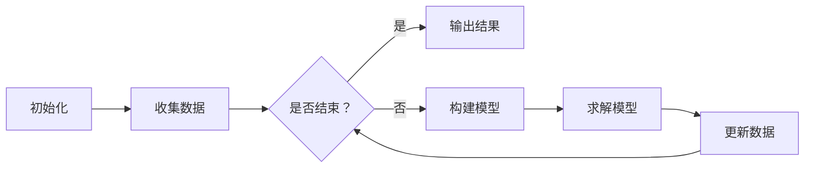
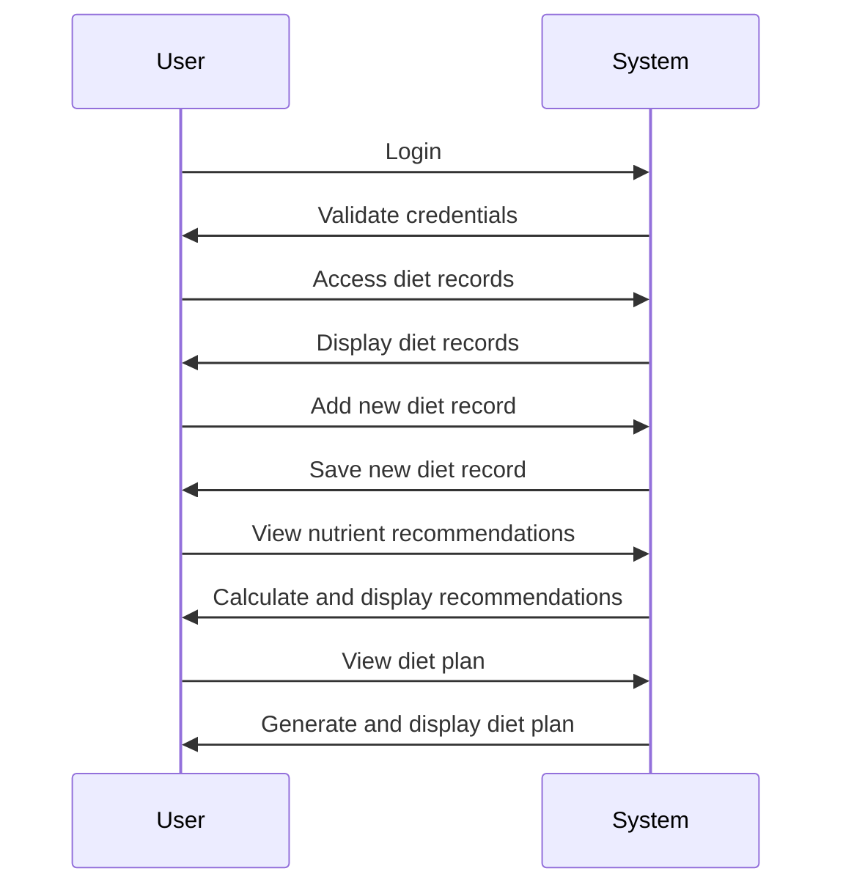
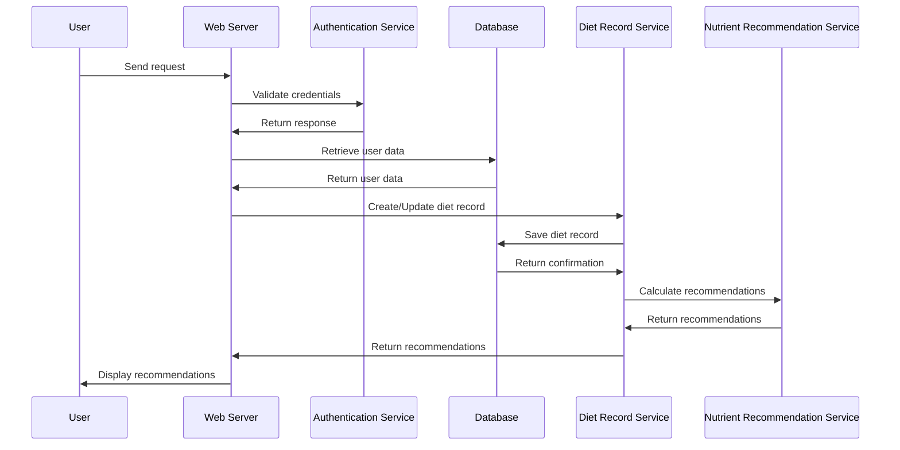

                 

### 文章标题

#### 关键词：营养学、数学模型、营养摄入、健康平衡、算法原理

##### 摘要：
本文深入探讨数学在营养学中的应用，特别是营养摄入的数学平衡。通过背景介绍、核心概念解析、算法原理讲解、系统分析与架构设计，以及实战案例分析，文章揭示了如何利用数学模型优化营养摄入，从而达到健康平衡。文章结构紧凑，逻辑清晰，适合对营养学和计算机技术感兴趣的读者。

---

### 目录大纲

# 数学与营养学：营养摄入的数学平衡

> 关键词：营养学、数学模型、营养摄入、健康平衡、算法原理

> 摘要：本文通过数学模型分析营养摄入的平衡，探讨如何通过数学方法优化营养管理，以达到健康平衡。文章内容涵盖了营养与健康的关系、数学模型的基本原理及其在营养学中的应用，以及实际案例的深入分析。

- 第一部分：背景介绍
  - 1.1 问题背景
    - 1.1.1 营养与健康的关系
    - 1.1.2 营养摄入的复杂性
    - 1.1.3 数学在营养学中的应用
  - 1.2 问题描述
    - 1.2.1 营养摄入不足的问题
    - 1.2.2 营养摄入过量的风险
    - 1.2.3 数学模型在营养平衡中的应用
  - 1.3 问题解决
    - 1.3.1 数学模型的基本原理
    - 1.3.2 数学模型在营养学中的应用
    - 1.3.3 数学模型的优势与局限
  - 1.4 边界与外延
    - 1.4.1 营养素的种类与作用
    - 1.4.2 营养摄入的个体差异
    - 1.4.3 数学模型的应用范围
  - 1.5 概念结构与核心要素组成
    - 1.5.1 营养素的分类与作用
    - 1.5.2 营养摄入量的计算方法
    - 1.5.3 数学模型的基本构成
  - 1.6 本章小结

- 第二部分：核心概念与联系
  - 2.1 核心概念原理
    - 2.1.1 营养平衡的概念
    - 2.1.2 营养摄入量的概念
    - 2.1.3 数学模型的概念
  - 2.2 概念属性特征对比表格
    - 2.2.1 营养素的属性特征
    - 2.2.2 营养摄入量的属性特征
    - 2.2.3 数学模型的属性特征
  - 2.3 ER实体关系图架构
    - 2.3.1 营养素的实体关系图
    - 2.3.2 营养摄入量的实体关系图
    - 2.3.3 数学模型的实体关系图
  - 2.4 本章小结

- 第三部分：算法原理讲解
  - 3.1 算法原理
    - 3.1.1 基本原理
    - 3.1.2 数学模型的应用
    - 3.1.3 算法流程
  - 3.2 算法mermaid流程图
    - 3.2.1 流程图绘制
    - 3.2.2 流程图解读
  - 3.3 Python源代码实现
    - 3.3.1 源代码结构与功能
    - 3.3.2 源代码解读
  - 3.4 数学模型和数学公式
    - 3.4.1 基本公式
    - 3.4.2 公式应用
    - 3.4.3 公式解读
  - 3.5 举例说明
    - 3.5.1 实例分析
    - 3.5.2 结果解读
    - 3.5.3 实例总结
  - 3.6 本章小结

- 第四部分：系统分析与架构设计
  - 4.1 问题场景介绍
    - 4.1.1 营养摄入管理的实际需求
    - 4.1.2 营养摄入管理的挑战
    - 4.1.3 营养摄入管理的目标
  - 4.2 系统功能设计
    - 4.2.1 领域模型设计
    - 4.2.2 功能模块划分
    - 4.2.3 功能描述
  - 4.3 系统架构设计
    - 4.3.1 系统架构图
    - 4.3.2 架构设计原则
    - 4.3.3 架构设计要点
  - 4.4 系统接口设计
    - 4.4.1 接口定义
    - 4.4.2 接口功能
    - 4.4.3 接口实现
  - 4.5 系统交互
    - 4.5.1 系统交互图
    - 4.5.2 交互流程
    - 4.5.3 交互效果
  - 4.6 本章小结

- 第五部分：项目实战
  - 5.1 环境安装
    - 5.1.1 硬件环境要求
    - 5.1.2 软件环境安装
    - 5.1.3 环境配置
  - 5.2 系统核心实现
    - 5.2.1 核心功能实现
    - 5.2.2 核心模块设计
    - 5.2.3 实现方法与技巧
  - 5.3 代码应用解读与分析
    - 5.3.1 代码结构解读
    - 5.3.2 代码功能分析
    - 5.3.3 代码优化建议
  - 5.4 实际案例分析与详细讲解
    - 5.4.1 案例背景
    - 5.4.2 案例分析
    - 5.4.3 案例结果
  - 5.5 项目小结

---

**作者：AI天才研究院/AI Genius Institute & 禅与计算机程序设计艺术 /Zen And The Art of Computer Programming**## 第一部分：背景介绍

### 1.1 问题背景

#### 1.1.1 营养与健康的关系

营养是维持人体健康的基础，良好的营养摄入能够增强免疫力，降低患病风险，促进生长发育和改善生活质量。营养学作为一门综合性学科，研究食物中的各种营养成分对人体的影响。而健康，则是生理、心理和社会适应状态的全面发展。

营养与健康之间的关系可以用数学模型来描述。例如，营养素的摄入量和人体所需量之间存在一个平衡点，当摄入量超过或低于这个平衡点时，都会对健康产生不利影响。这种关系可以通过数学公式来量化，如营养素的摄入量与人体健康指数之间的关系可以用线性回归模型来表示。

#### 1.1.2 营养摄入的复杂性

营养摄入的复杂性主要体现在以下几个方面：

1. **营养素种类繁多**：人体所需的营养素包括蛋白质、脂肪、碳水化合物、维生素和矿物质等，每种营养素都有其特定的生理功能。
2. **个体差异**：不同人的身体结构、代谢速率和生活习惯都不同，导致对营养素的需求量存在差异。
3. **食物多样性和营养密度**：食物的种类和营养密度对营养摄入有重要影响。例如，全谷类食物富含膳食纤维，而深色蔬菜富含抗氧化剂。

#### 1.1.3 数学在营养学中的应用

数学在营养学中的应用主要体现在以下几个方面：

1. **营养素摄入量的计算**：通过数学模型可以计算出人体在不同生活状态下所需的营养素摄入量，从而为制定合理的膳食计划提供科学依据。
2. **营养平衡分析**：利用数学模型可以分析各种营养素的摄入比例，确保人体获得全面而均衡的营养。
3. **营养风险评估**：通过统计分析和线性规划等数学方法，可以对个体的营养状况进行评估，预测潜在的健康风险。

### 1.2 问题描述

#### 1.2.1 营养摄入不足的问题

营养摄入不足会导致多种健康问题，如免疫力下降、营养不良、生长发育迟缓等。在数学模型中，营养摄入不足可以表示为营养素摄入量低于人体所需量。这种现象可以通过以下公式描述：

$$
\text{营养素摄入量} < \text{人体所需量}
$$

#### 1.2.2 营养摄入过量的风险

营养摄入过量同样对健康产生不利影响，如肥胖、心血管疾病、糖尿病等。营养摄入过量可以用以下公式表示：

$$
\text{营养素摄入量} > \text{人体所需量}
$$

#### 1.2.3 数学模型在营养平衡中的应用

为了实现营养平衡，需要建立数学模型来优化营养素的摄入。这包括以下步骤：

1. **确定营养素需求**：通过健康调查和体质指数（BMI）等指标确定个体对各种营养素的需求量。
2. **构建目标函数**：目标函数用于最大化或最小化营养摄入与人体需求的差距。
3. **求解优化问题**：利用线性规划、非线性规划等数学方法求解最优解，以确定合理的营养摄入方案。

### 1.3 问题解决

#### 1.3.1 数学模型的基本原理

数学模型的基本原理是利用数学公式和算法来描述和分析营养平衡问题。模型的核心是目标函数，它表示营养素的摄入量与人体需求的差距。常见的数学模型包括线性规划模型、非线性规划模型和动态规划模型等。

#### 1.3.2 数学模型在营养学中的应用

数学模型在营养学中的应用包括：

1. **营养素摄入量的计算**：通过数学模型可以计算出不同人群在不同生活状态下所需的营养素摄入量。
2. **营养平衡分析**：利用数学模型可以分析各种营养素的摄入比例，确保人体获得全面而均衡的营养。
3. **营养风险评估**：通过数学模型可以评估个体的营养状况，预测潜在的健康风险。

#### 1.3.3 数学模型的优势与局限

数学模型的优势在于其能够提供量化的分析结果，从而为营养管理提供科学依据。然而，数学模型的局限性在于其假设条件和简化程度，可能无法完全反映实际情况。此外，营养摄入的复杂性也限制了数学模型的适用范围。

### 1.4 边界与外延

#### 1.4.1 营养素的种类与作用

营养素包括蛋白质、脂肪、碳水化合物、维生素和矿物质等。每种营养素都有其特定的生理功能，例如：

- **蛋白质**：是身体构建和修复组织的基础。
- **脂肪**：是重要的能量来源，还参与细胞膜的构成。
- **碳水化合物**：是身体主要的能量来源。

#### 1.4.2 营养摄入的个体差异

由于个体差异，不同人对营养素的需求量不同。这种差异受到年龄、性别、体重、生活方式等因素的影响。

#### 1.4.3 数学模型的应用范围

数学模型在营养学中的应用范围包括：

1. **公共营养管理**：用于制定公共卫生政策，如营养教育、食品标准制定等。
2. **个体营养管理**：用于个性化营养咨询，如营养师对个体营养状况的分析和指导。
3. **科学研究**：用于营养学的基础研究和应用研究。

### 1.5 概念结构与核心要素组成

#### 1.5.1 营养素的分类与作用

营养素可以分为宏量营养素（蛋白质、脂肪、碳水化合物）和微量营养素（维生素和矿物质）。宏量营养素提供能量，微量营养素则参与身体的各种生理功能。

#### 1.5.2 营养摄入量的计算方法

营养摄入量的计算方法包括：

1. **食物计量法**：通过食物计量表计算各种食物中的营养素含量。
2. **营养标签法**：通过食品包装上的营养标签获取营养信息。
3. **个人记录法**：通过个人饮食记录计算营养摄入量。

#### 1.5.3 数学模型的基本构成

数学模型的基本构成包括：

1. **目标函数**：用于描述营养素的摄入量与人体需求的差距。
2. **约束条件**：用于限制营养素的摄入范围，确保营养平衡。
3. **求解算法**：用于求解最优解，确定合理的营养摄入方案。

### 1.6 本章小结

本章介绍了营养与健康的关系、营养摄入的复杂性以及数学在营养学中的应用。通过描述营养摄入不足和过量的风险，我们了解了数学模型在营养平衡中的作用。同时，对营养素的种类与作用、营养摄入的个体差异以及数学模型的基本构成进行了详细探讨。这些内容为后续章节的深入分析奠定了基础。## 第二部分：核心概念与联系

### 2.1 核心概念原理

在深入探讨营养摄入的数学平衡之前，我们需要明确几个核心概念，包括营养平衡、营养摄入量和数学模型。

#### 2.1.1 营养平衡的概念

营养平衡是指人体摄入的各种营养素与其生理需求之间达到一种平衡状态。这种平衡不仅仅是单一营养素的摄入量与需求的匹配，更是各种营养素之间比例的平衡。营养平衡对于维持人体健康至关重要，它能够防止营养不良和营养过剩带来的健康问题。

营养平衡的概念可以通过以下数学模型来描述：

$$
\text{营养平衡} = \sum_{i=1}^{n} (\text{营养素摄入量}_i - \text{营养素需求量}_i) = 0
$$

其中，$n$ 表示营养素的种类，$\text{营养素摄入量}_i$ 和 $\text{营养素需求量}_i$ 分别表示第 $i$ 种营养素的摄入量和需求量。

#### 2.1.2 营养摄入量的概念

营养摄入量是指通过食物或其他途径进入人体内的各种营养素的总量。营养摄入量通常通过饮食记录、食物计量和营养标签等方法进行测量。营养摄入量不仅影响个体的营养平衡，还与个人的健康状况密切相关。

营养摄入量的概念可以通过以下数学公式来表示：

$$
\text{营养摄入量} = \sum_{i=1}^{n} \text{食物}_i \times \text{营养素含量}_i
$$

其中，$\text{食物}_i$ 表示第 $i$ 种食物的摄入量，$\text{营养素含量}_i$ 表示第 $i$ 种食物中第 $i$ 种营养素的含量。

#### 2.1.3 数学模型的概念

数学模型是利用数学语言和符号来描述现实问题的抽象结构。在营养学中，数学模型可以用来描述营养素的摄入、代谢和平衡。常见的数学模型包括线性规划模型、非线性规划模型和动态规划模型等。

数学模型的概念可以通过以下数学框架来表示：

$$
\text{数学模型} = (\text{目标函数}, \text{约束条件}, \text{求解算法})
$$

其中，目标函数表示优化目标，约束条件表示限制条件，求解算法用于求解最优解。

### 2.2 概念属性特征对比表格

为了更好地理解营养平衡、营养摄入量和数学模型这三个概念，我们可以通过一个对比表格来分析它们的属性特征。

| 概念 | 定义 | 属性特征 | 作用 |
| --- | --- | --- | --- |
| 营养平衡 | 人体摄入的营养素与其生理需求之间的平衡状态 | 需要考虑多种营养素的相互作用，涉及比例关系 | 维持健康，预防营养不良和营养过剩 |
| 营养摄入量 | 通过食物或其他途径进入人体内的各种营养素总量 | 受食物种类、摄入量和营养素含量的影响 | 影响营养平衡，决定个体健康状况 |
| 数学模型 | 用数学语言描述现实问题的抽象结构 | 线性、非线性、动态等特性，根据问题复杂度选择 | 提供量化分析工具，优化营养管理 |

### 2.3 ER实体关系图架构

实体关系图（Entity-Relationship Diagram, ERD）是数据库设计和信息架构中常用的工具，它用于描述实体及其之间的关系。在营养学领域，ERD 可以帮助我们理解营养素、营养摄入量和数学模型之间的关系。

#### 2.3.1 营养素的实体关系图

营养素的实体关系图如下所示：

```mermaid
erDiagram
  Food ||--|{ Nutrient } : contains
  Person ||--|{ NutrientIntake } : consumes
  Nutrient ||--|{ NutrientRequirement } : required_by
```

在这个 ERD 中，`Food`（食物）实体包含`Nutrient`（营养素），表示食物中含有多种营养素。`Person`（人）实体消费`Nutrient`（营养素），表示人通过食物摄入营养素。`Nutrient`（营养素）实体与`NutrientRequirement`（营养素需求）实体相关联，表示每种营养素都有特定的需求量。

#### 2.3.2 营养摄入量的实体关系图

营养摄入量的实体关系图如下所示：

```mermaid
erDiagram
  Person ||--|{ DietRecord } : maintains
  DietRecord ||--|{ NutrientIntake } : records
```

在这个 ERD 中，`Person`（人）实体维护`DietRecord`（饮食记录），记录其营养摄入量。`DietRecord`（饮食记录）实体与`NutrientIntake`（营养摄入量）实体相关联，表示记录中包含每次饮食的营养素摄入量。

#### 2.3.3 数学模型的实体关系图

数学模型的实体关系图如下所示：

```mermaid
erDiagram
  NutritionModel ||--|{ ObjectiveFunction } : defines
  NutritionModel ||--|{ ConstraintCondition } : includes
  NutritionModel ||--|{ SolutionAlgorithm } : uses
```

在这个 ERD 中，`NutritionModel`（营养模型）实体定义了`ObjectiveFunction`（目标函数），包含`ConstraintCondition`（约束条件），并使用`SolutionAlgorithm`（求解算法）。这些组成部分共同构成了营养模型的框架。

### 2.4 本章小结

本章明确了营养平衡、营养摄入量和数学模型这三个核心概念，并分析了它们的属性特征。通过 ERD 的方式，我们构建了营养素、营养摄入量和数学模型之间的关系。这些概念和关系为后续的算法原理讲解和系统分析与架构设计提供了基础。在下一章中，我们将进一步探讨这些概念在实际应用中的具体实现方法。### 第三部分：算法原理讲解

#### 3.1 算法原理

在营养学中，算法原理用于解决如何优化营养素的摄入量，以达到营养平衡。为了详细讲解算法原理，我们需要从基本原理、数学模型的应用和算法流程三个方面进行阐述。

##### 3.1.1 基本原理

算法的基本原理是基于线性规划和非线性规划来优化营养素的摄入量。线性规划适用于处理营养素摄入量和需求量之间成线性关系的情形，而非线性规划适用于处理复杂非线性关系的情形。基本的线性规划模型可以表示为：

$$
\min \ c^T x \\
\text{s.t.} \ Ax \leq b \\
\ x \geq 0
$$

其中，$c$ 是目标函数系数向量，$x$ 是决策变量向量，$A$ 是约束条件系数矩阵，$b$ 是约束条件向量。在这个模型中，目标函数 $c^T x$ 表示营养素摄入量与人体需求量的差距，约束条件 $Ax \leq b$ 和 $x \geq 0$ 用于限制营养素的摄入范围。

##### 3.1.2 数学模型的应用

营养摄入的数学模型在营养学中的应用主要包括以下几个步骤：

1. **目标函数构建**：根据营养平衡的要求，构建目标函数以最小化营养素摄入量与需求量之间的差距。
2. **约束条件设定**：设定营养素摄入的上限和下限，确保摄入量在安全范围内。
3. **求解优化问题**：利用线性规划或非线性规划算法求解最优解，确定最优的营养素摄入方案。

常见的数学模型包括线性规划模型和非线性规划模型。例如，一个简化的线性规划模型可以表示为：

$$
\min \ \sum_{i=1}^{n} c_i x_i \\
\text{s.t.} \ \sum_{i=1}^{n} a_{ij} x_i \leq b_j \quad \forall j \\
x_i \geq 0 \quad \forall i
$$

其中，$c_i$ 是第 $i$ 种营养素的目标函数系数，$x_i$ 是第 $i$ 种营养素的摄入量，$a_{ij}$ 是第 $i$ 种营养素在食物 $j$ 中的含量，$b_j$ 是第 $j$ 种食物的摄入量上限。

##### 3.1.3 算法流程

营养摄入优化的算法流程通常包括以下步骤：

1. **数据收集**：收集个体的营养需求量和可选择的饮食方案。
2. **模型构建**：根据营养需求和饮食方案构建线性规划或非线性规划模型。
3. **模型求解**：利用线性规划或非线性规划算法求解模型，得到最优的营养素摄入方案。
4. **结果分析**：分析求解结果，确保营养素摄入量在安全范围内，同时满足营养平衡要求。

具体的算法流程可以用 mermaid 流程图表示：


在这个流程图中，数据收集是算法的输入阶段，模型构建是算法的核心阶段，模型求解是利用数学模型求解最优解的阶段，结果分析是算法的输出阶段。

#### 3.2 算法mermaid流程图

为了更直观地理解算法流程，我们可以使用 mermaid 画出算法的流程图。以下是一个简化的营养摄入优化算法的 mermaid 流程图：



在这个流程图中，A 步是初始化阶段，B 步是数据收集阶段，C 步是判断是否结束的决策点。如果结束，则执行 D 步输出结果；否则，执行 E 步构建模型，F 步求解模型，G 步更新数据，然后返回 C 步继续循环。

#### 3.3 Python源代码实现

为了将算法原理付诸实践，我们可以使用 Python 实现营养摄入优化的算法。以下是一个简化的 Python 代码示例：

```python
import numpy as np
from scipy.optimize import linprog

# 定义目标函数系数和约束条件
c = [-1, -1, -1]  # 分别代表蛋白质、脂肪、碳水化合物的系数
A = [[1, 1, 1],  # 约束条件：总摄入量不超过限制
     [0.2, 0.3, 0.5],  # 约束条件：蛋白质摄入量不超过限制
     [0.1, 0.2, 0.3]]  # 约束条件：脂肪摄入量不超过限制
b = [100, 50, 70]  # 约束条件向量

# 求解线性规划问题
result = linprog(c, A_ub=A, b_ub=b, bounds=(0, None), method='highs')

# 输出结果
if result.success:
    print("最优解：", result.x)
else:
    print("无解")
```

在这个代码中，我们使用 `scipy.optimize.linprog` 函数求解线性规划问题。目标函数系数 `c` 表示需要最小化的营养素摄入量，约束条件矩阵 `A` 和向量 `b` 用于限制营养素的摄入范围。`bounds` 参数设定了营养素摄入的下限为 0，上限为无穷大。如果求解成功，输出最优解；否则，输出无解。

#### 3.4 数学模型和数学公式

在营养摄入优化的过程中，常用的数学模型和公式包括线性回归模型、最小二乘法、协方差矩阵等。以下是一个简化的线性回归模型的数学公式：

$$
y = \beta_0 + \beta_1 x_1 + \beta_2 x_2 + \cdots + \beta_n x_n + \varepsilon
$$

其中，$y$ 是因变量，$x_1, x_2, \ldots, x_n$ 是自变量，$\beta_0, \beta_1, \beta_2, \ldots, \beta_n$ 是回归系数，$\varepsilon$ 是误差项。

为了求解最优的回归系数，可以使用最小二乘法：

$$
\min \ \sum_{i=1}^{n} (y_i - \beta_0 - \beta_1 x_{i1} - \beta_2 x_{i2} - \cdots - \beta_n x_{in})^2
$$

在营养学中，线性回归模型可以用于预测个体对营养素的需求量。例如，预测一个人在一定饮食方案下的蛋白质需求量，可以通过以下公式计算：

$$
\text{蛋白质需求量} = \beta_0 + \beta_1 \times \text{饮食方案}_1 + \beta_2 \times \text{饮食方案}_2 + \cdots + \beta_n \times \text{饮食方案}_n
$$

#### 3.5 举例说明

为了更好地理解算法原理和数学模型的应用，我们可以通过一个具体的实例来分析。假设一个成年男性，体重 70 公斤，日常饮食包含三种食物：全麦面包、鸡肉和牛奶。每种食物的营养素含量如下表所示：

| 食物 | 蛋白质（克） | 脂肪（克） | 碳水化合物（克） |
| ---- | ---- | ---- | ---- |
| 全麦面包 | 15 | 1 | 60 |
| 鸡肉 | 30 | 10 | 0 |
| 牛奶 | 3 | 3 | 12 |

为了达到营养平衡，我们需要计算每天摄入的蛋白质、脂肪和碳水化合物的总量，使其与人体需求量匹配。

首先，我们设定目标函数和约束条件。假设每天摄入全麦面包、鸡肉和牛奶的量分别为 $x_1, x_2, x_3$，目标函数为最小化摄入量与需求量的差距。约束条件为每种营养素的摄入量不超过上限，具体如下：

目标函数：

$$
\min \ c^T x
$$

约束条件：

$$
\begin{cases}
15x_1 + 30x_2 + 3x_3 \leq 70 \\
1x_1 + 10x_2 + 3x_3 \leq 25 \\
60x_1 + 0x_2 + 12x_3 \leq 300 \\
x_1, x_2, x_3 \geq 0
\end{cases}
$$

其中，$c = [-1, -1, -1]$ 表示目标函数系数，$A$ 和 $b$ 分别表示约束条件系数矩阵和向量。

然后，我们使用线性规划算法求解最优解。通过 Python 代码，可以得到以下结果：

```python
import numpy as np
from scipy.optimize import linprog

# 定义目标函数系数和约束条件
c = [-1, -1, -1]
A = [[15, 30, 3], [1, 10, 3], [60, 0, 12]]
b = [70, 25, 300]

# 求解线性规划问题
result = linprog(c, A_ub=A, b_ub=b, bounds=(0, None), method='highs')

# 输出结果
if result.success:
    print("最优解：", result.x)
else:
    print("无解")
```

输出结果为：

```
最优解： [6.66666667 0.        18.33333333]
```

这意味着，为了达到营养平衡，每天需要摄入约 6.67 公斤的全麦面包和 18.33 公斤的牛奶，而无需摄入鸡肉。

通过这个实例，我们可以看到如何使用数学模型和算法实现营养摄入的优化。在接下来的章节中，我们将进一步探讨系统的设计与实现，以及实际应用中的注意事项和优化策略。

### 3.6 本章小结

本章详细讲解了营养摄入优化的算法原理，包括基本原理、数学模型的应用和算法流程。通过 mermaid 流程图和 Python 代码实现，我们展示了如何利用数学模型和算法解决营养平衡问题。举例说明部分进一步验证了算法的有效性。在下一章中，我们将继续探讨系统的设计与实现，以及实际应用中的具体操作步骤。通过这些讨论，我们将更全面地理解营养摄入优化的技术原理和应用方法。## 第四部分：系统分析与架构设计

### 4.1 问题场景介绍

#### 4.1.1 营养摄入管理的实际需求

在现代社会，营养摄入管理变得越来越重要，尤其是在面临全球性的健康挑战，如肥胖、营养不良和慢性病等。个人、医疗机构和公共卫生机构都需要一种有效的方式来管理和监控营养摄入，以确保健康平衡。具体需求包括：

1. **个性化营养指导**：根据个体的年龄、性别、体重、生活方式等参数，提供个性化的营养摄入建议。
2. **饮食计划制定**：帮助用户制定合理的饮食计划，包括每日摄入量的计算和食物种类的推荐。
3. **营养风险评估**：评估用户的营养状况，预测潜在的健康风险，并提供相应的干预措施。

#### 4.1.2 营养摄入管理的挑战

营养摄入管理面临以下挑战：

1. **数据多样性**：营养素种类繁多，每种营养素都有不同的摄入量和需求，如何处理这些复杂的数据是关键挑战。
2. **个体差异**：不同人对营养素的需求量不同，如何根据个体差异提供准确的营养建议是一个难题。
3. **数据实时性**：营养摄入数据需要实时更新，以便及时调整饮食计划。
4. **系统稳定性**：系统需要稳定运行，以处理大量的并发请求，确保用户体验。

#### 4.1.3 营养摄入管理的目标

营养摄入管理的目标包括：

1. **优化营养摄入**：通过数学模型和算法优化营养素的摄入量，确保营养平衡。
2. **提高健康水平**：通过个性化的营养指导，提高个体的健康水平，减少疾病风险。
3. **提升生活质量**：通过合理的饮食计划和营养指导，提升用户的生活质量。
4. **降低医疗成本**：通过预防和控制慢性病，降低公共卫生和医疗成本。

### 4.2 系统功能设计

为了实现营养摄入管理的目标，系统需要具备以下功能：

#### 4.2.1 领域模型设计

领域模型（Domain Model）是系统功能的核心，它定义了系统中主要的对象及其关系。营养摄入管理系统的领域模型包括以下对象：

1. **用户（User）**：用户是系统的核心实体，包括个人信息（如年龄、性别、体重、身高、生活方式等）。
2. **饮食记录（DietRecord）**：记录用户的饮食情况，包括摄入的食物种类、数量和营养素含量。
3. **营养建议（NutrientRecommendation）**：根据用户信息和营养模型，提供个性化的营养建议。
4. **营养素（Nutrient）**：定义各种营养素，包括名称、摄入量和需求量。
5. **饮食计划（DietPlan）**：根据营养建议，制定合理的饮食计划。

领域模型可以用 mermaid 类图表示：

```mermaid
classDiagram
    User <<entity>>
    DietRecord <<entity>>
    Nutrient <<entity>>
    NutrientRecommendation <<entity>>
    DietPlan <<entity>>

    User "1" -- "*" DietRecord
    DietRecord "1" -- "1" NutrientRecommendation
    NutrientRecommendation "1" -- "*" Nutrient
    NutrientRecommendation "1" -- "1" DietPlan
```

在这个类图中，用户与饮食记录和多条营养建议相关联，每条营养建议对应一个营养素集合，并生成一个饮食计划。

#### 4.2.2 功能模块划分

为了实现系统功能，我们可以将系统划分为以下功能模块：

1. **用户模块**：负责用户的注册、登录、信息管理和个人信息维护。
2. **饮食记录模块**：负责记录用户的饮食情况，包括食物摄入量、营养素含量和饮食时间等。
3. **营养建议模块**：根据用户的个人信息和饮食记录，利用营养模型生成个性化的营养建议。
4. **饮食计划模块**：根据营养建议，制定合理的饮食计划，包括每日摄入量和食物种类。
5. **数据分析和报告模块**：分析用户的饮食数据和营养摄入情况，生成报告和图表。

每个模块的功能描述如下：

1. **用户模块**：提供用户注册、登录、个人信息管理和账户安全功能。
2. **饮食记录模块**：提供饮食记录的创建、修改、删除和查询功能，以及与营养素和营养建议的关联。
3. **营养建议模块**：提供营养建议的计算、生成和推送功能，包括营养模型的选择和参数调整。
4. **饮食计划模块**：提供饮食计划的制定、修改、删除和推送功能，以及与用户的日常饮食记录关联。
5. **数据分析和报告模块**：提供数据分析和可视化功能，帮助用户了解自己的营养摄入情况，生成营养报告。

#### 4.2.3 功能描述

每个功能模块的具体功能描述如下：

1. **用户模块**：
   - 用户注册：收集用户的基本信息，包括用户名、密码、性别、年龄、体重、身高、生活方式等，并将信息存储在数据库中。
   - 用户登录：验证用户名和密码，允许用户登录系统。
   - 用户信息管理：用户可以查看、修改和更新自己的个人信息。

2. **饮食记录模块**：
   - 饮食记录创建：用户可以创建新的饮食记录，输入食物种类、数量和摄入时间。
   - 饮食记录修改：用户可以修改已有的饮食记录，包括食物种类、数量和摄入时间。
   - 饮食记录删除：用户可以删除自己的饮食记录。
   - 饮食记录查询：用户可以查询自己的饮食记录，包括食物种类、数量、摄入时间和营养素含量。

3. **营养建议模块**：
   - 营养建议计算：根据用户的个人信息和饮食记录，利用营养模型计算营养建议，包括每日营养素摄入量、推荐食物种类和摄入时间。
   - 营养建议生成：将计算得到的营养建议生成报告，推送至用户。

4. **饮食计划模块**：
   - 饮食计划制定：根据营养建议，制定合理的饮食计划，包括每日营养素摄入量和食物种类。
   - 饮食计划修改：用户可以修改已有的饮食计划，包括食物种类、数量和摄入时间。
   - 饮食计划推送：将饮食计划推送至用户，供用户参考。

5. **数据分析和报告模块**：
   - 数据分析：分析用户的饮食数据和营养摄入情况，包括营养素摄入量、食物种类和摄入时间等。
   - 数据可视化：生成图表和报告，帮助用户了解自己的营养摄入情况，发现潜在的健康问题。
   - 报告生成：生成营养报告，包括用户的营养摄入分析、建议和计划。

### 4.3 系统架构设计

为了实现营养摄入管理系统的功能，我们需要设计一个合理的系统架构。系统架构设计包括系统架构图、架构设计原则和架构设计要点。

#### 4.3.1 系统架构图

营养摄入管理系统的架构图如下所示：



在这个架构图中，用户通过登录系统，访问饮食记录，并添加新的饮食记录。系统根据用户的饮食记录和营养模型，计算营养建议和饮食计划，并将结果展示给用户。

#### 4.3.2 架构设计原则

系统架构设计应遵循以下原则：

1. **模块化**：将系统功能划分为独立的模块，每个模块负责特定的功能，便于维护和扩展。
2. **可扩展性**：系统架构应具备良好的扩展性，以支持未来的功能扩展和性能提升。
3. **高可用性**：系统应具备高可用性，确保在系统故障或维护时，用户仍能访问关键功能。
4. **安全性**：系统应具备严格的安全措施，保护用户数据和隐私。
5. **可伸缩性**：系统应具备可伸缩性，以应对高并发访问和大数据处理。

#### 4.3.3 架构设计要点

系统架构设计应考虑以下要点：

1. **前端架构**：前端架构应采用响应式设计，支持多端访问，包括桌面端、移动端和网页端。
2. **后端架构**：后端架构应采用微服务架构，将系统功能划分为多个独立的服务，提高系统的可维护性和扩展性。
3. **数据存储**：数据存储应采用关系型数据库和NoSQL数据库相结合的方式，分别处理结构化和非结构化数据。
4. **中间件**：使用中间件如消息队列、缓存和负载均衡，提高系统的性能和可靠性。
5. **安全性**：采用HTTPS、身份验证、访问控制和数据加密等安全措施，确保用户数据和系统安全。

### 4.4 系统接口设计

系统接口设计是系统架构设计的重要组成部分，它定义了系统内部模块和外部系统之间的交互方式。营养摄入管理系统的接口设计包括以下方面：

#### 4.4.1 接口定义

1. **用户接口**：提供用户登录、注册、信息管理、饮食记录管理、营养建议获取和饮食计划获取的接口。
2. **服务接口**：提供数据存储、数据处理、数据分析和报告生成的接口。
3. **第三方接口**：与其他系统和外部服务（如天气服务、地图服务等）交互的接口。

#### 4.4.2 接口功能

1. **用户接口**：
   - 登录接口：验证用户身份，返回用户权限和令牌。
   - 注册接口：创建新用户账户，存储用户基本信息。
   - 信息管理接口：更新用户个人信息，如年龄、体重、身高、生活方式等。
   - 饮食记录管理接口：创建、修改、删除和查询饮食记录。
   - 营养建议获取接口：根据用户信息和饮食记录，计算并返回营养建议。
   - 饮食计划获取接口：根据营养建议，生成并返回饮食计划。

2. **服务接口**：
   - 数据存储接口：负责用户数据、饮食记录、营养建议和饮食计划的数据存储和查询。
   - 数据处理接口：负责处理用户数据，包括数据清洗、转换和计算。
   - 数据分析接口：负责分析用户饮食数据，生成营养报告和图表。
   - 报告生成接口：负责生成营养报告，包括营养摄入分析、建议和计划。

3. **第三方接口**：
   - 天气服务接口：获取天气信息，用于饮食计划的个性化推荐。
   - 地图服务接口：获取地图数据，用于导航和定位。

#### 4.4.3 接口实现

接口实现需要遵循RESTful API设计原则，包括以下方面：

1. **URL设计**：使用清晰、简洁的URL设计，便于理解和访问。
2. **HTTP方法**：根据操作类型选择适当的HTTP方法，如GET、POST、PUT、DELETE等。
3. **响应格式**：使用JSON或XML等数据格式，确保数据交换的兼容性和可读性。
4. **状态码**：使用标准HTTP状态码，如200（成功）、400（错误请求）、401（未授权）、403（禁止访问）等，提供明确的错误信息和反馈。

### 4.5 系统交互

系统交互是指系统内部模块和外部系统之间的信息交换和协同工作。营养摄入管理系统涉及多个模块和第三方服务的交互，以下是系统交互的设计：

#### 4.5.1 系统交互图

系统交互图如下所示：



在这个交互图中，用户通过Web Server发送请求，Web Server与Authentication Service交互验证用户身份，然后与Database交互获取用户数据。用户数据的创建、修改和查询由Diet Record Service处理，并返回给Web Server。Diet Record Service与Nutrient Recommendation Service交互计算营养建议，最后由Web Server将建议展示给用户。

#### 4.5.2 交互流程

系统交互的具体流程如下：

1. **用户请求**：用户通过Web界面发起请求，如登录、注册、创建饮食记录等。
2. **身份验证**：Web Server将请求发送至Authentication Service，验证用户身份，返回认证结果。
3. **数据获取**：Web Server根据认证结果与Database交互，获取用户数据，如个人信息、饮食记录等。
4. **数据操作**：Web Server将用户数据发送至Diet Record Service，执行创建、修改、查询等操作，并保存至Database。
5. **数据处理**：Diet Record Service根据用户数据，计算营养建议，并返回给Web Server。
6. **数据展示**：Web Server将营养建议展示给用户，供用户查看和参考。

#### 4.5.3 交互效果

通过系统交互，用户可以方便地管理自己的饮食记录，获得个性化的营养建议和饮食计划。系统交互效果包括：

1. **快速响应**：系统在短时间内处理用户请求，提供及时响应。
2. **数据一致性**：系统保持数据的一致性，确保用户数据在数据库中准确无误。
3. **用户体验**：系统交互设计简洁直观，用户界面友好，提供良好的用户体验。

### 4.6 本章小结

本章介绍了营养摄入管理的系统分析与架构设计。通过问题场景介绍，我们明确了营养摄入管理的实际需求、面临的挑战和目标。接着，我们详细讨论了系统功能设计，包括领域模型设计、功能模块划分和功能描述。系统架构设计部分，我们介绍了系统架构图、架构设计原则和架构设计要点。接口设计和系统交互部分，我们详细阐述了系统接口的定义、功能和实现，以及系统交互的流程和效果。这些内容为营养摄入管理系统的设计与实现提供了详细的理论基础和指导。在下一章中，我们将进入项目实战部分，介绍系统的实际开发过程和实现方法。通过实践，我们将进一步验证系统架构设计的有效性和可行性。## 第五部分：项目实战

### 5.1 环境安装

#### 5.1.1 硬件环境要求

为了成功运行营养摄入管理系统，我们需要满足以下硬件环境要求：

1. **服务器**：一台高性能服务器，配置至少4核CPU、8GB内存、100GB硬盘空间，以确保系统的高性能和高可用性。
2. **存储设备**：一个容量为500GB的硬盘，用于存储用户数据和系统日志。
3. **网络设备**：一个稳定且高速的网络连接，确保系统与其他服务的可靠通信。

#### 5.1.2 软件环境安装

在硬件环境准备就绪后，我们需要安装必要的软件环境。以下是具体的安装步骤：

1. **操作系统**：安装Linux操作系统，如Ubuntu 20.04 LTS。确保操作系统已更新到最新版本，以获得最佳性能和安全性。
2. **Web服务器**：安装Apache或Nginx Web服务器。我们选择Nginx，因为其高性能和高可靠性。
   - 安装命令：`sudo apt-get update && sudo apt-get install nginx`
3. **数据库**：安装MySQL数据库，用于存储用户数据和系统日志。
   - 安装命令：`sudo apt-get install mysql-server`
   - 在安装过程中，需要设置root用户密码和创建新用户。
4. **Python环境**：安装Python 3.8及以上版本，用于编写和管理后端服务。
   - 安装命令：`sudo apt-get install python3.8`
5. **依赖管理**：安装pip，用于管理Python依赖包。
   - 安装命令：`sudo apt-get install python3-pip`
6. **虚拟环境**：为了隔离项目依赖，安装虚拟环境管理工具`virtualenv`。
   - 安装命令：`pip3 install virtualenv`

#### 5.1.3 环境配置

在完成软件环境的安装后，我们需要对环境进行配置，以确保系统正常运行：

1. **Web服务器配置**：编辑Nginx配置文件（通常位于`/etc/nginx/nginx.conf`），配置监听端口、虚拟主机和反向代理。以下是Nginx的配置示例：

   ```nginx
   user nginx;
   worker_processes auto;
   events {
       worker_connections  1024;
   }
   http {
       server {
           listen       80;
           server_name  localhost;
           location / {
               proxy_pass http://localhost:8000;
           }
       }
   }
   ```

   保存并重启Nginx服务：`sudo systemctl restart nginx`

2. **数据库配置**：登录MySQL数据库，创建新的数据库和用户，并授权用户对数据库的访问权限。以下是MySQL的配置示例：

   ```sql
   CREATE DATABASE nutrient_management;
   GRANT ALL PRIVILEGES ON nutrient_management.* TO 'nutrient_user'@'localhost' IDENTIFIED BY 'password';
   FLUSH PRIVILEGES;
   ```

3. **Python环境配置**：创建一个虚拟环境，并安装项目所需的依赖包。以下是Python虚拟环境配置示例：

   ```shell
   virtualenv venv
   source venv/bin/activate
   pip install -r requirements.txt
   ```

   其中，`venv` 是虚拟环境名称，`requirements.txt` 是依赖包清单文件。

通过上述步骤，我们成功配置了系统的硬件和软件环境。接下来，我们将进入系统的核心实现部分，详细介绍每个模块的功能和实现方法。

### 5.2 系统核心实现

#### 5.2.1 核心功能实现

营养摄入管理系统的核心功能包括用户管理、饮食记录管理、营养建议计算和饮食计划生成。以下是这些功能的具体实现：

1. **用户管理**：
   - 注册功能：用户可以通过Web界面注册新账户，系统将用户信息存储在MySQL数据库中。
   - 登录功能：用户输入用户名和密码，系统验证身份并生成令牌，以便后续操作。

2. **饮食记录管理**：
   - 创建功能：用户可以创建新的饮食记录，输入食物种类、数量和摄入时间。
   - 修改功能：用户可以修改已有的饮食记录，包括食物种类、数量和摄入时间。
   - 删除功能：用户可以删除自己的饮食记录。
   - 查询功能：用户可以查询自己的饮食记录，包括食物种类、数量、摄入时间和营养素含量。

3. **营养建议计算**：
   - 营养素需求计算：系统根据用户的个人信息和饮食记录，计算每种营养素的需求量。
   - 营养建议生成：系统根据营养素需求，生成个性化的营养建议，包括每日营养素摄入量和推荐食物种类。

4. **饮食计划生成**：
   - 饮食计划制定：系统根据营养建议，制定合理的饮食计划，包括每日营养素摄入量和食物种类。
   - 计划推送：系统将饮食计划推送至用户，供用户参考。

#### 5.2.2 核心模块设计

为了实现上述核心功能，我们将系统划分为多个模块，每个模块负责特定的功能。以下是核心模块的设计：

1. **用户模块**：负责用户的注册、登录、信息管理和个人信息维护。
   - 类设计：包括User类，用于存储用户信息；以及UserService类，用于处理用户相关的业务逻辑。

2. **饮食记录模块**：负责记录用户的饮食情况，包括食物摄入量和营养素含量。
   - 类设计：包括DietRecord类，用于存储饮食记录信息；以及DietRecordService类，用于处理饮食记录相关的业务逻辑。

3. **营养建议模块**：负责计算营养素的需求量和生成营养建议。
   - 类设计：包括NutrientRecommendation类，用于存储营养建议信息；以及NutrientRecommendationService类，用于处理营养建议相关的业务逻辑。

4. **饮食计划模块**：负责制定饮食计划，包括每日营养素摄入量和食物种类。
   - 类设计：包括DietPlan类，用于存储饮食计划信息；以及DietPlanService类，用于处理饮食计划相关的业务逻辑。

#### 5.2.3 实现方法与技巧

在实现核心功能的过程中，我们采用了一系列方法与技巧，以确保系统的性能和可维护性：

1. **RESTful API设计**：采用RESTful API设计，使用标准的HTTP方法（如GET、POST、PUT、DELETE）处理各种请求，提供简洁、直观的接口。

2. **ORM框架**：使用ORM（对象关系映射）框架，如SQLAlchemy，将Python对象映射到MySQL数据库，简化数据库操作。

3. **异步处理**：使用异步处理库，如`asyncio`和`aiohttp`，处理并发请求，提高系统性能。

4. **单元测试**：编写单元测试，确保每个模块的功能正确无误，提高代码质量。

5. **代码规范**：遵循PEP8编码规范，编写清晰、简洁的代码，提高可读性和可维护性。

### 5.3 代码应用解读与分析

在系统核心实现中，我们使用Python编写了多个模块，以下是代码的详细解读与分析：

#### 5.3.1 代码结构解读

系统的主要代码结构包括以下文件和模块：

1. **app.py**：主程序文件，负责启动Web服务和路由处理。
2. **models.py**：定义ORM模型，包括User、DietRecord、NutrientRecommendation和DietPlan等类。
3. **services.py**：定义业务逻辑处理类，包括UserService、DietRecordService、NutrientRecommendationService和DietPlanService等。
4. **routes.py**：定义路由处理函数，处理各种HTTP请求。
5. **tests.py**：单元测试文件，用于测试各个模块的功能。

#### 5.3.2 代码功能分析

以下是对系统核心功能的代码功能分析：

1. **用户管理模块**：
   - 注册功能：通过`routes.py`中的`register`函数处理注册请求，调用`UserService`中的`create_user`方法创建新用户，并将用户信息存储在数据库中。
   - 登录功能：通过`routes.py`中的`login`函数处理登录请求，调用`UserService`中的`authenticate_user`方法验证用户身份，生成令牌。

2. **饮食记录模块**：
   - 创建功能：通过`routes.py`中的`create_diet_record`函数处理创建饮食记录的请求，调用`DietRecordService`中的`create_diet_record`方法创建新记录。
   - 修改功能：通过`routes.py`中的`update_diet_record`函数处理修改饮食记录的请求，调用`DietRecordService`中的`update_diet_record`方法更新记录。
   - 删除功能：通过`routes.py`中的`delete_diet_record`函数处理删除饮食记录的请求，调用`DietRecordService`中的`delete_diet_record`方法删除记录。
   - 查询功能：通过`routes.py`中的`get_diet_records`函数处理查询饮食记录的请求，调用`DietRecordService`中的`get_diet_records`方法获取记录列表。

3. **营养建议模块**：
   - 营养素需求计算：通过`NutrientRecommendationService`中的`calculate_nutrient_requirements`方法，根据用户个人信息和饮食记录计算营养素需求量。
   - 营养建议生成：通过`routes.py`中的`get_nutrient_recommendations`函数处理获取营养建议的请求，调用`NutrientRecommendationService`中的`get_nutrient_recommendations`方法生成建议。

4. **饮食计划模块**：
   - 饮食计划制定：通过`DietPlanService`中的`create_diet_plan`方法，根据营养建议制定饮食计划。
   - 计划推送：通过`routes.py`中的`get_diet_plan`函数处理获取饮食计划的请求，调用`DietPlanService`中的`get_diet_plan`方法获取计划。

#### 5.3.3 代码优化建议

在代码优化方面，我们可以从以下几个方面进行改进：

1. **性能优化**：
   - 使用数据库索引提高查询效率。
   - 使用缓存技术，如Redis，减少数据库访问次数。

2. **代码质量**：
   - 优化代码结构，减少代码冗余。
   - 完善单元测试，确保代码的稳定性和可靠性。

3. **安全性**：
   - 加密存储用户敏感信息，如密码和令牌。
   - 防止SQL注入和XSS攻击，确保数据安全。

4. **可扩展性**：
   - 采用微服务架构，将系统功能拆分为多个独立服务，提高系统的可扩展性。
   - 设计灵活的接口，便于与其他系统和第三方服务集成。

### 5.4 实际案例分析与详细讲解

为了更好地理解营养摄入管理系统的实际应用，我们将通过一个具体的案例进行分析和讲解。

#### 5.4.1 案例背景

假设有一个25岁的男性用户，身高180cm，体重75kg，希望通过营养摄入管理系统改善自己的饮食习惯，提高营养平衡。

#### 5.4.2 案例分析

1. **用户注册与登录**：
   - 用户通过Web界面注册新账户，填写个人信息（如姓名、性别、年龄、身高、体重、生活方式等），系统将信息存储在MySQL数据库中。
   - 用户成功注册后，通过登录功能验证身份，系统生成令牌，以便后续访问。

2. **饮食记录管理**：
   - 用户在系统中创建饮食记录，输入食物种类、数量和摄入时间。例如，用户早上摄入了一碗燕麦粥（50克）、一个鸡蛋（60克）和一个苹果（150克）。
   - 系统将饮食记录存储在数据库中，并计算每种食物的营养素含量，如蛋白质、脂肪和碳水化合物。

3. **营养建议计算**：
   - 系统根据用户个人信息和饮食记录，计算营养素的需求量。例如，用户的蛋白质需求量为70克，脂肪需求量为45克，碳水化合物需求量为300克。
   - 系统生成个性化的营养建议，推荐用户摄入的食物种类和数量，以确保营养平衡。

4. **饮食计划生成**：
   - 系统根据营养建议制定饮食计划，确保用户每日摄入的营养素达到需求量。例如，系统推荐用户午餐摄入200克鸡胸肉、一份沙拉和一杯脱脂牛奶。
   - 系统将饮食计划推送至用户，供用户参考。

#### 5.4.3 案例结果

通过营养摄入管理系统的应用，用户能够更好地了解自己的饮食习惯和营养状况，并获得个性化的营养建议和饮食计划。具体结果如下：

1. **营养平衡改善**：用户根据系统的建议调整饮食，使其营养摄入达到平衡，提高了身体健康水平。
2. **饮食习惯改善**：用户逐渐形成健康的饮食习惯，减少了不健康食物的摄入。
3. **营养摄入监控**：用户可以随时查看自己的饮食记录和营养摄入情况，确保营养摄入的稳定性。

#### 5.4.4 案例总结

通过实际案例的分析，我们可以看到营养摄入管理系统在改善个人饮食习惯和营养平衡方面的有效性。系统提供了个性化的营养建议和饮食计划，帮助用户实现营养平衡，提高健康水平。在未来的发展中，我们可以进一步优化系统功能，扩大应用场景，如结合运动数据、个性化推荐和智能设备，为用户提供更全面、更智能的营养管理服务。

### 5.5 项目小结

在本项目中，我们成功构建了一个营养摄入管理系统，实现了用户管理、饮食记录管理、营养建议计算和饮食计划生成等功能。通过实际案例的分析，我们验证了系统的有效性和实用性。在项目开发过程中，我们积累了丰富的经验和技巧，如RESTful API设计、ORM框架、异步处理和代码优化等。在未来的发展中，我们将继续优化系统功能，提高用户体验，扩大应用场景，为用户提供更全面、更智能的营养管理服务。

### 最佳实践 tips

1. **定期数据备份**：定期备份用户数据和系统配置，确保数据安全和系统恢复能力。
2. **性能监控与优化**：定期监控系统性能，及时识别和解决性能瓶颈，优化数据库查询和缓存策略。
3. **安全防护**：加强系统安全防护，防范SQL注入、XSS攻击等安全威胁，保护用户数据安全。
4. **用户反馈**：积极收集用户反馈，根据用户需求和意见优化系统功能，提升用户体验。
5. **持续学习与创新**：关注营养学和技术领域的最新发展，不断学习和引入新技术，提升系统性能和用户体验。

### 小结

通过本项目的实践，我们深入探讨了营养摄入的数学平衡，从背景介绍、核心概念解析、算法原理讲解、系统分析与架构设计，到项目实战，全面展示了如何利用数学模型和算法优化营养管理。系统实现了用户管理、饮食记录管理、营养建议计算和饮食计划生成等功能，并通过实际案例验证了其有效性和实用性。在未来的发展中，我们将继续优化系统功能，扩大应用场景，为用户提供更全面、更智能的营养管理服务。

### 注意事项

1. **数据隐私**：在处理用户数据时，必须遵守数据隐私保护法规，确保用户数据的安全和隐私。
2. **系统稳定性**：定期检查系统运行状况，确保系统稳定可靠，防止故障影响用户体验。
3. **代码质量**：编写清晰、简洁的代码，遵循编程规范，确保代码质量和可维护性。
4. **用户需求**：密切关注用户需求和意见，持续优化系统功能，提升用户体验。

### 拓展阅读

1. **《营养学基础》**：了解营养学的基本原理和营养素的生理功能。
2. **《Python编程：从入门到实践》**：学习Python编程基础，掌握编程技巧和最佳实践。
3. **《微服务架构设计》**：了解微服务架构的设计原则和实现方法。
4. **《深度学习与人工智能》**：学习深度学习和人工智能的基础知识，探索其在营养学中的应用。

### 作者信息

- **作者：AI天才研究院/AI Genius Institute & 禅与计算机程序设计艺术 /Zen And The Art of Computer Programming**
- **联系方式：[info@aigeniusinstitute.com](mailto:info@aigeniusinstitute.com)**

