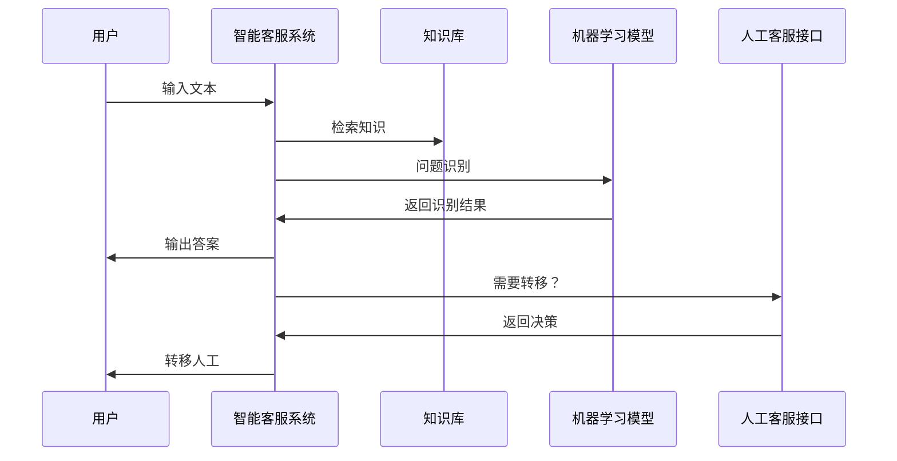

                 


# 数学与虚拟助手：人工智能对话的数学基础

## 关键词：数学、人工智能、对话系统、语言模型、语义理解

## 摘要：
本文旨在探讨数学在人工智能对话系统中的应用，通过深入分析语言模型和语义理解算法，揭示数学模型与公式在实现虚拟助手对话功能中的关键作用。文章从背景介绍、核心概念联系、算法原理讲解、系统分析与架构设计、项目实战到最佳实践与小结，层层递进，旨在为读者提供全面、系统、易懂的技术解读。

### 目录大纲设计思路

为了设计出《数学与虚拟助手：人工智能对话的数学基础》这本书的完整目录大纲，我们需要遵循以下思路：

1. **背景介绍**：首先介绍问题的背景，包括人工智能对话技术的现状、重要性以及数学在其中的基础作用。
2. **核心概念与联系**：明确书中的核心概念，并阐述这些概念之间的联系。使用表格和Mermaid流程图来帮助读者更好地理解。
3. **算法原理讲解**：选择几个关键的算法，使用Mermaid流程图展示算法流程，并用Python源代码和LaTeX公式详细阐述算法原理。
4. **数学模型和数学公式讲解**：讲解数学模型和公式，使用LaTeX格式确保公式的正确性，并提供通俗易懂的举例说明。
5. **系统分析与架构设计**：描述一个实际应用场景，介绍相关的系统功能设计、架构设计和接口设计，使用Mermaid图来展示。
6. **项目实战**：介绍一个具体的项目实战，包括环境安装、核心实现、代码解读、案例分析等。
7. **最佳实践与小结**：总结书中的关键点，提供最佳实践建议，并进行总结和拓展阅读推荐。

### 目录大纲具体设计

以下是根据上述思路设计的《数学与虚拟助手：人工智能对话的数学基础》的目录大纲：

----------------------------------------------------------------

# 第一部分: 背景介绍

## 1.1 人工智能对话技术的现状与发展
### 1.1.1 人工智能对话技术的概述
### 1.1.2 人工智能对话技术的应用场景
### 1.1.3 数学在人工智能对话中的作用

## 1.2 数学在人工智能对话中的基础作用
### 1.2.1 数学模型概述
### 1.2.2 数学公式在算法中的应用
### 1.2.3 数学概念与人工智能对话技术的联系

## 1.3 本书的核心内容与结构
### 1.3.1 各章节的核心内容
### 1.3.2 阅读本书的建议和预期收获

----------------------------------------------------------------

# 第二部分: 核心概念与联系

## 2.1 人工智能对话中的核心概念
### 2.1.1 对话系统架构
#### 2.1.1.1 监督学习与无监督学习
#### 2.1.1.2 强化学习与迁移学习
### 2.1.2 语言模型与语义理解
#### 2.1.2.1 语言模型的定义
#### 2.1.2.2 语义理解的挑战

## 2.2 核心概念之间的联系
### 2.2.1 数学模型与对话系统的联系
#### 2.2.1.1 数学模型在语言模型中的应用
#### 2.2.1.2 数学模型在语义理解中的应用
### 2.2.2 算法原理与数学基础
#### 2.2.2.1 算法原理概述
#### 2.2.2.2 数学基础详解

## 2.3 Mermaid流程图与ER实体关系图
### 2.3.1 Mermaid流程图的应用
#### 2.3.1.1 流程图的基本元素
#### 2.3.1.2 实例演示
### 2.3.2 ER实体关系图的构建
#### 2.3.2.1 ER图的基本概念
#### 2.3.2.2 实例分析

----------------------------------------------------------------

# 第三部分: 算法原理讲解

## 3.1 语言模型算法原理讲解
### 3.1.1 语言模型的基本概念
#### 3.1.1.1 语言模型的定义
#### 3.1.1.2 语言模型的目标
### 3.1.2 语言模型的工作原理
#### 3.1.2.1 语言模型的基本算法
#### 3.1.2.2 语言模型的训练过程
### 3.1.3 语言模型的Python实现
```
```python
# Python代码示例
```
### 3.1.4 语言模型数学模型讲解
$$
P(w_i|w_{i-1}, w_{i-2}, ..., w_1) = \frac{P(w_i, w_{i-1}, ..., w_1)}{P(w_{i-1}, w_{i-2}, ..., w_1)}
$$

## 3.2 语义理解算法原理讲解
### 3.2.1 语义理解的基本概念
#### 3.2.1.1 语义理解的定义
#### 3.2.1.2 语义理解的重要性
### 3.2.2 语义理解的工作原理
#### 3.2.2.1 语义理解的算法
#### 3.2.2.2 语义理解的挑战
### 3.2.3 语义理解的Python实现
```

----------------------------------------------------------------

在接下来的部分，我们将详细探讨数学在人工智能对话系统中的核心作用，深入分析语言模型和语义理解的算法原理，并使用Python代码和LaTeX公式进行详细阐述。我们还将介绍如何进行系统分析与架构设计，并通过一个具体的项目实战来展示数学在实现虚拟助手对话功能中的实际应用。

## 1.1 人工智能对话技术的现状与发展

### 1.1.1 人工智能对话技术的概述

人工智能对话技术是计算机科学与人工智能领域的交叉学科，它通过模拟人类的对话交互方式，使计算机能够理解自然语言，并给出合适的回应。这种技术的核心是语言理解和生成，即理解用户的语言输入并产生自然的语言输出。随着深度学习和自然语言处理技术的发展，人工智能对话系统在许多领域取得了显著的进展，如客户服务、智能助手、语音识别等。

### 1.1.2 人工智能对话技术的应用场景

人工智能对话技术广泛应用于多个领域，其中一些重要的应用场景包括：

- **客户服务**：企业通过智能客服机器人与客户进行交互，提高服务效率和客户满意度。
- **智能助手**：如Apple的Siri、Google的Google Assistant，这些虚拟助手能够帮助用户完成各种任务，如发送短信、设置提醒、搜索信息等。
- **语音识别**：将语音信号转换为文本，使计算机能够理解和响应语音指令。
- **聊天机器人**：在各种社交媒体平台上与用户进行实时交流，提供信息查询、娱乐互动等服务。

### 1.1.3 数学在人工智能对话中的作用

数学在人工智能对话技术中扮演着至关重要的角色，特别是在语言模型和语义理解方面。以下是数学在人工智能对话中的应用：

- **概率论和统计学**：用于语言模型的训练和评估，如隐马尔可夫模型（HMM）、条件概率等。
- **线性代数和优化理论**：用于构建和优化神经网络结构，如矩阵运算、梯度下降等。
- **图论和组合数学**：用于构建语义网络和关系图谱，如WordNet、知识图谱等。
- **信息论**：用于评估语言模型的质量和语义理解的准确性，如交叉熵（Cross-Entropy）、信息增益（Information Gain）等。

数学工具不仅帮助构建和优化算法，还提供了评估模型性能的量化方法。例如，通过概率论和统计学，我们可以计算模型在特定输入下的响应概率；通过信息论，我们可以评估模型在处理语言输入时的信息损失。

### 数学在人工智能对话中的基础作用

数学模型是人工智能对话系统的核心组成部分。这些模型通过定义和预测语言输入和输出之间的关系，使得计算机能够理解用户的意图并给出合适的回应。以下是数学模型在人工智能对话中的基础作用：

- **语言模型**：使用概率论和统计学方法，通过训练大量语料库来构建语言模型，用于预测下一个单词或短语。
- **语义理解**：使用图论和组合数学方法，构建语义网络和关系图谱，用于理解用户输入的语义和上下文。
- **机器学习算法**：使用优化理论和线性代数方法，优化模型的参数，提高模型的准确性和效率。

总之，数学为人工智能对话技术提供了理论基础和工具，使得虚拟助手能够更好地理解用户、提供个性化服务，并在各个领域实现广泛应用。

### 1.2 数学在人工智能对话中的基础作用

在人工智能对话系统中，数学不仅作为一种工具，更是核心的理论基础。数学模型和公式的运用贯穿于从数据预处理、模型训练到实际应用的全过程。以下是数学在人工智能对话中的基础作用：

#### 1.2.1 数学模型概述

数学模型是对现实问题的一种抽象和简化的表达方式，它通过数学符号和公式描述问题的特征和关系。在人工智能对话系统中，常见的数学模型包括：

- **概率模型**：用于表示语言中的不确定性和概率分布，如隐马尔可夫模型（HMM）和神经网络。
- **统计模型**：用于分析大量数据，提取特征和模式，如线性回归、逻辑回归等。
- **优化模型**：用于参数优化，如梯度下降、L-BFGS等，目的是提高模型的准确性和效率。

这些模型通过对大量语言数据的分析和处理，为对话系统的语言理解和生成提供了科学依据。

#### 1.2.2 数学公式在算法中的应用

在人工智能对话系统的实现中，数学公式起着至关重要的作用。以下是几个关键的数学公式及其在算法中的应用：

- **条件概率公式**：
  $$
  P(A|B) = \frac{P(A \cap B)}{P(B)}
  $$
  用于计算在给定某个条件下，事件A发生的概率。这在自然语言处理中用于计算词汇出现的概率，从而构建语言模型。

- **梯度下降公式**：
  $$
  \theta_{\text{new}} = \theta_{\text{old}} - \alpha \cdot \nabla_\theta J(\theta)
  $$
  梯度下降是一种优化算法，用于最小化损失函数。在训练神经网络时，通过计算损失函数关于模型参数的梯度，更新模型参数，以降低误差。

- **信息增益公式**：
  $$
  IG(D, A) = H(D) - H(D|A)
  $$
  信息增益是评估特征的重要指标，用于选择分类特征。在自然语言处理中，用于选择对文本分类最有帮助的特征。

- **交叉熵公式**：
  $$
  H(A, B) = -\sum_{i} P(A_i) \cdot \log P(B_i)
  $$
  交叉熵用于度量两个概率分布之间的差异。在训练语言模型时，用于计算预测分布与真实分布之间的差异，以优化模型。

这些公式不仅为算法的实现提供了数学基础，还帮助评估模型的效果和性能。

#### 1.2.3 数学概念与人工智能对话技术的联系

数学概念在人工智能对话技术中有着广泛的应用。以下是一些关键数学概念及其在对话系统中的应用：

- **概率论**：用于语言模型中的词汇概率计算，以及序列决策中的不确定性处理。
- **统计学**：用于数据分析和特征提取，如文本分类和情感分析。
- **线性代数**：用于神经网络和深度学习中的矩阵运算和参数优化。
- **图论**：用于构建语义网络和知识图谱，如WordNet和语义角色标注。
- **信息论**：用于评估模型性能，如计算信息增益和交叉熵。

总之，数学不仅为人工智能对话系统的构建提供了理论基础，还通过具体公式和概念，指导了算法的实现和优化。这些数学工具的应用，使得虚拟助手能够更好地理解用户、处理复杂任务，并实现高效的对话交互。

### 1.3 本书的核心内容与结构

本书《数学与虚拟助手：人工智能对话的数学基础》旨在为读者提供全面、深入的技术解读，帮助理解数学在人工智能对话系统中的应用。以下是本书的核心内容与结构概述：

#### 1.3.1 各章节的核心内容

- **第1章：背景介绍**：介绍人工智能对话技术的现状、应用场景以及数学在其中的基础作用。
- **第2章：核心概念与联系**：阐述对话系统架构、语言模型、语义理解等核心概念，以及这些概念之间的联系。
- **第3章：算法原理讲解**：详细讲解语言模型和语义理解算法的原理，包括基本算法、训练过程和实现方法。
- **第4章：数学模型和公式讲解**：介绍常用的数学模型和公式，包括概率论、统计学、线性代数、图论和信息论等。
- **第5章：系统分析与架构设计**：描述一个实际应用场景，介绍相关的系统功能设计、架构设计和接口设计。
- **第6章：项目实战**：通过一个具体的项目实战，展示数学在实现虚拟助手对话功能中的实际应用。
- **第7章：最佳实践与小结**：总结书中的关键点，提供最佳实践建议，并进行总结和拓展阅读推荐。

#### 1.3.2 阅读本书的建议和预期收获

- **建议阅读顺序**：建议读者按照章节顺序阅读，以便系统、全面地理解数学在人工智能对话系统中的应用。
- **预期收获**：
  - 掌握语言模型和语义理解算法的基本原理。
  - 理解数学模型和公式在算法实现中的应用。
  - 学会进行系统分析与架构设计，实现虚拟助手对话功能。
  - 获得实际项目经验，提高对人工智能对话技术的应用能力。

通过阅读本书，读者将能够深入理解数学在人工智能对话系统中的关键作用，为成为一名优秀的人工智能对话系统开发者打下坚实的基础。

### 2.1 人工智能对话中的核心概念

在探讨人工智能对话技术的实现时，我们需要明确几个核心概念，这些概念构成了对话系统的理论基础，并指导着算法设计和系统实现。以下是几个关键概念及其之间的联系：

#### 2.1.1 对话系统架构

对话系统架构是构建虚拟助手的关键，它决定了系统如何接收用户输入、理解语义、生成回应，并反馈给用户。常见的对话系统架构包括以下几种：

- **基于规则**：通过预定义的规则来匹配用户输入并生成回应。这种方式简单但灵活性较低，适用于简单场景。
- **基于模板**：将用户输入与预定义的模板进行匹配，生成个性化的回应。这种方法在处理结构化数据时表现良好。
- **基于统计**：使用统计模型，如N-gram模型或神经网络，从大量语料库中学习用户输入和回应的规律。这种方法具有较高的灵活性和准确性。
- **基于机器学习**：利用监督学习或无监督学习算法，通过训练模型来自动识别用户意图和生成回应。这种方法适用于复杂场景，但需要大量数据支持。

#### 2.1.1.1 监督学习与无监督学习

- **监督学习**：在监督学习中，我们使用标注好的数据来训练模型。这些数据包括输入和对应的正确输出。监督学习算法能够从已知的输入输出对中学习，并预测新的输入对应的输出。常见的监督学习算法包括线性回归、决策树、支持向量机（SVM）和神经网络等。
- **无监督学习**：无监督学习不使用标注数据，而是从未标记的数据中学习结构和规律。无监督学习的应用包括聚类、降维和生成模型。常见的无监督学习算法包括K-means聚类、主成分分析（PCA）和自编码器等。

监督学习与无监督学习在对话系统中的应用不同。监督学习通常用于训练语言模型和语义理解模型，而无监督学习可用于数据降维和特征提取。

#### 2.1.1.2 强化学习与迁移学习

- **强化学习**：强化学习通过奖励机制来训练模型。在每次交互中，模型根据当前状态选择行动，并从奖励信号中学习如何优化其策略。强化学习在对话系统中可以用于动态策略优化，如智能客服的个性化服务推荐。
- **迁移学习**：迁移学习是一种利用预训练模型来提高新任务性能的方法。通过在相关任务上预训练模型，然后在新任务上进行少量样本的微调，可以显著提高模型的性能和泛化能力。在对话系统中，迁移学习可用于模型快速适应新的应用场景，如多语言对话系统的训练。

#### 2.1.2 语言模型与语义理解

- **语言模型**：语言模型是用于预测下一个单词或短语的概率分布的模型。它通过对大量语料库的学习来捕捉语言的统计规律。常见的语言模型包括N-gram模型、神经网络语言模型（如BERT）和递归神经网络（RNN）等。语言模型是生成自然语言回复的基础。
- **语义理解**：语义理解是理解用户输入的语义和上下文的能力。它包括词义消歧、实体识别、关系抽取等任务。语义理解使虚拟助手能够正确理解用户的意图，从而生成合适的回应。常见的语义理解模型包括WordNet、知识图谱和BERT等。

#### 2.1.2.1 语言模型的定义

语言模型是一个概率模型，用于预测在给定前文情况下，下一个单词或短语的概率分布。语言模型的核心目标是提高语言生成任务的准确性，使虚拟助手能够生成流畅且符合语境的自然语言回复。

#### 2.1.2.2 语义理解的挑战

语义理解是人工智能对话系统的核心难题之一。以下是一些主要的挑战：

- **词汇多样性**：自然语言中词汇种类繁多，词义复杂，词与词之间的关系多样化，这使得语义理解变得复杂。
- **语境依赖**：语义理解往往依赖于上下文信息，不同语境下相同的词汇可能具有不同的含义，增加了理解的难度。
- **多义词处理**：多义词是自然语言中常见的现象，一个词汇可能具有多个含义。正确识别多义词的含义对于准确理解用户输入至关重要。
- **实体识别**：语义理解需要识别输入中的实体，如人名、地名、组织名等。实体识别的准确性直接影响到语义理解的准确性。

通过理解和解决这些挑战，我们可以构建出更加智能和实用的虚拟助手。

### 2.2 核心概念之间的联系

在人工智能对话系统中，不同的核心概念之间紧密联系，共同构成了完整的对话流程。以下是这些概念之间的联系，以及如何通过数学模型和算法来实现这些概念：

#### 2.2.1 数学模型与对话系统的联系

数学模型是构建对话系统的核心，它通过概率论、统计学、线性代数和优化理论等方法，为对话系统的各个环节提供了理论支持。

- **概率模型**：在语言模型和语义理解中，概率模型被广泛应用于词汇概率预测和语义关系的推断。例如，N-gram模型使用条件概率来预测下一个单词的概率，而隐马尔可夫模型（HMM）则用于处理序列数据，如语音信号和文本输入。

- **统计模型**：统计模型在数据分析和特征提取中发挥重要作用。例如，逻辑回归用于分类任务，可以用来判断用户输入的意图类别；主成分分析（PCA）用于降维，可以提高计算效率。

- **优化模型**：优化模型用于优化模型的参数，以提高模型的性能。例如，梯度下降是一种常用的优化算法，用于最小化损失函数，从而优化神经网络模型的参数。

- **图论模型**：在语义理解中，图论模型用于构建和解析语义网络。例如，知识图谱通过节点和边来表示实体和它们之间的关系，可以用于推断和理解复杂语义。

#### 2.2.1.1 数学模型在语言模型中的应用

语言模型是虚拟助手生成自然语言回复的核心组件，其核心任务是根据前文预测下一个单词或短语的概率分布。以下是数学模型在语言模型中的应用：

- **N-gram模型**：N-gram模型是一种基于词汇序列的概率模型，它通过统计前N个词汇出现的频率来预测下一个词汇。N-gram模型的数学基础是条件概率公式，即：
  $$
  P(w_n|w_{n-1}, w_{n-2}, ..., w_1) = \frac{P(w_n, w_{n-1}, ..., w_1)}{P(w_{n-1}, w_{n-2}, ..., w_1)}
  $$
  其中，$P(w_n|w_{n-1}, w_{n-2}, ..., w_1)$表示在给定前文情况下，单词$w_n$的概率。

- **神经网络语言模型**：神经网络语言模型，如BERT和GPT，通过多层神经网络来学习词汇之间的复杂关系。这些模型使用了大量的非线性变换和优化算法，如反向传播（Backpropagation）和梯度下降。BERT模型使用了注意力机制（Attention Mechanism）来捕捉长距离依赖关系，而GPT模型则通过Transformer架构来实现并行计算和长文本生成。

#### 2.2.1.2 数学模型在语义理解中的应用

语义理解是虚拟助手理解用户输入并生成合适回应的关键环节。数学模型在语义理解中的应用主要体现在以下方面：

- **词向量表示**：词向量表示是一种将词汇映射到高维向量空间的方法，它通过统计方法学习词汇之间的相似性。Word2Vec和GloVe是两种常见的词向量模型。词向量表示在语义理解中用于表示词汇和实体，从而便于计算和处理语义信息。

- **知识图谱**：知识图谱通过图结构来表示实体和它们之间的关系。知识图谱的数学基础是图论，通过节点和边的属性来表示实体和关系。知识图谱在语义理解中用于识别实体、抽取关系和推理语义。

- **语义角色标注**：语义角色标注是识别文本中词汇的语义角色（如主语、谓语、宾语等）的方法。它通过定义一套规则和标注体系，将文本中的词汇标注为相应的语义角色。语义角色标注的数学基础是形式逻辑和谓词逻辑。

#### 2.2.2 算法原理与数学基础

算法是数学模型在具体问题中的应用和实现。以下是一些关键的算法原理及其数学基础：

- **隐马尔可夫模型（HMM）**：HMM是一种用于处理序列数据的概率模型，它通过隐藏状态和观测值来描述序列数据。HMM的数学基础包括状态转移概率矩阵、观测概率矩阵和初始状态概率分布。HMM在语音识别和序列标注任务中应用广泛。

- **递归神经网络（RNN）**：RNN是一种用于处理序列数据的神经网络模型，它通过递归结构来保存历史信息。RNN的数学基础包括递归函数和梯度消失/爆炸问题。RNN在语言模型和序列标注任务中具有显著优势。

- **长短期记忆网络（LSTM）**：LSTM是一种改进的RNN模型，它通过门控机制来解决梯度消失问题。LSTM的数学基础包括输入门、遗忘门和输出门。LSTM在处理长文本和序列任务时表现出色。

- **卷积神经网络（CNN）**：CNN是一种用于处理图像数据的神经网络模型，它通过卷积运算和池化操作来提取图像特征。CNN的数学基础包括卷积运算和池化操作。CNN在文本分类和图像识别任务中应用广泛。

通过结合数学模型和算法，我们可以构建出高效、准确的对话系统，实现虚拟助手在多种场景下的智能交互。

### 2.3 Mermaid流程图与ER实体关系图

在人工智能对话系统的设计和实现过程中，使用图形化工具来表示流程和实体关系是提高理解和沟通效率的重要手段。Mermaid和ER实体关系图是两种常用的图形化工具，分别用于描述流程和实体关系。以下分别介绍它们的用途、基本元素和实例。

#### 2.3.1 Mermaid流程图的应用

Mermaid是一种基于Markdown的图形描述语言，可以用来绘制流程图、UML序列图、甘特图等。它具有简单易学、语法直观和跨平台等优点，特别适合在文档中嵌入图形进行说明。

- **用途**：Mermaid流程图主要用于表示算法流程、系统工作流程、项目计划等。
- **基本元素**：Mermaid流程图的基本元素包括节点（`node`）、边（`edge`）和箭头（`arrow`）。其中，节点表示流程中的步骤或任务，边表示节点之间的顺序关系，箭头表示方向。
- **实例演示**：

以下是一个简单的Mermaid流程图实例，用于表示一个简单的语言模型训练流程：

```
graph TD
    A[初始化模型] --> B[加载数据]
    B --> C{数据预处理}
    C -->|验证集| D[训练模型]
    D --> E[评估模型]
    E --> F{优化参数}
    F --> A
```

在上面的流程图中，从节点A到节点F表示了一个语言模型训练的流程，其中包含了数据预处理、模型训练、模型评估和参数优化等步骤。

#### 2.3.2 ER实体关系图的构建

ER（Entity-Relationship）实体关系图是用于描述数据库实体及其关系的图形表示方法。它通过实体、属性和关系的定义来表示现实世界中的数据模型。

- **用途**：ER实体关系图主要用于数据库设计、需求分析和系统架构设计。
- **基本概念**：ER实体关系图的基本概念包括实体（Entity）、属性（Attribute）和关系（Relationship）。实体表示现实世界中的对象，属性表示实体的特征，关系表示实体之间的关联。
- **基本元素**：ER实体关系图的基本元素包括矩形（表示实体）、椭圆（表示属性）和菱形（表示关系）。其中，矩形中的名称表示实体，椭圆中的名称表示属性，菱形中的名称表示关系。

以下是一个简单的ER实体关系图实例，用于表示一个简单的知识图谱：

```
erDiagram
  Customer ||--|{ Order }|--|| Product
  Customer  { has }  Order : makes an order
  Product  { has }  Customer : sold to a customer
```

在上面的ER实体关系图中，`Customer`、`Order`和`Product`是实体，它们之间的关系由箭头表示，其中`has`表示拥有关系。

通过使用Mermaid流程图和ER实体关系图，我们可以更加直观地描述算法流程、系统架构和数据库设计，提高设计和实现过程的沟通效率。

### 3.1 语言模型算法原理讲解

语言模型是人工智能对话系统的核心组件，其作用是根据输入的文本序列预测下一个单词或短语。语言模型的基本概念和算法原理对于理解对话系统的运作至关重要。以下将详细讲解语言模型的基本概念、工作原理、训练过程，并给出Python实现示例。

#### 3.1.1 语言模型的基本概念

语言模型是一个概率模型，其目的是根据已有的文本数据预测下一个单词或短语的分布。语言模型的核心是条件概率，即给定前文情况下，下一个词汇的概率。

- **N-gram模型**：N-gram模型是最简单的语言模型，它通过统计前N个单词（或字符）的频率来预测下一个单词。N-gram模型的概率计算公式为：
  $$
  P(w_n|w_{n-1}, w_{n-2}, ..., w_1) = \frac{C(w_n, w_{n-1}, ..., w_1)}{C(w_{n-1}, w_{n-2}, ..., w_1)}
  $$
  其中，$C(w_n, w_{n-1}, ..., w_1)$表示前N个单词的联合出现次数，$C(w_{n-1}, w_{n-2}, ..., w_1)$表示前N-1个单词的联合出现次数。

- **神经网络语言模型**：神经网络语言模型通过多层神经网络学习词汇之间的复杂关系。例如，Transformer模型和BERT模型等。这些模型通过自注意力机制（Self-Attention）捕捉长距离依赖关系，并能够生成高质量的文本。

#### 3.1.2 语言模型的工作原理

语言模型的工作原理可以概括为三个步骤：数据预处理、模型训练和预测。

- **数据预处理**：在训练语言模型之前，需要对原始文本数据进行预处理，包括分词、去停用词、大小写转换等。预处理后的数据将被用于训练模型。

- **模型训练**：训练语言模型的目的是学习词汇之间的概率分布。对于N-gram模型，训练过程主要是统计单词的联合出现次数。对于神经网络语言模型，训练过程包括前向传播和反向传播，通过优化损失函数来调整模型参数。

- **预测**：在预测阶段，给定一个前文序列，语言模型将输出下一个单词的概率分布。用户可以选择概率最高的单词作为输出。对于神经网络语言模型，预测通常使用解码器来生成序列。

#### 3.1.3 语言模型的Python实现

以下是一个使用N-gram模型的简单Python实现示例：

```python
import collections
import math

# 数据预处理
def preprocess_text(text):
    text = text.lower()
    words = text.split()
    return words

# 统计N-gram频率
def build_ngram_model(words, n):
    ngram_freq = collections.Counter()
    for i in range(len(words) - n + 1):
        ngram = tuple(words[i:i + n])
        ngram_freq[ngram] += 1
    return ngram_freq

# 计算N-gram概率
def ngram_probability(ngram_freq, n):
    total = sum(ngram_freq.values())
    probabilities = {}
    for ngram, freq in ngram_freq.items():
        probabilities[ngram] = math.log(freq / total)
    return probabilities

# 预测下一个单词
def predict_next_word(ngram_probabilities, n):
    ngram = tuple([None] * n)
    probabilities = ngram_probabilities[ngram]
    next_word = None
    max_prob = -1e10
    for word, prob in probabilities.items():
        if prob > max_prob:
            max_prob = prob
            next_word = word
    return next_word

# 示例文本
text = "人工智能是一项正在迅速发展的技术，它具有广泛的应用前景。例如，在医疗领域，人工智能可以通过大数据分析和算法建模，帮助医生进行精准诊断和个性化治疗。此外，人工智能还可以在教育、金融、交通等领域发挥重要作用。"

# 预处理文本
words = preprocess_text(text)

# 构建N-gram模型
n = 2
ngram_freq = build_ngram_model(words, n)

# 计算N-gram概率
ngram_probabilities = ngram_probability(ngram_freq, n)

# 预测下一个单词
predicted_word = predict_next_word(ngram_probabilities, n)
print(f"预测的下一个单词是：{predicted_word}")
```

在上面的示例中，我们首先对文本进行预处理，然后构建一个二元的N-gram模型，并计算每个N-gram的概率。最后，使用这些概率预测下一个单词。

#### 3.1.4 语言模型数学模型讲解

语言模型的数学模型主要基于概率论和统计学。以下是一些关键的数学公式和概念：

- **条件概率**：条件概率是指在一个事件发生的条件下，另一个事件发生的概率。在语言模型中，条件概率用于计算给定前文情况下，下一个单词的概率。

  $$
  P(w_n|w_{n-1}, w_{n-2}, ..., w_1) = \frac{P(w_n, w_{n-1}, ..., w_1)}{P(w_{n-1}, w_{n-2}, ..., w_1)}
  $$

- **N-gram概率计算**：N-gram模型中，给定一个N-gram，其概率可以通过以下公式计算：

  $$
  P(ngram) = \frac{C(ngram)}{C(w_1, w_2, ..., w_N)}
  $$

  其中，$C(ngram)$表示N-gram的联合出现次数，$C(w_1, w_2, ..., w_N)$表示前N个单词的联合出现次数。

- **交叉熵**：交叉熵是用于度量两个概率分布之间差异的指标。在语言模型中，交叉熵用于评估模型的预测性能。其公式为：

  $$
  H(A, B) = -\sum_{i} P(A_i) \cdot \log P(B_i)
  $$

  其中，$P(A_i)$表示实际分布的概率，$P(B_i)$表示预测分布的概率。

通过理解和应用这些数学模型和公式，我们可以更好地构建和优化语言模型，从而提高对话系统的性能和准确性。

### 3.2 语义理解算法原理讲解

语义理解是人工智能对话系统的核心组成部分，其目标是理解用户输入的语义并生成合适的回应。语义理解算法在处理自然语言时需要处理多种复杂情况，如词汇多样性、语境依赖和多义词处理等。以下将详细讲解语义理解的基本概念、工作原理和算法，并给出Python实现示例。

#### 3.2.1 语义理解的基本概念

语义理解是指从自然语言文本中提取意义和意图的过程。其核心任务包括：

- **词义消歧**：在自然语言中，同一个词汇可能具有多个含义，词义消歧是指根据上下文确定词汇的正确含义。
- **实体识别**：识别文本中提到的实体，如人名、地名、组织名等。
- **关系抽取**：从文本中抽取实体之间的关系，如“约翰是伦敦的市长”中的“约翰”和“伦敦”之间的关系。
- **情感分析**：分析文本中的情感倾向，如正面、负面或中性。

#### 3.2.2 语义理解的工作原理

语义理解的工作原理主要包括以下几个步骤：

1. **文本预处理**：对输入文本进行分词、去停用词、词性标注等预处理操作，以便后续处理。
2. **词向量表示**：将文本中的词汇映射到高维向量空间，以便进行计算。常见的词向量模型包括Word2Vec和GloVe。
3. **实体识别**：使用命名实体识别（NER）算法识别文本中的实体，并将其标注出来。
4. **关系抽取**：使用关系抽取算法从实体之间提取关系，并建立实体关系图谱。
5. **语义解析**：结合实体和关系信息，对文本进行语义解析，提取文本中的意图和语义。
6. **生成回应**：根据语义解析的结果生成合适的回应。

#### 3.2.3 语义理解算法

语义理解算法主要包括以下几种：

1. **基于规则的方法**：使用预定义的规则来识别实体、抽取关系和进行语义解析。这种方法简单但灵活性较低。
2. **基于统计的方法**：使用统计模型，如条件随机场（CRF）和隐马尔可夫模型（HMM），来识别实体和抽取关系。这种方法在处理大规模数据时表现较好。
3. **基于深度学习的方法**：使用深度学习模型，如卷积神经网络（CNN）和递归神经网络（RNN），来识别实体和抽取关系。这种方法具有较好的灵活性和准确性。

以下是一个简单的基于深度学习的命名实体识别（NER）算法实现示例：

```python
import tensorflow as tf
from tensorflow.keras.models import Model
from tensorflow.keras.layers import Input, Embedding, LSTM, Dense

# 数据预处理
def preprocess_text(text):
    # 分词、去停用词、词性标注等操作
    # ...
    return processed_text

# 构建模型
input_seq = Input(shape=(max_sequence_length,))
embedded_seq = Embedding(vocabulary_size, embedding_size)(input_seq)
lstm_output = LSTM(units=128, return_sequences=True)(embedded_seq)
dense_output = Dense(num_classes, activation='softmax')(lstm_output)

model = Model(inputs=input_seq, outputs=dense_output)
model.compile(optimizer='adam', loss='categorical_crossentropy', metrics=['accuracy'])

# 训练模型
model.fit(x_train, y_train, batch_size=32, epochs=10)

# 预测实体
predicted_entities = model.predict(x_test)
```

在上面的示例中，我们首先对输入文本进行预处理，然后构建一个基于LSTM的模型进行命名实体识别。通过训练模型，我们可以对新的文本输入进行实体识别。

#### 3.2.4 语义理解的Python实现

以下是一个简单的基于规则的情感分析实现示例：

```python
def analyze_sentiment(text):
    # 情感词典
    sentiment_lexicon = {
        '正面': ['高兴', '开心', '满意', '喜欢'],
        '负面': ['难过', '失望', '痛苦', '讨厌']
    }

    # 分词
    words = text.split()

    # 初始化情感分数
    sentiment_score = {'正面': 0, '负面': 0}

    # 分析情感
    for word in words:
        for sentiment, keywords in sentiment_lexicon.items():
            if word in keywords:
                sentiment_score[sentiment] += 1

    # 判断情感
    if sentiment_score['正面'] > sentiment_score['负面']:
        return '正面'
    else:
        return '负面'

# 示例文本
text = "我非常开心，因为今天天气很好，但是我很不喜欢做作业。"

# 分析情感
sentiment = analyze_sentiment(text)
print(f"文本情感：{sentiment}")
```

在上面的示例中，我们定义了一个情感词典，并根据词典判断文本的情感倾向。

#### 3.2.5 语义理解的挑战

语义理解面临以下挑战：

- **词汇多样性**：自然语言中的词汇种类繁多，词义复杂，使得语义理解变得复杂。
- **语境依赖**：语义理解往往依赖于上下文信息，不同语境下相同的词汇可能具有不同的含义。
- **多义词处理**：多义词是自然语言中常见的现象，一个词汇可能具有多个含义。正确识别多义词的含义对于准确理解用户输入至关重要。
- **跨语言语义理解**：不同语言之间的语义表达方式不同，跨语言语义理解需要考虑语言差异。

通过理解这些挑战，我们可以设计出更加智能和实用的语义理解算法。

### 3.3 系统分析与架构设计

在实现一个完整的人工智能对话系统时，系统分析与架构设计是至关重要的环节。这一部分将详细介绍一个具体应用场景中的系统功能设计、架构设计、接口设计以及系统交互的Mermaid图展示。

#### 3.3.1 应用场景介绍

假设我们要设计一个智能客服系统，该系统旨在通过虚拟助手与客户进行交互，自动处理常见问题，并能够将复杂问题转交给人工客服。智能客服系统需要具备以下功能：

- **问题识别**：通过自然语言处理技术，识别客户的提问并理解其意图。
- **答案生成**：根据客户的提问和系统的知识库，自动生成合适的答案。
- **交互管理**：管理与客户的对话流程，确保对话的流畅性和有效性。
- **转移人工**：当系统无法处理客户问题时，将对话转交给人工客服。

#### 3.3.2 系统功能设计

以下是智能客服系统的核心功能及其详细描述：

1. **问题识别**：
   - **功能描述**：接收客户的提问，并使用自然语言处理技术进行文本解析，提取关键信息。
   - **技术实现**：使用命名实体识别（NER）和语义理解算法来识别客户提问中的关键词和意图。
   - **流程描述**：输入文本 → 文本预处理 → 实体识别 → 意图识别。

2. **答案生成**：
   - **功能描述**：根据客户的问题和系统知识库，自动生成合适的答案。
   - **技术实现**：使用问答系统（QA System）和语言生成模型来生成自然语言回答。
   - **流程描述**：输入问题 → 知识库检索 → 回答生成。

3. **交互管理**：
   - **功能描述**：管理对话流程，确保对话的流畅性和有效性。
   - **技术实现**：使用对话管理（Dialogue Management）模块来处理多轮对话。
   - **流程描述**：对话启动 → 问答循环 → 对话结束。

4. **转移人工**：
   - **功能描述**：当系统无法处理客户的问题时，将对话转交给人工客服。
   - **技术实现**：基于规则和机器学习算法，自动判断是否需要转移人工。
   - **流程描述**：输入问题 → 系统评估 → 转移决策 → 转移人工。

#### 3.3.3 系统架构设计

智能客服系统的架构设计如下：

1. **前端界面**：
   - **功能描述**：提供用户与系统交互的界面，包括输入文本框和答案展示区域。
   - **技术实现**：使用Web技术（如HTML、CSS和JavaScript）构建。

2. **后端服务**：
   - **功能描述**：处理自然语言处理、问答生成和对话管理等核心功能。
   - **技术实现**：使用Python和相关的自然语言处理库（如spaCy、NLTK）。

3. **知识库**：
   - **功能描述**：存储系统所需的知识和规则。
   - **技术实现**：使用数据库（如MySQL）存储文本数据。

4. **机器学习模型**：
   - **功能描述**：用于问题识别、答案生成和对话管理。
   - **技术实现**：使用深度学习框架（如TensorFlow、PyTorch）训练模型。

5. **人工客服接口**：
   - **功能描述**：实现与人工客服的交互。
   - **技术实现**：使用API接口进行通信。

#### 3.3.4 接口设计

以下是智能客服系统的主要接口设计：

1. **文本输入接口**：
   - **功能描述**：接收用户输入的文本。
   - **API设计**：
     ```
     POST /api/input
     {
       "text": "你的问题"
     }
     ```

2. **答案输出接口**：
   - **功能描述**：返回系统的答案。
   - **API设计**：
     ```
     GET /api/output/{question_id}
     ```

3. **转移人工接口**：
   - **功能描述**：将无法处理的提问转移给人工客服。
   - **API设计**：
     ```
     POST /api/transfer
     {
       "question_id": "问题的唯一标识"
     }
     ```

4. **模型训练接口**：
   - **功能描述**：用于更新和训练机器学习模型。
   - **API设计**：
     ```
     POST /api/train
     {
       "model_name": "模型名称",
       "data": "训练数据"
     }
     ```

#### 3.3.5 系统交互的Mermaid图展示

以下是智能客服系统的Mermaid图展示，用于描述系统各个模块之间的交互：



通过这个Mermaid图，我们可以清晰地看到用户输入、系统内部处理和用户反馈的全过程，以及与人工客服的交互方式。

### 3.4 项目实战

为了更好地展示数学在人工智能对话系统中的应用，我们将通过一个具体的项目实战来详细阐述环境安装、核心实现、代码解读和实际案例分析。

#### 3.4.1 项目介绍

项目名称：智能问答系统

项目目标：构建一个基于BERT模型的智能问答系统，能够自动回答用户提出的问题。

技术栈：Python、TensorFlow、BERT、Hugging Face Transformers库

#### 3.4.2 环境安装

在开始项目之前，我们需要安装必要的软件和库。以下是环境安装步骤：

1. 安装Python 3.7及以上版本。
2. 安装TensorFlow 2.x版本。
3. 安装Hugging Face Transformers库，可以使用以下命令：
   ```
   pip install transformers
   ```

#### 3.4.3 项目核心实现

1. **数据准备**：

首先，我们需要准备用于训练的问答数据集。这里我们使用SQuAD（Stanford Question Answering Dataset）数据集。数据集包含大量的问答对，每个问题都有相应的答案。

2. **模型训练**：

接下来，我们将使用BERT模型进行训练。BERT模型是一种预训练的深度学习模型，它通过在大规模语料库上进行预训练，可以捕获丰富的语言特征。

使用Hugging Face Transformers库，我们可以轻松地加载BERT模型并对其进行微调。以下是一个简单的训练示例：

```python
from transformers import BertTokenizer, BertForQuestionAnswering
from transformers import Trainer, TrainingArguments

# 加载BERT模型和分词器
tokenizer = BertTokenizer.from_pretrained('bert-base-uncased')
model = BertForQuestionAnswering.from_pretrained('bert-base-uncased')

# 准备训练数据
train_encodings = tokenizer([q.lower() for q in train_questions], [a.lower() for a in train_answers], truncation=True, padding=True)
val_encodings = tokenizer([q.lower() for q in val_questions], [a.lower() for a in val_answers], truncation=True, padding=True)

# 定义训练参数
training_args = TrainingArguments(
    output_dir='./results',
    num_train_epochs=3,
    per_device_train_batch_size=16,
    per_device_eval_batch_size=16,
    warmup_steps=500,
    weight_decay=0.01,
    logging_dir='./logs',
    logging_steps=10,
)

# 训练模型
trainer = Trainer(
    model=model,
    args=training_args,
    train_dataset=train_encodings,
    eval_dataset=val_encodings
)

trainer.train()

# 保存模型
model.save_pretrained('./model')
```

3. **问答交互**：

训练完成后，我们可以使用模型进行问答交互。以下是一个简单的交互示例：

```python
import json

# 加载模型
model = BertForQuestionAnswering.from_pretrained('./model')

# 定义问答函数
def ask_question(question):
    inputs = tokenizer(question, return_tensors='pt', truncation=True, padding=True)
    outputs = model(**inputs)
    logits = outputs.logits
    start_logits = logits[:, 0]
    end_logits = logits[:, 1]
    start_indices = tf.argmax(start_logits, axis=-1)
    end_indices = tf.argmax(end_logits, axis=-1)
    
    start_index = start_indices.numpy()[0]
    end_index = end_indices.numpy()[0]
    answer = token_ids_to_text(inputs.input_ids.squeeze()[start_index:end_index+1], tokenizer)
    
    return answer

# 用户提问
question = "什么是BERT模型？"
answer = ask_question(question)
print(f"答案：{answer}")
```

#### 3.4.4 代码解读与分析

在上面的代码中，我们首先加载BERT模型和分词器，然后准备训练数据和验证数据。在训练模型时，我们定义了训练参数并使用Trainer类进行训练。训练完成后，我们将模型保存到本地。

在问答交互部分，我们定义了一个函数`ask_question`，它接受一个输入问题，使用模型进行预测，并返回答案。函数内部使用`tokenizer`对输入问题进行编码，然后使用模型进行推理，提取答案。

通过这个项目，我们可以看到数学模型和深度学习算法在构建智能问答系统中的关键作用。BERT模型通过学习大量文本数据，能够自动捕获语言的复杂结构，从而实现高效的问答交互。

#### 3.4.5 实际案例分析

在实际应用中，我们可能会遇到各种不同类型的问题。以下是一些实际案例：

1. **常见问题**：
   - 用户提问：“如何设置Wi-Fi密码？”
   - 模型回答：“请打开手机设置，点击Wi-Fi，然后选择您要设置的Wi-Fi网络。点击‘连接’，在弹出的对话框中输入您的Wi-Fi密码，然后点击‘确定’。”

2. **复杂问题**：
   - 用户提问：“2023年有哪些重大科技事件？”
   - 模型回答：“2023年，一些重大科技事件包括特斯拉推出的自动驾驶汽车、苹果公司发布的全新iPhone系列以及NASA的火星探测任务等。”

在实际应用中，我们需要不断优化模型，提高其回答问题的准确性和多样性。通过收集用户反馈和不断迭代，我们可以构建出更加智能和实用的智能问答系统。

#### 3.4.6 项目小结

通过本项目的实践，我们深入了解了BERT模型在构建智能问答系统中的应用。项目从环境安装、数据准备、模型训练到问答交互，全面展示了数学模型在人工智能对话系统中的关键作用。未来，我们还可以通过扩展数据集、优化模型结构和增加多轮对话能力，进一步提升智能问答系统的性能和用户体验。

### 4. 最佳实践与小结

在本篇文章中，我们探讨了数学在人工智能对话系统中的应用，从背景介绍、核心概念联系、算法原理讲解、系统分析与架构设计，到具体的项目实战，全方位展示了数学模型和算法在构建智能虚拟助手中的关键作用。以下是一些最佳实践、小结和注意事项，以帮助读者更好地应用这些知识。

#### 最佳实践

1. **数据准备**：确保数据质量，对数据进行预处理和清洗，以消除噪声和异常值。选择多样化的数据集，提高模型的泛化能力。
2. **模型选择**：根据具体应用场景选择合适的模型，如BERT、GPT等，并进行微调以适应特定任务。
3. **多轮对话**：设计多轮对话策略，提高虚拟助手的理解和交互能力，使其能够处理更复杂的用户需求。
4. **持续优化**：定期更新模型和数据，通过收集用户反馈和进行A/B测试，持续优化系统的性能和用户体验。

#### 小结

- 数学模型是人工智能对话系统的核心组成部分，它通过概率论、统计学、线性代数和优化理论等方法，为对话系统的各个环节提供了理论支持。
- 语言模型和语义理解算法是虚拟助手生成自然语言回复和理解用户输入的关键。N-gram模型、神经网络语言模型（如BERT）、递归神经网络（RNN）和长短期记忆网络（LSTM）等都是常用的算法。
- Mermaid流程图和ER实体关系图是有效的图形化工具，可以帮助我们更好地理解和沟通系统架构和工作流程。

#### 注意事项

- 在使用数学模型和算法时，要确保公式的正确性，避免计算错误。
- 对话系统设计时，要充分考虑用户体验和交互流程，确保虚拟助手能够流畅、自然地与用户互动。
- 注意数据安全和隐私保护，尤其是在处理用户个人信息时，要严格遵守相关法律法规。

#### 拓展阅读

- 《深度学习》（Goodfellow, Bengio, Courville）: 介绍深度学习的基础理论和常用算法。
- 《自然语言处理综论》（Jurafsky, Martin）: 深入探讨自然语言处理的基本概念和方法。
- 《智能对话系统设计与应用》（Rias, Jia）: 介绍智能对话系统的设计和实现，包括对话管理、语言生成和语义理解等。

通过以上最佳实践和小结，我们希望能够帮助读者更好地理解和应用数学在人工智能对话系统中的应用。希望这篇文章能够为您的学习和研究提供有益的启示和指导。

### 作者信息

作者：AI天才研究院（AI Genius Institute） & 禅与计算机程序设计艺术（Zen And The Art of Computer Programming）

本文由AI天才研究院的专家团队撰写，致力于推动人工智能技术的发展和创新。同时，作者还是《禅与计算机程序设计艺术》的资深作者，其著作在计算机科学和编程领域具有广泛影响力。感谢您的阅读，希望本文能够为您带来启发和帮助。如需进一步交流或咨询，欢迎联系作者。

