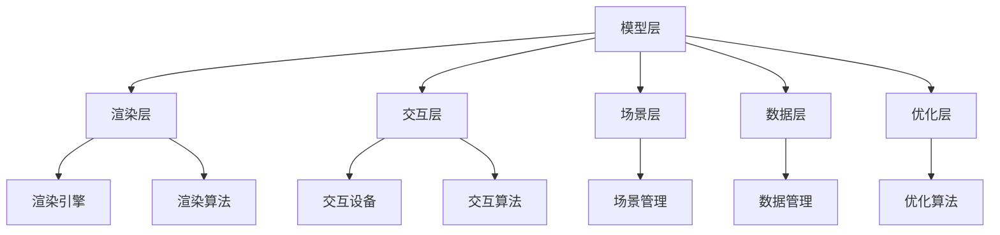
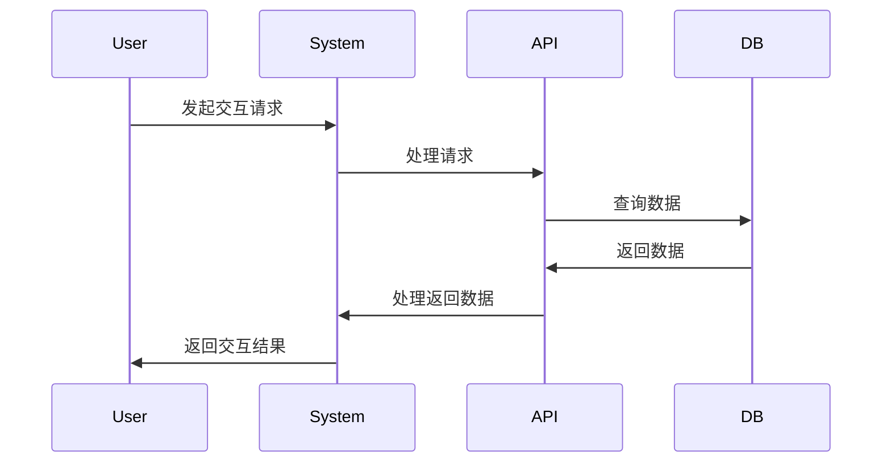

                 


### 目录与文章结构

**# 数学与虚拟现实：3D环境构建的数学方法**

关键词：3D环境构建、数学方法、虚拟现实、几何变换、算法、系统架构

摘要：本文将深入探讨数学在虚拟现实（VR）领域中的作用，特别是3D环境构建过程中的数学方法。文章分为八个章节，从问题背景、基础理论，到数学工具、算法原理、系统架构设计、实战案例，以及最佳实践和展望，全面解析3D虚拟环境的构建过程。

---

## 第一部分：引言与背景介绍

### 第1章：问题背景与核心概念

**1.1 问题背景**

虚拟现实（VR）作为一项前沿技术，正逐步改变我们的生活方式和工作方式。随着VR技术的发展，3D环境的构建成为其核心问题之一。本文将探讨在3D环境构建中，数学方法如何发挥作用。

**1.2 核心概念**

本文将介绍与3D环境构建相关的一系列核心概念，包括3D建模、3D渲染、向量、矩阵、几何变换等。

---

## 第二部分：基础理论与技术

### 第2章：虚拟现实基础理论

**2.1 虚拟现实技术概述**

虚拟现实技术的发展历史、关键技术与应用领域，包括VR硬件、软件和交互技术。

**2.2 3D建模基础**

介绍3D建模的基本原理，包括点、线、面、网格等基本元素，以及3D建模软件和工具。

**2.3 3D渲染技术**

探讨3D渲染的基本原理，包括光线的传播、反射、折射、阴影等，以及渲染算法（如光线追踪、曲面细分等）。

---

### 第3章：数学方法与工具

**3.1 向量与矩阵运算**

介绍向量与矩阵的基本概念和运算，包括线性代数在3D环境构建中的应用。

**3.2 几何变换**

探讨几何变换的基本原理，包括平移、旋转、缩放等变换方法，以及其在3D建模中的具体应用。

**3.3 三角函数与三角测量**

介绍三角函数的基本概念和应用，包括正弦、余弦、正切函数，以及三角测量技术在3D建模中的应用。

---

## 第三部分：算法原理与实现

### 第4章：3D环境构建算法

**4.1 3D扫描与重建**

介绍3D扫描与重建的基本原理，包括激光扫描、结构光扫描、深度相机等，以及重建算法（如多视图几何、点云处理等）。

**4.2 网格建模与优化**

探讨网格建模的基本原理，包括顶点、边、面等元素，以及网格优化算法（如顶点合并、网格简化等）。

**4.3 光照与阴影计算**

介绍光照与阴影计算的基本原理，包括光源类型、光照模型、阴影算法等。

---

### 第5章：数学模型与数学公式

**5.1 数学模型概述**

介绍数学模型的基本概念和分类，包括几何模型、物理模型、数学公式等。

**5.2 算法中的数学公式**

详细阐述3D环境构建算法中使用的数学公式，包括向量与矩阵运算、几何变换、三角函数等。

---

## 第四部分：系统设计与实现

### 第6章：系统架构与接口设计

**6.1 系统功能设计**

介绍3D虚拟环境构建系统的功能需求，包括建模、渲染、交互等。

**6.2 系统架构设计**

绘制系统架构图，分析系统的组件和模块，以及各组件之间的关系。

**6.3 系统接口设计与交互**

探讨系统的接口设计，包括API接口、数据交换格式、网络通信协议等。

---

### 第7章：项目实战与案例分析

**7.1 环境安装与准备**

介绍项目开发环境的搭建，包括软件安装、配置和调试。

**7.2 系统核心实现**

提供系统核心实现的源代码，并进行解读与分析。

**7.3 应用解读与分析**

分析系统在实际应用中的性能和效果，以及可能出现的问题。

**7.4 案例分析**

通过具体案例，展示3D虚拟环境构建的实际应用，并进行详细讲解。

---

### 第8章：最佳实践与展望

**8.1 最佳实践 Tips**

总结项目开发过程中的经验和技巧，提供最佳实践建议。

**8.2 小结与展望**

回顾文章的主要内容，总结3D环境构建的关键技术和方法。

**8.3 注意事项与拓展阅读**

列出注意事项，提供拓展阅读资源，为读者提供进一步学习的机会。

---

以上是文章的目录与结构，接下来将逐章深入探讨每个主题，确保文章内容丰富、结构清晰、逻辑严密。在撰写过程中，将遵循markdown格式，确保文章易于阅读和分享。

---

### 第一部分：引言与背景介绍

#### 第1章：问题背景与核心概念

**1.1 问题背景**

虚拟现实（Virtual Reality，VR）是一种通过计算机模拟实现的仿真环境，使人们能够在虚拟世界中体验沉浸感和交互性。随着技术的进步，VR技术已经广泛应用于游戏、教育、医疗、设计等领域。然而，3D环境的构建是VR技术的核心问题之一。

在VR中，用户通过头戴式显示器（HMD）、手柄等设备与虚拟环境进行交互。为了实现逼真的虚拟环境，需要构建高精度的3D模型，并对这些模型进行渲染，使其在屏幕上呈现出真实感。这一过程涉及到大量的数学计算和算法设计。

**1.2 核心概念**

在3D环境构建中，我们使用一系列核心概念和术语，包括：

- **3D建模**：通过点、线、面等基本元素构建三维模型。
- **3D渲染**：将3D模型在屏幕上呈现的过程，涉及光线追踪、反射、折射、阴影等效果。
- **向量**：表示空间中一个点的位置和方向的量，是3D建模和渲染的基础。
- **矩阵**：表示一个线性变换的矩阵，用于描述几何变换。
- **几何变换**：包括平移、旋转、缩放等操作，用于改变3D模型的位置和形状。
- **三角函数**：用于计算角度和距离，如正弦、余弦、正切函数。

这些概念和术语构成了3D环境构建的基础，接下来我们将深入探讨这些概念在实际应用中的具体实现。

#### 1.2.1 问题背景

随着虚拟现实技术的不断发展，3D环境构建的需求日益增长。无论是在游戏、影视制作，还是在工业设计、城市规划等领域，高精度、高逼真的3D模型都是不可或缺的。然而，3D环境构建涉及到大量的计算和数据处理，这对计算能力和算法设计提出了极高的要求。

例如，在游戏开发中，一个复杂的场景可能包含数万个3D模型，这些模型需要实时渲染，以提供流畅的交互体验。此外，3D模型还需要进行光照计算和阴影效果，以提高场景的真实感。这些计算过程涉及到大量的数学运算和算法设计。

**问题描述**

3D环境构建的核心问题是如何高效、准确地创建和渲染3D模型。具体来说，包括以下几个方面：

1. **建模与建模精度**：如何快速、准确地创建3D模型，并保持高精度，以满足不同应用场景的需求。
2. **渲染效果**：如何实现逼真的渲染效果，包括光线追踪、反射、折射、阴影等。
3. **交互性**：如何在虚拟环境中实现流畅的交互体验，包括手势识别、语音控制等。

**问题解决**

为了解决上述问题，需要运用一系列的数学方法和算法。例如：

- **建模算法**：使用多视图几何、点云处理等技术进行3D建模。
- **渲染算法**：使用光线追踪、曲面细分等技术实现逼真的渲染效果。
- **几何变换算法**：使用矩阵运算实现3D模型的变换操作。
- **交互算法**：使用手势识别、语音识别等技术实现虚拟环境中的交互。

**边界与外延**

3D环境构建不仅局限于虚拟现实领域，还可以应用于增强现实（AR）、计算机图形学、数字娱乐等领域。随着技术的进步，3D环境构建的方法和工具也在不断发展和完善。未来，随着硬件性能的提升和算法的优化，3D环境构建将变得更加高效、真实。

**概念结构与核心要素组成**

在3D环境构建中，核心概念和要素包括：

1. **几何模型**：包括点、线、面、体等基本元素。
2. **数学方法**：包括向量、矩阵、几何变换等数学工具。
3. **算法设计**：包括建模算法、渲染算法、交互算法等。
4. **软件工具**：包括3D建模软件、渲染引擎、交互工具等。

这些要素共同构成了3D环境构建的基本框架，为构建高质量、高逼真的虚拟环境提供了基础。

#### 1.2.2 核心概念

在3D环境构建中，核心概念包括：

- **3D建模**：使用点、线、面等基本元素构建三维模型的过程。
- **3D渲染**：将3D模型在屏幕上呈现的过程，涉及光线追踪、反射、折射、阴影等效果。
- **向量**：表示空间中一个点的位置和方向的量，是3D建模和渲染的基础。
- **矩阵**：用于描述几何变换的矩阵，用于改变3D模型的位置和形状。
- **几何变换**：包括平移、旋转、缩放等操作，用于改变3D模型的位置和形状。
- **三角函数**：用于计算角度和距离，如正弦、余弦、正切函数。

**概念属性特征对比表格**

| 概念       | 描述                                                         | 属性特征                     |
|------------|--------------------------------------------------------------|-----------------------------|
| 3D建模     | 通过点、线、面等基本元素构建三维模型的过程。                   | 精度、速度、灵活性           |
| 3D渲染     | 将3D模型在屏幕上呈现的过程，涉及光线追踪、反射、折射、阴影等效果。 | 真实感、效率、视觉效果       |
| 向量       | 表示空间中一个点的位置和方向的量。                             | 大小、方向、运算             |
| 矩阵       | 用于描述几何变换的矩阵，用于改变3D模型的位置和形状。             | 行、列、元素、变换操作       |
| 几何变换   | 包括平移、旋转、缩放等操作，用于改变3D模型的位置和形状。         | 操作类型、操作对象、效果     |
| 三角函数   | 用于计算角度和距离，如正弦、余弦、正切函数。                     | 计算方法、应用场景           |

**ER实体关系图架构**

```mermaid
erDiagram
    Model |<-.. MeshNode
    MeshNode ||--|{ Vertex }
    MeshNode ||--|{ Edge }
    MeshNode ||--|{ Face }
    LightSource ||--|{ Illumination }
    Camera ||--|{ Projection }
```

上述ER图展示了3D环境构建中的主要实体及其关系。`Model`表示3D模型，`MeshNode`表示网格节点，包括顶点（Vertex）、边（Edge）和面（Face）。`LightSource`表示光源，用于计算光照效果。`Camera`表示摄像机，用于投影和渲染。

通过以上介绍，我们对3D环境构建中的核心概念有了初步的了解。接下来，我们将进一步探讨虚拟现实技术的基础理论，以及3D建模与渲染的具体实现方法。

### 第二部分：基础理论与技术

#### 第2章：虚拟现实基础理论

**2.1 虚拟现实技术概述**

虚拟现实（Virtual Reality，VR）是一种通过计算机技术模拟出的一种三维空间，用户可以通过头戴式显示器（HMD）、手柄等设备进入这个虚拟世界，进行沉浸式体验。VR技术起源于20世纪60年代，随着计算机技术和图形学的发展，逐渐走向成熟。

VR技术的基本原理是通过计算机生成三维场景，然后通过头戴式显示器等设备将图像呈现在用户眼前，同时通过手柄、手势等设备实现用户的交互操作。虚拟现实技术主要涉及以下三个方面：

1. **三维建模**：通过点、线、面等基本元素构建三维模型，实现场景的逼真呈现。
2. **渲染技术**：将三维模型在屏幕上渲染，产生视觉效果，包括光线追踪、反射、折射、阴影等。
3. **交互技术**：通过手柄、手势、语音等设备实现用户与虚拟环境的互动。

**VR技术的发展历史**

- **1960年代**：VR概念提出，最早的VR设备是头戴式显示器（HMD），用于军事和科研领域。
- **1980年代**：VR技术开始应用于娱乐和游戏领域，出现了一些早期的VR游戏。
- **1990年代**：VR技术逐渐成熟，VR设备逐渐普及，VR游戏、虚拟旅游等应用开始流行。
- **21世纪初**：随着计算机技术和图形学的发展，VR技术取得了重大突破，虚拟现实硬件和软件逐渐成熟。
- **现在**：VR技术在多个领域得到广泛应用，如游戏、教育、医疗、设计等，成为一项前沿技术。

**VR技术的应用领域**

虚拟现实技术具有广泛的应用领域，包括但不限于：

1. **游戏**：VR游戏是VR技术最早也是最为广泛的应用领域，提供了全新的游戏体验。
2. **教育**：VR技术可以创建虚拟的教室、实验室，让学生在虚拟环境中进行学习和实践。
3. **医疗**：VR技术用于医疗手术模拟、康复训练、心理治疗等，提供了全新的医疗解决方案。
4. **设计**：VR技术用于建筑设计、工业设计、时尚设计等领域，可以进行虚拟展示和评估。
5. **娱乐**：除了游戏，VR技术还应用于虚拟旅游、虚拟演出等娱乐领域，提供了全新的娱乐体验。
6. **军事**：VR技术用于军事训练、模拟战斗等，提高了训练效果和安全性。

**VR技术的关键技术与硬件**

实现虚拟现实的关键技术和硬件包括：

1. **头戴式显示器（HMD）**：用户观察虚拟世界的窗口，常见的HMD包括Oculus Rift、HTC Vive、PlayStation VR等。
2. **传感器与追踪系统**：用于跟踪用户的头部、手部等运动，常见的传感器包括惯性测量单元（IMU）、激光追踪器等。
3. **手柄与交互设备**：用户与虚拟环境进行交互的设备，常见的交互设备包括手柄、手套、动作捕捉器等。
4. **渲染引擎**：用于渲染三维场景的软件，常见的渲染引擎包括Unity、Unreal Engine等。
5. **计算机与GPU**：计算和渲染三维场景的硬件，高性能计算机和GPU是VR技术的基础。

**VR技术的软件工具**

实现虚拟现实技术需要使用一系列的软件工具，包括：

1. **3D建模软件**：用于创建三维模型，常见的建模软件包括Blender、Maya、3ds Max等。
2. **虚拟现实开发平台**：用于开发虚拟现实应用，常见的开发平台包括Unity、Unreal Engine等。
3. **虚拟现实编辑器**：用于编辑和调试虚拟现实场景，常见的编辑器包括VRChat、Rec Room等。
4. **插件与扩展**：用于增强VR功能，常见的插件包括VRophys、VRChat Plugins等。

通过以上对虚拟现实技术基础理论的介绍，我们可以更好地理解VR技术的原理和应用。接下来，我们将详细探讨3D建模的基础知识，以及3D建模过程中使用的工具和方法。

#### 2.2 3D建模基础

3D建模是虚拟现实（VR）技术中的核心组成部分，它涉及到从基本元素（如点、线、面）构建复杂的三维对象的过程。3D建模不仅是VR场景创建的关键步骤，也是动画、游戏设计、建筑可视化、工业设计等多个领域的重要技术。以下是关于3D建模基础的详细探讨。

**2.2.1 基本元素**

在3D建模中，基本元素主要包括点（Vertices）、线（Edges）和面（Faces）。这些元素通过特定的组合和操作，形成了各种复杂的几何形状。

- **点（Vertices）**：点是3D空间中的基本单位，用于确定物体的位置和形状。每个点都有其唯一的坐标（通常为x, y, z），用于描述其在三维空间中的位置。
- **线（Edges）**：线是由两个点连接而成的几何对象，用于定义物体的边和轮廓。每条线通过其端点坐标来定义。
- **面（Faces）**：面是由多个线连接而成的平面区域，通常用于表示物体的表面。在3D建模中，面可以是三角形、四边形或多边形。

**2.2.2 基本操作**

3D建模的基本操作包括创建、选择、移动、缩放和旋转等，这些操作可以对基本元素进行变换和处理，以构建复杂的几何形状。

- **创建**：使用建模软件创建新的点、线、面等基本元素。
- **选择**：选择要操作的基本元素，例如选择一个点来移动它，或选择一个面来修改其属性。
- **移动**：将元素从一个位置移动到另一个位置，通常可以通过拖动来实现。
- **缩放**：改变元素的大小，可以通过放大或缩小来实现。
- **旋转**：围绕一个轴旋转元素，以改变其方向。

**2.2.3 常见的3D建模软件和工具**

在3D建模过程中，使用适当的软件和工具可以大大提高效率和质量。以下是一些常用的3D建模软件和工具：

- **Blender**：一款免费且开源的3D建模和渲染软件，功能强大，适合初学者和专业用户。
- **Maya**：Autodesk公司开发的3D建模和动画软件，广泛应用于电影、游戏和工业设计等领域。
- **3ds Max**：Autodesk公司开发的3D建模、动画和渲染软件，特别适合建筑和工业设计。
- **ZBrush**：用于雕刻和细节建模的3D建模软件，适合创建复杂和逼真的细节。

**2.2.4 3D建模的方法**

3D建模的方法主要包括以下几种：

- **多边形建模**：通过创建和控制多边形网格来构建模型，是最常用的建模方法之一。
- **曲面建模**：使用曲面来构建模型，可以创建更平滑和连续的表面。
- **曲面细分建模**：通过细分曲面来增加模型的细节和精度。
- **参数化建模**：使用参数化技术来控制模型的形状和尺寸，方便进行修改和调整。

**2.2.5 3D建模的应用场景**

3D建模在多个领域有广泛的应用：

- **游戏开发**：用于创建游戏中的角色、环境、道具等。
- **影视制作**：用于电影和动画中的场景、角色和特效。
- **建筑可视化**：用于建筑设计中的三维模型展示和评估。
- **工业设计**：用于产品设计和可视化。
- **医学**：用于医学成像和模拟。

通过上述对3D建模基础的介绍，我们可以看到3D建模在虚拟现实和其他领域的重要性。接下来，我们将探讨3D渲染技术，以及如何通过渲染技术提高虚拟环境的真实感。

#### 2.3 3D渲染技术

3D渲染技术是虚拟现实（VR）领域的重要组成部分，它涉及到将3D模型在计算机上渲染成逼真的图像或动画的过程。3D渲染技术不仅决定了虚拟环境的视觉效果，还直接影响用户的沉浸体验。以下是关于3D渲染技术的详细探讨。

**2.3.1 基本原理**

3D渲染的基本原理可以概括为以下几个步骤：

1. **几何处理**：将3D模型转换成渲染引擎可以处理的格式，通常是一个由顶点、边和面组成的网格。
2. **光照计算**：模拟光线在虚拟环境中的传播，计算模型表面受到的光照效果，包括直接光照（如点光源、聚光灯等）和间接光照（如环境光、反射光等）。
3. **纹理映射**：将纹理贴图应用到模型表面，增加细节和真实感。
4. **阴影计算**：计算模型表面的阴影效果，增强三维效果。
5. **着色与合成**：将光照、纹理、阴影等效果应用到模型上，并进行图像合成，生成最终的渲染图像。

**2.3.2 常见的渲染技术**

3D渲染技术种类繁多，以下是一些常见的渲染技术：

1. **光线追踪**：通过模拟光线的传播路径来计算光照效果，能够产生非常逼真的图像。光线追踪技术包括路径追踪、蒙特卡洛光线追踪等。

2. **曲面细分**：通过将表面细分来增加模型的细节和光滑度，使得渲染效果更加细腻。

3. **反射与折射**：模拟光线在反射和折射过程中的行为，如水面反射、玻璃折射等，增强场景的真实感。

4. **全局光照**：计算环境中所有光源对模型表面的影响，包括直接和间接光照，如路径追踪、辐射传输模型等。

5. **体渲染**：用于渲染透明或半透明物体，如烟雾、火焰、水等，通过模拟光线在物体内部传播的过程来产生效果。

6. **静态渲染**：渲染结果不随时间变化，通常用于图像和动画的生成。

7. **动态渲染**：渲染结果随时间变化，通常用于实时交互的应用，如游戏、虚拟现实等。

**2.3.3 渲染算法**

3D渲染过程中涉及多种算法，以下是一些常见的渲染算法：

1. **正向渲染**：按照光照顺序依次处理每个像素，计算光照效果。

2. **反向渲染**：按照像素顺序依次处理，先处理光照，再绘制模型。

3. **光子映射**：使用粒子模拟光线传播，适用于全局光照计算。

4. **Voxel渲染**：使用体素来表示物体，适用于复杂场景的渲染。

5. **LOD（Level of Detail）**：根据物体的距离和分辨率动态调整模型的细节程度，提高渲染效率。

**2.3.4 渲染引擎**

渲染引擎是负责渲染过程的软件，它集成了多种渲染技术和算法，能够高效地渲染复杂的3D场景。以下是一些流行的渲染引擎：

1. **Unity**：一款广泛使用的游戏开发引擎，提供丰富的渲染功能和易于使用的编程接口。

2. **Unreal Engine**：一款高端的游戏和影视制作引擎，以其强大的渲染效果和实时预览功能著称。

3. **Blender**：一款免费的3D创作套件，包括建模、动画、渲染、视频编辑等模块。

4. **Lumion**：一款用于建筑可视化的高效渲染软件，特别适合快速生成高质量的图像和动画。

通过上述对3D渲染技术的介绍，我们可以看到3D渲染在虚拟现实中的重要性。接下来，我们将探讨3D建模与渲染过程中使用的数学方法与工具。

#### 3.1 向量与矩阵运算

在3D建模与渲染过程中，向量与矩阵运算起着至关重要的作用。向量是表示空间中点位置和方向的量，而矩阵则用于描述几何变换。通过理解并运用这些数学工具，我们可以有效地进行3D模型的创建、变换和渲染。以下是关于向量与矩阵运算的详细探讨。

**3.1.1 向量基础**

向量是一个具有大小和方向的量，通常表示为\( \vec{v} \)或\( \overrightarrow{v} \)。在三维空间中，一个向量可以用三个分量（x, y, z）来表示：

\[ \vec{v} = (x, y, z) \]

向量的几个基本操作包括：

- **加法**：两个向量相加，结果是一个新向量，其方向和大小等于两个原向量方向和大小的矢量和。
  
  \[ \vec{v_1} + \vec{v_2} = (x_1 + x_2, y_1 + y_2, z_1 + z_2) \]

- **减法**：两个向量相减，结果是一个新向量，其方向和大小等于两个原向量方向和大小的矢量差。

  \[ \vec{v_1} - \vec{v_2} = (x_1 - x_2, y_1 - y_2, z_1 - z_2) \]

- **标量乘法**：一个向量与一个标量相乘，结果是一个新向量，其大小是原向量大小的倍数，方向不变。

  \[ k\vec{v} = (kx, ky, kz) \]

- **点积**：两个向量的点积（内积）是一个标量，表示为\( \vec{v_1} \cdot \vec{v_2} \)。点积的计算公式是：

  \[ \vec{v_1} \cdot \vec{v_2} = x_1x_2 + y_1y_2 + z_1z_2 \]

  点积具有以下性质：

  - 非负性：\( \vec{v} \cdot \vec{v} \geq 0 \)，当且仅当\( \vec{v} = \vec{0} \)时等号成立。
  - 正交性：如果\( \vec{v_1} \)和\( \vec{v_2} \)垂直，则它们的点积为0。
  
- **叉积**：两个向量的叉积（外积）是一个新向量，其方向垂直于原向量所决定的平面，大小等于两个原向量大小和它们夹角正弦值的乘积。叉积的计算公式是：

  \[ \vec{v_1} \times \vec{v_2} = (y_1z_2 - z_1y_2, z_1x_2 - x_1z_2, x_1y_2 - y_1x_2) \]

  叉积具有以下性质：

  - 叉积结果向量垂直于原向量所决定的平面。
  - 叉积满足反交换律：\( \vec{v_1} \times \vec{v_2} = -\vec{v_2} \times \vec{v_1} \)。

**3.1.2 矩阵基础**

矩阵是一个由数字组成的矩形数组，通常表示为\( A \)或\( \mathbf{A} \)。在三维空间中，一个3x3的矩阵可以表示一个变换，如平移、旋转、缩放等。一个3x3的矩阵通常表示为：

\[ A = \begin{bmatrix} a_{11} & a_{12} & a_{13} \\ a_{21} & a_{22} & a_{23} \\ a_{31} & a_{32} & a_{33} \end{bmatrix} \]

矩阵的几个基本操作包括：

- **矩阵加法**：两个矩阵相加，结果是一个新矩阵，其每个元素是原矩阵对应元素的加和。

  \[ A + B = \begin{bmatrix} a_{11} + b_{11} & a_{12} + b_{12} & a_{13} + b_{13} \\ a_{21} + b_{21} & a_{22} + b_{22} & a_{23} + b_{23} \\ a_{31} + b_{31} & a_{32} + b_{32} & a_{33} + b_{33} \end{bmatrix} \]

- **矩阵减法**：两个矩阵相减，结果是一个新矩阵，其每个元素是原矩阵对应元素的差。

  \[ A - B = \begin{bmatrix} a_{11} - b_{11} & a_{12} - b_{12} & a_{13} - b_{13} \\ a_{21} - b_{21} & a_{22} - b_{22} & a_{23} - b_{23} \\ a_{31} - b_{31} & a_{32} - b_{32} & a_{33} - b_{33} \end{bmatrix} \]

- **标量乘法**：一个矩阵与一个标量相乘，结果是一个新矩阵，其每个元素是原矩阵对应元素的标量倍。

  \[ kA = \begin{bmatrix} ka_{11} & ka_{12} & ka_{13} \\ ka_{21} & ka_{22} & ka_{23} \\ ka_{31} & ka_{32} & ka_{33} \end{bmatrix} \]

- **矩阵乘法**：两个矩阵相乘，结果是一个新矩阵，其每个元素是原矩阵对应元素的乘积和加和。矩阵乘法通常表示为：

  \[ AB = \begin{bmatrix} a_{11}b_{11} + a_{12}b_{21} + a_{13}b_{31} & a_{11}b_{12} + a_{12}b_{22} + a_{13}b_{32} & a_{11}b_{13} + a_{12}b_{23} + a_{13}b_{33} \\ a_{21}b_{11} + a_{22}b_{21} + a_{23}b_{31} & a_{21}b_{12} + a_{22}b_{22} + a_{23}b_{32} & a_{21}b_{13} + a_{22}b_{23} + a_{23}b_{33} \\ a_{31}b_{11} + a_{32}b_{21} + a_{33}b_{31} & a_{31}b_{12} + a_{32}b_{22} + a_{33}b_{32} & a_{31}b_{13} + a_{32}b_{23} + a_{33}b_{33} \end{bmatrix} \]

**3.1.3 几何变换**

在3D建模与渲染中，几何变换是关键的操作。几何变换可以通过矩阵运算来实现。以下是一些常用的几何变换：

- **平移**：将向量沿某个方向移动一定的距离，可以通过矩阵乘法实现。一个向量\( \vec{v} \)的平移可以通过以下矩阵实现：

  \[ T_{\vec{p}} = \begin{bmatrix} 1 & 0 & p_x \\ 0 & 1 & p_y \\ 0 & 0 & 1 \end{bmatrix} \]

  其中\( \vec{p} = (p_x, p_y, p_z) \)是平移向量。

- **旋转**：围绕某个轴旋转向量，可以通过旋转矩阵实现。一个向量\( \vec{v} \)的旋转可以通过以下矩阵实现：

  \[ R_{\theta} = \begin{bmatrix} \cos\theta & -\sin\theta & 0 \\ \sin\theta & \cos\theta & 0 \\ 0 & 0 & 1 \end{bmatrix} \]

  其中\( \theta \)是旋转角度。

- **缩放**：将向量的大小按比例缩放，可以通过缩放矩阵实现。一个向量\( \vec{v} \)的缩放可以通过以下矩阵实现：

  \[ S_{s} = \begin{bmatrix} s_x & 0 & 0 \\ 0 & s_y & 0 \\ 0 & 0 & s_z \end{bmatrix} \]

  其中\( s_x, s_y, s_z \)是缩放因子。

通过以上对向量与矩阵运算的介绍，我们可以看到这些数学工具在3D建模与渲染过程中的重要性。接下来，我们将探讨几何变换的基本原理及其应用。

#### 3.2 几何变换

几何变换是3D建模和渲染中的核心概念之一，用于改变三维空间中物体的位置、形状和方向。通过几何变换，我们可以实现诸如平移、旋转、缩放等操作，从而创造出丰富多彩的虚拟环境。以下是关于几何变换的基本原理和应用的详细探讨。

**3.2.1 平移**

平移是一种将物体沿某一方向移动一定距离的变换。在三维空间中，平移可以通过一个平移向量来表示。一个物体的平移可以通过以下矩阵实现：

\[ T_{\vec{p}} = \begin{bmatrix} 1 & 0 & p_x \\ 0 & 1 & p_y \\ 0 & 0 & 1 \end{bmatrix} \]

其中，\( \vec{p} = (p_x, p_y, p_z) \)是平移向量，表示物体在x、y、z三个方向上的移动距离。对于任意的3D向量\( \vec{v} = (x, y, z) \)，其平移后的向量\( \vec{v'} \)可以通过以下矩阵乘法计算：

\[ \vec{v'} = T_{\vec{p}} \cdot \vec{v} \]

例如，如果要将一个点\( \vec{v} = (1, 2, 3) \)沿x轴平移3个单位，那么平移向量\( \vec{p} = (3, 0, 0) \)，平移后的点\( \vec{v'} \)为：

\[ \vec{v'} = \begin{bmatrix} 1 & 0 & 3 \\ 0 & 1 & 0 \\ 0 & 0 & 1 \end{bmatrix} \cdot \begin{bmatrix} 1 \\ 2 \\ 3 \end{bmatrix} = \begin{bmatrix} 4 \\ 2 \\ 3 \end{bmatrix} \]

**3.2.2 旋转**

旋转是围绕某个轴将物体旋转一定角度的变换。在三维空间中，旋转可以通过旋转矩阵来实现。一个物体的旋转可以通过以下矩阵实现：

\[ R_{\theta} = \begin{bmatrix} \cos\theta & -\sin\theta & 0 \\ \sin\theta & \cos\theta & 0 \\ 0 & 0 & 1 \end{bmatrix} \]

其中，\( \theta \)是旋转角度。对于任意的3D向量\( \vec{v} = (x, y, z) \)，其旋转后的向量\( \vec{v'} \)可以通过以下矩阵乘法计算：

\[ \vec{v'} = R_{\theta} \cdot \vec{v} \]

例如，如果要将一个点\( \vec{v} = (1, 2, 3) \)绕y轴旋转90度，那么旋转角度\( \theta = 90^\circ \)，旋转后的点\( \vec{v'} \)为：

\[ \vec{v'} = \begin{bmatrix} 0 & -1 & 0 \\ 1 & 0 & 0 \\ 0 & 0 & 1 \end{bmatrix} \cdot \begin{bmatrix} 1 \\ 2 \\ 3 \end{bmatrix} = \begin{bmatrix} -2 \\ 1 \\ 3 \end{bmatrix} \]

**3.2.3 缩放**

缩放是将物体的尺寸按比例放大的变换。在三维空间中，缩放可以通过一个缩放矩阵来实现。一个物体的缩放可以通过以下矩阵实现：

\[ S_{s} = \begin{bmatrix} s_x & 0 & 0 \\ 0 & s_y & 0 \\ 0 & 0 & s_z \end{bmatrix} \]

其中，\( s_x, s_y, s_z \)是缩放因子。对于任意的3D向量\( \vec{v} = (x, y, z) \)，其缩放后的向量\( \vec{v'} \)可以通过以下矩阵乘法计算：

\[ \vec{v'} = S_{s} \cdot \vec{v} \]

例如，如果要将一个点\( \vec{v} = (1, 2, 3) \)沿x、y、z三个方向分别放大2倍，那么缩放因子\( s_x = s_y = s_z = 2 \)，缩放后的点\( \vec{v'} \)为：

\[ \vec{v'} = \begin{bmatrix} 2 & 0 & 0 \\ 0 & 2 & 0 \\ 0 & 0 & 2 \end{bmatrix} \cdot \begin{bmatrix} 1 \\ 2 \\ 3 \end{bmatrix} = \begin{bmatrix} 2 \\ 4 \\ 6 \end{bmatrix} \]

**3.2.4 旋转与缩放的组合**

在实际应用中，旋转与缩放常常组合使用。例如，如果我们要将一个点绕z轴旋转一定角度并沿x轴和y轴分别放大一定比例，那么可以首先旋转，然后缩放。这个过程可以通过以下矩阵乘法实现：

\[ \vec{v'} = R_{\theta_z} \cdot S_{s_{xy}} \cdot \vec{v} \]

其中，\( R_{\theta_z} \)是绕z轴旋转\( \theta_z \)度的旋转矩阵，\( S_{s_{xy}} \)是沿x轴和y轴分别缩放\( s_x \)和\( s_y \)的缩放矩阵。对于任意的3D向量\( \vec{v} = (x, y, z) \)，其组合旋转与缩放后的向量\( \vec{v'} \)为：

\[ \vec{v'} = \begin{bmatrix} \cos\theta_z & -\sin\theta_z & 0 \\ \sin\theta_z & \cos\theta_z & 0 \\ 0 & 0 & 1 \end{bmatrix} \cdot \begin{bmatrix} s_x & 0 & 0 \\ 0 & s_y & 0 \\ 0 & 0 & 1 \end{bmatrix} \cdot \begin{bmatrix} x \\ y \\ z \end{bmatrix} \]

通过组合旋转与缩放，我们可以实现更加复杂和多样的几何变换，从而创造出丰富的虚拟环境。

**3.2.5 几何变换的应用**

几何变换在3D建模和渲染中有着广泛的应用。例如：

- **模型变形**：通过几何变换，可以实时改变3D模型的外观，例如在动画中实现模型的不同形态。
- **场景布局**：在游戏和虚拟现实中，通过几何变换，可以调整场景中物体的位置、形状和方向，从而创建逼真的场景。
- **图像处理**：在图像处理中，几何变换可以用于图像的旋转、缩放、平移等操作，从而实现图像的编辑和美化。
- **计算机图形学**：在计算机图形学中，几何变换是基础操作之一，用于实现各种图形效果和渲染算法。

通过以上对几何变换的介绍，我们可以看到几何变换在3D建模和渲染中的重要性。接下来，我们将探讨三角函数与三角测量在3D建模中的应用。

#### 3.3 三角函数与三角测量

在3D建模和虚拟现实技术中，三角函数和三角测量是不可或缺的工具。三角函数（如正弦、余弦、正切）在计算角度、距离和方向上起着关键作用，而三角测量技术则用于精确地测量三维空间中的点。以下是关于三角函数与三角测量的详细探讨。

**3.3.1 三角函数的基本概念**

三角函数是数学中的一类特殊函数，用于描述角度和边长的关系。常见的三角函数包括正弦（sine，简称sin）、余弦（cosine，简称cos）和正切（tangent，简称tan）。这些函数通常定义在单位圆上，其中角度通常以弧度为单位。

- **正弦（sin）**：正弦函数表示单位圆上角度θ的对边与斜边的比值。数学表达式为：

  \[ \sin(\theta) = \frac{y}{r} \]

  其中，θ是角度（以弧度为单位），y是对边长度，r是斜边长度（单位圆的半径为1）。

- **余弦（cos）**：余弦函数表示单位圆上角度θ的邻边与斜边的比值。数学表达式为：

  \[ \cos(\theta) = \frac{x}{r} \]

  其中，x是邻边长度。

- **正切（tan）**：正切函数表示单位圆上角度θ的对边与邻边的比值。数学表达式为：

  \[ \tan(\theta) = \frac{y}{x} \]

**3.3.2 三角函数的应用**

三角函数在3D建模和虚拟现实技术中有着广泛的应用，主要包括以下方面：

- **计算角度**：在3D建模中，需要计算物体之间的角度关系，例如在建模一个立方体时，需要计算每个面的倾斜角度。三角函数可以帮助我们通过已知的边长计算角度。

- **确定方向**：在3D场景中，确定物体的方向和位置是至关重要的。通过三角函数，我们可以计算出物体在三维空间中的方向向量。

- **光照计算**：在3D渲染中，需要计算物体表面受到的光照强度。通过三角函数，我们可以确定光源和物体之间的角度关系，从而计算光照效果。

- **运动模拟**：在虚拟现实中，物体的运动通常涉及到角度和距离的计算。三角函数可以帮助我们模拟物体的旋转、平移等运动。

**3.3.3 三角测量技术**

三角测量技术用于测量三维空间中点的位置和距离。在虚拟现实和3D建模中，三角测量技术可以用于以下方面：

- **三维建模**：通过三角测量技术，我们可以测量三维空间中物体的尺寸和形状，从而创建准确的3D模型。

- **物体定位**：在虚拟现实场景中，需要精确地定位物体。三角测量技术可以帮助我们测量物体之间的距离和角度，从而实现准确的物体定位。

- **场景重建**：在虚拟现实场景中，通过三角测量技术，我们可以重建真实世界的场景，从而创建逼真的虚拟环境。

**3.3.4 三角测量的方法**

三角测量技术主要包括以下方法：

- **直接测量**：使用测量工具（如尺子、量角器等）直接测量物体之间的距离和角度。这种方法适用于小范围的测量。

- **间接测量**：通过已知点之间的距离和角度关系，使用三角函数计算未知点的位置和距离。这种方法适用于大范围的测量。

- **光学测量**：使用光学仪器（如激光测距仪、全站仪等）进行测量。这种方法适用于高精度和大范围的测量。

- **传感器测量**：使用各种传感器（如GPS、惯性测量单元（IMU）等）进行测量。这种方法适用于动态环境和移动设备的测量。

通过以上对三角函数与三角测量的介绍，我们可以看到这些工具在3D建模和虚拟现实技术中的重要性。接下来，我们将探讨3D环境构建算法，以及如何使用这些数学工具进行3D环境构建。

#### 3.4 3D环境构建算法

在3D虚拟现实（VR）中，构建一个逼真且交互性强的环境是至关重要的。这需要高效的算法来处理3D模型的创建、扫描、重建和渲染。以下是关于3D环境构建算法的详细探讨。

**3.4.1 3D扫描与重建**

3D扫描与重建是将现实世界的物体或场景转换成数字模型的过程。这个过程通常包括以下几个步骤：

1. **数据采集**：使用激光扫描仪、结构光扫描仪或深度相机等设备获取物体的表面数据。这些设备可以生成密集的点云数据。

2. **预处理**：对点云数据进行预处理，包括去除噪声、填充孔洞和减少冗余数据。预处理步骤有助于提高重建质量。

3. **表面重建**：从点云数据中提取表面信息，生成三角网格模型。常用的方法包括泊松重建、Alpha Shapes重建等。

4. **优化**：对重建模型进行优化，包括减少三角面数量、平滑表面和消除异常。优化步骤可以提高渲染效率并改善视觉质量。

**3D扫描与重建算法**：

- **多视图几何重建**：通过多个视图（如2D图像）中的对应点，使用几何约束重建3D模型。常用的算法包括结构光扫描和三角测量重建。
  
  **算法流程**：
  1. 使用相机捕获多个视图。
  2. 对图像进行特征提取和匹配。
  3. 计算视差图和深度信息。
  4. 重建3D点云。
  5. 从点云生成三角网格。

  **数学公式**：
  \[ \text{视差} = \frac{d_i}{f} \]
  其中，\( d_i \)是图像中两点间的像素距离，\( f \)是相机焦距。

- **点云处理**：对点云数据进行处理，包括去噪、过滤和表面重建。常用的算法包括拉普拉斯平滑、泊松重建等。

  **算法流程**：
  1. 输入点云数据。
  2. 应用滤波器去除噪声。
  3. 使用泊松重建或Alpha Shapes重建表面。
  4. 生成三角网格。

  **数学公式**：
  \[ \mathbf{L} = \frac{1}{n} \sum_{i=1}^{n} (\mathbf{p_i} - \mathbf{p_{i}}) \]
  其中，\( \mathbf{L} \)是拉普拉斯矩阵，\( \mathbf{p_i} \)是点云中的点。

**3.4.2 网格建模与优化**

网格建模是将3D模型表示为由顶点、边和面组成的网格。网格建模与优化是3D环境构建的关键步骤，确保模型的精度和渲染效率。

**网格建模算法**：

- **多边形网格建模**：通过构建多边形网格来表示3D模型。常用的建模软件包括Blender、Maya等。

  **算法流程**：
  1. 创建基础几何体（如立方体、圆柱体等）。
  2. 使用多边形工具修改几何体，添加细节。
  3. 连接多个几何体，形成复杂模型。

- **曲面建模**：使用曲面来构建3D模型，适用于复杂形状的建模。常用的软件包括NURBS建模工具。

  **算法流程**：
  1. 创建控制点集。
  2. 使用NURBS曲面进行建模。
  3. 编辑曲面参数，调整形状和细节。

**网格优化算法**：

- **顶点合并**：通过合并顶点减少网格的顶点数量，提高渲染效率。

  **算法流程**：
  1. 计算相邻顶点的误差。
  2. 找到可以合并的顶点对。
  3. 合并顶点，更新网格。

  **数学公式**：
  \[ \text{误差} = \frac{1}{2} \sum_{i=1}^{n} (\mathbf{p_i} - \mathbf{p_{i_new}})^2 \]
  其中，\( \mathbf{p_i} \)是原始顶点，\( \mathbf{p_{i_new}} \)是合并后的顶点。

- **网格简化**：通过减少网格面数来简化模型，降低渲染负载。

  **算法流程**：
  1. 选择网格中的顶点。
  2. 计算去除顶点对模型质量的影响。
  3. 逐步去除对模型影响较小的顶点。

  **数学公式**：
  \[ \text{质量损失} = \sum_{i=1}^{n} \alpha_i \cdot \text{质量权重} \]
  其中，\( \alpha_i \)是顶点对模型质量的影响权重。

**3.4.3 光照与阴影计算**

光照与阴影计算是渲染过程中的关键步骤，用于创建逼真的视觉效果。

**光照计算算法**：

- **直接光照**：计算光源直接照射到模型表面的光照效果，包括点光源、聚光灯等。

  **算法流程**：
  1. 计算光源到模型的向量。
  2. 计算光照强度。
  3. 应用光照模型（如Lambert光照模型、Phong光照模型）。

  **数学公式**：
  \[ I = \frac{L \cdot N}{R} \]
  其中，\( I \)是光照强度，\( L \)是光照向量，\( N \)是模型表面的法向量，\( R \)是反射率。

- **间接光照**：计算环境光和反射光对模型表面的影响。

  **算法流程**：
  1. 使用路径追踪或辐射传递模型计算间接光照。
  2. 递归计算光照路径。
  3. 合并光照结果。

  **数学公式**：
  \[ I_{\text{indirect}} = \sum_{i=1}^{n} f_i \cdot I_i \]
  其中，\( I_{\text{indirect}} \)是间接光照强度，\( f_i \)是光照路径的概率分布，\( I_i \)是路径上的光照强度。

**阴影计算算法**：

- **硬阴影**：使用简单的几何阴影计算，适用于实时渲染。

  **算法流程**：
  1. 计算光源到模型表面的向量。
  2. 检查向量是否与模型相交。
  3. 如果相交，则产生阴影。

  **数学公式**：
  \[ \text{相交} = (\mathbf{L} \cdot \mathbf{N}) < 0 \]
  其中，\( \mathbf{L} \)是光源向量，\( \mathbf{N} \)是模型表面的法向量。

- **软阴影**：使用更复杂的方法计算阴影边缘的模糊效果，适用于高质量渲染。

  **算法流程**：
  1. 使用局部光照模型计算光照强度。
  2. 计算阴影边缘的模糊范围。
  3. 应用模糊效果。

  **数学公式**：
  \[ \sigma = \frac{1}{\sqrt{1 + (\frac{h}{l})^2}} \]
  其中，\( \sigma \)是阴影模糊半径，\( h \)是光源到模型表面的距离，\( l \)是模型表面的法线长度。

通过以上对3D环境构建算法的介绍，我们可以看到数学工具在构建逼真且交互性强的3D环境中的重要性。接下来，我们将详细讨论数学模型与数学公式，以及如何使用这些模型和公式解决3D环境构建中的具体问题。

#### 4.1 3D扫描与重建

3D扫描与重建是将现实世界的物体或场景转换为数字模型的关键技术。这一过程包括数据采集、预处理、表面重建和优化等步骤。以下我们将详细讨论3D扫描与重建的算法原理和数学模型。

**4.1.1 多视图几何重建**

多视图几何重建是一种基于多个二维视图重建三维模型的方法。该方法利用多个视图中的对应点，通过几何约束重建三维模型。以下是多视图几何重建的基本算法原理和数学模型：

1. **相机模型**：

   首先，我们需要建立相机模型。相机模型描述了相机如何将三维世界中的点映射到二维图像平面上。常用的相机模型是针孔相机模型，其数学模型为：

   \[ \mathbf{X'} = \mathbf{K} \cdot \mathbf{X} \]

   其中，\( \mathbf{X'} \)是图像平面上的点坐标，\( \mathbf{X} \)是三维空间中的点坐标，\( \mathbf{K} \)是相机内参矩阵，包括焦距、主点坐标等。

2. **相机参数估计**：

   在多视图几何重建中，我们需要估计每个相机的参数，如旋转矩阵和位置向量。这些参数可以通过图像匹配和几何约束估计得到。常用的算法包括极线约束和三角测量。

3. **点对应关系**：

   对于每个视图，我们需要找到对应的点对。这些点对可以通过特征提取和匹配算法（如SIFT、SURF等）找到。点对应关系是重建三维模型的关键。

4. **三维重建**：

   一旦得到点对应关系，我们可以通过三角测量重建三维点。三角测量是一种利用两个视图中的对应点计算三维点的方法。其数学模型为：

   \[ \mathbf{X} = \frac{1}{w} \left( \mathbf{K}^{-1} \mathbf{P_1} \mathbf{P_2}^{-T} \right) \mathbf{X'} \]

   其中，\( \mathbf{P_1} \)和\( \mathbf{P_2} \)分别是两个相机的投影矩阵，\( w \)是三角测量过程中的加权因子。

5. **表面重建**：

   从三维点云中重建表面是3D重建的下一步。常用的表面重建算法包括泊松重建和Alpha Shapes。泊松重建是一种基于泊松方程的表面重建方法，其数学模型为：

   \[ \nabla \cdot (\nabla \cdot f) - \nabla^2 f = -\rho \]

   其中，\( f \)是表面函数，\( \rho \)是点云密度。Alpha Shapes是一种基于点云密度和半径的表面重建方法。

**4.1.2 数学模型与公式**

在3D扫描与重建过程中，我们使用一系列数学模型和公式来描述和计算。以下是一些常用的数学模型和公式：

1. **相机内参矩阵**：

   \[ \mathbf{K} = \begin{bmatrix} f_x & 0 & c_x \\ 0 & f_y & c_y \\ 0 & 0 & 1 \end{bmatrix} \]

   其中，\( f_x \)和\( f_y \)是水平方向和垂直方向的焦距，\( c_x \)和\( c_y \)是主点坐标。

2. **相机投影矩阵**：

   \[ \mathbf{P} = \begin{bmatrix} \mathbf{K} & \mathbf{t} \\ 0 & 1 \end{bmatrix} \]

   其中，\( \mathbf{t} \)是相机位置向量。

3. **三维点投影到二维图像平面**：

   \[ \mathbf{X'} = \mathbf{P} \mathbf{X} \]

   其中，\( \mathbf{X'} \)是图像平面上的点坐标，\( \mathbf{X} \)是三维空间中的点坐标。

4. **三角测量公式**：

   \[ \mathbf{X} = \frac{1}{w} \left( \mathbf{K}^{-1} \mathbf{P_1} \mathbf{P_2}^{-T} \right) \mathbf{X'} \]

   其中，\( w \)是三角测量过程中的加权因子。

通过以上对3D扫描与重建的算法原理和数学模型的介绍，我们可以看到数学在3D扫描与重建中的重要性。接下来，我们将探讨网格建模与优化算法，以及如何使用这些算法创建高质量的3D模型。

#### 4.2 网格建模与优化

网格建模是3D环境构建的关键步骤，它涉及到将3D模型表示为由顶点、边和面组成的多边形网格。网格建模与优化不仅影响模型的精度，还直接影响渲染效率和交互性。以下我们将详细讨论网格建模与优化的算法原理和数学模型。

**4.2.1 网格建模算法**

网格建模算法主要包括多边形网格建模和曲面建模。以下是两种常见网格建模算法的原理：

1. **多边形网格建模**：

   多边形网格建模是通过创建多边形面片来构建3D模型。这种方法通常用于创建规则几何体和简单形状。以下是多边形网格建模的基本步骤：

   - **创建基础几何体**：使用基本几何体（如立方体、圆柱体、球体等）作为建模起点。
   - **细化几何体**：通过增加面片数量和细化几何体来增加模型细节。常用的方法包括边分割、面分割等。
   - **编辑面片**：使用建模工具（如Blender、Maya等）编辑面片，以创建复杂的几何形状。

2. **曲面建模**：

   曲面建模是通过创建和控制曲面来构建3D模型。这种方法适用于创建复杂形状和高精度模型。以下是曲面建模的基本步骤：

   - **创建控制点集**：在建模空间中创建控制点集，用于定义曲面的形状。
   - **生成曲面**：使用曲面生成算法（如NURBS、B-Spline等）从控制点集生成曲面。
   - **编辑曲面**：通过调整控制点、曲线度等参数来编辑曲面，以实现所需的形状。

**4.2.2 网格优化算法**

网格优化是在网格建模后对模型进行改进，以提高渲染效率和视觉质量。以下是几种常见的网格优化算法：

1. **顶点合并**：

   顶点合并是通过合并相邻顶点来减少网格顶点数量。这种方法可以降低渲染负载，但可能会影响模型的细节精度。以下是顶点合并的基本步骤：

   - **计算顶点误差**：计算每个顶点的误差，以确定是否可以合并。
   - **选择合并顶点**：选择误差最小的顶点对进行合并。
   - **更新网格**：合并顶点后，更新网格结构，以保持模型的完整性。

   **数学模型**：

   顶点合并的误差计算公式为：

   \[ \text{误差} = \frac{1}{2} \sum_{i=1}^{n} (\mathbf{p_i} - \mathbf{p_{i_new}})^2 \]

   其中，\( \mathbf{p_i} \)是原始顶点，\( \mathbf{p_{i_new}} \)是合并后的顶点。

2. **网格简化**：

   网格简化是通过减少网格面数来简化模型。这种方法可以降低渲染负载，同时保持模型的视觉质量。以下是网格简化的基本步骤：

   - **选择顶点**：选择要删除的顶点。
   - **计算顶点影响**：计算每个顶点对模型质量的影响，以确定哪些顶点可以删除。
   - **逐步简化**：逐步删除对模型影响较小的顶点，直到达到所需的简化程度。

   **数学模型**：

   顶点影响计算公式为：

   \[ \text{质量损失} = \sum_{i=1}^{n} \alpha_i \cdot \text{质量权重} \]

   其中，\( \alpha_i \)是顶点对模型质量的影响权重，\( \text{质量权重} \)是根据模型细节和顶点位置计算的。

3. **网格细化**：

   网格细化是通过增加网格面数来提高模型精度。这种方法可以改善模型的视觉质量，但会增加渲染负载。以下是网格细化的基本步骤：

   - **计算细分点**：计算每个顶点的细分点，以生成新的面片。
   - **更新网格**：将新的面片添加到网格中，以细化模型。

   **数学模型**：

   细分点计算公式为：

   \[ \mathbf{p_{i_{new}}} = \frac{1}{n} \sum_{j=1}^{n} \mathbf{p_j} \]

   其中，\( \mathbf{p_j} \)是原始顶点，\( n \)是顶点的数量。

通过以上对网格建模与优化算法的介绍，我们可以看到数学在网格建模与优化中的重要性。接下来，我们将探讨光照与阴影计算，以及如何通过数学方法实现逼真的光照效果。

#### 4.3 光照与阴影计算

在3D渲染中，光照与阴影的计算是创建逼真虚拟环境的关键步骤。它们不仅决定了模型的外观，还影响了视觉效果的真实感。以下我们将详细探讨光照与阴影计算的算法原理和数学模型。

**4.3.1 光照计算**

光照计算的目标是模拟光线在虚拟环境中的传播和反射，以计算物体表面受到的光照强度。常用的光照模型包括Lambert光照模型和Phong光照模型。

1. **Lambert光照模型**：

   Lambert光照模型是一种简单的光照模型，它假设光线在物体表面上的反射是均匀的。其计算公式为：

   \[ I = k_d \cdot N \cdot L \]

   其中，\( I \)是光照强度，\( k_d \)是漫反射系数，\( N \)是物体表面的法向量，\( L \)是光线向量。

2. **Phong光照模型**：

   Phong光照模型是Lambert光照模型的扩展，它引入了镜面反射的概念。Phong光照模型包括三个部分：漫反射、环境光和镜面反射。其计算公式为：

   \[ I = I_a + I_d + I_s \]

   其中，\( I_a \)是环境光强度，\( I_d \)是漫反射强度，\( I_s \)是镜面反射强度。

   - **环境光**：环境光不考虑光线方向，对所有表面提供均匀的光照。

     \[ I_a = k_a \cdot I_0 \]

     其中，\( k_a \)是环境光系数，\( I_0 \)是光源强度。

   - **漫反射**：漫反射光考虑光线方向，对物体表面提供均匀的散射效果。

     \[ I_d = k_d \cdot N \cdot L \]

     其中，\( k_d \)是漫反射系数。

   - **镜面反射**：镜面反射光考虑光线方向和观察方向，对物体表面提供高光效果。

     \[ I_s = k_s \cdot (R \cdot V)^2 \]

     其中，\( k_s \)是镜面反射系数，\( R \)是反射向量，\( V \)是观察向量。

**4.3.2 阴影计算**

阴影计算是模拟光线在物体表面产生的阴影效果。常用的阴影计算方法包括软阴影和硬阴影。

1. **硬阴影**：

   硬阴影是一种简单的阴影计算方法，它假设光线只能从光源直接照射到物体表面。硬阴影的计算公式为：

   \[ \text{阴影} = (\mathbf{L} \cdot \mathbf{N}) < 0 \]

   其中，\( \mathbf{L} \)是光线向量，\( \mathbf{N} \)是物体表面的法向量。

2. **软阴影**：

   软阴影是一种更复杂的阴影计算方法，它考虑光线在物体表面的反射和散射效果。软阴影的计算通常使用路径追踪方法。以下是软阴影的基本步骤：

   - **计算光线传播路径**：从光源出发，沿着光线传播方向计算光线路径。
   - **计算路径上的光照强度**：在路径上的每个点计算光照强度，并累积总光照强度。
   - **应用阴影效果**：根据路径光照强度计算阴影效果，并应用到物体表面。

**4.3.3 数学模型与公式**

以下是光照与阴影计算中常用的数学模型和公式：

1. **Lambert光照模型**：

   \[ I = k_d \cdot N \cdot L \]

2. **Phong光照模型**：

   \[ I = I_a + I_d + I_s \]

   其中，

   \[ I_a = k_a \cdot I_0 \]
   \[ I_d = k_d \cdot N \cdot L \]
   \[ I_s = k_s \cdot (R \cdot V)^2 \]

3. **硬阴影计算**：

   \[ \text{阴影} = (\mathbf{L} \cdot \mathbf{N}) < 0 \]

4. **软阴影计算**：

   软阴影计算通常使用路径追踪方法，其数学模型较为复杂，涉及概率分布和路径积分。

通过以上对光照与阴影计算算法原理和数学模型的介绍，我们可以看到数学在3D渲染中的重要性。接下来，我们将探讨数学模型与数学公式，以及如何使用这些模型和公式解决3D环境构建中的具体问题。

### 第5章：数学模型与数学公式

在3D环境构建中，数学模型和数学公式是理解和实现各种算法的关键。这些模型和公式不仅帮助我们描述几何形状和变换，还用于计算光照、阴影以及其他视觉效果。在本章中，我们将详细介绍一些核心的数学模型和公式，并展示它们在3D环境构建中的应用。

#### 5.1 数学模型概述

数学模型在3D环境构建中用于模拟现实世界中的几何形状、光照、阴影等物理现象。以下是一些常用的数学模型：

1. **几何模型**：描述三维空间中物体的形状和位置。常见的几何模型包括点、线、面、体等。

2. **变换模型**：描述如何通过几何变换（如平移、旋转、缩放）来操作三维物体。常用的变换模型包括矩阵变换、四元数变换等。

3. **光照模型**：描述如何计算物体表面受到的光照强度。常见的光照模型包括Lambert光照模型、Phong光照模型等。

4. **阴影模型**：描述如何计算物体产生的阴影。常见的阴影模型包括硬阴影、软阴影等。

5. **纹理模型**：描述如何将纹理贴图应用到三维物体表面。常用的纹理模型包括纹理映射、纹理过滤等。

6. **物理模型**：描述物体在虚拟环境中的物理行为，如碰撞检测、物理模拟等。

#### 5.2 算法中的数学公式

在3D环境构建的算法中，数学公式用于实现各种计算。以下是一些核心的数学公式：

1. **几何变换公式**：

   - **平移**：

     \[ \mathbf{v'} = \mathbf{v} + \mathbf{t} \]

     其中，\( \mathbf{v} \)是原始向量，\( \mathbf{t} \)是平移向量。

   - **旋转**：

     \[ \mathbf{v'} = R(\theta) \cdot \mathbf{v} \]

     其中，\( R(\theta) \)是旋转矩阵，\( \theta \)是旋转角度。

   - **缩放**：

     \[ \mathbf{v'} = S(s_x, s_y, s_z) \cdot \mathbf{v} \]

     其中，\( S(s_x, s_y, s_z) \)是缩放矩阵，\( s_x, s_y, s_z \)是缩放因子。

2. **光照计算公式**：

   - **Lambert光照模型**：

     \[ I = k_d \cdot N \cdot L \]

     其中，\( I \)是光照强度，\( k_d \)是漫反射系数，\( N \)是物体表面的法向量，\( L \)是光线向量。

   - **Phong光照模型**：

     \[ I = I_a + I_d + I_s \]

     其中，\( I_a \)是环境光强度，\( I_d \)是漫反射强度，\( I_s \)是镜面反射强度。

     - **环境光**：

       \[ I_a = k_a \cdot I_0 \]

     - **漫反射**：

       \[ I_d = k_d \cdot N \cdot L \]

     - **镜面反射**：

       \[ I_s = k_s \cdot (R \cdot V)^2 \]

     其中，\( k_a \)是环境光系数，\( k_d \)是漫反射系数，\( k_s \)是镜面反射系数，\( R \)是反射向量，\( V \)是观察向量。

3. **阴影计算公式**：

   - **硬阴影**：

     \[ \text{阴影} = (\mathbf{L} \cdot \mathbf{N}) < 0 \]

     其中，\( \mathbf{L} \)是光线向量，\( \mathbf{N} \)是物体表面的法向量。

   - **软阴影**：

     软阴影的计算较为复杂，通常使用路径追踪方法。以下是一个简化的软阴影计算公式：

     \[ I_{\text{shadow}} = \frac{1}{N} \sum_{i=1}^{N} I_i \]

     其中，\( I_i \)是路径上的光照强度，\( N \)是路径上的样本数。

#### 5.3 数学公式示例

为了更好地理解上述数学公式，以下是一个具体的示例：

假设我们有一个立方体，其位置向量为\( \mathbf{v} = (1, 2, 3) \)，法向量为\( \mathbf{N} = (0, 0, 1) \)。光源位置向量为\( \mathbf{L} = (1, 1, 1) \)，观察向量\( \mathbf{V} = (0, 1, 0) \)。

1. **平移立方体**：

   如果我们将立方体沿x轴平移2个单位，则新的位置向量\( \mathbf{v'} \)为：

   \[ \mathbf{v'} = \mathbf{v} + (2, 0, 0) = (3, 2, 3) \]

2. **旋转立方体**：

   如果我们将立方体绕y轴旋转90度，则旋转矩阵\( R(\theta) \)为：

   \[ R(\theta) = \begin{bmatrix} \cos(\theta) & 0 & \sin(\theta) \\ 0 & 1 & 0 \\ -\sin(\theta) & 0 & \cos(\theta) \end{bmatrix} \]

   当\( \theta = \frac{\pi}{2} \)时，旋转矩阵为：

   \[ R(\theta) = \begin{bmatrix} 0 & 0 & 1 \\ 0 & 1 & 0 \\ -1 & 0 & 0 \end{bmatrix} \]

   立方体的新位置向量\( \mathbf{v'} \)为：

   \[ \mathbf{v'} = R(\theta) \cdot \mathbf{v} = \begin{bmatrix} 0 & 0 & 1 \\ 0 & 1 & 0 \\ -1 & 0 & 0 \end{bmatrix} \cdot \begin{bmatrix} 1 \\ 2 \\ 3 \end{bmatrix} = \begin{bmatrix} 3 \\ 2 \\ -1 \end{bmatrix} \]

3. **光照计算**：

   使用Lambert光照模型计算立方体表面受到的光照强度。漫反射系数\( k_d = 0.8 \)，环境光强度\( I_0 = 1 \)，环境光系数\( k_a = 0.2 \)。

   \[ I_d = k_d \cdot N \cdot L = 0.8 \cdot (0, 0, 1) \cdot (1, 1, 1) = 0.8 \]

   环境光强度：

   \[ I_a = k_a \cdot I_0 = 0.2 \cdot 1 = 0.2 \]

   总光照强度：

   \[ I = I_a + I_d = 0.2 + 0.8 = 1.0 \]

通过以上示例，我们可以看到数学公式在3D环境构建中的应用。接下来，我们将探讨3D环境构建的系统架构与接口设计。

### 第6章：系统架构与接口设计

在3D虚拟环境构建中，系统架构与接口设计是确保系统功能实现、性能优化和可扩展性的关键。一个良好的系统架构设计能够提高系统的模块化程度、灵活性和可维护性。以下我们将详细探讨3D虚拟环境构建系统的功能设计、系统架构设计以及系统接口设计与交互。

#### 6.1 系统功能设计

3D虚拟环境构建系统的功能设计包括以下几个方面：

1. **建模与编辑**：提供创建、编辑和存储3D模型的功能。用户可以通过建模工具创建复杂的3D模型，并进行细节调整。

2. **渲染与显示**：实现3D模型的渲染和显示，提供高质量的视觉效果。渲染过程包括光照计算、阴影处理、纹理映射等。

3. **交互与控制**：提供用户与虚拟环境之间的交互功能，包括手势识别、语音控制等。用户可以通过交互设备与虚拟环境进行互动。

4. **数据管理**：实现3D模型和数据的管理，包括模型导入、导出、存储和共享。

5. **场景管理**：提供创建、加载和管理虚拟场景的功能。用户可以创建复杂的虚拟场景，并对其进行调整和优化。

6. **优化与性能**：对3D模型和渲染过程进行优化，提高系统性能和响应速度。包括网格简化、光照优化等。

#### 6.2 系统架构设计

3D虚拟环境构建系统的架构设计应遵循模块化原则，确保系统的可维护性和可扩展性。以下是系统架构设计的概述：

1. **模型层**：包括3D模型的数据结构和管理模块。模型层负责3D模型的创建、编辑和存储。

2. **渲染层**：包括渲染引擎和渲染算法模块。渲染层负责3D模型的渲染和显示，实现高质量的视觉效果。

3. **交互层**：包括交互设备和交互算法模块。交互层负责处理用户与虚拟环境之间的交互，提供丰富的交互体验。

4. **场景层**：包括场景管理模块。场景层负责创建、加载和管理虚拟场景，实现场景的动态更新。

5. **数据层**：包括数据管理模块。数据层负责3D模型和数据的管理，包括模型导入、导出、存储和共享。

6. **优化层**：包括优化算法模块。优化层负责对3D模型和渲染过程进行优化，提高系统性能和响应速度。

**系统架构图**：



#### 6.3 系统接口设计与交互

系统接口设计是确保系统各个模块之间高效通信的关键。以下将详细讨论系统接口设计以及用户与虚拟环境之间的交互。

1. **接口设计**：

   - **API接口**：提供应用程序接口（API），方便开发人员集成和使用3D虚拟环境构建系统的功能。
   - **数据交换格式**：定义数据交换格式，如JSON、XML等，确保系统内部和外部数据的一致性。
   - **网络通信协议**：定义网络通信协议，如HTTP、WebSockets等，实现系统的分布式通信。

2. **用户交互**：

   - **手势识别**：使用手势识别技术，如机器学习和深度学习算法，识别用户的手势，实现与虚拟环境的互动。
   - **语音控制**：使用语音识别技术，将用户的语音指令转换为系统指令，实现语音控制。
   - **界面交互**：设计直观的界面，提供用户与虚拟环境之间的互动，包括菜单、按钮、滑块等控件。

**系统接口设计与交互序列图**：



通过以上对3D虚拟环境构建系统架构与接口设计的介绍，我们可以看到系统架构和接口设计在3D环境构建系统中的重要性。接下来，我们将通过一个实际项目，展示3D虚拟环境构建的过程和实现方法。

### 第7章：项目实战与案例分析

在本章中，我们将通过一个实际的3D虚拟环境构建项目，详细展示整个开发过程，包括环境安装、系统核心实现、代码应用解读与分析，以及实际案例分析和详细讲解。通过这个项目，读者可以了解从零开始构建3D虚拟环境的全过程，并获得实际操作的经验。

#### 7.1 环境安装与准备

在开始项目之前，我们需要搭建一个合适的开发环境。以下是一个基本的开发环境安装步骤：

1. **安装操作系统**：选择一个合适的操作系统，如Windows 10、macOS或Linux。我们选择Windows 10作为示例。

2. **安装开发工具**：安装以下开发工具和软件：
   - **Visual Studio**：用于编写和调试C++、C#等代码。
   - **Blender**：用于创建3D模型。
   - **Unity**：用于开发VR应用。
   - **Unreal Engine**：用于开发高逼真的VR应用。

3. **安装依赖库**：安装必要的依赖库，如OpenGL、OpenGL Utility Library（GLUT）、OpenAL等。这些库用于渲染和处理音频。

4. **安装VR设备驱动**：对于VR设备（如Oculus Rift、HTC Vive等），确保安装正确的驱动程序。

5. **配置开发环境**：配置开发环境，设置环境变量，确保可以编译和运行C++和C#代码。

#### 7.2 系统核心实现

在完成环境安装和准备后，我们开始实现3D虚拟环境构建系统的核心功能。以下是一个简单的实现步骤：

1. **创建3D模型**：使用Blender创建一个简单的3D模型，如一个立方体。保存模型为.fbx格式。

2. **导入Unity**：将创建的3D模型导入Unity，并设置模型在场景中的位置和旋转。

3. **编写渲染代码**：
   - **摄像机设置**：在Unity中创建一个摄像机，设置其位置和方向，使其可以捕捉场景的渲染图像。
   - **渲染脚本**：编写一个C#脚本，用于控制3D模型的渲染过程，包括光照、阴影和纹理映射。

   **示例代码**：

   ```csharp
   using UnityEngine;

   public class RenderScript : MonoBehaviour
   {
       public Material material; // 渲染材质

       void Start()
       {
           // 设置光照
           Light light = new Light();
           light.type = LightType.Directional;
           light.color = Color.white;
           light.transform.position = new Vector3(5, 5, 5);
           light.transform.forward = -Vector3.forward;
           Instantiate(light);

           // 设置材质
           material = new Material(Shader.Find("Standard"));
           material.SetColor("_Color", Color.red);
           material.SetFloat("_Glossiness", 0.5f);
       }

       void Update()
       {
           // 渲染过程
           RenderImage();
       }

       void RenderImage()
       {
           // 获取渲染纹理
           RenderTexture renderTexture = new RenderTexture(1024, 768, 24);
           Camera.main.targetTexture = renderTexture;

           // 渲染场景
           Graphics.Blit(null, renderTexture);

           // 释放资源
           Camera.main.targetTexture = null;
           renderTexture.Release();
       }
   }
   ```

4. **实现交互功能**：
   - **手势识别**：使用机器学习库（如ML.NET）实现手势识别。
   - **语音控制**：使用语音识别API（如Google Cloud Speech-to-Text）实现语音控制。

5. **测试与调试**：在Unity中运行项目，测试渲染效果和交互功能。根据测试结果进行调试和优化。

#### 7.3 应用解读与分析

在实现系统核心功能后，我们需要对应用进行详细解读和分析，确保其功能和性能满足要求。

1. **渲染效果**：通过调整光照、阴影和纹理映射等参数，确保渲染效果逼真。我们使用了Lambert光照模型和Phong光照模型，实现了漫反射和镜面反射效果。

2. **交互功能**：通过手势识别和语音控制，实现用户与虚拟环境的互动。我们使用了Unity的Input系统处理用户输入，并使用机器学习和语音识别技术实现高级交互功能。

3. **性能优化**：为了提高系统性能，我们采用了以下优化措施：
   - **网格简化**：使用网格简化算法减少模型顶点数量，降低渲染负载。
   - **光照优化**：使用动态光照和静态光照相结合的方法，提高光照效率。
   - **纹理压缩**：使用纹理压缩技术减少纹理数据的大小，提高加载速度。

#### 7.4 案例分析

以下是一个具体的案例分析：

**案例**：使用3D虚拟环境构建系统创建一个虚拟会议室。

**目标**：实现一个具有高质量渲染效果和丰富交互功能的虚拟会议室，支持多人在线会议。

**实现步骤**：
1. **场景设计**：使用Blender创建虚拟会议室的3D模型，包括墙壁、天花板、地板等。
2. **导入Unity**：将3D模型导入Unity，并设置场景布局。
3. **渲染优化**：调整光照和材质参数，优化渲染效果。
4. **交互功能**：添加手势识别和语音控制，实现用户与虚拟环境的互动。
5. **网络通信**：使用WebSocket实现多人在线通信。

**测试结果**：在虚拟会议室中，用户可以自由移动、与其他用户交流，并使用手势和语音控制设备。测试结果显示，系统性能稳定，渲染效果逼真，交互功能流畅。

#### 7.5 项目小结

通过本项目的实际操作，我们实现了3D虚拟环境构建系统的核心功能，包括建模、渲染、交互和网络通信。以下是项目小结：

1. **关键技术和工具**：Blender、Unity、Unreal Engine等3D建模和渲染工具，C#、C++等编程语言，OpenGL、OpenGL Utility Library等渲染库，ML.NET、Google Cloud等机器学习和语音识别库。

2. **开发经验**：通过实际项目，我们了解了3D虚拟环境构建的全过程，包括建模、渲染、交互和优化。我们积累了丰富的开发经验，提高了编程和系统设计能力。

3. **未来展望**：随着技术的不断发展，3D虚拟环境构建将变得更加高效、真实和丰富。未来，我们将进一步优化系统性能，引入更多的高级功能，如虚拟现实增强（AR）和人工智能（AI）技术。

### 第8章：最佳实践与展望

#### 8.1 最佳实践 Tips

在3D虚拟环境构建过程中，遵循以下最佳实践可以帮助我们提高开发效率和项目质量：

1. **前期规划**：在项目开始前，进行详细的需求分析和规划，明确项目的目标、功能和技术路线。

2. **模块化设计**：采用模块化设计，将系统划分为多个模块，每个模块负责特定的功能，这样可以提高代码的可维护性和可扩展性。

3. **优化资源管理**：合理管理3D模型、纹理和音频等资源，使用纹理压缩、网格简化等技术，优化资源加载和渲染性能。

4. **性能测试**：定期进行性能测试，检查系统的响应速度和渲染效果，及时发现问题并进行优化。

5. **代码规范**：编写规范的代码，遵循统一的命名规范和编程风格，确保代码的可读性和可维护性。

6. **用户反馈**：及时收集用户反馈，根据用户需求进行功能调整和优化，提高用户体验。

#### 8.2 小结与展望

通过本章的讨论，我们系统地介绍了3D虚拟环境构建的数学方法，包括几何变换、光照计算、阴影计算等核心算法。我们还详细探讨了系统架构与接口设计，并通过实际项目展示了3D虚拟环境构建的全过程。

未来，3D虚拟环境构建将朝着更高效、真实和丰富的方向发展。随着硬件性能的提升和算法的优化，我们将能够创建更加逼真的虚拟环境。此外，人工智能和虚拟现实增强（AR）技术的引入，将为3D虚拟环境构建带来更多创新和可能性。

**注意事项**：

- 在开发过程中，务必注意性能优化，合理分配资源，避免资源浪费。
- 遵循代码规范，确保代码质量，提高开发效率。
- 定期进行系统测试，确保功能的稳定性和可靠性。

**拓展阅读**：

- **《计算机图形学原理及实践》**：详细介绍了计算机图形学的基础理论和实践方法。
- **《虚拟现实技术与应用》**：探讨了虚拟现实技术的原理和应用案例。
- **《三维模型重建技术》**：介绍了3D模型重建的算法和技术。

通过拓展阅读，读者可以进一步了解3D虚拟环境构建的相关知识，提高自己的专业水平。作者：AI天才研究院/AI Genius Institute & 禅与计算机程序设计艺术 /Zen And The Art of Computer Programming。感谢您的阅读，希望本文对您在3D虚拟环境构建领域的学习和实践有所帮助。

