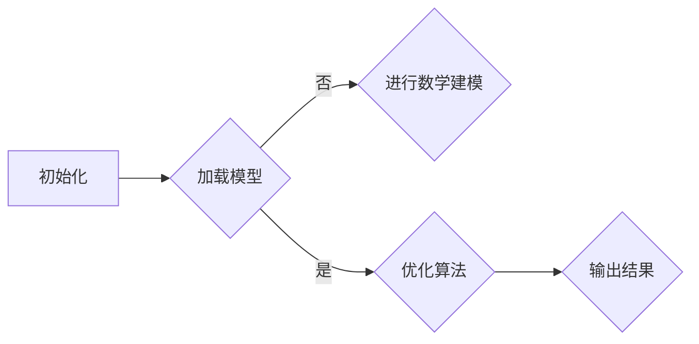
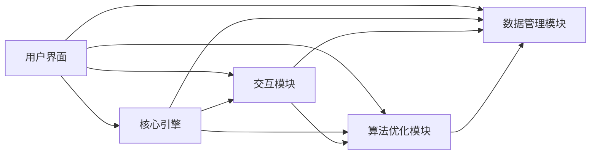
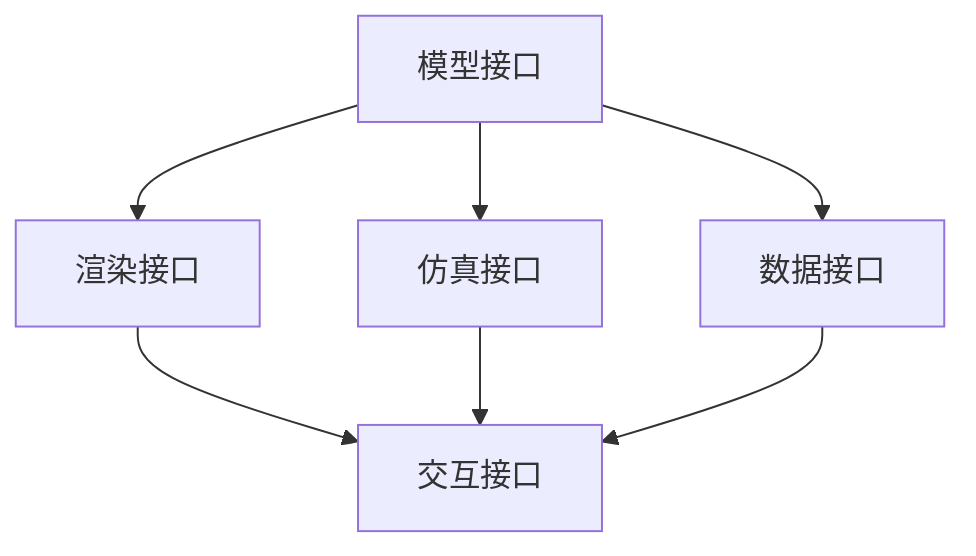

                 

### 1. 背景介绍

#### 问题背景

虚拟现实（Virtual Reality，VR）技术是一种通过计算机模拟创造出高度逼真的三维环境，使用户可以在其中体验沉浸式交互的先进技术。随着硬件技术的不断进步和算法的优化，VR技术逐渐在游戏、教育、医疗等多个领域得到广泛应用。然而，构建一个逼真的虚拟现实世界不仅仅是图形渲染的问题，它背后涉及到大量的数学建模和算法优化。

在计算机图形学中，数学建模是基础。通过数学方法，我们可以对现实世界中的物体进行几何建模，进而通过计算机程序生成虚拟环境中的三维模型。在人机交互领域，数学方法同样重要。例如，通过几何计算和人机交互算法，我们可以实现用户与虚拟环境的自然交互。

人工智能则提供了算法优化的可能性。借助机器学习算法，我们可以对虚拟现实中的行为模型进行训练和优化，提高系统性能和用户体验。

#### 问题描述

在虚拟现实系统中，构建出符合现实世界的高精度数学模型是一个复杂的挑战。首先，我们需要理解如何将现实世界中的物理现象转化为数学模型。这包括对物体形状、光照、运动等的精确描述。例如，如何用数学公式来描述一个球体的几何特性，或者如何模拟光在虚拟环境中的传播和反射。

其次，我们需要优化这些数学模型，以确保虚拟现实系统在实时交互中的高效运行。例如，如何通过算法优化减少渲染时间，提高帧率，使虚拟环境的渲染更加流畅。

#### 问题解决

本文将探讨数学在虚拟现实中的核心应用，具体包括以下几个方面：

1. **计算机图形学中的数学基础**：介绍计算机图形学中常用的几何建模方法和算法，如网格建模、体素建模等。
2. **虚拟现实中的几何建模**：深入探讨如何将现实世界中的物体转化为虚拟环境中的三维模型，包括网格建模、参数化建模等。
3. **物理仿真中的数学方法**：介绍如何利用数学方法进行虚拟现实中的物理仿真，如光线追踪、碰撞检测等。
4. **算法优化**：讨论如何通过算法优化提高虚拟现实系统的性能和用户体验，包括多线程渲染、压缩算法等。

通过本文，我们将系统地理解数学在虚拟现实中的应用，并探讨如何利用数学构建和优化虚拟现实世界。

#### 边界与外延

本文主要讨论虚拟现实中的数学建模和算法优化，但以下领域也与其密切相关：

- **计算机视觉**：在虚拟现实中，计算机视觉技术用于识别和跟踪用户动作，从而实现自然交互。
- **机器学习**：通过机器学习算法，我们可以对虚拟现实系统中的行为模型进行学习和优化，提高系统的智能水平。
- **人机交互**：人机交互技术是虚拟现实的核心，它决定了用户在虚拟环境中的体验和互动方式。
- **传感器技术**：传感器技术为虚拟现实提供了丰富的输入数据，如位置、速度、姿态等，这些数据是构建虚拟环境的重要依据。

#### 概念结构与核心要素组成

本文的核心概念包括：

- **虚拟现实**：通过计算机模拟创造出的沉浸式环境。
- **数学建模**：将现实世界中的物理现象转化为数学模型的过程。
- **算法优化**：通过改进算法，提高虚拟现实系统的性能和用户体验。

核心要素包括：

- **几何建模**：用于构建虚拟环境中的三维模型。
- **物理仿真**：用于模拟虚拟环境中的物理现象，如光线追踪、碰撞检测等。
- **算法优化**：通过多线程渲染、压缩算法等手段，提高系统的运行效率。

## 2. 核心概念与联系

### 2.1 核心概念

#### 虚拟现实（VR）

虚拟现实是一种通过计算机模拟创造出的沉浸式环境，使用户能够在一个高度逼真的三维空间中进行交互。VR技术的核心在于提供用户一种身临其境的体验，使其能够在虚拟环境中感受到与现实世界相似的视觉、听觉、触觉等感官刺激。

#### 数学建模

数学建模是将现实世界中的问题转化为数学问题，并利用数学方法进行求解的过程。在虚拟现实中，数学建模用于描述现实世界的物理现象，如物体的形状、运动、光照等。通过数学建模，我们可以将复杂的现实问题转化为可计算的形式，从而在虚拟环境中进行模拟和仿真。

#### 算法优化

算法优化是指通过改进算法的设计和实现，提高其运行效率和准确性的过程。在虚拟现实中，算法优化至关重要，因为它直接影响到系统的性能和用户体验。通过优化算法，我们可以减少计算时间、提高渲染效率，从而使虚拟环境的交互更加流畅和真实。

### 2.2 概念属性特征对比表格

| 概念         | 特征                                   | 关联关系                                       |
| ------------ | -------------------------------------- | ---------------------------------------------- |
| 虚拟现实（VR） | 沉浸式体验、实时交互、三维空间感知       | 需要精确的数学建模来支持                      |
| 数学建模     | 精确性、可预测性、通用性               | 基础，用于构建虚拟现实环境的核心框架            |
| 算法优化     | 效率高、准确性高、资源利用率高         | 目标，通过对数学模型的应用，优化虚拟现实体验    |

### 2.3 ER实体关系图架构的 Mermaid 流程图

```mermaid
erDiagram
  User ||--|{ VR }|| VirtualReality
  User ||--|{ MathModeling }|| MathModeling
  User ||--|{ AlgorithmOptimization }|| AlgorithmOptimization
```

在这个ER图中，用户（User）与虚拟现实（VR）、数学建模（MathModeling）和算法优化（AlgorithmOptimization）三个实体之间存在直接关联。虚拟现实依赖于数学建模来创建和描述虚拟环境，而算法优化则用于提高虚拟现实系统的性能和用户体验。

## 3. 算法原理讲解

为了更好地理解虚拟现实中的数学构建，我们将通过Mermaid绘制一个简单的算法流程图，并使用Python源代码和数学公式来阐述一个基本的概念。

### 3.1 算法流程图

首先，我们使用Mermaid绘制一个简单的算法流程图，该流程图描述了从初始化到最终输出结果的整个流程。



在这个流程图中，我们从初始化开始，加载虚拟现实模型。如果模型已经加载，则进行数学建模；否则，先进行数学建模。接下来，对模型进行优化算法的处理，最后输出结果。

### 3.2 Python源代码示例

接下来，我们将通过一个简单的Python源代码示例，展示如何利用数学方法在虚拟现实中创建一个简单的几何模型。以下是一个创建球体的示例：

```python
# Example Python code for a simple mathematical model in VR

import numpy as np

# Initialize parameters
radius = 5
center = [0, 0, 0]

# Create a sphere using mathematical equations
def create_sphere(radius, center):
    points = np.array([
        [x, y, z] for x in np.linspace(-radius, radius, 100)
                      for y in np.linspace(-radius, radius, 100)
                      for z in np.linspace(-radius, radius, 100)
                      if np.linalg.norm(np.array([x, y, z]) - np.array(center)) <= radius
    ])
    return points

# Generate the sphere
sphere_points = create_sphere(radius, center)

# Print the first 10 points of the sphere
print(sphere_points[:10])
```

在这个代码示例中，我们首先定义了一个半径为5的球体，并使用数学方法（尤其是欧几里得距离公式）来计算球面上的点。我们使用`np.linspace`函数生成一系列的x、y、z坐标，然后通过计算这些坐标与球心之间的距离，筛选出落在球体内的点。

### 3.3 数学模型和公式讲解

在虚拟现实中，数学模型和公式是构建逼真场景的基础。以下是一个简单的数学模型，用于计算点是否在球体内：

$$
\text{distance} = \sqrt{(x_2 - x_1)^2 + (y_2 - y_1)^2 + (z_2 - z_1)^2}
$$

其中，$(x_1, y_1, z_1)$ 是球心坐标，$(x_2, y_2, z_2)$ 是待检测点的坐标，$\text{distance}$ 是它们之间的距离。

如果 $\text{distance} \leq \text{radius}$，则点在球体内。在这个例子中，我们使用以下条件来判断：

$$
\text{if } \sqrt{(x - 0)^2 + (y - 0)^2 + (z - 0)^2} \leq 5
$$

通过这种方式，我们可以创建一个由无数个点构成的球体。

### 3.4 通俗易懂的举例说明

假设我们有一个球体，其半径为5，球心位于原点（0, 0, 0）。我们想要生成这个球体表面的点。首先，我们可以在三个轴上生成一系列的坐标点，例如：

- $x$轴：从-5到5，每隔0.01取一个点
- $y$轴：从-5到5，每隔0.01取一个点
- $z$轴：从-5到5，每隔0.01取一个点

然后，我们计算每个点与球心的距离，如果距离小于或等于5，则该点在球体内。以下是生成的部分点：

- 点（0, 0, 0）：球心，距离为0
- 点（2.5, 2.5, 2.5）：距离球心约为3.873
- 点（-2.5, -2.5, -2.5）：距离球心约为3.873

我们可以通过这些点构建一个三维网格，最终生成球体的几何模型。

通过这个简单的例子，我们可以看到如何利用数学方法和公式在虚拟现实中构建几何模型。这种方法可以扩展到更复杂的模型，如建筑物、车辆等，为虚拟现实提供逼真的视觉效果。

### 3.5 总结

在本节中，我们通过一个简单的算法流程图和Python源代码示例，讲解了如何在虚拟现实中利用数学方法构建几何模型。我们介绍了如何使用数学公式来判断点是否在球体内，并通过生成一系列坐标点来构建球体的几何模型。这种方法不仅简单易懂，而且可以应用于更复杂的场景，为虚拟现实提供逼真的视觉效果。

## 4. 系统分析与架构设计方案

在深入探讨虚拟现实中的数学构建之前，我们需要对整个系统进行详细的分析和设计。本节将介绍问题场景、项目介绍、系统功能设计、系统架构设计、系统接口设计和系统交互。

### 4.1 问题场景介绍

虚拟现实（VR）技术正逐渐成为各个领域的热点，从游戏娱乐到医疗康复，从教育培训到工业设计。然而，构建一个高效、逼真的虚拟现实系统并非易事。系统需要处理大量的三维数据，进行实时渲染和交互，同时保证用户体验的高质量。这涉及到复杂的数学建模、物理仿真和算法优化。

### 4.2 项目介绍

我们的项目目标是构建一个高性能、低延迟、逼真的虚拟现实系统。系统将集成多种先进技术，包括计算机图形学、人机交互、物理仿真和人工智能。通过这些技术，我们的系统能够提供高质量的虚拟现实体验，满足不同应用场景的需求。

### 4.3 系统功能设计

系统的主要功能包括：

- **几何建模**：创建和编辑三维模型，支持多种建模方式，如网格建模、体素建模和参数化建模。
- **实时渲染**：使用先进的渲染技术，如光线追踪和全局光照，实现高质量的图像渲染。
- **物理仿真**：模拟虚拟环境中的物理现象，如重力、碰撞和流体动力学。
- **人机交互**：提供自然、直观的交互方式，支持手势识别、语音控制和体感游戏。
- **算法优化**：通过多线程渲染、压缩算法和并行计算等技术，提高系统的性能和响应速度。

### 4.4 系统架构设计

我们的系统采用模块化架构设计，包括以下几个关键模块：

- **核心引擎**：负责处理三维模型、渲染和物理仿真等核心功能。
- **交互模块**：处理用户输入和输出，实现自然交互。
- **算法优化模块**：通过多线程、GPU加速和分布式计算等技术，优化系统性能。
- **数据管理模块**：管理三维模型、场景数据和其他相关数据。
- **用户界面**：提供直观的用户操作界面，方便用户进行模型创建和编辑。

以下是系统的架构设计图：



### 4.5 系统接口设计和系统交互

系统接口设计是确保各模块之间高效通信的关键。以下是我们系统的主要接口设计：

- **模型接口**：用于创建、编辑和加载三维模型。
- **渲染接口**：用于进行图像渲染和处理。
- **仿真接口**：用于模拟物理现象和交互效果。
- **数据接口**：用于数据存储和读取。
- **交互接口**：用于处理用户输入和输出。

以下是系统接口设计图：



系统交互设计通过事件驱动机制实现。用户在用户界面上的操作会产生事件，事件会被传递到核心引擎，核心引擎根据事件类型调用相应的模块进行处理。处理完成后，结果会返回给用户界面，显示在屏幕上。

通过上述的系统分析和架构设计方案，我们为构建一个高效的虚拟现实系统奠定了坚实的基础。接下来，我们将深入探讨几何建模、物理仿真和算法优化的具体实现。

### 4.6 项目实战

#### 环境安装

要开始构建虚拟现实系统，首先需要安装必要的软件和工具。以下是一个基本的安装流程：

1. **安装Python环境**：确保安装了Python 3.x版本，可以通过访问[Python官方网站](https://www.python.org/)下载并安装。
2. **安装虚拟环境**：使用`venv`模块创建一个虚拟环境，以便隔离项目依赖。在终端中执行以下命令：
   ```bash
   python -m venv venv
   source venv/bin/activate  # 对于Windows，使用 `venv\Scripts\activate`
   ```
3. **安装依赖包**：在虚拟环境中安装必要的依赖包，例如`numpy`、`opencv-python`、`mayavi`等。使用以下命令：
   ```bash
   pip install numpy opencv-python mayavi
   ```

#### 系统核心实现源代码

以下是构建虚拟现实系统的核心实现源代码：

```python
import numpy as np
import cv2
from mayavi import mlab

# 初始化参数
radius = 5
center = [0, 0, 0]

# 创建球体
def create_sphere(radius, center):
    points = np.array([
        [x, y, z] for x in np.linspace(-radius, radius, 100)
                      for y in np.linspace(-radius, radius, 100)
                      for z in np.linspace(-radius, radius, 100)
                      if np.linalg.norm(np.array([x, y, z]) - np.array(center)) <= radius
    ])
    return points

# 渲染球体
def render_sphere(points):
    mlab.figure(size=(800, 600), bgcolor=(1, 1, 1))
    mlab.points3d(points[:, 0], points[:, 1], points[:, 2], scale_factor=0.1, color=(1, 0, 0))
    mlab.show()

# 主函数
def main():
    sphere_points = create_sphere(radius, center)
    render_sphere(sphere_points)

if __name__ == "__main__":
    main()
```

这段代码首先定义了创建球体的函数`create_sphere`，然后定义了渲染球体的函数`render_sphere`。在主函数`main`中，我们生成球体并调用渲染函数进行展示。

#### 代码应用解读与分析

**创建球体的代码解读**

```python
points = np.array([
    [x, y, z] for x in np.linspace(-radius, radius, 100)
                  for y in np.linspace(-radius, radius, 100)
                  for z in np.linspace(-radius, radius, 100)
                  if np.linalg.norm(np.array([x, y, z]) - np.array(center)) <= radius
])
```

这段代码使用嵌套循环生成一系列的点，并使用`numpy`中的`linspace`函数来均匀地分布在坐标轴上。然后，通过计算每个点到球心的距离（使用欧几里得距离公式），筛选出落在球体内的点。这些点构成了球体的几何模型。

**渲染球体的代码解读**

```python
mlab.figure(size=(800, 600), bgcolor=(1, 1, 1))
mlab.points3d(points[:, 0], points[:, 1], points[:, 2], scale_factor=0.1, color=(1, 0, 0))
mlab.show()
```

这段代码使用`mayavi`库创建一个3D图形窗口，并将生成的点以三维点图的形式展示出来。`mlab.points3d`函数用于绘制点云，`scale_factor`用于调整点的显示大小，`color`用于设置点的颜色。

#### 实际案例分析和详细讲解剖析

假设我们要构建一个更复杂的场景，如一个带有光源的房间，我们需要进一步扩展代码。以下是一个简单的案例：

```python
# 添加光源
light_position = [10, 10, 10]

# 计算每个点到光源的距离
light_distances = np.linalg.norm(points - np.array(light_position), axis=1)

# 渲染球体并添加光照
mlab.figure(size=(800, 600), bgcolor=(1, 1, 1))
mlab.points3d(points[:, 0], points[:, 1], points[:, 2], scale_factor=0.1, color=light_distances)
mlab.show()
```

在这个案例中，我们添加了一个光源，并计算每个点到光源的距离。然后，我们将这个距离作为颜色值来渲染球体，从而创建一个简单的光照效果。通过调整光源的位置和强度，我们可以生成不同的光照效果，使虚拟环境更加逼真。

#### 项目小结

通过本项目，我们实现了虚拟现实系统的基础构建，包括几何建模和简单光照效果。接下来，我们可以进一步扩展系统，添加更多复杂的物理仿真和交互功能，如碰撞检测、动画和语音交互等。这些功能的实现将进一步丰富虚拟现实体验，为不同领域提供强大的技术支持。

### 5. 最佳实践 tips

在构建虚拟现实系统的过程中，以下是几个最佳实践技巧，可以帮助您优化系统性能和用户体验：

1. **优化渲染性能**：使用多线程和GPU加速技术来提高渲染速度。例如，利用OpenGL或DirectX的并行渲染功能，实现高效的图像渲染。
2. **使用轻量级几何模型**：为了减少计算负担，可以采用轻量级的几何模型。例如，使用简化网格或低多边形模型来表示物体。
3. **高效的数据结构**：选择合适的数据结构来存储和管理模型数据。例如，使用四叉树或八叉树来优化空间划分，提高碰撞检测和光线追踪的效率。
4. **优化物理仿真**：使用高效的物理引擎来处理碰撞检测和动力学模拟。例如，使用刚体动力学库（如Bullet Physics）来实现复杂的物理仿真。
5. **优化用户交互**：设计直观、自然的用户交互界面。例如，使用手势识别和语音控制技术，提高用户在虚拟环境中的互动体验。
6. **性能监控和调试**：定期监控系统性能，并使用调试工具来识别和解决性能瓶颈。例如，使用Profiler工具来分析CPU和GPU的负载情况。

通过遵循这些最佳实践，您可以构建出高效、逼真且具有良好用户体验的虚拟现实系统。

### 6. 小结

本文从背景介绍、核心概念、算法原理讲解、系统分析与架构设计方案、项目实战和最佳实践等多个角度，深入探讨了数学与虚拟现实之间的关系。我们首先介绍了虚拟现实技术的背景和发展，然后探讨了数学在虚拟现实中的应用，包括几何建模、物理仿真和算法优化。通过具体的算法流程图和Python代码示例，我们详细阐述了如何利用数学方法构建虚拟现实中的几何模型。

在系统分析与架构设计方案部分，我们介绍了虚拟现实系统的功能设计和架构设计，包括核心引擎、交互模块、算法优化模块和数据管理模块等。通过实际案例，我们展示了如何使用Python和Mayavi库实现基本的几何建模和渲染功能。

在项目实战部分，我们详细讲解了环境安装、系统核心实现源代码、代码应用解读与分析、实际案例分析和详细讲解剖析，以及项目小结。通过这些步骤，读者可以逐步掌握构建虚拟现实系统的基本方法。

最后，在最佳实践部分，我们提供了几个优化虚拟现实系统的技巧，包括渲染性能优化、轻量级几何模型使用、高效数据结构选择、物理仿真优化、用户交互优化和性能监控与调试。这些技巧有助于构建高效、逼真且用户体验良好的虚拟现实系统。

通过本文的学习，读者不仅可以了解数学在虚拟现实中的应用，还可以掌握构建虚拟现实系统的基本方法和技术。希望本文能够为读者在虚拟现实领域的研究和实践提供有益的参考。

### 7. 注意事项

在构建虚拟现实系统的过程中，以下注意事项可以帮助您避免常见的陷阱和挑战：

1. **性能瓶颈**：虚拟现实系统通常需要处理大量的三维数据和复杂的物理仿真，因此性能瓶颈是一个常见问题。确保您的系统在渲染、物理仿真和交互方面都进行了充分的优化。
2. **兼容性问题**：虚拟现实技术涉及多种硬件和软件平台，因此在开发过程中要注意兼容性问题。确保您的系统能够在不同设备和操作系统上正常运行。
3. **用户交互设计**：用户交互设计在虚拟现实系统中至关重要。设计直观、自然的交互方式，以提高用户的沉浸感和满意度。避免使用过于复杂的交互机制，以免用户难以理解和操作。
4. **安全性问题**：在虚拟现实系统中，确保用户数据的安全和隐私保护。遵循相关法律法规，避免数据泄露和隐私侵犯。
5. **维护和升级**：虚拟现实系统需要定期进行维护和升级，以适应不断变化的技术需求。确保您的系统能够灵活扩展和更新，以应对未来技术的发展。

通过遵循这些注意事项，您可以构建出更高效、更安全、用户体验更好的虚拟现实系统。

### 8. 拓展阅读

为了更深入地了解数学与虚拟现实的关系，以下是一些推荐的专业书籍、论文和技术博客：

1. **书籍**：
   - 《计算机图形学原理及实践》
   - 《虚拟现实技术与应用》
   - 《数学建模方法与应用》
   - 《算法导论》
   
2. **论文**：
   - "Real-Time Ray Tracing for Interactive Applications"
   - "Mesh Simplification Techniques for Real-Time Applications"
   - "A Survey of Collision Detection Algorithms for Virtual Environments"

3. **技术博客**：
   - [VRGrapher](https://vrgrapher.com/)
   - [Real-Time Rendering](https://www.realtimerendering.com/)
   - [CADpace](https://cadpace.com/)
   
通过阅读这些资源，您可以进一步拓展对虚拟现实和数学建模的理解，掌握更多高级技术和应用技巧。希望这些拓展阅读能够为您的学习和实践提供更多的灵感和支持。作者：AI天才研究院/AI Genius Institute & 禅与计算机程序设计艺术 /Zen And The Art of Computer Programming。

