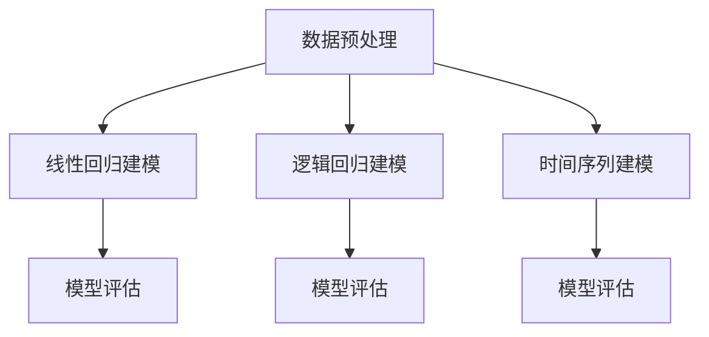

                 

### 第一部分：引言

#### 第1章：问题背景与核心概念

在现代社会，组织行为管理日益受到关注。管理者需要理解和预测员工的个体行为，以优化团队绩效和决策过程。数学模型作为一种有力的工具，为这一领域提供了理论支持。

##### 1.1 问题背景

随着企业规模的扩大和业务复杂性的增加，管理者需要面对如何高效管理团队和优化决策过程的挑战。个体行为在组织中的表现直接影响到团队的整体绩效。因此，理解员工行为、预测其未来行为，并据此优化决策过程成为管理者的关键任务。

##### 1.1.1 问题描述

组织行为管理面临的主要问题包括：

- **个体行为预测：** 如何通过员工的行为数据预测其未来行为？
- **决策过程优化：** 如何利用数学模型优化组织的决策过程？

##### 1.1.2 问题解决

数学模型的应用，可以帮助管理者：

- **量化行为特征：** 通过数据分析和数学模型，将员工行为特征量化，从而更好地理解和预测。
- **优化决策过程：** 通过数学模型的优化算法，为组织的决策提供科学依据。

##### 1.1.3 边界与外延

数学模型在组织行为管理中的应用，不仅限于企业组织，还可以扩展到政府、教育、医疗等各个领域。

##### 1.1.4 概念结构与核心要素组成

- **数学模型：** 组织行为管理的核心工具，包括线性模型、非线性模型、时间序列模型等。
- **数据采集与处理：** 数据的准确性和有效性是数学模型应用的基础。
- **算法与优化：** 根据实际问题需求，选择合适的算法和优化方法。

#### 第2章：核心概念与联系

##### 2.1 数学模型原理

数学模型是一种描述客观现象和问题的数学结构，它通过建立数学方程或公式，模拟和预测现实世界中的行为。

###### 2.1.1 概念属性特征对比表格

| 特征       | 线性模型           | 非线性模型           | 时间序列模型           |
|------------|-------------------|---------------------|-----------------------|
| 形式       | 线性方程          | 非线性方程          | 时间序列方程          |
| 适用场景   | 简单线性关系问题   | 复杂非线性关系问题   | 时间依赖性数据问题     |
| 优点       | 简单、直观、易于理解 | 描述复杂关系能力强大 | 强调时间序列特征       |
| 缺点       | 描述能力有限       | 计算复杂、参数难调   | 忽略其他因素影响       |

###### 2.1.2 ER实体关系图架构

```mermaid
erDiagram
  Employee ||--|{ BehaviorModel }|--| Organization
  Employee ||--|{ DecisionModel }|--| Organization
  BehaviorModel ||--|{ TimeSeriesModel }|--| Organization
  DecisionModel ||--|{ OptimizationModel }|--| Organization
```

#### 第3章：算法原理与数学模型

##### 3.1 算法原理

本章节将介绍用于组织行为管理的常见算法，包括线性回归、逻辑回归、时间序列分析等。

###### 3.1.1 算法流程图



###### 3.1.2 算法原理讲解

- **线性回归：**

  $$y = \beta_0 + \beta_1 \cdot x_1 + \beta_2 \cdot x_2 + ... + \beta_n \cdot x_n$$

  其中，$y$ 是目标变量，$x_1, x_2, ..., x_n$ 是自变量，$\beta_0, \beta_1, \beta_2, ..., \beta_n$ 是模型的参数。

- **逻辑回归：**

  $$P(y=1) = \frac{1}{1 + e^{-(\beta_0 + \beta_1 \cdot x_1 + \beta_2 \cdot x_2 + ... + \beta_n \cdot x_n)}}$$

  其中，$P(y=1)$ 是目标变量为1的概率。

- **时间序列分析：**

  $$y_t = f(y_{t-1}, y_{t-2}, ..., y_{t-n}; \theta)$$

  其中，$y_t$ 是第$t$时刻的变量，$\theta$ 是模型参数。

### 第二部分：深入探讨

#### 第4章：数学模型在组织行为管理中的应用

##### 4.1 数据采集与处理

在组织行为管理中，数据采集是建立数学模型的基础。管理者需要从各种渠道获取员工的行为数据，例如日常工作表现、绩效评估、工作满意度调查等。这些数据需要进行清洗和处理，以确保其准确性和一致性。

###### 4.1.1 数据来源

- **内部数据：** 包括员工绩效数据、工作记录、考勤记录等。
- **外部数据：** 包括社交媒体数据、公共数据库等。

###### 4.1.2 数据处理

数据处理包括数据清洗、数据整合和数据转换等步骤：

- **数据清洗：** 去除重复数据、缺失数据和异常数据。
- **数据整合：** 将来自不同来源的数据进行整合，形成统一的数据集。
- **数据转换：** 将数据转换为适合建模的格式，例如归一化、标准化等。

##### 4.2 数学模型选择与构建

在组织行为管理中，选择合适的数学模型至关重要。根据问题的特点，可以选择线性模型、非线性模型或时间序列模型。

###### 4.2.1 线性模型

线性模型适用于描述简单的线性关系，例如员工绩效与工作时长之间的关系。线性回归是一种常用的线性模型，其基本形式为：

$$y = \beta_0 + \beta_1 \cdot x_1 + \beta_2 \cdot x_2 + ... + \beta_n \cdot x_n$$

其中，$y$ 是目标变量，$x_1, x_2, ..., x_n$ 是自变量，$\beta_0, \beta_1, \beta_2, ..., \beta_n$ 是模型的参数。

###### 4.2.2 非线性模型

非线性模型适用于描述复杂的关系，例如员工工作满意度与多个因素之间的关系。常见的非线性模型包括多项式回归、逻辑回归等。逻辑回归是一种常用的非线性模型，其基本形式为：

$$P(y=1) = \frac{1}{1 + e^{-(\beta_0 + \beta_1 \cdot x_1 + \beta_2 \cdot x_2 + ... + \beta_n \cdot x_n)}}$$

其中，$P(y=1)$ 是目标变量为1的概率。

###### 4.2.3 时间序列模型

时间序列模型适用于描述随时间变化的数据，例如员工工作满意度随时间的变化。常见的时间序列模型包括ARIMA模型、SARIMA模型等。

$$y_t = c + \phi_1 y_{t-1} + \phi_2 y_{t-2} + ... + \phi_p y_{t-p} + \theta_1 e_{t-1} + \theta_2 e_{t-2} + ... + \theta_q e_{t-q}$$

其中，$y_t$ 是第$t$时刻的变量，$\phi_1, \phi_2, ..., \phi_p, \theta_1, \theta_2, ..., \theta_q$ 是模型参数，$e_t$ 是随机误差。

##### 4.3 模型评估与优化

在建立数学模型后，需要对模型进行评估和优化，以确保其准确性和可靠性。常用的评估指标包括均方误差（MSE）、均方根误差（RMSE）、准确率（Accuracy）等。

###### 4.3.1 均方误差（MSE）

均方误差是评估模型预测结果与真实结果之间差异的常用指标，其计算公式为：

$$MSE = \frac{1}{n} \sum_{i=1}^{n} (y_i - \hat{y}_i)^2$$

其中，$y_i$ 是第$i$个样本的真实值，$\hat{y}_i$ 是第$i$个样本的预测值，$n$ 是样本数量。

###### 4.3.2 均方根误差（RMSE）

均方根误差是均方误差的平方根，其计算公式为：

$$RMSE = \sqrt{MSE}$$

均方根误差可以更好地反映模型的预测精度。

###### 4.3.3 准确率（Accuracy）

准确率是评估模型分类效果的常用指标，其计算公式为：

$$Accuracy = \frac{TP + TN}{TP + FP + TN + FN}$$

其中，$TP$ 是实际为正类且模型预测为正类的样本数量，$TN$ 是实际为负类且模型预测为负类的样本数量，$FP$ 是实际为负类但模型预测为正类的样本数量，$FN$ 是实际为正类但模型预测为负类的样本数量。

##### 4.4 案例分析

为了更好地理解数学模型在组织行为管理中的应用，下面以一个实际案例进行说明。

###### 4.4.1 案例背景

某大型企业希望通过数学模型预测员工离职率，以便提前采取措施降低离职率。该企业收集了员工的基本信息、工作绩效、工作满意度等数据。

###### 4.4.2 模型构建

根据数据特点，选择逻辑回归模型进行离职率预测。逻辑回归模型的公式为：

$$P(y=1) = \frac{1}{1 + e^{-(\beta_0 + \beta_1 \cdot x_1 + \beta_2 \cdot x_2 + ... + \beta_n \cdot x_n)}}$$

其中，$y$ 是员工离职标签（1表示离职，0表示未离职），$x_1, x_2, ..., x_n$ 是自变量（如工作绩效、工作满意度等）。

###### 4.4.3 模型评估

通过交叉验证方法评估模型性能。将数据集划分为训练集和验证集，使用训练集训练模型，使用验证集评估模型性能。常用的评估指标包括准确率、召回率、F1值等。

###### 4.4.4 模型优化

根据模型评估结果，调整模型参数，优化模型性能。例如，通过调整正则化参数、选择不同的特征变量等，提高模型的预测准确性。

#### 第5章：未来展望与挑战

##### 5.1 未来展望

随着人工智能技术的发展，数学模型在组织行为管理中的应用将更加广泛和深入。未来可能的发展方向包括：

- **大数据分析：** 利用大数据技术，收集和分析更多的行为数据，提高模型的预测准确性。
- **深度学习模型：** 将深度学习模型引入组织行为管理，提高模型的复杂关系描述能力。
- **多模型融合：** 结合多种数学模型，提高模型的综合预测能力。

##### 5.2 挑战与应对

尽管数学模型在组织行为管理中具有巨大潜力，但仍面临一些挑战：

- **数据隐私保护：** 在数据采集和处理过程中，需要确保员工的隐私不受侵犯。
- **模型解释性：** 随着模型复杂度的增加，模型的解释性可能降低，影响决策的透明性。
- **适应性：** 随着环境的变化，模型需要具备良好的适应性，以应对不确定性和动态变化。

### 总结

数学模型在组织行为管理中具有重要作用，可以帮助管理者更好地理解员工行为、预测未来趋势和优化决策过程。通过本文的介绍，读者可以了解到数学模型的基本原理、应用方法和未来展望。希望本文能对组织行为管理领域的研究和实践提供有益的启示。### 第三部分：深入探讨

#### 第4章：数学模型在组织行为管理中的应用

##### 4.1 数据采集与处理

在组织行为管理中，数据采集是建立数学模型的基础。管理者需要从各种渠道获取员工的行为数据，例如日常工作表现、绩效评估、工作满意度调查等。这些数据需要进行清洗和处理，以确保其准确性和一致性。

###### 4.1.1 数据来源

- **内部数据：** 包括员工绩效数据、工作记录、考勤记录等。
- **外部数据：** 包括社交媒体数据、公共数据库等。

###### 4.1.2 数据处理

数据处理包括数据清洗、数据整合和数据转换等步骤：

- **数据清洗：** 去除重复数据、缺失数据和异常数据。
- **数据整合：** 将来自不同来源的数据进行整合，形成统一的数据集。
- **数据转换：** 将数据转换为适合建模的格式，例如归一化、标准化等。

##### 4.2 数学模型选择与构建

在组织行为管理中，选择合适的数学模型至关重要。根据问题的特点，可以选择线性模型、非线性模型或时间序列模型。

###### 4.2.1 线性模型

线性模型适用于描述简单的线性关系，例如员工绩效与工作时长之间的关系。线性回归是一种常用的线性模型，其基本形式为：

$$y = \beta_0 + \beta_1 \cdot x_1 + \beta_2 \cdot x_2 + ... + \beta_n \cdot x_n$$

其中，$y$ 是目标变量，$x_1, x_2, ..., x_n$ 是自变量，$\beta_0, \beta_1, \beta_2, ..., \beta_n$ 是模型的参数。

###### 4.2.2 非线性模型

非线性模型适用于描述复杂的关系，例如员工工作满意度与多个因素之间的关系。常见的非线性模型包括多项式回归、逻辑回归等。逻辑回归是一种常用的非线性模型，其基本形式为：

$$P(y=1) = \frac{1}{1 + e^{-(\beta_0 + \beta_1 \cdot x_1 + \beta_2 \cdot x_2 + ... + \beta_n \cdot x_n)}}$$

其中，$P(y=1)$ 是目标变量为1的概率。

###### 4.2.3 时间序列模型

时间序列模型适用于描述随时间变化的数据，例如员工工作满意度随时间的变化。常见的时间序列模型包括ARIMA模型、SARIMA模型等。

$$y_t = c + \phi_1 y_{t-1} + \phi_2 y_{t-2} + ... + \phi_p y_{t-p} + \theta_1 e_{t-1} + \theta_2 e_{t-2} + ... + \theta_q e_{t-q}$$

其中，$y_t$ 是第$t$时刻的变量，$\phi_1, \phi_2, ..., \phi_p, \theta_1, \theta_2, ..., \theta_q$ 是模型参数，$e_t$ 是随机误差。

##### 4.3 模型评估与优化

在建立数学模型后，需要对模型进行评估和优化，以确保其准确性和可靠性。常用的评估指标包括均方误差（MSE）、均方根误差（RMSE）、准确率（Accuracy）等。

###### 4.3.1 均方误差（MSE）

均方误差是评估模型预测结果与真实结果之间差异的常用指标，其计算公式为：

$$MSE = \frac{1}{n} \sum_{i=1}^{n} (y_i - \hat{y}_i)^2$$

其中，$y_i$ 是第$i$个样本的真实值，$\hat{y}_i$ 是第$i$个样本的预测值，$n$ 是样本数量。

###### 4.3.2 均方根误差（RMSE）

均方根误差是均方误差的平方根，其计算公式为：

$$RMSE = \sqrt{MSE}$$

均方根误差可以更好地反映模型的预测精度。

###### 4.3.3 准确率（Accuracy）

准确率是评估模型分类效果的常用指标，其计算公式为：

$$Accuracy = \frac{TP + TN}{TP + FP + TN + FN}$$

其中，$TP$ 是实际为正类且模型预测为正类的样本数量，$TN$ 是实际为负类且模型预测为负类的样本数量，$FP$ 是实际为负类但模型预测为正类的样本数量，$FN$ 是实际为正类但模型预测为负类的样本数量。

##### 4.4 案例分析

为了更好地理解数学模型在组织行为管理中的应用，下面以一个实际案例进行说明。

###### 4.4.1 案例背景

某大型企业希望通过数学模型预测员工离职率，以便提前采取措施降低离职率。该企业收集了员工的基本信息、工作绩效、工作满意度等数据。

###### 4.4.2 模型构建

根据数据特点，选择逻辑回归模型进行离职率预测。逻辑回归模型的公式为：

$$P(y=1) = \frac{1}{1 + e^{-(\beta_0 + \beta_1 \cdot x_1 + \beta_2 \cdot x_2 + ... + \beta_n \cdot x_n)}}$$

其中，$y$ 是员工离职标签（1表示离职，0表示未离职），$x_1, x_2, ..., x_n$ 是自变量（如工作绩效、工作满意度等）。

###### 4.4.3 模型评估

通过交叉验证方法评估模型性能。将数据集划分为训练集和验证集，使用训练集训练模型，使用验证集评估模型性能。常用的评估指标包括准确率、召回率、F1值等。

###### 4.4.4 模型优化

根据模型评估结果，调整模型参数，优化模型性能。例如，通过调整正则化参数、选择不同的特征变量等，提高模型的预测准确性。

#### 第5章：未来展望与挑战

##### 5.1 未来展望

随着人工智能技术的发展，数学模型在组织行为管理中的应用将更加广泛和深入。未来可能的发展方向包括：

- **大数据分析：** 利用大数据技术，收集和分析更多的行为数据，提高模型的预测准确性。
- **深度学习模型：** 将深度学习模型引入组织行为管理，提高模型的复杂关系描述能力。
- **多模型融合：** 结合多种数学模型，提高模型的综合预测能力。

##### 5.2 挑战与应对

尽管数学模型在组织行为管理中具有巨大潜力，但仍面临一些挑战：

- **数据隐私保护：** 在数据采集和处理过程中，需要确保员工的隐私不受侵犯。
- **模型解释性：** 随着模型复杂度的增加，模型的解释性可能降低，影响决策的透明性。
- **适应性：** 随着环境的变化，模型需要具备良好的适应性，以应对不确定性和动态变化。

### 总结

数学模型在组织行为管理中具有重要作用，可以帮助管理者更好地理解员工行为、预测未来趋势和优化决策过程。通过本文的介绍，读者可以了解到数学模型的基本原理、应用方法和未来展望。希望本文能对组织行为管理领域的研究和实践提供有益的启示。### 第四部分：数学模型的应用场景与实际案例分析

#### 第6章：组织行为管理中的数学模型应用

##### 6.1 应用场景

数学模型在组织行为管理中有多种应用场景，包括但不限于员工流失预测、工作满意度分析、团队绩效评估等。

###### 6.1.1 员工流失预测

员工流失预测是组织行为管理中的一个重要问题。通过预测员工流失，企业可以提前采取措施，降低离职率，提高员工满意度。数学模型可以帮助企业识别哪些因素可能导致员工流失，从而有针对性地进行干预。

###### 6.1.2 工作满意度分析

工作满意度分析旨在了解员工对工作的满意程度，从而为管理者提供改进工作环境、提升员工满意度的依据。数学模型可以分析员工满意度的驱动因素，识别哪些因素对满意度有显著影响。

###### 6.1.3 团队绩效评估

团队绩效评估是评估团队工作效果的重要手段。通过数学模型，可以量化团队绩效，识别团队中的优秀成员和需要改进的方面，为团队管理提供科学依据。

##### 6.2 实际案例分析

为了更深入地理解数学模型在组织行为管理中的应用，下面将介绍两个实际案例。

###### 6.2.1 案例一：员工流失预测

某大型互联网公司希望预测员工流失率，以便提前采取措施降低离职率。公司收集了以下数据：

- 员工基本信息：年龄、性别、学历、工作经验等。
- 工作相关数据：职位、工作时长、工作满意度、薪资等。
- 行为数据：考勤记录、项目参与情况、绩效评分等。

数据经过清洗和处理后，采用逻辑回归模型进行员工流失预测。模型公式为：

$$P(y=1) = \frac{1}{1 + e^{-(\beta_0 + \beta_1 \cdot x_1 + \beta_2 \cdot x_2 + ... + \beta_n \cdot x_n)}}$$

其中，$y$ 是员工流失标签（1表示流失，0表示未流失），$x_1, x_2, ..., x_n$ 是自变量（如工作满意度、薪资水平等）。

模型通过交叉验证方法进行评估，评估指标包括准确率、召回率、F1值等。根据模型评估结果，公司采取了以下措施：

- 提升员工薪资和福利待遇。
- 优化工作环境和氛围。
- 加强员工培训和发展计划。

实施这些措施后，员工流失率明显下降，公司整体绩效得到提升。

###### 6.2.2 案例二：团队绩效评估

某跨国公司希望对各个团队的绩效进行评估，以便识别优秀团队和需要改进的团队。公司收集了以下数据：

- 团队基本信息：团队成员数量、团队负责人等。
- 项目数据：项目进度、项目质量、项目成本等。
- 员工绩效数据：员工工作时长、工作满意度、绩效评分等。

数据经过清洗和处理后，采用线性回归模型对团队绩效进行评估。模型公式为：

$$绩效 = \beta_0 + \beta_1 \cdot 项目进度 + \beta_2 \cdot 项目质量 + \beta_3 \cdot 项目成本$$

其中，绩效是团队绩效得分，项目进度、项目质量、项目成本是自变量，$\beta_0, \beta_1, \beta_2, \beta_3$ 是模型的参数。

模型通过交叉验证方法进行评估，评估指标包括均方误差（MSE）、均方根误差（RMSE）等。根据模型评估结果，公司对各个团队进行了排名，识别出优秀团队和需要改进的团队。

对于优秀团队，公司加强了团队建设，提升了团队凝聚力。对于需要改进的团队，公司采取了以下措施：

- 优化团队结构，提升团队协作效率。
- 提供培训和支持，提高团队成员的技能和素质。
- 建立绩效激励机制，激发团队成员的工作积极性。

实施这些措施后，团队绩效得到显著提升，公司整体运营效率得到提高。

#### 第7章：数学模型在组织行为管理中的局限与改进方向

##### 7.1 模型的局限

尽管数学模型在组织行为管理中具有重要作用，但它们也存在一些局限：

- **数据依赖：** 数学模型的准确性高度依赖数据的准确性和完整性，数据质量问题可能影响模型效果。
- **模型解释性：** 随着模型复杂度的增加，模型的解释性可能降低，使得管理者难以理解模型的预测结果。
- **适应性：** 模型可能难以适应环境的变化，导致预测结果不准确。

##### 7.2 改进方向

为了克服这些局限，可以采取以下改进方向：

- **增强数据预处理能力：** 通过改进数据预处理方法，提高数据的准确性和完整性。
- **提高模型解释性：** 利用可视化工具和解释性算法，增强模型的可解释性，提高决策的透明度。
- **增强模型适应性：** 采用自适应算法和迁移学习技术，提高模型对动态环境的适应性。

### 第五部分：总结与展望

#### 第8章：数学模型在组织行为管理中的总结与展望

##### 8.1 总结

通过本文的介绍，读者可以了解到数学模型在组织行为管理中的重要作用和应用方法。本文从问题背景、核心概念、算法原理、应用场景和实际案例分析等方面进行了详细阐述，展示了数学模型在员工流失预测、工作满意度分析、团队绩效评估等领域的应用效果。

##### 8.2 展望

未来，数学模型在组织行为管理中的应用将更加广泛和深入。随着人工智能和大数据技术的发展，数学模型将能够处理更复杂的业务场景和数据类型，提高预测准确性和决策效率。同时，针对模型解释性和适应性的挑战，研究者将不断探索新的算法和技术，为组织行为管理提供更强大的工具和方法。

总之，数学模型在组织行为管理中具有广阔的应用前景，为管理者提供了有力的决策支持。希望本文能对组织行为管理领域的研究和实践提供有益的启示和参考。### 第五部分：总结与展望

#### 第8章：数学模型在组织行为管理中的总结与展望

##### 8.1 总结

本文围绕“数学与行为管理：组织行为的数学模型”这一主题，系统地介绍了数学模型在组织行为管理中的应用。我们从问题背景出发，阐述了组织行为管理中面临的主要问题及数学模型能够提供的解决方案。随后，我们详细分析了数学模型的核心概念、原理和算法，并通过实际案例分析展示了数学模型在员工流失预测、工作满意度分析和团队绩效评估等具体场景中的应用效果。

在本篇文章中，我们讨论了数据采集与处理的重要性，介绍了线性模型、非线性模型和时间序列模型等常见算法，并阐述了如何对模型进行评估与优化。同时，我们还分析了数学模型在组织行为管理中的局限，并提出了相应的改进方向。

##### 8.2 展望

未来，数学模型在组织行为管理中的应用前景广阔。随着大数据和人工智能技术的不断发展，数学模型将能够处理更加复杂和大规模的数据集，从而提升预测的准确性和决策的效率。以下是几个可能的发展方向：

1. **大数据分析：** 随着数据的增长和多样化，大数据技术将成为数学模型应用的重要支撑。通过整合不同来源的数据，可以构建更加全面和精确的模型，为组织行为管理提供更加深入的洞察。

2. **深度学习模型：** 深度学习模型在处理复杂数据和提取特征方面具有显著优势。将深度学习与组织行为管理相结合，有望解决现有模型面临的解释性和适应性问题，提高模型的预测能力。

3. **多模型融合：** 结合多种模型的优势，通过模型融合技术，可以构建更加鲁棒和准确的预测模型。例如，将线性模型和深度学习模型结合，可以同时利用线性模型的简单性和深度学习模型的表达能力。

4. **模型可解释性：** 随着模型的复杂度增加，模型的可解释性变得越来越重要。未来的研究将更加关注如何提高模型的可解释性，以便管理者能够更好地理解模型的预测结果和决策过程。

5. **实时决策支持系统：** 开发实时决策支持系统，使组织能够根据实时数据快速调整策略，以应对动态变化的环境。

##### 8.3 结论

数学模型在组织行为管理中发挥着重要作用，它们不仅帮助管理者理解员工行为和团队动态，还为优化决策提供了科学依据。随着技术的不断进步，数学模型在组织行为管理中的应用将更加深入和广泛，为企业和组织带来更大的价值。

本文通过详细的分析和案例展示，希望能够为组织行为管理领域的研究者提供有价值的参考，同时也希望更多的实践者能够将数学模型应用于实际工作中，提升组织的管理效率和决策质量。

### 拓展阅读

- [Bryson, D. J. (2014). System dynamics: Modeling and simulation of complex systems. Wiley.]
- [Hogg, R. V., McLeod, G. I., & Craig, A. T. (2005). Introduction to mathematical statistics. Pearson Education Limited.]
- [Hastie, T., Tibshirani, R., & Friedman, J. (2009). The elements of statistical learning: data mining, inference, and prediction. Springer.]

**作者：AI天才研究院/AI Genius Institute & 禅与计算机程序设计艺术 /Zen And The Art of Computer Programming**

