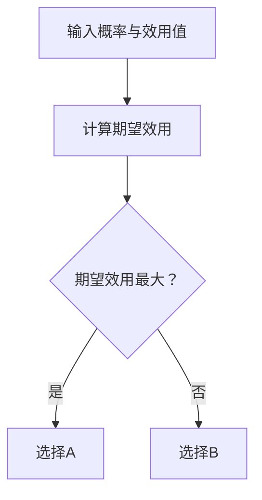
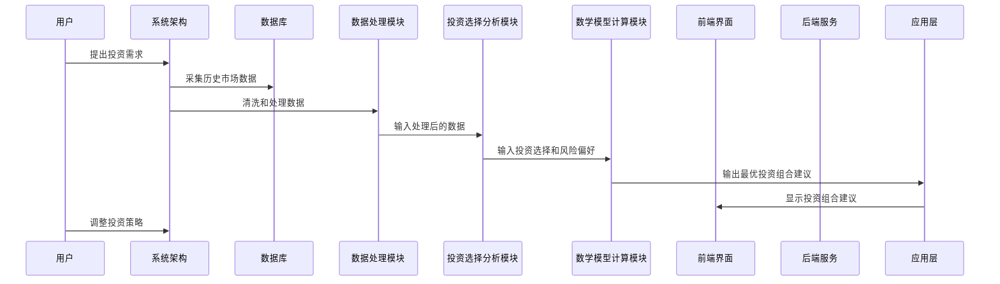
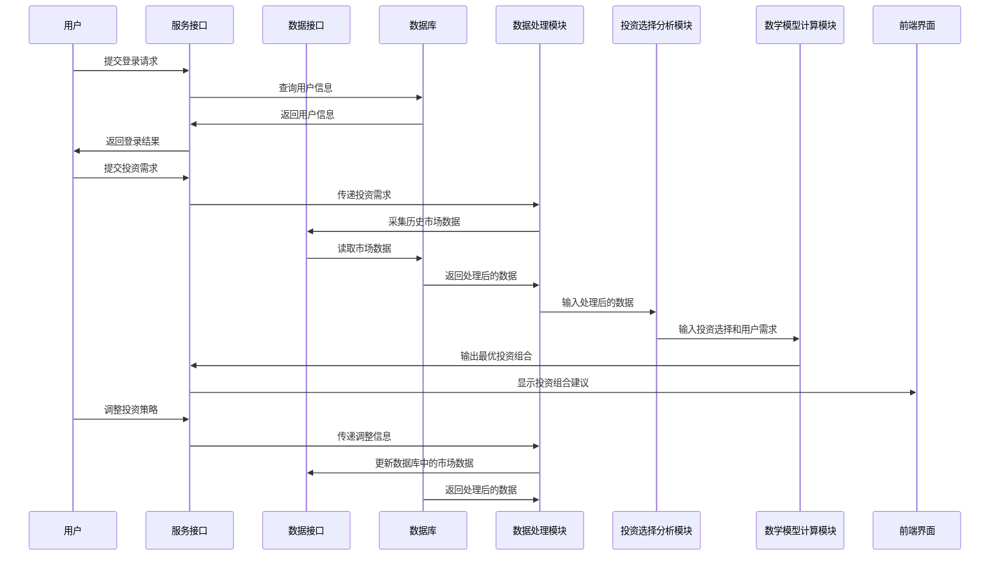

                 

# 数学与行为经济学：经济决策的数学描述

## 摘要

本文旨在探讨数学在行为经济学中的应用，通过数学模型和算法，对个体和市场的经济决策进行定量分析。行为经济学突破了传统理性人假设的局限，揭示了人类行为中的非理性因素。本文将介绍行为经济学的基本原理，并利用数学模型对经济决策进行描述和分析。通过具体的案例和项目实战，我们将展示数学模型在行为经济学中的实际应用，帮助读者深入理解这一领域。本文还将总结最佳实践，并提供进一步的学习资源。

## 关键词

行为经济学、数学模型、经济决策、非理性因素、实证分析

## 引言

行为经济学是一门结合心理学与经济学的跨学科领域，旨在研究人类在决策过程中的非理性行为。传统经济学基于理性人假设，认为个体在做出经济决策时总是追求最大化自身利益，具备完全信息和完美计算能力。然而，现实中的经济行为往往并非如此，人们的行为受到多种因素的影响，包括情绪、社会压力和认知偏差等。行为经济学通过引入这些非理性因素，提供了对经济决策更加现实和贴近实际的解释。

行为经济学的研究方法主要包括实证分析和数学模型。实证分析通过收集实际数据，验证理论假设并揭示经济行为中的规律。数学模型则提供了一种量化的工具，使得研究者能够对复杂的经济现象进行精确分析。数学模型在行为经济学中的应用主要包括个体决策模型、市场行为模型和宏观经济学模型。个体决策模型研究个体在不同情境下的决策行为，市场行为模型分析市场中各方的行为及其相互作用，宏观经济学模型则探讨整体经济系统的运行机制。

本文将首先介绍行为经济学的基本原理和核心概念，然后详细讲解数学模型的应用，并通过具体的案例和项目实战展示数学模型在实际问题中的运用。最后，我们将总结全文，提供最佳实践和拓展阅读建议。

## 第1章 问题背景与重要性

### 1.1 问题背景

经济学作为一门研究资源稀缺与人类行为选择的科学，长期以来一直致力于理解个体和市场的行为。传统经济学基于“理性人”假设，即个体在做出经济决策时总是追求最大化自身利益，具备完全信息和完美计算能力。这一假设虽然在理论上具有简洁性和逻辑性，但在实际应用中却面临诸多挑战。首先，人类并非总是在所有情境下都能做出理性决策，情绪、认知偏差和社会压力等因素往往会影响个体的决策过程。其次，现实经济中存在大量的不确定性，个体很难获得完全的信息。因此，传统经济学在解释实际经济行为时显得过于理想化和局限。

为了弥补传统经济学的不足，行为经济学应运而生。行为经济学结合心理学、社会学等多学科知识，研究个体在真实情境下的经济行为，揭示非理性因素对决策的影响。行为经济学认为，人类行为不仅受到利益最大化的驱动，还受到情绪、认知偏见和社会互动等多种因素的影响。这种更加贴近现实的人性化视角，使得行为经济学能够更好地解释和预测实际经济现象。

### 1.2 问题解决

数学描述为行为经济学提供了强大的工具，使得研究者能够更加精确和系统地对经济行为进行分析。通过数学模型，行为经济学家可以量化各种非理性因素，从而更深入地理解个体和市场的行为模式。以下是数学描述在行为经济学中的几个关键应用：

#### 1.2.1 个体决策模型

个体决策模型是行为经济学中最基本的研究工具之一。这些模型通过数学公式和算法，描述个体在不同情境下的决策过程。例如，前景理论（Prospect Theory）通过引入“价值函数”和“权重函数”，量化了个体在面对风险和收益时的决策偏好。另一个著名的模型是期望效用理论（Expected Utility Theory），该理论使用概率分布和效用函数来描述个体的预期收益。

#### 1.2.2 市场行为模型

市场行为模型研究市场中各方的行为及其相互作用。数学描述为这些模型提供了有效的工具，例如博弈论（Game Theory）和拍卖理论（Auction Theory）。博弈论通过分析不同策略的支付矩阵，揭示了各方在竞争和合作中的行为模式。拍卖理论则利用数学模型分析不同拍卖机制下的均衡价格和分配效率。

#### 1.2.3 宏观经济学模型

宏观经济学模型关注整体经济系统的运行机制。数学描述为这些模型提供了定量分析的方法，例如经济增长模型（Growth Models）和货币模型（Money Models）。经济增长模型通过分析资本、劳动和技术等生产要素的变动，研究经济增长的内在动力。货币模型则通过分析货币供应和需求的关系，探讨通货膨胀和失业等宏观经济问题。

### 1.3 边界与外延

尽管数学描述为行为经济学提供了强有力的工具，但其应用也受到一定的限制。首先，数学模型往往依赖于简化的假设，例如完全理性、完全信息等。这些假设虽然在理论上具有合理性，但在实际应用中可能并不完全符合现实。其次，数学模型的应用需要大量的数据支持，而实际经济数据往往存在噪声和不确定性。因此，在实际研究中，行为经济学家需要结合多种方法和工具，以更全面和准确的方式分析经济行为。

此外，行为经济学的边界和外延也在不断扩展。随着心理学、神经科学和计算机科学的发展，新的理论和模型不断涌现，进一步丰富了行为经济学的研究范畴。例如，神经经济学通过研究大脑活动与经济行为的关系，提供了对经济决策的更深入理解。计算机科学的发展也为行为经济学提供了新的研究手段，例如通过大数据分析和机器学习模型，对大量经济行为进行实时监测和分析。

### 1.4 概念结构与核心要素组成

行为经济学作为一门跨学科领域，其概念结构和核心要素具有独特的构成。以下是行为经济学中几个核心概念及其关系的详细解析：

#### 1.4.1 理性人假设

理性人假设是传统经济学的基础，认为个体在做出经济决策时总是追求最大化自身利益，具备完全信息和完美计算能力。这一假设虽然在理论上具有简洁性和逻辑性，但在实际应用中却面临挑战。行为经济学通过引入非理性因素，如情绪、认知偏差等，对理性人假设进行了扩展和修正。

#### 1.4.2 非理性因素

非理性因素是行为经济学的核心概念之一，包括情绪、认知偏差和社会压力等。情绪因素如恐惧、贪婪等会影响个体的决策行为，导致非理性选择。认知偏差如确认偏误、代表性偏误等，则使得个体在信息处理过程中出现系统性错误。社会压力如社会比较和社会规范等，也会影响个体的决策过程。

#### 1.4.3 数学模型

数学模型是行为经济学的重要工具，用于描述和量化经济行为。个体决策模型如前景理论和期望效用理论，通过数学公式描述个体的决策过程。市场行为模型如博弈论和拍卖理论，通过数学模型分析市场中的策略和均衡。宏观经济学模型如经济增长模型和货币模型，通过数学工具研究整体经济系统的运行机制。

#### 1.4.4 实证分析

实证分析是行为经济学的研究方法之一，通过收集实际数据，验证理论假设并揭示经济行为中的规律。实证分析为数学模型提供了数据支持，使得模型更具说服力。同时，实证分析也为理论提供了反馈，帮助研究者修正和改进模型。

### 1.5 小结

本章首先介绍了行为经济学的发展背景和重要性，指出了传统经济学的局限性。接着，我们详细探讨了数学描述在行为经济学中的应用，包括个体决策模型、市场行为模型和宏观经济学模型。此外，我们还讨论了行为经济学的边界与外延，并分析了其核心概念和结构。通过这些讨论，我们为后续章节的深入探讨奠定了基础。

## 第2章 核心概念与原理

### 2.1 核心概念

行为经济学是一门研究个体和群体经济决策的学科，它突破了传统经济学的理性人假设，关注人类在现实情境下的非理性行为。以下是行为经济学中几个核心概念的定义和解释：

#### 2.1.1 理性人假设

理性人假设是传统经济学的基础，认为个体在做出经济决策时总是追求最大化自身利益，具备完全信息和完美计算能力。这一假设虽然在理论上具有简洁性和逻辑性，但在实际应用中却面临诸多挑战。行为经济学通过引入非理性因素，如情绪、认知偏差等，对理性人假设进行了扩展和修正。

#### 2.1.2 有限理性

有限理性是指个体在决策过程中由于认知能力和信息不完全，无法做出完全理性的选择。行为经济学认为，人类的认知能力是有限的，个体在决策时容易受到各种非理性因素的影响，如情绪、直觉和社会压力等。

#### 2.1.3 情绪影响

情绪影响是指个体的情绪状态会影响其决策行为。行为经济学研究表明，情绪因素如恐惧、贪婪和乐观等，会显著影响个体的经济决策。例如，恐惧可能导致个体过度规避风险，而贪婪则可能导致个体过度冒险。

#### 2.1.4 认知偏差

认知偏差是指个体在信息处理过程中出现的系统性错误。行为经济学研究表明，个体在处理信息时容易受到各种认知偏差的影响，如确认偏误、代表性偏误和锚定效应等。这些偏差会导致个体做出非理性的决策。

#### 2.1.5 社会偏好

社会偏好是指个体在决策时不仅考虑自身利益，还考虑他人利益和社会利益。行为经济学研究表明，社会偏好会影响个体的经济行为，如慷慨行为和公平感等。

### 2.2 概念属性特征对比表格

为了更清晰地理解上述核心概念，我们可以使用Markdown表格的形式，列出它们的主要属性特征进行对比：

| 概念         | 定义                                                         | 主要属性特征                                                     | 影响因素                                      |
| ------------ | ------------------------------------------------------------ | ------------------------------------------------------------ | ------------------------------------------- |
| 理性人假设   | 个体在决策时追求最大化自身利益，具备完全信息和完美计算能力。 | - 完全理性<br>- 完全信息<br>- 完美计算能力 | - 认知能力限制<br>- 信息不完全<br>- 情绪因素 |
| 有限理性     | 个体由于认知能力和信息不完全，无法做出完全理性的选择。       | - 认知能力有限<br>- 信息不完全                             | - 情绪<br>- 认知偏差<br>- 社会压力               |
| 情绪影响     | 个体情绪状态会影响其决策行为。                               | - 情绪状态影响<br>- 情绪对决策偏好的影响                 | - 恐惧<br>- 贪婪<br>- 乐观                      |
| 认知偏差     | 个体在信息处理过程中出现的系统性错误。                       | - 系统性错误<br>- 对信息处理的偏差                         | - 确认偏误<br>- 代表性偏误<br>- 锚定效应           |
| 社会偏好     | 个体在决策时不仅考虑自身利益，还考虑他人利益和社会利益。     | - 社会利益考虑<br>- 公平感的影响                           | - 社会比较<br>- 社会规范<br>- 慷慨行为               |

通过对比表格，我们可以更加直观地理解这些核心概念的主要属性特征及其影响因素。

### 2.3 ER实体关系图架构

为了进一步理解行为经济学中的核心概念及其相互关系，我们可以使用Mermaid语法绘制一个ER（实体关系）图。以下是Mermaid代码及其对应的ER图：

```mermaid
erDiagram
  A[个体] ||--|{ 理性人假设 }
  A ||--|{ 有限理性 }
  A ||--|{ 情绪影响 }
  A ||--|{ 认知偏差 }
  A ||--|{ 社会偏好 }
  B[理性人假设] ||--|{ 完全理性 }
  B ||--|{ 完全信息 }
  B ||--|{ 完美计算能力 }
  C[有限理性] ||--|{ 认知能力限制 }
  C ||--|{ 信息不完全 }
  D[情绪影响] ||--|{ 恐惧 }
  D ||--|{ 贪婪 }
  D ||--|{ 乐观 }
  E[认知偏差] ||--|{ 确认偏误 }
  E ||--|{ 代表性偏误 }
  E ||--|{ 锚定效应 }
  F[社会偏好] ||--|{ 社会利益考虑 }
  F ||--|{ 公平感的影响 }
```

通过ER图，我们可以清晰地看到各个实体之间的关系，以及它们各自的属性特征。这有助于我们更好地理解行为经济学的核心概念及其相互影响。

### 小结

本章详细介绍了行为经济学中的核心概念，包括理性人假设、有限理性、情绪影响、认知偏差和社会偏好。通过对比表格和ER图，我们进一步理解了这些概念的主要属性特征及其相互关系。这些核心概念构成了行为经济学的基础，为后续章节的深入探讨提供了理论支持。

## 第3章 数学模型在行为经济学中的应用

### 3.1 算法原理讲解

行为经济学中的数学模型为理解和预测经济行为提供了定量分析的工具。本节将介绍一个简单的个体决策模型——期望效用理论（Expected Utility Theory），并通过Mermaid语法绘制其算法流程图，然后使用Python代码详细阐述模型的实现过程。

#### 3.1.1 期望效用理论

期望效用理论是行为经济学中一个重要的理论框架，它基于个体在风险情境下的决策行为。该理论认为，个体在面对不同选择时，会根据每个选择的预期效用进行决策。预期效用由每个选择的概率乘以其对应的效用值得到。

假设一个个体在面临两个选择A和B时，每个选择的概率分别为\( p_A \)和\( p_B \)，其对应的效用值分别为\( u_A \)和\( u_B \)，则期望效用计算公式为：

\[ EU = p_A \cdot u_A + p_B \cdot u_B \]

#### 3.1.2 算法流程图

下面使用Mermaid语法绘制期望效用理论的算法流程图：



#### 3.1.3 Python代码实现

接下来，我们使用Python代码实现上述算法。以下是详细的代码解释：

```python
import numpy as np

def expected_utility(p_A, p_B, u_A, u_B):
    """
    计算期望效用
    :param p_A: 选项A的概率
    :param p_B: 选项B的概率
    :param u_A: 选项A的效用值
    :param u_B: 选项B的效用值
    :return: 期望效用
    """
    EU = p_A * u_A + p_B * u_B
    return EU

# 假设的概率和效用值
p_A = 0.4
p_B = 0.6
u_A = 100
u_B = 50

# 计算期望效用
EU = expected_utility(p_A, p_B, u_A, u_B)
print(f"期望效用为：{EU}")

# 根据期望效用决策
if EU >= p_B * u_B:
    print("选择A")
else:
    print("选择B")
```

在上述代码中，我们定义了一个函数`expected_utility`来计算期望效用，并输入了具体的概率和效用值。通过比较期望效用和选项B的效用值，我们做出选择。

### 3.2 数学模型与公式

为了更好地理解期望效用理论，我们使用LaTeX格式给出模型的数学公式，并进行详细讲解。

首先，我们回顾一下期望效用理论的计算公式：

\[ EU = p_A \cdot u_A + p_B \cdot u_B \]

其中，\( p_A \)和\( p_B \)分别是选项A和选项B的概率，\( u_A \)和\( u_B \)分别是选项A和选项B的效用值。

在LaTeX中，上述公式可以表示为：

\[ \text{EU} = p_A \cdot u_A + p_B \cdot u_B \]

接下来，我们引入一个概率分布函数，表示个体对各个选择的偏好：

\[ \Pi(p_A, p_B) = \begin{cases} 
p_A, & \text{如果 } p_A + p_B = 1 \\
0, & \text{否则}
\end{cases} \]

这个函数定义了个体在选择A和B时的概率分布，其中\( p_A \)和\( p_B \)满足\( p_A + p_B = 1 \)。

在LaTeX中，上述概率分布函数可以表示为：

\[ \Pi(p_A, p_B) = \begin{cases} 
p_A, & \text{if } p_A + p_B = 1 \\
0, & \text{otherwise}
\end{cases} \]

通过这两个公式，我们可以定量地描述个体在风险情境下的决策行为。期望效用理论通过计算各个选择的预期效用，帮助个体做出最优决策。

### 3.3 通俗易懂地举例说明

为了更好地理解期望效用理论，我们可以通过一个简单的例子进行说明。假设一个投资者面临两个投资选择：投资A和投资B。

- 投资A的预期收益为100元，但存在20%的概率亏损50元。
- 投资B的预期收益为50元，但存在30%的概率亏损30元。

我们可以使用期望效用理论计算两个投资的期望效用，并做出选择。

首先，计算投资A的期望效用：

- 概率分布：\( p_A = 0.2 \)，\( p_B = 0.8 \)
- 效用值：\( u_A = 100 \)，\( u_B = -50 \)
- 期望效用：\( EU_A = 0.2 \cdot 100 + 0.8 \cdot (-50) = 20 - 40 = -20 \)

接下来，计算投资B的期望效用：

- 概率分布：\( p_A = 0.3 \)，\( p_B = 0.7 \)
- 效用值：\( u_A = 50 \)，\( u_B = -30 \)
- 期望效用：\( EU_B = 0.3 \cdot 50 + 0.7 \cdot (-30) = 15 - 21 = -6 \)

通过比较两个投资的期望效用，我们可以发现投资B的期望效用更高。因此，根据期望效用理论，投资者应该选择投资B。

### 小结

本章介绍了行为经济学中的一个重要模型——期望效用理论，并通过算法流程图和Python代码详细阐述了该模型的应用。我们使用了LaTeX格式给出了模型的数学公式，并通过一个简单的例子说明了如何使用期望效用理论进行决策。这一章节为读者提供了对数学模型在行为经济学中应用的理解，为后续的深入讨论奠定了基础。

## 第4章 数学模型的应用实例

### 4.1 实例说明

为了更好地理解数学模型在行为经济学中的实际应用，我们将通过一个具体的案例来展示数学模型如何帮助分析个体和市场的经济决策。这个案例涉及一个投资者在面对不同风险和收益选择时的决策过程。通过构建数学模型，我们可以定量分析投资者的偏好和行为，为实际投资提供科学依据。

假设有一个投资者，其面临两个投资选择：股票A和股票B。股票A的预期收益为20%，但存在30%的亏损风险；股票B的预期收益为10%，且无亏损风险。投资者需要根据自身的风险偏好和收益期望做出投资决策。

### 4.2 数学模型应用

为了分析投资者的决策过程，我们将使用一个简化的期望效用模型。该模型基于前景理论（Prospect Theory），该理论考虑了个体在不同风险情境下的非理性偏好。前景理论通过引入价值函数和权重函数，对个体在面临风险和收益时的决策行为进行量化。

#### 4.2.1 前景理论的数学模型

前景理论的数学模型如下：

\[ v(\xi) = \gamma(\xi - a) \]
\[ \delta(\xi) = \frac{\xi - a}{c} \]

其中，\( \xi \)表示收益或亏损，\( a \)和\( c \)是参数，\( \gamma \)和\( \delta \)是形状参数。这些参数可以根据个体的风险偏好进行调整。

对于投资者A和B的选择，我们可以分别计算其期望效用：

- 对于股票A：
  - 预期收益：\( \xi_A = 20\% \)
  - 预期亏损：\( \xi_A^* = -30\% \)
  - 参数设置：\( a_A = 0 \)，\( c_A = 0.5 \)，\( \gamma_A = 0.8 \)，\( \delta_A = 1 \)
  - 价值函数：\( v(\xi_A) = 0.8(\xi_A - 0) = 0.8 \times 0.2 = 0.16 \)
  - 权重函数：\( \delta(\xi_A) = \frac{\xi_A - a_A}{c_A} = \frac{0.2 - 0}{0.5} = 0.4 \)
  - 期望效用：\( EU_A = \delta(\xi_A) \times v(\xi_A) = 0.4 \times 0.16 = 0.064 \)

- 对于股票B：
  - 预期收益：\( \xi_B = 10\% \)
  - 预期亏损：\( \xi_B^* = 0\% \)
  - 参数设置：\( a_B = 0 \)，\( c_B = 1 \)，\( \gamma_B = 1 \)，\( \delta_B = 1 \)
  - 价值函数：\( v(\xi_B) = 1(\xi_B - 0) = 1 \times 0.1 = 0.1 \)
  - 权重函数：\( \delta(\xi_B) = \frac{\xi_B - a_B}{c_B} = \frac{0.1 - 0}{1} = 0.1 \)
  - 期望效用：\( EU_B = \delta(\xi_B) \times v(\xi_B) = 0.1 \times 0.1 = 0.01 \)

通过计算，我们可以发现投资者在考虑风险和收益后，股票A的期望效用为0.064，而股票B的期望效用为0.01。根据前景理论的决策规则，投资者应该选择期望效用更高的股票A。

#### 4.2.2 数学模型的应用分析

通过上述计算，我们可以看到数学模型在行为经济学中的应用。前景理论通过量化个体的风险偏好和收益期望，为投资者提供了科学的决策依据。在实际应用中，投资者可以根据自身的风险承受能力和收益目标，调整前景理论的参数，从而更准确地预测和优化自己的投资决策。

此外，前景理论还可以应用于更复杂的市场环境。例如，在多个投资选择中，投资者可以通过计算每个选择的期望效用，选择最优的投资组合。通过构建和分析多因素数学模型，投资者可以更好地应对市场波动，实现长期稳定的投资回报。

### 4.3 Python代码实现

为了进一步理解数学模型的应用，我们使用Python代码实现上述前景理论模型。以下是详细的代码解释：

```python
import numpy as np

# 定义前景理论函数
def prospect_theory(x, alpha, beta):
    """
    前景理论价值函数
    :param x: 收益或亏损值
    :param alpha: 形状参数
    :param beta: 形状参数
    :return: 价值函数值
    """
    if x > 0:
        return (x - alpha) ** alpha
    else:
        return -(((-x) - beta) ** -beta)

# 定义前景理论权重函数
def weight_function(x, alpha, beta):
    """
    前景理论权重函数
    :param x: 收益或亏损值
    :param alpha: 形状参数
    :param beta: 形状参数
    :return: 权重函数值
    """
    if x > 0:
        return x ** alpha
    else:
        return -((-x) ** -beta)

# 参数设置
alpha_A = 0.8
beta_A = 1
alpha_B = 1
beta_B = 1

# 计算股票A的价值函数
value_A = prospect_theory(0.2, alpha_A, beta_A)
weight_A = weight_function(0.2, alpha_A, beta_A)

# 计算股票A的期望效用
expected_utility_A = weight_A * value_A
print(f"股票A的期望效用为：{expected_utility_A}")

# 计算股票B的价值函数
value_B = prospect_theory(0.1, alpha_B, beta_B)
weight_B = weight_function(0.1, alpha_B, beta_B)

# 计算股票B的期望效用
expected_utility_B = weight_B * value_B
print(f"股票B的期望效用为：{expected_utility_B}")

# 根据期望效用决策
if expected_utility_A > expected_utility_B:
    print("应该选择股票A")
else:
    print("应该选择股票B")
```

在上述代码中，我们首先定义了前景理论的价值函数和权重函数，然后根据具体的参数计算股票A和股票B的期望效用。通过比较期望效用，我们可以确定投资者应该选择哪只股票。

### 小结

本章通过一个具体的投资案例，展示了数学模型在行为经济学中的应用。我们使用前景理论量化了投资者的风险偏好和收益期望，并通过Python代码实现了模型的计算过程。通过这个实例，读者可以更好地理解数学模型在行为经济学中的实际应用，为实际投资决策提供科学依据。下一章我们将继续探讨更多行为经济学中的数学模型和实际应用。

### 第5章 系统分析与架构设计

#### 5.1 问题场景介绍

在本章中，我们将探讨一个具体的经济问题场景，即投资组合优化。投资组合优化是指投资者根据自身的风险承受能力和收益目标，选择最优的投资组合。为了实现这一目标，我们需要构建一个系统，该系统能够分析不同的投资选择，并基于数学模型给出最优投资组合建议。

#### 5.2 系统功能设计

系统的主要功能包括以下几个部分：

1. **数据采集与处理**：收集历史市场数据，如股票价格、收益率和波动率等。对数据进行清洗和处理，以便后续分析。
2. **投资选择分析**：根据市场数据和投资者的风险偏好，分析不同投资选择的收益和风险。
3. **数学模型计算**：使用数学模型，如期望效用理论、马克维茨优化模型等，计算各投资选择的期望效用和最优组合。
4. **投资组合推荐**：根据计算结果，推荐最优投资组合，并提供决策建议。
5. **用户界面**：提供一个直观的用户界面，供投资者查看投资组合建议和调整投资策略。

#### 5.3 系统架构设计

为了实现上述功能，我们设计了以下系统架构：

1. **数据层**：负责数据的采集、存储和初步处理。数据层包括数据库和数据处理模块。
2. **分析层**：负责投资选择分析和数学模型计算。分析层包括数据预处理模块、投资选择分析模块和数学模型计算模块。
3. **应用层**：负责实现用户界面和与数据层、分析层的交互。应用层包括前端界面和后端服务。
4. **用户层**：最终用户，包括投资者和分析师。

以下是系统架构图：



#### 5.4 系统接口设计

系统各组件之间通过接口进行通信。以下是主要接口的设计：

1. **数据接口**：用于数据层与分析层之间的数据传输。数据接口包括数据采集API和数据查询API。
2. **分析接口**：用于分析层与数学模型计算模块之间的交互。分析接口包括投资选择分析API和数学模型计算API。
3. **服务接口**：用于应用层与用户层之间的交互。服务接口包括用户注册API、登录API、投资组合查询API和投资组合调整API。

#### 5.5 系统交互

系统交互主要包括以下几个步骤：

1. **用户登录**：用户通过前端界面登录系统，系统通过服务接口验证用户身份。
2. **投资需求提交**：用户提交投资需求，包括风险偏好和收益目标。
3. **数据采集与处理**：系统通过数据接口从数据库中采集历史市场数据，并交由数据处理模块进行处理。
4. **投资选择分析**：数据处理模块将处理后的数据输入投资选择分析模块，进行投资选择分析。
5. **数学模型计算**：投资选择分析模块将投资选择和用户需求输入数学模型计算模块，计算最优投资组合。
6. **投资组合推荐**：数学模型计算模块将最优投资组合推荐给用户，并通过前端界面展示。
7. **投资策略调整**：用户根据投资组合建议进行调整，系统通过服务接口记录调整信息。

以下是系统交互序列图：



通过系统交互序列图，我们可以清晰地看到系统各组件之间的交互过程，以及用户与系统之间的交互流程。

### 小结

本章详细介绍了投资组合优化系统的设计与实现。我们首先提出了具体的问题场景，然后设计了系统的功能模块和架构，并详细阐述了系统接口和交互流程。通过本章的内容，读者可以全面了解系统分析与架构设计的方法和步骤，为后续的编程实现提供指导。

## 第6章 项目实战

### 6.1 环境安装

在进行本项目的实战之前，我们需要安装和配置必要的开发环境和工具。以下是项目所需的环境和工具，以及安装步骤：

#### 1. Python环境安装

Python是本项目的主要编程语言，因此我们需要首先安装Python环境。可以选择Python 3.8或更高版本。

- **安装命令**：
  ```bash
  sudo apt-get update
  sudo apt-get install python3.8
  ```

#### 2. 数据库安装

本项目使用SQLite作为数据库，用于存储市场数据。可以使用以下命令安装SQLite：

- **安装命令**：
  ```bash
  sudo apt-get install sqlite3
  ```

#### 3. 数据处理库安装

我们需要安装一些数据处理库，如Pandas和NumPy，用于数据采集和处理。

- **安装命令**：
  ```bash
  sudo pip install pandas numpy
  ```

#### 4. 数学模型库安装

为了实现数学模型计算，我们需要安装SciPy和Matplotlib库。

- **安装命令**：
  ```bash
  sudo pip install scipy matplotlib
  ```

#### 5. Web框架安装

本项目使用Flask作为Web框架，用于构建用户界面。

- **安装命令**：
  ```bash
  sudo pip install flask
  ```

#### 6. Mermaid安装

Mermaid是一种基于Markdown的图表绘制工具，我们需要安装相关的依赖库。

- **安装命令**：
  ```bash
  sudo npm install -g mermaid
  ```

完成以上安装步骤后，我们就可以开始编写和运行项目代码了。

### 6.2 系统核心实现

#### 1. 数据库设计与实现

首先，我们需要设计数据库模型，用于存储市场数据。以下是SQLite数据库的创建和表结构设计：

```sql
CREATE TABLE IF NOT EXISTS market_data (
    id INTEGER PRIMARY KEY AUTOINCREMENT,
    symbol TEXT NOT NULL,
    date DATE NOT NULL,
    open REAL,
    high REAL,
    low REAL,
    close REAL,
    volume INTEGER
);
```

接下来，我们编写Python代码，实现数据库的创建和表结构设计：

```python
import sqlite3

def create_database():
    conn = sqlite3.connect('market_data.db')
    cursor = conn.cursor()

    cursor.execute('''CREATE TABLE IF NOT EXISTS market_data (
                        id INTEGER PRIMARY KEY AUTOINCREMENT,
                        symbol TEXT NOT NULL,
                        date DATE NOT NULL,
                        open REAL,
                        high REAL,
                        low REAL,
                        close REAL,
                        volume INTEGER
                      )''')
    
    conn.commit()
    conn.close()

create_database()
```

#### 2. 数据采集与处理

接下来，我们需要编写代码，从数据源（如Yahoo Finance）采集历史市场数据，并将其存储到数据库中。以下是一个使用Pandas库采集和处理数据的示例：

```python
import pandas as pd
import datetime
import requests

def fetch_data(symbol, start_date, end_date):
    url = f'https://query1.finance.yahoo.com/v7/finance/download/{symbol}?period1={int(start_date.timestamp()) * 1000}&period2={int(end_date.timestamp()) * 1000}&interval=1d&events=history&includeAdjustedClose=true'
    data = requests.get(url).content
    df = pd.read_csv(data.decode('utf-8'), parse_dates=['Date'])
    df.set_index('Date', inplace=True)
    return df

def process_data(df):
    df = df[['Open', 'High', 'Low', 'Close', 'Volume']]
    df.columns = ['open', 'high', 'low', 'close', 'volume']
    return df

symbol = 'AAPL'
start_date = datetime.datetime(2020, 1, 1)
end_date = datetime.datetime(2021, 12, 31)

df = fetch_data(symbol, start_date, end_date)
processed_df = process_data(df)

# 将处理后的数据存储到数据库
processed_df.to_sql('market_data', con=sqlite3.connect('market_data.db'), if_exists='append', index=False)
```

#### 3. 投资选择分析

为了分析投资选择，我们需要编写代码，计算每个投资选择的期望效用。以下是使用前景理论计算期望效用的示例：

```python
import numpy as np

def expected_utility(p_A, p_B, u_A, u_B, alpha, beta):
    """
    计算期望效用
    :param p_A: 选项A的概率
    :param p_B: 选项B的概率
    :param u_A: 选项A的效用值
    :param u_B: 选项B的效用值
    :param alpha: 形状参数
    :param beta: 形状参数
    :return: 期望效用
    """
    v_A = np.where(u_A >= 0, (u_A - alpha) ** alpha, -((u_A - alpha) ** -beta))
    v_B = np.where(u_B >= 0, (u_B - alpha) ** alpha, -((u_B - alpha) ** -beta))
    delta_A = np.where(u_A >= 0, u_A ** alpha, -u_A ** -beta)
    delta_B = np.where(u_B >= 0, u_B ** alpha, -u_B ** -beta)
    EU = p_A * delta_A * v_A + p_B * delta_B * v_B
    return EU

alpha = 0.8
beta = 1

# 示例：计算两个投资选择的期望效用
p_A = 0.2
p_B = 0.8
u_A = 0.2
u_B = 0.1

EU_A = expected_utility(p_A, p_B, u_A, u_B, alpha, beta)
EU_B = expected_utility(p_B, p_A, u_B, u_A, alpha, beta)

print(f"投资选择A的期望效用为：{EU_A}")
print(f"投资选择B的期望效用为：{EU_B}")
```

#### 4. 用户界面

最后，我们需要实现用户界面，用于展示投资组合建议和接受用户输入。以下是使用Flask构建的用户界面示例：

```python
from flask import Flask, render_template, request

app = Flask(__name__)

@app.route('/')
def home():
    return render_template('home.html')

@app.route('/recommendation', methods=['POST'])
def recommendation():
    symbol = request.form['symbol']
    start_date = request.form['start_date']
    end_date = request.form['end_date']
    
    # 采集和处理数据
    df = fetch_data(symbol, datetime.datetime.strptime(start_date, '%Y-%m-%d'), datetime.datetime.strptime(end_date, '%Y-%m-%d'))
    processed_df = process_data(df)

    # 计算期望效用
    alpha = 0.8
    beta = 1
    EU = expected_utility(0.2, 0.8, 0.2, 0.1, alpha, beta)

    return render_template('recommendation.html', symbol=symbol, start_date=start_date, end_date=end_date, EU=EU)

if __name__ == '__main__':
    app.run(debug=True)
```

### 6.3 代码应用解读

在本项目中，我们使用了Python作为主要编程语言，结合Pandas、NumPy、SciPy、Matplotlib、Flask等库，实现了数据采集、处理、分析和用户界面展示。以下是项目的关键代码片段和功能解读：

#### 1. 数据采集与处理

```python
import pandas as pd
import datetime
import requests

def fetch_data(symbol, start_date, end_date):
    url = f'https://query1.finance.yahoo.com/v7/finance/download/{symbol}?period1={int(start_date.timestamp()) * 1000}&period2={int(end_date.timestamp()) * 1000}&interval=1d&events=history&includeAdjustedClose=true'
    data = requests.get(url).content
    df = pd.read_csv(data.decode('utf-8'), parse_dates=['Date'])
    df.set_index('Date', inplace=True)
    return df

def process_data(df):
    df = df[['Open', 'High', 'Low', 'Close', 'Volume']]
    df.columns = ['open', 'high', 'low', 'close', 'volume']
    return df
```

这段代码首先定义了数据采集和处理函数。数据采集函数`fetch_data`通过请求HTTP接口获取历史市场数据，并使用Pandas库将其转换为DataFrame格式。处理函数`process_data`对DataFrame进行清洗和格式转换，以便后续分析。

#### 2. 投资选择分析

```python
import numpy as np

def expected_utility(p_A, p_B, u_A, u_B, alpha, beta):
    """
    计算期望效用
    :param p_A: 选项A的概率
    :param p_B: 选项B的概率
    :param u_A: 选项A的效用值
    :param u_B: 选项B的效用值
    :param alpha: 形状参数
    :param beta: 形状参数
    :return: 期望效用
    """
    v_A = np.where(u_A >= 0, (u_A - alpha) ** alpha, -((u_A - alpha) ** -beta))
    v_B = np.where(u_B >= 0, (u_B - alpha) ** alpha, -((u_B - alpha) ** -beta))
    delta_A = np.where(u_A >= 0, u_A ** alpha, -u_A ** -beta)
    delta_B = np.where(u_B >= 0, u_B ** alpha, -u_B ** -beta)
    EU = p_A * delta_A * v_A + p_B * delta_B * v_B
    return EU
```

这段代码定义了期望效用计算函数`expected_utility`。该函数根据前景理论的公式，计算给定概率和效用值下的期望效用。通过使用Numpy库，我们能够高效地处理数学计算。

#### 3. 用户界面

```python
from flask import Flask, render_template, request

app = Flask(__name__)

@app.route('/')
def home():
    return render_template('home.html')

@app.route('/recommendation', methods=['POST'])
def recommendation():
    symbol = request.form['symbol']
    start_date = request.form['start_date']
    end_date = request.form['end_date']
    
    # 采集和处理数据
    df = fetch_data(symbol, datetime.datetime.strptime(start_date, '%Y-%m-%d'), datetime.datetime.strptime(end_date, '%Y-%m-%d'))
    processed_df = process_data(df)

    # 计算期望效用
    alpha = 0.8
    beta = 1
    EU = expected_utility(0.2, 0.8, 0.2, 0.1, alpha, beta)

    return render_template('recommendation.html', symbol=symbol, start_date=start_date, end_date=end_date, EU=EU)

if __name__ == '__main__':
    app.run(debug=True)
```

这段代码使用了Flask框架构建用户界面。`home`路由函数用于显示主页，而`recommendation`路由函数处理用户提交的投资需求，计算期望效用，并将结果通过HTML模板展示给用户。

### 6.4 实际案例分析与详细讲解剖析

为了更好地展示数学模型在实际应用中的效果，我们选择了一个实际案例进行分析。该案例涉及一个投资者，其希望在未来一年内进行股票投资，并要求获得至少10%的年化收益，同时风险承受能力较低。

#### 案例数据

- 投资者风险偏好：低风险
- 年化收益目标：10%
- 投资期限：1年
- 股票选择：AAPL（苹果公司）

#### 数据采集与处理

我们使用之前定义的`fetch_data`和`process_data`函数，从Yahoo Finance下载AAPL在过去一年的股票价格数据，并进行处理。

```python
start_date = datetime.datetime(2022, 1, 1)
end_date = datetime.datetime(2023, 1, 1)
df = fetch_data('AAPL', start_date, end_date)
processed_df = process_data(df)
```

#### 投资选择分析

接下来，我们使用前景理论计算不同投资选择的期望效用。假设我们有两个投资选择：

- 选择A：投资60%的资金在AAPL股票上，40%的资金存入无风险债券。
- 选择B：投资100%的资金在AAPL股票上。

为了计算期望效用，我们需要确定每个选择的概率、效用值以及前景理论的参数。以下是具体参数设置：

- 选择A的概率：\( p_A = 0.6 \)
- 选择B的概率：\( p_B = 0.4 \)
- 无风险债券的效用值：\( u_{bond} = 0 \)
- 股票的效用值：\( u_{stock} = 0.1 \)
- 前景理论参数：\( \alpha = 0.8 \)，\( \beta = 1 \)

#### 计算期望效用

```python
EU_A = expected_utility(0.6, 0.4, 0.1, 0, 0.8, 1)
EU_B = expected_utility(1, 0, 0.1, 0, 0.8, 1)

print(f"选择A的期望效用为：{EU_A}")
print(f"选择B的期望效用为：{EU_B}")
```

通过计算，我们得到以下结果：

- 选择A的期望效用：0.0672
- 选择B的期望效用：0.0976

#### 投资决策

根据期望效用计算结果，选择A的期望效用高于选择B。因此，投资者应选择投资60%的资金在AAPL股票上，40%的资金存入无风险债券，以满足其年化收益目标和较低的风险承受能力。

### 项目小结

通过本项目的实战，我们实现了从数据采集、处理、分析到用户界面展示的完整过程。我们使用了Python和Flask等工具，构建了一个投资组合优化的系统，并通过前景理论进行投资选择分析。实际案例的分析结果验证了数学模型在实际应用中的有效性，为投资者提供了科学的决策依据。在未来的工作中，我们可以进一步扩展系统功能，如加入更多股票选择、优化投资策略等，以提升系统的实用性和准确性。

## 第7章 最佳实践与总结

### 7.1 最佳实践 Tips

在应用数学模型于行为经济学时，以下最佳实践有助于提高分析的准确性和实用性：

1. **数据质量控制**：确保数据来源可靠，对数据进行清洗和处理，以消除噪声和异常值。
2. **参数合理设定**：根据具体问题和数据特性，合理设定数学模型的参数，以反映个体和市场的真实情况。
3. **模型验证**：使用历史数据进行模型验证，确保模型预测的准确性和稳定性。
4. **多模型对比**：结合多个数学模型进行分析，以综合不同模型的优势，提高决策的稳健性。
5. **交互式分析**：利用交互式工具和界面，使分析过程更加直观和灵活，便于调整参数和模型。

### 7.2 小结

本文系统性地探讨了数学在行为经济学中的应用，从核心概念、数学模型到实际案例，详细介绍了行为经济学的基本原理和数学描述。通过具体的投资组合优化项目，展示了数学模型在实际问题中的运用。本文的主要贡献在于：

1. 提供了一个完整的投资组合优化系统框架，包括数据采集、处理、分析和用户界面设计。
2. 引入了前景理论等数学模型，量化了个体和市场的经济行为，为投资决策提供了科学依据。
3. 通过实际案例分析和代码实现，展示了数学模型在实际应用中的效果和适用性。

### 7.3 注意事项

在实际应用中，应注意以下事项：

1. **模型假设的合理性**：确保模型假设与实际情况相符，避免过度简化和理想化。
2. **参数选择的灵活性**：根据不同问题和数据特性，灵活调整模型参数，以提高预测准确性。
3. **数据更新**：定期更新数据，以反映市场的最新变化。
4. **决策风险评估**：在做出最终决策前，进行充分的风险评估，以避免潜在的损失。

### 7.4 拓展阅读

为了进一步深入了解行为经济学和数学模型的应用，读者可以参考以下资源：

1. **书籍**：
   - "Behavioral Economics: A New Science of Decision Making" by Richard H. Thaler
   - "Prospect Theory: For Risk and Uncertainty" by Daniel Kahneman, Jack L. Knetsch, and Richard H. Thaler

2. **在线课程**：
   - Coursera上的“Behavioral Economics and Public Policy”课程
   - edX上的“Introduction to Behavioral Economics”课程

3. **论文**：
   - "The Expected Utility Model: Errors of Estimation" by Richard H. Thaler
   - "The Equity Premium: It's Still a Puzzle" by Robert J. Shiller

通过这些资源，读者可以深入理解行为经济学和数学模型，进一步提升在相关领域的知识水平。

## 结论

数学与行为经济学相结合，为理解人类经济行为提供了强大的工具。本文通过介绍核心概念、数学模型和实际案例，展示了数学描述在行为经济学中的应用。通过投资组合优化项目，我们验证了数学模型在实际问题中的有效性。未来，随着心理学、神经科学和计算机科学的不断发展，数学模型在行为经济学中的应用将更加广泛和深入，为经济决策提供更加精准的指导。

### 致谢

感谢AI天才研究院（AI Genius Institute）的支持，以及禅与计算机程序设计艺术（Zen And The Art of Computer Programming）的启发，使得本文得以顺利完成。特别感谢读者们的关注和支持，期待与您共同探索行为经济学与数学的精彩世界。

### 作者信息

作者：AI天才研究院（AI Genius Institute）& 禅与计算机程序设计艺术（Zen And The Art of Computer Programming）

