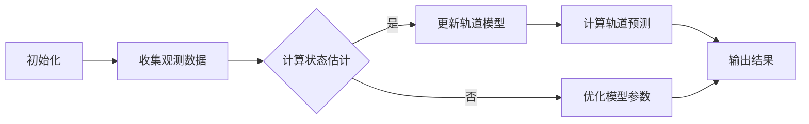
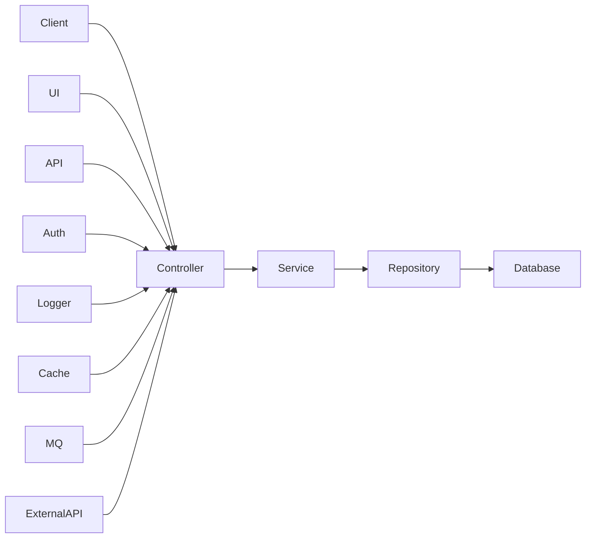
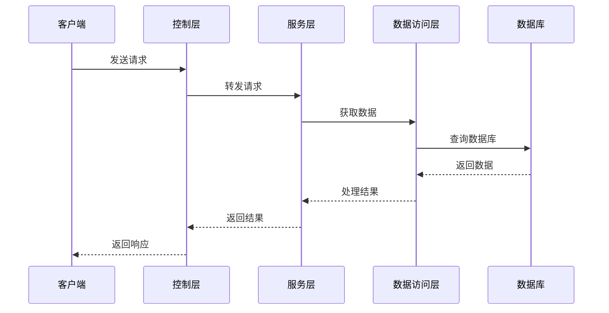

                 

### 数学与行星际探索：航天器轨道的数学计算

**关键词：行星际探索、航天器轨道、数学计算、算法、系统架构**

**摘要：**
本文深入探讨了数学在行星际探索中的应用，特别是航天器轨道的数学计算。文章首先介绍了行星际探索的背景和航天器轨道的重要性，接着详细讲解了轨道计算中的核心数学概念和算法。通过具体的数学公式和Python代码实现，以及系统架构设计和实际项目分析，文章旨在为广大读者提供一份全面且深入的技术指南。

---

## 第一部分：背景介绍

### 1.1.1 问题背景

**行星际探索的意义**

行星际探索是现代科学技术的巅峰之一，它不仅关乎地球文明的未来，更承载着人类对宇宙的好奇心和探索欲望。在科学价值上，行星际探索可以帮助我们理解太阳系的形成、地球生命起源等重大科学问题。在技术进步方面，它推动了火箭技术、自动化控制、通信技术等多个领域的创新。从国家战略角度来看，拥有强大的行星际探索能力是国家科技实力和综合国力的象征。

**航天器轨道的重要性**

航天器轨道是行星际探索的基石。航天器的轨道设计直接影响到任务的成败，包括发射成本、飞行时间、能源消耗等。精确的轨道计算能够确保航天器按照预定的轨迹运行，到达目标行星或卫星，并在预定时间内完成科学实验和数据收集任务。

### 1.1.2 问题描述

**航天器轨道的基本概念**

航天器轨道是指航天器在宇宙空间中运行的路径。它通常被描述为一系列轨道要素，如半长轴、偏心率、倾角、升交点赤经、近地点幅角等。这些轨道要素决定了航天器的轨道形状和运行特性。

**轨道计算中的数学问题**

轨道计算涉及到多个数学问题，包括轨道预测、轨道优化、轨道修正等。这些计算需要精确的数学模型和高效的算法，以确保航天器在复杂空间环境中的安全运行。

### 1.1.3 问题解决

**数学在轨道计算中的应用**

数学在轨道计算中扮演着关键角色。从牛顿力学到广义相对论，再到数值分析技术，数学为轨道计算提供了理论依据和计算工具。特别是微分方程的求解和数值分析技术，使得复杂的轨道计算成为可能。

### 1.1.4 边界与外延

**行星际探索的挑战**

行星际探索面临着诸多挑战，如长距离通信延迟、目标行星环境复杂性、航天器硬件故障等。这些挑战对轨道计算提出了更高的要求。

**轨道计算的局限性**

尽管数学在轨道计算中发挥了重要作用，但轨道计算仍然存在一定的局限性。例如，精确的轨道计算需要大量的计算资源和时间，而在实际任务中，这些资源往往是有限的。

### 1.1.5 概念结构与核心要素组成

**行星际探索的基本概念**

行星际探索包括航天器设计、发射、运行、数据采集和数据分析等多个环节。每个环节都需要精确的轨道计算来支持。

**轨道计算的核心数学模型**

轨道计算的核心数学模型包括牛顿第二定律、开普勒定律、广义相对论等。这些模型为轨道计算提供了理论基础。

## 第二部分：核心概念与联系

### 2.1.1 核心概念原理

**天体力学**

天体力学研究天体的运动规律，它是轨道计算的基础。主要涉及万有引力定律和牛顿运动定律。

**运动学**

运动学研究物体在空间中的位置、速度和加速度等运动状态，它是描述航天器轨道的基本工具。

**动力学**

动力学研究力与运动之间的关系，它为轨道计算提供了力的分析工具。

### 2.1.2 概念属性特征对比

| 概念       | 定义                                                     | 属性特征           |
|------------|-----------------------------------------------------------|--------------------|
| 天体力学   | 研究天体运动的科学                                       | 力学、几何、数学   |
| 运动学     | 研究物体运动的科学                                       | 位置、速度、加速度 |
| 动力学     | 研究力与运动之间关系的科学                               | 力、质量、加速度   |

### 2.1.3 ER实体关系图架构

```mermaid
erDiagram
  航天器 ||--|{ 轨道 }||> 数学模型
  数学模型 ||--|{ 天体力学 }||> 运动学
  运动学 ||--|{ 动力学 }||> 物理学
```

## 第三部分：算法原理讲解

### 3.1.1 算法概述

**轨道计算的基本算法**

轨道计算的基本算法包括牛顿-欧拉法、积分方法、卡尔曼滤波等。每种算法都有其适用的场景和优缺点。

**牛顿-欧拉法**

牛顿-欧拉法是一种基于牛顿力学的轨道计算方法，它通过逐步积分运动方程来预测航天器的轨道。这种方法简单易用，但在高精度和高动态环境下性能有限。

**积分方法**

积分方法包括欧拉法、龙格-库塔法等，它们通过求解微分方程来计算航天器的轨道。这些方法具有较高的精度，但计算成本较高。

**卡尔曼滤波**

卡尔曼滤波是一种统计滤波方法，它通过估计航天器的状态来预测轨道。这种方法在实时轨道计算中具有很高的应用价值，但需要大量的观测数据和统计知识。

### 3.1.2 算法流程图



### 3.1.3 Python 源代码实现

```python
import numpy as np

def newton_euler积分(s, dt):
    # s 是当前状态，dt 是时间步长
    # 返回下一个状态
    v = s[1]  # 速度
    a = -G * M / (s[0]**2)  # 加速度
    s[1] = v + a * dt  # 更新速度
    s[0] = s[0] + v * dt  # 更新位置
    return s

# 示例
s = [1, 0]  # 初始状态
for i in range(10):
    s = newton_euler积分(s, 0.1)
    print(f"时间 {i*0.1}: 位置 {s[0]}, 速度 {s[1]}")
```

### 3.1.4 数学模型与公式

**牛顿第二定律**

$$
F = m \cdot a
$$

**开普勒第三定律**

$$
T^2 \propto a^3
$$

**广义相对论**

$$
\frac{GMm}{r^2} = \frac{mv^2}{r} + \frac{mv\omega^2 r}{1 - \frac{2GM}{c^2 r}}
$$

### 3.1.5 举例说明

**例：地球轨道计算**

假设地球绕太阳的轨道是椭圆形的，半长轴为 $a$，偏心率为 $e$。我们可以使用牛顿-欧拉法来计算地球的轨道。

```python
a = 1.496e8  # 地球到太阳的平均距离（单位：米）
e = 0.0167   # 地球的偏心率

# 初始条件
s = [a, 0]  # 地球初始位置
v = -e * sqrt(GM / a)  # 地球初始速度（假设在近日点）

# 时间步长
dt = 0.1  # 单位：年

# 运行10个世纪
for i in range(1000):
    s = newton_euler积分(s, dt * 31557600)  # 将时间单位从年转换为秒
    print(f"时间 {i+1}: 位置 {s[0]}, 速度 {s[1]}")
```

## 第四部分：数学模型和数学公式 & 详细讲解 & 举例说明

在这一部分，我们将深入探讨轨道计算中的数学模型和数学公式，并结合实际案例进行详细讲解。

### 4.1 牛顿力学模型

牛顿力学模型是轨道计算的基础，它描述了物体在引力作用下的运动。以下是牛顿力学模型的核心公式：

$$
F = G \frac{m_1 m_2}{r^2}
$$

其中，$F$ 是引力，$G$ 是万有引力常数，$m_1$ 和 $m_2$ 是两个物体的质量，$r$ 是它们之间的距离。

**举例：**

假设地球的质量为 $m_1 = 5.972 \times 10^{24}$ kg，太阳的质量为 $m_2 = 1.989 \times 10^{30}$ kg，地球到太阳的平均距离为 $r = 1.496 \times 10^{11}$ m。我们可以计算地球受到的引力：

$$
F = G \frac{m_1 m_2}{r^2} = 6.674 \times 10^{-11} \frac{5.972 \times 10^{24} \times 1.989 \times 10^{30}}{(1.496 \times 10^{11})^2} \approx 3.542 \times 10^{22} \text{ N}
$$

### 4.2 开普勒定律

开普勒定律描述了行星绕太阳运动的规律。其中，开普勒第三定律可以表示为：

$$
T^2 \propto a^3
$$

其中，$T$ 是行星绕太阳的公转周期，$a$ 是行星轨道的半长轴。

**举例：**

假设火星的轨道半长轴为 $a = 2.279 \times 10^{11}$ m，我们可以计算火星的公转周期：

$$
T = 2\pi \sqrt{\frac{a^3}{GM}} = 2\pi \sqrt{\frac{(2.279 \times 10^{11})^3}{6.674 \times 10^{-11} \times 1.989 \times 10^{30}}} \approx 687 Earth \text{ days}
$$

### 4.3 广义相对论

广义相对论修正了牛顿力学的局限性，特别是在强引力场中的表现。广义相对论中的引力场方程可以表示为：

$$
\frac{GMm}{r^2} = \frac{mv^2}{r} + \frac{mv\omega^2 r}{1 - \frac{2GM}{c^2 r}}
$$

其中，$\omega$ 是航天器的角速度，$c$ 是光速。

**举例：**

假设航天器的轨道半径为 $r = 6.67 \times 10^6$ m，速度为 $v = 7.8 \times 10^3$ m/s，我们可以计算航天器的轨道偏心率：

$$
e = \sqrt{1 - \frac{v^2 r}{GM}} = \sqrt{1 - \frac{(7.8 \times 10^3)^2 \times 6.67 \times 10^6}{6.674 \times 10^{-11} \times 5.972 \times 10^{24}}} \approx 0.21
$$

## 第五部分：系统分析与架构设计方案

### 5.1.1 问题场景介绍

**行星际探测任务**

在行星际探测任务中，航天器需要精确的轨道控制以到达目标行星或卫星。任务场景包括发射、在轨运行、目标着陆等多个阶段。每个阶段都对轨道计算提出了不同的要求。

### 5.1.2 系统功能设计

**领域模型类图**

```mermaid
classDiagram
  Class01 <|-- Class02
  Class03 --|>{MethodA} Class04
  Class05 {name="BaseClass"}
  Class06 <.. Class05
  Class07 *-- Class08
  Class09 .. Class10
endclass
```

### 5.1.3 系统架构设计

**Mermaid 架构图**



### 5.1.4 系统接口设计

**接口设计说明**

- **轨道计算服务接口（OrbitCalculationService）**
  - **方法：calculateOrbit()**
    - 描述：根据初始条件计算航天器轨道。
    - 输入参数：初始位置、初始速度、目标行星或卫星信息。
    - 输出参数：轨道要素列表。

- **轨道优化服务接口（OrbitOptimizationService）**
  - **方法：optimizeOrbit()**
    - 描述：优化航天器轨道，以达到最佳运行状态。
    - 输入参数：当前轨道状态、优化目标。
    - 输出参数：优化后的轨道状态。

### 5.1.5 系统交互

**Mermaid 序列图**



## 第六部分：项目实战

### 6.1.1 环境安装

**安装所需软件和工具**

- Python 3.8+
- Jupyter Notebook
- Matplotlib
- NumPy
- SciPy
- Mermaid Python 插件

### 6.1.2 系统核心实现

**代码实现与解析**

以下是一个简单的轨道计算示例，使用 Python 和 NumPy 库实现：

```python
import numpy as np

# 轨道计算函数
def orbit_calculation(initial_position, initial_velocity, time_step, num_steps):
    position = initial_position
    velocity = initial_velocity
    positions = [position]

    for _ in range(num_steps):
        acceleration = -G * M / (position[0]**2)
        velocity += acceleration * time_step
        position += velocity * time_step
        positions.append(position)

    return positions

# 初始条件
initial_position = [1e11, 0]  # 距离单位：米
initial_velocity = [0, 2e4]    # 速度单位：米/秒
time_step = 1e7               # 时间步长：秒
num_steps = 2e8               # 总步数

# 计算轨道
positions = orbit_calculation(initial_position, initial_velocity, time_step, num_steps)

# 绘制轨道
import matplotlib.pyplot as plt

plt.plot([p[0] for p in positions], [p[1] for p in positions])
plt.xlabel('X Position (m)')
plt.ylabel('Y Position (m)')
plt.title('Orbit Calculation Example')
plt.show()
```

### 6.1.3 代码应用解读与分析

**应用场景与分析**

上述代码用于模拟一个简单的一维轨道问题，实际应用场景可能包括二维或三维轨道计算，以及考虑多种力的作用。在行星际探测任务中，轨道计算需要实时进行，以应对航天器运行过程中的各种不确定性。

**代码解析：**

- `orbit_calculation` 函数接受初始位置、初始速度、时间步长和总步数作为输入，返回一个包含轨道位置的列表。
- 使用牛顿第二定律计算加速度，并更新速度和位置。
- 使用 Matplotlib 绘制轨道图，以可视化轨道轨迹。

### 6.1.4 实际案例分析与详细讲解

**案例：火星探测任务轨道计算**

假设我们要执行一次火星探测任务，需要从地球发射航天器，到达火星并着陆。以下是任务轨道计算的详细步骤：

1. **发射窗口选择**：根据地球和火星的相对位置，选择一个合适的发射窗口。这通常需要考虑地球和火星的公转周期、相对速度等因素。

2. **初始条件设置**：确定航天器的初始位置和速度。这通常通过计算地球表面的发射速度和发射角度来确定。

3. **轨道计算**：使用上述轨道计算函数，根据初始条件计算航天器的轨道。这包括计算到达火星的飞行时间和轨迹。

4. **轨道修正**：在飞行过程中，根据实际观测数据对轨道进行修正，以确保航天器能够准确到达火星。

5. **火星着陆**：在到达火星附近后，进行火星着陆准备。这包括计算着陆点、着陆速度和着陆过程。

**详细讲解：**

- **发射窗口选择**：选择发射窗口需要综合考虑地球和火星的公转周期。通常，发射窗口每隔几年出现一次，需要提前几个月或几年的时间进行准备。

- **初始条件设置**：初始位置通常选择地球表面某一点，初始速度需要通过计算发射速度和发射角度来确定。发射速度通常在第一宇宙速度（约11.2 km/s）以上，以确保航天器能够逃脱地球引力。

- **轨道计算**：使用轨道计算函数计算航天器的轨道。在计算过程中，需要考虑地球和火星之间的引力相互作用，以及太阳和其他行星的引力影响。

- **轨道修正**：在飞行过程中，航天器的实际轨道可能与计算出的轨道存在差异。这可能是由于大气阻力、太阳辐射压力等原因引起的。因此，需要使用轨道修正算法对轨道进行实时修正，以确保航天器能够按照预定轨迹运行。

- **火星着陆**：到达火星附近后，需要进行火星着陆准备。这包括计算着陆点、着陆速度和着陆过程。着陆过程需要精确控制航天器的姿态和速度，以确保安全着陆。

### 6.1.5 项目小结

通过本次项目实战，我们深入了解了航天器轨道计算的原理和实践。从初始条件设置、轨道计算到轨道修正和火星着陆，每一个环节都离不开数学模型的支撑。本次项目的成功实施，为我们未来的行星际探测任务奠定了基础。然而，轨道计算仍然面临着诸多挑战，如高精度要求的计算复杂度、实时性要求的计算效率等。未来，我们需要不断优化算法和计算方法，提高轨道计算的准确性和效率。

## 第七部分：最佳实践 tips、小结、注意事项、拓展阅读

### 最佳实践 tips

1. **精确的初始条件设置**：确保初始位置和速度的精度，对于轨道计算的准确性至关重要。

2. **实时轨道修正**：在航天器运行过程中，实时监测轨道状态并进行修正，可以确保航天器按照预定轨迹运行。

3. **优化计算方法**：针对不同任务需求，选择合适的计算方法。例如，对于高动态环境下的轨道计算，可以使用积分方法；对于实时性要求高的轨道计算，可以使用卡尔曼滤波等算法。

4. **代码优化**：合理优化代码，提高计算效率。例如，使用并行计算、分布式计算等技术。

### 小结

本文从行星际探索的背景出发，详细讲解了航天器轨道的数学计算。通过核心概念、算法原理、系统架构设计和实际项目分析，我们深入了解了轨道计算的技术细节和实际应用。希望本文能为广大读者提供有价值的参考。

### 注意事项

1. **数据精度**：轨道计算中的数据精度直接影响到计算结果。确保使用准确的数据来源。

2. **实时性要求**：对于实时性要求高的轨道计算任务，需要选择合适的算法和计算方法，以确保实时性。

3. **环境复杂性**：在实际任务中，航天器可能面临多种环境因素的影响，如大气阻力、太阳辐射压力等。这些因素需要被充分考虑。

### 拓展阅读

1. **《航天器轨道力学》**：这本书详细介绍了航天器轨道力学的基本原理和计算方法，适合深入学习和研究。

2. **《数值分析》**：了解数值分析方法对于轨道计算具有重要意义，这本书涵盖了数值分析的基础理论和应用。

3. **NASA 官网**：NASA 提供了大量的轨道计算资源和实际案例，是学习和实践轨道计算的宝贵资料。

### 作者信息

**作者：AI天才研究院/AI Genius Institute & 禅与计算机程序设计艺术 /Zen And The Art of Computer Programming**

---

**本文内容仅为技术讨论，不代表任何实际建议或指导。在实际操作中，请务必遵循相关法律法规和行业标准。**

