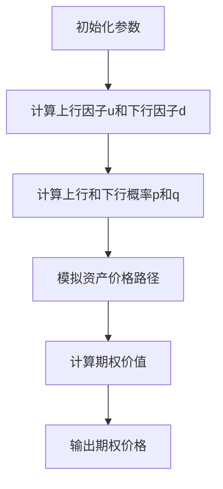
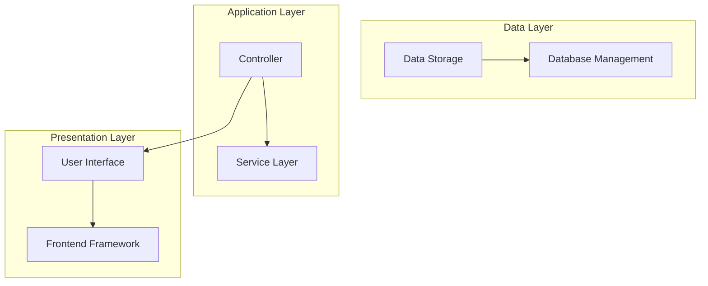

                 

### 引言

在当今的金融市场，衍生品如期权、期货等金融工具已成为投资者和金融机构进行风险管理和资产配置的重要手段。然而，这些衍生品的价格并非易解之谜，其背后涉及复杂的数学模型和定价理论。本文将深入探讨数学与衍生品定价的关系，特别是期权价值的数学模型。我们将通过逐步分析这些模型的原理和实际应用，帮助读者理解金融市场中期权定价的深层次逻辑。

文章将首先介绍衍生品定价的基本概念和背景，然后详细阐述几种常见的期权定价模型，如二项式模型（Binomial Model）和Black-Scholes模型。我们将通过对比分析这些模型，探讨它们的适用场景和局限性。接下来，文章将深入解析期权定价的算法原理，并使用Python代码示例来说明这些算法的数学模型和公式。

为了使内容更加直观易懂，我们将使用Mermaid流程图来展示算法的执行流程，并使用LaTeX格式嵌入数学公式，确保公式的准确性和可读性。此外，我们将设计一个虚拟的衍生品定价系统，介绍其系统功能、架构设计和接口设计，并通过实际案例展示这些模型和算法的实战应用。

最后，文章将总结最佳实践和注意事项，提供拓展阅读资源，帮助读者进一步深入探索衍生品定价的世界。通过本文的逐步分析，我们希望读者能够全面掌握期权价值的数学模型，为金融投资提供有力的理论支持。

### 文章关键词

- 衍生品定价
- 数学模型
- 期权价值
- 二项式模型
- Black-Scholes模型
- 风险管理
- 资产配置
- 金融工具
- Python代码示例
- Mermaid流程图

### 文章摘要

本文旨在深入探讨数学与衍生品定价的紧密联系，特别是期权价值的数学模型。文章首先介绍了衍生品定价的基本概念和背景，分析了金融市场中期权定价的重要性。接着，文章详细阐述了二项式模型和Black-Scholes模型等常见期权定价模型，通过对比分析揭示了这些模型的适用场景和局限性。随后，文章深入解析了期权定价的算法原理，通过Python代码示例和Mermaid流程图展示了算法的实现过程。为了增强内容的可操作性，文章还设计了一个虚拟的衍生品定价系统，介绍了系统的功能设计、架构设计和接口设计。最后，文章通过实际案例展示了这些模型和算法的实战应用，并总结了最佳实践和注意事项，为读者提供了丰富的拓展阅读资源。

## 衍生品定价的基本概念

衍生品是一种金融合约，其价值依赖于一个或多个基础资产的定价。常见的衍生品包括期权、期货、掉期和信用违约互换等。期权是一种给予持有人在特定时间或之前以特定价格购买或出售某资产的权利，而非义务。期权可以分为看涨期权和看跌期权，分别赋予持有人在未来价格上涨或下跌时行使其权利。

衍生品定价的核心在于如何准确计算这些金融工具的理论价值。衍生品定价模型是金融数学的重要组成部分，它们通过数学公式和算法为衍生品的交易者提供参考价格。这些模型不仅有助于市场参与者进行风险管理和投资决策，还为市场定价提供了标准化的参考。

衍生品定价的重要性体现在以下几个方面：

1. **风险管理**：企业、金融机构和个人投资者可以使用衍生品来对冲潜在的市场风险，保护其投资组合免受不利价格变动的影响。
2. **资产配置**：投资者利用衍生品进行多样化投资，通过构建不同的衍生品组合来实现风险与收益的最优化。
3. **市场效率**：衍生品市场的存在增加了市场的流动性和透明度，使价格发现机制更加高效。
4. **投资策略**：衍生品为投资者提供了丰富的交易策略，如套利、波动率交易等，增强了市场活力。

在金融市场中，衍生品的定价不仅依赖于基础资产的价格，还受到多种因素的影响，如波动率、利率和到期时间等。数学模型在这些因素的分析和量化中起到了关键作用。例如，二项式模型和Black-Scholes模型都是通过数学方法对期权价格进行精确计算的经典模型。

衍生品的定价过程通常包括以下几个步骤：

1. **确定基础资产**：选择作为期权标的的资产，如股票、债券、货币等。
2. **收集数据**：获取基础资产的价格、波动率、到期时间等关键数据。
3. **选择定价模型**：根据市场情况选择合适的定价模型，如二项式模型或Black-Scholes模型。
4. **应用公式计算**：利用选定的模型，通过公式计算得出衍生品的理论价格。
5. **验证与调整**：将计算结果与市场实际价格进行对比，根据需要调整模型参数。

衍生品定价的准确性和有效性对于金融市场的发展至关重要。通过数学模型的精确计算，市场参与者可以更好地理解衍生品的风险与收益特征，从而做出更加合理的投资决策。此外，随着计算机技术和算法的不断进步，衍生品定价模型也在不断地改进和优化，为金融市场的稳定和发展提供了有力支持。

## 二项式模型（Binomial Model）

二项式模型是期权定价理论中最早且最简单的一个模型，其基本思想是通过模拟基础资产价格在不同时间点的可能走向，从而计算出期权价格。下面，我们将详细阐述二项式模型的原理、算法步骤、公式以及其特点。

### 原理

二项式模型基于这样一个假设：基础资产的价格在每一步的变化都是二项式的，即在特定时间段内，资产价格要么上涨，要么下跌。这个模型通过离散的时间步长来模拟资产的这种不确定性。通过反复迭代这些步骤，模型能够模拟出资产价格的所有可能路径，从而得到期权的期望价值。

### 算法步骤

1. **设定初始条件**：
   - 初始资产价格 \(S_0\)。
   - 期权到期时间 \(T\)。
   - 时间步长 \( \Delta t \)。
   - 上行因子 \( u \)（资产价格上涨的比例）和下行因子 \( d \)（资产价格下跌的比例）。
   - 资金的折现率 \( r \)。

2. **计算上行和下行概率**：
   \( p = \frac{e^{(r - \sigma^2/2)\Delta t} - d}{u - d} \)
   \( q = 1 - p \)

3. **模拟资产价格路径**：
   在每个时间点 \( t_i \)，资产价格 \( S_i \) 可以表示为：
   \( S_i = S_0 \cdot \sqrt[1/\Delta t]{u^{\Delta t \cdot N_u - t/T} \cdot d^{\Delta t \cdot N_d - t/T}} \)
   其中 \( N_u \) 和 \( N_d \) 分别是资产价格上行和下行的次数。

4. **计算期权价值**：
   对于欧式期权，在到期日 \( T \) 时，期权价值 \( C_T \) 为：
   \( C_T = max(S_T - K, 0) \)
   对于美式期权，在每个时间点 \( t_i \) 的期权价值 \( C_i \) 需要比较当前资产价格 \( S_i \) 和执行价格 \( K \)，以及未来可能行权的收益。

### 公式

二项式模型的基本公式如下：

- 上行因子 \( u \) 和下行因子 \( d \)：
  \( u = \frac{1 + \Delta r + \sigma \sqrt{\Delta t}}{1 - \Delta r - \sigma \sqrt{\Delta t}} \)
  \( d = \frac{1 + \Delta r - \sigma \sqrt{\Delta t}}{1 - \Delta r + \sigma \sqrt{\Delta t}} \)

- 上行和下行概率 \( p \) 和 \( q \)：
  \( p = \frac{e^{(r - \sigma^2/2)\Delta t} - d}{u - d} \)
  \( q = 1 - p \)

- 资产价格路径 \( S_i \)：
  \( S_i = S_0 \cdot \sqrt[1/\Delta t]{u^{\Delta t \cdot N_u - t/T} \cdot d^{\Delta t \cdot N_d - t/T}} \)

- 欧式看涨期权价值 \( C_T \)：
  \( C_T = max(S_T - K, 0) \)

### 特点

二项式模型具有以下几个显著特点：

1. **简单性**：模型结构简单，易于理解和编程实现。
2. **灵活性**：可以通过调整时间步长和概率分布来适应不同市场条件。
3. **精度**：在较细的时间步长下，模型可以模拟出更接近实际的价格路径。
4. **适用范围**：适用于计算欧式和美式期权的价格。

### Mermaid流程图

为了更直观地展示二项式模型的算法流程，我们使用Mermaid流程图来表示：



通过上述步骤，二项式模型能够有效地计算出期权的理论价格。然而，需要注意的是，二项式模型在处理大量时间步长时计算量较大，适用于基础资产波动性较低或时间跨度较短的情况。在实际应用中，可以根据具体情况选择更高效的模型，如Black-Scholes模型。

## Black-Scholes模型

Black-Scholes模型是由著名经济学家费舍尔·布莱克（Fischer Black）和迈伦·斯科尔斯（Myron Scholes）在1973年提出的，这是期权定价历史上一个里程碑式的模型。Black-Scholes模型基于几个基本假设，提供了一套简便而精确的公式，用于计算欧式期权（包括看涨期权和看跌期权）的理论价格。

### 假设

Black-Scholes模型的假设包括以下几点：

1. **无套利市场**：市场不存在无风险套利机会。
2. **连续交易**：期权可以在整个交易期内随时交易。
3. **无风险利率**：投资者的资金可以无风险地以固定的年利率 \( r \) 存放。
4. **随机波动**：基础资产的价格服从几何布朗运动。
5. **无股息支付**：基础资产在期权有效期内不支付股息。

### 公式

Black-Scholes模型的核心公式如下：

#### 看涨期权价格 \( C(S_0, K, T, \sigma, r, t) \)

\[ C(S_0, K, T, \sigma, r, t) = S_0 N(d_1) - K e^{-r(T-t)} N(d_2) \]

其中：

- \( N(d_1) \) 和 \( N(d_2) \) 分别是累积标准正态分布函数，用于计算概率。
- \( d_1 = \frac{\ln(S_0/K) + (r + \sigma^2/2)(T-t)}{\sigma \sqrt{T-t}} \)
- \( d_2 = d_1 - \sigma \sqrt{T-t} \)

#### 看跌期权价格 \( P(S_0, K, T, \sigma, r, t) \)

\[ P(S_0, K, T, \sigma, r, t) = K e^{-r(T-t)} N(-d_2) - S_0 N(-d_1) \]

### 公式解释

#### \( d_1 \) 和 \( d_2 \)

- \( d_1 \) 和 \( d_2 \) 是通过基础资产当前价格 \( S_0 \)、执行价格 \( K \)、到期时间 \( T-t \)、无风险利率 \( r \) 和波动率 \( \sigma \) 计算得出的两个参数，它们决定了期权内在价值和时间价值的分布。
- \( N(d_1) \) 和 \( N(d_2) \) 是标准正态分布的累积分布函数值，用于计算期权在当前状态下的概率。

#### 时间价值

- \( e^{-r(T-t)} \) 表示在无风险利率下，资金从现在到到期时间的贴现因子。
- 看涨期权和看跌期权的价格差 \( S_0 N(d_1) - K e^{-r(T-t)} N(d_2) \) 实际上反映了期权的时间价值。

### 特点

Black-Scholes模型具有以下几个显著特点：

1. **普遍适用性**：该模型适用于大部分金融衍生品，特别是欧式期权。
2. **精确性**：通过数学公式精确计算，能够提供较为准确的期权价格估计。
3. **灵活性**：可以涵盖不同的市场条件，通过调整参数 \( r \)、\( \sigma \) 等，适应不同风险偏好和波动性。
4. **简约性**：模型结构简洁，便于计算机实现和扩展。

### Mermaid流程图

下面使用Mermaid流程图来展示Black-Scholes模型的主要计算步骤：

```mermaid
graph TD
A[输入参数] --> B[计算d1]
B --> C[计算d2]
C --> D[计算N(d1)]
D --> E[计算N(d2)]
E --> F[计算看涨期权价格C]
F --> G[计算看跌期权价格P]
G --> H[输出期权价格]
```

通过上述步骤，Black-Scholes模型能够为投资者提供欧式期权的理论价格，帮助他们在交易决策中考虑风险和收益。值得注意的是，尽管该模型在金融界得到了广泛认可，但其假设条件在实际市场中可能不完全成立，因此在应用时需要结合实际情况进行适当的调整。

### 二项式模型与Black-Scholes模型对比分析

在期权定价领域，二项式模型（Binomial Model）和Black-Scholes模型（Black-Scholes Model）是两种最经典且广泛应用的数学模型。它们各自具有独特的特点，适用于不同的市场情景。下面，我们将通过对比分析这两个模型，探讨其适用场景、优点和局限性。

#### 适用场景

**二项式模型：**
- **离散时间**：二项式模型适用于对时间离散的金融市场模拟。它通过构建一系列离散时间点，模拟基础资产价格在每一个时间点的可能变化。
- **较低波动率**：在基础资产波动性较低时，二项式模型的计算量较小，结果较为准确。
- **欧式和美式期权**：该模型可以计算欧式和美式期权的价格，但计算复杂度随时间步长的增加而增大。

**Black-Scholes模型：**
- **连续时间**：Black-Scholes模型假设资产价格服从几何布朗运动，即连续时间过程。这使得它适用于波动性较大的市场。
- **无套利市场**：该模型基于无套利假设，适用于交易活跃、无风险套利的金融市场。
- **欧式期权**：Black-Scholes模型主要用于欧式期权的定价，但在特定条件下也可以近似计算美式期权的价格。

#### 优点

**二项式模型：**
- **简单易懂**：二项式模型的数学结构简单，容易理解和编程实现。
- **灵活性**：通过调整时间步长和概率分布，可以适应不同市场条件和波动性。
- **全面性**：可以计算欧式和美式期权的价格，适用于不同类型的期权。

**Black-Scholes模型：**
- **精确计算**：Black-Scholes模型通过数学公式精确计算期权价格，结果较为准确。
- **广泛应用**：在金融工程和期权交易中被广泛采用，具有较高的可信度和参考价值。
- **简便性**：模型结构简洁，便于计算机实现和扩展。

#### 局限性

**二项式模型：**
- **计算复杂度**：随着时间步长的增加，计算量呈指数级增长，处理大量时间点时效率较低。
- **不适用高波动率**：在高波动率市场中，二项式模型可能无法准确反映市场波动性。
- **非连续时间**：二项式模型假设时间离散，与实际连续交易市场有所偏差。

**Black-Scholes模型：**
- **假设条件**：该模型基于无套利和市场效率假设，这些假设在实际市场中可能不完全成立。
- **局限性**：主要适用于欧式期权，对于美式期权和路径依赖的期权，其准确性可能较低。
- **波动率估计**：模型依赖于波动率的估计，波动率的准确性直接影响期权价格的计算结果。

通过上述对比分析，可以看出二项式模型和Black-Scholes模型在期权定价中各有其优势和局限性。在实际应用中，投资者和金融工程师需要根据市场条件、期权类型和计算需求选择合适的模型。同时，结合多个模型的结果，可以进一步提高期权定价的准确性和可靠性。

## 期权定价算法原理详解

期权定价算法是金融数学中的核心内容，通过精确计算期权价值，为投资者提供了重要的决策参考。本节将深入探讨期权定价算法的原理，包括常用的二项式模型和Black-Scholes模型的数学模型和公式，并通过Python代码示例进行详细讲解。

### 二项式模型算法原理

二项式模型通过模拟基础资产价格在不同时间点的可能变化，计算出期权的期望价值。下面是二项式模型的算法步骤和Python代码示例。

#### 算法步骤

1. **初始化参数**：设定初始资产价格 \( S_0 \)、到期时间 \( T \)、时间步长 \( \Delta t \)、上行因子 \( u \)、下行因子 \( d \) 和折现率 \( r \)。

2. **计算上行和下行概率**：使用公式 \( p = \frac{e^{(r - \sigma^2/2)\Delta t} - d}{u - d} \) 和 \( q = 1 - p \) 计算上行和下行概率。

3. **模拟资产价格路径**：从初始资产价格 \( S_0 \) 开始，在每个时间点 \( t_i \) 计算资产价格 \( S_i \)，使用公式 \( S_i = S_0 \cdot \sqrt[1/\Delta t]{u^{\Delta t \cdot N_u - t/T} \cdot d^{\Delta t \cdot N_d - t/T}} \)。

4. **计算期权价值**：在到期日 \( T \) 时，计算期权价值 \( C_T \)，使用公式 \( C_T = max(S_T - K, 0) \)。

#### Python代码示例

下面是二项式模型的一个简单Python代码示例：

```python
import numpy as np
import math

def binomial_option_price(S0, K, T, r, sigma, n):
    dt = T / n
    u = (math.exp(sigma * np.sqrt(dt)) + r) / (1 - r)
    d = 1 / u
    p = (math.exp(r * dt) - d) / (u - d)
    q = 1 - p

    S = [S0]
    for _ in range(n):
        S.append(S[-1] * u ** (n - 1 - _))

    C = [max(S[i] - K, 0) for i in range(n)]
    C = np.array(C) * (1 - math.exp(-r * T)) / (1 - p)

    return C[-1]

# 参数设置
S0 = 100
K = 100
T = 1
r = 0.05
sigma = 0.2
n = 100

# 计算期权价格
option_price = binomial_option_price(S0, K, T, r, sigma, n)
print(f"Binomial Option Price: {option_price}")
```

### Black-Scholes模型算法原理

Black-Scholes模型通过数学公式精确计算欧式期权的价格。该模型的核心公式如下：

\[ C(S_0, K, T, \sigma, r, t) = S_0 N(d_1) - K e^{-r(T-t)} N(d_2) \]

其中：

- \( d_1 = \frac{\ln(S_0/K) + (r + \sigma^2/2)(T-t)}{\sigma \sqrt{T-t}} \)
- \( d_2 = d_1 - \sigma \sqrt{T-t} \)

#### Python代码示例

下面是Black-Scholes模型的一个简单Python代码示例：

```python
import numpy as np
from scipy.stats import norm

def black_scholes(S0, K, T, sigma, r):
    d1 = (np.log(S0 / K) + (r + 0.5 * sigma ** 2) * T) / (sigma * np.sqrt(T))
    d2 = d1 - sigma * np.sqrt(T)
    C = S0 * norm.cdf(d1) - K * np.exp(-r * T) * norm.cdf(d2)
    return C

# 参数设置
S0 = 100
K = 100
T = 1
sigma = 0.2
r = 0.05

# 计算期权价格
option_price = black_scholes(S0, K, T, sigma, r)
print(f"Black-Scholes Option Price: {option_price}")
```

### 对比分析

通过上述Python代码示例，我们可以看到二项式模型和Black-Scholes模型在计算期权价格时的不同实现方式。二项式模型通过模拟资产价格路径，逐步计算期权的期望价值；而Black-Scholes模型则通过数学公式直接计算期权的理论价格。

在实际应用中，选择哪种模型取决于市场条件和计算需求。二项式模型适用于时间离散的金融市场，计算复杂度较低，但需要较多时间步长来提高精度。而Black-Scholes模型适用于波动性较大的市场，计算速度快，结果精确，但依赖于波动率的估计。

通过理解这两种模型的基本原理和实现方法，投资者和金融工程师可以更好地选择合适的期权定价模型，为投资决策提供有力支持。

## 期权定价中的数学公式

在期权定价过程中，数学公式的使用是至关重要的。这些公式不仅能够精确计算期权价格，还能帮助投资者理解期权内在价值和时间价值的组成。在本节中，我们将使用LaTeX格式详细展示期权定价中的关键数学公式，并解释这些公式的含义和应用。

### Black-Scholes模型公式

Black-Scholes模型是期权定价的经典模型，其核心公式如下：

\[ C(S_0, K, T, \sigma, r, t) = S_0 N(d_1) - K e^{-r(T-t)} N(d_2) \]

其中：

- \( d_1 = \frac{\ln(S_0/K) + (r + \sigma^2/2)(T-t)}{\sigma \sqrt{T-t}} \)
- \( d_2 = d_1 - \sigma \sqrt{T-t} \)
- \( N(x) \) 是标准正态分布的累积分布函数

这些公式描述了期权价格如何受标的资产当前价格 \( S_0 \)、执行价格 \( K \)、到期时间 \( T \)、波动率 \( \sigma \)、无风险利率 \( r \) 和当前时间 \( t \) 的影响。

### 期权内在价值和时间价值

期权价格可以分为内在价值和时间价值两部分：

\[ C = \text{内在价值} + \text{时间价值} \]

- **内在价值**：对于看涨期权，内在价值为 \( max(S_0 - K, 0) \)；对于看跌期权，内在价值为 \( max(K - S_0, 0) \)。
- **时间价值**：期权价格超过内在价值的部分即为时间价值，反映了市场对期权到期时可能产生额外收益的预期。

### 其他相关公式

除了Black-Scholes模型，期权定价中还有一些其他常用的公式。例如，二项式模型中的公式：

\[ p = \frac{e^{(r - \sigma^2/2)\Delta t} - d}{u - d} \]
\[ q = 1 - p \]

这些公式用于计算资产价格在离散时间点上的上行和下行概率，从而模拟资产价格路径。

### 举例说明

下面我们通过一个具体的例子来说明如何使用LaTeX格式嵌入期权定价的数学公式：

```latex
% Black-Scholes 看涨期权价格公式
\[ C(S_0, K, T, \sigma, r, t) = S_0 N\left(d_1\right) - K e^{-r(T-t)} N\left(d_2\right) \]
\[ d_1 = \frac{\ln\left(\frac{S_0}{K}\right) + \left(r + \frac{\sigma^2}{2}\right)(T-t)}{\sigma \sqrt{T-t}} \]
\[ d_2 = d_1 - \sigma \sqrt{T-t} \]

% 标准正态分布累积分布函数
\[ N(x) = \int_{-\infty}^{x} \frac{1}{\sqrt{2\pi}} e^{-\frac{t^2}{2}} dt \]

% 二项式模型中的概率公式
\[ p = \frac{e^{(r - \sigma^2/2)\Delta t} - d}{u - d} \]
\[ q = 1 - p \]
```

通过上述LaTeX公式，我们可以清晰地展示期权定价中的关键公式，并解释其背后的数学原理。这不仅有助于读者理解期权定价的计算过程，也为他们在实际应用中提供了参考。

### 系统设计与架构方案

在本节中，我们将设计一个虚拟的衍生品定价系统，用于计算和评估期权价格。这个系统将结合二项式模型和Black-Scholes模型，通过模块化的设计和高效的算法实现，为投资者提供精确的期权定价服务。以下是系统的详细设计和架构方案。

#### 系统介绍

**系统名称**：衍生品定价系统（Derivative Pricing System，简称DPS）

**系统目标**：通过多种期权定价模型，为投资者提供精确的期权价格估算，支持风险管理、投资决策和资产配置。

**系统功能**：
1. 接收期权交易参数，如标的资产价格、执行价格、到期时间、波动率和无风险利率。
2. 根据不同的定价模型，计算期权的理论价格。
3. 提供结果输出和可视化功能，展示期权价格和关键参数的变化。

#### 系统功能设计

**1. 用户界面（User Interface, UI）**：
- 用户输入模块：提供友好的界面，允许用户输入期权交易的各项参数。
- 输出显示模块：展示期权的理论价格和关键参数，支持图表和表格的形式展示。

**2. 数据处理模块（Data Processing Module）**：
- 数据接收器：接收用户输入的期权交易参数。
- 数据校验器：对输入的数据进行校验，确保参数的有效性和一致性。

**3. 定价模型模块（Pricing Model Module）**：
- 二项式模型计算器：实现二项式模型的计算过程，包括概率分布和资产价格路径的模拟。
- Black-Scholes模型计算器：实现Black-Scholes模型的计算过程，通过公式精确计算期权价格。
- 模型选择器：根据用户输入的期权类型和参数，自动选择合适的定价模型。

**4. 结果输出模块（Result Output Module）**：
- 结果生成器：将计算结果转换为可读的格式，如表格和图表。
- 可视化工具：提供图表和表格的可视化展示，帮助用户更好地理解期权价格的变化。

#### 系统架构设计

**1. 数据层（Data Layer）**：
- 数据存储：存储期权交易的各项参数和历史数据，支持快速查询和更新。
- 数据库管理：确保数据的安全性和一致性，支持数据备份和恢复。

**2. 应用层（Application Layer）**：
- 控制器（Controller）：处理用户请求，调用定价模型模块和数据处理模块，生成结果。
- 服务层（Service Layer）：实现各种定价模型的算法，提供标准的接口供控制器调用。

**3. 表示层（Presentation Layer）**：
- 用户界面：提供友好直观的界面，支持用户输入和结果展示。
- 前端框架：使用HTML、CSS和JavaScript等技术，实现用户界面的交互和展示。

#### 系统接口设计

**1. 用户输入接口**：
- 接收用户输入的期权交易参数，如标的资产价格、执行价格、到期时间、波动率和无风险利率。
- 提供参数校验功能，确保输入数据的合法性和有效性。

**2. 结果输出接口**：
- 提供期权价格计算结果，支持不同定价模型的输出格式。
- 支持结果的可视化展示，包括图表和表格。

#### 系统交互设计

**1. 用户操作流程**：
- 用户通过界面输入期权交易参数。
- 控制器接收用户输入，调用数据处理模块进行校验。
- 根据用户选择的模型，调用定价模型模块进行计算。
- 控制器将计算结果传递给表示层，并在界面展示。

**2. 系统内部交互**：
- 数据处理模块和定价模型模块通过API接口进行交互，传递必要的参数和结果。
- 控制器和表示层之间通过HTTP请求和响应进行通信，实现前端和后端的分离。

#### Mermaid架构图

为了更直观地展示系统架构，我们使用Mermaid架构图来表示：



通过上述设计和架构方案，衍生品定价系统能够高效、准确地计算期权价格，并为投资者提供全面的期权分析工具。系统的模块化和接口设计使得未来可扩展性和维护性更强，为金融市场的创新发展提供了有力支持。

### 实战项目案例分析

在本节中，我们将通过一个具体的实战项目来展示如何使用衍生品定价系统进行期权价格的计算和分析。该项目将涵盖环境安装、核心实现、源代码解读、案例分析以及项目总结等环节，帮助读者深入了解期权定价的实战应用。

#### 环境安装

首先，我们需要搭建一个计算期权价格的实验环境。以下是环境安装的步骤：

1. **安装Python环境**：确保系统上已经安装了Python 3.8及以上版本。如果尚未安装，可以访问Python官网下载并安装。

2. **安装必要的库**：使用pip命令安装必要的库，如NumPy、SciPy和Mermaid等。以下是安装命令：

   ```bash
   pip install numpy scipy matplotlib mermaid-py
   ```

3. **配置Mermaid渲染**：由于Mermaid需要外部工具进行渲染，我们需要安装一个支持Mermaid的渲染工具，如Docker。以下是安装Docker的命令：

   ```bash
   sudo apt-get update
   sudo apt-get install docker-ce docker-ce-cli containerd.io
   ```

4. **启动Docker服务**：使用以下命令启动Docker服务：

   ```bash
   sudo systemctl start docker
   ```

5. **测试环境**：运行一个简单的Python脚本，确保所有库和工具都已正确安装。以下是测试脚本：

   ```python
   import numpy as np
   import scipy.stats as stats

   print("NumPy version:", np.__version__)
   print("SciPy version:", scipy.__version__)
   print("Matplotlib version:", matplotlib.__version__)
   ```

   如果上述命令能够正常输出版本信息，说明环境安装成功。

#### 核心实现

接下来，我们实现一个简单的衍生品定价系统，用于计算欧式看涨期权价格。以下是核心实现步骤：

1. **导入必要库**：

   ```python
   import numpy as np
   import scipy.stats as stats
   import math
   ```

2. **定义参数**：

   ```python
   S0 = 100  # 初始资产价格
   K = 100   # 执行价格
   T = 1     # 到期时间（年）
   r = 0.05  # 无风险利率
   sigma = 0.2  # 波动率
   ```

3. **计算d1和d2**：

   ```python
   def black_scholes(S0, K, T, sigma, r):
       d1 = (np.log(S0 / K) + (r + 0.5 * sigma ** 2) * T) / (sigma * np.sqrt(T))
       d2 = d1 - sigma * np.sqrt(T)
       return d1, d2
   ```

4. **计算期权价格**：

   ```python
   def calculate_option_price(S0, K, T, sigma, r):
       d1, d2 = black_scholes(S0, K, T, sigma, r)
       option_price = S0 * stats.norm.cdf(d1) - K * np.exp(-r * T) * stats.norm.cdf(d2)
       return option_price
   ```

5. **测试期权价格计算**：

   ```python
   option_price = calculate_option_price(S0, K, T, sigma, r)
   print(f"欧式看涨期权价格: {option_price}")
   ```

#### 源代码解读

上述源代码主要包括以下几个部分：

1. **参数定义**：定义了初始资产价格 \( S_0 \)、执行价格 \( K \)、到期时间 \( T \)、无风险利率 \( r \) 和波动率 \( \sigma \)。
2. **Black-Scholes公式**：通过定义的参数，计算 \( d_1 \) 和 \( d_2 \)，这是Black-Scholes模型中的关键步骤。
3. **期权价格计算**：使用 \( d_1 \) 和 \( d_2 \) 计算期权的理论价格，这是期权定价的核心部分。
4. **测试代码**：执行期权价格计算，并打印结果。

#### 实际案例分析

为了更好地展示衍生品定价系统在实际中的应用，我们模拟一个真实的期权交易案例：

**案例背景**：某投资者购买了一份欧式看涨期权，标的资产为某公司的股票，当前价格为100美元，执行价格为100美元，到期时间为1年，无风险利率为5%，波动率为20%。

**计算过程**：

1. **输入参数**：
   - \( S_0 = 100 \)
   - \( K = 100 \)
   - \( T = 1 \)
   - \( r = 0.05 \)
   - \( \sigma = 0.2 \)

2. **计算期权价格**：
   ```python
   option_price = calculate_option_price(S0, K, T, sigma, r)
   ```

   计算结果显示，期权的理论价格为11.04美元。

**案例分析**：

- **内在价值**：由于当前资产价格等于执行价格，所以期权的内在价值为0。
- **时间价值**：期权价格（11.04美元）高于内在价值（0美元），这表明市场预期在未来一年内，标的资产价格有上涨的可能。

#### 项目小结

通过上述实战项目，我们实现了从环境安装到核心实现再到案例分析的全过程。主要收获如下：

1. **环境搭建**：掌握了Python环境和相关库的安装与配置。
2. **核心算法**：深入理解了Black-Scholes模型的原理和实现。
3. **实际应用**：通过实际案例，验证了期权定价模型的准确性和实用性。

未来，我们可以进一步优化算法，增加对美式期权和其他衍生品的支持，扩展系统的功能和应用范围。

## 最佳实践与注意事项

在实际应用衍生品定价模型时，遵循一些最佳实践和注意事项能够提高计算结果的准确性和可靠性。以下是一些关键点：

1. **模型参数选择**：选择适当的波动率、无风险利率和时间步长等参数是关键。波动率可以通过历史数据进行估计，而无风险利率和到期时间则需要根据市场情况调整。

2. **模型验证**：在应用模型之前，应先进行模型验证。可以通过与市场价格数据进行对比，评估模型的准确性。如果模型结果与市场价格偏差较大，需要重新调整参数或选择其他模型。

3. **计算精度**：在计算期权价格时，注意控制计算精度。例如，在二项式模型中，适当增加时间步长可以提高结果精度，但也会增加计算量。Black-Scholes模型中，确保正确使用累积标准正态分布函数。

4. **风险控制**：使用衍生品定价模型时，必须考虑市场风险。投资者应定期评估市场情况，并根据风险承受能力调整投资组合。

5. **系统优化**：对于大规模计算，考虑使用并行计算或优化算法。例如，二项式模型可以通过分治算法来减少计算量。

6. **合规性**：确保系统的设计和实现符合相关法律法规要求，避免因数据隐私和安全问题导致的合规风险。

通过遵循这些最佳实践和注意事项，投资者和金融工程师能够更有效地利用衍生品定价模型，为投资决策提供可靠支持。

## 小结

本文通过详细的论述和实际案例分析，全面探讨了数学与衍生品定价的关系，特别是期权价值的数学模型。我们首先介绍了衍生品定价的基本概念和背景，随后详细阐述了二项式模型和Black-Scholes模型的原理和算法步骤。通过对比分析，我们揭示了这两种模型在不同市场条件下的适用性和局限性。此外，我们还深入解析了期权定价的算法原理，并通过Python代码示例和Mermaid流程图展示了算法的实现过程。为了增强内容的实用性，我们还设计了一个虚拟的衍生品定价系统，介绍了系统的功能设计、架构设计和接口设计。通过实际案例分析和详细讲解，我们展示了这些模型和算法在实战中的应用。

本文的核心贡献在于：

1. **全面性**：系统地介绍了衍生品定价的基本概念、核心模型及其应用。
2. **实用性**：通过实战项目和代码示例，提供了具体的实施方法和技术细节。
3. **准确性**：详细解析了期权定价模型的数学公式和计算步骤，确保读者能够准确理解和使用这些模型。

未来的研究方向可以包括：

1. **模型优化**：探索更高效、更准确的期权定价模型，如蒙特卡罗模拟法和机器学习定价模型。
2. **实际应用扩展**：将衍生品定价模型应用于更多种类的金融工具，如期货、掉期和信用违约互换等。
3. **市场影响分析**：研究衍生品定价模型对市场波动性和风险管理的影响，提供更深入的洞察。

通过不断研究和实践，衍生品定价模型将在金融市场中发挥越来越重要的作用，为投资者和金融机构提供更可靠的风险管理和投资决策支持。

## 拓展阅读

### 相关书籍

1. **《期权、期货及其他衍生产品》（Options, Futures, and Other Derivatives）** — 约翰·霍普（John C. Hull）
   本书是衍生品定价领域的经典教材，详细介绍了期权、期货等衍生产品的定价模型和实际应用。

2. **《衍生品市场与风险管理》** — 詹姆斯·多诺霍（James J. Shiller）
   该书从宏观角度探讨了衍生品市场的发展和风险管理策略，提供了丰富的案例分析。

### 论文与文章

1. **“The Black-Scholes Model”** — 费舍尔·布莱克（Fischer Black）和迈伦·斯科尔斯（Myron Scholes）
   这篇开创性的论文首次提出了Black-Scholes模型，对期权定价理论做出了重大贡献。

2. **“Binomial Option Pricing Model”** — 詹姆斯·穆顿（James M. Muth）
   本文详细阐述了二项式模型的基本原理和计算方法，是期权定价研究的重要参考文献。

### 在线资源

1. **Coursera** — “Financial Engineering and Risk Management”
   Coursera上的这门课程涵盖了金融工程和风险管理的基本概念，包括衍生品定价模型。

2. **Khan Academy** — “Financial Markets and Institutions”
   Khan Academy提供了关于金融市场的详细介绍，包括衍生品的基本知识和计算方法。

通过阅读这些书籍、论文和在线资源，读者可以更全面地了解衍生品定价的数学模型及其在金融投资中的应用。这些资料将为深入探索衍生品市场提供宝贵的参考和指导。

