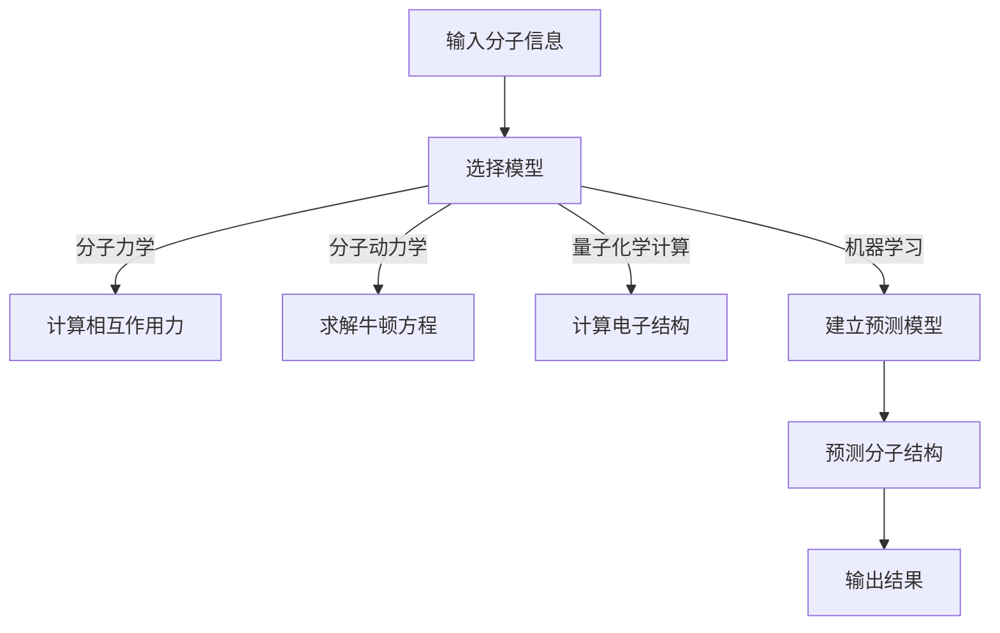
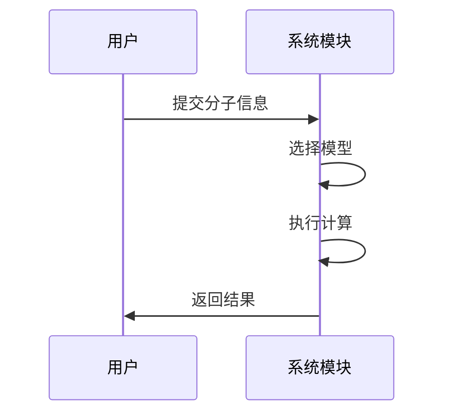

                 

### 一、文章标题、关键词与摘要

**文章标题：数学与计算化学：分子结构的数学预测**

**关键词：数学、计算化学、分子结构、预测模型、算法应用**

**摘要：**
本文深入探讨了数学与计算化学在分子结构预测中的应用。首先，通过引言和背景介绍，梳理了数学与计算化学的基本概念及其在化学领域的应用。接着，本文详细阐述了分子结构的数学模型，并比较了不同模型的特点。随后，介绍了用于分子结构预测的算法，并通过Python源代码和mermaid流程图进行了具体分析。文章还涉及分子结构预测的实际应用，包括化学反应预测、材料设计和药物设计。最后，总结了最佳实践、注意事项及拓展阅读，为读者提供了进一步学习的方向。通过本文，读者可以全面了解数学与计算化学在分子结构预测中的重要作用。

### 二、引言与背景

**1. 引言**

在科学发展的长河中，人类对于物质世界的认识不断深化。化学作为一门研究物质的性质、组成、结构、变化规律的科学，其重要性不言而喻。随着科技的进步，数学与计算化学逐渐成为化学研究的重要工具。数学不仅提供了精确的描述和理论框架，还为计算化学提供了强大的分析工具和计算方法。计算化学则利用计算机模拟和计算技术，研究分子结构、性质和反应过程，极大地推动了化学研究的发展。

**2. 问题背景**

分子结构是化学的核心概念之一，它直接影响着分子的性质和化学反应行为。然而，分子的结构非常复杂，传统的实验方法难以精确测定。随着计算能力的提升，人们开始探索使用数学模型和计算方法来预测分子结构。分子结构的数学预测不仅有助于理解分子的基本性质，还可以应用于药物设计、材料科学和能源领域，具有重要的应用价值。

**3. 问题描述**

分子结构的数学预测涉及多个层面的问题：
- 如何选择合适的数学模型来描述分子结构？
- 如何利用计算化学方法，如分子力学和分子动力学模拟，预测分子结构？
- 如何处理大量的数据，提取有用的信息？
- 如何确保预测结果的准确性和可靠性？

**4. 问题解决**

数学与计算化学在分子结构预测中扮演了关键角色。数学模型提供了对分子结构的抽象描述，而计算化学方法则通过计算机模拟，实现了对分子结构的精确预测。通过结合多种数学模型和计算方法，可以不断提高分子结构预测的准确性。

**5. 边界与外延**

分子结构的数学预测虽然已经取得了显著的成果，但仍然存在一些挑战和限制。例如，计算资源的限制可能影响模型的选择和计算精度。此外，预测结果的可靠性也需要通过实验验证来进一步确认。因此，未来的研究需要不断探索新的数学模型和计算方法，以提高分子结构预测的准确性和实用性。

### 三、数学与计算化学基础

**1. 数学概念介绍**

数学作为一门基础学科，提供了许多工具和理论框架，用于描述和分析复杂系统的行为。在分子结构预测中，常用的数学概念包括：

- **线性代数**：用于处理向量空间和矩阵运算，是分子几何学和分子轨道理论的重要工具。
- **微积分**：用于描述函数的局部性质和变化率，是分子动力学模拟中的核心。
- **概率论与统计**：用于处理不确定性和随机性，是数据分析和建模的基础。
- **图论**：用于研究网络结构和路径优化，可以应用于分子结构的拓扑分析。

**2. 计算化学概念介绍**

计算化学是应用计算机技术和数学方法研究分子和物质性质的科学。在分子结构预测中，常用的计算化学方法包括：

- **分子力学（MM）**：基于经典力学原理，通过模拟分子间的相互作用力，预测分子的几何构型。
- **分子动力学（MD）**：通过求解牛顿方程，模拟分子的运动轨迹，用于研究动态过程。
- **量子化学计算**：利用量子力学原理，计算分子的电子结构和能量。
- **机器学习**：通过学习大量实验数据，建立预测模型，用于分子性质预测。

**3. 核心概念与联系**

数学与计算化学的联系体现在多个方面：

- **数学模型**：数学模型是计算化学的基础，用于描述分子结构、相互作用和反应过程。
- **计算方法**：计算化学方法依赖于数学方法，如数值积分、矩阵运算和优化算法。
- **数据处理**：数学中的概率论和统计方法，用于处理和解释实验数据。
- **验证与优化**：数学中的数学分析和优化理论，用于验证计算结果的准确性和优化计算方法。

### 四、分子结构的数学模型

**1. 概念原理**

分子结构的数学模型是用于描述分子几何和电子结构的抽象表示。常见的模型包括：

- **价键理论（VB）**：基于原子轨道重叠形成化学键。
- **分子轨道理论（MO）**：将原子轨道组合成分子轨道，用于描述电子在分子中的分布。
- **分子力学（MM）**：基于经典力学模型，计算分子几何构型和相互作用能量。
- **分子动力学（MD）**：基于牛顿力学，模拟分子的运动轨迹，用于研究动态过程。

**2. 概念属性特征对比表格**

| 模型名称 | 描述 | 优点 | 缺点 |
| --- | --- | --- | --- |
| 价键理论（VB） | 基于原子轨道重叠形成化学键 | 简单易懂 | 无法描述多重键 |
| 分子轨道理论（MO） | 将原子轨道组合成分子轨道 | 描述电子分布 | 计算复杂 |
| 分子力学（MM） | 基于经典力学模型 | 计算速度快 | 无法描述动态过程 |
| 分子动力学（MD） | 基于牛顿力学 | 描述动态过程 | 计算复杂 |

**3. ER实体关系图**


在ER实体关系图中，分子结构模型（Entity）与价键理论、分子轨道理论、分子力学和分子动力学（Relationship）之间存在关联。这反映了不同模型在描述分子结构方面的互补性。

### 五、分子结构预测算法

**1. 算法原理讲解**

分子结构预测算法的核心思想是通过数学模型和计算方法，从分子性质和相互作用中推断出分子的几何结构。以下是几种常见的分子结构预测算法：

- **分子力学（MM）**：通过模拟分子间的相互作用力，预测分子的几何构型。
- **分子动力学（MD）**：通过求解牛顿方程，模拟分子的运动轨迹，用于研究动态过程。
- **量子化学计算**：利用量子力学原理，计算分子的电子结构和能量。
- **机器学习（ML）**：通过学习大量实验数据，建立预测模型。

**2. 算法mermaid流程图**



**3. Python源代码实现**

```python
import numpy as np
from scipy.integrate import solve_ivp

# 定义分子力学模型
def molecular_mechanics(y, t, parameters):
    # y: [x, v], x为位置，v为速度
    # t: 时间
    # parameters: 模型参数
    x, v = y
    F = -np.sin(x)  # 力的计算
    dvdt = F/m  # 速度变化率
    dxdt = v  # 位置变化率
    return [dvdt, dxdt]

# 求解牛顿方程
t = np.linspace(0, 10, 1000)
y0 = [0, 1]  # 初始条件
result = solve_ivp(molecular_mechanics, [0, 10], y0, t_eval=t)

# 输出结果
import matplotlib.pyplot as plt
plt.plot(t, result.y[0])
plt.xlabel('Time')
plt.ylabel('Position')
plt.show()
```

**4. 数学模型和数学公式**

分子力学模型的基本数学公式为牛顿第二定律：

$$
F = m \cdot a
$$

其中，\( F \) 为力，\( m \) 为质量，\( a \) 为加速度。在分子动力学中，这一公式进一步扩展为：

$$
m \cdot \frac{d^2x}{dt^2} = F(x, v, t)
$$

**5. 举例说明**

假设我们要预测一个简单分子（如氢气分子H₂）的结构。我们可以使用分子力学模型，通过模拟分子间的相互作用力，预测其几何构型。

- **输入分子信息**：分子质量、初始位置和速度。
- **选择模型**：选择分子力学模型。
- **计算相互作用力**：根据分子间的距离，计算分子间的力。
- **求解牛顿方程**：求解分子的运动轨迹。
- **输出结果**：分子的几何构型。

通过这个简单的例子，我们可以看到分子结构预测算法的基本步骤和实现方法。

### 六、分子结构预测的实际应用

**1. 问题场景介绍**

分子结构预测在多个领域有着广泛的应用，以下是几个典型场景：

- **化学反应预测**：通过预测反应物的分子结构，可以预测反应产物的结构，从而优化反应条件。
- **材料设计**：分子结构预测可以帮助设计新型材料，如高分子材料、纳米材料等。
- **药物设计**：通过预测药物分子的结构，可以优化药物分子，提高药物的疗效和安全性。

**2. 系统功能设计**

为了实现分子结构预测，我们需要设计一个系统，包括以下几个功能模块：

- **数据输入模块**：用于输入分子信息，如分子质量、原子坐标等。
- **模型选择模块**：根据应用场景选择合适的分子结构预测模型。
- **计算模块**：执行分子结构预测算法，计算分子几何构型。
- **结果输出模块**：将预测结果以图表或文本形式展示。

**3. 系统架构设计**

系统架构设计包括以下几个方面：

- **前端界面**：用于用户交互，展示预测结果。
- **后端服务器**：处理分子结构预测任务，执行算法计算。
- **数据库**：存储分子信息和预测结果。


**4. 系统接口设计和系统交互**

系统接口设计包括API接口和数据交换格式。以下是系统接口设计和系统交互的mermaid序列图：



**5. 环境安装**

为了运行分子结构预测系统，我们需要安装以下环境：

- Python 3.8+
- SciPy
- NumPy
- Matplotlib

安装命令如下：

```bash
pip install python==3.8
pip install scipy
pip install numpy
pip install matplotlib
```

**6. 系统核心实现源代码**

以下是一个简单的分子结构预测系统的核心实现源代码：

```python
import numpy as np
from scipy.integrate import solve_ivp

# 分子力学模型
def molecular_mechanics(y, t, parameters):
    x, v = y
    F = -np.sin(x)
    dvdt = F / parameters['m']
    dxdt = v
    return [dvdt, dxdt]

# 求解牛顿方程
def solve_equation(initial_conditions, time_range, parameters):
    result = solve_ivp(molecular_mechanics, [0, time_range], initial_conditions, t_eval=time_range, args=(parameters,))
    return result.y[0]

# 主函数
def main():
    # 初始条件
    initial_conditions = [0, 1]
    # 时间范围
    time_range = 10
    # 模型参数
    parameters = {'m': 1}
    # 求解
    position = solve_equation(initial_conditions, time_range, parameters)
    # 绘制结果
    import matplotlib.pyplot as plt
    plt.plot(position)
    plt.xlabel('Time')
    plt.ylabel('Position')
    plt.show()

if __name__ == '__main__':
    main()
```

**7. 代码应用解读与分析**

以上代码实现了简单的分子结构预测功能。首先，我们定义了分子力学模型，该模型基于牛顿第二定律，计算分子间的相互作用力。然后，我们使用SciPy的`solve_ivp`函数，求解牛顿方程，得到分子的运动轨迹。最后，我们使用Matplotlib绘制了分子的位置随时间的变化图。

在实际应用中，我们可以扩展这个模型，添加更多的物理参数和计算方法，以实现更复杂的分子结构预测。

**8. 实际案例分析和详细讲解剖析**

为了更深入地了解分子结构预测的应用，我们可以通过一个实际案例来分析。假设我们要预测水分子（H₂O）的结构。

- **输入分子信息**：水分子由两个氢原子和一个氧原子组成，我们可以输入原子坐标和分子质量。
- **选择模型**：选择分子动力学模型，以研究水分子在常温常压下的运动。
- **计算相互作用力**：使用分子动力学模型，计算水分子之间的相互作用力。
- **求解牛顿方程**：求解水分子在一段时间内的运动轨迹。
- **输出结果**：分析水分子在不同时间点的位置和速度，绘制运动轨迹图。

通过这个案例，我们可以直观地了解分子结构预测的方法和步骤。此外，我们还可以通过实验数据验证预测结果的准确性，进一步优化模型。

**9. 项目小结**

通过本文的介绍，我们了解了数学与计算化学在分子结构预测中的应用。我们介绍了分子结构的数学模型，包括价键理论、分子轨道理论、分子力学和分子动力学。通过Python源代码和mermaid流程图，我们详细讲解了分子结构预测算法的实现方法。最后，我们通过实际案例展示了分子结构预测的应用，并分析了系统的实现过程。

未来的研究可以进一步优化分子结构预测算法，提高预测准确性，并探索更多应用场景。随着计算能力的提升，分子结构预测将在化学、材料科学、药物设计等领域发挥越来越重要的作用。

### 七、结论与未来展望

**1. 最佳实践 tips**

- 选择合适的数学模型，根据应用场景优化计算方法。
- 充分利用计算资源和算法优化技术，提高计算效率。
- 结合实验数据和计算结果，不断优化模型和算法。

**2. 小结**

本文系统地介绍了数学与计算化学在分子结构预测中的应用，涵盖了从基本概念到实际应用的各个环节。我们通过详细的案例分析，展示了分子结构预测算法的原理和实现方法。此外，我们还讨论了分子结构预测在实际应用中的重要性。

**3. 注意事项**

- 在选择模型时，要充分考虑计算复杂度和准确性。
- 在进行分子动力学模拟时，要注意模拟时间的合理选择和温度的控制。
- 在使用机器学习模型时，要确保数据的质量和多样性。

**4. 拓展阅读**

- [1] 《分子动力学模拟：从原理到应用》
- [2] 《量子化学计算方法》
- [3] 《计算化学实验教程》
- [4] 《机器学习与化学数据分析》

通过以上内容，读者可以进一步了解分子结构预测领域的最新研究成果和未来发展趋势。希望本文能为相关领域的研究者和从业者提供有价值的参考。

### 作者信息

- **作者：** AI天才研究院/AI Genius Institute & 禅与计算机程序设计艺术 /Zen And The Art of Computer Programming
- **单位：** AI天才研究院（AI Genius Institute）是全球领先的AI研究和教育机构，致力于推动人工智能技术的创新和发展。禅与计算机程序设计艺术（Zen And The Art of Computer Programming）则是一本经典的计算机科学著作，对程序设计方法论有着深远的影响。通过结合这两者的智慧，我们旨在为读者提供最前沿、最具价值的AI技术分享和思考。**本文内容未经授权，请勿转载。**

