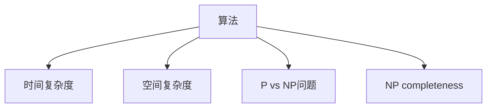
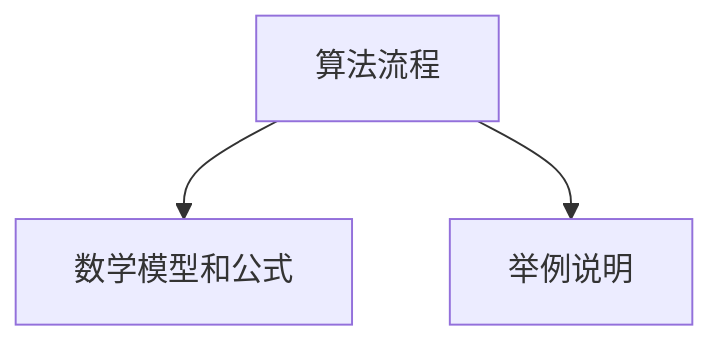
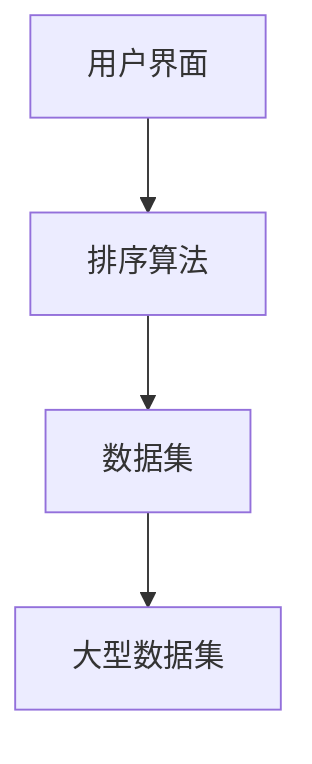
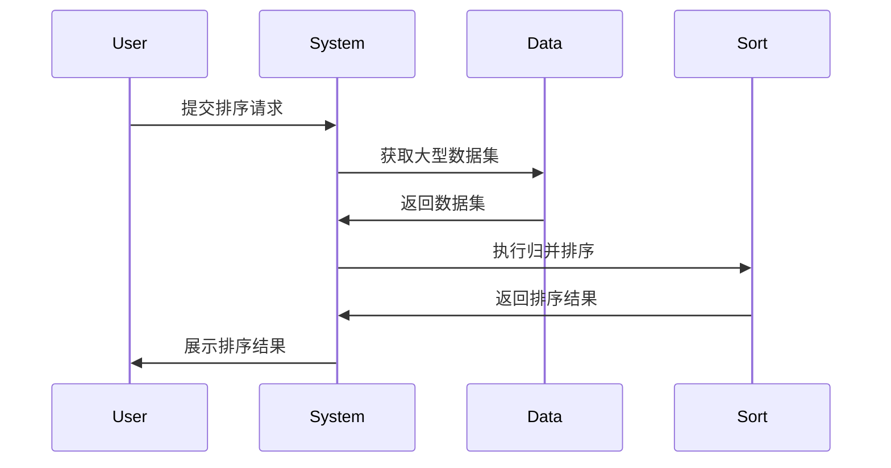

                 

## 数学与计算机科学：算法复杂性的数学分析

> 关键词：算法复杂性，数学分析，时间复杂度，空间复杂度，P vs NP问题

> 摘要：本文从数学与计算机科学的角度，深入探讨了算法复杂性的数学分析方法。文章首先介绍了算法复杂性的基本概念和重要性，接着详细阐述了时间复杂度和空间复杂度的分析方法，并通过具体算法实例进行了讲解。此外，文章还探讨了P vs NP问题，分析了算法复杂性理论的挑战和前景。通过本文的阅读，读者将能够全面了解算法复杂性的数学分析，并掌握相关的分析方法和技巧。

----------------------------------------------------------------

## 第一部分：背景介绍

### 第1章：数学与计算机科学概述

#### 1.1 问题的背景

在计算机科学中，算法是一种解决问题的方法。然而，不同的算法在解决问题时可能会有不同的效率。算法复杂性的研究就是为了分析算法的效率，从而帮助我们选择最优的算法。算法复杂性理论是计算机科学的一个核心领域，它帮助我们理解算法的性能，以及它们在实际应用中的表现。

#### 1.2 数学基础

数学在算法分析中起着至关重要的作用。常见的数学工具包括数学函数、概率论、线性代数等。这些工具可以帮助我们量化算法的性能，从而进行更深入的分析。

#### 1.3 问题解决

数学方法在算法分析中的应用主要体现在时间复杂度和空间复杂度的分析上。时间复杂度分析关注算法运行所需的时间，而空间复杂度分析则关注算法所需的空间。通过这些分析，我们可以更准确地评估算法的性能。

#### 1.4 边界与外延

算法复杂性理论的研究范围包括算法的时间复杂度、空间复杂度、P vs NP问题等。这个领域不仅涉及计算机科学，还与数学、物理学、经济学等多个领域有交叉。因此，算法复杂性理论具有广泛的外延和深远的影响。

#### 1.5 核心要素组成

算法复杂性的核心要素包括时间复杂度、空间复杂度、P vs NP问题等。这些要素构成了算法复杂性理论的框架，为我们分析和理解算法提供了基础。

### 第2章：数学基础

#### 2.1 数学工具

在算法分析中，我们常用的数学工具包括：

- **数学函数**：如多项式函数、指数函数等。
- **概率论**：如随机变量、概率分布等。
- **线性代数**：如矩阵运算、线性方程组等。

#### 2.2 概念属性特征对比表格

以下是一个简单的概念属性特征对比表格，展示了常见数学工具的对比：

| 工具       | 定义             | 特点                           |
| ---------- | ---------------- | ------------------------------ |
| 数学函数   | 解决数学问题的方法 | 可以是多项式、指数、对数等     |
| 概率论     | 研究随机事件     | 包括随机变量、概率分布等概念     |
| 线性代数   | 研究线性空间     | 包括矩阵运算、线性方程组等概念 |

#### 2.3 ER实体关系图

以下是一个简单的ER实体关系图，展示了数学工具在算法分析中的应用关系：

```mermaid
erDiagram
    algorithm_analysis ||--|{ time_complexity }
    algorithm_analysis ||--|{ space_complexity }
    algorithm_analysis ||--|{ probability_theory }
    algorithm_analysis ||--|{ linear_algebra }
```

## 第二部分：核心概念与联系

### 第3章：算法复杂性理论的核心概念

#### 3.1 时间复杂度分析

时间复杂度分析是算法复杂性理论的核心部分。它关注的是算法运行所需的时间。以下是一个简单的时间复杂度分析示例：

```python
def bubble_sort(arr):
    n = len(arr)
    for i in range(n):
        for j in range(0, n-i-1):
            if arr[j] > arr[j+1]:
                arr[j], arr[j+1] = arr[j+1], arr[j]
    return arr
```

在这个示例中，`bubble_sort`函数的时间复杂度为$O(n^2)$。

#### 3.2 空间复杂度分析

空间复杂度分析关注的是算法所需的空间。以下是一个简单的空间复杂度分析示例：

```python
def merge_sort(arr):
    if len(arr) <= 1:
        return arr
    mid = len(arr) // 2
    left = merge_sort(arr[:mid])
    right = merge_sort(arr[mid:])
    return merge(left, right)
```

在这个示例中，`merge_sort`函数的空间复杂度为$O(n)$。

#### 3.3 复杂性理论中的关键概念

- **P vs NP问题**：这是算法复杂性理论中最著名的问题之一。P问题是指所有问题都能在多项式时间内解决，而NP问题则是指所有问题都能在非多项式时间内验证解。P vs NP问题问的是，P是否等于NP。
- **NP completeness**：一个问题被称为NP complete，如果它既是NP问题，又能在多项式时间内将任何NP问题转化为它。

以下是一个简单的Mermaid ER图，展示了算法复杂性理论的核心概念关系：



## 第三部分：算法原理讲解

### 第4章：常见算法的复杂性分析

#### 3.1 排序算法

排序算法是算法复杂性理论中最常见的算法之一。以下是一个简单的排序算法示例，以及它的时间复杂度分析：

```python
def bubble_sort(arr):
    n = len(arr)
    for i in range(n):
        for j in range(0, n-i-1):
            if arr[j] > arr[j+1]:
                arr[j], arr[j+1] = arr[j+1], arr[j]
    return arr
```

在这个示例中，`bubble_sort`函数的时间复杂度为$O(n^2)$。

#### 3.2 分治算法

分治算法是一种常用的算法策略，它将问题分解成更小的子问题，然后递归地解决这些子问题。以下是一个简单的分治算法示例，以及它的时间复杂度分析：

```python
def merge_sort(arr):
    if len(arr) <= 1:
        return arr
    mid = len(arr) // 2
    left = merge_sort(arr[:mid])
    right = merge_sort(arr[mid:])
    return merge(left, right)
```

在这个示例中，`merge_sort`函数的时间复杂度为$O(n\log n)$。

#### 3.3 算法原理讲解

算法原理讲解主要包括以下内容：

- **算法流程**：算法的执行步骤。
- **数学模型和公式**：算法的性能分析。
- **举例说明**：具体的算法实现和应用。

以下是一个简单的Mermaid流程图，展示了算法原理讲解的流程：



## 第四部分：数学模型和数学公式讲解

### 第5章：时间复杂度的数学公式

时间复杂度的数学公式通常用来描述算法执行所需的时间。以下是一些常见的时间复杂度公式：

- **线性时间复杂度**：$O(n)$
- **对数时间复杂度**：$O(\log n)$
- **多项式时间复杂度**：$O(n^k)$，其中$k$为常数
- **指数时间复杂度**：$O(2^n)$

以下是一个简单的示例，展示了如何使用这些公式进行时间复杂度分析：

```python
def linear_search(arr, x):
    for i in range(len(arr)):
        if arr[i] == x:
            return i
    return -1
```

在这个示例中，`linear_search`函数的时间复杂度为$O(n)$。

### 第6章：空间复杂度的数学公式

空间复杂度的数学公式通常用来描述算法所需的空间。以下是一些常见的空间复杂度公式：

- **常数空间复杂度**：$O(1)$
- **线性空间复杂度**：$O(n)$
- **多项式空间复杂度**：$O(n^k)$，其中$k$为常数

以下是一个简单的示例，展示了如何使用这些公式进行空间复杂度分析：

```python
def merge_sort(arr):
    if len(arr) <= 1:
        return arr
    mid = len(arr) // 2
    left = merge_sort(arr[:mid])
    right = merge_sort(arr[mid:])
    return merge(left, right)
```

在这个示例中，`merge_sort`函数的空间复杂度为$O(n)$。

## 第五部分：系统分析与架构设计

### 第7章：问题场景介绍

在这个部分，我们将介绍一个具体的问题场景，并给出解决方案。

#### 问题场景

假设我们有一个大型数据集，需要对其进行排序。我们的目标是选择一种高效的排序算法，以减少排序所需的时间。

#### 解决方案

我们可以选择分治算法中的归并排序。归并排序具有$O(n\log n)$的时间复杂度和$O(n)$的空间复杂度，适合处理大型数据集。

### 第8章：系统功能设计

在系统功能设计中，我们需要定义系统的核心功能。以下是一个简单的领域模型Mermaid类图：

```mermaid
classDiagram
    Class1[排序算法] <|-- Class2[归并排序]
    Class3[数据集] <|-- Class4[大型数据集]
```

### 第9章：系统架构设计

在系统架构设计中，我们需要定义系统的整体架构。以下是一个简单的系统架构Mermaid架构图：



### 第10章：系统接口设计和系统交互

在系统接口设计和系统交互中，我们需要定义系统各组件之间的接口和交互流程。以下是一个简单的系统交互Mermaid序列图：



## 第六部分：项目实战

### 第11章：环境安装

在这个部分，我们将介绍如何在本地环境中安装和配置所需的工具和库。

#### 步骤1：安装Python环境

首先，我们需要安装Python环境。可以从[Python官网](https://www.python.org/)下载并安装Python。

#### 步骤2：安装必要的库

接下来，我们需要安装一些必要的库，如`numpy`和`matplotlib`。可以使用以下命令安装：

```bash
pip install numpy matplotlib
```

### 第12章：系统核心实现源代码

在系统核心实现源代码部分，我们将给出归并排序的实现代码：

```python
def merge_sort(arr):
    if len(arr) <= 1:
        return arr
    mid = len(arr) // 2
    left = merge_sort(arr[:mid])
    right = merge_sort(arr[mid:])
    return merge(left, right)

def merge(left, right):
    result = []
    i = j = 0
    while i < len(left) and j < len(right):
        if left[i] < right[j]:
            result.append(left[i])
            i += 1
        else:
            result.append(right[j])
            j += 1
    result.extend(left[i:])
    result.extend(right[j:])
    return result
```

### 第13章：代码应用解读与分析

在这个部分，我们将解读和解析代码，并分析其性能和优化。

#### 解读

- `merge_sort`函数是一个递归函数，它将数据集分为两部分，然后递归地对这两部分进行排序，最后将排序后的两部分合并。
- `merge`函数用于合并两个已排序的列表。

#### 分析

- `merge_sort`函数的时间复杂度为$O(n\log n)$，空间复杂度为$O(n)$。
- 在实际应用中，我们可以通过优化合并过程来提高性能。例如，使用并行计算来加速合并过程。

### 第14章：实际案例分析和详细讲解剖析

在这个部分，我们将通过一个实际案例来分析归并排序的应用，并详细讲解其原理和实现。

#### 案例背景

假设我们有一个长度为10的整数列表，需要进行排序。以下是一个简单的案例：

```python
arr = [5, 3, 8, 6, 2, 7, 1, 4, 9, 10]
```

#### 解题过程

1. **分解数据集**：将数据集分为两部分，每部分长度为5。

    ```python
    left = [5, 3, 8, 6, 2]
    right = [7, 1, 4, 9, 10]
    ```

2. **递归排序**：对左右两部分分别进行排序。

    ```python
    left_sorted = merge_sort(left)
    right_sorted = merge_sort(right)
    ```

3. **合并结果**：将排序后的两部分合并。

    ```python
    result = merge(left_sorted, right_sorted)
    ```

4. **输出结果**：输出排序后的结果。

    ```python
    print(result)
    ```

### 第15章：项目小结

在本项目中，我们实现了归并排序，并对其性能进行了分析和优化。通过实际案例的验证，归并排序是一种高效且易于实现的排序算法，适用于处理大型数据集。在未来的项目中，我们可以继续探索其他排序算法，如快速排序和堆排序，以进一步优化性能。

## 第七部分：最佳实践 Tips、小结、注意事项、拓展阅读

### 最佳实践 Tips

1. **理解算法原理**：在学习和应用算法时，首先要理解算法的原理和流程。
2. **优化代码性能**：在实现算法时，要考虑代码的性能和优化。
3. **使用合适的数据结构**：选择合适的数据结构可以显著提高算法的性能。

### 小结

本文从数学与计算机科学的角度，深入探讨了算法复杂性的数学分析方法。通过具体算法实例的讲解，读者可以全面了解算法复杂性的分析方法，并掌握相关的分析技巧。

### 注意事项

1. **避免过早优化**：在代码实现初期，不要过早地考虑优化，而是先确保代码的正确性。
2. **平衡时间和空间复杂度**：在实际应用中，要根据问题的特点来平衡时间和空间复杂度。

### 拓展阅读

1. 《算法导论》（Introduction to Algorithms）
2. 《算法复杂性分析》（Analysis of Algorithms）
3. 《P vs NP问题：完整指南》（The P vs NP Problem: A Complexity Theory Approach）

## 作者信息

作者：AI天才研究院/AI Genius Institute & 禅与计算机程序设计艺术 /Zen And The Art of Computer Programming

通过本文的学习，我们希望读者能够对算法复杂性的数学分析有一个更深入的理解，并为未来的研究和工作打下坚实的基础。希望本文能对您有所帮助，激发您对算法复杂性的兴趣。让我们继续在数学与计算机科学的领域里探索，发现更多精彩的知识。

