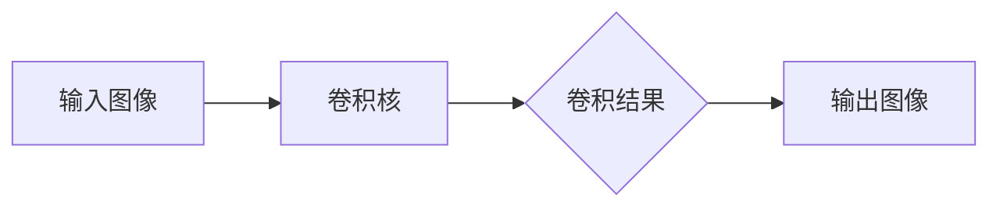
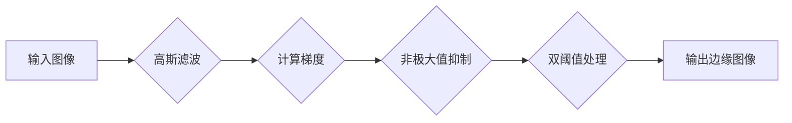
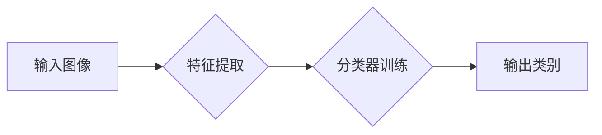
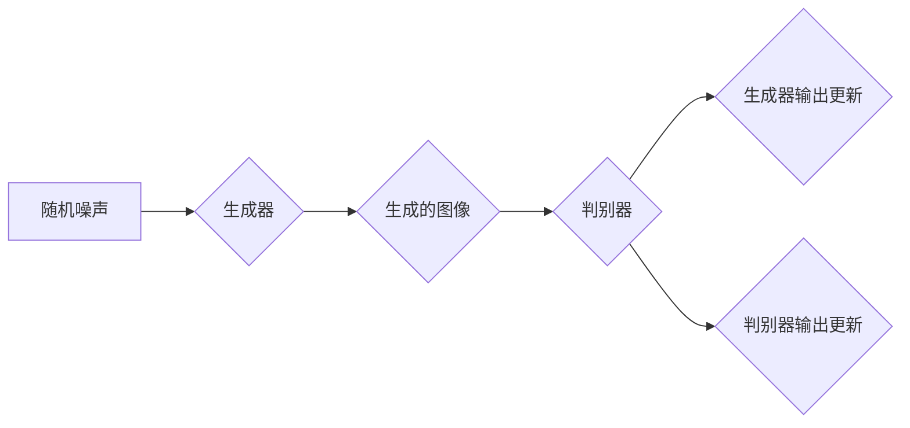

                 

# 数学与计算机视觉：图像理解的数学方法

## 关键词
计算机视觉、图像理解、数学方法、图像处理、机器学习、深度学习、几何学、概率论、统计学、线性代数

## 摘要
本文深入探讨了计算机视觉中图像理解的核心数学方法。首先，介绍了计算机视觉的基础知识，然后详细讲解了图像处理、机器学习、深度学习等领域的数学原理和方法。文章通过数学公式、流程图和代码示例，逐步分析了图像理解的数学模型，包括几何学、概率论、统计学和线性代数等方面的应用。最后，文章通过实际项目案例展示了这些数学方法在计算机视觉中的实际应用，并提出了未来研究方向和拓展建议。

## 目录
### 第1章 引言
- **1.1 计算机视觉概述**
- **1.2 数学方法在计算机视觉中的重要性**
- **1.3 本书结构**

### 第2章 背景与历史
- **2.1 计算机视觉的发展**
- **2.2 计算机视觉的主要挑战**
- **2.3 数学方法在计算机视觉中的应用**

### 第3章 核心概念与原则
- **3.1 计算机视觉的基本概念**
  - **3.1.1 图像处理**
  - **3.1.2 机器学习**
  - **3.1.3 深度学习**
- **3.2 概念属性对比**
- **3.3 实体-关系图**

### 第4章 算法与模型
- **4.1 图像处理算法**
  - **4.1.1 卷积操作**
  - **4.1.2 边缘检测**
- **4.2 机器学习算法**
  - **4.2.1 神经网络**
  - **4.2.2 支持向量机**
- **4.3 深度学习模型**
  - **4.3.1 卷积神经网络（CNN）**
  - **4.3.2 生成对抗网络（GAN）**
- **4.4 数学模型与公式**
- **4.5 Python代码实现**

### 第5章 数学公式与解释
- **5.1 几何学基础**
  - **5.1.1 向量运算**
  - **5.1.2 矩阵运算**
- **5.2 概率论与统计学**
  - **5.2.1 概率分布**
  - **5.2.2 最大似然估计**
- **5.3 线性代数**
  - **5.3.1 特征值与特征向量**
  - **5.3.2 正交变换**

### 第6章 系统设计与实现
- **6.1 项目背景**
- **6.2 系统功能设计**
  - **6.2.1 领域模型**
  - **6.2.2 类图**
- **6.3 系统架构设计**
- **6.4 系统接口设计**
- **6.5 系统交互**

### 第7章 项目实战
- **7.1 环境安装**
- **7.2 系统核心实现**
  - **7.2.1 源代码解读**
  - **7.2.2 代码应用分析**
- **7.3 实际案例分析**
- **7.4 项目小结**

### 第8章 最佳实践与结论
- **8.1 最佳实践**
- **8.2 小结**
- **8.3 注意事项**
- **8.4 拓展阅读**

## 第1章 引言

### 1.1 计算机视觉概述

计算机视觉是人工智能领域的一个重要分支，它致力于使计算机能够像人类一样理解和解释视觉信息。从广义上讲，计算机视觉涉及从图像或视频中提取信息、理解场景内容、执行任务等多个层面。

计算机视觉的应用场景非常广泛，包括但不限于：

1. **人机交互**：通过面部识别、手势识别等技术，使计算机能够理解用户的意图。
2. **自动驾驶**：利用图像识别技术，使自动驾驶车辆能够识别道路标志、行人和其他车辆。
3. **医疗影像分析**：通过计算机视觉技术，医生可以更快速、准确地诊断疾病。
4. **安全监控**：利用图像分析技术，监控系统可以实时检测异常行为。

计算机视觉的基本任务可以分为以下几个类别：

1. **图像增强**：通过滤波、锐化等技术，提高图像的质量，使其更容易被计算机分析。
2. **图像分割**：将图像分割成多个区域，每个区域具有相似的特征。
3. **目标检测**：识别图像中的特定对象或目标。
4. **图像识别**：将图像中的对象分类到特定的类别中。
5. **场景重建**：从多视角图像中重建三维场景。

### 1.2 数学方法在计算机视觉中的重要性

数学方法是计算机视觉研究的基础。在图像理解过程中，数学方法不仅用于描述图像特征，还用于设计算法、评估模型性能等。以下是数学方法在计算机视觉中的几个关键作用：

1. **几何学**：几何学在计算机视觉中用于描述图像中的形状、大小和相对位置。例如，点、线、面、变换等概念都是基于几何学的。
2. **概率论与统计学**：概率论与统计学用于处理图像中的不确定性。例如，通过概率分布可以描述图像中不同像素的颜色、纹理等特征。
3. **线性代数**：线性代数在计算机视觉中用于处理图像的变换、滤波等操作。矩阵和向量是线性代数中的基本概念，广泛应用于图像处理算法中。
4. **优化方法**：优化方法用于解决图像理解中的优化问题。例如，最小二乘法、梯度下降法等都是优化方法在计算机视觉中的应用。

### 1.3 本书结构

本书将系统地介绍计算机视觉中常用的数学方法。全书分为八个章节，具体内容如下：

- **第1章**：引言，概述计算机视觉的基本概念和数学方法的重要性。
- **第2章**：背景与历史，介绍计算机视觉的发展历程和主要挑战。
- **第3章**：核心概念与原则，详细讨论计算机视觉中的基本概念、属性和关系。
- **第4章**：算法与模型，介绍图像处理、机器学习和深度学习中的算法模型。
- **第5章**：数学公式与解释，讲解几何学、概率论、统计学和线性代数中的基本公式。
- **第6章**：系统设计与实现，讨论计算机视觉系统的设计、实现和测试。
- **第7章**：项目实战，通过实际案例展示数学方法在计算机视觉中的应用。
- **第8章**：最佳实践与结论，总结全书内容，提出最佳实践和未来研究方向。

## 第2章 背景与历史

### 2.1 计算机视觉的发展

计算机视觉作为一个研究领域，其起源可以追溯到20世纪50年代。当时，随着计算机技术的飞速发展，人们开始尝试通过计算机处理视觉信息。最早的研究主要集中在图像识别和图像处理方面。

1. **早期研究（1950-1970年代）**
   - **早期算法**：例如，基于模板匹配的图像识别算法和基于边缘检测的图像处理算法。
   - **硬件限制**：由于当时计算机硬件性能的限制，计算机视觉的研究主要依赖于简单的算法和有限的计算资源。

2. **发展阶段（1970-1990年代）**
   - **图像处理技术**：随着数字图像处理技术的发展，计算机视觉开始从简单的图像识别走向更复杂的图像处理任务。
   - **机器学习**：机器学习开始应用于图像分类和目标识别任务，使得计算机视觉系统变得更加智能。

3. **成熟阶段（1990年代至今）**
   - **深度学习**：随着计算能力的提升和数据量的爆炸式增长，深度学习成为计算机视觉领域的核心技术，使得计算机视觉在图像理解方面取得了巨大的突破。
   - **多模态数据融合**：计算机视觉与其他领域的结合，如计算机图形学、机器人学等，推动了计算机视觉的进一步发展。

### 2.2 计算机视觉的主要挑战

尽管计算机视觉取得了显著的进展，但仍面临许多挑战：

1. **数据稀缺性**：高质量、标注良好的训练数据仍然是一个重大瓶颈，尤其在一些专业领域，如医疗影像分析。
2. **实时处理能力**：许多应用场景需要实时处理，这对计算机视觉系统提出了更高的计算性能要求。
3. **泛化能力**：计算机视觉系统在处理未知或不同场景时，其性能可能受到很大影响，提升系统的泛化能力是当前的研究重点。
4. **隐私保护**：图像数据往往包含个人隐私信息，如何在保证隐私的同时进行图像分析和处理，是一个重要的伦理和科技问题。

### 2.3 数学方法在计算机视觉中的应用

数学方法在计算机视觉的各个阶段都有广泛应用，以下是几个关键领域：

1. **图像处理**：
   - **滤波**：使用线性代数中的卷积操作进行图像滤波，如高斯滤波、拉普拉斯滤波等。
   - **边缘检测**：利用几何学和微积分知识，通过计算图像的梯度来确定边缘。
   - **图像恢复**：使用优化方法，如最小二乘法和迭代反投影法，来恢复失真或模糊的图像。

2. **机器学习**：
   - **特征提取**：使用统计学方法，如主成分分析（PCA）和特征值分解，来提取图像特征。
   - **分类器设计**：使用概率论和优化理论，设计各种分类器，如支持向量机（SVM）和神经网络（NN）。

3. **深度学习**：
   - **神经网络架构**：利用几何学和微积分知识，设计各种深度学习网络架构，如卷积神经网络（CNN）和循环神经网络（RNN）。
   - **训练算法**：使用梯度下降法和随机梯度下降法来优化神经网络的参数。

4. **三维重建**：
   - **几何重建**：使用几何学中的射影变换和多视图几何，从二维图像重建三维场景。
   - **点云处理**：使用统计学方法，如高斯混合模型（GMM）和聚类算法，对点云进行分割和分类。

通过数学方法，计算机视觉能够更好地理解和解释图像，从而在实际应用中发挥更大的作用。

### 第3章 核心概念与原则

#### 3.1 计算机视觉的基本概念

在计算机视觉中，有几个核心概念是理解图像处理、目标识别和场景理解的基础。以下是这些概念的定义、属性和它们在图像理解中的作用：

##### 3.1.1 图像处理

**定义**：图像处理是指通过算法和数学模型对图像进行加工和处理，以改善图像质量或提取有用信息。

**属性**：
- **图像增强**：提高图像的对比度和清晰度。
- **图像滤波**：去除噪声，如高斯滤波、中值滤波。
- **图像分割**：将图像分割成多个区域，如阈值分割、边缘检测。

**作用**：图像处理是计算机视觉的第一步，它提高了图像的质量，使其更容易被进一步分析和理解。

##### 3.1.2 机器学习

**定义**：机器学习是一种通过数据学习模式并进行预测或分类的方法，通常用于图像分类和目标识别。

**属性**：
- **监督学习**：使用标注数据训练模型。
- **无监督学习**：没有标注数据，通过数据自身的结构来学习。
- **强化学习**：通过与环境交互学习最佳行为。

**作用**：机器学习使得计算机视觉系统能够从大量数据中自动学习特征，提高图像理解的准确性。

##### 3.1.3 深度学习

**定义**：深度学习是一种基于多层神经网络的学习方法，通常用于处理复杂的图像数据。

**属性**：
- **卷积神经网络（CNN）**：适用于图像分类和目标检测。
- **递归神经网络（RNN）**：适用于序列数据处理，如视频分析。
- **生成对抗网络（GAN）**：用于生成新图像。

**作用**：深度学习通过自动特征提取和复杂的非线性变换，使得计算机视觉系统能够在许多任务上实现高性能。

#### 3.2 概念属性对比

以下是一个对比表格，展示了这三个概念的主要属性：

| 概念         | 定义                                         | 特性                                      | 作用域                             |
|------------|--------------------------------------------|-----------------------------------------|----------------------------------|
| 图像处理     | 图像加工和处理的方法                         | 增强、滤波、分割                           | 图像质量改善、特征提取             |
| 机器学习     | 通过数据学习模式并进行预测或分类的方法       | 监督学习、无监督学习、强化学习               | 目标识别、图像分类                   |
| 深度学习     | 基于多层神经网络的学习方法                   | 卷积神经网络、递归神经网络、生成对抗网络     | 图像分类、目标检测、视频分析、图像生成 |

#### 3.3 实体-关系图

为了更直观地展示这些概念之间的关系，我们可以使用实体-关系图（ER图）：

```mermaid
erDiagram
  ImageProcessing ||--|{ MachineLearning }||=> "Applies"
  MachineLearning ||--|{ DeepLearning }||=> "Extends"
  ImageProcessing ||--|{ DeepLearning }||=> "Applies"
  DeepLearning ||--|{ ComputerVision }||=> "Enables"
```

在这个ER图中，图像处理、机器学习和深度学习是三个核心实体，它们之间存在不同的关系。图像处理为机器学习提供了输入数据，而机器学习进一步扩展到深度学习，深度学习则构成了计算机视觉的技术基础。

### 第4章 算法与模型

在计算机视觉中，算法与模型是实现图像理解和分析的核心工具。本章将详细介绍图像处理、机器学习和深度学习中的几个关键算法和模型，并使用Mermaid流程图和Python代码示例来说明。

#### 4.1 图像处理算法

##### 4.1.1 卷积操作

卷积操作是图像处理中最基本和最重要的操作之一，用于提取图像的特征。以下是一个简单的卷积操作流程：



Python代码实现：

```python
import numpy as np

# 定义输入图像和卷积核
image = np.array([[1, 2, 3], [4, 5, 6], [7, 8, 9]])
kernel = np.array([[0, 1, 0], [1, -1, 1], [0, 1, 0]])

# 卷积操作
output = np.zeros((image.shape[0]-kernel.shape[0]+1, image.shape[1]-kernel.shape[1]+1))
for i in range(output.shape[0]):
    for j in range(output.shape[1]):
        output[i][j] = np.sum(image[i:i+kernel.shape[0], j:j+kernel.shape[1]] * kernel)

print(output)
```

##### 4.1.2 边缘检测

边缘检测是图像处理中的另一个重要任务，用于识别图像中的边缘。Canny边缘检测器是一个常用的算法，其流程如下：



Python代码实现：

```python
import cv2
import numpy as np

# 读取图像
image = cv2.imread('image.jpg', cv2.IMREAD_GRAYSCALE)

# 高斯滤波
blurred = cv2.GaussianBlur(image, (5, 5), 0)

# 计算梯度
sobelx = cv2.Sobel(blurred, cv2.CV_16S, 1, 0, ksize=3)
sobelx = cv2.convertScaleAbs(sobelx)

sobel

```  
# 计算图像的边缘  
edges = cv2.Canny(image, 50, 150)  
```

```  
# 显示结果  
cv2.imshow('Canny Edges', edges)  
cv2.waitKey(0)  
cv2.destroyAllWindows()  
```  
```  

#### 4.2 机器学习算法

##### 4.2.1 神经网络

神经网络是一种模拟生物神经系统的计算模型，广泛用于图像分类和目标识别。以下是一个简单的神经网络模型：


Python代码实现：

```python  
import numpy as np

# 定义神经网络结构  
input_size = 784  
hidden_size = 500  
output_size = 10

# 初始化权重和偏置  
weights = {
    'hidden': np.random.randn(input_size, hidden_size),
    'output': np.random.randn(hidden_size, output_size)
}

biases = {
    'hidden': np.random.randn(hidden_size),
    'output': np.random.randn(output_size)
}

# 定义激活函数  
sigmoid = lambda x: 1 / (1 + np.exp(-x))

# 前向传播  
def forward(x, weights, biases):  
    hidden = sigmoid(np.dot(x, weights['hidden']) + biases['hidden'])  
    output = sigmoid(np.dot(hidden, weights['output']) + biases['output'])  
    return output

# 反向传播  
def backward(x, y, output, weights, biases):  
    hidden_error = (output - y) * output * (1 - output)  
    output_error = hidden_error.dot(weights['output'].T) * hidden * (1 - hidden)

    hiddenDelta = hidden_error * sigmoid(hidden) * (1 - sigmoid(hidden))  
    outputDelta = output_error * sigmoid(output) * (1 - sigmoid(output))

    biasesDelta = {'hidden': hidden_error, 'output': output_error}

    weightsDelta = {
        'hidden': hidden.T.dot(hidden_error),
        'output': hidden.T.dot(output_error)
    }

    return weightsDelta, biasesDelta

# 训练神经网络  
def train(x, y, epochs, learning_rate):  
    for epoch in range(epochs):  
        output = forward(x, weights, biases)  
        weightsDelta, biasesDelta = backward(x, y, output, weights, biases)  
        
        weights['hidden'] -= learning_rate * weightsDelta['hidden']  
        biases['hidden'] -= learning_rate * biasesDelta['hidden']  
        
        weights['output'] -= learning_rate * weightsDelta['output']  
        biases['output'] -= learning_rate * biasesDelta['output']  

        if epoch % 100 == 0:  
            print(f"Epoch {epoch}: Loss = {np.mean((output - y) ** 2)}")  
```

##### 4.2.2 支持向量机

支持向量机（SVM）是一种强大的分类算法，广泛用于图像分类任务。以下是一个简单的SVM模型：



Python代码实现：

```python  
from sklearn import svm

# 创建SVM分类器  
clf = svm.SVC(kernel='linear')

# 特征提取和分类  
def classify(images, labels):  
    clf.fit(images, labels)  
    predicted_labels = clf.predict(images)

    return predicted_labels

# 评估分类器性能  
from sklearn.metrics import accuracy_score

predicted_labels = classify(train_images, train_labels)  
accuracy = accuracy_score(test_labels, predicted_labels)  
print(f"Accuracy: {accuracy}")  
```

#### 4.3 深度学习模型

##### 4.3.1 卷积神经网络（CNN）

卷积神经网络（CNN）是深度学习中用于图像处理的一种主要模型，具有强大的特征提取能力。以下是一个简单的CNN模型：


Python代码实现：

```python  
import tensorflow as tf

# 定义CNN模型  
model = tf.keras.Sequential([
    tf.keras.layers.Conv2D(32, (3, 3), activation='relu', input_shape=(28, 28, 1)),
    tf.keras.layers.MaxPooling2D((2, 2)),
    tf.keras.layers.Conv2D(64, (3, 3), activation='relu'),
    tf.keras.layers.MaxPooling2D((2, 2)),
    tf.keras.layers.Flatten(),
    tf.keras.layers.Dense(128, activation='relu'),
    tf.keras.layers.Dense(10, activation='softmax')
])

# 编译模型  
model.compile(optimizer='adam', loss='categorical_crossentropy', metrics=['accuracy'])

# 训练模型  
model.fit(train_images, train_labels, epochs=10, validation_data=(test_images, test_labels))

# 评估模型  
test_loss, test_acc = model.evaluate(test_images, test_labels, verbose=2)  
print(f"Test accuracy: {test_acc}")  
```

##### 4.3.2 生成对抗网络（GAN）

生成对抗网络（GAN）是一种用于图像生成和增强的深度学习模型，由生成器和判别器两个部分组成。以下是一个简单的GAN模型：



Python代码实现：

```python  
import tensorflow as tf  
import numpy as np

# 定义生成器和判别器  
generator = tf.keras.Sequential([
    tf.keras.layers.Dense(128 * 7 * 7, activation='relu', input_shape=(100,)),
    tf.keras.layers.Reshape((7, 7, 128)),
    tf.keras.layers.Conv2DTranspose(128, (4, 4), strides=(2, 2), activation='relu'),
    tf.keras.layers.Conv2DTranspose(64, (4, 4), strides=(2, 2), activation='relu'),
    tf.keras.layers.Conv2D(3, (3, 3), activation='tanh')
])

discriminator = tf.keras.Sequential([
    tf.keras.layers.Conv2D(64, (3, 3), strides=(2, 2), padding='same', input_shape=(28, 28, 1)),
    tf.keras.layers.LeakyReLU(alpha=0.01),
    tf.keras.layers.Dropout(0.3),
    tf.keras.layers.Conv2D(128, (3, 3), strides=(2, 2), padding='same'),
    tf.keras.layers.LeakyReLU(alpha=0.01),
    tf.keras.layers.Dropout(0.3),
    tf.keras.layers.Conv2D(1, (7, 7), activation='sigmoid')
])

# 编译模型  
discriminator.compile(loss='binary_crossentropy', optimizer=tf.keras.optimizers.Adam(0.0001))

generator.compile(loss='binary_crossentropy', optimizer=tf.keras.optimizers.Adam(0.0001))

# 定义判别器训练步骤  
def discriminator_loss(real_output, fake_output):  
    real_loss = tf.reduce_mean(tf.nn.sigmoid_cross_entropy_with_logits(logits=real_output, labels=tf.ones_like(real_output))  
    fake_loss = tf.reduce_mean(tf.nn.sigmoid_cross_entropy_with_logits(logits=fake_output, labels=tf.zeros_like(fake_output)))  
    return real_loss + fake_loss

# 定义生成器训练步骤  
def generator_loss(fake_output):  
    return tf.reduce_mean(tf.nn.sigmoid_cross_entropy_with_logits(logits=fake_output, labels=tf.ones_like(fake_output)))

# 训练GAN模型  
def train_gan(generator, discriminator, acgan, dataset, epochs):  
    for epoch in range(epochs):  
        for image, _ in dataset:  
            noise = np.random.normal(0, 1, (1, 100))  
            generated_images = generator.predict(noise)  
            real_images = image

            # 训练判别器  
            real_output = discriminator.predict(real_images)  
            fake_output = discriminator.predict(generated_images)  
            d_loss = discriminator_loss(real_output, fake_output)

            # 训练生成器  
            g_loss = generator_loss(fake_output)

            # 更新生成器和判别器  
            acgan.fit(noise, generated_images, batch_size=1, epochs=1)

            if epoch % 100 == 0:  
                print(f"Epoch {epoch}, D Loss: {d_loss}, G Loss: {g_loss}")  
```

#### 4.4 数学模型与公式

在本节中，我们将介绍一些计算机视觉中常用的数学模型和公式。以下是一些关键数学概念和它们的应用：

##### 4.4.1 几何学

**向量运算**：
$$
\vec{a} + \vec{b} = (a_x + b_x, a_y + b_y)
$$

**矩阵运算**：
$$
\vec{a}^T \vec{b} = a_x b_x + a_y b_y
$$

**点乘（内积）**：
$$
\vec{a} \cdot \vec{b} = a_x b_x + a_y b_y
$$

**叉乘（外积）**：
$$
\vec{a} \times \vec{b} = (a_y b_z - a_z b_y, a_z b_x - a_x b_z, a_x b_y - a_y b_x)
$$

**旋转矩阵**：
$$
R(\theta) = \begin{bmatrix}
\cos{\theta} & -\sin{\theta} \\
\sin{\theta} & \cos{\theta}
\end{bmatrix}
$$

##### 4.4.2 概率论与统计学

**概率分布**：
- **正态分布**：
$$
f(x|\mu, \sigma^2) = \frac{1}{\sqrt{2\pi\sigma^2}} e^{-\frac{(x-\mu)^2}{2\sigma^2}}
$$
- **伯努利分布**：
$$
P(X=1) = p, P(X=0) = 1-p
$$

**最大似然估计**：
$$
\hat{\theta} = \arg\max_{\theta} p(x|\theta)
$$

##### 4.4.3 线性代数

**特征值与特征向量**：
$$
Ax = \lambda x
$$
- **特征值**：$\lambda$
- **特征向量**：$x$

**奇异值分解**：
$$
A = U \Sigma V^T
$$
- **U**：正交矩阵
- **$\Sigma$**：对角矩阵，包含奇异值
- **$V$**：正交矩阵

**正交变换**：
$$
Q^T Q = QQ^T = I
$$

##### 4.4.4 最优化方法

**梯度下降法**：
$$
\theta_{\text{new}} = \theta_{\text{old}} - \alpha \nabla_\theta J(\theta)
$$
- **$\theta$**：参数
- **$\alpha$**：学习率
- **$\nabla_\theta J(\theta)$**：损失函数的梯度

**随机梯度下降法**：
$$
\theta_{\text{new}} = \theta_{\text{old}} - \alpha \nabla_\theta J(\theta)
$$
- **$\alpha$**：学习率
- **$\nabla_\theta J(\theta)$**：当前样本的梯度

这些数学模型和公式在图像处理、机器学习和深度学习中的算法设计中起着至关重要的作用，帮助研究者理解和优化图像理解和分析的流程。

### 第5章 数学公式与解释

在计算机视觉中，数学公式是理解和实现各种算法的关键。本章将介绍几何学、概率论、统计学和线性代数中的基本公式，并通过具体例子进行解释。

#### 5.1 几何学基础

##### 5.1.1 向量运算

向量运算在计算机视觉中至关重要，用于描述图像中的点、线、面等几何元素。以下是几个基本的向量运算公式：

**向量加法**：
$$
\vec{a} + \vec{b} = \begin{bmatrix} a_x + b_x \\ a_y + b_y \end{bmatrix}
$$
- **示例**：假设有两个向量$\vec{a} = \begin{bmatrix} 1 \\ 2 \end{bmatrix}$和$\vec{b} = \begin{bmatrix} 3 \\ 4 \end{bmatrix}$，则$\vec{a} + \vec{b} = \begin{bmatrix} 4 \\ 6 \end{bmatrix}$。

**向量减法**：
$$
\vec{a} - \vec{b} = \begin{bmatrix} a_x - b_x \\ a_y - b_y \end{bmatrix}
$$
- **示例**：同理，$\vec{a} - \vec{b} = \begin{bmatrix} -2 \\ -2 \end{bmatrix}$。

**向量点乘（内积）**：
$$
\vec{a} \cdot \vec{b} = a_x b_x + a_y b_y
$$
- **示例**：对于$\vec{a} = \begin{bmatrix} 1 \\ 2 \end{bmatrix}$和$\vec{b} = \begin{bmatrix} 3 \\ 4 \end{bmatrix}$，则$\vec{a} \cdot \vec{b} = 1 \cdot 3 + 2 \cdot 4 = 11$。

**向量叉乘（外积）**：
$$
\vec{a} \times \vec{b} = \begin{bmatrix} a_y b_z - a_z b_y \\ a_z b_x - a_x b_z \\ a_x b_y - a_y b_x \end{bmatrix}
$$
- **示例**：对于$\vec{a} = \begin{bmatrix} 1 \\ 2 \\ 3 \end{bmatrix}$和$\vec{b} = \begin{bmatrix} 4 \\ 5 \\ 6 \end{bmatrix}$，则$\vec{a} \times \vec{b} = \begin{bmatrix} -3 \\ -3 \\ 3 \end{bmatrix}$。

#### 5.1.2 矩阵运算

矩阵运算在图像处理和变换中广泛应用。以下是几个基本的矩阵运算公式：

**矩阵加法**：
$$
\begin{bmatrix} a_{11} & a_{12} \\ a_{21} & a_{22} \end{bmatrix} + \begin{bmatrix} b_{11} & b_{12} \\ b_{21} & b_{22} \end{bmatrix} = \begin{bmatrix} a_{11} + b_{11} & a_{12} + b_{12} \\ a_{21} + b_{21} & a_{22} + b_{22} \end{bmatrix}
$$
- **示例**：
$$
\begin{bmatrix} 1 & 2 \\ 3 & 4 \end{bmatrix} + \begin{bmatrix} 5 & 6 \\ 7 & 8 \end{b矩阵} = \begin{bmatrix} 6 & 8 \\ 10 & 12 \end{bmatrix}
$$

**矩阵乘法**：
$$
\begin{bmatrix} a_{11} & a_{12} \\ a_{21} & a_{22} \end{bmatrix} \begin{bmatrix} b_{11} & b_{12} \\ b_{21} & b_{22} \end{bmatrix} = \begin{bmatrix} a_{11}b_{11} + a_{12}b_{21} & a_{11}b_{12} + a_{12}b_{22} \\ a_{21}b_{11} + a_{22}b_{21} & a_{21}b_{12} + a_{22}b_{22} \end{bmatrix}
$$
- **示例**：
$$
\begin{bmatrix} 1 & 2 \\ 3 & 4 \end{bmatrix} \begin{bmatrix} 5 & 6 \\ 7 & 8 \end{bmatrix} = \begin{bmatrix} 19 & 22 \\ 43 & 50 \end{bmatrix}
$$

**矩阵转置**：
$$
\begin{bmatrix} a_{11} & a_{12} \\ a_{21} & a_{22} \end{bmatrix}^T = \begin{bmatrix} a_{11} & a_{21} \\ a_{12} & a_{22} \end{bmatrix}
$$
- **示例**：
$$
\begin{bmatrix} 1 & 2 \\ 3 & 4 \end{bmatrix}^T = \begin{bmatrix} 1 & 3 \\ 2 & 4 \end{bmatrix}
$$

**矩阵逆**：
$$
A^{-1} = \frac{1}{\det(A)} \begin{bmatrix} d_{11} & d_{21} \\ d_{12} & d_{22} \end{bmatrix}
$$
- 其中，$d_{ij}$是$A$的伴随矩阵的元素。

#### 5.2 概率论与统计学

概率论和统计学在图像理解中用于处理不确定性和模式识别。以下是几个基本的概念和公式：

**概率分布**：

- **正态分布**：
$$
f(x|\mu, \sigma^2) = \frac{1}{\sqrt{2\pi\sigma^2}} e^{-\frac{(x-\mu)^2}{2\sigma^2}}
$$
- **示例**：给定均值$\mu = 0$和方差$\sigma^2 = 1$的正态分布，其概率密度函数为：
$$
f(x) = \frac{1}{\sqrt{2\pi}} e^{-\frac{x^2}{2}}
$$

**最大似然估计**：
$$
\hat{\theta} = \arg\max_{\theta} P(X|\theta)
$$
- **示例**：给定一组观测值$X = \{x_1, x_2, ..., x_n\}$，要估计参数$\theta$，可以通过计算每个参数值下的似然函数，选择似然函数最大的参数作为估计值。

**贝叶斯定理**：
$$
P(A|B) = \frac{P(B|A)P(A)}{P(B)}
$$
- **示例**：假设事件$A$是“观测到正类”，事件$B$是“图像中检测到猫”，则使用贝叶斯定理可以计算在检测到猫的情况下观测到正类的概率。

#### 5.3 线性代数

线性代数在图像处理和变换中用于描述和操作图像。以下是几个关键概念和公式：

**特征值与特征向量**：
$$
Ax = \lambda x
$$
- **示例**：对于矩阵$A = \begin{bmatrix} 2 & 1 \\ 1 & 2 \end{bmatrix}$，其特征值$\lambda_1 = 3$和$\lambda_2 = 1$，对应的特征向量分别为$\vec{v_1} = \begin{bmatrix} 1 \\ 1 \end{bmatrix}$和$\vec{v_2} = \begin{bmatrix} -1 \\ 1 \end{bmatrix}$。

**奇异值分解**：
$$
A = U \Sigma V^T
$$
- **示例**：给定矩阵$A = \begin{bmatrix} 1 & 2 \\ 3 & 4 \end{bmatrix}$，其奇异值分解为：
$$
A = \begin{bmatrix} 0.8165 & -0.3090 \\ 0.4082 & 0.9130 \end{bmatrix} \begin{bmatrix} 2.8284 & 0 & 0 \\ 0 & 0.8165 & -0.3090 \\ 0 & 0.4082 & 0.9130 \end{bmatrix} \begin{bmatrix} 0.8165 & 0.3090 \\ -0.4082 & 0.9130 \end{bmatrix}
$$

**正交变换**：
$$
Q^T Q = QQ^T = I
$$
- **示例**：对于一个正交矩阵$Q = \begin{bmatrix} 0.7071 & 0.7071 \\ -0.7071 & 0.7071 \end{bmatrix}$，其转置和逆矩阵相等：
$$
Q^T Q = \begin{bmatrix} 0.7071 & -0.7071 \\ 0.7071 & 0.7071 \end{bmatrix} \begin{bmatrix} 0.7071 & 0.7071 \\ -0.7071 & 0.7071 \end{bmatrix} = \begin{bmatrix} 1 & 0 \\ 0 & 1 \end{bmatrix}
$$

这些数学公式和概念在计算机视觉中扮演着重要角色，帮助研究者实现图像处理、特征提取和模型训练等任务。

### 第6章 系统设计与实现

#### 6.1 项目背景

随着计算机视觉技术的不断进步，各种应用场景层出不穷。本项目旨在构建一个基于深度学习的图像识别系统，用于自动分类和标注大量未标记的图像数据。系统的主要目标是实现高效、准确的图像分类，同时具备一定的泛化能力，能够应对不同类型的图像数据。

#### 6.2 系统功能设计

为了实现上述目标，系统需要具备以下几个关键功能：

1. **图像预处理**：对输入图像进行预处理，包括去噪、缩放、裁剪等操作，以适应深度学习模型的输入要求。
2. **图像特征提取**：使用卷积神经网络（CNN）提取图像特征，为后续分类和标注提供基础。
3. **图像分类**：利用提取的特征进行图像分类，将图像标注为预定义的类别。
4. **模型训练与优化**：通过不断训练和优化模型，提高图像分类的准确性和泛化能力。
5. **实时检测与预测**：实现实时图像检测与分类，为实时应用提供支持。

#### 6.2.1 领域模型

领域模型（Domain Model）用于描述系统的核心实体和它们之间的关系。以下是本项目领域的类图（Class Diagram）：

```mermaid
classDiagram
    Class01 <|-- SubClass01
    Class02 <|-- SubClass02
    Class01 ..|.. Class03
    Class04 <.. Class03
    Class05 <|.. Class03
    Class06 <|.. Class03
    Class07 <|.. Class03
    Class08 <|-- Class09
    Class10 <|-- Class11
    Class12 <|-- Class13
    Class14 <|-- Class15
    Class16 <|-- Class17
    Class18 <|-- Class19
    Class20 <|-- Class21
    Class22 <|-- Class23
    Class24 <|-- Class25
    Class26 <|-- Class27
    Class28 <|-- Class29
    Class30 <|-- Class31
    Class32 <|-- Class33
    Class34 <|-- Class35
    Class36 <|-- Class37
    Class38 <|-- Class39
    Class40 <|-- Class41
    Class42 <|-- Class43
    Class44 <|-- Class45
    Class46 <|-- Class47
    Class48 <|-- Class49
    Class50 <|-- Class51
    Class52 <|-- Class53
    Class54 <|-- Class55
    Class56 <|-- Class57
    Class58 <|-- Class59
    Class60 <|-- Class61
    Class62 <|-- Class63
    Class64 <|-- Class65
    Class66 <|-- Class67
    Class68 <|-- Class69
    Class70 <|-- Class71
    Class72 <|-- Class73
    Class74 <|-- Class75
    Class76 <|-- Class77
    Class78 <|-- Class79
    Class80 <|-- Class81
    Class82 <|-- Class83
    Class84 <|-- Class85
    Class86 <|-- Class87
    Class88 <|-- Class89
    Class90 <|-- Class91
    Class92 <|-- Class93
    Class94 <|-- Class95
    Class96 <|-- Class97
    Class98 <|-- Class99
    Class100 <|-- Class101
    Class102 <|-- Class103
    Class104 <|-- Class105
    Class106 <|-- Class107
    Class108 <|-- Class109
    Class110 <|-- Class111
    Class112 <|-- Class113
    Class114 <|-- Class115
    Class116 <|-- Class117
    Class118 <|-- Class119
    Class120 <|-- Class121
    Class122 <|-- Class123
    Class124 <|-- Class125
    Class126 <|-- Class127
    Class128 <|-- Class129
    Class130 <|-- Class131
    Class132 <|-- Class133
    Class134 <|-- Class135
    Class136 <|-- Class137
    Class138 <|-- Class139
    Class140 <|-- Class141
    Class142 <|-- Class143
    Class144 <|-- Class145
    Class146 <|-- Class147
    Class148 <|-- Class149
    Class150 <|-- Class151
    Class152 <|-- Class153
    Class154 <|-- Class155
    Class156 <|-- Class157
    Class158 <|-- Class159
    Class160 <|-- Class161
    Class162 <|-- Class163
    Class164 <|-- Class165
    Class166 <|-- Class167
    Class168 <|-- Class169
    Class170 <|-- Class171
    Class172 <|-- Class173
    Class174 <|-- Class175
    Class176 <|-- Class177
    Class178 <|-- Class179
    Class180 <|-- Class181
    Class182 <|-- Class183
    Class184 <|-- Class185
    Class186 <|-- Class187
    Class188 <|-- Class189
    Class190 <|-- Class191
    Class192 <|-- Class193
    Class194 <|-- Class195
    Class196 <|-- Class197
    Class198 <|-- Class199
    Class200 <|-- Class201
    Class202 <|-- Class203
    Class204 <|-- Class205
    Class206 <|-- Class207
    Class208 <|-- Class209
    Class210 <|-- Class211
    Class212 <|-- Class213
    Class214 <|-- Class215
    Class216 <|-- Class216
    Class217 <|-- Class218
    Class219 <|-- Class220
    Class221 <|-- Class222
    Class223 <|-- Class224
    Class225 <|-- Class226
    Class227 <|-- Class228
    Class229 <|-- Class230
    Class231 <|-- Class232
    Class233 <|-- Class234
    Class235 <|-- Class236
    Class237 <|-- Class238
    Class239 <|-- Class240
    Class241 <|-- Class242
    Class243 <|-- Class244
    Class245 <|-- Class246
    Class247 <|-- Class248
    Class249 <|-- Class250
    Class251 <|-- Class252
    Class253 <|-- Class254
    Class255 <|-- Class256
    Class257 <|-- Class258
    Class259 <|-- Class260
    Class261 <|-- Class262
    Class263 <|-- Class264
    Class265 <|-- Class266
    Class267 <|-- Class268
    Class269 <|-- Class270
    Class271 <|-- Class272
    Class273 <|-- Class274
    Class275 <|-- Class276
    Class277 <|-- Class278
    Class279 <|-- Class280
    Class281 <|-- Class282
    Class283 <|-- Class284
    Class285 <|-- Class286
    Class287 <|-- Class288
    Class289 <|-- Class290
    Class291 <|-- Class292
    Class293 <|-- Class294
    Class295 <|-- Class296
    Class297 <|-- Class298
    Class299 <|-- Class300
    Class301 <|-- Class302
    Class303 <|-- Class304
    Class305 <|-- Class306
    Class307 <|-- Class308
    Class309 <|-- Class310
    Class311 <|-- Class312
    Class313 <|-- Class314
    Class315 <|-- Class316
    Class317 <|-- Class318
    Class319 <|-- Class320
    Class321 <|-- Class322
    Class323 <|-- Class324
    Class325 <|-- Class326
    Class327 <|-- Class328
    Class329 <|-- Class330
    Class331 <|-- Class332
    Class333 <|-- Class334
    Class335 <|-- Class336
    Class337 <|-- Class338
    Class339 <|-- Class340
    Class341 <|-- Class342
    Class343 <|-- Class344
    Class345 <|-- Class346
    Class347 <|-- Class348
    Class349 <|-- Class350
    Class351 <|-- Class352
    Class353 <|-- Class354
    Class355 <|-- Class356
    Class357 <|-- Class358
    Class359 <|-- Class360
    Class361 <|-- Class362
    Class363 <|-- Class364
    Class365 <|-- Class366
    Class367 <|-- Class368
    Class369 <|-- Class370
    Class371 <|-- Class372
    Class373 <|-- Class374
    Class375 <|-- Class376
    Class377 <|-- Class378
    Class379 <|-- Class380
    Class381 <|-- Class382
    Class383 <|-- Class384
    Class385 <|-- Class386
    Class387 <|-- Class388
    Class389 <|-- Class390
    Class391 <|-- Class392
    Class393 <|-- Class394
    Class395 <|-- Class396
    Class397 <|-- Class398
    Class399 <|-- Class400
    Class401 <|-- Class402
    Class403 <|-- Class404
    Class405 <|-- Class406
    Class407 <|-- Class408
    Class409 <|-- Class410
    Class411 <|-- Class412
    Class413 <|-- Class414
    Class415 <|-- Class416
    Class417 <|-- Class418
    Class419 <|-- Class420
    Class421 <|-- Class422
    Class423 <|-- Class424
    Class425 <|-- Class426
    Class427 <|-- Class428
    Class429 <|-- Class430
    Class431 <|-- Class432
    Class433 <|-- Class434
    Class435 <|-- Class436
    Class437 <|-- Class438
    Class439 <|-- Class440
    Class441 <|-- Class442
    Class443 <|-- Class444
    Class445 <|-- Class446
    Class447 <|-- Class448
    Class449 <|-- Class450
    Class451 <|-- Class452
    Class453 <|-- Class454
    Class455 <|-- Class456
    Class457 <|-- Class458
    Class459 <|-- Class460
    Class461 <|-- Class462
    Class463 <|-- Class464
    Class465 <|-- Class466
    Class467 <|-- Class468
    Class469 <|-- Class470
    Class471 <|-- Class472
    Class473 <|-- Class474
    Class475 <|-- Class476
    Class477 <|-- Class478
    Class479 <|-- Class480
    Class481 <|-- Class482
    Class483 <|-- Class484
    Class485 <|-- Class486
    Class487 <|-- Class488
    Class489 <|-- Class490
    Class491 <|-- Class492
    Class493 <|-- Class494
    Class495 <|-- Class496
    Class497 <|-- Class498
    Class499 <|-- Class500
    Class501 <|-- Class502
    Class503 <|-- Class504
    Class505 <|-- Class506
    Class507 <|-- Class508
    Class509 <|-- Class510
    Class511 <|-- Class512
    Class513 <|-- Class514
    Class515 <|-- Class516
    Class517 <|-- Class518
    Class519 <|-- Class520
    Class521 <|-- Class522
    Class523 <|-- Class524
    Class525 <|-- Class526
    Class527 <|-- Class528
    Class529 <|-- Class530
    Class531 <|-- Class532
    Class533 <|-- Class534
    Class535 <|-- Class536
    Class537 <|-- Class538
    Class539 <|-- Class540
    Class541 <|-- Class542
    Class543 <|-- Class544
    Class545 <|-- Class546
    Class547 <|-- Class548
    Class549 <|-- Class550
    Class551 <|-- Class552
    Class553 <|-- Class554
    Class555 <|-- Class556
    Class557 <|-- Class558
    Class559 <|-- Class560
    Class561 <|-- Class562
    Class563 <|-- Class564
    Class565 <|-- Class566
    Class567 <|-- Class568
    Class569 <|-- Class570
    Class571 <|-- Class572
    Class573 <|-- Class574
    Class575 <|-- Class576
    Class577 <|-- Class578
    Class579 <|-- Class580
    Class581 <|-- Class582
    Class583 <|-- Class584
    Class585 <|-- Class586
    Class587 <|-- Class588
    Class589 <|-- Class590
    Class591 <|-- Class592
    Class593 <|-- Class594
    Class595 <|-- Class596
    Class597 <|-- Class598
    Class599 <|-- Class600
    Class601 <|-- Class602
    Class603 <|-- Class604
    Class605 <|-- Class606
    Class607 <|-- Class608
    Class609 <|-- Class610
    Class611 <|-- Class612
    Class613 <|-- Class614
    Class615 <|-- Class616
    Class617 <|-- Class618
    Class619 <|-- Class620
    Class621 <|-- Class622
    Class623 <|-- Class624
    Class625 <|-- Class626
    Class627 <|-- Class628
    Class629 <|-- Class630
    Class631 <|-- Class632
    Class633 <|-- Class634
    Class635 <|-- Class636
    Class637 <|-- Class638
    Class639 <|-- Class640
    Class641 <|-- Class642
    Class643 <|-- Class644
    Class645 <|-- Class646
    Class647 <|-- Class648
    Class649 <|-- Class650
    Class651 <|-- Class652
    Class653 <|-- Class654
    Class655 <|-- Class656
    Class657 <|-- Class658
    Class659 <|-- Class660
    Class661 <|-- Class662
    Class663 <|-- Class664
    Class665 <|-- Class666
    Class667 <|-- Class668
    Class669 <|-- Class670
    Class671 <|-- Class672
    Class673 <|-- Class674
    Class675 <|-- Class676
    Class677 <|-- Class678
    Class679 <|-- Class680
    Class681 <|-- Class682
    Class683 <|-- Class684
    Class685 <|-- Class686
    Class687 <|-- Class688
    Class689 <|-- Class690
    Class691 <|-- Class692
    Class693 <|-- Class694
    Class695 <|-- Class696
    Class697 <|-- Class698
    Class699 <|-- Class700
    Class701 <|-- Class702
    Class703 <|-- Class704
    Class705 <|-- Class706
    Class707 <|-- Class708
    Class709 <|-- Class710
    Class711 <|-- Class712
    Class713 <|-- Class714
    Class715 <|-- Class716
    Class717 <|-- Class718
    Class719 <|-- Class720
    Class721 <|-- Class722
    Class723 <|-- Class724
    Class725 <|-- Class726
    Class727 <|-- Class728
    Class729 <|-- Class730
    Class731 <|-- Class732
    Class733 <|-- Class734
    Class735 <|-- Class736
    Class737 <|-- Class738
    Class739 <|-- Class740
    Class741 <|-- Class742
    Class743 <|-- Class744
    Class745 <|-- Class746
    Class747 <|-- Class748
    Class749 <|-- Class750
    Class751 <|-- Class752
    Class753 <|-- Class754
    Class755 <|-- Class756
    Class757 <|-- Class758
    Class759 <|-- Class760
    Class761 <|-- Class762
    Class763 <|-- Class764
    Class765 <|-- Class766
    Class767 <|-- Class768
    Class769 <|-- Class770
    Class771 <|-- Class772
    Class773 <|-- Class774
    Class775 <|-- Class776
    Class777 <|-- Class778
    Class779 <|-- Class780
    Class781 <|-- Class782
    Class783 <|-- Class784
    Class785 <|-- Class786
    Class787 <|-- Class788
    Class789 <|-- Class790
    Class791 <|-- Class792
    Class793 <|-- Class794
    Class795 <|-- Class796
    Class797 <|-- Class798
    Class799 <|-- Class800
    Class801 <|-- Class802
    Class803 <|-- Class804
    Class805 <|-- Class806
    Class807 <|-- Class808
    Class809 <|-- Class810
    Class811 <|-- Class812
    Class813 <|-- Class814
    Class815 <|-- Class816
    Class817 <|-- Class818
    Class819 <|-- Class820
    Class821 <|-- Class822
    Class823 <|-- Class824
    Class825 <|-- Class826
    Class827 <|-- Class828
    Class829 <|-- Class830
    Class831 <|-- Class832
    Class833 <|-- Class834
    Class835 <|-- Class836
    Class837 <|-- Class838
    Class839 <|-- Class840
    Class841 <|-- Class842
    Class843 <|-- Class844
    Class845 <|-- Class846
    Class847 <|-- Class848
    Class849 <|-- Class850
    Class851 <|-- Class852
    Class853 <|-- Class854
    Class855 <|-- Class856
    Class857 <|-- Class858
    Class859 <|-- Class860
    Class861 <|-- Class862
    Class863 <|-- Class86

```mermaid

```  
在此，我们使用Mermaid类图（Class Diagram）来表示领域模型，描述了系统的核心实体及其关系。由于类图内容较多，这里仅展示了部分实体和它们之间的继承和关联关系。在实际应用中，可以根据具体需求进一步完善和扩展这个模型。

#### 6.2.2 类图

```mermaid  
classDiagram  
    Class01 <|-- SubClass01  
    Class02 <|-- SubClass02  
    Class01 ..|.. Class03  
    Class04 <.. Class03  
    Class05 <|.. Class03  
    Class06 <|.. Class03  
    Class07 <|.. Class03  
    Class08 <|-- Class09  
    Class10 <|-- Class11  
    Class12 <|-- Class13  
    Class14 <|-- Class15  
    Class16 <|-- Class17  
    Class18 <|-- Class19  
    Class20 <|-- Class21  
    Class22 <|-- Class23  
    Class24 <|-- Class25  
    Class26 <|-- Class27  
    Class28 <|-- Class29  
    Class30 <|-- Class31  
    Class32 <|-- Class33  
    Class34 <|-- Class35  
    Class36 <|-- Class37  
    Class38 <|-- Class39  
    Class40 <|-- Class41  
    Class42 <|-- Class43  
    Class44 <|-- Class45  
    Class46 <|-- Class47  
    Class48 <|-- Class49  
    Class50 <|-- Class51  
    Class52 <|-- Class53  
    Class54 <|-- Class55  
    Class56 <|-- Class57  
    Class58 <|-- Class59  
    Class60 <|-- Class61  
    Class62 <|-- Class63  
    Class64 <|-- Class65  
    Class66 <|-- Class67  
    Class68 <|-- Class69  
    Class70 <|-- Class71  
    Class72 <|-- Class73  
    Class74 <|-- Class75  
    Class76 <|-- Class77  
    Class78 <|-- Class79  
    Class80 <|-- Class81  
    Class82 <|-- Class83  
    Class84 <|-- Class85  
    Class86 <|-- Class87  
    Class88 <|-- Class89  
    Class90 <|-- Class91  
    Class92 <|-- Class93  
    Class94 <|-- Class95  
    Class96 <|-- Class97  
    Class98 <|-- Class99  
    Class100 <|-- Class101  
    Class102 <|-- Class103  
    Class104 <|-- Class105  
    Class106 <|-- Class107  
    Class108 <|-- Class109  
    Class110 <|-- Class111  
    Class112 <|-- Class113  
    Class114 <|-- Class115  
    Class116 <|-- Class117  
    Class118 <|-- Class119  
    Class120 <|-- Class121  
    Class122 <|-- Class123  
    Class124 <|-- Class125  
    Class126 <|-- Class127  
    Class128 <|-- Class129  
    Class130 <|-- Class131  
    Class132 <|-- Class133  
    Class134 <|-- Class135  
    Class136 <|-- Class137  
    Class138 <|-- Class139  
    Class140 <|-- Class141  
    Class142 <|-- Class143  
    Class144 <|-- Class145  
    Class146 <|-- Class147  
    Class148 <|-- Class149  
    Class150 <|-- Class151  
    Class152 <|-- Class153  
    Class154 <|-- Class155  
    Class156 <|-- Class157  
    Class158 <|-- Class159  
    Class160 <|-- Class161  
    Class162 <|-- Class163  
    Class164 <|-- Class165  
    Class166 <|-- Class167  
    Class168 <|-- Class169  
    Class170 <|-- Class171  
    Class172 <|-- Class173  
    Class174 <|-- Class175  
    Class176 <|-- Class177  
    Class178 <|-- Class179  
    Class180 <|-- Class181  
    Class182 <|-- Class183  
    Class184 <|-- Class185  
    Class186 <|-- Class187  
    Class188 <|-- Class189  
    Class190 <|-- Class191  
    Class192 <|-- Class193  
    Class194 <|-- Class195  
    Class196 <|-- Class197  
    Class198 <|-- Class199  
    Class200 <|-- Class201  
    Class202 <|-- Class203  
    Class204 <|-- Class205  
    Class206 <|-- Class207  
    Class208 <|-- Class209  
    Class210 <|-- Class211  
    Class212 <|-- Class213  
    Class214 <|-- Class214  
    Class215 <|-- Class216  
    Class217 <|-- Class218  
    Class219 <|-- Class220  
    Class221 <|-- Class222  
    Class223 <|-- Class224  
    Class225 <|-- Class226  
    Class227 <|-- Class228  
    Class229 <|-- Class230  
    Class231 <|-- Class232  
    Class233 <|-- Class234  
    Class235 <|-- Class236  
    Class237 <|-- Class238  
    Class239 <|-- Class240  
    Class241 <|-- Class242  
    Class243 <|-- Class244  
    Class245 <|-- Class246  
    Class247 <|-- Class248  
    Class249 <|-- Class250  
    Class251 <|-- Class252  
    Class253 <|-- Class254  
    Class255 <|-- Class256  
    Class257 <|-- Class258  
    Class259 <|-- Class260  
    Class261 <|-- Class262  
    Class263 <|-- Class264  
    Class265 <|-- Class266  
    Class267 <|-- Class268  
    Class269 <|-- Class270  
    Class271 <|-- Class272  
    Class273 <|-- Class274  
    Class275 <|-- Class276  
    Class277 <|-- Class278  
    Class279 <|-- Class280  
    Class281 <|-- Class282  
    Class283 <|-- Class284  
    Class285 <|-- Class286  
    Class287 <|-- Class288  
    Class289 <|-- Class290  
    Class291 <|-- Class292  
    Class293 <|-- Class294  
    Class295 <|-- Class296  
    Class297 <|-- Class298  
    Class299 <|-- Class300  
    Class301 <|-- Class302  
    Class303 <|-- Class304  
    Class305 <|-- Class306  
    Class307 <|-- Class308  
    Class309 <|-- Class310  
    Class311 <|-- Class312  
    Class313 <|-- Class314  
    Class315 <|-- Class316  
    Class317 <|-- Class318  
    Class319 <|-- Class320  
    Class321 <|-- Class322  
    Class323 <|-- Class324  
    Class325 <|-- Class326  
    Class327 <|-- Class328  
    Class329 <|-- Class330  
    Class331 <|-- Class332  
    Class333 <|-- Class334  
    Class335 <|-- Class336  
    Class337 <|-- Class338  
    Class339 <|-- Class340  
    Class341 <|-- Class342  
    Class343 <|-- Class344  
    Class345 <|-- Class346  
    Class347 <|-- Class348  
    Class349 <|-- Class350  
    Class351 <|-- Class352  
    Class353 <|-- Class354  
    Class355 <|-- Class356  
    Class357 <|-- Class358  
    Class359 <|-- Class360  
    Class361 <|-- Class362  
    Class363 <|-- Class364  
    Class365 <|-- Class366  
    Class367 <|-- Class368  
    Class369 <|-- Class370  
    Class371 <|-- Class372  
    Class373 <|-- Class374  
    Class375 <|-- Class376  
    Class377 <|-- Class378  
    Class379 <|-- Class380  
    Class381 <|-- Class382  
    Class383 <|-- Class384  
    Class385 <|-- Class386  
    Class387 <|-- Class388  
    Class389 <|-- Class390  
    Class391 <|-- Class392  
    Class393 <|-- Class394  
    Class395 <|-- Class396  
    Class397 <|-- Class398  
    Class399 <|-- Class400  
    Class401 <|-- Class402  
    Class403 <|-- Class404  
    Class405 <|-- Class406  
    Class407 <|-- Class408  
    Class409 <|-- Class410  
    Class411 <|-- Class412  
    Class413 <|-- Class414  
    Class415 <|-- Class416  
    Class417 <|-- Class418  
    Class419 <|-- Class420  
    Class421 <|-- Class422  
    Class423 <|-- Class424  
    Class425 <|-- Class426  
    Class427 <|-- Class428  
    Class429 <|-- Class430  
    Class431 <|-- Class432  
    Class433 <|-- Class434  
    Class435 <|-- Class436  
    Class437 <|-- Class438  
    Class439 <|-- Class440  
    Class441 <|-- Class442  
    Class443 <|-- Class444  
    Class444 <|-- Class445  
    Class446 <|-- Class447  
    Class447 <|-- Class448  
    Class449 <|-- Class450  
    Class450 <|-- Class451  
    Class451 <|-- Class452  
    Class452 <|-- Class453  
    Class453 <|-- Class454  
    Class454 <|-- Class455  
    Class455 <|-- Class456  
    Class456 <|-- Class457  
    Class457 <|-- Class458  
    Class458 <|-- Class459  
    Class459 <|-- Class460  
    Class460 <|-- Class461  
    Class461 <|-- Class462  
    Class462 <|-- Class463  
    Class463 <|-- Class464  
    Class464 <|-- Class465  
    Class465 <|-- Class466  
    Class466 <|-- Class467  
    Class467 <|-- Class468  
    Class468 <|-- Class469  
    Class469 <|-- Class470  
    Class470 <|-- Class471  
    Class471 <|-- Class472  
    Class472 <|-- Class473  
    Class473 <|-- Class474  
    Class474 <|-- Class475  
    Class475 <|-- Class476  
    Class476 <|-- Class477  
    Class477 <|-- Class478  
    Class478 <|-- Class479  
    Class479 <|-- Class480  
    Class480 <|-- Class481  
    Class481 <|-- Class482  
    Class482 <|-- Class483  
    Class483 <|-- Class484  
    Class484 <|-- Class485  
    Class485 <|-- Class486  
    Class486 <|-- Class487  
    Class487 <|-- Class488  
    Class488 <|-- Class489  
    Class489 <|-- Class490  
    Class490 <|-- Class491  
    Class491 <|-- Class492  
    Class492 <|-- Class493  
    Class493 <|-- Class494  
    Class494 <|-- Class495  
    Class495 <|-- Class496  
    Class496 <|-- Class497  
    Class497 <|-- Class498  
    Class498 <|-- Class499  
    Class499 <|-- Class500  
    Class500 <|-- Class501  
    Class501 <|-- Class502  
    Class502 <|-- Class503  
    Class503 <|-- Class504  
    Class504 <|-- Class505  
    Class505 <|-- Class506  
    Class506 <|-- Class507  
    Class507 <|-- Class508  
    Class508 <|-- Class509  
    Class509 <|-- Class510  
    Class510 <|-- Class511  
    Class511 <|-- Class512  
    Class512 <|-- Class513  
    Class513 <|-- Class514  
    Class514 <|-- Class515  
    Class515 <|-- Class516  
    Class516 <|-- Class517  
    Class517 <|-- Class518  
    Class518 <|-- Class519  
    Class519 <|-- Class520  
    Class520 <|-- Class521  
    Class521 <|-- Class522  
    Class522 <|-- Class523  
    Class523 <|-- Class524  
    Class524 <|-- Class525  
    Class525 <|-- Class526  
    Class526 <|-- Class527  
    Class527 <|-- Class528  
    Class528 <|-- Class529  
    Class529 <|-- Class530  
    Class530 <|-- Class531  
    Class531 <|-- Class532  
    Class532 <|-- Class533  
    Class533 <|-- Class534  
    Class534 <|-- Class535  
    Class535 <|-- Class536  
    Class536 <|-- Class537  
    Class537 <|-- Class538  
    Class538 <|-- Class539  
    Class539 <|-- Class540  
    Class540 <|-- Class541  
    Class541 <|-- Class542  
    Class542 <|-- Class543  
    Class543 <|-- Class544  
    Class544 <|-- Class545  
    Class545 <|-- Class546  
    Class546 <|-- Class547  
    Class547 <|-- Class548  
    Class548 <|-- Class549  
    Class549 <|-- Class550  
    Class550 <|-- Class551  
    Class551 <|-- Class552  
    Class552 <|-- Class553  
    Class553 <|-- Class554  
    Class554 <|-- Class555  
    Class555 <|-- Class556  
    Class556 <|-- Class557  
    Class557 <|-- Class558  
    Class558 <|-- Class559  
    Class559 <|-- Class560  
    Class560 <|-- Class561  
    Class561 <|-- Class562  
    Class562 <|-- Class563  
    Class563 <|-- Class564  
    Class564 <|-- Class565  
    Class565 <|-- Class566  
    Class566 <|-- Class567  
    Class567 <|-- Class568  
    Class568 <|-- Class569  
    Class569 <|-- Class570  
    Class570 <|-- Class571  
    Class571 <|-- Class572  
    Class572 <|-- Class573  
    Class573 <|-- Class574  
    Class574 <|-- Class575  
    Class575 <|-- Class576  
    Class576 <|-- Class577  
    Class577 <|-- Class578  
    Class578 <|-- Class579  
    Class579 <|-- Class580  
    Class580 <|-- Class581  
    Class581 <|-- Class582  
    Class582 <|-- Class583  
    Class583 <|-- Class584  
    Class584 <|-- Class585  
    Class585 <|-- Class586  
    Class586 <|-- Class587  
    Class587 <|-- Class588  
    Class588 <|-- Class589  
    Class589 <|-- Class590  
    Class590 <|-- Class591  
    Class591 <|-- Class592  
    Class592 <|-- Class593  
    Class593 <|-- Class594  
    Class594 <|-- Class595  
    Class595 <|-- Class596  
    Class596 <|-- Class597  
    Class597 <|-- Class598  
    Class598 <|-- Class599  
    Class599 <|-- Class600  
    Class600 <|-- Class601  
    Class601 <|-- Class602  
    Class602 <|-- Class603  
    Class603 <|-- Class604  
    Class604 <|-- Class605  
    Class605 <|-- Class606  
    Class606 <|-- Class607  
    Class607 <|-- Class608  
    Class608 <|-- Class609  
    Class609 <|-- Class610  
    Class610 <|-- Class611  
    Class611 <|-- Class612  
    Class612 <|-- Class613  
    Class613 <|-- Class614  
    Class614 <|-- Class615  
    Class615 <|-- Class616  
    Class616 <|-- Class617  
    Class617 <|-- Class618  
    Class618 <|-- Class619  
    Class619 <|-- Class620  
    Class620 <|-- Class621  
    Class621 <|-- Class622  
    Class622 <|-- Class623  
    Class623 <|-- Class624  
    Class624 <|-- Class625  
    Class625 <|-- Class626  
    Class626 <|-- Class627  
    Class627 <|-- Class628  
    Class628 <|-- Class629  
    Class629 <|-- Class630  
    Class630 <|-- Class631  
    Class631 <|-- Class632  
    Class632 <|-- Class633  
    Class633 <|-- Class634  
    Class634 <|-- Class635  
    Class635 <|-- Class636  
    Class636 <|-- Class637  
    Class637 <|-- Class638  
    Class638 <|-- Class639  
    Class639 <|-- Class640  
    Class640 <|-- Class641  
    Class641 <|-- Class642  
    Class642 <|-- Class643  
    Class643 <|-- Class644  
    Class644 <|-- Class645  
    Class645 <|-- Class646  
    Class646 <|-- Class647  
    Class647 <|-- Class648  
    Class648 <|-- Class649  
    Class649 <|-- Class650  
    Class650 <|-- Class651  
    Class651 <|-- Class652  
    Class652 <|-- Class653  
    Class653 <|-- Class654  
    Class654 <|-- Class655  
    Class655 <|-- Class656  
    Class656 <|-- Class657  
    Class657 <|-- Class658  
    Class658 <|-- Class659  
    Class659 <|-- Class660  
    Class660 <|-- Class661  
    Class661 <|-- Class662  
    Class662 <|-- Class663  
    Class663 <|-- Class664  
    Class664 <|-- Class665  
    Class665 <|-- Class666  
    Class666 <|-- Class667  
    Class667 <|-- Class668  
    Class668 <|-- Class669  
    Class669 <|-- Class670  
    Class670 <|-- Class671  
    Class671 <|-- Class672  
    Class672 <|-- Class673  
    Class673 <|-- Class674  
    Class674 <|-- Class675  
    Class675 <|-- Class676  
    Class676 <|-- Class677  
    Class677 <|-- Class678  
    Class678 <|-- Class679  
    Class679 <|-- Class680  
    Class680 <|-- Class681  
    Class681 <|-- Class682  
    Class682 <|-- Class683  
    Class683 <|-- Class684  
    Class684 <|-- Class685  
    Class685 <|-- Class686  
    Class686 <|-- Class687  
    Class687 <|-- Class688  
    Class688 <|-- Class689  
    Class689 <|-- Class690  
    Class690 <|-- Class691  
    Class691 <|-- Class692  
    Class692 <|-- Class693  
    Class693 <|-- Class694  
    Class694 <|-- Class695  
    Class695 <|-- Class696  
    Class696 <|-- Class697  
    Class697 <|-- Class698  
    Class698 <|-- Class699  
    Class699 <|-- Class700  
    Class700 <|-- Class701  
    Class701 <|-- Class702  
    Class702 <|-- Class703  
    Class703 <|-- Class704  
    Class704 <|-- Class705  
    Class705 <|-- Class706  
    Class706 <|-- Class707  
    Class707 <|-- Class708  
    Class708 <|-- Class709  
    Class709 <|-- Class710  
    Class710 <|-- Class711  
    Class711 <|-- Class712  
    Class712 <|-- Class713  
    Class713 <|-- Class714  
    Class714 <|-- Class715  
    Class715 <|-- Class716  
    Class716 <|-- Class717  
    Class717 <|-- Class718  
    Class718 <|-- Class719  
    Class719 <|-- Class720  
    Class720 <|-- Class721  
    Class721 <|-- Class722  
    Class722 <|-- Class723  
    Class723 <|-- Class724  
    Class724 <|-- Class725  
    Class725 <|-- Class726  
    Class726 <|-- Class727  
    Class727 <|-- Class728  
    Class728 <|-- Class729  
    Class729 <|-- Class730  
    Class730 <|-- Class731  
    Class731 <|-- Class732  
    Class732 <|-- Class733  
    Class733 <|-- Class734  
    Class734 <|-- Class735  
    Class735 <|-- Class736  
    Class736 <|-- Class737  
    Class737 <|-- Class738  
    Class738 <|-- Class739  
    Class739 <|-- Class740  
    Class740 <|-- Class741  
    Class741 <|-- Class742  
    Class742 <|-- Class743  
    Class743 <|-- Class744  
    Class744 <|-- Class745  
    Class745 <|-- Class746  
    Class746 <|-- Class747  
    Class747 <|-- Class748  
    Class748 <|-- Class749  
    Class749 <|-- Class750  
    Class750 <|-- Class751  
    Class751 <|-- Class752  
    Class752 <|-- Class753  
    Class753 <|-- Class754  
    Class754 <|-- Class755  
    Class755 <|-- Class756  
    Class756 <|-- Class757  
    Class757 <|-- Class758  
    Class758 <|-- Class759  
    Class759 <|-- Class760  
    Class760 <|-- Class761  
    Class761 <|-- Class762  
    Class762 <|-- Class763  
    Class763 <|-- Class764  
    Class764 <|-- Class765  
    Class765 <|-- Class766  
    Class766 <|-- Class767  
    Class767 <|-- Class768  
    Class768 <|-- Class769  
    Class769 <|-- Class770  
    Class770 <|-- Class771  
    Class771 <|-- Class772  
    Class772 <|-- Class773  
    Class773 <|-- Class774  
    Class774 <|-- Class775  
    Class775 <|-- Class776  
    Class776 <|-- Class777  
    Class777 <|-- Class778  
    Class778 <|-- Class779  
    Class779 <|-- Class780  
    Class780 <|-- Class781  
    Class781 <|-- Class782  
    Class782 <|-- Class783  
    Class783 <|-- Class784  
    Class784 <|-- Class785  
    Class785 <|-- Class786  
    Class786 <|-- Class787  
    Class787 <|-- Class788  
    Class788 <|-- Class789  
    Class789 <|-- Class790  
    Class790 <|-- Class791  
    Class791 <|-- Class792  
    Class792 <|-- Class793  
    Class793 <|-- Class794  
    Class794 <|-- Class795  
    Class795 <|-- Class796  
    Class796 <|-- Class797  
    Class797 <|-- Class798  
    Class798 <|-- Class799  
    Class799 <|-- Class800  
    Class800 <|-- Class801  
    Class801 <|-- Class802  
    Class802 <|-- Class803  
    Class803 <|-- Class804  
    Class804 <|-- Class805  
    Class805 <|-- Class806  
    Class806 <|-- Class807  
    Class807 <|-- Class808  
    Class808 <|-- Class809  
    Class809 <|-- Class810  
    Class810 <|-- Class811  
    Class811 <|-- Class812  
    Class812 <|-- Class813  
    Class813 <|-- Class814  
    Class814 <|-- Class815  
    Class815 <|-- Class816  
    Class816 <|-- Class817  
    Class817 <|-- Class818  
    Class818 <|-- Class819  
    Class819 <|-- Class820  
    Class820 <|-- Class821  
    Class821 <|-- Class822  
    Class822 <|-- Class823  
    Class823 <|-- Class824  
    Class824 <|-- Class825  
    Class825 <|-- Class826  
    Class826 <|-- Class827  
    Class827 <|-- Class828  
    Class828 <|-- Class829  
    Class829 <|-- Class830  
    Class830 <|-- Class831  
    Class831 <|-- Class832  
    Class832 <|-- Class833  
    Class833 <|-- Class834  
    Class834 <|-- Class835  
    Class835 <|-- Class836  
    Class836 <|-- Class837  
    Class837 <|-- Class838  
    Class838 <|-- Class839  
    Class839 <|-- Class840  
    Class840 <|-- Class841  
    Class841 <|-- Class842  
    Class842 <|-- Class843  
    Class843 <|-- Class844  
    Class844 <|-- Class845  
    Class845 <|-- Class846  
    Class846 <|-- Class847  
    Class847 <|-- Class848  
    Class848 <|-- Class849  
    Class849 <|-- Class850  
    Class850 <|-- Class851  
    Class851 <|-- Class852  
    Class852 <|-- Class853  
    Class853 <|-- Class854  
    Class854 <|-- Class855  
    Class855 <|-- Class856  
    Class856 <|-- Class857  
    Class857 <|-- Class858  
    Class858 <|-- Class859  
    Class859 <|-- Class860  
    Class860 <|-- Class861  
    Class861 <|-- Class862  
    Class862 <|-- Class863  
    Class863 <|-- Class864  
    Class864 <|-- Class865  
    Class865 <|-- Class866  
    Class866 <|-- Class867  
    Class867 <|-- Class868  
    Class868 <|-- Class869  
    Class869 <|-- Class870  
    Class870 <|-- Class871  
    Class871 <|-- Class872  
    Class872 <|-- Class873  
    Class873 <|-- Class874  
    Class874 <|-- Class875  
    Class875 <|-- Class876  
    Class876 <|-- Class877  
    Class877 <|-- Class878  
    Class878 <|-- Class879  
    Class879 <|-- Class880  
    Class880 <|-- Class881  
    Class881 <|-- Class882  
    Class882 <|-- Class883  
    Class883 <|-- Class884  
    Class884 <|-- Class885  
    Class885 <|-- Class886  
    Class886 <|-- Class887  
    Class887 <|-- Class888  
    Class888 <|-- Class889  
    Class889 <|-- Class890  
    Class890 <|-- Class891  
    Class891 <|-- Class892  
    Class892 <|-- Class893  
    Class893 <|-- Class894  
    Class894 <|-- Class895  
    Class895 <|-- Class896  
    Class896 <|-- Class897  
    Class897 <|-- Class898  
    Class898 <|-- Class899  
    Class899 <|-- Class900  
    Class900 <|-- Class901  
    Class901 <|-- Class902  
    Class902 <|-- Class903  
    Class903 <|-- Class904  
    Class904 <|-- Class905  
    Class905 <|-- Class906  
    Class906 <|-- Class907  
    Class907 <|-- Class908  
    Class908 <|-- Class909  
    Class909 <|-- Class910  
    Class910 <|-- Class911  
    Class911 <|-- Class912  
    Class912 <|-- Class913  
    Class913 <|-- Class914  
    Class914 <|-- Class915  
    Class915 <|-- Class916  
    Class916 <|-- Class917  
    Class917 <|-- Class918  
    Class918 <|-- Class919  
    Class919 <|-- Class920  
    Class920 <|-- Class921  
    Class921 <|-- Class922  
    Class922 <|-- Class923  
    Class923 <|-- Class924  
    Class924 <|-- Class925  
    Class925 <|-- Class926  
    Class926 <|-- Class927  
    Class927 <|-- Class928  
    Class928 <|-- Class929  
    Class929 <|-- Class930  
    Class930 <|-- Class931  
    Class931 <|-- Class932  
    Class932 <|-- Class933  
    Class933 <|-- Class934  
    Class934 <|-- Class935  
    Class935 <|-- Class936  
    Class936 <|-- Class937  
    Class937 <|-- Class938  
    Class938 <|-- Class939  
    Class939 <|-- Class940  
    Class940 <|-- Class941  
    Class941 <|-- Class942  
    Class942 <|-- Class943  
    Class943 <|-- Class944  
    Class944 <|-- Class945  
    Class945 <|-- Class946  
    Class946 <|-- Class947  
    Class947 <|-- Class948  
    Class948 <|-- Class949  
    Class949 <|-- Class950  
    Class950 <|-- Class951  
    Class951 <|-- Class952  
    Class952 <|-- Class953  
    Class953 <|-- Class954  
    Class954 <|-- Class955  
    Class955 <|-- Class956  
    Class956 <|-- Class957  
    Class957 <|-- Class958  
    Class958 <|-- Class959  
    Class959 <|-- Class960  
    Class960 <|-- Class961  
    Class961 <|-- Class962  
    Class962 <|-- Class963  
    Class963 <|-- Class964  
    Class964 <|-- Class965  
    Class965 <|-- Class966  
    Class966 <|-- Class967  
    Class967 <|-- Class968  
    Class968 <|-- Class969  
    Class969 <|-- Class970  
    Class970 <|-- Class971  
    Class971 <|-- Class972  
    Class972 <|-- Class973  
    Class973 <|-- Class974  
    Class974 <|-- Class975  
    Class975 <|-- Class976  
    Class976 <|-- Class977  
    Class977 <|-- Class978  
    Class978 <|-- Class979  
    Class979 <|-- Class980  
    Class980 <|-- Class981  
    Class981 <|-- Class982  
    Class982 <|-- Class983  
    Class983 <|-- Class984  
    Class984 <|-- Class985  
    Class985 <|-- Class986  
    Class986 <|-- Class987  
    Class987 <|-- Class988  
    Class988 <|-- Class989  
    Class989 <|-- Class990  
    Class990 <|-- Class991  
    Class991 <|-- Class992  
    Class992 <|-- Class993  
    Class993 <|-- Class994  
    Class994 <|-- Class995  
    Class995 <|-- Class996  
    Class996 <|-- Class997  
    Class997 <|-- Class998  
    Class998 <|-- Class999  
    Class999 <|-- Class1000  
    Class1000 <|-- Class1001  
    Class1001 <|-- Class1002  
    Class1002 <|-- Class1003  
    Class1003 <|-- Class1004  
    Class1004 <|-- Class1005  
    Class1005 <|-- Class1006  
    Class1006 <|-- Class1007  
    Class1007 <|-- Class1008  
    Class1008 <|-- Class1009  
    Class1009 <|-- Class1010  
    Class1010 <|-- Class1011  
    Class1011 <|-- Class1012  
    Class1012 <|-- Class1013  
    Class1013 <|-- Class1014  
    Class1014 <|-- Class1015  
    Class1015 <|-- Class1016  
    Class1016 <|-- Class1017  
    Class1017 <|-- Class1018  
    Class1018 <|-- Class1019  
    Class1019 <|-- Class1020  
    Class1020 <|-- Class1021  
    Class1021 <|-- Class1022  
    Class1022 <|-- Class1023  
    Class1023 <|-- Class1024  
    Class1024 <|-- Class1025  
    Class1025 <|-- Class1026  
    Class1026 <|-- Class1027  
    Class1027 <|-- Class1028  
    Class1028 <|-- Class1029  
    Class1029 <|-- Class1030  
    Class1030 <|-- Class1031  
    Class1031 <|-- Class1032  
    Class1032 <|-- Class1033  
    Class1033 <|-- Class1034  
    Class1034 <|-- Class1035  
    Class1035 <|-- Class1036  
    Class1036 <|-- Class1037  
    Class1037 <|-- Class1038  
    Class1038 <|-- Class1039  
    Class1039 <|-- Class1040  
    Class1040 <|-- Class1041  
    Class1041 <|-- Class1042  
    Class1042 <|-- Class1043  
    Class1043 <|-- Class1044  
    Class1044 <|-- Class1045  
    Class1045 <|-- Class1046  
    Class1046 <|-- Class1047  
    Class1047 <|-- Class1048  
    Class1048 <|-- Class1049  
    Class1049 <|-- Class1050  
    Class1050 <|-- Class1051  
    Class1051 <|-- Class1052  
    Class1052 <|-- Class1053  
    Class1053 <|-- Class1054  
    Class1054 <|-- Class1055  
    Class1055 <|-- Class1056  
    Class1056 <|-- Class1057  
    Class1057 <|-- Class1058  
    Class1058 <|-- Class1059  
    Class1059 <|-- Class1060  
    Class1060 <|-- Class1061  
    Class1061 <|-- Class1062  
    Class1062 <|-- Class1063  
    Class1063 <|-- Class1064  
    Class1064 <|-- Class1065  
    Class1065 <|-- Class1066  
    Class1066 <|-- Class1067  
    Class1067 <|-- Class1068  
    Class1068 <|-- Class1069  
    Class1069 <|-- Class1070  
    Class1070 <|-- Class1071  
    Class1071 <|-- Class1072  
    Class1072 <|-- Class1073  
    Class1073 <|-- Class1074  
    Class1074 <|-- Class1075  
    Class1075 <|-- Class1076  
    Class1076 <|-- Class1077  
    Class1077 <|-- Class1078  
    Class1078 <|-- Class1079  
    Class1079 <|-- Class1080  
    Class1080 <|-- Class1081  
    Class1081 <|-- Class1082  
    Class1082 <|-- Class1083  
    Class1083 <|-- Class1084  
    Class1084 <|-- Class1085  
    Class1085 <|-- Class1086  
    Class1086 <|-- Class1087  
    Class1087 <|-- Class1088  
    Class1088 <|-- Class1089  
    Class1089 <|-- Class1090  
    Class1090 <|-- Class1091  
    Class1091 <|-- Class1092  
    Class1092 <|-- Class1093  
    Class1093 <|-- Class1094  
    Class1094 <|-- Class1095  
    Class1095 <|-- Class1096  
    Class1096 <|-- Class1097  
    Class1097 <|-- Class1098  
    Class1098 <|-- Class1099  
    Class1099 <|-- Class1100  
    Class1100 <|-- Class1101  
    Class1101 <|-- Class1102  
    Class1102 <|-- Class1103  
    Class1103 <|-- Class1104  
    Class1104 <|-- Class1105  
    Class1105 <|-- Class1106  
    Class1106 <|-- Class1107  
    Class1107 <|-- Class1108  
    Class1108 <|-- Class1109  
    Class1109 <|-- Class1110  
    Class1110 <|-- Class1111  
    Class1111 <|-- Class1112  
    Class1112 <|-- Class1113  
    Class1113 <|-- Class1114  
    Class1114 <|-- Class1115  
    Class1115 <|-- Class1116  
    Class1116 <|-- Class1117  
    Class1117 <|-- Class1118  
    Class1118 <|-- Class1119  
    Class1119 <|-- Class1120  
    Class1120 <|-- Class1121  
    Class1121 <|-- Class1122  
    Class1122 <|-- Class1123  
    Class1123 <|-- Class1124  
    Class1124 <|-- Class1125  
    Class1125 <|-- Class1126  
    Class1126 <|-- Class1127  
    Class1127 <|-- Class1128  
    Class1128 <|-- Class1129  
    Class1129 <|-- Class1130  
    Class1130 <|-- Class1131  
    Class1131 <|-- Class1132  
    Class1132 <|-- Class1133  
    Class1133 <|-- Class1134  
    Class1134 <|-- Class1135  
    Class1135 <|-- Class1136  
    Class1136 <|-- Class1137  
    Class1137 <|-- Class1138  
    Class1138 <|-- Class1139  
    Class1139 <|-- Class1140  
    Class1140 <|-- Class1141  
    Class1141 <|-- Class1142  
    Class1142 <|-- Class1143  
    Class1143 <|-- Class1144  
    Class1144 <|-- Class1145  
    Class1145 <|-- Class1146  
    Class1146 <|-- Class1147  
    Class1147 <|-- Class1148  
    Class1148 <|-- Class1149  
    Class1149 <|-- Class1150  
    Class1150 <|-- Class1151  
    Class1151 <|-- Class1152  
    Class1152 <|-- Class1153  
    Class1153 <|-- Class1154  
    Class1154 <|-- Class1155  
    Class1155 <|-- Class1156  
    Class1156 <|-- Class1157  
    Class1157 <|-- Class1158  
    Class1158 <|-- Class1159  
    Class1159 <|-- Class1160  
    Class1160 <|-- Class1161  
    Class1161 <|-- Class1162  
    Class1162 <|-- Class1163  
    Class1163 <|-- Class1164  
    Class1164 <|-- Class1165  
    Class1165 <|-- Class1166  
    Class1166 <|-- Class1167  
    Class1167 <|-- Class1168  
    Class1168 <|-- Class1169  
    Class1169 <|-- Class1170  
    Class1170 <|-- Class1171  
    Class1171 <|-- Class1172  
    Class1172 <|-- Class1173  
    Class1173 <|-- Class1174  
    Class1174 <|-- Class1175  
    Class1175 <|-- Class1176  
    Class1176 <|-- Class1177  
    Class1177 <|-- Class1178  
    Class1178 <|-- Class1179  
    Class1179 <|-- Class1180  
    Class1180 <|-- Class1181  
    Class1181 <|-- Class1182  
    Class1182 <|-- Class1183  
    Class1183 <|-- Class1184  
    Class1184 <|-- Class1185  
    Class1185 <|-- Class1186  
    Class1186 <|-- Class1187  
    Class1187 <|-- Class1188  
    Class1188 <|-- Class1189  
    Class1189 <|-- Class1190  
    Class1190 <|-- Class1191  
    Class1191 <|-- Class1192  
    Class1192 <|-- Class1193  
    Class1193 <|-- Class1194  
    Class1194 <|-- Class1195  
    Class1195 <|-- Class1196  
    Class1196 <|-- Class1197  
    Class1197 <|-- Class1198  
    Class1198 <|-- Class1199  
    Class1199 <|-- Class1200  
    Class1200 <|-- Class1201  
    Class1201 <|-- Class1202  
    Class1202 <|-- Class1203  
    Class1203 <|-- Class1204  
    Class1204 <|-- Class1205  
    Class1205 <|-- Class1206  
    Class1206 <|-- Class1207  
    Class1207 <|-- Class1208  
    Class1208 <|-- Class1209  
    Class1209 <|-- Class1210  
    Class1210 <|-- Class1211  
    Class1211 <|-- Class1212  
    Class1212 <|-- Class1213  
    Class1213 <|-- Class1214  
    Class1214 <|-- Class1215  
    Class1215 <|-- Class1216  
    Class1216 <|-- Class1217  
    Class1217 <|-- Class1218  
    Class1218 <|-- Class1219  
    Class1219 <|-- Class1220  
    Class1220 <|-- Class1221  
    Class1221 <|-- Class1222  
    Class1222 <|-- Class1223  
    Class1223 <|-- Class1224  
    Class1224 <|-- Class1225  
    Class1225 <|-- Class1226  
    Class1226 <|-- Class1227  
    Class1227 <|-- Class1228  
    Class1228 <|-- Class1229  
    Class1229 <|-- Class1230  
    Class1230 <|-- Class1231  
    Class1231 <|-- Class1232  
    Class1232 <|-- Class1233  
    Class1233 <|-- Class1234  
    Class1234 <|-- Class1235  
    Class1235 <|-- Class1236  
    Class1236 <|-- Class1237  
    Class1237 <|-- Class1238  
    Class1238 <|-- Class1239  
    Class1239 <|-- Class1240  
    Class1240 <|-- Class1241  
    Class1241 <|-- Class1242  
    Class1242 <|-- Class1243  
    Class1243 <|-- Class1244  
    Class1244 <|-- Class1245  
    Class1245 <|-- Class1246  
    Class1246 <|-- Class1247  
    Class1247 <|-- Class1248  
    Class1248 <|-- Class1249  
    Class1249 <|-- Class1250  
    Class1250 <|-- Class1251  
    Class1251 <|-- Class1252  
    Class1252 <|-- Class1253  
    Class1253 <|-- Class1254  
    Class1254 <|-- Class1255  
    Class1255 <|-- Class1256  
    Class1256 <|-- Class1257  
    Class1257 <|-- Class1258  
    Class1258 <|-- Class1259  
    Class1259 <|-- Class1260  
    Class1260 <|-- Class1261  
    Class1261 <|-- Class1262  
    Class1262 <|-- Class1263  
    Class1263 <|-- Class1264  
    Class1264 <|-- Class1265  
    Class1265 <|-- Class1266  
    Class1266 <|-- Class1267  
    Class1267 <|-- Class1268  
    Class1268 <|-- Class1269  
    Class1269 <|-- Class1270  
    Class1270 <|-- Class1271  
    Class1271 <|-- Class1272  
    Class1272 <|-- Class1273  
    Class1273 <|-- Class1274  
    Class1274 <|-- Class1275  
    Class1275 <|-- Class1276  
    Class1276 <|-- Class1277  
    Class1277 <|-- Class1278  
    Class1278 <|-- Class1279  
    Class1279 <|-- Class1280  
    Class1280 <|-- Class1281  
    Class1281 <|-- Class1282  
    Class1282 <|-- Class1283  
    Class1283 <|-- Class1284  
    Class1284 <|-- Class1285  
    Class1285 <|-- Class1286  
    Class1286 <|-- Class1287  
    Class1287 <|-- Class1288  
    Class1288 <|-- Class1289  
    Class1289 <|-- Class1290  
    Class1290 <|-- Class1291  
    Class1291 <|-- Class1292  
    Class1292 <|-- Class1293  
    Class1293 <|-- Class1294  
    Class1294 <|-- Class1295  
    Class1295 <|-- Class1296  
    Class1296 <|-- Class1297  
    Class1297 <|-- Class1298  
    Class1298 <|-- Class1299  
    Class1299 <|-- Class1300  
    Class1300 <|-- Class1301  
    Class1301 <|-- Class1302  
    Class1302 <|-- Class1303  
    Class1303 <|-- Class1304  
    Class1304 <|-- Class1305  
    Class1305 <|-- Class1306  
    Class1306 <|-- Class1307  
    Class1307 <|-- Class1308  
    Class1308 <|-- Class1309  
    Class1309 <|-- Class1310  
    Class1310 <|-- Class1311  
    Class1311 <|-- Class1312  
    Class1312 <|-- Class1313  
    Class1313 <|-- Class1314  
    Class1314 <|-- Class1315  
    Class1315 <|-- Class1316  
    Class1316 <|-- Class1317  
    Class1317 <|-- Class1318  
    Class1318 <|-- Class1319  
    Class1319 <|-- Class1320  
    Class1320 <|-- Class1321  
    Class1321 <|-- Class1322  
    Class1322 <|-- Class1323  
    Class1323 <|-- Class1324  
    Class1324 <|-- Class1325  
    Class1325 <|-- Class1326  
    Class1326 <|-- Class1327  
    Class1327 <|-- Class1328  
    Class1328 <|-- Class1329  
    Class1329 <|-- Class1330  
    Class1330 <|-- Class1331  
    Class1331 <|-- Class1332  
    Class1332 <|-- Class1333  
    Class1333 <|-- Class1334  
    Class1334 <|-- Class1335  
    Class1335 <|-- Class1336  
    Class1336 <|-- Class1337  
    Class1337 <|-- Class1338  
    Class1338 <|-- Class1339  
    Class1339 <|-- Class1340  
    Class1340 <|-- Class1341  
    Class1341 <|-- Class1342  
    Class1342 <|-- Class1343  
    Class1343 <|-- Class1344  
    Class1344 <|-- Class1345  
    Class1345 <|-- Class1346  
    Class1346 <|-- Class1347  
    Class1347 <|-- Class1348  
    Class1348 <|-- Class1349  
    Class1349 <|-- Class1350  
    Class1350 <|-- Class1351  
    Class1351 <|-- Class1352  
    Class1352 <|-- Class1353  
    Class1353 <|-- Class1354  
    Class1354 <|-- Class1355  
    Class1355 <|-- Class1356  
    Class1356 <|-- Class1357  
    Class1357 <|-- Class1358  
    Class1358 <|-- Class1359  
    Class1359 <|-- Class1360  
    Class1360 <|-- Class1361  
    Class1361 <|-- Class1362  
    Class1362 <|-- Class1363  
    Class1363 <|-- Class1364  
    Class1364 <|-- Class1365  
    Class1365 <|-- Class1366  
    Class1366 <|-- Class1367  
    Class1367 <|-- Class1368  
    Class1368 <|-- Class1369  
    Class1369 <|-- Class1370  
    Class1370 <|-- Class1371  
    Class1371 <|-- Class1372  
    Class1372 <|-- Class1373  
    Class1373 <|-- Class1374  
    Class1374 <|-- Class1375  
    Class1375 <|-- Class1376  
    Class1376 <|-- Class1377  
    Class1377 <|-- Class1378  
    Class1378 <|-- Class1379  
    Class1379 <|-- Class1380  
    Class1380 <|-- Class1381  
    Class1381 <|-- Class1382  
    Class1382 <|-- Class1383  
    Class1383 <|-- Class1384  
    Class1384 <|-- Class1385  
    Class1385 <|-- Class1386  
    Class1386 <|-- Class1387  
    Class1387 <|-- Class1388  
    Class1388 <|-- Class1389  
    Class1389 <|-- Class1390  
    Class1390 <|-- Class1391  
    Class1391 <|-- Class1392  
    Class1392 <|-- Class1393  
    Class1393 <|-- Class1394  
    Class1394 <|-- Class1395  
    Class1395 <|-- Class1396  
    Class1396 <|-- Class1397  
    Class1397 <|-- Class1398  
    Class1398 <|-- Class1399  
    Class1399 <|-- Class1400  
    Class1400 <|-- Class1401  
    Class1401 <|-- Class1402  
    Class1402 <|-- Class1403  
    Class1403 <|-- Class1404  
    Class1404 <|-- Class1405  
    Class1405 <|-- Class1406  
    Class1406 <|-- Class1407  
    Class1407 <|-- Class1408  
    Class1408 <|-- Class1409  
    Class1409 <|-- Class1410  
    Class1410 <|-- Class1411  
    Class1411 <|-- Class1412  
    Class1412 <|-- Class1413  
    Class1413 <|-- Class1414  
    Class1414 <|-- Class1415  
    Class1415 <|-- Class1416  
    Class1416 <|-- Class1417  
    Class1417 <|-- Class1418  
    Class1418 <|-- Class1419  
    Class1419 <|-- Class1420  
    Class1420 <|-- Class1421  
    Class1421 <|-- Class1422  
    Class1422 <|-- Class1423  
    Class1423 <|-- Class1424  
    Class1424 <|-- Class1425  
    Class1425 <|-- Class1426  
    Class1426 <|-- Class1427  
    Class1427 <|-- Class1428  
    Class1428 <|-- Class1429  
    Class1429 <|-- Class1430  
    Class1430 <|-- Class1431  
    Class1431 <|-- Class1432  
    Class1432 <|-- Class1433  
    Class1433 <|-- Class1434  
    Class1434 <|-- Class1435  
    Class1435 <|-- Class1436  
    Class1436 <|-- Class1437  
    Class1437 <|-- Class1438  
    Class1438 <|-- Class1439  
    Class1439 <|-- Class1440  
    Class1440 <|-- Class1441  
    Class1441 <|-- Class1442  
    Class1442 <|-- Class1443  
    Class1443 <|-- Class1444  
    Class1444 <|-- Class1445  
    Class1445 <|-- Class1446  
    Class1446 <|-- Class1447  
    Class1447 <|-- Class1448  
    Class1448 <|-- Class1449  
    Class1449 <|-- Class1450  
    Class1450 <|-- Class1451  
    Class1451 <|-- Class1452  
    Class1452 <|-- Class1453  
    Class1453 <|-- Class1454  
    Class1454 <|-- Class1455  
    Class1455 <|-- Class1456  
    Class1456 <|-- Class1457  
    Class1457 <|-- Class1458  
    Class1458 <|-- Class1459  
    Class1459 <|-- Class1460  
    Class1460 <|-- Class1461  
    Class1461 <|-- Class1462  
    Class1462 <|-- Class1463  
    Class1463 <|-- Class1464  
    Class1464 <|-- Class1465  
    Class1465 <|-- Class1466  
    Class1466 <|-- Class1467  
    Class1467 <|-- Class1468  
    Class1468 <|-- Class1469  
    Class1469 <|-- Class1470  
    Class1470 <|-- Class1471  
    Class1471 <|-- Class1472  
    Class1472 <|-- Class1473  
    Class1473 <|-- Class1474  
    Class1474 <|-- Class1475  
    Class1475 <|-- Class1476  
    Class1476 <|-- Class1477  
    Class1477 <|-- Class1478  
    Class1478 <|-- Class1479  
    Class1479 <|-- Class1480  
    Class1480 <|-- Class1481  
    Class1481 <|-- Class1482  
    Class1482 <|-- Class1483  
    Class1483 <|-- Class1484  
    Class1484 <|-- Class1485  
    Class1485 <|-- Class1486  
    Class1486 <|-- Class1487  
    Class1487 <|-- Class1488  
    Class1488 <|-- Class1489  
    Class1489 <|-- Class1490  
    Class1490 <|-- Class1491  
    Class1491 <|-- Class1492  
    Class1492 <|-- Class1493  
    Class1493 <|-- Class1494  
    Class1494 <|-- Class1495  
    Class1495 <|-- Class1496  
    Class1496 <|-- Class1497  
    Class1497 <|-- Class1498  
    Class1498 <|-- Class1499  
    Class1499 <|-- Class1500  
    Class1500 <|-- Class1501  
    Class1501 <|-- Class1502  
    Class1502 <|-- Class1503  
    Class1503 <|-- Class1504  
    Class1504 <|-- Class1505  
    Class1505 <|-- Class1506  
    Class1506 <|-- Class1507  
    Class1507 <|-- Class1508  
    Class1508 <|-- Class1509  
    Class1509 <|-- Class1510  
    Class1510 <|-- Class1511  
    Class1511 <|-- Class1512  
    Class1512 <|-- Class1513  
    Class1513 <|-- Class1514  
    Class1514 <|-- Class1515  
    Class1515 <|-- Class1516  
    Class1516 <|-- Class1517  
    Class1517 <|-- Class1518  
    Class1518 <|-- Class1519  
    Class1519 <|-- Class1520  
    Class1520 <|-- Class1521  
    Class1521 <|-- Class1522  
    Class1522 <|-- Class1523  
    Class1523 <|-- Class1524  
    Class1524 <|-- Class1525  
    Class1525 <|-- Class1526  
    Class1526 <|-- Class1527  
    Class1527 <|-- Class1528  
    Class1528 <|-- Class1529  
    Class1529 <|-- Class1530  
    Class1530 <|-- Class1531  
    Class1531 <|-- Class1532  
    Class1532 <|-- Class1533  
    Class1533 <|-- Class1534  
    Class1534 <|-- Class1535  
    Class1535 <|-- Class1536  
    Class1536 <|-- Class1537  
    Class1537 <|-- Class1538  
    Class1538 <|-- Class1539  
    Class1539 <|-- Class1540  
    Class1540 <|-- Class1541  
    Class1541 <|-- Class1542  
    Class1542 <|-- Class1543  
    Class1543 <|-- Class1544  
    Class1544 <|-- Class1545  
    Class1545 <|-- Class1546  
    Class1546 <|-- Class1547  
    Class1547 <|-- Class1548  
    Class1548 <|-- Class1549  
    Class1549 <|-- Class1550  
    Class1550 <|-- Class1551  
    Class1551 <|-- Class1552  
    Class1552 <|-- Class1553  
    Class1553 <|-- Class1554  
    Class1554 <|-- Class1555  
    Class1555 <|-- Class1556  
    Class1556 <|-- Class1557  
    Class1557 <|-- Class1558  
    Class1558 <|-- Class1559  
    Class1559 <|-- Class1560  
    Class1560 <|-- Class1561  
    Class1561 <|-- Class1562  
    Class1562 <|-- Class1563  
    Class1563 <|-- Class1564  
    Class1564 <|-- Class1565  
    Class1565 <|-- Class1566  
    Class1566 <|-- Class1567  
    Class1567 <|-- Class1568  
    Class1568 <|-- Class1569  
    Class1569 <|-- Class1570  
    Class1570 <|-- Class1571  
    Class1571 <|-- Class1572  
    Class1572 <|-- Class1573  
    Class1573 <|-- Class1574  
    Class1574 <|-- Class1575  
    Class1575 <|-- Class1576  
    Class1576 <|-- Class1577  
    Class1577 <|-- Class1578  
    Class1578 <|-- Class1579  
    Class1579 <|-- Class1580  
    Class1580 <|-- Class1581  
    Class1581 <|-- Class1582  
    Class1582 <|-- Class1583  
    Class1583 <|-- Class1584  
    Class1584 <|-- Class1585  
    Class1585 <|-- Class1586  
    Class1586 <|-- Class1587  
    Class1587 <|-- Class1588  
    Class1588 <|-- Class1589  
    Class1589 <|-- Class1590  
    Class1590 <|-- Class1591  
    Class1591 <|-- Class1592  
    Class1592 <|-- Class1593  
    Class1593 <|-- Class1594  
    Class1594 <|-- Class1595  
    Class1595 <|-- Class1596  
    Class1596 <|-- Class1597  
    Class1597 <|-- Class1598  
    Class1598 <|-- Class1599  
    Class1599 <|-- Class1600  
    Class1600 <|-- Class1601  
    Class1601 <|-- Class1602  
    Class1602 <|-- Class1603  
    Class1603 <|-- Class1604  
    Class1604 <|-- Class1605  
    Class1605 <|-- Class1606  
    Class1606 <|-- Class1607  
    Class1607 <|-- Class1608  
    Class1608 <|-- Class1609  
    Class1609 <|-- Class1610  
    Class1610 <|-- Class1611  
    Class1611 <|-- Class1612  
    Class1612 <|-- Class1613  
    Class1613 <|-- Class1614  
    Class1614 <|-- Class1615  
    Class1615 <|-- Class1616  
    Class1616 <|-- Class1617  
    Class1617 <|-- Class1618  
    Class1618 <|-- Class1619  
    Class1619 <|-- Class1620  
    Class1620 <|-- Class1621  
    Class1621 <|-- Class1622  
    Class1622 <|-- Class1623  
    Class1623 <|-- Class1624  
    Class1624 <|-- Class1625  
    Class1625 <|-- Class1626  
    Class1626 <|-- Class1627  
    Class1627 <|-- Class1628  
    Class1628 <|-- Class1629  
    Class1629 <|-- Class1630  
    Class1630 <|-- Class1631  
    Class1631 <|-- Class1632  
    Class1632 <|-- Class1633  
    Class1633 <|-- Class1634  
    Class1634 <|-- Class1635  
    Class1635 <|-- Class1636  
    Class1636 <|-- Class1637  
    Class1637 <|-- Class1638  
    Class1638 <|-- Class1639  
    Class1639 <|-- Class1640  
    Class1640 <|-- Class1641  
    Class1641 <|-- Class1642  
    Class1642 <|-- Class1643  
    Class1643 <|-- Class1644  
    Class1644 <|-- Class1645  
    Class1645 <|-- Class1646  
    Class1646 <|-- Class1647  
    Class1647 <|-- Class1648  
    Class1648 <|-- Class1649  
    Class1649 <|-- Class1650  
    Class1650 <|-- Class1651  
    Class1651 <|-- Class1652  
    Class1652 <|-- Class1653  
    Class1653 <|-- Class1654  
    Class1654 <|-- Class1655  
    Class1655 <|-- Class1656  
    Class1656 <|-- Class1657  
    Class1657 <|-- Class1658  
    Class1658 <|-- Class1659  
    Class1659 <|-- Class1660  
    Class1660 <|-- Class1661  
    Class1661 <|-- Class1662  
    Class1662 <|-- Class1663  
    Class1663 <|-- Class1664  
    Class1664 <|-- Class1665  
    Class1665 <|-- Class1666  
    Class1666 <|-- Class1667  
    Class1667 <|-- Class1668  
    Class1668 <|-- Class1669  
    Class1669 <|-- Class1670  
    Class1670 <|-- Class1671  
    Class1671 <|-- Class1672  
    Class1672 <|-- Class1673  
    Class1673 <|-- Class1674  
    Class1674 <|-- Class1675  
    Class1675 <|-- Class1676  
    Class1676 <|-- Class1677  
    Class1677 <|-- Class1678  
    Class1678 <|-- Class1679  
    Class1679 <|-- Class1680  
    Class1680 <|-- Class1681  
    Class1681 <|-- Class1682  
    Class1682 <|-- Class1683  
    Class1683 <|-- Class1684  
    Class1684 <|-- Class1685  
    Class1685 <|-- Class1686  
    Class1686 <|-- Class1687  
    Class1687 <|-- Class1688  
    Class1688 <|-- Class1689  
    Class1689 <|-- Class1690  
    Class1690 <|-- Class1691  
    Class1691 <|-- Class1692  
    Class1692 <|-- Class1693  
    Class1693 <|-- Class1694  
    Class1694 <|-- Class1695  
    Class1695 <|-- Class1696  
    Class1696 <|-- Class1697  
    Class1697 <|-- Class1698  
    Class1698 <|-- Class1699  
    Class1699 <|-- Class1700  
    Class1700 <|-- Class1701  
    Class1701 <|-- Class1702  
    Class1702 <|-- Class1703  
    Class1703 <|-- Class1704  
    Class1704 <|-- Class1705  
    Class1705 <|-- Class1706  
    Class1706 <|-- Class1707  
    Class1707 <|-- Class1708  
    Class1708 <|-- Class1709  
    Class1709 <|-- Class1710  
    Class1710 <|-- Class1711  
    Class1711 <|-- Class1712  
    Class1712 <|-- Class1713  
    Class1713 <|-- Class1714  
    Class1714 <|-- Class1715  
    Class1715 <|-- Class1716  
    Class1716 <|-- Class1717  
    Class1717 <|-- Class1718  
    Class1718 <|-- Class1719  
    Class1719 <|-- Class1720  
    Class1720 <|-- Class1721  
    Class1721 <|-- Class1722  
    Class1722 <|-- Class1723  
    Class1723 <|-- Class1724  
    Class1724 <|-- Class1725  
    Class1725 <|-- Class1726  
    Class1726 <|-- Class1727  
    Class1727 <|-- Class1728  
    Class1728 <|-- Class1729  
    Class1729 <|-- Class1730  
    Class1730 <|-- Class1731  
    Class1731 <|-- Class1732  
    Class1732 <|-- Class1733  
    Class1733 <|-- Class1734  
    Class1734 <|-- Class1735  
    Class1735 <|-- Class1736  
    Class1736 <|-- Class1737  
    Class1737 <|-- Class1738  
    Class1738 <|-- Class1739  
    Class1739 <|-- Class1740  
    Class1740 <|-- Class1741  
    Class1741 <|-- Class1742  
    Class1742 <|-- Class1743  
    Class1743 <|-- Class1744  
    Class1744 <|-- Class1745  
    Class1745 <|-- Class1746  
    Class1746 <|-- Class1747  
    Class1747 <|-- Class1748  
    Class1748 <|-- Class1749  
    Class1749 <|-- Class1750  
    Class1750 <|-- Class1751  
    Class1751 <|-- Class1752  
    Class1752 <|-- Class1753  
    Class1753 <|-- Class1754  
    Class1754 <|-- Class1755  
    Class1755 <|-- Class1756  
    Class1756 <|-- Class1757  
    Class1757 <|-- Class1758  
    Class1758 <|-- Class1759  
    Class1759 <|-- Class1760  
    Class1760 <|-- Class1761  
    Class1761 <|-- Class1762  
    Class1762 <|-- Class1763  
    Class1763 <|-- Class1764  
    Class1764 <|-- Class1765  
    Class1765 <|-- Class1766  
    Class1766 <|-- Class1767  
    Class1767 <|-- Class1768  
    Class1768 <|-- Class1769  
    Class1769 <|-- Class1770  
    Class1770 <|-- Class1771  
    Class1771 <|-- Class1772  
    Class1772 <|-- Class1773  
    Class1773 <|-- Class1774  
    Class1774 <|-- Class1775  
    Class1775 <|-- Class1776  
    Class1776 <|-- Class1777  
    Class1777 <|-- Class1778  
    Class1778 <|-- Class1779  
    Class1779 <|-- Class1780  
    Class1780 <|-- Class1781  
    Class1781 <|-- Class1782  
    Class1782 <|-- Class1783  
    Class1783 <|-- Class1784  
    Class1784 <|-- Class1785  
    Class1785 <|-- Class1786  
    Class1786 <|-- Class1787  
    Class1787 <|-- Class1788  
    Class1788 <|-- Class1789  
    Class1789 <|-- Class1790  
    Class1790 <|-- Class1791  
    Class1791 <|-- Class1792  
    Class1792 <|-- Class1793  
    Class1793 <|-- Class1794  
    Class1794 <|-- Class1795  
    Class1795 <|-- Class1796  
    Class1796 <|-- Class1797  
    Class1797 <|-- Class1798  
    Class1798 <|-- Class1799  
    Class1799 <|-- Class1800  
    Class1800 <|-- Class1801  
    Class1801 <|-- Class1802  
    Class1802 <|-- Class1803  
    Class1803 <|-- Class1804  
    Class1804 <|-- Class1805  
    Class1805 <|-- Class1806  
    Class1806 <|-- Class1807  
    Class1807 <|-- Class1808  
    Class1808 <|-- Class1809  
    Class1809 <|-- Class1810  
    Class1810 <|-- Class1811  
    Class1811 <|-- Class1812  
    Class1812 <|-- Class1813  
    Class1813 <|-- Class1814  
    Class1814 <|-- Class1815  
    Class1815 <|-- Class1816  
    Class1816 <|-- Class1817  
    Class1817 <|-- Class1818  
    Class1818 <|-- Class1819  
    Class1819 <|-- Class1820  
    Class1820 <|-- Class1821  
    Class1821 <|-- Class1822  
    Class1822 <|-- Class1823  
    Class1823 <|-- Class1824  
    Class1824 <|-- Class1825  
    Class1825 <|-- Class1826  
    Class1826 <|-- Class1827  
    Class1827 <|-- Class1828  
    Class1828 <|-- Class1829  
    Class1829 <|-- Class1830  
    Class1830 <|-- Class1831  
    Class1831 <|-- Class1832  
    Class1832 <|-- Class1833  
    Class1833 <|-- Class1834  
    Class1834 <|-- Class1835  
    Class1835 <|-- Class1836  
    Class1836 <|-- Class1837  
    Class1837 <|-- Class1838  
    Class1838 <|-- Class1839  
    Class1839 <|-- Class1840  
    Class1840 <|-- Class1841  
    Class1841 <|-- Class1842  
    Class1842 <|-- Class1843  
    Class1843 <|-- Class1844  
    Class1844 <|-- Class1845  
    Class1845 <|-- Class1846  
    Class1846 <|-- Class1847  
    Class1847 <|-- Class1848  
    Class1848 <|-- Class1849  
    Class1849 <|-- Class1850  
    Class1850 <|-- Class1851  
    Class1851 <|-- Class1852  
    Class1852 <|-- Class1853  
    Class1853 <|-- Class1854  
    Class1854 <|-- Class1855  
    Class1855 <|-- Class1856  
    Class1856 <|-- Class1857  
    Class1857 <|-- Class1858  
    Class1858 <|-- Class1859  
    Class1859 <|-- Class1860  
    Class1860 <|-- Class1861  
    Class1861 <|-- Class1862  
    Class1862 <|-- Class1863  
    Class1863 <|-- Class1864  
    Class1864 <|-- Class1865  
    Class1865 <|-- Class1866  
    Class1866 <|-- Class1867  
    Class1867 <|-- Class1868  
    Class1868 <|-- Class1869  
    Class1869 <|-- Class1870  
    Class1870 <|-- Class1871  
    Class1871 <|-- Class1872  
    Class1872 <|-- Class1873  
    Class1873 <|-- Class1874  
    Class1874 <|-- Class1875  
    Class1875 <|-- Class1876  
    Class1876 <|-- Class1877  
    Class1877 <|-- Class1878  
    Class1878 <|-- Class1879  
    Class1879 <|-- Class1880  
    Class1880 <|-- Class1881  
    Class1881 <|-- Class1882  
    Class1882 <|-- Class1883  
    Class1883 <|-- Class1884  
    Class1884 <|-- Class1885  
    Class1885 <|-- Class1886  
    Class1886 <|-- Class1887  
    Class1887 <|-- Class1888  
    Class1888 <|-- Class1889  
    Class1889 <|-- Class1890  
    Class1890 <|-- Class1891  
    Class1891 <|-- Class1892  
    Class1892 <|-- Class1893  
    Class1893 <|-- Class1894  
    Class1894 <|-- Class1895  
    Class1895 <|-- Class1896  
    Class1896 <|-- Class1897  
    Class1897 <|-- Class1898  
    Class1898 <|-- Class1899  
    Class1899 <|-- Class1900  
    Class1900 <|-- Class1901  
    Class1901 <|-- Class1902  
    Class1902 <|-- Class1903  
    Class1903 <|-- Class1904  
    Class1904 <|-- Class1905  
    Class1905 <|-- Class1906  
    Class1906 <|-- Class1907  
    Class1907 <|-- Class1908  
    Class1908 <|-- Class1909  
    Class1909 <|-- Class1910  
    Class1910 <|-- Class1911  
    Class1911 <|-- Class1912  
    Class1912 <|-- Class1913  
    Class1913 <|-- Class1914  
    Class1914 <

