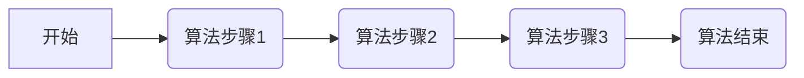
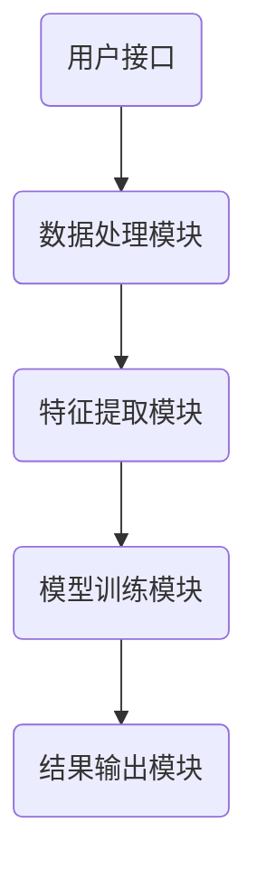

                 

# 数学与计算机视觉：图像理解的数学方法

> 关键词：数学基础、计算机视觉、图像理解、深度学习、算法原理

> 摘要：本文将探讨数学与计算机视觉之间的紧密联系，通过介绍数学基础、计算机视觉基础、图像理解技术、应用实例以及未来展望，详细阐述图像理解中的数学方法及其应用。本文旨在为广大读者提供一部深入浅出、系统全面的技术指南。

## 引言

### 什么是数学与计算机视觉

数学作为一门基础学科，广泛应用于各个领域，计算机视觉便是其中之一。计算机视觉，顾名思义，是研究如何使计算机具备人类视觉能力的学科。它涉及图像处理、模式识别、机器学习等多个子领域，其核心目标是实现对图像的理解和分析。

数学与计算机视觉之间的关系密不可分。数学为计算机视觉提供了强大的理论支撑，如线性代数、概率论与数理统计等，为图像处理和特征提取提供了有效的工具和方法。同时，计算机视觉的发展又推动了数学理论的应用和创新。

### 图像理解的背景与意义

图像理解是计算机视觉的核心任务之一，它旨在从图像中提取有意义的信息，实现对场景的解析和认知。在现实世界中，图像理解有着广泛的应用，如自动驾驶、医疗影像分析、人脸识别、视频监控等。

随着深度学习等人工智能技术的发展，图像理解的能力得到了大幅提升。然而，要实现更加智能的图像理解，仍需借助数学方法来优化算法、提升性能。本文将围绕这一主题，详细介绍数学与计算机视觉在图像理解中的应用。

## 数学基础

### 数学基础回顾

在计算机视觉中，数学基础至关重要。本文将简要回顾以下数学概念：

- **线性代数**：线性代数是研究向量空间及其线性变换的数学分支。它在图像处理和计算机视觉中有着广泛的应用，如矩阵运算、特征提取、图像变换等。

- **概率论与数理统计**：概率论与数理统计为处理不确定性和随机现象提供了理论依据。在计算机视觉中，概率论用于模型估计和假设检验，数理统计用于数据分析和方法评估。

- **几何学**：几何学是研究空间中点的位置、形状、大小和相互关系的数学分支。在计算机视觉中，几何学用于图像配准、三维重建、场景解析等任务。

### 数学方法在计算机视觉中的应用

数学方法在计算机视觉中的应用主要体现在以下几个方面：

- **图像处理**：利用数学模型对图像进行预处理、增强、滤波等操作，以提高图像质量。

- **特征提取**：通过数学方法从图像中提取具有区分性的特征，用于后续的识别、分类等任务。

- **模型训练**：利用数学方法优化模型参数，提高模型性能。

- **推理与决策**：利用数学方法对图像进行语义理解、场景解析等任务。

## 计算机视觉基础

### 计算机视觉简介

计算机视觉是一门研究如何使计算机具备人类视觉能力的学科。它涉及图像处理、模式识别、机器学习等多个子领域。计算机视觉的核心任务是实现对图像的理解和分析。

### 图像处理基础

图像处理是计算机视觉的基础，它涉及对图像的预处理、增强、滤波等操作。本文将简要介绍以下图像处理技术：

- **预处理**：包括图像去噪、图像缩放、图像旋转等操作。

- **增强**：通过调整图像的亮度和对比度，增强图像的视觉效果。

- **滤波**：通过卷积运算等手段，对图像进行滤波处理，以消除噪声、锐化图像等。

### 特征提取与表示

特征提取是计算机视觉的关键步骤，它旨在从图像中提取具有区分性的特征，用于后续的识别、分类等任务。本文将介绍以下特征提取方法：

- **边缘检测**：通过检测图像中的边缘，提取图像的局部特征。

- **纹理分析**：通过分析图像中的纹理特征，提取具有区分性的特征。

- **形状分析**：通过分析图像中的形状特征，提取图像的形状信息。

### 模型训练与优化

模型训练是计算机视觉中的核心任务之一，它旨在通过大量数据训练模型，使其具备良好的识别、分类等能力。本文将简要介绍以下模型训练方法：

- **监督学习**：通过标注数据训练模型，使模型具备分类、识别等能力。

- **无监督学习**：通过无标注数据训练模型，使模型能够自动发现数据中的模式。

- **半监督学习**：结合有标注和无标注数据训练模型，提高模型性能。

## 图像理解技术

### 机器学习方法

机器学习方法在图像理解中发挥着重要作用，本文将介绍以下机器学习方法：

- **监督学习**：通过标注数据训练模型，使模型具备分类、识别等能力。

- **无监督学习**：通过无标注数据训练模型，使模型能够自动发现数据中的模式。

- **半监督学习**：结合有标注和无标注数据训练模型，提高模型性能。

### 深度学习方法

深度学习方法近年来在图像理解领域取得了显著的成果，本文将介绍以下深度学习方法：

- **卷积神经网络（CNN）**：通过卷积操作提取图像特征，实现图像分类、目标检测等任务。

- **循环神经网络（RNN）**：通过循环结构处理序列数据，实现视频分析、自然语言处理等任务。

- **生成对抗网络（GAN）**：通过对抗训练生成逼真的图像，实现图像生成、风格迁移等任务。

### 图像语义分割与目标检测

图像语义分割和目标检测是图像理解中的重要任务，本文将介绍以下技术：

- **图像语义分割**：对图像中的每个像素进行分类，实现场景解析。

- **目标检测**：识别图像中的目标对象，实现对象检测和定位。

## 应用实例

### 图像识别

图像识别是图像理解的基础，通过识别图像中的物体或场景，实现图像分类、物体检测等任务。

### 人脸识别

人脸识别是一种常见的人脸识别技术，通过提取人脸特征，实现人脸识别、人脸匹配等任务。

### 车辆检测

车辆检测是自动驾驶系统中的关键任务，通过检测图像中的车辆，实现自动驾驶、交通监控等任务。

### 虚拟现实

虚拟现实通过计算机视觉技术实现对现实场景的重建和模拟，实现沉浸式体验。

## 未来展望

### 新技术趋势

随着深度学习、生成对抗网络等技术的发展，图像理解技术将不断取得突破，为更多应用场景提供解决方案。

### 面临的挑战与解决方案

图像理解技术在实际应用中面临诸多挑战，如数据标注、模型泛化能力、计算效率等。通过改进算法、优化模型、提高数据处理能力等手段，可以逐步解决这些挑战。

### 发展前景与影响

图像理解技术的发展将对各个行业产生深远影响，如医疗、交通、娱乐等。随着技术的不断进步，图像理解的应用场景将更加广泛，为人们的生活带来更多便利。

## 结束语

本文从数学基础、计算机视觉基础、图像理解技术、应用实例以及未来展望等多个角度，详细介绍了数学与计算机视觉在图像理解中的应用。希望本文能为广大读者提供一部深入浅出、系统全面的技术指南，助力大家在图像理解领域取得更好的成果。

### 作者信息

作者：AI天才研究院/AI Genius Institute & 禅与计算机程序设计艺术 /Zen And The Art of Computer Programming

---

### 附录

本文中涉及的数学公式、算法原理、系统架构等内容均采用markdown格式和mermaid流程图进行展示，以增强文章的可读性和易懂性。具体示例如下：

#### 数学公式示例

$$  
\sum_{i=1}^n x_i = \frac{1}{n} \sum_{i=1}^n x_i^2  
$$

#### 算法原理示例

#### 系统架构示例

通过这些示例，读者可以更好地理解文章中的相关内容。同时，本文也提供了一些最佳实践 tips、小结、注意事项和拓展阅读，以帮助读者深入掌握图像理解的数学方法。希望本文能为读者在图像理解领域的研究和实践提供有益的参考。

