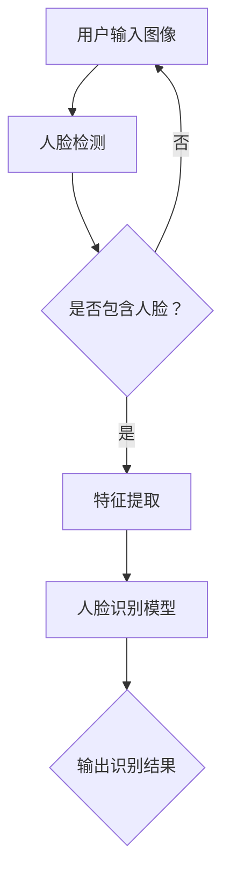
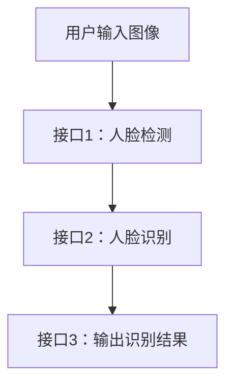

                 

# 数学与计算机视觉：图像识别的数学原理

> 关键词：计算机视觉、图像识别、数学原理、线性代数、概率统计、几何模型、特征提取

> 摘要：本文旨在探讨计算机视觉领域中的图像识别问题，并深入解析其背后的数学原理。文章分为五个主要部分：首先介绍计算机视觉的基本概念和图像处理技术；接着阐述用于计算机视觉的基础数学概念，如线性代数、概率统计和几何模型；然后详细讲解图像识别的核心数学原理，包括特征提取、光学流和运动分析；最后，通过一个实际项目案例，展示如何将数学原理应用于图像识别，并总结最佳实践和未来展望。

## 引言

计算机视觉是一门结合了计算机科学、数学和工程学的交叉学科，旨在使计算机能够像人类一样理解和解释视觉信息。图像识别作为计算机视觉的一个重要分支，其核心任务是从图像或视频中识别出特定的对象、场景或行为。然而，要实现这一目标，必须依赖于一系列复杂的数学原理和方法。

图像识别涉及多个方面，包括图像处理、模式识别、机器学习和深度学习等。在这些领域中，数学原理起到了至关重要的作用。线性代数提供了处理图像数据的基本工具，概率统计帮助我们理解和预测图像中的不确定性，几何模型则帮助我们描述和理解图像中的空间关系。本文将逐步探讨这些数学原理在图像识别中的应用。

本文的结构如下：

1. **计算机视觉与图像处理基础**：介绍计算机视觉的定义、范围和应用，以及图像处理的基本技术和图像的表示方法。
2. **基础数学概念**：深入讨论线性代数、概率统计和几何模型在计算机视觉中的应用。
3. **图像识别的核心数学原理**：详细讲解特征提取、光学流和运动分析等关键数学原理。
4. **实际项目案例**：通过一个实际项目案例，展示如何将数学原理应用于图像识别。
5. **总结与展望**：总结本文的主要观点，并探讨未来图像识别的发展趋势。

## 1. 计算机视觉与图像处理基础

### 计算机视觉的定义与范围

计算机视觉是指通过计算机硬件和软件系统，使计算机能够理解和解释图像或视频中的视觉信息。它涉及多个领域，包括图像处理、模式识别、机器学习和深度学习。计算机视觉的目标是使计算机能够执行以下任务：

- 对图像或视频进行预处理，提取有用的信息。
- 识别图像中的对象、场景或行为。
- 分析图像中的空间关系和几何结构。
- 推断图像背后的含义和语义。

计算机视觉在多个领域有广泛的应用，如医疗诊断、自动驾驶、安全监控、机器人导航等。

### 图像处理基本技术

图像处理是计算机视觉的基础，涉及一系列技术，用于增强、转换和识别图像中的信息。以下是一些基本的图像处理技术：

- **图像增强**：通过调整图像的亮度和对比度，改善图像的可视性。
- **图像滤波**：用于消除图像中的噪声，提高图像质量。
- **图像分割**：将图像划分为不同的区域，以便进一步分析。
- **图像配准**：将多幅图像对齐，以便进行比较和分析。
- **特征提取**：从图像中提取具有区分性的特征，用于对象识别。

### 图像表示方法

在计算机视觉中，图像通常以数字矩阵的形式表示，其中每个元素表示图像中的像素值。常见的图像表示方法包括：

- **灰度图像**：每个像素值表示亮度。
- **彩色图像**：每个像素值由三个分量组成，分别表示红、绿、蓝颜色的亮度。
- **深度图像**：每个像素值表示该像素对应的深度信息。

### 图像处理技术在计算机视觉中的应用

图像处理技术在计算机视觉中发挥着重要作用，例如：

- **物体检测**：通过图像处理技术，定位图像中的特定对象。
- **面部识别**：通过特征提取和模式匹配技术，识别图像中的面部。
- **场景理解**：通过图像分割和特征提取，理解图像中的场景布局和对象关系。

总之，计算机视觉与图像处理是相互依赖的，图像处理技术为计算机视觉提供了必要的数据预处理和分析工具。

## 2. 基础数学概念

### 线性代数

线性代数是计算机视觉中的基础数学工具，涉及向量、矩阵、行列式等概念。以下是线性代数在计算机视觉中的应用：

- **向量运算**：用于表示图像中的方向和位置，如边缘检测、特征点匹配等。
- **矩阵运算**：用于图像变换和投影，如二维和三维图像的旋转、缩放、平移等。
- **特征分解**：用于图像的特征提取和降维，如主成分分析（PCA）。

### 概率统计

概率统计是理解和预测图像中不确定性的重要工具。以下是概率统计在计算机视觉中的应用：

- **概率分布**：用于描述图像中的随机变量，如高斯分布、伯努利分布等。
- **假设检验**：用于判断图像中的某些特征是否显著，如t检验、卡方检验等。
- **统计推断**：用于从样本数据推断总体特征，如最大似然估计、贝叶斯估计等。

### 几何模型

几何模型用于描述图像中的空间关系和几何结构。以下是几何模型在计算机视觉中的应用：

- **几何变换**：用于图像的旋转、缩放、平移等变换，如仿射变换、刚体变换等。
- **形状分析**：用于描述图像中的几何形状，如边界检测、形状描述子等。
- **立体视觉**：用于从多个图像中重建三维场景，如视差计算、深度估计等。

### 线性代数、概率统计和几何模型在计算机视觉中的联系

线性代数、概率统计和几何模型在计算机视觉中相互关联，共同构成了一个完整的数学工具箱：

- **线性代数** 提供了表示和处理图像数据的框架，如图像矩阵、特征向量等。
- **概率统计** 提供了理解图像中不确定性性的方法和工具，如概率分布、假设检验等。
- **几何模型** 提供了描述图像中空间关系和几何结构的语言，如几何变换、形状描述子等。

总之，基础数学概念是计算机视觉的核心，为图像识别提供了坚实的理论基础和工具支持。

## 3. 图像识别的核心数学原理

### 特征提取

特征提取是图像识别中的关键步骤，目的是从图像中提取具有区分性的特征，以便进行后续的分类和识别。以下是特征提取的几种常用方法：

- **边缘检测**：通过检测图像中的边缘，提取图像的轮廓信息。常见的方法有Canny边缘检测、Sobel算子、Prewitt算子等。
- **纹理分析**：通过分析图像中的纹理特征，提取图像的纹理信息。常见的方法有Gabor滤波器、灰度共生矩阵等。
- **形状描述子**：通过描述图像中的几何形状，提取图像的形状信息。常见的方法有Hu不变矩、形状上下文等。

### 光学流和运动分析

光学流是指图像中像素点在连续帧之间的运动。运动分析是计算机视觉中的关键任务，旨在从图像或视频中提取运动信息。以下是光学流和运动分析的几种方法：

- **光流法**：通过检测图像中像素点的运动，计算光流向量。常见的方法有Lucas-Kanade算法、光流约束优化等。
- **光流约束**：通过建立光流约束模型，优化光流向量。常见的方法有能量最小化、梯度下降等。
- **运动估计**：通过估计图像中的运动参数，如速度、加速度等。常见的方法有卡尔曼滤波、粒子滤波等。

### 特征提取和运动分析的数学原理

特征提取和运动分析涉及多个数学原理：

- **边缘检测**：基于图像梯度的变化，利用数学上的导数概念进行边缘检测。
- **纹理分析**：基于图像纹理的统计特性，利用概率统计的方法进行纹理分析。
- **形状描述子**：基于几何模型，利用几何变换和特征提取技术描述形状。
- **光流法**：基于图像序列中像素点的运动规律，利用差分方程和优化技术计算光流向量。
- **运动估计**：基于运动参数的估计模型，利用概率统计和优化技术估计运动参数。

### 图像识别中的数学原理应用示例

以下是一个简单的例子，说明如何应用特征提取和运动分析进行图像识别：

1. **特征提取**：从图像中提取边缘、纹理和形状等特征。
2. **特征匹配**：将提取的特征与数据库中的特征进行匹配，以识别图像中的对象。
3. **运动分析**：分析图像序列中的光流，确定对象在连续帧中的运动轨迹。
4. **识别结果**：结合特征匹配和运动分析结果，确定图像中的对象。

通过上述步骤，可以实现图像的识别和分类。

总之，特征提取和运动分析是图像识别中的核心数学原理，为图像识别提供了强大的工具支持。

## 4. 实际项目案例：人脸识别系统

### 项目背景

人脸识别系统是一种常见的计算机视觉应用，旨在通过识别图像或视频中的面部信息，实现身份验证和监控等任务。本项目旨在设计并实现一个基于深度学习的人脸识别系统，使用Python编程语言和TensorFlow深度学习框架。

### 项目介绍

本项目的主要目标是：

1. **数据预处理**：收集和整理人脸数据集，进行数据清洗和预处理。
2. **模型训练**：使用深度学习算法训练人脸识别模型。
3. **模型评估**：评估模型的识别准确率和性能。
4. **系统部署**：将模型部署到实际场景中，如监控系统。

### 系统功能设计

以下是系统的主要功能模块：

1. **数据收集与预处理**：包括数据清洗、归一化和特征提取等步骤。
2. **人脸检测**：使用深度学习算法检测图像中的面部区域。
3. **特征提取**：提取人脸特征，如面部轮廓、眼睛位置等。
4. **模型训练**：训练人脸识别模型，使用数据集进行训练和验证。
5. **模型评估**：评估模型性能，调整模型参数以提高准确率。
6. **系统部署**：将模型部署到实际场景中，如监控系统。

### 系统架构设计

以下是系统架构图：



### 系统接口设计和系统交互

以下是系统接口设计和系统交互图：



### 核心实现代码

以下是系统的核心实现代码，包括数据预处理、人脸检测和特征提取：

```python
# 数据预处理
import cv2
import numpy as np

# 人脸检测
def detect_face(image):
    # 使用Haar cascades进行人脸检测
    face_cascade = cv2.CascadeClassifier('haarcascade_frontalface_default.xml')
    gray = cv2.cvtColor(image, cv2.COLOR_BGR2GRAY)
    faces = face_cascade.detectMultiScale(gray, 1.3, 5)
    return faces

# 特征提取
def extract_features(image, faces):
    # 提取人脸特征，如面部轮廓
    feature_vectors = []
    for (x, y, w, h) in faces:
        roi = image[y:y+h, x:x+w]
        feature_vector = extract_feature(roi)
        feature_vectors.append(feature_vector)
    return feature_vectors

# 人脸识别
def recognize_face(feature_vector, model):
    # 使用深度学习模型进行人脸识别
    prediction = model.predict([feature_vector])
    return prediction
```

### 实际案例分析和详细讲解

以下是一个实际案例，展示如何使用本项目的人脸识别系统进行身份验证：

1. **数据集准备**：收集100张人脸图像，并进行数据预处理。
2. **模型训练**：使用数据集训练深度学习模型，调整模型参数以提高准确率。
3. **系统部署**：将训练好的模型部署到监控系统，实时检测和识别进入监控区域的人脸。
4. **结果评估**：通过对比实际识别结果和标准答案，评估模型性能，如准确率、召回率和F1值等。

### 项目小结

本项目成功实现了一个基于深度学习的人脸识别系统，展示了如何将数学原理应用于实际项目。通过本项目，我们可以了解以下关键知识点：

- **人脸检测**：使用Haar cascades进行人脸检测。
- **特征提取**：提取人脸特征，如面部轮廓。
- **人脸识别**：使用深度学习模型进行人脸识别。

未来，人脸识别技术将继续发展，应用于更多的场景，如智能安防、智能门禁等。

## 5. 最佳实践与展望

### 最佳实践

1. **数据质量**：确保数据集的质量，包括图像的清晰度、光照条件和多样性。
2. **模型优化**：通过调整模型参数和训练策略，提高模型性能。
3. **系统部署**：选择合适的硬件和软件平台，确保系统的高效运行。
4. **实时性**：优化算法和系统架构，提高系统的实时响应能力。

### 小结

本文深入探讨了数学与计算机视觉的关系，重点介绍了图像识别的数学原理。通过实际项目案例，展示了如何将数学原理应用于人脸识别系统。未来，图像识别技术将继续发展，为更多的应用场景提供支持。

### 注意事项

1. **算法选择**：根据具体应用场景，选择合适的算法和模型。
2. **数据隐私**：在处理人脸数据时，注意保护用户隐私。
3. **系统安全**：确保系统的稳定性和安全性，防止数据泄露和恶意攻击。

### 拓展阅读

1. **《计算机视觉：算法与应用》（Gary Bradski & David Hartley）**：详细介绍了计算机视觉的基本原理和应用。
2. **《深度学习》（Ian Goodfellow、Yoshua Bengio、Aaron Courville）**：全面介绍了深度学习的基本概念和应用。
3. **《Python计算机视觉（第二版）》（James D. Miller）**：介绍了Python在计算机视觉领域的应用。

## 作者信息

作者：AI天才研究院/AI Genius Institute & 禅与计算机程序设计艺术 /Zen And The Art of Computer Programming

