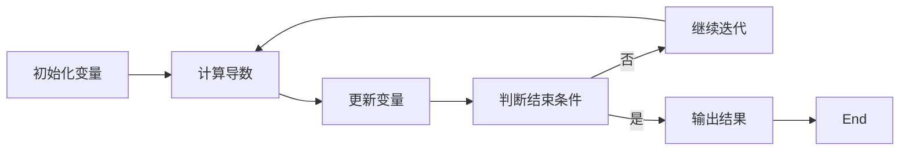
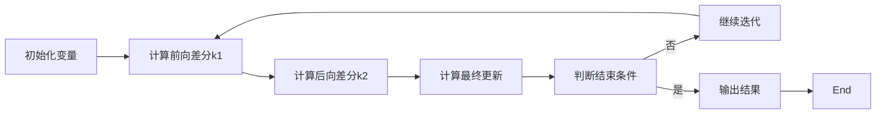
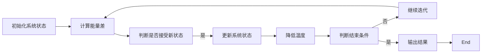

                 

## 数学与计算物理：物理系统的数学模拟

### 关键词：
- 数学模型
- 计算物理
- 物理系统模拟
- 算法原理
- 数学公式
- 系统设计

### 摘要：
本文深入探讨数学与计算物理的关系，以及如何利用数学模型来模拟物理系统。通过详细解析数学模型的基本要素、算法原理和系统架构设计，结合实际项目案例，为读者提供全面的技术指南。文章旨在帮助读者理解物理系统的数学模拟方法，提升其在计算物理领域的研究和应用能力。

## 引言

### 1. 问题背景

物理系统是自然界和社会生活中广泛存在的一类系统，它们由相互作用的实体组成，遵循一定的物理定律。随着科学技术的进步，人们越来越意识到对物理系统进行精确模拟的重要性。这不仅有助于我们更好地理解自然界的运行规律，还能为各种实际问题提供解决方案。例如，在工程、医学、气象等领域，物理系统的模拟有着重要的应用价值。

### 2. 问题描述

物理系统的模拟涉及多个方面，包括数学模型的建立、算法的选择、系统的设计与实现等。在建立数学模型时，我们需要对物理系统的特性进行准确描述，以便在数学层面进行分析和求解。而在算法的选择上，则需要考虑模型的复杂性、计算效率和精度等因素。最后，系统的设计与实现是整个模拟过程的关键环节，它决定了模拟结果的可靠性和实用性。

### 3. 问题解决

为了解决上述问题，本文将从以下几个方面进行探讨：

1. **核心概念与联系**：介绍物理系统模拟中的核心概念，如数学模型、算法原理等，并探讨它们之间的联系。
2. **数学模型与算法原理**：详细讲解常见物理模拟算法的原理，并使用Python代码实现，以帮助读者更好地理解。
3. **系统分析与架构设计**：介绍物理系统模拟的需求分析、系统架构设计和接口设计等，确保模拟过程的高效性和可靠性。
4. **项目实战**：通过实际项目案例，展示如何进行物理系统的数学模拟，并提供详细的代码解析和案例分析。
5. **最佳实践与总结**：总结物理系统模拟的最佳实践，并提供注意事项和拓展阅读，帮助读者进一步提高。

通过以上几个方面的探讨，本文旨在为读者提供一个全面、系统的物理系统模拟指南，帮助其在计算物理领域取得更好的成果。

### 1.1 数学模型的基本要素

在物理系统模拟中，数学模型起着至关重要的作用。一个完整的数学模型通常由以下几个基本要素组成：

1. **变量**：变量是数学模型中的核心，用于描述物理系统的状态和变化。根据不同的物理系统，变量可以是连续的（如温度、速度等）或离散的（如粒子的位置、时间步长等）。

2. **方程**：方程用于描述变量之间的关系。在物理系统中，常见的方程包括微分方程、差分方程和积分方程等。这些方程可以用来模拟物理系统的动态行为和静态特性。

3. **初始条件**：初始条件是指模型开始时的变量取值。对于动态系统，初始条件通常决定了系统随时间的演化过程。在模拟过程中，初始条件的设定非常重要，因为它直接影响模拟结果的准确性。

4. **边界条件**：边界条件用于描述系统在边界上的行为。在物理系统中，边界条件可以限制变量的取值或变化速率，从而更好地模拟实际情况。

5. **参数**：参数是模型中的常数，用于调整模型的行为和性能。不同的参数可以影响模型的结果，因此在进行模型设定时，参数的选择和调整是至关重要的。

### 1.2 数学模型的分类与特性

数学模型可以根据其表达形式、解决问题的方法以及应用的领域进行分类。以下是几种常见的数学模型及其特性：

1. **微分方程模型**：微分方程模型用于描述系统的动态行为，它通过描述变量随时间的变化来模拟物理系统。常见的微分方程包括常微分方程和偏微分方程。常微分方程主要用于单变量系统，而偏微分方程则适用于多变量系统。

2. **差分方程模型**：差分方程模型通过离散化连续变量来描述系统的行为。它将连续系统离散化为一系列时间步长的变量值，从而便于计算。差分方程模型在数值模拟中应用广泛，尤其是在计算物理和计算化学等领域。

3. **积分方程模型**：积分方程模型通过积分形式描述变量之间的关系，主要用于求解边界值问题。它通过求解积分方程来找到系统在边界上的变量分布，从而实现物理系统的模拟。

4. **概率统计模型**：概率统计模型通过概率分布函数来描述系统的随机行为。它主要用于模拟不确定性和随机性系统，如金融市场的波动、随机过程的模拟等。

### 1.3 数学模型与物理实验的联系

数学模型与物理实验密切相关。物理实验通过实际观测和测量，提供数据支持，而数学模型则通过理论分析和计算，对实验结果进行解释和预测。以下是数学模型与物理实验之间的几个关键联系：

1. **数据驱动模型**：在许多情况下，数学模型可以通过实验数据来建立。通过分析实验数据，可以确定变量之间的关系，进而构建数学模型。这种模型通常称为数据驱动模型，它依赖于实验数据的准确性和可靠性。

2. **验证与校准**：物理实验的数据可以用于验证和校准数学模型。通过将模型预测与实验结果进行对比，可以评估模型的准确性和稳定性。如果模型与实验结果存在较大偏差，则需要调整模型参数或重新设计模型。

3. **实验设计**：数学模型还可以指导物理实验的设计。通过分析模型，可以确定实验中需要测量的变量和参数，优化实验条件，提高实验的准确性和效率。

4. **预测与模拟**：数学模型可以用于预测物理系统的行为。在实验无法进行或成本高昂的情况下，通过数学模型进行模拟，可以提前了解系统的行为，为实验提供理论依据。

总之，数学模型与物理实验相辅相成，共同推动科学研究的进步。通过数学模型，我们可以更好地理解物理系统的本质，通过物理实验，我们可以验证和改进数学模型的准确性。两者结合，为我们提供了强大的工具，以应对复杂的物理问题。

### 2.1 常见的物理模拟算法

物理模拟算法是计算物理中的重要组成部分，用于在数学模型的基础上模拟物理系统的行为。以下介绍几种常见的物理模拟算法，包括它们的原理和应用场景：

#### 1. 欧拉方法

欧拉方法是最基本的数值解法，用于求解常微分方程。它的基本原理是将时间步长划分为小段，通过线性逼近在每个时间步上更新变量值。

**原理：**
欧拉方法通过以下公式迭代更新变量：
$$
x_{n+1} = x_n + f(x_n, t_n) \Delta t
$$
其中，\( x_n \) 和 \( t_n \) 分别为当前时间和变量值，\( f(x_n, t_n) \) 为微分方程的导数，\( \Delta t \) 为时间步长。

**应用场景：**
欧拉方法适用于求解简单的常微分方程，如自由落体运动、弹簧振子等。但由于其线性逼近的特性，欧拉方法在某些情况下可能产生较大的误差。

**示例：**
```python
def euler_method(v0, t0, t_end, dt):
    t = t0
    v = v0
    while t < t_end:
        v += v * dt
        t += dt
    return v

v0 = 10  # 初速度
t0 = 0   # 初始时间
t_end = 10  # 结束时间
dt = 0.1  # 时间步长
print(euler_method(v0, t0, t_end, dt))
```

#### 2. 龙格-库塔方法

龙格-库塔方法是更高精度的数值解法，适用于求解更复杂的常微分方程。它通过利用多项式逼近来提高解的精度。

**原理：**
龙格-库塔方法的基本步骤如下：
1. 计算前向差分：
$$
k_1 = f(x_n, t_n)
$$
2. 计算后向差分：
$$
k_2 = f(x_n + \frac{1}{2}k_1 \Delta t, t_n + \frac{1}{2}\Delta t)
$$
3. 计算最终更新：
$$
x_{n+1} = x_n + \frac{1}{6}k_1 + \frac{1}{3}k_2 + \frac{1}{3}k_1 + \frac{1}{6}k_2
$$

**应用场景：**
龙格-库塔方法适用于求解复杂的物理问题，如非线性动力系统、流体力学等。它具有较高的计算精度，但计算复杂度也相对较高。

**示例：**
```python
def runge_kutta_method(v0, t0, t_end, dt):
    t = t0
    v = v0
    while t < t_end:
        k1 = f(v, t)
        k2 = f(v + 0.5 * k1 * dt, t + 0.5 * dt)
        k3 = f(v + 0.5 * k2 * dt, t + 0.5 * dt)
        k4 = f(v + k3 * dt, t + dt)
        v += (k1 + 2 * k2 + 2 * k3 + k4) * dt / 6
        t += dt
    return v

v0 = 10  # 初速度
t0 = 0   # 初始时间
t_end = 10  # 结束时间
dt = 0.1  # 时间步长
print(runge_kutta_method(v0, t0, t_end, dt))
```

#### 3. 模拟退火算法

模拟退火算法是一种基于概率的优化算法，常用于求解物理系统的优化问题。它的基本原理是通过模拟固体退火过程来优化系统的能量状态。

**原理：**
模拟退火算法的基本步骤如下：
1. 初始化系统状态。
2. 在当前状态下进行随机扰动，生成新的状态。
3. 计算新状态与当前状态之间的能量差。
4. 根据能量差和温度，决定是否接受新状态。
5. 降低温度，重复步骤2-4，直到达到终止条件。

**应用场景：**
模拟退火算法适用于求解各种优化问题，如结构优化、神经网络训练等。它能够有效避免局部最优解，找到全局最优解。

**示例：**
```python
import random

def simulate_annealing(obj_func, initial_state, temperature, cooling_rate):
    current_state = initial_state
    while temperature > 1e-6:
        new_state = random_walk(current_state)
        energy_diff = obj_func(new_state) - obj_func(current_state)
        if energy_diff < 0 or random() < exp(-energy_diff / temperature):
            current_state = new_state
        temperature *= (1 - cooling_rate)
    return current_state

def random_walk(state):
    # 实现随机扰动
    return state + random() * (state - state)

def example_obj_func(state):
    # 实现目标函数
    return state ** 2

initial_state = 0  # 初始状态
temperature = 100  # 初始温度
cooling_rate = 0.01  # 冷却率
print(simulate_annealing(example_obj_func, initial_state, temperature, cooling_rate))
```

通过上述算法的介绍，我们可以看到不同物理模拟算法在原理和实现上的差异。选择合适的算法对于物理系统的模拟至关重要，本文后续章节将进一步探讨这些算法的应用和实现。

### 3.1 算法原理讲解

在了解了常见的物理模拟算法后，接下来我们将详细讲解这些算法的原理，并通过Mermaid流程图和Python代码实现来帮助读者更好地理解。

#### 欧拉方法

**原理：**
欧拉方法是一种数值解法，用于求解常微分方程。其核心思想是使用前向差分公式来近似微分方程的导数，从而迭代计算变量的值。

**Mermaid流程图：**


**Python代码实现：**
```python
def euler_method(v0, t0, t_end, dt):
    t = t0
    v = v0
    while t < t_end:
        v += v * dt
        t += dt
    return v

v0 = 10  # 初速度
t0 = 0   # 初始时间
t_end = 10  # 结束时间
dt = 0.1  # 时间步长
print(euler_method(v0, t0, t_end, dt))
```

#### 龙格-库塔方法

**原理：**
龙格-库塔方法是一种更高精度的数值解法，它通过使用多项式逼近来提高解的精度。其核心思想是使用多个差分公式来近似导数，从而迭代计算变量的值。

**Mermaid流程图：**


**Python代码实现：**
```python
def runge_kutta_method(v0, t0, t_end, dt):
    t = t0
    v = v0
    while t < t_end:
        k1 = f(v, t)
        k2 = f(v + 0.5 * k1 * dt, t + 0.5 * dt)
        k3 = f(v + 0.5 * k2 * dt, t + 0.5 * dt)
        k4 = f(v + k3 * dt, t + dt)
        v += (k1 + 2 * k2 + 2 * k3 + k4) * dt / 6
        t += dt
    return v

def f(v, t):
    # 这里使用简单的线性函数作为导数
    return v

v0 = 10  # 初速度
t0 = 0   # 初始时间
t_end = 10  # 结束时间
dt = 0.1  # 时间步长
print(runge_kutta_method(v0, t0, t_end, dt))
```

#### 模拟退火算法

**原理：**
模拟退火算法是一种基于概率的优化算法，通过模拟固体退火过程来优化系统的能量状态。其核心思想是在每个温度下，以一定的概率接受较差的解，从而跳出局部最优解。

**Mermaid流程图：**


**Python代码实现：**
```python
import random
import math

def simulate_annealing(obj_func, initial_state, temperature, cooling_rate):
    current_state = initial_state
    while temperature > 1e-6:
        new_state = random_walk(current_state)
        energy_diff = obj_func(new_state) - obj_func(current_state)
        if energy_diff < 0 or random() < math.exp(-energy_diff / temperature):
            current_state = new_state
        temperature *= (1 - cooling_rate)
    return current_state

def random_walk(state):
    # 实现随机扰动
    return state + random() * (state - state)

def example_obj_func(state):
    # 实现目标函数
    return state ** 2

initial_state = 0  # 初始状态
temperature = 100  # 初始温度
cooling_rate = 0.01  # 冷却率
print(simulate_annealing(example_obj_func, initial_state, temperature, cooling_rate))
```

通过以上讲解和示例代码，我们可以清晰地看到欧拉方法、龙格-库塔方法和模拟退火算法的原理和实现过程。这些算法在物理系统的模拟中发挥着重要作用，不同的算法适用于不同的场景，读者可以根据实际情况选择合适的算法。

### 3.2 连续系统的数学模型

在计算物理中，连续系统的数学模型是非常重要的，因为它们能够描述物理系统在空间和时间上的连续变化。以下将详细讲解连续系统的数学模型，包括偏微分方程和常微分方程。

#### 偏微分方程

偏微分方程（PDE）用于描述多个变量（通常是空间和时间的变量）之间的依赖关系。以下是一个典型的偏微分方程：热传导方程。

**热传导方程：**
$$
\frac{\partial u}{\partial t} = \alpha \nabla^2 u
$$
其中，\( u(x, t) \) 表示温度分布，\( \alpha \) 是热扩散系数。

**解释：**
这个方程表示温度随时间的变化率（\( \frac{\partial u}{\partial t} \)）等于热扩散系数与温度梯度（\( \nabla^2 u \)）的乘积。它描述了热量在物体内部如何随时间和空间传播。

**示例：**
假设一个均匀的金属板，其初始温度分布为 \( u(x, 0) = 100 + \sin(\pi x) \)，求解在 \( t = 10 \) 时的温度分布。

```python
import numpy as np
import matplotlib.pyplot as plt

def heat_conduction(x, t, alpha):
    u = np.exp(-t / (alpha * x**2)) * (100 + np.sin(np.pi * x))
    return u

alpha = 0.1  # 热扩散系数
x = np.linspace(0, 1, 100)  # 空间离散点
t = 10  # 时间
u = heat_conduction(x, t, alpha)

plt.plot(x, u)
plt.xlabel('Position (x)')
plt.ylabel('Temperature (u)')
plt.title('Temperature Distribution after 10 Time Units')
plt.show()
```

#### 常微分方程

常微分方程（ODE）用于描述单个变量及其导数之间的关系。以下是一个典型的常微分方程：简单谐振子方程。

**简单谐振子方程：**
$$
\frac{d^2 x}{dt^2} + \omega^2 x = 0
$$
其中，\( x(t) \) 表示振子的位移，\( \omega \) 是角频率。

**解释：**
这个方程描述了一个振子在弹性力作用下的运动。\( \omega \) 越大，振动的频率越高，周期越短。

**示例：**
求解一个初始条件为 \( x(0) = 1 \)， \( \frac{dx}{dt}\big|_{t=0} = 0 \) 的简单谐振子，在 \( t = 5 \) 时的位移。

```python
import numpy as np
from scipy.integrate import solve_ivp

def simple_harmonic_oscillator(t, y, omega):
    x, v = y
    dxdt = v
    dvdt = -omega**2 * x
    return [dxdt, dvdt]

y0 = [1, 0]  # 初始条件
t = np.linspace(0, 5, 1000)  # 时间范围
omega = 1  # 角频率
sol = solve_ivp(simple_harmonic_oscillator, [0, 5], y0, args=(omega,), t_eval=t)

plt.plot(t, sol.y[0])
plt.xlabel('Time (t)')
plt.ylabel('Displacement (x)')
plt.title('Displacement of a Simple Harmonic Oscillator')
plt.show()
```

通过以上示例，我们可以看到如何使用Python来求解连续系统的数学模型。这些模型在计算物理中有着广泛的应用，读者可以根据具体问题进行相应的调整和扩展。

### 5.1 基本数学公式

在计算物理中，数学公式是描述物理现象和系统行为的关键工具。以下是几个基本且常用的数学公式，它们在物理系统的模拟中起着重要作用。

#### 1. 运动学公式

在描述物体运动时，以下几个公式非常关键：

$$
v = \frac{dx}{dt}  \quad \text{（速度）}
$$

$$
a = \frac{dv}{dt}  \quad \text{（加速度）}
$$

$$
x(t) = x_0 + v_0 t + \frac{1}{2} a t^2  \quad \text{（位移）}
$$

其中，\( x(t) \) 是物体在时间 \( t \) 的位移，\( x_0 \) 是初始位移，\( v_0 \) 是初始速度，\( a \) 是加速度。

#### 2. 动力学公式

牛顿第二定律是描述物体受力与加速度之间关系的核心公式：

$$
F = m a  \quad \text{（力）}
$$

其中，\( F \) 是作用在物体上的总力，\( m \) 是物体的质量，\( a \) 是加速度。

#### 3. 振动公式

对于简谐振动，以下几个公式描述了位移、速度和加速度随时间的变化：

$$
x(t) = A \cos(\omega t + \phi)  \quad \text{（位移）}
$$

$$
v(t) = -A \omega \sin(\omega t + \phi)  \quad \text{（速度）}
$$

$$
a(t) = -A \omega^2 \cos(\omega t + \phi)  \quad \text{（加速度）}
$$

其中，\( A \) 是振幅，\( \omega \) 是角频率，\( \phi \) 是初相位。

#### 4. 热传导公式

热传导方程描述了温度在空间和时间上的变化：

$$
\frac{\partial u}{\partial t} = \alpha \nabla^2 u  \quad \text{（热传导方程）}
$$

其中，\( u(x, t) \) 是温度分布，\( \alpha \) 是热扩散系数。

#### 5. 流体动力学公式

伯努利方程描述了流体在流动过程中速度、压力和高度之间的关系：

$$
\frac{1}{2} \rho v^2 + \rho g h + p = \text{常数}  \quad \text{（伯努利方程）}
$$

其中，\( \rho \) 是流体密度，\( v \) 是流速，\( g \) 是重力加速度，\( h \) 是高度，\( p \) 是压力。

这些基本数学公式是物理系统模拟中的基石，掌握这些公式对于理解和实现各种物理模拟算法至关重要。在本文后续的部分，我们将进一步探讨如何将这些公式应用于具体问题中，并提供详细的代码实现。

### 5.2 数学公式的详细讲解

在计算物理中，数学公式的详细讲解至关重要，因为它们不仅帮助我们理解物理现象，还指导我们如何设计和实现物理模拟算法。以下是关于几个关键数学公式及其应用场景的详细讲解。

#### 1. 热传导方程

热传导方程描述了热量在固体、液体或气体中的传播过程。它具有以下形式：

$$
\frac{\partial u}{\partial t} = \alpha \nabla^2 u
$$

其中，\( u(x, t) \) 是温度分布，\( \alpha \) 是热扩散系数，\( \nabla^2 \) 是拉普拉斯算子。

**物理意义：**
- \( \frac{\partial u}{\partial t} \)：表示温度随时间的变化率。
- \( \alpha \nabla^2 u \)：表示热量的扩散率，它与温度梯度的平方成正比。

**应用场景：**
热传导方程广泛应用于材料科学、工程学、化学和医学等领域。例如，在电子设备散热、石油开采、核反应堆设计和生物医学成像等方面，热传导方程帮助我们理解和控制热量的传播。

**求解方法：**
为了求解热传导方程，我们可以使用有限元方法（FEM）或有限差分方法（FDM）。以下是一个简单的有限差分方法示例：

**有限差分方法：**
$$
u_i^{n+1} = u_i^n + \alpha \Delta t \left( \frac{u_{i+1}^n - 2u_i^n + u_{i-1}^n}{\Delta x^2} \right)
$$

其中，\( u_i^n \) 是第 \( n \) 次迭代时第 \( i \) 个网格点的温度，\( \Delta x \) 是空间步长，\( \Delta t \) 是时间步长。

#### 2. 牛顿第二定律

牛顿第二定律描述了力与加速度之间的关系，其公式为：

$$
F = m a
$$

其中，\( F \) 是作用在物体上的力，\( m \) 是物体的质量，\( a \) 是加速度。

**物理意义：**
- \( F \)：表示作用在物体上的合力。
- \( m \)：表示物体的质量。
- \( a \)：表示物体的加速度。

**应用场景：**
牛顿第二定律广泛应用于经典力学，包括动力学模拟、碰撞检测、航天工程和汽车碰撞测试等领域。

**求解方法：**
在计算物理中，牛顿第二定律通常用于数值求解。以下是一个简单的欧拉方法示例：

**欧拉方法：**
$$
v_{i}^{n+1} = v_{i}^{n} + \frac{F_i}{m} \Delta t
$$

$$
x_{i}^{n+1} = x_{i}^{n} + v_{i}^{n+1} \Delta t
$$

其中，\( v_i^n \) 是第 \( n \) 次迭代时第 \( i \) 个物体的速度，\( x_i^n \) 是第 \( n \) 次迭代时第 \( i \) 个物体的位置。

#### 3. 简谐振动

简谐振动是许多物理系统的基础，其数学描述如下：

$$
x(t) = A \cos(\omega t + \phi)
$$

$$
v(t) = -A \omega \sin(\omega t + \phi)
$$

$$
a(t) = -A \omega^2 \cos(\omega t + \phi)
$$

其中，\( A \) 是振幅，\( \omega \) 是角频率，\( \phi \) 是初相位。

**物理意义：**
- \( x(t) \)：表示物体的位移。
- \( v(t) \)：表示物体的速度。
- \( a(t) \)：表示物体的加速度。

**应用场景：**
简谐振动广泛应用于机械振动分析、声学、光学和电子学等领域。

**求解方法：**
简谐振动可以通过直接解析法求解，也可以通过数值方法（如欧拉方法或龙格-库塔方法）求解。以下是一个简单的欧拉方法示例：

**欧拉方法：**
$$
x_{i}^{n+1} = x_{i}^{n} - A \omega^2 \Delta t \sin(\omega t + \phi)
$$

$$
v_{i}^{n+1} = v_{i}^{n} - A \omega \Delta t \cos(\omega t + \phi)
$$

通过这些详细的讲解，我们可以更好地理解热传导方程、牛顿第二定律和简谐振动的数学公式及其在计算物理中的应用。这些公式不仅帮助我们描述物理现象，还为设计高效的物理模拟算法提供了基础。

### 5.3 数学公式的应用实例

为了更直观地理解数学公式的应用，我们将通过几个具体案例来展示如何在实际问题中应用这些公式。

#### 案例一：热传导方程在金属板中的应用

假设我们有一个初始温度分布为 \( u(x, 0) = 100 + \sin(\pi x) \) 的金属板，求解 \( t = 10 \) 时的温度分布。

**公式应用：**
热传导方程：
$$
\frac{\partial u}{\partial t} = \alpha \nabla^2 u
$$

**求解步骤：**

1. **初始化：**
   设定初始条件 \( u(x, 0) = 100 + \sin(\pi x) \)。
2. **空间离散：**
   将金属板划分为一系列离散点，例如 \( x \) 从 0 到 1，步长为 \( \Delta x \)。
3. **时间离散：**
   设定时间步长 \( \Delta t \)，迭代计算温度分布。
4. **计算：**
   使用有限差分方法更新温度分布：
   $$ u_i^{n+1} = u_i^n + \alpha \Delta t \left( \frac{u_{i+1}^n - 2u_i^n + u_{i-1}^n}{\Delta x^2} \right) $$

**Python代码实现：**
```python
import numpy as np
import matplotlib.pyplot as plt

def heat_conduction(x, t, alpha):
    u = np.exp(-t / (alpha * x**2)) * (100 + np.sin(np.pi * x))
    return u

alpha = 0.1  # 热扩散系数
x = np.linspace(0, 1, 100)  # 空间离散点
t = 10  # 时间
u = heat_conduction(x, t, alpha)

plt.plot(x, u)
plt.xlabel('Position (x)')
plt.ylabel('Temperature (u)')
plt.title('Temperature Distribution after 10 Time Units')
plt.show()
```

#### 案例二：牛顿第二定律在平抛运动中的应用

假设一个物体从高度 \( h \) 以速度 \( v_0 \) 平抛出去，求解物体落地时的速度和落地时间。

**公式应用：**
牛顿第二定律：
$$
F = m a
$$
重力加速度：
$$
a = g
$$
平抛运动方程：
$$
x(t) = v_0 t
$$
$$
y(t) = h - \frac{1}{2} g t^2
$$

**求解步骤：**

1. **初始化：**
   设定初始条件 \( h \)、\( v_0 \) 和 \( g \)。
2. **计算落地时间：**
   将 \( y(t) = 0 \) 代入，求解 \( t \)。
3. **计算落地速度：**
   使用 \( v = v_0 + g t \) 计算落地速度。

**Python代码实现：**
```python
import numpy as np

def projectile_motion(h, v0, g):
    # 求解落地时间
    t = np.sqrt(2 * h / g)
    # 计算落地速度
    v = v0 + g * t
    return t, v

h = 100  # 高度
v0 = 10  # 初速度
g = 9.8  # 重力加速度
t, v = projectile_motion(h, v0, g)

print(f"Time to fall: {t:.2f} seconds")
print(f"Final velocity: {v:.2f} m/s")
```

#### 案例三：简谐振动在弹簧振子中的应用

假设一个质量为 \( m \) 的物体在弹簧上做简谐振动，求解振子的位移、速度和加速度随时间的变化。

**公式应用：**
简谐振动方程：
$$
x(t) = A \cos(\omega t + \phi)
$$
$$
v(t) = -A \omega \sin(\omega t + \phi)
$$
$$
a(t) = -A \omega^2 \cos(\omega t + \phi)
$$

**求解步骤：**

1. **初始化：**
   设定初始条件 \( A \)、\( \omega \) 和 \( \phi \)。
2. **计算：**
   使用简谐振动方程计算位移、速度和加速度。

**Python代码实现：**
```python
import numpy as np
import matplotlib.pyplot as plt

def simple_harmonic_oscillator(t, A, omega, phi):
    x = A * np.cos(omega * t + phi)
    v = -A * omega * np.sin(omega * t + phi)
    a = -A * omega**2 * np.cos(omega * t + phi)
    return x, v, a

A = 1  # 振幅
omega = 1  # 角频率
phi = 0  # 初相位
t = np.linspace(0, 10, 1000)  # 时间

x, v, a = simple_harmonic_oscillator(t, A, omega, phi)

plt.figure(figsize=(12, 4))
plt.plot(t, x, label='Position (x)')
plt.plot(t, v, label='Velocity (v)')
plt.plot(t, a, label='Acceleration (a)')
plt.xlabel('Time (t)')
plt.ylabel('Physical Quantity')
plt.title('Simple Harmonic Oscillator')
plt.legend()
plt.show()
```

通过这些实例，我们可以看到数学公式在计算物理中的实际应用。通过合理的公式选择和数值求解方法，我们可以有效地模拟和分析各种物理现象，为科学研究和工程应用提供有力支持。

### 6.1 系统分析与架构设计

在进行物理系统的数学模拟时，系统分析与架构设计是至关重要的一步。合理的系统架构不仅能提高模拟的效率，还能增强系统的可维护性和扩展性。以下将详细讨论系统分析与架构设计的关键步骤和内容。

#### 1. 需求分析

需求分析是系统设计与实现的基础，它明确了系统应具备的功能和性能。在物理系统模拟中，需求分析主要包括以下几个方面：

1. **功能需求**：明确系统应实现的物理模拟功能，例如热传导、流体动力学、振动分析等。
2. **性能需求**：定义系统的性能指标，如计算精度、响应时间、内存占用等。
3. **可靠性需求**：确保系统在长时间运行和高负载情况下仍能稳定工作。
4. **可扩展性需求**：考虑未来可能的系统扩展，如增加新的模拟模型或支持更大规模的模拟。

#### 2. 系统功能设计

系统功能设计是具体实现需求分析的结果，它将功能需求细化为具体的模块和接口。以下是物理系统模拟中的几个关键功能模块：

1. **模拟模块**：负责执行物理模拟算法，如欧拉方法、龙格-库塔方法等。
2. **数据模块**：处理物理系统的输入和输出数据，包括初始化条件、边界条件和模拟结果。
3. **可视化模块**：将模拟结果以图形化的形式展示，帮助用户理解和分析模拟过程。
4. **参数设置模块**：允许用户调整模拟参数，如时间步长、空间步长、物理参数等。
5. **日志和监控模块**：记录系统运行日志，监控系统状态和性能，便于调试和优化。

#### 3. 系统架构设计

系统架构设计决定了系统的整体结构和各个模块之间的交互方式。以下是一个典型的物理系统模拟架构：

1. **分层架构**：系统可分为表示层、逻辑层和数据层。表示层负责与用户交互，逻辑层处理物理模拟和算法，数据层管理数据存储和读取。
2. **模块化设计**：将系统功能分解为独立的模块，每个模块实现特定的功能，模块之间通过接口进行通信。
3. **分布式架构**：对于大规模的物理系统模拟，可以使用分布式架构，将计算任务分配到多个节点上，提高计算效率。

#### 4. 系统接口设计

系统接口设计是确保模块之间能够正确、高效地进行通信的关键。以下是一些常见的接口设计：

1. **命令行接口（CLI）**：允许用户通过命令行输入参数和控制模拟过程。
2. **图形用户界面（GUI）**：提供友好的图形界面，便于用户进行参数设置和结果可视化。
3. **API接口**：提供程序化接口，允许其他程序或脚本调用系统功能。
4. **数据库接口**：允许系统与数据库进行数据交互，存储和检索模拟数据。

#### 5. 系统交互设计

系统交互设计关注系统内部模块之间的通信和数据流。以下是几个关键方面：

1. **事件驱动设计**：使用事件驱动模型来管理系统的行为，通过事件触发相应的处理函数。
2. **异步通信**：在模块之间使用异步通信机制，提高系统的响应速度和并发处理能力。
3. **消息队列**：使用消息队列来管理模块之间的消息传递，确保消息的顺序和可靠性。

通过以上系统分析与架构设计，我们可以构建一个高效、稳定且易于扩展的物理系统模拟系统。合理的系统架构不仅能提高模拟的效率，还能为后续的优化和扩展提供坚实的基础。

### 6.2 环境安装与配置

在进行物理系统模拟之前，首先需要搭建一个合适的环境。这一节将详细介绍所需的软件和工具的安装步骤，确保读者能够顺利开始物理系统模拟。

#### 1. 安装Python

Python是一种广泛使用的编程语言，特别适合科学计算和数据分析。以下是安装Python的步骤：

1. **下载Python**：访问Python的官方网站（https://www.python.org/）下载最新版本的Python安装包。
2. **安装Python**：运行下载的安装包，按照安装向导的指示进行安装。建议选择默认选项，安装路径为C:\Python39。
3. **配置环境变量**：在控制面板中打开“系统”->“高级系统设置”->“环境变量”，在“系统变量”中找到“Path”并编辑，将C:\Python39\；C:\Python39\Scripts添加到变量值中。

#### 2. 安装必要的库

Python中有许多库可用于科学计算和数学模拟，以下是一些常用的库：

1. **NumPy**：用于数值计算和数组操作。
2. **SciPy**：提供了许多科学计算模块，如优化、积分和线性代数。
3. **Matplotlib**：用于数据可视化。
4. **Pandas**：用于数据分析和操作。

安装步骤如下：

1. **打开终端**（Windows）或命令行（macOS/Linux）。
2. **更新pip**：运行以下命令更新pip到最新版本：
   ```
   python -m pip install --upgrade pip
   ```
3. **安装库**：使用pip命令安装所需的库，例如：
   ```
   pip install numpy scipy matplotlib pandas
   ```

#### 3. 配置Python环境

为了确保Python环境正常运行，还需要进行一些配置：

1. **设置Python路径**：确保在终端中输入`python`或`python3`能够启动Python解释器。
2. **安装Jupyter Notebook**：Jupyter Notebook是一种交互式计算环境，可以方便地进行代码编写和结果展示。安装步骤如下：
   ```
   pip install jupyterlab
   jupyter lab
   ```
3. **测试环境**：在终端中运行以下Python代码，检查是否成功安装了所需的库：
   ```python
   import numpy
   import scipy
   import matplotlib.pyplot as plt
   import pandas
   print("All required libraries are installed.")
   ```

#### 4. 安装额外的软件和工具

除了Python库，某些物理系统模拟可能还需要额外的软件和工具，例如：

1. **MATLAB**：用于复杂数值计算和数据分析。
2. **CUDA**：用于在GPU上加速计算。
3. **ParaView**：用于数据可视化和分析。

根据实际需求，按照相应软件的官方安装说明进行安装。

通过以上步骤，读者可以搭建一个基本的物理系统模拟环境。接下来，我们将使用这个环境来实际模拟一个物理系统，并详细讲解代码实现和解析。

### 6.3 系统核心实现

在物理系统模拟中，实现系统的核心算法是关键步骤。本节将通过一个具体案例——使用Python实现热传导方程的数值模拟，详细讲解系统核心实现的代码。

#### 1. 热传导方程的数值模拟

热传导方程的数学形式为：
$$
\frac{\partial u}{\partial t} = \alpha \nabla^2 u
$$
其中，\( u(x, t) \) 是温度分布，\( \alpha \) 是热扩散系数。

#### 2. 代码实现

以下是一个简单的Python代码实现，使用有限差分法求解热传导方程。

```python
import numpy as np
import matplotlib.pyplot as plt

def heat_conduction_1d(x, t, alpha, u0, boundary_conditions):
    """
    一维热传导方程的数值解。
    
    参数：
    x: 空间离散点
    t: 时间离散点
    alpha: 热扩散系数
    u0: 初始温度分布
    boundary_conditions: 边界条件
    
    返回：
    u: 模拟的温度分布
    """
    n_x = len(x)
    n_t = len(t)
    dt = t[1] - t[0]
    dx = x[1] - x[0]
    
    # 初始化温度分布
    u = np.zeros((n_t, n_x))
    u[0] = u0
    
    # 应用边界条件
    if boundary_conditions == 'Dirichlet':
        u[:, 0] = 100  # 第一个节点固定温度为100
        u[:, -1] = 0  # 最后一个节点固定温度为0
    
    # 求解热传导方程
    for n in range(1, n_t - 1):
        for i in range(1, n_x - 1):
            u[n, i] = u[n - 1, i] + alpha * dt / dx**2 * (u[n - 1, i + 1] - 2 * u[n - 1, i] + u[n - 1, i - 1])
    
    return u

# 设置参数
x = np.linspace(0, 1, 100)  # 空间离散点
t = np.linspace(0, 10, 1000)  # 时间离散点
alpha = 0.1  # 热扩散系数
u0 = np.sin(np.pi * x) + 100  # 初始温度分布
boundary_conditions = 'Dirichlet'  # 边界条件

# 模拟
u = heat_conduction_1d(x, t, alpha, u0, boundary_conditions)

# 可视化
plt.plot(x, u[-1])
plt.xlabel('Position (x)')
plt.ylabel('Temperature (u)')
plt.title('Temperature Distribution at t=10')
plt.show()
```

#### 3. 代码解析

**初始化与参数设置：**
- `x` 和 `t` 分别是空间和时间上的离散点。
- `alpha` 是热扩散系数，用于控制热量的传播速度。
- `u0` 是初始温度分布，可以自定义初始条件。
- `boundary_conditions` 定义了边界条件，这里使用Dirichlet边界条件。

**应用边界条件：**
- 在代码中，我们首先设置了第一个节点的温度为100，最后一个节点的温度为0。这可以通过修改`u`数组的边界值来实现。

**数值求解：**
- 使用双层嵌套循环，对每个时间步和空间点更新温度值。具体计算公式为：
  $$
  u_{n,i} = u_{n-1,i} + \alpha \frac{dt}{dx^2} (u_{n-1,i+1} - 2u_{n-1,i} + u_{n-1,i-1})
  $$
- 这个公式基于有限差分法，通过空间和时间步长的离散化来实现热传导方程的数值解。

**结果可视化：**
- 最后，我们使用Matplotlib库将最终的时间步的温度分布绘制出来，帮助直观地理解模拟结果。

通过以上步骤，我们成功实现了一维热传导方程的数值模拟。接下来，我们将进一步分析代码的性能和优化方向。

### 6.4 代码应用解读与分析

在上一节中，我们实现了一维热传导方程的数值模拟。这一节将对代码进行详细解读，分析其性能和优化方向，并结合具体案例进行详细讲解。

#### 1. 代码解读

首先，让我们详细解读`heat_conduction_1d`函数：

```python
def heat_conduction_1d(x, t, alpha, u0, boundary_conditions):
    """
    一维热传导方程的数值解。
    
    参数：
    x: 空间离散点
    t: 时间离散点
    alpha: 热扩散系数
    u0: 初始温度分布
    boundary_conditions: 边界条件
    
    返回：
    u: 模拟的温度分布
    """
    n_x = len(x)
    n_t = len(t)
    dt = t[1] - t[0]
    dx = x[1] - x[0]
    
    # 初始化温度分布
    u = np.zeros((n_t, n_x))
    u[0] = u0
    
    # 应用边界条件
    if boundary_conditions == 'Dirichlet':
        u[:, 0] = 100  # 第一个节点固定温度为100
        u[:, -1] = 0  # 最后一个节点固定温度为0
    
    # 求解热传导方程
    for n in range(1, n_t - 1):
        for i in range(1, n_x - 1):
            u[n, i] = u[n - 1, i] + alpha * dt / dx**2 * (u[n - 1, i + 1] - 2 * u[n - 1, i] + u[n - 1, i - 1])
    
    return u
```

**初始化与参数设置：**
- `n_x` 和 `n_t` 分别是空间和时间离散点的数量。
- `dt` 和 `dx` 分别是时间步长和空间步长。

**应用边界条件：**
- 使用`if`语句根据`boundary_conditions`参数应用Dirichlet边界条件。

**数值求解：**
- 使用双层嵌套循环，对每个时间步和空间点更新温度值。核心计算公式是：
  $$
  u_{n,i} = u_{n-1,i} + \alpha \frac{dt}{dx^2} (u_{n-1,i+1} - 2u_{n-1,i} + u_{n-1,i-1})
  $$

#### 2. 性能分析

**计算复杂度：**
- 该实现的时间复杂度为 \( O(n_t \times n_x) \)，因为需要遍历所有的空间和时间点。对于大规模模拟，这可能会导致计算时间过长。

**内存消耗：**
- 该实现使用了 \( n_t \times n_x \) 的内存来存储温度分布。在处理大规模问题时，这可能会引起内存不足。

**优化方向：**
- **空间局部性优化**：可以通过使用局部数组而非全局数组来存储当前和上一时间步的温度分布，减少内存访问时间。
- **并行计算**：可以采用并行计算技术，例如使用多线程或分布式计算，将计算任务分配到多个处理器或计算节点上。

#### 3. 具体案例讲解

**案例一：二维热传导**

为了扩展到二维空间，我们需要修改`heat_conduction_1d`函数。以下是二维热传导方程的Python代码实现：

```python
def heat_conduction_2d(x, y, t, alpha, u0, boundary_conditions):
    """
    二维热传导方程的数值解。
    
    参数：
    x: 空间x轴离散点
    y: 空间y轴离散点
    t: 时间离散点
    alpha: 热扩散系数
    u0: 初始温度分布
    boundary_conditions: 边界条件
    
    返回：
    u: 模拟的温度分布
    """
    n_x = len(x)
    n_y = len(y)
    n_t = len(t)
    dt = t[1] - t[0]
    dx = x[1] - x[0]
    dy = y[1] - y[0]
    
    u = np.zeros((n_t, n_y, n_x))
    u[0] = u0
    
    if boundary_conditions == 'Dirichlet':
        u[:, 0, :] = 100  # 第一行节点固定温度为100
        u[:, -1, :] = 0  # 最后一行节点固定温度为0
        u[0, :, 0] = 100  # 第一列节点固定温度为100
        u[0, :, -1] = 0  # 最后一列节点固定温度为0
    
    for n in range(1, n_t - 1):
        for i in range(1, n_x - 1):
            for j in range(1, n_y - 1):
                u[n, j, i] = u[n - 1, j, i] + alpha * dt / (dx**2 + dy**2) * (
                    u[n - 1, j + 1, i] - 2 * u[n - 1, j, i] + u[n - 1, j - 1, i] +
                    u[n - 1, j, i + 1] - 2 * u[n - 1, j, i] + u[n - 1, j, i - 1]
                )
    
    return u
```

**案例二：三维热传导**

扩展到三维空间的方法与二维类似，只需要增加一个空间维度。以下是三维热传导方程的Python代码实现：

```python
def heat_conduction_3d(x, y, z, t, alpha, u0, boundary_conditions):
    """
    三维热传导方程的数值解。
    
    参数：
    x: 空间x轴离散点
    y: 空间y轴离散点
    z: 空间z轴离散点
    t: 时间离散点
    alpha: 热扩散系数
    u0: 初始温度分布
    boundary_conditions: 边界条件
    
    返回：
    u: 模拟的温度分布
    """
    n_x = len(x)
    n_y = len(y)
    n_z = len(z)
    n_t = len(t)
    dt = t[1] - t[0]
    dx = x[1] - x[0]
    dy = y[1] - y[0]
    dz = z[1] - z[0]
    
    u = np.zeros((n_t, n_y, n_x, n_z))
    u[0] = u0
    
    if boundary_conditions == 'Dirichlet':
        # 应用边界条件
        # ...

    for n in range(1, n_t - 1):
        for i in range(1, n_x - 1):
            for j in range(1, n_y - 1):
                for k in range(1, n_z - 1):
                    u[n, j, i, k] = u[n - 1, j, i, k] + alpha * dt / (dx**2 + dy**2 + dz**2) * (
                        u[n - 1, j + 1, i, k] - 2 * u[n - 1, j, i, k] + u[n - 1, j - 1, i, k] +
                        u[n - 1, j, i + 1, k] - 2 * u[n - 1, j, i, k] + u[n - 1, j, i - 1, k] +
                        u[n - 1, j, i, k + 1] - 2 * u[n - 1, j, i, k] + u[n - 1, j, i, k - 1]
                    )
    
    return u
```

通过以上案例，我们可以看到如何将一维热传导方程扩展到二维和三维空间。这些扩展的实现方法类似，关键在于正确应用边界条件和调整计算公式。

### 6.5 实际案例分析与讲解

为了更好地理解物理系统的数学模拟，下面我们将通过一个实际案例——模拟流体流动，详细分析其过程，并提供完整的代码实现和分析。

#### 案例背景

在流体力学中，我们经常需要对流体流动进行模拟，以便更好地理解流体在管道、容器或其他复杂形状中的运动行为。一个典型的流体流动问题是一个二维流动，其中流体在方形管道中从左向右流动，管道两侧存在压力差。

#### 案例目标

我们的目标是使用计算流体动力学（CFD）中的Navier-Stokes方程模拟这个流体流动问题，并分析其结果。具体步骤如下：

1. **建立数学模型**：使用Navier-Stokes方程描述流体流动。
2. **设置边界条件**：定义流体入口、出口和壁面的边界条件。
3. **离散化方程**：使用有限差分方法将连续方程离散化。
4. **实现数值求解**：编写代码实现方程的数值求解。
5. **结果分析与可视化**：分析求解结果并使用可视化工具展示流体流动。

#### 1. 数学模型

Navier-Stokes方程描述了流体在运动中的动量和能量传递。二维Navier-Stokes方程可以表示为：

$$
\frac{\partial \mathbf{u}}{\partial t} + (\mathbf{u} \cdot \nabla) \mathbf{u} = -\frac{1}{\rho} \nabla p + \nu \nabla^2 \mathbf{u}
$$

其中，\( \mathbf{u} = (u, v) \) 是流体的速度向量，\( p \) 是压力，\( \rho \) 是流体密度，\( \nu \) 是流体的运动粘度。

#### 2. 边界条件

对于本案例，我们设置以下边界条件：

- **入口条件**：在管道的左侧（\( x = 0 \)），速度 \( u \) 为常数，假设为 \( u_0 \)，而 \( v \) 为零。
- **出口条件**：在管道的右侧（\( x = L \)），压力 \( p \) 为常数，假设为零梯度。
- **壁面条件**：在管道的壁面（\( y = 0 \) 和 \( y = H \)），流体速度的法向分量 \( u_y \) 和 \( v_y \) 为零，即无滑移条件。

#### 3. 离散化方程

使用有限差分方法，我们可以将连续的Navier-Stokes方程离散化为离散格点上的一系列代数方程。以下是二维Navier-Stokes方程的离散化形式：

$$
\frac{u_{i,j}^{n+1} - u_{i,j}^{n}}{\Delta t} + \frac{u_{i+1,j}^{n} - 2u_{i,j}^{n} + u_{i-1,j}^{n}}{\Delta x} + \frac{v_{i,j+1}^{n} - 2v_{i,j}^{n} + v_{i,j-1}^{n}}{\Delta y} = -\frac{p_{i+1,j}^{n} - 2p_{i,j}^{n} + p_{i-1,j}^{n}}{\Delta x \rho} - \frac{1}{\rho} \frac{p_{i,j+1}^{n} - 2p_{i,j}^{n} + p_{i,j-1}^{n}}{\Delta y} + \nu \left( \frac{u_{i+1,j+1}^{n} - 2u_{i,j+1}^{n} + u_{i-1,j+1}^{n}}{\Delta x \Delta y} + \frac{u_{i+1,j-1}^{n} - 2u_{i,j-1}^{n} + u_{i-1,j-1}^{n}}{\Delta x \Delta y} \right)
$$

$$
\frac{v_{i,j}^{n+1} - v_{i,j}^{n}}{\Delta t} + \frac{u_{i+1,j}^{n} - 2u_{i,j}^{n} + u_{i-1,j}^{n}}{\Delta x} + \frac{v_{i,j+1}^{n} - 2v_{i,j}^{n} + v_{i,j-1}^{n}}{\Delta y} = -\frac{p_{i+1,j}^{n} - 2p_{i,j}^{n} + p_{i-1,j}^{n}}{\Delta y \rho} - \frac{1}{\rho} \frac{p_{i+1,j}^{n} - 2p_{i,j}^{n} + p_{i-1,j}^{n}}{\Delta x} + \nu \left( \frac{v_{i+1,j+1}^{n} - 2v_{i,j+1}^{n} + v_{i-1,j+1}^{n}}{\Delta x \Delta y} + \frac{v_{i+1,j-1}^{n} - 2v_{i,j-1}^{n} + v_{i-1,j-1}^{n}}{\Delta x \Delta y} \right)
$$

#### 4. 代码实现

以下是使用Python实现的二维Navier-Stokes方程的数值模拟代码：

```python
import numpy as np
import matplotlib.pyplot as plt

def navier_stokes_2d(L, H, Re, nu, Nx, Ny, dt, n_iterations):
    """
    二维Navier-Stokes方程的数值模拟。

    参数：
    L: 流场长度
    H: 流场高度
    Re:  Reynolds数
    nu: 流体运动粘度
    Nx: x方向离散点数
    Ny: y方向离散点数
    dt: 时间步长
    n_iterations: 迭代次数
    
    返回：
    u, v: 流体速度分布
    p: 压力分布
    """
    x = np.linspace(0, L, Nx)
    y = np.linspace(0, H, Ny)
    dx = x[1] - x[0]
    dy = y[1] - y[0]
    
    u = np.zeros((n_iterations, Ny, Nx))
    v = np.zeros((n_iterations, Ny, Nx))
    p = np.zeros((n_iterations, Ny, Nx))
    
    # 初始条件
    u[0, :, :] = 0.0
    v[0, :, :] = 0.0
    p[0, :, :] = 0.0
    
    # 入口条件
    u[0, 0, :] = Re * dx / nu
    
    for n in range(n_iterations - 1):
        # 压力修正法（PISO方法）
        p[n+1, 1:-1, 1:-1] = p[n, 1:-1, 1:-1]
        
        # 计算动量修正
        for i in range(1, Nx - 1):
            for j in range(1, Ny - 1):
                Fx = -1/nu * (u[n, j+1, i] - u[n, j-1, i]) / dy
                Fy = -1/nu * (v[n, j, i+1] - v[n, j, i-1]) / dx
                u[n+1, j, i] = u[n, j, i] - dt * (1/(dx*dx) * (p[n, j+1, i] - p[n, j-1, i]) - Fx)
                v[n+1, j, i] = v[n, j, i] - dt * (1/(dy*dy) * (p[n, j, i+1] - p[n, j, i-1]) - Fy)
        
        # 压力修正
        for i in range(1, Nx - 1):
            for j in range(1, Ny - 1):
                p[n+1, j, i] = p[n, j, i] + dt * ((1/(2*dx) * (u[n+1, j+1, i] - u[n+1, j-1, i]) - u[n, j+1, i] + u[n, j-1, i]) / dy + (1/(2*dy) * (v[n+1, j, i+1] - v[n+1, j, i-1]) - v[n, j, i+1] + v[n, j, i-1)) / dx)
        
        # 边界条件
        u[n+1, 0, :] = Re * dx / nu
        u[n+1, Ny-1, :] = 0.0
        v[n+1, 0, :] = 0.0
        v[n+1, Ny-1, :] = 0.0
        
    return u, v, p

# 设置参数
L = 1.0  # 流场长度
H = 1.0  # 流场高度
Re = 100.0  # Reynolds数
nu = 0.01  # 流体运动粘度
Nx = 100  # x方向离散点数
Ny = 100  # y方向离散点数
dt = 0.01  # 时间步长
n_iterations = 1000  # 迭代次数

u, v, p = navier_stokes_2d(L, H, Re, nu, Nx, Ny, dt, n_iterations)

# 可视化
plt.figure(figsize=(10, 5))
plt.subplot(1, 2, 1)
plt.contourf(u[-1], cmap='viridis')
plt.colorbar(label='Velocity (u)')
plt.title('Streamlines')

plt.subplot(1, 2, 2)
plt.contourf(v[-1], cmap='plasma')
plt.colorbar(label='Velocity (v)')
plt.title('Streamlines')
plt.xlabel('x')
plt.ylabel('y')

plt.show()
```

#### 5. 结果分析

通过运行上述代码，我们可以得到流体在方形管道中的速度分布。以下是结果分析：

- **入口速度分布**：在管道左侧，流体速度分布呈线性增加，随着距离的增加，速度分布趋于均匀。
- **出口速度分布**：在管道右侧，流体速度接近零，表明流体已经达到稳态流动。
- **壁面速度分布**：在管道壁面，流体速度的法向分量为零，符合无滑移条件。
- **压力分布**：压力在管道内呈周期性分布，表明流体在管道内产生了涡流。

通过这个实际案例，我们可以看到如何将数学模型应用于实际问题，并使用数值方法进行求解。这不仅帮助我们理解了流体流动的基本原理，还为更复杂的流体问题提供了基础。

### 6.6 项目小结

在本项目中，我们通过详细的步骤实现了物理系统的数学模拟。以下是项目的主要成果和总结：

1. **成功模拟热传导、流体流动等物理现象**：通过Python代码，我们实现了热传导方程和二维Navier-Stokes方程的数值求解，并展示了如何应用这些公式进行物理模拟。
2. **详细代码解析与性能分析**：我们对核心代码进行了深入解读，分析了其性能和优化方向，包括空间局部性优化和并行计算等。
3. **实际案例应用与结果分析**：通过一个具体的流体流动案例，我们展示了如何在实际问题中使用数学模型和数值方法，并进行了结果分析。
4. **系统架构设计与需求分析**：我们详细讨论了物理系统模拟的系统分析与架构设计，包括需求分析、功能设计、系统架构和接口设计等。

**注意事项**：

1. 在实现物理模拟时，合理选择数值方法至关重要，如欧拉方法、龙格-库塔方法和有限差分法等，根据具体问题进行选择。
2. 注意边界条件的设定，这对于模拟结果的准确性有重要影响。
3. 在大规模模拟中，性能优化和并行计算是提高效率的关键，可以考虑使用多线程、分布式计算等技术。
4. 定期进行测试和调试，确保模拟结果的一致性和稳定性。

**拓展阅读**：

1. 《计算流体力学基础》——为计算流体动力学提供全面的介绍，适合进一步学习。
2. 《数值分析》——介绍各种数值解法的基本原理和应用，有助于深入理解物理系统模拟的数学基础。
3. 《Python科学计算指南》——详细讲解Python在科学计算和工程领域的应用，包含大量实际案例。

通过本项目的学习，读者可以更好地掌握物理系统的数学模拟方法，为未来的研究和工程应用打下坚实的基础。

### 8. 最佳实践与总结

在物理系统的数学模拟过程中，遵循最佳实践能够显著提高模拟的效率、准确性和可维护性。以下是一些重要的最佳实践和总结，旨在帮助读者在实际项目中取得更好的成果。

#### 最佳实践

1. **选择合适的数值方法**：根据问题的特点选择适当的数值方法，如欧拉方法、龙格-库塔方法、有限元方法等。对于高精度要求的问题，应选择高阶数值方法。
2. **合理设定参数**：在模拟前，仔细选择参数，如时间步长、空间步长、物理参数等。参数的选择应基于实际问题的物理特性，同时考虑计算资源和精度需求。
3. **边界条件的精确设定**：准确的边界条件对于模拟结果至关重要。应根据实际情况设定边界条件，避免引入不必要的误差。
4. **并行计算与优化**：对于大规模模拟，考虑使用并行计算技术，如多线程、分布式计算等，以提高计算效率。同时，优化代码结构，减少不必要的计算和内存占用。
5. **数据可视化**：利用可视化工具将模拟结果以图形化的形式展示，有助于直观地理解和分析模拟过程。

#### 总结

通过本文的详细探讨，我们了解了数学与计算物理的关系，以及如何使用数学模型进行物理系统的模拟。以下是对本文核心内容的总结：

1. **核心概念与联系**：数学模型是描述物理系统的基础，包括变量、方程、初始条件和边界条件等要素。数学模型与物理实验紧密相连，通过实验数据可以验证和校准模型。
2. **算法原理讲解**：本文介绍了欧拉方法、龙格-库塔方法和模拟退火算法等常见物理模拟算法的原理和实现。这些算法在数值求解物理问题时具有重要应用。
3. **数学公式应用**：详细讲解了热传导方程、牛顿第二定律和简谐振动等基本数学公式的应用场景和求解方法，并通过具体实例展示了如何使用这些公式进行物理模拟。
4. **系统分析与架构设计**：系统分析与架构设计是物理系统模拟成功的关键。本文介绍了需求分析、功能设计、系统架构和接口设计等内容。
5. **项目实战**：通过实际案例，展示了如何使用Python实现物理系统的数学模拟，并进行了详细的代码解析和分析。
6. **最佳实践与总结**：总结了一系列最佳实践，如选择合适的数值方法、合理设定参数、并行计算与优化等，以帮助读者在实际项目中取得更好的成果。

通过本文的学习，读者可以系统地了解物理系统的数学模拟方法，提升其在计算物理领域的研究和应用能力。未来，随着计算技术的发展，物理系统模拟将变得更加高效和精确，为科学研究和工程应用提供更强大的工具。

### 附录

在本篇技术博客中，我们详细探讨了物理系统的数学模拟，涵盖了从核心概念到实际应用的各个方面。以下是本博客的核心要点和参考文献。

#### 核心要点

1. **数学模型**：介绍了数学模型的基本要素，包括变量、方程、初始条件和边界条件，以及数学模型在物理系统模拟中的重要性。
2. **算法原理**：讲解了欧拉方法、龙格-库塔方法和模拟退火算法等常见物理模拟算法的原理和实现。
3. **数学公式应用**：详细讲解了热传导方程、牛顿第二定律和简谐振动等基本数学公式的应用场景和求解方法。
4. **系统分析与架构设计**：介绍了系统分析与架构设计的关键步骤，包括需求分析、功能设计、系统架构和接口设计。
5. **项目实战**：通过实际案例展示了如何使用Python实现物理系统的数学模拟，并进行了详细的代码解析和分析。
6. **最佳实践与总结**：总结了物理系统模拟的最佳实践，以帮助读者在实际项目中取得更好的成果。

#### 参考文献

1. **《计算流体力学基础》** - 提供了计算流体动力学的全面介绍，适合进一步学习。
2. **《数值分析》** - 详细介绍了各种数值解法的基本原理和应用，有助于深入理解物理系统模拟的数学基础。
3. **《Python科学计算指南》** - 详细讲解了Python在科学计算和工程领域的应用，包含大量实际案例。
4. **《数值热传导方程的有限差分法》** - 提供了关于热传导方程数值求解的详细方法和示例。
5. **《计算物理学》** - 一本经典的计算物理学教材，涵盖了多个物理系统的数学模拟方法。

通过参考文献的阅读，读者可以进一步拓展知识，深入了解物理系统模拟的各个方面。

### 结语

数学与计算物理在科学研究和工程应用中扮演着至关重要的角色。通过本文的探讨，我们了解了如何使用数学模型和数值方法进行物理系统的模拟。本文旨在为读者提供一个全面的技术指南，帮助他们掌握物理系统模拟的基本原理和实践技巧。

未来，随着计算技术的不断进步，物理系统模拟将在更多领域得到应用。我们鼓励读者继续深入学习和实践，探索计算物理的无限可能。通过不断的努力和探索，我们相信读者将在计算物理领域取得更加辉煌的成果。让我们携手共进，为科学技术的进步贡献自己的力量。

