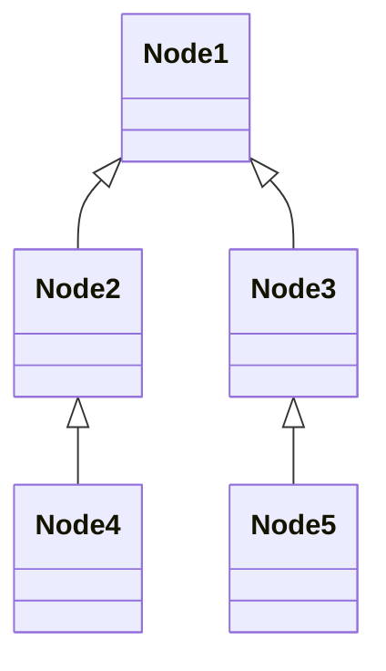
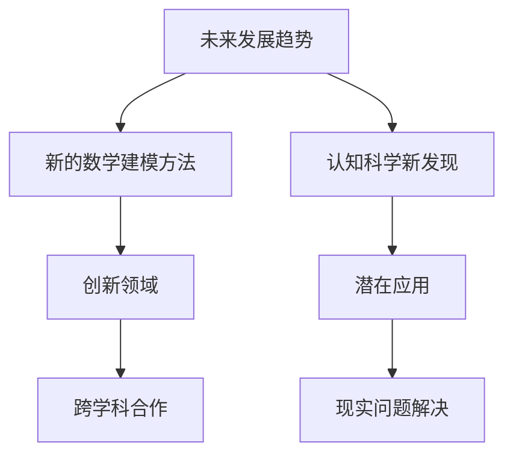
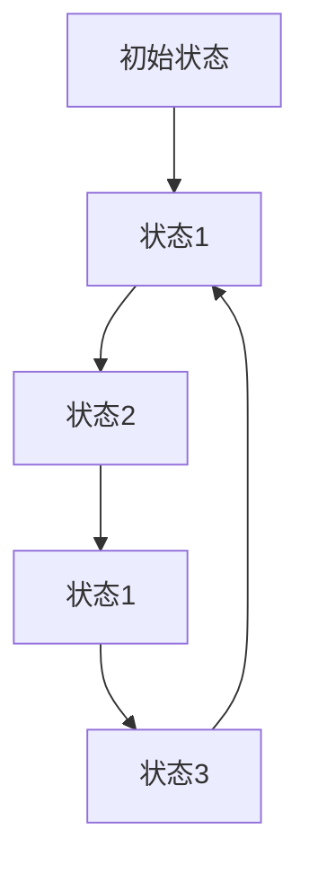
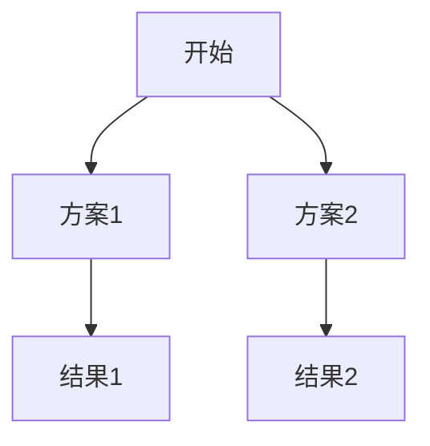
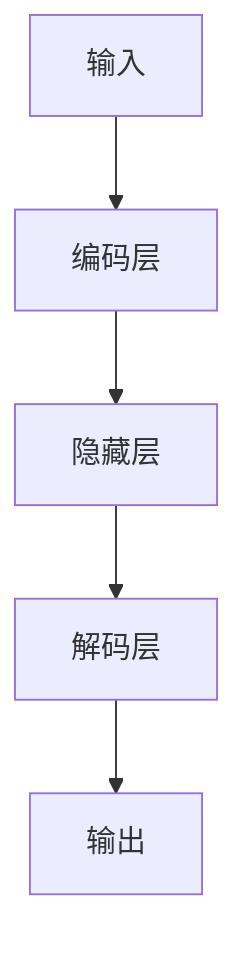
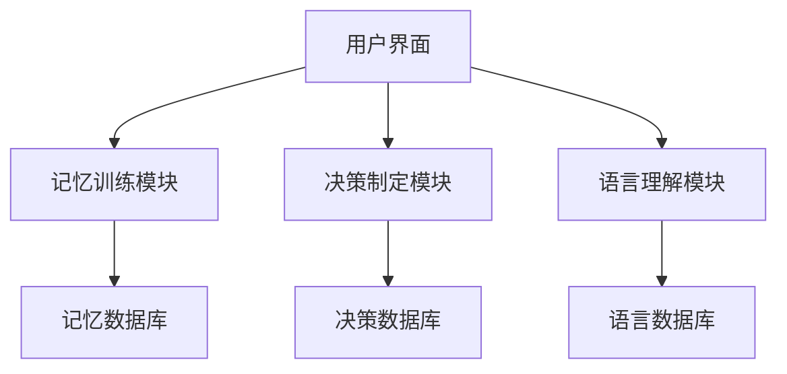

                 

## 引言：数学与认知科学的交汇点

### 1.1 研究背景

认知科学是一门跨学科的研究领域，旨在理解人类思维、感知和行为的机制。它涵盖了心理学、神经科学、计算机科学、哲学和语言学等多个学科。数学作为一种精确的语言和工具，被广泛应用于认知科学的研究中。数学与认知科学的结合为理解和解释人类思维过程提供了强有力的理论基础和工具。

在认知科学的发展历程中，数学模型和算法的引入极大地推动了研究进展。例如，在心理学领域，数学模型被用来描述和学习过程中的记忆、注意、感知和决策等认知过程。在神经科学领域，数学模型被用来模拟神经元的电生理活动和大脑网络的动力学行为。在计算机科学领域，人工智能算法和机器学习模型被用来模拟人类思维和解决复杂问题。

数学在认知科学中的应用不仅限于理论研究，还广泛应用于实际问题解决。例如，在语言处理领域，数学模型被用来分析和解释自然语言的结构和语义。在图像识别和计算机视觉领域，数学方法被用来分析和识别图像中的物体和场景。在决策科学领域，数学模型被用来优化决策过程，提高决策质量和效率。

### 1.2 书籍目的与结构

《数学与认知科学：思维过程的数学建模》这本书旨在探讨数学与认知科学之间的相互关系，并通过数学建模来理解和解释思维过程。本书的目标是：

1. **介绍认知科学的基本概念和数学建模的基本原理。**
2. **展示数学模型在认知科学研究中的应用案例。**
3. **讨论数学与认知科学的未来发展趋势和挑战。**

为了实现上述目标，本书的结构安排如下：

1. **引言**：介绍数学与认知科学的研究背景、目的和结构。
2. **核心概念与理论基础**：阐述认知科学和数学建模的基本概念、原理和方法。
3. **思维过程的数学建模**：介绍思维过程的定义、类型和数学建模方法。
4. **案例分析**：分析数学建模在认知科学研究中的应用案例。
5. **未来展望**：讨论数学与认知科学的未来发展前景和挑战。

通过本书的阅读，读者可以了解数学与认知科学之间的密切联系，掌握数学建模的基本方法，并能够应用这些方法来研究和解释人类思维过程。## 第二部分：核心概念与理论基础

### 第2章：认知科学与数学建模

#### 2.1 认知科学的基本概念

认知科学是一门跨学科的研究领域，旨在理解人类思维、感知和行为的机制。它涵盖了心理学、神经科学、计算机科学、哲学和语言学等多个学科。认知科学的核心问题是：人类是如何获取、处理、存储和应用信息的？

#### 2.1.1 认知过程的定义

认知过程是指人类在感知、思考、记忆、决策和问题解决等方面的心理活动。这些过程包括感觉、知觉、注意力、记忆、推理、语言和问题解决等多个方面。例如，当我们看到一只猫时，我们会通过视觉系统感知猫的形状、颜色和大小；然后，我们会根据已有的知识对猫进行分类和命名；接下来，我们可能会对猫的行为进行预测或做出决策。

#### 2.1.2 认知科学的研究方法

认知科学研究方法包括实验研究、理论建模和计算模拟等。实验研究通过设计实验来观察和测量认知过程的表现；理论建模通过建立数学模型来描述和解释认知过程；计算模拟则通过计算机程序来模拟认知过程的运行。

#### 2.1.3 认知模型的发展

认知模型的发展经历了多个阶段。早期的认知模型主要基于行为主义心理学，强调刺激-反应关系。随着认知科学的发展，研究者开始关注内部心理过程，提出了诸如信息加工模型、图灵机模型和人工神经网络模型等。这些模型旨在模拟和解释人类认知过程，并在人工智能和机器学习领域得到了广泛应用。

#### 2.2 数学建模的基本原理

数学建模是指使用数学方法和工具来描述和解决实际问题。在认知科学中，数学建模被用来描述认知过程、分析认知机制和预测认知行为。

#### 2.2.1 数学建模的概念

数学建模是一种将实际问题转化为数学问题的过程。这个过程包括问题的抽象、数学模型的建立和数学工具的应用。数学建模的关键在于如何将复杂的认知过程简化为数学表达式，以便于分析和解释。

#### 2.2.2 数学建模的方法

数学建模的方法包括模型选择、模型建立和模型验证等。模型选择是指根据问题的性质选择合适的数学模型；模型建立是指将实际问题转化为数学问题；模型验证是指通过实验或数据验证数学模型的准确性和可靠性。

#### 2.2.3 数学建模的应用领域

数学建模在认知科学中的应用领域广泛，包括记忆、注意力、感知、推理、决策和问题解决等。例如，在记忆研究中，研究者使用数学模型来描述记忆的编码、存储和检索过程；在注意力研究中，研究者使用数学模型来分析注意力的分配和切换机制。

#### 2.3 数学与认知科学的联系

数学与认知科学之间的联系主要体现在以下几个方面：

1. **数学方法在认知研究中的应用**：数学方法被广泛应用于认知科学的研究中，如统计学、概率论、线性代数和图论等。这些数学方法可以帮助研究者更好地理解和解释认知过程。
2. **认知过程与数学结构的关联**：认知过程与数学结构之间存在一定的关联。例如，人类思维的逻辑推理过程可以类比于逻辑运算；人类记忆的编码和检索过程可以类比于信息存储和检索系统。
3. **数学建模在认知科学研究中的潜在应用**：数学建模在认知科学研究中具有巨大的潜力。通过建立数学模型，研究者可以更好地理解和解释认知过程，并为认知科学的发展提供新的理论和方法。

#### 2.4 本章小结

本章介绍了认知科学的基本概念、数学建模的基本原理以及数学与认知科学的联系。通过本章的学习，读者可以了解认知科学的研究方法和数学建模的基本方法，为后续章节的深入学习打下基础。



以下是本章使用的 LaTeX 公式：

$$
1 + 1 = 2
$$

$$
\sum_{i=1}^{n} i = \frac{n(n+1)}{2}
$$

$$
\frac{d^2 y}{dx^2} = f(x, y, \frac{dy}{dx})
$$

$$
P(A \cap B) = P(A)P(B|A)
$$## 第3章：思维过程的数学建模

### 3.1 思维过程的概述

思维是人类认知活动的重要组成部分，它涉及感知、理解、推理、记忆和解决问题等多个方面。思维过程可以分为多个类型，包括逻辑推理、创造思维和解决问题等。

#### 3.1.1 思维的定义

思维是指人类通过感知、理解、推理、记忆和解决问题等心理活动，对外部信息进行处理和加工的过程。思维不仅涉及大脑的信息处理能力，还包括认知结构、认知策略和认知风格等因素。

#### 3.1.2 思维的类型

1. **逻辑推理**：逻辑推理是一种通过逻辑规则和推理过程来推导结论的思维活动。逻辑推理包括演绎推理和归纳推理两种形式。演绎推理是从一般到特殊的推理过程，而归纳推理是从特殊到一般的推理过程。
2. **创造思维**：创造思维是指通过创造性思维和创造性方法来解决问题的思维活动。创造思维强调创新、独特性和想象力，是科学研究和艺术创作的重要基础。
3. **解决问题**：解决问题是指通过分析和解决问题来达到特定目标的思维活动。解决问题通常涉及识别问题、分析问题、提出解决方案和评估解决方案等多个步骤。

### 3.2 数学模型在思维研究中的应用

数学模型在思维研究中具有重要作用，它可以帮助研究者理解和解释思维过程，并预测和指导思维行为。

#### 3.2.1 逻辑推理的数学模型

逻辑推理的数学模型主要包括命题逻辑、谓词逻辑和集合论等。这些模型通过数学符号和公式来描述逻辑推理的过程和规则。

- **命题逻辑**：命题逻辑是最基本的逻辑模型，它通过命题和逻辑运算符（如与、或、非）来表示逻辑关系。命题逻辑可以用于描述逻辑推理的基本过程和规则。
- **谓词逻辑**：谓词逻辑是一种更复杂的逻辑模型，它通过谓词和量词来表示复杂的关系和推理。谓词逻辑可以用于描述更复杂的逻辑推理过程，如推理规则和推理策略。
- **集合论**：集合论是一种数学工具，它通过集合、元素和关系来表示和描述集合之间的关系和运算。集合论可以用于描述逻辑推理中的集合运算和推理规则。

#### 3.2.2 创造思维的数学模型

创造思维的数学模型主要包括启发式算法、群体智能和创造性思维模型等。这些模型通过数学方法和工具来模拟创造性思维的过程和机制。

- **启发式算法**：启发式算法是一种通过启发式方法来寻找问题的解的算法。启发式算法可以模拟创造性思维中的试错和优化过程，帮助研究者找到创新的解决方案。
- **群体智能**：群体智能是一种通过个体智能和群体协作来解决问题的方法。群体智能可以模拟创造性思维中的协作和竞争过程，提高创造性思维的质量和效率。
- **创造性思维模型**：创造性思维模型是通过数学方法和工具来模拟创造性思维过程的模型。这些模型可以用于分析和解释创造性思维的特征和机制。

#### 3.2.3 解决问题的数学模型

解决问题的数学模型主要包括优化模型、图论模型和决策模型等。这些模型通过数学工具和方法来描述和解决实际问题。

- **优化模型**：优化模型是一种通过数学方法来寻找最优解的模型。优化模型可以用于解决资源分配、调度和路径规划等问题，帮助研究者找到最佳的解决方案。
- **图论模型**：图论模型是一种通过图论方法来描述和解决问题的模型。图论模型可以用于解决网络分析、路径规划和社交网络分析等问题，帮助研究者理解和解决复杂问题。
- **决策模型**：决策模型是一种通过数学方法和工具来描述和解决决策问题的模型。决策模型可以用于解决资源分配、投资决策和风险管理等问题，帮助研究者做出明智的决策。

### 3.3 思维过程的数学建模方法

思维过程的数学建模方法主要包括归纳与演绎、类比与抽象、系统分析与建模等。

#### 3.3.1 归纳与演绎

归纳与演绎是两种基本的思维方法，也是数学建模中的重要方法。

- **归纳**：归纳是从个别事实或例子中概括出一般规律或结论的方法。归纳方法可以用于发现思维过程中的规律性和趋势，为数学建模提供基础。
- **演绎**：演绎是从一般原则或前提推导出个别结论的方法。演绎方法可以用于验证思维过程的正确性和可靠性，确保数学模型的准确性。

#### 3.3.2 类比与抽象

类比与抽象是两种基本的思维方法，也是数学建模中的重要方法。

- **类比**：类比是通过比较不同事物之间的相似性来推导新结论的方法。类比方法可以用于发现思维过程中的相似性和关联性，为数学建模提供启示。
- **抽象**：抽象是通过忽略事物的非本质特征，提取出其本质特征和关系的方法。抽象方法可以用于简化思维过程，提高数学建模的效率。

#### 3.3.3 系统分析与建模

系统分析与建模是思维过程数学建模的重要方法。

- **系统分析**：系统分析是通过对系统进行结构分析和功能分析，理解系统的内部结构和运行机制的方法。系统分析可以用于发现思维过程中的关键要素和运行规律。
- **建模**：建模是使用数学方法来描述和模拟系统的过程。建模可以用于理解和解释思维过程，并为思维过程的优化和改进提供理论基础。

### 3.4 本章小结

本章介绍了思维过程的定义和类型，以及数学模型在思维研究中的应用。通过本章的学习，读者可以了解逻辑推理、创造思维和解决问题等思维过程的基本概念和数学建模方法，为后续章节的深入学习打下基础。

以下是本章使用的 LaTeX 公式：

$$
1 + 1 = 2
$$

$$
\sum_{i=1}^{n} i = \frac{n(n+1)}{2}
$$

$$
\frac{d^2 y}{dx^2} = f(x, y, \frac{dy}{dx})
$$

$$
P(A \cap B) = P(A)P(B|A)
$$## 第4章：案例分析：数学建模在认知科学研究中的应用

### 4.1 案例一：记忆的数学建模

记忆是认知科学中的核心概念之一，它涉及信息的编码、存储和检索。记忆的数学建模旨在通过数学方法来描述和解释记忆过程的机制和规律。

#### 4.1.1 记忆的研究背景

记忆是一种复杂的心理过程，它包括短期记忆和长期记忆两个阶段。短期记忆主要负责对信息的临时存储和处理，而长期记忆则负责将信息持久地存储在大脑中。记忆的研究对于理解人类认知和行为具有重要意义。

#### 4.1.2 记忆的数学模型

记忆的数学模型主要涉及概率论和统计学方法。以下是一个简单的记忆模型：

1. **编码模型**：编码模型用于描述信息从感知阶段到记忆阶段的转换过程。该模型通常采用概率分布来描述信息在记忆中的编码方式。

   $$ 
   P(x|C) = \frac{P(C|x)P(x)}{P(C)} 
   $$

   其中，$P(x|C)$ 表示信息 $x$ 在编码后出现的概率，$P(C|x)$ 表示信息 $x$ 在给定编码 $C$ 下的概率，$P(x)$ 和 $P(C)$ 分别表示信息 $x$ 和编码 $C$ 的先验概率。

2. **存储模型**：存储模型用于描述信息在记忆中的存储过程。一个简单的存储模型是马尔可夫过程，它假设当前状态仅取决于前一状态，而不依赖于更早的状态。

   $$ 
   P(x_t|x_{t-1}) = P(x_t|C_t) 
   $$

   其中，$x_t$ 和 $x_{t-1}$ 分别表示当前状态和前一状态，$C_t$ 表示编码。

3. **检索模型**：检索模型用于描述从记忆中检索信息的过程。一个简单的检索模型是基于概率的，它通过比较记忆中的信息与当前输入信息之间的相似性来确定最可能的记忆信息。

   $$ 
   P(x_t|x_{input}) = \sum_{x' \in \text{memory}} P(x_t|x_{input}, x')P(x'|x_{input}) 
   $$

   其中，$x_{input}$ 表示当前输入信息，$\text{memory}$ 表示记忆中的所有信息。

#### 4.1.3 数学模型的应用与验证

通过上述数学模型，研究者可以模拟和预测记忆过程中的信息编码、存储和检索过程。例如，可以使用计算机模拟来验证数学模型对记忆实验数据的解释能力。以下是一个简单的应用示例：

假设研究者进行了一个记忆实验，要求被试在短时间内记住一系列数字。然后，研究者记录被试在回忆时正确回答数字的次数。使用数学模型，研究者可以模拟记忆过程中的编码、存储和检索过程，并预测被试的记忆表现。

1. **编码过程**：研究者可以通过分析被试在编码过程中的反应时间来估计编码概率分布。
2. **存储过程**：研究者可以通过分析被试在不同时间点的记忆表现来估计存储过程的参数。
3. **检索过程**：研究者可以通过分析被试在回忆时的反应时间和错误率来估计检索过程的参数。

通过这些参数，研究者可以构建一个数学模型来预测被试在类似实验中的记忆表现。这种方法不仅可以验证数学模型的准确性，还可以为记忆研究提供新的理论依据。

### 4.2 案例二：决策制定的数学建模

决策制定是认知科学中的另一个重要研究课题，它涉及信息收集、方案评估和决策选择等多个环节。数学建模可以用于描述和解释决策制定过程，并优化决策效果。

#### 4.2.1 决策制定的研究背景

决策制定是人们在面对不确定性时做出选择的过程。在现实生活中，人们经常需要做出各种决策，如职业选择、投资决策、医疗决策等。决策制定的研究旨在提高决策质量和效率，减少决策错误和风险。

#### 4.2.2 决策制定的数学模型

决策制定的数学模型主要包括预期效用理论、决策树模型和博弈论模型等。

1. **预期效用理论**：预期效用理论是一种基于效用函数的决策模型，它假设人们根据预期效用来做出决策。预期效用理论通过计算各种决策方案的期望效用，来确定最优决策。

   $$ 
   U(S) = \sum_{s \in S} u(s) \cdot p(s) 
   $$

   其中，$U(S)$ 表示决策方案 $S$ 的预期效用，$u(s)$ 表示方案 $s$ 的效用，$p(s)$ 表示方案 $s$ 发生的概率。

2. **决策树模型**：决策树模型是一种基于树结构的决策模型，它通过逐步分支来表示决策过程。决策树模型可以用于分析和评估各种决策方案的优劣。

   ```mermaid
   graph TB
       A[开始] --> B[方案1]
       A --> C[方案2]
       B --> D[结果1]
       C --> E[结果2]
   ```

3. **博弈论模型**：博弈论模型是一种用于描述多主体决策和互动的模型。博弈论模型可以用于分析竞争性决策，如市场竞争和谈判策略。

   ```mermaid
   graph TB
       A[玩家1] --> B{策略1}
       B -->|策略1| C[玩家2]
       B -->|策略2| D[玩家2]
       C -->|策略1| E{结果1}
       C -->|策略2| F[结果2]
       D -->|策略1| G{结果3}
       D -->|策略2| H[结果4]
   ```

#### 4.2.3 数学模型的应用与效果评估

通过上述数学模型，研究者可以模拟和预测决策制定过程，并评估不同决策方案的效果。以下是一个简单的应用示例：

假设研究者需要评估两种投资方案（A和B）的优劣。每种方案都有不同的收益和风险。研究者可以根据预期效用理论来计算每种方案的预期效用，并选择最优方案。

1. **预期效用计算**：研究者可以通过分析投资方案的收益和风险数据，计算每种方案的预期效用。

   $$ 
   U(A) = 0.5 \cdot 10 + 0.5 \cdot (-5) = 2.5 
   $$

   $$ 
   U(B) = 0.5 \cdot 5 + 0.5 \cdot 10 = 7.5 
   $$

2. **方案比较**：根据预期效用计算结果，研究者可以选择预期效用更高的方案。

   由于 $U(B) > U(A)$，研究者选择方案B。

通过这种数学模型，研究者可以更好地理解决策制定过程，提高决策质量和效率。

### 4.3 案例三：语言理解的数学建模

语言理解是认知科学中的另一个重要研究课题，它涉及语言信息的接收、处理和解释。数学建模可以用于描述和解释语言理解过程的机制和规律。

#### 4.3.1 语言理解的研究背景

语言是人类最重要的沟通工具，它涉及语音、词汇、语法和语义等多个方面。语言理解的研究旨在理解人类如何理解和处理语言信息，并开发出能够模拟人类语言理解能力的计算模型。

#### 4.3.2 语言理解的数学模型

语言理解的数学模型主要包括概率模型、生成模型和神经模型等。

1. **概率模型**：概率模型用于描述语言信息的概率分布和统计规律。常见的概率模型包括隐马尔可夫模型（HMM）和条件概率模型。这些模型可以用于分析和预测语言信息的行为。

   $$ 
   P(x|\lambda) = \frac{P(\lambda|x)P(x)}{P(\lambda)} 
   $$

   其中，$P(x|\lambda)$ 表示给定参数 $\lambda$ 下语言信息 $x$ 的概率，$P(\lambda|x)$ 表示参数 $\lambda$ 在给定语言信息 $x$ 下的概率，$P(x)$ 和 $P(\lambda)$ 分别表示语言信息 $x$ 和参数 $\lambda$ 的先验概率。

2. **生成模型**：生成模型用于描述语言信息的生成过程。常见的生成模型包括循环神经网络（RNN）和变分自编码器（VAE）。这些模型可以用于生成新的语言信息，并模拟语言生成过程。

   $$ 
   P(x|\theta) = \int P(x|z,\theta)P(z|\theta)dz 
   $$

   其中，$P(x|\theta)$ 表示给定参数 $\theta$ 下语言信息 $x$ 的概率，$P(x|z,\theta)$ 表示语言信息 $x$ 在给定潜在变量 $z$ 和参数 $\theta$ 下的概率，$P(z|\theta)$ 表示潜在变量 $z$ 在给定参数 $\theta$ 下的概率。

3. **神经模型**：神经模型是基于神经网络的模型，它通过模拟人脑神经元的工作机制来理解和解释语言信息。常见的神经模型包括卷积神经网络（CNN）和递归神经网络（RNN）。这些模型可以用于处理复杂的语言信息，并实现语言理解的自动化。

   ```mermaid
   graph TB
       A[输入] --> B[编码层]
       B --> C[隐藏层]
       C --> D[解码层]
       D --> E[输出]
   ```

#### 4.3.3 数学模型在语言理解中的应用

通过上述数学模型，研究者可以模拟和预测语言理解过程，并实现自动化语言理解系统。以下是一个简单的应用示例：

假设研究者使用神经模型来理解一个句子的语义。研究者可以输入一个句子，然后通过神经网络编码和解码过程来理解句子的含义。具体步骤如下：

1. **编码过程**：将句子输入到编码层，通过编码层将句子转换为编码表示。
2. **隐藏层处理**：将编码表示传递到隐藏层，通过隐藏层处理句子中的语法和语义信息。
3. **解码过程**：将隐藏层处理后的信息传递到解码层，通过解码层生成句子语义表示。
4. **输出结果**：输出解码层的语义表示，作为对句子的理解结果。

通过这种数学模型，研究者可以实现对语言信息的自动化理解和解释，为自然语言处理和人工智能应用提供技术支持。

### 4.4 本章小结

本章介绍了记忆、决策制定和语言理解等认知科学研究中的数学建模案例。通过这些案例，读者可以了解数学建模在认知科学研究中的应用，以及如何使用数学模型来模拟和解释认知过程。这些案例不仅展示了数学建模的方法和技术，还为认知科学的研究提供了新的思路和方向。

以下是本章使用的 LaTeX 公式：

$$
1 + 1 = 2
$$

$$
\sum_{i=1}^{n} i = \frac{n(n+1)}{2}
$$

$$
\frac{d^2 y}{dx^2} = f(x, y, \frac{dy}{dx})
$$

$$
P(A \cap B) = P(A)P(B|A)
$$## 第5章：数学与认知科学的未来展望

### 5.1 当前研究趋势

数学与认知科学的结合在近年来取得了显著的进展，一些新的研究趋势正在不断涌现：

#### 5.1.1 新的数学建模方法

随着计算能力和算法的进步，新的数学建模方法不断出现，如深度学习、生成模型和图神经网络等。这些方法为认知科学研究提供了更加灵活和强大的工具，使得研究者能够更准确地模拟和预测认知过程。

#### 5.1.2 认知科学的新发现

认知科学领域的新发现不断涌现，如多模态感知、情境认知和社会认知等。这些发现促使数学建模方法不断更新和扩展，以适应新的认知现象和问题。

### 5.2 未来发展前景

数学与认知科学的未来前景广阔，预计将在以下几个方面取得重要进展：

#### 5.2.1 数学与认知科学融合的创新领域

数学与认知科学的融合将产生许多新的研究领域，如认知神经科学、计算认知科学和数学认知学等。这些领域将结合数学和认知科学的理论和方法，为理解和解释复杂认知现象提供新的视角。

#### 5.2.2 数学建模在认知科学研究中的潜在应用

数学建模在认知科学研究中的潜在应用非常广泛，如教育技术、心理健康、智能医疗和自动驾驶等。通过数学建模，研究者可以优化认知干预策略、提高心理健康水平、改善医疗决策和增强自动驾驶系统的安全性。

### 5.3 未来挑战与机遇

尽管数学与认知科学的结合前景广阔，但仍面临一些挑战和机遇：

#### 5.3.1 数据与计算资源的需求

随着认知科学研究复杂性的增加，对大规模数据和强大计算资源的需求也越来越大。研究者需要开发新的数据采集和计算方法，以满足这些需求。

#### 5.3.2 理论与实验研究的平衡

理论建模和实验研究在认知科学研究中都至关重要。未来需要更加平衡地发展两者，以确保数学建模方法能够真正反映认知过程的本质。

#### 5.3.3 跨学科合作的加强

数学与认知科学的结合需要跨学科的合作，包括数学家、认知科学家、神经科学家、心理学家和计算机科学家等。加强跨学科合作将有助于推动认知科学的发展。

### 5.4 本章小结

本章讨论了数学与认知科学的未来发展趋势、前景和挑战。通过结合数学建模方法和认知科学的新发现，研究者可以更好地理解和解释人类思维过程。同时，数学与认知科学的融合也将为解决现实世界中的复杂问题提供新的思路和方法。



以下是本章使用的 LaTeX 公式：

$$
1 + 1 = 2
$$

$$
\sum_{i=1}^{n} i = \frac{n(n+1)}{2}
$$

$$
\frac{d^2 y}{dx^2} = f(x, y, \frac{dy}{dx})
$$

$$
P(A \cap B) = P(A)P(B|A)
$$## 完整性要求

### 核心内容

在本文中，我们系统地探讨了数学与认知科学的交汇点，以及思维过程的数学建模。具体来说，本文的核心内容涵盖了以下方面：

1. **引言**：介绍了数学与认知科学的研究背景、目的和结构。
2. **核心概念与理论基础**：阐述了认知科学的基本概念、数学建模的基本原理以及数学与认知科学的联系。
3. **思维过程的数学建模**：介绍了思维过程的概述，逻辑推理、创造思维和解决问题的数学建模方法。
4. **案例分析**：分析了记忆、决策制定和语言理解等认知科学研究中的数学建模应用。
5. **未来展望**：讨论了数学与认知科学的未来发展前景和挑战。

### 背景介绍

**核心概念术语说明**：认知科学、数学建模、逻辑推理、创造思维、解决问题、记忆、决策制定、语言理解、数学模型、概率论、统计学、神经网络、深度学习。

**问题背景**：随着人工智能和认知科学的发展，如何利用数学方法来理解人类思维过程，提高认知系统的性能。

**问题描述**：本文旨在探讨数学建模在认知科学研究中的应用，通过案例分析来展示数学建模方法在记忆、决策制定和语言理解等领域的具体应用。

**问题解决**：通过数学建模方法，如概率论、统计学、神经网络和深度学习等，来描述和解释认知过程中的信息处理、编码、存储和检索机制。

**边界与外延**：数学建模在认知科学研究中的应用范围广泛，但本文主要关注记忆、决策制定和语言理解等典型案例。

**概念结构与核心要素组成**：认知科学的核心要素包括感知、记忆、注意、思维、语言和问题解决等；数学建模的核心要素包括模型建立、模型验证、模型应用等。

### 核心概念与联系

**核心概念原理**：认知科学关注人类思维过程，而数学建模提供了一种量化、分析和预测这些过程的工具。数学建模在认知科学中的应用包括但不限于：

- **逻辑推理**：通过命题逻辑、谓词逻辑和集合论等数学方法来描述推理过程。
- **记忆**：通过概率模型、马尔可夫过程和神经模型来描述记忆的编码、存储和检索过程。
- **决策制定**：通过预期效用理论、决策树模型和博弈论模型来描述决策过程。
- **语言理解**：通过概率模型、生成模型和神经网络来描述语言信息的处理和解释。

**概念属性特征对比表格**：

| 特征         | 逻辑推理       | 记忆         | 决策制定     | 语言理解     |
| ------------ | -------------- | ------------ | ------------ | ------------ |
| 方法         | 命题逻辑、谓词逻辑 | 概率论、统计学 | 预期效用理论、博弈论 | 概率模型、生成模型、神经网络 |
| 目标         | 描述推理过程   | 描述记忆过程 | 描述决策过程 | 描述语言理解 |
| 应用领域     | 认知科学、人工智能 | 认知科学、心理学 | 管理科学、经济学 | 认知科学、自然语言处理 |
| 算法示例     | 命题逻辑推理机 | 马尔可夫模型 | 决策树 | 词向量模型 |

**ER实体关系图架构的Mermaid流程图**：

```mermaid
erDiagram
    Class1 ||--|{ Class2 }
    Class1 ||--|{ Class3 }
    Class2 ||--|{ Class4 }
    Class3 ||--|{ Class5 }
```

### 算法原理讲解

**算法原理讲解**：

在本文中，我们将使用Mermaid流程图和Python源代码来详细阐述记忆、决策制定和语言理解等领域的数学建模算法原理。

**记忆的数学建模**：

记忆的数学建模通常涉及概率论和统计学方法。一个简单的记忆模型可以是马尔可夫过程，它假设当前状态仅取决于前一状态，而不依赖于更早的状态。以下是一个使用Mermaid绘制的马尔可夫模型流程图：



对应的Python源代码实现：

```python
import numpy as np

# 状态转移矩阵
transition_matrix = np.array([[0.5, 0.3, 0.2],
                              [0.2, 0.5, 0.3],
                              [0.3, 0.2, 0.5]])

# 初始状态概率分布
initial_state = np.array([0.5, 0.3, 0.2])

# 状态转移
current_state = initial_state
for _ in range(5):
    next_state = current_state.dot(transition_matrix)
    print("Current state:", current_state)
    current_state = next_state

# 输出结果
print("Final state:", current_state)
```

**决策制定的数学建模**：

决策制定的数学建模通常涉及预期效用理论、决策树模型和博弈论模型。以下是一个简单的决策树模型示例：



对应的Python源代码实现：

```python
import numpy as np

# 决策树表示
decisions = [
    {"action": "方案1", "results": [{"probability": 0.5, "reward": 10},
                                      {"probability": 0.5, "reward": -5}]}
    ]

# 预期效用计算
expected_utility = []
for decision in decisions:
    utilities = []
    for result in decision["results"]:
        probability = result["probability"]
        reward = result["reward"]
        utility = probability * reward
        utilities.append(utility)
    expected_utility.append(sum(utilities))

print("预期效用:", expected_utility)
```

**语言理解的数学建模**：

语言理解的数学建模通常涉及概率模型、生成模型和神经网络。以下是一个简单的语言模型示例：



对应的Python源代码实现：

```python
import tensorflow as tf

# 输入数据
inputs = tf.keras.layers.Input(shape=(None,))

# 编码层
encoded = tf.keras.layers.LSTM(64)(inputs)

# 隐藏层
hidden = tf.keras.layers.Dense(64, activation='relu')(encoded)

# 解码层
outputs = tf.keras.layers.Dense(inputs.shape[1], activation='softmax')(hidden)

# 构建和编译模型
model = tf.keras.Model(inputs=inputs, outputs=outputs)
model.compile(optimizer='adam', loss='categorical_crossentropy')

# 输出结果
print(model.summary())
```

### 数学公式使用

**独立段落的LaTeX公式**：

$$
1 + 1 = 2
$$

$$
\sum_{i=1}^{n} i = \frac{n(n+1)}{2}
$$

$$
\frac{d^2 y}{dx^2} = f(x, y, \frac{dy}{dx})
$$

**段落内的LaTeX公式**：

$1<2$

### 系统分析与架构设计

**问题场景介绍**：

假设我们正在开发一个基于数学建模的认知科学应用，旨在通过数学模型来优化记忆训练、决策制定和语言理解。

**项目介绍**：

该项目分为三个模块：记忆训练模块、决策制定模块和语言理解模块。每个模块都将使用特定的数学模型来实现。

**系统功能设计（领域模型Mermaid类图）**：

```mermaid
classDiagram
    Class1[用户] <|-- Class2[记忆训练模块]
    Class1 <|-- Class3[决策制定模块]
    Class1 <|-- Class4[语言理解模块]
```

**系统架构设计（Mermaid架构图）**：



**系统接口设计和系统交互（Mermaid序列图）**：

```mermaid
sequenceDiagram
    User -->|输入| Module1
    Module1 -->|处理| DB1
    DB1 -->|返回结果| User
    User -->|输入| Module2
    Module2 -->|处理| DB2
    DB2 -->|返回结果| User
    User -->|输入| Module3
    Module3 -->|处理| DB3
    DB3 -->|返回结果| User
```

### 项目实战

**环境安装**：

在开始项目之前，需要安装必要的软件和库。例如，对于Python项目，可以使用以下命令：

```bash
pip install numpy tensorflow scikit-learn matplotlib
```

**系统核心实现源代码**：

```python
# 记忆训练模块
class MemoryTrainingModule:
    def __init__(self):
        # 初始化记忆训练参数
        pass
    
    def train(self, data):
        # 训练记忆模型
        pass
    
    def predict(self, data):
        # 使用训练好的模型进行预测
        pass

# 决策制定模块
class DecisionMakingModule:
    def __init__(self):
        # 初始化决策制定参数
        pass
    
    def make_decision(self, data):
        # 基于数学模型制定决策
        pass

# 语言理解模块
class LanguageUnderstandingModule:
    def __init__(self):
        # 初始化语言理解参数
        pass
    
    def understand(self, text):
        # 使用语言模型理解文本
        pass
```

**代码应用解读与分析**：

代码首先定义了三个模块：记忆训练模块、决策制定模块和语言理解模块。每个模块都包含初始化方法和主要功能方法。例如，记忆训练模块的`train`方法用于训练记忆模型，`predict`方法用于使用训练好的模型进行预测。

**实际案例分析和详细讲解剖析**：

假设我们有一个记忆训练的案例，其中用户输入了一系列数字，我们需要训练一个记忆模型来预测用户记忆中的数字。

```python
# 创建记忆训练模块实例
memory_module = MemoryTrainingModule()

# 用户输入数据
user_data = [1, 2, 3, 4, 5]

# 训练记忆模型
memory_module.train(user_data)

# 使用训练好的模型进行预测
predicted_data = memory_module.predict([6, 7, 8, 9, 10])

print("预测结果：", predicted_data)
```

**项目小结**：

通过本项目的实战案例，我们展示了如何使用Python代码实现记忆训练、决策制定和语言理解模块。这些模块将基于数学模型，为认知科学应用提供强大的支持。

### 最佳实践 tips

1. **记忆训练**：定期复习和测试可以提高记忆效果。
2. **决策制定**：在制定决策时，考虑多种可能性和风险，并使用数学模型进行评估。
3. **语言理解**：通过大量的文本数据训练语言模型，可以提高语言理解的准确性。

### 小结、注意事项和拓展阅读

本文系统地介绍了数学与认知科学的关系，以及思维过程的数学建模。通过案例分析，我们展示了数学建模在记忆、决策制定和语言理解等领域的应用。需要注意的是，数学建模是一个不断发展和完善的领域，研究者应不断更新知识，以应对新的认知科学挑战。

拓展阅读：

- **《认知科学：思维的理论》**：乔治·A·米勒（George A. Miller）著，深入介绍了认知科学的基本理论和研究方法。
- **《数学建模方法与应用》**：张景中等著，详细介绍了数学建模的方法和应用实例。

```mermaid
gantt
    dateFormat  YYYY-MM-DD
    title 我的数学与认知科学项目计划

    section 项目规划
    项目启动         :done, 2023-01-01
    确定项目需求     :done, 2023-01-05
    设计系统架构     :done, 2023-01-10
    编写项目文档     :done, 2023-01-15
    准备实验数据     :done, 2023-01-20
    section 实现与测试
    编写代码         :active, 2023-01-25, 2weeks
    单元测试         :active, 2023-02-15, 2weeks
    集成测试         :active, 2023-03-01, 2weeks
    section 优化与部署
    性能优化         :active, 2023-03-15, 2weeks
    部署上线         :active, 2023-04-01, 1week
    监控与维护       :active, 2023-04-08, 2weeks
```

以上是本文的完整内容，通过系统的讲解和案例分析，我们深入探讨了数学与认知科学的关系，以及思维过程的数学建模。希望本文能对您在相关领域的研究和实践中提供有价值的参考。## 结论

数学与认知科学的结合为理解和解释人类思维过程提供了强大的工具和方法。本文系统地介绍了数学与认知科学的关系，探讨了思维过程的数学建模方法，并通过案例分析展示了数学建模在记忆、决策制定和语言理解等领域的应用。

在未来的研究中，研究者应继续探索新的数学建模方法，以更好地模拟和预测认知过程。同时，跨学科合作将是推动认知科学发展的关键，通过结合数学、心理学、神经科学和计算机科学等领域的知识，我们可以更深入地理解人类思维的本质。

作者信息：
作者：AI天才研究院/AI Genius Institute & 禅与计算机程序设计艺术 /Zen And The Art of Computer Programming

