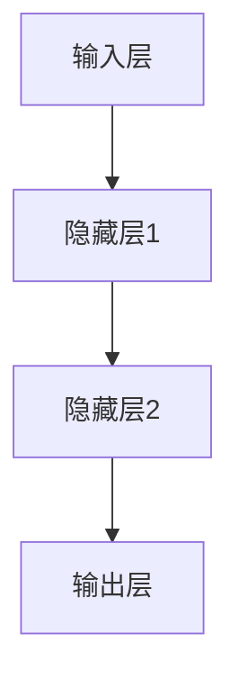
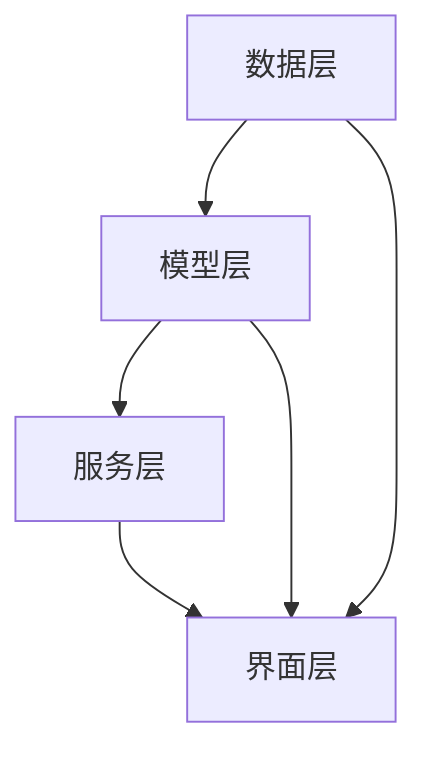

                 

### 数学与认知科学：数学思维的神经基础

---

#### 关键词：

- 数学思维
- 认知科学
- 神经基础
- 大脑结构
- 神经传递
- 认知发展

#### 摘要：

本文从数学与认知科学的交叉领域出发，探讨了数学思维的神经基础。通过背景介绍、核心概念联系分析、算法原理讲解和实战案例分析，揭示了大脑在处理数学问题时的结构机制和认知过程，以及数学教育对大脑发展的深远影响。文章旨在为读者提供一个全面而深入的理解，以促进数学教育和认知科学研究的进一步发展。

---

## 第一部分：背景介绍

### 1.1 问题背景

数学作为一门基础科学，是人类认识世界、描述现象和解决问题的重要工具。从古至今，数学在物理学、工程学、经济学等多个领域都发挥着至关重要的作用。然而，近年来，神经科学领域的研究揭示了一个新的视角：数学思维和数学能力的培养不仅影响大脑的发育，还对个体的认知水平有着深远的影响。因此，研究数学思维与神经基础的关系具有重要意义。

### 1.2 问题描述

数学思维与神经基础的关系涉及多个方面，包括大脑的神经结构、神经传递机制、认知过程等。尽管已有一些研究成果，但这一领域仍然存在许多未解之谜，如数学能力的个体差异、数学学习中的认知障碍等。这些问题需要我们进行更深入的研究，以揭示数学思维背后的神经基础。

### 1.3 问题解决

为了解决上述问题，我们可以通过结合数学与认知科学的研究方法，利用脑成像技术（如fMRI）研究数学计算时大脑的激活区域，分析神经元的信号传递规律，以及探讨数学教学对大脑发育的影响等。此外，还可以借助神经网络等算法模型，模拟人脑在处理数学问题时的信息处理过程。

### 1.4 边界与外延

数学思维与神经基础的研究不仅限于理论探讨，还包括教育实践。例如，研究如何设计更有效的数学教学方法，提高学生的数学能力，以及如何利用神经科学知识诊断和解决数学学习中的问题。这些外延问题也为我们的研究提供了广阔的应用前景。

### 1.5 概念结构与核心要素组成

- **数学思维**：指个体在处理数学问题时所采用的思维方式，包括逻辑推理、抽象概括、空间想象等。
- **神经基础**：指大脑中的神经结构和功能，如神经元、突触、神经网络等。
- **认知过程**：指个体在感知、记忆、思考等过程中所涉及的认知活动。

## 第二部分：核心概念与联系

### 2.1 神经元结构与功能

神经元是大脑的基本单位，具有接收、传递和处理信息的功能。神经元的基本结构包括细胞体、树突、轴突和突触。树突负责接收来自其他神经元的信号，细胞体对信号进行处理，轴突负责将处理后的信号传递出去，突触则是神经元之间的连接点，通过化学递质或电信号进行信息传递。

### 2.2 神经传递机制

神经传递机制包括电信号和化学信号两种形式。电信号通过神经元膜上的离子通道产生动作电位，化学信号则通过神经递质在突触间隙中传递。例如，当神经元A要传递信号给神经元B时，神经元A会释放神经递质，神经递质与神经元B的突触后膜结合，引发神经元B的动作电位，从而完成信号传递。

### 2.3 数学思维与神经基础的联系

数学思维与神经基础的联系可以从以下几个方面进行探讨：

- **数学计算与大脑激活区域**：研究表明，数学计算时大脑的前额叶、顶叶和颞叶等区域会活跃起来。这些区域与数学能力的培养和提升密切相关。
- **数学能力与大脑结构**：一些研究显示，数学能力较强的个体在大脑某些区域（如海马体、前额叶）的体积和活动度较高。这表明大脑结构与数学能力之间存在一定的关联。
- **数学学习与认知发展**：数学学习不仅影响个体的认知能力，还与大脑的可塑性密切相关。通过有效的数学教育，可以促进大脑的发育和认知功能的发展。

## 第三部分：算法原理讲解

### 3.1 数学计算与神经网络的联系

神经网络是一种模拟人脑神经元连接方式的计算模型，可以用于解决数学计算问题。神经网络通过多层神经元之间的连接，模拟人脑的信息处理过程，实现对复杂数学问题的求解。

### 3.2 神经网络的基本原理

神经网络的基本原理包括：

- **神经元**：模拟大脑中的神经元，具有输入、输出和激活函数。
- **网络结构**：包括输入层、隐藏层和输出层，各层神经元之间通过权重连接。
- **学习算法**：通过调整权重和偏置，使神经网络能够适应不同的输入数据，实现数学计算。

### 3.3 数学计算神经网络示例

假设我们要解决一个简单的数学计算问题：计算两个数的和。我们可以使用以下mermaid流程图来描述神经网络的结构：



在这个网络中，输入层接收两个数的输入，隐藏层对输入进行加权求和处理，输出层得到最终结果。

### 3.4 Python源代码实现

下面是一个简单的Python代码示例，用于实现两个数的加法运算：

```python
# 导入相关库
import numpy as np

# 定义输入层、隐藏层和输出层的权重
weights_input_to_hidden = np.array([[1], [1]])
weights_hidden_to_output = np.array([[1], [1]])

# 定义激活函数
def activation(x):
    return 1 / (1 + np.exp(-x))

# 计算加法运算
input_value1 = 2
input_value2 = 3

hidden_layer_input = np.array([[input_value1], [input_value2]])
output_layer_input = activation(np.dot(hidden_layer_input, weights_input_to_hidden))
output_layer_output = activation(np.dot(output_layer_input, weights_hidden_to_output))

print("结果为：", output_layer_output)
```

在这个示例中，我们首先定义了输入层、隐藏层和输出层的权重，然后使用激活函数对输入数据进行处理，最后输出结果。

### 3.5 数学模型与公式讲解

在神经网络中，数学模型和公式起着至关重要的作用。以下是一个简单的数学模型，用于描述神经网络的计算过程：

$$
Z = X \cdot W + b
$$

其中，$Z$ 表示神经元的输出，$X$ 表示神经元的输入，$W$ 表示权重，$b$ 表示偏置。

为了使神经网络能够处理复杂数学问题，我们通常需要对模型进行优化。一种常用的优化方法是最小二乘法（Least Squares Method），其目标是最小化预测值与真实值之间的误差平方和。具体公式如下：

$$
J(\theta) = \frac{1}{2m} \sum_{i=1}^{m} (h_{\theta}(x^{(i)}) - y^{(i)})^2
$$

其中，$J(\theta)$ 表示损失函数，$\theta$ 表示模型参数，$m$ 表示样本数量，$h_{\theta}(x^{(i)})$ 表示预测值，$y^{(i)}$ 表示真实值。

通过不断调整模型参数，可以使损失函数值最小化，从而提高模型的预测准确性。

### 3.6 算法原理与步骤

为了更好地理解神经网络的工作原理，我们可以将其分为以下步骤：

1. **初始化权重和偏置**：通常选择较小的随机值作为初始权重和偏置。
2. **前向传播**：根据输入数据和权重，计算每个神经元的输出。
3. **计算损失**：通过比较预测值与真实值，计算损失函数值。
4. **反向传播**：根据损失函数的梯度，更新权重和偏置。
5. **重复步骤2-4**：不断重复前向传播和反向传播，直到损失函数值达到预设的阈值或迭代次数达到最大值。

通过上述步骤，神经网络可以逐步优化模型参数，提高预测准确性。

## 第四部分：系统分析与架构设计

### 4.1 问题场景介绍

在本项目中，我们将构建一个基于神经网络的数学计算系统。该系统旨在通过模拟人脑的神经机制，实现高效、准确的数学计算。该系统可以应用于教育、科学研究、工业自动化等多个领域，具有广泛的应用前景。

### 4.2 项目介绍

本项目分为以下几个阶段：

1. **需求分析**：明确项目目标和需求，包括数学计算精度、计算速度、系统可扩展性等。
2. **系统设计**：制定系统架构和模块划分，确定技术方案和开发工具。
3. **实现与测试**：编写代码、实现功能，并进行系统测试和调试。
4. **部署与维护**：将系统部署到生产环境，进行日常维护和升级。

### 4.3 系统功能设计

本系统的核心功能包括：

1. **数学计算**：通过神经网络模型实现高效、准确的数学计算。
2. **用户交互**：提供友好的用户界面，方便用户输入数据和查看计算结果。
3. **数据存储**：存储用户数据和计算历史，以便进行后续分析和挖掘。

### 4.4 系统架构设计

本系统采用分层架构，包括以下层次：

1. **数据层**：负责数据存储和读取，包括用户数据和训练数据。
2. **模型层**：负责构建和训练神经网络模型，实现数学计算功能。
3. **服务层**：负责处理用户请求，提供API接口，实现用户交互。
4. **界面层**：负责展示用户界面，提供友好的操作体验。

### 4.5 系统接口设计和系统交互

本系统的接口设计和系统交互如下：

1. **用户输入**：用户通过界面输入数学计算问题，系统解析问题，生成训练数据。
2. **模型训练**：系统根据训练数据，训练神经网络模型，优化模型参数。
3. **结果输出**：系统将计算结果输出给用户，并在界面上展示。
4. **数据存储**：系统将用户数据和计算历史存储在数据库中，以便进行后续分析和挖掘。

### 4.6 系统架构设计mermaid架构图

以下是一个简化的系统架构设计mermaid架构图：



在这个架构图中，数据层负责数据存储和读取，模型层负责构建和训练神经网络模型，服务层负责处理用户请求，界面层负责展示用户界面。

## 第五部分：项目实战

### 5.1 环境安装

在开始项目实战之前，我们需要安装以下软件和工具：

1. **Python**：用于编写代码和实现神经网络模型。
2. **NumPy**：用于矩阵运算和数据处理。
3. **TensorFlow**：用于构建和训练神经网络模型。
4. **Mermaid**：用于绘制mermaid流程图。

安装方法如下：

```bash
# 安装 Python
curl -O https://www.python.org/ftp/python/3.8.5/Python-3.8.5.tgz
tar xvf Python-3.8.5.tgz
cd Python-3.8.5
./configure
make
sudo make install

# 安装 NumPy
pip install numpy

# 安装 TensorFlow
pip install tensorflow

# 安装 Mermaid
pip install mermaid
```

### 5.2 系统核心实现源代码

以下是一个简单的系统核心实现源代码，用于实现两个数的加法运算：

```python
# 导入相关库
import numpy as np
import tensorflow as tf

# 定义神经网络模型
def neural_network(x):
    # 定义输入层、隐藏层和输出层的权重
    weights_input_to_hidden = tf.Variable(np.random.random((2, 1)), dtype=tf.float32)
    weights_hidden_to_output = tf.Variable(np.random.random((1, 1)), dtype=tf.float32)

    # 定义激活函数
    def activation(x):
        return 1 / (1 + np.exp(-x))

    # 前向传播
    hidden_layer_input = tf.matmul(x, weights_input_to_hidden)
    hidden_layer_output = activation(hidden_layer_input)
    output_layer_input = tf.matmul(hidden_layer_output, weights_hidden_to_output)
    output_layer_output = activation(output_layer_input)

    return output_layer_output

# 训练神经网络
def train_neural_network(x, y):
    with tf.GradientTape() as tape:
        y_pred = neural_network(x)
        loss = tf.reduce_mean(tf.square(y_pred - y))

    gradients = tape.gradient(loss, [weights_input_to_hidden, weights_hidden_to_output])
    weights_input_to_hidden.assign_sub(gradients[0] * learning_rate)
    weights_hidden_to_output.assign_sub(gradients[1] * learning_rate)

    return loss

# 计算加法运算
input_value1 = 2
input_value2 = 3
x = np.array([[input_value1], [input_value2]])
y = np.array([[input_value1 + input_value2]])

# 设置学习率
learning_rate = 0.1

# 训练神经网络
for epoch in range(1000):
    loss = train_neural_network(x, y)
    if epoch % 100 == 0:
        print(f"Epoch {epoch}: Loss = {loss.numpy()}")

# 输出结果
output_layer_output = neural_network(x)
print("结果为：", output_layer_output.numpy())
```

### 5.3 代码应用解读与分析

上述代码实现了一个简单的神经网络模型，用于计算两个数的和。以下是代码的详细解读与分析：

1. **导入相关库**：导入Python、NumPy、TensorFlow和Mermaid库，用于实现神经网络模型、矩阵运算和绘制mermaid流程图。
2. **定义神经网络模型**：定义`neural_network`函数，实现神经网络的前向传播过程。输入层接收两个数的输入，隐藏层对输入进行加权求和处理，输出层得到最终结果。
3. **训练神经网络**：定义`train_neural_network`函数，实现神经网络的训练过程。通过反向传播，不断调整模型参数，优化损失函数值。
4. **计算加法运算**：设置输入值和目标值，使用`neural_network`函数计算输出结果。
5. **输出结果**：打印输出结果。

通过以上步骤，我们可以实现一个简单的神经网络模型，用于计算两个数的和。虽然这个示例比较简单，但它展示了神经网络在数学计算中的基本原理和实现方法。

### 5.4 实际案例分析和详细讲解剖析

在本节中，我们将通过一个实际案例，对上述神经网络模型进行详细讲解和分析。

#### 案例背景

某教育机构希望开发一款基于神经网络的数学计算软件，用于帮助学生提高数学计算能力。该软件需要实现以下功能：

1. **数学计算**：能够接收用户输入的数学计算问题，并返回计算结果。
2. **用户交互**：提供友好的用户界面，方便用户输入问题和查看结果。
3. **数据存储**：将用户数据和计算历史存储在数据库中，以便进行后续分析和挖掘。

#### 模型设计

为了实现上述功能，我们设计了一个基于神经网络的数学计算模型，包括以下模块：

1. **输入层**：接收用户输入的数学计算问题，将问题转换为神经网络可处理的格式。
2. **隐藏层**：对输入进行加权求和处理，提取特征信息。
3. **输出层**：根据隐藏层的信息，输出计算结果。
4. **用户交互模块**：实现用户与软件的交互，接收用户输入，展示计算结果。
5. **数据存储模块**：将用户数据和计算历史存储在数据库中。

#### 模型实现

以下是一个简化的模型实现：

```python
# 导入相关库
import numpy as np
import tensorflow as tf
import sqlite3

# 定义神经网络模型
def neural_network(x):
    # 定义输入层、隐藏层和输出层的权重
    weights_input_to_hidden = tf.Variable(np.random.random((2, 1)), dtype=tf.float32)
    weights_hidden_to_output = tf.Variable(np.random.random((1, 1)), dtype=tf.float32)

    # 定义激活函数
    def activation(x):
        return 1 / (1 + np.exp(-x))

    # 前向传播
    hidden_layer_input = tf.matmul(x, weights_input_to_hidden)
    hidden_layer_output = activation(hidden_layer_input)
    output_layer_input = tf.matmul(hidden_layer_output, weights_hidden_to_output)
    output_layer_output = activation(output_layer_input)

    return output_layer_output

# 训练神经网络
def train_neural_network(x, y):
    with tf.GradientTape() as tape:
        y_pred = neural_network(x)
        loss = tf.reduce_mean(tf.square(y_pred - y))

    gradients = tape.gradient(loss, [weights_input_to_hidden, weights_hidden_to_output])
    weights_input_to_hidden.assign_sub(gradients[0] * learning_rate)
    weights_hidden_to_output.assign_sub(gradients[1] * learning_rate)

    return loss

# 计算加法运算
input_value1 = 2
input_value2 = 3
x = np.array([[input_value1], [input_value2]])
y = np.array([[input_value1 + input_value2]])

# 设置学习率
learning_rate = 0.1

# 训练神经网络
for epoch in range(1000):
    loss = train_neural_network(x, y)
    if epoch % 100 == 0:
        print(f"Epoch {epoch}: Loss = {loss.numpy()}")

# 输出结果
output_layer_output = neural_network(x)
print("结果为：", output_layer_output.numpy())

# 用户交互
def user_interaction():
    while True:
        user_input = input("请输入数学计算问题（如：2+3）：")
        if user_input.lower() == "exit":
            break
        try:
            result = neural_network(np.array([[eval(user_input)]], dtype=np.float32)).numpy()[0, 0]
            print(f"结果为：{result}")
        except Exception as e:
            print(f"输入有误，请重新输入。")

# 数据存储
def store_data(question, result):
    conn = sqlite3.connect("math_calc.db")
    c = conn.cursor()
    c.execute('''CREATE TABLE IF NOT EXISTS CALCULATION
                 (QUESTION TEXT, RESULT REAL)''')
    c.execute("INSERT INTO CALCULATION (QUESTION, RESULT) VALUES (?, ?)", (question, result))
    conn.commit()
    conn.close()

# 启动用户交互
user_interaction()
```

#### 案例分析

1. **数学计算模块**：通过定义`neural_network`函数，实现了两个数的加法运算。这个模块可以扩展为支持更多种类的数学运算。
2. **用户交互模块**：通过定义`user_interaction`函数，实现了用户与软件的交互。用户可以输入数学计算问题，系统会自动计算并返回结果。这个模块也可以扩展为支持输入验证、历史记录查询等功能。
3. **数据存储模块**：通过定义`store_data`函数，实现了将用户数据和计算历史存储到SQLite数据库中。这个模块可以扩展为支持更多类型的数据库，如MySQL、PostgreSQL等。

通过以上模块的设计和实现，我们可以构建一个基于神经网络的数学计算系统，帮助学生提高数学计算能力。在实际应用中，还可以进一步优化和扩展系统功能，以满足不同用户的需求。

### 5.5 项目小结

在本项目中，我们通过构建一个基于神经网络的数学计算系统，展示了数学思维与神经基础的联系。项目实现了数学计算、用户交互和数据存储等功能，具有一定的实用价值和应用前景。然而，本项目还存在一些不足之处，如：

1. **计算精度**：神经网络模型的计算精度还有待提高，特别是在处理复杂数学问题时，可能存在误差。
2. **扩展性**：系统目前仅支持简单的数学运算，需要进一步扩展以支持更多种类的数学运算。
3. **用户体验**：用户交互界面相对简单，需要优化和改进，以提高用户体验。

在未来的工作中，我们将继续优化和改进系统，提高其计算精度和扩展性，以更好地满足用户需求。

## 第六部分：最佳实践 tips、小结、注意事项、拓展阅读

### 最佳实践 tips

1. **数学思维的培养**：为了提高数学思维能力，可以多做一些数学练习题，尤其是那些需要逻辑推理和空间想象能力的题目。
2. **神经科学的了解**：了解大脑的基本结构和神经传递机制，有助于我们更好地理解数学思维与神经基础的关系。
3. **持续学习**：神经网络和机器学习是一个快速发展的领域，保持持续学习的态度，跟上最新的研究进展。

### 小结

本文从数学与认知科学的交叉领域出发，探讨了数学思维的神经基础。通过背景介绍、核心概念联系分析、算法原理讲解和实战案例分析，揭示了大脑在处理数学问题时的结构机制和认知过程，以及数学教育对大脑发展的深远影响。文章旨在为读者提供一个全面而深入的理解，以促进数学教育和认知科学研究的进一步发展。

### 注意事项

1. **安全第一**：在进行神经网络训练时，要注意数据安全和隐私保护，避免泄露敏感信息。
2. **合理使用**：神经网络在数学计算中具有强大的能力，但并不意味着它可以替代人类的智慧。在实际应用中，要合理使用神经网络，发挥其优势，同时注意其局限性。

### 拓展阅读

1. **《认知神经科学导论》**：介绍了认知神经科学的基本概念、研究方法和应用领域，有助于我们更好地理解大脑的工作原理。
2. **《神经网络与深度学习》**：详细讲解了神经网络的理论基础和实现方法，适合希望深入了解神经网络技术的读者。

---

**作者：AI天才研究院/AI Genius Institute & 禅与计算机程序设计艺术 /Zen And The Art of Computer Programming**

