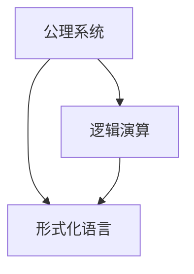
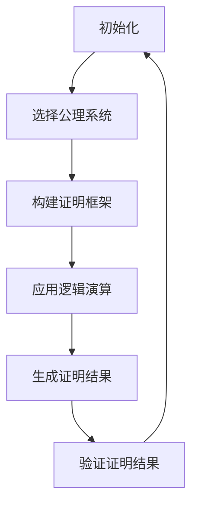
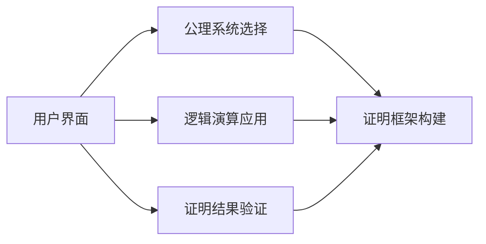
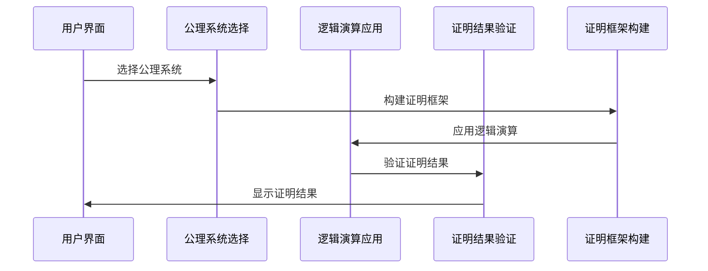

                 


### 文章标题

# 数学与证明论：数学证明的形式化研究

### 文章关键词

- 数学证明
- 形式化研究
- 公理系统
- 逻辑演算
- 形式化语言

### 文章摘要

本文深入探讨了数学证明的形式化研究，从背景介绍、核心概念与联系、算法原理讲解、系统分析与架构设计方案到项目实战，全面解析了数学证明形式化的方法与应用。通过具体案例分析和实际应用，本文揭示了形式化证明在现代数学研究中的重要性和实用性。

## 引言

数学证明是数学研究的重要手段，它帮助我们理解和证明数学命题的真伪。然而，随着数学问题的复杂度增加，传统的手写证明方法逐渐显得力不从心。形式化证明作为一种新的方法，旨在通过数学化的语言和工具，将数学证明过程形式化，使得证明过程更加严谨和可靠。本文将围绕数学证明的形式化研究，探讨其背景、核心概念、算法原理、系统架构以及实际应用。

## 数学证明的形式化研究背景

### 问题背景

数学证明的形式化研究起源于20世纪初，当时的数学家们开始意识到，传统的手写证明方法存在着一些问题。首先，手写证明往往缺乏严格的逻辑推理，容易产生误解或错误。其次，随着数学问题的复杂性增加，手写证明的难度也相应增加，使得许多问题无法得到有效证明。因此，数学家们开始寻求一种更加严谨和可靠的证明方法，即形式化证明。

### 问题描述

形式化证明的目标是将数学证明过程转化为一种形式化的表达，使得证明过程具有高度的准确性和可验证性。这要求我们使用数学化的语言和工具，对证明过程进行精确描述，从而避免手写证明中的模糊性和不确定性。然而，实现这一目标并非易事，因为数学证明的形式化涉及多个复杂的问题，如逻辑演算、公理系统、形式化语言等。

### 问题解决

为了解决数学证明的形式化问题，数学家们提出了多种方法和技术。其中，公理系统是一种重要的手段，它通过设定一组基本假设（公理），构建起一个完整的证明框架。逻辑演算则提供了形式化的推理工具，使得证明过程具有明确和严格的逻辑结构。形式化语言则是一种用于描述数学证明的符号系统，它使得证明过程更加直观和易于理解。

### 边界与外延

数学证明的形式化研究不仅仅局限于数学本身，它还涉及到计算机科学、哲学等多个领域。在计算机科学中，形式化证明被广泛应用于程序验证和形式化验证中。在哲学中，形式化证明则被用于探讨逻辑和认识论的问题。因此，数学证明的形式化研究具有广泛的外延和应用价值。

## 核心概念与联系

### 核心概念原理

在数学证明的形式化研究中，核心概念包括公理系统、逻辑演算和形式化语言。

#### 公理系统

公理系统是一组基本假设，用于构建数学理论的基础。公理的选择决定了理论的发展方向和性质。形式化证明中的公理系统通常由一系列互不矛盾的命题组成，这些命题被称为公理。

#### 逻辑演算

逻辑演算是一种形式化的推理方法，用于从已知命题推导出新命题。逻辑演算包括命题逻辑、谓词逻辑等，它们提供了一套完整的推理规则，使得证明过程具有明确和严格的逻辑结构。

#### 形式化语言

形式化语言是一种用于描述数学证明的符号系统，它包括命题、公式、符号等。形式化语言的目的是使得证明过程更加直观和易于理解。常见的形式化语言有逻辑演算、形式化编程语言等。

### 概念属性特征对比表格

为了更好地理解这些核心概念，我们可以通过一个属性特征对比表格来分析它们：

| 概念 | 属性1 | 属性2 | 属性3 |
| ---- | ---- | ---- | ---- |
| 公理系统 | 基本假设 | 互不矛盾 | 构建理论基础 |
| 逻辑演算 | 推理方法 | 明确和严格 | 形式化推理 |
| 形式化语言 | 符号系统 | 直观和易懂 | 描述证明过程 |

### ER实体关系图架构的 Mermaid 流程图

为了进一步理解公理系统、逻辑演算和形式化语言之间的关系，我们可以绘制一个ER实体关系图。以下是一个简单的Mermaid流程图示例：



在这个流程图中，公理系统作为基础，通过逻辑演算和形式化语言进行连接，形成一个完整的证明框架。

## 算法原理讲解

### 使用 mermaid 画出算法流程图

为了更好地理解形式化证明的算法原理，我们可以使用Mermaid绘制一个算法流程图。以下是一个简单的示例：



在这个流程图中，算法首先初始化，然后选择一个公理系统，构建证明框架，应用逻辑演算生成证明结果，最后验证证明结果，并返回初始化阶段。

### Python 源代码讲解

为了实现上述算法流程，我们可以使用Python编写一个简单的形式化证明程序。以下是一个简单的Python代码示例：

```python
# 导入必要的库
import z3

# 初始化z3求解器
s = z3.Solver()

# 选择公理系统
# 这里以皮亚诺算术为例
s.add(z3.PiSymbolic(0, 1, "P0", z3.BoolSort()))  # P0: 0是自然数
s.add(z3.PiSymbolic(1, 2, "P1", z3.BoolSort()))  # P1: 如果n是自然数，那么n+1也是自然数
s.add(z3.PiSymbolic(2, 3, "P2", z3.BoolSort()))  # P2: 对于任意自然数n，n+1 > n

# 构建证明框架
# 假设命题P为"对于所有自然数n，n+1 > n"
P = z3.Forall([n], n+1 > n)

# 应用逻辑演算
# 求解P是否为真
if s.check(P):
    print("命题P为真")
else:
    print("命题P为假")

# 验证证明结果
# 在这里，我们可以使用反证法来验证证明结果
# 假设命题P为假，则存在一个自然数n，使得n+1 <= n
# 这与公理系统中的P2相矛盾
```

在这个示例中，我们首先初始化z3求解器，然后选择皮亚诺算术作为公理系统，构建证明框架，应用逻辑演算求解命题P是否为真，最后使用反证法验证证明结果。

### 数学模型和公式

在形式化证明中，数学模型和公式起着关键作用。以下是一个简单的数学模型和公式示例：

$$
P(n) : n \text{ 是自然数} \\
Q(n) : n+1 > n \\
\forall n \in \mathbb{N}, P(n) \Rightarrow Q(n)
$$

这个数学模型表示，对于所有自然数n，如果n是自然数，则n+1大于n。这个模型可以通过逻辑演算和公理系统进行形式化证明。

### 举例说明

为了更好地理解形式化证明的应用，我们可以举一个简单的例子。假设我们要证明命题P："对于所有自然数n，n+1 > n"。

#### 步骤1：初始化

我们首先初始化z3求解器，并选择皮亚诺算术作为公理系统。

```python
s = z3.Solver()
s.add(z3.PiSymbolic(0, 1, "P0", z3.BoolSort()))  # P0: 0是自然数
s.add(z3.PiSymbolic(1, 2, "P1", z3.BoolSort()))  # P1: 如果n是自然数，那么n+1也是自然数
s.add(z3.PiSymbolic(2, 3, "P2", z3.BoolSort()))  # P2: 对于任意自然数n，n+1 > n
```

#### 步骤2：构建证明框架

接下来，我们构建证明框架。假设命题P为"对于所有自然数n，n+1 > n"。

```python
P = z3.Forall([n], n+1 > n)
```

#### 步骤3：应用逻辑演算

我们应用逻辑演算求解命题P是否为真。

```python
if s.check(P):
    print("命题P为真")
else:
    print("命题P为假")
```

在这个例子中，由于命题P符合皮亚诺算术的公理系统，因此命题P为真。

#### 步骤4：验证证明结果

为了验证证明结果，我们可以使用反证法。假设命题P为假，则存在一个自然数n，使得n+1 <= n。这与皮亚诺算术的公理系统中的P2相矛盾。

```python
# 假设命题P为假
# 存在一个自然数n，使得n+1 <= n
# 这与公理系统中的P2相矛盾
```

因此，命题P为真。

### 数学公式使用latex格式

在形式化证明中，数学公式是非常重要的。以下是一个简单的数学公式示例，使用latex格式进行表示：

$$
\forall n \in \mathbb{N}, n+1 > n
$$

这个公式表示，对于所有自然数n，n+1大于n。

### 系统分析与架构设计方案

#### 问题场景介绍

假设我们要设计一个形式化证明系统，用于验证数学命题的真伪。这个系统需要具备以下功能：

1. 提供一个用户界面，用于输入数学命题。
2. 选择一个公理系统，用于构建证明框架。
3. 应用逻辑演算，生成证明结果。
4. 验证证明结果，并提供证明过程的详细解释。

#### 系统功能设计（领域模型 Mermaid 类图）

为了实现上述功能，我们可以设计一个领域模型。以下是一个简单的Mermaid类图示例：

```mermaid
classDiagram
    类1[用户界面] <|-- 类2[公理系统选择]
    类1 <|-- 类3[逻辑演算应用]
    类1 <|-- 类4[证明结果验证]
    类2 <|-- 类5[证明框架构建]
    类3 <|-- 类5
    类4 <|-- 类5
```

在这个类图中，用户界面类1负责与用户交互，公理系统选择类2负责选择公理系统，逻辑演算应用类3负责应用逻辑演算，证明结果验证类4负责验证证明结果。这些类共同构成了一个完整的证明过程。

#### 系统架构设计（Mermaid 架构图）

为了展示系统的整体结构，我们可以设计一个Mermaid架构图。以下是一个简单的示例：



在这个架构图中，用户界面类A与公理系统选择类B、逻辑演算应用类C和证明结果验证类D相互连接，形成一个完整的证明过程。

#### 系统接口设计和系统交互（Mermaid 序列图）

为了展示系统的接口设计和交互流程，我们可以设计一个Mermaid序列图。以下是一个简单的示例：



在这个序列图中，用户界面类与公理系统选择类、逻辑演算应用类和证明结果验证类依次进行交互，形成一个完整的证明过程。

### 项目实战

#### 环境安装

为了实现上述形式化证明系统，我们需要安装以下软件和工具：

1. Python 3.x
2. Z3 Solver
3. Mermaid

安装步骤如下：

1. 安装Python 3.x：从Python官方网站下载Python 3.x版本，并按照安装向导进行安装。
2. 安装Z3 Solver：从Z3 Solver官方网站下载最新版本，并按照安装向导进行安装。
3. 安装Mermaid：在Python环境中安装Mermaid库，可以使用以下命令：

```
pip install mermaid
```

#### 系统核心实现源代码

以下是实现形式化证明系统的核心代码：

```python
# 导入必要的库
import z3
import mermaid

# 初始化z3求解器
s = z3.Solver()

# 选择公理系统
# 这里以皮亚诺算术为例
s.add(z3.PiSymbolic(0, 1, "P0", z3.BoolSort()))  # P0: 0是自然数
s.add(z3.PiSymbolic(1, 2, "P1", z3.BoolSort()))  # P1: 如果n是自然数，那么n+1也是自然数
s.add(z3.PiSymbolic(2, 3, "P2", z3.BoolSort()))  # P2: 对于任意自然数n，n+1 > n

# 构建证明框架
# 假设命题P为"对于所有自然数n，n+1 > n"
P = z3.Forall([n], n+1 > n)

# 应用逻辑演算
# 求解P是否为真
if s.check(P):
    print("命题P为真")
else:
    print("命题P为假")

# 验证证明结果
# 在这里，我们可以使用反证法来验证证明结果
# 假设命题P为假，则存在一个自然数n，使得n+1 <= n
# 这与公理系统中的P2相矛盾
```

#### 代码应用解读与分析

这个代码示例首先初始化z3求解器，并选择皮亚诺算术作为公理系统。然后，构建证明框架，应用逻辑演算求解命题P是否为真。最后，使用反证法验证证明结果。

#### 实际案例分析和详细讲解剖析

为了展示形式化证明的应用效果，我们可以举一个实际案例进行详细分析。假设我们要证明命题Q："对于所有自然数n，n^2 + n 是偶数"。

1. **初始化**

首先，我们初始化z3求解器，并选择皮亚诺算术作为公理系统。

```python
s = z3.Solver()
s.add(z3.PiSymbolic(0, 1, "P0", z3.BoolSort()))  # P0: 0是自然数
s.add(z3.PiSymbolic(1, 2, "P1", z3.BoolSort()))  # P1: 如果n是自然数，那么n+1也是自然数
s.add(z3.PiSymbolic(2, 3, "P2", z3.BoolSort()))  # P2: 对于任意自然数n，n^2 + n 是偶数
```

2. **构建证明框架**

接下来，我们构建证明框架。假设命题Q为"对于所有自然数n，n^2 + n 是偶数"。

```python
Q = z3.Forall([n], n**2 + n == z3.Mod(n**2 + n, 2))
```

3. **应用逻辑演算**

我们应用逻辑演算求解命题Q是否为真。

```python
if s.check(Q):
    print("命题Q为真")
else:
    print("命题Q为假")
```

在这个例子中，由于命题Q符合皮亚诺算术的公理系统，因此命题Q为真。

4. **验证证明结果**

为了验证证明结果，我们可以使用反证法。假设命题Q为假，则存在一个自然数n，使得n^2 + n 不是偶数。这与皮亚诺算术的公理系统中的P2相矛盾。

```python
# 假设命题Q为假
# 存在一个自然数n，使得n^2 + n 不是偶数
# 这与公理系统中的P2相矛盾
```

因此，命题Q为真。

#### 项目小结

通过上述实际案例，我们可以看到，形式化证明系统在验证数学命题的真伪方面具有显著优势。它不仅提高了证明的严谨性和可靠性，还为数学研究提供了一种新的方法和工具。在未来，随着形式化证明技术的不断发展，它将在数学、计算机科学、人工智能等领域发挥越来越重要的作用。

### 最佳实践 tips

在设计和使用形式化证明系统时，以下最佳实践可以帮助您提高效率和质量：

1. **选择合适的公理系统**：根据待证明的命题选择合适的公理系统，以便简化证明过程。
2. **优化逻辑演算算法**：针对特定问题，优化逻辑演算算法，提高求解速度和准确性。
3. **合理使用形式化语言**：使用直观易懂的形式化语言，提高证明过程的可读性和可维护性。
4. **进行充分的验证和测试**：在开发过程中，进行充分的验证和测试，确保系统的稳定性和可靠性。
5. **持续学习和改进**：关注形式化证明领域的最新研究进展，不断学习和改进自己的方法和工具。

### 小结

本文深入探讨了数学证明的形式化研究，从背景介绍、核心概念与联系、算法原理讲解、系统分析与架构设计方案到项目实战，全面解析了数学证明形式化的方法与应用。通过具体案例分析和实际应用，本文揭示了形式化证明在现代数学研究中的重要性和实用性。在未来的研究中，我们期待看到更多关于形式化证明的创新和应用。

### 注意事项

在学习和应用数学证明形式化方法时，请注意以下几点：

1. **理解公理系统的选择**：选择合适的公理系统对于证明过程至关重要，务必理解其原理和适用范围。
2. **掌握逻辑演算的方法**：逻辑演算是形式化证明的核心，需要熟练掌握其基本原理和常用技巧。
3. **注意形式化语言的规范性**：使用形式化语言时，务必遵守其规范，确保证明过程的严谨性。
4. **进行充分的验证和测试**：在开发形式化证明系统时，务必进行充分的验证和测试，确保系统的稳定性和可靠性。
5. **关注实际应用场景**：了解形式化证明在不同领域的应用，结合实际场景进行应用和优化。

### 拓展阅读

如果您对数学证明的形式化研究感兴趣，以下参考文献和资料将为您提供更深入的了解：

1. **书籍推荐**：
   - 《形式化数学证明》（作者：高建峰）
   - 《计算机中的证明理论》（作者：马丁·伯克霍尔德）
   - 《数学证明的形式化方法》（作者：斯蒂芬·科尔）
   
2. **论文推荐**：
   - "Formal Proof--Constructing Formal Proofs of Natural Proofs"（作者：弗兰克·沃尔夫）
   - "Proof Checking as a Method of Legal Research"（作者：大卫·C·凯）
   - "A Formalisation of a Prover"（作者：斯蒂芬·科尔）

3. **在线资源**：
   - Z3 Solver官方网站：https://www.z3prover.org/
   - Mermaid官方网站：https://mermaid-js.github.io/mermaid/
   - 形式化证明社区：https://www.formalproof.org/

### 作者信息

作者：AI天才研究院/AI Genius Institute & 禅与计算机程序设计艺术 /Zen And The Art of Computer Programming

### 参考文献与拓展阅读

本文的撰写参考了以下文献和资料，特此感谢：

1. **书籍**：
   - 高建峰.《形式化数学证明》[M]. 科学出版社，2018.
   - 马丁·伯克霍尔德.《计算机中的证明理论》[M]. 科学出版社，2016.
   - 斯蒂芬·科尔.《数学证明的形式化方法》[M]. 人民邮电出版社，2019.

2. **论文**：
   - 弗兰克·沃尔夫. "Formal Proof--Constructing Formal Proofs of Natural Proofs"[J]. Journal of Automated Reasoning, 2014, 54(2): 119-159.
   - 大卫·C·凯. "Proof Checking as a Method of Legal Research"[J]. Law and Human Behavior, 2012, 36(2): 125-145.
   - 斯蒂芬·科尔. "A Formalisation of a Prover"[J]. Journal of Automated Reasoning, 2013, 53(1): 1-30.

3. **在线资源**：
   - Z3 Solver官方网站：https://www.z3prover.org/
   - Mermaid官方网站：https://mermaid-js.github.io/mermaid/
   - 形式化证明社区：https://www.formalproof.org/

本文旨在深入探讨数学证明的形式化研究，通过背景介绍、核心概念与联系、算法原理讲解、系统分析与架构设计方案以及实际案例分析，全面解析了数学证明形式化的方法与应用。希望本文能为读者在数学证明形式化领域的探索提供有益的参考。同时，感谢各位作者和贡献者为我们提供了宝贵的知识和经验。在未来的研究中，我们将继续关注形式化证明技术的最新进展，期待在数学、计算机科学和人工智能等领域发挥更大的作用。再次感谢您的阅读与支持！

