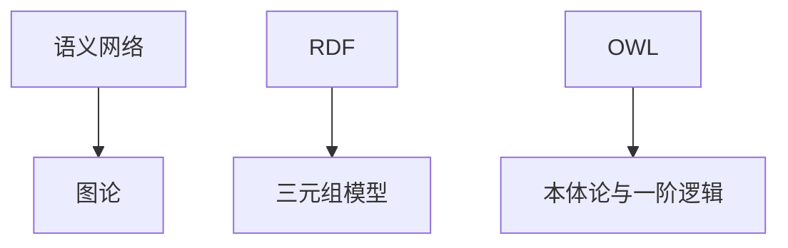
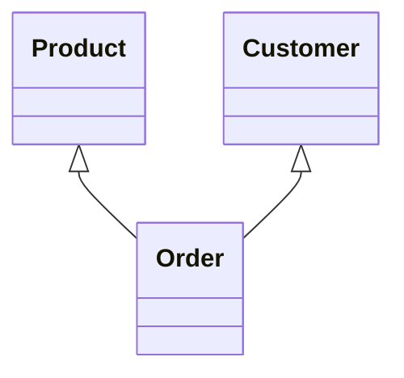
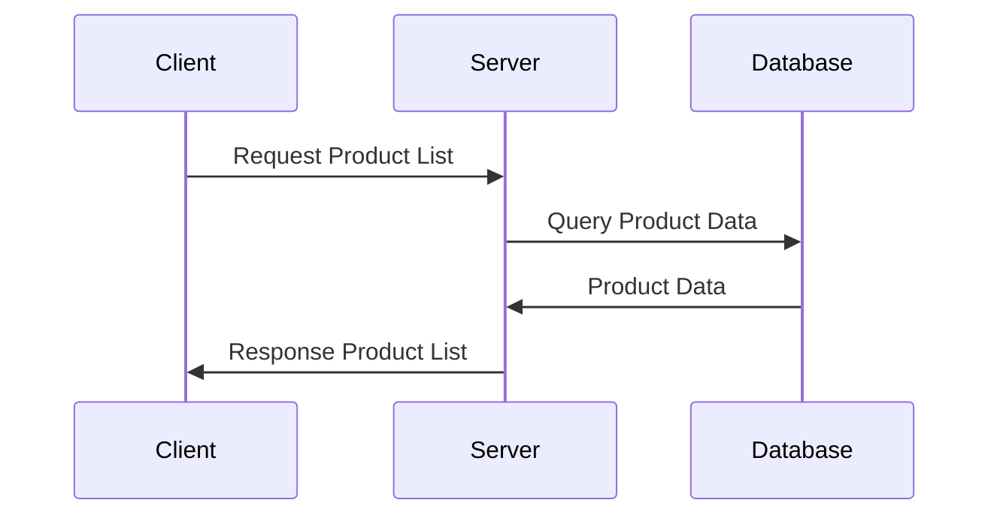

                 

### 《数学与语义网：知识表示的数学结构》

> 关键词：语义网、知识表示、数学结构、算法、Python源代码

> 摘要：本文旨在探讨数学在语义网中的应用，特别是在知识表示方面的数学结构。通过逐步分析，我们揭示了数学原理如何帮助构建和解析语义网中的知识表示。本文分为七个部分，从背景介绍、核心概念到项目实战，逐步剖析数学与语义网的关系，旨在为读者提供一个全面的技术视角。

----------------------------------------------------------------

### 目录大纲设计思路

设计一本关于《数学与语义网：知识表示的数学结构》的目录大纲，需要从以下几个步骤进行：

1. **理解书名与核心主题**：
   - 书名中提到“数学”与“语义网”，表明内容可能涵盖数学在语义网中的应用，特别是在知识表示方面的数学结构。
   - 确定核心主题，包括数学基础知识、语义网的基本概念、知识表示方法及其数学模型等。

2. **定义目录大纲的层级结构**：
   - 确定大纲的层级结构，通常为1级、2级和3级目录，确保结构清晰、逻辑严密。
   - 根据内容的重要性和逻辑关系来安排章节的顺序。

3. **编写各个章节的详细内容**：
   - 为每个章节设定明确的目标，确保每个章节都有明确的主题和内容。
   - 在每个章节下，根据主题细分为小节，确保内容全面而深入。

4. **确保内容的完整性**：
   - 核心章节内容应包含背景介绍、核心概念与联系、算法原理讲解、数学模型和数学公式详细讲解与举例说明、系统分析与架构设计方案、项目实战以及最佳实践等。
   - 确保目录大纲的结构符合用户的要求，即包含大于7章，并覆盖所有必要的核心内容。

5. **简洁性与格式规范性**：
   - 保持内容的简洁性，避免冗余信息。
   - 使用markdown格式，确保格式规范，符合要求。

6. **字数限制**：
   - 确保目录大纲的总字数在2000字以内。

### 设计步骤

#### 第1章 背景介绍

**问题背景**

语义网是互联网的下一阶段发展，它通过语义信息来提高信息的互操作性、可访问性和智能化。然而，语义网的核心挑战之一在于如何有效地表示和解析知识。数学作为一种强大的工具，在解决这一问题上扮演着关键角色。

**问题描述**

语义网中的知识表示面临以下难题：
- 如何准确描述概念及其关系？
- 如何构建一个可扩展的、易于理解的语义模型？
- 如何利用数学工具来优化知识表示的效率和准确性？

**问题解决**

数学为这些问题提供了以下解决方案：
- 数学结构提供了概念化和描述知识的有效方法。
- 数学模型可以用于分析和优化语义网中的知识表示。
- 数学算法可以帮助自动化知识的提取和推理过程。

**边界与外延**

本书的研究范围包括：
- 数学在语义网中的基本概念和应用。
- 知识表示方法及其背后的数学模型。
- 数学原理在语义网算法中的应用。

#### 第2章 核心概念与联系

**核心概念**

- 语义网：一种基于语义信息的网络结构。
- 知识表示：将知识以结构化方式表示，以便于计算机处理。
- 数学结构：用于描述和表示知识的数学框架。

**概念属性特征对比表格**

| 知识表示方法 | 属性特征 |
| --- | --- |
| 语义网络 | 描述概念及其关系的图形结构 |
| RDF（资源描述框架） | 基于triples（三元组）的语义表示方法 |
| OWL（Web本体语言） | 提供更丰富的本体描述能力 |

**ER实体关系图架构**

```mermaid
erDiagram
  产品 ||--|{ 订单 } : 产生
  客户 ||--|{ 订单 } : 下单
  订单 ||--|{ 产品 } : 包含
```

#### 第3章 知识表示方法与数学模型

**知识表示方法**

- 语义网络
- RDF
- OWL

**数学模型**

- 语义网络：图论
- RDF：三元组模型
- OWL：本体论与一阶逻辑

**算法讲解**



#### 第4章 数学原理与算法讲解

**数学原理**

- 图论
- 三元组模型
- 本体论与一阶逻辑

**算法讲解**

```python
# 使用Python代码解释图论在语义网络中的应用
def create_graph(vertices, edges):
    graph = {}
    for vertex in vertices:
        graph[vertex] = []
    for edge in edges:
        graph[edge[0]].append(edge[1])
        graph[edge[1]].append(edge[0])
    return graph

# 示例：创建一个简单的语义网络图
vertices = ['产品', '订单', '客户']
edges = [('产品', '订单'), ('客户', '订单')]
graph = create_graph(vertices, edges)

print(graph)
```

#### 第5章 系统架构与设计

**问题场景介绍**

一个电子商务平台，需要管理产品、订单和客户信息。

**系统功能设计**

使用Mermaid绘制领域模型类图：



**系统架构设计**

使用Mermaid绘制系统架构图：



**系统接口设计**

描述系统各模块的接口设计与实现。

#### 第6章 项目实战

**环境安装**

说明所需环境的安装过程，如Python环境、语义网工具包等。

**系统核心实现源代码**

提供关键部分的源代码。

**代码应用解读与分析**

分析代码实现的知识表示方法。

**实际案例分析与讲解**

分析具体案例，展示知识表示的实际效果。

**项目小结**

总结项目实现的关键点和经验。

#### 第7章 最佳实践与总结

**最佳实践**

提出使用数学与语义网进行知识表示的最佳实践。

**小结**

总结全书的主要内容和贡献。

**注意事项**

强调在知识表示过程中需要关注的问题。

**拓展阅读**

推荐进一步阅读的资料。

通过以上步骤，我们可以设计出一本逻辑清晰、内容丰富的《数学与语义网：知识表示的数学结构》的目录大纲。每个章节都会按照上述步骤来细化内容，确保完整性和逻辑性。以下是最终设计的目录大纲。

----------------------------------------------------------------

# 《数学与语义网：知识表示的数学结构》

## 关键词
语义网、知识表示、数学结构、算法、Python源代码

## 摘要
本文旨在探讨数学在语义网中的应用，特别是在知识表示方面的数学结构。通过逐步分析，我们揭示了数学原理如何帮助构建和解析语义网中的知识表示。本文分为七个部分，从背景介绍、核心概念到项目实战，逐步剖析数学与语义网的关系，旨在为读者提供一个全面的技术视角。

----------------------------------------------------------------

## 第1章 背景介绍

### 1.1 问题背景

语义网是互联网的下一阶段发展，它通过语义信息来提高信息的互操作性、可访问性和智能化。然而，语义网的核心挑战之一在于如何有效地表示和解析知识。数学作为一种强大的工具，在解决这一问题上扮演着关键角色。

### 1.2 问题描述

语义网中的知识表示面临以下难题：
- 如何准确描述概念及其关系？
- 如何构建一个可扩展的、易于理解的语义模型？
- 如何利用数学工具来优化知识表示的效率和准确性？

### 1.3 问题解决

数学为这些问题提供了以下解决方案：
- 数学结构提供了概念化和描述知识的有效方法。
- 数学模型可以用于分析和优化语义网中的知识表示。
- 数学算法可以帮助自动化知识的提取和推理过程。

### 1.4 边界与外延

本书的研究范围包括：
- 数学在语义网中的基本概念和应用。
- 知识表示方法及其背后的数学模型。
- 数学原理在语义网算法中的应用。

## 第2章 核心概念与联系

### 2.1 核心概念

- 语义网：一种基于语义信息的网络结构。
- 知识表示：将知识以结构化方式表示，以便于计算机处理。
- 数学结构：用于描述和表示知识的数学框架。

### 2.2 概念属性特征对比表格

| 知识表示方法 | 属性特征 |
| --- | --- |
| 语义网络 | 描述概念及其关系的图形结构 |
| RDF（资源描述框架） | 基于triples（三元组）的语义表示方法 |
| OWL（Web本体语言） | 提供更丰富的本体描述能力 |

### 2.3 ER实体关系图架构

```mermaid
erDiagram
  产品 ||--|{ 订单 } : 产生
  客户 ||--|{ 订单 } : 下单
  订单 ||--|{ 产品 } : 包含
```

## 第3章 知识表示方法与数学模型

### 3.1 知识表示方法

- 语义网络
- RDF
- OWL

### 3.2 数学模型

- 语义网络：图论
- RDF：三元组模型
- OWL：本体论与一阶逻辑

### 3.3 算法讲解


## 第4章 数学原理与算法讲解

### 4.1 数学原理

- 图论
- 三元组模型
- 本体论与一阶逻辑

### 4.2 算法讲解

```python
# 使用Python代码解释图论在语义网络中的应用
def create_graph(vertices, edges):
    graph = {}
    for vertex in vertices:
        graph[vertex] = []
    for edge in edges:
        graph[edge[0]].append(edge[1])
        graph[edge[1]].append(edge[0])
    return graph

# 示例：创建一个简单的语义网络图
vertices = ['产品', '订单', '客户']
edges = [('产品', '订单'), ('客户', '订单')]
graph = create_graph(vertices, edges)

print(graph)
```

## 第5章 系统架构与设计

### 5.1 问题场景介绍

一个电子商务平台，需要管理产品、订单和客户信息。

### 5.2 系统功能设计

使用Mermaid绘制领域模型类图：


### 5.3 系统架构设计

使用Mermaid绘制系统架构图：


### 5.4 系统接口设计

描述系统各模块的接口设计与实现。

## 第6章 项目实战

### 6.1 环境安装

说明所需环境的安装过程，如Python环境、语义网工具包等。

### 6.2 系统核心实现源代码

提供关键部分的源代码。

### 6.3 代码应用解读与分析

分析代码实现的知识表示方法。

### 6.4 实际案例分析与讲解

分析具体案例，展示知识表示的实际效果。

### 6.5 项目小结

总结项目实现的关键点和经验。

## 第7章 最佳实践与总结

### 7.1 最佳实践

提出使用数学与语义网进行知识表示的最佳实践。

### 7.2 小结

总结全书的主要内容和贡献。

### 7.3 注意事项

强调在知识表示过程中需要关注的问题。

### 7.4 拓展阅读

推荐进一步阅读的资料。

## 作者

作者：AI天才研究院/AI Genius Institute & 禅与计算机程序设计艺术 /Zen And The Art of Computer Programming

