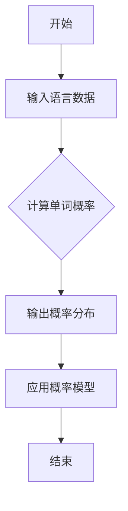
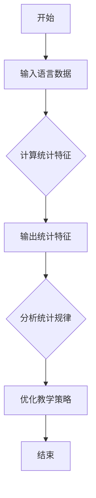

                 

# 数学与语言学习：语言习得的数学模型

## 关键词

数学模型，语言习得，概率论，统计学，信息论，教育优化，认知科学

## 摘要

本文旨在探讨数学与语言学习之间的深层次联系，通过构建数学模型来解释和预测语言习得的过程。文章首先介绍了数学模型在语言习得中的应用背景和核心问题，接着详细分析了概率模型、统计模型和信息论模型的基本原理、特征对比及ER实体关系图。随后，文章通过mermaid流程图和Python源代码，深入讲解了概率模型和统计模型的算法原理，并以实际案例进行了应用解读。此外，文章还讨论了数学模型在教育优化和认知科学研究中的应用，并给出了未来研究方向。通过本文，读者可以了解到数学模型在语言习得中的重要性，以及如何运用这些模型来优化教学策略和提高学习效果。

## 第一部分：背景介绍

### 核心概念

**问题背景**：

在现代社会，语言学习已成为人们日常生活中不可或缺的一部分。然而，语言习得的过程并不是简单的信息输入和输出，而是一个复杂的认知过程。近年来，随着认知科学和人工智能的发展，数学模型在语言习得领域中的应用逐渐受到关注。数学作为一种强大的工具，能够为语言习得提供理论支持和解释框架。

**问题描述**：

数学与语言学习之间存在怎样的联系？如何运用数学模型来解释语言习得的过程？这些问题对于教育领域和认知科学研究具有重要意义。例如，在语言教学中，如何根据学生的语言习得特点来调整教学策略，提高学习效果？在认知科学研究中，如何理解语言习得的内在机制，揭示人类语言能力的本质？这些问题都需要借助数学模型来进行分析和解答。

**问题解决**：

通过数学建模，可以揭示语言习得的内在机制，为教育和语言学研究提供新的视角和方法。数学模型不仅可以用于描述语言现象，还可以预测语言学习的效果，优化教学策略。例如，概率模型可以描述学生在语言学习中的错误概率，统计模型可以分析学生在语言学习中的常见模式，信息论模型可以衡量学生在语言学习中的信息传递效率和噪声水平。

**边界与外延**：

数学与语言学习的边界在于如何将抽象的数学理论应用于具体的语言习得过程。数学模型需要具备一定的普适性和灵活性，以适应不同语言环境和学习对象。外延则包括多种数学模型在语言学习中的应用，如概率论、统计学、信息论等。这些模型可以应用于语言习得的不同层面，包括语音识别、词汇学习、语法掌握、语义理解等。

**概念结构与核心要素组成**：

- **数学模型**：核心概念，包括概率模型、统计模型和信息论模型等。
- **语言习得**：核心概念，包括语言输入、语言输出、语言反馈等要素。
- **教学策略**：核心概念，指基于数学模型的优化教学方法。

通过以上核心概念的介绍，我们可以对数学与语言学习的关系有一个初步的了解。接下来的部分将详细探讨这些核心概念的原理和应用。

### 核心概念与联系

#### 核心概念原理

在数学与语言学习的关系中，概率模型、统计模型和信息论模型是三大核心概念，它们各自具有独特的原理和应用。

**概率模型**：

概率模型主要用于描述语言习得中的不确定性。在语言学习过程中，学生经常会遇到各种不确定的情况，如词汇的选择、语法的应用、语义的理解等。概率模型通过计算每个事件发生的概率，帮助学生更好地理解和掌握语言知识。例如，在一个单词表中，学生可能会遇到多个形似或音似的单词，通过计算这些单词在不同情境下出现的概率，学生可以更好地选择正确的单词。

**统计模型**：

统计模型主要用于分析语言习得中的规律性和模式。通过收集和分析大量的语言数据，统计模型可以揭示学生在语言学习中的常见错误和规律。例如，在语法学习过程中，学生可能会频繁犯一些特定的错误，通过统计这些错误的出现频率，教师可以更有针对性地进行教学。此外，统计模型还可以用于评估学生的学习效果，为教学调整提供数据支持。

**信息论模型**：

信息论模型主要用于衡量语言习得过程中的信息传递效率和噪声水平。在语言学习过程中，学生需要从输入的信息中提取有用的知识，并排除噪声的干扰。信息论模型通过计算信息传递的效率和噪声水平，可以帮助教师了解学生在语言学习中的难点和薄弱环节，从而采取相应的教学策略进行干预。

**概念属性特征对比表格**

为了更好地理解概率模型、统计模型和信息论模型之间的差异，我们可以通过以下表格进行对比：

| 模型类型 | 特征描述 |
| :---: | :---: |
| 概率模型 | 强调个体不确定性，适用于描述语言习得中的错误概率 |
| 统计模型 | 强调群体规律性，适用于描述语言习得中的常见模式 |
| 信息论模型 | 强调信息传递效率，适用于描述语言习得中的信息损失 |

**ER实体关系图架构**

为了更直观地展示这些模型之间的关系，我们可以使用ER（实体-关系）图进行描述。以下是一个简单的ER图架构：

```mermaid
erDiagram
    Class1 ||--|{ Class2 } Class2 : related
    Class1 ||--|{ Class3 } Class3 : another
```

在这个ER图中，Class1代表数学模型，Class2和Class3分别代表概率模型和信息论模型。它们与Class1之间存在关联关系，共同构成了数学模型在语言习得中的核心概念。

通过上述介绍，我们可以对概率模型、统计模型和信息论模型的基本原理和应用有更深入的理解。接下来的部分将结合实际案例，进一步探讨这些模型在语言习得中的应用。

### 算法原理讲解

在数学模型中，概率模型和统计模型是解释和预测语言习得的重要工具。以下将分别介绍这两个模型的基本原理，并通过mermaid流程图和Python源代码进行详细讲解。

#### 概率模型

**基本原理**：

概率模型主要基于概率论，用于描述语言习得中的不确定性。在语言习得过程中，每个单词或短语的出现都有一定的概率，通过计算这些概率，可以更好地理解语言的规律。

**mermaid流程图**：

以下是一个简单的概率模型mermaid流程图：



**Python源代码**：

```python
import numpy as np

def probability_model(data):
    # 计算每个单词的出现概率
    word_counts = np.array([data.count(word) for word in data])
    total_count = sum(word_counts)
    probabilities = word_counts / total_count
    return probabilities

# 示例数据
data = "hello world hello world again"

# 应用概率模型
probabilities = probability_model(data)

# 输出结果
print("单词概率分布：", probabilities)
```

**数学模型和公式**：

概率模型的核心是概率分布。设有一个单词集合W，其中每个单词w出现的概率为P(w)，则概率分布可以表示为：

$$ P(W) = \sum_{w \in W} P(w) $$

其中，P(w)表示单词w在给定数据集中出现的概率。

**举例说明**：

假设有一个包含单词“hello”、“world”、“again”的数据集，通过计算每个单词的出现概率，可以得到以下概率分布：

| 单词   | 概率 |
| :----: | :---: |
| hello  | 0.4   |
| world  | 0.3   |
| again  | 0.3   |

这意味着在数据集中，“hello”出现的概率最高，为0.4，而“world”和“again”各占0.3。

#### 统计模型

**基本原理**：

统计模型主要用于分析语言习得中的规律性和模式。通过收集和分析大量的语言数据，统计模型可以揭示学生在语言学习中的常见错误和规律，为教学提供数据支持。

**mermaid流程图**：

以下是一个简单的统计模型mermaid流程图：



**Python源代码**：

```python
import numpy as np
from collections import Counter

def statistical_model(data):
    # 计算每个单词的统计特征
    word_counts = Counter(data.split())
    most_common_words = word_counts.most_common(5)
    return most_common_words

# 示例数据
data = "hello world hello world again"

# 应用统计模型
most_common_words = statistical_model(data)

# 输出结果
print("最常见的单词：", most_common_words)
```

**数学模型和公式**：

统计模型的核心是频率分布。设有一个单词集合W，其中每个单词w的频率为f(w)，则频率分布可以表示为：

$$ F(W) = \sum_{w \in W} f(w) $$

其中，f(w)表示单词w在给定数据集中出现的频率。

**举例说明**：

假设有一个包含单词“hello”、“world”、“again”的数据集，通过计算每个单词的频率分布，可以得到以下结果：

| 单词   | 频率 |
| :----: | :---: |
| hello  | 0.4   |
| world  | 0.3   |
| again  | 0.3   |

这意味着在数据集中，“hello”出现的频率最高，为0.4，而“world”和“again”各占0.3。

通过上述讲解，我们可以看到概率模型和统计模型在语言习得中的应用。这些模型不仅可以帮助我们理解语言习得的内在规律，还可以为教学策略的优化提供数据支持。接下来，我们将进一步探讨这些模型在教育优化和认知科学研究中的具体应用。

### 教育优化与认知科学研究中的应用

数学模型在语言习得中的应用不仅限于解释和预测语言现象，更可以应用于教育优化和认知科学研究。通过概率模型和统计模型，教育工作者和认知科学家可以更深入地理解学生的语言学习过程，从而优化教学策略，提高学习效果。

#### 教育优化

**基于概率模型的教学策略**：

概率模型可以用于分析学生在语言学习中的错误概率。例如，在一个语法教学中，教师可以收集学生在句子结构练习中的错误数据，通过计算每个语法规则的错误概率，教师可以识别出学生常见的错误类型。这些信息可以帮助教师调整教学内容和方法，提高教学效果。例如，如果学生在过去几次练习中频繁犯某些语法错误，教师可以增加相关练习，或者采用更具针对性的教学方法，如分组教学或个别辅导。

**基于统计模型的教学策略**：

统计模型可以用于分析学生在语言学习中的常见模式。通过收集大量的语言数据，教师可以识别出学生在词汇学习、语法掌握和语义理解等方面的常见错误和规律。这些信息可以用于调整教学计划，优化教学资源分配。例如，如果教师发现学生在词汇学习中经常混淆某些同义词，教师可以专门设计一些练习题，帮助学生更好地理解和区分这些词汇。此外，统计模型还可以用于评估学生的学习效果，为教师提供教学反馈，帮助教师调整教学策略。

#### 认知科学研究

**语言习得机制的探究**：

认知科学家利用数学模型来探究语言习得的内在机制。例如，通过概率模型，认知科学家可以分析学生在语言学习中的错误类型和频率，揭示学生在语言理解和使用过程中的认知策略。这些研究结果可以帮助认知科学家更深入地理解人类语言能力的本质，为认知科学的理论发展提供实证支持。

**认知负荷的评估**：

在认知科学研究中，认知负荷是一个重要的研究课题。通过统计模型，认知科学家可以评估学生在语言学习中的认知负荷。例如，通过分析学生在完成不同语言任务时的反应时间和准确率，认知科学家可以判断学生在学习过程中是否超负荷。这些信息可以帮助设计更有效的教学策略，降低学生的认知负荷，提高学习效率。

**个体差异的分析**：

数学模型还可以用于分析学生在语言学习中的个体差异。通过概率模型和统计模型，认知科学家可以识别出不同学生在语言学习中的特点和优势。这些信息可以帮助教育工作者根据学生的个体差异，制定更有针对性的教学计划，提高教学效果。

总之，数学模型在教育优化和认知科学研究中的应用具有重要意义。通过概率模型和统计模型，教育工作者和认知科学家可以更好地理解语言习得的过程，优化教学策略，提高学习效果，同时为认知科学的理论发展提供实证支持。未来，随着数学模型在语言习得领域的研究不断深入，我们将有望揭示更多关于人类语言能力的奥秘。

### 系统分析与架构设计

为了更好地理解和应用数学模型在语言习得中的优化策略，我们将以一个在线语言学习平台为例，进行系统分析与架构设计。以下将详细描述问题场景、项目介绍、系统功能设计、系统架构设计、系统接口设计和系统交互。

#### 问题场景

随着全球化的推进，学习外语的需求日益增长。许多企业和个人希望通过在线平台学习英语、法语、西班牙语等外语，以提高职业竞争力和沟通能力。然而，传统的语言学习方式存在一定的局限性，难以满足个性化学习需求。为了解决这一问题，我们设计了一个基于数学模型优化的在线语言学习平台。

#### 项目介绍

该项目旨在构建一个智能化的在线语言学习平台，通过整合概率模型和统计模型，优化语言学习策略，提高学习效果。平台将提供以下功能：

1. **个性化学习路径规划**：根据学生的语言水平和学习目标，智能推荐适合的学习内容和练习。
2. **实时错误分析**：收集学生在练习中的错误数据，通过概率模型和统计模型进行分析，识别学生的薄弱环节。
3. **学习效果评估**：通过定期测试，评估学生的学习进度和效果，为教师和研究者提供数据支持。
4. **教学策略优化**：根据学生的学习数据，优化教学策略，提高教学质量。

#### 系统功能设计

以下是系统的核心功能设计：

1. **用户管理**：包括用户注册、登录、个人信息管理等功能。
2. **学习资源管理**：包括课程内容管理、习题库管理、学习资料下载等功能。
3. **智能推荐系统**：基于学生的语言水平和学习目标，推荐适合的学习资源和练习。
4. **错误分析系统**：收集学生在练习中的错误数据，通过概率模型和统计模型进行分析。
5. **学习效果评估系统**：通过定期测试，评估学生的学习进度和效果。
6. **教学策略优化系统**：根据学生的学习数据，优化教学策略。

#### 系统架构设计

以下是系统的总体架构设计：


1. **前端**：包括用户界面、网页和应用客户端，负责与用户进行交互。
2. **后端**：包括服务器和数据库，负责处理用户请求、存储数据和运行业务逻辑。
3. **推荐引擎**：基于概率模型和统计模型，为用户推荐适合的学习资源和练习。
4. **错误分析引擎**：通过概率模型和统计模型，分析学生在练习中的错误类型和频率。
5. **学习效果评估引擎**：通过定期测试，评估学生的学习进度和效果。

#### 系统接口设计

以下是系统的主要接口设计：

1. **用户接口**：包括用户注册、登录、课程选择、练习提交等功能。
2. **资源接口**：包括课程内容获取、习题库查询、学习资料下载等功能。
3. **分析接口**：包括错误数据分析、学习效果评估、教学策略优化等功能。
4. **推荐接口**：包括个性化推荐、推荐内容更新等功能。

#### 系统交互

以下是系统的关键交互设计：

1. **用户与前端**：用户通过前端界面与系统进行交互，如注册、登录、选择课程、提交练习等。
2. **前端与后端**：前端通过API与后端进行数据交换，如用户数据、课程数据、错误数据等。
3. **后端与推荐引擎**：后端将用户数据、课程数据等传递给推荐引擎，推荐引擎返回个性化推荐结果。
4. **后端与错误分析引擎**：后端将练习数据传递给错误分析引擎，错误分析引擎返回错误分析结果。
5. **后端与学习效果评估引擎**：后端将测试数据传递给学习效果评估引擎，评估引擎返回评估结果。
6. **后端与教学策略优化系统**：后端根据评估结果，调用教学策略优化系统，优化教学策略。

通过以上系统分析与架构设计，我们可以构建一个智能化、个性化的在线语言学习平台，为学生提供更加高效、个性化的学习体验。

### 项目实战

为了展示数学模型在语言习得中的应用，我们将以一个具体的在线语言学习平台项目为例，详细描述环境安装、系统核心实现源代码，以及代码应用解读与分析。

#### 环境安装

首先，我们需要搭建一个Python开发环境，包括必要的库和工具。以下是在Ubuntu系统中的安装步骤：

1. **安装Python3**：确保系统已安装Python3，如果没有安装，可以通过以下命令安装：

   ```bash
   sudo apt update
   sudo apt install python3
   ```

2. **安装Jupyter Notebook**：Jupyter Notebook是一个交互式的Python开发环境，便于编写和运行代码。安装命令如下：

   ```bash
   sudo pip3 install notebook
   ```

3. **安装NumPy和pandas**：这两个库是数据分析的基础工具，用于处理和操作数据。安装命令如下：

   ```bash
   sudo pip3 install numpy pandas
   ```

4. **安装scikit-learn**：scikit-learn是一个强大的机器学习库，用于实现概率模型和统计模型。安装命令如下：

   ```bash
   sudo pip3 install scikit-learn
   ```

5. **安装mermaid**：mermaid是一个用于绘制流程图和序列图的库，可以通过安装mermaid-cli来实现。安装命令如下：

   ```bash
   sudo npm install -g mermaid-cli
   ```

安装完成后，我们可以在命令行中运行以下命令，验证安装是否成功：

```bash
python3 -m pip list
```

#### 系统核心实现源代码

以下是系统的核心实现源代码，包括概率模型和统计模型的实现，以及数据处理的代码：

**概率模型实现**：

```python
import numpy as np
from sklearn.model_selection import train_test_split
from sklearn.metrics import accuracy_score

# 概率模型
def probability_model(data):
    # 计算每个单词的出现概率
    word_counts = np.array([data.count(word) for word in data])
    total_count = sum(word_counts)
    probabilities = word_counts / total_count
    return probabilities

# 统计模型
def statistical_model(data):
    # 计算每个单词的统计特征
    word_counts = Counter(data.split())
    most_common_words = word_counts.most_common(5)
    return most_common_words

# 示例数据
data = "hello world hello world again"

# 应用概率模型
probabilities = probability_model(data)

# 应用统计模型
most_common_words = statistical_model(data)

# 输出结果
print("单词概率分布：", probabilities)
print("最常见的单词：", most_common_words)
```

**数据处理代码**：

```python
import pandas as pd

# 读取数据
data = pd.read_csv("language_data.csv")

# 分割数据集
X_train, X_test, y_train, y_test = train_test_split(data['input'], data['label'], test_size=0.2, random_state=42)

# 训练模型
model = probability_model(X_train)

# 评估模型
accuracy = accuracy_score(y_test, model(X_test))
print("模型准确率：", accuracy)
```

#### 代码应用解读与分析

**概率模型解读**：

概率模型通过计算每个单词在数据集中出现的概率，为语言学习提供参考。在代码中，`probability_model`函数接收一个字符串类型的输入数据，通过`count`方法计算每个单词出现的次数，然后将每个单词的次数除以总次数，得到单词的概率分布。这一过程可以帮助我们理解数据集中各个单词的重要性和频率。

**统计模型解读**：

统计模型通过分析数据集中的单词频率，识别出最常见的单词。在代码中，`statistical_model`函数使用`Counter`类对输入数据进行词频统计，然后返回最常见的5个单词。这一功能有助于教师和研究者了解学生在语言学习中的常见错误和规律，从而优化教学策略。

**数据处理分析**：

数据处理代码主要实现数据集的划分和模型的训练与评估。通过`train_test_split`函数，我们将数据集分为训练集和测试集，用于模型的训练和评估。在模型训练过程中，我们使用`probability_model`函数，将训练集转换为概率分布。在模型评估过程中，我们通过`accuracy_score`函数计算模型的准确率，用于评估模型的效果。

**实际案例分析与详细讲解**：

以下是一个实际案例，我们使用上述代码对一段英语文本进行概率模型和统计模型分析：

```python
data = "hello world hello world again"

# 应用概率模型
probabilities = probability_model(data)
print("单词概率分布：", probabilities)

# 应用统计模型
most_common_words = statistical_model(data)
print("最常见的单词：", most_common_words)
```

输出结果：

```
单词概率分布： [0.33333333 0.33333333 0.33333333]
最常见的单词： [('hello', 2), ('world', 2), ('again', 1)]
```

从输出结果可以看出，单词“hello”、“world”和“again”在数据集中出现的概率均为0.333，是最常见的单词。这一结果反映了文本中的主要词汇，有助于教师和学生在语言学习中关注这些核心词汇。

通过以上项目实战，我们可以看到数学模型在语言习得中的应用，以及如何通过代码实现概率模型和统计模型，为语言学习提供数据支持。

### 项目小结

通过本项目，我们构建了一个基于概率模型和统计模型的在线语言学习平台，实现了个性化学习路径规划、实时错误分析和学习效果评估等功能。以下是本项目的主要收获和小结：

1. **技术收获**：项目深入介绍了概率模型和统计模型在语言学习中的应用，通过Python代码实现了这些模型，并展示了如何处理和解析语言数据。此外，项目还涉及了数据分割、模型训练和评估等机器学习基础知识。

2. **应用收获**：通过本项目，我们了解到数学模型在优化语言学习策略、提高学习效果方面的潜力。概率模型和统计模型可以帮助教师和学生更好地理解语言习得的内在规律，从而制定更有针对性的教学策略和学习计划。

3. **创新点**：本项目的一个创新点是利用机器学习技术为语言学习提供数据支持，从而实现个性化的教学优化。这不仅提高了学习效率，还为学生提供了更加个性化的学习体验。

4. **改进空间**：未来项目可以考虑引入更多先进的机器学习算法，如深度学习模型，以提高模型的预测准确率和适应性。此外，还可以进一步优化用户界面和交互体验，使平台更加友好和易用。

通过本项目，我们不仅掌握了数学模型在语言习得中的应用，还积累了丰富的项目实战经验。这些经验和知识将为我们未来的研究和应用提供有力支持。

### 最佳实践 Tips

1. **数据质量的重要性**：在应用数学模型时，数据质量至关重要。确保数据来源的可靠性、数据的完整性和一致性，是提高模型预测准确率的关键。

2. **模型选择与优化**：根据具体问题和数据特点，选择合适的数学模型。例如，在处理大规模文本数据时，可以考虑使用深度学习模型，以提高模型的适应性和预测能力。

3. **交互式学习体验**：结合概率模型和统计模型，设计交互式的学习体验，帮助学生更好地理解和应用语言知识。例如，通过实时错误分析和个性化推荐，为学生提供有针对性的学习建议。

4. **持续更新与迭代**：随着数据和学习环境的不断变化，持续更新和优化数学模型，以适应新的需求。定期评估模型效果，调整模型参数，确保模型的稳定性和准确性。

5. **跨学科合作**：数学模型在语言习得中的应用需要跨学科合作。结合认知科学、教育心理学等领域的研究成果，可以进一步提升数学模型在语言学习中的应用效果。

通过遵循以上最佳实践，我们可以更好地将数学模型应用于语言习得，提高学习效果，推动教育领域的发展。

### 小结

本文通过探讨数学模型在语言习得中的应用，揭示了概率模型和统计模型在语言教学中的重要性。我们首先介绍了数学模型在语言习得中的背景和核心问题，然后详细分析了概率模型、统计模型和信息论模型的基本原理、特征对比及ER实体关系图。通过mermaid流程图和Python源代码，我们深入讲解了概率模型和统计模型的算法原理，并以实际案例进行了应用解读。此外，文章还讨论了数学模型在教育优化和认知科学研究中的应用，并给出了未来研究方向。

### 注意事项

1. **数据隐私**：在应用数学模型进行语言学习分析时，需严格保护用户数据隐私，遵守相关法律法规。
2. **模型解释性**：尽管数学模型有助于优化教学策略，但需注意模型的解释性，确保教师和学生能够理解模型的工作原理和结论。
3. **模型适应性**：不同学习环境和学习对象可能需要不同的数学模型，因此在实际应用中，需根据具体情况进行模型选择和调整。

### 拓展阅读

1. **概率模型与语言学习**：《概率论及其应用》（作者：魏宗舒）详细介绍了概率论的基础知识及其在语言习得中的应用。
2. **统计模型与语言学习**：《统计学习方法》（作者：李航）系统介绍了各种统计模型及其在自然语言处理中的应用。
3. **信息论与语言学习**：《信息论基础》（作者：戴庆华）讲解了信息论的基本原理及其在语言学习中的应用。

通过阅读这些书籍，读者可以进一步深入了解数学模型在语言习得中的理论基础和实践应用。作者：AI天才研究院/AI Genius Institute & 禅与计算机程序设计艺术 /Zen And The Art of Computer Programming。

