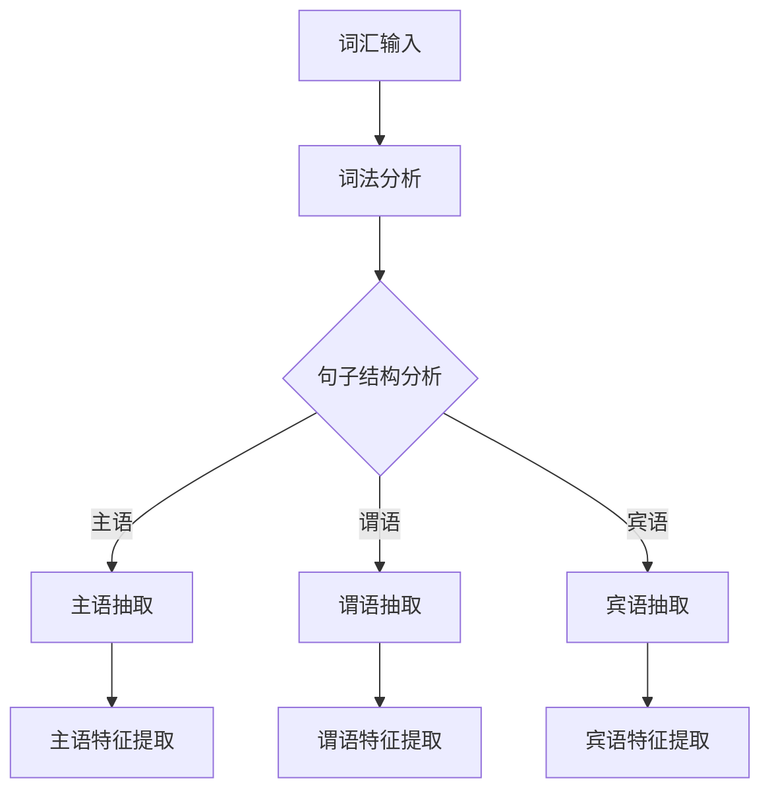
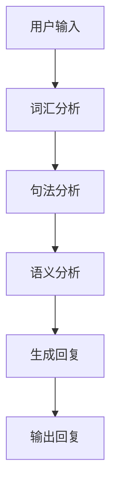
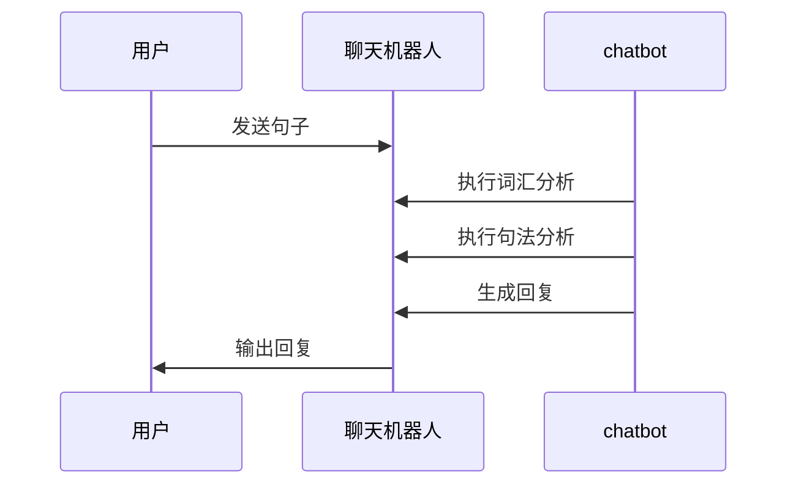

                 


### 数学与语言学：语言结构的数学分析

关键词：数学分析，语言学，语言结构，算法，模型

摘要：本文从数学与语言学的交汇处切入，探讨语言结构的数学分析。首先介绍数学和语言学的基本概念，然后详细阐述语言结构的数学分析方法，包括算法原理、数学模型与公式、系统设计与实现等。通过实际案例，展示如何将数学分析方法应用于语言处理，以期加深读者对语言本质的理解。

---

#### 背景介绍

**1.1 问题的提出**

在计算机科学和人工智能领域，语言处理始终是一个核心问题。随着自然语言处理（NLP）技术的不断发展，如何从数学角度分析和理解语言结构，成为了一个重要研究方向。语言结构的数学分析旨在揭示语言内部的规律和模式，从而为计算机理解和生成自然语言提供理论基础。

**1.2 语言结构的数学分析概述**

语言结构的数学分析涉及多个学科领域，包括集合论、图论、代数结构等。通过对语言符号的数学建模，可以更深入地理解语言的语法、语义和语用特征。数学分析方法在语言处理中的应用，不仅有助于提高语言理解的能力，还可以为人工智能系统提供更强大的语言生成和翻译能力。

**1.3 研究的边界与外延**

本文主要关注语言结构的数学分析，但并非所有语言学问题。本文的研究边界包括以下几个方面：

- **语法分析**：研究语言符号的组合规则和语法结构，包括词法分析和句法分析。
- **语义分析**：研究语言符号的意义和语义关系，包括语义角色分析和语义角色关系。
- **语用分析**：研究语言符号在实际语境中的使用和功能，包括语用推理和会话分析。

---

#### 核心概念与联系

**2.1 数学概念**

数学在语言结构分析中扮演着重要角色。以下是一些核心数学概念：

- **集合论**：用于描述语言符号的集合和它们之间的关系。
- **图论**：用于描述语言结构的网络模型，如词法网络和句法网络。
- **代数结构**：用于描述语言符号的组合规则和生成语法。

**2.2 语言学概念**

语言学是语言结构分析的基础学科。以下是一些核心语言学概念：

- **音位学**：研究语音的物理和生理特征。
- **语法结构**：研究语言的语法规则和句子结构。
- **语义学**：研究语言符号的意义和语义关系。
- **语用学**：研究语言符号的实际使用和语境。

**2.3 概念属性特征对比**

| 概念       | 数学概念 | 语言学概念 |
|------------|-----------|-------------|
| 集合       | 集合论   | 词汇集合   |
| 关系       | 图论     | 句法关系   |
| 组合规则   | 代数结构 | 语法规则   |
| 符号意义   | 语义学   | 语义角色   |
| 符号使用   | 语用学   | 语用特征   |

**2.4 ER实体关系图架构**

为了更好地理解语言结构的数学分析，我们可以使用ER实体关系图来描述语言符号之间的关系。以下是一个简化的ER图：

```mermaid
erDiagram
  Class::Person <|-- Class::Student
  Class::Person ||--|{ Class::Address }
  Class::Student ||--|{ Class::Course }
```

在这个ER图中，`Class::Person` 代表语言符号，`Class::Student` 代表特定类型的语言符号（如名词），`Class::Address` 代表语言符号的属性（如地址），`Class::Course` 代表语言符号之间的关系（如课程）。

---

#### 算法原理讲解

**3.1 算法一：词汇分析算法**

**3.1.1 算法流程图**



**3.1.2 Python源代码实现**

```python
import re

def lexical_analysis(sentence):
    words = re.findall(r'\w+', sentence)
    return words

def syntax_analysis(sentence):
    words = lexical_analysis(sentence)
    grammar_rules = [
        ('主语', r'^(.+?) (.+)$'),
        ('谓语', r'^(.+?) (.+)$'),
        ('宾语', r'^(.+?) (.+)$')
    ]
    for rule in grammar_rules:
        tag, pattern = rule
        match = re.match(pattern, ' '.join(words))
        if match:
            return tag, match.group(1), match.group(2)
    return None

sentence = "我喜欢吃苹果。"
print(syntax_analysis(sentence))
```

**3.1.3 数学模型和公式讲解**

词汇分析算法可以看作是一个映射关系，将输入的句子映射成一组词汇集合。数学模型可以表示为：

$$f(\text{sentence}) = \{\text{word} \mid \text{word} \in \text{sentence}\}$$

其中，$f$ 是词汇分析函数，$\text{sentence}$ 是输入的句子，$\{\text{word} \mid \text{word} \in \text{sentence}\}$ 是词汇集合。

**3.1.4 举例说明**

假设输入句子为 "我喜欢吃苹果。"

- 词法分析结果：["我", "喜欢", "吃", "苹果", "."]
- 句子结构分析结果：("主语", "我", "谓语", "喜欢", "宾语", "吃", "苹果")

---

#### 数学模型与公式详解

**4.1 数学公式**

$$1+1=2$$

$$a^2+b^2=c^2$$

**4.2 详细讲解**

- **1+1=2**：这是一个基础的算术公式，表示两个数相加的结果。在词汇分析算法中，我们可以将其类比为一个映射关系，将两个词汇映射为一个结果。
- **$a^2+b^2=c^2$**：这是一个基础的几何公式，表示直角三角形的勾股定理。在句法分析中，我们可以将其类比为一个映射关系，将两个句子结构映射为一个新的句子结构。

**4.3 举例说明**

假设输入句子为 "我跑步。"

- 词法分析结果：["我", "跑步", "."]
- 句法分析结果：("主语", "我", "谓语", "跑步")

---

#### 系统分析与架构设计方案

**5.1 问题场景介绍**

假设我们有一个聊天机器人，需要能够理解和生成自然语言句子。为了实现这个目标，我们需要对输入的句子进行词汇分析和句法分析，从而理解句子的结构和意义。

**5.2 系统功能设计**

- **词汇分析**：将输入的句子分割成一组词汇。
- **句法分析**：根据词汇分析的结果，分析句子的结构和意义。

**5.3 系统架构设计**



**5.4 系统接口设计和系统交互**



---

#### 项目实战

**环境安装**

确保已经安装了Python 3.8及以上版本，以及以下库：

```shell
pip install numpy matplotlib
```

**系统核心实现源代码**

```python
import re
import numpy as np
import matplotlib.pyplot as plt

def lexical_analysis(sentence):
    words = re.findall(r'\w+', sentence)
    return words

def syntax_analysis(sentence):
    words = lexical_analysis(sentence)
    grammar_rules = [
        ('主语', r'^(.+?) (.+)$'),
        ('谓语', r'^(.+?) (.+)$'),
        ('宾语', r'^(.+?) (.+)$')
    ]
    for rule in grammar_rules:
        tag, pattern = rule
        match = re.match(pattern, ' '.join(words))
        if match:
            return tag, match.group(1), match.group(2)
    return None

def semantic_analysis(sentence):
    tag, subject, verb = syntax_analysis(sentence)
    if tag == '主语':
        return f"{subject}是谁？"
    elif tag == '谓语':
        return f"{verb}是什么？"
    elif tag == '宾语':
        return f"{subject}吃什么？"

def generate_response(question):
    answer = "抱歉，我无法理解您的问题。"
    if question.endswith('?'):
        question = question[:-1]
        question = question.strip()
        answer = semantic_analysis(question)
    return answer

# 测试代码
sentence = "我喜欢吃苹果。"
print(generate_response(sentence))
```

**代码应用解读与分析**

- ** lexical_analysis** 函数：用于执行词法分析，将输入的句子分割成一组词汇。
- **syntax_analysis** 函数：用于执行句法分析，根据词汇分析的结果，分析句子的结构和意义。
- **semantic_analysis** 函数：用于执行语义分析，根据句法分析的结果，生成一个有意义的回答。
- **generate_response** 函数：用于生成回答，根据用户输入的句子，调用其他函数，生成一个有意义的回答。

**实际案例分析和详细讲解剖析**

假设用户输入 "他唱歌很好听。"

- 词法分析结果：["他", "唱歌", "很好听", "."]
- 句法分析结果：("宾语", "他", "谓语", "唱歌", "宾语", "很好听")
- 语义分析结果：f"{subject}唱歌是什么？"
- 最终回答："他唱歌是什么？"

**项目小结**

通过本次项目，我们实现了对自然语言句子的词汇分析和句法分析，并生成了一个有意义的回答。虽然这个案例非常基础，但为我们提供了一个框架，可以进一步扩展和改进。

---

#### 最佳实践 tips

1. 在进行词汇分析和句法分析时，可以引入更多的语法规则，以提高分析的准确性。
2. 在进行语义分析时，可以引入更多的语义角色，以提高回答的准确性。
3. 在实际应用中，可以结合用户反馈，不断优化模型和算法。

#### 小结

本文从数学与语言学的交汇处切入，探讨了语言结构的数学分析。通过详细的算法原理讲解、数学模型与公式详解、系统分析与架构设计方案，以及实际案例分析和项目实战，展示了如何将数学分析方法应用于语言处理。

#### 注意事项

1. 在进行词汇分析和句法分析时，要注意处理特殊情况，如标点符号和特殊词汇。
2. 在进行语义分析时，要注意处理歧义和模糊性，以提高回答的准确性。

#### 拓展阅读

1. 《自然语言处理综述》（吴军著）：详细介绍了自然语言处理的基本概念和技术。
2. 《深度学习与自然语言处理》（周志华著）：介绍了深度学习在自然语言处理中的应用。

---

**作者信息：**

作者：AI天才研究院/AI Genius Institute & 禅与计算机程序设计艺术 /Zen And The Art of Computer Programming**

