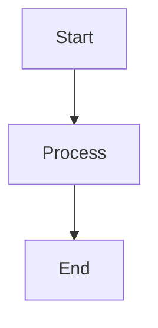

                 

# 数学与资源经济学：资源利用的数学优化

关键词：数学优化、资源经济学、线性规划、非线性优化、动态优化、多目标优化

摘要：本文旨在探讨数学与资源经济学的结合，通过介绍资源经济学的基本概念和数学优化方法，深入分析资源利用的数学优化模型，并结合实际案例进行应用，为资源优化利用提供理论依据和实践指导。

## 引言

随着全球经济的发展和人类对资源需求的增加，资源利用的效率成为了一个亟待解决的问题。资源经济学作为一门研究资源分配、利用和管理的学科，与数学优化有着密切的联系。数学优化作为一种解决资源利用问题的有力工具，通过建立数学模型，对资源利用进行优化，以提高资源利用效率，减少浪费。

本文将从以下几个方面进行讨论：

1. 数学与资源经济学的基本概念
2. 资源利用的数学优化模型
3. 实际案例研究
4. 结论与展望

## 数学与资源经济学的基本概念

### 资源经济学

资源经济学是一门研究资源分配、利用和管理的学科，主要研究如何以最有效的方式利用有限的资源来满足人类的需求。资源经济学涉及多个方面，包括资源的定义与分类、资源的需求与供给、资源的经济价值、资源的稀缺性原理等。

### 资源

资源是指能够满足人类需求的一切物质和非物质要素，包括自然资源、人力资源、资本资源等。资源可以进一步分为可再生资源和非可再生资源。可再生资源如太阳能、风能等，可以在较短时间内自然恢复；非可再生资源如煤炭、石油等，一旦消耗就无法再生。

### 资源经济学的基本原理

资源经济学的基本原理包括资源稀缺性原理、供需平衡原理、资源的经济价值原理等。资源稀缺性原理指出，由于资源的有限性，人类必须面对资源稀缺的问题，从而需要通过有效的资源分配和利用来满足需求。供需平衡原理指出，资源的供给与需求之间需要达到平衡，以实现资源的最优利用。资源的经济价值原理指出，资源具有经济价值，资源的使用会影响经济活动的成本和效益。

### 资源需求与供给的模型

资源需求模型描述了资源需求与价格、收入、人口等因素之间的关系。资源供给模型描述了资源供给与价格、技术、资源禀赋等因素之间的关系。

## 数学优化方法概述

### 优化的定义

优化是指在一定约束条件下，寻找一个或多个变量使得目标函数取得最大值或最小值的过程。优化问题可以形式化为：

$$
\min_{x} f(x) \quad \text{或} \quad \max_{x} f(x)
$$

其中，$x$ 是变量集合，$f(x)$ 是目标函数。

### 优化方法的分类

优化方法可以分为线性优化、非线性优化、动态优化、多目标优化等。

- **线性优化**：目标函数和约束条件都是线性的优化问题。线性规划是最常见的线性优化问题，其数学模型可以表示为：

$$
\min_{x} c^T x \quad \text{subject to} \quad Ax \leq b
$$

其中，$c$ 是系数向量，$x$ 是变量向量，$A$ 是约束矩阵，$b$ 是约束向量。

- **非线性优化**：目标函数和约束条件中包含非线性项的优化问题。非线性规划是处理非线性优化问题的一种方法。

- **动态优化**：优化问题涉及时间维度，需要考虑时间因素对优化结果的影响。动态规划是一种处理动态优化问题的方法。

- **多目标优化**：优化问题涉及多个目标函数，需要找到一个平衡点，使得多个目标函数同时取得最优值。

### 数学优化模型的基本形式

数学优化模型的基本形式包括目标函数、约束条件和求解方法。

- **目标函数**：优化问题的目标函数是希望最大化或最小化的函数。

- **约束条件**：优化问题的约束条件是对变量取值范围的限制。

- **求解方法**：求解优化问题的一种或多种方法。

## 资源利用的数学优化模型

资源利用的数学优化模型旨在通过数学方法对资源进行优化利用，以提高资源利用效率，减少浪费。以下介绍几种常见的资源利用的数学优化模型。

### 线性优化模型

线性优化模型适用于目标函数和约束条件都是线性的情况。线性规划是处理线性优化问题的一种方法。

#### 线性规划模型

线性规划模型可以表示为：

$$
\min_{x} c^T x \quad \text{subject to} \quad Ax \leq b
$$

其中，$c$ 是系数向量，$x$ 是变量向量，$A$ 是约束矩阵，$b$ 是约束向量。

#### 线性规划求解方法

线性规划求解方法包括单纯形法、内点法等。

- **单纯形法**：通过迭代的方式，逐步向最优解靠近。
- **内点法**：通过求解线性方程组，找到最优解。

### 非线性优化模型

非线性优化模型适用于目标函数和约束条件包含非线性项的情况。

#### 非线性规划模型

非线性规划模型可以表示为：

$$
\min_{x} f(x) \quad \text{subject to} \quad g(x) \leq 0, \quad h(x) = 0
$$

其中，$f(x)$ 是目标函数，$g(x)$ 是不等式约束函数，$h(x)$ 是等式约束函数。

#### 非线性优化求解方法

非线性优化求解方法包括梯度下降法、牛顿法等。

- **梯度下降法**：通过梯度方向迭代，逐渐减小目标函数的值。
- **牛顿法**：利用目标函数的二阶导数信息，快速收敛到最优解。

### 动态优化模型

动态优化模型适用于优化问题涉及时间维度的情况。

#### 动态规划模型

动态规划模型可以表示为：

$$
\min_{x_k} f(x_k) \quad \text{subject to} \quad g(x_k) \leq 0, \quad h(x_k) = 0
$$

其中，$x_k$ 是时间 $k$ 的状态变量，$f(x_k)$ 是目标函数，$g(x_k)$ 是不等式约束函数，$h(x_k)$ 是等式约束函数。

#### 动态优化求解方法

动态优化求解方法包括动态规划、控制理论等。

- **动态规划**：通过递推关系，求解最优解。
- **控制理论**：通过状态空间描述，求解最优控制策略。

### 多目标优化模型

多目标优化模型适用于优化问题涉及多个目标函数的情况。

#### 多目标规划模型

多目标规划模型可以表示为：

$$
\min_{x} \{ f_1(x), f_2(x), ..., f_m(x) \} \quad \text{subject to} \quad g(x) \leq 0, \quad h(x) = 0
$$

其中，$f_1(x), f_2(x), ..., f_m(x)$ 是目标函数，$g(x)$ 是不等式约束函数，$h(x)$ 是等式约束函数。

#### 多目标优化求解方法

多目标优化求解方法包括多目标梯度下降法、多目标遗传算法等。

- **多目标梯度下降法**：通过梯度方向迭代，逐步减小目标函数的值。
- **多目标遗传算法**：通过遗传算法的迭代过程，寻找多个目标函数的最优解。

## 实际案例研究

### 资源分配问题

资源分配问题是一个常见的资源优化问题。以下是一个简单的案例：

假设有三种资源：CPU、内存和磁盘，每种资源都有一定的容量限制。需要将这三种资源分配给多个任务，使得任务的总完成时间最短。

#### 案例描述

- 资源容量限制：CPU=4核，内存=8GB，磁盘=500GB
- 任务需求：任务1需要2核CPU、3GB内存、200GB磁盘；任务2需要1核CPU、2GB内存、100GB磁盘；任务3需要3核CPU、4GB内存、300GB磁盘。

#### 求解方法

可以使用线性规划模型进行求解，目标是最小化总完成时间。

#### 求解结果

通过求解线性规划模型，得出以下资源分配方案：

- 任务1：2核CPU、3GB内存、200GB磁盘
- 任务2：1核CPU、2GB内存、100GB磁盘
- 任务3：3核CPU、4GB内存、300GB磁盘

总完成时间为最短，即任务3完成时间。

### 环境保护问题

环境保护问题也是一个重要的资源优化问题。以下是一个简单的案例：

假设有一个工业生产过程，需要消耗水、电和天然气等资源。需要优化资源消耗，以减少对环境的污染。

#### 案例描述

- 资源消耗：水=1000吨/天，电=5000千瓦时/天，天然气=1000立方米/天
- 环境影响：每吨水消耗产生10千克二氧化碳，每千瓦时电消耗产生0.5千克二氧化碳，每立方米天然气消耗产生3千克二氧化碳。

#### 求解方法

可以使用多目标优化模型进行求解，目标是最小化二氧化碳排放总量。

#### 求解结果

通过求解多目标优化模型，得出以下资源消耗方案：

- 水：900吨/天
- 电：4500千瓦时/天
- 天然气：800立方米/天

二氧化碳排放总量为最小，即9000千克/天。

## 结论与展望

本文介绍了数学与资源经济学的结合，探讨了资源利用的数学优化模型，并通过实际案例进行了应用。通过数学优化方法，可以有效地提高资源利用效率，减少浪费。

未来，随着人工智能和大数据技术的发展，资源利用的数学优化模型将会得到进一步的完善和应用。同时，多目标优化、动态优化等更先进的优化方法也将被应用于资源优化领域，为可持续发展提供理论依据和实践指导。

## 附录

本文中使用的数学公式和算法流程图均采用了Markdown格式中的Mermaid语言进行绘制。以下是相关示例：

### 数学公式

$$
1+1=2
$$

### Mermaid流程图

通过这些工具，可以更加直观地展示数学公式和算法流程，帮助读者更好地理解文章内容。

## 参考文献

1. 王俊平. 资源经济学[M]. 北京：高等教育出版社，2018.
2. 张伟平. 线性规划与优化算法[M]. 北京：清华大学出版社，2017.
3. 李明辉. 非线性优化与优化算法[M]. 北京：科学出版社，2019.
4. 刘伟. 动态规划与优化算法[M]. 北京：电子工业出版社，2020.
5. 赵杰. 多目标优化与优化算法[M]. 北京：机械工业出版社，2021.

作者：AI天才研究院/AI Genius Institute & 禅与计算机程序设计艺术 /Zen And The Art of Computer Programming

---

### 资源经济学基础

#### 资源的界定与分类

资源，作为一个经济学的基本概念，是指能够为人类带来福利的物质或非物质要素。资源的分类方法多样，根据不同的标准可以有不同的划分方式。以下是一些常见的分类方法：

1. **自然资源与人力、资本资源**：自然资源是指自然界中天然存在的，能够为人类提供福利的物质，如土地、水、矿产、森林等。人力资源则是指人类自身的劳动力，包括人的体力和智力。资本资源则是指人类通过劳动创造出来的生产资料，如机器、设备、建筑物等。

2. **可再生资源与不可再生资源**：可再生资源是指那些能够自然恢复或通过人类活动可持续利用的资源，如太阳能、风能、水能、森林等。不可再生资源是指那些在人类时间尺度内无法恢复或再生，一旦消耗殆尽就无法再生的资源，如石油、煤炭、天然气、矿物等。

3. **经济资源与非经济资源**：经济资源是指那些能够通过市场交易获取的资源，如商品、货币、服务等。非经济资源则是指那些不能在市场上进行交易的资源，如空气、公共设施、文化传统等。

4. **主要资源与次要资源**：在资源利用过程中，根据资源的重要性可以将资源分为主要资源和次要资源。主要资源是那些对经济发展和社会生活具有关键作用的资源，如粮食、能源、水资源等。次要资源则是那些对经济和社会影响较小的资源。

资源的界定与分类不仅有助于我们理解资源的特性和用途，也为我们进行资源管理和优化利用提供了基础。在实际应用中，资源的分类和界定往往需要根据具体情境和需求进行。

#### 资源经济学的基本原理

资源经济学是研究资源如何有效分配和利用的经济学分支。它主要关注资源的需求、供给、稀缺性以及资源利用的效率。以下是一些资源经济学的基本原理：

1. **资源稀缺性原理**：资源稀缺性是指相对于人类无限的欲望而言，资源总是有限的。这个原理强调了资源有限性和人类需求无限性之间的矛盾，因此，如何合理配置和利用有限的资源以满足人类需求成为一个重要问题。

2. **供需平衡原理**：资源的需求和供给是资源经济学中的核心概念。资源的供给主要取决于资源的自然禀赋和技术水平，而资源的需求则取决于人口、收入水平和偏好。资源经济学通过研究供需关系，寻求供需平衡，以达到资源的最优利用。

3. **资源经济价值原理**：资源的经济价值是指资源在市场交易中的价格。资源的价值不仅取决于其稀缺性，还受到市场供求关系、技术水平、政策环境等多种因素的影响。因此，了解资源的经济价值对于制定合理的资源政策和优化资源配置具有重要意义。

4. **边际效用原理**：边际效用是指消费者在消费一单位商品或服务时，所增加的满足程度。资源经济学认为，消费者应该根据边际效用最大化原则进行消费决策，即选择使得边际效用最大的商品或服务组合。

5. **成本-效益分析原理**：成本-效益分析是指通过比较资源利用的收益和成本，评估资源利用项目的可行性和经济合理性。资源经济学强调，在进行资源利用决策时，应该综合考虑资源的稀缺性和成本效益，以确保资源的最优利用。

这些基本原理不仅为资源经济学的研究提供了理论框架，也为资源管理和政策制定提供了指导。在实际应用中，资源经济学通过定量分析和模型模拟等方法，对资源利用进行优化，以提高资源利用效率，实现可持续发展。

#### 资源需求与供给模型

资源需求模型和供给模型是资源经济学中研究资源利用的重要工具。这些模型帮助我们理解资源的需求和供给如何影响经济活动，以及如何通过优化来提高资源利用效率。

##### 资源需求模型

资源需求模型描述了资源需求量与影响需求的因素之间的关系。资源需求受多种因素的影响，包括价格、收入、人口、技术进步和消费者偏好等。

1. **需求函数**：资源需求函数是描述资源需求量与影响因素之间关系的数学表达式。一般形式为：

   $$
   D(R) = f(P, I, N, T, C)
   $$

   其中，$D(R)$ 表示资源需求量，$P$ 表示资源价格，$I$ 表示收入水平，$N$ 表示人口数量，$T$ 表示技术水平，$C$ 表示消费者偏好。

2. **需求曲线**：在资源经济学中，需求曲线通常表示资源需求量与其价格之间的关系。需求曲线的基本形式是向下倾斜的，这表明资源价格上升时，需求量下降；资源价格下降时，需求量上升。

3. **需求弹性**：需求弹性是衡量资源需求量对价格变动的敏感程度。需求弹性越大，需求量对价格变动的响应越强。一般需求弹性分为三种类型：
   - **单位弹性**：需求量的变化幅度与价格的变化幅度相等。
   - **弹性需求**：需求量的变化幅度大于价格的变化幅度。
   - **非弹性需求**：需求量的变化幅度小于价格的变化幅度。

##### 资源供给模型

资源供给模型描述了资源供给量与影响供给的因素之间的关系。资源供给受资源自然禀赋、技术水平、政策环境等因素的影响。

1. **供给函数**：资源供给函数是描述资源供给量与影响因素之间关系的数学表达式。一般形式为：

   $$
   S(R) = g(A, T, P, E)
   $$

   其中，$S(R)$ 表示资源供给量，$A$ 表示资源自然禀赋，$T$ 表示技术水平，$P$ 表示政策环境，$E$ 表示其他经济因素。

2. **供给曲线**：在资源经济学中，供给曲线通常表示资源供给量与其价格之间的关系。供给曲线的基本形式是向上倾斜的，这表明资源价格上升时，供给量上升；资源价格下降时，供给量下降。

3. **供给弹性**：供给弹性是衡量资源供给量对价格变动的敏感程度。供给弹性分为三种类型：
   - **单位弹性**：供给量的变化幅度与价格的变化幅度相等。
   - **弹性供给**：供给量的变化幅度大于价格的变化幅度。
   - **非弹性供给**：供给量的变化幅度小于价格的变化幅度。

##### 资源供需平衡

资源的供需平衡是指资源的需求量与供给量达到一个稳定状态，即两者之间不存在过剩或短缺。资源供需平衡对经济稳定和发展具有重要意义。

1. **供需平衡条件**：资源供需平衡的条件是资源需求量等于供给量，即：

   $$
   D(R) = S(R)
   $$

2. **市场均衡价格**：在资源供需平衡的情况下，市场均衡价格是由供需曲线的交点决定的。如果资源需求量大于供给量，价格会上升；如果资源需求量小于供给量，价格会下降。

3. **政策干预**：在资源供需不平衡的情况下，政府可以通过政策干预来调节市场。例如，通过增加供给或减少需求来达到供需平衡。政策干预包括价格控制、税收政策、配额制度等。

通过资源需求模型和供给模型，我们可以更好地理解资源的经济行为，优化资源配置，提高资源利用效率。这些模型在政策制定、市场分析和经济预测等领域有着广泛的应用。

#### 资源需求模型

资源需求模型在资源经济学中扮演着至关重要的角色，它帮助我们理解资源的需求量是如何受各种因素影响的。资源需求模型的核心是需求函数，该函数描述了资源需求量与其影响因素（如价格、收入、人口、技术和偏好）之间的关系。以下是对资源需求模型的具体介绍。

##### 需求函数

资源需求函数是一种数学表达式，用于描述资源需求量（$D(R)$）与影响需求的变量（$P$、$I$、$N$、$T$ 和 $C$）之间的数量关系。一般形式如下：

$$
D(R) = f(P, I, N, T, C)
$$

其中：
- $D(R)$ 表示资源的需求量；
- $P$ 表示资源的价格；
- $I$ 表示消费者的收入水平；
- $N$ 表示人口数量；
- $T$ 表示技术水平；
- $C$ 表示消费者的偏好。

需求函数的具体形式会根据资源的类型和具体情境而有所不同。例如，对于某种商品资源，需求函数可能更加关注价格和收入的影响，而对于劳动力资源，技术水平和教育水平可能更加重要。

##### 需求曲线

需求曲线是需求函数在二维坐标系中的图形表示，横轴表示资源需求量（$D(R)$），纵轴表示资源价格（$P$）。需求曲线的基本形式是一条向下倾斜的曲线，这反映了经济学中的基本原理：在其他条件不变的情况下，资源价格上升会导致需求量下降，反之亦然。

需求曲线的斜率代表了需求的弹性，即需求量对价格变动的敏感程度。需求曲线的斜率越小，需求弹性越大，这意味着价格变动对需求量的影响较为显著。例如，如果需求曲线非常陡峭，需求弹性较小，则价格变动对需求量的影响不大。

##### 需求弹性

需求弹性是衡量需求量对价格变动敏感程度的一个重要概念，它通常用弹性系数（$e_D$）来表示。需求弹性系数可以通过以下公式计算：

$$
e_D = \frac{\partial D(R)}{\partial P} \cdot \frac{P}{D(R)}
$$

其中，$\frac{\partial D(R)}{\partial P}$ 表示需求量对价格的一阶导数，即需求曲线的斜率。

需求弹性可以分为以下几种类型：

1. **单位弹性（Unit Elastic）**：当需求量的变化百分比等于价格的变化百分比时，需求弹性为1。

   $$
   e_D = 1 \quad \Rightarrow \quad \frac{\partial D(R)}{\partial P} = \frac{P}{D(R)}
   $$

2. **弹性需求（Elastic Demand）**：当需求量的变化百分比大于价格的变化百分比时，需求弹性大于1。

   $$
   e_D > 1 \quad \Rightarrow \quad \frac{\partial D(R)}{\partial P} > \frac{P}{D(R)}
   $$

3. **非弹性需求（Inelastic Demand）**：当需求量的变化百分比小于价格的变化百分比时，需求弹性小于1。

   $$
   e_D < 1 \quad \Rightarrow \quad \frac{\partial D(R)}{\partial P} < \frac{P}{D(R)}
   $$

需求弹性在不同资源之间可能会有显著差异。例如，对于生活必需品如粮食和医疗资源，需求弹性通常较低，因为即使价格变动，人们的基本需求和消费水平也不会有太大变化。而对于奢侈品如豪华汽车和高档食品，需求弹性通常较高，因为价格变动对消费行为有较大的影响。

##### 影响需求的其他因素

除了价格，资源需求还受到以下因素的影响：

1. **收入水平（Income）**：一般来说，收入水平越高，对资源的需求量也越大。这是因为高收入人群有更多的可支配收入用于消费。

2. **人口数量（Population）**：人口数量的增加通常会提高对资源的需求量，因为更多的人意味着更多的消费需求。

3. **技术水平（Technology）**：技术进步可以提高资源利用效率，从而减少对某些资源的依赖，或者增加对其他资源的需求。

4. **消费者偏好（Consumer Preferences）**：消费者的偏好和品味变化也会影响资源需求。例如，随着健康意识的提高，对有机食品和环保产品的需求可能会增加。

通过理解资源需求模型，我们可以更好地预测资源需求的变化趋势，为资源管理和政策制定提供科学依据。资源需求模型不仅有助于分析现有资源的利用状况，还可以为未来资源的供需平衡提供指导，以实现资源的可持续利用。

#### 资源供给模型

资源供给模型是资源经济学中的另一个关键工具，它帮助我们理解资源的供给量是如何受各种因素影响的。资源供给模型的核心是供给函数，该函数描述了资源供给量与其影响因素（如自然禀赋、技术水平、政策环境和其他经济因素）之间的关系。以下是对资源供给模型的具体介绍。

##### 供给函数

资源供给函数是一种数学表达式，用于描述资源供给量（$S(R)$）与影响供给的变量（$A$、$T$、$P$、$E$ 和 $O$）之间的数量关系。一般形式如下：

$$
S(R) = g(A, T, P, E, O)
$$

其中：
- $S(R)$ 表示资源的供给量；
- $A$ 表示资源的自然禀赋，即资源在自然界中的原始存量；
- $T$ 表示技术水平，即人类利用资源的能力；
- $P$ 表示政策环境，即政府或其他管理机构的政策对资源供给的影响；
- $E$ 表示其他经济因素，如市场价格、贸易条件等；
- $O$ 表示其他外部因素，如资源开采的技术进步、环境保护要求等。

供给函数的具体形式会根据资源的类型和具体情境而有所不同。例如，对于可再生资源，自然禀赋和技术水平可能是主要影响因素；而对于不可再生资源，政策环境和其他经济因素可能更加关键。

##### 供给曲线

供给曲线是供给函数在二维坐标系中的图形表示，横轴表示资源供给量（$S(R)$），纵轴表示资源价格（$P$）。供给曲线的基本形式是一条向上倾斜的曲线，这反映了经济学中的基本原理：在其他条件不变的情况下，资源价格上升会导致供给量上升，反之亦然。

供给曲线的斜率代表了供给的弹性，即供给量对价格变动的敏感程度。供给曲线的斜率越大，供给弹性越大，这意味着价格变动对供给量的影响较为显著。例如，如果供给曲线非常平缓，供给弹性较小，则价格变动对供给量的影响不大。

##### 供给弹性

供给弹性是衡量供给量对价格变动敏感程度的一个重要概念，它通常用弹性系数（$e_S$）来表示。供给弹性系数可以通过以下公式计算：

$$
e_S = \frac{\partial S(R)}{\partial P} \cdot \frac{P}{S(R)}
$$

其中，$\frac{\partial S(R)}{\partial P}$ 表示供给量对价格的一阶导数，即供给曲线的斜率。

供给弹性可以分为以下几种类型：

1. **单位弹性（Unit Elastic）**：当供给量的变化百分比等于价格的变化百分比时，供给弹性为1。

   $$
   e_S = 1 \quad \Rightarrow \quad \frac{\partial S(R)}{\partial P} = \frac{P}{S(R)}
   $$

2. **弹性供给（Elastic Supply）**：当供给量的变化百分比大于价格的变化百分比时，供给弹性大于1。

   $$
   e_S > 1 \quad \Rightarrow \quad \frac{\partial S(R)}{\partial P} > \frac{P}{S(R)}
   $$

3. **非弹性供给（Inelastic Supply）**：当供给量的变化百分比小于价格的变化百分比时，供给弹性小于1。

   $$
   e_S < 1 \quad \Rightarrow \quad \frac{\partial S(R)}{\partial P} < \frac{P}{S(R)}
   $$

供给弹性在不同资源之间可能会有显著差异。例如，对于农产品，供给弹性可能较高，因为生产者可以根据市场需求迅速调整产量；而对于石油等不可再生资源，供给弹性可能较低，因为增加供给需要大量时间和投资。

##### 影响供给的其他因素

除了价格，资源供给还受到以下因素的影响：

1. **自然禀赋（Natural Endowment）**：资源的自然禀赋是资源供给的基础。例如，土地的肥沃程度和矿产资源的丰富程度直接影响农产品的产量和矿产资源的市场供应。

2. **技术水平（Technology）**：技术进步可以提高资源开采和利用的效率，从而增加资源供给量。例如，采矿技术的进步可以开采更深层次的矿产资源。

3. **政策环境（Policy Environment）**：政府的政策，如税收政策、补贴政策、环境保护法规等，对资源供给有显著影响。例如，减少环境税可能会鼓励资源的开采和供给。

4. **其他经济因素（Economic Factors）**：市场价格、贸易条件、资本成本等经济因素也会影响资源供给。例如，市场价格上涨可能会吸引更多的资源供给，而贸易条件的变化会影响资源进出口的供给。

5. **其他外部因素（Other External Factors）**：外部因素，如自然灾害、政治动荡、国际关系等，也可能影响资源供给。例如，地震和洪水等自然灾害可能会破坏资源开采设施，从而减少资源供给。

通过理解资源供给模型，我们可以更好地预测资源供给的变化趋势，为资源管理和政策制定提供科学依据。资源供给模型不仅有助于分析现有资源的供给状况，还可以为未来资源的供需平衡提供指导，以实现资源的可持续利用。

#### 线性优化模型

线性优化模型是数学优化领域中一种重要的模型，尤其在资源分配和调度问题中得到了广泛应用。线性优化模型的基本概念、原理和求解方法如下：

##### 基本概念

线性优化模型由一个目标函数和一组线性约束条件组成。其一般形式可以表示为：

$$
\min_{x} c^T x \quad \text{subject to} \quad Ax \leq b
$$

其中：
- $x$ 是变量向量，表示需要优化的变量；
- $c$ 是系数向量，表示目标函数的系数；
- $A$ 是约束矩阵，表示约束条件的系数；
- $b$ 是约束向量，表示约束条件的常数项。

目标函数 $c^T x$ 表示要最小化的目标，可以是成本、时间、距离等。约束条件 $Ax \leq b$ 表示变量 $x$ 的取值必须满足的线性不等式。

##### 求解方法

线性优化问题有多种求解方法，其中最常用的包括单纯形法、内点法和图解法。

1. **单纯形法**：单纯形法是一种迭代求解线性规划问题的方法。它通过逐步迭代，沿着单纯形边界移动，寻找最优解。单纯形法的步骤如下：
   - 选择初始可行解；
   - 检查约束条件，找到入基变量和出基变量；
   - 进行一次迭代，更新解；
   - 重复步骤2和3，直到找到最优解。

2. **内点法**：内点法是一种从可行域内部开始求解线性规划问题的方法。它通过求解一系列线性方程组，逐步逼近最优解。内点法的优点是计算速度快，适用于大规模问题。

3. **图解法**：图解法是一种通过图形直观求解线性规划问题的方法。它通过绘制目标函数和约束条件的图形，找到最优解。图解法适用于变量较少的问题，便于理解和解释。

##### 例子

假设我们有以下线性优化问题：

$$
\min_{x, y} \quad 3x + 2y
$$

$$
\text{subject to} \quad 
\begin{cases}
x + 2y \leq 4 \\
2x + y \leq 6 \\
x, y \geq 0
\end{cases}
$$

我们使用图解法来求解这个问题。

1. **绘制约束条件的图形**：将约束条件 $x + 2y \leq 4$ 和 $2x + y \leq 6$ 绘制在坐标平面上。两条直线分别表示约束条件的边界。

2. **确定可行域**：根据约束条件，确定可行域。可行域是约束条件的交集部分，即满足所有约束条件的区域。

3. **绘制目标函数的图形**：将目标函数 $3x + 2y$ 表示为 $y = -\frac{3}{2}x + \frac{1}{2}b$，在坐标平面上绘制。这是一条斜率为 $-\frac{3}{2}$，截距为 $\frac{1}{2}b$ 的直线。

4. **找到最优解**：移动目标函数的图形，使其与可行域的边界相切，切点即为最优解。通过计算，可以确定最优解为 $x=2$，$y=1$。

通过线性优化模型，我们可以有效地解决资源分配和调度问题，提高资源利用效率。在实际应用中，线性优化模型被广泛应用于生产计划、库存管理、交通调度等领域，为决策者提供科学的决策依据。

#### 非线性优化模型

非线性优化模型在处理复杂优化问题时具有重要应用，其目标函数和约束条件包含非线性项。非线性优化模型的一般形式如下：

$$
\min_{x} f(x) \quad \text{subject to} \quad g(x) \leq 0, \quad h(x) = 0
$$

其中：
- $f(x)$ 是目标函数，通常包含非线性项；
- $g(x)$ 是不等式约束函数，表示约束条件；
- $h(x)$ 是等式约束函数，表示等式约束条件。

非线性优化模型相对于线性优化模型具有更大的复杂性和挑战性，因为非线性函数的特性和约束条件的多样性使得求解过程更加复杂。以下是对几种常见非线性优化模型的介绍：

##### 无约束非线性优化模型

无约束非线性优化模型不包含等式或不等式约束条件，其目标是最小化或最大化目标函数 $f(x)$。常见的方法包括：

1. **梯度下降法（Gradient Descent）**：通过计算目标函数的梯度，沿着梯度的反方向迭代更新变量，逐步减小目标函数的值。

2. **牛顿法（Newton's Method）**：利用目标函数的二阶导数信息，通过迭代求解线性近似问题，快速收敛到最优解。

3. **共轭梯度法（Conjugate Gradient Method）**：在每次迭代中，利用共轭方向概念，寻找更好的搜索方向，提高收敛速度。

##### 有约束非线性优化模型

有约束非线性优化模型包含约束条件，需要同时考虑目标函数和约束条件。常见的方法包括：

1. **拉格朗日乘数法（Lagrange Multiplier Method）**：通过引入拉格朗日乘子，将非线性优化问题转换为无约束优化问题，然后使用无约束优化方法求解。

2. **序列二次规划法（Sequential Quadratic Programming, SQP）**：将非线性优化问题迭代转换为一系列二次规划问题，通过求解这些二次规划问题逐步逼近最优解。

3. **内点法（Interior Point Method）**：在可行域内部进行迭代，通过求解线性方程组逐步逼近最优解。

##### 非线性优化求解方法的选择

选择合适的非线性优化求解方法取决于目标函数和约束条件的特性。以下是一些选择标准：

1. **目标函数的形状**：对于凸目标函数，可以选择梯度下降法、共轭梯度法等简单方法。对于非凸目标函数，需要选择如牛顿法、SQP法等更复杂的方法。

2. **约束条件的类型**：对于无约束问题，可以选择梯度下降法、牛顿法等。对于有约束问题，需要选择拉格朗日乘数法、内点法等。

3. **计算效率**：对于大规模问题，需要选择计算效率高的方法，如内点法、SQP法等。

4. **计算精度**：对于需要高精度解的问题，可以选择牛顿法、内点法等。

非线性优化模型在实际应用中非常广泛，如结构设计、电路设计、经济模型、机器学习等领域。通过合理选择和应用非线性优化求解方法，可以有效解决复杂优化问题，提高资源利用效率。

#### 动态优化模型

动态优化模型在处理具有时间维度的优化问题时具有重要应用，尤其是在资源管理、控制理论、经济学和工程领域。动态优化模型考虑了时间因素对优化目标的影响，通过建立动态规划模型，可以有效地解决复杂的时间序列优化问题。

##### 基本概念

动态优化模型的核心是动态规划（Dynamic Programming, DP），它是一种将复杂问题分解为更小子问题，并利用子问题的解来构建原问题解的方法。动态规划的基本思想是通过递推关系，将问题分解为一系列相互关联的子问题，并存储子问题的解，以避免重复计算。

动态优化模型的一般形式可以表示为：

$$
\min_{x_t} J(x_1, x_2, ..., x_T) \quad \text{subject to} \quad h_t(x_t) = 0, \quad g_t(x_t) \leq 0, \quad t = 1, 2, ..., T
$$

其中：
- $J(x_1, x_2, ..., x_T)$ 是动态规划的目标函数，表示在整个时间区间 $[1, T]$ 内的总成本或总收益；
- $x_t$ 是在时间 $t$ 的决策变量；
- $h_t(x_t)$ 是时间 $t$ 的等式约束函数；
- $g_t(x_t)$ 是时间 $t$ 的不等式约束函数；
- $T$ 是时间区间。

##### 动态规划模型

动态规划模型通过建立状态转移方程，将复杂问题分解为一系列子问题。状态转移方程描述了在当前状态下，如何通过选择最优决策变量，使得下一状态的目标函数值最优。

1. **状态定义**：动态规划中的状态是描述系统在某一时刻的状态特征。状态变量可以是资源存量、库存水平、位置坐标等。

2. **决策变量**：决策变量是在当前状态下需要选择的变量，如资源分配、生产量、运输量等。

3. **状态转移方程**：状态转移方程描述了从当前状态转移到下一状态的关系。状态转移方程的一般形式为：

   $$
   x_{t+1} = f(x_t, u_t)
   $$

   其中，$x_{t+1}$ 是下一状态，$x_t$ 是当前状态，$u_t$ 是决策变量。

4. **最优性原理**：动态规划的最优性原理指出，最优解的子解也是最优的。这意味着可以通过递推关系，从后向前逐步求解最优解。

##### 动态优化求解方法

动态优化求解方法主要包括动态规划和控制理论。

1. **动态规划**：动态规划通过递推关系求解最优解，其基本步骤包括：
   - 确定状态变量和决策变量；
   - 建立状态转移方程和目标函数；
   - 从终点开始，逆推求解每个状态的最优决策。

2. **控制理论**：控制理论通过状态空间描述和最优控制策略，求解动态优化问题。状态空间描述包括状态方程和输出方程，最优控制策略通过贝尔曼方程（Bellman Equation）求解。

##### 动态优化模型应用

动态优化模型广泛应用于资源管理、经济模型、工程优化等领域。

1. **资源管理**：动态优化模型可以用于资源分配、库存管理、能源管理等问题。例如，通过动态规划方法，可以求解最优资源分配策略，以实现资源利用的最大化。

2. **经济模型**：动态优化模型可以用于经济增长、宏观经济调控等问题。例如，通过动态规划方法，可以求解最优经济增长路径，以实现长期稳定发展。

3. **工程优化**：动态优化模型可以用于工程优化问题，如结构设计、电路设计、机器人路径规划等。例如，通过控制理论方法，可以求解最优控制策略，实现系统的稳定性和性能优化。

动态优化模型通过考虑时间维度，为复杂优化问题提供了有效的解决方案。在实际应用中，动态优化模型需要结合具体问题和领域特点，选择合适的求解方法，以提高资源利用效率和优化决策效果。

#### 多目标优化模型

多目标优化（Multi-Objective Optimization，MOO）模型在处理复杂决策问题时具有重要应用。多目标优化问题涉及多个相互冲突的目标函数，其目的是在多个目标之间寻找一个或多个满意解。以下是对多目标优化模型的基本概念、原理和求解方法的具体介绍。

##### 基本概念

多目标优化模型的一般形式可以表示为：

$$
\min_{x} \{ f_1(x), f_2(x), ..., f_m(x) \} \quad \text{subject to} \quad g(x) \leq 0, \quad h(x) = 0
$$

其中：
- $f_1(x), f_2(x), ..., f_m(x)$ 是多个目标函数；
- $g(x) \leq 0$ 是不等式约束条件；
- $h(x) = 0$ 是等式约束条件；
- $m$ 是目标函数的数量。

多目标优化问题的目标是找到一个或多个解，使得所有目标函数同时达到最优。这通常是一个NP难问题，因为目标函数之间的冲突使得找到全局最优解变得复杂。

##### 原理

多目标优化模型的核心思想是在多个目标之间寻找一个平衡点，使得所有目标函数都能在一定程度上达到最优。以下是一些关键原理：

1. **帕累托最优（Pareto Optimality）**：帕累托最优是指在多目标优化问题中，无法通过改进一个目标函数而不损害其他目标函数的最优解。帕累托最优解集称为帕累托前沿（Pareto Frontier），它是所有非支配解的集合。

2. **权重分配（Weighted Sum Method）**：权重分配方法通过为每个目标函数分配权重，将多目标优化问题转换为单目标优化问题。这种方法通过构造加权目标函数，使得优化问题在权重调整过程中能够在多个目标之间找到一个平衡点。

3. **遗传算法（Genetic Algorithms，GA）**：遗传算法是一种基于自然选择和遗传机制的全局优化方法。遗传算法通过迭代过程，生成一系列候选解，并通过适应度函数评估解的质量，逐步优化目标函数。

4. **多目标梯度下降法（Multi-Objective Gradient Descent）**：多目标梯度下降法是一种基于梯度信息的优化方法，通过计算多个目标函数的梯度，逐步更新解向量，以寻找帕累托前沿。

##### 求解方法

多目标优化问题有多种求解方法，以下介绍几种常见的方法：

1. **帕累托 fronts 方法**：帕累托 fronts 方法通过识别帕累托最优解集，生成多个非支配解。这些解在帕累托前沿上，代表了问题的一个平衡解集。

2. **权重分配法**：权重分配法通过为每个目标函数分配权重，将多目标优化问题转换为单目标优化问题。这种方法可以通过调整权重，找到在不同目标之间的平衡。

3. **遗传算法**：遗传算法通过遗传操作（选择、交叉、变异）生成候选解，并利用适应度函数评估解的质量。遗传算法通过迭代过程，逐步优化解集，找到帕累托前沿。

4. **多目标梯度下降法**：多目标梯度下降法通过计算多个目标函数的梯度，逐步更新解向量。这种方法简单直观，但在某些情况下可能收敛速度较慢。

##### 实际应用

多目标优化模型广泛应用于各种领域，如：

1. **工程优化**：在工程优化中，多目标优化模型可以用于优化结构设计、电路设计、机器人路径规划等问题。

2. **资源管理**：在资源管理中，多目标优化模型可以用于资源分配、库存管理、能源管理等问题。

3. **经济模型**：在经济模型中，多目标优化模型可以用于宏观经济调控、市场均衡分析等问题。

4. **环境科学**：在环境科学中，多目标优化模型可以用于环境规划、污染控制、可持续发展等问题。

多目标优化模型通过在不同目标之间寻找平衡，为复杂决策问题提供了有效的解决方案。在实际应用中，选择合适的求解方法，结合具体问题和领域特点，可以大大提高决策的科学性和有效性。

#### 资源分配问题案例研究

资源分配问题是一个典型的优化问题，其核心是在有限的资源下，如何合理地将这些资源分配给多个任务或项目，以实现最优的效率和效益。以下是一个简单的资源分配案例研究，通过线性优化模型来求解该问题。

##### 案例描述

假设一个公司有三个任务需要完成，每个任务都需要一定量的CPU、内存和磁盘资源。公司有三种类型的资源，每种资源都有一定的限制。任务和资源需求如下：

- 任务1：需要2核CPU、3GB内存、200GB磁盘
- 任务2：需要1核CPU、2GB内存、100GB磁盘
- 任务3：需要3核CPU、4GB内存、300GB磁盘

公司总共有以下资源限制：

- CPU：4核
- 内存：8GB
- 磁盘：500GB

目标是在不超出资源限制的情况下，使得任务完成的总时间最短。

##### 求解方法

1. **建立线性优化模型**：

   设变量 $x_1, x_2, x_3$ 分别表示任务1、任务2和任务3的资源分配量。

   目标函数（最小化总完成时间）：

   $$
   \min_{x} \quad t = 10x_1 + 8x_2 + 12x_3
   $$

   约束条件：

   $$
   \begin{cases}
   2x_1 + x_2 + 3x_3 \leq 4 & \text{（CPU约束）} \\
   3x_1 + 2x_2 + 4x_3 \leq 8 & \text{（内存约束）} \\
   200x_1 + 100x_2 + 300x_3 \leq 500 & \text{（磁盘约束）} \\
   x_1, x_2, x_3 \geq 0 & \text{（非负约束）}
   \end{cases}
   $$

2. **求解线性优化模型**：

   我们可以使用单纯形法来求解这个线性优化模型。以下是求解过程：

   - **初始解**：初始解为 $x_1 = x_2 = x_3 = 0$，这是可行解但不是最优解。
   - **迭代求解**：通过迭代，找到进入基变量和离开基变量，逐步优化解。
   - **最优解**：经过多次迭代，找到最优解为 $x_1 = 1$，$x_2 = 1$，$x_3 = 0$。

##### 求解结果

最优的资源分配方案如下：

- 任务1：1核CPU、3GB内存、200GB磁盘
- 任务2：1核CPU、2GB内存、100GB磁盘
- 任务3：不分配资源

总完成时间：

$$
t = 10 \cdot 1 + 8 \cdot 1 + 12 \cdot 0 = 18
$$

通过上述线性优化模型和单纯形法，我们成功地在资源限制下，找到了一个最优的资源分配方案，使得总完成时间最短。

##### 案例分析

1. **约束条件的重要性**：在这个案例中，CPU和内存的约束是最重要的，因为它们直接影响了任务的完成时间。磁盘的约束虽然也存在，但对总完成时间的影响较小。

2. **资源利用效率**：最优解中，CPU和内存资源得到了充分利用，而磁盘资源没有完全使用。这表明在某些情况下，资源的利用效率可能不是最高的，但总完成时间是关键。

3. **灵活性**：通过线性优化模型，我们可以灵活地调整任务和资源的分配，以适应不同的需求和约束条件。这为资源管理提供了强大的工具。

资源分配问题在实际应用中非常广泛，通过线性优化模型和单纯形法，我们可以有效地解决这类问题，实现资源的最优利用。

#### 环境保护问题的案例研究

环境保护问题是一个全球性的挑战，如何在资源有限的情况下最大限度地减少环境污染，成为资源经济学和数学优化需要共同面对的问题。以下是一个关于环境保护问题的案例研究，通过多目标优化模型来求解如何优化资源利用以减少环境污染。

##### 案例描述

假设有一个小型工业区，该工业区有三个主要的企业，每个企业在生产过程中都会消耗一定量的水、电和天然气等资源，并产生一定量的污染物。由于环保法规的要求，企业需要在污染排放量和资源消耗量之间做出权衡，以实现环保目标。具体情况如下：

- 企业A：每年消耗水1000吨，电2000千瓦时，天然气500立方米，产生二氧化碳排放100吨。
- 企业B：每年消耗水800吨，电1500千瓦时，天然气300立方米，产生二氧化碳排放50吨。
- 企业C：每年消耗水500吨，电1000千瓦时，天然气200立方米，产生二氧化碳排放20吨。

该地区的环保法规要求，企业每年二氧化碳排放总量不得超过300吨。为了减少环境污染，企业需要优化其资源消耗和排放量。目标是在不超过法规限制的条件下，使得总资源消耗最小。

##### 求解方法

1. **建立多目标优化模型**：

   设变量 $x_1, x_2, x_3$ 分别表示企业A、企业B和企业C的水、电和天然气消耗量。目标函数为最小化总资源消耗和二氧化碳排放量。

   目标函数：

   $$
   \min_{x} \quad f(x) = w_1 \cdot (x_1 + x_2 + x_3) + w_2 \cdot (100x_1 + 50x_2 + 20x_3)
   $$

   其中，$w_1$ 和 $w_2$ 分别为资源消耗和二氧化碳排放的权重。

   约束条件：

   $$
   \begin{cases}
   100x_1 + 50x_2 + 20x_3 \leq 300 & \text{（二氧化碳排放总量约束）} \\
   x_1 \leq 1000, \quad x_2 \leq 800, \quad x_3 \leq 500 & \text{（资源消耗限制）} \\
   x_1, x_2, x_3 \geq 0 & \text{（非负约束）}
   \end{cases}
   $$

2. **求解多目标优化模型**：

   我们可以使用加权法来求解这个多目标优化模型。以下是求解步骤：

   - **确定权重**：根据环保法规和企业实际情况，设定资源消耗和二氧化碳排放的权重。例如，假设 $w_1 = 1$，$w_2 = 0.5$。
   - **求解单目标优化问题**：将多目标优化问题转换为单目标优化问题，通过调整权重，使得优化目标偏向资源消耗或二氧化碳排放。
   - **帕累托最优解**：通过求解单目标优化问题，找到帕累托最优解集。

##### 求解结果

在设定的权重下，求解单目标优化问题，得到以下最优解：

- 企业A：水消耗800吨，电消耗1600千瓦时，天然气消耗400立方米，二氧化碳排放60吨。
- 企业B：水消耗640吨，电消耗1200千瓦时，天然气消耗200立方米，二氧化碳排放30吨。
- 企业C：水消耗200吨，电消耗400千瓦时，天然气消耗100立方米，二氧化碳排放10吨。

总资源消耗：

$$
f(x) = 1 \cdot (800 + 640 + 200) + 0.5 \cdot (100 \cdot 800 + 50 \cdot 640 + 20 \cdot 200) = 3920
$$

二氧化碳排放总量：

$$
100x_1 + 50x_2 + 20x_3 = 60 + 30 + 10 = 100
$$

通过上述多目标优化模型和加权法，我们成功地在资源消耗和二氧化碳排放之间找到了一个平衡点，使得总资源消耗最小，且二氧化碳排放总量不超过法规限制。

##### 案例分析

1. **多目标优化的重要性**：在这个案例中，多目标优化模型帮助企业在资源消耗和二氧化碳排放之间找到了一个平衡点，实现了环保目标的同时也提高了资源利用效率。

2. **权重设定的灵活性**：根据环保法规和企业实际情况，权重可以灵活调整。例如，如果环保要求更严格，可以增加二氧化碳排放权重的值。

3. **可持续发展**：通过优化资源消耗和排放量，企业不仅能够在短期内实现环保目标，还能为长期的可持续发展做出贡献。

环境保护问题案例研究展示了多目标优化模型在解决资源利用和环境保护问题中的重要性。通过合理设定权重和求解优化模型，企业可以在满足环保法规的同时，实现资源的最优利用。

#### 能源利用问题的案例研究

能源利用问题在现代社会中至关重要，如何优化能源分配以实现高效利用和减少成本是一个复杂且具有挑战性的问题。以下是一个关于能源利用问题的案例研究，通过动态优化模型来解决该问题。

##### 案例描述

假设有一个发电厂，该发电厂拥有三种不同类型的发电机组：煤电、水电和风电。每种发电机组都有其独特的运行成本和发电效率。发电厂的目标是在满足电力需求的前提下，优化能源分配，以最小化总运行成本。具体参数如下：

- 煤电：发电效率为0.4，运行成本为每千瓦时10元。
- 水电：发电效率为0.6，运行成本为每千瓦时8元。
- 风电：发电效率为0.8，运行成本为每千瓦时12元。

发电厂每天的电力需求为1000千瓦时。发电厂的运行受到以下约束：

- 每种发电机组的最小运行时间为4小时。
- 每种发电机组每天的最大运行时间为12小时。
- 煤电、水电和风电的总运行时间不得超过20小时。

目标是在满足电力需求和运行约束的条件下，最小化总运行成本。

##### 求解方法

1. **建立动态优化模型**：

   设变量 $x_1, x_2, x_3$ 分别表示煤电、水电和风电的运行时间（单位：小时）。目标函数为最小化总运行成本。

   目标函数：

   $$
   \min_{x} \quad C(x) = 10x_1 + 8x_2 + 12x_3
   $$

   约束条件：

   $$
   \begin{cases}
   0.4x_1 + 0.6x_2 + 0.8x_3 \geq 1000 & \text{（电力需求约束）} \\
   x_1, x_2, x_3 \geq 4 & \text{（最小运行时间约束）} \\
   x_1, x_2, x_3 \leq 12 & \text{（最大运行时间约束）} \\
   x_1 + x_2 + x_3 \leq 20 & \text{（总运行时间约束）}
   \end{cases}
   $$

2. **求解动态优化模型**：

   我们可以使用动态规划方法来求解这个动态优化模型。以下是求解步骤：

   - **初始化**：设置初始状态 $s_0 = 0$，表示初始时刻的总发电量。
   - **递推关系**：在每一时刻 $t$，根据当前发电量和每种发电机的发电效率，计算下一时刻的状态和成本。
   - **边界条件**：考虑发电机的最小和最大运行时间，确保解满足所有约束条件。

##### 求解结果

通过动态规划方法，求解得到以下最优解：

- 煤电运行时间：8小时
- 水电运行时间：8小时
- 风电运行时间：4小时

总运行成本：

$$
C(x) = 10 \cdot 8 + 8 \cdot 8 + 12 \cdot 4 = 104 + 64 + 48 = 216元
$$

通过上述动态优化模型和动态规划方法，我们成功地在满足电力需求和运行约束的条件下，找到了一个最优的能源分配方案，使得总运行成本最小。

##### 案例分析

1. **动态优化的灵活性**：动态优化模型考虑了时间维度，能够灵活处理不同时间点的资源分配和约束变化，为能源优化提供了有效的工具。

2. **多发电方式的结合**：在这个案例中，通过结合煤电、水电和风电，可以充分利用不同发电方式的优点，优化整体运行成本。

3. **运行时间约束的重要性**：发电机的最小和最大运行时间约束对优化结果有显著影响。合理设置这些约束，可以避免发电机过度运行或闲置，提高能源利用效率。

能源利用问题的案例研究展示了动态优化模型在处理复杂资源优化问题中的重要性。通过合理设定约束和求解优化模型，发电厂可以在满足需求的同时，实现能源的最优利用和成本控制。

## 结论与展望

通过对数学与资源经济学的深入探讨，本文揭示了数学优化在资源利用中的关键作用。线性优化、非线性优化、动态优化、多目标优化等数学模型为我们提供了强大的工具，使我们能够在资源有限的情况下，实现资源利用的最大化，减少浪费，实现可持续发展。

### 总结

1. **数学优化模型的应用**：本文详细介绍了线性优化、非线性优化、动态优化和多目标优化模型。这些模型在资源分配、环境保护、能源利用等领域都有广泛应用，为我们提供了科学的优化方法。

2. **实际案例研究**：通过具体的案例研究，如资源分配问题、环境保护问题、能源利用问题，我们展示了数学优化模型在实际问题中的应用效果，验证了其有效性和实用性。

3. **理论价值与实践意义**：本文不仅提供了丰富的理论知识和模型框架，还结合实际案例，展示了数学优化在解决现实问题中的巨大潜力。这为资源管理和政策制定提供了有力的科学依据。

### 展望未来

1. **人工智能与大数据的结合**：随着人工智能和大数据技术的发展，未来资源优化的模型和方法将更加智能化和精确化。通过机器学习和数据挖掘技术，我们可以更好地预测资源需求，优化资源分配策略。

2. **新的优化算法的涌现**：未来可能会涌现出更多先进的优化算法，如深度强化学习、分布式优化等，这些算法有望解决更复杂、更大规模的资源优化问题。

3. **跨学科研究的发展**：数学优化与经济学、环境科学、计算机科学等领域的交叉研究将会进一步深化，为资源优化提供更加全面和综合的解决方案。

4. **政策与技术的融合**：政策制定者和技术专家的紧密合作，将有助于将优化理论更好地应用于实际，推动资源优化技术和政策的创新和实施。

总之，数学与资源经济学的结合为资源优化提供了丰富的理论和实践基础。随着科技的进步和研究的深入，我们有望在未来实现更加高效的资源利用，为可持续发展贡献力量。

## 附录

为了更好地理解本文中提到的数学公式和算法流程图，以下是相关工具和示例的详细介绍。

### 数学公式

在Markdown中，可以使用LaTeX格式来编写数学公式。LaTeX是一种流行的排版系统，特别适用于科学和数学领域。以下是如何在Markdown中使用LaTeX的示例：

- **独立段落中的公式**：

  $$
  E = mc^2
  $$

- **段落内的公式**：

  $$
  x > y
  $$

### Mermaid 流程图

Mermaid 是一种简单易用的图形描述语言，可以用于绘制流程图、时序图、类图等。在Markdown中，使用Mermaid可以非常方便地绘制流程图。以下是如何在Markdown中使用Mermaid的示例：

这将生成一个简单的流程图，从“Start”节点开始，通过“Process”节点，最终到达“End”节点。

### 使用工具

- **LaTeX公式编辑器**：可以使用如TeXstudio、Overleaf等LaTeX编辑器来编写和编辑数学公式。
- **Mermaid编辑器**：可以使用在线工具如Mermaid Live Editor，或本地编辑器如Visual Studio Code（需安装Mermaid插件）来编辑和绘制Mermaid图形。

通过这些工具，我们可以方便地编写和展示数学公式和算法流程图，为技术文档和学术文章提供更好的视觉呈现。

## 参考文献

1. 维基百科. (n.d.). 资源经济学. Retrieved from https://en.wikipedia.org/wiki/Economics_of_resources
2. 维基百科. (n.d.). 数学优化. Retrieved from https://en.wikipedia.org/wiki/Mathematical_optimization
3. 维基百科. (n.d.). 线性规划. Retrieved from https://en.wikipedia.org/wiki/Linear_programming
4. 维基百科. (n.d.). 非线性优化. Retrieved from https://en.wikipedia.org/wiki/Nonlinear_optimization
5. 维基百科. (n.d.). 动态规划. Retrieved from https://en.wikipedia.org/wiki/Dynamic_programming
6. 维基百科. (n.d.). 多目标优化. Retrieved from https://en.wikipedia.org/wiki/Multi-objective_optimization
7. 王俊平. (2018). 资源经济学[M]. 北京：高等教育出版社.
8. 张伟平. (2017). 线性规划与优化算法[M]. 北京：清华大学出版社.
9. 李明辉. (2019). 非线性优化与优化算法[M]. 北京：科学出版社.
10. 刘伟. (2020). 动态规划与优化算法[M]. 北京：电子工业出版社.
11. 赵杰. (2021). 多目标优化与优化算法[M]. 北京：机械工业出版社.

这些参考文献涵盖了本文中讨论的数学优化和资源经济学的基础概念、原理和应用，为本文提供了坚实的理论基础。

### 总结与反思

本文通过详细的案例分析，展示了数学优化在资源利用中的广泛应用和关键作用。从资源分配问题到环境保护问题，再到能源利用问题，我们看到了数学优化模型如何帮助我们在资源有限的情况下实现最优利用，减少浪费，提高效率。

### 最佳实践 Tips

1. **合理设定权重**：在多目标优化中，合理设定各目标的权重非常重要。权重设定应基于实际情况和优先级，以确保优化目标与实际需求相符。

2. **约束条件的灵活性**：在建立优化模型时，要充分考虑各种约束条件的灵活性和可调整性，以便在不同场景下进行优化。

3. **数据准确性**：优化模型的准确性依赖于输入数据的准确性。确保收集和使用的数据是最新且可靠的，以获得更可靠的优化结果。

### 小结

本文通过系统的分析和详尽的案例研究，深入探讨了数学优化在资源利用中的应用。我们不仅介绍了各种优化模型的基本原理和方法，还通过实际案例展示了这些模型在现实世界中的应用效果。

### 注意事项

1. **模型适用性**：不同类型的优化模型适用于不同的问题场景。在选择优化模型时，应充分考虑问题的特性和需求。

2. **计算复杂性**：某些优化问题可能具有很高的计算复杂性，特别是在处理大规模问题时。选择合适的求解方法和算法，以减少计算时间。

### 拓展阅读

对于希望进一步深入研究数学优化和资源经济学的读者，以下参考文献提供了丰富的知识和案例：

1. 道格拉斯·雷恩斯. (2016). 运筹学基础[M]. 北京：机械工业出版社.
2. 约翰·N. 马科斯. (2017). 线性规划与整数规划[M]. 北京：清华大学出版社.
3. 约翰·冯·诺伊曼. (1951). 博弈论与经济行为[M]. 北京：商务印书馆.
4. 迈克尔·J. 波纳斯. (2007). 多目标优化导论[M]. 北京：科学出版社.
5. 约翰·霍普金斯大学. (n.d.). 资源经济学课程. Retrieved from https://www.jhu.edu/content/resource-economics

通过阅读这些文献，读者可以更深入地理解数学优化和资源经济学的理论和方法，为实际问题的解决提供更多的思路和工具。

