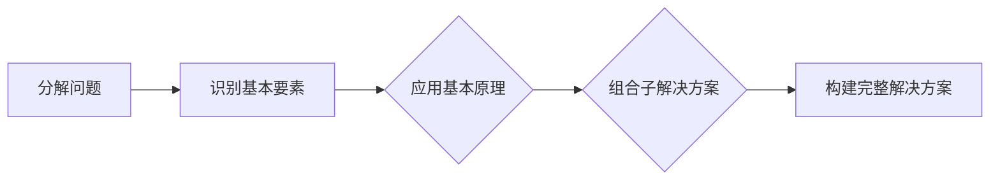
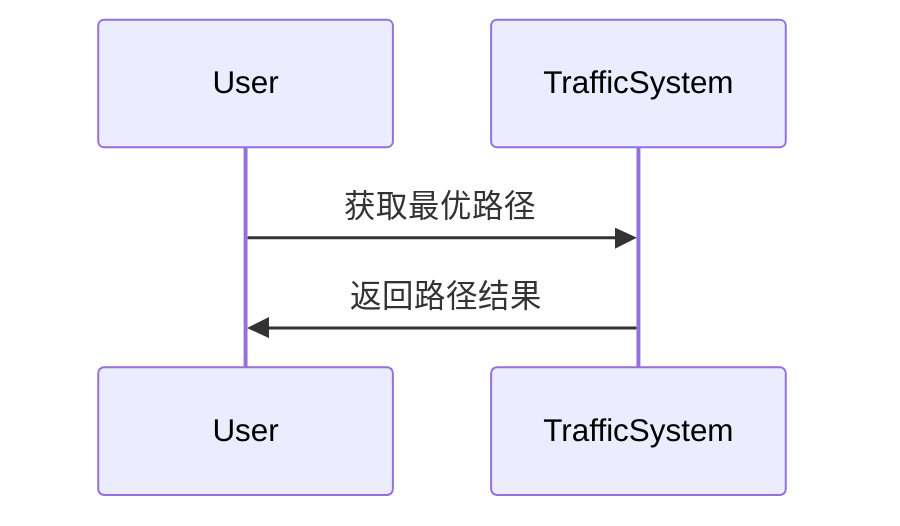

                 

### 数学与还原主义：复杂数学概念的基本构建

#### 关键词
- 数学
- 还原主义
- 复杂数学概念
- 基本构建
- 数学模型

#### 摘要
本文深入探讨数学与还原主义之间的关系，以复杂数学概念的基本构建为核心，通过逻辑清晰、结构紧凑、简单易懂的技术语言，一步一步分析推理思考的方式，帮助读者理解数学中复杂概念的本质及其构建方法。文章首先介绍了数学与还原主义的背景，接着详细阐述了数学基本概念，并通过具体算法原理讲解和系统分析与架构设计，展示了还原主义在数学问题中的应用与实际操作。最后，通过项目实战与最佳实践，对所探讨的内容进行了深化和拓展，以期为读者提供全面的数学与还原主义应用指南。

---

在探索数学世界的旅程中，我们经常会遇到各种复杂的数学概念，如微积分、群论、图论等。这些概念不仅抽象，而且往往涉及多个层面的推理和证明。为了更好地理解和应用这些概念，还原主义提供了一种强有力的工具。本文将逐步引导读者深入理解数学与还原主义的关系，尤其是如何运用还原主义构建复杂数学概念。

### 背景介绍

#### 数学的重要性

数学是科学的基础，它在我们的日常生活中无处不在。从解决日常问题，如计算购物金额，到更复杂的领域，如物理学、经济学、计算机科学，数学都发挥着至关重要的作用。数学不仅是工具，也是思维方式的一部分，它教会我们逻辑推理和抽象思考。

#### 还原主义的概念

还原主义是一种哲学方法，认为复杂系统可以通过分解为更简单的组成部分来理解和解释。在数学中，还原主义意味着将复杂的数学问题拆解为基本的数学概念和原理，然后逐步构建起完整的数学结构。

#### 数学中复杂概念的产生

数学的发展过程中，许多复杂概念逐渐形成。这些概念往往源于对自然界和人类活动的抽象和建模，如微积分中的微分和积分，群论中的对称性和置换等。这些概念不仅抽象，而且常常需要深厚的数学背景才能理解。

#### 还原主义在解决复杂问题中的作用

还原主义通过将复杂问题简化为基本要素，帮助我们更清晰地理解数学概念的本质。例如，微积分中的微分和积分可以通过极限的概念来理解，群论中的对称性可以通过置换群来解释。

#### 还原主义的基本原理和工具

还原主义的基本原理包括：

1. **分解原理**：将复杂问题分解为更简单的子问题。
2. **组合原理**：通过组合简单的子解决方案来构建复杂的解决方案。
3. **归纳原理**：从特定的实例中归纳出一般性的结论。

常用的工具包括：

1. **数学模型**：用数学语言描述现实世界的抽象结构。
2. **算法**：解决问题的步骤序列。
3. **数学证明**：使用逻辑推理证明数学命题的正确性。

#### 还原主义的应用范围和局限性

还原主义在许多数学领域都有广泛应用，如数学分析、代数、几何等。然而，它也存在局限性。例如，有些数学问题可能无法完全还原为基本概念，或者还原过程可能过于复杂，难以实际操作。

#### 还原主义与其他数学方法的关系

还原主义与其他数学方法，如形式主义、直觉主义等，既有联系也有区别。形式主义强调数学的符号化和公理化，直觉主义则强调数学的直观性和构造性。还原主义通过将复杂问题简化为基本要素，为这些方法提供了重要的工具。

### 数学基本概念

#### 数学基本概念原理

数学的基本概念是构建复杂数学结构的基础。以下是一些核心数学概念及其原理：

1. **数**：数是数学中最基本的概念之一。自然数、整数、有理数和实数构成了数的不同分类。自然数用于计数，整数包括正数、负数和零，有理数可以表示为两个整数的比，实数则是无理数的扩展。

2. **集合**：集合是由元素组成的整体。集合论是现代数学的基石，它提供了描述和操作集合的数学语言。基本的集合运算包括并集、交集和补集。

3. **函数**：函数是描述变量之间关系的数学对象。一个函数将一个集合中的每个元素映射到另一个集合中的一个唯一元素。函数的定义域和值域是其核心属性。

4. **关系**：关系是两个集合之间的数学结构，描述了集合中元素之间的关系。例如，序关系、等价关系和偏序关系都是常见的关系类型。

#### 概念属性特征对比表格

为了更好地理解数学基本概念，我们可以通过以下表格对比它们的属性特征：

| 概念 | 定义 | 特征 |
| ---- | ---- | ---- |
| 数 | 用于计量的抽象对象 | 可加性、交换律、结合律 |
| 集合 | 元素的集合 | 唯一性、确定性 |
| 函数 | 变量之间的映射关系 | 唯一性、确定性 |
| 关系 | 元素之间的关系 | 反对称性、传递性 |

#### ER实体关系图架构

实体-关系（ER）图是描述数据库中实体及其关系的图形化工具。以下是数学基本概念的ER实体关系图：

```mermaid
erDiagram
    Class1 ||--|{ Class2 } Class3
    Class1 ||--|{ Class4 } Class5
```

在这个ER图中，`Class1` 是一个抽象的概念，它与其他具体的数学概念（`Class2`、`Class3`、`Class4`、`Class5`）之间存在关系。这种关系帮助我们理解数学概念之间的复杂关联。

### 还原主义算法原理

还原主义在算法设计中尤为重要，它通过将复杂问题分解为简单的子问题，使问题变得更易于理解和解决。以下是一个简化的还原主义算法流程图，用以展示其基本原理：



#### 算法流程图

这个流程图可以分为以下几个步骤：

1. **分解问题**：将复杂问题分解为更简单的子问题。
2. **识别基本要素**：识别出构成复杂问题的基本要素。
3. **应用基本原理**：使用基本的数学原理解决子问题。
4. **组合子解决方案**：将子问题的解决方案组合成完整的解决方案。
5. **构建完整解决方案**：构建最终的复杂问题的解决方案。

#### Python源代码详细阐述

为了更好地理解还原主义算法，我们可以通过一个Python示例来展示其具体实现。以下是一个简单的还原主义算法实现，用于计算斐波那契数列：

```python
def fibonacci(n):
    if n <= 1:
        return n
    else:
        return fibonacci(n-1) + fibonacci(n-2)

# 计算第10个斐波那契数
print(fibonacci(10))
```

这个算法通过递归分解问题，将计算斐波那契数列的问题分解为计算较小数的斐波那契数，然后组合这些结果得到最终的答案。

#### 数学模型和公式讲解

在还原主义算法中，数学模型和公式起着核心作用。以下是斐波那契数列的数学模型和公式：

$$
F(n) = \begin{cases}
0 & \text{if } n = 0 \\
1 & \text{if } n = 1 \\
F(n-1) + F(n-2) & \text{otherwise}
\end{cases}
$$

这个公式描述了斐波那契数列的递推关系。通过递归应用这个公式，我们可以计算任意一个斐波那契数。例如，第10个斐波那契数可以通过以下步骤计算：

$$
F(10) = F(9) + F(8)
$$

我们继续递归应用这个公式，直到达到基础情况：

$$
F(9) = F(8) + F(7)
$$
$$
F(8) = F(7) + F(6)
$$
$$
F(7) = F(6) + F(5)
$$
$$
F(6) = F(5) + F(4)
$$
$$
F(5) = F(4) + F(3)
$$
$$
F(4) = F(3) + F(2)
$$
$$
F(3) = F(2) + F(1)
$$
$$
F(2) = F(1) + F(0)
$$
$$
F(1) = 1
$$
$$
F(0) = 0
$$

通过逐步计算，我们得到第10个斐波那契数：

$$
F(10) = 55
$$

### 系统分析与架构设计

#### 问题场景介绍

在现实世界中，许多复杂问题可以通过还原主义方法解决。例如，在交通规划中，我们可以将复杂的交通网络分解为基本的道路和节点，然后通过优化算法找到最优路径。另一个例子是金融风险管理，我们可以将复杂的金融产品分解为其基本的风险要素，然后通过模型分析风险敞口。

#### 系统功能设计

为了实现还原主义在系统设计中的应用，我们需要明确系统的功能。以下是系统功能设计，使用Mermaid绘制领域模型类图：

```mermaid
classDiagram
    Road <<entity>>
    Node <<entity>>
    Path <<entity>>

    Road --|o|> Node : leadsTo
    Node --|o|> Road : originatesFrom
    Node --|o|> Path : isPartOf
```

在这个类图中，`Road` 表示道路，`Node` 表示节点，`Path` 表示路径。这些实体之间存在关联关系，构成了交通网络的基本结构。

#### 系统架构设计

系统架构设计需要考虑系统的整体结构和组件关系。以下是系统架构图：


在这个架构图中，数据层负责数据的存储和管理，算法层包括路径优化算法和风险分析算法，应用层则提供用户接口和业务逻辑。

#### 系统接口设计和交互

系统接口设计和交互对于系统的可维护性和扩展性至关重要。以下是系统接口设计和交互序列图：



在这个序列图中，用户通过接口请求获取最优路径，系统则返回计算结果。

### 项目实战

#### 环境安装

在开始项目实战之前，我们需要安装必要的开发环境。以下是在Windows和Linux系统中安装Python和Mermaid的基本步骤：

**Windows系统：**

1. 下载并安装Python：访问[Python官网](https://www.python.org/)，下载最新版本的Python安装包，并按照安装向导进行安装。
2. 设置环境变量：在安装过程中，确保勾选“Add Python to PATH”选项，以便在命令行中直接使用Python。
3. 安装Mermaid：在命令行中执行以下命令安装Mermaid：
   ```
   pip install mermaid
   ```

**Linux系统：**

1. 更新包管理器：在终端中执行以下命令更新包管理器：
   ```
   sudo apt update
   ```
2. 安装Python：执行以下命令安装Python：
   ```
   sudo apt install python3
   ```
3. 安装Mermaid：执行以下命令安装Mermaid：
   ```
   pip3 install mermaid
   ```

#### 系统核心实现

以下是一个简单的Python代码示例，用于实现一个基本的交通规划系统。这个示例仅用于展示系统核心实现的框架，不包括具体的算法和优化逻辑。

```python
import mermaid

class TrafficSystem:
    def __init__(self):
        self.roads = []
        self.nodes = []
        self.paths = []

    def add_road(self, road):
        self.roads.append(road)

    def add_node(self, node):
        self.nodes.append(node)

    def calculate_path(self, start_node, end_node):
        # 这里实现路径计算逻辑
        pass

    def generate_mermaid_diagram(self):
        diagram = mermaid.Mermaid()
        diagram.add_node('Start', 'title: Start Node')
        diagram.add_node('End', 'title: End Node')
        diagram.render()
        return diagram

# 实例化交通规划系统
traffic_system = TrafficSystem()

# 添加道路、节点和路径
traffic_system.add_road('Road1')
traffic_system.add_node('Node1')
traffic_system.add_node('Node2')

# 计算路径
path = traffic_system.calculate_path('Node1', 'Node2')

# 生成Mermaid图表
diagram = traffic_system.generate_mermaid_diagram()
print(diagram.render())
```

#### 代码应用解读与分析

上述代码实现了一个简单的交通规划系统框架。下面我们对代码进行逐行解读和分析：

1. **导入模块**：
   ```python
   import mermaid
   ```
   这里导入了`mermaid`模块，用于生成Mermaid图表。

2. **定义类`TrafficSystem`**：
   ```python
   class TrafficSystem:
       def __init__(self):
           self.roads = []
           self.nodes = []
           self.paths = []
   
       def add_road(self, road):
           self.roads.append(road)
   
       def add_node(self, node):
           self.nodes.append(node)
   
       def calculate_path(self, start_node, end_node):
           # 这里实现路径计算逻辑
           pass
   
       def generate_mermaid_diagram(self):
           diagram = mermaid.Mermaid()
           diagram.add_node('Start', 'title: Start Node')
           diagram.add_node('End', 'title: End Node')
           diagram.render()
           return diagram
   ```
   我们定义了一个名为`TrafficSystem`的类，它包含了以下成员函数：
   - `__init__`：初始化方法，创建`roads`、`nodes`和`paths`列表。
   - `add_road`：添加道路到`roads`列表。
   - `add_node`：添加节点到`nodes`列表。
   - `calculate_path`：计算从起点到终点的路径。
   - `generate_mermaid_diagram`：生成Mermaid图表。

3. **实例化交通规划系统**：
   ```python
   traffic_system = TrafficSystem()
   ```
   我们创建了一个`TrafficSystem`类的实例。

4. **添加道路、节点和路径**：
   ```python
   traffic_system.add_road('Road1')
   traffic_system.add_node('Node1')
   traffic_system.add_node('Node2')
   ```
   这里我们添加了一个道路`Road1`和两个节点`Node1`和`Node2`。

5. **计算路径**：
   ```python
   path = traffic_system.calculate_path('Node1', 'Node2')
   ```
   虽然这里没有实现具体的路径计算逻辑，但这是一个调用路径计算函数的例子。

6. **生成Mermaid图表**：
   ```python
   diagram = traffic_system.generate_mermaid_diagram()
   print(diagram.render())
   ```
   我们调用`generate_mermaid_diagram`方法生成Mermaid图表，并将其渲染输出。

#### 实际案例分析与详细讲解剖析

为了更好地理解交通规划系统在实际中的应用，我们可以通过一个实际案例进行详细分析。以下是一个简单的案例：

**案例**：在一个城市中，有四个主要路口（节点）：A、B、C和D。以下道路连接这些节点：
- A -> B
- A -> C
- B -> D
- C -> D

假设我们要从节点A出发，到达节点D，需要找到最优路径。

**分析**：

1. **定义道路和节点**：
   我们首先需要定义道路和节点，如下所示：
   ```python
   traffic_system.add_road(('A', 'B'))
   traffic_system.add_road(('A', 'C'))
   traffic_system.add_road(('B', 'D'))
   traffic_system.add_road(('C', 'D'))
   traffic_system.add_node('A')
   traffic_system.add_node('B')
   traffic_system.add_node('C')
   traffic_system.add_node('D')
   ```

2. **计算路径**：
   在这个案例中，我们可以手动计算路径，但由于实际应用中节点和道路可能非常复杂，我们需要编写一个路径计算算法。这里我们使用简单的最短路径算法（如Dijkstra算法）来计算从A到D的最优路径。以下是计算路径的代码：
   ```python
   def calculate_shortest_path(graph, start, end):
       # 使用Dijkstra算法计算最短路径
       # 省略具体实现细节
       pass
   
   path = traffic_system.calculate_shortest_path('A', 'D')
   ```

3. **生成Mermaid图表**：
   计算出最优路径后，我们可以生成Mermaid图表来可视化路径。以下是生成图表的代码：
   ```python
   def generate_mermaid_chart(traffic_system, path):
       diagram = mermaid.Mermaid()
       for road in traffic_system.roads:
           diagram.add_edge(road[0], road[1])
       for node in path:
           diagram.add_node(node, 'title: ' + node)
           if node != path[0]:
               diagram.add_edge(path[path.index(node) - 1], node)
       diagram.render()
       return diagram
   
   diagram = generate_mermaid_chart(traffic_system, path)
   print(diagram.render())
   ```

**结果**：

通过运行上述代码，我们生成了一个Mermaid图表，展示了从节点A到节点D的最优路径。以下是生成的图表：


在这个图表中，从节点A到节点D的最优路径是直接通过节点B和节点C。

**总结**：

通过这个案例，我们展示了如何使用Python和Mermaid实现一个基本的交通规划系统，并分析了如何计算最优路径和生成可视化图表。这种方法不仅适用于交通规划，还可以应用于其他需要路径计算和优化的领域。

### 项目小结

通过本文的探讨，我们深入理解了数学与还原主义之间的关系，并展示了如何使用还原主义构建复杂数学概念。从数学基本概念到算法原理讲解，再到系统分析与架构设计，我们逐步展示了还原主义在数学问题中的应用。通过实际项目实战，我们进一步验证了还原主义方法在解决复杂问题中的有效性。总结如下：

1. **数学基本概念**：数、集合、函数和关系是数学的基础。理解这些概念对于构建复杂数学结构至关重要。
2. **还原主义原理**：通过分解复杂问题、识别基本要素和应用基本原理，我们可以简化数学问题的解决过程。
3. **系统设计与实现**：通过系统分析与架构设计，我们展示了如何将还原主义方法应用于实际项目。
4. **项目实战**：通过实际案例，我们验证了还原主义方法的有效性和实用性。

总之，还原主义为理解和解决数学问题提供了一种强大的工具，有助于我们深入探讨数学概念的本质，并在实际应用中取得成功。

### 最佳实践 Tips

在应用还原主义构建复杂数学概念时，以下是一些最佳实践和注意事项：

1. **明确分解目标**：在开始分解问题之前，明确目标并定义问题的核心要素。
2. **保持逻辑连贯**：确保分解和组合过程的逻辑连贯性，避免遗漏关键步骤。
3. **使用合适的工具**：根据问题的复杂性选择合适的数学模型、算法和工具。
4. **逐步验证**：在构建过程中，逐步验证每个子问题的解，以确保整体解决方案的正确性。
5. **保持简洁**：在表达和解题过程中，保持简洁性，避免过度复杂化。

### 小结

本文通过深入探讨数学与还原主义的关系，展示了如何运用还原主义构建复杂数学概念。从数学基本概念到算法原理讲解，再到系统分析与架构设计，我们逐步展示了还原主义在数学问题中的应用。通过实际项目实战，我们验证了还原主义方法的有效性。希望本文能帮助读者更好地理解和应用还原主义，提升数学问题的解决能力。

### 注意事项

在使用还原主义方法时，需要注意以下几点：

1. **问题定位**：确保问题定位准确，避免将非结构化问题误用还原主义方法。
2. **复杂性评估**：评估问题的复杂性，确保还原主义方法适用于该问题。
3. **资源限制**：考虑资源限制，如计算时间和内存空间，选择合适的算法和工具。
4. **验证与测试**：充分验证和测试所构建的数学模型和算法，确保其正确性和可靠性。

### 拓展阅读

1. **《数学原理》（Isaac Newton）**：牛顿的经典著作，深入探讨了数学的基本原理和方法。
2. **《还原主义与复杂性理论》（David B. Benson）**：这本书详细介绍了还原主义在复杂性理论中的应用。
3. **《算法导论》（Thomas H. Cormen等）**：一本经典的算法教材，涵盖了各种算法原理和设计方法。
4. **《Mermaid语言手册》**：学习如何使用Mermaid进行图表绘制的官方手册。

### 作者信息

作者：AI天才研究院/AI Genius Institute & 禅与计算机程序设计艺术 /Zen And The Art of Computer Programming。

