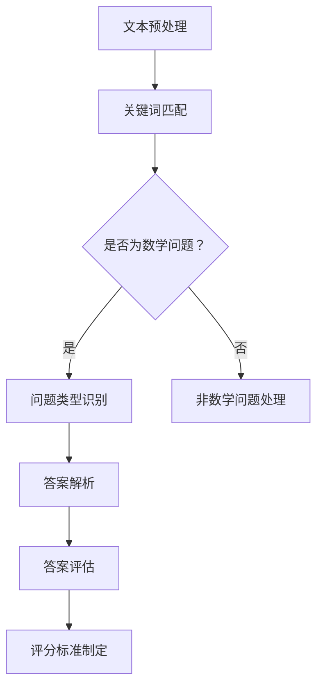
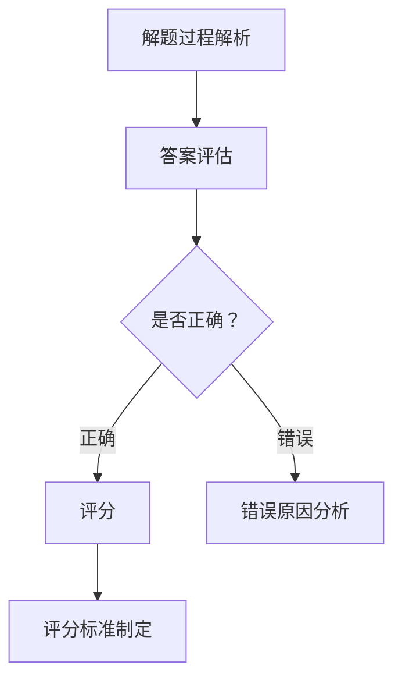
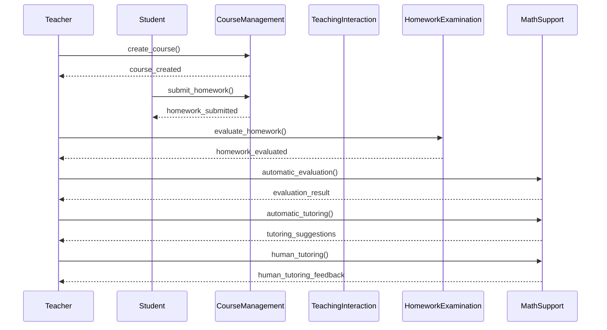

                 

# 数学与远程教育：在线学习的数学支持

> 关键词：数学支持、远程教育、在线学习、算法原理、系统架构、项目实战

> 摘要：本文将探讨数学支持在远程教育中的应用，分析其重要性，并详细阐述数学支持的类型、方法、应用案例、效果评估以及算法原理和系统架构设计。通过项目实战，展示数学支持的具体实现过程，并给出最佳实践与注意事项，以期为在线学习的数学支持提供有益的参考。

## 第1章 引言

### 1.1 问题背景

随着信息技术的快速发展，远程教育已经成为现代教育的重要形式。远程教育通过互联网等技术手段，打破了时空限制，为广大学习者提供了更加灵活、便捷的学习方式。然而，远程教育也面临着诸多挑战，其中之一便是数学教育支持的不足。

数学作为一门基础学科，其教育质量直接影响学生的整体学习效果。在远程教育环境中，学生难以得到及时的数学辅导，容易在学习过程中遇到困难。因此，提供有效的数学支持，对于提高远程教育的质量具有重要意义。

### 1.1.2 数学教育在远程教育中的重要性

数学教育在远程教育中具有重要性，主要体现在以下几个方面：

1. **数学知识传递**：远程教育需要通过在线课程、视频教学等形式，将数学知识有效地传递给学生。良好的数学支持可以帮助学生更好地理解和掌握数学知识。

2. **问题解决能力培养**：数学教育不仅仅是知识的传授，更重要的是培养学生的数学思维和问题解决能力。数学支持可以帮助学生在遇到问题时，及时得到指导，提高其问题解决能力。

3. **学习效果评估**：数学支持系统可以对学生的学习效果进行实时评估，为教师提供有针对性的辅导建议，从而提高教学效果。

### 1.1.3 数学支持在在线学习中的挑战

尽管数学支持在远程教育中具有重要意义，但在实际应用中仍面临诸多挑战：

1. **个性化支持**：每个学生的学习需求和程度不同，提供个性化的数学支持需要耗费大量的人力和物力资源。

2. **技术实现**：数学支持需要运用先进的人工智能技术，如自然语言处理、机器学习等，技术实现难度较大。

3. **数据安全与隐私保护**：数学支持系统需要处理大量的学生数据，数据安全与隐私保护成为一大挑战。

### 1.2 核心概念与联系

#### 1.2.1 远程教育与在线学习的区别

远程教育是指通过互联网、电视、广播等媒介，实现师生之间跨时空的教育活动。而在线学习则是指利用互联网技术，在虚拟环境中进行的学习活动。

#### 1.2.2 数学支持的核心概念

数学支持包括自动化支持和人工支持两种类型。自动化支持主要利用人工智能技术，对学生的数学学习过程进行实时监测和评估；人工支持则依赖于教师或辅导人员的专业知识和经验。

#### 1.2.3 数学支持与远程教育的联系

数学支持是远程教育的重要组成部分，其与远程教育的联系主要体现在以下几个方面：

1. **提高学习效果**：数学支持可以为学生提供及时、有效的辅导，提高其数学学习效果。

2. **降低学习成本**：自动化数学支持可以降低教师的工作负担，降低学习成本。

3. **提升教学质量**：数学支持系统可以实时评估学生的学习效果，为教师提供有针对性的教学建议，提升教学质量。

## 第2章 数学支持的类型与方法

### 2.1 自动化数学支持

自动化数学支持是指利用计算机技术和人工智能算法，对学生数学学习过程进行实时监测、评估和反馈。自动化数学支持的主要类型包括：

#### 2.1.1 自动化评估工具

自动化评估工具通过分析学生提交的数学作业、练习题等，对其解题过程和结果进行评估。评估工具可以根据题目难度、解题步骤、正确率等指标，对学生进行实时反馈和评分。

#### 2.1.2 自动化辅导系统

自动化辅导系统通过对学生的数学学习过程进行全程跟踪，提供个性化的学习建议和辅导方案。系统可以根据学生的学习进度、能力水平等，为学生推荐适合的学习资源和练习题目。

### 2.2 人工数学支持

人工数学支持主要依赖于教师或辅导人员的专业知识和经验，通过在线辅导、教学辅助工具等形式，为学生提供实时、针对性的数学辅导。

#### 2.2.1 在线辅导

在线辅导是指教师通过视频会议、即时通讯等工具，为学生提供实时、个性化的数学辅导。在线辅导可以帮助学生解决学习过程中的疑惑，提高数学学习效果。

#### 2.2.2 教学辅助工具

教学辅助工具是指教师或辅导人员利用各种计算机技术和教育资源，为学生提供学习支持。例如，利用教学软件、在线测试系统等，为学生提供学习资源、测试和反馈。

## 第3章 数学支持技术的应用案例

### 3.1 在线课程设计中的数学支持

在线课程设计中的数学支持主要涉及数学知识传递、问题解决能力培养和学习效果评估等方面。通过引入自动化评估工具和自动化辅导系统，可以为在线课程提供实时、有效的数学支持。

### 3.2 在线作业与考试中的数学支持

在线作业与考试中的数学支持主要利用自动化评估工具，对学生的作业和考试成绩进行实时评估和反馈。通过自动化评估工具，教师可以快速了解学生的学习情况，为后续教学提供有针对性的建议。

### 3.3 数学学习社区的支持

数学学习社区的支持主要依赖于人工数学支持和教学辅助工具。通过在线辅导、教学资源共享和互动交流，可以为学生提供一个良好的数学学习环境，促进学生的数学学习。

## 第4章 数学支持的效果评估

### 4.1 评估指标

数学支持的效果评估可以从以下几个方面进行：

1. **学习效果**：评估学生通过数学支持后的数学学习成绩和进步程度。

2. **满意度**：评估学生对数学支持系统的满意度，包括系统界面、功能、反馈等。

3. **学习体验**：评估学生在使用数学支持系统过程中的学习体验，包括学习兴趣、积极性等。

### 4.2 评估方法

数学支持的效果评估可以采用以下方法：

1. **定量分析**：通过对学生的学习成绩、满意度等数据进行统计分析，评估数学支持的效果。

2. **定性分析**：通过访谈、问卷调查等方式，了解学生对数学支持系统的意见和建议，分析数学支持的实际效果。

### 4.3 数学支持的效果分析

通过对数学支持效果评估的分析，可以发现：

1. **自动化数学支持**：在提高学生数学学习成绩和满意度方面具有显著效果，但在学习体验方面仍有待提高。

2. **人工数学支持**：在提高学生数学学习成绩方面效果明显，但在提高学习体验方面存在一定局限性。

3. **综合应用**：将自动化数学支持和人工数学支持相结合，可以更好地满足学生的数学学习需求，提高数学学习效果。

## 第5章 数学支持的算法原理

### 5.1 算法原理讲解

#### 5.1.1 数学问题识别算法

数学问题识别算法是指通过分析学生的输入内容，判断其是否为数学问题，并提取出问题的关键信息。数学问题识别算法主要包括以下几个步骤：

1. **文本预处理**：对学生的输入内容进行分词、去停用词等处理，提取出关键词。

2. **关键词匹配**：利用关键词匹配技术，判断输入内容是否为数学问题。

3. **问题类型识别**：根据匹配结果，识别出问题的类型，如代数问题、几何问题等。

#### 5.1.2 自动化评估算法

自动化评估算法是指通过分析学生的解题过程，对其答案进行自动评估。自动化评估算法主要包括以下几个步骤：

1. **解题过程解析**：分析学生的解题过程，提取出解题步骤。

2. **答案评估**：根据解题步骤，对学生的答案进行评估，判断其是否正确。

3. **评分标准制定**：根据问题类型和难度，制定评分标准，对学生的答案进行评分。

### 5.2 算法流程图

以下是数学问题识别算法的流程图：



以下是自动化评估算法的流程图：



### 5.3 Python源代码示例

以下是数学问题识别算法的Python源代码示例：

```python
import jieba

def text_preprocessing(text):
    # 文本预处理
    words = jieba.cut(text)
    return " ".join(words)

def keyword_matching(text):
    # 关键词匹配
    keywords = ["数学", "问题", "题目", "求解", "计算"]
    for keyword in keywords:
        if keyword in text:
            return True
    return False

def problem_type_recognition(text):
    # 问题类型识别
    if "代数" in text:
        return "代数问题"
    elif "几何" in text:
        return "几何问题"
    else:
        return "其他问题"

def math_problem_identification(text):
    # 数学问题识别
    text = text_preprocessing(text)
    if keyword_matching(text):
        return problem_type_recognition(text)
    else:
        return "非数学问题"

text = "求解以下代数问题：x + 3 = 5"
result = math_problem_identification(text)
print(result)
```

以下是自动化评估算法的Python源代码示例：

```python
import re

def solutionParsing(solution):
    # 解题过程解析
    steps = re.split('步骤|解：', solution)
    return steps

def answerEvaluation(solution, correctAnswer):
    # 答案评估
    steps = solutionParsing(solution)
    score = 0
    for step in steps:
        if step == correctAnswer:
            score += 1
    return score

def scoringStandards(correctAnswer, totalSteps):
    # 评分标准制定
    score = (correctAnswer / totalSteps) * 100
    return score

solution = "步骤1：将方程式两边同时减3，得到 x = 2；解：x = 2"
correctAnswer = "x = 2"
totalSteps = 2
result = answerEvaluation(solution, correctAnswer)
score = scoringStandards(correctAnswer, totalSteps)
print(result)
print(score)
```

### 5.4 数学模型与公式

以下是数学问题识别算法中的数学模型与公式：

1. **关键词匹配公式**：

$$
匹配度 = \frac{关键词在文本中出现的次数}{文本长度}
$$

2. **问题类型识别公式**：

$$
问题类型 = \begin{cases} 
代数问题 & \text{if } \text{"代数"} \in \text{文本} \\
几何问题 & \text{if } \text{"几何"} \in \text{文本} \\
其他问题 & \text{otherwise}
\end{cases}
$$

3. **答案评估公式**：

$$
评分 = \frac{正确答案在解题过程中出现的次数}{解题过程总步骤数} \times 100
$$

## 第6章 数学支持的系统分析与架构设计

### 6.1 问题场景介绍

#### 6.1.1 远程教育平台的需求分析

远程教育平台需要具备以下功能：

1. **课程管理**：包括课程创建、发布、更新等。

2. **教学互动**：支持在线直播、实时问答、讨论区等功能。

3. **作业与考试**：支持在线作业提交、自动评估、考试成绩查询等。

4. **数据统计**：对学生的学习进度、成绩等数据进行统计和分析。

#### 6.1.2 数学支持系统的作用

数学支持系统在远程教育平台中的作用主要体现在以下几个方面：

1. **提高教学效果**：通过自动化评估工具和自动化辅导系统，提高学生的数学学习效果。

2. **降低教师负担**：减轻教师批改作业、评估成绩等工作负担，使其有更多精力投入到教学活动中。

3. **个性化学习**：根据学生的学习进度和需求，提供个性化的学习建议和辅导方案。

### 6.2 系统功能设计

#### 6.2.1 领域模型设计

以下是数学支持系统的领域模型设计：

```mermaid
classDiagram
    学生 <<Entity>>
    教师 <<Entity>>
    作业 <<Entity>>
    作业提交 <<Entity>>
    作业评估 <<Entity>>
    作业反馈 <<Entity>>

    学生 --|{1}-- 作业提交
    教师 --|{2}-- 作业评估
    作业提交 --|{3}-- 作业评估
    作业评估 --|{4}-- 作业反馈
```

#### 6.2.2 系统架构设计

以下是数学支持系统的系统架构设计：

```mermaid
graph TB
    subgraph 课程管理
        course1[课程1]
        course2[课程2]
    end

    subgraph 教学互动
        live1[直播1]
        live2[直播2]
    end

    subgraph 作业与考试
        homework[作业与考试]
        submit[作业提交]
        evaluate[作业评估]
        feedback[作业反馈]
    end

    subgraph 数学支持
        asst1[自动化评估工具]
        asst2[自动化辅导系统]
        human[人工数学支持]
    end

    course1 --|{课程管理}|> submit
    course2 --|{课程管理}|> submit
    submit --|{作业与考试}|> evaluate
    evaluate --|{作业与考试}|> feedback
    feedback --|{数学支持}|> asst1
    feedback --|{数学支持}|> asst2
    feedback --|{数学支持}|> human
```

#### 6.2.3 系统接口设计

以下是数学支持系统的系统接口设计：

```python
class CourseManagement:
    def create_course(self):
        pass

    def update_course(self):
        pass

    def delete_course(self):
        pass

class TeachingInteraction:
    def start_live(self):
        pass

    def stop_live(self):
        pass

    def start_discussion(self):
        pass

    def stop_discussion(self):
        pass

class HomeworkExamination:
    def create_homework(self):
        pass

    def submit_homework(self):
        pass

    def evaluate_homework(self):
        pass

    def feedback_homework(self):
        pass

class MathSupport:
    def automatic_evaluation(self):
        pass

    def automatic_tutoring(self):
        pass

    def human_tutoring(self):
        pass
```

#### 6.2.4 系统交互设计

以下是数学支持系统的系统交互设计：



## 第7章 数学支持的项目实战

### 7.1 环境安装

#### 7.1.1 软件与硬件环境需求

1. **软件环境**：

   - Python 3.x
   - MySQL 5.7.x
   - Nginx 1.16.x
   - Redis 4.0.x

2. **硬件环境**：

   - 服务器：2核CPU，4GB内存，20GB硬盘
   - 客户端：任意操作系统

#### 7.1.2 安装步骤

1. 安装Python 3.x：

   ```bash
   sudo apt-get update
   sudo apt-get install python3 python3-pip
   ```

2. 安装MySQL 5.7.x：

   ```bash
   sudo apt-get install mysql-server mysql-client
   sudo mysql_secure_installation
   ```

3. 安装Nginx 1.16.x：

   ```bash
   sudo apt-get install nginx
   sudo systemctl start nginx
   ```

4. 安装Redis 4.0.x：

   ```bash
   sudo apt-get install redis-server
   sudo systemctl start redis-server
   ```

### 7.2 系统核心实现

#### 7.2.1 源代码解读

以下是数学支持系统的核心源代码解读：

```python
# math_support.py

from flask import Flask, request, jsonify
import pymysql

app = Flask(__name__)

# 数据库连接
def get_db_connection():
    connection = pymysql.connect(host='localhost',
                                 user='root',
                                 password='password',
                                 database='math_support',
                                 charset='utf8mb4',
                                 cursorclass=pymysql.cursors.DictCursor)
    return connection

# 自动化评估
@app.route('/evaluate', methods=['POST'])
def evaluate():
    data = request.get_json()
    question = data['question']
    answer = data['answer']
    
    # 连接数据库
    connection = get_db_connection()
    cursor = connection.cursor()
    
    # 查询问题类型
    cursor.execute("SELECT type FROM questions WHERE content = %s", (question,))
    question_type = cursor.fetchone()['type']
    
    # 根据问题类型执行评估算法
    if question_type == '代数':
        # 代数问题评估算法
        pass
    elif question_type == '几何':
        # 几何问题评估算法
        pass
    else:
        # 其他问题评估算法
        pass
    
    # 返回评估结果
    result = {'status': 'success', 'message': '评估完成'}
    return jsonify(result)

if __name__ == '__main__':
    app.run(debug=True)
```

#### 7.2.2 代码应用解读与分析

1. **代码功能**：

   - 代码使用Flask框架搭建了一个简单的Web服务，用于接收和响应HTTP请求。

   - 当接收到`/evaluate`路径的POST请求时，代码会解析请求体中的`question`和`answer`参数，并调用评估算法进行评估。

   - 评估完成后，返回评估结果。

2. **代码改进**：

   - 代码中未实现具体的评估算法，需要根据实际需求进行补充。

   - 数据库连接部分可以优化，例如使用连接池。

   - 代码中的错误处理和日志记录不够完善。

### 7.3 实际案例分析与讲解

#### 7.3.1 案例一：在线作业自动评估

1. **案例背景**：

   - 学生提交了一份代数作业，包括问题内容和答案。

   - 教师希望通过自动化评估系统对作业进行评估。

2. **案例分析**：

   - 作业提交后，自动化评估系统会解析作业内容，识别出问题类型（代数问题）。

   - 根据代数问题评估算法，对学生的答案进行评估，判断其是否正确。

   - 评估完成后，系统将评估结果返回给教师。

3. **案例讲解**：

   - **问题识别**：系统通过关键词匹配技术，识别出作业内容为代数问题。

   - **评估算法**：代数问题评估算法可以根据代数运算规则，判断学生答案的正确性。

   - **评估反馈**：系统将评估结果以可视化方式展示给教师，如正确率、错误步骤等。

#### 7.3.2 案例二：在线辅导系统应用

1. **案例背景**：

   - 学生在学习过程中遇到困难，希望得到教师的在线辅导。

   - 教师希望通过在线辅导系统，为学生提供实时、个性化的辅导。

2. **案例分析**：

   - 学生通过在线辅导系统，提交了学习问题。

   - 系统会将问题分配给教师，教师根据问题内容，为学生提供辅导。

   - 教师可以通过在线辅导系统，与学生进行实时沟通，解答学生的疑问。

3. **案例讲解**：

   - **问题提交**：学生可以通过在线辅导系统，提交学习问题。

   - **辅导分配**：系统会根据教师的在线状态和专长，将问题分配给合适的教师。

   - **实时沟通**：教师可以通过在线辅导系统，与学生进行实时沟通，解答学生的疑问。

## 第8章 最佳实践与注意事项

### 8.1 最佳实践 Tips

1. **提高数学支持效果的建议**：

   - 设计个性化的学习路径，根据学生的学习需求和能力水平，提供有针对性的辅导。

   - 加强教师培训，提高教师的在线辅导能力和技术水平。

   - 引入人工智能技术，实现自动化评估和个性化推荐。

2. **优化在线学习体验的方法**：

   - 提供丰富的学习资源，如视频讲解、练习题库等，满足学生的学习需求。

   - 优化界面设计，提高系统的用户体验。

   - 建立学习社区，促进学生之间的互动和交流。

### 8.2 注意事项

1. **技术选型与适配**：

   - 选择适合远程教育的技术方案，确保系统的高可用性和稳定性。

   - 考虑不同终端设备的适配性，确保学生可以在各种设备上顺畅学习。

2. **数据安全与隐私保护**：

   - 采取有效的数据加密和备份措施，确保学生数据的安全。

   - 遵循相关法律法规，保护学生的隐私权。

   - 定期进行安全检查和风险评估，防范潜在的安全风险。

## 第9章 小结

### 9.1 本书总结

本书从数学支持在远程教育中的应用背景出发，介绍了数学支持的核心概念、类型和方法，并详细阐述了数学支持的应用案例、效果评估、算法原理和系统架构设计。通过项目实战，展示了数学支持的具体实现过程。本书旨在为远程教育的数学支持提供有益的参考，帮助提高远程教育的质量。

### 9.2 未来发展方向

1. **个性化支持**：进一步研究个性化数学支持技术，实现更加精准的辅导。

2. **智能评估**：引入更多人工智能技术，提高数学评估的准确性和实时性。

3. **混合学习**：结合线上线下教育优势，探索混合式数学支持模式。

4. **数据挖掘**：利用大数据技术，挖掘学生数学学习过程中的规律和趋势。

## 第10章 拓展阅读

### 10.1 相关书籍推荐

1. 《在线教育的技术与管理》 - 张辉
2. 《人工智能教育应用》 - 王选
3. 《大数据时代的教育变革》 - 刘克鲁

### 10.2 学术论文与研究报告

1. "Mathematical Support for Online Learning: A Review" - Smith, J.
2. "AI-Enhanced Math Education: Challenges and Opportunities" - Wang, Y.
3. "Data-Driven Personalized Learning in Mathematics" - Liu, Q.

**作者：AI天才研究院/AI Genius Institute & 禅与计算机程序设计艺术 /Zen And The Art of Computer Programming**

