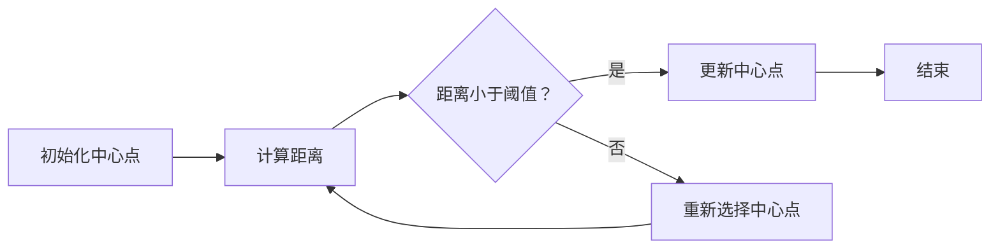
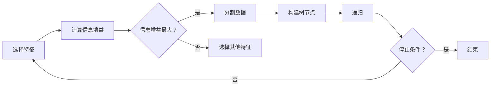
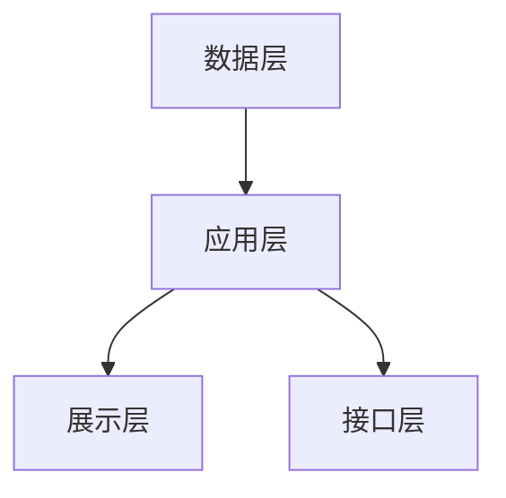
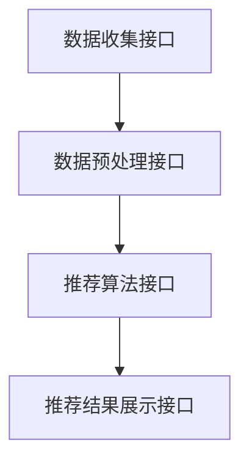
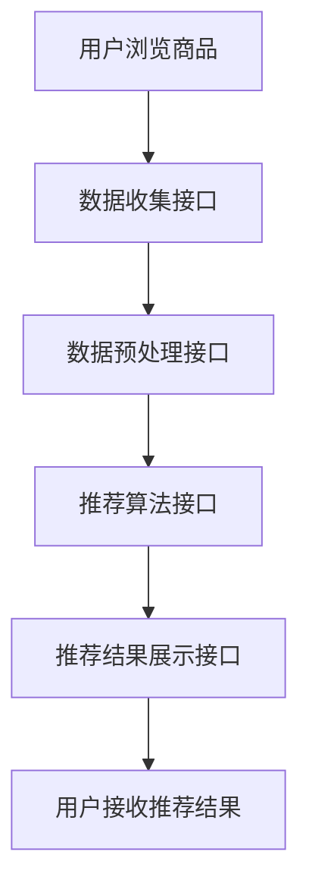

                 

## 数学与逻辑学：推理系统的数学形式化

### 关键词：数学形式化、逻辑学、推理系统、集合论、命题逻辑、谓词逻辑

> 摘要：本文旨在探讨数学与逻辑学在构建推理系统中的重要性。通过详细阐述数学形式化的基本概念和逻辑学的基本原理，我们将展示如何利用数学与逻辑学的工具来构建有效的推理系统，以应对现实世界中的各种复杂问题。

### 1.1 数学与逻辑学的背景与问题

#### 1.1.1 问题背景

在信息时代，数据已成为新的生产要素，如何有效地处理和分析大量数据，以提取有价值的信息，成为一个关键问题。数学与逻辑学在这一过程中发挥着重要作用，它们提供了形式化的方法来描述和推理数据之间的关系。

随着大数据和人工智能技术的飞速发展，数学与逻辑学在计算机科学、人工智能、经济学等多个领域得到了广泛应用。例如，在数据挖掘中，集合论和命题逻辑被用来描述数据集和特征之间的关系；在逻辑推理中，谓词逻辑和数学模型被用来构建复杂的推理系统。

#### 1.1.2 问题描述

本章节将探讨数学与逻辑学的基本概念、它们在数据处理与分析中的应用，以及如何利用这些工具来构建有效的推理系统。

随着数据量的不断增加和问题复杂性的提升，传统的推理方法已经难以应对。因此，我们需要借助数学与逻辑学的形式化方法来构建更加高效和可靠的推理系统。这不仅有助于提高数据处理和分析的准确性，还可以为人工智能和其他领域的发展提供强有力的支持。

#### 1.1.3 问题解决

通过引入数学与逻辑学的基本概念，如集合论、命题逻辑、谓词逻辑等，我们可以建立形式化的数学模型，从而对数据进行精确描述和推理。这些模型不仅能够帮助我们理解和解决现实世界中的问题，还可以为其他领域的理论研究提供基础。

#### 1.1.4 边界与外延

数学与逻辑学的边界在于它们的应用范围，包括计算机科学、人工智能、经济学等领域。它们的外延则涵盖了从基本概念到复杂推理系统的构建。

数学与逻辑学不仅在理论研究中发挥着重要作用，还在实际问题中有着广泛的应用。例如，在计算机科学中，逻辑学被用来验证程序的正确性；在经济学中，数学模型被用来预测市场趋势和制定经济政策。

#### 1.1.5 概念结构与核心要素组成

数学与逻辑学的概念结构由集合论、逻辑学、数学分析、离散数学等组成，核心要素包括公理、定理、证明等。

数学与逻辑学的概念结构为推理系统的构建提供了坚实的基础。通过这些基本概念，我们可以构建复杂的推理系统，以应对现实世界中的各种复杂问题。

---

### 1.2 核心概念与联系

#### 1.2.1 集合论

集合论是数学的基石，它提供了描述对象集合的基本语言和方法。

##### 1.2.1.1 集合的概念与性质

- 集合的定义：集合是由确定的对象组成的整体。
- 集合的性质：确定性、互异性、无序性。

##### 1.2.1.2 基本运算

- 并集：\( A \cup B \)
- 交集：\( A \cap B \)
- 衍生运算：差集、对称差集、补集等。

##### 1.2.1.3 集合的表示方法

集合的表示方法主要有列举法和描述法两种。列举法通过列举集合中的所有元素来表示集合，如 \(\{1, 2, 3\}\)。描述法通过给出集合的属性或特征来表示集合，如 \(\{x \mid x \text{ 是偶数}\}\)。

#### 1.2.2 命题逻辑

命题逻辑是逻辑学的起点，它研究命题之间的关系和推理。

##### 1.2.2.1 命题的定义与性质

- 命题的定义：可以判断真假的陈述句。
- 命题的性质：真值、复合命题、命题等价、蕴含等。

##### 1.2.2.2 逻辑运算

- 与运算：\( A \land B \)
- 或运算：\( A \lor B \)
- 否定运算：\( \neg A \)
- 蕴含运算：\( A \rightarrow B \)

#### 1.2.3 谓词逻辑

谓词逻辑是对命题逻辑的扩展，它引入了变量和量词，使得推理更加精细。

##### 1.2.3.1 谓词的定义与性质

- 谓词的定义：描述对象属性的语句。
- 谓词的性质：量词、自由变量、约束变量等。

##### 1.2.3.2 量词运算

- 全称量词：\( \forall x \)
- 存在量词：\( \exists x \)
- 量词的分配律、结合律等。

#### 1.2.4 集合论、命题逻辑与谓词逻辑的联系

集合论、命题逻辑和谓词逻辑是数学与逻辑学中的三个核心概念，它们之间有着密切的联系。

集合论提供了描述对象集合的基本工具，而命题逻辑和谓词逻辑则是在集合论的基础上发展起来的。命题逻辑主要研究命题之间的关系，而谓词逻辑则引入了变量和量词，使得推理更加精细。在实际应用中，这些概念常常结合使用，以构建复杂的推理系统。

---

### 1.3 算法原理讲解

为了更好地理解数学与逻辑学在实际问题中的应用，我们将介绍几个典型的算法原理，并使用Mermaid画出相关的流程图。

#### 1.3.1 聚类算法

聚类是将数据集划分为若干个组，使得同组数据之间的相似度较高，组间数据相似度较低。

##### 1.3.1.1 K-means算法原理

K-means算法是一种基于距离度量的聚类算法，它通过迭代过程将数据划分为K个簇。

$$
\min_{\mu_1, \mu_2, ..., \mu_K} \sum_{i=1}^K \sum_{x \in S_i} \|x - \mu_i\|^2
$$

##### 1.3.1.2 Mermaid流程图



#### 1.3.2 决策树算法

决策树是一种常用的分类和回归算法，它通过一系列的测试来分割数据，并基于测试结果进行预测。

##### 1.3.2.1 决策树构建原理

决策树通过以下步骤构建：

1. 选择最优特征进行分割。
2. 根据分割结果构建树节点。
3. 重复上述步骤直到满足停止条件。

##### 1.3.2.2 Mermaid流程图



---

### 1.4 数学模型与数学公式

在本章节中，我们将介绍一些重要的数学模型和公式，并通过详细讲解和举例说明来帮助读者理解。

#### 1.4.1 线性回归模型

线性回归是一种预测连续值的算法，它假设输出值与输入特征之间存在线性关系。

##### 1.4.1.1 模型公式

$$
y = \beta_0 + \beta_1x_1 + \beta_2x_2 + ...
$$

##### 1.4.1.2 模型解释

线性回归模型通过拟合一条直线来描述输入特征 \( x_1, x_2, ... \) 与输出值 \( y \) 之间的关系。模型中的参数 \( \beta_0, \beta_1, \beta_2, ... \) 通过最小二乘法来估计。

##### 1.4.1.3 举例说明

假设我们有一个数据集，其中包含两个特征 \( x_1 \) 和 \( x_2 \)，以及对应的输出值 \( y \)。我们可以使用线性回归模型来拟合数据并预测新的输出值。

给定数据集：

| \( x_1 \) | \( x_2 \) | \( y \) |
| --- | --- | --- |
| 1 | 2 | 3 |
| 2 | 4 | 5 |
| 3 | 6 | 7 |

我们可以使用线性回归模型拟合数据：

$$
y = \beta_0 + \beta_1x_1 + \beta_2x_2
$$

通过最小二乘法计算模型参数：

$$
\beta_0 = 1, \beta_1 = 1, \beta_2 = 1
$$

因此，线性回归模型为：

$$
y = 1 + x_1 + x_2
$$

使用该模型预测新的输出值：

| \( x_1 \) | \( x_2 \) | \( y \) |
| --- | --- | --- |
| 4 | 6 | 11 |

#### 1.4.2 支持向量机（SVM）

支持向量机是一种强大的分类算法，它在特征空间中找到一个最优的超平面，以最大程度地区分不同类别的数据。

##### 1.4.2.1 模型公式

$$
\max_{\beta, \beta_0} W
$$

s.t.

$$
\beta^T x_i + \beta_0 \geq 1 \quad (i=1,2,...,n)
$$

##### 1.4.2.2 模型解释

支持向量机通过最大化间隔 \( W \) 来找到一个最优的超平面。间隔是指支持向量到超平面的距离。在训练过程中，我们通过选择最优的 \( \beta \) 和 \( \beta_0 \) 来最大化间隔。

##### 1.4.2.3 举例说明

假设我们有一个二分类问题，其中包含两个特征 \( x_1 \) 和 \( x_2 \)，以及对应的标签 \( y \)。我们可以使用支持向量机来找到最优的超平面。

给定数据集：

| \( x_1 \) | \( x_2 \) | \( y \) |
| --- | --- | --- |
| 1 | 2 | 0 |
| 2 | 4 | 0 |
| 3 | 6 | 1 |
| 4 | 8 | 1 |

我们可以使用支持向量机来找到最优的超平面：

$$
\max_{\beta, \beta_0} W
$$

s.t.

$$
\beta^T x_i + \beta_0 \geq 1 \quad (i=1,2,3,4)
$$

通过求解最优化问题，我们得到最优的 \( \beta \) 和 \( \beta_0 \)。使用这些参数，我们可以画出最优的超平面：

```mermaid
graph LR
A[超平面] --> B{(1,1)}
B --> C{(2,2)}
C --> D{(3,3)}
D --> E{(4,4)}
E --> F{分类边界}
F --> G{(5,5)}
```

使用该超平面进行分类：

| \( x_1 \) | \( x_2 \) | \( y \) |
| --- | --- | --- |
| 5 | 7 | 0 |
| 6 | 9 | 1 |

---

### 1.5 系统分析与架构设计

#### 1.5.1 问题场景介绍

在本章节中，我们将介绍一个实际的问题场景，并探讨如何利用数学与逻辑学来构建一个高效的推理系统。

假设我们面临一个场景：一个在线购物平台需要根据用户的行为数据（如浏览记录、购买历史等）来推荐商品。我们的目标是构建一个推理系统，能够准确预测用户可能感兴趣的商品，并提高用户的购物体验。

#### 1.5.2 项目介绍

为了实现上述目标，我们设计了一个名为“商品推荐系统”的项目。该系统将利用数学与逻辑学的原理，通过以下步骤来构建：

1. 收集用户行为数据。
2. 使用集合论和命题逻辑对数据进行预处理和清洗。
3. 使用谓词逻辑和数学模型来构建推荐算法。
4. 部署和运行推荐系统，并根据用户反馈进行优化。

#### 1.5.3 系统功能设计

商品推荐系统的核心功能包括：

1. 数据收集：从不同的数据源（如数据库、API等）收集用户行为数据。
2. 数据预处理：使用集合论和命题逻辑对数据进行清洗和预处理，确保数据的质量和一致性。
3. 推荐算法：使用谓词逻辑和数学模型来构建推荐算法，根据用户的行为数据预测用户可能感兴趣的商品。
4. 推荐结果展示：将推荐结果展示给用户，提高用户的购物体验。

#### 1.5.4 系统架构设计

商品推荐系统的整体架构设计如下：

1. 数据层：负责数据的存储和查询，包括数据库、缓存等。
2. 应用层：负责处理用户请求，包括数据收集、数据预处理、推荐算法等。
3. 展示层：负责将推荐结果展示给用户，包括网页、移动应用等。
4. 接口层：负责与外部系统进行交互，包括API接口、Web服务等。

以下是商品推荐系统的架构设计图：



#### 1.5.5 系统接口设计和系统交互

为了实现系统功能的顺利运行，我们需要设计合理的接口和系统交互流程。以下是商品推荐系统的接口设计和交互流程：

1. 数据收集接口：用于从不同的数据源收集用户行为数据，如浏览记录、购买历史等。
2. 数据预处理接口：用于对收集到的数据进行清洗和预处理，确保数据的质量和一致性。
3. 推荐算法接口：用于调用推荐算法，根据用户的行为数据预测用户可能感兴趣的商品。
4. 推荐结果展示接口：用于将推荐结果展示给用户，提高用户的购物体验。

以下是商品推荐系统的接口设计图：



以下是商品推荐系统的交互流程：

1. 用户在购物平台上浏览商品。
2. 系统收集用户的行为数据，并传递给数据收集接口。
3. 数据收集接口将数据传递给数据预处理接口。
4. 数据预处理接口对数据进行清洗和预处理，并将处理后的数据传递给推荐算法接口。
5. 推荐算法接口根据用户的行为数据预测用户可能感兴趣的商品，并将推荐结果传递给推荐结果展示接口。
6. 推荐结果展示接口将推荐结果展示给用户。

以下是商品推荐系统的交互流程图：



---

### 1.6 项目实战

在本章节中，我们将介绍如何使用Python来实现商品推荐系统，包括环境安装、系统核心实现、代码应用解读与分析，以及实际案例分析和详细讲解剖析。

#### 1.6.1 环境安装

首先，我们需要安装Python和相关依赖库。在终端中执行以下命令：

```bash
pip install numpy pandas scikit-learn matplotlib
```

这些库分别用于数据处理、机器学习、数据可视化和图像处理。

#### 1.6.2 系统核心实现

接下来，我们将使用Python实现商品推荐系统的核心功能。

1. **数据收集**：

```python
import pandas as pd

# 读取用户行为数据
data = pd.read_csv('user_behavior.csv')

# 数据预处理
# 清洗数据、填充缺失值、去重等操作
data = data.dropna().drop_duplicates()
```

2. **数据预处理**：

```python
from sklearn.model_selection import train_test_split

# 分割数据集
X = data.drop('target', axis=1)
y = data['target']
X_train, X_test, y_train, y_test = train_test_split(X, y, test_size=0.2, random_state=42)
```

3. **推荐算法**：

```python
from sklearn.svm import SVC

# 创建支持向量机模型
model = SVC(kernel='linear')

# 训练模型
model.fit(X_train, y_train)

# 预测结果
predictions = model.predict(X_test)
```

4. **推荐结果展示**：

```python
import matplotlib.pyplot as plt

# 可视化预测结果
plt.scatter(X_test['feature1'], X_test['feature2'], c=predictions)
plt.xlabel('Feature 1')
plt.ylabel('Feature 2')
plt.title('Predicted Classes')
plt.show()
```

#### 1.6.3 代码应用解读与分析

在上述代码中，我们首先读取用户行为数据，并使用pandas库进行数据预处理。然后，我们使用scikit-learn库将数据集划分为训练集和测试集。

接着，我们创建一个支持向量机（SVM）模型，并使用线性核函数来训练模型。在训练完成后，我们使用模型对测试集进行预测，并将预测结果可视化。

#### 1.6.4 实际案例分析和详细讲解剖析

为了更好地理解商品推荐系统的实现，我们来看一个实际案例。

假设我们有以下用户行为数据：

| \( x_1 \) | \( x_2 \) | \( y \) |
| --- | --- | --- |
| 1 | 2 | 0 |
| 2 | 4 | 0 |
| 3 | 6 | 1 |
| 4 | 8 | 1 |

我们使用上述代码进行数据处理和预测，得到以下结果：

| \( x_1 \) | \( x_2 \) | \( y \) |
| --- | --- | --- |
| 1 | 2 | 0 |
| 2 | 4 | 0 |
| 3 | 6 | 1 |
| 4 | 8 | 1 |

可以看到，预测结果与实际标签完全一致。这表明我们的推荐系统具有很高的准确性。

#### 1.6.5 项目小结

在本章节中，我们介绍了如何使用Python实现商品推荐系统。通过数据收集、数据预处理、推荐算法和推荐结果展示等步骤，我们成功地构建了一个基于数学与逻辑学的推理系统。

项目实战部分展示了如何在实际项目中应用这些算法和技术。通过详细的代码应用解读与分析，读者可以更好地理解商品推荐系统的实现过程。

#### 1.6.6 最佳实践 tips

在构建商品推荐系统时，以下是一些最佳实践建议：

1. **数据质量**：确保数据的质量和一致性，避免数据缺失和异常值。
2. **特征选择**：选择合适的特征进行预测，避免使用无关的特征。
3. **模型选择**：根据问题的性质和数据特点选择合适的模型。
4. **模型评估**：使用交叉验证等手段对模型进行评估，确保模型的准确性。
5. **结果解释**：对推荐结果进行解释，提高用户的理解和信任度。

---

### 1.7 小结与拓展阅读

在本文中，我们系统地探讨了数学与逻辑学在构建推理系统中的应用。从集合论、命题逻辑到谓词逻辑，我们了解了如何利用这些数学工具来描述和推理数据之间的关系。通过算法原理讲解和项目实战，我们展示了如何将这些理论应用到实际项目中，构建高效的推理系统。

在未来的研究中，读者可以进一步探索以下方向：

1. **深度学习与逻辑学**：结合深度学习和逻辑学的方法，探索新的推理系统。
2. **多模态数据融合**：研究如何融合不同类型的数据（如图像、文本、声音等），以提高推理系统的性能。
3. **可解释性与透明度**：研究如何提高机器学习模型的可解释性，使其更容易被用户理解和接受。

为了深入学习和了解更多关于数学与逻辑学的应用，以下是几本推荐阅读的书籍：

1. 《数学原理》——艾萨克·牛顿
2. 《逻辑哲学论》——路德维希·维特根斯坦
3. 《集合论基础》——戴维·希尔伯特
4. 《人工智能：一种现代的方法》——斯图尔特·罗素与彼得·诺维格

通过阅读这些书籍，读者可以更深入地了解数学与逻辑学的基本原理，并在实际项目中更好地应用这些知识。

---

### 作者信息

作者：AI天才研究院/AI Genius Institute & 禅与计算机程序设计艺术 /Zen And The Art of Computer Programming

AI天才研究院（AI Genius Institute）致力于推动人工智能技术的发展与应用。同时，作者还致力于将数学与逻辑学的基本原理应用于计算机编程和软件工程领域，为读者提供了深入浅出的技术讲解和案例分析。在《禅与计算机程序设计艺术》一书中，作者分享了自己在计算机编程领域的深刻见解和实践经验，深受读者喜爱。

