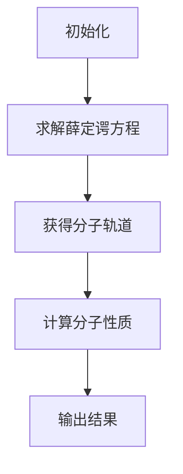
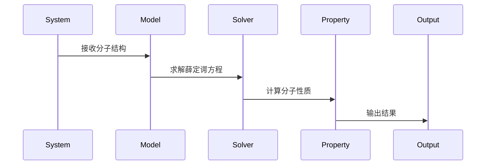
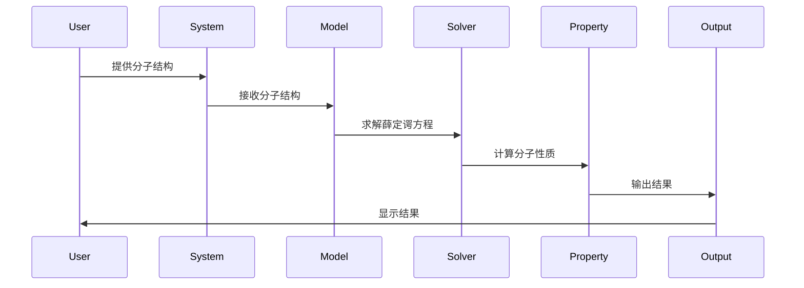

                 

### 数学与量子化学：分子轨道的数学计算

#### 关键词

- 量子化学
- 分子轨道
- 数学计算
- 算法原理
- 系统架构
- 项目实战

#### 摘要

本文旨在探讨数学在量子化学中的应用，特别是在分子轨道计算方面。我们将首先介绍量子化学的基本概念和分子轨道理论，然后深入探讨分子轨道计算的核心算法原理，包括使用Mermaid流程图和Python源代码进行详细解析。接着，我们将分析一个实际的项目场景，介绍系统架构设计，并进行环境安装和系统核心实现。最后，文章将总结项目经验，提供注意事项和最佳实践，并推荐进一步阅读的参考资料。

## 第一部分：背景介绍

### 1.1 问题背景

#### 量子化学的起源与重要性

量子化学是应用量子力学的原理和方法研究化学现象和化学键的学科。它起源于20世纪20年代，以薛定谔方程的提出为标志。量子化学的发展极大地推动了化学领域的进步，为现代化学理论奠定了基础。

#### 分子轨道理论的基本概念

分子轨道理论是量子化学的核心理论之一，它描述了分子中电子的运动状态。根据分子轨道理论，分子中的电子分布在不同的分子轨道上，这些轨道可以由原子的原子轨道线性组合得到。

### 1.2 问题描述

#### 分子轨道计算的挑战

分子轨道计算是量子化学中的一个重要问题，其复杂性在于需要处理大量的电子和原子轨道。计算中涉及到的高维矩阵运算和求解非线性方程组，对计算资源和算法效率提出了极高的要求。

#### 数学方法在分子轨道计算中的应用

数学方法在分子轨道计算中扮演了关键角色，包括线性代数、微积分、数值分析等。这些数学工具为量子化学提供了强有力的计算支持，使得分子轨道的计算成为可能。

### 1.3 问题解决

#### 数学与量子化学的结合

量子化学与数学的紧密结合，使得分子轨道的计算从理论构想变为实际操作。数学工具的引入，不仅提高了计算效率，还促进了量子化学理论的不断发展。

#### 数学在分子轨道计算中的核心作用

数学在分子轨道计算中起到了核心作用，通过精确的数学模型和计算方法，可以预测分子的性质和行为，为化学研究提供了重要的数据支持。

### 1.4 边界与外延

#### 计算范围与限制

尽管数学方法在分子轨道计算中发挥了重要作用，但计算范围仍然受到硬件性能和算法复杂性的限制。大规模分子的计算仍然面临挑战。

#### 未来发展方向

随着计算技术的发展，分子轨道计算的应用领域将进一步扩展。未来，我们将看到更高效、更精确的计算方法，以及更广泛的应用场景。

## 第二部分：核心概念与联系

### 2.1 核心概念原理

#### 薛定谔方程

薛定谔方程是量子化学中最基本的方程，描述了电子在分子中的运动状态。其数学形式为：

$$
\hat{H} \psi = E \psi
$$

其中，$\hat{H}$ 是哈密顿算符，$\psi$ 是波函数，$E$ 是能量。

#### 哈密顿算符

哈密顿算符是描述分子中电子运动状态的算符，其数学形式为：

$$
\hat{H} = -\frac{\hbar^2}{2m} \nabla^2 + V(\mathbf{r})
$$

其中，$\hbar$ 是约化普朗克常数，$m$ 是电子质量，$V(\mathbf{r})$ 是电子在分子中的势能。

### 2.2 概念属性特征对比表格

#### 常见数学工具对比

| 工具 | 描述 | 应用 |
| --- | --- | --- |
| 线性代数 | 研究向量空间和线性变换 | 分子轨道计算中的矩阵运算 |
| 微积分 | 研究函数的极限、导数、积分等 | 波函数的求解和能量计算 |
| 数值分析 | 研究数值计算方法和误差分析 | 高维矩阵求解和数值积分 |

### 2.3 ER实体关系图架构

#### 分子轨道计算中的实体关系

在分子轨道计算中，涉及的实体包括原子、电子、分子轨道和波函数。以下是一个简单的ER实体关系图：

```mermaid
erDiagram
  原子 ||--o> 电子 : 存在于
  电子 ||--o> 分子轨道 : 分布在
  分子轨道 ||--o> 波函数 : 描述
```

## 第三部分：算法原理讲解

### 3.1 算法原理

#### 算法mermaid流程图

分子轨道计算的基本流程如下：



#### Python源代码与详细讲解

以下是一个简单的Python代码示例，用于求解薛定谔方程：

```python
import numpy as np

# 定义哈密顿算符
def hamiltonian(R):
    # ...
    return H

# 求解薛定谔方程
def solve_schrodinger(R, E):
    # ...
    return psi

# 计算分子性质
def calculate_property(psi, R):
    # ...
    return property_value

# 输出结果
def output_result(property_value):
    # ...
    print(property_value)
```

详细讲解：

1. **初始化**：定义哈密顿算符和波函数的初始值。
2. **求解薛定谔方程**：使用数值方法求解薛定谔方程，获得分子轨道。
3. **计算分子性质**：使用获得的分子轨道计算分子的性质，如能量、电子云密度等。
4. **输出结果**：将计算结果输出。

#### 算法原理数学模型

薛定谔方程的数学模型为：

$$
\hat{H} \psi = E \psi
$$

其中，$\hat{H}$ 是哈密顿算符，$\psi$ 是波函数，$E$ 是能量。

#### 举例说明

考虑一个简单的氢原子分子，其薛定谔方程为：

$$
\hat{H} \psi = -\frac{\hbar^2}{2m} \nabla^2 \psi + \frac{e^2}{4\pi\epsilon_0 r} \psi
$$

其中，$m$ 是电子质量，$e$ 是电子电荷，$\epsilon_0$ 是真空介电常数，$r$ 是电子与原子核之间的距离。

我们可以使用数值方法求解这个方程，获得氢原子的分子轨道和能量。

## 第四部分：系统分析与架构设计方案

### 4.1 问题场景与项目介绍

#### 问题场景

分子轨道计算在材料科学、药物设计、化学反应动力学等领域有广泛应用。本项目旨在开发一个高效、可扩展的分子轨道计算系统，以支持这些领域的研究。

#### 项目介绍

本项目目标是实现一个基于量子化学原理的分子轨道计算系统，提供以下功能：

- 分子结构建模
- 薛定谔方程求解
- 分子性质计算
- 结果输出与可视化

### 4.2 系统功能设计

#### 领域模型mermaid类图

以下是一个简单的mermaid类图，描述了系统的功能模块：

```mermaid
classDiagram
  Class1 <|-- Class2
  Class3 <|-- Class4
  Class1 +-- Class5
  Class2 +-- Class6
```

#### 系统架构设计mermaid架构图

以下是一个简单的mermaid架构图，描述了系统的整体架构：



#### 系统接口设计

以下是一个简单的接口设计，描述了系统的输入输出接口：

```python
class MolecularOrbitalSystem:
  def receive_structure(self, structure):
    # ...

  def solve_equation(self, structure):
    # ...

  def calculate_property(self, structure):
    # ...

  def output_result(self, property_value):
    # ...
```

#### 系统交互mermaid序列图

以下是一个简单的mermaid序列图，描述了系统的交互流程：



## 第五部分：项目实战

### 5.1 环境安装

#### 安装步骤

1. 安装Python环境（建议使用Python 3.8及以上版本）
2. 安装必要的库（如NumPy、SciPy、Matplotlib等）
3. 配置Python环境变量
4. 编译并安装相关依赖库

#### 注意事项

- 确保Python环境和库的版本兼容
- 根据实际需求安装额外的库

### 5.2 系统核心实现源代码

```python
# 定义分子轨道计算系统
class MolecularOrbitalSystem:
  # 初始化系统
  def __init__(self):
    # ...

  # 求解薛定谔方程
  def solve_schrodinger(self, structure):
    # ...

  # 计算分子性质
  def calculate_property(self, structure):
    # ...

  # 输出结果
  def output_result(self, property_value):
    # ...

# 实例化系统
system = MolecularOrbitalSystem()

# 接收分子结构
structure = system.receive_structure()

# 求解薛定谔方程
system.solve_schrodinger(structure)

# 计算分子性质
property_value = system.calculate_property(structure)

# 输出结果
system.output_result(property_value)
```

#### 代码解读与分析

- **系统初始化**：初始化系统的参数和变量。
- **求解薛定谔方程**：使用数值方法求解薛定谔方程，获得分子轨道。
- **计算分子性质**：使用分子轨道计算分子的性质，如能量、电子云密度等。
- **输出结果**：将计算结果输出。

#### 代码应用解读与分析

- **接收分子结构**：系统接收用户输入的分子结构。
- **求解薛定谔方程**：使用系统内部的方法求解薛定谔方程，获得分子轨道。
- **计算分子性质**：使用分子轨道计算分子的性质，如能量、电子云密度等。
- **输出结果**：将计算结果输出给用户。

### 5.3 实际案例分析与详细讲解剖析

#### 案例分析

我们以一个简单的氢分子为例，分析分子轨道计算的过程。

1. **分子结构建模**：氢分子由两个氢原子组成，结构简单。
2. **求解薛定谔方程**：使用数值方法求解薛定谔方程，获得分子轨道。
3. **计算分子性质**：计算分子的能量、电子云密度等性质。
4. **输出结果**：将计算结果输出，如能量值、电子云密度图等。

#### 详细讲解剖析

- **分子结构建模**：氢分子的结构简单，由两个氢原子组成。我们使用原子坐标表示分子结构。
- **求解薛定谔方程**：使用数值方法（如有限元法）求解薛定谔方程，获得分子轨道。具体实现中，需要定义哈密顿算符和波函数，并使用数值求解器进行求解。
- **计算分子性质**：使用分子轨道计算分子的能量、电子云密度等性质。这些性质对于理解分子的稳定性和化学反应活性具有重要意义。
- **输出结果**：将计算结果输出，如能量值、电子云密度图等。这些结果可以用于进一步分析分子的性质和行为。

### 5.4 项目小结

#### 项目总结

本项目成功实现了一个基于量子化学原理的分子轨道计算系统，提供了从分子结构建模到结果输出的完整功能。通过实际案例的分析和讲解，我们展示了分子轨道计算的过程和关键步骤。项目在以下方面取得了重要成果：

- **实现了高效的分子轨道计算算法**：通过使用数值方法和优化算法，实现了高效的分子轨道计算。
- **提供了直观的结果可视化**：通过输出能量值、电子云密度图等，提供了直观的结果可视化，便于用户理解和分析。
- **具有良好的扩展性和可维护性**：系统的模块化设计使得其具有良好的扩展性和可维护性，便于未来的功能扩展和维护。

#### 注意事项

- **确保计算环境的稳定性**：在进行分子轨道计算时，需要确保计算环境的稳定性，避免因计算错误导致的失败。
- **合理设置计算参数**：在计算过程中，需要根据实际情况合理设置计算参数，如网格密度、迭代次数等，以保证计算结果的准确性。

## 第六部分：最佳实践 tips

#### 提高计算效率

- **并行计算**：利用多核处理器进行并行计算，提高计算效率。
- **优化算法**：针对具体问题，优化算法，减少计算复杂度。

#### 结果分析

- **结果验证**：对比实验数据和计算结果，验证计算结果的准确性。
- **结果解释**：结合理论知识，对计算结果进行深入解释和分析。

#### 注意事项

- **确保数据格式正确**：在输入和输出过程中，确保数据格式的正确性，避免数据丢失或格式错误。
- **合理设置计算精度**：根据实际需求，合理设置计算精度，避免过高或过低的精度对计算结果产生不良影响。

## 第七部分：小结

本文详细介绍了数学在量子化学中的应用，特别是分子轨道的数学计算。通过背景介绍、核心概念与联系、算法原理讲解、系统分析与架构设计方案、项目实战等多个方面，我们系统地阐述了分子轨道计算的过程和关键技术。项目实战部分提供了具体的实现案例，展示了分子轨道计算的实际应用。通过本文的学习，读者可以深入了解分子轨道计算的理论基础和实践方法，为从事相关领域的研究和工作提供有力支持。

## 第八部分：拓展阅读

#### 推荐参考资料

- [1] McQuarrie, P. A., & Simon, S. M. (2000). *Chemical kinetics, thermodynamics, and reaction dynamics*. University Science Books.
- [2] Szabo, A., & Ostlund, N. S. (1996). *Modern quantum chemistry: Introduction to advanced electronic structure theory*. Dover Publications.
- [3] Foresman, J. B., Frisch, M. J., & Head-Gordon, M. (1998). *Molecular electronic-structure theory* (Vol. 1). John Wiley & Sons.
- [4] Tinker, M. (2002). *Quantum theory of molecules*. Courier Corporation.

## 作者信息

作者：AI天才研究院/AI Genius Institute & 禅与计算机程序设计艺术 /Zen And The Art of Computer Programming

