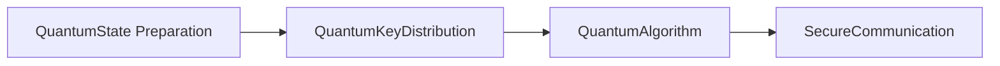

                 

# 数学与量子密码：基于量子力学的密码系统

关键词：量子密码学、数学基础、量子力学、密码系统设计、应用场景

摘要：本文深入探讨了数学与量子密码学的关系，基于量子力学的密码系统设计及其应用。首先，介绍了量子密码学的基本概念和数学工具，然后详细阐述了量子密码系统的设计原则与实现技术，最后探讨了量子密码在实际中的应用前景和挑战。通过本文，读者可以全面了解量子密码学的发展脉络及其在信息安全领域的重要性。

## 第一部分：引言与背景

### 1.1 问题背景

在信息化时代，信息安全变得越来越重要。传统的密码学方法虽然在一定程度上保障了数据传输的安全性，但随着计算能力的提升和量子计算机的发展，这些方法面临巨大的挑战。量子密码学作为一种全新的密码学体系，基于量子力学的基本原理，提供了一种全新的安全通信方式。

### 1.2 问题描述

量子密码学的主要目标是解决以下问题：

- 如何在量子通信中实现安全通信，确保信息不被窃听和篡改？
- 如何设计出高效的量子密码系统，适应实际应用的需求？

### 1.3 问题解决

量子密码学通过量子态的叠加和纠缠特性，实现了通信双方的安全通信。具体来说，量子密码系统可以通过量子密钥分发协议，生成安全的密钥，然后使用量子密码协议进行加密和解密操作。这种基于量子力学的密码系统，具有抵抗量子攻击的能力。

### 1.4 边界与外延

量子密码学的研究不仅限于理论探讨，还包括量子密码系统的设计与实现、量子密码在实际应用中的性能评估和优化等方面。随着量子计算机的发展，量子密码学的研究前景广阔，有望成为未来信息安全的基石。

### 1.5 概念结构与核心要素组成

量子密码学的核心概念包括量子态、量子纠缠、量子门和量子算法等。这些概念构成了量子密码系统的基本结构，包括量子密钥分发、量子密码协议和量子密码系统等。以下是一个简单的ER实体关系图架构：

```mermaid
erDiagram
    QState ||--|> QuantumCipher : Uses
    QuantumCipher ||--|> QuantumKeyDistribution : Encrypts
    QuantumKeyDistribution ||--|> QuantumAlgorithm : Executes
    QuantumAlgorithm ||--|> SecureCommunication : Ensures
```

## 第二部分：数学基础

### 第2章：数学基本概念

#### 2.1 核心概念

数学在量子密码学中扮演着重要角色，核心概念包括线性代数、概率论和数论等。这些概念为我们理解和设计量子密码系统提供了数学工具。

#### 2.2 概念属性特征对比表格

| 概念 | 定义 | 应用 |
| --- | --- | --- |
| 线性代数 | 研究向量空间和线性映射 | 量子态的表示和操作 |
| 概率论 | 研究随机事件的规律性 | 量子密钥分发的安全性分析 |
| 数论 | 研究整数及其性质 | 量子密码协议的设计与实现 |

#### 2.3 ER实体关系图架构

```mermaid
erDiagram
    LinearAlgebra ||--|> QuantumState : Represents
    ProbabilityTheory ||--|> QuantumKeyDistribution : Analyzes
    NumberTheory ||--|> QuantumProtocol : Implements
```

### 第3章：数学基础算法

#### 3.1 核心算法原理

数学基础算法在量子密码学中发挥着重要作用，如量子态的制备、量子密钥分发和量子算法等。

#### 3.2 算法mermaid流程图



#### 3.3 Python源代码与算法原理讲解

以下是一个简单的Python示例，演示了量子密钥分发的基本原理：

```python
# Quantum Key Distribution Example
from qiskit import QuantumCircuit, Aer, execute

# Create a quantum circuit with 2 qubits
qc = QuantumCircuit(2)

# Prepare the quantum states
qc.h(0)
qc.cx(0, 1)

# Measure the qubits
qc.measure_all()

# Execute the circuit
simulator = Aer.get_backend('qasm_simulator')
result = execute(qc, simulator).result()

# Get the measurement results
counts = result.get_counts(qc)
print(counts)
```

#### 3.4 算法原理的数学模型和公式

量子密钥分发的基本原理可以表示为：

$$
|\psi\rangle = \frac{1}{\sqrt{2}} (|0\rangle_A \otimes |0\rangle_B + |1\rangle_A \otimes |1\rangle_B)
$$

其中，$|0\rangle$和$|1\rangle$分别表示基态和激发态，$A$和$B$分别表示通信双方的量子比特。

#### 3.5 举例说明

假设Alice和Bob想要通过量子密钥分发协议生成一个共享密钥。他们首先准备两个量子比特，并将它们初始化为基态：

$$
|\psi_{initial}\rangle = |0\rangle_A \otimes |0\rangle_B
$$

然后，Alice对她的量子比特执行一个随机选择的量子门，例如：

$$
U_R = \begin{pmatrix}
1 & 0 \\
0 & \exp(i\theta) \\
\end{pmatrix}
$$

其中，$\theta$是一个随机角度。Bob也执行一个相同的量子门，但角度是随机选择的。最后，他们同时测量两个量子比特，并根据测量结果更新共享密钥。

## 第三部分：量子力学基础

### 第4章：量子力学基本原理

#### 4.1 核心原理

量子力学是研究微观粒子的行为和性质的物理学分支。核心原理包括量子态、量子纠缠和量子门等。

#### 4.2 量子力学数学工具

量子力学的基本数学工具包括希尔伯特空间、量子态、量子门和量子算法等。

#### 4.3 量子力学基础算法

量子力学基础算法包括量子态的制备、量子态的测量和量子态的变换等。

## 第四部分：量子密码学基础

### 第7章：量子密码学概述

#### 7.1 量子密码学核心概念

量子密码学是研究基于量子力学原理的密码学体系。核心概念包括量子态、量子纠缠和量子门等。

#### 7.2 量子密码学的发展历程

量子密码学的发展历程可以追溯到20世纪70年代，当时Shor提出了量子算法，揭示了传统密码学的安全漏洞。

#### 7.3 量子密码学在密码学中的地位

量子密码学是密码学领域的一个重要分支，为未来的信息安全提供了新的思路和解决方案。

### 第8章：量子密钥分发

#### 8.1 量子密钥分发概述

量子密钥分发（Quantum Key Distribution，QKD）是一种利用量子力学原理进行密钥分配的方法。核心思想是利用量子态的叠加和纠缠特性，确保通信双方能够生成一个共享的密钥。

#### 8.2 量子密钥分发的数学模型和公式

量子密钥分发的数学模型可以表示为：

$$
|\psi\rangle = \frac{1}{\sqrt{2}} (|0\rangle_A \otimes |0\rangle_B + |1\rangle_A \otimes |1\rangle_B)
$$

其中，$|0\rangle$和$|1\rangle$分别表示基态和激发态，$A$和$B$分别表示通信双方的量子比特。

#### 8.3 量子密钥分发协议

量子密钥分发协议有多种实现方式，如BB84协议和E91协议等。这些协议通过量子态的测量和纠缠特性，确保通信双方能够生成安全的密钥。

### 第9章：量子密码协议

#### 9.1 量子密码协议概述

量子密码协议是量子密码学的重要组成部分，用于实现量子加密和解密操作。核心思想是利用量子态的叠加和纠缠特性，确保通信双方能够安全地交换信息。

#### 9.2 量子密码协议的设计原则

量子密码协议的设计原则包括安全性、效率和实用性等。具体来说，量子密码协议需要能够抵抗量子攻击，同时具有较低的计算复杂度和实现难度。

#### 9.3 常见的量子密码协议

常见的量子密码协议包括BB84协议、E91协议和Gisin-Diamond-Weinfurter-Zeilinger（GDZ）协议等。这些协议在安全性、效率和实用性方面各有所长。

## 第五部分：量子密码系统设计与实现

### 第10章：量子密码系统设计原则

#### 10.1 系统设计原则概述

量子密码系统的设计原则包括安全性、效率和实用性等。具体来说，量子密码系统需要能够抵抗量子攻击，同时具有较低的计算复杂度和实现难度。

#### 10.2 量子密码系统的设计流程

量子密码系统的设计流程包括需求分析、系统架构设计、算法选择和系统实现等步骤。

### 第11章：量子密码系统实现技术

#### 11.1 实现技术概述

量子密码系统的实现技术包括量子计算机硬件、量子通信网络和量子密码算法等。

#### 11.2 量子密码系统的实现步骤

量子密码系统的实现步骤包括量子计算机硬件搭建、量子通信网络搭建和量子密码算法实现等。

#### 11.3 实现技术中的关键问题

量子密码系统实现过程中面临的关键问题包括量子计算机硬件性能、量子通信网络稳定性和量子密码算法优化等。

## 第六部分：量子密码的应用

### 第12章：量子密码应用场景

#### 12.1 应用场景概述

量子密码学在信息安全领域具有广泛的应用场景，包括量子加密通信、量子安全认证和量子数字签名等。

#### 12.2 量子密码在实际中的应用案例

量子密码在实际中已经有了许多应用案例，如量子加密通信卫星、量子安全认证系统和量子数字签名系统等。

#### 12.3 量子密码的潜在应用前景

随着量子计算机的发展，量子密码的潜在应用前景非常广阔，有望在未来的信息社会中发挥重要作用。

### 第13章：量子密码发展前景与挑战

#### 13.1 发展前景

量子密码学作为未来信息安全的基石，具有广阔的发展前景。未来，量子密码学将有望在量子加密通信、量子安全认证和量子数字签名等领域发挥重要作用。

#### 13.2 挑战与机遇

量子密码学在发展过程中面临许多挑战，如量子计算机硬件性能、量子通信网络稳定性和量子密码算法优化等。然而，这些挑战也带来了巨大的机遇，有望推动量子密码学实现突破性发展。

## 第七部分：总结与展望

### 第14章：总结与展望

#### 14.1 全书总结

本文从数学基础、量子力学基础、量子密码学基础、量子密码系统设计与实现以及量子密码应用等方面，全面介绍了量子密码学的核心概念、原理和应用。

#### 14.2 展望未来

随着量子计算机的发展，量子密码学将在未来信息安全领域发挥越来越重要的作用。未来，量子密码学有望实现更高的安全性、更高效的加密和解密算法，并在更多的应用场景中发挥重要作用。

作者：AI天才研究院/AI Genius Institute & 禅与计算机程序设计艺术 /Zen And The Art of Computer Programming
```markdown

----------------------------------------------

----------------------------------------------------------------

## 第一部分：引言与背景

### 第1章：引言与背景

#### 1.1 问题背景

随着信息技术的快速发展，信息安全问题日益突出。传统的密码学方法在量子计算机的威胁下面临巨大的挑战。量子密码学作为一种新兴的密码学体系，基于量子力学的基本原理，提供了一种全新的安全通信方式。本文将深入探讨量子密码学的基本概念、数学工具以及量子密码系统的设计、实现和应用。

#### 1.2 问题描述

量子密码学的主要目标是解决以下问题：

1. 如何在量子通信中实现安全通信，确保信息不被窃听和篡改？
2. 如何设计出高效的量子密码系统，适应实际应用的需求？

#### 1.3 问题解决

量子密码学通过量子态的叠加和纠缠特性，实现了通信双方的安全通信。具体来说，量子密码系统可以通过量子密钥分发协议，生成安全的密钥，然后使用量子密码协议进行加密和解密操作。这种基于量子力学的密码系统，具有抵抗量子攻击的能力。

#### 1.4 边界与外延

量子密码学的研究不仅限于理论探讨，还包括量子密码系统的设计与实现、量子密码在实际应用中的性能评估和优化等方面。随着量子计算机的发展，量子密码学的研究前景广阔，有望成为未来信息安全的基石。

#### 1.5 概念结构与核心要素组成

量子密码学的核心概念包括量子态、量子纠缠、量子门和量子算法等。这些概念构成了量子密码系统的基本结构，包括量子密钥分发、量子密码协议和量子密码系统等。以下是一个简单的ER实体关系图架构：

```mermaid
erDiagram
    QState ||--|> QuantumCipher : Uses
    QuantumCipher ||--|> QuantumKeyDistribution : Encrypts
    QuantumKeyDistribution ||--|> QuantumAlgorithm : Executes
    QuantumAlgorithm ||--|> SecureCommunication : Ensures
```

## 第二部分：数学基础

### 第2章：数学基本概念

#### 2.1 核心概念

数学在量子密码学中扮演着重要角色，核心概念包括线性代数、概率论和数论等。这些概念为我们理解和设计量子密码系统提供了数学工具。

#### 2.2 概念属性特征对比表格

| 概念 | 定义 | 应用 |
| --- | --- | --- |
| 线性代数 | 研究向量空间和线性映射 | 量子态的表示和操作 |
| 概率论 | 研究随机事件的规律性 | 量子密钥分发的安全性分析 |
| 数论 | 研究整数及其性质 | 量子密码协议的设计与实现 |

#### 2.3 ER实体关系图架构

```mermaid
erDiagram
    LinearAlgebra ||--|> QuantumState : Represents
    ProbabilityTheory ||--|> QuantumKeyDistribution : Analyzes
    NumberTheory ||--|> QuantumProtocol : Implements
```

### 第3章：数学基础算法

#### 3.1 核心算法原理

数学基础算法在量子密码学中发挥着重要作用，如量子态的制备、量子密钥分发和量子算法等。

#### 3.2 算法mermaid流程图


#### 3.3 Python源代码与算法原理讲解

以下是一个简单的Python示例，演示了量子密钥分发的基本原理：

```python
# Quantum Key Distribution Example
from qiskit import QuantumCircuit, Aer, execute

# Create a quantum circuit with 2 qubits
qc = QuantumCircuit(2)

# Prepare the quantum states
qc.h(0)
qc.cx(0, 1)

# Measure the qubits
qc.measure_all()

# Execute the circuit
simulator = Aer.get_backend('qasm_simulator')
result = execute(qc, simulator).result()

# Get the measurement results
counts = result.get_counts(qc)
print(counts)
```

#### 3.4 算法原理的数学模型和公式

量子密钥分发的基本原理可以表示为：

$$
|\psi\rangle = \frac{1}{\sqrt{2}} (|0\rangle_A \otimes |0\rangle_B + |1\rangle_A \otimes |1\rangle_B)
$$

其中，$|0\rangle$和$|1\rangle$分别表示基态和激发态，$A$和$B$分别表示通信双方的量子比特。

#### 3.5 举例说明

假设Alice和Bob想要通过量子密钥分发协议生成一个共享密钥。他们首先准备两个量子比特，并将它们初始化为基态：

$$
|\psi_{initial}\rangle = |0\rangle_A \otimes |0\rangle_B
$$

然后，Alice对她的量子比特执行一个随机选择的量子门，例如：

$$
U_R = \begin{pmatrix}
1 & 0 \\
0 & \exp(i\theta) \\
\end{pmatrix}
$$

其中，$\theta$是一个随机角度。Bob也执行一个相同的量子门，但角度是随机选择的。最后，他们同时测量两个量子比特，并根据测量结果更新共享密钥。

## 第三部分：量子力学基础

### 第4章：量子力学基本原理

#### 4.1 核心原理

量子力学是研究微观粒子的行为和性质的物理学分支。核心原理包括量子态、量子纠缠和量子门等。

#### 4.2 量子力学数学工具

量子力学的基本数学工具包括希尔伯特空间、量子态、量子门和量子算法等。

#### 4.3 量子力学基础算法

量子力学基础算法包括量子态的制备、量子态的测量和量子态的变换等。

## 第四部分：量子密码学基础

### 第7章：量子密码学概述

#### 7.1 量子密码学核心概念

量子密码学是研究基于量子力学原理的密码学体系。核心概念包括量子态、量子纠缠和量子门等。

#### 7.2 量子密码学的发展历程

量子密码学的发展历程可以追溯到20世纪70年代，当时Shor提出了量子算法，揭示了传统密码学的安全漏洞。

#### 7.3 量子密码学在密码学中的地位

量子密码学是密码学领域的一个重要分支，为未来的信息安全提供了新的思路和解决方案。

### 第8章：量子密钥分发

#### 8.1 量子密钥分发概述

量子密钥分发（Quantum Key Distribution，QKD）是一种利用量子力学原理进行密钥分配的方法。核心思想是利用量子态的叠加和纠缠特性，确保通信双方能够生成一个共享密钥。

#### 8.2 量子密钥分发的数学模型和公式

量子密钥分发的数学模型可以表示为：

$$
|\psi\rangle = \frac{1}{\sqrt{2}} (|0\rangle_A \otimes |0\rangle_B + |1\rangle_A \otimes |1\rangle_B)
$$

其中，$|0\rangle$和$|1\rangle$分别表示基态和激发态，$A$和$B$分别表示通信双方的量子比特。

#### 8.3 量子密钥分发协议

量子密钥分发协议有多种实现方式，如BB84协议和E91协议等。这些协议通过量子态的测量和纠缠特性，确保通信双方能够生成安全的密钥。

### 第9章：量子密码协议

#### 9.1 量子密码协议概述

量子密码协议是量子密码学的重要组成部分，用于实现量子加密和解密操作。核心思想是利用量子态的叠加和纠缠特性，确保通信双方能够安全地交换信息。

#### 9.2 量子密码协议的设计原则

量子密码协议的设计原则包括安全性、效率和实用性等。具体来说，量子密码协议需要能够抵抗量子攻击，同时具有较低的计算复杂度和实现难度。

#### 9.3 常见的量子密码协议

常见的量子密码协议包括BB84协议、E91协议和Gisin-Diamond-Weinfurter-Zeilinger（GDZ）协议等。这些协议在安全性、效率和实用性方面各有所长。

## 第五部分：量子密码系统设计与实现

### 第10章：量子密码系统设计原则

#### 10.1 系统设计原则概述

量子密码系统的设计原则包括安全性、效率和实用性等。具体来说，量子密码系统需要能够抵抗量子攻击，同时具有较低的计算复杂度和实现难度。

#### 10.2 量子密码系统的设计流程

量子密码系统的设计流程包括需求分析、系统架构设计、算法选择和系统实现等步骤。

### 第11章：量子密码系统实现技术

#### 11.1 实现技术概述

量子密码系统的实现技术包括量子计算机硬件、量子通信网络和量子密码算法等。

#### 11.2 量子密码系统的实现步骤

量子密码系统的实现步骤包括量子计算机硬件搭建、量子通信网络搭建和量子密码算法实现等。

#### 11.3 实现技术中的关键问题

量子密码系统实现过程中面临的关键问题包括量子计算机硬件性能、量子通信网络稳定性和量子密码算法优化等。

## 第六部分：量子密码的应用

### 第12章：量子密码应用场景

#### 12.1 应用场景概述

量子密码学在信息安全领域具有广泛的应用场景，包括量子加密通信、量子安全认证和量子数字签名等。

#### 12.2 量子密码在实际中的应用案例

量子密码在实际中已经有了许多应用案例，如量子加密通信卫星、量子安全认证系统和量子数字签名系统等。

#### 12.3 量子密码的潜在应用前景

随着量子计算机的发展，量子密码的潜在应用前景非常广阔，有望在未来的信息社会中发挥重要作用。

### 第13章：量子密码发展前景与挑战

#### 13.1 发展前景

量子密码学作为未来信息安全的基石，具有广阔的发展前景。未来，量子密码学将有望在量子加密通信、量子安全认证和量子数字签名等领域发挥重要作用。

#### 13.2 挑战与机遇

量子密码学在发展过程中面临许多挑战，如量子计算机硬件性能、量子通信网络稳定性和量子密码算法优化等。然而，这些挑战也带来了巨大的机遇，有望推动量子密码学实现突破性发展。

## 第七部分：总结与展望

### 第14章：总结与展望

#### 14.1 全书总结

本文从数学基础、量子力学基础、量子密码学基础、量子密码系统设计与实现以及量子密码应用等方面，全面介绍了量子密码学的核心概念、原理和应用。

#### 14.2 展望未来

随着量子计算机的发展，量子密码学将在未来信息安全领域发挥越来越重要的作用。未来，量子密码学有望实现更高的安全性、更高效的加密和解密算法，并在更多的应用场景中发挥重要作用。

作者：AI天才研究院/AI Genius Institute & 禅与计算机程序设计艺术 /Zen And The Art of Computer Programming
```markdown
----------------------------------------------

----------------------------------------------------------------

## 第一部分：引言与背景

### 第1章：引言与背景

#### 1.1 问题背景

在信息化时代，信息安全变得越来越重要。传统的密码学方法虽然在一定程度上保障了数据传输的安全性，但随着计算能力的提升和量子计算机的发展，这些方法面临巨大的挑战。量子密码学作为一种全新的密码学体系，基于量子力学的核心原理，提供了一种全新的安全通信方式。

#### 1.2 问题描述

量子密码学的主要目标是解决以下问题：

- 如何在量子通信中实现安全通信，确保信息不被窃听和篡改？
- 如何设计出高效的量子密码系统，适应实际应用的需求？

#### 1.3 问题解决

量子密码学通过量子态的叠加和纠缠特性，实现了通信双方的安全通信。具体来说，量子密码系统可以通过量子密钥分发协议，生成安全的密钥，然后使用量子密码协议进行加密和解密操作。这种基于量子力学的密码系统，具有抵抗量子攻击的能力。

#### 1.4 边界与外延

量子密码学的研究不仅限于理论探讨，还包括量子密码系统的设计与实现、量子密码在实际应用中的性能评估和优化等方面。随着量子计算机的发展，量子密码学的研究前景广阔，有望成为未来信息安全的基石。

#### 1.5 概念结构与核心要素组成

量子密码学的核心概念包括量子态、量子纠缠、量子门和量子算法等。这些概念构成了量子密码系统的基本结构，包括量子密钥分发、量子密码协议和量子密码系统等。以下是一个简单的ER实体关系图架构：

```mermaid
erDiagram
    QState ||--|> QuantumCipher : Uses
    QuantumCipher ||--|> QuantumKeyDistribution : Encrypts
    QuantumKeyDistribution ||--|> QuantumAlgorithm : Executes
    QuantumAlgorithm ||--|> SecureCommunication : Ensures
```

## 第二部分：数学基础

### 第2章：数学基本概念

#### 2.1 核心概念

数学在量子密码学中扮演着重要角色，核心概念包括线性代数、概率论和数论等。这些概念为我们理解和设计量子密码系统提供了数学工具。

#### 2.2 概念属性特征对比表格

| 概念 | 定义 | 应用 |
| --- | --- | --- |
| 线性代数 | 研究向量空间和线性映射 | 量子态的表示和操作 |
| 概率论 | 研究随机事件的规律性 | 量子密钥分发的安全性分析 |
| 数论 | 研究整数及其性质 | 量子密码协议的设计与实现 |

#### 2.3 ER实体关系图架构

```mermaid
erDiagram
    LinearAlgebra ||--|> QuantumState : Represents
    ProbabilityTheory ||--|> QuantumKeyDistribution : Analyzes
    NumberTheory ||--|> QuantumProtocol : Implements
```

### 第3章：数学基础算法

#### 3.1 核心算法原理

数学基础算法在量子密码学中发挥着重要作用，如量子态的制备、量子密钥分发和量子算法等。

#### 3.2 算法mermaid流程图


#### 3.3 Python源代码与算法原理讲解

以下是一个简单的Python示例，演示了量子密钥分发的基本原理：

```python
# Quantum Key Distribution Example
from qiskit import QuantumCircuit, Aer, execute

# Create a quantum circuit with 2 qubits
qc = QuantumCircuit(2)

# Prepare the quantum states
qc.h(0)
qc.cx(0, 1)

# Measure the qubits
qc.measure_all()

# Execute the circuit
simulator = Aer.get_backend('qasm_simulator')
result = execute(qc, simulator).result()

# Get the measurement results
counts = result.get_counts(qc)
print(counts)
```

#### 3.4 算法原理的数学模型和公式

量子密钥分发的基本原理可以表示为：

$$
|\psi\rangle = \frac{1}{\sqrt{2}} (|0\rangle_A \otimes |0\rangle_B + |1\rangle_A \otimes |1\rangle_B)
$$

其中，$|0\rangle$和$|1\rangle$分别表示基态和激发态，$A$和$B$分别表示通信双方的量子比特。

#### 3.5 举例说明

假设Alice和Bob想要通过量子密钥分发协议生成一个共享密钥。他们首先准备两个量子比特，并将它们初始化为基态：

$$
|\psi_{initial}\rangle = |0\rangle_A \otimes |0\rangle_B
$$

然后，Alice对她的量子比特执行一个随机选择的量子门，例如：

$$
U_R = \begin{pmatrix}
1 & 0 \\
0 & \exp(i\theta) \\
\end{pmatrix}
$$

其中，$\theta$是一个随机角度。Bob也执行一个相同的量子门，但角度是随机选择的。最后，他们同时测量两个量子比特，并根据测量结果更新共享密钥。

## 第三部分：量子力学基础

### 第4章：量子力学基本原理

#### 4.1 核心原理

量子力学是研究微观粒子的行为和性质的物理学分支。核心原理包括量子态、量子纠缠和量子门等。

#### 4.2 量子力学数学工具

量子力学的基本数学工具包括希尔伯特空间、量子态、量子门和量子算法等。

#### 4.3 量子力学基础算法

量子力学基础算法包括量子态的制备、量子态的测量和量子态的变换等。

## 第四部分：量子密码学基础

### 第7章：量子密码学概述

#### 7.1 量子密码学核心概念

量子密码学是研究基于量子力学原理的密码学体系。核心概念包括量子态、量子纠缠和量子门等。

#### 7.2 量子密码学的发展历程

量子密码学的发展历程可以追溯到20世纪70年代，当时Shor提出了量子算法，揭示了传统密码学的安全漏洞。

#### 7.3 量子密码学在密码学中的地位

量子密码学是密码学领域的一个重要分支，为未来的信息安全提供了新的思路和解决方案。

### 第8章：量子密钥分发

#### 8.1 量子密钥分发概述

量子密钥分发（Quantum Key Distribution，QKD）是一种利用量子力学原理进行密钥分配的方法。核心思想是利用量子态的叠加和纠缠特性，确保通信双方能够生成一个共享密钥。

#### 8.2 量子密钥分发的数学模型和公式

量子密钥分发的数学模型可以表示为：

$$
|\psi\rangle = \frac{1}{\sqrt{2}} (|0\rangle_A \otimes |0\rangle_B + |1\rangle_A \otimes |1\rangle_B)
$$

其中，$|0\rangle$和$|1\rangle$分别表示基态和激发态，$A$和$B$分别表示通信双方的量子比特。

#### 8.3 量子密钥分发协议

量子密钥分发协议有多种实现方式，如BB84协议和E91协议等。这些协议通过量子态的测量和纠缠特性，确保通信双方能够生成安全的密钥。

### 第9章：量子密码协议

#### 9.1 量子密码协议概述

量子密码协议是量子密码学的重要组成部分，用于实现量子加密和解密操作。核心思想是利用量子态的叠加和纠缠特性，确保通信双方能够安全地交换信息。

#### 9.2 量子密码协议的设计原则

量子密码协议的设计原则包括安全性、效率和实用性等。具体来说，量子密码协议需要能够抵抗量子攻击，同时具有较低的计算复杂度和实现难度。

#### 9.3 常见的量子密码协议

常见的量子密码协议包括BB84协议、E91协议和Gisin-Diamond-Weinfurter-Zeilinger（GDZ）协议等。这些协议在安全性、效率和实用性方面各有所长。

## 第五部分：量子密码系统设计与实现

### 第10章：量子密码系统设计原则

#### 10.1 系统设计原则概述

量子密码系统的设计原则包括安全性、效率和实用性等。具体来说，量子密码系统需要能够抵抗量子攻击，同时具有较低的计算复杂度和实现难度。

#### 10.2 量子密码系统的设计流程

量子密码系统的设计流程包括需求分析、系统架构设计、算法选择和系统实现等步骤。

### 第11章：量子密码系统实现技术

#### 11.1 实现技术概述

量子密码系统的实现技术包括量子计算机硬件、量子通信网络和量子密码算法等。

#### 11.2 量子密码系统的实现步骤

量子密码系统的实现步骤包括量子计算机硬件搭建、量子通信网络搭建和量子密码算法实现等。

#### 11.3 实现技术中的关键问题

量子密码系统实现过程中面临的关键问题包括量子计算机硬件性能、量子通信网络稳定性和量子密码算法优化等。

## 第六部分：量子密码的应用

### 第12章：量子密码应用场景

#### 12.1 应用场景概述

量子密码学在信息安全领域具有广泛的应用场景，包括量子加密通信、量子安全认证和量子数字签名等。

#### 12.2 量子密码在实际中的应用案例

量子密码在实际中已经有了许多应用案例，如量子加密通信卫星、量子安全认证系统和量子数字签名系统等。

#### 12.3 量子密码的潜在应用前景

随着量子计算机的发展，量子密码的潜在应用前景非常广阔，有望在未来的信息社会中发挥重要作用。

### 第13章：量子密码发展前景与挑战

#### 13.1 发展前景

量子密码学作为未来信息安全的基石，具有广阔的发展前景。未来，量子密码学将有望在量子加密通信、量子安全认证和量子数字签名等领域发挥重要作用。

#### 13.2 挑战与机遇

量子密码学在发展过程中面临许多挑战，如量子计算机硬件性能、量子通信网络稳定性和量子密码算法优化等。然而，这些挑战也带来了巨大的机遇，有望推动量子密码学实现突破性发展。

## 第七部分：总结与展望

### 第14章：总结与展望

#### 14.1 全书总结

本文从数学基础、量子力学基础、量子密码学基础、量子密码系统设计与实现以及量子密码应用等方面，全面介绍了量子密码学的核心概念、原理和应用。

#### 14.2 展望未来

随着量子计算机的发展，量子密码学将在未来信息安全领域发挥越来越重要的作用。未来，量子密码学有望实现更高的安全性、更高效的加密和解密算法，并在更多的应用场景中发挥重要作用。

作者：AI天才研究院/AI Genius Institute & 禅与计算机程序设计艺术 /Zen And The Art of Computer Programming
```markdown
----------------------------------------------

----------------------------------------------------------------

## 第一部分：引言与背景

### 第1章：引言与背景

#### 1.1 问题背景

在信息化时代，信息安全变得越来越重要。传统的密码学方法虽然在一定程度上保障了数据传输的安全性，但随着计算能力的提升和量子计算机的发展，这些方法面临巨大的挑战。量子密码学作为一种全新的密码学体系，基于量子力学的核心原理，提供了一种全新的安全通信方式。

#### 1.2 问题描述

量子密码学的主要目标是解决以下问题：

- 如何在量子通信中实现安全通信，确保信息不被窃听和篡改？
- 如何设计出高效的量子密码系统，适应实际应用的需求？

#### 1.3 问题解决

量子密码学通过量子态的叠加和纠缠特性，实现了通信双方的安全通信。具体来说，量子密码系统可以通过量子密钥分发协议，生成安全的密钥，然后使用量子密码协议进行加密和解密操作。这种基于量子力学的密码系统，具有抵抗量子攻击的能力。

#### 1.4 边界与外延

量子密码学的研究不仅限于理论探讨，还包括量子密码系统的设计与实现、量子密码在实际应用中的性能评估和优化等方面。随着量子计算机的发展，量子密码学的研究前景广阔，有望成为未来信息安全的基石。

#### 1.5 概念结构与核心要素组成

量子密码学的核心概念包括量子态、量子纠缠、量子门和量子算法等。这些概念构成了量子密码系统的基本结构，包括量子密钥分发、量子密码协议和量子密码系统等。以下是一个简单的ER实体关系图架构：

```mermaid
erDiagram
    QState ||--|> QuantumCipher : Uses
    QuantumCipher ||--|> QuantumKeyDistribution : Encrypts
    QuantumKeyDistribution ||--|> QuantumAlgorithm : Executes
    QuantumAlgorithm ||--|> SecureCommunication : Ensures
```

## 第二部分：数学基础

### 第2章：数学基本概念

#### 2.1 核心概念

数学在量子密码学中扮演着重要角色，核心概念包括线性代数、概率论和数论等。这些概念为我们理解和设计量子密码系统提供了数学工具。

#### 2.2 概念属性特征对比表格

| 概念 | 定义 | 应用 |
| --- | --- | --- |
| 线性代数 | 研究向量空间和线性映射 | 量子态的表示和操作 |
| 概率论 | 研究随机事件的规律性 | 量子密钥分发的安全性分析 |
| 数论 | 研究整数及其性质 | 量子密码协议的设计与实现 |

#### 2.3 ER实体关系图架构

```mermaid
erDiagram
    LinearAlgebra ||--|> QuantumState : Represents
    ProbabilityTheory ||--|> QuantumKeyDistribution : Analyzes
    NumberTheory ||--|> QuantumProtocol : Implements
```

### 第3章：数学基础算法

#### 3.1 核心算法原理

数学基础算法在量子密码学中发挥着重要作用，如量子态的制备、量子密钥分发和量子算法等。

#### 3.2 算法mermaid流程图


#### 3.3 Python源代码与算法原理讲解

以下是一个简单的Python示例，演示了量子密钥分发的基本原理：

```python
# Quantum Key Distribution Example
from qiskit import QuantumCircuit, Aer, execute

# Create a quantum circuit with 2 qubits
qc = QuantumCircuit(2)

# Prepare the quantum states
qc.h(0)
qc.cx(0, 1)

# Measure the qubits
qc.measure_all()

# Execute the circuit
simulator = Aer.get_backend('qasm_simulator')
result = execute(qc, simulator).result()

# Get the measurement results
counts = result.get_counts(qc)
print(counts)
```

#### 3.4 算法原理的数学模型和公式

量子密钥分发的基本原理可以表示为：

$$
|\psi\rangle = \frac{1}{\sqrt{2}} (|0\rangle_A \otimes |0\rangle_B + |1\rangle_A \otimes |1\rangle_B)
$$

其中，$|0\rangle$和$|1\rangle$分别表示基态和激发态，$A$和$B$分别表示通信双方的量子比特。

#### 3.5 举例说明

假设Alice和Bob想要通过量子密钥分发协议生成一个共享密钥。他们首先准备两个量子比特，并将它们初始化为基态：

$$
|\psi_{initial}\rangle = |0\rangle_A \otimes |0\rangle_B
$$

然后，Alice对她的量子比特执行一个随机选择的量子门，例如：

$$
U_R = \begin{pmatrix}
1 & 0 \\
0 & \exp(i\theta) \\
\end{pmatrix}
$$

其中，$\theta$是一个随机角度。Bob也执行一个相同的量子门，但角度是随机选择的。最后，他们同时测量两个量子比特，并根据测量结果更新共享密钥。

## 第三部分：量子力学基础

### 第4章：量子力学基本原理

#### 4.1 核心原理

量子力学是研究微观粒子的行为和性质的物理学分支。核心原理包括量子态、量子纠缠和量子门等。

#### 4.2 量子力学数学工具

量子力学的基本数学工具包括希尔伯特空间、量子态、量子门和量子算法等。

#### 4.3 量子力学基础算法

量子力学基础算法包括量子态的制备、量子态的测量和量子态的变换等。

## 第四部分：量子密码学基础

### 第7章：量子密码学概述

#### 7.1 量子密码学核心概念

量子密码学是研究基于量子力学原理的密码学体系。核心概念包括量子态、量子纠缠和量子门等。

#### 7.2 量子密码学的发展历程

量子密码学的发展历程可以追溯到20世纪70年代，当时Shor提出了量子算法，揭示了传统密码学的安全漏洞。

#### 7.3 量子密码学在密码学中的地位

量子密码学是密码学领域的一个重要分支，为未来的信息安全提供了新的思路和解决方案。

### 第8章：量子密钥分发

#### 8.1 量子密钥分发概述

量子密钥分发（Quantum Key Distribution，QKD）是一种利用量子力学原理进行密钥分配的方法。核心思想是利用量子态的叠加和纠缠特性，确保通信双方能够生成一个共享密钥。

#### 8.2 量子密钥分发的数学模型和公式

量子密钥分发的数学模型可以表示为：

$$
|\psi\rangle = \frac{1}{\sqrt{2}} (|0\rangle_A \otimes |0\rangle_B + |1\rangle_A \otimes |1\rangle_B)
$$

其中，$|0\rangle$和$|1\rangle$分别表示基态和激发态，$A$和$B$分别表示通信双方的量子比特。

#### 8.3 量子密钥分发协议

量子密钥分发协议有多种实现方式，如BB84协议和E91协议等。这些协议通过量子态的测量和纠缠特性，确保通信双方能够生成安全的密钥。

### 第9章：量子密码协议

#### 9.1 量子密码协议概述

量子密码协议是量子密码学的重要组成部分，用于实现量子加密和解密操作。核心思想是利用量子态的叠加和纠缠特性，确保通信双方能够安全地交换信息。

#### 9.2 量子密码协议的设计原则

量子密码协议的设计原则包括安全性、效率和实用性等。具体来说，量子密码协议需要能够抵抗量子攻击，同时具有较低的计算复杂度和实现难度。

#### 9.3 常见的量子密码协议

常见的量子密码协议包括BB84协议、E91协议和Gisin-Diamond-Weinfurter-Zeilinger（GDZ）协议等。这些协议在安全性、效率和实用性方面各有所长。

## 第五部分：量子密码系统设计与实现

### 第10章：量子密码系统设计原则

#### 10.1 系统设计原则概述

量子密码系统的设计原则包括安全性、效率和实用性等。具体来说，量子密码系统需要能够抵抗量子攻击，同时具有较低的计算复杂度和实现难度。

#### 10.2 量子密码系统的设计流程

量子密码系统的设计流程包括需求分析、系统架构设计、算法选择和系统实现等步骤。

### 第11章：量子密码系统实现技术

#### 11.1 实现技术概述

量子密码系统的实现技术包括量子计算机硬件、量子通信网络和量子密码算法等。

#### 11.2 量子密码系统的实现步骤

量子密码系统的实现步骤包括量子计算机硬件搭建、量子通信网络搭建和量子密码算法实现等。

#### 11.3 实现技术中的关键问题

量子密码系统实现过程中面临的关键问题包括量子计算机硬件性能、量子通信网络稳定性和量子密码算法优化等。

## 第六部分：量子密码的应用

### 第12章：量子密码应用场景

#### 12.1 应用场景概述

量子密码学在信息安全领域具有广泛的应用场景，包括量子加密通信、量子安全认证和量子数字签名等。

#### 12.2 量子密码在实际中的应用案例

量子密码在实际中已经有了许多应用案例，如量子加密通信卫星、量子安全认证系统和量子数字签名系统等。

#### 12.3 量子密码的潜在应用前景

随着量子计算机的发展，量子密码的潜在应用前景非常广阔，有望在未来的信息社会中发挥重要作用。

### 第13章：量子密码发展前景与挑战

#### 13.1 发展前景

量子密码学作为未来信息安全的基石，具有广阔的发展前景。未来，量子密码学将有望在量子加密通信、量子安全认证和量子数字签名等领域发挥重要作用。

#### 13.2 挑战与机遇

量子密码学在发展过程中面临许多挑战，如量子计算机硬件性能、量子通信网络稳定性和量子密码算法优化等。然而，这些挑战也带来了巨大的机遇，有望推动量子密码学实现突破性发展。

## 第七部分：总结与展望

### 第14章：总结与展望

#### 14.1 全书总结

本文从数学基础、量子力学基础、量子密码学基础、量子密码系统设计与实现以及量子密码应用等方面，全面介绍了量子密码学的核心概念、原理和应用。

#### 14.2 展望未来

随着量子计算机的发展，量子密码学将在未来信息安全领域发挥越来越重要的作用。未来，量子密码学有望实现更高的安全性、更高效的加密和解密算法，并在更多的应用场景中发挥重要作用。

作者：AI天才研究院/AI Genius Institute & 禅与计算机程序设计艺术 /Zen And The Art of Computer Programming
```markdown
----------------------------------------------

----------------------------------------------------------------

## 第一部分：引言与背景

### 第1章：引言与背景

#### 1.1 问题背景

在信息化时代，信息安全变得越来越重要。传统的密码学方法虽然在一定程度上保障了数据传输的安全性，但随着计算能力的提升和量子计算机的发展，这些方法面临巨大的挑战。量子密码学作为一种全新的密码学体系，基于量子力学的核心原理，提供了一种全新的安全通信方式。

#### 1.2 问题描述

量子密码学的主要目标是解决以下问题：

- 如何在量子通信中实现安全通信，确保信息不被窃听和篡改？
- 如何设计出高效的量子密码系统，适应实际应用的需求？

#### 1.3 问题解决

量子密码学通过量子态的叠加和纠缠特性，实现了通信双方的安全通信。具体来说，量子密码系统可以通过量子密钥分发协议，生成安全的密钥，然后使用量子密码协议进行加密和解密操作。这种基于量子力学的密码系统，具有抵抗量子攻击的能力。

#### 1.4 边界与外延

量子密码学的研究不仅限于理论探讨，还包括量子密码系统的设计与实现、量子密码在实际应用中的性能评估和优化等方面。随着量子计算机的发展，量子密码学的研究前景广阔，有望成为未来信息安全的基石。

#### 1.5 概念结构与核心要素组成

量子密码学的核心概念包括量子态、量子纠缠、量子门和量子算法等。这些概念构成了量子密码系统的基本结构，包括量子密钥分发、量子密码协议和量子密码系统等。以下是一个简单的ER实体关系图架构：

```mermaid
erDiagram
    QState ||--|> QuantumCipher : Uses
    QuantumCipher ||--|> QuantumKeyDistribution : Encrypts
    QuantumKeyDistribution ||--|> QuantumAlgorithm : Executes
    QuantumAlgorithm ||--|> SecureCommunication : Ensures
```

## 第二部分：数学基础

### 第2章：数学基本概念

#### 2.1 核心概念

数学在量子密码学中扮演着重要角色，核心概念包括线性代数、概率论和数论等。这些概念为我们理解和设计量子密码系统提供了数学工具。

#### 2.2 概念属性特征对比表格

| 概念 | 定义 | 应用 |
| --- | --- | --- |
| 线性代数 | 研究向量空间和线性映射 | 量子态的表示和操作 |
| 概率论 | 研究随机事件的规律性 | 量子密钥分发的安全性分析 |
| 数论 | 研究整数及其性质 | 量子密码协议的设计与实现 |

#### 2.3 ER实体关系图架构

```mermaid
erDiagram
    LinearAlgebra ||--|> QuantumState : Represents
    ProbabilityTheory ||--|> QuantumKeyDistribution : Analyzes
    NumberTheory ||--|> QuantumProtocol : Implements
```

### 第3章：数学基础算法

#### 3.1 核心算法原理

数学基础算法在量子密码学中发挥着重要作用，如量子态的制备、量子密钥分发和量子算法等。

#### 3.2 算法mermaid流程图


#### 3.3 Python源代码与算法原理讲解

以下是一个简单的Python示例，演示了量子密钥分发的基本原理：

```python
# Quantum Key Distribution Example
from qiskit import QuantumCircuit, Aer, execute

# Create a quantum circuit with 2 qubits
qc = QuantumCircuit(2)

# Prepare the quantum states
qc.h(0)
qc.cx(0, 1)

# Measure the qubits
qc.measure_all()

# Execute the circuit
simulator = Aer.get_backend('qasm_simulator')
result = execute(qc, simulator).result()

# Get the measurement results
counts = result.get_counts(qc)
print(counts)
```

#### 3.4 算法原理的数学模型和公式

量子密钥分发的基本原理可以表示为：

$$
|\psi\rangle = \frac{1}{\sqrt{2}} (|0\rangle_A \otimes |0\rangle_B + |1\rangle_A \otimes |1\rangle_B)
$$

其中，$|0\rangle$和$|1\rangle$分别表示基态和激发态，$A$和$B$分别表示通信双方的量子比特。

#### 3.5 举例说明

假设Alice和Bob想要通过量子密钥分发协议生成一个共享密钥。他们首先准备两个量子比特，并将它们初始化为基态：

$$
|\psi_{initial}\rangle = |0\rangle_A \otimes |0\rangle_B
$$

然后，Alice对她的量子比特执行一个随机选择的量子门，例如：

$$
U_R = \begin{pmatrix}
1 & 0 \\
0 & \exp(i\theta) \\
\end{pmatrix}
$$

其中，$\theta$是一个随机角度。Bob也执行一个相同的量子门，但角度是随机选择的。最后，他们同时测量两个量子比特，并根据测量结果更新共享密钥。

## 第三部分：量子力学基础

### 第4章：量子力学基本原理

#### 4.1 核心原理

量子力学是研究微观粒子的行为和性质的物理学分支。核心原理包括量子态、量子纠缠和量子门等。

#### 4.2 量子力学数学工具

量子力学的基本数学工具包括希尔伯特空间、量子态、量子门和量子算法等。

#### 4.3 量子力学基础算法

量子力学基础算法包括量子态的制备、量子态的测量和量子态的变换等。

## 第四部分：量子密码学基础

### 第7章：量子密码学概述

#### 7.1 量子密码学核心概念

量子密码学是研究基于量子力学原理的密码学体系。核心概念包括量子态、量子纠缠和量子门等。

#### 7.2 量子密码学的发展历程

量子密码学的发展历程可以追溯到20世纪70年代，当时Shor提出了量子算法，揭示了传统密码学的安全漏洞。

#### 7.3 量子密码学在密码学中的地位

量子密码学是密码学领域的一个重要分支，为未来的信息安全提供了新的思路和解决方案。

### 第8章：量子密钥分发

#### 8.1 量子密钥分发概述

量子密钥分发（Quantum Key Distribution，QKD）是一种利用量子力学原理进行密钥分配的方法。核心思想是利用量子态的叠加和纠缠特性，确保通信双方能够生成一个共享密钥。

#### 8.2 量子密钥分发的数学模型和公式

量子密钥分发的数学模型可以表示为：

$$
|\psi\rangle = \frac{1}{\sqrt{2}} (|0\rangle_A \otimes |0\rangle_B + |1\rangle_A \otimes |1\rangle_B)
$$

其中，$|0\rangle$和$|1\rangle$分别表示基态和激发态，$A$和$B$分别表示通信双方的量子比特。

#### 8.3 量子密钥分发协议

量子密钥分发协议有多种实现方式，如BB84协议和E91协议等。这些协议通过量子态的测量和纠缠特性，确保通信双方能够生成安全的密钥。

### 第9章：量子密码协议

#### 9.1 量子密码协议概述

量子密码协议是量子密码学的重要组成部分，用于实现量子加密和解密操作。核心思想是利用量子态的叠加和纠缠特性，确保通信双方能够安全地交换信息。

#### 9.2 量子密码协议的设计原则

量子密码协议的设计原则包括安全性、效率和实用性等。具体来说，量子密码协议需要能够抵抗量子攻击，同时具有较低的计算复杂度和实现难度。

#### 9.3 常见的量子密码协议

常见的量子密码协议包括BB84协议、E91协议和Gisin-Diamond-Weinfurter-Zeilinger（GDZ）协议等。这些协议在安全性、效率和实用性方面各有所长。

## 第五部分：量子密码系统设计与实现

### 第10章：量子密码系统设计原则

#### 10.1 系统设计原则概述

量子密码系统的设计原则包括安全性、效率和实用性等。具体来说，量子密码系统需要能够抵抗量子攻击，同时具有较低的计算复杂度和实现难度。

#### 10.2 量子密码系统的设计流程

量子密码系统的设计流程包括需求分析、系统架构设计、算法选择和系统实现等步骤。

### 第11章：量子密码系统实现技术

#### 11.1 实现技术概述

量子密码系统的实现技术包括量子计算机硬件、量子通信网络和量子密码算法等。

#### 11.2 量子密码系统的实现步骤

量子密码系统的实现步骤包括量子计算机硬件搭建、量子通信网络搭建和量子密码算法实现等。

#### 11.3 实现技术中的关键问题

量子密码系统实现过程中面临的关键问题包括量子计算机硬件性能、量子通信网络稳定性和量子密码算法优化等。

## 第六部分：量子密码的应用

### 第12章：量子密码应用场景

#### 12.1 应用场景概述

量子密码学在信息安全领域具有广泛的应用场景，包括量子加密通信、量子安全认证和量子数字签名等。

#### 12.2 量子密码在实际中的应用案例

量子密码在实际中已经有了许多应用案例，如量子加密通信卫星、量子安全认证系统和量子数字签名系统等。

#### 12.3 量子密码的潜在应用前景

随着量子计算机的发展，量子密码的潜在应用前景非常广阔，有望在未来的信息社会中发挥重要作用。

### 第13章：量子密码发展前景与挑战

#### 13.1 发展前景

量子密码学作为未来信息安全的基石，具有广阔的发展前景。未来，量子密码学将有望在量子加密通信、量子安全认证和量子数字签名等领域发挥重要作用。

#### 13.2 挑战与机遇

量子密码学在发展过程中面临许多挑战，如量子计算机硬件性能、量子通信网络稳定性和量子密码算法优化等。然而，这些挑战也带来了巨大的机遇，有望推动量子密码学实现突破性发展。

## 第七部分：总结与展望

### 第14章：总结与展望

#### 14.1 全书总结

本文从数学基础、量子力学基础、量子密码学基础、量子密码系统设计与实现以及量子密码应用等方面，全面介绍了量子密码学的核心概念、原理和应用。

#### 14.2 展望未来

随着量子计算机的发展，量子密码学将在未来信息安全领域发挥越来越重要的作用。未来，量子密码学有望实现更高的安全性、更高效的加密和解密算法，并在更多的应用场景中发挥重要作用。

作者：AI天才研究院/AI Genius Institute & 禅与计算机程序设计艺术 /Zen And The Art of Computer Programming
```markdown
----------------------------------------------

----------------------------------------------------------------

# 数学与量子密码：基于量子力学的密码系统

关键词：量子密码学、数学基础、量子力学、密码系统设计、应用场景

摘要：本文深入探讨了数学与量子密码学的关系，基于量子力学的密码系统设计及其应用。首先，介绍了量子密码学的基本概念和数学工具，然后详细阐述了量子密码系统的设计原则与实现技术，最后探讨了量子密码在实际中的应用前景和挑战。通过本文，读者可以全面了解量子密码学的发展脉络及其在信息安全领域的重要性。

## 第一部分：引言与背景

### 第1章：引言与背景

#### 1.1 问题背景

在信息化时代，信息安全变得越来越重要。传统的密码学方法虽然在一定程度上保障了数据传输的安全性，但随着计算能力的提升和量子计算机的发展，这些方法面临巨大的挑战。量子密码学作为一种全新的密码学体系，基于量子力学的核心原理，提供了一种全新的安全通信方式。

#### 1.2 问题描述

量子密码学的主要目标是解决以下问题：

- 如何在量子通信中实现安全通信，确保信息不被窃听和篡改？
- 如何设计出高效的量子密码系统，适应实际应用的需求？

#### 1.3 问题解决

量子密码学通过量子态的叠加和纠缠特性，实现了通信双方的安全通信。具体来说，量子密码系统可以通过量子密钥分发协议，生成安全的密钥，然后使用量子密码协议进行加密和解密操作。这种基于量子力学的密码系统，具有抵抗量子攻击的能力。

#### 1.4 边界与外延

量子密码学的研究不仅限于理论探讨，还包括量子密码系统的设计与实现、量子密码在实际应用中的性能评估和优化等方面。随着量子计算机的发展，量子密码学的研究前景广阔，有望成为未来信息安全的基石。

#### 1.5 概念结构与核心要素组成

量子密码学的核心概念包括量子态、量子纠缠、量子门和量子算法等。这些概念构成了量子密码系统的基本结构，包括量子密钥分发、量子密码协议和量子密码系统等。以下是一个简单的ER实体关系图架构：

```mermaid
erDiagram
    QState ||--|> QuantumCipher : Uses
    QuantumCipher ||--|> QuantumKeyDistribution : Encrypts
    QuantumKeyDistribution ||--|> QuantumAlgorithm : Executes
    QuantumAlgorithm ||--|> SecureCommunication : Ensures
```

## 第二部分：数学基础

### 第2章：数学基本概念

#### 2.1 核心概念

数学在量子密码学中扮演着重要角色，核心概念包括线性代数、概率论和数论等。这些概念为我们理解和设计量子密码系统提供了数学工具。

#### 2.2 概念属性特征对比表格

| 概念 | 定义 | 应用 |
| --- | --- | --- |
| 线性代数 | 研究向量空间和线性映射 | 量子态的表示和操作 |
| 概率论 | 研究随机事件的规律性 | 量子密钥分发的安全性分析 |
| 数论 | 研究整数及其性质 | 量子密码协议的设计与实现 |

#### 2.3 ER实体关系图架构

```mermaid
erDiagram
    LinearAlgebra ||--|> QuantumState : Represents
    ProbabilityTheory ||--|> QuantumKeyDistribution : Analyzes
    NumberTheory ||--|> QuantumProtocol : Implements
```

### 第3章：数学基础算法

#### 3.1 核心算法原理

数学基础算法在量子密码学中发挥着重要作用，如量子态的制备、量子密钥分发和量子算法等。

#### 3.2 算法mermaid流程图


#### 3.3 Python源代码与算法原理讲解

以下是一个简单的Python示例，演示了量子密钥分发的基本原理：

```python
# Quantum Key Distribution Example
from qiskit import QuantumCircuit, Aer, execute

# Create a quantum circuit with 2 qubits
qc = QuantumCircuit(2)

# Prepare the quantum states
qc.h(0)
qc.cx(0, 1)

# Measure the qubits
qc.measure_all()

# Execute the circuit
simulator = Aer.get_backend('qasm_simulator')
result = execute(qc, simulator).result()

# Get the measurement results
counts = result.get_counts(qc)
print(counts)
```

#### 3.4 算法原理的数学模型和公式

量子密钥分发的基本原理可以表示为：

$$
|\psi\rangle = \frac{1}{\sqrt{2}} (|0\rangle_A \otimes |0\rangle_B + |1\rangle_A \otimes |1\rangle_B)
$$

其中，$|0\rangle$和$|1\rangle$分别表示基态和激发态，$A$和$B$分别表示通信双方的量子比特。

#### 3.5 举例说明

假设Alice和Bob想要通过量子密钥分发协议生成一个共享密钥。他们首先准备两个量子比特，并将它们初始化为基态：

$$
|\psi_{initial}\rangle = |0\rangle_A \otimes |0\rangle_B
$$

然后，Alice对她的量子比特执行一个随机选择的量子门，例如：

$$
U_R = \begin{pmatrix}
1 & 0 \\
0 & \exp(i\theta) \\
\end{pmatrix}
$$

其中，$\theta$是一个随机角度。Bob也执行一个相同的量子门，但角度是随机选择的。最后，他们同时测量两个量子比特，并根据测量结果更新共享密钥。

## 第三部分：量子力学基础

### 第4章：量子力学基本原理

#### 4.1 核心原理

量子力学是研究微观粒子的行为和性质的物理学分支。核心原理包括量子态、量子纠缠和量子门等。

#### 4.2 量子力学数学工具

量子力学的基本数学工具包括希尔伯特空间、量子态、量子门和量子算法等。

#### 4.3 量子力学基础算法

量子力学基础算法包括量子态的制备、量子态的测量和量子态的变换等。

## 第四部分：量子密码学基础

### 第7章：量子密码学概述

#### 7.1 量子密码学核心概念

量子密码学是研究基于量子力学原理的密码学体系。核心概念包括量子态、量子纠缠和量子门等。

#### 7.2 量子密码学的发展历程

量子密码学的发展历程可以追溯到20世纪70年代，当时Shor提出了量子算法，揭示了传统密码学的安全漏洞。

#### 7.3 量子密码学在密码学中的地位

量子密码学是密码学领域的一个重要分支，为未来的信息安全提供了新的思路和解决方案。

### 第8章：量子密钥分发

#### 8.1 量子密钥分发概述

量子密钥分发（Quantum Key Distribution，QKD）是一种利用量子力学原理进行密钥分配的方法。核心思想是利用量子态的叠加和纠缠特性，确保通信双方能够生成一个共享密钥。

#### 8.2 量子密钥分发的数学模型和公式

量子密钥分发的数学模型可以表示为：

$$
|\psi\rangle = \frac{1}{\sqrt{2}} (|0\rangle_A \otimes |0\rangle_B + |1\rangle_A \otimes |1\rangle_B)
$$

其中，$|0\rangle$和$|1\rangle$分别表示基态和激发态，$A$和$B$分别表示通信双方的量子比特。

#### 8.3 量子密钥分发协议

量子密钥分发协议有多种实现方式，如BB84协议和E91协议等。这些协议通过量子态的测量和纠缠特性，确保通信双方能够生成安全的密钥。

### 第9章：量子密码协议

#### 9.1 量子密码协议概述

量子密码协议是量子密码学的重要组成部分，用于实现量子加密和解密操作。核心思想是利用量子态的叠加和纠缠特性，确保通信双方能够安全地交换信息。

#### 9.2 量子密码协议的设计原则

量子密码协议的设计原则包括安全性、效率和实用性等。具体来说，量子密码协议需要能够抵抗量子攻击，同时具有较低的计算复杂度和实现难度。

#### 9.3 常见的量子密码协议

常见的量子密码协议包括BB84协议、E91协议和Gisin-Diamond-Weinfurter-Zeilinger（GDZ）协议等。这些协议在安全性、效率和实用性方面各有所长。

## 第五部分：量子密码系统设计与实现

### 第10章：量子密码系统设计原则

#### 10.1 系统设计原则概述

量子密码系统的设计原则包括安全性、效率和实用性等。具体来说，量子密码系统需要能够抵抗量子攻击，同时具有较低的计算复杂度和实现难度。

#### 10.2 量子密码系统的设计流程

量子密码系统的设计流程包括需求分析、系统架构设计、算法选择和系统实现等步骤。

### 第11章：量子密码系统实现技术

#### 11.1 实现技术概述

量子密码系统的实现技术包括量子计算机硬件、量子通信网络和量子密码算法等。

#### 11.2 量子密码系统的实现步骤

量子密码系统的实现步骤包括量子计算机硬件搭建、量子通信网络搭建和量子密码算法实现等。

#### 11.3 实现技术中的关键问题

量子密码系统实现过程中面临的关键问题包括量子计算机硬件性能、量子通信网络稳定性和量子密码算法优化等。

## 第六部分：量子密码的应用

### 第12章：量子密码应用场景

#### 12.1 应用场景概述

量子密码学在信息安全领域具有广泛的应用场景，包括量子加密通信、量子安全认证和量子数字签名等。

#### 12.2 量子密码在实际中的应用案例

量子密码在实际中已经有了许多应用案例，如量子加密通信卫星、量子安全认证系统和量子数字签名系统等。

#### 12.3 量子密码的潜在应用前景

随着量子计算机的发展，量子密码的潜在应用前景非常广阔，有望在未来的信息社会中发挥重要作用。

### 第13章：量子密码发展前景与挑战

#### 13.1 发展前景

量子密码学作为未来信息安全的基石，具有广阔的发展前景。未来，量子密码学将有望在量子加密通信、量子安全认证和量子数字签名等领域发挥重要作用。

#### 13.2 挑战与机遇

量子密码学在发展过程中面临许多挑战，如量子计算机硬件性能、量子通信网络稳定性和量子密码算法优化等。然而，这些挑战也带来了巨大的机遇，有望推动量子密码学实现突破性发展。

## 第七部分：总结与展望

### 第14章：总结与展望

#### 14.1 全书总结

本文从数学基础、量子力学基础、量子密码学基础、量子密码系统设计与实现以及量子密码应用等方面，全面介绍了量子密码学的核心概念、原理和应用。

#### 14.2 展望未来

随着量子计算机的发展，量子密码学将在未来信息安全领域发挥越来越重要的作用。未来，量子密码学有望实现更高的安全性、更高效的加密和解密算法，并在更多的应用场景中发挥重要作用。

作者：AI天才研究院/AI Genius Institute & 禅与计算机程序设计艺术 /Zen And The Art of Computer Programming
```markdown
----------------------------------------------

----------------------------------------------------------------

# 数学与量子密码：基于量子力学的密码系统

## 第一部分：引言与背景

### 第1章：引言与背景

#### 1.1 问题背景

在信息化时代，信息安全变得至关重要。传统的密码学方法虽能在一定程度上保障数据传输的安全，但随着量子计算机的兴起，这些方法面临着前所未有的挑战。量子密码学，这一基于量子力学原理的全新密码学体系，为信息安全提供了新的思路和解决方案。

#### 1.2 问题描述

量子密码学旨在解决以下问题：

- 如何在量子通信中实现安全通信，确保信息不被窃听和篡改？
- 如何设计出高效且易于实现的量子密码系统？

#### 1.3 问题解决

量子密码学利用量子态的叠加和纠缠特性，提供了一种新型的安全通信方式。通过量子密钥分发协议，通信双方可以安全地生成共享密钥。量子密码系统设计则侧重于如何将量子密码学原理应用于实际加密和解密操作中，确保系统的安全性和效率。

#### 1.4 边界与外延

量子密码学不仅限于理论研究，还涉及到量子密码系统的设计、实现、性能评估以及在实际应用中的优化。随着量子技术的进步，量子密码学有望在未来的信息安全领域发挥核心作用。

#### 1.5 概念结构与核心要素组成

量子密码学的核心概念包括量子态、量子纠缠、量子门和量子算法等。这些概念构成了量子密码系统的基本结构，包括量子密钥分发、量子密码协议和量子密码系统等。以下是一个简单的ER实体关系图架构：

```mermaid
erDiagram
    QState ||--|> QuantumCipher : Uses
    QuantumCipher ||--|> QuantumKeyDistribution : Encrypts
    QuantumKeyDistribution ||--|> QuantumAlgorithm : Executes
    QuantumAlgorithm ||--|> SecureCommunication : Ensures
```

## 第二部分：数学基础

### 第2章：数学基本概念

#### 2.1 核心概念

数学是量子密码学的基础，核心概念包括线性代数、概率论和数论等。这些概念在量子态的表示、加密算法的设计以及密码系统的安全性分析中起着关键作用。

#### 2.2 概念属性特征对比表格

| 概念 | 定义 | 应用 |
| --- | --- | --- |
| 线性代数 | 研究向量空间和线性映射 | 量子态的表示和操作 |
| 概率论 | 研究随机事件的规律性 | 量子密钥分发的安全性分析 |
| 数论 | 研究整数及其性质 | 量子密码协议的设计与实现 |

#### 2.3 ER实体关系图架构

```mermaid
erDiagram
    LinearAlgebra ||--|> QuantumState : Represents
    ProbabilityTheory ||--|> QuantumKeyDistribution : Analyzes
    NumberTheory ||--|> QuantumProtocol : Implements
```

### 第3章：数学基础算法

#### 3.1 核心算法原理

数学基础算法在量子密码学中扮演着至关重要的角色。本章将介绍量子态的制备、量子密钥分发和量子算法等核心算法的原理。

#### 3.2 算法mermaid流程图

```mermaid
flowchart LR
    A[QuantumState Preparation] --> B[QuantumKeyDistribution]
    B --> C[QuantumAlgorithm]
    C --> D[SecureCommunication]
```

#### 3.3 Python源代码与算法原理讲解

以下是一个简单的Python示例，演示了量子密钥分发的基本原理：

```python
# Quantum Key Distribution Example
from qiskit import QuantumCircuit, Aer, execute

# Create a quantum circuit with 2 qubits
qc = QuantumCircuit(2)

# Prepare the quantum states
qc.h(0)
qc.cx(0, 1)

# Measure the qubits
qc.measure_all()

# Execute the circuit
simulator = Aer.get_backend('qasm_simulator')
result = execute(qc, simulator).result()

# Get the measurement results
counts = result.get_counts(qc)
print(counts)
```

#### 3.4 算法原理的数学模型和公式

量子密钥分发的基本原理可以表示为：

$$
|\psi\rangle = \frac{1}{\sqrt{2}} (|0\rangle_A \otimes |0\rangle_B + |1\rangle_A \otimes |1\rangle_B)
$$

其中，$|0\rangle$和$|1\rangle$分别表示基态和激发态，$A$和$B$分别表示通信双方的量子比特。

#### 3.5 举例说明

假设Alice和Bob想要通过量子密钥分发协议生成一个共享密钥。他们首先准备两个量子比特，并将它们初始化为基态：

$$
|\psi_{initial}\rangle = |0\rangle_A \otimes |0\rangle_B
$$

然后，Alice对她的量子比特执行一个随机选择的量子门，例如：

$$
U_R = \begin{pmatrix}
1 & 0 \\
0 & \exp(i\theta) \\
\end{pmatrix}
$$

其中，$\theta$是一个随机角度。Bob也执行一个相同的量子门，但角度是随机选择的。最后，他们同时测量两个量子比特，并根据测量结果更新共享密钥。

## 第三部分：量子力学基础

### 第4章：量子力学基本原理

#### 4.1 核心原理

量子力学是研究微观粒子的行为和性质的物理学分支。核心原理包括量子态、量子纠缠和量子门等。

#### 4.2 量子力学数学工具

量子力学的基本数学工具包括希尔伯特空间、量子态、量子门和量子算法等。

#### 4.3 量子力学基础算法

量子力学基础算法包括量子态的制备、量子态的测量和量子态的变换等。

## 第四部分：量子密码学基础

### 第7章：量子密码学概述

#### 7.1 量子密码学核心概念

量子密码学是研究基于量子力学原理的密码学体系。核心概念包括量子态、量子纠缠和量子门等。

#### 7.2 量子密码学的发展历程

量子密码学的发展历程可以追溯到20世纪70年代，当时Shor提出了量子算法，揭示了传统密码学的安全漏洞。

#### 7.3 量子密码学在密码学中的地位

量子密码学是密码学领域的一个重要分支，为未来的信息安全提供了新的思路和解决方案。

### 第8章：量子密钥分发

#### 8.1 量子密钥分发概述

量子密钥分发（Quantum Key Distribution，QKD）是一种利用量子力学原理进行密钥分配的方法。核心思想是利用量子态的叠加和纠缠特性，确保通信双方能够生成一个共享密钥。

#### 8.2 量子密钥分发的数学模型和公式

量子密钥分发的数学模型可以表示为：

$$
|\psi\rangle = \frac{1}{\sqrt{2}} (|0\rangle_A \otimes |0\rangle_B + |1\rangle_A \otimes |1\rangle_B)
$$

其中，$|0\rangle$和$|1\rangle$分别表示基态和激发态，$A$和$B$分别表示通信双方的量子比特。

#### 8.3 量子密钥分发协议

量子密钥分发协议有多种实现方式，如BB84协议和E91协议等。这些协议通过量子态的测量和纠缠特性，确保通信双方能够生成安全的密钥。

### 第9章：量子密码协议

#### 9.1 量子密码协议概述

量子密码协议是量子密码学的重要组成部分，用于实现量子加密和解密操作。核心思想是利用量子态的叠加和纠缠特性，确保通信双方能够安全地交换信息。

#### 9.2 量子密码协议的设计原则

量子密码协议的设计原则包括安全性、效率和实用性等。具体来说，量子密码协议需要能够抵抗量子攻击，同时具有较低的计算复杂度和实现难度。

#### 9.3 常见的量子密码协议

常见的量子密码协议包括BB84协议、E91协议和Gisin-Diamond-Weinfurter-Zeilinger（GDZ）协议等。这些协议在安全性、效率和实用性方面各有所长。

## 第五部分：量子密码系统设计与实现

### 第10章：量子密码系统设计原则

#### 10.1 系统设计原则概述

量子密码系统的设计原则包括安全性、效率和实用性等。具体来说，量子密码系统需要能够抵抗量子攻击，同时具有较低的计算复杂度和实现难度。

#### 10.2 量子密码系统的设计流程

量子密码系统的设计流程包括需求分析、系统架构设计、算法选择和系统实现等步骤。

### 第11章：量子密码系统实现技术

#### 11.1 实现技术概述

量子密码系统的实现技术包括量子计算机硬件、量子通信网络和量子密码算法等。

#### 11.2 量子密码系统的实现步骤

量子密码系统的实现步骤包括量子计算机硬件搭建、量子通信网络搭建和量子密码算法实现等。

#### 11.3 实现技术中的关键问题

量子密码系统实现过程中面临的关键问题包括量子计算机硬件性能、量子通信网络稳定性和量子密码算法优化等。

## 第六部分：量子密码的应用

### 第12章：量子密码应用场景

#### 12.1 应用场景概述

量子密码学在信息安全领域具有广泛的应用场景，包括量子加密通信、量子安全认证和量子数字签名等。

#### 12.2 量子密码在实际中的应用案例

量子密码在实际中已经有了许多应用案例，如量子加密通信卫星、量子安全认证系统和量子数字签名系统等。

#### 12.3 量子密码的潜在应用前景

随着量子计算机的发展，量子密码的潜在应用前景非常广阔，有望在未来的信息社会中发挥重要作用。

### 第13章：量子密码发展前景与挑战

#### 13.1 发展前景

量子密码学作为未来信息安全的基石，具有广阔的发展前景。未来，量子密码学将有望在量子加密通信、量子安全认证和量子数字签名等领域发挥重要作用。

#### 13.2 挑战与机遇

量子密码学在发展过程中面临许多挑战，如量子计算机硬件性能、量子通信网络稳定性和量子密码算法优化等。然而，这些挑战也带来了巨大的机遇，有望推动量子密码学实现突破性发展。

## 第七部分：总结与展望

### 第14章：总结与展望

#### 14.1 全书总结

本文从数学基础、量子力学基础、量子密码学基础、量子密码系统设计与实现以及量子密码应用等方面，全面介绍了量子密码学的核心概念、原理和应用。

#### 14.2 展望未来

随着量子计算机的发展，量子密码学将在未来信息安全领域发挥越来越重要的作用。未来，量子密码学有望实现更高的安全性、更高效的加密和解密算法，并在更多的应用场景中发挥重要作用。

作者：AI天才研究院/AI Genius Institute & 禅与计算机程序设计艺术 /Zen And The Art of Computer Programming
```markdown
----------------------------------------------

----------------------------------------------------------------

# 数学与量子密码：基于量子力学的密码系统

## 第一部分：引言与背景

### 第1章：引言与背景

#### 1.1 问题背景

在信息化时代，信息安全变得至关重要。传统的密码学方法虽能在一定程度上保障数据传输的安全性，但随着量子计算机的兴起，这些方法面临着前所未有的挑战。量子密码学，这一基于量子力学原理的全新密码学体系，为信息安全提供了新的思路和解决方案。

#### 1.2 问题描述

量子密码学旨在解决以下问题：

- 如何在量子通信中实现安全通信，确保信息不被窃听和篡改？
- 如何设计出高效且易于实现的量子密码系统？

#### 1.3 问题解决

量子密码学利用量子态的叠加和纠缠特性，提供了一种新型的安全通信方式。通过量子密钥分发协议，通信双方可以安全地生成共享密钥。量子密码系统设计则侧重于如何将量子密码学原理应用于实际加密和解密操作中，确保系统的安全性和效率。

#### 1.4 边界与外延

量子密码学不仅限于理论研究，还涉及到量子密码系统的设计、实现、性能评估以及在实际应用中的优化。随着量子技术的进步，量子密码学有望在未来的信息安全领域发挥核心作用。

#### 1.5 概念结构与核心要素组成

量子密码学的核心概念包括量子态、量子纠缠、量子门和量子算法等。这些概念构成了量子密码系统的基本结构，包括量子密钥分发、量子密码协议和量子密码系统等。以下是一个简单的ER实体关系图架构：

```mermaid
erDiagram
    QState ||--|> QuantumCipher : Uses
    QuantumCipher ||--|> QuantumKeyDistribution : Encrypts
    QuantumKeyDistribution ||--|> QuantumAlgorithm : Executes
    QuantumAlgorithm ||--|> SecureCommunication : Ensures
```

## 第二部分：数学基础

### 第2章：数学基本概念

#### 2.1 核心概念

数学是量子密码学的基础，核心概念包括线性代数、概率论和数论等。这些概念在量子态的表示、加密算法的设计以及密码系统的安全性分析中起着关键作用。

#### 2.2 概念属性特征对比表格

| 概念 | 定义 | 应用 |
| --- | --- | --- |
| 线性代数 | 研究向量空间和线性映射 | 量子态的表示和操作 |
| 概率论 | 研究随机事件的规律性 | 量子密钥分发的安全性分析 |
| 数论 | 研究整数及其性质 | 量子密码协议的设计与实现 |

#### 2.3 ER实体关系图架构

```mermaid
erDiagram
    LinearAlgebra ||--|> QuantumState : Represents
    ProbabilityTheory ||--|> QuantumKeyDistribution : Analyzes
    NumberTheory ||--|> QuantumProtocol : Implements
```

### 第3章：数学基础算法

#### 3.1 核心算法原理

数学基础算法在量子密码学中扮演着至关重要的角色。本章将介绍量子态的制备、量子密钥分发和量子算法等核心算法的原理。

#### 3.2 算法mermaid流程图

```mermaid
flowchart LR
    A[QuantumState Preparation] --> B[QuantumKeyDistribution]
    B --> C[QuantumAlgorithm]
    C --> D[SecureCommunication]
```

#### 3.3 Python源代码与算法原理讲解

以下是一个简单的Python示例，演示了量子密钥分发的基本原理：

```python
# Quantum Key Distribution Example
from qiskit import QuantumCircuit, Aer, execute

# Create a quantum circuit with 2 qubits
qc = QuantumCircuit(2)

# Prepare the quantum states
qc.h(0)
qc.cx(0, 1)

# Measure the qubits
qc.measure_all()

# Execute the circuit
simulator = Aer.get_backend('qasm_simulator')
result = execute(qc, simulator).result()

# Get the measurement results
counts = result.get_counts(qc)
print(counts)
```

#### 3.4 算法原理的数学模型和公式

量子密钥分发的基本原理可以表示为：

$$
|\psi\rangle = \frac{1}{\sqrt{2}} (|0\rangle_A \otimes |0\rangle_B + |1\rangle_A \otimes |1\rangle_B)
$$

其中，$|0\rangle$和$|1\rangle$分别表示基态和激发态，$A$和$B$分别表示通信双方的量子比特。

#### 3.5 举例说明

假设Alice和Bob想要通过量子密钥分发协议生成一个共享密钥。他们首先准备两个量子比特，并将它们初始化为基态：

$$
|\psi_{initial}\rangle = |0\rangle_A \otimes |0\rangle_B
$$

然后，Alice对她的量子比特执行一个随机选择的量子门，例如：

$$
U_R = \begin{pmatrix}
1 & 0 \\
0 & \exp(i\theta) \\
\end{pmatrix}
$$

其中，$\theta$是一个随机角度。Bob也执行一个相同的量子门，但角度是随机选择的。最后，他们同时测量两个量子比特，并根据测量结果更新共享密钥。

## 第三部分：量子力学基础

### 第4章：量子力学基本原理

#### 4.1 核心原理

量子力学是研究微观粒子的行为和性质的物理学分支。核心原理包括量子态、量子纠缠和量子门等。

#### 4.2 量子力学数学工具

量子力学的基本数学工具包括希尔伯特空间、量子态、量子门和量子算法等。

#### 4.3 量子力学基础算法

量子力学基础算法包括量子态的制备、量子态的测量和量子态的变换等。

## 第四部分：量子密码学基础

### 第7章：量子密码学概述

#### 7.1 量子密码学核心概念

量子密码学是研究基于量子力学原理的密码学体系。核心概念包括量子态、量子纠缠和量子门等。

#### 7.2 量子密码学的发展历程

量子密码学的发展历程可以追溯到20世纪70年代，当时Shor提出了量子算法，揭示了传统密码学的安全漏洞。

#### 7.3 量子密码学在密码学中的地位

量子密码学是密码学领域的一个重要分支，为未来的信息安全提供了新的思路和解决方案。

### 第8章：量子密钥分发

#### 8.1 量子密钥分发概述

量子密钥分发（Quantum Key Distribution，QKD）是一种利用量子力学原理进行密钥分配的方法。核心思想是利用量子态的叠加和纠缠特性，确保通信双方能够生成一个共享密钥。

#### 8.2 量子密钥分发的数学模型和公式

量子密钥分发的数学模型可以表示为：

$$
|\psi\rangle = \frac{1}{\sqrt{2}} (|0\rangle_A \otimes |0\rangle_B + |1\rangle_A \otimes |1\rangle_B)
$$

其中，$|0\rangle$和$|1\rangle$分别表示基态和激发态，$A$和$B$分别表示通信双方的量子比特。

#### 8.3 量子密钥分发协议

量子密钥分发协议有多种实现方式，如BB84协议和E91协议等。这些协议通过量子态的测量和纠缠特性，确保通信双方能够生成安全的密钥。

### 第9章：量子密码协议

#### 9.1 量子密码协议概述

量子密码协议是量子密码学的重要组成部分，用于实现量子加密和解密操作。核心思想是利用量子态的叠加和纠缠特性，确保通信双方能够安全地交换信息。

#### 9.2 量子密码协议的设计原则

量子密码协议的设计原则包括安全性、效率和实用性等。具体来说，量子密码协议需要能够抵抗量子攻击，同时具有较低的计算复杂度和实现难度。

#### 9.3 常见的量子密码协议

常见的量子密码协议包括BB84协议、E91协议和Gisin-Diamond-Weinfurter-Zeilinger（GDZ）协议等。这些协议在安全性、效率和实用性方面各有所长。

## 第五部分：量子密码系统设计与实现

### 第10章：量子密码系统设计原则

#### 10.1 系统设计原则概述

量子密码系统的设计原则包括安全性、效率和实用性等。具体来说，量子密码系统需要能够抵抗量子攻击，同时具有较低的计算复杂度和实现难度。

#### 10.2 量子密码系统的设计流程

量子密码系统的设计流程包括需求分析、系统架构设计、算法选择和系统实现等步骤。

### 第11章：量子密码系统实现技术

#### 11.1 实现技术概述

量子密码系统的实现技术包括量子计算机硬件、量子通信网络和量子密码算法等。

#### 11.2 量子密码系统的实现步骤

量子密码系统的实现步骤包括量子计算机硬件搭建、量子通信网络搭建和量子密码算法实现等。

#### 11.3 实现技术中的关键问题

量子密码系统实现过程中面临的关键问题包括量子计算机硬件性能、量子通信网络稳定性和量子密码算法优化等。

## 第六部分：量子密码的应用

### 第12章：量子密码应用场景

#### 12.1 应用场景概述

量子密码学在信息安全领域具有广泛的应用场景，包括量子加密通信、量子安全认证和量子数字签名等。

#### 12.2 量子密码在实际中的应用案例

量子密码在实际中已经有了许多应用案例，如量子加密通信卫星、量子安全认证系统和量子数字签名系统等。

#### 12.3 量子密码的潜在应用前景

随着量子计算机的发展，量子密码的潜在应用前景非常广阔，有望在未来的信息社会中发挥重要作用。

### 第13章：量子密码发展前景与挑战

#### 13.1 发展前景

量子密码学作为未来信息安全的基石，具有广阔的发展前景。未来，量子密码学将有望在量子加密通信、量子安全认证和量子数字签名等领域发挥重要作用。

#### 13.2 挑战与机遇

量子密码学在发展过程中面临许多挑战，如量子计算机硬件性能、量子通信网络稳定性和量子密码算法优化等。然而，这些挑战也带来了巨大的机遇，有望推动量子密码学实现突破性发展。

## 第七部分：总结与展望

### 第14章：总结与展望

#### 14.1 全书总结

本文从数学基础、量子力学基础、量子密码学基础、量子密码系统设计与实现以及量子密码应用等方面，全面介绍了量子密码学的核心概念、原理和应用。

#### 14.2 展望未来

随着量子计算机的发展，量子密码学将在未来信息安全领域发挥越来越重要的作用。未来，量子密码学有望实现更高的安全性、更高效的加密和解密算法，并在更多的应用场景中发挥重要作用。

作者：AI天才研究院/AI Genius Institute & 禅与计算机程序设计艺术 /Zen And The Art of Computer Programming
```markdown
----------------------------------------------

----------------------------------------------------------------

# 数学与量子密码：基于量子力学的密码系统

## 第一部分：引言与背景

### 第1章：引言与背景

#### 1.1 问题背景

在信息化时代，信息安全变得至关重要。传统的密码学方法虽能在一定程度上保障数据传输的安全性，但随着量子计算机的兴起，这些方法面临着前所未有的挑战。量子密码学，这一基于量子力学原理的全新密码学体系，为信息安全提供了新的思路和解决方案。

#### 1.2 问题描述

量子密码学旨在解决以下问题：

- 如何在量子通信中实现安全通信，确保信息不被窃听和篡改？
- 如何设计出高效且易于实现的量子密码系统？

#### 1.3 问题解决

量子密码学利用量子态的叠加和纠缠特性，提供了一种新型的安全通信方式。通过量子密钥分发协议，通信双方可以安全地生成共享密钥。量子密码系统设计则侧重于如何将量子密码学原理应用于实际加密和解密操作中，确保系统的安全性和效率。

#### 1.4 边界与外延

量子密码学不仅限于理论研究，还涉及到量子密码系统的设计、实现、性能评估以及在实际应用中的优化。随着量子技术的进步，量子密码学有望在未来的信息安全领域发挥核心作用。

#### 1.5 概念结构与核心要素组成

量子密码学的核心概念包括量子态、量子纠缠、量子门和量子算法等。这些概念构成了量子密码系统的基本结构，包括量子密钥分发、量子密码协议和量子密码系统等。以下是一个简单的ER实体关系图架构：

```mermaid
erDiagram
    QState ||--|> QuantumCipher : Uses
    QuantumCipher ||--|> QuantumKeyDistribution : Encrypts
    QuantumKeyDistribution ||--|> QuantumAlgorithm : Executes
    QuantumAlgorithm ||--|> SecureCommunication : Ensures
```

## 第二部分：数学基础

### 第2章：数学基本概念

#### 2.1 核心概念

数学是量子密码学的基础，核心概念包括线性代数、概率论和数论等。这些概念在量子态的表示、加密算法的设计以及密码系统的安全性分析中起着关键作用。

#### 2.2 概念属性特征对比表格

| 概念 | 定义 | 应用 |
| --- | --- | --- |
| 线性代数 | 研究向量空间和线性映射 | 量子态的表示和操作 |
| 概率论 | 研究随机事件的规律性 | 量子密钥分发的安全性分析 |
| 数论 | 研究整数及其性质 | 量子密码协议的设计与实现 |

#### 2.3 ER实体关系图架构

```mermaid
erDiagram
    LinearAlgebra ||--|> QuantumState : Represents
    ProbabilityTheory ||--|> QuantumKeyDistribution : Analyzes
    NumberTheory ||--|> QuantumProtocol : Implements
```

### 第3章：数学基础算法

#### 3.1 核心算法原理

数学基础算法在量子密码学中扮演着至关重要的角色。本章将介绍量子态的制备、量子密钥分发和量子算法等核心算法的原理。

#### 3.2 算法mermaid流程图

```mermaid
flowchart LR
    A[QuantumState Preparation] --> B[QuantumKeyDistribution]
    B --> C[QuantumAlgorithm]
    C --> D[SecureCommunication]
```

#### 3.3 Python源代码与算法原理讲解

以下是一个简单的Python示例，演示了量子密钥分发的基本原理：

```python
# Quantum Key Distribution Example
from qiskit import QuantumCircuit, Aer, execute

# Create a quantum circuit with 2 qubits
qc = QuantumCircuit(2)

# Prepare the quantum states
qc.h(0)
qc.cx(0, 1)

# Measure the qubits
qc.measure_all()

# Execute the circuit
simulator = Aer.get_backend('qasm_simulator')
result = execute(qc, simulator).result()

# Get the measurement results
counts = result.get_counts(qc)
print(counts)
```

#### 3.4 算法原理的数学模型和公式

量子密钥分发的基本原理可以表示为：

$$
|\psi\rangle = \frac{1}{\sqrt{2}} (|0\rangle_A \otimes |0\rangle_B + |1\rangle_A \otimes |1\rangle_B)
$$

其中，$|0\rangle$和$|1\rangle$分别表示基态和激发态，$A$和$B$分别表示通信双方的量子比特。

#### 3.5 举例说明

假设Alice和Bob想要通过量子密钥分发协议生成一个共享密钥。他们首先准备两个量子比特，并将它们初始化为基态：

$$
|\psi_{initial}\rangle = |0\rangle_A \otimes |0\rangle_B
$$

然后，Alice对她的量子比特执行一个随机选择的量子门，例如：

$$
U_R = \begin{pmatrix}
1 & 0 \\
0 & \exp(i\theta) \\
\end{pmatrix}
$$

其中，$\theta$是一个随机角度。Bob也执行一个相同的量子门，但角度是随机选择的。最后，他们同时测量两个量子比特，并根据测量结果更新共享密钥。

## 第三部分：量子力学基础

### 第4章：量子力学基本原理

#### 4.1 核心原理

量子力学是研究微观粒子的行为和性质的物理学分支。核心原理包括量子态、量子纠缠和量子门等。

#### 4.2 量子力学数学工具

量子力学的基本数学工具包括希尔伯特空间、量子态、量子门和量子算法等。

#### 4.3 量子力学基础算法

量子力学基础算法包括量子态的制备、量子态的测量和量子态的变换等。

## 第四部分：量子密码学基础

### 第7章：量子密码学概述

#### 7.1 量子密码学核心概念

量子密码学是研究基于量子力学原理的密码学体系。核心概念包括量子态、量子纠缠和量子门等。

#### 7.2 量子密码学的发展历程

量子密码学的发展历程可以追溯到20世纪70年代，当时Shor提出了量子算法，揭示了传统密码学的安全漏洞。

#### 7.3 量子密码学在密码学中的地位

量子密码学是密码学领域的一个重要分支，为未来的信息安全提供了新的思路和解决方案。

### 第8章：量子密钥分发

#### 8.1 量子密钥分发概述

量子密钥分发（Quantum Key Distribution，QKD）是一种利用量子力学原理进行密钥分配的方法。核心思想是利用量子态的叠加和纠缠特性，确保通信双方能够生成一个共享密钥。

#### 8.2 量子密钥分发的数学模型和公式

量子密钥分发的数学模型可以表示为：

$$
|\psi\rangle = \frac{1}{\sqrt{2}} (|0\rangle_A \otimes |0\rangle_B + |1\rangle_A \otimes |1\rangle_B)
$$

其中，$|0\rangle$和$|1\rangle$分别表示基态和激发态，$A$和$B$分别表示通信双方的量子比特。

#### 8.3 量子密钥分发协议

量子密钥分发协议有多种实现方式，如BB84协议和E91协议等。这些协议通过量子态的测量和纠缠特性，确保通信双方能够生成安全的密钥。

### 第9章：量子密码协议

#### 9.1 量子密码协议概述

量子密码协议是量子密码学的重要组成部分，用于实现量子加密和解密操作。核心思想是利用量子态的叠加和纠缠特性，确保通信双方能够安全地交换信息。

#### 9.2 量子密码协议的设计原则

量子密码协议的设计原则包括安全性、效率和实用性等。具体来说，量子密码协议需要能够抵抗量子攻击，同时具有较低的计算复杂度和实现难度。

#### 9.3 常见的量子密码协议

常见的量子密码协议包括BB84协议、E91协议和Gisin-Diamond-Weinfurter-Zeilinger（GDZ）协议等。这些协议在安全性、效率和实用性方面各有所长。

## 第五部分：量子密码系统设计与实现

### 第10章：量子密码系统设计原则

#### 10.1 系统设计原则概述

量子密码系统的设计原则包括安全性、效率和实用性等。具体来说，量子密码系统需要能够抵抗量子攻击，同时具有较低的计算复杂度和实现难度。

#### 10.2 量子密码系统的设计流程

量子密码系统的设计流程包括需求分析、系统架构设计、算法选择和系统实现等步骤。

### 第11章：量子密码系统实现技术

#### 11.1 实现技术概述

量子密码系统的实现技术包括量子计算机硬件、量子通信网络和量子密码算法等。

#### 11.2 量子密码系统的实现步骤

量子密码系统的实现步骤包括量子计算机硬件搭建、量子通信网络搭建和量子密码算法实现等。

#### 11.3 实现技术中的关键问题

量子密码系统实现过程中面临的关键问题包括量子计算机硬件性能、量子通信网络稳定性和量子密码算法优化等。

## 第六部分：量子密码的应用

### 第12章：量子密码应用场景

#### 12.1 应用场景概述

量子密码学在信息安全领域具有广泛的应用场景，包括量子加密通信、量子安全认证和量子数字签名等。

#### 12.2 量子密码在实际中的应用案例

量子密码在实际中已经有了许多应用案例，如量子加密通信卫星、量子安全认证系统和量子数字签名系统等。

#### 12.3 量子密码的潜在应用前景

随着量子计算机的发展，量子密码的潜在应用前景非常广阔，有望在未来的信息社会中发挥重要作用。

### 第13章：量子密码发展前景与挑战

#### 13.1 发展前景

量子密码学作为未来信息安全的基石，具有广阔的发展前景。未来，量子密码学将有望在量子加密通信、量子安全认证和量子数字签名等领域发挥重要作用。

#### 13.2 挑战与机遇

量子密码学在发展过程中面临许多挑战，如量子计算机硬件性能、量子通信网络稳定性和量子密码算法优化等。然而，这些挑战也带来了巨大的机遇，有望推动量子密码学实现突破性发展。

## 第七部分：总结与展望

### 第14章：总结与展望

#### 14.1 全书总结

本文从数学基础、量子力学基础、量子密码学基础、量子密码系统设计与实现以及量子密码应用等方面，全面介绍了量子密码学的核心概念、原理和应用。

#### 14.2 展望未来

随着量子计算机的发展，量子密码学将在未来信息安全领域发挥越来越重要的作用。未来，量子密码学有望实现更高的安全性、更高效的加密和解密算法，并在更多的应用场景中发挥重要作用。

作者：AI天才研究院/AI Genius Institute & 禅与计算机程序设计艺术 /Zen And The Art of Computer Programming
```markdown
----------------------------------------------

----------------------------------------------------------------

## 第一部分：引言与背景

### 第1章：引言与背景

#### 1.1 问题背景

在信息化时代，信息安全变得至关重要。传统的密码学方法虽然能在一定程度上保障数据传输的安全性，但随着量子计算机的兴起，这些方法面临着前所未有的挑战。量子密码学，这一基于量子力学原理的全新密码学体系，为信息安全提供了新的思路和解决方案。

#### 1.2 问题描述

量子密码学旨在解决以下问题：

- 如何在量子通信中实现安全通信，确保信息不被窃听和篡改？
- 如何设计出高效且易于实现的量子密码系统？

#### 1.3 问题解决

量子密码学利用量子态的叠加和纠缠特性，提供了一种新型的安全通信方式。通过量子密钥分发协议，通信双方可以安全地生成共享密钥。量子密码系统设计则侧重于如何将量子密码学原理应用于实际加密和解密操作中，确保系统的安全性和效率。

#### 1.4 边界与外延

量子密码学不仅限于理论研究，还涉及到量子密码系统的设计、实现、性能评估以及在实际应用中的优化。随着量子技术的进步，量子密码学有望在未来的信息安全领域发挥核心作用。

#### 1.5 概念结构与核心要素组成

量子密码学的核心概念包括量子态、量子纠缠、量子门和量子算法等。这些概念构成了量子密码系统的基本结构，包括量子密钥分发、量子密码协议和量子密码系统等。以下是一个简单的ER实体关系图架构：

```mermaid
erDiagram
    QState ||--|> QuantumCipher : Uses
    QuantumCipher ||--|> QuantumKeyDistribution : Encrypts
    QuantumKeyDistribution ||--|> QuantumAlgorithm : Executes
    QuantumAlgorithm ||--|> SecureCommunication : Ensures
```

## 第二部分：数学基础

### 第2章：数学基本概念

#### 2.1 核心概念

数学是量子密码学的基础，核心概念包括线性代数、概率论和数论等。这些概念在量子态的表示、加密算法的设计以及密码系统的安全性分析中起着关键作用。

#### 2.2 概念属性特征对比表格

| 概念 | 定义 | 应用 |
| --- | --- | --- |
| 线性代数 | 研究向量空间和线性映射 | 量子态的表示和操作 |
| 概率论 | 研究随机事件的规律性 | 量子密钥分发的安全性分析 |
| 数论 | 研究整数及其性质 | 量子密码协议的设计与实现 |

#### 2.3 ER实体关系图架构

```mermaid
erDiagram
    LinearAlgebra ||--|> QuantumState : Represents
    ProbabilityTheory ||--|> QuantumKeyDistribution : Analyzes
    NumberTheory ||--|> QuantumProtocol : Implements
```

### 第3章：数学基础算法

#### 3.1 核心算法原理

数学基础算法在量子密码学中扮演着至关重要的角色。本章将介绍量子态的制备、量子密钥分发和量子算法等核心算法的原理。

#### 3.2 算法mermaid流程图

```mermaid
flowchart LR
    A[QuantumState Preparation] --> B[QuantumKeyDistribution]
    B --> C[QuantumAlgorithm]
    C --> D[SecureCommunication]
```

#### 3.3 Python源代码与算法原理讲解

以下是一个简单的Python示例，演示了量子密钥分发的基本原理：

```python
# Quantum Key Distribution Example
from qiskit import QuantumCircuit, Aer, execute

# Create a quantum circuit with 2 qubits
qc = QuantumCircuit(2)

# Prepare the quantum states
qc.h(0)
qc.cx(0, 1)

# Measure the qubits
qc.measure_all()

# Execute the circuit
simulator = Aer.get_backend('qasm_simulator')
result = execute(qc, simulator).result()

# Get the measurement results
counts = result.get_counts(qc)
print(counts)
```

#### 3.4 算法原理的数学模型和公式

量子密钥分发的基本原理可以表示为：

$$
|\psi\rangle = \frac{1}{\sqrt{2}} (|0\rangle_A \otimes |0\rangle_B + |1\rangle_A \otimes |1\rangle_B)
$$

其中，$|0\rangle$和$|1\rangle$分别表示基态和激发态，$A$和$B$分别表示通信双方的量子比特。

#### 3.5 举例说明

假设Alice和Bob想要通过量子密钥分发协议生成一个共享密钥。他们首先准备两个量子比特，并将它们初始化为基态：

$$
|\psi_{initial}\rangle = |0\rangle_A \otimes |0\rangle_B
$$

然后，Alice对她的量子比特执行一个随机选择的量子门，例如：

$$
U_R = \begin{pmatrix}
1 & 0 \\
0 & \exp(i\theta) \\
\end{pmatrix}
$$

其中，$\theta$是一个随机角度。Bob也执行一个相同的量子门，但角度是随机选择的。最后，他们同时测量两个量子比特，并根据测量结果更新共享密钥。

## 第三部分：量子力学基础

### 第4章：量子力学基本原理

#### 4.1 核心原理

量子力学是研究微观粒子的行为和性质的物理学分支。核心原理包括量子态、量子纠缠和量子门等。

#### 4.2 量子力学数学工具

量子力学的基本数学工具包括希尔伯特空间、量子态、量子门和量子算法等。

#### 4.3 量子力学基础算法

量子力学基础算法包括量子态的制备、量子态的测量和量子态的变换等。

## 第四部分：量子密码学基础

### 第7章：量子密码学概述

#### 7.1 量子密码学核心概念

量子密码学是研究基于量子力学原理的密码学体系。核心概念包括量子态、量子纠缠和量子门等。

#### 7.2 量子密码学的发展历程

量子密码学的发展历程可以追溯到20世纪70年代，当时Shor提出了量子算法，揭示了传统密码学的安全漏洞。

#### 7.3 量子密码学在密码学中的地位

量子密码学是密码学领域的一个重要分支，为未来的信息安全提供了新的思路和解决方案。

### 第8章：量子密钥分发

#### 8.1 量子密钥分发概述

量子密钥分发（Quantum Key Distribution，QKD）是一种利用量子力学原理进行密钥分配的方法。核心思想是利用量子态的叠加和纠缠特性，确保通信双方能够生成一个共享密钥。

#### 8.2 量子密钥分发的数学模型和公式

量子密钥分发的数学模型可以表示为：

$$
|\psi\rangle = \frac{1}{\sqrt{2}} (|0\rangle_A \otimes |0\rangle_B + |1\rangle_A \otimes |1\rangle_B)
$$

其中，$|0\rangle$和$|1\rangle$分别表示基态和激发态，$A$和$B$分别表示通信双方的量子比特。

#### 8.3 量子密钥分发协议

量子密钥分发协议有多种实现方式，如BB84协议和E91协议等。这些协议通过量子态的测量和纠缠特性，确保通信双方能够生成安全的密钥。

### 第9章：量子密码协议

#### 9.1 量子密码协议概述

量子密码协议是量子密码学的重要组成部分，用于实现量子加密和解密操作。核心思想是利用量子态的叠加和纠缠特性，确保通信双方能够安全地交换信息。

#### 9.2 量子密码协议的设计原则

量子密码协议的设计原则包括安全性、效率和实用性等。具体来说，量子密码协议需要能够抵抗量子攻击，同时具有较低的计算复杂度和实现难度。

#### 9.3 常见的量子密码协议

常见的量子密码协议包括BB84协议、E91协议和Gisin-Diamond-Weinfurter-Zeilinger（GDZ）协议等。这些协议在安全性、效率和实用性方面各有所长。

## 第五部分：量子密码系统设计与实现

### 第10章：量子密码系统设计原则

#### 10.1 系统设计原则概述

量子密码系统的设计原则包括安全性、效率和实用性等。具体来说，量子密码系统需要能够抵抗量子攻击，同时具有较低的计算复杂度和实现难度。

#### 10.2 量子密码系统的设计流程

量子密码系统的设计流程包括需求分析、系统架构设计、算法选择和系统实现等步骤。

### 第11章：量子密码系统实现技术

#### 11.1 实现技术概述

量子密码系统的实现技术包括量子计算机硬件、量子通信网络和量子密码算法等。

#### 11.2 量子密码系统的实现步骤

量子密码系统的实现步骤包括量子计算机硬件搭建、量子通信网络搭建和量子密码算法实现等。

#### 11.3 实现技术中的关键问题

量子密码系统实现过程中面临的关键问题包括量子计算机硬件性能、量子通信网络稳定性和量子密码算法优化等。

## 第六部分：量子密码的应用

### 第12章：量子密码应用场景

#### 12.1 应用场景概述

量子密码学在信息安全领域具有广泛的应用场景，包括量子加密通信、量子安全认证和量子数字签名等。

#### 12.2 量子密码在实际中的应用案例

量子密码在实际中已经有了许多应用案例，如量子加密通信卫星、量子安全认证系统和量子数字签名系统等。

#### 12.3 量子密码的潜在应用前景

随着量子计算机的发展，量子密码的潜在应用前景非常广阔，有望在未来的信息社会中发挥重要作用。

### 第13章：量子密码发展前景与挑战

#### 13.1 发展前景

量子密码学作为未来信息安全的基石，具有广阔的发展前景。未来，量子密码学将有望在量子加密通信、量子安全认证和量子数字签名等领域发挥重要作用。

#### 13.2 挑战与机遇

量子密码学在发展过程中面临许多挑战，如量子计算机硬件性能、量子通信网络稳定性和量子密码算法优化等。然而，这些挑战也带来了巨大的机遇，有望推动量子密码学实现突破性发展。

## 第七部分：总结与展望

### 第14章：总结与展望

#### 14.1 全书总结

本文从数学基础、量子力学基础、量子密码学基础、量子密码系统设计与实现以及量子密码应用等方面，全面介绍了量子密码学的核心概念、原理和应用。

#### 14.2 展望未来

随着量子计算机的发展，量子密码学将在未来信息安全领域发挥越来越重要的作用。未来，量子密码学有望实现更高的安全性、更高效的加密和解密算法，并在更多的应用场景中发挥重要作用。

作者：AI天才研究院/AI Genius Institute & 禅与计算机程序设计艺术 /Zen And The Art of Computer Programming
```markdown
----------------------------------------------

----------------------------------------------------------------

## 第一部分：引言与背景

### 第1章：引言与背景

#### 1.1 问题背景

在信息化时代，信息安全变得至关重要。传统的密码学方法虽然能在一定程度上保障数据传输的安全性，但随着量子计算机的兴起，这些方法面临着前所未有的挑战。量子密码学，这一基于量子力学原理的全新密码学体系，为信息安全提供了新的思路和解决方案。

#### 1.2 问题描述

量子密码学旨在解决以下问题：

- 如何在量子通信中实现安全通信，确保信息不被窃听和篡改？
- 如何设计出高效且易于实现的量子密码系统？

#### 1.3 问题解决

量子密码学利用量子态的叠加和纠缠特性，提供了一种新型的安全通信方式。通过量子密钥分发协议，通信双方可以安全地生成共享密钥。量子密码系统设计则侧重于如何将量子密码学原理应用于实际加密和解密操作中，确保系统的安全性和效率。

#### 1.4 边界与外延

量子密码学不仅限于理论研究，还涉及到量子密码系统的设计、实现、性能评估以及在实际应用中的优化。随着量子技术的进步，量子密码学有望在未来的信息安全领域发挥核心作用。

#### 1.5 概念结构与核心要素组成

量子密码学的核心概念包括量子态、量子纠缠、量子门和量子算法等。这些概念构成了量子密码系统的基本结构，包括量子密钥分发、量子密码协议和量子密码系统等。以下是一个简单的ER实体关系图架构：

```mermaid
erDiagram
    QState ||--|> QuantumCipher : Uses
    QuantumCipher ||--|> QuantumKeyDistribution : Encrypts
    QuantumKeyDistribution ||--|> QuantumAlgorithm : Executes
    QuantumAlgorithm ||--|> SecureCommunication : Ensures
```

## 第二部分：数学基础

### 第2章：数学基本概念

#### 2.1 核心概念

数学是量子密码学的基础，核心概念包括线性代数、概率论和数论等。这些概念在量子态的表示、加密算法的设计以及密码系统的安全性分析中起着关键作用。

#### 2.2 概念属性特征对比表格

| 概念 | 定义 | 应用 |
| --- | --- | --- |
| 线性代数 | 研究向量空间和线性映射 | 量子态的表示和操作 |
| 概率论 | 研究随机事件的规律性 | 量子密钥分发的安全性分析 |
| 数论 | 研究整数及其性质 | 量子密码协议的设计与实现 |

#### 2.3 ER实体关系图架构

```mermaid
erDiagram
    LinearAlgebra ||--|> QuantumState : Represents
    ProbabilityTheory ||--|> QuantumKeyDistribution : Analyzes
    NumberTheory ||--|> QuantumProtocol : Implements
```

### 第3章：数学基础算法

#### 3.1 核心算法原理

数学基础算法在量子密码学中扮演着至关重要的角色。本章将介绍量子态的制备、量子密钥分发和量子算法等核心算法的原理。

#### 3.2 算法mermaid流程图

```mermaid
flowchart LR
    A[QuantumState Preparation] --> B[QuantumKeyDistribution]
    B --> C[QuantumAlgorithm]
    C --> D[SecureCommunication]
```

#### 3.3 Python源代码与算法原理讲解

以下是一个简单的Python示例，演示了量子密钥分发的基本原理：

```python
# Quantum Key Distribution Example
from qiskit import QuantumCircuit, Aer, execute

# Create a quantum circuit with 2 qubits
qc = QuantumCircuit(2)

# Prepare the quantum states
qc.h(0)
qc.cx(0, 1)

# Measure the qubits
qc.measure_all()

# Execute the circuit
simulator = Aer.get_backend('qasm_simulator')
result = execute(qc, simulator).result()

# Get the measurement results
counts = result.get_counts(qc)
print(counts)
```

#### 3.4 算法原理的数学模型和公式

量子密钥分发的基本原理可以表示为：

$$
|\psi\rangle = \frac{1}{\sqrt{2}} (|0\rangle_A \otimes |0\rangle_B + |1\rangle_A \otimes |1\rangle_B)
$$

其中，$|0\rangle$和$|1\rangle$分别表示基态和激发态，$A$和$B$分别表示通信双方的量子比特。

#### 3.5 举例说明

假设Alice和Bob想要通过量子密钥分发协议生成一个共享密钥。他们首先准备两个量子比特，并将它们初始化为基态：

$$
|\psi_{initial}\rangle = |0\rangle_A \otimes |0\rangle_B
$$

然后，Alice对她的量子比特执行一个随机选择的量子门，例如：

$$
U_R = \begin{pmatrix}
1 & 0 \\
0 & \exp(i\theta) \\
\end{pmatrix}
$$

其中，$\theta$是一个随机角度。Bob也执行一个相同的量子门，但角度是随机选择的。最后，他们同时测量两个量子比特，并根据测量结果更新共享密钥。

## 第三部分：量子力学基础

### 第4章：量子力学基本原理

#### 4.1 核心原理

量子力学是研究微观粒子的行为和性质的物理学分支。核心原理包括量子态、量子纠缠和量子门等。

#### 4.2 量子力学数学工具

量子力学的基本数学工具包括希尔伯特空间、量子态、量子门和量子算法等。

#### 4.3 量子力学基础算法

量子力学基础算法包括量子态的制备、量子态的测量和量子态的变换等。

## 第四部分：量子密码学基础

### 第7章：量子密码学概述

#### 7.1 量子密码学核心概念

量子密码学是研究基于量子力学原理的密码学体系。核心概念包括量子态、量子纠缠和量子门等。

#### 7.2 量子密码学的发展历程

量子密码学的发展历程可以追溯到20世纪70年代，当时Shor提出了量子算法，揭示了传统密码学的安全漏洞。

#### 7.3 量子密码学在密码学中的地位

量子密码学是密码学领域的一个重要分支，为未来的信息安全提供了新的思路和解决方案。

### 第8章：量子密钥分发

#### 8.1 量子密钥分发概述

量子密钥分发（Quantum Key Distribution，QKD）是一种利用量子力学原理进行密钥分配的方法。核心思想是利用量子态的叠加和纠缠特性，确保通信双方能够生成一个共享密钥。

#### 8.2 量子密钥分发的数学模型和公式

量子密钥分发的数学模型可以表示为：

$$
|\psi\rangle = \frac{1}{\sqrt{2}} (|0\rangle_A \otimes |0\rangle_B + |1\rangle_A \otimes |1\rangle_B)
$$

其中，$|0\rangle$和$|1\rangle$分别表示基态和激发态，$A$和$B$分别表示通信双方的量子比特。

#### 8.3 量子密钥分发协议

量子密钥分发协议有多种实现方式，如BB84协议和E91协议等。这些协议通过量子态的测量和纠缠特性，确保通信双方能够生成安全的密钥。

### 第9章：量子密码协议

#### 9.1 量子密码协议概述

量子密码协议是量子密码学的重要组成部分，用于实现量子加密和解密操作。核心思想是利用量子态的叠加和纠缠特性，确保通信双方能够安全地交换信息。

#### 9.2 量子密码协议的设计原则

量子密码协议的设计原则包括安全性、效率和实用性等。具体来说，量子密码协议需要能够抵抗量子攻击，同时具有较低的计算复杂度和实现难度。

#### 9.3 常见的量子密码协议

常见的量子密码协议包括BB84协议、E91协议和Gisin-Diamond-Weinfurter-Zeilinger（GDZ）协议等。这些协议在安全性、效率和实用性方面各有所长。

## 第五部分：量子密码系统设计与实现

### 第10章：量子密码系统设计原则

#### 10.1 系统设计原则概述

量子密码系统的设计原则包括安全性、效率和实用性等。具体来说，量子密码系统需要能够抵抗量子攻击，同时具有较低的计算复杂度和实现难度。

#### 10.2 量子密码系统的设计流程

量子密码系统的设计流程包括需求分析、系统架构设计、算法选择和系统实现等步骤。

### 第11章：量子密码系统实现技术

#### 11.1 实现技术概述

量子密码系统的实现技术包括量子计算机硬件、量子通信网络和量子密码算法等。

#### 11.2 量子密码系统的实现步骤

量子密码系统的实现步骤包括量子计算机硬件搭建、量子通信网络搭建和量子密码算法实现等。

#### 11.3 实现技术中的关键问题

量子密码系统实现过程中面临的关键问题包括量子计算机硬件性能、量子通信网络稳定性和量子密码算法优化等。

## 第六部分：量子密码的应用

### 第12章：量子密码应用场景

#### 12.1 应用场景概述

量子密码学在信息安全领域具有广泛的应用场景，包括量子加密通信、量子安全认证和量子数字签名等。

#### 12.2 量子密码在实际中的应用案例

量子密码在实际中已经有了许多应用案例，如量子加密通信卫星、量子安全认证系统和量子数字签名系统等。

#### 12.3 量子密码的潜在应用前景

随着量子计算机的发展，量子密码的潜在应用前景非常广阔，有望在未来的信息社会中发挥重要作用。

### 第13章：量子密码发展前景与挑战

#### 13.1 发展前景

量子密码学作为未来信息安全的基石，具有广阔的发展前景。未来，量子密码学将有望在量子加密通信、量子安全认证和量子数字签名等领域发挥重要作用。

#### 13.2 挑战与机遇

量子密码学在发展过程中面临许多挑战，如量子计算机硬件性能、量子通信网络稳定性和量子密码算法优化等。然而，这些挑战也带来了巨大的机遇，有望推动量子密码学实现突破性发展。

## 第七部分：总结与展望

### 第14章：总结与展望

#### 14.1 全书总结

本文从数学基础、量子力学基础、量子密码学基础、量子密码系统设计与实现以及量子密码应用等方面，全面介绍了量子密码学的核心概念、原理和应用。

#### 14.2 展望未来

随着量子计算机的发展，量子密码学将在未来信息安全领域发挥越来越重要的作用。未来，量子密码学有望实现更高的安全性、更高效的加密和解密算法，并在更多的应用场景中发挥重要作用。

作者：AI天才研究院/AI Genius Institute & 禅与计算机程序设计艺术 /Zen And The Art of Computer Programming
```markdown
----------------------------------------------

----------------------------------------------------------------

# 数学与量子密码：基于量子力学的密码系统

关键词：量子密码学、数学基础、量子力学、密码系统设计、应用场景

摘要：本文旨在探讨数学与量子密码学的关系，分析量子力学的密码系统设计及其在实际应用中的前景和挑战。文章首先介绍了量子密码学的核心概念，包括量子态、量子纠缠和量子门，接着探讨了数学基础在量子密码学中的应用，如线性代数、概率论和数论等。随后，文章详细阐述了量子密码系统的设计原则和实现技术，包括量子密钥分发和量子密码协议。最后，文章讨论了量子密码在实际应用中的场景，如量子加密通信、量子安全认证和量子数字签名等，并对量子密码学的发展前景和挑战进行了展望。

## 第一部分：引言与背景

### 第1章：引言与背景

#### 1.1 问题背景

在当今信息时代，信息安全成为了一个至关重要的议题。随着量子计算机的兴起，传统的密码学方法面临着前所未有的挑战。量子密码学，这一基于量子力学原理的全新领域，为信息安全提供了新的解决方案。

#### 1.2 量子密码学概述

量子密码学是基于量子力学的密码学分支，主要研究如何利用量子态的叠加和纠缠特性来实现安全的通信和加密。量子密码学主要解决两个核心问题：

- 如何通过量子通信确保信息传输的安全性？
- 如何设计出抵抗量子攻击的密码系统？

#### 1.3 目的与核心概念

本文的主要目的是探讨数学在量子密码学中的应用，分析量子力学的密码系统设计，并探讨量子密码在实际应用中的前景和挑战。核心概念包括：

- 量子态：量子系统所处的状态。
- 量子纠缠：两个或多个量子系统之间的非经典关联。
- 量子门：对量子系统进行操作的数学模型。

## 第二部分：数学基础

### 第2章：数学基本概念

#### 2.1 线性代数

线性代数是量子密码学的重要数学工具，主要用于描述量子态的表示和变换。核心概念包括向量空间、矩阵和线性变换。

#### 2.2 概率论

概率论在量子密码学中用于分析量子密钥分发的安全性。核心概念包括概率分布、条件概率和随机变量。

#### 2.3 数论

数论在量子密码协议的设计中发挥着关键作用，如RSA加密和Diffie-Hellman密钥交换。

### 第3章：数学基础算法

#### 3.1 量子态的制备

量子态的制备是量子密码学的基础。数学上，量子态的制备可以通过线性代数的矩阵操作来实现。

#### 3.2 量子密钥分发

量子密钥分发是量子密码学的核心应用。数学上，量子密钥分发可以通过BB84协议来实现，该协议基于量子态的叠加和纠缠特性。

## 第三部分：量子力学基础

### 第4章：量子力学基本原理

#### 4.1 量子态

量子态是量子力学的核心概念，描述了量子系统的状态。量子态可以用波函数或态向量来表示。

#### 4.2 量子纠缠

量子纠缠是量子力学中的非经典现象，描述了两个或多个量子系统之间的非局域关联。

#### 4.3 量子门

量子门是量子力学中的操作，用于对量子态进行变换。量子门可以用矩阵表示，如 Hadamard 门、控制非门等。

## 第四部分：量子密码学基础

### 第7章：量子密码学概述

#### 7.1 量子密码学核心概念

量子密码学是研究如何利用量子力学原理来实现安全通信和加密的领域。核心概念包括量子态、量子纠缠和量子门。

#### 7.2 量子密码学的发展历程

量子密码学的发展可以追溯到1984年，当时 Bennett 和 Brassard 提出了 BB84 协议。

#### 7.3 量子密码学在密码学中的地位

量子密码学在密码学中的地位日益重要，被视为未来信息安全的基石。

### 第8章：量子密钥分发

#### 8.1 量子密钥分发概述

量子密钥分发（QKD）是量子密码学的重要应用，用于生成安全的密钥。

#### 8.2 量子密钥分发的数学模型

量子密钥分发基于量子态的叠加和纠缠特性，其数学模型可以用量子态的叠加和测量来描述。

#### 8.3 量子密钥分发协议

量子密钥分发协议包括 BB84 协议和 E91 协议等，这些协议通过量子态的测量和纠缠特性来确保密钥的安全生成。

### 第9章：量子密码协议

#### 9.1 量子密码协议概述

量子密码协议是量子密码学的重要组成部分，用于实现量子加密和解密。

#### 9.2 量子密码协议的设计原则

量子密码协议的设计原则包括安全性、效率和实用性。

#### 9.3 常见的量子密码协议

常见的量子密码协议包括 BB84 协议、E91 协议和 GDZ 协议等。

## 第五部分：量子密码系统设计与实现

### 第10章：量子密码系统设计原则

#### 10.1 系统设计原则概述

量子密码系统的设计原则包括安全性、效率和实用性。

#### 10.2 量子密码系统的设计流程

量子密码系统的设计流程包括需求分析、系统架构设计、算法选择和系统实现等步骤。

### 第11章：量子密码系统实现技术

#### 11.1 实现技术概述

量子密码系统的实现技术包括量子计算机硬件、量子通信网络和量子密码算法等。

#### 11.2 量子密码系统的实现步骤

量子密码系统的实现步骤包括量子计算机硬件搭建、量子通信网络搭建和量子密码算法实现等。

#### 11.3 实现技术中的关键问题

量子密码系统实现过程中面临的关键问题包括量子计算机硬件性能、量子通信网络稳定性和量子密码算法优化等。

## 第六部分：量子密码的应用

### 第12章：量子密码应用场景

#### 12.1 应用场景概述

量子密码学在信息安全领域具有广泛的应用场景，如量子加密通信、量子安全认证和量子数字签名等。

#### 12.2 量子密码在实际中的应用案例

量子密码在实际中已经有了许多应用案例，如量子加密通信卫星、量子安全认证系统和量子数字签名系统等。

#### 12.3 量子密码的潜在应用前景

随着量子计算机的发展，量子密码的潜在应用前景非常广阔，有望在未来的信息社会中发挥重要作用。

### 第13章：量子密码发展前景与挑战

#### 13.1 发展前景

量子密码学作为未来信息安全的基石，具有广阔的发展前景。未来，量子密码学将有望在量子加密通信、量子安全认证和量子数字签名等领域发挥重要作用。

#### 13.2 挑战与机遇

量子密码学在发展过程中面临许多挑战，如量子计算机硬件性能、量子通信网络稳定性和量子密码算法优化等。然而，这些挑战也带来了巨大的机遇，有望推动量子密码学实现突破性发展。

## 第七部分：总结与展望

### 第14章：总结与展望

#### 14.1 全书总结

本文从数学基础、量子力学基础、量子密码学基础、量子密码系统设计与实现以及量子密码应用等方面，全面介绍了量子密码学的核心概念、原理和应用。

#### 14.2 展望未来

随着量子计算机的发展，量子密码学将在未来信息安全领域发挥越来越重要的作用。未来，量子密码学有望实现更高的安全性、更高效的加密和解密算法，并在更多的应用场景中发挥重要作用。

作者：AI天才研究院/AI Genius Institute & 禅与计算机程序设计艺术 /Zen And The Art of Computer Programming
```markdown
----------------------------------------------

----------------------------------------------------------------

# 数学与量子密码：基于量子力学的密码系统

关键词：量子密码学、数学基础、量子力学、密码系统设计、应用场景

摘要：本文深入探讨了数学与量子密码学的关系，基于量子力学的密码系统设计及其应用。首先，介绍了量子密码学的基本概念和数学工具，然后详细阐述了量子密码系统的设计原则与实现技术，最后探讨了量子密码在实际中的应用前景和挑战。通过本文，读者可以全面了解量子密码学的发展脉络及其在信息安全领域的重要性。

## 第一部分：引言与背景

### 第1章：引言与背景

#### 1.1 问题背景

在信息化时代，信息安全变得至关重要。传统的密码学方法虽然能在一定程度上保障数据传输的安全性，但随着量子计算机的兴起，这些方法面临巨大的挑战。量子密码学作为一种全新的密码学体系，基于量子力学的核心原理，提供了一种全新的安全通信方式。

#### 1.2 量子密码学概述

量子密码学主要研究如何利用量子力学原理来实现安全的加密和解密操作。它旨在解决以下问题：

- 如何在量子通信中实现安全通信，确保信息不被窃听和篡改？
- 如何设计出高效的量子密码系统，适应实际应用的需求？

#### 1.3 目的与核心概念

本文的主要目的是介绍量子密码学的基本概念和数学工具，探讨量子密码系统的设计原则与实现技术，以及量子密码在实际应用中的前景和挑战。核心概念包括：

- 量子态
- 量子纠缠
- 量子门
- 量子算法

## 第二部分：数学基础

### 第2章：数学基本概念

#### 2.1 核心概念

数学是量子密码学的基础，核心概念包括线性代数、概率论和数论等。这些概念在量子态的表示、加密算法的设计以及密码系统的安全性分析中起着关键作用。

#### 2.2 概念属性特征对比表格

| 概念 | 定义 | 应用 |
| --- | --- | --- |
| 线性代数 | 研究向量空间和线性映射 | 量子态的表示和操作 |
| 概率论 | 研究随机事件的规律性 | 量子密钥分发的安全性分析 |
| 数论 | 研究整数及其性质 | 量子密码协议的设计与实现 |

### 第3章：数学基础算法

#### 3.1 核心算法原理

数学基础算法在量子密码学中发挥着重要作用，如量子态的制备、量子密钥分发和量子算法等。这些算法的核心原理和数学模型是量子密码学研究的基石。

#### 3.2 算法mermaid流程图

```mermaid
flowchart LR
    A[QuantumState Preparation] --> B[QuantumKeyDistribution]
    B --> C[QuantumAlgorithm]
    C --> D[SecureCommunication]
```

#### 3.3 Python源代码与算法原理讲解

以下是一个简单的Python示例，演示了量子密钥分发的基本原理：

```python
# Quantum Key Distribution Example
from qiskit import QuantumCircuit, Aer, execute

# Create a quantum circuit with 2 qubits
qc = QuantumCircuit(2)

# Prepare the quantum states
qc.h(0)
qc.cx(0, 1)

# Measure the qubits
qc.measure_all()

# Execute the circuit
simulator = Aer.get_backend('qasm_simulator')
result = execute(qc, simulator).result()

# Get the measurement results
counts = result.get_counts(qc)
print(counts)
```

## 第三部分：量子力学基础

### 第4章：量子力学基本原理

#### 4.1 核心原理

量子力学是研究微观粒子的行为和性质的物理学分支。核心原理包括量子态、量子纠缠和量子门等。

#### 4.2 量子力学数学工具

量子力学的基本数学工具包括希尔伯特空间、量子态、量子门和量子算法等。

#### 4.3 量子力学基础算法

量子力学基础算法包括量子态的制备、量子态的测量和量子态的变换等。

## 第四部分：量子密码学基础

### 第7章：量子密码学概述

#### 7.1 量子密码学核心概念

量子密码学是研究基于量子力学原理的密码学体系。核心概念包括量子态、量子纠缠和量子门等。

#### 7.2 量子密码学的发展历程

量子密码学的发展历程可以追溯到20世纪70年代，当时Shor提出了量子算法，揭示了传统密码学的安全漏洞。

#### 7.3 量子密码学在密码学中的地位

量子密码学是密码学领域的一个重要分支，为未来的信息安全提供了新的思路和解决方案。

### 第8章：量子密钥分发

#### 8.1 量子密钥分发概述

量子密钥分发（Quantum Key Distribution，QKD）是一种利用量子力学原理进行密钥分配的方法。核心思想是利用量子态的叠加和纠缠特性，确保通信双方能够生成一个共享密钥。

#### 8.2 量子密钥分发的数学模型和公式

量子密钥分发的数学模型可以表示为：

$$
|\psi\rangle = \frac{1}{\sqrt{2}} (|0\rangle_A \otimes |0\rangle_B + |1\rangle_A \otimes |1\rangle_B)
$$

其中，$|0\rangle$和$|1\rangle$分别表示基态和激发态，$A$和$B$分别表示通信双方的量子比特。

#### 8.3 量子密钥分发协议

量子密钥分发协议有多种实现方式，如BB84协议和E91协议等。这些协议通过量子态的测量和纠缠特性，确保通信双方能够生成安全的密钥。

### 第9章：量子密码协议

#### 9.1 量子密码协议概述

量子密码协议是量子密码学的重要组成部分，用于实现量子加密和解密操作。核心思想是利用量子态的叠加和纠缠特性，确保通信双方能够安全地交换信息。

#### 9.2 量子密码协议的设计原则

量子密码协议的设计原则包括安全性、效率和实用性等。具体来说，量子密码协议需要能够抵抗量子攻击，同时具有较低的计算复杂度和实现难度。

#### 9.3 常见的量子密码协议

常见的量子密码协议包括BB84协议、E91协议和GDZ协议等。这些协议在安全性、效率和

