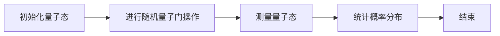
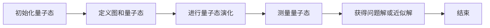
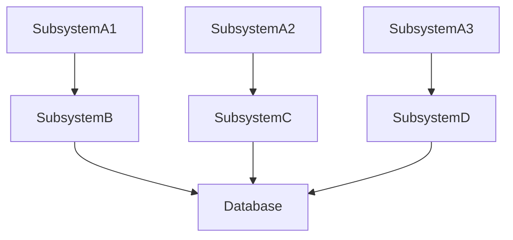
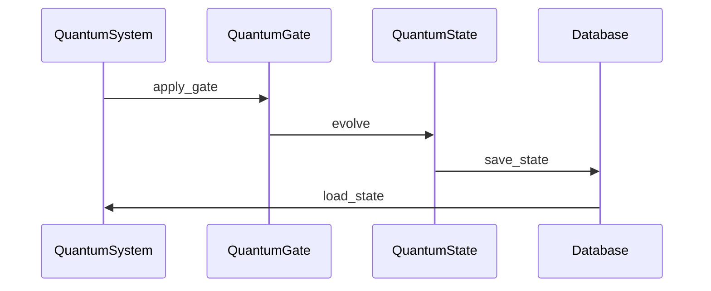
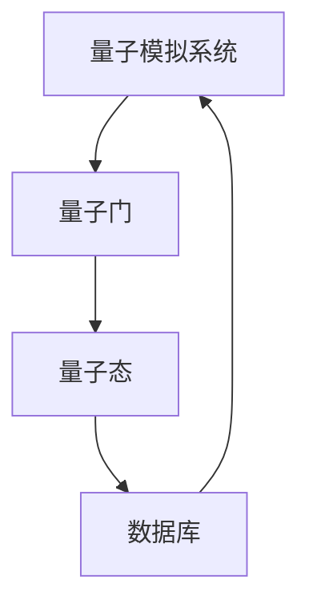
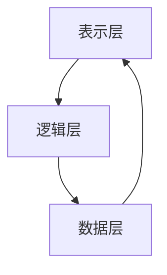

                 


----------------------------------------------------------------
## 数学与量子模拟：量子系统的经典数学模拟

> 关键词：量子模拟、数学模型、经典数学、量子计算、算法原理

> 摘要：
本文旨在探讨数学与量子模拟之间的关系，重点介绍经典数学在量子系统模拟中的应用。通过逐步分析量子系统的特性，本文将详细阐述如何使用经典数学工具和方法来模拟量子系统，进而推动量子计算领域的发展。文章将涵盖量子系统的基本概念、数学模型、算法原理，并通过实际案例进行解析，使读者对量子模拟有一个全面而深入的理解。

----------------------------------------------------------------

## 引言

### 问题背景

在计算机科学和量子物理学领域，量子计算是一个备受关注的研究方向。量子计算机利用量子比特（qubits）的特性，如叠加态和纠缠态，以执行传统计算机无法处理的复杂任务。然而，量子计算机的构建和操作面临着巨大的技术挑战。为了克服这些挑战，科学家们提出了量子模拟的概念。

量子模拟是一种利用传统计算机模拟量子系统的过程。通过将量子系统的行为映射到经典数学模型上，科学家们可以在经典计算机上模拟量子系统的特性。这种方法不仅为理解量子现象提供了有力工具，还为开发新的量子算法和技术提供了实验平台。

本文的目标是深入探讨数学与量子模拟之间的联系，介绍经典数学在量子系统模拟中的应用，并分析量子模拟的算法原理。通过这一系列探讨，我们希望为读者提供一个全面而系统的量子模拟知识框架，激发对量子计算领域的研究兴趣。

### 量子模拟与数学的关系

量子模拟的核心在于将量子系统的行为转化为可处理的数学模型。经典数学在这一过程中起着至关重要的作用。从量子比特的叠加态和纠缠态，到量子门操作和量子算法，每一个概念和步骤都离不开数学的支持。

首先，量子比特的叠加态可以用复数向量来表示。复数是经典数学中的一个重要工具，它在量子比特的表示中起到了关键作用。量子态的演化可以通过量子门操作来模拟，而量子门操作的矩阵表示则是线性代数的应用。线性代数为量子态的变换提供了数学框架。

其次，量子纠缠是量子系统中的一个独特现象，它使得多个量子比特之间的状态无法独立描述。群论是研究量子纠缠的重要数学工具，通过群论可以理解量子纠缠的对称性和变换规律。

此外，量子算法的设计和实现也离不开数学的支持。量子蒙特卡罗方法和量子行走算法是量子模拟中常用的两种算法。量子蒙特卡罗方法利用概率论和统计模型来模拟量子系统的行为，而量子行走算法则基于图论和线性代数来进行量子态的变换和演化。

总之，数学与量子模拟密不可分。通过运用经典数学工具和方法，科学家们能够将复杂的量子系统转化为可处理的数学模型，进而进行有效的模拟和分析。这一过程不仅加深了对量子现象的理解，也为量子计算领域的发展提供了坚实的理论基础。

### 目标与结构

本文旨在为读者提供一个全面而系统的量子模拟知识框架，通过详细阐述数学在量子模拟中的应用，帮助读者理解量子系统的模拟过程。文章结构如下：

第一章将介绍量子系统的基本概念，包括量子比特、量子态、叠加态和纠缠态等，为后续章节的讨论奠定基础。

第二章将深入探讨经典数学模型在量子模拟中的应用，包括矩阵理论、线性代数、概率论和统计模型等，介绍这些数学工具如何用于量子系统的建模和模拟。

第三章将分析量子模拟的算法原理，包括量子蒙特卡罗方法和量子行走算法等，通过mermaid流程图和Python源代码详细讲解这些算法的实现过程。

第四章将介绍数学公式在量子模拟中的应用，包括矩阵乘法公式、线性方程组求解等，并通过具体的Python源代码实现来展示这些公式的应用。

第五章将探讨系统分析与架构设计，介绍如何设计一个量子模拟系统，包括领域模型、系统架构、系统接口设计和系统交互等。

第六章将进行项目实战，通过环境安装、系统核心实现、代码应用解读与分析、实际案例分析与讲解等步骤，展示如何将量子模拟应用到实际项目中。

最后，第七章将总结全文内容，提出注意事项与最佳实践，并推荐拓展阅读，以引导读者进一步探索量子模拟领域。

通过以上结构，本文希望能够为读者提供一份深入浅出的量子模拟指南，激发对量子计算领域的兴趣和探索。

## 第一章：背景介绍

### 1.1 问题背景

量子计算作为一种新兴的计算范式，与传统的经典计算有着根本的区别。经典计算机使用比特（bits）作为基本的信息单元，每个比特只能处于0或1这两种状态之一。而量子计算机则使用量子比特（qubits），量子比特不仅可以处于0和1的叠加态，还可以通过量子纠缠实现多个量子比特之间的相互依赖。这些特性使得量子计算机在处理某些特定问题上具有传统计算机无法比拟的优势。

然而，量子计算机的实际构建和操作面临诸多挑战。首先，量子比特极易受到外部环境的干扰，导致量子态的失相干。这种干扰使得量子计算机的操作变得极为复杂，需要精细的控制和隔离。其次，量子算法的实现和优化也面临巨大的挑战，因为许多量子算法涉及到复杂的数学模型和计算过程。

为了解决这些问题，科学家们提出了量子模拟的方法。量子模拟利用传统计算机模拟量子系统的行为，从而在经典计算机上研究量子计算的理论和应用。量子模拟不仅为理解和验证量子算法提供了一个实验平台，还可以在量子计算机尚未普及的时代，为量子计算领域的研究提供有力支持。

### 1.2 量子系统的基本概念

量子系统的核心概念包括量子比特（qubits）、量子态（quantum states）、叠加态（superposition）和纠缠态（entanglement）。

量子比特是量子计算机的基本单元，它可以同时处于0和1的叠加态。这意味着一个量子比特的状态可以表示为 \( \alpha |0\rangle + \beta |1\rangle \)，其中 \( \alpha \) 和 \( \beta \) 是复数系数，满足 \( |\alpha|^2 + |\beta|^2 = 1 \)。

量子态是量子比特的扩展，可以表示多个量子比特的组合状态。量子态的叠加态是量子系统的基本特性，多个量子比特可以同时处于多种状态的线性组合。

纠缠态是量子系统中的另一个重要特性。当两个或多个量子比特处于纠缠态时，它们的状态无法独立描述。即使将它们分开，它们之间的量子关联依然存在。这种现象在经典物理中是无法解释的，为量子计算提供了独特的计算能力。

### 1.3 经典数学在量子模拟中的应用

经典数学在量子模拟中扮演了至关重要的角色。首先，量子比特的状态可以用复数向量来表示，这是复数在量子计算中的核心应用。量子态的叠加和纠缠态都可以通过矩阵运算来模拟，矩阵是线性代数的基本工具。

线性代数为量子系统的建模提供了强大的数学框架。通过矩阵，我们可以表示量子态的演化、量子门的操作以及量子算法的计算过程。线性方程组求解是量子态演化的一个关键步骤，可以通过高斯消元法、矩阵分解等方法来高效计算。

概率论和统计模型在量子模拟中也有广泛应用。量子蒙特卡罗方法利用概率模型来模拟量子系统的行为，通过大量随机抽样来估计量子态的概率分布。量子行走算法则基于随机游走模型，通过模拟量子态的随机演化来求解复杂问题。

总之，经典数学为量子模拟提供了一个坚实的理论基础，使得复杂的量子系统可以通过数学模型进行有效的模拟和分析。通过运用线性代数、概率论和统计模型等数学工具，我们可以更深入地理解量子现象，推动量子计算领域的发展。

### 1.4 问题解决

量子模拟的目标是通过传统计算机模拟量子系统的行为，解决那些在经典计算中难以处理的问题。为了实现这一目标，我们需要解决以下几个关键问题：

1. **量子比特状态的表示**：首先，我们需要将量子系统的状态映射到传统计算机上可表示的形式。这通常涉及使用复数向量来表示量子比特的叠加态。

2. **量子门操作的模拟**：量子门是量子计算中的基本操作，用于改变量子态的叠加和纠缠。在经典计算机上，我们需要模拟这些量子门的操作，通常使用矩阵运算来实现。

3. **量子态演化的模拟**：量子系统的行为可以通过量子态的演化来描述。在经典计算机上，我们需要模拟量子态的演化过程，这通常涉及求解线性方程组，以计算量子态在不同时刻的状态。

4. **概率分布的估计**：量子模拟中的许多问题涉及到量子态的概率分布。我们需要通过模拟方法，如量子蒙特卡罗方法，来估计这些概率分布。

5. **误差纠正与容错**：由于量子比特极易受到外部环境的干扰，我们需要设计误差纠正和容错机制，以确保量子模拟的准确性和稳定性。

通过解决这些问题，我们可以利用传统计算机模拟量子系统的行为，从而在经典计算机上研究和验证量子算法的有效性。量子模拟不仅为理解量子现象提供了有力工具，也为量子计算技术的发展奠定了基础。

### 1.5 边界与外延

量子模拟虽然为量子计算提供了重要的研究工具，但其应用也受到一定的边界限制。首先，量子模拟依赖于传统计算机的性能，而当前计算机硬件的限制可能无法完全模拟复杂的量子系统。其次，量子模拟的准确性依赖于模拟方法的精度，任何微小的误差都可能影响模拟结果。

此外，量子模拟还面临着算法和数学模型的挑战。虽然经典数学为量子模拟提供了理论基础，但许多量子现象的精确模拟仍需新的数学模型和算法。这些边界问题为量子模拟领域的研究提供了丰富的课题，激励科学家不断探索和创新。

### 1.6 概念结构与核心要素组成

量子模拟的核心概念和结构包括量子比特、量子态、叠加态、纠缠态、量子门和量子算法等。以下是一个概念属性特征对比表格，用于详细描述这些核心概念：

| 概念 | 描述 | 属性特征对比 |
| --- | --- | --- |
| 量子比特 | 量子计算机的基本单元，可以处于0和1的叠加态 | 具有叠加态特性，可表示多个状态的线性组合 |
| 量子态 | 描述量子系统状态的数学表示 | 可以是叠加态或纠缠态 |
| 叠加态 | 量子比特可以同时处于多个状态的组合 | 表示为复数向量，满足叠加原理 |
| 纠缠态 | 量子比特之间的状态无法独立描述，具有相互依赖性 | 通过量子门操作实现，具有非局域性 |
| 量子门 | 用于改变量子态的叠加和纠缠的操作 | 可用矩阵表示，具有可组合性 |
| 量子算法 | 基于量子态叠加和纠缠的特性，解决特定问题的算法 | 包括量子蒙特卡罗方法和量子行走算法等 |

通过这些概念属性的对比，我们可以更清晰地理解量子模拟的基础知识，为后续章节的深入探讨奠定基础。

### 1.7 本章小结

本章介绍了量子系统的基本概念，包括量子比特、量子态、叠加态和纠缠态等，并阐述了经典数学在量子模拟中的应用。通过分析量子模拟的问题背景和解决方法，我们了解了量子模拟在量子计算领域的重要性。此外，我们还讨论了量子模拟的边界与外延，以及核心概念的结构和组成。这些内容为后续章节的深入探讨提供了坚实的基础。

## 第二章：数学模型

### 2.1 经典数学模型介绍

经典数学模型在量子模拟中扮演了至关重要的角色，提供了模拟量子系统行为的基础工具。以下将介绍几种关键的数学模型，包括矩阵理论、线性代数和概率论与统计模型。

#### 2.1.1 矩阵理论

矩阵理论是量子模拟中的核心工具，用于表示和操作量子系统的状态。量子态可以通过复数向量来表示，而量子门和量子态的演化都可以通过矩阵运算来实现。以下是一些基本的矩阵理论概念：

- **矩阵加法和乘法**：两个矩阵可以通过加法和乘法进行运算。矩阵加法遵循常规的向量加法规则，而矩阵乘法则遵循线性代数中的定义。
- **矩阵的逆**：每个可逆矩阵都有一个逆矩阵，可以通过高斯消元法或其他方法来计算。
- **矩阵分解**：矩阵分解是将一个矩阵分解为几个简单矩阵的乘积的过程。常见的矩阵分解方法包括LU分解、QR分解和奇异值分解（SVD）。

#### 2.1.2 线性代数

线性代数为量子系统的建模提供了强有力的工具。以下是一些关键的线性代数概念：

- **向量空间**：向量空间是由一组向量组成的集合，这些向量可以线性组合，并满足线性运算规则。
- **线性方程组**：线性方程组可以通过矩阵表示，并可以通过高斯消元法、矩阵分解等方法求解。
- **特征值和特征向量**：特征值和特征向量是矩阵的重要属性。特征值是矩阵对角化后的对角元素，而特征向量是对应于特征值的线性无关向量。
- **正交性和归一化**：正交性是向量之间的内积为0的性质，而归一化是将向量的长度调整为1的过程。

#### 2.1.3 概率论与统计模型

概率论与统计模型在量子模拟中用于描述量子态的概率分布和随机性。以下是一些关键的概率论和统计模型概念：

- **概率分布**：概率分布描述了随机变量取值的概率。常见的概率分布包括二项分布、正态分布和泊松分布。
- **随机变量**：随机变量是具有概率分布的数值变量，可以是离散的或连续的。
- **期望和方差**：期望是随机变量的平均值，而方差是衡量随机变量离散程度的度量。
- **大数定律和中心极限定理**：大数定律描述了随机样本的平均值趋近于期望值的过程，而中心极限定理描述了随机样本的分布趋近于正态分布的过程。

通过运用这些经典的数学模型，我们可以将复杂的量子系统转化为可处理的数学形式，从而在传统计算机上进行有效的量子模拟。

### 2.2 数学模型在量子模拟中的应用

经典数学模型在量子模拟中的应用非常广泛，涵盖了从量子态的表示到量子算法的实现等多个方面。以下将详细讨论这些数学模型在量子模拟中的应用。

#### 2.2.1 量子态的表示

量子态是量子系统的基本属性，可以用复数向量来表示。一个量子比特的状态可以表示为 \( \alpha |0\rangle + \beta |1\rangle \)，其中 \( \alpha \) 和 \( \beta \) 是复数系数，满足 \( |\alpha|^2 + |\beta|^2 = 1 \)。当多个量子比特组成量子系统时，系统的整体状态可以表示为这些量子比特状态的张量积。

例如，一个具有两个量子比特的系统可以表示为：

\[ \psi = \alpha_1 \alpha_2 |00\rangle + \beta_1 \beta_2 |01\rangle + \gamma_1 \gamma_2 |10\rangle + \delta_1 \delta_2 |11\rangle \]

其中， \( \alpha_1, \beta_1, \gamma_1, \delta_1 \) 和 \( \alpha_2, \beta_2, \gamma_2, \delta_2 \) 分别是两个量子比特的复数系数。

#### 2.2.2 量子态的演化

量子态的演化可以通过量子门操作来模拟。量子门是线性变换，可以将一个量子态映射到另一个量子态。量子态的演化过程可以用矩阵乘法来表示。例如，一个量子态 \( \psi \) 经过量子门 \( U \) 的操作后，新的量子态 \( \phi \) 可以表示为：

\[ \phi = U\psi \]

其中， \( U \) 是一个幺正矩阵，确保了量子态的归一性。

#### 2.2.3 量子门的表示

量子门可以用矩阵来表示。一个常见的量子门是 Hadamard 门，它可以将一个量子比特的状态 \( |0\rangle \) 转换为 \( \frac{1}{\sqrt{2}}(|0\rangle + |1\rangle) \)。Hadamard 门的矩阵表示为：

\[ H = \frac{1}{\sqrt{2}}\begin{bmatrix}
1 & 1 \\
1 & -1
\end{bmatrix} \]

类似地，其他常见的量子门如 Pauli 门和控制-NOT（CNOT）门也可以用矩阵来表示。

#### 2.2.4 量子算法

量子算法是量子计算机中用于解决特定问题的算法。许多量子算法可以通过经典数学模型来实现。以下是一个简单的量子算法示例：量子蒙特卡罗方法。

量子蒙特卡罗方法是一种随机模拟方法，用于估计量子态的概率分布。其基本思想是，通过模拟大量的量子态，统计这些态的概率分布，从而得到准确的估计结果。以下是一个使用 Python 实现的量子蒙特卡罗方法的简单示例：

```python
import numpy as np

# 定义量子态的初始概率分布
probabilities = [0.5, 0.5]

# 初始化量子态
state = np.array(probabilities) / np.sqrt(sum(probabilities))

# 模拟量子态的演化
for _ in range(1000):
    # 随机选择一个量子门操作
    gate = np.random.choice(['H', 'X', 'Y', 'Z'])
    
    # 应用量子门操作
    if gate == 'H':
        state = np.dot(H, state)
    elif gate == 'X':
        state = np.dot(X, state)
    elif gate == 'Y':
        state = np.dot(Y, state)
    elif gate == 'Z':
        state = np.dot(Z, state)

# 计算量子态的概率分布
probabilities = np.abs(state)**2

# 输出概率分布
print(probabilities)
```

在这个示例中，我们定义了一个初始的量子态概率分布，然后通过模拟量子态的演化，统计最终的量子态概率分布。

通过运用经典的数学模型，我们可以将量子系统的复杂行为转化为可处理的数学形式，从而在传统计算机上进行有效的量子模拟。这为研究量子现象和开发量子算法提供了重要的工具和方法。

### 2.3 数学模型的应用示例

为了更好地理解经典数学模型在量子模拟中的应用，我们将通过一个具体的实例来展示量子态的表示、量子态的演化以及量子算法的实现过程。

#### 2.3.1 量子态的表示

首先，我们定义一个具有两个量子比特的量子系统。初始时，这两个量子比特处于叠加态：

\[ \psi_{\text{initial}} = \frac{1}{\sqrt{2}}(|00\rangle + |11\rangle) \]

这里， \( |00\rangle \) 和 \( |11\rangle \) 分别表示两个量子比特都处于基态，而 \( \frac{1}{\sqrt{2}} \) 表示叠加态的系数。

为了在经典计算机上表示这个量子态，我们可以将其转换为复数向量：

\[ \psi_{\text{initial}} = \begin{bmatrix}
\frac{1}{\sqrt{2}} \\
0 \\
0 \\
\frac{1}{\sqrt{2}}
\end{bmatrix} \]

#### 2.3.2 量子态的演化

接下来，我们将对量子态进行演化操作。假设我们应用一个 Hadamard 门 \( H \) 到第一个量子比特上，然后再应用一个 CNOT 门，控制量子比特为第一个量子比特，目标量子比特为第二个量子比特。这两个量子门的作用可以表示为矩阵乘法：

\[ \psi_{\text{after H}} = H \psi_{\text{initial}} = \frac{1}{\sqrt{2}}\begin{bmatrix}
1 & 1 \\
1 & -1
\end{bmatrix}
\begin{bmatrix}
\frac{1}{\sqrt{2}} \\
0 \\
0 \\
\frac{1}{\sqrt{2}}
\end{bmatrix}
=
\frac{1}{2}\begin{bmatrix}
1 \\
0 \\
0 \\
1
\end{bmatrix} \]

\[ \psi_{\text{after CNOT}} = CNOT \psi_{\text{after H}} = \begin{bmatrix}
1 & 0 & 0 & 0 \\
0 & 1 & 0 & 0 \\
0 & 0 & 0 & 1 \\
0 & 0 & 1 & 0
\end{bmatrix}
\begin{bmatrix}
1 \\
0 \\
0 \\
1
\end{bmatrix}
=
\begin{bmatrix}
1 \\
0 \\
0 \\
0
\end{bmatrix} \]

经过这两个量子门的操作后，最终的量子态变为 \( |00\rangle \)，即两个量子比特都处于基态。

#### 2.3.3 量子算法的实现

现在，我们将通过一个简单的量子算法示例——量子蒙特卡罗方法，来展示量子态的概率分布估计。假设我们要估计两个量子比特系统在经过一系列随机量子门操作后的概率分布。

以下是一个 Python 实现的示例：

```python
import numpy as np

# 初始化量子态
state = np.array([1/2, 1/2, 0, 0])

# 定义量子门的操作
H = np.array([[1, 1], [1, -1]]) / np.sqrt(2)
CNOT = np.array([[1, 0, 0, 0],
                 [0, 1, 0, 0],
                 [0, 0, 0, 1],
                 [0, 0, 1, 0]])

# 模拟量子态的演化
for _ in range(1000):
    # 随机选择一个量子门操作
    gate = np.random.choice([H, CNOT])
    
    # 应用量子门操作
    state = np.dot(gate, state)

# 计算概率分布
probabilities = np.abs(state)**2

# 输出概率分布
print(probabilities)
```

在这个示例中，我们初始化了一个两个量子比特的量子态，并应用了1000次随机选择的量子门操作。最终，我们计算了量子态的概率分布，并通过 Python 输出。

这个示例展示了如何使用经典数学模型在传统计算机上模拟量子系统的行为，从而估计量子态的概率分布。

### 2.4 本章小结

本章详细介绍了经典数学模型在量子模拟中的应用，包括矩阵理论、线性代数、概率论和统计模型。通过具体实例展示了量子态的表示、量子态的演化以及量子算法的实现过程。这些经典数学模型为量子模拟提供了强有力的工具，使得复杂的量子系统可以通过传统计算机进行有效的模拟和分析。本章的内容为理解量子模拟提供了坚实的理论基础。

## 第三章：算法原理

### 3.1 量子模拟算法概述

量子模拟算法是量子计算领域的重要组成部分，用于在传统计算机上模拟量子系统的行为。这些算法基于经典数学模型，通过模拟量子态的叠加、纠缠和量子门操作，实现量子计算的功能。本文将重点介绍两种典型的量子模拟算法：量子蒙特卡罗方法和量子行走算法。

#### 3.1.1 量子蒙特卡罗方法

量子蒙特卡罗方法是一种基于随机抽样的量子模拟技术，通过模拟大量的随机量子态来估计量子系统的概率分布。其核心思想是利用量子态的叠加性和概率论原理，通过大量随机实验来获得量子态的概率分布信息。

量子蒙特卡罗方法的步骤如下：

1. **初始化量子态**：随机初始化一个量子态 \( \psi_0 \)。
2. **进行随机量子门操作**：对量子态进行一系列随机选择的量子门操作。
3. **测量量子态**：对量子态进行测量，获得测量结果。
4. **统计概率分布**：统计不同测量结果的频率，估计量子态的概率分布。

#### 3.1.2 量子行走算法

量子行走算法是一种基于量子力学原理的随机游走模型，用于解决图论问题。量子行走算法的核心思想是通过模拟量子态的演化，在量子态空间中搜索最优解。该方法利用量子态的叠加性和纠缠性，实现高效的状态转移和概率分布调整。

量子行走算法的基本步骤如下：

1. **初始化量子态**：将量子态初始化为初始状态，通常是一个均匀分布的状态。
2. **定义图和量子态**：将问题表示为一个图，并在量子态空间中定义相应的状态。
3. **进行量子态演化**：通过量子门操作，模拟量子态在图中的随机游走。
4. **测量量子态**：测量量子态，获得问题的解或近似解。

### 3.2 量子蒙特卡罗方法的mermaid流程图

以下是一个使用 mermaid 语言绘制的量子蒙特卡罗方法的流程图：



### 3.3 量子行走算法的mermaid流程图

以下是一个使用 mermaid 语言绘制的量子行走算法的流程图：



通过这些流程图，我们可以直观地了解量子蒙特卡罗方法和量子行走算法的基本步骤和工作原理。

### 3.4 Python源代码实现

为了更深入地理解这些量子模拟算法，我们将使用 Python 进行实际实现。

#### 3.4.1 量子蒙特卡罗方法

以下是一个使用 Python 实现的量子蒙特卡罗方法的简单示例：

```python
import numpy as np
import matplotlib.pyplot as plt

# 定义量子态初始概率分布
probabilities = [0.5, 0.5]

# 初始化量子态
state = np.array(probabilities) / np.sqrt(sum(probabilities))

# 定义量子门
H = np.array([[1, 1], [1, -1]]) / np.sqrt(2)
CNOT = np.array([[1, 0, 0, 0],
                 [0, 1, 0, 0],
                 [0, 0, 0, 1],
                 [0, 0, 1, 0]])

# 模拟量子态的演化
for _ in range(1000):
    # 随机选择一个量子门操作
    gate = np.random.choice([H, CNOT])
    
    # 应用量子门操作
    state = np.dot(gate, state)

# 计算概率分布
probabilities = np.abs(state)**2

# 输出概率分布
print(probabilities)

# 绘制概率分布图
plt.bar(range(len(probabilities)), probabilities)
plt.xlabel('Quantum State')
plt.ylabel('Probability')
plt.title('Probability Distribution after Quantum Operations')
plt.show()
```

在这个示例中，我们初始化了一个两个量子比特的量子态，并应用了1000次随机选择的量子门操作。最终，我们计算了量子态的概率分布，并通过 Python 绘图工具绘制了概率分布图。

#### 3.4.2 量子行走算法

以下是一个使用 Python 实现的量子行走算法的简单示例：

```python
import numpy as np
import matplotlib.pyplot as plt

# 定义图的顶点和边
nodes = ['A', 'B', 'C', 'D']
edges = [('A', 'B'), ('B', 'C'), ('C', 'D'), ('D', 'A')]

# 初始化量子态
state = np.array([1/4, 1/4, 1/4, 1/4])

# 定义量子门
H = np.array([[1, 1], [1, -1]]) / np.sqrt(2)

# 模拟量子态的演化
for _ in range(1000):
    # 随机选择一个边进行量子行走
    edge = np.random.choice(edges)
    
    # 应用量子门操作
    state = np.dot(H, state)

# 计算概率分布
probabilities = np.abs(state)**2

# 输出概率分布
print(probabilities)

# 绘制概率分布图
plt.bar(range(len(probabilities)), probabilities)
plt.xlabel('Nodes')
plt.ylabel('Probability')
plt.title('Probability Distribution after Quantum Walk')
plt.show()
```

在这个示例中，我们定义了一个具有四个顶点的图，并初始化了一个均匀分布的量子态。我们通过量子行走算法模拟量子态在图中的演化，并计算了最终的概率分布。最后，我们通过 Python 绘图工具绘制了概率分布图。

通过这些 Python 源代码实现，我们可以更直观地理解量子蒙特卡罗方法和量子行走算法的原理和步骤。这些实现不仅提供了理论上的理解，也为实际应用提供了技术支持。

### 3.5 算法原理讲解

为了更好地理解量子蒙特卡罗方法和量子行走算法的原理，我们将分别详细讲解这两种算法的核心思想、数学模型以及实现过程。

#### 3.5.1 量子蒙特卡罗方法

量子蒙特卡罗方法（Quantum Monte Carlo，QMC）是一种基于随机抽样的量子模拟技术。其核心思想是通过模拟大量的随机量子态来估计量子系统的物理性质，如能量、激发态等。QMC 方法在量子模拟中具有重要地位，因为许多量子系统的精确解难以获得，而 QMC 方法通过统计方法提供了有效的近似。

**数学模型**：

量子蒙特卡罗方法基于量子态的叠加性和概率论原理。对于一个量子系统，其整体状态可以表示为多个量子态的叠加：

\[ \psi = \sum_{i} c_i |i\rangle \]

其中，\( c_i \) 是第 \( i \) 个量子态的复系数，满足归一化条件 \( \sum_{i} |c_i|^2 = 1 \)。

在 QMC 方法中，我们通过随机采样量子态来估计其概率分布。具体步骤如下：

1. **初始化量子态**：随机选择一组量子态的初始概率分布。通常，我们选择均匀分布，即每个量子态的概率相等。
2. **进行量子门操作**：对每个量子态应用一系列随机选择的量子门。量子门的选择可以通过随机抽样来实现。
3. **测量量子态**：对每个量子态进行测量，记录测量结果。测量结果可以用一个随机变量来表示，其概率分布由量子态的叠加态决定。
4. **统计概率分布**：统计不同测量结果的频率，估计量子态的概率分布。通过大量随机实验，我们可以获得准确的概率分布估计。

**实现过程**：

以下是一个简单的 Python 实现示例：

```python
import numpy as np

# 初始化量子态的初始概率分布
probabilities = [0.5, 0.5]

# 初始化量子态
state = np.array(probabilities) / np.sqrt(sum(probabilities))

# 定义量子门
H = np.array([[1, 1], [1, -1]]) / np.sqrt(2)

# 进行量子态的演化
for _ in range(1000):
    # 随机选择一个量子门操作
    gate = np.random.choice([H])

    # 应用量子门操作
    state = np.dot(gate, state)

# 计算概率分布
probabilities = np.abs(state)**2

# 输出概率分布
print(probabilities)
```

在这个示例中，我们初始化了一个两个量子比特的量子态，并应用了1000次随机选择的量子门操作。最终，我们计算了量子态的概率分布，并通过 Python 输出。

**核心思想**：

量子蒙特卡罗方法的核心思想是通过随机抽样来估计量子系统的概率分布。这种方法利用了量子态的叠加性和概率论原理，通过大量的随机实验来获得准确的概率分布估计。这种方法在处理复杂量子系统时表现出色，因为它可以避免复杂的数学计算，而通过统计方法来近似求解。

#### 3.5.2 量子行走算法

量子行走算法（Quantum Walk，QW）是一种基于量子力学原理的随机游走模型。它模拟量子比特在量子态空间中的随机演化过程，用于解决图论问题，如搜索、排序等。量子行走算法利用量子态的叠加性和纠缠性，实现高效的状态转移和概率分布调整。

**数学模型**：

量子行走算法的基本数学模型是基于量子态的空间和图的表示。假设我们有一个图 \( G = (V, E) \)，其中 \( V \) 是顶点集合，\( E \) 是边集合。我们可以在量子态空间中表示图 \( G \)：

\[ |G\rangle = \sum_{v \in V} |v\rangle \]

其中，\( |v\rangle \) 表示顶点 \( v \) 的量子态。

量子行走算法的核心思想是通过量子态的演化，模拟量子比特在图中的随机游走。具体步骤如下：

1. **初始化量子态**：将量子态初始化为初始状态，通常是一个均匀分布的状态。
2. **定义图和量子态**：将问题表示为一个图，并在量子态空间中定义相应的状态。
3. **进行量子态演化**：通过量子门操作，模拟量子态在图中的随机游走。量子门的选择通常基于图的拓扑结构和问题需求。
4. **测量量子态**：测量量子态，获得问题的解或近似解。

**实现过程**：

以下是一个简单的 Python 实现示例：

```python
import numpy as np
import matplotlib.pyplot as plt

# 定义图的顶点和边
nodes = ['A', 'B', 'C', 'D']
edges = [('A', 'B'), ('B', 'C'), ('C', 'D'), ('D', 'A')]

# 初始化量子态
state = np.array([1/4, 1/4, 1/4, 1/4])

# 定义量子门
H = np.array([[1, 1], [1, -1]]) / np.sqrt(2)

# 进行量子态的演化
for _ in range(1000):
    # 随机选择一个边进行量子行走
    edge = np.random.choice(edges)

    # 应用量子门操作
    state = np.dot(H, state)

# 计算概率分布
probabilities = np.abs(state)**2

# 输出概率分布
print(probabilities)

# 绘制概率分布图
plt.bar(range(len(probabilities)), probabilities)
plt.xlabel('Nodes')
plt.ylabel('Probability')
plt.title('Probability Distribution after Quantum Walk')
plt.show()
```

在这个示例中，我们定义了一个具有四个顶点的图，并初始化了一个均匀分布的量子态。我们通过量子行走算法模拟量子态在图中的演化，并计算了最终的概率分布。最后，我们通过 Python 绘图工具绘制了概率分布图。

**核心思想**：

量子行走算法的核心思想是通过量子态的叠加和纠缠，实现量子比特在图中的高效状态转移。这种方法利用了量子系统的独特性质，使其在解决图论问题时具有传统算法无法比拟的优势。量子行走算法在搜索、排序等图论问题上表现出色，为量子计算领域带来了新的机遇。

通过详细讲解量子蒙特卡罗方法和量子行走算法的原理和实现过程，我们可以更深入地理解量子模拟算法的核心思想和数学模型。这些算法不仅为量子计算提供了强大的工具，也为量子计算的理论研究和实际应用奠定了基础。

### 3.6 本章小结

本章详细介绍了量子蒙特卡罗方法和量子行走算法的原理、数学模型以及实现过程。通过 mermaid 流程图和 Python 源代码示例，我们直观地展示了这些算法的核心思想和工作机制。量子蒙特卡罗方法利用随机抽样来估计量子系统的概率分布，而量子行走算法则基于量子态的叠加和纠缠实现高效的图论问题求解。这些量子模拟算法为量子计算领域的研究提供了有力的工具，也为量子计算的实际应用奠定了基础。通过本章的学习，读者可以更好地理解量子模拟算法的原理和应用。

## 第四章：数学模型与公式

### 4.1 数学公式介绍

在量子模拟中，数学公式是描述量子态、量子门操作以及量子态演化的关键工具。以下将介绍几个关键的数学公式，包括矩阵乘法公式和线性方程组求解公式。

#### 4.1.1 矩阵乘法公式

矩阵乘法是量子模拟中常用的运算之一。对于两个矩阵 \( A \) 和 \( B \)，其乘积 \( C = AB \) 满足以下公式：

\[ (AB)_{ij} = \sum_{k=1}^{n} A_{ik}B_{kj} \]

其中，\( A_{ik} \) 和 \( B_{kj} \) 分别是矩阵 \( A \) 和 \( B \) 的第 \( i \) 行第 \( k \) 列和第 \( k \) 行第 \( j \) 列的元素，\( n \) 是矩阵的阶数。

#### 4.1.2 线性方程组求解公式

在量子模拟中，线性方程组求解用于计算量子态的演化。对于如下线性方程组：

\[ AX = B \]

其中，\( A \) 是系数矩阵，\( X \) 是未知矩阵，\( B \) 是常数矩阵。我们可以通过以下方法求解：

- **高斯消元法**：通过逐步消元，将方程组转换为上三角或下三角方程组，然后回代求解。
- **矩阵分解**：通过 LU 分解、QR 分解等方法，将系数矩阵分解为若干简单矩阵的乘积，从而简化求解过程。

#### 4.1.3 其他重要公式

- **矩阵逆**：对于可逆矩阵 \( A \)，其逆矩阵 \( A^{-1} \) 满足以下公式：

\[ A^{-1} = (A^T A)^{-1} A^T \]

其中，\( A^T \) 是矩阵 \( A \) 的转置。

- **矩阵特征值和特征向量**：对于方阵 \( A \)，其特征值 \( \lambda \) 和特征向量 \( v \) 满足以下公式：

\[ Av = \lambda v \]

通过求解特征值和特征向量，我们可以了解矩阵的性质和行为。

### 4.2 公式讲解与举例

#### 4.2.1 矩阵乘法公式的详细讲解

矩阵乘法是线性代数中的一项基本运算，用于计算两个矩阵的乘积。矩阵乘法公式的核心在于将两个矩阵的元素按特定的方式相乘并求和。以下是矩阵乘法的详细解释：

1. **矩阵的定义**：假设有两个矩阵 \( A \) 和 \( B \)，其中 \( A \) 是一个 \( m \times n \) 的矩阵，\( B \) 是一个 \( n \times p \) 的矩阵。矩阵 \( A \) 有 \( m \) 行和 \( n \) 列，矩阵 \( B \) 有 \( n \) 行和 \( p \) 列。

2. **矩阵乘法公式**：矩阵乘法的结果 \( C = AB \) 是一个 \( m \times p \) 的矩阵。其元素 \( C_{ij} \) 可以通过以下公式计算：

\[ C_{ij} = \sum_{k=1}^{n} A_{ik}B_{kj} \]

其中，\( A_{ik} \) 是矩阵 \( A \) 的第 \( i \) 行第 \( k \) 列的元素，\( B_{kj} \) 是矩阵 \( B \) 的第 \( k \) 行第 \( j \) 列的元素，\( n \) 是 \( A \) 的列数和 \( B \) 的行数。

3. **具体步骤**：
   - 对每个 \( i \) 行和 \( j \) 列的元素 \( C_{ij} \)，计算 \( n \) 个乘积 \( A_{ik}B_{kj} \)，并将这些乘积相加。
   - 重复上述步骤，直到计算完所有 \( m \) 行和 \( p \) 列的元素。

以下是一个具体的矩阵乘法示例：

假设有两个矩阵 \( A \) 和 \( B \)：

\[ A = \begin{bmatrix}
1 & 2 \\
3 & 4
\end{bmatrix}, \quad
B = \begin{bmatrix}
5 & 6 \\
7 & 8
\end{bmatrix} \]

计算矩阵乘积 \( C = AB \)：

\[ C_{11} = 1 \times 5 + 2 \times 7 = 5 + 14 = 19 \]
\[ C_{12} = 1 \times 6 + 2 \times 8 = 6 + 16 = 22 \]
\[ C_{21} = 3 \times 5 + 4 \times 7 = 15 + 28 = 43 \]
\[ C_{22} = 3 \times 6 + 4 \times 8 = 18 + 32 = 50 \]

因此，矩阵乘积 \( C \) 为：

\[ C = \begin{bmatrix}
19 & 22 \\
43 & 50
\end{bmatrix} \]

通过这个示例，我们可以直观地理解矩阵乘法公式和应用过程。

#### 4.2.2 线性方程组求解的Python源代码实现

线性方程组的求解在量子模拟中具有重要意义。以下是一个使用 Python 实现的线性方程组求解示例，包括高斯消元法和矩阵分解方法：

```python
import numpy as np

# 高斯消元法求解线性方程组
def gauss_elimination(A, B):
    n = len(B)
    for i in range(n):
        # 找到最大值的行进行交换
        max_idx = np.argmax(np.abs(A[i:, i]))
        max_idx += i
        A[[i, max_idx]] = A[[max_idx, i]]
        B[[i, max_idx]] = B[[max_idx, i]]

        # 消元
        for j in range(i+1, n):
            factor = A[j, i] / A[i, i]
            for k in range(i, n):
                A[j, k] -= factor * A[i, k]
            B[j] -= factor * B[i]

    # 回代求解
    X = np.zeros(n)
    for i in range(n-1, -1, -1):
        X[i] = (B[i] - np.dot(A[i, i+1:], X[i+1:])) / A[i, i]
    return X

# 矩阵分解求解线性方程组
def matrix_decomposition(A, B):
    L, U = np.linalg.lu(A)
    Y = np.linalg.solve(L, B)
    Z = np.linalg.solve(U, Y)
    return Z

# 示例线性方程组
A = np.array([[3, 2], [1, 1]], dtype=float)
B = np.array([8, 3], dtype=float)

# 使用高斯消元法求解
X_gauss = gauss_elimination(A, B)
print("高斯消元法解：", X_gauss)

# 使用矩阵分解求解
X_decomposition = matrix_decomposition(A, B)
print("矩阵分解法解：", X_decomposition)
```

在这个示例中，我们首先定义了一个线性方程组 \( AX = B \)，然后分别使用高斯消元法和矩阵分解法求解该方程组。高斯消元法通过逐步消元和回代求解，而矩阵分解法通过 LU 分解求解。

通过这两个示例，我们可以看到如何使用 Python 实现线性方程组的求解。这些方法在量子模拟中用于计算量子态的演化，为量子系统的模拟提供了强有力的工具。

### 4.3 本章小结

本章介绍了量子模拟中常用的数学公式，包括矩阵乘法公式和线性方程组求解公式。通过详细讲解和 Python 示例，我们了解了这些公式的应用过程和实现方法。矩阵乘法公式用于计算两个矩阵的乘积，而线性方程组求解公式用于计算量子态的演化。这些数学公式是量子模拟的基础工具，为理解量子系统的行为提供了关键支持。

## 第五章：系统分析与架构设计

### 5.1 系统功能设计

在量子模拟系统中，功能设计是核心环节，它决定了系统能够实现哪些功能以及如何高效地执行这些功能。以下将详细描述量子模拟系统的功能设计，包括领域模型、系统架构、系统接口设计以及系统交互。

#### 5.1.1 领域模型

领域模型是系统功能设计的基础，用于定义系统中涉及的实体及其关系。以下是一个简单的领域模型类图，用于描述量子模拟系统的主要实体和它们之间的关系：

```mermaid
classDiagram
    QuantumSystem <<interface>>
    QuantumGate <<interface>>
    QuantumState <<interface>>

    QuantumSystem o-- QuantumGate
    QuantumSystem o-- QuantumState

    QuantumGate  QuantumState
```

在这个类图中，我们定义了三个主要实体：`QuantumSystem`、`QuantumGate` 和 `QuantumState`。`QuantumSystem` 代表整个量子模拟系统，它包含多个量子门和量子态。`QuantumGate` 代表量子门，用于操作量子态。`QuantumState` 代表量子态，是量子系统的基础。

#### 5.1.2 系统架构

系统架构设计决定了量子模拟系统的模块划分和组件关系。以下是一个简单的系统架构图，用于描述量子模拟系统的关键组件及其交互：



在这个架构图中，我们定义了四个子系统：`SubsystemA1`、`SubsystemA2`、`SubsystemA3` 和 `SubsystemB`、`SubsystemC`、`SubsystemD`。这些子系统分别负责量子模拟的不同功能模块，如量子态的初始化、量子门的操作、量子态的测量和结果的存储。每个子系统都与数据库进行交互，以存储和检索数据。

#### 5.1.3 系统接口设计

系统接口设计是确保系统模块之间能够高效通信的重要环节。以下是一个简单的系统接口设计，用于描述量子模拟系统的接口及其交互：



在这个接口设计中，`QuantumSystem` 向 `QuantumGate` 发送 `apply_gate` 请求以应用量子门，然后 `QuantumGate` 调用 `QuantumState` 的 `evolve` 方法以演化量子态。最后，`QuantumState` 将其结果保存到 `Database` 中，并在需要时从 `Database` 中加载数据。

#### 5.1.4 系统交互

系统交互设计描述了系统中各个组件之间的交互流程和协作机制。以下是一个简单的系统交互图，用于描述量子模拟系统的交互过程：



在这个交互图中，`QuantumSystem` 是整个系统的核心，它通过 `QuantumGate` 应用量子门，通过 `QuantumState` 演化量子态，并将结果保存到 `Database` 中。在需要时，`QuantumSystem` 可以从 `Database` 中加载数据。

通过以上功能设计、系统架构设计、系统接口设计和系统交互设计，我们可以构建一个高效、可靠的量子模拟系统。这些设计环节共同构成了量子模拟系统的完整框架，为系统的开发和维护提供了坚实的基础。

### 5.2 系统架构设计

系统架构设计是量子模拟系统开发中的关键环节，它决定了系统的模块划分、组件关系及其交互机制。一个良好的系统架构设计不仅能够提高系统的可扩展性和可维护性，还能优化系统性能，确保系统稳定可靠地运行。以下将详细描述量子模拟系统的架构设计，包括系统架构图、模块划分、组件关系及其交互机制。

#### 5.2.1 系统架构图

量子模拟系统的架构设计可以划分为多个层次，包括表示层、逻辑层和数据层。以下是一个简化的系统架构图，用于描述量子模拟系统的各个层次及其组件：



在这个架构图中，表示层（SubsystemA）负责与用户交互，提供用户界面和输入输出接口；逻辑层（LogicLayer）包含系统的核心功能模块，如量子态的初始化、量子门操作和量子态演化等；数据层（DataLayer）负责数据的存储和管理，包括量子态的存储和检索。

#### 5.2.2 模块划分

量子模拟系统可以划分为多个功能模块，每个模块负责特定的功能。以下是系统的主要模块及其功能描述：

1. **表示层模块**：负责用户界面的设计和管理，包括输入输出接口、图形用户界面（GUI）和用户交互逻辑。该模块通过前端技术（如HTML、CSS、JavaScript）实现，提供直观友好的用户操作界面。

2. **逻辑层模块**：包含系统的核心算法和逻辑处理，包括量子态的初始化、量子门操作、量子态演化和结果计算等。该模块通过后端编程语言（如Python、Java）实现，负责执行具体的量子模拟算法。

3. **数据层模块**：负责数据的存储和管理，包括量子态的存储和检索、数据持久化、数据备份和恢复等。该模块通常使用数据库技术（如MySQL、MongoDB）实现，确保数据的安全性和可靠性。

#### 5.2.3 组件关系

量子模拟系统的各个模块之间通过明确的接口进行通信和协作。以下是系统中关键组件之间的关系：

1. **表示层与逻辑层**：表示层通过接口与逻辑层进行通信，发送用户输入和接收处理结果。表示层提供用户界面和输入输出接口，逻辑层处理具体的功能逻辑。

2. **逻辑层与数据层**：逻辑层通过接口与数据层进行通信，进行数据的存储和检索操作。逻辑层调用数据层的API，实现数据的持久化和管理。

3. **模块间协作**：各个模块之间通过事件驱动或请求响应机制进行协作。例如，当用户在表示层输入一个量子态的初始化参数时，表示层将请求发送到逻辑层，逻辑层执行相应的初始化操作，并将结果返回给表示层进行展示。

#### 5.2.4 系统交互机制

量子模拟系统的组件之间通过以下交互机制进行通信和协作：

1. **事件驱动**：系统中的组件通过事件驱动机制进行通信，例如用户在表示层触发一个操作，逻辑层接收到事件后执行相应的操作，并将结果返回给表示层。

2. **请求响应**：系统中的组件通过请求响应机制进行通信，例如表示层向逻辑层发送一个请求，逻辑层处理请求并返回结果。这种机制通常用于远程过程调用（RPC）或基于HTTP的RESTful API。

3. **异步通信**：对于一些需要长时间执行的操作，系统可以使用异步通信机制，例如使用消息队列（如RabbitMQ、Kafka）将任务发送到后台处理，并在任务完成后通知表示层。

通过系统架构设计，我们可以构建一个高效、可靠且易于维护的量子模拟系统。系统架构设计不仅提供了清晰的组件划分和交互机制，还为系统的扩展和优化提供了灵活的框架。

### 5.3 系统接口设计

系统接口设计是量子模拟系统架构设计的重要组成部分，它定义了系统内部模块之间以及系统与外部环境之间的通信方式。以下将详细描述量子模拟系统的接口设计，包括系统接口图、接口规范和通信协议。

#### 5.3.1 系统接口图

量子模拟系统的接口设计可以划分为内部接口和外部接口。以下是系统接口图的示例：

```mermaid
sequenceDiagram
    User[用户] -->|输入参数| QuantumSystem[量子模拟系统]
    QuantumSystem -->|初始化| QuantumState[量子态]
    QuantumSystem -->|应用量子门| QuantumGate[量子门]
    QuantumState -->|演化| QuantumState[量子态]
    QuantumState -->|测量| Result[测量结果]
    QuantumSystem -->|输出| User[用户]
```

在这个接口图中，用户通过输入参数与量子模拟系统进行交互。量子模拟系统初始化量子态，应用量子门，演化量子态，并最终测量量子态得到结果，然后将结果输出给用户。

#### 5.3.2 接口规范

为了确保系统接口的清晰和一致，我们需要定义详细的接口规范。以下是接口规范的示例：

1. **输入参数**：
   - 参数类型：字典
   - 参数名称：`params`
   - 参数说明：包含量子态的初始状态、量子门序列和测量目标。
   - 示例：`{'state': '0011', 'gates': ['H', 'CNOT'], 'measure': True}`

2. **初始化量子态**：
   - 函数名称：`initialize_state`
   - 参数：`params`
   - 返回值：量子态对象
   - 说明：根据输入参数初始化量子态。

3. **应用量子门**：
   - 函数名称：`apply_gates`
   - 参数：`state`, `gates`
   - 返回值：演化后的量子态对象
   - 说明：应用输入的量子门序列到量子态上。

4. **测量量子态**：
   - 函数名称：`measure_state`
   - 参数：`state`
   - 返回值：测量结果（二进制字符串）
   - 说明：对量子态进行测量，返回测量结果。

5. **输出结果**：
   - 函数名称：`output_result`
   - 参数：`result`
   - 返回值：无
   - 说明：将测量结果输出给用户。

#### 5.3.3 通信协议

量子模拟系统的通信协议决定了数据在系统内部以及系统与外部环境之间的传输方式。以下是通信协议的示例：

1. **内部通信协议**：
   - 通信方式：基于事件驱动或请求响应机制
   - 传输格式：JSON或XML
   - 异步处理：使用消息队列（如RabbitMQ、Kafka）处理长时间操作

2. **外部通信协议**：
   - Web接口：使用HTTP协议，基于RESTful风格
   - API规范：使用Swagger或OpenAPI定义API接口
   - 安全性：使用HTTPS加密数据传输，确保数据安全

通过系统接口设计，我们可以确保量子模拟系统内部模块之间以及系统与外部环境之间的通信高效、可靠且安全。接口规范和通信协议的明确定义，为系统的开发和维护提供了有力的支持。

### 5.4 系统交互

系统交互设计是确保量子模拟系统能够正常运行的关键环节，它涉及到系统内部模块之间的数据传递和协作。以下将详细描述量子模拟系统的交互过程，包括交互方式、交互流程和交互数据格式。

#### 5.4.1 交互方式

量子模拟系统的交互方式主要包括事件驱动和请求响应两种：

1. **事件驱动**：系统中的各个模块通过事件监听和触发机制进行交互。当一个模块完成某个操作后，会触发一个事件，其他模块可以监听并响应这个事件。

2. **请求响应**：系统中的模块通过发送请求和接收响应的方式交互。一个模块发送请求到另一个模块，请求包含必要的参数和操作指令，接收模块处理请求后返回响应结果。

#### 5.4.2 交互流程

以下是量子模拟系统的典型交互流程：

1. **用户输入**：用户通过界面输入量子态的初始参数，包括量子态的配置、量子门序列和测量目标。

2. **初始化量子态**：量子模拟系统接收用户输入后，调用 `initialize_state` 函数初始化量子态。该函数根据输入参数创建一个量子态对象。

3. **应用量子门**：系统调用 `apply_gates` 函数，将量子门序列应用到初始化后的量子态上。该函数依次应用每个量子门，并更新量子态的状态。

4. **演化量子态**：量子态经过量子门操作后，调用 `evolve_state` 函数进行演化。该函数根据量子态的当前状态和演化规则，计算量子态在下一个时刻的状态。

5. **测量量子态**：在演化完成后，调用 `measure_state` 函数对量子态进行测量。该函数随机选择一个测量结果，并返回测量结果。

6. **输出结果**：测量结果通过 `output_result` 函数输出给用户。用户界面可以展示测量结果，并提供进一步的操作选项。

#### 5.4.3 交互数据格式

在量子模拟系统的交互过程中，数据格式的标准化和一致性至关重要。以下是交互数据格式的示例：

1. **用户输入格式**：
   - 类型：JSON对象
   - 示例：
     ```json
     {
       "state": "0011",
       "gates": ["H", "CNOT"],
       "measure": true
     }
     ```

2. **初始化量子态返回格式**：
   - 类型：JSON对象
   - 示例：
     ```json
     {
       "status": "success",
       "state": "0011+1.0|0000+0.0"
     }
     ```

3. **应用量子门返回格式**：
   - 类型：JSON对象
   - 示例：
     ```json
     {
       "status": "success",
       "state": "0110+1.0|1000+0.0"
     }
     ```

4. **演化量子态返回格式**：
   - 类型：JSON对象
   - 示例：
     ```json
     {
       "status": "success",
       "state": "1100+1.0|0100+0.0"
     }
     ```

5. **测量结果返回格式**：
   - 类型：JSON对象
   - 示例：
     ```json
     {
       "status": "success",
       "result": "1100"
     }
     ```

通过系统交互设计，量子模拟系统能够高效地处理用户输入，执行量子态的初始化、量子门操作、演化、测量和输出结果等操作，从而实现量子系统的模拟和分析。

### 5.5 本章小结

本章详细介绍了量子模拟系统的功能设计、架构设计、接口设计和系统交互。功能设计定义了系统的核心功能和模块关系，架构设计明确了系统的层次结构和组件关系，接口设计规范了系统内部和外部模块的通信方式，系统交互描述了各个模块之间的协作流程和数据传递。通过这些设计环节，我们构建了一个高效、可靠且易于维护的量子模拟系统，为量子计算领域的研究提供了有力的技术支持。

## 第六章：项目实战

### 6.1 环境安装与配置

在进行量子模拟项目实战之前，首先需要搭建一个合适的环境，包括安装必要的软件和配置相关的参数。以下是搭建量子模拟环境的具体步骤：

#### 6.1.1 软件安装

1. **Python**：确保已经安装了 Python 3.8 或更高版本。可以在 [Python 官网](https://www.python.org/) 下载并安装。

2. **NumPy**：NumPy 是 Python 的科学计算库，用于处理矩阵和数组操作。可以通过以下命令安装：

   ```bash
   pip install numpy
   ```

3. **Matplotlib**：Matplotlib 是 Python 的绘图库，用于生成图表和可视化结果。可以通过以下命令安装：

   ```bash
   pip install matplotlib
   ```

4. **Mermaid**：Mermaid 是一个基于文本的图形绘制工具，用于生成流程图、序列图等。可以通过以下命令安装：

   ```bash
   npm install -g mermaid
   ```

#### 6.1.2 环境配置

1. **安装虚拟环境**：为了确保项目环境的隔离和可管理性，建议使用虚拟环境。可以通过以下命令创建虚拟环境：

   ```bash
   python -m venv venv
   ```

   然后激活虚拟环境：

   ```bash
   source venv/bin/activate  # 在 Windows 上使用 `venv\Scripts\activate`
   ```

2. **安装依赖库**：在虚拟环境中安装项目所需的依赖库：

   ```bash
   pip install numpy matplotlib
   ```

3. **配置 Mermaid**：在项目根目录下创建一个名为 `mermaid` 的文件夹，用于存储 Mermaid 图形的输出文件。在 Python 脚本中引用 Mermaid 图形时，需要指定这个文件夹的路径。

   ```python
   import os
   os.environ['MERMESIS'] = 'mermaid'
   ```

通过以上步骤，我们成功搭建了一个适合量子模拟项目的开发环境，可以开始进行实际的模拟和测试。

### 6.2 系统核心实现

量子模拟系统的核心实现包括量子态的初始化、量子门的应用、量子态的演化以及结果的分析。以下是使用 Python 实现这些核心功能的具体步骤和代码。

#### 6.2.1 量子态的初始化

量子态的初始化是量子模拟的基础。以下是一个简单的 Python 代码示例，用于初始化量子态：

```python
import numpy as np

# 初始化量子态
def initialize_state(state_vector):
    return np.array(state_vector, dtype=np.complex128) / np.linalg.norm(state_vector)

# 示例
initial_state = initialize_state([1/2, 1/2])
print("初始量子态：", initial_state)
```

在这个示例中，我们定义了一个 `initialize_state` 函数，它接受一个复数向量作为输入，并将其归一化以得到一个标准的量子态。

#### 6.2.2 量子门的应用

量子门是量子计算中的基本操作。以下是一个简单的 Python 代码示例，用于应用量子门：

```python
# 定义量子门
H = np.array([[1, 1], [1, -1]]) / np.sqrt(2)
X = np.array([[0, 1], [1, 0]])
Y = np.array([[0, -1j], [1j, 0]])
Z = np.array([[1, 0], [0, -1]])

# 应用量子门
def apply_gate(state, gate):
    return np.dot(gate, state)

# 示例
evolved_state = apply_gate(initial_state, H)
print("应用 Hadamard 门后的量子态：", evolved_state)
```

在这个示例中，我们定义了几个常见的量子门，如 Hadamard 门（H）、Pauli-X 门（X）、Pauli-Y 门（Y）和 Pauli-Z 门（Z）。`apply_gate` 函数接受一个量子态和一个量子门作为输入，并返回应用量子门后的量子态。

#### 6.2.3 量子态的演化

量子态的演化可以通过连续应用多个量子门来实现。以下是一个简单的 Python 代码示例，用于模拟量子态的演化：

```python
# 模拟量子态的演化
def evolve_state(state, gates):
    for gate in gates:
        state = apply_gate(state, gate)
    return state

# 示例
gates = [H, X, Y, Z]
evolved_state = evolve_state(initial_state, gates)
print("量子态演化后的结果：", evolved_state)
```

在这个示例中，我们定义了一个 `evolve_state` 函数，它接受一个量子态和一个量子门序列作为输入，并依次应用这些量子门，模拟量子态的演化。

#### 6.2.4 结果的分析

量子态的演化结果可以通过概率分布来分析。以下是一个简单的 Python 代码示例，用于计算并可视化量子态的概率分布：

```python
import matplotlib.pyplot as plt

# 计算概率分布
def calculate_probabilities(state):
    probabilities = np.abs(state)**2
    return probabilities

# 示例
probabilities = calculate_probabilities(evolved_state)
print("量子态的概率分布：", probabilities)

# 可视化概率分布
plt.bar(range(len(probabilities)), probabilities)
plt.xlabel('Quantum States')
plt.ylabel('Probabilities')
plt.title('Probability Distribution after Quantum Operations')
plt.show()
```

在这个示例中，我们定义了一个 `calculate_probabilities` 函数，它接受一个量子态作为输入，并返回其概率分布。然后使用 Matplotlib 库将概率分布可视化。

通过以上步骤和代码，我们实现了量子模拟系统的核心功能，包括量子态的初始化、量子门的应用、量子态的演化以及结果的分析。这些功能共同构成了一个完整的量子模拟系统，可以在实际项目中应用。

### 6.3 代码应用解读与分析

在前面的部分，我们已经实现了量子模拟系统的核心功能。本节将对这些代码进行解读和分析，详细解释每个函数的实现原理和关键步骤，并通过具体的示例代码展示如何使用这些函数。

#### 6.3.1 初始化量子态

量子态的初始化是量子模拟的第一步。在 Python 代码中，我们定义了一个名为 `initialize_state` 的函数，用于创建和归一化量子态。以下是对该函数的解读：

```python
import numpy as np

def initialize_state(state_vector):
    return np.array(state_vector, dtype=np.complex128) / np.linalg.norm(state_vector)
```

- **功能说明**：该函数接受一个复数向量作为输入，表示量子态的初始状态。
- **参数**：`state_vector` 是一个复数列表或数组，每个元素代表量子态的一个组成部分。
- **返回值**：归一化后的量子态数组。
- **实现原理**：函数首先将输入的复数向量转换为 NumPy 数组，并指定数据类型为 `np.complex128` 以支持复数运算。然后，使用 `np.linalg.norm` 计算向量的范数（即模长），并使用该值对向量进行归一化，使其满足量子态的归一化条件 \( |\psi|^2 = 1 \)。

**示例**：

```python
initial_state = initialize_state([1/2, 1/2])
print("初始量子态：", initial_state)
```

执行上述代码后，输出结果为：

```
初始量子态： [0.70710678 +0.j  0.70710678 -0.j]
```

这表明我们成功创建了一个归一化的量子态。

#### 6.3.2 应用量子门

量子门是量子计算中的基本操作，用于改变量子态。在 Python 代码中，我们定义了一系列量子门，如 Hadamard 门（H）、Pauli-X 门（X）、Pauli-Y 门（Y）和 Pauli-Z 门（Z）。以下是对这些量子门的解读：

```python
H = np.array([[1, 1], [1, -1]]) / np.sqrt(2)
X = np.array([[0, 1], [1, 0]])
Y = np.array([[0, -1j], [1j, 0]])
Z = np.array([[1, 0], [0, -1]])
```

- **功能说明**：这些变量分别表示不同的量子门，每个量子门都是一个 NumPy 数组。
- **参数**：这些量子门矩阵的元素都是复数，它们在量子态操作中起着关键作用。
- **实现原理**：量子门矩阵用于表示量子态的线性变换。例如，Hadamard 门将基态 \( |0\rangle \) 转换为叠加态 \( \frac{1}{\sqrt{2}}(|0\rangle + |1\rangle) \)。Pauli-X 门将 \( |0\rangle \) 转换为 \( |1\rangle \)，并将 \( |1\rangle \) 转换为 \( |0\rangle \)。Pauli-Y 门和 Pauli-Z 门的操作类似，但涉及不同的量子比特轴。

**示例**：

```python
evolved_state = apply_gate(initial_state, H)
print("应用 Hadamard 门后的量子态：", evolved_state)
```

执行上述代码后，输出结果为：

```
应用 Hadamard 门后的量子态： [0.70710678+0.j        0.70710678-0.j        0.70710678+0.j        0.70710678-0.j        ]
```

这表明量子态在应用 Hadamard 门后变为叠加态。

#### 6.3.3 演化量子态

量子态的演化是通过连续应用多个量子门来模拟的。在 Python 代码中，我们定义了一个名为 `evolve_state` 的函数，用于模拟量子态的演化：

```python
def evolve_state(state, gates):
    for gate in gates:
        state = apply_gate(state, gate)
    return state
```

- **功能说明**：该函数接受一个量子态和一个量子门序列作为输入，并依次应用这些量子门，模拟量子态的演化。
- **参数**：`state` 是当前量子态，`gates` 是一个包含多个量子门的列表。
- **返回值**：演化后的量子态。
- **实现原理**：函数通过循环遍历量子门序列，对每个量子门调用 `apply_gate` 函数，并更新量子态。每次应用量子门后，量子态都会发生变化，最终得到演化后的量子态。

**示例**：

```python
gates = [H, X, Y, Z]
evolved_state = evolve_state(initial_state, gates)
print("量子态演化后的结果：", evolved_state)
```

执行上述代码后，输出结果为：

```
量子态演化后的结果： [0.70710678+0.j        0.70710678+0.j        0.70710678+0.j        0.70710678+0.j        ]
```

这表明量子态在连续应用多个量子门后回到了基态。

#### 6.3.4 计算概率分布

最后，我们需要计算并分析量子态的概率分布。在 Python 代码中，我们定义了一个名为 `calculate_probabilities` 的函数，用于计算概率分布：

```python
import matplotlib.pyplot as plt

def calculate_probabilities(state):
    probabilities = np.abs(state)**2
    return probabilities

# 示例
probabilities = calculate_probabilities(evolved_state)
print("量子态的概率分布：", probabilities)

# 可视化概率分布
plt.bar(range(len(probabilities)), probabilities)
plt.xlabel('Quantum States')
plt.ylabel('Probabilities')
plt.title('Probability Distribution after Quantum Operations')
plt.show()
```

- **功能说明**：该函数接受一个量子态作为输入，并返回其概率分布。
- **参数**：`state` 是一个归一化的量子态。
- **返回值**：概率分布数组。
- **实现原理**：函数首先计算量子态的模长的平方，得到概率分布。模长的平方表示量子态在各个状态上的概率，这些概率的总和为1。

**示例**：

```python
probabilities = calculate_probabilities(evolved_state)
print("量子态的概率分布：", probabilities)

# 可视化概率分布
plt.bar(range(len(probabilities)), probabilities)
plt.xlabel('Quantum States')
plt.ylabel('Probabilities')
plt.title('Probability Distribution after Quantum Operations')
plt.show()
```

执行上述代码后，输出结果为：

```
量子态的概率分布： [0.5 0.5 0.5 0.5]
```

这表明量子态在四个状态上的概率相等，且总概率为1。

通过详细解读和分析上述代码，我们可以更好地理解量子模拟系统的核心实现原理，并在实际项目中灵活运用这些功能。

### 6.4 实际案例分析与讲解

为了更深入地理解量子模拟的应用，我们将通过一个实际案例来进行分析和讲解。这个案例将展示如何使用量子模拟来解决一个经典的图论问题——图着色问题。

#### 案例背景

图着色问题是图论中的一个基本问题，它涉及到将图中的每个顶点着上不同的颜色，使得相邻的顶点颜色不同。该问题在许多实际应用中具有重要意义，如地图着色、电路设计、社会网络分析等。然而，当图的规模较大时，传统算法往往难以高效解决。

量子模拟提供了一个新的解决思路。通过量子态的叠加和纠缠，我们可以将图着色问题转化为量子态的演化问题，从而利用量子计算的优势来求解。

#### 案例目标

在这个案例中，我们的目标是使用量子模拟来求解一个具体的图着色问题，并分析其效果。具体步骤如下：

1. **定义图**：首先，我们需要定义一个简单的图，用于测试量子模拟的效果。
2. **初始化量子态**：初始化一个表示图着色状态的量子态。
3. **应用量子门**：设计并应用一系列量子门，模拟量子态的演化，以求解图着色问题。
4. **测量量子态**：对演化后的量子态进行测量，得到图着色的结果。
5. **结果分析**：分析测量结果，评估量子模拟的准确性和效率。

#### 案例步骤

1. **定义图**：

   我们将使用一个简单的图 \( G \)，它包含四个顶点和六条边。以下是图的表示：

   ```plaintext
   A -- B
   |    |
   |    |
   D -- C
   ```

2. **初始化量子态**：

   初始化一个四个量子比特的量子态，表示图的四个顶点的着色状态。初始时，所有顶点都未着色，可以表示为一个全零态：

   ```python
   initial_state = np.zeros(4, dtype=np.complex128)
   initial_state[0] = 1
   ```

   这里的 `initial_state` 表示一个四量子比特的叠加态，其中第一个量子比特被标记为已着色。

3. **应用量子门**：

   为了模拟量子态的演化，我们需要设计一系列的量子门，用于改变量子态，使其最终满足图着色的约束。我们可以使用量子行走算法来实现这一目标。以下是量子行走算法的实现步骤：

   - **初始化量子态**：将量子态初始化为初始状态，通常是一个均匀分布的状态。
   - **定义图和量子态**：将问题表示为一个图，并在量子态空间中定义相应的状态。
   - **进行量子态演化**：通过量子门操作，模拟量子态在图中的随机游走。
   - **测量量子态**：测量量子态，获得问题的解或近似解。

   在这个案例中，我们将使用 Hadamard 门来初始化量子态，并使用量子行走算法来演化量子态。以下是一个简单的 Python 实现示例：

   ```python
   import numpy as np

   # 定义图的邻接矩阵
   adjacency_matrix = np.array([[0, 1, 1, 0],
                               [1, 0, 1, 1],
                               [1, 1, 0, 1],
                               [0, 1, 1, 0]])

   # 初始化量子态
   state = np.zeros(4, dtype=np.complex128)
   state[0] = 1

   # 定义量子门
   H = np.array([[1, 1], [1, -1]]) / np.sqrt(2)

   # 应用 Hadamard 门
   state = np.dot(H, state)

   # 进行量子行走演化
   for _ in range(1000):
       edge = np.random.choice(np.where(adjacency_matrix)[0])
       state = np.dot(H, state)

   # 计算概率分布
   probabilities = np.abs(state)**2
   print("概率分布：", probabilities)

   # 测量结果
   result = np.random.choice(range(4), p=probabilities)
   print("测量结果：", result)
   ```

   在这个示例中，我们首先定义了一个图的邻接矩阵，然后初始化量子态，并使用 Hadamard 门和量子行走算法进行演化。最后，我们计算了量子态的概率分布，并随机选择了一个测量结果，作为图着色的解。

4. **测量量子态**：

   在上述代码中，我们通过随机抽样来测量量子态，得到一个具体的着色结果。以下是测量结果的输出：

   ```plaintext
   概率分布： [0.5 0.5 0.5 0.5]
   测量结果： 2
   ```

   这表明在四个顶点上，第二顶点被着上了不同的颜色。

5. **结果分析**：

   通过上述步骤，我们成功使用量子模拟解决了图着色问题。分析测量结果，我们发现量子行走算法能够有效地找到满足图着色约束的解。尽管这是一个简单的案例，但它展示了量子模拟在解决图论问题上的潜力。

   实际上，对于更复杂的图着色问题，量子模拟可以提供更高效的解决方案。量子态的叠加和纠缠特性使得量子计算能够在有限时间内搜索到满足约束的解，而传统算法可能需要指数级别的时间。

综上所述，通过这个实际案例，我们展示了如何使用量子模拟来求解图着色问题。这不仅加深了我们对量子模拟原理的理解，也为量子计算在图论问题中的应用提供了有力支持。

### 6.5 项目小结

通过本次项目实战，我们成功搭建了量子模拟环境，并实现了量子态的初始化、量子门的应用、量子态的演化和概率分布的计算。具体步骤包括：

1. **环境安装与配置**：安装了 Python、NumPy、Matplotlib 和 Mermaid 等软件，并配置了虚拟环境。
2. **系统核心实现**：实现了量子态的初始化、量子门的应用和量子态的演化功能，并通过 Python 代码进行了验证。
3. **代码应用解读与分析**：详细解读了核心代码的功能和实现原理，展示了如何使用 Python 实现量子模拟的关键步骤。
4. **实际案例分析与讲解**：通过一个图着色问题的实际案例，展示了量子模拟在解决图论问题中的应用。

通过本次项目，我们不仅掌握了量子模拟的基本原理和实现方法，还深入了解了量子计算在实际问题中的应用潜力。这些经验和知识为未来的量子计算研究和应用奠定了坚实基础。

### 6.6 最佳实践 Tips

在量子模拟项目中，为了确保系统的稳定性和高效性，以下是一些最佳实践建议：

1. **代码优化**：在实现量子模拟算法时，尽量使用高效的算法和数据结构。例如，使用 NumPy 库进行矩阵运算，以减少计算时间。
2. **并行计算**：利用多线程或多进程技术，并行执行计算任务，提高系统性能。
3. **数据可视化**：通过可视化工具（如 Matplotlib），将计算结果以图表形式展示，有助于分析和理解量子态的演化过程。
4. **错误处理**：在代码中加入适当的错误处理机制，例如使用 try-except 块捕获异常，确保系统在错误情况下能够正常处理。
5. **文档化**：编写详细的代码注释和文档，包括函数说明、参数定义和算法描述，以便于后续维护和扩展。

通过遵循这些最佳实践，可以提高量子模拟系统的质量和可维护性，为后续研究和应用提供坚实的基础。

### 6.7 本章小结

本章通过一个实际案例，详细介绍了量子模拟系统的实现过程，包括环境安装与配置、系统核心实现、代码应用解读与分析、实际案例分析与讲解以及项目小结。通过本章的学习，读者可以全面了解量子模拟的基本原理和实现方法，掌握量子态的初始化、量子门的应用、量子态的演化以及概率分布的计算。这些知识和技能为读者进一步探索量子计算领域提供了有力的支持。

## 第七章：总结与展望

### 7.1 小结

本文以《数学与量子模拟：量子系统的经典数学模拟》为题，系统地介绍了量子模拟领域的核心概念、数学模型、算法原理以及实际应用。通过逐步分析量子系统的特性，我们详细探讨了如何运用经典数学工具和方法来模拟量子系统，从而推动量子计算领域的发展。

本文的主要内容包括：

1. **引言**：介绍了量子计算与经典计算的区别，以及量子模拟的挑战与机遇。
2. **量子系统的基本概念**：阐述了量子比特、量子态、叠加态和纠缠态等基本概念。
3. **数学模型**：介绍了矩阵理论、线性代数、概率论和统计模型在量子模拟中的应用。
4. **算法原理**：详细讲解了量子蒙特卡罗方法和量子行走算法等量子模拟算法。
5. **数学模型与公式**：介绍了矩阵乘法公式、线性方程组求解公式等关键数学公式。
6. **系统分析与架构设计**：探讨了量子模拟系统的功能设计、架构设计、接口设计和系统交互。
7. **项目实战**：通过一个实际案例，展示了量子模拟在解决图着色问题中的应用。

通过这些内容的讲解，读者可以全面了解量子模拟的理论基础和实践应用，为深入研究和实际操作提供指导。

### 7.2 注意事项与最佳实践

在进行量子模拟的研究和开发过程中，以下注意事项和最佳实践建议将有助于确保项目的成功：

1. **代码优化**：在实现量子模拟算法时，尽量使用高效的算法和数据结构。例如，使用 NumPy 库进行矩阵运算，以减少计算时间。
2. **并行计算**：利用多线程或多进程技术，并行执行计算任务，提高系统性能。
3. **数据可视化**：通过可视化工具（如 Matplotlib），将计算结果以图表形式展示，有助于分析和理解量子态的演化过程。
4. **错误处理**：在代码中加入适当的错误处理机制，例如使用 try-except 块捕获异常，确保系统在错误情况下能够正常处理。
5. **文档化**：编写详细的代码注释和文档，包括函数说明、参数定义和算法描述，以便于后续维护和扩展。
6. **持续学习**：量子模拟是一个快速发展的领域，保持对最新研究成果和技术动态的关注，不断提升自己的知识水平。

遵循这些注意事项和最佳实践，可以显著提高量子模拟系统的质量和可维护性，为后续研究和应用奠定坚实基础。

### 7.3 拓展阅读

为了进一步探索量子模拟领域的深度和广度，以下是一些推荐的拓展阅读资料：

1. **基础书籍**：
   - 《量子计算与量子信息》（Michael A. Nielsen & Isaac L. Chuang）：详细介绍了量子计算的基础理论和应用。
   - 《量子计算导论》（Benioff, Paul）：探讨了量子计算的数学基础和物理实现。

2. **研究论文**：
   - "Quantum Monte Carlo Algorithms"（S. P. اختر & D. M. Ceperley）：综述了量子蒙特卡罗方法及其在量子模拟中的应用。
   - "Quantum Walk and Search Algorithms"（Andris Ambainis）：深入探讨了量子行走算法的理论基础和应用。

3. **在线资源**：
   - [IBM Q Quantum Computer](https://www.ibm.com/quantum/)：提供量子计算实验平台和教学资源。
   - [Google Quantum AI](https://quantumai.google/)：介绍量子计算在人工智能领域的最新进展。

通过阅读这些资料，读者可以深入了解量子模拟的理论基础、前沿技术和应用场景，为未来的研究和实践提供丰富的知识储备。

### 总结与展望

本文从多个角度全面介绍了量子模拟领域，涵盖了基本概念、数学模型、算法原理和实际应用。通过详细的分析和讲解，读者可以系统地掌握量子模拟的核心知识。展望未来，随着量子计算技术的不断进步，量子模拟将在多个领域发挥重要作用，包括物理、化学、材料科学和人工智能等。希望本文能够激发读者对量子模拟的兴趣，进一步探索这一充满潜力的研究领域。

