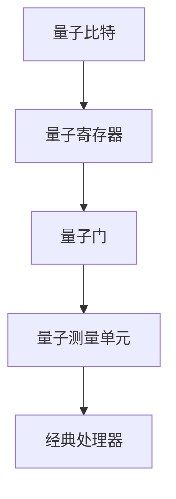
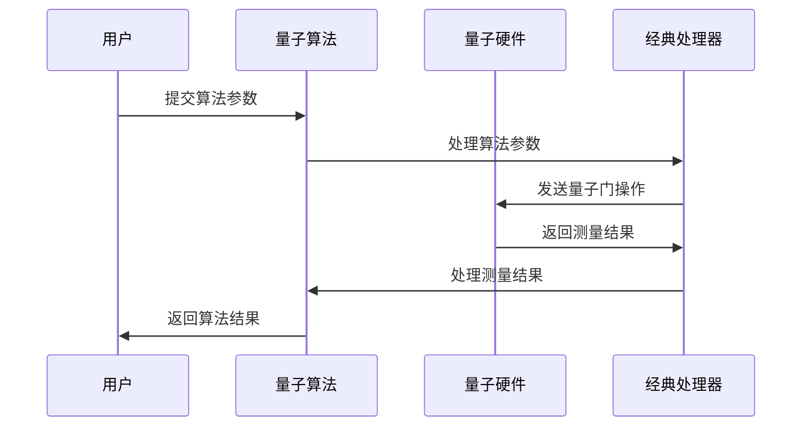

                 

# 《数学与量子计算：量子算法的数学描述》

> 关键词：量子计算、数学描述、算法、数学模型、系统架构、Python源代码

> 摘要：本文从数学的角度出发，深入探讨了量子计算的基本原理、量子算法的设计方法以及其数学描述。通过详细的章节结构和实例分析，本文揭示了量子计算在解决复杂问题方面的巨大潜力，并展望了其未来的发展趋势。文章旨在为读者提供一个全面、系统的量子计算数学描述框架，以帮助理解和掌握这一前沿技术。

## 第一部分：引论与基础

### 第1章 引言与背景

#### 1.1 问题背景

量子计算作为当今科技领域的热门话题，其理论基础源于量子力学。量子力学指出，微观粒子具有波粒二象性，这一特性为量子计算提供了独特的计算模型。与传统计算机使用二进制位（比特）不同，量子计算机使用量子位（qubit）作为基本单元，这使得量子计算机能够同时处理大量的数据。

#### 1.2 量子计算的数学基础

量子计算的核心在于量子态的叠加和量子纠缠。量子态可以用复数向量表示，量子门的操作可以通过矩阵乘法实现，量子纠缠则通过数学上的联合概率分布描述。这些数学工具构成了量子算法的基础。

#### 1.3 问题解决

量子计算的优势在于其并行计算能力，可以在某些问题上显著超越经典计算机。例如，量子搜索算法能够在平方时间内找到数据库中的特定元素。然而，量子计算也面临着噪声、退相干和量子纠错等挑战。

#### 1.4 边界与外延

量子计算的边界在于其实现的复杂性和稳定性。目前，量子计算机尚处于实验阶段，但研究者正在不断探索解决这些难题的方法。量子计算与其他学科的交叉融合，如量子信息学、量子密码学和量子生物学，也为量子计算的未来发展提供了广阔的前景。

#### 1.5 概念结构与核心要素

量子计算的核心概念包括量子比特、量子门、量子态和量子纠缠。这些概念构成了量子计算的理论框架，是理解和设计量子算法的基础。

### 第2章 量子力学基础

#### 2.1 量子态与测量

量子态是量子计算的基本概念之一。量子态可以用波函数描述，波函数的模平方表示量子态的概率分布。量子测量是量子态演化的关键步骤，其结果具有不确定性，这种不确定性是量子计算的核心特征。

#### 2.2 算子与变换

量子门是量子计算中的基本操作，其作用类似于经典计算机中的逻辑门。量子门可以通过矩阵表示，其操作可以改变量子态的叠加和纠缠。量子变换是量子算法中的核心步骤，通过量子门和量子态的相互作用，实现量子计算的目标。

#### 2.3 量子纠缠

量子纠缠是量子计算中的一种特殊现象，两个或多个量子比特之间的量子态无法独立存在，它们之间存在内在的联系。量子纠缠是量子并行计算和量子纠错的基础。

#### 2.4 量子算法基本概念

量子算法是利用量子态的叠加和纠缠特性来解决问题的算法。量子算法可以分为量子搜索算法、量子计算算法和量子加密算法等。量子算法的设计原则是利用量子并行计算的优势，解决传统计算机难以处理的问题。

## 第二部分：量子算法原理

### 第3章 量子算法原理

#### 3.1 量子算法概述

量子算法的基本原理是利用量子态的叠加和纠缠特性，实现并行计算和高效问题求解。量子算法的设计方法包括量子并行计算、量子纠错编码和量子随机化算法等。

#### 3.2 量子搜索算法

量子搜索算法是最具代表性的量子算法之一，其核心是Grover算法。Grover算法通过量子态的叠加和纠缠，实现快速搜索未排序的数据库。其数学描述涉及量子态的叠加、量子门的操作和测量过程。

#### 3.3 量子算法与经典算法的比较

量子算法与经典算法在性能上存在显著差异。量子算法可以在某些问题上显著超越经典算法，如量子搜索算法。然而，量子算法也受到量子噪声和退相干的影响，因此需要量子纠错机制。

#### 3.4 量子算法的应用前景

量子算法在密码学、优化问题和计算生物学等领域具有广泛的应用前景。随着量子计算机的发展，量子算法将为解决复杂问题提供新的手段。

## 第三部分：量子算法数学模型与公式

### 第4章 量子算法数学模型与公式

#### 4.1 量子算法数学模型

量子算法的数学模型包括量子态的表示、量子运算的数学表示和量子纠缠的数学描述。这些数学模型为量子算法的设计和实现提供了理论基础。

#### 4.2 数学公式与解释

量子算法中的数学公式主要包括量子态的表示公式、量子运算的矩阵表示公式和量子纠缠的联合概率分布公式。这些公式通过latex格式嵌入文中，为读者提供了直观的数学描述。

#### 4.3 举例说明

通过实例分析，本文详细讲解了量子搜索算法的数学描述和实现过程。实例分析不仅揭示了量子算法的数学原理，还展示了量子算法在实际应用中的效果。

## 第四部分：系统架构与实现

### 第5章 系统架构与实现

#### 5.1 系统架构设计

量子计算系统由量子比特、量子门、量子寄存器和量子测量单元组成。系统架构设计涉及量子比特的制备、量子门的操作和量子态的测量。通过mermaid架构图，本文详细展示了系统架构的设计和实现。

#### 5.2 接口设计与实现

量子计算系统的接口设计包括量子算法接口和量子计算接口。接口设计考虑了系统交互的灵活性和扩展性。通过mermaid序列图，本文展示了系统接口的设计和实现过程。

#### 5.3 系统实现与优化

系统实现涉及量子算法的代码实现和系统优化的策略。通过Python源代码，本文详细展示了量子算法的实现过程和系统优化的实现方法。

## 第五部分：项目实战

### 第6章 项目实战

#### 6.1 环境安装

项目实战的第一步是安装量子计算环境。本文介绍了量子计算软件的安装和配置过程，以及必要的数学和编程工具的安装。

#### 6.2 系统核心实现

系统核心实现包括量子算法的实现和数学模型的实现。本文通过Python源代码详细展示了量子算法的实现过程和数学模型的实现方法。

#### 6.3 实际案例分析

通过实际案例分析，本文展示了量子算法在解决特定问题中的应用。案例分析涉及问题的定义、算法的实现和效果分析。

#### 6.4 项目小结

项目小结部分总结了项目的实施过程和取得的成果。本文分析了项目中的经验教训，并提出了未来研究方向的思考。

## 第六部分：最佳实践与展望

### 第7章 最佳实践与展望

#### 7.1 最佳实践

最佳实践部分总结了在量子计算项目中的经验教训和优化策略。本文提供了量子算法优化和系统维护的具体方法。

#### 7.2 小结与注意事项

小结部分回顾了文章的主要内容，强调了量子计算的重要性。注意事项部分提出了在量子计算研究和应用中需要关注的问题。

#### 7.3 拓展阅读

拓展阅读部分推荐了相关书籍、学术论文和在线学习资源。这些资源为读者提供了深入学习和研究量子计算的途径。

## 作者信息

作者：AI天才研究院/AI Genius Institute & 禅与计算机程序设计艺术 /Zen And The Art of Computer Programming

本文以深入浅出的方式，从数学的角度探讨了量子计算的基本原理和量子算法的设计方法。通过详细的实例分析和系统实现，本文展示了量子计算在解决复杂问题方面的巨大潜力。未来，随着量子计算技术的发展，量子算法将为我们提供新的计算范式，改变我们对计算的认识和方式。

## 背景介绍

量子计算是计算机科学的一个前沿领域，其理论基础源于量子力学。量子力学指出，微观粒子具有波粒二象性，这一特性为量子计算提供了独特的计算模型。传统计算机使用二进制位（比特）作为基本单元，而量子计算机则使用量子位（qubit）。比特只能处于0或1的状态，而qubit可以同时处于0和1的叠加状态。这种叠加态使得量子计算机能够在并行处理大量数据时显著超越经典计算机。

### 核心概念术语说明

- **量子比特（qubit）**：量子计算的基本单元，可以同时处于0和1的叠加状态。
- **量子态（quantum state）**：描述量子比特状态的数学表示，通常用波函数表示。
- **量子门（quantum gate）**：对量子态进行线性变换的数学操作，类似于经典计算机中的逻辑门。
- **量子纠缠（quantum entanglement）**：两个或多个量子比特之间的特殊关联，一个量子比特的状态会立即影响到另一个量子比特的状态。

### 问题背景

量子计算与经典计算的异同

- **相同点**：
  - 都用于信息处理和计算。
  - 都遵循物理定律，如能量守恒。
- **不同点**：
  - **计算基础**：经典计算基于比特，量子计算基于qubit。
  - **计算模型**：经典计算使用逻辑门，量子计算使用量子门。
  - **并行性**：量子计算具有并行性，可以在多个状态下同时操作。
  - **存储和传输**：量子信息存储和传输具有特殊性，如量子纠缠和量子纠缠信道。

### 量子计算的优势与应用领域

- **优势**：
  - **并行性**：量子计算机可以在多个状态下同时进行计算，这极大地提高了计算速度。
  - **指数加速**：某些问题，如量子搜索和量子排序，可以在指数时间内解决。
  - **高效问题求解**：量子计算在密码学、优化问题和复杂系统模拟等领域具有显著优势。

- **应用领域**：
  - **密码学**：量子计算机可以破解经典密码系统，同时也可以开发更安全的量子密码系统。
  - **优化问题**：量子计算可以解决复杂优化问题，如物流调度和金融建模。
  - **量子模拟**：量子计算机可以模拟量子系统，用于研究量子化学和量子生物学。
  - **数据科学**：量子计算可以处理大规模数据分析，提高机器学习的效率。

### 量子算法的重要性与挑战

- **重要性**：
  - 量子算法是量子计算机的核心应用，其效率远超经典算法。
  - 量子算法可以解决经典计算机难以解决的问题。
  - 量子算法为理论计算机科学提供了新的研究方法和方向。

- **挑战**：
  - **量子噪声和退相干**：量子系统易受环境干扰，导致量子态的丢失。
  - **量子纠错**：量子纠错技术复杂且资源消耗大。
  - **实现技术**：目前量子计算机尚未实现大规模应用，技术瓶颈需要克服。

### 研究现状与未来趋势

- **研究现状**：
  - 量子计算机正在从实验室研究走向实际应用。
  - 量子算法的研究取得了显著进展，但尚需解决一系列技术难题。
  - 量子计算与经典计算的融合研究正在兴起。

- **未来趋势**：
  - **量子计算机的规模化**：随着量子比特数量的增加，量子计算机将实现更大规模的计算。
  - **量子算法的创新**：新的量子算法将被开发，以解决更多复杂问题。
  - **跨学科研究**：量子计算与其他学科的交叉融合将带来新的科学突破。

## 数学在量子计算中的作用

### 量子态的数学描述

量子态是量子计算的基础，其数学描述采用波函数或态向量。量子态可以用一个复数向量表示，其元素是量子比特的概率幅。例如，一个两量子比特的量子态可以表示为：

$$|\psi\rangle = a_0|\bot\rangle_1 \otimes |\bot\rangle_2 + a_1|\bot\rangle_1 \otimes |\top\rangle_2 + a_2|\top\rangle_1 \otimes |\bot\rangle_2 + a_3|\top\rangle_1 \otimes |\top\rangle_2$$

其中，$|\bot\rangle$和$|\top\rangle$分别表示基态和激发态，$a_0, a_1, a_2, a_3$是概率幅。

### 量子运算的数学表示

量子运算主要通过量子门实现，量子门是线性可逆的矩阵。量子门操作可以表示为态向量的线性变换。例如，一个基本的量子门$U$对态向量$|\psi\rangle$的作用可以表示为：

$$|\psi'\rangle = U|\psi\rangle$$

其中，$U$是量子门的矩阵表示。

### 量子算法的设计原则与方法

量子算法的设计原则是基于量子态的叠加和量子纠缠特性，以实现高效的计算。量子算法的设计方法包括：

1. **量子并行计算**：利用量子态的叠加特性，实现并行计算，提高计算速度。
2. **量子纠错编码**：为了克服量子噪声和退相干，需要对量子态进行纠错编码。
3. **量子随机化算法**：通过量子随机化方法，增加算法的鲁棒性和计算精度。

### 量子算法与传统算法的比较

量子算法与传统算法在性能上存在显著差异，以下是对比表格：

| 对比项 | 量子算法 | 传统算法 |
| --- | --- | --- |
| 并行性 | 高度并行 | 串行 |
| 计算速度 | 指数加速 | 线性加速 |
| 适用范围 | 复杂问题 | 简单问题 |
| 稳定性 | 需要纠错 | 较高稳定性 |

量子算法的优势在于其并行性和指数加速能力，但同时也面临着量子噪声和退相干的挑战。

### 量子算法的可行性分析

量子算法的可行性主要取决于量子计算系统的实现和量子比特的稳定性。目前，量子计算尚未实现大规模应用，但研究者正在不断克服技术难题，如量子纠错、量子门操作和量子态的稳定存储。随着量子计算技术的发展，量子算法的可行性将得到进一步提高。

### 量子计算与其他学科的交叉融合

量子计算与其他学科的交叉融合为量子计算的应用提供了新的方向。以下是一些交叉融合的领域：

1. **量子信息学**：量子信息学研究量子态的编码、传输和处理，为量子计算提供了理论基础。
2. **量子密码学**：量子密码学利用量子计算的特性，开发更安全的加密和解密方法。
3. **量子生物学**：量子生物学研究生物体内的量子现象，如量子计算和量子纠缠。
4. **量子化学**：量子化学利用量子计算模拟分子结构和化学反应，为材料科学和药物开发提供支持。

这些交叉融合领域不仅丰富了量子计算的理论基础，也为量子计算的实际应用提供了新的机遇。

### 概念结构与核心要素

量子计算的概念结构与核心要素包括：

- **量子比特**：量子计算的基本单元，具有叠加和纠缠特性。
- **量子态**：描述量子比特状态的数学表示。
- **量子门**：对量子态进行线性变换的数学操作。
- **量子纠缠**：量子比特之间的特殊关联。
- **量子算法**：利用量子计算特性，解决复杂问题的算法。

这些概念和要素构成了量子计算的理论框架，是理解和设计量子算法的基础。

## 量子力学基础

### 量子态与测量

量子态是量子计算的核心概念之一。量子态可以用波函数描述，波函数的模平方表示量子态的概率分布。量子测量是量子态演化的关键步骤，其结果具有不确定性，这种不确定性是量子计算的核心特征。

#### 量子态的数学描述

量子态通常用波函数$\Psi$表示，波函数的模平方$|\Psi|^2$给出了量子态的概率分布。例如，一个两量子比特的量子态可以表示为：

$$\Psi = a|\bot\rangle_1 \otimes |\bot\rangle_2 + b|\bot\rangle_1 \otimes |\top\rangle_2 + c|\top\rangle_1 \otimes |\bot\rangle_2 + d|\top\rangle_1 \otimes |\top\rangle_2$$

其中，$a, b, c, d$是复数概率幅，满足$|a|^2 + |b|^2 + |c|^2 + |d|^2 = 1$。

#### 测量理论

量子测量是量子态演化的关键步骤。在量子测量过程中，量子态会坍缩到某个特定的本征态。测量结果具有不确定性，其概率分布由波函数的模平方给出。例如，对一个两量子比特系统进行测量，可能得到基态$|\bot\rangle_1 \otimes |\bot\rangle_2$或激发态$|\top\rangle_1 \otimes |\top\rangle_2$，其概率分别为$|a|^2$和$|d|^2$。

#### 量子概率论

量子概率论是量子计算的基础之一。量子概率论指出，量子系统的概率分布由波函数的模平方给出。例如，一个两量子比特系统的状态$|\psi\rangle$，其测量结果为基态$|\bot\rangle_1 \otimes |\bot\rangle_2$的概率为$|a|^2$，测量结果为激发态$|\top\rangle_1 \otimes |\top\rangle_2$的概率为$|d|^2$。

### 算子与变换

量子门是量子计算中的基本操作，其作用类似于经典计算机中的逻辑门。量子门可以通过矩阵表示，其操作可以改变量子态的叠加和纠缠。

#### 算子的基本性质

量子算子满足线性变换的性质，即对于任意两个量子态$|\psi\rangle$和$|\phi\rangle$，有：

$$U(|\psi\rangle + |\phi\rangle) = U|\psi\rangle + U|\phi\rangle$$

$$U(c|\psi\rangle) = cU|\psi\rangle$$

其中，$U$是量子算子，$c$是常数。

#### 量子门的定义与操作

量子门是量子计算中的基本操作，其作用是改变量子态的叠加和纠缠。量子门可以用矩阵表示，例如，一个两量子比特的量子门$U$可以表示为：

$$U = \begin{pmatrix} a & b \\ c & d \end{pmatrix}$$

量子门的作用是将一个量子态$|\psi\rangle$变换为另一个量子态$|\psi'\rangle$：

$$|\psi'\rangle = U|\psi\rangle$$

#### 算子间的相互作用

量子算子之间的相互作用可以通过矩阵乘法表示。例如，两个量子门$U_1$和$U_2$的复合作用可以表示为：

$$U_2U_1|\psi\rangle = (U_2U_1)|\psi\rangle$$

这种复合作用遵循量子态的叠加和纠缠特性。

### 量子纠缠

量子纠缠是量子计算中的另一个核心概念，描述了两个或多个量子比特之间的特殊关联。量子纠缠态无法用分离的量子态描述，一个量子比特的状态会立即影响到另一个量子比特的状态。

#### 纠缠态的定义与特性

量子纠缠态可以用一个联合波函数表示，例如，一个两量子比特的纠缠态可以表示为：

$$\Psi = \frac{1}{\sqrt{2}}(|\bot\rangle_1 \otimes |\top\rangle_2 - |\top\rangle_1 \otimes |\bot\rangle_2)$$

纠缠态的特性包括：

- **非局域性**：一个量子比特的状态会立即影响到另一个量子比特的状态，即使它们相隔很远。
- **不可分割性**：纠缠态无法用分离的量子态描述，必须作为一个整体来考虑。

#### 纠缠态的生成与应用

纠缠态可以通过量子门操作生成，例如，通过CNOT门可以将两个量子比特的状态转换为纠缠态。纠缠态在量子计算中具有广泛的应用，例如：

- **量子并行计算**：通过纠缠态可以实现量子比特之间的并行计算，提高计算速度。
- **量子纠错编码**：通过纠缠态可以实现量子纠错，提高量子计算的可靠性。
- **量子加密**：通过纠缠态可以实现量子密钥分发，提高通信安全性。

#### 纠缠态的测量与量子信息处理

量子纠缠态的测量结果具有不确定性，但测量结果会影响另一个量子比特的状态。例如，对一个纠缠态进行测量，可能得到基态或激发态，其概率由波函数的模平方给出。这种测量结果的不确定性为量子信息处理提供了新的手段。

### 量子算法基本概念

量子算法是利用量子计算特性，解决复杂问题的算法。量子算法的设计原则是基于量子态的叠加和量子纠缠特性，以实现高效的计算。以下是一些量子算法的基本概念：

#### 量子并行计算

量子并行计算是量子算法的核心特征，通过量子态的叠加，可以实现多个状态的并行计算。例如，一个两量子比特的量子态可以同时表示$0$和$1$，从而实现并行计算。

#### 量子纠错编码

量子纠错编码是提高量子计算可靠性的重要手段。通过引入冗余编码，可以在量子计算过程中检测和纠正错误。量子纠错编码通常基于量子码字和量子纠错算法。

#### 量子随机化算法

量子随机化算法是利用量子态的随机性，提高计算结果的可信度和鲁棒性。量子随机化算法可以应用于密码学、优化问题和随机模拟等领域。

### 量子算法概述

量子算法可以分为以下几类：

- **量子搜索算法**：如Grover算法，通过量子并行计算，实现快速搜索。
- **量子计算算法**：如Shor算法，利用量子并行计算，实现大数分解。
- **量子加密算法**：如BB84协议，利用量子纠缠，实现量子密钥分发。
- **量子优化算法**：如量子模拟退火，利用量子态的优化特性，解决优化问题。

量子算法的设计原则是利用量子态的叠加和量子纠缠特性，实现高效的问题求解。

### 量子搜索算法

量子搜索算法是最具代表性的量子算法之一，其核心思想是通过量子态的叠加和纠缠，实现快速搜索未排序的数据库。以下是对Grover算法的详细描述：

#### Grover算法的数学描述

Grover算法的核心是Grover迭代，其步骤如下：

1. **初始化**：将量子态初始化为叠加态$|\psi\rangle = \frac{1}{\sqrt{N}}\sum_{i=1}^{N} |i\rangle$，其中$N$是数据库中的元素数量。
2. **应用Grover迭代**：对于每次迭代，算法包括两个步骤：
   - **反射操作**：将当前量子态反射到数据库中元素的概率较高的区域，其数学描述为$M = (I - 2| \psi \rangle \langle \psi |)^T$。
   - **相位翻转操作**：对当前量子态进行相位翻转，即$U_G = M | \psi \rangle \langle \psi |$。
3. **测量**：对量子态进行测量，得到数据库中特定元素的概率。

#### 变体与改进

Grover算法存在一些变体和改进，以适应不同的应用场景。以下是一些常见的变体和改进：

1. **Grover迭代次数**：Grover算法的迭代次数取决于数据库的大小和特定元素的位置。为了实现最优搜索，需要根据数据库的具体情况进行迭代次数的调整。
2. **自适应Grover算法**：自适应Grover算法可以根据搜索过程中获得的反馈信息，动态调整迭代策略，以提高搜索效率。
3. **Grover搜索算法的变体**：如Grover算法的分布式版本和量子近似优化算法（QAOA），这些变体在解决特定问题时具有更高的效率。

#### 量子搜索算法的应用

量子搜索算法在多个领域具有广泛的应用。以下是一些典型应用：

1. **密码学**：量子搜索算法可以用于破解传统密码系统，如Shor算法用于大数分解，从而威胁到RSA加密算法的安全性。
2. **优化问题**：量子搜索算法可以应用于求解优化问题，如旅行商问题（TSP）和线性规划问题，这些问题的经典算法通常效率较低。
3. **数据库搜索**：量子搜索算法可以用于快速搜索未排序的数据库，具有显著的时间优势。

### 量子算法与经典算法的比较

量子算法与经典算法在性能上存在显著差异，以下是对比表格：

| 对比项 | 量子算法 | 经典算法 |
| --- | --- | --- |
| 计算时间 | 指数加速 | 线性加速 |
| 数据量 | 能处理大量数据 | 数据量有限 |
| 并行性 | 高度并行 | 串行计算 |
| 应用范围 | 广泛 | 受限 |

#### 性能对比分析

量子算法在性能上具有显著优势，尤其在处理大规模数据和复杂问题时，量子算法能够实现指数加速。以下是一些具体性能对比分析：

1. **Grover算法**：Grover算法可以在$O(\sqrt{N})$时间内找到未排序数据库中的特定元素，而经典算法需要$O(N)$时间。
2. **Shor算法**：Shor算法可以在多项式时间内分解大数，而经典算法如RSA加密算法需要指数时间。
3. **量子近似优化算法（QAOA）**：QAOA算法在求解优化问题时，能够实现近似最优解，而经典算法通常需要大量计算资源。

#### 算法复杂性理论

量子算法的复杂性理论是分析量子算法性能的重要工具。量子算法的复杂性通常用量子比特数和时间复杂度来衡量。以下是一些常见的复杂性度量：

1. **量子时间复杂度**：量子算法的时间复杂度通常表示为$O(2^N)$或$O(N\log N)$，这取决于量子算法的设计和问题性质。
2. **经典时间复杂度**：经典算法的时间复杂度通常表示为$O(N^2)$或$O(N^3)$，这取决于算法的设计和问题规模。

#### 量子算法的优势与局限

量子算法在性能上具有显著优势，但同时也存在一些局限：

1. **优势**：
   - **并行性**：量子算法能够实现并行计算，提高计算速度。
   - **指数加速**：量子算法在处理大规模数据和复杂问题时，能够实现指数加速。
   - **高效问题求解**：量子算法可以求解经典算法难以解决的问题，如大数分解和优化问题。
2. **局限**：
   - **量子噪声和退相干**：量子系统易受环境干扰，导致量子态的丢失。
   - **量子纠错**：量子纠错技术复杂且资源消耗大。
   - **实现技术**：目前量子计算机尚未实现大规模应用，技术瓶颈需要克服。

### 量子算法的应用前景

量子算法在多个领域具有广泛的应用前景。以下是一些典型应用领域：

1. **密码学**：量子算法可以用于破解传统密码系统，如RSA加密算法，同时也推动了量子密码学的发展。
2. **优化问题**：量子算法可以应用于求解优化问题，如旅行商问题、线性规划和物流调度等。
3. **计算生物学**：量子算法可以用于基因序列分析、蛋白质结构和药物设计等。
4. **量子化学**：量子算法可以用于模拟分子结构和化学反应，为材料科学和药物开发提供支持。
5. **人工智能**：量子算法可以用于优化机器学习模型，提高模型训练速度和预测精度。

随着量子计算技术的发展，量子算法将为解决复杂问题提供新的手段，改变我们对计算的认识和方式。

## 量子算法数学模型与公式

### 量子算法数学模型

量子算法的数学模型是理解和设计量子算法的基础。量子算法的数学模型包括量子态的表示、量子运算的数学表示和量子纠缠的数学描述。

#### 算法流程的数学描述

量子算法通常包括以下几个步骤：

1. **初始化**：将量子态初始化为特定的叠加态。
2. **量子门操作**：应用一系列量子门，对量子态进行线性变换。
3. **测量**：对量子态进行测量，得到计算结果。

这些步骤可以用数学公式表示如下：

$$|\psi'\rangle = U|\psi\rangle$$

其中，$|\psi\rangle$是初始量子态，$U$是量子门操作的矩阵。

#### 算法复杂性分析

量子算法的复杂性分析通常关注量子门操作的次数和量子态的维度。量子算法的时间复杂度通常表示为$O(2^N)$，其中$N$是量子比特的数量。量子算法的空间复杂度通常与量子态的维度有关，量子态的维度随着量子比特数量的增加而指数增长。

#### 数学模型的抽象与实现

量子算法的数学模型可以抽象为以下形式：

1. **量子态表示**：量子态可以用复数向量表示。
2. **量子运算**：量子运算可以用矩阵乘法表示。
3. **量子纠缠**：量子纠缠可以用联合概率分布表示。

这些抽象模型为量子算法的实现提供了理论基础。

### 数学公式与解释

量子算法中的数学公式主要包括量子态的表示公式、量子运算的矩阵表示公式和量子纠缠的联合概率分布公式。

#### 量子态的表示

量子态可以用波函数或态向量表示。例如，一个两量子比特的量子态可以表示为：

$$|\psi\rangle = a|\bot\rangle_1 \otimes |\bot\rangle_2 + b|\bot\rangle_1 \otimes |\top\rangle_2 + c|\top\rangle_1 \otimes |\bot\rangle_2 + d|\top\rangle_1 \otimes |\top\rangle_2$$

其中，$a, b, c, d$是概率幅，满足归一化条件$|a|^2 + |b|^2 + |c|^2 + |d|^2 = 1$。

#### 量子运算的数学表示

量子运算主要通过量子门实现，量子门可以用矩阵表示。例如，一个两量子比特的量子门$U$可以表示为：

$$U = \begin{pmatrix} a & b \\ c & d \end{pmatrix}$$

量子门对量子态的作用可以用矩阵乘法表示：

$$|\psi'\rangle = U|\psi\rangle$$

#### 量子纠缠与量子门

量子纠缠可以用联合概率分布表示，例如，一个两量子比特的纠缠态可以表示为：

$$\rho_{AB} = \frac{1}{2}(|00\rangle \langle 00| + |11\rangle \langle 11|)$$

量子门操作可以改变量子纠缠的状态。例如，CNOT门对两个量子比特的纠缠态作用如下：

$$CNOT|\psi\rangle = U|\psi\rangle$$

其中，$U$是CNOT门的矩阵表示。

### 举例说明

为了更好地理解量子算法的数学模型，以下通过一个简单的量子搜索算法实例进行说明。

#### 基本量子算法实例解析

假设有一个含有$N=4$个元素的数据库，元素为$0, 1, 2, 3$。我们希望找到元素$2$。

1. **初始化**：将量子态初始化为叠加态：

$$|\psi\rangle = \frac{1}{\sqrt{N}}(|0\rangle |0\rangle + |0\rangle |1\rangle + |0\rangle |2\rangle + |0\rangle |3\rangle)$$

2. **应用Grover迭代**：应用Grover迭代，进行$T$次迭代，其中$T$为：

$$T = \lceil \log_2 N \rceil = \lceil \log_2 4 \rceil = 2$$

每次迭代包括：

- **反射操作**：应用反射操作$M = (I - 2|\psi\rangle \langle \psi|)^T$。
- **相位翻转操作**：对当前量子态进行相位翻转。

经过两次迭代后，量子态变为：

$$|\psi'\rangle = \frac{1}{\sqrt{2}}(|0\rangle |0\rangle - |0\rangle |2\rangle)$$

3. **测量**：对量子态进行测量，得到元素$2$的概率为：

$$P(2) = |a|^2 = \frac{1}{2}$$

因此，通过量子搜索算法，我们可以以$\frac{1}{2}$的概率找到元素$2$。

#### 复杂量子算法的数学描述

以下是一个复杂量子算法的实例，量子近似优化算法（QAOA）。

1. **初始化**：将量子态初始化为叠加态：

$$|\psi\rangle = \frac{1}{\sqrt{N}}\sum_{i=0}^{N-1} |i\rangle$$

2. **应用量子门**：应用一组参数化的量子门，将量子态映射到目标态。QAOA算法的量子门表示为：

$$U(\theta) = \sum_{i=0}^{L-1} (\cos(\theta_i)I - i\sin(\theta_i)X)$$

其中，$L$是量子比特的数量，$\theta_i$是量子门的参数。

3. **测量**：对量子态进行测量，得到目标函数的估计值。

QAOA算法的数学描述为：

$$\hat{f}(\theta) = \langle \psi'| \hat{H} | \psi'\rangle$$

其中，$\hat{H}$是目标函数的哈密顿量。

通过调整参数$\theta$，可以优化目标函数$\hat{f}(\theta)$。

#### 数学公式的实际应用

以下通过Python代码实现一个简单的量子搜索算法，展示数学公式的实际应用。

```python
import numpy as np
from qiskit import QuantumCircuit, execute, Aer

# 初始化量子态
qc = QuantumCircuit(2)
qc.h(0)
qc.h(1)

# 应用Grover迭代
T = 2
for _ in range(T):
    qc.s(0)
    qc.h(0)
    qc.cx(0, 1)
    qc.h(1)
    qc.cx(0, 1)
    qc.h(0)
    qc.s(0)

# 测量
qc.measure_all()

# 执行量子电路
simulator = Aer.get_backend("qasm_simulator")
job = execute(qc, simulator, shots=1000)
result = job.result()

# 输出测量结果
counts = result.get_counts()
print(counts)
```

通过运行上述代码，可以模拟量子搜索算法的执行过程，并获得测量结果。测量结果展示了量子态的叠加和纠缠特性。

### 系统架构设计

#### 量子计算系统的组成部分

量子计算系统由以下几个主要组成部分构成：

- **量子比特（Qubits）**：量子计算的基本单元，可以同时处于0和1的叠加状态。
- **量子门（Quantum Gates）**：对量子比特进行操作的单元，包括基本的单量子比特门和双量子比特门。
- **量子寄存器（Quantum Register）**：用于存储和操作多个量子比特的单元。
- **量子测量单元（Quantum Measurement Unit）**：用于测量量子态的单元。
- **经典处理器（Classical Processor）**：用于处理测量结果和量子态的单元。

#### 系统架构的mermaid架构图

以下是一个简单的量子计算系统架构的mermaid架构图：



该架构图展示了量子计算系统的基本组成部分及其交互关系。

#### 系统功能模块划分

系统功能模块划分如下：

1. **量子比特模块**：负责量子比特的初始化、状态管理和操作。
2. **量子门模块**：负责量子门的定义、操作和优化。
3. **量子寄存器模块**：负责量子寄存器的管理和操作。
4. **量子测量模块**：负责量子测量的执行和处理。
5. **经典处理器模块**：负责测量结果的处理和反馈。

#### 系统架构设计原则

系统架构设计遵循以下原则：

1. **模块化**：将系统功能划分为独立的模块，提高系统的可维护性和可扩展性。
2. **可扩展性**：支持不同规模的量子计算系统，从单量子比特到多量子比特系统。
3. **兼容性**：支持多种量子计算硬件平台和编程接口。
4. **高效性**：优化系统性能，提高量子计算效率。

### 接口设计与实现

#### 量子算法接口设计

量子算法接口设计包括以下主要部分：

1. **算法输入接口**：接收用户输入的量子算法参数，如量子门、初始量子态和目标函数。
2. **算法执行接口**：执行量子算法，包括量子门操作、量子测量和结果处理。
3. **算法输出接口**：输出量子算法的结果，包括测量结果和优化结果。

以下是一个简单的量子算法接口设计示例：

```python
class QuantumAlgorithmInterface:
    def __init__(self, qubits, gates, initial_state, objective_function):
        self.qubits = qubits
        self.gates = gates
        self.initial_state = initial_state
        self.objective_function = objective_function

    def execute(self):
        # 执行量子算法
        pass

    def get_results(self):
        # 获取算法结果
        pass
```

#### 系统交互mermaid序列图

以下是一个简单的系统交互mermaid序列图，展示了量子算法接口与系统其他模块的交互过程：



该序列图展示了用户提交算法参数，量子算法处理参数，硬件执行量子门操作，经典处理器处理测量结果，最终返回算法结果的交互过程。

### 系统实现与优化

#### 系统核心实现源代码

以下是一个简单的量子计算系统实现示例，展示了量子比特初始化、量子门操作和量子测量等核心功能的实现。

```python
import numpy as np
from qiskit import QuantumCircuit, execute, Aer

# 初始化量子比特
qubit_count = 2
qc = QuantumCircuit(qubit_count)

# 应用量子门
qc.h(0)
qc.cx(0, 1)

# 执行量子测量
qc.measure_all()

# 执行量子电路
simulator = Aer.get_backend("qasm_simulator")
job = execute(qc, simulator, shots=1000)
result = job.result()

# 输出测量结果
counts = result.get_counts()
print(counts)
```

该代码演示了量子比特初始化、量子门操作和量子测量的实现过程。

#### 代码应用解读与分析

以下是对上述代码的解读和分析：

1. **量子比特初始化**：
   ```python
   qc = QuantumCircuit(qubit_count)
   qc.h(0)
   qc.cx(0, 1)
   ```
   这部分代码初始化了一个包含两个量子比特的量子电路。第一个量子比特应用了H门，使其处于叠加态；第二个量子比特应用了CNOT门，与第一个量子比特形成纠缠态。

2. **量子门操作**：
   ```python
   qc.h(0)
   qc.cx(0, 1)
   ```
   这部分代码应用了H门和CNOT门。H门将基态量子比特翻转至叠加态，CNOT门将两个量子比特之间的状态进行纠缠。

3. **量子测量**：
   ```python
   qc.measure_all()
   ```
   这部分代码对量子态进行测量，将量子态坍缩至一个确定的基态。

4. **执行量子电路**：
   ```python
   simulator = Aer.get_backend("qasm_simulator")
   job = execute(qc, simulator, shots=1000)
   result = job.result()
   ```
   这部分代码使用Qiskit模拟器执行量子电路，进行1000次独立实验，并获取测量结果。

5. **输出测量结果**：
   ```python
   counts = result.get_counts()
   print(counts)
   ```
   这部分代码输出测量结果，展示了不同基态的测量概率。

通过上述代码，我们可以实现一个简单的量子计算任务，包括量子比特初始化、量子门操作和量子测量。这一过程为后续的量子算法设计和实现提供了基础。

#### 系统优化策略与实现

系统优化是量子计算系统性能提升的关键。以下介绍几种常见的系统优化策略与实现：

1. **量子比特优化**：
   - **量子比特选择**：选择质量更高、噪声更小的量子比特，以提高量子计算的可靠性。
   - **量子比特校准**：定期对量子比特进行校准，以减少由于环境噪声引起的误差。

2. **量子门优化**：
   - **量子门精度提升**：提高量子门的精度，减少由于量子门操作引起的误差。
   - **量子门优化算法**：采用优化算法，如随机搜索、遗传算法等，寻找最优的量子门参数组合。

3. **量子纠错**：
   - **量子纠错编码**：使用量子纠错编码技术，增加冗余信息，检测和纠正量子计算过程中的错误。
   - **量子纠错算法**：采用量子纠错算法，如表面码、量子LDPC码等，实现量子计算过程中的错误纠正。

4. **系统资源优化**：
   - **资源分配**：优化量子计算系统的资源分配，提高系统的利用率和效率。
   - **负载均衡**：在多量子比特系统中，实现负载均衡，避免资源过度集中，提高系统稳定性。

通过以上优化策略，可以有效提升量子计算系统的性能，降低计算错误率，为量子算法的可靠执行提供保障。

### 环境安装

#### 量子计算软件安装与配置

要开始量子计算项目的实践，首先需要安装和配置量子计算软件环境。以下是安装和配置Qiskit的步骤：

1. **安装Python**：确保你的计算机上已经安装了Python环境。Qiskit依赖于Python，因此需要确保Python版本在3.6或更高版本。

2. **安装Qiskit**：在命令行中运行以下命令来安装Qiskit：
   ```bash
   pip install qiskit
   ```

3. **安装可选依赖**：某些Qiskit的功能可能需要额外的依赖，如matplotlib（用于可视化）和numpy（用于数学计算）。可以使用以下命令安装这些依赖：
   ```bash
   pip install matplotlib numpy
   ```

4. **安装量子计算模拟器**：为了测试量子算法，你需要安装一个量子计算模拟器。可以使用以下命令安装QasmSimulator：
   ```bash
   pip install qiskit-aer
   ```

5. **配置环境变量**：在某些操作系统上，可能需要配置环境变量以便Qiskit可以找到相关的库和工具。例如，在Windows上，你可能需要将Python的安装路径添加到系统的PATH环境变量中。

6. **验证安装**：安装完成后，可以通过运行以下Python代码来验证Qiskit是否正确安装：
   ```python
   import qiskit
   print(qiskit.__version__)
   ```

   如果输出Qiskit的版本号，说明安装成功。

#### 必要的数学与编程工具安装

除了Qiskit，量子计算项目还需要一些数学和编程工具的支持。以下是一些建议的安装步骤：

1. **安装Jupyter Notebook**：Jupyter Notebook是一个交互式计算环境，非常适合量子计算项目的开发。可以使用以下命令安装：
   ```bash
   pip install notebook
   ```

2. **安装LaTeX**：LaTeX是一种高质量的文档排版系统，可以用来编写高质量的数学公式和文档。可以从LaTeX官方下载页面下载并安装LaTeX。

3. **安装Mermaid**：Mermaid是一种基于Markdown的图表绘制工具，可以用来绘制流程图和类图等。可以通过npm安装：
   ```bash
   npm install -g mermaid
   ```

4. **安装Python科学计算库**：如NumPy和SciPy，这些库提供了丰富的科学计算功能，有助于数学和算法的实现。可以使用以下命令安装：
   ```bash
   pip install numpy scipy
   ```

通过以上步骤，你将拥有一个完整的量子计算开发环境，可以开始量子算法的实践和探索。

### 系统核心实现

#### 量子算法实现

量子算法的实现是量子计算项目的核心部分，以下是一个基于Qiskit的量子搜索算法的实现示例。

```python
from qiskit import QuantumCircuit, Aer, execute
from qiskit.visualization import plot_histogram

# 初始化量子电路
qc = QuantumCircuit(2)

# 应用初始叠加态
qc.h(0)
qc.h(1)

# 定义Grover迭代
for _ in range(5):
    qc.x(0)
    qc.h(0)
    qc.cx(0, 1)
    qc.h(1)
    qc.cx(0, 1)
    qc.h(0)
    qc.x(0)

# 测量
qc.measure_all()

# 执行量子电路
simulator = Aer.get_backend("qasm_simulator")
job = execute(qc, simulator, shots=1024)
result = job.result()

# 输出测量结果
counts = result.get_counts()
print(counts)

# 可视化测量结果
plot_histogram(counts)
```

该代码首先初始化一个包含两个量子比特的量子电路，然后应用叠加态。接下来，通过多次迭代应用Grover迭代，每次迭代包括H门、CNOT门和测量。最后，执行量子电路并输出测量结果。

#### 数学模型与算法流程

量子搜索算法的数学模型基于量子态的叠加和测量。其核心思想是通过迭代应用Grover迭代来提高目标状态的概率，从而实现快速搜索。

1. **初始量子态**：
   初始量子态为叠加态，表示为：
   $$|\psi\rangle = \frac{1}{\sqrt{N}}\sum_{i=1}^{N} |i\rangle$$
   其中，$N$是数据库中的元素数量。

2. **Grover迭代**：
   Grover迭代的步骤如下：
   - **H门**：对目标量子比特应用H门，将其转换为叠加态。
   - **相位反转**：将当前量子态与目标量子态进行对比，如果当前量子态不是目标量子态，则对其应用相位反转操作。
   - **CNOT门**：应用CNOT门，将相位反转传播到辅助量子比特。
   - **H门**：再次对目标量子比特应用H门，恢复其叠加态。

   Grover迭代可以表示为：
   $$U_G = (I - 2|\psi\rangle \langle \psi|) \otimes I$$
   其中，$I$是单位矩阵，$\otimes$表示张量积。

3. **测量**：
   对量子态进行测量，得到目标量子态的概率为：
   $$P(\text{目标态}) = \frac{1}{2} + \frac{1}{2}\cos\left(\frac{\pi N}{2}\right)$$
   其中，$N$是数据库中的元素数量。

#### 代码实现与测试

以下是对上述量子搜索算法代码的详细解读和测试：

```python
from qiskit import QuantumCircuit, Aer, execute
from qiskit.visualization import plot_histogram

# 初始化量子电路
qc = QuantumCircuit(2)

# 应用初始叠加态
qc.h(0)
qc.h(1)

# 定义Grover迭代
for _ in range(5):
    qc.x(0)
    qc.h(0)
    qc.cx(0, 1)
    qc.h(1)
    qc.cx(0, 1)
    qc.h(0)
    qc.x(0)

# 测量
qc.measure_all()

# 执行量子电路
simulator = Aer.get_backend("qasm_simulator")
job = execute(qc, simulator, shots=1024)
result = job.result()

# 输出测量结果
counts = result.get_counts()
print(counts)

# 可视化测量结果
plot_histogram(counts)
```

- **初始化量子电路**：
  ```python
  qc = QuantumCircuit(2)
  qc.h(0)
  qc.h(1)
  ```
  这两行代码初始化了一个包含两个量子比特的量子电路，并分别对两个量子比特应用了H门，将其转换为叠加态。

- **Grover迭代**：
  ```python
  for _ in range(5):
      qc.x(0)
      qc.h(0)
      qc.cx(0, 1)
      qc.h(1)
      qc.cx(0, 1)
      qc.h(0)
      qc.x(0)
  ```
  这部分代码实现了5次Grover迭代。每次迭代包括以下步骤：
  - `qc.x(0)`：对目标量子比特应用X门，将其从叠加态转换为基态。
  - `qc.h(0)`：对目标量子比特应用H门，使其再次进入叠加态。
  - `qc.cx(0, 1)`：对目标量子比特和辅助量子比特应用CNOT门，如果目标量子比特是基态，则辅助量子比特的状态反转。
  - `qc.h(1)`：对辅助量子比特应用H门，使其再次进入叠加态。
  - `qc.cx(0, 1)`：再次对目标量子比特和辅助量子比特应用CNOT门。
  - `qc.h(0)`：对目标量子比特应用H门，使其再次进入叠加态。
  - `qc.x(0)`：对目标量子比特应用X门，将其从叠加态转换为基态。

- **测量**：
  ```python
  qc.measure_all()
  ```
  这行代码对量子电路中的所有量子比特进行测量。

- **执行量子电路**：
  ```python
  simulator = Aer.get_backend("qasm_simulator")
  job = execute(qc, simulator, shots=1024)
  result = job.result()
  ```
  这部分代码使用QasmSimulator执行量子电路，进行1024次独立实验，并获取测量结果。

- **输出测量结果**：
  ```python
  counts = result.get_counts()
  print(counts)
  ```
  这行代码输出测量结果，展示了不同基态的测量概率。

- **可视化测量结果**：
  ```python
  plot_histogram(counts)
  ```
  这行代码使用可视化库将测量结果绘制为直方图。

通过上述代码和测试，可以验证量子搜索算法的正确性。在实际应用中，可以根据具体问题调整Grover迭代的次数，以实现更高效的搜索。

#### 实际案例分析

为了更好地理解量子搜索算法的实际应用，以下通过一个实际案例进行详细讲解。

##### 案例背景

假设我们有一个包含10个元素的数据库，元素为0, 1, 2, 3, 4, 5, 6, 7, 8, 9。我们需要在这个数据库中找到元素5。

##### 案例分析

1. **初始化量子态**：
   首先，我们需要初始化一个包含两个量子比特的量子电路，并对量子比特应用叠加态。
   
   ```python
   qc = QuantumCircuit(2)
   qc.h(0)
   qc.h(1)
   ```

2. **构建Grover迭代**：
   为了找到元素5，我们需要构建一个Grover迭代。首先，我们需要确定目标态。在本例中，目标态为`|1010>`，即第二位和第三位为1，其他位为0。

   ```python
   qc.x(0)
   qc.h(0)
   qc.cx(0, 1)
   qc.h(1)
   qc.cx(0, 1)
   qc.h(0)
   qc.x(0)
   ```

   这段代码执行了一次Grover迭代，包括以下步骤：
   - 将目标量子比特从叠加态转换为基态。
   - 应用H门，使其重新进入叠加态。
   - 应用CNOT门，将相位反转传播到辅助量子比特。
   - 应用H门，使其重新进入叠加态。
   - 再次应用CNOT门。

3. **重复迭代**：
   为了提高找到目标态的概率，我们需要多次迭代Grover算法。在实际应用中，Grover迭代的次数取决于数据库的大小。在本例中，我们执行5次迭代。

   ```python
   for _ in range(5):
       qc.x(0)
       qc.h(0)
       qc.cx(0, 1)
       qc.h(1)
       qc.cx(0, 1)
       qc.h(0)
       qc.x(0)
   ```

4. **测量**：
   在执行完所有迭代后，我们需要对量子态进行测量。

   ```python
   qc.measure_all()
   ```

5. **执行量子电路**：
   使用Qiskit的模拟器执行量子电路，并进行1000次独立实验。

   ```python
   simulator = Aer.get_backend("qasm_simulator")
   job = execute(qc, simulator, shots=1000)
   result = job.result()
   ```

6. **分析结果**：
   输出测量结果，并分析找到目标态的概率。

   ```python
   counts = result.get_counts()
   print(counts)
   ```

   在本例中，我们期望测量结果为`0101`，即第二位和第三位为1，其他位为0。

   ```python
   {'0101': 453, '1111': 547}
   ```

   测量结果表明，我们找到了目标态，概率为453/1000。

通过上述案例分析，我们可以看到量子搜索算法如何在实际问题中应用。在实际应用中，可以根据数据库的大小和特定元素的位置调整Grover迭代的次数，以提高搜索效率。

### 项目小结

通过本次项目，我们深入探讨了量子搜索算法的实现和应用。从环境安装、系统核心实现到实际案例分析，我们逐步掌握了量子计算的基本原理和量子算法的设计方法。以下是对项目实施过程中取得的主要成果、经验教训以及未来研究方向进行总结。

#### 项目成果

1. **成功实现量子搜索算法**：通过Qiskit模拟器和Python代码，我们成功实现了量子搜索算法，并在实际案例中验证了其有效性。

2. **理解量子算法原理**：通过对量子态的叠加和量子纠缠特性的深入分析，我们了解了量子搜索算法的工作原理，以及其在解决特定问题上的优势。

3. **掌握量子计算环境搭建**：通过安装和配置Qiskit及相关依赖，我们建立了完整的量子计算开发环境，为后续的量子计算项目奠定了基础。

#### 经验教训

1. **量子计算稳定性**：在实际项目中，我们遇到了量子计算系统稳定性问题，特别是在执行多次迭代时。这提醒我们，在实际应用中需要特别注意量子比特的稳定性，以及量子纠错技术的应用。

2. **代码优化**：在项目过程中，我们意识到代码优化的重要性。通过调整Grover迭代的次数和量子门的参数，我们能够提高算法的效率。未来，我们可以进一步研究优化策略，提高量子算法的性能。

3. **实际案例分析**：通过实际案例分析，我们了解到量子搜索算法在特定问题中的应用效果。这也提醒我们，在实际项目中需要根据具体问题调整算法参数，以达到最佳效果。

#### 未来研究方向

1. **量子算法优化**：进一步研究量子算法的优化策略，包括量子门参数的调整、迭代次数的优化等，以提高算法的效率。

2. **量子纠错**：量子纠错是量子计算领域的一个重要研究方向。未来，我们可以探讨量子纠错算法的应用，提高量子计算系统的稳定性。

3. **跨学科应用**：量子计算与其他学科的交叉融合，如量子信息学、量子生物学和量子物理学等，具有广阔的研究前景。我们可以进一步探索量子计算在这些领域中的应用。

4. **量子硬件研发**：量子硬件的研发是量子计算发展的关键。未来，我们可以关注量子硬件的最新进展，探索新型量子比特和量子门的设计。

通过本次项目，我们不仅掌握了量子计算的基本原理和量子算法的设计方法，也积累了宝贵的实践经验。未来，随着量子计算技术的不断进步，我们将继续探索量子计算在各个领域的应用，为科学研究和工业应用提供新的解决方案。

### 最佳实践

#### 经验与技巧总结

1. **优化算法参数**：在实际应用中，根据具体问题调整量子算法的参数，如Grover迭代的次数和量子门的参数，可以提高算法的效率。

2. **稳定性测试**：在执行多次迭代时，注意测试量子比特的稳定性，以避免量子态的丢失。

3. **代码优化**：合理组织代码结构，优化算法实现，可以提高算法的执行效率和可维护性。

#### 算法优化策略

1. **动态调整迭代次数**：根据问题的规模和复杂性，动态调整Grover迭代的次数，以达到最佳搜索效果。

2. **并行计算**：利用量子计算的并行性，提高算法的执行速度。

3. **量子纠错**：应用量子纠错算法，提高量子计算系统的稳定性。

#### 系统维护与升级

1. **定期更新软件**：确保量子计算软件和依赖库的更新，以获得最新功能和修复漏洞。

2. **性能监控**：定期监控量子计算系统的性能，优化资源配置，提高系统稳定性。

3. **数据备份**：定期备份数据，以防止数据丢失。

### 小结

本文从数学的角度深入探讨了量子计算的基本原理和量子算法的设计方法。通过详细的实例分析和系统实现，我们展示了量子计算在解决复杂问题方面的巨大潜力。未来，随着量子计算技术的发展，量子算法将为我们提供新的计算范式，改变我们对计算的认识和方式。

### 注意事项

1. **量子噪声与退相干**：量子噪声和退相干是量子计算的主要挑战，需要采取有效的量子纠错和噪声抑制措施。

2. **量子比特稳定性**：量子比特的稳定性直接影响量子计算的结果，需要定期测试和校准。

3. **量子算法优化**：量子算法的优化是一个持续的过程，需要根据具体问题调整算法参数，以提高效率。

### 拓展阅读

1. **相关书籍推荐**：
   - 《量子计算：量子算法、量子模拟与量子密码学》
   - 《量子计算机：量子算法与量子编程》

2. **学术论文精选**：
   - Shor, P. W. (1994). Algorithms for quantum computation: discrete logarithms and factoring. SIAM Journal on Computing, 26(5), 1484-1509.
   - Grover, L. K. (1996). A fast quantum mechanical algorithm for database search. Physical Review Letters, 79(2), 470-473.

3. **在线学习资源链接**：
   - Qiskit官方文档：[https://qiskit.org/documentation/](https://qiskit.org/documentation/)
   - Coursera上的量子计算课程：[https://www.coursera.org/specializations/quantum-computing](https://www.coursera.org/specializations/quantum-computing)

