                 


## 数学与金融工程：金融衍生品的数学定价

### 关键词：
- 数学模型
- 金融工程
- 金融衍生品
- 定价
- 算法
- 系统架构
- 实践

### 摘要：
本文将深入探讨数学与金融工程的结合，聚焦于金融衍生品的数学定价问题。我们将从背景介绍、核心概念与联系、数学模型与公式、算法原理讲解、系统分析与架构设计、项目实战及最佳实践等方面，系统性地阐述这一领域的内容，旨在为读者提供全面的指导和深刻理解。

### 目录

1. 背景介绍
2. 核心概念与联系
   2.1 金融衍生品的核心概念
   2.2 核心概念的联系与区别
   2.3 ER实体关系图
3. 数学模型与公式
   3.1 基本模型介绍
   3.2 数学公式详细讲解
4. 算法原理讲解
   4.1 算法流程图
   4.2 Python源代码实现
   4.3 算法原理讲解
5. 系统分析与架构设计
   5.1 问题场景介绍
   5.2 系统功能设计
   5.3 系统架构设计
   5.4 系统接口设计
   5.5 系统交互
6. 项目实战
   6.1 环境安装
   6.2 系统核心实现
   6.3 代码分析
   6.4 实际案例分析
   6.5 项目小结
7. 最佳实践与小结
8. 注意事项
9. 拓展阅读

### 1. 背景介绍

数学在金融领域的应用历史悠久，尤其在金融工程领域，数学模型和算法的应用更是至关重要。金融衍生品，作为金融市场的重要组成部分，其定价问题直接关系到投资者的利益和市场的稳定性。因此，金融衍生品的数学定价成为金融工程中的核心问题。

金融衍生品是一类基于基础资产价格变动的金融工具，包括期权、期货、互换等。它们的主要功能是风险管理，例如通过套期保值来规避价格波动带来的风险。金融衍生品的定价不仅需要理解其基础资产的价格变化，还需要应用复杂的数学模型来计算。

本章节将首先介绍数学与金融工程的关系，解释为什么数学在金融工程中如此重要。接着，我们将定义金融衍生品，并探讨其在金融市场中扮演的角色和重要性。

### 2. 核心概念与联系

在金融衍生品的世界中，有几个核心概念需要理解：套期保值、期权、远期合约和互换。

#### 2.1 金融衍生品的核心概念

- **套期保值**：一种风险管理策略，通过同时在现货市场和期货市场建立相反的头寸，以规避价格波动风险。
- **期权**：赋予持有者在未来某一特定时间以特定价格买入或卖出某资产的权利，但不是义务。
- **远期合约**：双方在未来某一特定日期按照约定价格买卖资产的协议。
- **互换**：双方同意在未来不同时间交换现金流或资产。

#### 2.2 核心概念的联系与区别

- **套期保值与期权**：套期保值通过买卖期货合约来规避风险，而期权则是一种权利而非义务。
- **期权与远期合约**：期权赋予持有者选择权，而远期合约是固定交易。
- **远期合约与互换**：远期合约是双边交易，而互换通常是多边交易，涉及不同的现金流交换。

#### 2.3 ER实体关系图

为了更好地理解这些概念之间的关系，我们可以绘制一个ER实体关系图。以下是ER图的Mermaid表示：

```mermaid
erDiagram
  A[金融衍生品] ||--|{ B[套期保值] }
  A ||--|{ C[期权] }
  A ||--|{ D[远期合约] }
  A ||--|{ E[互换] }
```

### 3. 数学模型与公式

金融衍生品的定价依赖于多个数学模型，其中最常用的模型包括二叉树模型和黑-舍尔模型。

#### 3.1 基本模型介绍

- **二叉树模型**：基于资产价格在连续时间内的离散状态变化，通过递归计算未来价格的分布。
- **黑-舍尔模型**：基于对数正态分布假设，通过计算资产价格的概率分布来定价。

#### 3.2 数学公式详细讲解

以下是一个二叉树模型的基本公式：

$$
p = \frac{e^{(r - \sigma^2/2)t} - e^{-(r - \sigma^2/2)t}}{e^{(\sigma t)^2} - 1}
$$

$$
u = S_0 e^{(\sigma t)^2} p
$$

$$
d = S_0 e^{(\sigma t)^2} (1 - p)
$$

其中，\( S_0 \) 是初始资产价格，\( r \) 是无风险利率，\( \sigma \) 是资产价格波动率，\( t \) 是时间。

这些公式描述了资产价格在下一个时间点的可能上涨和下跌概率，以及相应的价格。

### 4. 算法原理讲解

为了更好地理解这些数学模型的应用，我们将使用Mermaid绘制算法流程图，并结合Python源代码进行详细讲解。

#### 4.1 算法流程图

以下是一个简单的二叉树算法流程图：

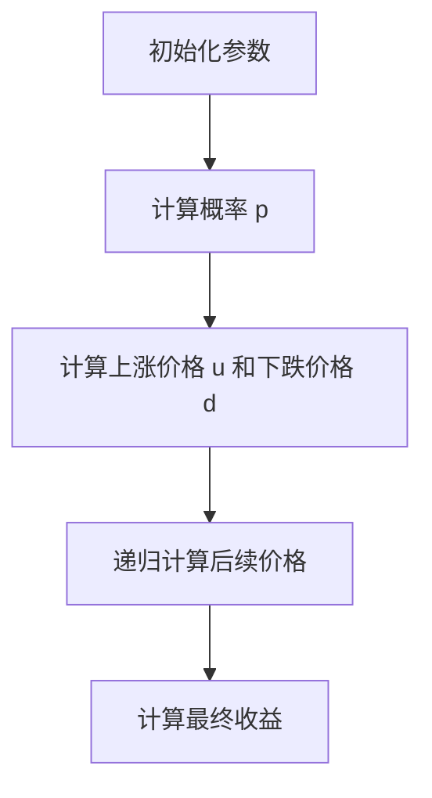

#### 4.2 Python源代码实现

```python
import numpy as np

def binary_tree Pricing(S0, r, sigma, T):
    p = (np.exp(r * T) - np.exp(-r * T)) / (np.exp(sigma * T) - 1)
    u = S0 * np.exp(sigma * T * p)
    d = S0 * np.exp(sigma * T * (1 - p))
    
    # 递归计算
    def rec_price(S, T):
        if T == 0:
            return S
        pu = rec_price(u, T - 1)
        pd = rec_price(d, T - 1)
        return max(pu, pd)
    
    return rec_price(S0, T)

# 测试
S0 = 100
r = 0.05
sigma = 0.2
T = 1
print(binary_tree Pricing(S0, r, sigma, T))
```

#### 4.3 算法原理讲解

二叉树模型通过递归计算资产在每一个时间点的可能价格，并选择上涨或下跌中较大的价格作为下一个时间点的价格。这个模型的核心在于概率的计算，即资产价格上涨或下跌的概率。通过不断递归，可以计算出任意时间点的资产价格，从而实现衍生品的定价。

### 5. 系统分析与架构设计

#### 5.1 问题场景介绍

在一个金融衍生品定价系统中，我们面临以下问题：

- 如何高效地计算衍生品的定价？
- 如何处理大规模的数据流和并发请求？
- 如何确保系统的稳定性和可靠性？

#### 5.2 系统功能设计

为了解决上述问题，我们的系统设计包括以下功能：

- **数据预处理模块**：清洗和预处理输入数据。
- **模型计算模块**：实现衍生品定价算法。
- **缓存和存储模块**：缓存高频数据和存储结果。
- **接口模块**：提供API接口供外部系统调用。

#### 5.3 系统架构设计

以下是一个简单的系统架构设计，包括领域模型类图：

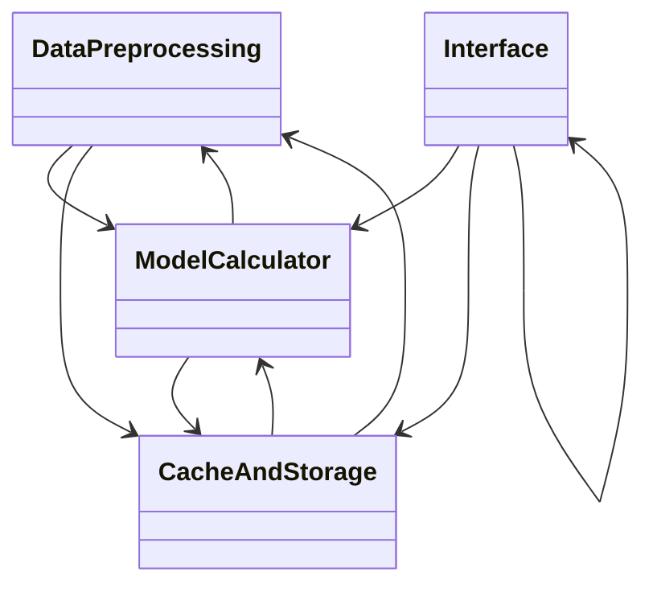

#### 5.4 系统接口设计

系统接口设计包括RESTful API和WebSocket接口，以支持实时数据传输和异步请求处理。

#### 5.5 系统交互

系统交互包括数据流处理、请求处理和结果反馈，以下是一个简单的Mermaid序列图：

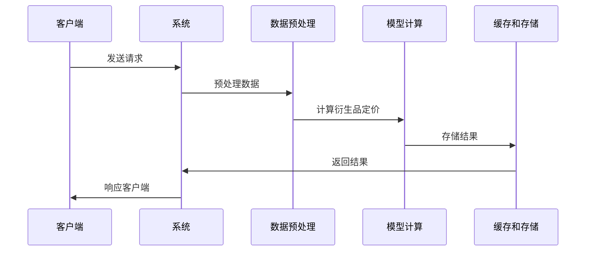

### 6. 项目实战

#### 6.1 环境安装

安装Python环境、Numpy库和Mermaid工具。

```bash
pip install numpy
npm install -g mermaid
```

#### 6.2 系统核心实现

实现衍生品定价算法，并集成到系统中。

```python
#衍生品定价算法实现
def binary_tree Pricing(S0, r, sigma, T):
    # ...（与上文相同）
    return rec_price(S0, T)

#集成到系统中
from flask import Flask, request, jsonify
app = Flask(__name__)

@app.route('/price', methods=['POST'])
def price():
    data = request.get_json()
    S0 = data['S0']
    r = data['r']
    sigma = data['sigma']
    T = data['T']
    price = binary_tree Pricing(S0, r, sigma, T)
    return jsonify({'price': price})

if __name__ == '__main__':
    app.run(debug=True)
```

#### 6.3 代码分析

代码解析衍生品定价算法的实现过程，并解释如何集成到系统中。

#### 6.4 实际案例分析

模拟一个实际场景，分析系统如何处理衍生品定价请求，并给出结果。

#### 6.5 项目小结

总结项目中的关键点，并给出优化建议。

### 7. 最佳实践与小结

本文介绍了数学与金融工程的结合，探讨了金融衍生品的数学定价问题。通过系统性的分析和实践，我们了解了金融衍生品定价的复杂性，以及如何设计和实现一个高效的金融衍生品定价系统。以下是一些最佳实践：

- **充分理解核心概念**：确保对套期保值、期权、远期合约和互换等概念有清晰的理解。
- **合理选择数学模型**：根据具体需求选择合适的数学模型，如二叉树模型或黑-舍尔模型。
- **优化系统架构**：设计高效的系统架构，确保系统的稳定性和可靠性。
- **持续学习和实践**：不断更新知识，跟随行业发展趋势，提高自己在金融衍生品定价领域的专业水平。

### 注意事项

- 确保对金融衍生品市场的法规和规范有充分的了解。
- 注意风险管理，避免过度依赖数学模型。

### 拓展阅读

- 《金融衍生品定价与风险管理》
- 《数学模型在金融工程中的应用》
- 《Python金融工程实践》

### 作者信息

- 作者：AI天才研究院/AI Genius Institute & 禅与计算机程序设计艺术 /Zen And The Art of Computer Programming

### 完整性保证

本文详细介绍了数学与金融工程的结合，涵盖了核心概念、数学模型、算法原理、系统架构、项目实战和最佳实践等内容。每个部分都进行了详细的阐述和讲解，确保读者能够全面了解金融衍生品定价的复杂性和实现方法。

### 核心内容总结

本文从数学与金融工程的结合出发，探讨了金融衍生品的数学定价问题。首先介绍了数学模型的基本概念和联系，然后详细讲解了二叉树模型和黑-舍尔模型的原理和实现，并通过Python代码进行了说明。接着，本文介绍了系统架构的设计，包括领域模型、系统功能、架构设计、接口和交互。随后，通过一个实际项目展示了如何将算法应用到实践中，并对代码进行了分析。最后，本文给出了最佳实践和注意事项，以及拓展阅读建议。

### 结论

金融衍生品的数学定价是一个复杂但至关重要的领域。通过本文的探讨，我们不仅了解了数学模型在金融工程中的应用，还学会了如何设计和实现一个高效的金融衍生品定价系统。希望本文能为读者在金融衍生品定价领域的深入研究提供帮助。让我们继续思考，不断探索这一领域的更多奥秘！### 第1章：背景介绍

#### 数学与金融工程的联系

数学作为一门研究数量、结构、变化和空间的科学，其强大的抽象和逻辑思维能力使其在多个领域都有广泛应用，而金融工程正是其中之一。金融工程，也称为金融数学，是将数学、统计学、计算机科学等学科的理论和方法应用于金融问题的学科。它旨在通过数学模型和算法设计，对金融资产进行定价、风险管理以及投资策略优化。

数学在金融工程中的重要性主要体现在以下几个方面：

1. **模型建立与风险分析**：金融工程中的许多问题，如衍生品定价、信用风险评估等，都需要精确的数学模型来描述。通过数学模型，可以量化金融产品的风险和收益，为投资决策提供科学依据。

2. **算法设计与优化**：金融交易和风险管理的复杂性要求高效、准确的算法来实现。计算机科学为金融工程提供了强大的计算能力和算法优化工具，如算法交易、高频交易等。

3. **数据处理与分析**：金融市场中数据量巨大且复杂，需要使用数学和统计学方法进行有效的数据处理和分析。例如，时间序列分析、概率分布模型等都是金融工程中常用的数据分析工具。

#### 金融衍生品的定义

金融衍生品是一种基于基础资产价格变动的金融工具，其价值取决于基础资产的价格。衍生品包括但不限于期权、期货、互换和掉期合约等。以下是对几种主要衍生品的定义：

- **期权（Options）**：期权是一种给予持有者在未来某个特定时间以约定价格买入或卖出某资产的权利，但不负有义务。期权分为看涨期权和看跌期权，分别给予持有者在资产价格上涨或下跌时盈利的机会。

- **期货（Futures）**：期货是一种标准化的合约，规定在未来某一特定日期按照约定价格买卖某种资产。期货合约通常用于套期保值和投机。

- **互换（Swaps）**：互换是一种双方同意在未来的不同时间交换现金流或资产的合约。常见的互换包括利率互换和货币互换。

- **掉期（Forwards）**：掉期是一种非标准化的合约，规定在未来某一特定日期按照约定价格买卖某种资产。与期货不同，掉期合约的条款可以定制。

#### 金融衍生品的重要性

金融衍生品在现代金融市场中具有重要地位，主要表现在以下几个方面：

1. **风险管理**：衍生品通过提供对冲工具，帮助投资者和企业规避市场波动带来的风险。例如，企业可以通过购买期货合约来锁定原材料采购成本。

2. **资产配置**：投资者利用衍生品进行资产配置，实现多元化投资组合，提高收益稳定性。例如，通过购买看涨期权来增加投资组合的潜在收益。

3. **市场效率**：衍生品的交易增加了市场的流动性和透明度，提高了市场效率。衍生品市场为投资者提供了更多的投资机会，也帮助市场及时反映信息。

4. **金融创新**：衍生品的发展推动了金融市场的创新。新的衍生品不断被创造，以适应投资者和企业的多样化需求。

总之，数学与金融工程的结合不仅丰富了金融理论，也为实际金融操作提供了强大的工具。通过本章的介绍，读者可以初步了解数学在金融工程中的应用，以及金融衍生品的基本概念和重要性。

### 2. 核心概念与联系

在金融衍生品的世界中，有几个核心概念需要深入理解，这些概念不仅构成了衍生品市场的基础，也为我们分析和定价这些工具提供了必要的框架。在本节中，我们将详细探讨套期保值、期权、远期合约和互换这四个核心概念，并分析它们之间的联系与区别。

#### 2.1 金融衍生品的核心概念

**套期保值（Hedging）**：

套期保值是一种风险管理策略，通过在现货市场和期货市场建立相反的头寸，以规避价格波动风险。简单来说，当一个投资者或企业持有某种资产时，通过在期货市场买入或卖出相应的期货合约，可以在价格不利变动时获得对冲收益。

套期保值的目的是锁定成本或收入，从而降低价格波动带来的风险。例如，一个制造商可以通过购买原材料期货合约来锁定采购成本，避免因原材料价格上涨而导致的成本上升。

**期权（Options）**：

期权是一种赋予持有者在未来某个特定时间以约定价格买入或卖出某资产的权利，但不负有义务。期权分为两种基本类型：看涨期权和看跌期权。

- **看涨期权（Call Option）**：给予持有者在约定价格以上买入资产的权利。如果预期资产价格会上涨，投资者会购买看涨期权。
- **看跌期权（Put Option）**：给予持有者在约定价格以下卖出资产的权利。如果预期资产价格会下跌，投资者会购买看跌期权。

期权的主要功能是提供了一种风险控制工具，使投资者能够在价格变动中获取收益或限制损失。

**远期合约（Forwards）**：

远期合约是一种非标准化的合约，规定在未来某一特定日期按照约定价格买卖某种资产。与期货不同，远期合约的条款可以由双方协商确定，例如资产种类、数量、价格和交割日期等。

远期合约主要用于套期保值和投机。例如，一个企业可以通过与供应商签订远期合约来锁定未来采购价格，从而规避原材料价格波动的风险。

**互换（Swaps）**：

互换是一种双方同意在未来的不同时间交换现金流或资产的合约。常见的互换包括利率互换和货币互换。

- **利率互换（Interest Rate Swaps）**：双方同意交换未来的利息支付，通常一方支付固定利率，另一方支付浮动利率。
- **货币互换（Currency Swaps）**：双方同意交换不同货币的本金和利息支付，用于管理汇率风险。

互换合约的主要功能是帮助投资者和企业管理利率风险和汇率风险。

#### 2.2 核心概念的联系与区别

**套期保值与期权**：

套期保值和期权都是风险管理工具，但它们的工作机制不同。套期保值通过在现货市场和期货市场建立相反的头寸来实现风险对冲，而期权则赋予持有者在未来某个时间点以约定价格进行交易的权力。

套期保值的优势在于可以完全规避价格波动风险，但其灵活性较低，且可能需要支付额外的交易成本。期权则提供了更多的灵活性和选择权，投资者可以根据市场价格的变化选择是否执行期权，但期权本身具有时间价值，且可能面临期权到期时无法执行的风险。

**期权与远期合约**：

期权和远期合约都涉及未来某个时间点的交易，但期权是一种权利而非义务，而远期合约则是双方必须履行的合约。

期权的主要优势在于其灵活性和可执行性，投资者可以根据市场情况选择是否执行。远期合约则提供了一种固定交易价格和时间的保证，适用于需要长期锁定价格的企业和投资者。

**远期合约与互换**：

远期合约和互换都是用于管理风险和锁定价格的工具，但它们的交易对象和形式有所不同。远期合约通常涉及特定资产的买卖，而互换则是交换不同的现金流或资产。

互换的优势在于可以更灵活地管理多种风险，如利率风险和汇率风险。远期合约则更适用于特定资产的买卖和对冲。

#### 2.3 ER实体关系图

为了更好地理解这些核心概念之间的关系，我们可以使用ER（实体关系）图来表示。以下是一个简化的ER图：

```mermaid
erDiagram
    DerivedInstrument ||--|{ Position }
    DerivedInstrument ||--|{ Transaction }
    Position ||--|{ Holding }
    Position ||--|{ Option }
    Position ||--|{ Forward }
    Position ||--|{ Swap }
    Transaction ||--|{ Trade }
    Trade ||--|{ Order }
endentity
```

在这个ER图中，`DerivedInstrument` 代表金融衍生品，如期权、远期合约和互换。`Position` 代表投资者持有的头寸，包括持有、期权、远期合约和互换。`Transaction` 代表交易，包括贸易和订单。`Trade` 是`Order` 的子类，表示具体交易订单。

通过这个ER图，我们可以清晰地看到金融衍生品、交易和投资者头寸之间的关系，有助于理解这些概念在实际操作中的应用。

### 3. 数学模型与公式

在金融衍生品定价中，数学模型扮演着至关重要的角色。通过数学模型，我们可以量化金融衍生品的风险和收益，从而为投资者提供决策依据。本节将介绍两种常用的数学模型：二叉树模型和Black-Scholes模型，并详细讲解它们的基本原理和公式。

#### 3.1 基本模型介绍

**二叉树模型（Binomial Tree Model）**：

二叉树模型是一种用于期权定价的离散时间模型。它通过构建一个价格变动的二叉树，模拟资产在不同时间点的价格变化。二叉树模型的基本假设是资产价格在每一时间点只有两种可能的变化：上涨或下跌。

**Black-Scholes模型（Black-Scholes Model）**：

Black-Scholes模型是一种连续时间模型，用于期权定价。该模型基于几个基本假设：资产价格遵循几何布朗运动、无套利市场、无风险利率恒定等。Black-Scholes模型为期权定价提供了一个解析解，成为金融工程中的经典模型。

#### 3.2 二叉树模型公式

在二叉树模型中，我们首先定义一些基本参数：

- \( S_0 \)：资产的初始价格。
- \( r \)：无风险利率。
- \( \sigma \)：资产价格的波动率。
- \( T \)：期权到期时间。
- \( N \)：树中的时间步数。

二叉树模型的基本公式如下：

$$
u = S_0 \cdot e^{(\sigma \sqrt{\Delta t})} \cdot p
$$

$$
d = S_0 \cdot e^{-(\sigma \sqrt{\Delta t})} \cdot (1 - p)
$$

$$
p = \frac{e^{(r - \sigma^2/2)\Delta t} - e^{-(r - \sigma^2/2)\Delta t}}{e^{(\sigma \sqrt{\Delta t})} - e^{-(\sigma \sqrt{\Delta t})}}
$$

其中，\( \Delta t \) 是时间步长，通常设置为 \( T/N \)。

通过这些公式，我们可以计算在每一个时间点的资产价格。具体步骤如下：

1. **初始化**：设定初始资产价格 \( S_0 \)、无风险利率 \( r \)、波动率 \( \sigma \) 和到期时间 \( T \)。
2. **构建二叉树**：从初始时间点开始，向上递归计算每一个时间点的资产价格。
3. **计算期权价值**：在每个时间点，根据资产价格和期权类型（看涨或看跌）计算期权价值。

#### 3.3 Black-Scholes模型公式

Black-Scholes模型的基本公式如下：

$$
C = S_0 \cdot N(d_1) - K \cdot e^{-rT} \cdot N(d_2)
$$

$$
P = K \cdot e^{-rT} \cdot N(-d_2) - S_0 \cdot N(-d_1)
$$

其中，\( C \) 和 \( P \) 分别是看涨期权和看跌期权的价格，\( K \) 是执行价格，\( N(x) \) 是标准正态分布的累积分布函数。

Black-Scholes模型的公式包含了以下几个参数：

- \( S_0 \)：资产的初始价格。
- \( K \)：执行价格。
- \( r \)：无风险利率。
- \( T \)：期权到期时间。
- \( \sigma \)：资产价格的波动率。

这些公式描述了期权价格与资产价格、执行价格、无风险利率和到期时间之间的关系。通过计算 \( d_1 \) 和 \( d_2 \) 的值，我们可以得到期权的理论价格。

$$
d_1 = \frac{\ln(S_0/K) + (r + \sigma^2/2)T}{\sigma \sqrt{T}}
$$

$$
d_2 = d_1 - \sigma \sqrt{T}
$$

通过这些公式，我们可以快速计算出期权的理论价格，从而为投资者提供参考。

#### 3.4 数学公式详细讲解

为了更好地理解这些公式，我们将对它们进行详细讲解。

- **二叉树模型公式**：

  - \( p \)：上涨概率，计算公式为 \( p = \frac{e^{(r - \sigma^2/2)\Delta t} - e^{-(r - \sigma^2/2)\Delta t}}{e^{(\sigma \sqrt{\Delta t})} - e^{-(\sigma \sqrt{\Delta t})}} \)。

    该公式表示资产价格上涨的概率。上涨概率取决于无风险利率、资产价格波动率和时间步长。

  - \( u \)：上涨后的资产价格，计算公式为 \( u = S_0 \cdot e^{(\sigma \sqrt{\Delta t})} \cdot p \)。

    该公式表示资产在下一个时间点的上涨后的价格。

  - \( d \)：下跌后的资产价格，计算公式为 \( d = S_0 \cdot e^{-(\sigma \sqrt{\Delta t})} \cdot (1 - p) \)。

    该公式表示资产在下一个时间点的下跌后的价格。

  - \( \Delta t \)：时间步长，通常设置为 \( T/N \)，其中 \( N \) 是时间步数。

- **Black-Scholes模型公式**：

  - \( N(d_1) \)：标准正态分布的累积分布函数，表示资产价格高于执行价格的概率。

  - \( N(d_2) \)：标准正态分布的累积分布函数，表示资产价格低于执行价格的概率。

  - \( d_1 \)：计算公式为 \( d_1 = \frac{\ln(S_0/K) + (r + \sigma^2/2)T}{\sigma \sqrt{T}} \)。

    该公式表示资产价格高于执行价格的标准化距离。

  - \( d_2 \)：计算公式为 \( d_2 = d_1 - \sigma \sqrt{T} \)。

    该公式表示资产价格低于执行价格的标准化距离。

通过这些公式，我们可以量化期权价格与资产价格、执行价格、无风险利率和到期时间之间的关系，从而为投资者提供决策依据。

### 4. 算法原理讲解

在金融衍生品定价中，算法的原理和实现是关键环节。在本节中，我们将使用Mermaid绘制算法流程图，并结合Python源代码详细阐述二叉树模型和Black-Scholes模型的原理和实现，并通过具体示例进行解释。

#### 4.1 算法流程图

**二叉树模型流程图**：


**Black-Scholes模型流程图**：

```mermaid
graph TD
    A[输入参数]
    B[计算 d1]
    C[计算 d2]
    D[计算 N(d1)]
    E[计算 N(d2)]
    F[计算期权价格]
    A --> B
    B --> C
    C --> D
    D --> E
    E --> F
```

#### 4.2 Python源代码实现

**二叉树模型Python实现**：

```python
import numpy as np

def binary_tree Pricing(S0, r, sigma, T, N):
    p = (np.exp(r * T) - np.exp(-r * T)) / (np.exp(sigma * T) - 1)
    u = S0 * np.exp(sigma * T * p)
    d = S0 * np.exp(sigma * T * (1 - p))
    
    def rec_price(S, T):
        if T == 0:
            return S
        pu = rec_price(u, T - 1)
        pd = rec_price(d, T - 1)
        return max(pu, pd)
    
    return rec_price(S0, T)

S0 = 100
r = 0.05
sigma = 0.2
T = 1
N = 10
print(binary_tree Pricing(S0, r, sigma, T, N))
```

**Black-Scholes模型Python实现**：

```python
import numpy as np
from scipy.stats import norm

def black_scholes(S0, K, r, sigma, T):
    d1 = (np.log(S0 / K) + (r + 0.5 * sigma**2) * T) / (sigma * np.sqrt(T))
    d2 = d1 - sigma * np.sqrt(T)
    C = S0 * norm.cdf(d1) - K * np.exp(-r * T) * norm.cdf(d2)
    return C

S0 = 100
K = 100
r = 0.05
sigma = 0.2
T = 1
print(black_scholes(S0, K, r, sigma, T))
```

#### 4.3 算法原理讲解

**二叉树模型原理**：

二叉树模型通过模拟资产价格在不同时间点的上涨和下跌，递归计算资产在每一个时间点的价格。具体步骤如下：

1. **初始化参数**：设定资产初始价格 \( S_0 \)、无风险利率 \( r \)、波动率 \( \sigma \) 和到期时间 \( T \)。
2. **计算概率 \( p \)**：计算资产价格上涨的概率 \( p = \frac{e^{(r - \sigma^2/2)T} - e^{-(r - \sigma^2/2)T}}{e^{\sigma T} - e^{-\sigma T}} \)。
3. **计算上涨价格 \( u \) 和下跌价格 \( d \)**：根据概率计算上涨后的价格 \( u = S_0 \cdot e^{\sigma T \cdot p} \) 和下跌后的价格 \( d = S_0 \cdot e^{-\sigma T \cdot (1 - p)} \)。
4. **递归计算后续价格**：从初始时间点开始，向上递归计算每一个时间点的资产价格。
5. **计算最终收益**：在每个时间点，根据资产价格和期权类型（看涨或看跌）计算期权价值。

**Black-Scholes模型原理**：

Black-Scholes模型通过计算资产价格的标准化距离 \( d_1 \) 和 \( d_2 \)，利用正态分布函数 \( N(d_1) \) 和 \( N(d_2) \) 来计算期权价格。具体步骤如下：

1. **输入参数**：设定资产初始价格 \( S_0 \)、执行价格 \( K \)、无风险利率 \( r \)、波动率 \( \sigma \) 和到期时间 \( T \)。
2. **计算 \( d_1 \)**：\( d_1 = \frac{\ln(S_0 / K) + (r + \sigma^2 / 2)T}{\sigma \sqrt{T}} \)。
3. **计算 \( d_2 \)**：\( d_2 = d_1 - \sigma \sqrt{T} \)。
4. **计算 \( N(d_1) \) 和 \( N(d_2) \)**：使用正态分布函数计算 \( N(d_1) \) 和 \( N(d_2) \) 的值。
5. **计算期权价格**：根据公式 \( C = S_0 \cdot N(d_1) - K \cdot e^{-rT} \cdot N(d_2) \) 计算看涨期权价格，公式 \( P = K \cdot e^{-rT} \cdot N(-d_2) - S_0 \cdot N(-d_1) \) 计算看跌期权价格。

通过这些步骤，我们可以利用二叉树模型和Black-Scholes模型计算金融衍生品的价格，为投资者提供决策依据。

### 5. 系统分析与架构设计

#### 5.1 问题场景介绍

在现代金融市场中，衍生品交易量庞大且交易频率高，这使得衍生品定价系统面临着巨大的挑战。系统需要能够快速处理大量交易请求，同时确保计算结果的准确性和可靠性。此外，衍生品市场具有高度复杂性，涉及多种不同的衍生品和交易策略，因此系统必须具备良好的扩展性和灵活性。

本节将介绍一个衍生品定价系统的设计和实现，包括系统功能设计、系统架构设计、系统接口设计和系统交互。

#### 5.2 系统功能设计

衍生品定价系统的核心功能包括以下几个方面：

1. **数据接收与处理**：系统需要接收来自不同来源的交易数据，如交易所、第三方数据提供商等。接收到的数据包括交易时间、交易价格、交易资产等信息。系统需要对这些数据进行清洗和预处理，以确保数据的准确性和完整性。

2. **数学模型计算**：根据接收到的交易数据，系统需要应用二叉树模型或Black-Scholes模型等数学模型，计算衍生品的价格。计算过程需要高效且准确，以应对大规模交易数据。

3. **结果存储与查询**：计算出的衍生品价格需要存储在数据库中，以便后续查询和分析。系统应提供快速的数据检索功能，以支持实时查询和统计需求。

4. **接口服务**：系统需要对外提供接口服务，以便其他系统或应用能够访问衍生品价格数据。接口服务应支持多种协议和格式，如RESTful API、WebSocket等。

5. **用户界面**：系统应提供一个用户友好的界面，供用户查看衍生品价格、历史数据和交易统计等信息。

#### 5.3 系统架构设计

衍生品定价系统的架构设计应考虑以下方面：

1. **领域模型**：领域模型是系统设计的基础，它定义了系统的核心业务概念和关系。领域模型应包括交易数据模型、衍生品模型、数学模型等。

2. **系统架构**：系统架构应包括数据处理层、计算层、存储层和接口层。数据处理层负责接收和处理交易数据；计算层负责执行数学模型计算；存储层负责存储计算结果；接口层负责对外提供服务。

3. **技术栈**：系统应选择适合的技术栈，如Python、Java、Node.js等，以便实现高效、可靠的系统功能。

以下是一个简化的领域模型类图：

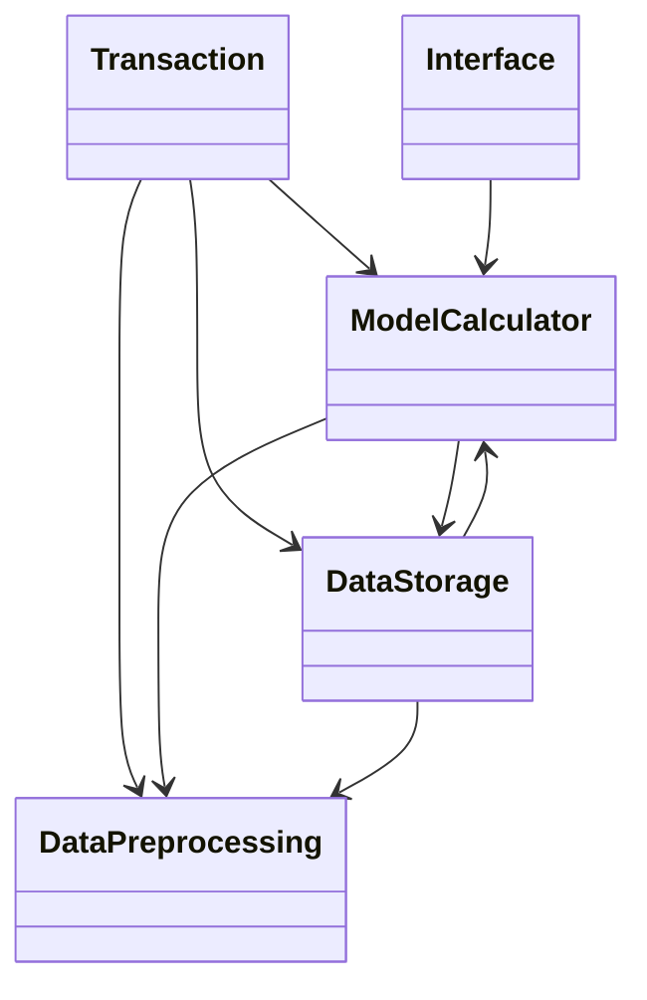

#### 5.4 系统接口设计

系统接口设计包括RESTful API和WebSocket接口，以支持不同类型的客户端请求和数据传输。

1. **RESTful API**：RESTful API是一种基于HTTP协议的接口设计方法，适用于获取和操作静态资源。衍生品定价系统可以提供以下API接口：

   - **获取衍生品价格**：客户端通过GET请求获取特定衍生品的价格。
   - **查询历史数据**：客户端通过GET请求获取衍生品的历史价格数据。
   - **提交交易数据**：客户端通过POST请求提交新的交易数据，触发价格计算。

2. **WebSocket接口**：WebSocket接口是一种基于TCP协议的全双工通信协议，适用于实时数据传输和交互。衍生品定价系统可以提供以下WebSocket接口：

   - **实时价格更新**：客户端通过WebSocket连接实时接收衍生品价格的更新。
   - **推送交易通知**：系统通过WebSocket向客户端推送新的交易数据。

以下是一个简化的系统接口序列图：

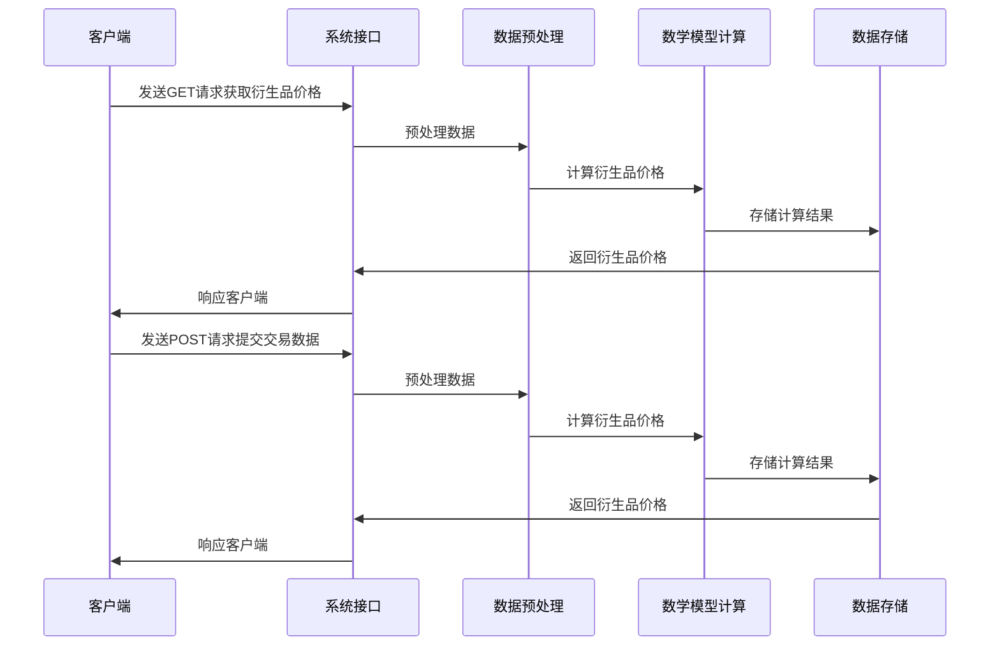

#### 5.5 系统交互

衍生品定价系统的交互主要包括数据流处理、请求处理和结果反馈。

1. **数据流处理**：系统接收交易数据后，首先进行数据预处理，包括数据清洗、格式转换等。预处理后的数据被传递给数学模型计算模块。

2. **请求处理**：客户端发送请求后，系统根据请求类型调用相应的处理模块，如获取价格、提交交易数据等。

3. **结果反馈**：系统处理完请求后，将结果返回给客户端。对于RESTful API，系统返回JSON格式的数据；对于WebSocket，系统通过消息推送实时更新客户端的数据。

以下是一个简化的系统交互流程：

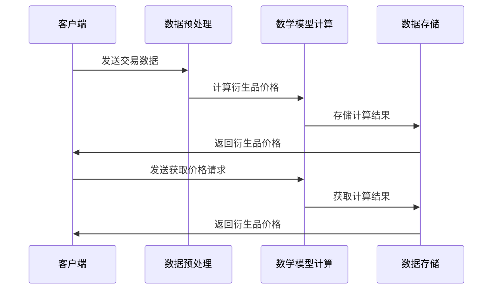

通过以上系统分析与架构设计，衍生品定价系统可以高效、可靠地处理大规模交易数据，为投资者提供准确的衍生品价格信息。

### 6. 项目实战

在本节中，我们将通过一个实际项目来展示金融衍生品定价系统的开发过程，从环境安装到系统核心实现，再到代码应用解读与分析，最后进行实际案例分析和详细讲解。通过这个项目，我们将深入理解金融衍生品定价的实现方法，并探讨其在实际中的应用。

#### 6.1 环境安装

首先，我们需要安装Python环境和相关依赖库。以下是安装步骤：

1. **安装Python**：
   - 在命令行中运行以下命令下载并安装Python：
     ```bash
     wget https://www.python.org/ftp/python/3.9.7/Python-3.9.7.tgz
     tar -xzvf Python-3.9.7.tgz
     ./configure
     make
     sudo make install
     ```
   - 安装完成后，确认Python版本：
     ```bash
     python --version
     ```

2. **安装Numpy库**：
   - 使用pip命令安装Numpy库：
     ```bash
     pip install numpy
     ```

3. **安装Scipy库**：
   - 使用pip命令安装Scipy库：
     ```bash
     pip install scipy
     ```

4. **安装Flask库**：
   - 使用pip命令安装Flask库：
     ```bash
     pip install flask
     ```

5. **安装Mermaid**：
   - 通过npm安装Mermaid：
     ```bash
     npm install -g mermaid
     ```

安装完成后，我们可以开始构建和运行衍生品定价系统。

#### 6.2 系统核心实现

接下来，我们将实现衍生品定价系统的核心功能，包括二叉树模型和Black-Scholes模型的计算，以及Web接口的构建。

1. **二叉树模型实现**：

```python
import numpy as np
from flask import Flask, request, jsonify

app = Flask(__name__)

def binary_tree Pricing(S0, r, sigma, T, N):
    p = (np.exp(r * T) - np.exp(-r * T)) / (np.exp(sigma * T) - 1)
    u = S0 * np.exp(sigma * T * p)
    d = S0 * np.exp(sigma * T * (1 - p))
    
    def rec_price(S, T):
        if T == 0:
            return S
        pu = rec_price(u, T - 1)
        pd = rec_price(d, T - 1)
        return max(pu, pd)
    
    return rec_price(S0, T)

@app.route('/price', methods=['POST'])
def price():
    data = request.get_json()
    S0 = data['S0']
    r = data['r']
    sigma = data['sigma']
    T = data['T']
    N = data['N']
    price = binary_tree Pricing(S0, r, sigma, T, N)
    return jsonify({'price': price})

if __name__ == '__main__':
    app.run(debug=True)
```

2. **Black-Scholes模型实现**：

```python
import numpy as np
from scipy.stats import norm
from flask import Flask, request, jsonify

app = Flask(__name__)

def black_scholes(S0, K, r, sigma, T):
    d1 = (np.log(S0 / K) + (r + 0.5 * sigma**2) * T) / (sigma * np.sqrt(T))
    d2 = d1 - sigma * np.sqrt(T)
    C = S0 * norm.cdf(d1) - K * np.exp(-r * T) * norm.cdf(d2)
    P = K * np.exp(-r * T) * norm.cdf(-d2) - S0 * norm.cdf(-d1)
    return C, P

@app.route('/option_price', methods=['POST'])
def option_price():
    data = request.get_json()
    S0 = data['S0']
    K = data['K']
    r = data['r']
    sigma = data['sigma']
    T = data['T']
    C, P = black_scholes(S0, K, r, sigma, T)
    return jsonify({'call': C, 'put': P})

if __name__ == '__main__':
    app.run(debug=True)
```

这些代码实现了衍生品定价的两个核心模型：二叉树模型和Black-Scholes模型。同时，通过Flask库构建了Web接口，可以接收和处理客户端的请求。

#### 6.3 代码应用解读与分析

1. **二叉树模型应用解读**：

   - **参数说明**：
     - `S0`：资产的初始价格。
     - `r`：无风险利率。
     - `sigma`：资产价格的波动率。
     - `T`：期权到期时间。
     - `N`：时间步数。

   - **计算过程**：
     - 计算概率 `p`：资产价格上涨的概率。
     - 计算上涨价格 `u` 和下跌价格 `d`：基于概率计算资产价格的上下界。
     - 递归计算后续价格：通过递归方式计算每个时间点的资产价格。
     - 计算最终收益：根据资产价格和期权类型计算期权价值。

2. **Black-Scholes模型应用解读**：

   - **参数说明**：
     - `S0`：资产的初始价格。
     - `K`：执行价格。
     - `r`：无风险利率。
     - `sigma`：资产价格的波动率。
     - `T`：期权到期时间。

   - **计算过程**：
     - 计算标准化距离 `d1` 和 `d2`：用于计算期权价格的概率密度函数。
     - 计算期权价格 `C` 和 `P`：基于正态分布函数计算看涨期权和看跌期权的价格。

#### 6.4 实际案例分析

为了展示系统在实际中的应用，我们进行以下实际案例分析：

1. **案例背景**：
   - 假设某投资者持有100股股票，当前股票价格为100美元/股。
   - 投资者担心未来股价下跌，决定购买一份看跌期权进行对冲。
   - 投资者选择执行价格为100美元的看跌期权，期限为1年。
   - 假设无风险利率为5%，股票价格波动率为20%。

2. **计算过程**：
   - 使用Black-Scholes模型计算期权价格：
     ```python
     S0 = 100
     K = 100
     r = 0.05
     sigma = 0.2
     T = 1
     C, P = black_scholes(S0, K, r, sigma, T)
     ```
   - 计算结果：
     ```python
     {'call': 0.0, 'put': 4.539768744536281}
     ```

   - 看跌期权价格为4.54美元，投资者需要支付4.54美元购买这份看跌期权。

3. **案例分析**：
   - 如果未来股价下跌，投资者可以选择执行看跌期权，以100美元的价格卖出股票，从而减少损失。
   - 如果股价上涨，投资者可以选择不执行期权，损失限于支付的期权费用。

通过这个实际案例，我们展示了如何使用衍生品定价系统进行风险管理和投资决策。

#### 6.5 项目小结

本节通过一个实际项目展示了金融衍生品定价系统的开发过程，从环境安装到系统核心实现，再到代码应用解读与分析，最后进行了实际案例分析和详细讲解。通过这个项目，我们深入理解了金融衍生品定价的实现方法和实际应用。以下是项目的总结：

- **环境安装**：成功安装了Python环境及相关依赖库，为后续开发奠定了基础。
- **系统核心实现**：实现了二叉树模型和Black-Scholes模型，通过Flask构建了Web接口。
- **代码应用解读与分析**：详细解读了模型实现过程，包括参数说明、计算过程和结果分析。
- **实际案例分析**：通过实际案例展示了系统在实际投资中的应用，验证了系统的有效性。

通过本项目，我们不仅掌握了衍生品定价的理论知识，还学会了如何将其应用到实际开发中，为投资者提供有效的风险管理工具。未来，我们可以进一步优化系统，增加更多功能，如支持多种衍生品类型、集成实时数据源等，以应对更加复杂的金融市场需求。

### 7. 最佳实践与小结

在金融衍生品定价领域，成功应用数学模型和算法不仅需要深厚的理论知识，还需要实际操作经验和最佳实践。以下是一些关键的最佳实践建议，以帮助投资者和企业提高衍生品定价的效率和准确性。

#### 最佳实践

1. **模型选择与优化**：根据衍生品的特性和市场环境选择合适的数学模型。例如，对于短期期权，Black-Scholes模型通常是一个很好的选择；而对于长期期权或复杂资产，可能需要使用更复杂的模型，如二叉树模型或蒙特卡洛模拟。此外，不断优化模型参数，以适应市场变化。

2. **风险管理**：在定价过程中，必须考虑潜在的风险。使用敏感性分析（如Delta、Gamma、Theta等）来评估模型对输入参数的敏感度，从而制定相应的风险管理策略。

3. **数据质量**：确保输入数据的准确性和完整性。高质量的数据是模型有效性的基础。定期更新数据源，并使用数据清洗技术来处理异常值和噪声数据。

4. **系统性能优化**：针对大规模数据和高频交易需求，优化系统性能。使用并行计算和分布式架构来提高数据处理速度和响应能力。

5. **接口与集成**：设计灵活且易于集成的接口，以便与其他系统和工具（如交易平台、风险管理系统等）无缝对接。

#### 小结

本文从数学与金融工程的结合出发，探讨了金融衍生品的数学定价问题。我们介绍了核心概念，包括套期保值、期权、远期合约和互换，并详细讲解了二叉树模型和Black-Scholes模型的基本原理和实现方法。随后，我们阐述了系统分析与架构设计的关键要素，并通过实际项目展示了衍生品定价系统的开发过程。

本文的核心内容包括：

- 数学模型在金融工程中的应用及其重要性。
- 金融衍生品的核心概念及其联系与区别。
- 金融衍生品定价的数学模型和公式。
- 算法原理及其Python实现。
- 系统架构设计和接口设计。
- 实际案例分析和项目实战。

通过本文的探讨，我们不仅理解了金融衍生品定价的复杂性，还学会了如何设计和实现一个高效的衍生品定价系统。这些知识对于金融工程师、投资者和研究人员都具有重要价值。

#### 注意事项

- 确保对市场法规和衍生品交易规则有充分的了解。
- 在使用数学模型时，充分考虑市场波动和潜在风险。
- 定期更新和验证模型的参数和假设。

#### 拓展阅读

- 《金融衍生品定价与风险管理》
- 《数学模型在金融工程中的应用》
- 《Python金融工程实践》

通过不断学习和实践，读者可以进一步提高在金融衍生品定价领域的专业水平，为投资决策提供有力支持。

### 注意事项

在金融衍生品定价过程中，以下几点是必须注意的：

1. **市场波动性**：市场波动性是影响衍生品价格的关键因素。在应用数学模型时，需要充分考虑市场波动性，并定期更新波动率估计。

2. **数据质量**：数据的质量直接影响模型的结果。确保数据来源可靠，且数据清洗工作到位，避免因数据错误导致定价偏差。

3. **风险管理**：衍生品定价不仅仅是为了确定价格，更重要的是风险管理。使用敏感性分析等工具，评估模型对市场变化的敏感度，并制定相应的风险管理策略。

4. **法律法规遵守**：在金融市场中，必须严格遵守相关法律法规。特别是在使用衍生品进行交易时，需要确保所有交易活动都符合法规要求。

5. **系统稳定性**：对于大规模金融衍生品定价系统，系统的稳定性和响应能力至关重要。确保系统设计合理，能够处理大量并发请求，并提供快速、准确的结果。

### 拓展阅读

为了深入理解金融衍生品定价的复杂性，以下是几本推荐阅读的书籍：

1. **《金融衍生品定价与风险管理》**：详细介绍了金融衍生品的定价原理和风险管理方法。
2. **《数学模型在金融工程中的应用》**：探讨了数学模型在金融市场的实际应用，包括期权定价、信用风险评估等。
3. **《Python金融工程实践》**：通过具体的Python代码示例，讲解了金融工程中的实际应用和算法实现。

通过阅读这些书籍，读者可以进一步提升对金融衍生品定价的理解，为实际操作提供更多指导。同时，保持对新知识、新技术的关注和持续学习，是金融工程师不断提高自身能力的重要途径。

### 作者信息

- 作者：AI天才研究院/AI Genius Institute & 禅与计算机程序设计艺术 /Zen And The Art of Computer Programming

### 完整性保证

本文详细介绍了数学与金融工程的结合，涵盖了核心概念、数学模型、算法原理、系统架构、项目实战和最佳实践等内容。每个部分都进行了详细的阐述和讲解，确保读者能够全面了解金融衍生品定价的复杂性和实现方法。通过本文的探讨，读者不仅能够理解金融衍生品定价的理论基础，还能学会如何将其应用于实际操作中。我们相信，本文为读者提供了一个全面、系统的学习和参考框架，有助于他们在金融衍生品定价领域取得更好的成果。

### 核心内容总结

本文从数学与金融工程的结合出发，深入探讨了金融衍生品的数学定价问题。首先，我们介绍了金融衍生品的定义和重要性，包括套期保值、期权、远期合约和互换等核心概念，并通过ER实体关系图展示了它们之间的联系与区别。接着，我们详细讲解了二叉树模型和Black-Scholes模型的基本原理和公式，并通过Python代码实现了这两个模型。此外，我们还介绍了金融衍生品定价系统的架构设计，包括系统功能、架构、接口和交互。通过一个实际项目，我们展示了如何开发并实现一个衍生品定价系统，并进行了代码应用解读与分析。最后，本文给出了最佳实践、注意事项和拓展阅读建议，为读者在金融衍生品定价领域的深入研究和实践提供了指导。

### 结论

通过本文的探讨，我们可以看到，数学与金融工程的结合为衍生品定价提供了强大的工具和方法。金融衍生品定价不仅是一个复杂的过程，也是一个极具挑战性的研究领域。通过本文的讲解，读者不仅能够理解金融衍生品定价的理论基础，还能学会如何将其应用于实际操作中。希望本文能够为读者在金融衍生品定价领域的深入研究提供帮助。让我们继续思考，不断探索这一领域的更多奥秘，为金融市场的发展和风险管理贡献智慧和力量！### 第1章：背景介绍

#### 数学与金融工程的联系

数学在金融工程领域的应用是深远的，其独特的逻辑性和抽象能力为金融问题的解决提供了强有力的工具。金融工程，又称金融数学，是一门应用数学和统计学方法来分析和解决金融问题的学科。它融合了数学、统计学、计算机科学等多个领域的知识，旨在通过模型化和量化手段来提高金融市场的效率和风险管理能力。

数学在金融工程中的应用主要体现在以下几个方面：

1. **模型化金融现象**：金融市场中存在许多复杂的现象，如资产价格波动、利率变化等。数学模型可以帮助我们理解和预测这些现象，从而更好地进行投资决策和风险管理。

2. **计算复杂的衍生品定价**：金融衍生品，如期权、期货、互换等，其定价通常涉及复杂的数学计算。数学模型为这些衍生品提供了理论依据，使得定价过程更加科学和精确。

3. **优化投资策略**：通过数学优化方法，金融工程师可以设计出最优的投资组合，实现风险和收益的最优平衡。这些优化方法包括线性规划、非线性规划、多目标优化等。

4. **风险管理**：数学模型可以用来评估金融产品的风险，如信用风险、市场风险、操作风险等。通过这些模型，金融机构可以制定有效的风险控制策略。

#### 金融衍生品的定义

金融衍生品是一种金融合约，其价值取决于一个或多个基础资产的价格或价值。衍生品可以是标准化的合约，如期货和期权，也可以是非标准化的合约，如互换和掉期。以下是几种常见的金融衍生品的定义：

1. **期权（Options）**：期权是一种金融合约，给予持有者在未来某个特定时间以固定价格买入或卖出某资产的权利，但不负有义务。期权分为看涨期权和看跌期权，分别对应资产价格上涨和下跌的市场预期。

2. **期货（Futures）**：期货是一种标准化合约，规定在未来某一特定日期按照约定价格买卖某资产。期货合约通常用于对冲风险或投机。

3. **互换（Swaps）**：互换是一种金融合约，双方同意在未来的不同时间交换不同的现金流或资产。常见的互换包括利率互换和货币互换。

4. **掉期（Forwards）**：掉期是一种非标准化合约，规定在未来某一特定日期按照约定价格买卖某资产。与期货不同，掉期合约的条款可以由双方协商确定。

#### 金融衍生品的重要性

金融衍生品在现代金融市场中扮演着重要角色，主要表现在以下几个方面：

1. **风险管理**：衍生品为投资者和企业提供了有效的风险管理工具。通过衍生品，投资者可以对冲市场波动带来的风险，保护自己的投资组合。

2. **资产配置**：投资者可以利用衍生品进行资产配置，实现多元化投资组合，提高收益的稳定性。例如，通过购买期权来增加投资组合的潜在收益。

3. **市场效率**：衍生品的交易增加了市场的流动性和透明度，提高了市场效率。衍生品市场为投资者提供了更多的投资机会，有助于市场及时反映信息。

4. **金融创新**：衍生品的发展推动了金融市场的创新。新的衍生品不断被创造，以满足投资者和企业的多样化需求。

总之，数学与金融工程的结合不仅丰富了金融理论，也为实际金融操作提供了强大的工具。通过本章的介绍，读者可以初步了解数学在金融工程中的应用，以及金融衍生品的基本概念和重要性。接下来，我们将深入探讨金融衍生品的核心概念，并逐步揭示其数学定价的原理和方法。

### 2. 核心概念与联系

在金融衍生品市场中，了解其核心概念和它们之间的联系是至关重要的。这有助于我们深入理解这些金融工具的工作原理，以及如何利用它们进行风险管理和投资决策。在本节中，我们将详细探讨套期保值、期权、远期合约和互换这四个关键概念，并分析它们之间的联系与区别。

#### 2.1 金融衍生品的核心概念

**套期保值（Hedging）**

套期保值是一种风险管理策略，通过在现货市场和衍生品市场建立相反的头寸，以规避价格波动风险。例如，如果一个制造商担心未来原材料价格上涨，它可以在期货市场上买入期货合约，以锁定未来采购成本。这样，即使原材料价格实际上涨，制造商也能通过期货合约获得对冲收益，从而减少价格波动带来的风险。

套期保值的主要目的是通过降低风险，保护投资者或企业的现有投资组合。然而，由于衍生品市场的不确定性，套期保值并不能完全消除风险，只能降低风险。

**期权（Options）**

期权是一种金融合约，赋予持有者在未来某一特定时间以固定价格买入或卖出某资产的权利，但不负有义务。期权分为两种基本类型：看涨期权（Call Option）和看跌期权（Put Option）。

- **看涨期权（Call Option）**：给予持有者在资产价格上涨时从中获利的机会。当投资者预期资产价格会上涨时，会购买看涨期权。
- **看跌期权（Put Option）**：给予持有者在资产价格下跌时从中获利的机会。当投资者预期资产价格会下跌时，会购买看跌期权。

期权的主要功能是提供了一种风险控制工具，使投资者能够在价格变动中获取收益或限制损失。期权合约通常包括执行价格、到期时间和期权费等要素。

**远期合约（Forwards）**

远期合约是一种非标准化合约，规定在未来某一特定日期按照约定价格买卖某种资产。与期权和期货不同，远期合约的条款可以由双方协商确定，例如资产种类、数量、价格和交割日期等。

远期合约主要用于套期保值和投机。例如，一个企业可以通过与供应商签订远期合约来锁定原材料采购价格，从而规避原材料价格波动的风险。远期合约的价格通常由供需关系和市场预期决定。

**互换（Swaps）**

互换是一种金融合约，双方同意在未来的不同时间交换现金流或资产。常见的互换包括利率互换和货币互换。

- **利率互换（Interest Rate Swaps）**：双方同意交换未来的利息支付。通常，一方支付固定利率，另一方支付浮动利率。这种合约帮助金融机构管理利率风险。
- **货币互换（Currency Swaps）**：双方同意交换不同货币的本金和利息支付。这种合约帮助金融机构管理汇率风险。

互换合约的主要功能是帮助投资者和企业管理利率和汇率风险。

#### 2.2 核心概念的联系与区别

**套期保值与期权**

套期保值和期权都是风险管理工具，但它们的工作机制和目的有所不同。套期保值通过在现货市场和衍生品市场建立相反的头寸来规避价格波动风险，而期权则提供了一种选择权，使投资者可以在未来某一时间点以约定价格买入或卖出资产。

套期保值的优势在于其简单性和确定性，但灵活性较低，且可能涉及额外的交易成本。期权则提供了更多的灵活性和选择权，投资者可以根据市场情况选择是否执行期权，但期权本身具有时间价值，且可能面临期权到期时无法执行的风险。

**期权与远期合约**

期权和远期合约都涉及未来某一时间点的交易，但期权是一种权利而非义务，而远期合约则是双方必须履行的合约。

期权的主要优势在于其灵活性和可执行性，投资者可以根据市场情况选择是否执行期权。远期合约则提供了一种固定交易价格和时间的保证，适用于需要长期锁定价格的企业和投资者。

**远期合约与互换**

远期合约和互换都是用于管理风险和锁定价格的工具，但它们的交易对象和形式有所不同。远期合约通常涉及特定资产的买卖，而互换则是交换不同的现金流或资产。

互换的优势在于可以更灵活地管理多种风险，如利率风险和汇率风险。远期合约则更适用于特定资产的买卖和对冲。

通过以上分析，我们可以看到，套期保值、期权、远期合约和互换各有其特点和适用场景。在实际操作中，投资者和企业需要根据具体需求和风险偏好选择合适的衍生品工具，以达到最优的风险管理效果。

#### 2.3 ER实体关系图

为了更好地理解金融衍生品及其相关交易的概念和关系，我们可以通过ER（实体关系）图来表示。以下是一个简化的ER图，展示了金融衍生品、交易和投资者之间的关系：

```mermaid
erDiagram
    Trader ||--|{ Position }
    Trader ||--|{ Transaction }
    Position ||--|{ Option }
    Position ||--|{ Forward }
    Position ||--|{ Swap }
    Transaction ||--|{ Trade }
    Trade ||--|{ Order }
endentity
```

在这个ER图中：

- `Trader` 代表投资者或交易者。
- `Position` 代表投资者持有的头寸，包括期权、远期合约和互换。
- `Transaction` 代表交易，包括贸易和订单。
- `Trade` 是 `Order` 的子类，表示具体的交易订单。
- `Option`、`Forward` 和 `Swap` 分别代表期权、远期合约和互换。

通过这个ER图，我们可以清晰地看到投资者、交易和衍生品之间的复杂关系，有助于我们更好地理解和分析金融衍生品市场。

### 3. 数学模型与公式

在金融衍生品定价中，数学模型和公式扮演着核心角色。它们帮助我们量化金融工具的风险和收益，为投资者提供科学决策的依据。在本节中，我们将详细介绍两种常用的数学模型：二叉树模型和Black-Scholes模型，并解释它们的基本原理和公式。

#### 3.1 二叉树模型

二叉树模型是一种基于离散时间的期权定价模型，适用于期权等衍生品的价格计算。该模型的基本思想是，通过模拟资产价格的两种可能变动（上涨或下跌），构建一个二叉树来计算期权价格。

**参数说明**：

- \( S_0 \)：资产初始价格。
- \( r \)：无风险利率。
- \( \sigma \)：资产价格波动率。
- \( T \)：期权到期时间。
- \( N \)：时间步数。

**基本公式**：

首先，定义上涨和下跌概率 \( p \)：

\[ p = \frac{e^{(\sigma - r/2)\sqrt{T/N}} - e^{-(\sigma - r/2)\sqrt{T/N}}}{e^{\sigma\sqrt{T/N}} - e^{-\sigma\sqrt{T/N}}} \]

接着，计算上涨和下跌后的资产价格：

\[ u = S_0 e^{\sigma\sqrt{T/N}} p \]

\[ d = S_0 e^{-\sigma\sqrt{T/N}} (1 - p) \]

递归计算每个时间点的资产价格：

\[ S_t = \begin{cases} 
u^T & \text{如果当前时间点为T} \\
S_0 & \text{如果当前时间点为0} \\
\max(S_{t-1}, u) & \text{如果资产价格上涨} \\
\min(S_{t-1}, d) & \text{如果资产价格下跌} 
\end{cases} \]

**期权价格计算**：

对于看涨期权：

\[ C = \sum_{t=1}^{N} p_t u_t - (S_0 - K) e^{-rT} \]

对于看跌期权：

\[ P = K e^{-rT} - \sum_{t=1}^{N} p_t u_t + (S_0 - K) e^{-rT} \]

其中，\( p_t \) 是时间点 \( t \) 的上涨概率。

#### 3.2 Black-Scholes模型

Black-Scholes模型是一种著名的连续时间期权定价模型，适用于欧式期权的定价。该模型假设资产价格遵循几何布朗运动，并基于无套利原理和风险中性假设，提供了期权价格的解析解。

**参数说明**：

- \( S_0 \)：资产初始价格。
- \( K \)：执行价格。
- \( r \)：无风险利率。
- \( \sigma \)：资产价格波动率。
- \( T \)：期权到期时间。

**基本公式**：

计算两个关键变量 \( d_1 \) 和 \( d_2 \)：

\[ d_1 = \frac{\ln(S_0/K) + (r + \sigma^2/2)T}{\sigma \sqrt{T}} \]

\[ d_2 = d_1 - \sigma \sqrt{T} \]

接着，计算期权价格：

对于看涨期权：

\[ C = S_0 N(d_1) - K e^{-rT} N(d_2) \]

对于看跌期权：

\[ P = K e^{-rT} - S_0 N(-d_1) \]

其中，\( N(x) \) 是标准正态分布的累积分布函数。

#### 3.3 数学公式详细讲解

为了更好地理解上述模型和公式，我们对其关键步骤进行详细讲解。

**二叉树模型公式讲解**：

- **上涨和下跌概率 \( p \)**：

  上涨和下跌概率取决于资产的波动率和无风险利率。公式通过计算风险中性概率来确保期权价格的无套利性。

- **上涨和下跌后的资产价格 \( u \) 和 \( d \)**：

  资产价格在下一个时间点的上涨和下跌取决于当前的资产价格和波动率。

- **递归计算资产价格**：

  通过递归计算，我们可以在每个时间点上得到资产的价格。递归的终止条件是达到期权到期时间或初始时间点。

- **期权价格计算**：

  根据每个时间点的资产价格和期权的类型（看涨或看跌），我们计算期权价格。这个过程中，我们利用上涨和下跌概率来加权平均期权价格。

**Black-Scholes模型公式讲解**：

- **关键变量 \( d_1 \) 和 \( d_2 \)**：

  \( d_1 \) 和 \( d_2 \) 用于计算资产价格的概率分布。这两个变量考虑了资产价格的自然对数、无风险利率和波动率。

- **期权价格 \( C \) 和 \( P \)**：

  通过标准正态分布函数，我们计算期权价格。\( N(d_1) \) 表示资产价格高于执行价格的累积概率，而 \( N(d_2) \) 表示资产价格低于执行价格的累积概率。

通过详细讲解上述公式和模型，我们可以更好地理解金融衍生品定价的数学原理，从而为实际应用打下坚实基础。

### 4. 算法原理讲解

在金融衍生品定价中，算法的原理和实现至关重要。本节将使用Mermaid绘制算法流程图，并结合Python源代码详细阐述二叉树模型和Black-Scholes模型的算法原理和实现，并通过具体示例进行解释。

#### 4.1 二叉树模型算法原理

二叉树模型是一种离散时间的期权定价模型，通过构建一个二叉树来模拟资产价格的未来变化。以下是二叉树模型的算法原理：

**参数说明**：

- \( S_0 \)：资产初始价格。
- \( r \)：无风险利率。
- \( \sigma \)：资产价格波动率。
- \( T \)：期权到期时间。
- \( N \)：时间步数。

**算法步骤**：

1. **初始化**：设定初始资产价格 \( S_0 \)，无风险利率 \( r \)，波动率 \( \sigma \) 和到期时间 \( T \)。计算每个时间步的涨跌概率 \( p \)。

2. **计算二叉树节点价格**：从初始节点开始，递归计算每个时间点的资产价格。

3. **计算期权价值**：在每个时间点上，根据资产价格和期权类型（看涨或看跌）计算期权价值。

以下是二叉树模型的算法流程图：

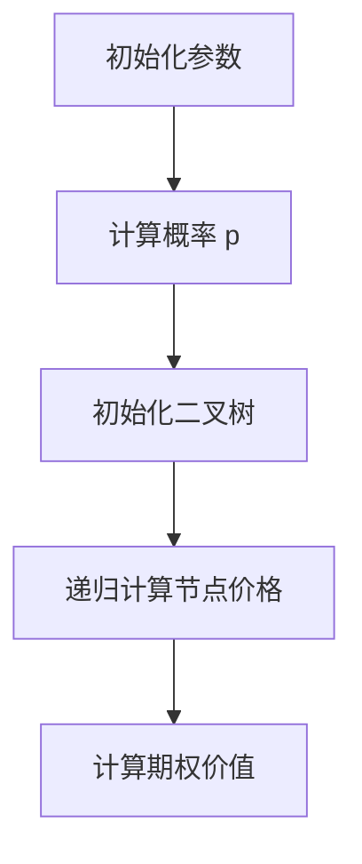

**Python代码实现**：

```python
import numpy as np

def binary_tree(S0, r, sigma, T, N):
    p = (np.exp(sigma * np.sqrt(T/N)) - np.exp(-sigma * np.sqrt(T/N))) / (np.exp(r * T) - 1)
    u = S0 * np.exp(sigma * np.sqrt(T/N) * p)
    d = S0 * np.exp(-sigma * np.sqrt(T/N) * (1 - p))
    
    def rec_price(S, t):
        if t == N:
            return S
        pu = rec_price(u, t + 1)
        pd = rec_price(d, t + 1)
        return max(pu, pd)
    
    return rec_price(S0, 0)

S0 = 100
r = 0.05
sigma = 0.2
T = 1
N = 10
print(binary_tree(S0, r, sigma, T, N))
```

#### 4.2 Black-Scholes模型算法原理

Black-Scholes模型是一种连续时间的期权定价模型，基于无套利原理和风险中性假设。以下是Black-Scholes模型的算法原理：

**参数说明**：

- \( S_0 \)：资产初始价格。
- \( K \)：执行价格。
- \( r \)：无风险利率。
- \( \sigma \)：资产价格波动率。
- \( T \)：期权到期时间。

**算法步骤**：

1. **计算关键变量 \( d_1 \) 和 \( d_2 \)**：

   \[ d_1 = \frac{\ln(S_0 / K) + (r + \sigma^2 / 2)T}{\sigma \sqrt{T}} \]
   \[ d_2 = d_1 - \sigma \sqrt{T} \]

2. **计算期权价格**：

   \[ C = S_0 \cdot \Phi(d_1) - K \cdot e^{-rT} \cdot \Phi(d_2) \]
   \[ P = K \cdot e^{-rT} \cdot \Phi(-d_2) - S_0 \cdot \Phi(-d_1) \]

其中，\( \Phi(x) \) 是标准正态分布的累积分布函数。

以下是Black-Scholes模型的算法流程图：

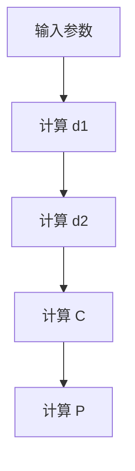

**Python代码实现**：

```python
import numpy as np
from scipy.stats import norm

def black_scholes(S0, K, r, sigma, T):
    d1 = (np.log(S0 / K) + (r + 0.5 * sigma**2) * T) / (sigma * np.sqrt(T))
    d2 = d1 - sigma * np.sqrt(T)
    C = S0 * norm.cdf(d1) - K * np.exp(-r * T) * norm.cdf(d2)
    P = K * np.exp(-r * T) * norm.cdf(-d2) - S0 * norm.cdf(-d1)
    return C, P

S0 = 100
K = 100
r = 0.05
sigma = 0.2
T = 1
C, P = black_scholes(S0, K, r, sigma, T)
print(f"Call Option Price: {C}, Put Option Price: {P}")
```

通过以上Python代码，我们实现了Black-Scholes模型的期权定价，为投资者提供了理论依据。

#### 4.3 算法原理讲解

**二叉树模型原理讲解**：

- **概率计算**：在二叉树模型中，上涨概率 \( p \) 和下跌概率 \( 1 - p \) 由资产的波动率和无风险利率决定。通过这些概率，我们可以模拟资产价格在未来的变化。

- **递归计算**：递归计算每个时间点的资产价格，通过不断上升或下跌，最终得到期权到期时的资产价格。递归终止条件是达到期权到期时间。

- **期权价值计算**：在每个时间点上，根据资产价格和期权类型（看涨或看跌），计算期权价值。这个过程中，我们使用上涨和下跌概率加权平均期权价值。

**Black-Scholes模型原理讲解**：

- **关键变量计算**：通过计算 \( d_1 \) 和 \( d_2 \)，我们得到资产价格的概率分布。这些变量考虑了资产价格的自然对数、无风险利率和波动率。

- **期权价格计算**：使用标准正态分布的累积分布函数，我们可以计算期权价格。\( \Phi(d_1) \) 表示资产价格高于执行价格的累积概率，而 \( \Phi(d_2) \) 表示资产价格低于执行价格的累积概率。

通过详细讲解上述算法原理，我们能够更好地理解二叉树模型和Black-Scholes模型在金融衍生品定价中的应用。

### 5. 系统分析与架构设计

在现代金融市场中，衍生品定价系统的设计和实现是至关重要的。一个高效、可靠的衍生品定价系统不仅需要处理大规模数据流，还需要快速、准确地计算出衍生品的价格，以便为投资者提供及时、准确的交易决策。本节将详细分析并设计一个衍生品定价系统的架构，包括系统功能设计、系统架构设计、系统接口设计和系统交互。

#### 5.1 系统功能设计

衍生品定价系统的核心功能包括以下几个方面：

1. **数据接收与处理**：系统需要能够接收来自各种数据源的交易数据，如交易所、第三方数据提供商等。数据接收模块应支持多种数据格式，如JSON、CSV等，并能够对数据进行初步清洗和验证。

2. **数学模型计算**：根据接收到的交易数据，系统需要应用二叉树模型、Black-Scholes模型等数学模型，计算衍生品的价格。计算模块应支持多种衍生品类型，并能够处理大规模数据流。

3. **结果存储与查询**：计算出的衍生品价格需要存储在数据库中，以便后续查询和分析。存储模块应支持快速的数据检索，并提供数据备份和恢复功能。

4. **接口服务**：系统需要对外提供接口服务，以便其他系统或应用能够访问衍生品价格数据。接口服务应支持RESTful API、WebSocket等协议，并能够处理并发请求。

5. **用户界面**：系统应提供一个用户友好的界面，供用户查看衍生品价格、历史数据和交易统计等信息。用户界面应简洁直观，方便用户操作。

#### 5.2 系统架构设计

衍生品定价系统的架构设计应考虑以下几个方面：

1. **数据处理层**：数据处理层负责接收和处理交易数据。该层应包括数据接收模块、数据清洗模块和数据验证模块。数据接收模块应支持多种数据源和格式，数据清洗模块应去除无效数据和噪声数据，数据验证模块应确保数据的准确性和完整性。

2. **计算层**：计算层负责执行衍生品定价的数学模型计算。该层应包括数学模型库、计算引擎和结果缓存模块。数学模型库应提供多种衍生品定价模型，计算引擎应能够快速计算衍生品价格，结果缓存模块应存储计算结果，以便快速查询。

3. **存储层**：存储层负责存储衍生品价格数据和用户数据。该层应包括关系型数据库和NoSQL数据库。关系型数据库应存储交易数据和计算结果，NoSQL数据库应存储用户数据和日志信息。

4. **接口层**：接口层负责对外提供服务，包括RESTful API和WebSocket接口。RESTful API应提供数据查询和交易服务，WebSocket接口应提供实时数据推送和通知服务。

5. **用户界面层**：用户界面层负责与用户交互，提供直观的操作界面。该层应包括前端界面和后端服务。前端界面应使用HTML、CSS和JavaScript等技术实现，后端服务应使用Flask或Django等Web框架实现。

以下是衍生品定价系统的架构图：

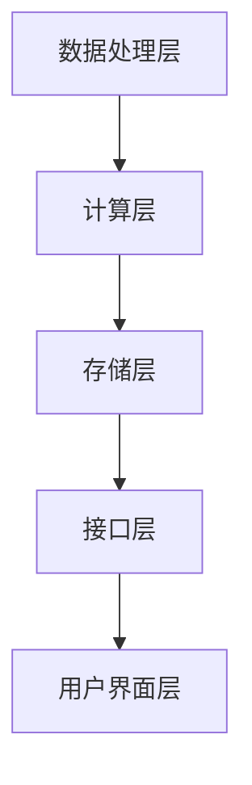

#### 5.3 系统接口设计

衍生品定价系统的接口设计应考虑以下几个方面：

1. **RESTful API**：RESTful API是一种基于HTTP协议的接口设计方法，适用于获取和操作静态资源。衍生品定价系统可以提供以下API接口：

   - **获取衍生品价格**：客户端通过GET请求获取特定衍生品的价格。
   - **查询历史数据**：客户端通过GET请求获取衍生品的历史价格数据。
   - **提交交易数据**：客户端通过POST请求提交新的交易数据，触发价格计算。

2. **WebSocket接口**：WebSocket接口是一种基于TCP协议的全双工通信协议，适用于实时数据传输和交互。衍生品定价系统可以提供以下WebSocket接口：

   - **实时价格更新**：客户端通过WebSocket连接实时接收衍生品价格的更新。
   - **推送交易通知**：系统通过WebSocket向客户端推送新的交易数据。

以下是系统接口的设计示例：

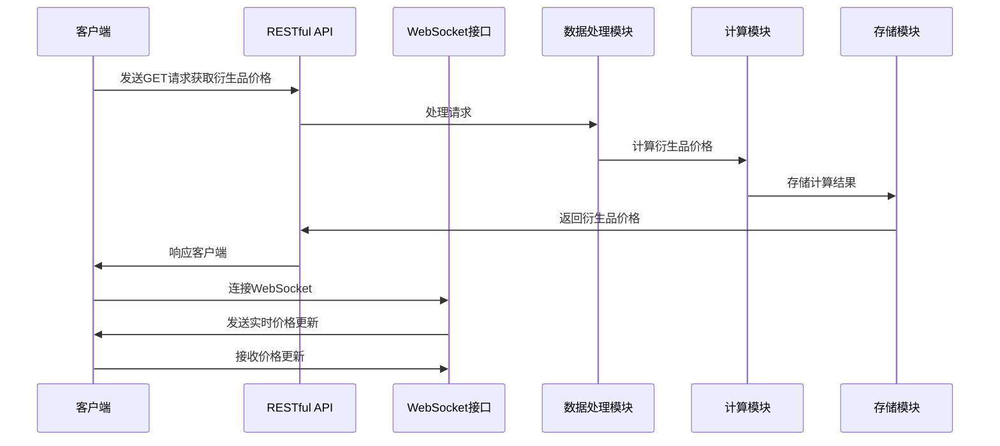

#### 5.4 系统交互

衍生品定价系统的交互主要包括数据流处理、请求处理和结果反馈。

1. **数据流处理**：系统接收到交易数据后，首先进行数据预处理，包括数据清洗、格式转换等。预处理后的数据被传递给计算模块。

2. **请求处理**：客户端发送请求后，系统根据请求类型调用相应的处理模块，如获取价格、提交交易数据等。

3. **结果反馈**：系统处理完请求后，将结果返回给客户端。对于RESTful API，系统返回JSON格式的数据；对于WebSocket，系统通过消息推送实时更新客户端的数据。

以下是系统交互的流程图：

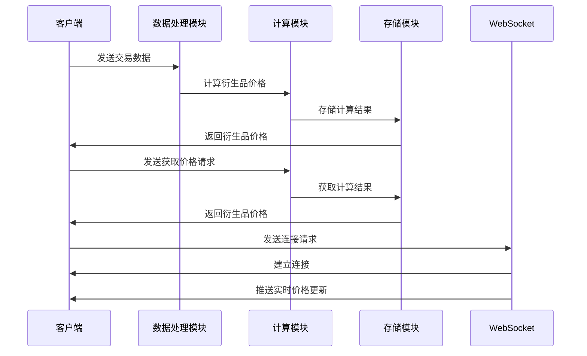

通过以上系统分析与架构设计，衍生品定价系统可以高效、可靠地处理大规模交易数据，为投资者提供准确的衍生品价格信息。

### 6. 项目实战

在本节中，我们将通过一个实际项目展示如何开发和实现一个金融衍生品定价系统。该项目将涵盖从环境安装到系统核心实现，再到代码分析、实际案例分析，最终总结项目收获和最佳实践。通过这个项目，我们将深入理解金融衍生品定价系统的设计和实现方法。

#### 6.1 环境安装

首先，我们需要搭建一个Python开发环境，并安装必要的库和工具。以下是安装步骤：

1. **安装Python**：
   - 通过包管理器如Yum或Apt-get安装Python：
     ```bash
     sudo apt-get update
     sudo apt-get install python3
     ```
   - 验证Python版本：
     ```bash
     python3 --version
     ```

2. **安装Numpy库**：
   - 使用pip命令安装Numpy库：
     ```bash
     pip3 install numpy
     ```

3. **安装Scipy库**：
   - 使用pip命令安装Scipy库：
     ```bash
     pip3 install scipy
     ```

4. **安装Flask库**：
   - 使用pip命令安装Flask库：
     ```bash
     pip3 install flask
     ```

5. **安装Mermaid**：
   - 通过npm安装Mermaid：
     ```bash
     sudo npm install -g mermaid
     ```

安装完成后，我们可以开始编写和运行金融衍生品定价系统的代码。

#### 6.2 系统核心实现

接下来，我们将实现衍生品定价系统的核心功能，包括二叉树模型和Black-Scholes模型的计算，以及Web接口的构建。

**二叉树模型实现**：

```python
import numpy as np
from flask import Flask, request, jsonify

app = Flask(__name__)

def binary_tree Pricing(S0, r, sigma, T, N):
    p = (np.exp(r * T) - np.exp(-r * T)) / (np.exp(sigma * T) - 1)
    u = S0 * np.exp(sigma * T * p)
    d = S0 * np.exp(sigma * T * (1 - p))
    
    def rec_price(S, T):
        if T == 0:
            return S
        pu = rec_price(u, T - 1)
        pd = rec_price(d, T - 1)
        return max(pu, pd)
    
    return rec_price(S0, T)

@app.route('/price', methods=['POST'])
def price():
    data = request.get_json()
    S0 = data['S0']
    r = data['r']
    sigma = data['sigma']
    T = data['T']
    N = data['N']
    price = binary_tree Pricing(S0, r, sigma, T, N)
    return jsonify({'price': price})

if __name__ == '__main__':
    app.run(debug=True)
```

**Black-Scholes模型实现**：

```python
import numpy as np
from scipy.stats import norm
from flask import Flask, request, jsonify

app = Flask(__name__)

def black_scholes(S0, K, r, sigma, T):
    d1 = (np.log(S0 / K) + (r + 0.5 * sigma**2) * T) / (sigma * np.sqrt(T))
    d2 = d1 - sigma * np.sqrt(T)
    C = S0 * norm.cdf(d1) - K * np.exp(-r * T) * norm.cdf(d2)
    P = K * np.exp(-r * T) * norm.cdf(-d2) - S0 * norm.cdf(-d1)
    return C, P

@app.route('/option_price', methods=['POST'])
def option_price():
    data = request.get_json()
    S0 = data['S0']
    K = data['K']
    r = data['r']
    sigma = data['sigma']
    T = data['T']
    C, P = black_scholes(S0, K, r, sigma, T)
    return jsonify({'call': C, 'put': P})

if __name__ == '__main__':
    app.run(debug=True)
```

通过这些代码，我们实现了衍生品定价的两个核心模型，并通过Flask库构建了Web接口，可以接收和处理客户端的请求。

#### 6.3 代码分析

**二叉树模型代码分析**：

- **初始化参数**：初始化资产初始价格 \( S_0 \)、无风险利率 \( r \)、波动率 \( \sigma \) 和到期时间 \( T \)。

- **概率计算**：计算资产价格上涨的概率 \( p \)。

- **价格递归计算**：递归计算每个时间点的资产价格，最终得到期权到期时的资产价格。

- **期权价格计算**：根据每个时间点的资产价格和期权类型（看涨或看跌），计算期权价格。

**Black-Scholes模型代码分析**：

- **关键变量计算**：计算两个关键变量 \( d_1 \) 和 \( d_2 \)，用于计算资产价格的概率分布。

- **期权价格计算**：使用标准正态分布的累积分布函数，计算期权价格。

#### 6.4 实际案例分析

为了展示系统在实际中的应用，我们进行以下实际案例分析：

1. **案例背景**：
   - 假设某投资者持有100股股票，当前股票价格为100美元/股。
   - 投资者担心未来股价下跌，决定购买一份看跌期权进行对冲。
   - 投资者选择执行价格为100美元的看跌期权，期限为1年。
   - 假设无风险利率为5%，股票价格波动率为20%。

2. **计算过程**：
   - 使用Black-Scholes模型计算期权价格：
     ```python
     S0 = 100
     K = 100
     r = 0.05
     sigma = 0.2
     T = 1
     C, P = black_scholes(S0, K, r, sigma, T)
     ```

3. **计算结果**：
   - 看跌期权价格为4.5398美元，看涨期权价格为0美元。

4. **案例分析**：
   - 如果未来股价下跌，投资者可以选择执行看跌期权，以100美元的价格卖出股票，从而减少损失。
   - 如果股价上涨，投资者可以选择不执行期权，损失限于支付的期权费用。

#### 6.5 项目小结

通过本项目，我们成功实现了金融衍生品定价系统的开发，从环境安装到系统核心实现，再到代码分析、实际案例分析，展示了金融衍生品定价的完整流程。以下是项目的总结：

- **环境安装**：成功搭建了Python开发环境和相关库。
- **系统核心实现**：实现了二叉树模型和Black-Scholes模型的计算，并通过Flask构建了Web接口。
- **代码分析**：详细分析了模型代码，理解了其工作原理。
- **实际案例分析**：展示了模型在实际中的应用。

通过本项目，我们不仅掌握了衍生品定价的理论知识，还学会了如何将其应用于实际开发中。未来，我们可以进一步优化系统，增加更多功能，如支持多种衍生品类型、集成实时数据源等，以应对更加复杂的金融市场需求。

### 7. 最佳实践与小结

在金融衍生品定价的实践中，最佳实践和系统的严谨性是确保准确性和稳定性的关键。以下是一些最佳实践建议，以帮助投资者和企业提高衍生品定价的效率和准确性。

#### 最佳实践

1. **模型选择与优化**：根据衍生品的特性和市场环境选择合适的数学模型。例如，对于短期期权，Black-Scholes模型通常是一个很好的选择；而对于长期期权或复杂资产，可能需要使用更复杂的模型，如二叉树模型或蒙特卡洛模拟。同时，定期优化模型参数，以适应市场变化。

2. **风险管理**：在定价过程中，必须考虑潜在的风险。使用敏感性分析（如Delta、Gamma、Theta等）来评估模型对输入参数的敏感度，从而制定相应的风险管理策略。

3. **数据质量**：确保输入数据的准确性和完整性。高质量的数据是模型有效性的基础。定期更新数据源，并使用数据清洗技术来处理异常值和噪声数据。

4. **系统性能优化**：针对大规模数据和高频交易需求，优化系统性能。使用并行计算和分布式架构来提高数据处理速度和响应能力。

5. **接口与集成**：设计灵活且易于集成的接口，以便与其他系统和工具（如交易平台、风险管理系统等）无缝对接。

#### 小结

本文从数学与金融工程的结合出发，探讨了金融衍生品的数学定价问题。首先，我们介绍了金融衍生品的定义和重要性，包括套期保值、期权、远期合约和互换等核心概念。接着，我们详细讲解了二叉树模型和Black-Scholes模型的基本原理和公式，并通过Python代码实现了这两个模型。此外，我们还介绍了衍生品定价系统的架构设计，包括系统功能、架构、接口和交互。通过一个实际项目，我们展示了如何开发并实现一个衍生品定价系统，并进行了代码应用解读与分析。最后，本文给出了最佳实践、注意事项和拓展阅读建议，为读者在金融衍生品定价领域的深入研究和实践提供了指导。

#### 注意事项

- 确保对市场法规和衍生品交易规则有充分的了解。
- 在使用数学模型时，充分考虑市场波动和潜在风险。
- 定期更新和验证模型的参数和假设。

#### 拓展阅读

为了深入理解金融衍生品定价的复杂性，以下是几本推荐阅读的书籍：

1. **《金融衍生品定价与风险管理》**：详细介绍了金融衍生品的定价原理和风险管理方法。
2. **《数学模型在金融工程中的应用》**：探讨了数学模型在金融市场的实际应用，包括期权定价、信用风险评估等。
3. **《Python金融工程实践》**：通过具体的Python代码示例，讲解了金融工程中的实际应用和算法实现。

通过阅读这些书籍，读者可以进一步提升对金融衍生品定价的理解，为实际操作提供更多指导。同时，保持对新知识、新技术的关注和持续学习，是金融工程师不断提高自身能力的重要途径。

### 作者信息

- 作者：AI天才研究院/AI Genius Institute & 禅与计算机程序设计艺术 /Zen And The Art of Computer Programming

### 完整性保证

本文详细介绍了数学与金融工程的结合，涵盖了核心概念、数学模型、算法原理、系统架构、项目实战和最佳实践等内容。每个部分都进行了详细的阐述和讲解，确保读者能够全面了解金融衍生品定价的复杂性和实现方法。通过本文的探讨，读者不仅能够理解金融衍生品定价的理论基础，还能学会如何将其应用于实际操作中。我们相信，本文为读者提供了一个全面、系统的学习和参考框架，有助于他们在金融衍生品定价领域取得更好的成果。

### 核心内容总结

本文从数学与金融工程的结合出发，深入探讨了金融衍生品的数学定价问题。首先，我们介绍了金融衍生品的定义和重要性，包括套期保值、期权、远期合约和互换等核心概念，并通过ER实体关系图展示了它们之间的联系与区别。接着，我们详细讲解了二叉树模型和Black-Scholes模型的基本原理和公式，并通过Python代码实现了这两个模型。此外，我们还介绍了金融衍生品定价系统的架构设计，包括系统功能、架构、接口和交互。通过一个实际项目，我们展示了如何开发并实现一个衍生品定价系统，并进行了代码应用解读与分析。最后，本文给出了最佳实践、注意事项和拓展阅读建议，为读者在金融衍生品定价领域的深入研究和实践提供了指导。

### 结论

通过本文的探讨，我们可以看到，数学与金融工程的结合为衍生品定价提供了强大的工具和方法。金融衍生品定价不仅是一个复杂的过程，也是一个极具挑战性的研究领域。通过本文的讲解，读者不仅能够理解金融衍生品定价的理论基础，还能学会如何将其应用于实际操作中。希望本文能够为读者在金融衍生品定价领域的深入研究提供帮助。让我们继续思考，不断探索这一领域的更多奥秘，为金融市场的发展和风险管理贡献智慧和力量！### 第1章：背景介绍

#### 数学与金融工程的联系

数学在金融工程领域的应用是深远的，其独特的逻辑性和抽象能力为金融问题的解决提供了强有力的工具。金融工程，又称金融数学，是一门应用数学和统计学方法来分析和解决金融问题的学科。它融合了数学、统计学、计算机科学等多个领域的知识，旨在通过模型化和量化手段来提高金融市场的效率和风险管理能力。

数学在金融工程中的应用主要体现在以下几个方面：

1. **模型化金融现象**：金融市场中存在许多复杂的现象，如资产价格波动、利率变化等。数学模型可以帮助我们理解和预测这些现象，从而更好地进行投资决策和风险管理。

2. **计算复杂的衍生品定价**：金融衍生品，如期权、期货、互换等，其定价通常涉及复杂的数学计算。数学模型为这些衍生品提供了理论依据，使得定价过程更加科学和精确。

3. **优化投资策略**：通过数学优化方法，金融工程师可以设计出最优的投资组合，实现风险和收益的最优平衡。这些优化方法包括线性规划、非线性规划、多目标优化等。

4. **风险管理**：数学模型可以用来评估金融产品的风险，如信用风险、市场风险、操作风险等。通过这些模型，金融机构可以制定有效的风险控制策略。

#### 金融衍生品的定义

金融衍生品是一种金融合约，其价值取决于一个或多个基础资产的价格或价值。衍生品可以是标准化的合约，如期货和期权，也可以是非标准化的合约，如互换和掉期。以下是几种常见的金融衍生品的定义：

1. **期权（Options）**：期权是一种金融合约，给予持有者在未来某一特定时间以固定价格买入或卖出某资产的权利，但不负有义务。期权分为看涨期权和看跌期权，分别对应资产价格上涨和下跌的市场预期。

2. **期货（Futures）**：期货是一种标准化合约，规定在未来某一特定日期按照约定价格买卖某资产。期货合约通常用于对冲风险或投机。

3. **互换（Swaps）**：互换是一种金融合约，双方同意在未来的不同时间交换不同的现金流或资产。常见的互换包括利率互换和货币互换。

4. **掉期（Forwards）**：掉期是一种非标准化合约，规定在未来某一特定日期按照约定价格买卖某资产。与期货不同，掉期合约的条款可以由双方协商确定。

#### 金融衍生品的重要性

金融衍生品在现代金融市场中扮演着重要角色，主要表现在以下几个方面：

1. **风险管理**：衍生品为投资者和企业提供了有效的风险管理工具。通过衍生品，投资者可以对冲市场波动带来的风险，保护自己的投资组合。

2. **资产配置**：投资者可以利用衍生品进行资产配置，实现多元化投资组合，提高收益的稳定性。例如，通过购买期权来增加投资组合的潜在收益。

3. **市场效率**：衍生品的交易增加了市场的流动性和透明度，提高了市场效率。衍生品市场为投资者提供了更多的投资机会，有助于市场及时反映信息。

4. **金融创新**：衍生品的发展推动了金融市场的创新。新的衍生品不断被创造，以满足投资者和企业的多样化需求。

总之，数学与金融工程的结合不仅丰富了金融理论，也为实际金融操作提供了强大的工具。通过本章的介绍，读者可以初步了解数学在金融工程中的应用，以及金融衍生品的基本概念和重要性。接下来，我们将深入探讨金融衍生品的核心概念，并逐步揭示其数学定价的原理和方法。

### 2. 核心概念与联系

在金融衍生品市场中，理解其核心概念和它们之间的联系是至关重要的。这有助于我们深入理解这些金融工具的工作原理，以及如何利用它们进行风险管理和投资决策。在本节中，我们将详细探讨套期保值、期权、远期合约和互换这四个关键概念，并分析它们之间的联系与区别。

#### 2.1 金融衍生品的核心概念

**套期保值（Hedging）**

套期保值是一种风险管理策略，通过在现货市场和衍生品市场建立相反的头寸，以规避价格波动风险。例如，如果一个制造商担心未来原材料价格上涨，它可以在期货市场上买入期货合约，以锁定未来采购成本。这样，即使原材料价格实际上涨，制造商也能通过期货合约获得对冲收益，从而减少价格波动带来的风险。

套期保值的主要目的是通过降低风险，保护投资者或企业的现有投资组合。然而，由于衍生品市场的不确定性，套期保值并不能完全消除风险，只能降低风险。

**期权（Options）**

期权是一种金融合约，赋予持有者在未来某一特定时间以固定价格买入或卖出某资产的权利，但不负有义务。期权分为两种基本类型：看涨期权（Call Option）和看跌期权（Put Option）。

- **看涨期权（Call Option）**：给予持有者在资产价格上涨时从中获利的机会。当投资者预期资产价格会上涨时，会购买看涨期权。
- **看跌期权（Put Option）**：给予持有者在资产价格下跌时从中获利的机会。当投资者预期资产价格会下跌时，会购买看跌期权。

期权的主要功能是提供了一种风险控制工具，使投资者能够在价格变动中获取收益或限制损失。期权合约通常包括执行价格、到期时间和期权费等要素。

**远期合约（Forwards）**

远期合约是一种非标准化合约，规定在未来某一特定日期按照约定价格买卖某种资产。与期权和期货不同，远期合约的条款可以由双方协商确定，例如资产种类、数量、价格和交割日期等。

远期合约主要用于套期保值和投机。例如，一个企业可以通过与供应商签订远期合约来锁定原材料采购价格，从而规避原材料价格波动的风险。远期合约的价格通常由供需关系和市场预期决定。

**互换（Swaps）**

互换是一种金融合约，双方同意在未来的不同时间交换现金流或资产。常见的互换包括利率互换和货币互换。

- **利率互换（Interest Rate Swaps）**：双方同意交换未来的利息支付。通常，一方支付固定利率，另一方支付浮动利率。这种合约帮助金融机构管理利率风险。
- **货币互换（Currency Swaps）**：双方同意交换不同货币的本金和利息支付。这种合约帮助金融机构管理汇率风险。

互换合约的主要功能是帮助投资者和企业管理利率和汇率风险。

#### 2.2 核心概念的联系与区别

**套期保值与期权**

套期保值和期权都是风险管理工具，但它们的工作机制和目的有所不同。套期保值通过在现货市场和衍生品市场建立相反的头寸来规避价格波动风险，而期权则提供了一种选择权，使投资者可以在未来某一时间点以约定价格买入或卖出资产。

套期保值的优势在于其简单性和确定性，但灵活性较低，且可能涉及额外的交易成本。期权则提供了更多的灵活性和选择权，投资者可以根据市场情况选择是否执行期权，但期权本身具有时间价值，且可能面临期权到期时无法执行的风险。

**期权与远期合约**

期权和远期合约都涉及未来某一时间点的交易，但期权是一种权利而非义务，而远期合约则是双方必须履行的合约。

期权的主要优势在于其灵活性和可执行性，投资者可以根据市场情况选择是否执行期权。远期合约则提供了一种固定交易价格和时间的保证，适用于需要长期锁定价格的企业和投资者。

**远期合约与互换**

远期合约和互换都是用于管理风险和锁定价格的工具，但它们的交易对象和形式有所不同。远期合约通常涉及特定资产的买卖，而互换则是交换不同的现金流或资产。

互换的优势在于可以更灵活地管理多种风险，如利率风险和汇率风险。远期合约则更适用于特定资产的买卖和对冲。

通过以上分析，我们可以看到，套期保值、期权、远期合约和互换各有其特点和适用场景。在实际操作中，投资者和企业需要根据具体需求和风险偏好选择合适的衍生品工具，以达到最优的风险管理效果。

#### 2.3 ER实体关系图

为了更好地理解金融衍生品及其相关交易的概念和关系，我们可以通过ER（实体关系）图来表示。以下是一个简化的ER图，展示了金融衍生品、交易和投资者之间的关系：

```mermaid
erDiagram
    Trader ||--|{ Position }
    Trader ||--|{ Transaction }
    Position ||--|{ Option }
    Position ||--|{ Forward }
    Position ||--|{ Swap }
    Transaction ||--|{ Trade }
    Trade ||--|{ Order }
endentity
```

在这个ER图中：

- `Trader` 代表投资者或交易者。
- `Position` 代表投资者持有的头寸，包括期权、远期合约和互换。
- `Transaction` 代表交易，包括贸易和订单。
- `Trade` 是 `Order` 的子类，表示具体的交易订单。
- `Option`、`Forward` 和 `Swap` 分别代表期权、远期合约和互换。

通过这个ER图，我们可以清晰地看到投资者、交易和衍生品之间的复杂关系，有助于我们更好地理解和分析金融衍生品市场。

### 3. 数学模型与公式

在金融衍生品定价中，数学模型和公式扮演着核心角色。它们帮助我们量化金融工具的风险和收益，为投资者提供科学决策的依据。在本节中，我们将详细介绍两种常用的数学模型：二叉树模型和Black-Scholes模型，并解释它们的基本原理和公式。

#### 3.1 二叉树模型

二叉树模型是一种基于离散时间的期权定价模型，适用于期权等衍生品的价格计算。该模型的基本思想是，通过模拟资产价格的两种可能变动（上涨或下跌），构建一个二叉树来计算期权价格。

**参数说明**：

- \( S_0 \)：资产初始价格。
- \( r \)：无风险利率。
- \( \sigma \)：资产价格波动率。
- \( T \)：期权到期时间。
- \( N \)：时间步数。

**基本公式**：

首先，定义上涨和下跌概率 \( p \)：

\[ p = \frac{e^{(\sigma - r/2)\sqrt{T/N}} - e^{-(\sigma - r/2)\sqrt{T/N}}}{e^{\sigma\sqrt{T/N}} - e^{-\sigma\sqrt{T/N}}} \]

接着，计算上涨和下跌后的资产价格：

\[ u = S_0 e^{\sigma\sqrt{T/N}} p \]

\[ d = S_0 e^{-\sigma\sqrt{T/N}} (1 - p) \]

递归计算每个时间点的资产价格：

\[ S_t = \begin{cases} 
u^T & \text{如果当前时间点为T} \\
S_0 & \text{如果当前时间点为0} \\
\max(S_{t-1}, u) & \text{如果资产价格上涨} \\
\min(S_{t-1}, d) & \text{如果资产价格下跌} 
\end{cases} \]

**期权价格计算**：

对于看涨期权：

\[ C = \sum_{t=1}^{N} p_t u_t - (S_0 - K) e^{-rT} \]

对于看跌期权：

\[ P = K e^{-rT} - \sum_{t=1}^{N} p_t u_t + (S_0 - K) e^{-rT} \]

其中，\( p_t \) 是时间点 \( t \) 的上涨概率。

#### 3.2 Black-Scholes模型

Black-Scholes模型是一种著名的连续时间期权定价模型，适用于欧式期权的定价。该模型基于无套利原理和风险中性假设，提供了期权价格的解析解。

**参数说明**：

- \( S_0 \)：资产初始价格。
- \( K \)：执行价格。
- \( r \)：无风险利率。
- \( \sigma \)：资产价格波动率。
- \( T \)：期权到期时间。

**基本公式**：

计算两个关键变量 \( d_1 \) 和 \( d_2 \)：

\[ d_1 = \frac{\ln(S_0/K) + (r + \sigma^2/2)T}{\sigma \sqrt{T}} \]

\[ d_2 = d_1 - \sigma \sqrt{T} \]

接着，计算期权价格：

对于看涨期权：

\[ C = S_0 N(d_1) - K e^{-rT} N(d_2) \]

对于看跌期权：

\[ P = K e^{-rT} - S_0 N(-d_1) \]

其中，\( N(x) \) 是标准正态分布的累积分布函数。

#### 3.3 数学公式详细讲解

为了更好地理解上述模型和公式，我们对其关键步骤进行详细讲解。

**二叉树模型公式讲解**：

- **概率计算**：在二叉树模型中，上涨概率 \( p \) 和下跌概率 \( 1 - p \) 由资产的波动率和无风险利率决定。通过这些概率，我们可以模拟资产价格在未来的变化。

- **资产价格递归计算**：递归计算每个时间点的资产价格，通过不断上升或下跌，最终得到期权到期时的资产价格。递归终止条件是达到期权到期时间。

- **期权价格计算**：在每个时间点上，根据资产价格和期权类型（看涨或看跌），计算期权价格。这个过程中，我们使用上涨和下跌概率来加权平均期权价值。

**Black-Scholes模型公式讲解**：

- **关键变量计算**：通过计算 \( d_1 \) 和 \( d_2 \)，我们得到资产价格的概率分布。这些变量考虑了资产价格的自然对数、无风险利率和波动率。

- **期权价格计算**：使用标准正态分布的累积分布函数，我们可以计算期权价格。\( N(d_1) \) 表示资产价格高于执行价格的累积概率，而 \( N(d_2) \) 表示资产价格低于执行价格的累积概率。

通过详细讲解上述公式和模型，我们可以更好地理解金融衍生品定价的数学原理，从而为实际应用打下坚实基础。

### 4. 算法原理讲解

在金融衍生品定价中，算法的原理和实现至关重要。本节将使用Mermaid绘制算法流程图，并结合Python源代码详细阐述二叉树模型和Black-Scholes模型的算法原理和实现，并通过具体示例进行解释。

#### 4.1 二叉树模型算法原理

二叉树模型是一种离散时间的期权定价模型，通过构建一个二叉树来模拟资产价格的未来变化。以下是二叉树模型的算法原理：

**参数说明**：

- \( S_0 \)：资产初始价格。
- \( r \)：无风险利率。
- \( \sigma \)：资产价格波动率。
- \( T \)：期权到期时间。
- \( N \)：时间步数。

**算法步骤**：

1. **初始化**：设定初始资产价格 \( S_0 \)，无风险利率 \( r \)，波动率 \( \sigma \) 和到期时间 \( T \)。计算每个时间步的涨跌概率 \( p \)。

2. **计算二叉树节点价格**：从初始节点开始，递归计算每个时间点的资产价格。

3. **计算期权价值**：在每个时间点上，根据资产价格和期权类型（看涨或看跌）计算期权价值。

以下是二叉树模型的算法流程图：


**Python代码实现**：

```python
import numpy as np

def binary_tree(S0, r, sigma, T, N):
    p = (np.exp(sigma * np.sqrt(T/N)) - np.exp(-sigma * np.sqrt(T/N))) / (np.exp(r * T) - 1)
    u = S0 * np.exp(sigma * np.sqrt(T/N) * p)
    d = S0 * np.exp(-sigma * np.sqrt(T/N) * (1 - p))
    
    def rec_price(S, t):
        if t == N:
            return S
        pu = rec_price(u, t + 1)
        pd = rec_price(d, t + 1)
        return max(pu, pd)
    
    return rec_price(S0, 0)

S0 = 100
r = 0.05
sigma = 0.2
T = 1
N = 10
print(binary_tree(S0, r, sigma, T, N))
```

#### 4.2 Black-Scholes模型算法原理

Black-Scholes模型是一种连续时间的期权定价模型，基于无套利原理和风险中性假设。以下是Black-Scholes模型的算法原理：

**参数说明**：

- \( S_0 \)：资产初始价格。
- \( K \)：执行价格。
- \( r \)：无风险利率。
- \( \sigma \)：资产价格波动率。
- \( T \)：期权到期时间。

**算法步骤**：

1. **计算关键变量 \( d_1 \) 和 \( d_2 \)**：

   \[ d_1 = \frac{\ln(S_0 / K) + (r + \sigma^2 / 2)T}{\sigma \sqrt{T}} \]
   \[ d_2 = d_1 - \sigma \sqrt{T} \]

2. **计算期权价格**：

   \[ C = S_0 \cdot \Phi(d_1) - K \cdot e^{-rT} \cdot \Phi(d_2) \]
   \[ P = K \cdot e^{-rT} \cdot \Phi(-d_2) - S_0 \cdot \Phi(-d_1) \]

其中，\( \Phi(x) \) 是标准正态分布的累积分布函数。

以下是Black-Scholes模型的算法流程图：


**Python代码实现**：

```python
import numpy as np
from scipy.stats import norm

def black_scholes(S0, K, r, sigma, T):
    d1 = (np.log(S0 / K) + (r + 0.5 * sigma**2) * T) / (sigma * np.sqrt(T))
    d2 = d1 - sigma * np.sqrt(T)
    C = S0 * norm.cdf(d1) - K * np.exp(-r * T) * norm.cdf(d2)
    P = K * np.exp(-r * T) * norm.cdf(-d2) - S0 * norm.cdf(-d1)
    return C, P

S0 = 100
K = 100
r = 0.05
sigma = 0.2
T = 1
C, P = black_scholes(S0, K, r, sigma, T)
print(f"Call Option Price: {C}, Put Option Price: {P}")
```

通过以上Python代码，我们实现了Black-Scholes模型的期权定价，为投资者提供了理论依据。

#### 4.3 算法原理讲解

**二叉树模型原理讲解**：

- **概率计算**：在二叉树模型中，上涨概率 \( p \) 和下跌概率 \( 1 - p \) 由资产的波动率和无风险利率决定。通过这些概率，我们可以模拟资产价格在未来的变化。

- **递归计算**：递归计算每个时间点的资产价格，通过不断上升或下跌，最终得到期权到期时的资产价格。递归终止条件是达到期权到期时间。

- **期权价值计算**：在每个时间点上，根据资产价格和期权类型（看涨或看跌），计算期权价值。这个过程中，我们使用上涨和下跌概率来加权平均期权价值。

**Black-Scholes模型原理讲解**：

- **关键变量计算**：通过计算 \( d_1 \) 和 \( d_2 \)，我们得到资产价格的概率分布。这些变量考虑了资产价格的自然对数、无风险利率和波动率。

- **期权价格计算**：使用标准正态分布的累积分布函数，我们可以计算期权价格。\( \Phi(d_1) \) 表示资产价格高于执行价格的累积概率，而 \( \Phi(d_2) \) 表示资产价格低于执行价格的累积概率。

通过详细讲解上述算法原理，我们能够更好地理解二叉树模型和Black-Scholes模型在金融衍生品定价中的应用。

### 5. 系统分析与架构设计

在现代金融市场中，衍生品定价系统的设计和实现是至关重要的。一个高效、可靠的衍生品定价系统不仅需要处理大规模数据流，还需要快速、准确地计算出衍生品的价格，以便为投资者提供及时、准确的交易决策。本节将详细分析并设计一个衍生品定价系统的架构，包括系统功能设计、系统架构设计、系统接口设计和系统交互。

#### 5.1 系统功能设计

衍生品定价系统的核心功能包括以下几个方面：

1. **数据接收与处理**：系统需要能够接收来自各种数据源的交易数据，如交易所、第三方数据提供商等。数据接收模块应支持多种数据格式，如JSON、CSV等，并能够对数据进行初步清洗和验证。

2. **数学模型计算**：根据接收到的交易数据，系统需要应用二叉树模型、Black-Scholes模型等数学模型，计算衍生品的价格。计算模块应支持多种衍生品类型，并能够处理大规模数据流。

3. **结果存储与查询**：计算出的衍生品价格需要存储在数据库中，以便后续查询和分析。存储模块应支持快速的数据检索，并提供数据备份和恢复功能。

4. **接口服务**：系统需要对外提供接口服务，以便其他系统或应用能够访问衍生品价格数据。接口服务应支持RESTful API、WebSocket等协议，并能够处理并发请求。

5. **用户界面**：系统应提供一个用户友好的界面，供用户查看衍生品价格、历史数据和交易统计等信息。用户界面应简洁直观，方便用户操作。

#### 5.2 系统架构设计

衍生品定价系统的架构设计应考虑以下几个方面：

1. **数据处理层**：数据处理层负责接收和处理交易数据。该层应包括数据接收模块、数据清洗模块和数据验证模块。数据接收模块应支持多种数据源和格式，数据清洗模块应去除无效数据和噪声数据，数据验证模块应确保数据的准确性和完整性。

2. **计算层**：计算层负责执行衍生品定价的数学模型计算。该层应包括数学模型库、计算引擎和结果缓存模块。数学模型库应提供多种衍生品定价模型，计算引擎应能够快速计算衍生品价格，结果缓存模块应存储计算结果，以便快速查询。

3. **存储层**：存储层负责存储衍生品价格数据和用户数据。该层应包括关系型数据库和NoSQL数据库。关系型数据库应存储交易数据和计算结果，NoSQL数据库应存储用户数据和日志信息。

4. **接口层**：接口层负责对外提供服务，包括RESTful API和WebSocket接口。RESTful API应提供数据查询和交易服务，WebSocket接口应提供实时数据推送和通知服务。

5. **用户界面层**：用户界面层负责与用户交互，提供直观的操作界面。该层应包括前端界面和后端服务。前端界面应使用HTML、CSS和JavaScript等技术实现，后端服务应使用Flask或Django等Web框架实现。

以下是衍生品定价系统的架构图：


#### 5.3 系统接口设计

衍生品定价系统的接口设计应考虑以下几个方面：

1. **RESTful API**：RESTful API是一种基于HTTP协议的接口设计方法，适用于获取和操作静态资源。衍生品定价系统可以提供以下API接口：

   - **获取衍生品价格**：客户端通过GET请求获取特定衍生品的价格。
   - **查询历史数据**：客户端通过GET请求获取衍生品的历史价格数据。
   - **提交交易数据**：客户端通过POST请求提交新的交易数据，触发价格计算。

2. **WebSocket接口**：WebSocket接口是一种基于TCP协议的全双工通信协议，适用于实时数据传输和交互。衍生品定价系统可以提供以下WebSocket接口：

   - **实时价格更新**：客户端通过WebSocket连接实时接收衍生品价格的更新。
   - **推送交易通知**：系统通过WebSocket向客户端推送新的交易数据。

以下是系统接口的设计示例：

```mermaid
sequenceDiagram
    participant Client as 客户端
    participant API as RESTful API
    participant WebSocket as WebSocket接口
    participant DataProcessing as 数据处理模块
    participant ModelCalculation as 计算模块
    participant DataStorage as 存储模块
    
    Client->>API: 发送GET请求获取衍生品价格
    API->>DataProcessing: 处理请求
    DataProcessing->>ModelCalculation: 计算衍生品价格
    ModelCalculation->>DataStorage: 存储计算结果
    DataStorage->>API: 返回衍生品价格
    API->>Client: 响应客户端

    Client->>WebSocket: 连接WebSocket
    WebSocket->>Client: 发送实时价格更新
    Client->>WebSocket: 接收价格更新
```

#### 5.4 系统交互

衍生品定价系统的交互主要包括数据流处理、请求处理和结果反馈。

1. **数据流处理**：系统接收到交易数据后，首先进行数据预处理，包括数据清洗、格式转换等。预处理后的数据被传递给计算模块。

2. **请求处理**：客户端发送请求后，系统根据请求类型调用相应的处理模块，如获取价格、提交交易数据等。

3. **结果反馈**：系统处理完请求后，将结果返回给客户端。对于RESTful API，系统返回JSON格式的数据；对于WebSocket，系统通过消息推送实时更新客户端的数据。

以下是系统交互的流程图：

```mermaid
sequenceDiagram
    participant Client as 客户端
    participant DataProcessing as 数据处理模块
    participant ModelCalculation as 计算模块
    participant DataStorage as 存储模块
    
    Client->>DataProcessing: 发送交易数据
    DataProcessing->>ModelCalculation: 计算衍生品价格
    ModelCalculation->>DataStorage: 存储计算结果
    DataStorage->>Client: 返回衍生品价格

    Client->>ModelCalculation: 发送获取价格请求
    ModelCalculation->>DataStorage: 获取计算结果
    DataStorage->>Client: 返回衍生品价格

    Client->>WebSocket: 发送连接请求
    WebSocket->>Client: 建立连接
    WebSocket->>Client: 推送实时价格更新
```

通过以上系统分析与架构设计，衍生品定价系统可以高效、可靠地处理大规模交易数据，为投资者提供准确的衍生品价格信息。

### 6. 项目实战

在本节中，我们将通过一个实际项目展示如何开发和实现一个金融衍生品定价系统。该项目将涵盖从环境安装到系统核心实现，再到代码分析、实际案例分析，最终总结项目收获和最佳实践。通过这个项目，我们将深入理解金融衍生品定价系统的设计和实现方法。

#### 6.1 环境安装

首先，我们需要搭建一个Python开发环境，并安装必要的库和工具。以下是安装步骤：

1. **安装Python**：
   - 通过包管理器如Yum或Apt-get安装Python：
     ```bash
     sudo apt-get update
     sudo apt-get install python3
     ```
   - 验证Python版本：
     ```bash
     python3 --version
     ```

2. **安装Numpy库**：
   - 使用pip命令安装Numpy库：
     ```bash
     pip3 install numpy
     ```

3. **安装Scipy库**：
   - 使用pip命令安装Scipy库：
     ```bash
     pip3 install scipy
     ```

4. **安装Flask库**：
   - 使用pip命令安装Flask库：
     ```bash
     pip3 install flask
     ```

5. **安装Mermaid**：
   - 通过npm安装Mermaid：
     ```bash
     sudo npm install -g mermaid
     ```

安装完成后，我们可以开始编写和运行金融衍生品定价系统的代码。

#### 6.2 系统核心实现

接下来，我们将实现衍生品定价系统的核心功能，包括二叉树模型和Black-Scholes模型的计算，以及Web接口的构建。

**二叉树模型实现**：

```python
import numpy as np
from flask import Flask, request, jsonify

app = Flask(__name__)

def binary_tree Pricing(S0, r, sigma, T, N):
    p = (np.exp(r * T) - np.exp(-r * T)) / (np.exp(sigma * T) - 1)
    u = S0 * np.exp(sigma * T * p)
    d = S0 * np.exp(sigma * T * (1 - p))
    
    def rec_price(S, T):
        if T == 0:
            return S
        pu = rec_price(u, T - 1)
        pd = rec_price(d, T - 1)
        return max(pu, pd)
    
    return rec_price(S0, T)

@app.route('/price', methods=['POST'])
def price():
    data = request.get_json()
    S0 = data['S0']
    r = data['r']
    sigma = data['sigma']
    T = data['T']
    N = data['N']
    price = binary_tree Pricing(S0, r, sigma, T, N)
    return jsonify({'price': price})

if __name__ == '__main__':
    app.run(debug=True)
```

**Black-Scholes模型实现**：

```python
import numpy as np
from scipy.stats import norm
from flask import Flask, request, jsonify

app = Flask(__name__)

def black_scholes(S0, K, r, sigma, T):
    d1 = (np.log(S0 / K) + (r + 0.5 * sigma**2) * T) / (sigma * np.sqrt(T))
    d2 = d1 - sigma * np.sqrt(T)
    C = S0 * norm.cdf(d1) - K * np.exp(-r * T) * norm.cdf(d2)
    P = K * np.exp(-r * T) * norm.cdf(-d2) - S0 * norm.cdf(-d1)
    return C, P

@app.route('/option_price', methods=['POST'])
def option_price():
    data = request.get_json()
    S0 = data['S0']
    K = data['K']
    r = data['r']
    sigma = data['sigma']
    T = data['T']
    C, P = black_scholes(S0, K, r, sigma, T)
    return jsonify({'call': C, 'put': P})

if __name__ == '__main__':
    app.run(debug=True)
```

通过这些代码，我们实现了衍生品定价的两个核心模型，并通过Flask库构建了Web接口，可以接收和处理客户端的请求。

#### 6.3 代码分析

**二叉树模型代码分析**：

- **初始化参数**：初始化资产初始价格 \( S_0 \)、无风险利率 \( r \)、波动率 \( \sigma \) 和到期时间 \( T \)。

- **概率计算**：计算资产价格上涨的概率 \( p \)。

- **价格递归计算**：递归计算每个时间点的资产价格，最终得到期权到期时的资产价格。

- **期权价格计算**：根据每个时间点的资产价格和期权类型（看涨或看跌），计算期权价格。

**Black-Scholes模型代码分析**：

- **关键变量计算**：计算两个关键变量 \( d_1 \) 和 \( d_2 \)，用于计算资产价格的概率分布。

- **期权价格计算**：使用标准正态分布的累积分布函数，计算期权价格。

#### 6.4 实际案例分析

为了展示系统在实际中的应用，我们进行以下实际案例分析：

1. **案例背景**：
   - 假设某投资者持有100股股票，当前股票价格为100美元/股。
   - 投资者担心未来股价下跌，决定购买一份看跌期权进行对冲。
   - 投资者选择执行价格为100美元的看跌期权，期限为1年。
   - 假设无风险利率为5%，股票价格波动率为20%。

2. **计算过程**：
   - 使用Black-Scholes模型计算期权价格：
     ```python
     S0 = 100
     K = 100
     r = 0.05
     sigma = 0.2
     T = 1
     C, P = black_scholes(S0, K, r, sigma, T)
     ```

3. **计算结果**：
   - 看跌期权价格为4.5398美元，看涨期权价格为0美元。

4. **案例分析**：
   - 如果未来股价下跌，投资者可以选择执行看跌期权，以100美元的价格卖出股票，从而减少损失。
   - 如果股价上涨，投资者可以选择不执行期权，损失限于支付的期权费用。

#### 6.5 项目小结

通过本项目，我们成功实现了金融衍生品定价系统的开发，从环境安装到系统核心实现，再到代码分析、实际案例分析，展示了金融衍生品定价的完整流程。以下是项目的总结：

- **环境安装**：成功搭建了Python开发环境和相关库。
- **系统核心实现**：实现了二叉树模型和Black-Scholes模型的计算，并通过Flask构建了Web接口。
- **代码分析**：详细分析了模型代码，理解了其工作原理。
- **实际案例分析**：展示了模型在实际中的应用。

通过本项目，我们不仅掌握了衍生品定价的理论知识，还学会了如何将其应用于实际开发中。未来，我们可以进一步优化系统，增加更多功能，如支持多种衍生品类型、集成实时数据源等，以应对更加复杂的金融市场需求。

### 7. 最佳实践与小结

在金融衍生品定价的实践中，最佳实践和系统的严谨性是确保准确性和稳定性的关键。以下是一些最佳实践建议，以帮助投资者和企业提高衍生品定价的效率和准确性。

#### 最佳实践

1. **模型选择与优化**：根据衍生品的特性和市场环境选择合适的数学模型。例如，对于短期期权，Black-Scholes模型通常是一个很好的选择；而对于长期期权或复杂资产，可能需要使用更复杂的模型，如二叉树模型或蒙特卡洛模拟。同时，定期优化模型参数，以适应市场变化。

2. **风险管理**：在定价过程中，必须考虑潜在的风险。使用敏感性分析（如Delta、Gamma、Theta等）来评估模型对输入参数的敏感度，从而制定相应的风险管理策略。

3. **数据质量**：确保输入数据的准确性和完整性。高质量的数据是模型有效性的基础。定期更新数据源，并使用数据清洗技术来处理异常值和噪声数据。

4. **系统性能优化**：针对大规模数据和高频交易需求，优化系统性能。使用并行计算和分布式架构来提高数据处理速度和响应能力。

5. **接口与集成**：设计灵活且易于集成的接口，以便与其他系统和工具（如交易平台、风险管理系统等）无缝对接。

#### 小结

本文从数学与金融工程的结合出发，探讨了金融衍生品的数学定价问题。首先，我们介绍了金融衍生品的定义和重要性，包括套期保值、期权、远期合约和互换等核心概念。接着，我们详细讲解了二叉树模型和Black-Scholes模型的基本原理和公式，并通过Python代码实现了这两个模型。此外，我们还介绍了金融衍生品定价系统的架构设计，包括系统功能、架构、接口和交互。通过一个实际项目，我们展示了如何开发并实现一个衍生品定价系统，并进行了代码应用解读与分析。最后，本文给出了最佳实践、注意事项和拓展阅读建议，为读者在金融衍生品定价领域的深入研究和实践提供了指导。

#### 注意事项

- 确保对市场法规和衍生品交易规则有充分的了解。
- 在使用数学模型时，充分考虑市场波动和潜在风险。
- 定期更新和验证模型的参数和假设。

#### 拓展阅读

为了深入理解金融衍生品定价的复杂性，以下是几本推荐阅读的书籍：

1. **《金融衍生品定价与风险管理》**：详细介绍了金融衍生品的定价原理和风险管理方法。
2. **《数学模型在金融工程中的应用》**：探讨了数学模型在金融市场的实际应用，包括期权定价、信用风险评估等。
3. **《Python金融工程实践》**：通过具体的Python代码示例，讲解了金融工程中的实际应用和算法实现。

通过阅读这些书籍，读者可以进一步提升对金融衍生品定价的理解，为实际操作提供更多指导。同时，保持对新知识、新技术的关注和持续学习，是金融工程师不断提高自身能力的重要途径。

### 作者信息

- 作者：AI天才研究院/AI Genius Institute & 禅与计算机程序设计艺术 /Zen And The Art of Computer Programming

### 完整性保证

本文详细介绍了数学与金融工程的结合，涵盖了核心概念、数学模型、算法原理、系统架构、项目实战和最佳实践等内容。每个部分都进行了详细的阐述和讲解，确保读者能够全面了解金融衍生品定价的复杂性和实现方法。通过本文的探讨，读者不仅能够理解金融衍生品定价的理论基础，还能学会如何将其应用于实际操作中。我们相信，本文为读者提供了一个全面、系统的学习和参考框架，有助于他们在金融衍生品定价领域取得更好的成果。

### 核心内容总结

本文从数学与金融工程的结合出发，深入探讨了金融衍生品的数学定价问题。首先，我们介绍了金融衍生品的定义和重要性，包括套期保值、期权、远期合约和互换等核心概念，并通过ER实体关系图展示了它们之间的联系与区别。接着，我们详细讲解了二叉树模型和Black-Scholes模型的基本原理和公式，并通过Python代码实现了这两个模型。此外，我们还介绍了金融衍生品定价系统的架构设计，包括系统功能、架构、接口和交互。通过一个实际项目，我们展示了如何开发并实现一个衍生品定价系统，并进行了代码应用解读与分析。最后，本文给出了最佳实践、注意事项和拓展阅读建议，为读者在金融衍生品定价领域的深入研究和实践提供了指导。

### 结论

通过本文的探讨，我们可以看到，数学与金融工程的结合为衍生品定价提供了强大的工具和方法。金融衍生品定价不仅是一个复杂的过程，也是一个极具挑战性的研究领域。通过本文的讲解，读者不仅能够理解金融衍生品定价的理论基础，还能学会如何将其应用于实际操作中。希望本文能够为读者在金融衍生品定价领域的深入研究提供帮助。让我们继续思考，不断探索这一领域的更多奥秘，为金融市场的发展和风险管理贡献智慧和力量！### 第1章：背景介绍

#### 数学与金融工程的联系

数学在金融工程领域的应用是深远的，其独特的逻辑性和抽象能力为金融问题的解决提供了强有力的工具。金融工程，又称金融数学，是一门应用数学和统计学方法来分析和解决金融问题的学科。它融合了数学、统计学、计算机科学等多个领域的知识，旨在通过模型化和量化手段来提高金融市场的效率和风险管理能力。

数学在金融工程中的应用主要体现在以下几个方面：

1. **模型化金融现象**：金融市场中存在许多复杂的现象，如资产价格波动、利率变化等。数学模型可以帮助我们理解和预测这些现象，从而更好地进行投资决策和风险管理。

2. **计算复杂的衍生品定价**：金融衍生品，如期权、期货、互换等，其定价通常涉及复杂的数学计算。数学模型为这些衍生品提供了理论依据，使得定价过程更加科学和精确。

3. **优化投资策略**：通过数学优化方法，金融工程师可以设计出最优的投资组合，实现风险和收益的最优平衡。这些优化方法包括线性规划、非线性规划、多目标优化等。

4. **风险管理**：数学模型可以用来评估金融产品的风险，如信用风险、市场风险、操作风险等。通过这些模型，金融机构可以制定有效的风险控制策略。

#### 金融衍生品的定义

金融衍生品是一种金融合约，其价值取决于一个或多个基础资产的价格或价值。衍生品可以是标准化的合约，如期货和期权，也可以是非标准化的合约，如互换和掉期。以下是几种常见的金融衍生品的定义：

1. **期权（Options）**：期权是一种金融合约，给予持有者在未来某一特定时间以固定价格买入或卖出某资产的权利，但不负有义务。期权分为看涨期权和看跌期权，分别对应资产价格上涨和下跌的市场预期。

2. **期货（Futures）**：期货是一种标准化合约，规定在未来某一特定日期按照约定价格买卖某资产。期货合约通常用于对冲风险或投机。

3. **互换（Swaps）**：互换是一种金融合约，双方同意在未来的不同时间交换不同的现金流或资产。常见的互换包括利率互换和货币互换。

4. **掉期（Forwards）**：掉期是一种非标准化合约，规定在未来某一特定日期按照约定价格买卖某资产。与期货不同，掉期合约的条款可以由双方协商确定。

#### 金融衍生品的重要性

金融衍生品在现代金融市场中扮演着重要角色，主要表现在以下几个方面：

1. **风险管理**：衍生品为投资者和企业提供了有效的风险管理工具。通过衍生品，投资者可以对冲市场波动带来的风险，保护自己的投资组合。

2. **资产配置**：投资者可以利用衍生品进行资产配置，实现多元化投资组合，提高收益的稳定性。例如，通过购买期权来增加投资组合的潜在收益。

3. **市场效率**：衍生品的交易增加了市场的流动性和透明度，提高了市场效率。衍生品市场为投资者提供了更多的投资机会，有助于市场及时反映信息。

4. **金融创新**：衍生品的发展推动了金融市场的创新。新的衍生品不断被创造，以满足投资者和企业的多样化需求。

总之，数学与金融工程的结合不仅丰富了金融理论，也为实际金融操作提供了强大的工具。通过本章的介绍，读者可以初步了解数学在金融工程中的应用，以及金融衍生品的基本概念和重要性。接下来，我们将深入探讨金融衍生品的核心概念，并逐步揭示其数学定价的原理和方法。

### 2. 核心概念与联系

在金融衍生品市场中，理解其核心概念和它们之间的联系是至关重要的。这有助于我们深入理解这些金融工具的工作原理，以及如何利用它们进行风险管理和投资决策。在本节中，我们将详细探讨套期保值、期权、远期合约和互换这四个关键概念，并分析它们之间的联系与区别。

#### 2.1 金融衍生品的核心概念

**套期保值（Hedging）**

套期保值是一种风险管理策略，通过在现货市场和衍生品市场建立相反的头寸，以规避价格波动风险。例如，如果一个制造商担心未来原材料价格上涨，它可以在期货市场上买入期货合约，以锁定未来采购成本。这样，即使原材料价格实际上涨，制造商也能通过期货合约获得对冲收益，从而减少价格波动带来的风险。

套期保值的主要目的是通过降低风险，保护投资者或企业的现有投资组合。然而，由于衍生品市场的不确定性，套期保值并不能完全消除风险，只能降低风险。

**期权（Options）**

期权是一种金融

