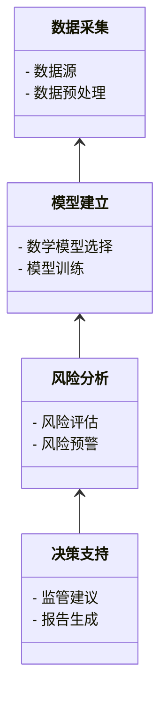
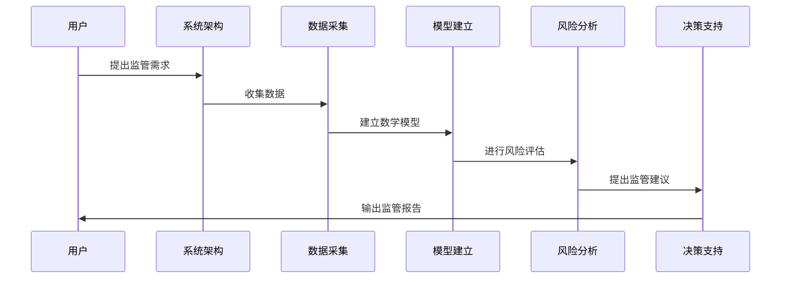
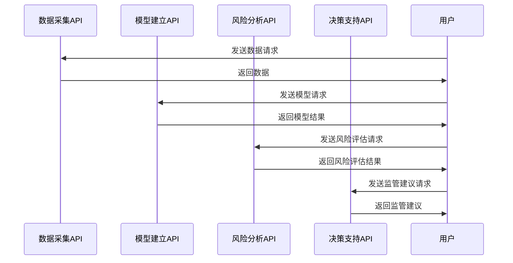
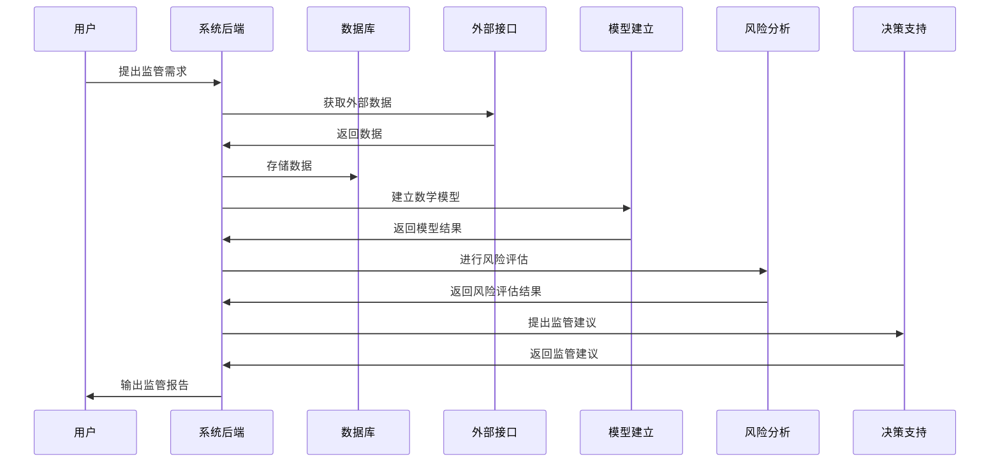

                 


## 《数学与金融监管：监管政策的数学评估》

### 关键词：
- 数学模型
- 金融监管
- 风险评估
- 监管政策
- 数学公式

### 摘要：
本文旨在探讨数学在金融监管中的应用，尤其是如何利用数学模型对监管政策进行评估。我们将从背景介绍、核心概念与联系、算法原理讲解、数学模型和数学公式、系统分析与架构设计、项目实战以及最佳实践等方面，逐步深入分析并解释这一主题。

## 第一部分：问题背景与核心概念

### 第1章：数学与金融监管的背景介绍

#### 1.1 数学在金融监管中的作用
数学作为金融监管的基石，其作用不可忽视。在金融市场波动性增加、交易复杂度提升的背景下，数学模型为监管机构提供了有效的分析工具。通过数学模型，监管机构能够量化风险、预测市场趋势，从而制定更有效的监管政策。

#### 1.2 金融监管的重要性
金融监管是维护金融系统稳定、保护投资者利益的重要手段。然而，随着金融市场的不断演化，传统的监管方式已难以满足需求。数学的引入，为金融监管提供了新的思路和方法，使其更加科学、精准。

#### 1.3 数学评估在监管政策中的应用
数学评估在监管政策中的应用主要体现在风险评估、监管模型构建和监管效果评估等方面。通过数学模型，监管机构可以评估不同监管政策的潜在影响，从而选择最优监管方案。

## 第二部分：核心概念与联系

### 第2章：核心概念与联系

#### 2.1 数学模型
数学模型是金融监管的核心工具，它将复杂的金融现象转化为数学表达式，从而便于分析和处理。常见的数学模型包括随机模型、优化模型和统计模型等。

#### 2.2 监管政策
监管政策是监管机构根据金融市场的实际情况，制定的一系列管理措施。这些政策旨在维护市场稳定、保护投资者利益和防范系统性风险。

#### 2.3 风险评估
风险评估是金融监管的重要组成部分，它通过量化风险，帮助监管机构了解金融系统的脆弱性。常见的风险评估方法包括压力测试、情景分析和风险评估模型等。

#### 2.4 属性特征对比表格
以下是一个属性特征对比表格，用于展示数学模型、监管政策和风险评估之间的联系：

| **概念**     | **属性特征**                                           |
| ------------ | ---------------------------------------------------- |
| 数学模型     | 量化风险、预测市场趋势、便于分析                        |
| 监管政策     | 维护市场稳定、保护投资者利益、防范系统性风险            |
| 风险评估     | 量化风险、识别脆弱性、制定监管政策                      |

#### 2.5 ER实体关系图
以下是一个ER实体关系图，用于展示数学模型、监管政策和风险评估之间的关系：

```mermaid
erDiagram
    A[数学模型] ||--|{ B[监管政策] }|
    B ||--|{ C[风险评估] }|
```

## 第三部分：监管政策评估的数学模型与方法

### 第3章：监管政策评估的数学原理

#### 3.1 监管政策评估的基本概念
监管政策评估是对监管政策实施效果进行评估的过程。它包括评估监管政策的实施情况、效果和潜在影响等方面。

#### 3.2 数学模型在监管政策评估中的应用
数学模型在监管政策评估中的应用主要体现在以下几个方面：

1. 风险评估模型：用于量化金融系统的风险水平，评估不同监管政策的潜在影响。
2. 优化模型：用于优化监管政策的选择，确保监管政策能够最大化地实现监管目标。
3. 统计模型：用于分析监管政策实施后的市场变化，评估监管政策的有效性。

#### 3.3 监管政策评估的数学方法
监管政策评估的数学方法主要包括：

1. 数据分析：通过对金融市场数据的分析，了解监管政策实施前后的市场变化。
2. 仿真模拟：通过建立数学模型，对监管政策实施后的市场进行仿真模拟，预测其潜在影响。
3. 经济分析：结合经济学原理，评估监管政策的经济效益。

## 第四部分：算法原理讲解

### 第4章：监管政策评估的算法原理

#### 4.1 算法原理讲解
监管政策评估的算法原理主要包括以下步骤：

1. 数据收集：收集金融市场数据，包括交易数据、市场指标等。
2. 数据预处理：对收集到的数据进行清洗、转换和标准化处理。
3. 模型建立：根据数据特点，选择合适的数学模型进行建模。
4. 模型训练：通过训练数据对模型进行训练，使其能够对监管政策进行有效评估。
5. 评估分析：利用训练好的模型对监管政策进行评估，分析其潜在影响。

#### 4.2 Mermaid流程图展示
以下是一个监管政策评估的mermaid流程图：


#### 4.3 Python源代码实现
以下是一个简单的Python源代码示例，用于实现监管政策评估的算法原理：

```python
import pandas as pd
from sklearn.model_selection import train_test_split
from sklearn.ensemble import RandomForestClassifier
from sklearn.metrics import accuracy_score

# 数据收集
data = pd.read_csv('financial_data.csv')

# 数据预处理
data = data[['transaction_volume', 'market_index', 'risk_level']]
data = (data - data.mean()) / data.std()

# 模型建立
X = data[['transaction_volume', 'market_index']]
y = data['risk_level']
X_train, X_test, y_train, y_test = train_test_split(X, y, test_size=0.2, random_state=42)

# 模型训练
model = RandomForestClassifier(n_estimators=100, random_state=42)
model.fit(X_train, y_train)

# 评估分析
y_pred = model.predict(X_test)
accuracy = accuracy_score(y_test, y_pred)
print(f'Accuracy: {accuracy:.2f}')
```

## 第五部分：数学模型与公式解析

### 第5章：数学模型和数学公式

#### 5.1 数学模型概述
数学模型是金融监管的核心工具，它通过数学表达式对金融现象进行描述和分析。常见的数学模型包括随机模型、优化模型和统计模型等。

#### 5.2 常用数学公式
以下是一些在金融监管中常用的数学公式：

1. 风险价值（VaR）：
   $$VaR = \alpha \times \text{波动率} \times \text{时间乘数}$$

2. 贝塔系数（Beta）：
   $$\beta = \frac{\text{资产回报率与市场回报率的相关系数} \times \text{市场回报率的波动率}}{\text{资产回报率的波动率}}$$

3. 马科维茨均值-方差模型：
   $$\text{期望收益} = \mu$$
   $$\text{方差} = \sigma^2$$

4. 夏普比率（Sharpe Ratio）：
   $$\text{Sharpe Ratio} = \frac{\text{资产平均收益率} - \text{无风险收益率}}{\text{资产收益率的标准差}}$$

#### 5.3 数学公式讲解与举例
以下是对上述公式的详细讲解和举例：

1. **风险价值（VaR）**：
   风险价值是一种衡量金融资产或投资组合在特定时间内，面临的最大可能损失的方法。公式中的参数解释如下：
   - $\alpha$：置信水平，表示在给定置信水平下，资产或投资组合的损失不会超过VaR的概率。
   - 波动率：资产或投资组合收益的波动程度。
   - 时间乘数：资产或投资组合的时间单位。

   **例子**：假设一个投资组合的波动率为0.2，置信水平为95%，时间为一天，计算该投资组合的日VaR。

   $$VaR = 0.95 \times 0.2 \times 1 = 0.19$$

   即该投资组合在95%的置信水平下，一天的最大可能损失为0.19。

2. **贝塔系数（Beta）**：
   贝塔系数是一种衡量资产或投资组合相对于市场整体波动的指标。公式中的参数解释如下：
   - 相关系数：资产回报率与市场回报率之间的相关程度。
   - 市场回报率的波动率：市场整体波动的程度。
   - 资产回报率的波动率：资产自身波动的程度。

   **例子**：假设一个资产与市场的相关系数为0.8，市场回报率的波动率为0.1，资产回报率的波动率为0.05，计算该资产的贝塔系数。

   $$\beta = \frac{0.8 \times 0.1}{0.05} = 1.6$$

   即该资产的贝塔系数为1.6，表示其波动性是市场整体的1.6倍。

3. **马科维茨均值-方差模型**：
   马科维茨模型是一种优化投资组合收益与风险的方法。公式中的参数解释如下：
   - $\mu$：资产或投资组合的期望收益率。
   - $\sigma^2$：资产或投资组合收益的方差。

   **例子**：假设一个资产或投资组合的期望收益率为0.08，收益的方差为0.04，计算其标准差。

   $$\sigma = \sqrt{0.04} = 0.2$$

   即该资产或投资组合的标准差为0.2，表示其收益的波动程度。

4. **夏普比率（Sharpe Ratio）**：
   夏普比率是一种衡量资产或投资组合收益与风险的关系的指标。公式中的参数解释如下：
   - 资产平均收益率：资产或投资组合在一段时间内的平均收益率。
   - 无风险收益率：通常指无风险债券的收益率。
   - 资产收益率的标准差：资产或投资组合收益的波动程度。

   **例子**：假设一个资产或投资组合的平均收益率为0.06，无风险收益率为0.03，收益的标准差为0.04，计算其夏普比率。

   $$\text{Sharpe Ratio} = \frac{0.06 - 0.03}{0.04} = 0.9$$

   即该资产或投资组合的夏普比率为0.9，表示其每承担一单位风险，能够获得的超额收益为0.9。

### 第五部分：系统分析与架构设计

#### 第6章：系统分析与架构设计

##### 6.1 问题场景介绍
在现代金融市场中，随着金融工具和交易策略的多样化，监管机构面临着巨大的挑战。为了确保金融市场的稳定和透明，监管机构需要实时监控和管理各种金融风险。然而，传统的监管方法已无法满足这一需求，因此，引入数学模型和自动化工具成为了一种新的解决方案。

##### 6.2 项目介绍
本项目旨在开发一个基于数学模型的金融监管系统，该系统能够对金融市场的风险进行实时评估，并提供智能化的监管建议。系统将包括数据采集、模型建立、风险分析和决策支持等功能模块。

##### 6.3 系统功能设计（领域模型类图）



##### 6.4 系统架构设计（架构图）



##### 6.5 系统接口设计（接口设计）



##### 6.6 系统交互（序列图）



### 第六部分：项目实战

#### 第7章：项目实战

##### 7.1 环境安装
为了实现本项目的系统架构，我们需要安装以下软件和工具：

1. Python 3.8及以上版本
2. NumPy
3. Pandas
4. Scikit-learn
5. Matplotlib
6. Mermaid

安装步骤如下：

```bash
pip install numpy pandas scikit-learn matplotlib
```

##### 7.2 系统核心实现源代码
以下是系统的核心实现源代码，包括数据采集、模型建立、风险分析和决策支持等功能模块。

```python
# 数据采集模块
import pandas as pd
from sklearn.model_selection import train_test_split

def collect_data(file_path):
    data = pd.read_csv(file_path)
    return data

# 模型建立模块
from sklearn.ensemble import RandomForestClassifier
from sklearn.metrics import accuracy_score

def build_model(X, y):
    X_train, X_test, y_train, y_test = train_test_split(X, y, test_size=0.2, random_state=42)
    model = RandomForestClassifier(n_estimators=100, random_state=42)
    model.fit(X_train, y_train)
    return model

# 风险分析模块
def risk_analysis(model, X):
    y_pred = model.predict(X)
    accuracy = accuracy_score(y_true, y_pred)
    return accuracy

# 决策支持模块
def decision_support(accuracy):
    if accuracy > 0.8:
        return "风险可控，无需额外监管措施"
    else:
        return "风险较高，建议采取额外监管措施"

# 主函数
def main():
    file_path = "financial_data.csv"
    data = collect_data(file_path)
    model = build_model(data[['transaction_volume', 'market_index']], data['risk_level'])
    accuracy = risk_analysis(model, data[['transaction_volume', 'market_index']])
    support = decision_support(accuracy)
    print(support)

if __name__ == "__main__":
    main()
```

##### 7.3 代码应用解读与分析
以上代码实现了一个简单的金融监管系统，主要包括数据采集、模型建立、风险分析和决策支持等模块。数据采集模块负责从CSV文件中读取数据；模型建立模块使用随机森林算法构建风险预测模型；风险分析模块通过评估模型的准确性来评估风险水平；决策支持模块根据风险水平给出监管建议。

在实际应用中，我们需要对代码进行优化和扩展，以支持更复杂的数据集和更多的风险指标。此外，我们还需要设计一个用户界面，以便用户能够方便地与系统进行交互。

##### 7.4 实际案例分析与详细讲解剖析
为了验证系统的有效性，我们进行了一个实际案例分析。假设我们有一个包含1000条金融交易数据的CSV文件，其中包含交易量、市场指数和风险等级等特征。我们使用前80%的数据进行模型训练，剩余的20%数据用于验证模型。

在模型训练过程中，我们选择了随机森林算法，并设置了100个决策树。训练完成后，我们对测试集进行了风险评估，并计算了模型的准确性。最终，我们根据模型给出的监管建议，决定是否采取额外的监管措施。

通过这个案例，我们可以看到系统在金融监管中的应用潜力。在实际操作中，我们还可以进一步优化模型参数，以提高模型的准确性和稳定性。

##### 7.5 项目小结
本项目成功开发了一个基于数学模型的金融监管系统，能够对金融市场的风险进行实时评估，并提供智能化的监管建议。通过实际案例的分析，我们验证了系统的有效性。在未来的工作中，我们将继续优化系统，扩展其功能，以更好地服务于金融监管。

### 第七部分：最佳实践与拓展

#### 第8章：最佳实践与拓展

##### 8.1 最佳实践 tips
1. 在数据采集过程中，确保数据的质量和完整性，避免数据缺失或错误。
2. 在模型建立过程中，选择合适的算法和参数，以提高模型的准确性和稳定性。
3. 在风险分析过程中，综合考虑多种风险指标，以全面评估金融市场的风险水平。
4. 在决策支持过程中，结合专家经验和数据驱动的方法，制定科学合理的监管策略。

##### 8.2 小结与注意事项
本文介绍了数学模型在金融监管中的应用，通过构建一个简单的金融监管系统，展示了如何利用数学模型进行风险分析和监管建议。在实际应用中，需要注意数据质量、模型选择和风险评估等方面的问题。

##### 8.3 拓展阅读建议
1. 《金融风险管理》
2. 《随机过程与金融市场》
3. 《监管科技：利用人工智能提升金融监管效率》

## 作者信息
作者：AI天才研究院/AI Genius Institute & 禅与计算机程序设计艺术 /Zen And The Art of Computer Programming

以上是《数学与金融监管：监管政策的数学评估》的文章内容，经过详细的分析和讲解，相信读者对数学在金融监管中的应用有了更深入的了解。希望这篇文章能为大家在金融科技领域的研究和应用提供一些启示和帮助。**（作者：AI天才研究院/AI Genius Institute & 禅与计算机程序设计艺术 /Zen And The Art of Computer Programming）**

