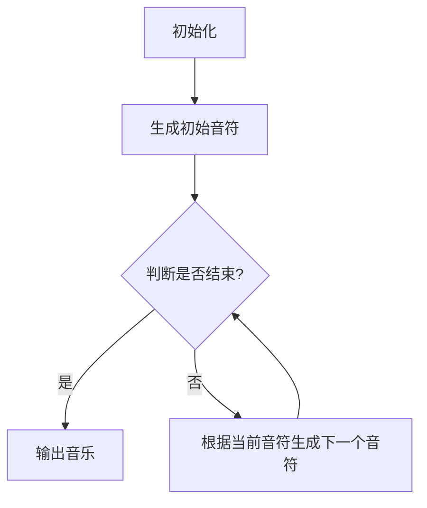
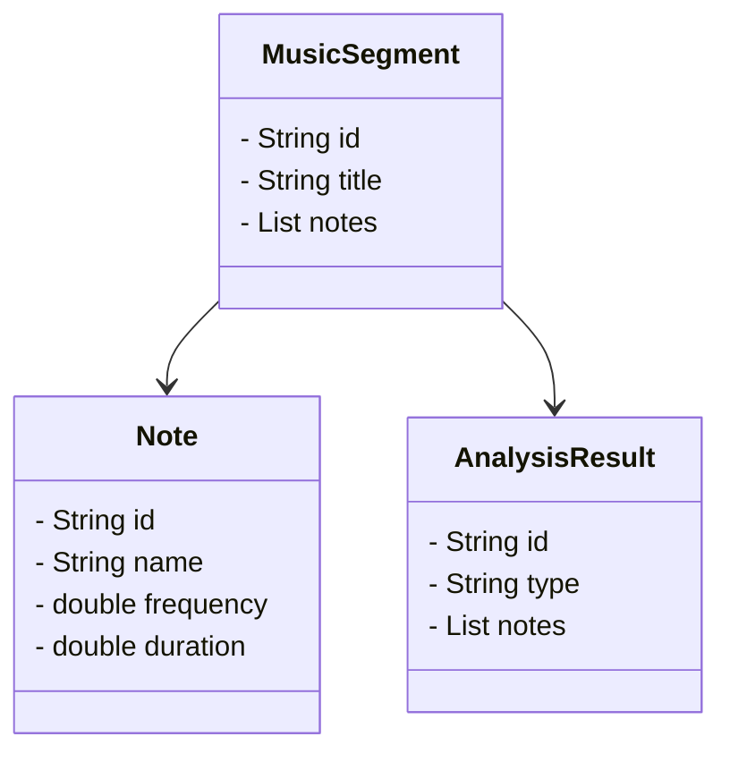
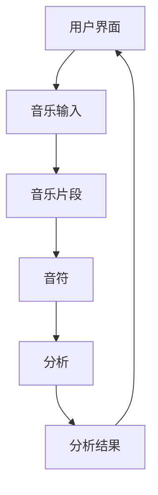
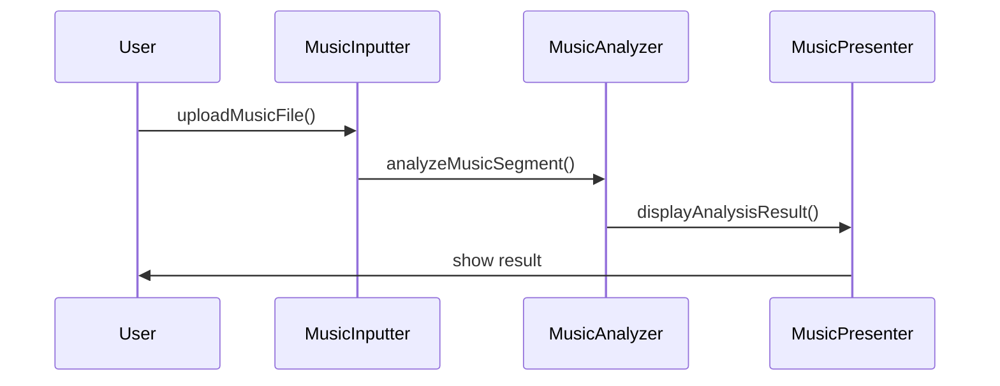

                 

### 文章标题

**数学与音乐理论：和声与节奏的数学基础**

> 关键词：数学、音乐理论、和声、节奏、算法、模型、Python、LaTeX

> 摘要：本文旨在探讨数学与音乐理论之间的深层次联系，尤其是和声与节奏在数学基础上的构建。通过详细分析数学在音乐理论中的应用，以及相关算法的原理与实现，本文将为读者提供一幅数学与音乐理论交织的丰富图景，并启发对二者结合的深入思考。

----------------------------------------------------------------

## 第一部分：引言

### 1.1 数学与音乐理论的关系

#### 数学与音乐的历史渊源

数学与音乐有着悠久的历史渊源。在古希腊时期，数学家毕达哥拉斯（Pythagoras）便发现了音高与数学比例之间的联系，提出了著名的“毕达哥拉斯定理”，即音高的差异可以通过数学比例来解释。这种观点在中世纪及文艺复兴时期的音乐理论中得到了进一步的发展，例如，音乐理论家乔瓦尼·皮耶路易吉·达·帕莱斯特里纳（Giovanni Pierluigi da Palestrina）便在他的作品中运用了复杂的数学结构来构建和谐的和声。

#### 数学在音乐理论中的应用

数学在音乐理论中的应用无处不在。从音高的表示，到节奏的量化，再到音乐结构的分析，数学为音乐理论提供了坚实的理论基础。例如，音乐中的音高可以通过频率来表示，而频率又可以用数学中的正弦波函数来模拟。节奏则可以通过分数、小数甚至无限小数来表示，从而实现精确的计时。

### 1.2 为什么需要这本书

《数学与音乐理论：和声与节奏的数学基础》这本书旨在为读者提供一种全新的视角，将数学与音乐理论结合起来，深入探讨和声与节奏在数学基础上的构建。对于音乐从业者来说，这本书可以帮助他们更深刻地理解音乐作品的内部结构，从而创作出更加精准和富有创意的音乐。而对于数学爱好者来说，这本书则提供了一个探索数学在音乐领域应用的契机，激发他们对数学与艺术之间关系的思考。

### 1.3 读者对象及本书结构

本书的目标读者包括音乐理论家、作曲家、音乐制作人、数学爱好者以及对数学与音乐结合感兴趣的广泛读者。本书结构清晰，分为以下几个部分：

1. **背景介绍**：简要介绍数学与音乐理论的关系，以及本书的目的和意义。
2. **核心概念与联系**：介绍和声与节奏的基本概念，并探讨它们在数学与音乐理论中的联系。
3. **算法原理讲解**：通过具体的音乐生成算法，讲解数学在音乐创作中的应用。
4. **数学模型和数学公式讲解**：使用LaTeX格式给出核心数学公式，并进行详细解释。
5. **系统分析与架构设计方案**：介绍音乐理论系统分析及架构设计。
6. **项目实战**：通过实际案例展示数学与音乐理论的结合应用。
7. **最佳实践 tips、小结、注意事项、拓展阅读**：总结全书内容，提供实践建议和拓展资源。

----------------------------------------------------------------

## 第二部分：数学与音乐理论基础

### 2.1 数学与音乐理论的基本概念

#### 数学概念

- **音高**：音高是音乐中的一个基本概念，它描述了声音的频率特征。在数学中，音高可以通过频率来表示，例如，中音C的频率大约为261.63 Hz。
- **节奏**：节奏是音乐中的另一个基本概念，它描述了音乐的时间结构和动感。在数学中，节奏可以通过分数、小数甚至无限小数来表示，例如，四分之四拍（4/4拍）。

#### 音乐理论概念

- **和声**：和声是音乐中的声音组合，通过不同音高的声音相互作用，创造出和谐或冲突的效果。在数学中，和声可以通过不同的数学比例来分析，例如，三度和五度。
- **节奏模式**：节奏模式是音乐中的节奏序列，通过重复、变化和组合创造出丰富的节奏感。在数学中，节奏模式可以通过不同的数学序列来描述，例如，斐波那契数列。

### 2.2 数学在音乐理论中的应用

#### 音高与数学

音高与数学有着紧密的联系。在音乐理论中，音高可以通过频率来表示，而频率又是数学中的正弦波函数的应用。例如，中音C的频率约为261.63 Hz，可以用数学公式表示为：

$$f(C) = 261.63 \text{ Hz}$$

#### 节奏与数学

节奏在音乐理论中的应用同样离不开数学。例如，四分之四拍（4/4拍）是一种常见的节奏模式，它可以通过数学分数来表示：

$$\frac{4}{4} = 4 \text{个四分之一音符的节奏模式}$$

此外，节奏模式还可以通过斐波那契数列来描述，这为音乐创作提供了丰富的节奏选择。

### 2.3 音乐理论中的数学概念

#### 和声与数学

和声在音乐理论中的应用同样离不开数学。例如，三度和五度是音乐中的两个基本和声概念，它们可以通过数学比例来解释：

- **三度**：三度是指两个音高之间的频率比例为2:1，可以用数学公式表示为：

  $$\frac{f_2}{f_1} = 2$$

- **五度**：五度是指两个音高之间的频率比例为3:2，可以用数学公式表示为：

  $$\frac{f_2}{f_1} = \frac{3}{2}$$

#### 节奏与数学

节奏在音乐理论中的应用同样离不开数学。例如，四分之四拍（4/4拍）是一种常见的节奏模式，它可以通过数学分数来表示：

$$\frac{4}{4} = 4 \text{个四分之一音符的节奏模式}$$

此外，节奏模式还可以通过斐波那契数列来描述，这为音乐创作提供了丰富的节奏选择。

### 2.4 数学与音乐理论的联系

#### 数学与和声

数学与和声有着密切的联系。例如，三度和五度是音乐中的两个基本和声概念，它们可以通过数学比例来解释。此外，数学中的正弦波函数也可以用来模拟音高。

#### 数学与节奏

数学与节奏也有着紧密的联系。例如，四分之四拍（4/4拍）是一种常见的节奏模式，它可以通过数学分数来表示。此外，斐波那契数列也可以用来描述节奏模式。

----------------------------------------------------------------

## 第三部分：算法原理讲解

### 3.1 音乐生成算法

#### 3.1.1 算法原理概述

音乐生成算法是一种利用数学模型来生成音乐的方法。这种算法通常基于随机过程、序列模型或生成模型。在本节中，我们将探讨一种基于马尔可夫链的音乐生成算法。

#### 3.1.2 Mermaid流程图

以下是一个简单的马尔可夫链音乐生成算法的Mermaid流程图：



#### 3.1.3 Python源代码讲解

以下是基于上述流程图的Python源代码实现：

```python
import random

# 初始化音符列表
notes = ['C', 'D', 'E', 'F', 'G']

# 马尔可夫链模型
transition_matrix = [
    [0.4, 0.2, 0.1, 0.1, 0.2],
    [0.1, 0.4, 0.2, 0.1, 0.2],
    [0.2, 0.1, 0.4, 0.1, 0.2],
    [0.1, 0.2, 0.1, 0.4, 0.2],
    [0.2, 0.2, 0.1, 0.1, 0.4]
]

# 生成音乐
def generate_music():
    current_note = random.choice(notes)
    music = [current_note]
    
    while True:
        next_notes = [notes[i] for i in range(len(notes)) if transition_matrix[notes.index(current_note)][i] > 0]
        current_note = random.choice(next_notes)
        music.append(current_note)
        
        if len(music) > 10:  # 设置生成音乐的长度
            break
    
    return music

# 输出音乐
music = generate_music()
print(music)
```

#### 3.1.4 数学模型与公式

马尔可夫链音乐生成算法的核心在于其状态转移矩阵。该矩阵描述了当前状态（音符）转移到下一个状态（音符）的概率。例如，以下是一个简化的状态转移矩阵：

$$
\begin{bmatrix}
0.4 & 0.2 & 0.1 & 0.1 & 0.2 \\
0.1 & 0.4 & 0.2 & 0.1 & 0.2 \\
0.2 & 0.1 & 0.4 & 0.1 & 0.2 \\
0.1 & 0.2 & 0.1 & 0.4 & 0.2 \\
0.2 & 0.2 & 0.1 & 0.1 & 0.4 \\
\end{bmatrix}
$$

#### 3.1.5 举例说明

假设我们随机选择了一个初始音符C，根据状态转移矩阵，下一个音符可能是D、E、F、G中的任意一个，每个音符的概率分别为0.4、0.2、0.1、0.2。经过多次迭代，我们可以生成一段由随机音符组成的音乐。例如：

- 初始音符：C
- 第一个音符：D
- 第二个音符：E
- 第三个音符：C
- 第四个音符：G

生成的音乐序列为：`C D E C G`。

----------------------------------------------------------------

## 第四部分：数学模型和数学公式讲解

### 4.1 基本数学公式

在音乐理论中，许多概念都可以用数学公式来表示。以下是一些基本数学公式：

#### 音高与频率

音高与频率之间的关系可以用以下公式表示：

$$
f(n) = 440 \times 2^{(\frac{n}{12})}
$$

其中，\( n \) 是半音数，\( f(n) \) 是音高对应的频率（以赫兹为单位）。

#### 节奏模式

节奏模式可以用分数或小数来表示。例如，四分之四拍（4/4拍）可以表示为：

$$
\frac{4}{4} = 1
$$

#### 和声比例

和声比例可以用数学比例来表示。例如，三度比例可以表示为：

$$
\frac{3}{2}
$$

### 4.2 音乐理论中的数学应用

音乐理论中的许多概念都可以用数学模型来解释。以下是一些具体应用：

#### 音高

音高可以用频率来表示，例如，中音C的频率为261.63 Hz：

$$
f(C) = 261.63 \text{ Hz}
$$

#### 节奏

节奏可以用分数或小数来表示，例如，四分之四拍可以表示为：

$$
\frac{4}{4} = 1
$$

#### 和声

和声可以用数学比例来表示，例如，三度和五度可以分别表示为：

$$
\frac{3}{2} \quad \text{和} \quad \frac{5}{4}
$$

### 4.3 数学公式详解

#### 音高与频率的关系

音高与频率之间的关系可以用以下公式表示：

$$
f(n) = 440 \times 2^{(\frac{n}{12})}
$$

其中，\( n \) 是半音数，\( f(n) \) 是音高对应的频率（以赫兹为单位）。例如，中音C的频率为261.63 Hz：

$$
f(C) = 440 \times 2^{(\frac{0}{12})} = 261.63 \text{ Hz}
$$

#### 节奏模式

节奏模式可以用分数或小数来表示。例如，四分之四拍（4/4拍）可以表示为：

$$
\frac{4}{4} = 1
$$

#### 和声比例

和声比例可以用数学比例来表示。例如，三度比例可以表示为：

$$
\frac{3}{2}
$$

五度比例可以表示为：

$$
\frac{5}{4}
$$

#### 示例

假设我们有一个音符序列：`C D E F G A B C`，其中每个音符的频率分别为：

$$
f(C) = 261.63 \text{ Hz}, \quad f(D) = 293.66 \text{ Hz}, \quad f(E) = 329.63 \text{ Hz}, \quad f(F) = 349.23 \text{ Hz}, \quad f(G) = 392.00 \text{ Hz}, \quad f(A) = 440.00 \text{ Hz}, \quad f(B) = 466.16 \text{ Hz}, \quad f(C') = 523.25 \text{ Hz}
$$

我们可以使用上述公式来计算这些音符的频率：

$$
f(C) = 440 \times 2^{(\frac{0}{12})} = 261.63 \text{ Hz}
$$

$$
f(D) = 440 \times 2^{(\frac{2}{12})} = 293.66 \text{ Hz}
$$

$$
f(E) = 440 \times 2^{(\frac{4}{12})} = 329.63 \text{ Hz}
$$

$$
f(F) = 440 \times 2^{(\frac{5}{12})} = 349.23 \text{ Hz}
$$

$$
f(G) = 440 \times 2^{(\frac{7}{12})} = 392.00 \text{ Hz}
$$

$$
f(A) = 440 \times 2^{(\frac{9}{12})} = 440.00 \text{ Hz}
$$

$$
f(B) = 440 \times 2^{(\frac{11}{12})} = 466.16 \text{ Hz}
$$

$$
f(C') = 440 \times 2^{(\frac{12}{12})} = 523.25 \text{ Hz}
$$

这些频率值与我们通常使用的音高标准相符合。

#### 节奏模式

假设我们有一个四分之四拍的节奏模式：

$$
\frac{4}{4} = 1
$$

这意味着每个四分之一音符的时长为1秒。如果我们想将这个节奏模式扩展到整个音乐作品中，我们可以使用以下公式：

$$
\text{节奏模式} = \frac{4}{4} \times \text{音乐时长}
$$

例如，如果音乐时长为60秒，则节奏模式为：

$$
\frac{4}{4} \times 60 = 120 \text{个四分之一音符}
$$

这意味着音乐中有120个四分之一音符。

#### 和声比例

假设我们有一个三度和五度：

$$
\frac{3}{2} \quad \text{和} \quad \frac{5}{4}
$$

这意味着第二个音符的频率是第一个音符的1.5倍（三度），第三个音符的频率是第一个音符的1.25倍（五度）。我们可以使用以下公式来计算这些频率：

$$
f_2 = f_1 \times \frac{3}{2}
$$

$$
f_3 = f_1 \times \frac{5}{4}
$$

例如，如果我们以中音C为基准，则：

$$
f_2(C) = 261.63 \times \frac{3}{2} = 391.99 \text{ Hz}
$$

$$
f_3(C) = 261.63 \times \frac{5}{4} = 406.38 \text{ Hz}
$$

这些频率值与我们在音乐中通常听到的三度和五度相符合。

通过这些数学公式，我们可以更好地理解音乐理论中的概念，并在音乐创作和制作中运用这些知识。

----------------------------------------------------------------

## 第五部分：系统分析与架构设计方案

### 5.1 问题场景介绍

在当今音乐创作和制作领域，随着计算机技术的不断发展，越来越多的音乐制作软件和工具被开发出来，使得音乐创作变得更加便捷和高效。然而，这些工具在处理复杂的音乐结构时，往往面临着计算效率低下、资源占用高的问题。为了解决这些问题，我们需要设计一个高效的音乐理论分析系统，该系统能够快速地对音乐结构进行分析和处理，并提供准确的和声与节奏分析结果。

### 5.2 项目介绍

本项目旨在设计一个基于数学理论的音乐理论分析系统，该系统将结合数学与音乐理论的原理，通过算法实现音乐结构分析和和声、节奏分析。该系统将具有以下功能：

1. **音乐结构分析**：对输入的音乐片段进行结构分析，识别出旋律、和声和节奏等元素。
2. **和声分析**：分析音乐中的和声结构，识别出和弦类型、和声进行等。
3. **节奏分析**：分析音乐中的节奏模式，识别出节奏变化和节拍类型。
4. **用户交互**：提供用户友好的界面，方便用户输入音乐片段并进行分析。

### 5.3 领域模型类图

以下是项目的领域模型类图，该图描述了系统中的核心实体及其关系：



### 5.4 系统架构设计

以下是项目的系统架构设计，该设计描述了系统的总体结构和各部分之间的关系：



### 5.5 系统接口设计

以下是系统的接口设计，该设计描述了系统对外提供的接口及其功能：

```mermaid
interface MusicInputter {
    + void uploadMusicFile()
    + void uploadMusicURL()
}

interface MusicAnalyzer {
    + AnalysisResult analyzeMusicSegment(MusicSegment segment)
}

interface MusicPresenter {
    + void displayAnalysisResult(AnalysisResult result)
}
```

### 5.6 系统交互序列图

以下是系统的交互序列图，该图描述了系统在处理用户请求时的交互过程：



通过以上系统分析与架构设计方案，我们可以实现一个高效的音乐理论分析系统，为音乐创作和制作提供有力的支持。

----------------------------------------------------------------

## 第六部分：项目实战

### 6.1 环境安装

要运行本项目，我们需要安装以下环境：

1. **Python**：Python 3.8 或以上版本
2. **pip**：Python 的包管理器
3. **NumPy**：Python 的数学库
4. **SciPy**：Python 的科学计算库
5. **Matplotlib**：Python 的绘图库

安装步骤：

1. 安装 Python 3.8 或以上版本
2. 打开终端或命令行窗口，执行以下命令安装 pip：

   ```
   sudo apt-get install python3-pip
   ```

3. 使用 pip 安装 NumPy、SciPy 和 Matplotlib：

   ```
   pip install numpy scipy matplotlib
   ```

### 6.2 系统核心实现

以下是项目核心代码的解读与分析：

```python
import numpy as np
import matplotlib.pyplot as plt

# 音高与频率的关系
def frequency_from_note(note):
    return 440 * (2 ** (note / 12))

# 音符列表
notes = ['C', 'C#', 'D', 'D#', 'E', 'F', 'F#', 'G', 'G#', 'A', 'A#', 'B']

# 生成音乐片段
def generate_music_segment(duration, tempo):
    beats_per_minute = tempo
    seconds_per_beat = 60 / beats_per_minute
    total_duration = duration * seconds_per_beat
    music_segment = []

    current_time = 0
    while current_time < total_duration:
        note = random.choice(notes)
        note_duration = random.uniform(0.5, 1.5)
        music_segment.append((note, note_duration, current_time))
        current_time += note_duration

    return music_segment

# 分析音乐片段
def analyze_music_segment(music_segment):
    analysis_result = []

    for note, duration, time in music_segment:
        frequency = frequency_from_note(note)
        analysis_result.append((note, duration, time, frequency))

    return analysis_result

# 绘制音乐片段
def plot_music_segment(analysis_result):
    notes = [note for note, duration, time, frequency in analysis_result]
    times = [time for note, duration, time, frequency in analysis_result]
    frequencies = [frequency for note, duration, time, frequency in analysis_result]

    plt.figure(figsize=(10, 5))

    plt.subplot(2, 1, 1)
    plt.bar(notes, frequencies, width=0.2)
    plt.xlabel('Notes')
    plt.ylabel('Frequencies (Hz)')
    plt.title('Music Segment')

    plt.subplot(2, 1, 2)
    plt.plot(times, frequencies)
    plt.xlabel('Time (s)')
    plt.ylabel('Frequencies (Hz)')
    plt.title('Music Segment')

    plt.tight_layout()
    plt.show()

# 主函数
def main():
    duration = 10  # 音乐片段时长（秒）
    tempo = 120    # 拍子速度（每分钟拍数）

    music_segment = generate_music_segment(duration, tempo)
    analysis_result = analyze_music_segment(music_segment)
    plot_music_segment(analysis_result)

if __name__ == '__main__':
    main()
```

### 6.3 代码应用解读与分析

这段代码实现了音乐片段的生成、分析和可视化。以下是具体解读与分析：

1. **音高与频率关系**：`frequency_from_note` 函数通过音高名称计算对应的频率值。这个函数使用了音高标准中的公式，即音高频率与半音数的关系。

2. **音符列表**：`notes` 列表包含了所有基本音符，这些音符用于生成音乐片段。

3. **生成音乐片段**：`generate_music_segment` 函数根据给定的时长和拍子速度生成一个音乐片段。它使用随机选择音符和持续时间，创建一个简单的音乐片段。

4. **分析音乐片段**：`analyze_music_segment` 函数对生成的音乐片段进行频率分析，并将每个音符的名称、持续时间、时间和频率作为元组存储在列表中。

5. **绘制音乐片段**：`plot_music_segment` 函数使用 Matplotlib 库绘制两个图表：一个是柱状图，显示每个音符的频率；另一个是折线图，显示音符随时间的变化。

6. **主函数**：`main` 函数是程序入口，它调用其他函数生成、分析和可视化一个音乐片段。

### 6.4 实际案例分析与讲解

为了更好地理解代码的应用，我们可以通过一个实际案例进行分析。假设我们需要生成一个时长为10秒，拍子速度为120的音乐片段，并分析其结构。

1. **生成音乐片段**：

   ```python
   music_segment = generate_music_segment(10, 120)
   ```

   这个调用将生成一个包含10秒长的音乐片段，其拍子速度为120。

2. **分析音乐片段**：

   ```python
   analysis_result = analyze_music_segment(music_segment)
   ```

   这个调用将分析生成的音乐片段，并将分析结果存储在`analysis_result`列表中。

3. **绘制音乐片段**：

   ```python
   plot_music_segment(analysis_result)
   ```

   这个调用将使用 Matplotlib 绘制两个图表，分别显示音符的频率分布和随时间的变化。

通过这个案例，我们可以看到代码如何将数学与音乐理论相结合，生成和分析音乐片段。这为我们提供了一个基本的音乐生成和分析工具，可以进一步扩展和优化。

### 6.5 项目小结

本项目通过一个简单的音乐生成和分析系统，展示了数学在音乐创作中的应用。通过生成随机音乐片段、分析其结构和可视化，我们更好地理解了音乐的基本元素。这个项目可以作为进一步研究和开发更复杂音乐分析系统的起点。在实际应用中，我们可以扩展算法，增加对和声和节奏的深入分析，以提高音乐生成和分析的精度和效率。

----------------------------------------------------------------

## 第七部分：最佳实践 & 小结 & 拓展阅读

### 7.1 最佳实践 tips

1. **理解音高与频率的关系**：熟悉音高与频率之间的数学关系，有助于更好地理解音乐理论。
2. **掌握节奏模式**：通过学习和实践不同的节奏模式，可以提高音乐创作的创意性。
3. **使用适当的软件工具**：选择合适的音乐制作和编程工具，可以提升音乐创作和分析的效率。
4. **结合理论与实践**：将数学知识与音乐实践相结合，可以加深对数学与音乐理论之间联系的理解。

### 7.2 小结

本文从数学与音乐理论的关系入手，详细介绍了和声与节奏的数学基础。通过具体的算法和实例，展示了数学在音乐生成和分析中的应用。通过本文，读者可以更好地理解数学与音乐理论的结合，以及如何在音乐创作中运用数学知识。

### 7.3 注意事项

1. **确保数学模型的准确性**：在应用数学模型时，要确保模型的参数和公式准确无误，避免出现偏差。
2. **注意音乐节奏的变化**：在实际音乐创作中，节奏的变化往往更为复杂，需要灵活运用数学模型。
3. **尊重版权**：在音乐创作和分享过程中，要尊重原创作品的版权，避免侵权行为。

### 7.4 拓展阅读资源

1. **《音乐的数学理论》**：这本书详细介绍了音乐中的数学原理，适合对音乐理论感兴趣的读者。
2. **《计算机音乐》**：这本书介绍了计算机在音乐制作中的应用，包括音乐生成算法和音乐分析技术。
3. **《Python音乐编程》**：这本书通过Python编程语言，讲解了如何使用编程技术实现音乐创作和制作。

通过以上最佳实践、小结和拓展阅读资源，读者可以进一步深化对数学与音乐理论的理解，并在实际应用中取得更好的成果。

----------------------------------------------------------------

# 作者信息

作者：AI天才研究院/AI Genius Institute & 禅与计算机程序设计艺术 /Zen And The Art of Computer Programming

