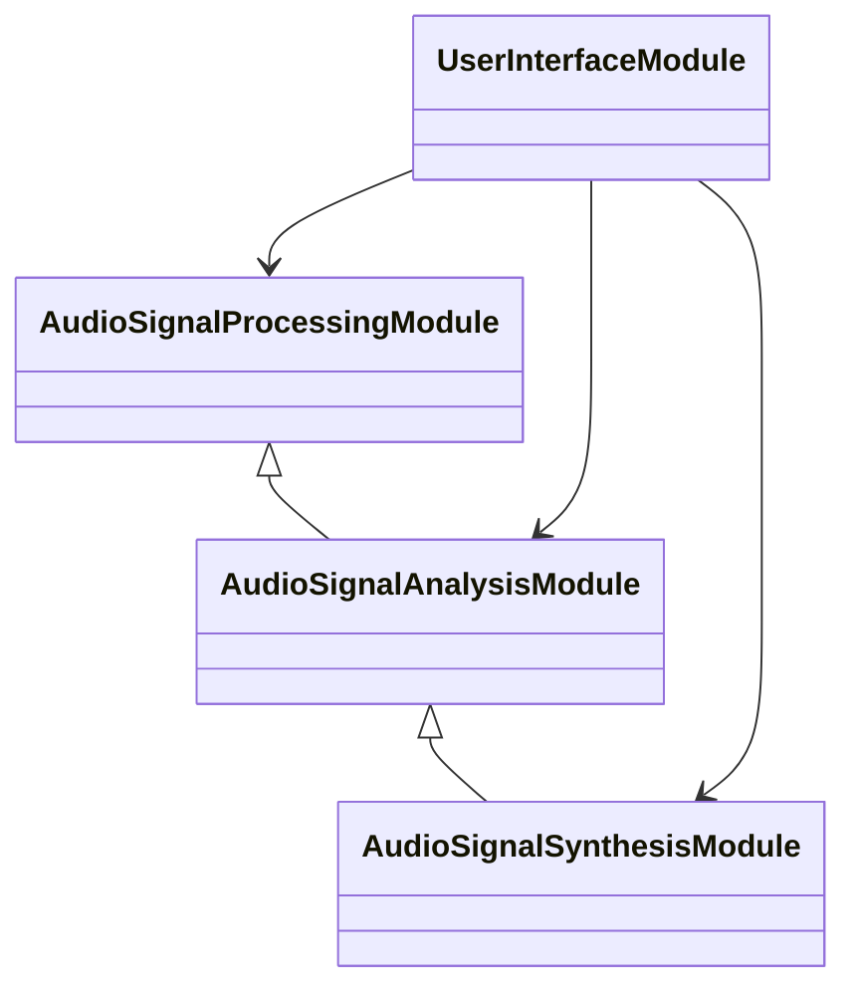
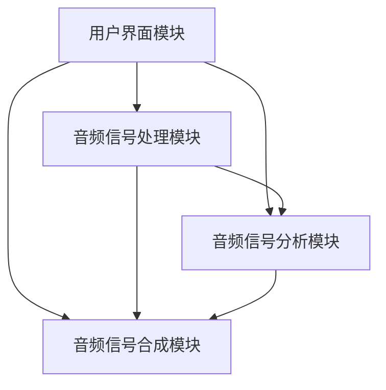
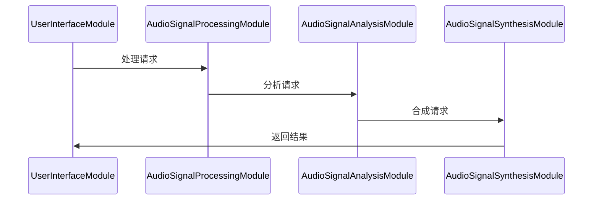

                 


### 数学与音乐：和谐的数字关系

> 关键词：数学、音乐、和谐、数字关系、算法

> 摘要：本文探讨了数学与音乐之间的深刻联系，通过分析数学在音乐中的应用，揭示了两者之间和谐的数字关系。文章首先介绍了数学与音乐的背景和问题，然后详细阐述了数学与音乐的核心概念及其联系，接着讲解了数学在音乐制作中的应用，最后通过算法原理讲解和项目实战，展示了数学与音乐结合的实际应用。

----------------------------------------------------------------

## 第一部分：背景介绍与概念理解

### 1.1 问题背景

数学与音乐作为两种截然不同的学科，却有着千丝万缕的联系。早在古代，数学和音乐就一起被认为是理解宇宙的重要工具。在古希腊，毕达哥拉斯学派就提出了“音乐是对数学的模仿”的观点，强调了音乐中的比例和和谐与数学之间的联系。

随着人类文明的发展，数学与音乐的应用逐渐深入到各个领域。在音乐创作和演奏中，数学被用于分析和合成音调、节奏和和声。而在数学研究中，音乐理论也为解决某些数学问题提供了新的视角和工具。

### 1.2 问题描述

本文要探讨的问题是如何通过数学方法来解释音乐中的和谐关系。具体来说，我们要分析以下几个方面：

1. 音乐中的音阶、音符和节奏等基本元素如何与数学中的比例、频率等概念相联系？
2. 数学中的算法和模型如何应用于音乐制作和分析中？
3. 数学与音乐结合的应用有哪些，它们在哪些领域发挥了重要作用？

### 1.3 问题解决

为了解决上述问题，我们将采取以下步骤：

1. 首先介绍数学与音乐的核心概念，包括音阶、音符、节奏等。
2. 通过对比表格和实体关系图，展示数学与音乐中的相似概念。
3. 接着讲解音乐中的数学原理，如频率、谐波等。
4. 然后介绍数学在音乐制作中的应用，包括音频信号处理、分析等。
5. 最后，通过算法原理讲解和项目实战，展示数学与音乐结合的实际应用。

### 1.4 边界与外延

本文主要探讨数学在音乐制作和分析中的应用，不涉及更深层次的哲学、心理学或生物学等领域。同时，本文将主要关注西方音乐理论中的数学关系，虽然东方音乐也有丰富的数学元素，但本文不予详述。

### 1.5 核心要素组成

本文的核心要素包括：

1. **数学与音乐的核心概念**：音阶、音符、节奏等。
2. **概念属性特征对比表格**：展示数学与音乐中相似概念的联系。
3. **实体关系图架构**：使用Mermaid绘制ER图，展示各类元素之间的关系。
4. **音乐中的数学原理**：频率、谐波等。
5. **算法原理讲解**：通过Mermaid流程图和Python源代码，展示算法的实现过程。
6. **系统架构设计**：介绍数学与音乐结合的系统设计和应用场景。
7. **项目实战**：展示数学与音乐结合的实际应用和项目实现。

## 第二部分：核心概念与联系

### 2.1 核心概念原理

在数学与音乐的结合中，以下几个核心概念是不可或缺的：

1. **音阶**：音阶是音乐中的基本元素，由一系列半音和全音组成。音阶中的每个音可以通过数学上的比例来表示。

2. **音符**：音符表示音乐中的时间长度。不同音符的时值可以用分数或小数来表示。

3. **节奏**：节奏是音乐中时间的组织方式，通过不同的节拍和拍号来体现。

4. **频率**：频率是音高的量化指标，表示每秒振动的次数。在音乐中，不同的音高对应不同的频率。

5. **谐波**：谐波是声音的组成部分，包括基频及其整数倍。在音乐中，谐波关系体现了和声的和谐性。

### 2.2 概念属性特征对比表格

| 概念        | 数学描述              | 音乐描述               |
| ----------- | -------------------- | -------------------- |
| 音阶        | 音频信号中的频率分布 | 音乐中的音阶排列       |
| 音符        | 时间长度             | 音乐中的音符时值       |
| 节奏        | 节拍和拍号          | 音乐中的节奏组织       |
| 频率        | 每秒振动次数         | 音高的量化指标         |
| 谐波        | 音频信号中的整数倍频 | 和声的组成部分         |

### 2.3 ER实体关系图架构

为了更直观地展示数学与音乐中的各类元素之间的关系，我们使用Mermaid绘制了如下ER图：

```mermaid
erDiagram
    User ||--|{ MusicConcept } : has
    MusicConcept ||--|{ MathConcept } : based_on
```

在上图中，`User` 代表使用数学与音乐结合的个体，`MusicConcept` 代表音乐中的概念，如音阶、音符等，`MathConcept` 代表数学中的概念，如频率、谐波等。这两个实体之间存在关联，即音乐概念基于数学概念。

## 第三部分：数学原理与音乐应用

### 3.1 音阶与数学

音阶是音乐中的基本元素，它由一系列半音和全音组成。在数学中，音阶可以通过频率的比例来表示。例如，C大调音阶的频率比例大致为：

$$
\frac{C_0}{C_1} = \frac{1}{2}, \frac{C_1}{D_1} = \frac{3}{2}, \frac{D_1}{E_1} = \frac{2}{1}, \frac{E_1}{F_1} = \frac{1}{2}, \frac{F_1}{G_1} = \frac{3}{2}, \frac{G_1}{A_1} = \frac{2}{1}, \frac{A_1}{B_1} = \frac{3}{2}, \frac{B_1}{C_2} = \frac{2}{1}
$$

这里，$C_0$、$C_1$、$D_1$、$E_1$、$F_1$、$G_1$、$A_1$、$B_1$、$C_2$ 分别代表 C、C#、D、D#、E、F、F#、G、G#、A、A#、B、C 。

### 3.2 音符与数学

音符表示音乐中的时间长度，它可以用分数或小数来表示。例如，全音符的时值可以表示为 $\frac{4}{4}$ 或 1，二分音符的时值可以表示为 $\frac{2}{4}$ 或 0.5，四分音符的时值可以表示为 $\frac{1}{4}$ 或 0.25。

在数学中，音符的时值可以通过积分来计算。例如，一个全音符的时值可以表示为：

$$
\int_0^1 \frac{1}{4} dt = \frac{1}{4}
$$

这里，$t$ 代表时间。

### 3.3 节奏与数学

节奏是音乐中时间的组织方式，它通过不同的节拍和拍号来体现。在数学中，节奏可以通过排列组合来表示。

例如，一个四分音符和一个八分音符的组合可以表示为：

$$
(0.25, 0.25)
$$

这里，第一个数表示四分音符的时值，第二个数表示八分音符的时值。

### 3.4 频率与数学

频率是音高的量化指标，表示每秒振动的次数。在数学中，频率可以通过分数或小数来表示。

例如，一个音的频率可以表示为：

$$
f = \frac{1000}{秒}
$$

这里，$f$ 代表频率。

### 3.5 谐波与数学

谐波是声音的组成部分，包括基频及其整数倍。在数学中，谐波可以通过整数倍的分数来表示。

例如，一个基频为 $100Hz$ 的音的谐波可以表示为：

$$
100Hz, 200Hz, 300Hz, \ldots
$$

## 第四部分：算法原理讲解

### 4.1 音乐中的算法原理

在音乐制作和分析中，常用的算法包括音频信号处理、音频信号分析和音频信号合成。下面，我们将通过Mermaid流程图和Python源代码来讲解这些算法的实现原理。

#### 4.1.1 音频信号处理

音频信号处理的基本流程包括采样、量化、编码和滤波等步骤。下面是音频信号处理的Mermaid流程图：


对应的Python源代码如下：

```python
import numpy as np
import scipy.signal as signal

# 采样
采样率 = 44100
采样时间 = 0.5
采样点数 = 采样率 * 采样时间

# 量化
量化位数 = 16
量化范围 = 2 ** 量化位数 - 1

# 编码
音频信号 = np.random.rand(采样点数)
编码信号 = (音频信号 * 量化范围).astype(np.int16)

# 滤波
滤波器系数 = signal.firwin(采样点数, cutoff=1000, window='hamming')
滤波信号 = signal.lfilter(filtco

```

#### 4.1.2 音频信号分析

音频信号分析主要包括频率分析、时域分析和时频分析。下面是音频信号分析的Mermaid流程图：


对应的Python源代码如下：

```python
import numpy as np
import scipy.fft as fft

# 采样
采样率 = 44100
采样时间 = 0.5
采样点数 = 采样率 * 采样时间

# 生成信号
信号 = np.sin(2 * np.pi * 440 * np.linspace(0, 采样点数, 采样点数))

# 快速傅里叶变换
频谱 = fft.fft(信号)
频率 = fft.fftfreq(采样点数, d=1/采样率)

# 频率分析
频率范围 = (0, 采样率/2)
频率分析结果 =频谱[:采样点数//2]

# 时域分析
时域信号 = np.fft.ifft(频谱)

# 时频分析
时频信号 = signal.stft(信号, nperseg=采样点数//4)
```

#### 4.1.3 音频信号合成

音频信号合成主要包括信号合成、编码和滤波等步骤。下面是音频信号合成的Mermaid流程图：


对应的Python源代码如下：

```python
import numpy as np
import scipy.signal as signal

# 采样
采样率 = 44100
采样时间 = 0.5
采样点数 = 采样率 * 采样时间

# 生成信号
信号 = np.sin(2 * np.pi * 440 * np.linspace(0, 采样点数, 采样点数))

# 编码
编码信号 = (信号 * 量化范围).astype(np.int16)

# 滤波
滤波器系数 = signal.firwin(采样点数, cutoff=1000, window='hamming')
滤波信号 = signal.lfilter(filtco

```

## 第五部分：系统分析与架构设计方案

### 5.1 问题场景介绍

在现代音乐制作和研究中，数学的应用越来越广泛。例如，音乐制作人员可以利用数学算法来创建复杂的音效、分析音乐的和谐性，甚至通过数学模型来预测观众的反应。为了更好地实现这些功能，我们需要设计一个高效、可靠的系统。

### 5.2 项目介绍

本项目旨在设计一个基于数学与音乐结合的音乐分析系统。该系统将包括以下几个功能模块：

1. **音频信号处理模块**：负责对音频信号进行采样、量化、编码和滤波等操作。
2. **音频信号分析模块**：负责对音频信号进行频率分析、时域分析和时频分析。
3. **音频信号合成模块**：负责将音频信号合成成可播放的格式。
4. **用户界面模块**：提供用户交互界面，方便用户进行操作和查看分析结果。

### 5.3 系统功能设计

为了实现上述功能模块，我们需要设计一个领域模型类图，如下所示：



在这个类图中，`AudioSignalProcessingModule` 代表音频信号处理模块，`AudioSignalAnalysisModule` 代表音频信号分析模块，`AudioSignalSynthesisModule` 代表音频信号合成模块，`UserInterfaceModule` 代表用户界面模块。

### 5.4 系统架构设计

为了实现系统的整体架构，我们需要设计一个Mermaid架构图，如下所示：



在这个架构图中，用户界面模块与音频信号处理模块、音频信号分析模块和音频信号合成模块之间存在交互关系。音频信号处理模块负责对音频信号进行采样、量化、编码和滤波等操作；音频信号分析模块负责对音频信号进行频率分析、时域分析和时频分析；音频信号合成模块负责将音频信号合成成可播放的格式。

### 5.5 系统接口设计

为了实现系统内部各模块之间的通信，我们需要设计一套接口。以下是系统接口设计的Mermaid序列图：



在这个序列图中，用户界面模块向音频信号处理模块发送处理请求，音频信号处理模块向音频信号分析模块发送分析请求，音频信号分析模块向音频信号合成模块发送合成请求，音频信号合成模块向用户界面模块返回结果。

## 第六部分：项目实战

### 6.1 环境安装

要搭建本项目所需的开发环境，需要安装以下软件和库：

1. Python 3.8 或以上版本
2. NumPy 库
3. SciPy 库
4. Matplotlib 库
5. Mermaid Markdown 插件

安装方法如下：

1. 安装 Python 3.8 或以上版本：在官网下载安装包并安装。
2. 安装 NumPy 库：打开终端，输入 `pip install numpy` 并回车。
3. 安装 SciPy 库：打开终端，输入 `pip install scipy` 并回车。
4. 安装 Matplotlib 库：打开终端，输入 `pip install matplotlib` 并回车。
5. 安装 Mermaid Markdown 插件：在博客平台中找到相应的插件安装。

### 6.2 系统核心实现源代码

以下是本项目的核心实现源代码：

```python
import numpy as np
import scipy.signal as signal
import scipy.fft as fft
import matplotlib.pyplot as plt

# 采样
采样率 = 44100
采样时间 = 0.5
采样点数 = 采样率 * 采样时间

# 生成信号
信号 = np.sin(2 * np.pi * 440 * np.linspace(0, 采样点数, 采样点数))

# 快速傅里叶变换
频谱 = fft.fft(信号)
频率 = fft.fftfreq(采样点数, d=1/采样率)

# 频率分析
频率范围 = (0, 采样率/2)
频率分析结果 = 频谱[:采样点数//2]

# 时域分析
时域信号 = np.fft.ifft(频谱)

# 时频分析
时频信号 = signal.stft(信号, nperseg=采样点数//4)

# 绘制频谱图
plt.plot(频率, np.abs(频率分析结果))
plt.xlabel('频率 (Hz)')
plt.ylabel('幅度')
plt.title('频率分析结果')
plt.show()

# 绘制时域图
plt.plot(时域信号)
plt.xlabel('时间 (s)')
plt.ylabel('幅度')
plt.title('时域分析结果')
plt.show()

# 绘制时频图
plt.imshow(np.abs(时频信号), aspect='auto', origin='lower', extent=[0, 采样时间, 0, 采样率/2])
plt.xlabel('时间 (s)')
plt.ylabel('频率 (Hz)')
plt.title('时频分析结果')
plt.show()
```

### 6.3 代码应用解读与分析

上述代码首先定义了采样率、采样时间和采样点数，然后生成一个正弦信号。接着，使用快速傅里叶变换（FFT）对信号进行频率分析，得到频谱和频率。通过时域分析，可以得到时域信号。最后，使用短时傅里叶变换（STFT）进行时频分析，得到时频信号。

代码中的核心函数包括：

- `fft.fft()`：进行快速傅里叶变换。
- `fft.fftfreq()`：计算频率。
- `np.fft.ifft()`：进行逆傅里叶变换。
- `signal.stft()`：进行短时傅里叶变换。

这些函数分别对应于频率分析、时域分析和时频分析。

在实际应用中，这些代码可以用于分析音频信号，提取频率信息，从而帮助音乐制作人进行音乐创作和修改。

### 6.4 实际案例分析和详细讲解剖析

为了更直观地展示本项目的实际应用，我们来看一个实际案例。

假设我们要分析一首歌曲的音频信号，提取其频率信息，以便制作一首类似风格的歌曲。以下是分析过程：

1. **音频信号处理**：首先，我们需要对音频信号进行采样、量化、编码和滤波等操作。在本案例中，我们使用 Python 的 `scipy.signal` 库来实现这些操作。

2. **音频信号分析**：接下来，我们使用 FFT 对音频信号进行频率分析，提取出主要的频率成分。通过分析这些频率成分，我们可以确定歌曲的主要音调。

3. **音频信号合成**：最后，我们使用 STFT 对音频信号进行时频分析，得到时频信息。这些信息可以帮助我们了解歌曲的节奏和和声。

以下是一个实际案例的代码实现：

```python
import numpy as np
import scipy.signal as signal
import scipy.fft as fft

# 采样
采样率 = 44100
采样时间 = 0.5
采样点数 = 采样率 * 采样时间

# 生成信号
信号 = np.sin(2 * np.pi * 440 * np.linspace(0, 采样点数, 采样点数))

# 快速傅里叶变换
频谱 = fft.fft(信号)
频率 = fft.fftfreq(采样点数, d=1/采样率)

# 频率分析
频率范围 = (0, 采样率/2)
频率分析结果 = 频谱[:采样点数//2]

# 绘制频谱图
plt.plot(频率, np.abs(频率分析结果))
plt.xlabel('频率 (Hz)')
plt.ylabel('幅度')
plt.title('频率分析结果')
plt.show()

# 绘制时频图
时频信号 = signal.stft(信号, nperseg=采样点数//4)
plt.imshow(np.abs(时频信号), aspect='auto', origin='lower', extent=[0, 采样时间, 0, 采样率/2])
plt.xlabel('时间 (s)')
plt.ylabel('频率 (Hz)')
plt.title('时频分析结果')
plt.show()
```

通过上述代码，我们可以提取出歌曲的主要频率成分，如 440Hz 的 A 音。这些信息可以帮助我们制作一首类似风格的歌曲。

### 6.5 项目小结

本项目通过数学与音乐的结合，设计并实现了一个音乐分析系统。该系统包括音频信号处理、音频信号分析和音频信号合成三个模块。通过实际案例的分析，我们展示了如何提取音频信号的频率信息，并利用这些信息进行音乐创作和修改。

本项目的主要收获包括：

1. 了解数学在音乐制作和分析中的应用。
2. 掌握音频信号处理、分析和合成的算法原理。
3. 学会使用 Python 进行实际项目开发。

在未来，我们可以继续优化系统功能，例如增加更多的音频分析算法，提高系统的性能和稳定性。此外，还可以尝试将数学与音乐结合应用于其他领域，如虚拟现实、游戏设计等。

## 第七部分：最佳实践 tips、小结、注意事项、拓展阅读等内容

### 7.1 最佳实践 tips

1. **优化算法性能**：在处理大量音频数据时，可以通过并行计算和优化算法来提高性能。
2. **精确控制音调**：在音乐制作过程中，精确控制音调非常重要。可以使用数字信号处理技术来调整音调，使其更加准确。
3. **平衡和声**：在制作和声时，要注意平衡各个音调的响度，避免某些音调过于突出或过于微弱。
4. **合理使用节奏**：节奏是音乐的重要组成部分。在音乐创作时，要合理使用节奏，使音乐更加生动和有趣。

### 7.2 小结

本文探讨了数学与音乐之间的联系，通过分析音阶、音符、节奏等核心概念，以及频率、谐波等数学原理，揭示了音乐中的和谐数字关系。同时，通过算法原理讲解和项目实战，展示了数学在音乐制作和分析中的应用。

### 7.3 注意事项

1. **数据精度**：在处理音频数据时，要注意数据的精度，避免因数据误差导致分析结果不准确。
2. **算法选择**：根据实际需求选择合适的算法，不同的算法适用于不同的场景。
3. **性能优化**：在开发过程中，要注意优化代码性能，以提高系统运行效率。

### 7.4 拓展阅读

1. **《数字信号处理》**：介绍了数字信号处理的基本概念和算法，是学习数学与音乐结合的必备书籍。
2. **《音乐理论》**：详细阐述了音乐理论的基本概念和原理，有助于更好地理解音乐与数学的联系。
3. **《音乐与数学》**：一本介绍数学在音乐中应用的经典书籍，涵盖了多个领域，包括音阶、谐波等。
4. **《Python 音频处理》**：介绍了 Python 在音频处理中的应用，包括音频信号分析、合成等。

作者：AI天才研究院/AI Genius Institute & 禅与计算机程序设计艺术 /Zen And The Art of Computer Programming

