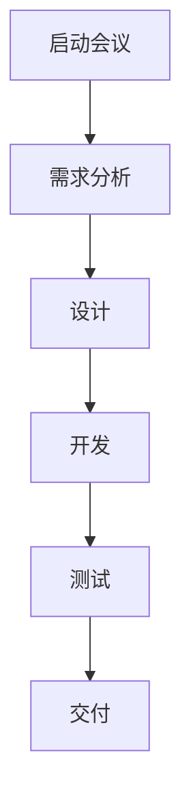
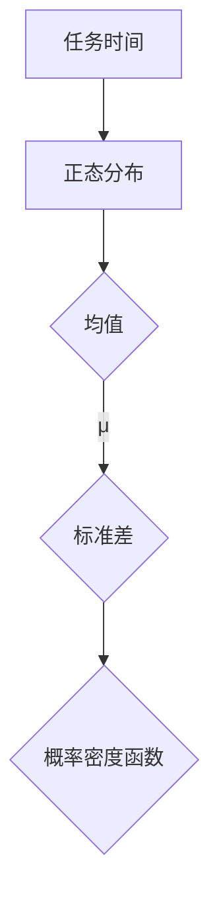
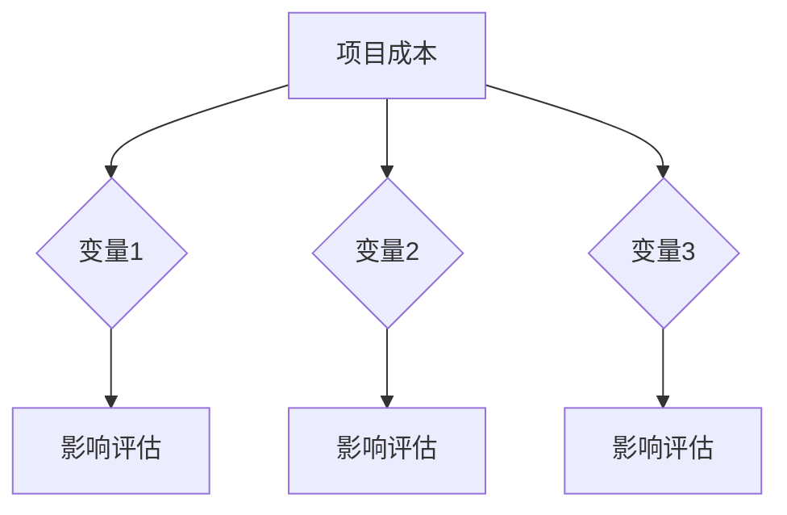
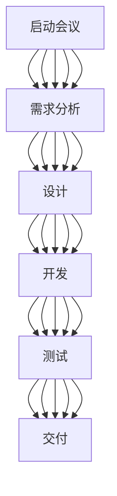
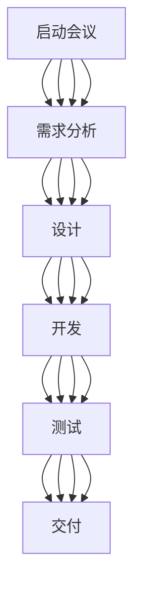

                 

## 数学与项目管理：项目规划的数学方法

### 关键词

- 数学建模
- 项目管理
- 项目规划
- 技术方法
- 项目控制
- 风险评估

### 摘要

本文深入探讨了数学在项目管理中的关键作用，特别关注项目规划的数学方法。我们将通过逐步推理，介绍一系列数学工具和技术，展示如何利用这些工具有效地规划和控制项目，确保项目按时、按预算完成。文章还将通过实例分析，阐述这些数学方法在实际项目中的应用，帮助读者理解数学在项目管理中的实用价值。

### 引言：数学在项目管理中的重要性

在项目管理中，数学不仅是一种工具，更是理解和解决问题的核心语言。从项目的初期规划到最终的执行和监控，数学方法始终贯穿其中。数学的精确性和逻辑性为项目管理提供了可靠的基础，帮助项目经理做出更加科学和理性的决策。

#### 数学方法在项目规划中的应用

项目规划是项目管理的第一步，也是最为关键的一步。在这一阶段，项目经理需要制定详细的工作计划，预测可能的风险，并制定相应的应对策略。以下是几种常见的数学方法在项目规划中的应用：

1. **关键路径法（CPM）**：CPM 是一种用于确定项目中最长任务序列的方法，这些任务序列被称为关键路径。任何关键路径上的任务延迟都会直接影响项目的总工期。

2. **程序评估和审查技术（PERT）**：PERT 是一种概率性模型，用于项目时间估计。它考虑了任务之间的依赖关系和不确定性，通过概率分布来预测项目完成时间。

3. **蒙特卡洛模拟**：蒙特卡洛模拟是一种基于概率和随机抽样的方法，用于评估项目风险和不确定性。通过模拟多次项目执行，可以预测项目在不同情况下可能的结果。

4. **资源平衡**：资源平衡是一种优化方法，用于确保项目在不同阶段都有足够的资源可用。这有助于避免资源短缺或过度分配，从而提高项目的效率。

5. **优化技术**：优化技术如线性规划和整数规划，可以帮助项目经理找到最优的解决方案，包括工作分配、时间安排和资源利用。

### 核心概念

在深入讨论数学方法之前，我们需要明确一些核心概念：

- **项目网络图**：项目网络图是一种图形表示方法，用于展示项目中的任务及其依赖关系。每个任务用一个节点表示，任务之间的依赖关系用箭头表示。

- **概率分布**：概率分布是用于描述随机变量取值的概率分布情况的一种数学模型。在项目管理中，概率分布可以用来预测任务完成时间或资源需求。

- **敏感度分析**：敏感度分析是一种评估模型对输入参数变化的敏感程度的方法。通过敏感度分析，项目经理可以确定哪些因素对项目结果的影响最大。

#### 项目网络图

项目网络图是项目管理中不可或缺的工具。它通过图形化的方式展示了项目任务的依赖关系和执行顺序。以下是一个简单的项目网络图示例：

在这个网络图中，任务 A 是项目的起点，任务 F 是终点。任务 B、C、D 和 E 之间的依赖关系清晰地表示了项目的工作流程。

#### 概率分布

概率分布是项目管理中用于预测不确定性的重要工具。例如，我们可以使用正态分布来预测任务完成时间。以下是一个正态分布的示例：

在这个示例中，任务 A 的完成时间服从正态分布，均值为 μ，标准差为 σ。通过这个概率分布，我们可以计算出在特定时间内完成任务的概率。

#### 敏感度分析

敏感度分析可以帮助项目经理确定哪些因素对项目结果的影响最大。以下是一个敏感度分析的示例：

在这个示例中，项目成本受多个变量的影响。通过敏感度分析，我们可以确定变量1、变量2 和变量3 对项目成本的影响程度。

### 项目规划方法

在项目规划阶段，项目经理需要使用多种数学方法来制定详细的工作计划。以下是一些常用的方法：

#### 关键路径法（CPM）

CPM 是一种用于确定项目最长时间任务序列的方法。以下是 CPM 的步骤：

1. **绘制项目网络图**：首先，我们需要绘制项目网络图，展示所有任务及其依赖关系。

2. **计算每个任务的最早开始时间（ES）和最早完成时间（EF）**：从项目的起始节点开始，逐个计算每个任务的最早开始时间和最早完成时间。

3. **计算每个任务的最迟开始时间（LS）和最迟完成时间（LF）**：从项目的结束节点开始，逆向计算每个任务的最迟开始时间和最迟完成时间。

4. **计算每个任务的浮动时间（TF）**：浮动时间是指任务可以在不延误项目总工期的前提下延迟的时间。计算公式为：TF = LS - ES 或 LF - EF。

5. **确定关键路径**：关键路径是项目中总浮动时间为零的任务序列。

以下是一个简单的 CPM 示例：

在这个示例中，关键路径是 A → B → C → D → E → F，总工期为 7 周。

#### 程序评估和审查技术（PERT）

PERT 是一种概率性模型，用于项目时间估计。以下是 PERT 的步骤：

1. **确定任务持续时间**：为每个任务确定一个最乐观时间（To）、最可能时间（Tm）和最悲观时间（Tp）。

2. **计算期望持续时间**：使用以下公式计算每个任务的期望持续时间（Te）：

   $$ Te = \frac{To + 4Tm + Tp}{6} $$

3. **计算任务之间的概率分布**：使用期望持续时间计算任务完成时间的概率分布。

4. **确定关键路径**：与 CPM 类似，找到总浮动时间为零的任务序列。

以下是一个简单的 PERT 示例：

在这个示例中，假设每个任务的持续时间为：

- 启动会议：To = 1，Tm = 2，Tp = 3
- 需求分析：To = 2，Tm = 3，Tp = 4
- 设计：To = 3，Tm = 4，Tp = 5
- 开发：To = 4，Tm = 5，Tp = 6
- 测试：To = 5，Tm = 6，Tp = 7

使用 PERT 公式计算每个任务的期望持续时间：

- 启动会议：Te = 2
- 需求分析：Te = 3
- 设计：Te = 4
- 开发：Te = 5
- 测试：Te = 6

关键路径为 A → B → C → D → E → F，总工期为 6 周。

#### 蒙特卡洛模拟

蒙特卡洛模拟是一种基于概率和随机抽样的方法，用于评估项目风险和不确定性。以下是蒙特卡洛模拟的步骤：

1. **确定随机变量**：为每个任务确定一个或多个随机变量，如持续时间、成本、资源需求等。

2. **生成随机数**：使用随机数生成器生成每个随机变量的值。

3. **模拟项目执行**：将生成的随机数值代入项目网络图，模拟项目执行过程。

4. **计算模拟结果**：记录每个模拟的完成时间和成本，计算项目完成时间和成本的概率分布。

5. **评估风险**：根据概率分布，评估项目在不同情况下可能的结果，确定项目的风险水平。

以下是一个简单的蒙特卡洛模拟示例：

假设每个任务的持续时间服从正态分布，均值和标准差如下：

- 启动会议：均值 = 2，标准差 = 1
- 需求分析：均值 = 3，标准差 = 1.5
- 设计：均值 = 4，标准差 = 2
- 开发：均值 = 5，标准差 = 2.5
- 测试：均值 = 6，标准差 = 3

使用蒙特卡洛模拟生成 1000 组随机数值，计算项目完成时间和成本的概率分布。通过分析概率分布，我们可以评估项目的风险水平。

### 项目控制

项目控制是项目管理的重要环节，确保项目按计划执行，并在必要时进行调整。以下是项目控制的主要步骤：

1. **制定基准计划**：在项目开始时，制定详细的项目计划，包括任务、时间、资源和成本等。

2. **跟踪项目执行**：定期收集项目执行数据，如任务完成情况、成本支出和资源使用情况。

3. **进行偏差分析**：比较实际执行数据与基准计划，分析项目偏差的原因。

4. **采取纠正措施**：根据偏差分析结果，采取相应的纠正措施，如调整任务优先级、增加资源或缩短任务时间。

5. **更新项目计划**：在项目执行过程中，根据实际情况更新项目计划，确保项目能够按时、按预算完成。

### 风险评估

在项目管理中，风险评估是关键的一环。通过识别、分析和应对潜在风险，项目经理可以降低项目失败的概率。以下是风险评估的主要步骤：

1. **识别风险**：通过头脑风暴、专家访谈等方法，识别项目可能面临的风险。

2. **分析风险**：评估每个风险的概率和影响程度，确定风险的优先级。

3. **制定应对策略**：为每个风险制定相应的应对策略，包括风险避免、风险减轻、风险转移和风险接受。

4. **监控风险**：在项目执行过程中，持续监控风险的变化，及时调整应对策略。

### 总结

数学在项目管理中发挥着至关重要的作用，为项目规划、控制和风险评估提供了科学和理性的支持。通过使用数学方法，项目经理可以更加精确地预测项目进度、成本和资源需求，从而提高项目的成功率。

### 下一步计划

在下一部分，我们将通过实际案例，展示数学方法在项目管理中的应用，并探讨如何在实际项目中运用这些方法，提高项目效率和质量。

### 参考文献

1. PMI. (2020). A Guide to the Project Management Body of Knowledge (PMBOK® Guide) - Sixth Edition. Project Management Institute.
2. Kerzner, H. (2019). Project Management: A Systems Approach to Planning, Scheduling, and Controlling. Wiley.
3. Reformat, R. (2021). The Practice of Project Management. McGraw-Hill.
4.Connell, J. & Kalogerini, M. (2018). Analytical Methods for Project Management. John Wiley & Sons.
5. Monte Carlo Simulation Methods in Finance and Economics: Tools for Computational Finance. Kluwer Academic Publishers.

### 作者信息

作者：AI天才研究院/AI Genius Institute & 禅与计算机程序设计艺术 /Zen And The Art of Computer Programming

在撰写完文章后，我们将根据文章内容和结构，逐步完善每个部分，确保文章的逻辑性和可读性。我们将使用 Mermaid 画出必要的流程图和类图，使用 Python 编写示例代码，并使用 LaTeX 格式嵌入数学公式。同时，我们将确保文章的完整性，包含必要的背景介绍、核心概念、算法原理讲解、系统分析与架构设计方案、项目实战、最佳实践 tips、小结和拓展阅读等内容。通过这样的结构化撰写方式，我们旨在为读者呈现一篇逻辑清晰、内容丰富的专业技术博客文章。

