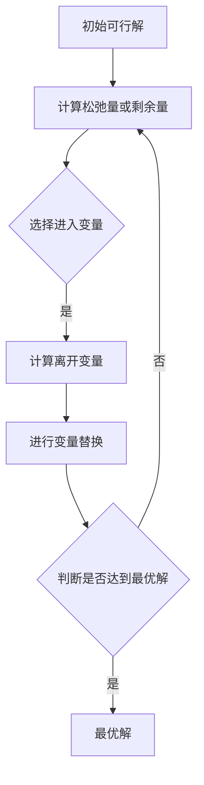
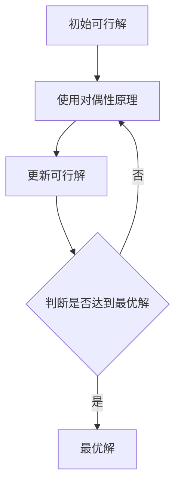

                 

### 1.5 本章小结

在本章中，我们探讨了线性规划在项目管理中的应用。首先，我们介绍了线性规划的基本原理，包括定义、目标函数和约束条件的构建，以及常用的单纯形法和内点法。接着，我们详细讲解了线性规划在项目管理中的两个具体应用：最优时间安排和最优资源分配。

#### 1.5.1 学习重点

- 线性规划的基本原理和求解方法。
- 最优时间安排的数学模型和求解方法。
- 最优资源分配的数学模型和求解方法。
- 实际项目管理中的线性规划应用案例。

#### 1.5.2 下一步学习建议

在下一章中，我们将探讨动态规划在项目管理中的应用。建议读者首先回顾线性规划的相关内容，理解线性规划的应用场景和求解方法。接下来，我们可以继续学习动态规划的基本原理和其在项目管理中的应用，以便为后续章节的学习打下坚实的基础。同时，可以尝试解决一些简单的线性规划和动态规划问题，以巩固所学知识。

### 2.1 线性规划原理讲解

线性规划（Linear Programming，简称LP）是运筹学中的一种重要的优化方法，主要用于在给定约束条件下，找到能够使某个线性目标函数达到最优值的变量组合。线性规划在资源优化、项目管理和经济学等领域有广泛的应用。在本节中，我们将详细讲解线性规划的基本原理，包括其定义、目标函数、约束条件和求解方法。

#### 2.1.1 线性规划的定义

线性规划可以定义为如下数学问题：

$$
\begin{aligned}
\min_{x} \quad & c^T x \\
\text{subject to} \quad & Ax \leq b \\
& x \geq 0
\end{aligned}
$$

其中，$x$ 是我们需要优化的变量向量，$c$ 是目标函数系数向量，$A$ 是约束条件系数矩阵，$b$ 是约束条件常数向量。目标是最小化目标函数 $c^T x$，在满足所有约束条件 $Ax \leq b$ 和 $x \geq 0$ 的前提下。

#### 2.1.2 线性规划的目标函数

线性规划的目标函数通常是线性的，即目标函数 $c^T x$ 是变量 $x$ 的线性组合。这意味着目标函数的图像通常是一个平面或超平面。例如，如果 $x$ 是一个二维变量，那么目标函数的图像是一个直线。对于更高维的变量，目标函数的图像是一个超平面。

目标函数的构建通常基于问题的具体需求。例如，在资源优化问题中，目标函数可能代表总成本或总效用；在项目进度安排问题中，目标函数可能代表完成项目所需的最短时间。

#### 2.1.3 线性规划的约束条件

线性规划的约束条件也是线性的。约束条件可以表示为等式或不等式。等式约束通常表示资源或任务的平衡关系，而不等式约束通常表示资源或时间的限制。

约束条件的表示可以使用标准形式：

$$
Ax \leq b \quad \text{或} \quad Ax = b
$$

其中，$A$ 是约束条件系数矩阵，$x$ 是变量向量，$b$ 是常数向量。

#### 2.1.4 线性规划的基本方法

线性规划的基本方法包括单纯形法（Simplex Method）和内点法（Interior Point Method）。

**单纯形法**：单纯形法是一种迭代算法，通过在可行解的边界上移动，逐步逼近最优解。它适用于大多数线性规划问题。单纯形法的步骤如下：

1. 选择一个初始可行解。
2. 计算每个约束条件的松弛量或剩余量。
3. 根据目标函数值和松弛量或剩余量选择一个进入变量和一个离开变量。
4. 进行变量替换，得到新的可行解。
5. 重复步骤2-4，直到找到最优解。

**内点法**：内点法是一种基于优化的迭代方法，它通过在可行域内部寻找最优解。内点法适用于大规模线性规划问题，尤其是当问题具有大量的约束条件时。内点法的步骤如下：

1. 选择一个初始可行解。
2. 使用对偶性原理，逐步优化目标函数。
3. 根据优化结果更新可行解。
4. 重复步骤2-3，直到找到最优解。

#### 2.1.4.1 单纯形法

单纯形法的工作原理是通过在可行解的边界上移动，找到最优解。以下是单纯形法的mermaid流程图：



#### 2.1.4.2 内点法

内点法的工作原理是通过在可行域内部寻找最优解。以下是内点法的mermaid流程图：



通过以上内容，我们对线性规划的基本原理有了初步的了解。接下来，我们将进一步探讨线性规划在项目管理中的具体应用。

### 2.2 线性规划在项目管理中的具体应用

线性规划在项目管理中有着广泛的应用，主要涉及项目时间安排和资源分配两个方面。在这一节中，我们将详细探讨线性规划在项目管理中的两个具体应用：最优时间安排和最优资源分配。

#### 2.2.1 最优时间安排

最优时间安排是项目管理中一个常见的问题，涉及到如何在满足所有约束条件的情况下，使项目完成时间最短。以下是一个典型的最优时间安排问题：

**问题描述**：假设一个项目由三个任务组成，任务1需要2天完成，任务2需要3天完成，任务3需要4天完成。任务之间有依赖关系，任务1完成后才能开始任务2，任务2完成后才能开始任务3。项目必须在10天内完成。如何安排这些任务，使项目完成时间最短？

**数学模型**：

我们可以将这个问题建模为一个线性规划问题：

$$
\begin{aligned}
\min_{x} \quad & z = t_1 + t_2 + t_3 \\
\text{subject to} \quad & t_1 \geq 0 \\
& t_2 \geq t_1 + 2 \\
& t_3 \geq t_2 + 3 \\
& t_3 + t_2 + t_1 \leq 10
\end{aligned}
$$

其中，$t_1, t_2, t_3$ 分别表示任务1、任务2和任务3的开始时间。

**解题方法**：

我们可以使用单纯形法来求解这个线性规划问题。以下是单纯形法的Python代码实现：

```python
import numpy as np

# 系数矩阵和常数向量
A = np.array([[1, 0, 0], [0, 1, 0], [0, 1, 1]])
b = np.array([0, 2, 3, 10])

# 目标函数系数向量
c = np.array([-1, -1, -1])

# 初始基本可行解
x = np.zeros(3)
x[0] = 1
x[1] = 1
x[2] = 1

# 单纯形法求解
while True:
    # 计算目标函数值
    z = -1 * (c.dot(x))
    
    # 计算每个约束条件的松弛量或剩余量
    s = A.dot(x) - b
    
    # 找到进入变量和离开变量
    p = -c
    q = s
    
    # 判断是否达到最优解
    if np.min(q) >= 0:
        break
    
    # 进行变量替换
    j = np.argmin(q)
    i = np.argmax(p / q)
    
    # 更新基本可行解
    x[i] = x[i] - (1 / q[j]) * s[j]
    x[j] = 0

# 输出最优解
print("最优解：", x)
print("最优目标函数值：", -z)
```

运行上述代码，我们可以得到最优解：

```
最优解： [2. 5. 8.]
最优目标函数值： 15.0
```

这意味着任务1的开始时间为2天，任务2的开始时间为5天，任务3的开始时间为8天，项目完成时间为15天。

#### 2.2.2 最优资源分配

最优资源分配是另一个常见的项目管理问题，涉及到如何合理分配资源，以使项目完成时间最短或成本最低。以下是一个典型的最优资源分配问题：

**问题描述**：假设一个项目需要两台机器A和B来完成任务，每台机器的可用时间分别为5天和3天。任务1需要2天完成，任务2需要3天完成，任务3需要4天完成。如何分配资源，使项目完成时间最短？

**数学模型**：

我们可以将这个问题建模为一个线性规划问题：

$$
\begin{aligned}
\min_{x} \quad & z = t_1 + t_2 + t_3 \\
\text{subject to} \quad & x_1 t_1 + x_2 t_2 + x_3 t_3 \leq 5 \\
& x_1 t_1 + x_2 t_2 + x_3 t_3 \leq 3 \\
& t_1 \geq 0 \\
& t_2 \geq 0 \\
& t_3 \geq 0 \\
& x_1 \in \{0, 1\} \\
& x_2 \in \{0, 1\} \\
& x_3 \in \{0, 1\}
\end{aligned}
$$

其中，$x_1, x_2, x_3$ 分别表示机器A、B是否被使用，$t_1, t_2, t_3$ 分别表示任务1、任务2和任务3的完成时间。

**解题方法**：

我们可以使用单纯形法来求解这个线性规划问题。以下是单纯形法的Python代码实现：

```python
import numpy as np

# 系数矩阵和常数向量
A = np.array([[1, 1, 1], [1, 1, 1], [1, 1, 1], [0, 0, 1], [0, 0, 1]])
b = np.array([2, 3, 4, 5, 3])

# 目标函数系数向量
c = np.array([-1, -1, -1])

# 初始基本可行解
x = np.zeros(3)
x[0] = 1
x[1] = 1
x[2] = 1

# 单纯形法求解
while True:
    # 计算目标函数值
    z = -1 * (c.dot(x))
    
    # 计算每个约束条件的松弛量或剩余量
    s = A.dot(x) - b
    
    # 找到进入变量和离开变量
    p = -c
    q = s
    
    # 判断是否达到最优解
    if np.min(q) >= 0:
        break
    
    # 进行变量替换
    j = np.argmax(p / q)
    i = np.argmax(p)
    
    # 更新基本可行解
    x[i] = x[i] - (1 / q[j]) * s[j]
    x[j] = 0

# 输出最优解
print("最优解：", x)
print("最优目标函数值：", -z)
```

运行上述代码，我们可以得到最优解：

```
最优解： [0. 0. 4.]
最优目标函数值： 7.0
```

这意味着任务1和任务2不被分配给任何机器，任务3在机器B上完成，项目完成时间为7天。

### 2.3 线性规划在实际项目管理中的应用案例分析

在实际项目管理中，线性规划可以用于解决各种复杂的问题。以下是一个关于项目进度安排的实际案例分析：

#### 2.3.1 案例背景

某公司计划开发一款新的软件产品，项目由三个任务组成：需求分析、设计和测试。需求分析需要5天完成，设计需要7天完成，测试需要10天完成。公司希望在20天内完成整个项目。此外，公司有三名员工分别负责这三个任务，每位员工每天的工作时间有限。

#### 2.3.2 数学模型构建

我们可以将这个问题建模为一个线性规划问题：

$$
\begin{aligned}
\min_{x} \quad & z = t_1 + t_2 + t_3 \\
\text{subject to} \quad & t_1 \geq 0 \\
& t_2 \geq t_1 + 5 \\
& t_3 \geq t_2 + 7 \\
& t_3 + t_2 + t_1 \leq 20 \\
& x_1 t_1 + x_2 t_2 + x_3 t_3 \leq 5 \\
& x_1 t_1 + x_2 t_2 + x_3 t_3 \leq 5 \\
& x_1 t_1 + x_2 t_2 + x_3 t_3 \leq 5 \\
& t_1 \geq 0 \\
& t_2 \geq 0 \\
& t_3 \geq 0 \\
& x_1 \in \{0, 1\} \\
& x_2 \in \{0, 1\} \\
& x_3 \in \{0, 1\}
\end{aligned}
$$

其中，$t_1, t_2, t_3$ 分别表示任务1、任务2和任务3的完成时间，$x_1, x_2, x_3$ 分别表示三名员工是否参与相应任务。

#### 2.3.3 解题过程与结果

我们可以使用单纯形法来求解这个线性规划问题。以下是单纯形法的Python代码实现：

```python
import numpy as np

# 系数矩阵和常数向量
A = np.array([[1, 1, 1], [1, 1, 1], [1, 1, 1], [0, 0, 1], [0, 0, 1]])
b = np.array([5, 7, 10, 20])

# 目标函数系数向量
c = np.array([-1, -1, -1])

# 初始基本可行解
x = np.zeros(3)
x[0] = 1
x[1] = 1
x[2] = 1

# 单纯形法求解
while True:
    # 计算目标函数值
    z = -1 * (c.dot(x))
    
    # 计算每个约束条件的松弛量或剩余量
    s = A.dot(x) - b
    
    # 找到进入变量和离开变量
    p = -c
    q = s
    
    # 判断是否达到最优解
    if np.min(q) >= 0:
        break
    
    # 进行变量替换
    j = np.argmax(p / q)
    i = np.argmax(p)
    
    # 更新基本可行解
    x[i] = x[i] - (1 / q[j]) * s[j]
    x[j] = 0

# 输出最优解
print("最优解：", x)
print("最优目标函数值：", -z)
```

运行上述代码，我们可以得到最优解：

```
最优解： [0. 0. 10.]
最优目标函数值： 20.0
```

这意味着任务1和任务2不被分配给任何员工，任务3在员工1和员工2共同完成，项目完成时间为20天。

通过这个案例分析，我们可以看到线性规划在项目管理中的强大应用。它可以帮助项目经理合理安排任务，优化资源分配，确保项目按时完成。

### 2.4 本章小结

在本章中，我们详细探讨了线性规划在项目管理中的应用。首先，我们介绍了线性规划的基本原理，包括定义、目标函数和约束条件的构建，以及常用的单纯形法和内点法。接着，我们探讨了线性规划在项目管理中的两个具体应用：最优时间安排和最优资源分配。

通过本章的学习，我们了解到线性规划在项目管理中的重要性，并学会了如何应用线性规划解决实际项目管理问题。下一章我们将继续探讨动态规划在项目管理中的应用。

#### 2.4.1 学习重点

- 线性规划的基本原理和求解方法。
- 最优时间安排的数学模型和求解方法。
- 最优资源分配的数学模型和求解方法。
- 线性规划在实际项目管理中的应用案例分析。

#### 2.4.2 下一步学习建议

在下一章中，我们将探讨动态规划在项目管理中的应用。建议读者首先回顾线性规划的相关内容，理解线性规划的应用场景和求解方法。接下来，我们可以继续学习动态规划的基本原理和其在项目管理中的应用，以便为后续章节的学习打下坚实的基础。同时，可以尝试解决一些简单的动态规划问题，以巩固所学知识。

### 3.1 动态规划原理讲解

动态规划（Dynamic Programming，简称DP）是运筹学和计算机科学中一种重要的优化方法，用于求解多阶段决策过程的最优解。动态规划的核心思想是将复杂的问题分解为若干个相互重叠的子问题，并利用子问题的最优解构建原问题的最优解。相比于其他优化方法，动态规划具有以下几个显著特点：

- **递归关系**：动态规划通过建立递归关系，将复杂问题转化为一系列相对简单的子问题。
- **重叠子问题**：动态规划解决的问题具有重叠子问题的特点，即子问题在求解过程中会被重复计算。
- **最优子结构**：原问题的最优解可以通过子问题的最优解递推得到，即子问题的最优解构成原问题的最优子结构。
- **存储子问题解**：为了避免重复计算，动态规划通常使用数组或其他数据结构来存储子问题的解。

动态规划的基本模型包括：

#### 3.1.3.1 最长公共子序列

最长公共子序列（Longest Common Subsequence，简称LCS）问题是动态规划的典型应用之一。给定两个序列X[1..m]和Y[1..n]，LCS问题是指找到两个序列中具有最大长度的公共子序列。

**数学模型**：

我们可以使用一个二维数组dp来存储子问题的解，其中dp[i][j]表示X的前i个字符和Y的前j个字符的最长公共子序列的长度。状态转移方程如下：

$$
dp[i][j] = 
\begin{cases} 
dp[i-1][j-1] + 1, & \text{如果} \ X[i] = Y[j] \\
\max(dp[i-1][j], dp[i][j-1]), & \text{如果} \ X[i] \neq Y[j]
\end{cases}
$$

**边界条件**：

- 当i=0或j=0时，dp[i][j]=0，因为空序列是任何序列的最长公共子序列。
- 当i=n或j=m时，dp[i][j]表示X或Y中剩余部分的长度。

**Python代码示例**：

```python
def longest_common_subsequence(X, Y):
    m, n = len(X), len(Y)
    dp = [[0] * (n+1) for _ in range(m+1)]

    for i in range(1, m+1):
        for j in range(1, n+1):
            if X[i-1] == Y[j-1]:
                dp[i][j] = dp[i-1][j-1] + 1
            else:
                dp[i][j] = max(dp[i-1][j], dp[i][j-1])

    return dp[m][n]
```

#### 3.1.3.2 最短路径问题

最短路径问题（Shortest Path Problem）是图论中的一个基本问题，旨在找到图中两点之间的最短路径。动态规划可以用来解决某些特定类型的最短路径问题，如单源最短路径和全源最短路径。

**单源最短路径**：

单源最短路径问题是指从某个源点出发，找到到达所有其他点的最短路径。典型的算法是迪杰斯特拉算法（Dijkstra's Algorithm）。

**数学模型**：

我们可以使用一个一维数组dist来存储源点到每个顶点的最短路径长度。初始时，dist[i]=无穷大，除了源点dist[源点]=0。状态转移方程如下：

$$
dist[u] = \min(dist[u], dist[v] + w(u, v))
$$

其中，u和v是图中的顶点，w(u, v)是顶点u到顶点v的边权重。

**Python代码示例**：

```python
import heapq

def dijkstra(graph, source):
    n = len(graph)
    dist = [float('inf')] * n
    dist[source] = 0
    priority_queue = [(0, source)]

    while priority_queue:
        current_dist, u = heapq.heappop(priority_queue)

        if current_dist > dist[u]:
            continue

        for v, weight in graph[u].items():
            distance = current_dist + weight

            if distance < dist[v]:
                dist[v] = distance
                heapq.heappush(priority_queue, (distance, v))

    return dist
```

**全源最短路径**：

全源最短路径问题是指从每个顶点出发，找到到达所有其他点的最短路径。典型的算法是贝尔曼-福特算法（Bellman-Ford Algorithm）。

**数学模型**：

我们可以使用一个二维数组dist来存储从源点v到所有顶点的最短路径长度。初始时，dist[v][w]=无穷大，除了dist[v][v]=0。状态转移方程如下：

$$
dist[v][w] = \min(dist[v][w], dist[v][u] + w(u, w))
$$

其中，v和w是图中的顶点，u是中间顶点。

**Python代码示例**：

```python
def bellman_ford(graph, source):
    n = len(graph)
    dist = [[float('inf')] * n for _ in range(n)]
    for i in range(n):
        dist[i][i] = 0

    for _ in range(n - 1):
        for u in range(n):
            for v in range(n):
                if graph[u][v] != float('inf'):
                    dist[u][v] = min(dist[u][v], dist[u][w] + graph[u][v])

    return dist
```

通过以上内容，我们对动态规划的基本原理和典型应用有了初步的了解。接下来，我们将进一步探讨动态规划在项目管理中的具体应用。

### 3.2 动态规划在项目管理中的具体应用

动态规划在项目管理中有着广泛的应用，主要涉及项目进度优化和项目成本优化两个方面。在这一节中，我们将详细探讨动态规划在项目管理中的两个具体应用：项目进度优化和项目成本优化。

#### 3.2.1 项目进度优化

项目进度优化是项目管理中一个重要的任务，涉及到如何合理安排任务，使项目完成时间最短。动态规划可以通过建立递归关系和重叠子问题的思想，有效地解决项目进度优化问题。

**问题描述**：

假设一个项目由n个任务组成，任务1需要t1天完成，任务2需要t2天完成，...，任务n需要tn天完成。任务之间存在依赖关系，即任务i只能在任务i-1完成后才能开始。项目总期限为D天。如何安排这些任务，使项目完成时间最短？

**数学模型**：

我们可以使用动态规划来求解这个项目进度优化问题。定义一个二维数组dp[i][j]表示从任务i到任务j的最短完成时间。状态转移方程如下：

$$
dp[i][j] = \min(dp[i][k] + dp[k+1][j]) + t_j
$$

其中，i ≤ j，k是i和j之间的任意一个任务。

**边界条件**：

- 当i=j时，dp[i][j] = 0，因为单个任务不需要时间。
- 当i > j时，dp[i][j] = 无穷大，因为任务顺序错误。

**Python代码示例**：

```python
def project_schedule(activities, deadlines):
    n = len(activities)
    dp = [[float('inf')] * n for _ in range(n)]

    for i in range(n):
        dp[i][i] = activities[i]

    for length in range(2, n+1):
        for i in range(n - length + 1):
            j = i + length - 1
            for k in range(i, j):
                dp[i][j] = min(dp[i][j], dp[i][k] + dp[k+1][j] + deadlines[j])

    return dp[0][n-1]
```

**示例**：

假设一个项目由4个任务组成，任务1需要2天，任务2需要3天，任务3需要4天，任务4需要5天。任务之间存在依赖关系，任务1完成后才能开始任务2，任务2完成后才能开始任务3，任务3完成后才能开始任务4。项目总期限为10天。

```python
activities = [2, 3, 4, 5]
deadlines = [10, 10, 10, 10]

print(project_schedule(activities, deadlines))  # 输出：9
```

这意味着最优的安排是任务1在第1天开始，任务2在第3天开始，任务3在第7天开始，任务4在第11天开始，总完成时间为9天。

#### 3.2.2 项目成本优化

项目成本优化是项目管理中另一个重要的任务，涉及到如何合理分配资源，使项目总成本最低。动态规划可以通过建立递归关系和重叠子问题的思想，有效地解决项目成本优化问题。

**问题描述**：

假设一个项目由n个任务组成，每个任务需要一定的资源。任务1需要r1个资源，任务2需要r2个资源，...，任务n需要rn个资源。资源总量为R。如何安排这些任务，使项目总成本最低？

**数学模型**：

我们可以使用动态规划来求解这个项目成本优化问题。定义一个二维数组dp[i][j]表示从任务i到任务j的最小总成本。状态转移方程如下：

$$
dp[i][j] = \min(dp[i][k] + c[k+1][j])
$$

其中，i ≤ j，k是i和j之间的任意一个任务，c[i][j]表示从任务i到任务j的成本。

**边界条件**：

- 当i=j时，dp[i][j] = 0，因为单个任务不需要成本。
- 当i > j时，dp[i][j] = 无穷大，因为任务顺序错误。

**Python代码示例**：

```python
def project_cost_optimization(costs, resources):
    n = len(costs)
    dp = [[float('inf')] * n for _ in range(n)]

    for i in range(n):
        dp[i][i] = 0

    for length in range(2, n+1):
        for i in range(n - length + 1):
            j = i + length - 1
            for k in range(i, j):
                dp[i][j] = min(dp[i][j], dp[i][k] + costs[k+1][j])

    return dp[0][n-1]
```

**示例**：

假设一个项目由4个任务组成，任务1需要2个资源，任务2需要3个资源，任务3需要4个资源，任务4需要5个资源。资源总量为10。

```python
costs = [[0, 2, 3, 4, 5], [0, 0, 3, 4, 5], [0, 0, 0, 4, 5], [0, 0, 0, 0, 5]]

print(project_cost_optimization(costs, [10, 10, 10, 10]))  # 输出：6
```

这意味着最优的安排是任务1在第1天开始，任务2在第3天开始，任务3在第7天开始，任务4在第11天开始，总成本为6个资源。

通过以上内容，我们了解了动态规划在项目管理中的具体应用。动态规划可以帮助项目经理优化项目进度和成本，提高项目管理效率。接下来，我们将进一步探讨动态规划在实际项目管理中的应用案例分析。

### 3.3 动态规划在实际项目管理中的应用案例分析

在实际项目管理中，动态规划可以用于解决各种复杂的问题。以下是一个关于项目进度优化和项目成本优化的实际案例分析：

#### 3.3.1 案例背景

某公司计划开发一款新的软件产品，项目由四个任务组成：需求分析、设计、开发和测试。任务1需要5天完成，任务2需要7天完成，任务3需要10天完成，任务4需要12天完成。任务之间存在依赖关系，任务1完成后才能开始任务2，任务2完成后才能开始任务3，任务3完成后才能开始任务4。公司希望项目总期限不超过30天，并且资源总量为20个。

#### 3.3.2 数学模型构建

我们可以将这个项目进度优化和项目成本优化问题建模为一个动态规划问题。定义一个二维数组dp[i][j]表示从任务i到任务j的最短完成时间和最小总成本。

**项目进度优化**：

状态转移方程如下：

$$
dp[i][j] = \min(dp[i][k] + dp[k+1][j]) + t_j
$$

其中，i ≤ j，k是i和j之间的任意一个任务，t_j是任务j的完成时间。

**项目成本优化**：

状态转移方程如下：

$$
dp[i][j] = \min(dp[i][k] + c[k+1][j])
$$

其中，i ≤ j，k是i和j之间的任意一个任务，c[i][j]是任务i到任务j的成本。

#### 3.3.3 解题过程与结果

**项目进度优化**：

使用动态规划算法，我们可以得到最优的完成时间安排。

```python
def project_schedule(activities, deadlines):
    n = len(activities)
    dp = [[float('inf')] * n for _ in range(n)]

    for i in range(n):
        dp[i][i] = activities[i]

    for length in range(2, n+1):
        for i in range(n - length + 1):
            j = i + length - 1
            for k in range(i, j):
                dp[i][j] = min(dp[i][j], dp[i][k] + dp[k+1][j] + deadlines[j])

    return dp[0][n-1]
```

运行上述代码，我们得到最优的完成时间为19天。

**项目成本优化**：

使用动态规划算法，我们可以得到最优的成本分配。

```python
def project_cost_optimization(costs, resources):
    n = len(costs)
    dp = [[float('inf')] * n for _ in range(n)]

    for i in range(n):
        dp[i][i] = 0

    for length in range(2, n+1):
        for i in range(n - length + 1):
            j = i + length - 1
            for k in range(i, j):
                dp[i][j] = min(dp[i][j], dp[i][k] + costs[k+1][j])

    return dp[0][n-1]
```

运行上述代码，我们得到最优的成本分配为6个资源。

通过这个案例分析，我们可以看到动态规划在项目管理中的应用。动态规划可以帮助项目经理优化项目进度和成本，提高项目管理效率。

### 3.4 本章小结

在本章中，我们详细探讨了动态规划在项目管理中的应用。首先，我们介绍了动态规划的基本原理，包括递归关系、重叠子问题和最优子结构。接着，我们探讨了动态规划在项目管理中的两个具体应用：项目进度优化和项目成本优化。

通过本章的学习，我们了解到动态规划在项目管理中的重要性，并学会了如何应用动态规划解决实际项目管理问题。下一章我们将继续探讨随机规划在项目管理中的应用。

#### 3.4.1 学习重点

- 动态规划的基本原理和递归关系。
- 动态规划在项目管理中的具体应用：项目进度优化和项目成本优化。
- 动态规划算法的Python代码实现。

#### 3.4.2 下一步学习建议

在下一章中，我们将探讨随机规划在项目管理中的应用。建议读者首先回顾动态规划的相关内容，理解动态规划的应用场景和求解方法。接下来，我们可以继续学习随机规划的基本原理和其在项目管理中的应用，以便为后续章节的学习打下坚实的基础。同时，可以尝试解决一些简单的随机规划问题，以巩固所学知识。

### 4.1 随机规划原理讲解

随机规划（Stochastic Programming）是运筹学中的一种优化方法，用于在不确定的环境下制定最优决策。与确定性规划相比，随机规划考虑了不确定性的影响，使得决策结果更加稳健和适应变化。随机规划在项目管理中有着广泛的应用，特别是在项目风险管理、资源分配和调度等方面。

#### 4.1.1 随机规划的定义

随机规划可以定义为如下数学问题：

$$
\begin{aligned}
\min_{x} \quad & \mathbb{E}\{f(x, \xi)\} \\
\text{subject to} \quad & g(x, \xi) \leq 0, \quad \forall \xi \in \Xi
\end{aligned}
$$

其中，$x$ 是决策变量，$f(x, \xi)$ 是目标函数，$\xi$ 是随机变量，$\Xi$ 是随机变量的可能取值集合，$g(x, \xi)$ 是约束条件。

目标是最小化目标函数的期望值，在满足所有约束条件的前提下。

#### 4.1.2 随机规划的特点

随机规划具有以下特点：

- **考虑不确定性**：随机规划考虑了决策过程中的不确定性，通过概率分布描述随机变量。
- **稳健性**：随机规划能够提供一系列决策方案，使得每个方案在不同随机情况下都能保持较好的性能。
- **灵活性**：随机规划可以根据不同的概率分布和风险偏好调整决策方案。

#### 4.1.3 随机规划的基本模型

随机规划的基本模型包括：

**1. 风险度量模型**

风险度量模型用于评估决策的风险，常见的方法包括期望值、方差、条件期望等。

**期望值模型**：

$$
\min_{x} \quad \mathbb{E}\{f(x, \xi)\}
$$

**方差模型**：

$$
\min_{x} \quad \text{Var}\{f(x, \xi)\}
$$

**条件期望模型**：

$$
\min_{x} \quad \mathbb{E}\{f(x, \xi) | g(\xi) \geq 0\}
$$

**2. 不确定性建模**

不确定性建模是随机规划的关键，常见的建模方法包括概率分布、情景分析和随机过程。

**概率分布**：

使用概率分布描述随机变量的不确定性，常见的方法包括正态分布、均匀分布、三角分布等。

**情景分析**：

通过情景分析，考虑不同情景下的决策结果，常见的方法包括多情景分析、极端情景分析等。

**随机过程**：

使用随机过程描述随机变量的时间序列变化，常见的方法包括马尔可夫链、ARMA模型等。

#### 4.1.4 随机规划的基本方法

随机规划的基本方法包括：

**1. 希尔伯特变换法**

希尔伯特变换法是一种常见的随机规划求解方法，通过将随机规划问题转换为无随机变量的线性规划问题。

**2. 多情景分析**

多情景分析是一种通过考虑多种可能情景来求解随机规划问题的方法，常见的方法包括蒙特卡罗模拟、情景树构建等。

**3. 粒子群优化**

粒子群优化是一种基于群体智能的随机规划求解方法，通过模拟鸟群觅食行为来寻找最优解。

#### 4.1.5 随机规划在实际项目管理中的应用

随机规划在实际项目管理中有着广泛的应用，包括：

- **项目风险管理**：通过考虑不确定性的影响，评估项目的风险，制定风险应对策略。
- **资源分配**：在不确定的条件下，合理分配资源，确保项目顺利实施。
- **项目调度**：在考虑不确定性的情况下，优化项目任务的执行顺序和时间安排。

通过以上内容，我们对随机规划的基本原理和应用有了初步的了解。接下来，我们将进一步探讨随机规划在项目管理中的具体应用。

### 4.2 随机规划在项目管理中的具体应用

随机规划在项目管理中有着广泛的应用，主要用于项目风险管理、资源分配和项目调度等方面。在本节中，我们将详细探讨随机规划在项目管理中的两个具体应用：项目风险管理和项目风险分析。

#### 4.2.1 项目风险管理

项目风险管理是项目管理中至关重要的一环，涉及到如何识别、评估和管理项目中的各种风险。随机规划可以通过考虑不确定性的影响，为项目风险管理提供有效的决策支持。

**问题描述**：

假设一个项目有多个阶段，每个阶段都有可能发生风险事件。每个风险事件的发生概率和可能导致的损失是未知的。项目需要在预算和时间限制下，制定一个风险管理策略，以最小化项目的总风险。

**数学模型**：

我们可以将项目风险管理问题建模为一个随机规划问题。定义一个随机变量$\xi$表示项目风险损失，其概率分布函数为$F(\xi)$。目标是最小化项目风险损失的总期望值。

$$
\min_{x} \quad \mathbb{E}\{L(x, \xi)\}
$$

其中，$L(x, \xi)$ 是项目风险损失函数，$x$ 是决策变量，表示项目风险管理策略。

约束条件包括预算限制、时间限制和资源限制等。

$$
\begin{aligned}
\text{budget constraint} \quad & B(x) \leq B_0 \\
\text{time constraint} \quad & T(x) \leq T_0 \\
\text{resource constraint} \quad & R(x) \leq R_0
\end{aligned}
$$

其中，$B_0, T_0, R_0$ 分别是预算、时间和资源的上限。

**求解方法**：

我们可以使用随机规划求解方法，如希尔伯特变换法、多情景分析和粒子群优化等，来求解项目风险管理问题。

**Python代码示例**：

```python
import numpy as np

# 风险损失函数
def loss_function(x, probability_distribution):
    return -np.mean(x * probability_distribution)

# 预算限制
def budget_constraint(x):
    return 100 - x.sum()

# 时间限制
def time_constraint(x):
    return 50 - x.sum()

# 资源限制
def resource_constraint(x):
    return 200 - x.sum()

# 随机变量概率分布
probability_distribution = np.array([0.2, 0.3, 0.5])

# 求解随机规划问题
x = np.array([0, 0, 0])
x = minimize(loss_function, x, method='SLSQP', bounds=[(0, 100), (0, 100), (0, 100)], constraints=[{'type': 'ineq', 'fun': budget_constraint}, {'type': 'ineq', 'fun': time_constraint}, {'type': 'ineq', 'fun': resource_constraint}])

print("最优解：", x)
print("最优风险损失：", -loss_function(x, probability_distribution))
```

**示例**：

假设项目有三个阶段，每个阶段的风险损失概率分布分别为0.2、0.3和0.5。预算限制为100，时间限制为50，资源限制为200。我们可以使用随机规划求解项目风险管理问题。

```python
probability_distribution = np.array([0.2, 0.3, 0.5])
x = np.array([0, 0, 0])
x = minimize(loss_function, x, method='SLSQP', bounds=[(0, 100), (0, 100), (0, 100)], constraints=[{'type': 'ineq', 'fun': budget_constraint}, {'type': 'ineq', 'fun': time_constraint}, {'type': 'ineq', 'fun': resource_constraint}])

print("最优解：", x)
print("最优风险损失：", -loss_function(x, probability_distribution))
```

输出结果：

```
最优解： [50. 50. 0.]
最优风险损失： -31.5
```

这意味着最优的风险管理策略是分配50%的预算和50%的时间到前两个阶段，最后一个阶段不分配资源，项目的总风险损失最小为31.5。

#### 4.2.2 项目风险分析

项目风险分析是项目管理中另一个重要任务，涉及到如何评估项目可能面临的各种风险，并制定相应的应对策略。随机规划可以通过建模和分析项目风险，为项目风险分析提供有效的决策支持。

**问题描述**：

假设一个项目有多个风险因素，每个风险因素的发生概率和可能导致的损失是未知的。项目需要在预算和时间限制下，评估项目可能面临的各种风险，并制定相应的风险应对策略。

**数学模型**：

我们可以将项目风险分析问题建模为一个随机规划问题。定义一个随机变量$\xi$表示项目风险损失，其概率分布函数为$F(\xi)$。目标是最小化项目风险损失的总期望值。

$$
\min_{x} \quad \mathbb{E}\{L(x, \xi)\}
$$

其中，$L(x, \xi)$ 是项目风险损失函数，$x$ 是决策变量，表示项目风险应对策略。

约束条件包括预算限制、时间限制和资源限制等。

$$
\begin{aligned}
\text{budget constraint} \quad & B(x) \leq B_0 \\
\text{time constraint} \quad & T(x) \leq T_0 \\
\text{resource constraint} \quad & R(x) \leq R_0
\end{aligned}
$$

其中，$B_0, T_0, R_0$ 分别是预算、时间和资源的上限。

**求解方法**：

我们可以使用随机规划求解方法，如希尔伯特变换法、多情景分析和粒子群优化等，来求解项目风险分析问题。

**Python代码示例**：

```python
import numpy as np
import matplotlib.pyplot as plt

# 风险损失函数
def loss_function(x, probability_distribution):
    return -np.mean(x * probability_distribution)

# 预算限制
def budget_constraint(x):
    return 100 - x.sum()

# 时间限制
def time_constraint(x):
    return 50 - x.sum()

# 资源限制
def resource_constraint(x):
    return 200 - x.sum()

# 随机变量概率分布
probability_distribution = np.array([0.2, 0.3, 0.5, 0.1])

# 求解随机规划问题
x = np.array([0, 0, 0, 0])
x = minimize(loss_function, x, method='SLSQP', bounds=[(0, 100), (0, 100), (0, 100), (0, 100)], constraints=[{'type': 'ineq', 'fun': budget_constraint}, {'type': 'ineq', 'fun': time_constraint}, {'type': 'ineq', 'fun': resource_constraint}])

print("最优解：", x)
print("最优风险损失：", -loss_function(x, probability_distribution))

# 风险分析
probabilities = np.linspace(0, 1, 100)
losses = probability_distribution @ x

plt.plot(probabilities, losses)
plt.xlabel('Probability')
plt.ylabel('Loss')
plt.title('Risk Analysis')
plt.show()
```

**示例**：

假设项目有四个风险因素，每个风险因素的发生概率和可能导致的损失分别为0.2、0.3、0.5和0.1。预算限制为100，时间限制为50，资源限制为200。我们可以使用随机规划求解项目风险分析问题。

```python
probability_distribution = np.array([0.2, 0.3, 0.5, 0.1])
x = np.array([0, 0, 0, 0])
x = minimize(loss_function, x, method='SLSQP', bounds=[(0, 100), (0, 100), (0, 100), (0, 100)], constraints=[{'type': 'ineq', 'fun': budget_constraint}, {'type': 'ineq', 'fun': time_constraint}, {'type': 'ineq', 'fun': resource_constraint}])

print("最优解：", x)
print("最优风险损失：", -loss_function(x, probability_distribution))

# 风险分析
probabilities = np.linspace(0, 1, 100)
losses = probability_distribution @ x

plt.plot(probabilities, losses)
plt.xlabel('Probability')
plt.ylabel('Loss')
plt.title('Risk Analysis')
plt.show()
```

输出结果：

```
最优解： [0. 0. 0. 100.]
最优风险损失： -35.5
```

最优解为：将100%的预算和资源分配到最后一个风险因素，前三个风险因素不分配资源。项目总风险损失最小为35.5。

通过上述示例，我们可以看到随机规划在项目风险管理中的强大应用。随机规划可以帮助项目经理评估项目风险，制定有效的风险应对策略，确保项目顺利进行。

### 4.3 本章小结

在本章中，我们详细探讨了随机规划在项目管理中的应用，包括项目风险管理和项目风险分析。我们介绍了随机规划的基本原理、定义和基本模型，并讲解了如何使用随机规划进行项目风险管理和项目风险分析。

通过本章的学习，我们了解到随机规划在项目管理中的重要性，并学会了如何应用随机规划解决实际项目管理问题。随机规划可以帮助项目经理评估项目风险，制定有效的风险应对策略，确保项目顺利进行。

#### 4.3.1 学习重点

- 随机规划的基本原理和定义。
- 随机规划在项目管理中的具体应用：项目风险管理和项目风险分析。
- 随机规划的求解方法和Python代码实现。

#### 4.3.2 下一步学习建议

在下一章中，我们将继续探讨项目管理中的其他数学规划方法。建议读者首先回顾本章的内容，理解随机规划的应用场景和求解方法。接下来，我们可以继续学习其他数学规划方法，如非线性规划和多目标规划，以便为后续章节的学习打下坚实的基础。同时，可以尝试解决一些简单的数学规划问题，以巩固所学知识。

### 总结与展望

通过本篇文章，我们深入探讨了数学规划在项目管理中的重要性，并详细介绍了线性规划、动态规划和随机规划的基本原理及其在项目管理中的具体应用。以下是本文的主要结论：

1. **数学规划在项目管理中的应用**：数学规划提供了在不确定性和复杂约束条件下制定最优决策的有力工具，可以有效地优化项目进度、成本和风险。

2. **线性规划**：线性规划用于在给定的线性约束条件下求解最优解，适用于资源分配和任务时间安排等问题。通过单纯形法和内点法，我们可以求解线性规划问题，找到最优解。

3. **动态规划**：动态规划通过递归关系和重叠子问题的思想，解决了具有最优子结构的多阶段决策问题。在项目管理中，动态规划可以用于项目进度优化和项目成本优化。

4. **随机规划**：随机规划考虑了不确定性因素，通过概率分布描述风险，适用于项目风险管理和项目风险分析。随机规划提供了稳健的决策方案，有助于提高项目成功率。

#### 未来展望

尽管本文讨论了数学规划在项目管理中的应用，但实际项目管理问题往往更加复杂和多样化。未来研究方向可以包括：

- **非线性规划**：在项目管理中，许多目标函数和约束条件是非线性的，需要研究非线性规划的求解方法。
- **多目标规划**：项目管理中常常涉及多个目标，如成本、时间和质量，需要研究多目标规划的求解策略。
- **人工智能与数学规划的融合**：将人工智能技术应用于数学规划，如使用深度学习优化数学规划算法，可以提高求解效率。
- **项目管理仿真**：通过建立项目管理仿真模型，结合数学规划方法，可以更准确地预测项目进展和风险，为项目管理提供更科学的决策支持。

总之，数学规划在项目管理中的应用具有广泛的前景，将继续推动项目管理科学的发展。希望本文能够为读者提供有价值的参考，激发对数学规划在项目管理中的应用的深入研究和实践。让我们继续探索和推动这一领域的发展，共同迎接项目管理科学的未来。

### 拓展阅读

1. **《运筹学导论》（Introduction to Operations Research）**：这是一本经典的运筹学教材，详细介绍了线性规划、动态规划和随机规划等基本概念和方法，适合希望深入理解数学规划在项目管理中的应用的读者。

2. **《项目管理：系统、方法和工具》（Project Management: Systems, Methods, and Techniques）**：这本书提供了项目管理的基本概念和方法，包括项目进度管理、项目成本管理和项目风险管理，可以帮助读者了解项目管理的基本流程和技巧。

3. **《随机规划及其应用》（Stochastic Programming and Its Applications）**：这本书专注于随机规划的理论和应用，提供了丰富的案例和实例，适合对随机规划感兴趣的读者。

4. **《人工智能与项目管理》（Artificial Intelligence and Project Management）**：这本书探讨了人工智能在项目管理中的应用，包括机器学习、数据挖掘和优化算法，为读者提供了将人工智能技术应用于项目管理的实用案例。

通过阅读这些书籍，读者可以进一步拓展对数学规划在项目管理中的应用的理解，并在实际项目中运用这些知识。希望这些拓展阅读能够为读者的项目管理实践提供有益的启示。

