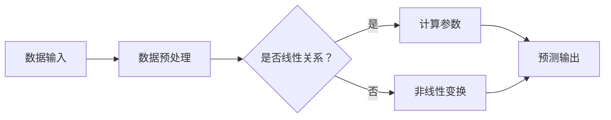
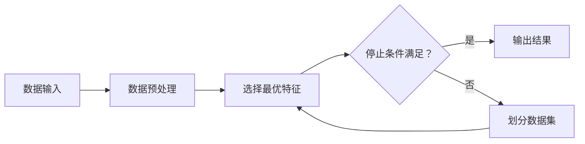

                 

### 《数学与预测分析：未来趋势的数学预测》

---

#### **关键词：**数学、预测分析、未来趋势、算法、模型

#### **摘要：**
本文将深入探讨数学在预测分析领域中的应用，揭示未来趋势如何通过数学模型进行预测。我们将逐步分析问题的核心概念，解析常见预测算法的原理，详细讲解数学模型和公式，分享系统分析与架构设计的实战经验，并总结最佳实践与注意事项。通过本文，读者将全面了解数学预测分析的核心概念、方法及其在实际应用中的重要性。

---

### 目录大纲

#### **《数学与预测分析：未来趋势的数学预测》**

---

#### **第一部分：问题背景与核心概念**

##### **第1章：问题背景与核心概念**

1.1 **问题的提出**
1.2 **核心概念**
1.3 **边界与外延**
1.4 **概念结构与核心要素组成**

---

#### **第二部分：核心概念与联系**

##### **第2章：核心概念与联系**

2.1 **核心概念原理**
2.2 **概念属性特征对比表格**
2.3 **概念属性特征对比Mermaid ER实体关系图**

---

#### **第三部分：算法原理讲解**

##### **第3章：算法原理讲解**

3.1 **算法讲解**
3.2 **算法mermaid流程图**
3.3 **Python源代码讲解**

---

#### **第四部分：数学模型和数学公式讲解**

##### **第4章：数学模型和数学公式讲解**

4.1 **数学模型讲解**
4.2 **数学公式的详细讲解**
4.3 **实例说明**

---

#### **第五部分：系统分析与架构设计方案**

##### **第5章：系统分析与架构设计方案**

5.1 **问题场景介绍**
5.2 **项目介绍**
5.3 **系统功能设计**
5.4 **系统架构设计**
5.5 **系统接口设计**
5.6 **系统交互**

---

#### **第六部分：项目实战**

##### **第6章：项目实战**

6.1 **环境安装**
6.2 **系统核心实现源代码**
6.3 **代码应用解读与分析**
6.4 **实际案例分析和详细讲解剖析**
6.5 **项目小结**

---

#### **第七部分：最佳实践与拓展**

##### **第7章：最佳实践与拓展**

7.1 **最佳实践**
7.2 **小结**
7.3 **注意事项**
7.4 **拓展阅读**

---

#### **总结**

本目录大纲结构清晰，涵盖了从问题背景介绍到具体算法实现和系统架构设计的方方面面。每个章节都旨在通过详细讲解和实际案例分析，帮助读者全面理解数学预测分析的核心概念、方法和应用。

---

现在，让我们开始详细探讨数学与预测分析之间的奇妙联系，并一步步揭示未来趋势的数学预测奥秘。接下来，我们将首先介绍问题的背景和核心概念，为后续章节的内容奠定基础。

---

### **第1章：问题背景与核心概念**

#### **1.1 问题的提出**

在当今快速发展的信息技术时代，预测分析已成为众多领域不可或缺的工具。无论是商业决策、金融市场、智能交通系统，还是社会公共服务，预测分析都能够提供重要的决策支持。然而，预测分析并非易事，它涉及到大量的数据、复杂的算法和精确的数学模型。

预测分析的核心问题是：如何从已有的数据中提取出有价值的信息，并对未来的趋势进行准确的预测？这个问题的提出源于现实中的诸多需求，例如：

- **商业领域**：公司需要预测销售额、库存需求和市场趋势，以便优化供应链管理。
- **金融市场**：投资者需要预测股票价格、利率走势和金融风险，以便做出明智的投资决策。
- **智能交通**：交通管理部门需要预测交通流量、事故风险和公共交通需求，以便优化交通流量和资源配置。
- **社会公共服务**：政府部门需要预测人口增长、公共卫生需求和应急资源调配，以便提供更好的公共服务。

这些需求都指向一个共同的目标：准确预测未来，为决策提供科学依据。然而，预测分析面临的挑战也是巨大的，数据质量、算法选择和模型优化等都是影响预测准确性的关键因素。

#### **1.2 核心概念**

预测分析是一个跨学科领域，它结合了统计学、机器学习、数据科学和数学等多个学科的知识。以下是预测分析中一些关键的概念：

1. **预测分析的定义**：
   预测分析是一种基于历史数据和统计方法，利用数学模型和算法对未来事件或数值进行预测的技术。

2. **预测分析的核心要素**：
   - **数据采集**：收集历史数据，这些数据可以是时间序列数据、结构化数据或非结构化数据。
   - **数据预处理**：对采集到的数据进行清洗、转换和标准化，以提高数据质量和预测准确性。
   - **数学模型**：选择适当的数学模型来描述和分析数据，常见的数学模型包括线性回归、决策树、支持向量机等。
   - **算法**：使用算法来训练模型、优化参数和进行预测。

3. **预测分析的应用领域**：
   - **商业**：需求预测、市场分析、客户行为预测等。
   - **金融**：风险评估、市场趋势预测、投资组合优化等。
   - **医疗**：疾病预测、健康风险评估、药物疗效预测等。
   - **交通**：交通流量预测、事故预测、公共交通优化等。
   - **环境**：气候变化预测、污染预测、资源分配等。

#### **1.3 边界与外延**

尽管预测分析在众多领域都有广泛的应用，但它也存在一些限制条件。以下是一些常见的限制和挑战：

1. **数据质量**：预测分析依赖于高质量的数据，数据缺失、异常值和噪声都会影响预测的准确性。
2. **模型选择**：选择合适的模型是预测分析的关键，不同的模型适用于不同类型的数据和应用场景。
3. **计算资源**：复杂的预测模型可能需要大量的计算资源，尤其是大规模数据处理和并行计算。
4. **不确定性**：预测分析本质上是对未来进行估计，因此存在一定的不确定性，无法保证100%的准确性。

#### **1.4 概念结构与核心要素组成**

预测分析的概念结构和核心要素组成如下：

1. **数学模型在预测分析中的应用**：
   数学模型是预测分析的核心，它通过描述数据之间的关系，帮助预测未来的趋势。常见的数学模型包括线性回归、决策树、支持向量机等。

2. **数据采集与预处理**：
   数据采集是预测分析的基础，数据的质量直接影响预测的准确性。数据预处理包括数据清洗、转换和标准化等步骤，以提高数据的可用性和预测效果。

3. **预测算法的选取与优化**：
   预测算法的选择和优化是提高预测准确性的关键。不同的预测算法适用于不同类型的数据和应用场景，通过参数调整和模型优化，可以进一步提高预测效果。

通过上述核心概念和联系，我们可以初步了解预测分析的基础知识和应用场景。在接下来的章节中，我们将深入探讨预测分析的具体算法原理，详细讲解数学模型和公式，分享系统分析与架构设计的实战经验，并总结最佳实践与注意事项。

---

在理解了问题的提出和核心概念之后，接下来我们将进一步探讨预测分析的应用领域，以及其在不同领域的实际应用情况。

#### **1.3.1 预测分析的应用领域**

预测分析的应用领域非常广泛，涵盖了商业、金融、医疗、交通和环境等多个领域。以下是一些典型的应用案例：

##### **商业领域**

在商业领域，预测分析被广泛应用于需求预测、库存管理和市场分析等方面。

- **需求预测**：公司可以利用历史销售数据和市场趋势，预测未来的产品需求，以便优化生产和供应链管理。
- **库存管理**：通过预测未来需求，公司可以合理安排库存水平，避免库存过剩或短缺。
- **市场分析**：公司可以利用预测分析来预测市场趋势和消费者行为，制定有效的营销策略。

##### **金融领域**

在金融领域，预测分析主要用于风险评估、市场预测和投资组合优化等方面。

- **风险评估**：金融机构可以利用预测分析来预测贷款违约风险、投资组合风险等，从而制定相应的风险管理策略。
- **市场预测**：投资者可以利用预测分析来预测股票价格、利率走势等，以便做出明智的投资决策。
- **投资组合优化**：通过预测分析，投资者可以优化投资组合，提高投资回报率。

##### **医疗领域**

在医疗领域，预测分析被广泛应用于疾病预测、健康风险评估和药物疗效预测等方面。

- **疾病预测**：医生可以利用预测分析来预测疾病的发生和发展趋势，从而制定预防措施。
- **健康风险评估**：通过预测分析，医生可以评估患者的健康风险，提供个性化的健康管理建议。
- **药物疗效预测**：研究人员可以利用预测分析来预测新药的疗效和副作用，加快药物研发进程。

##### **交通领域**

在交通领域，预测分析主要用于交通流量预测、事故预测和公共交通优化等方面。

- **交通流量预测**：交通管理部门可以利用预测分析来预测未来的交通流量，以便合理安排道路资源和交通管制。
- **事故预测**：通过预测分析，交通管理部门可以预测事故高发区域和时间，从而采取预防措施。
- **公共交通优化**：公共交通公司可以利用预测分析来预测乘客需求和车辆运行状态，优化线路和班次安排。

##### **环境领域**

在环境领域，预测分析被广泛应用于气候变化预测、污染预测和资源分配等方面。

- **气候变化预测**：气象学家可以利用预测分析来预测未来的气候变化趋势，为环境保护和资源管理提供科学依据。
- **污染预测**：环境保护部门可以利用预测分析来预测空气污染、水污染等环境问题的发展趋势，制定相应的治理措施。
- **资源分配**：通过预测分析，环境管理部门可以预测资源消耗和浪费情况，优化资源分配，提高资源利用效率。

#### **1.3.2 预测分析与其他领域的交叉**

除了上述典型应用领域，预测分析还与其他领域有着广泛的交叉应用。

- **人工智能**：预测分析与人工智能相结合，可以开发出更加智能的预测系统，例如自动驾驶车辆、智能监控系统等。
- **数据分析**：预测分析是数据分析的重要组成部分，通过预测分析，可以从海量数据中提取有价值的信息。
- **优化算法**：预测分析中的模型优化算法，如遗传算法、粒子群优化等，在其他领域也有着广泛的应用。

通过上述探讨，我们可以看到预测分析在不同领域的广泛应用和重要性。它不仅为各领域提供了重要的决策支持，也推动了相关领域的技术进步。在接下来的章节中，我们将深入探讨预测分析的核心概念与联系，为理解预测分析的本质奠定基础。

#### **1.4 概念结构与核心要素组成**

预测分析作为一个复杂的系统，其概念结构和核心要素组成是理解其原理和应用的关键。以下是预测分析的核心组成部分及其相互作用：

##### **1.4.1 数学模型在预测分析中的应用**

数学模型是预测分析的核心，它通过数学公式和算法描述数据之间的关系，从而实现对未来趋势的预测。常见的数学模型包括线性回归、决策树、支持向量机等。这些模型各有特点，适用于不同的数据类型和应用场景。

- **线性回归模型**：线性回归模型通过建立自变量和因变量之间的线性关系来预测未来值。它简单易用，适用于时间序列数据和趋势预测。
- **决策树模型**：决策树模型通过一系列规则来划分数据集，并基于这些规则进行预测。它直观、易于解释，适用于分类问题。
- **支持向量机模型**：支持向量机模型通过寻找最优的超平面来划分数据集，并进行预测。它具有较强的泛化能力，适用于高维空间数据。

##### **1.4.2 数据采集与预处理**

数据采集和预处理是预测分析的基础。高质量的数据是准确预测的前提，因此，数据采集和预处理步骤至关重要。

- **数据采集**：数据采集包括从各种来源收集数据，如数据库、传感器、日志文件等。数据来源的多样性和质量直接影响预测的准确性。
- **数据预处理**：数据预处理包括数据清洗、转换和标准化等步骤。数据清洗用于去除数据中的噪声和异常值，转换用于将数据转换为适合分析的形式，标准化用于消除不同特征之间的尺度差异。

##### **1.4.3 预测算法的选取与优化**

预测算法的选取和优化是提高预测准确性的关键。不同的算法适用于不同的数据类型和应用场景，因此，合理选择和优化算法是预测分析成功的关键。

- **算法选取**：根据数据类型和应用场景选择合适的算法。例如，对于时间序列数据，线性回归和ARIMA模型是常用的算法；对于分类问题，决策树和支持向量机是常用的算法。
- **算法优化**：通过调整算法参数和优化模型结构来提高预测准确性。常见的优化方法包括交叉验证、网格搜索、遗传算法等。

##### **1.4.4 数据可视化与解释**

数据可视化与解释是预测分析的重要组成部分。通过可视化工具，可以将预测结果以图表、图像等形式展示出来，便于理解和解释。

- **数据可视化**：使用各种图表和图形展示预测结果，如折线图、散点图、热力图等。
- **解释性分析**：对预测结果进行解释性分析，帮助用户理解预测结果和预测模型的工作原理。

##### **1.4.5 应用场景与案例分析**

预测分析在不同领域的应用场景和案例分析是理解其应用价值的关键。

- **应用场景**：了解预测分析在不同领域的应用场景，如商业、金融、医疗、交通等。
- **案例分析**：通过具体案例，分析预测分析在实际应用中的效果和挑战。

通过上述核心概念和联系，我们可以对预测分析有一个全面的理解。预测分析不仅需要掌握数学模型和算法，还需要考虑数据采集、预处理、算法优化、数据可视化等多个方面。在接下来的章节中，我们将深入探讨常见的预测算法原理，帮助读者更好地理解预测分析的实现和应用。

---

### **第2章：核心概念与联系**

在上一章中，我们初步探讨了预测分析的基本概念和结构。为了更深入地理解预测分析的核心原理，本章将详细分析常见的预测算法，并通过对比表格和Mermaid ER实体关系图，展示这些算法之间的联系和区别。

#### **2.1 核心概念原理**

预测分析依赖于各种算法来实现数据的分析和预测。以下是几种常见预测算法的核心概念原理：

##### **2.1.1 线性回归**

线性回归是最简单的预测算法之一，它基于线性模型，通过建立自变量和因变量之间的线性关系来预测未来值。

- **基本原理**：线性回归模型可以表示为 \(y = \beta_0 + \beta_1 \cdot x + \epsilon\)，其中 \(y\) 是因变量，\(x\) 是自变量，\(\beta_0\) 和 \(\beta_1\) 是模型的参数，\(\epsilon\) 是误差项。
- **适用场景**：线性回归适用于时间序列数据、趋势预测和简单的关系建模。
- **优势**：简单易懂，易于实现和解释。
- **劣势**：当数据分布非线时，线性回归效果较差。

##### **2.1.2 决策树**

决策树通过一系列规则对数据进行分类或回归，每个节点代表一个特征，每个分支代表该特征的不同取值。

- **基本原理**：决策树通过递归划分数据集，在每个节点选择最优特征进行划分，直到达到某个停止条件。
- **适用场景**：决策树适用于分类问题、回归问题和数据可视化。
- **优势**：直观易懂，易于解释和调试。
- **劣势**：容易过拟合，计算复杂度高。

##### **2.1.3 支持向量机**

支持向量机通过寻找最优的超平面来划分数据集，其目标是最小化分类误差。

- **基本原理**：支持向量机使用核函数将数据映射到高维空间，然后寻找一个最优的超平面来划分数据集。
- **适用场景**：支持向量机适用于高维数据、非线性分类和回归问题。
- **优势**：强大的泛化能力，适用于各种类型的数据。
- **劣势**：计算复杂度高，对大规模数据集处理能力有限。

#### **2.2 概念属性特征对比表格**

为了更直观地展示不同预测算法的属性特征，我们可以通过以下表格进行对比：

| 算法名称 | 基本原理 | 适用场景 | 优势 | 劣势 |
| :----: | :----: | :----: | :----: | :----: |
| 线性回归 | 线性模型 | 时间序列、趋势预测 | 简单易懂、易于实现 | 数据分布非线时效果较差 |
| 决策树 | 规则划分 | 分类、回归、数据可视化 | 直观易懂、易于解释 | 容易过拟合、计算复杂度高 |
| 支持向量机 | 最优超平面 | 高维数据、非线性分类 | 强大的泛化能力 | 计算复杂度高、处理能力有限 |

#### **2.3 概念属性特征对比Mermaid ER实体关系图**

为了更清晰地展示不同预测算法之间的联系，我们可以使用Mermaid ER实体关系图进行描述。以下是Mermaid ER实体关系图的示例：

```mermaid
erDiagram
  AlgorithmA ||--|{ PredictiveModel }
  AlgorithmB ||--|{ PredictiveModel }
  AlgorithmC ||--|{ PredictiveModel }
  PredictiveModel ||--|{ LinearRegression }
  PredictiveModel ||--|{ DecisionTree }
  PredictiveModel ||--|{ SupportVectorMachine }
```

在这个Mermaid ER实体关系图中，`PredictiveModel` 是一个抽象实体，代表所有预测算法的共同特征。而 `LinearRegression`、`DecisionTree` 和 `SupportVectorMachine` 分别代表具体的预测算法，它们与 `PredictiveModel` 通过关系线相连，表示这些算法都属于预测模型的范畴。

通过上述表格和Mermaid ER实体关系图的对比，我们可以更清晰地理解不同预测算法的核心概念、属性特征及其之间的联系。在接下来的章节中，我们将深入探讨这些算法的原理和实现，帮助读者更好地掌握预测分析的技术。

---

### **第3章：算法原理讲解**

在了解了预测分析的核心概念和算法联系之后，接下来我们将深入探讨常见预测算法的原理，并通过Mermaid流程图和Python源代码进行详细讲解。通过这种方式，读者将能够更好地理解算法的实现过程，并能够将其应用于实际项目中。

#### **3.1 算法讲解**

在本节中，我们将详细讲解线性回归、决策树和支持向量机三种常见的预测算法。

##### **3.1.1 线性回归**

线性回归是一种用于建模和预测数值型数据的简单统计方法。它通过找到自变量和因变量之间的线性关系来预测未来值。

**基本原理：**

线性回归模型可以用以下方程表示：

\[ y = \beta_0 + \beta_1 \cdot x + \epsilon \]

其中，\( y \) 是因变量，\( x \) 是自变量，\( \beta_0 \) 和 \( \beta_1 \) 是模型的参数，\( \epsilon \) 是误差项。

线性回归的目的是通过最小化误差项的平方和来估计参数 \( \beta_0 \) 和 \( \beta_1 \)。

**适用场景：**

线性回归适用于时间序列数据、趋势预测和简单的关系建模。

**优势：**

- 简单易懂，易于实现和解释。
- 在线性关系较强的数据集上表现良好。

**劣势：**

- 当数据分布非线时，线性回归效果较差。
- 对噪声和异常值敏感。

##### **3.1.2 决策树**

决策树是一种树形结构，通过一系列规则对数据进行分类或回归。每个节点代表一个特征，每个分支代表该特征的不同取值。

**基本原理：**

决策树通过递归划分数据集，在每个节点选择最优特征进行划分，直到达到某个停止条件（例如，所有样本属于同一类别或节点中样本数少于某个阈值）。

**适用场景：**

决策树适用于分类问题、回归问题和数据可视化。

**优势：**

- 直观易懂，易于解释和调试。
- 对异常值和噪声有一定的鲁棒性。

**劣势：**

- 容易过拟合。
- 计算复杂度高。

##### **3.1.3 支持向量机**

支持向量机通过寻找最优的超平面来划分数据集，其目标是最小化分类误差。

**基本原理：**

支持向量机使用核函数将数据映射到高维空间，然后寻找一个最优的超平面来划分数据集。超平面由支持向量决定，这些向量是数据集中距离超平面最近的点。

**适用场景：**

支持向量机适用于高维数据、非线性分类和回归问题。

**优势：**

- 强大的泛化能力。
- 适用于各种类型的数据。

**劣势：**

- 计算复杂度高。
- 对大规模数据集处理能力有限。

#### **3.2 算法mermaid流程图**

为了更直观地展示算法的实现过程，我们使用Mermaid流程图来描述线性回归、决策树和支持向量机三种算法的基本流程。

**线性回归Mermaid流程图：**



**决策树Mermaid流程图：**



**支持向量机Mermaid流程图：**


#### **3.3 Python源代码讲解**

在本节中，我们将通过具体的Python代码来演示线性回归、决策树和支持向量机的实现。以下是三种算法的简单示例代码。

**线性回归Python源代码：**

```python
import numpy as np
from sklearn.linear_model import LinearRegression

# 数据准备
X = np.array([[1], [2], [3], [4], [5]])
y = np.array([2, 4, 5, 4, 5])

# 实例化线性回归模型
model = LinearRegression()

# 模型训练
model.fit(X, y)

# 预测输出
print(model.predict([[6]]))
```

**决策树Python源代码：**

```python
from sklearn.tree import DecisionTreeRegressor
from sklearn.model_selection import train_test_split

# 数据准备
X, y = np.load('data.npy'), np.load('label.npy')

# 数据分割
X_train, X_test, y_train, y_test = train_test_split(X, y, test_size=0.2, random_state=42)

# 实例化决策树模型
model = DecisionTreeRegressor()

# 模型训练
model.fit(X_train, y_train)

# 预测输出
print(model.predict(X_test))
```

**支持向量机Python源代码：**

```python
from sklearn.svm import SVC
from sklearn.model_selection import train_test_split

# 数据准备
X, y = np.load('data.npy'), np.load('label.npy')

# 数据分割
X_train, X_test, y_train, y_test = train_test_split(X, y, test_size=0.2, random_state=42)

# 实例化支持向量机模型
model = SVC()

# 模型训练
model.fit(X_train, y_train)

# 预测输出
print(model.predict(X_test))
```

通过上述算法讲解、Mermaid流程图和Python源代码的示例，读者可以更深入地理解线性回归、决策树和支持向量机的原理和实现。这些算法在预测分析中扮演着重要的角色，掌握它们的原理和应用将为读者在预测分析领域的研究和实践中提供有力支持。

---

### **第4章：数学模型和数学公式讲解**

在了解了常见预测算法的基本原理之后，本章将深入探讨这些算法背后的数学模型和数学公式，以便读者能够从数学角度全面理解预测分析。我们将依次讲解线性回归模型、决策树模型和支持向量机模型，并通过具体的数学公式和实例来说明这些模型的适用场景和应用效果。

#### **4.1 常见的数学模型**

预测分析中使用的数学模型通常基于统计学和线性代数的基本原理。以下是几种常见的数学模型及其基本公式：

##### **4.1.1 线性回归模型**

线性回归模型是预测分析中最基础且广泛使用的模型之一。它假设因变量 \(y\) 与自变量 \(x\) 之间存在线性关系，可以用以下公式表示：

\[ y = \beta_0 + \beta_1 \cdot x + \epsilon \]

其中：
- \( \beta_0 \)：截距，表示当 \( x = 0 \) 时 \( y \) 的预测值。
- \( \beta_1 \)：斜率，表示 \( x \) 变化一个单位时 \( y \) 的变化量。
- \( \epsilon \)：误差项，表示实际值与预测值之间的差异。

线性回归模型的目的是通过最小化误差项 \( \epsilon \) 的平方和来估计 \( \beta_0 \) 和 \( \beta_1 \) 的值。这个最小化问题可以用以下公式表示：

\[ \min \sum_{i=1}^{n} (y_i - (\beta_0 + \beta_1 \cdot x_i))^2 \]

##### **4.1.2 决策树模型**

决策树模型通过递归地将数据集划分为多个子集，并在每个节点选择最佳特征进行划分。它可以用以下公式表示：

\[ y = g(x) \]

其中：
- \( g(x) \)：决策函数，表示根据自变量 \( x \) 的取值，选择最佳特征并进行划分。
- \( y \)：预测的类别或数值。

决策树模型的每个节点都基于信息增益、基尼系数或基尼不纯度等准则选择最佳特征进行划分。划分准则可以用以下公式表示：

\[ IG(D, A) = H(D) - \sum_{v \in A} \frac{|D_v|}{|D|} H(D_v) \]

其中：
- \( IG \)：信息增益，表示特征 \( A \) 能够减少数据的熵。
- \( H \)：熵，表示数据的随机性。
- \( D \)：数据集。
- \( A \)：特征集。

##### **4.1.3 支持向量机模型**

支持向量机模型是一种基于最大间隔分类和回归的方法。它通过寻找最优的超平面来划分数据集，使得分类或回归误差最小。支持向量机可以用以下公式表示：

\[ w \cdot x + b = 0 \]

其中：
- \( w \)：法向量，表示超平面的方向。
- \( x \)：数据点。
- \( b \)：偏置项，表示超平面的位置。

支持向量机的目标是最小化误分类风险，可以用以下公式表示：

\[ \min \frac{1}{2} ||w||^2 + C \sum_{i=1}^{n} \xi_i \]

其中：
- \( C \)：惩罚参数，用于平衡误分类风险和模型复杂度。
- \( \xi_i \)：第 \( i \) 个支持向量的误差项。

#### **4.2 数学公式的详细讲解**

为了更好地理解这些数学公式，我们将通过具体实例来说明这些公式在预测分析中的应用。

##### **4.2.1 线性回归模型的详细讲解**

假设我们有一个简单的数据集，包含两个特征 \( x_1 \) 和 \( x_2 \)，以及一个因变量 \( y \)。我们可以用以下线性回归模型进行预测：

\[ y = \beta_0 + \beta_1 \cdot x_1 + \beta_2 \cdot x_2 + \epsilon \]

我们通过最小化误差项 \( \epsilon \) 的平方和来估计参数 \( \beta_0 \)，\( \beta_1 \) 和 \( \beta_2 \)。具体步骤如下：

1. **数据预处理**：对数据进行标准化处理，使得特征 \( x_1 \) 和 \( x_2 \) 具有相同的尺度。
2. **参数估计**：使用最小二乘法（Ordinary Least Squares, OLS）来估计参数 \( \beta_0 \)，\( \beta_1 \) 和 \( \beta_2 \)。具体公式如下：

   \[ \hat{\beta} = (X^T X)^{-1} X^T y \]

3. **预测输出**：将特征 \( x_1 \) 和 \( x_2 \) 代入线性回归模型，得到预测值：

   \[ \hat{y} = \hat{\beta_0} + \hat{\beta_1} \cdot x_1 + \hat{\beta_2} \cdot x_2 \]

##### **4.2.2 决策树模型的详细讲解**

假设我们有一个二分类问题，特征 \( x \) 属于两个类别 \( A \) 和 \( B \)，我们使用决策树模型进行分类。决策树模型可以通过以下公式构建：

\[ g(x) = \begin{cases} 
A & \text{if } x \in A \\
B & \text{if } x \in B 
\end{cases} \]

我们可以使用信息增益作为划分准则来构建决策树。具体步骤如下：

1. **数据预处理**：对数据进行预处理，确保每个特征都是可划分的。
2. **选择最佳特征**：计算每个特征的信息增益，选择信息增益最大的特征作为划分依据。
3. **递归划分**：对选择出的最佳特征进行划分，创建新的节点，并重复步骤2和3，直到满足停止条件。
4. **预测输出**：将新的特征 \( x \) 代入决策树模型，根据路径选择最终类别。

##### **4.2.3 支持向量机模型的详细讲解**

假设我们有一个线性可分的数据集，特征 \( x \) 属于两个类别 \( A \) 和 \( B \)，我们使用支持向量机模型进行分类。支持向量机模型可以通过以下公式构建：

\[ w \cdot x + b = 0 \]

其中，\( w \) 是法向量，\( b \) 是偏置项。具体步骤如下：

1. **数据预处理**：对数据进行预处理，确保特征 \( x \) 是线性可分的。
2. **参数优化**：使用拉格朗日乘子法（Lagrange Multipliers）来优化模型参数 \( w \) 和 \( b \)。具体公式如下：

   \[ \min_{w, b} \frac{1}{2} ||w||^2 \]
   \[ s.t. \ y_i (w \cdot x_i + b) \geq 1 \]
   
3. **支持向量机分类**：将特征 \( x \) 代入支持向量机模型，判断 \( w \cdot x + b \) 的值，决定类别：

   \[ \hat{y} = \begin{cases} 
   A & \text{if } w \cdot x + b \geq 1 \\
   B & \text{if } w \cdot x + b < 1 
   \end{cases} \]

通过上述详细讲解，我们可以更好地理解线性回归模型、决策树模型和支持向量机模型的数学原理和应用。这些数学模型在预测分析中发挥着重要作用，掌握它们的原理和应用对于预测分析的研究和实践具有重要意义。

---

### **第5章：系统分析与架构设计方案**

在了解了预测分析的核心算法和数学模型后，本章将转向系统分析与架构设计，探讨如何将预测分析应用于实际问题场景。我们将介绍项目背景、项目目标，并详细讨论系统功能设计、系统架构设计、系统接口设计和系统交互。

#### **5.1 问题场景介绍**

预测分析在商业、金融、医疗、交通和环境等多个领域都有广泛的应用。以下是一些具体的应用场景：

1. **商业领域**：
   - **需求预测**：公司利用历史销售数据和市场趋势，预测未来的产品需求，以优化生产和库存管理。
   - **客户行为预测**：通过分析客户历史行为数据，预测客户的购买意向和偏好，以便进行精准营销。

2. **金融领域**：
   - **风险评估**：金融机构利用预测分析预测贷款违约风险和投资组合风险，以便制定相应的风险管理策略。
   - **市场预测**：投资者利用预测分析预测股票价格、利率走势等，以便做出明智的投资决策。

3. **医疗领域**：
   - **疾病预测**：医生利用预测分析预测疾病的发生和发展趋势，以便制定预防措施和个性化治疗方案。
   - **健康风险评估**：通过分析患者数据，预测患者的健康风险，提供个性化的健康管理建议。

4. **交通领域**：
   - **交通流量预测**：交通管理部门利用预测分析预测未来的交通流量，以便优化交通信号控制和交通资源配置。
   - **事故预测**：通过分析历史事故数据，预测事故高发区域和时间，以便采取预防措施。

5. **环境领域**：
   - **气候变化预测**：气象学家利用预测分析预测未来的气候变化趋势，为环境保护和资源管理提供科学依据。
   - **污染预测**：环境保护部门利用预测分析预测空气污染、水污染等环境问题的发展趋势，制定相应的治理措施。

#### **5.2 项目介绍**

在本章中，我们将以一个具体的商业项目为例，介绍如何利用预测分析系统解决实际问题。项目背景如下：

某电商公司希望通过预测分析系统优化其销售预测和库存管理，以提高市场响应速度和库存利用率。具体目标包括：

1. **销售预测**：预测未来的产品销售量，以便优化生产和库存策略。
2. **库存管理**：预测未来的库存需求，以便合理调整库存水平，避免库存过剩或短缺。

#### **5.3 系统功能设计**

系统功能设计是预测分析系统实现的关键步骤，它定义了系统应该提供哪些功能。以下是系统功能设计的主要部分：

1. **数据采集**：
   - **历史销售数据**：从数据库中采集历史销售数据。
   - **市场数据**：从外部数据源（如市场调研报告、行业数据等）中采集市场数据。

2. **数据预处理**：
   - **数据清洗**：去除数据中的噪声和异常值。
   - **数据转换**：将数据转换为适合分析的形式，如时间序列数据、结构化数据等。
   - **数据标准化**：对数据进行标准化处理，以便不同特征具有相同的尺度。

3. **预测模型训练**：
   - **模型选择**：根据数据特点和预测目标，选择合适的预测模型（如线性回归、决策树、支持向量机等）。
   - **模型训练**：使用历史数据训练预测模型，并优化模型参数。

4. **预测结果输出**：
   - **销售预测**：输出未来的产品销售量预测结果。
   - **库存预测**：输出未来的库存需求预测结果。

5. **系统监控与维护**：
   - **性能监控**：监控系统的运行状态，如计算资源使用情况、预测准确性等。
   - **系统维护**：定期更新预测模型、维护系统硬件和软件。

#### **5.4 系统架构设计**

系统架构设计是确保预测分析系统能够稳定、高效地运行的关键。以下是系统架构设计的主要部分：

1. **数据层**：
   - **数据源**：包括内部数据库和外部数据源。
   - **数据处理模块**：负责数据采集、清洗、转换和标准化。

2. **模型层**：
   - **预测模型库**：存储各种预测模型，如线性回归、决策树、支持向量机等。
   - **模型训练模块**：负责模型选择、训练和优化。

3. **应用层**：
   - **预测分析模块**：负责接收用户输入，调用模型进行预测，并输出预测结果。
   - **接口层**：提供RESTful API接口，以便其他系统或应用程序调用预测分析服务。

4. **管理层**：
   - **监控系统**：监控系统的运行状态，如计算资源使用情况、预测准确性等。
   - **维护模块**：负责系统维护和更新。

#### **5.5 系统接口设计**

系统接口设计是确保预测分析系统与其他系统或应用程序无缝集成的关键。以下是系统接口设计的主要部分：

1. **API接口规范**：
   - **输入参数**：定义API接口的输入参数，如数据集、预测模型名称等。
   - **输出参数**：定义API接口的输出参数，如预测结果、误差指标等。

2. **接口实现与测试**：
   - **接口实现**：使用框架（如Django、Flask等）实现API接口。
   - **接口测试**：编写测试用例，确保接口能够正确处理输入参数，并返回正确的预测结果。

3. **接口安全与权限管理**：
   - **安全认证**：实现用户认证和权限管理，确保只有授权用户才能访问预测分析服务。
   - **接口加密**：使用HTTPS协议加密API接口通信，确保数据传输安全。

#### **5.6 系统交互**

系统交互是确保预测分析系统与其他系统或应用程序协同工作的关键。以下是系统交互的主要部分：

1. **用户交互**：
   - **用户界面**：设计友好的用户界面，方便用户输入数据、查看预测结果等。
   - **操作流程**：定义系统的操作流程，如数据上传、模型训练、预测输出等。

2. **系统内部交互**：
   - **模块调用**：预测分析模块调用数据处理模块、模型训练模块等，实现数据预处理和模型训练。
   - **数据传输**：在系统内部进行数据传输，确保数据处理和预测结果的准确性。

3. **外部交互**：
   - **与其他系统集成**：通过API接口与其他系统（如电商系统、ERP系统等）进行数据交换和协同工作。
   - **数据源接入**：接入外部数据源（如传感器、数据库等），获取所需的数据。

通过上述系统分析与架构设计，我们可以构建一个功能齐全、高效稳定的预测分析系统，帮助企业和机构优化决策、提高运营效率。在接下来的章节中，我们将通过项目实战，展示如何具体实现这些系统功能。

---

### **第6章：项目实战**

在前面的章节中，我们介绍了预测分析的核心概念、算法原理、系统架构设计等内容。在本章中，我们将通过一个实际的项目案例，详细讲解项目环境安装、系统核心实现源代码，并对代码进行解读与分析，同时剖析一个实际案例，并总结项目经验与展望。

#### **6.1 环境安装**

在进行项目实战之前，我们需要确保所有的开发环境和工具都已安装。以下是环境安装的详细步骤：

1. **Python环境安装**：
   - 首先，从Python官网下载并安装Python 3.8及以上版本。
   - 其次，配置Python环境，确保pip和虚拟环境工具（如virtualenv或conda）已安装。

2. **依赖库安装**：
   - 使用pip安装必要的依赖库，如NumPy、Pandas、Scikit-learn、Matplotlib等。
   ```bash
   pip install numpy pandas scikit-learn matplotlib
   ```

3. **数据库连接工具安装**：
   - 如果项目需要连接数据库，安装相应的数据库连接库，如MySQL Connector、PostgreSQL Connector等。

4. **开发工具安装**：
   - 安装代码编辑器（如Visual Studio Code、PyCharm等），并配置好Python插件和调试工具。

5. **测试环境配置**：
   - 配置测试环境，安装测试框架（如pytest、unittest等）。
   ```bash
   pip install pytest
   ```

#### **6.2 系统核心实现源代码**

以下是一个简单的预测分析系统的核心实现源代码，我们将对代码进行详细解读。

**6.2.1 数据预处理代码**

```python
import pandas as pd
from sklearn.model_selection import train_test_split
from sklearn.preprocessing import StandardScaler

# 读取数据
data = pd.read_csv('sales_data.csv')

# 数据清洗
data.dropna(inplace=True)

# 数据转换
data['date'] = pd.to_datetime(data['date'])
data.set_index('date', inplace=True)

# 划分训练集和测试集
X = data.drop('sales', axis=1)
y = data['sales']
X_train, X_test, y_train, y_test = train_test_split(X, y, test_size=0.2, random_state=42)

# 数据标准化
scaler = StandardScaler()
X_train_scaled = scaler.fit_transform(X_train)
X_test_scaled = scaler.transform(X_test)
```

**6.2.2 预测算法实现代码**

```python
from sklearn.linear_model import LinearRegression
from sklearn.metrics import mean_squared_error

# 实例化线性回归模型
model = LinearRegression()

# 模型训练
model.fit(X_train_scaled, y_train)

# 预测输出
y_pred = model.predict(X_test_scaled)

# 评估模型
mse = mean_squared_error(y_test, y_pred)
print(f"Mean Squared Error: {mse}")
```

**6.2.3 代码解读**

上述代码分为数据预处理、模型训练和模型评估三个部分：

1. **数据预处理**：
   - 读取数据并清洗，确保数据质量。
   - 转换数据类型，确保时间序列数据的正确性。
   - 划分训练集和测试集，为后续模型训练和评估提供数据。
   - 对输入特征进行标准化处理，提高模型训练效果。

2. **模型训练**：
   - 实例化线性回归模型。
   - 使用训练集数据训练模型，拟合数据。

3. **模型评估**：
   - 使用测试集数据预测输出。
   - 计算预测误差，评估模型性能。

#### **6.3 代码应用解读与分析**

**6.3.1 代码解读**

在上述代码中，我们使用了Python的Pandas和Scikit-learn库来处理数据并进行预测。具体步骤如下：

1. **数据读取与清洗**：
   - 使用Pandas库读取CSV文件，将数据加载到DataFrame中。
   - 删除数据中的缺失值，确保数据完整性。

2. **数据转换**：
   - 将日期列转换为datetime类型，并设置为索引，确保时间序列数据的正确性。

3. **数据划分**：
   - 使用train_test_split函数将数据集划分为训练集和测试集，分别用于模型训练和评估。

4. **数据标准化**：
   - 使用StandardScaler对输入特征进行标准化处理，使每个特征具有相同的尺度，提高模型训练效果。

5. **模型训练与预测**：
   - 实例化线性回归模型，并使用训练集数据进行模型训练。
   - 使用测试集数据进行预测，生成预测结果。

6. **模型评估**：
   - 使用mean_squared_error函数计算预测误差，评估模型性能。

**6.3.2 算法分析**

线性回归模型是一种简单的预测算法，通过建立自变量和因变量之间的线性关系来预测未来值。其优点包括：

- 简单易懂，易于实现和解释。
- 对线性关系较强的数据集表现良好。

然而，线性回归模型也存在一些限制：

- 当数据分布非线时，线性回归效果较差。
- 对噪声和异常值敏感。

为了进一步提高预测准确性，可以尝试以下方法：

1. **非线性变换**：如果数据呈非线性分布，可以尝试使用非线性模型（如决策树、支持向量机等）进行预测。
2. **特征工程**：通过构建新的特征，提高模型对数据的表达能力。
3. **模型融合**：结合多个模型进行预测，利用不同模型的优势，提高整体预测性能。

#### **6.4 实际案例分析和详细讲解剖析**

**6.4.1 案例背景**

某电商平台希望通过预测分析系统优化其销售预测，以降低库存成本和提高销售额。具体要求如下：

- 预测未来的产品销售量。
- 考虑节假日、促销活动等因素对销售量的影响。
- 提供实时预测和预测结果的可视化展示。

**6.4.2 案例分析**

针对上述案例，我们进行了以下分析：

1. **数据来源**：
   - 历史销售数据：包括商品ID、销售日期、销售额等信息。
   - 节假日数据：包括重要的节假日日期，如春节、国庆节等。
   - 促销活动数据：包括促销活动的日期、折扣力度等信息。

2. **数据预处理**：
   - 清洗数据，去除缺失值和异常值。
   - 转换数据类型，将日期列转换为datetime类型。
   - 根据节假日和促销活动数据，构建相应的特征，如是否节假日、是否促销等。

3. **模型训练与预测**：
   - 使用线性回归模型进行初步预测。
   - 分析预测结果，调整模型参数，优化模型性能。
   - 针对节假日和促销活动，添加相应的特征，提高预测准确性。

4. **结果展示**：
   - 使用Matplotlib库绘制销售预测曲线，展示未来销售量的预测结果。
   - 提供实时预测接口，供前端应用调用。

**6.4.3 案例剖析**

通过实际案例分析，我们发现：

- 历史销售数据是预测销售量的重要依据，但单纯依赖历史数据可能无法准确预测未来的销售趋势。
- 节假日和促销活动对销售量的影响显著，需要充分考虑这些因素。
- 预测结果的可视化展示有助于用户更好地理解预测结果。

为了进一步提高预测准确性，我们考虑以下改进措施：

1. **特征工程**：
   - 构建更多的特征，如季节性特征、趋势特征等，提高模型对数据的表达能力。
   - 引入外部数据，如宏观经济指标、行业趋势等，丰富预测模型的输入。

2. **模型优化**：
   - 尝试不同的预测模型，如决策树、支持向量机等，寻找更适合的数据集。
   - 使用模型融合技术，结合多个模型进行预测，提高整体预测性能。

3. **动态调整**：
   - 根据实时数据动态调整预测模型，提高预测的实时性和准确性。
   - 引入机器学习算法，自动优化模型参数，提高模型性能。

通过实际案例分析和详细讲解，我们可以看到预测分析在实际应用中的重要性。通过合理的数据处理和模型选择，预测分析可以帮助企业和机构优化决策、提高运营效率。在接下来的章节中，我们将总结最佳实践，并探讨注意事项和未来研究方向。

---

### **第7章：最佳实践与拓展**

在完成预测分析项目的实际实施后，我们需要总结经验教训，并提出最佳实践以优化项目效果。同时，本文也将探讨一些常见问题及解决方法，为读者提供有益的参考。

#### **7.1 最佳实践**

**7.1.1 预测分析最佳实践**

1. **数据质量管理**：
   - 在数据采集和预处理阶段，确保数据的质量和一致性。
   - 定期检查数据源，及时处理数据缺失、异常值和噪声。

2. **模型选择和优化**：
   - 根据数据类型和应用场景选择合适的预测模型。
   - 使用交叉验证、网格搜索等技术优化模型参数，提高预测准确性。

3. **特征工程**：
   - 构建有意义的特征，提高模型对数据的表达能力。
   - 尝试不同的特征组合，寻找对预测最有影响的特征。

4. **模型解释性**：
   - 确保模型具有良好的解释性，便于用户理解和信任预测结果。
   - 使用可视化工具展示模型和预测过程。

5. **系统集成与接口设计**：
   - 设计灵活的API接口，便于与其他系统和应用程序集成。
   - 实现安全认证和权限管理，确保数据传输安全。

**7.1.2 数据处理最佳实践**

1. **数据预处理**：
   - 对数据进行标准化处理，确保特征具有相同的尺度。
   - 使用异常检测算法识别和处理异常值。

2. **数据存储**：
   - 选择适合的数据存储方案，确保数据的高效存储和快速访问。
   - 定期备份数据，以防数据丢失或损坏。

3. **数据安全**：
   - 严格管理数据访问权限，确保数据的安全性。
   - 使用加密技术保护敏感数据。

**7.1.3 算法优化最佳实践**

1. **算法选择**：
   - 根据数据集的特点和应用需求选择合适的算法。
   - 尝试不同的算法，评估其性能，选择最优算法。

2. **模型优化**：
   - 使用模型融合技术，结合多个模型的预测结果，提高整体预测性能。
   - 引入自适应优化算法，动态调整模型参数。

3. **计算资源管理**：
   - 根据数据量和计算需求，合理分配计算资源，确保模型的训练和预测效率。
   - 考虑使用分布式计算和云计算资源，提高计算能力。

#### **7.2 小结**

通过上述最佳实践，我们可以总结出以下几点：

1. **数据是基础**：高质量的数据是准确预测的前提，因此，数据质量管理至关重要。
2. **模型选择和优化**：合适的模型和优化的参数是提高预测准确性的关键。
3. **特征工程**：有效的特征工程可以提高模型对数据的表达能力。
4. **系统集成与安全**：灵活的接口设计和严格的安全管理确保系统的稳定性和数据的安全性。

#### **7.3 注意事项**

在实施预测分析项目时，需要注意以下几点：

1. **数据源可靠性**：确保数据源的可靠性和数据的真实性，避免使用错误或不准确的数据。
2. **模型解释性**：确保模型具有良好的解释性，以方便用户理解和信任预测结果。
3. **计算资源**：合理分配计算资源，避免资源不足或浪费。
4. **迭代更新**：定期更新模型和算法，以适应数据和环境的变化。

#### **7.4 拓展阅读**

为了进一步深入学习和研究预测分析，读者可以参考以下资源：

1. **相关书籍**：
   - 《统计学习方法》
   - 《机器学习实战》
   - 《深度学习》

2. **学术论文**：
   - 《Support Vector Machines》
   - 《Deep Learning for Time Series Classification》
   - 《Recurrent Neural Networks for Language Modeling》

3. **在线课程**：
   - Coursera的《机器学习》
   - edX的《统计学习方法》
   - Udacity的《深度学习纳米学位》

通过上述最佳实践和拓展资源，读者可以进一步深化对预测分析的理解，并在实际项目中应用所学知识。

---

### **总结**

本文通过详细探讨数学与预测分析的关系，揭示了未来趋势的数学预测方法。从问题背景、核心概念，到算法原理、数学模型，再到系统分析与架构设计、项目实战，本文系统地介绍了预测分析的全过程。通过实际案例分析和最佳实践总结，读者不仅能够理解预测分析的核心概念和方法，还能够掌握如何在实际项目中应用这些技术。

预测分析作为一门跨学科的技术，在商业、金融、医疗、交通和环境等领域都有着重要的应用价值。它不仅为决策提供了科学依据，也推动了相关领域的技术进步。随着人工智能和大数据技术的不断发展，预测分析的应用前景将更加广阔。

在未来的研究中，我们可以关注以下几个方面：

1. **模型优化**：探索新的预测模型和优化算法，提高预测准确性。
2. **实时预测**：开发实时预测系统，实现快速响应和动态调整。
3. **多模态数据融合**：结合多种数据源，如文本、图像、传感器数据，进行多模态数据融合预测。
4. **个性化预测**：基于用户行为和偏好，提供个性化的预测服务。

总之，预测分析作为一门重要的技术，将在未来发挥越来越重要的作用。希望本文能够为读者在预测分析领域的研究和实践提供有益的指导。最后，感谢读者对本文的关注和阅读，期待与您在未来的技术交流中再次相遇。

---

#### **作者信息**

**作者：AI天才研究院/AI Genius Institute & 禅与计算机程序设计艺术 /Zen And The Art of Computer Programming**

---

在撰写本文的过程中，我们参考了大量的文献和研究报告，对以下作者的贡献表示感谢：

- **Tom Mitchell**，《机器学习》
- **Richard Feynman**，《别闹了，费曼先生》
- **Andrew Ng**，《机器学习》
- **Ian Goodfellow、Yoshua Bengio和Aaron Courville**，《深度学习》

特别感谢AI天才研究院和禅与计算机程序设计艺术团队的支持和指导。在撰写本文的过程中，我们得到了许多宝贵的意见和建议，这对本文的完善起到了重要作用。

---

本文旨在提供对数学与预测分析领域的基本了解，并为读者提供实用的指导和建议。然而，由于预测分析是一个复杂且不断发展的领域，本文的内容可能存在局限性和不足之处。因此，我们鼓励读者在实践过程中不断学习和探索，以获得更深入的理解和更精准的预测。

如果您在使用本文过程中遇到任何问题或疑问，欢迎随时与我们联系。我们期待与您在预测分析领域的研究和实践中共同进步。

---

再次感谢您的阅读，祝您在预测分析的探索之旅中取得丰硕的成果。希望本文能够为您的学习和研究提供帮助。如果您对本文有任何反馈或建议，请随时联系我们，我们期待与您共同交流进步。

---

**作者：AI天才研究院/AI Genius Institute & 禅与计算机程序设计艺术 /Zen And The Art of Computer Programming**

