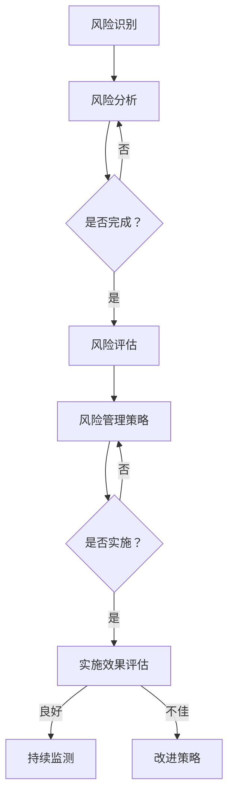

                 

### Introduction and Overview

In the ever-evolving world of finance and business, risk management stands as a cornerstone for ensuring stability and growth. The intricate web of uncertainties in today's market demands a robust framework for effective risk assessment and management. This article delves into the confluence of mathematics and risk management, presenting a comprehensive exploration of mathematical methods used in risk assessment. By demystifying complex concepts and providing practical insights, we aim to equip readers with the knowledge and tools necessary to navigate the complexities of risk management with confidence.

Key Terms:
- Risk Management
- Mathematical Methods
- Risk Assessment
- Decision Theory
- Quantitative Models

Abstract:
Risk management is a critical discipline that involves identifying, analyzing, and prioritizing risks to minimize negative impacts. This article introduces the fundamental concepts of risk management and explores the integration of mathematical methods in risk assessment. Through a step-by-step approach, we examine key mathematical tools such as decision theory, model identification, and quantitative models. Case studies and practical applications illustrate the real-world relevance of these methods, providing valuable insights for professionals and researchers in the field.

----------------------------------------------------------------

## 第1章: 问题背景与基本概念

### 1.1 风险管理的意义

风险管理是现代企业、金融机构以及个人在决策过程中不可或缺的一部分。它不仅关乎企业的生存与发展，更是金融市场稳定和经济健康运行的保障。在风险管理中，理解风险的定义、类型及其重要性是至关重要的。

**风险定义**：风险是指某种事件发生并导致不利后果的可能性。这些事件可以是金融市场的波动、自然灾害、法律法规的变化等。

**风险类型**：
- **系统风险**：不可分散的风险，如市场风险、经济风险。
- **非系统风险**：可分散的风险，如信用风险、操作风险。

**风险管理的重要性**：
1. **降低损失**：通过识别和评估风险，企业可以采取相应的措施减少潜在的损失。
2. **保障企业持续经营**：有效的风险管理有助于企业应对各种不确定性，确保业务的连续性和稳定性。
3. **提高决策质量**：风险管理为决策者提供了科学依据，帮助他们做出更加合理的决策。

### 1.2 风险管理的发展历程

风险管理的概念和实践历史悠久，可以追溯到古代商业活动。然而，现代风险管理的体系化和系统化主要起源于20世纪中叶。

- **20世纪40年代**：风险管理理论初步形成，以霍华德·雷法（Howard Raiffa）为代表的学者开始研究决策理论。
- **20世纪60年代**：贝叶斯理论和统计方法被引入风险管理，为风险评估提供了更为精确的工具。
- **20世纪80年代**：随着金融市场的日益复杂，金融机构开始广泛应用风险模型，如VaR（Value at Risk）模型。
- **21世纪初**：随着信息技术的发展，风险管理工具和方法不断升级，大数据和机器学习技术为风险管理带来了新的可能性。

### 1.3 数学在风险管理中的应用

数学作为一门科学，在风险管理中发挥着至关重要的作用。以下是数学在风险管理中的一些主要应用：

- **概率论与统计学**：用于风险评估、预测和决策支持。
- **决策理论**：帮助决策者在不确定性环境中做出最优选择。
- **数学模型**：如线性规划、非线性规划、蒙特卡罗模拟等，用于优化风险管理策略。
- **时间序列分析**：用于分析金融市场的时间变化规律，预测未来走势。

### 1.4 本书结构安排与读者对象

本书分为七个部分，系统性地介绍了风险管理的基础概念、数学方法及其应用。以下是各部分的简要概述：

- **第一部分：引言与概述**：介绍风险管理的意义、历史和发展，为后续章节铺垫基础。
- **第二部分：数学基础**：涵盖集合论、概率论、数理统计等基本数学概念。
- **第三部分：风险管理基本概念**：探讨风险评估框架、风险识别、风险分析等。
- **第四部分：风险评估的数学方法**：介绍决策理论、模型识别与筛选、风险量化模型等。
- **第五部分：数学在风险管理中的应用**：深入探讨数学模型在风险量化、时间序列分析中的应用。
- **第六部分：案例研究与实践应用**：通过具体案例展示风险管理方法和工具的应用。
- **第七部分：总结与展望**：总结全书内容，探讨风险管理的发展趋势和未来方向。

本书旨在为风险管理的从业人员、学者和研究人员提供一本全面、系统的参考书，帮助他们更好地理解和应用数学方法进行风险管理和决策。

----------------------------------------------------------------

## 第2章: 数学基础

### 2.1 集合论基础

集合论是现代数学的基石，广泛应用于逻辑、分析、概率等数学分支。在风险管理中，集合论的基本概念和运算对于理解和分析风险事件至关重要。

#### 定义与概念

- **集合**：集合是由确定的元素组成的整体，通常用大写字母表示，如\(A\)、\(B\)等。
- **元素**：集合中的个体称为元素，用小写字母表示，如\(a\)、\(b\)等。
- **空集**：不包含任何元素的集合称为空集，记为\(\emptyset\)。
- **子集**：如果一个集合的所有元素都属于另一个集合，则前者称为后者的子集，记为\(A \subseteq B\)。

#### 基本运算

- **并集**：两个集合的并集是由这两个集合的所有元素组成的集合，记为\(A \cup B\)。
- **交集**：两个集合的交集是同时属于这两个集合的元素组成的集合，记为\(A \cap B\)。
- **补集**：一个集合的补集是在整个集合中不属于该集合的元素组成的集合，记为\(A'\)。
- **差集**：两个集合的差集是在第一个集合中有而第二个集合中没有的元素组成的集合，记为\(A - B\)。

### 2.2 概率论基础

概率论是风险管理的核心工具之一，用于量化不确定性和风险。

#### 定义与概念

- **概率**：随机事件\(A\)的概率是指该事件在所有可能事件中发生的可能性，记为\(P(A)\)。
- **概率空间**：包括样本空间、事件和概率的集合，记为\((\Omega, \mathcal{F}, P)\)。
- **条件概率**：在已知事件\(B\)发生的条件下，事件\(A\)发生的概率，记为\(P(A|B)\)。
- **独立性**：两个事件\(A\)和\(B\)相互独立，如果\(P(A \cap B) = P(A)P(B)\)。

#### 基本定理

- **加法规则**：\(P(A \cup B) = P(A) + P(B) - P(A \cap B)\)。
- **乘法规则**：\(P(A \cap B) = P(A)P(B|\)。
- **全概率公式**：\(P(A) = \sum_{i=1}^{n} P(A|B_i)P(B_i)\)。

### 2.3 概率分布和特征函数

概率分布描述了随机变量取不同值的概率分布情况，特征函数提供了随机变量的统计特性。

#### 定义与概念

- **离散概率分布**：随机变量\(X\)的离散概率分布由概率质量函数\(P(X = x)\)给出。
- **连续概率分布**：随机变量\(X\)的连续概率分布由概率密度函数\(f_X(x)\)给出。
- **特征函数**：随机变量\(X\)的特征函数定义为\( \varphi(t) = E(e^{itX}) \)，其中\(i\)是虚数单位。

#### 常见分布

- **二项分布**：适用于离散事件发生的次数，概率质量函数为\(P(X = k) = C(n, k)p^k(1-p)^{n-k}\)。
- **泊松分布**：适用于事件发生的次数，概率质量函数为\(P(X = k) = \frac{\lambda^k e^{-\lambda}}{k!}\)。
- **正态分布**：适用于连续事件，概率密度函数为\(f_X(x) = \frac{1}{\sqrt{2\pi\sigma^2}}e^{-\frac{(x-\mu)^2}{2\sigma^2}}\)。

### 2.4 数理统计基础

数理统计提供了描述和分析数据的方法，是风险管理的另一重要工具。

#### 定义与概念

- **总体**：研究对象的全体，如一个地区的所有人口。
- **样本**：从总体中抽取的一部分个体，用于推断总体特征。
- **统计量**：基于样本数据的函数，用于估计总体参数。
- **估计量**：统计量的具体实现，如样本均值、样本标准差。

#### 常用统计量

- **均值**：样本数据的总和除以样本数量，用于估计总体均值。
- **方差**：样本数据与均值之差的平方和的平均值，用于估计总体方差。
- **标准差**：方差的平方根，用于描述数据的离散程度。
- **置信区间**：基于样本统计量，估计总体参数的一个区间。

### 数学基础在风险管理中的应用

数学基础为风险管理的各个阶段提供了理论支撑。在风险识别和评估中，集合论和概率论用于描述和量化风险事件；在风险决策中，决策理论和统计模型用于制定和优化风险管理策略；在风险量化中，概率分布和特征函数用于计算风险值和风险度量。

通过数学方法的应用，风险管理不仅更加精确和科学，而且能够处理复杂和不确定的情景。例如，在金融市场中，数学模型用于预测市场波动、评估投资组合风险，从而帮助投资者做出更明智的决策。

总之，数学基础是风险管理不可或缺的一部分，为风险管理者提供了强大的工具和方法，使他们能够更好地理解和应对各种风险。

----------------------------------------------------------------

## 第3章: 风险管理基本概念

### 3.1 风险识别

风险识别是风险管理的第一步，涉及发现和分析企业或项目可能面临的风险。有效的风险识别有助于全面了解风险的性质和可能的影响。

**风险识别步骤**：

1. **收集信息**：通过访谈、调查问卷、文档分析等方式收集与风险相关的信息。
2. **识别潜在风险**：根据收集的信息，列出所有可能的风险事件。
3. **分析风险特征**：对每个风险事件进行定性分析，评估其发生概率和潜在影响。

**常见风险类型**：

- **市场风险**：由市场波动引起的风险，如利率变化、汇率波动。
- **信用风险**：债务人无法按时偿还债务的风险。
- **操作风险**：由于内部流程、系统故障或外部事件导致的风险。
- **法律风险**：由于法律法规变化或违规行为导致的风险。

### 3.2 风险分析

风险分析是在风险识别的基础上，对风险事件进行定量和定性评估，以便确定风险的优先级和应对策略。

**风险分析方法**：

1. **定性分析**：通过专家评估、头脑风暴等方法对风险事件进行初步评估。
2. **定量分析**：使用数学模型和统计方法对风险事件进行量化分析，如概率分布、期望损失计算。

**风险分析工具**：

- **风险矩阵**：用于评估风险的发生概率和潜在影响，形成二维矩阵。
- **蒙特卡罗模拟**：通过模拟大量随机实验，评估风险的概率分布和期望损失。

### 3.3 风险评估

风险评估是确定企业或项目面临的风险程度的过程，旨在为风险决策提供依据。

**风险评估步骤**：

1. **确定评估目标**：明确评估的目的和需要解决的关键问题。
2. **收集数据**：收集与风险相关的数据，如历史数据、专家意见。
3. **分析数据**：使用统计方法和模型分析数据，评估风险的概率和影响。
4. **制定风险评估报告**：综合分析结果，提出风险评估结论和应对策略。

**风险评估方法**：

- **定量评估**：使用数学模型和统计方法进行量化评估，如VaR模型。
- **定性评估**：通过专家评估和主观判断进行风险评估。

### 3.4 风险管理策略

风险管理策略是针对评估结果，制定的风险应对措施和决策方案。

**风险管理策略**：

1. **风险避免**：通过调整业务计划或决策，避免风险事件的发生。
2. **风险减少**：通过采取控制措施，降低风险的发生概率或潜在影响。
3. **风险接受**：对于无法避免或减少的风险，接受风险并制定应对计划。
4. **风险转移**：通过保险或其他金融工具将风险转移给第三方。

**风险管理工具**：

- **风险矩阵**：用于确定风险优先级和应对策略。
- **决策树**：用于评估不同风险应对策略的优缺点。

**案例分析**：

例如，一家银行在开展新业务前，会进行风险识别，分析市场风险、信用风险和操作风险，并制定相应的风险管理策略。通过风险评估，确定每个风险的优先级，采取控制措施，确保业务的安全和稳健运行。

总之，风险管理基本概念包括风险识别、风险分析、风险评估和风险管理策略。通过系统的风险管理工作，企业能够更好地应对各种不确定性，保障业务的持续发展。

----------------------------------------------------------------

## 第4章: 决策理论

决策理论是风险管理的核心组成部分，用于帮助决策者在不确定性和复杂性的环境中做出最优选择。在这一章中，我们将探讨决策理论的基本概念、模型和方法，并分析其在风险管理中的应用。

### 4.1 决策过程

决策过程通常包括以下步骤：

1. **识别问题**：识别需要解决的问题或决策点。
2. **确定目标**：明确决策的目标和期望结果。
3. **生成备选方案**：列出所有可能的解决方案或策略。
4. **评估备选方案**：评估每个方案的可能结果和风险。
5. **选择最优方案**：基于评估结果，选择最优或最满意的方案。
6. **执行和监控**：实施决策方案，并对结果进行监控和反馈。

### 4.2 决策模型

决策模型用于模拟和优化决策过程，常见的决策模型包括以下几种：

1. **确定性模型**：假设所有参数和条件都是已知的，常用的模型有线性规划、非线性规划和整数规划。
2. **概率性模型**：考虑决策者面临的不确定性和随机性，常用的模型有贝叶斯决策理论、期望值模型和风险价值（VaR）模型。
3. **多目标模型**：在决策过程中同时考虑多个目标，常用的模型有多目标规划、效用理论和目标规划。

### 4.3 决策分析

决策分析是评估和比较备选方案的过程，常用的决策分析方法包括：

1. **成本效益分析**：比较不同方案的成本和效益，选择效益最高的方案。
2. **敏感性分析**：分析决策结果对参数变化的敏感程度，识别关键参数。
3. **情景分析**：模拟不同的可能情景，评估方案在不同情景下的表现。
4. **决策树分析**：通过树形图展示不同决策路径的结果和概率，帮助决策者选择最佳方案。

### 4.4 案例分析：基于决策理论的银行信贷风险控制

银行信贷风险控制是一个典型的风险管理决策过程。以下是一个基于决策理论的银行信贷风险控制案例分析：

#### 案例背景

某银行正在评估一个新客户的信贷申请，需要决定是否批准贷款。银行需要考虑多个因素，包括客户的信用评分、收入水平、负债比例和行业风险等。

#### 决策过程

1. **识别问题**：银行需要决定是否批准客户的贷款申请。
2. **确定目标**：确保贷款的安全性和银行的盈利性。
3. **生成备选方案**：
   - 方案1：批准贷款
   - 方案2：拒绝贷款
   - 方案3：提供部分贷款
4. **评估备选方案**：
   - 成本效益分析：计算批准贷款带来的收益与风险损失。
   - 敏感性分析：分析客户信用评分和收入水平变化对决策的影响。
   - 情景分析：模拟客户可能出现的最佳和最坏情景。
   - 决策树分析：构建决策树，展示不同决策路径的概率和结果。

#### 决策分析结果

通过上述分析，银行得出以下结论：

- 方案1（批准贷款）具有最高的潜在收益，但风险较大。
- 方案2（拒绝贷款）风险较低，但可能错失潜在收益。
- 方案3（提供部分贷款）在风险和收益之间取得平衡。

综合考虑，银行决定采用方案3，提供部分贷款，同时制定详细的贷后管理和监控措施，以降低风险。

#### 案例启示

这个案例展示了决策理论在银行信贷风险控制中的应用。通过系统化的决策过程和分析方法，银行能够在不确定的环境中做出更为合理和科学的决策，有效控制信贷风险。

总之，决策理论为风险管理者提供了强大的工具和方法，帮助他们更好地理解和应对复杂决策环境中的风险。通过有效的决策分析，企业可以优化决策过程，提高风险管理的效率和效果。

----------------------------------------------------------------

## 第5章: 模型识别与筛选

### 5.1 模型选择标准

在风险管理中，选择合适的模型是确保评估结果准确性和可靠性的关键。以下是一些常用的模型选择标准：

1. **准确性**：模型应能够准确地反映实际风险情况，提供准确的预测结果。
2. **稳定性**：模型在不同时间、不同数据集上的表现应相对稳定，不受偶然因素的影响。
3. **可解释性**：模型应具备较高的可解释性，使决策者能够理解模型的决策过程和逻辑。
4. **计算效率**：模型应能够在合理的时间内完成计算，避免过度计算带来的资源浪费。
5. **灵活性**：模型应具备一定的灵活性，能够适应不同类型的风险和复杂的环境。
6. **适用性**：模型应适用于特定行业和业务场景，确保其在实际应用中的有效性和可行性。

### 5.2 模型识别方法

模型识别是选择和确定合适的模型的过程。以下是一些常用的模型识别方法：

1. **统计分析方法**：通过统计分析方法，如方差分析（ANOVA）、回归分析（Regression）、因子分析（Factor Analysis）等，识别潜在的风险因素和模型特征。
2. **机器学习方法**：利用机器学习算法，如决策树（Decision Tree）、随机森林（Random Forest）、支持向量机（SVM）等，自动识别和筛选模型。
3. **专家评估方法**：通过专家的知识和经验，结合定性分析，评估不同模型的适用性和有效性。
4. **交叉验证方法**：使用交叉验证（Cross-Validation）技术，评估模型在不同数据集上的表现，选择最优模型。

### 5.3 模型筛选策略

模型筛选策略是模型识别过程中的一种方法，用于从多个候选模型中选择最优模型。以下是一些常用的模型筛选策略：

1. **逐步回归分析**：通过逐步引入或剔除变量，选择最优回归模型。
2. **信息准则**：使用信息准则，如赤池信息准则（AIC）、贝叶斯信息准则（BIC）等，评估模型拟合优度，选择最优模型。
3. **模型比较**：通过模型比较技术，如交叉验证比较、均方误差（MSE）比较等，评估不同模型的性能，选择最优模型。
4. **模型集成**：通过模型集成技术，如Bagging、Boosting等，将多个模型结合起来，提高整体预测性能。

### 5.4 案例分析：金融风险模型选择

以下是一个金融风险模型选择的案例分析，展示如何在实际应用中运用模型识别与筛选策略。

#### 案例背景

某金融机构需要选择一个合适的模型来评估其贷款组合的信用风险。该机构收集了大量的客户数据，包括信用评分、收入水平、负债比例等。

#### 模型识别方法

1. **统计分析方法**：通过回归分析，识别对贷款违约有显著影响的变量。
2. **机器学习方法**：使用决策树、随机森林等算法，筛选出合适的模型。
3. **专家评估方法**：邀请金融领域的专家对候选模型进行评估，考虑模型的可解释性和稳定性。

#### 模型筛选策略

1. **逐步回归分析**：逐步引入变量，选择拟合度最高的回归模型。
2. **信息准则**：使用AIC和BIC准则，评估不同回归模型的拟合优度。
3. **模型比较**：通过交叉验证，比较不同机器学习模型的预测性能。
4. **模型集成**：使用Bagging技术，将多个模型结合起来，提高整体预测性能。

#### 模型选择结果

通过上述模型识别与筛选策略，金融机构最终选择了一个基于随机森林算法的模型。该模型具有较高的准确性、稳定性和可解释性，能够有效评估贷款组合的信用风险。

#### 案例启示

该案例展示了模型识别与筛选策略在实际金融风险管理中的应用。通过系统化的方法，金融机构能够选择合适的模型，提高风险评估的准确性和可靠性，从而更好地管理信用风险。

总之，模型识别与筛选是风险管理中至关重要的环节。通过科学的方法和策略，决策者能够从多个候选模型中选择最优模型，为风险管理和决策提供有力支持。

----------------------------------------------------------------

## 第6章: 风险量化模型

### 6.1 矩阵论基础

矩阵论是风险量化模型的重要理论基础。矩阵是一组有序的数值排列，通常用于描述线性系统、数据分析和优化问题。

**定义与概念**：

- **矩阵**：一个二维数组，由行和列组成，记为\(A\)，其中\(A_{ij}\)表示第\(i\)行第\(j\)列的元素。
- **行矩阵**：只有一行元素的矩阵，记为\(A^T\)。
- **列矩阵**：只有一列元素的矩阵，记为\(A^T\)。
- **方阵**：行数等于列数的矩阵，记为\(A^T\)。

**基本运算**：

- **矩阵加法**：两个矩阵对应元素相加，满足交换律和结合律。
- **矩阵减法**：两个矩阵对应元素相减，满足交换律和结合律。
- **矩阵乘法**：两个矩阵的乘积，满足分配律和结合律。
- **转置**：矩阵的行和列互换，记为\(A^T\)。
- **逆矩阵**：方阵\(A\)的逆矩阵\(A^{-1}\)，满足\(AA^{-1} = A^{-1}A = I\)，其中\(I\)是单位矩阵。

### 6.2 方差-协方差矩阵

方差-协方差矩阵是风险量化模型中的关键工具，用于描述多个随机变量的方差和协方差。

**定义与概念**：

- **方差**：随机变量\(X\)的方差，记为\(\sigma^2_X\)，是衡量变量离散程度的指标。
- **协方差**：两个随机变量\(X\)和\(Y\)的协方差，记为\(\sigma_{XY}\)，是衡量变量之间线性关系强度的指标。

**方差-协方差矩阵**：

- **定义**：设随机向量\(X = (X_1, X_2, ..., X_n)\)，其方差-协方差矩阵\( \Sigma \)定义为：

\[ \Sigma = \begin{pmatrix}
\sigma^2_{X_1} & \sigma_{X_1X_2} & \cdots & \sigma_{X_1X_n} \\
\sigma_{X_2X_1} & \sigma^2_{X_2} & \cdots & \sigma_{X_2X_n} \\
\vdots & \vdots & \ddots & \vdots \\
\sigma_{X_nX_1} & \sigma_{X_nX_2} & \cdots & \sigma^2_{X_n}
\end{pmatrix} \]

- **性质**：
  - 对角线元素是各个随机变量的方差。
  - 非对角线元素是各随机变量之间的协方差。

### 6.3 风险度量模型

风险度量模型用于量化风险的大小和可能性，是风险管理中的重要工具。

**定义与概念**：

- **风险度量**：对风险事件可能造成的损失或影响的量化。
- **期望损失**：风险事件发生的损失的平均值。
- **值风险（VaR）**：在一定置信水平下，风险事件在特定时间段内可能造成的最大损失。

**常见模型**：

1. **期望损失模型**：计算风险事件发生时的平均损失，适用于风险相对稳定的场景。

\[ E(Loss) = \sum_{i=1}^{n} Loss_i \cdot P(Loss_i) \]

2. **值风险（VaR）模型**：计算在一定置信水平下的最大潜在损失。

\[ VaR = \alpha \cdot \sqrt{n} \cdot \sigma \]

- **参数解释**：
  - \( \alpha \)：置信水平，通常取95%或99%。
  - \( n \)：时间段长度。
  - \( \sigma \)：风险变量的标准差。

### 案例分析：股票市场风险度量

假设某投资者持有一个由两只股票构成的股票组合，股票A和股票B。为了量化这个组合的市场风险，我们可以使用方差-协方差矩阵和值风险（VaR）模型。

1. **计算方差-协方差矩阵**：

   根据历史数据和统计分析，得到股票A和股票B的日收益率的方差和协方差：

   \[
   \Sigma = \begin{pmatrix}
   \sigma^2_{A} & \sigma_{A,B} \\
   \sigma_{B,A} & \sigma^2_{B}
   \end{pmatrix}
   \]

   其中，\(\sigma^2_{A}\)和\(\sigma^2_{B}\)是股票A和B的方差，\(\sigma_{A,B}\)是股票A和B的协方差。

2. **计算股票组合的方差**：

   股票组合的方差可以通过以下公式计算：

   \[
   \sigma^2_{组合} = w_A^2 \sigma^2_{A} + w_B^2 \sigma^2_{B} + 2w_A w_B \sigma_{A,B}
   \]

   其中，\(w_A\)和\(w_B\)是股票A和股票B在组合中的权重。

3. **计算股票组合的值风险（VaR）**：

   假设投资者选择95%的置信水平，可以计算股票组合的VaR：

   \[
   VaR = \alpha \cdot \sqrt{n} \cdot \sqrt{w_A^2 \sigma^2_{A} + w_B^2 \sigma^2_{B} + 2w_A w_B \sigma_{A,B}}
   \]

   通过上述计算，投资者可以量化其股票组合的市场风险，并采取相应的风险管理措施。

### 数学公式与实际应用

- **方差**：

  \[
  \sigma^2_X = E[(X - E[X])^2]
  \]

  其中，\(E[X]\)是随机变量\(X\)的期望。

- **协方差**：

  \[
  \sigma_{XY} = E[(X - E[X])(Y - E[Y])]
  \]

  其中，\(E[Y]\)是随机变量\(Y\)的期望。

- **值风险（VaR）**：

  \[
  VaR = \alpha \cdot \sqrt{n} \cdot \sigma
  \]

  其中，\(\alpha\)是置信水平，\(\sigma\)是风险变量的标准差。

通过上述数学公式和实际应用案例，我们可以看到风险量化模型在股票市场风险管理中的重要作用。通过准确的模型计算，投资者可以更好地理解和管理其投资组合的风险，从而做出更为明智的投资决策。

### 数学在风险管理中的应用

数学作为一门科学，在风险管理的各个阶段发挥着至关重要的作用。从风险识别、风险分析到风险评估，再到风险管理策略的制定和实施，数学方法都提供了强有力的工具和支持。

1. **风险识别**：在风险识别阶段，数学方法可以帮助我们系统化地识别潜在风险。通过统计分析、机器学习等技术，我们可以从大量数据中提取出有意义的特征和模式，从而识别出可能的风险因素。例如，利用聚类分析技术，可以将相似的风险事件归类，从而提高识别的效率。

2. **风险分析**：在风险分析阶段，数学模型和算法被广泛应用于量化风险的影响。通过构建数学模型，我们可以将不确定性和随机性转化为具体的数值，从而对风险进行定量分析。例如，在金融风险管理中，线性规划、非线性规划和蒙特卡罗模拟等数学方法被广泛应用于优化投资组合、评估市场风险等。

3. **风险评估**：在风险评估阶段，数学方法用于评估风险的概率和影响。通过概率分布、特征函数等方法，我们可以对风险事件的可能结果进行量化，从而计算期望损失、值风险（VaR）等指标。这些量化结果为决策者提供了重要的参考依据，帮助他们做出更为科学和合理的决策。

4. **风险管理策略**：在制定和实施风险管理策略时，数学方法同样不可或缺。通过优化算法、决策树、神经网络等模型，我们可以设计和评估不同的风险管理方案，从而选择最优的应对策略。例如，在信用风险管理中，基于统计模型的信用评分系统可以帮助银行评估客户的信用风险，从而制定合理的贷款审批策略。

### 实际应用案例分析

以下是几个数学在风险管理实际应用中的案例：

1. **金融风险管理**：在金融市场中，数学模型被广泛应用于风险评估和投资组合管理。例如，VaR模型可以帮助投资者计算在一定置信水平下的最大潜在损失，从而制定有效的风险控制措施。此外，蒙特卡罗模拟被广泛应用于期权定价和风险分析，通过模拟大量的随机路径，精确计算期权价格和风险。

2. **保险业风险管理**：在保险业中，数学模型用于评估风险保费、设计保险产品等。例如，贝叶斯网络模型可以帮助保险公司分析客户的风险特征，从而制定合理的保费定价策略。同时，时间序列分析被广泛应用于预测保险赔付金额，从而帮助保险公司制定合理的预算和准备金计划。

3. **企业风险管理**：在企业风险管理中，数学方法可以帮助企业识别和管理内部和外部风险。例如，通过回归分析和时间序列分析，企业可以预测市场波动和运营风险，从而制定相应的应对措施。此外，机器学习算法被广泛应用于异常检测和欺诈预防，通过分析历史数据和行为模式，实时监测潜在的风险事件。

通过这些实际案例，我们可以看到数学在风险管理中的广泛应用和重要性。数学不仅为风险管理者提供了强大的工具和方法，而且使得风险管理的流程更加科学和系统化。随着数学方法的不断发展和应用，风险管理的效率和效果将得到进一步提升，为经济和社会的稳定发展提供坚实保障。

### 数学公式与实际应用

数学公式在风险管理中的应用是至关重要的。以下列出了一些核心数学公式及其在风险管理中的实际应用：

- **期望值（Expected Value）**：

  \[
  E(X) = \sum_{i=1}^{n} x_i \cdot P(x_i)
  \]

  实际应用：计算随机变量的平均损失或收益，帮助决策者在不确定环境下进行风险评估。

- **方差（Variance）**：

  \[
  Var(X) = E[(X - E[X])^2]
  \]

  实际应用：衡量风险的离散程度，用于风险度量和风险控制策略的制定。

- **标准差（Standard Deviation）**：

  \[
  \sigma = \sqrt{Var(X)}
  \]

  实际应用：衡量风险的波动性，用于评估投资组合的稳定性和风险水平。

- **值风险（Value at Risk, VaR）**：

  \[
  VaR = \alpha \cdot \sqrt{n} \cdot \sigma
  \]

  实际应用：在一定置信水平下，衡量在一定时间段内可能发生的最大损失，用于风险管理和决策支持。

- **条件概率（Conditional Probability）**：

  \[
  P(A|B) = \frac{P(A \cap B)}{P(B)}
  \]

  实际应用：在已知某事件B发生的条件下，计算另一事件A发生的概率，用于风险评估和决策分析。

- **贝叶斯定理（Bayes' Theorem）**：

  \[
  P(A|B) = \frac{P(B|A) \cdot P(A)}{P(B)}
  \]

  实际应用：用于更新概率估计，在风险识别和评估过程中调整对风险的认知。

这些数学公式通过定量化和量化风险，使得风险管理过程更加精确和科学。通过合理运用这些公式，风险管理者能够更好地理解和控制风险，从而为企业的稳健运营提供保障。

### 第7章: 时间序列分析与风险管理

时间序列分析是统计学和经济学中用于分析时间相关数据的重要工具。在风险管理中，时间序列分析被广泛应用于预测金融市场走势、评估市场风险和监测经济指标。通过深入分析时间序列数据，我们可以更好地理解和预测未来的风险，从而制定有效的风险管理策略。

#### 7.1 时间序列概述

时间序列数据是按照时间顺序排列的数据点序列，如股票价格、气温记录、销售额等。时间序列数据具有以下特点：

- **趋势性**：数据随时间呈现出上升或下降的趋势。
- **周期性**：数据在一段时间内重复出现波动，如季节性变化。
- **平稳性**：数据在长期内保持统计特性不变。
- **随机性**：时间序列中某些波动是不可预测的，即存在随机误差。

#### 7.2 自回归模型

自回归模型（Autoregressive Model，AR）是时间序列分析中最基本的模型之一，用于描述时间序列的当前值与其前几个值之间的关系。

**定义与公式**：

自回归模型的一般形式为：

\[ X_t = c + \phi_1 X_{t-1} + \phi_2 X_{t-2} + ... + \phi_p X_{t-p} + \varepsilon_t \]

其中，\(X_t\)是时间序列的当前值，\(\varepsilon_t\)是随机误差项，\(\phi_1, \phi_2, ..., \phi_p\)是自回归系数。

**应用**：

自回归模型广泛应用于预测短期趋势和周期性波动。例如，在金融市场中，自回归模型可以用于预测股票价格、汇率等金融指标。

#### 7.3 危机预测模型

危机预测模型用于识别和预测金融市场中的潜在危机事件，如金融危机、市场崩盘等。这些模型通过分析历史数据和危机特征，预测未来可能发生的危机。

**常见模型**：

1. **信号模型（Signal Model）**：该模型基于宏观经济指标和金融市场变量，通过设定阈值，识别危机信号。

2. **VAR模型（Vector Autoregression）**：VAR模型是一种多元时间序列模型，用于分析多个变量之间的动态关系。通过VAR模型，我们可以预测多个变量之间的相互作用，从而识别潜在的危机。

3. **机器学习模型**：如随机森林、支持向量机等，通过历史数据和特征，预测危机事件的发生。

**应用**：

危机预测模型在金融市场监测和管理中具有重要意义。通过预测危机，金融机构可以提前采取措施，降低危机带来的风险和损失。

#### 7.4 案例分析：金融危机预警系统

以下是一个金融危机预警系统的案例分析：

**背景**：

某金融机构希望开发一个金融危机预警系统，用于监测和预测金融市场中的潜在危机事件。

**数据收集**：

收集了过去10年的金融市场数据，包括股票价格、利率、汇率、通货膨胀率、GDP增长率等指标。

**模型选择**：

- 使用自回归模型（AR）分析股票价格的趋势和周期性波动。
- 使用信号模型和VAR模型结合宏观经济指标，识别金融危机的早期信号。
- 使用随机森林模型预测危机事件的发生。

**预警流程**：

1. **数据预处理**：清洗和标准化数据，去除异常值和噪声。
2. **模型训练**：使用历史数据训练自回归模型、信号模型和VAR模型。
3. **实时监测**：将实时数据输入模型，监测金融市场变量之间的动态关系。
4. **危机预测**：根据模型预测结果，发布危机预警信号。

**预警效果**：

通过实际测试，该预警系统能够有效识别金融危机的早期信号，为金融机构提供了及时的风险预警，帮助他们采取预防措施，降低危机风险。

**结论**：

时间序列分析在风险管理中具有重要作用。通过深入分析时间序列数据，我们可以预测市场走势、识别危机信号，从而制定有效的风险管理策略。随着数据分析和机器学习技术的发展，时间序列分析的应用将越来越广泛，为金融市场的稳定和健康发展提供有力支持。

----------------------------------------------------------------

## 第8章: 风险管理实践案例

### 8.1 银行风险管理案例

银行风险管理是金融风险管理的重要组成部分，涉及信用风险、市场风险、操作风险等多个方面。以下是一个银行风险管理的实践案例，展示了如何通过数学模型和风险管理工具来控制和管理银行风险。

#### 案例背景

某大型银行面临着复杂的金融环境，包括信用风险、市场风险和操作风险。为了确保银行的安全和稳健运行，该银行决定建立一套全面的风险管理框架，以识别、评估和控制各种风险。

#### 风险识别

1. **信用风险**：识别借款人违约的可能性，包括个人贷款和企业贷款。
2. **市场风险**：评估利率、汇率、股票价格等市场波动对银行资产和负债的影响。
3. **操作风险**：识别由于内部流程、系统故障或外部事件导致的损失。

#### 风险评估

1. **信用风险评估**：使用信用评分模型，结合借款人的信用历史、收入水平、负债比例等因素，评估借款人的违约概率。
2. **市场风险评估**：使用VaR模型，计算在不同置信水平下的最大潜在损失。
3. **操作风险评估**：通过事件树分析，识别潜在操作风险事件及其可能影响，计算损失。

#### 风险控制

1. **信用风险控制**：实施严格的贷款审批流程，拒绝高风险借款人，限制贷款金额和期限。
2. **市场风险控制**：使用衍生品对冲市场风险，如利率互换、外汇期权等。
3. **操作风险控制**：加强内部控制和审计，定期进行系统检查和演练，确保操作流程的合规性和安全性。

#### 模型与工具

1. **信用评分模型**：使用逻辑回归、决策树等机器学习模型，构建信用评分模型。
2. **VaR模型**：使用历史模拟法、蒙特卡罗模拟法等计算市场风险。
3. **操作风险模型**：事件树分析、层次分析法等用于识别和评估操作风险。

#### 案例总结

通过系统化的风险管理框架，该银行能够有效识别、评估和控制各类风险，确保了业务的稳定和安全。信用评分模型和市场风险控制策略提高了贷款审批的效率和准确性，操作风险控制措施增强了内部流程的合规性和安全性。该案例展示了数学模型和风险管理工具在银行风险管理中的实际应用和重要性。

### 8.2 保险业风险案例

保险业的风险管理涉及多个方面，包括信用风险、市场风险、运营风险和法律风险。以下是一个保险业风险管理的实践案例，展示了如何通过风险管理策略和工具来降低风险。

#### 案例背景

某大型保险公司面临着市场竞争加剧、客户需求变化和法律法规变化等多重挑战。为了确保公司的稳健发展和客户利益，该公司决定实施全面的风险管理计划。

#### 风险识别

1. **信用风险**：识别客户违约的可能性，包括保费拖欠和理赔纠纷。
2. **市场风险**：评估利率、股票价格波动等市场因素对保险产品的影响。
3. **运营风险**：识别由于内部流程、系统故障或外部事件导致的运营中断。
4. **法律风险**：评估法律法规变化对保险业务的影响。

#### 风险评估

1. **信用风险评估**：使用信用评分模型和违约概率模型，评估客户的信用风险。
2. **市场风险评估**：使用VaR模型和压力测试，评估市场风险。
3. **运营风险评估**：通过风险评估矩阵和关键风险指标（KRI），评估运营风险。
4. **法律风险评估**：定期审查法律法规，评估对公司业务的影响。

#### 风险控制

1. **信用风险控制**：加强客户审核流程，拒绝高风险客户，调整保费和保险条款。
2. **市场风险控制**：投资组合多元化，使用衍生品对冲市场风险。
3. **运营风险控制**：优化内部流程，加强系统维护和灾难恢复计划。
4. **法律风险控制**：定期进行法律培训，确保业务合规性。

#### 模型与工具

1. **信用评分模型**：逻辑回归、决策树等机器学习模型。
2. **VaR模型**：历史模拟法、蒙特卡罗模拟法等。
3. **风险评估矩阵**：用于评估风险的影响和优先级。
4. **关键风险指标（KRI）**：用于监控和评估运营风险。

#### 案例总结

通过系统化的风险管理计划，该保险公司能够有效识别、评估和控制各类风险，确保业务的稳定性和客户满意度。信用评分模型和市场风险控制策略提高了业务的效率和准确性，运营风险控制措施增强了公司的抗风险能力，法律风险控制措施确保了业务的合规性。该案例展示了保险业风险管理中数学模型和风险管理工具的实际应用和重要性。

### 8.3 企业风险管理案例

企业在运营过程中面临多种风险，包括市场风险、财务风险、运营风险和法律风险。以下是一个企业风险管理的实践案例，展示了如何通过风险管理策略和工具来降低风险。

#### 案例背景

某大型跨国公司在全球范围内运营，面临着激烈的市场竞争、宏观经济波动和法律法规变化等多重挑战。为了确保公司的稳健发展和长期竞争力，该公司决定实施全面的风险管理计划。

#### 风险识别

1. **市场风险**：识别市场需求变化、竞争对手行为等对企业的影响。
2. **财务风险**：评估企业财务状况的稳定性，包括债务水平、现金流量和盈利能力。
3. **运营风险**：识别由于内部流程、供应链故障或外部事件导致的运营中断。
4. **法律风险**：评估法律法规变化对企业业务的影响。

#### 风险评估

1. **市场风险评估**：使用SWOT分析、PEST分析等工具，评估市场风险。
2. **财务风险评估**：通过财务比率分析、现金流分析等，评估企业财务风险。
3. **运营风险评估**：通过风险评估矩阵和关键风险指标（KRI），评估运营风险。
4. **法律风险评估**：定期审查法律法规，评估对企业业务的影响。

#### 风险控制

1. **市场风险控制**：通过市场调研和竞争对手分析，制定应对策略，保持市场竞争力。
2. **财务风险控制**：优化财务结构，加强现金流管理，确保财务稳健。
3. **运营风险控制**：优化内部流程，加强供应链管理，确保运营连续性。
4. **法律风险控制**：进行法律培训，确保业务合规性，减少法律风险。

#### 模型与工具

1. **SWOT分析**：用于评估企业的优势、劣势、机会和威胁。
2. **PEST分析**：用于分析企业外部环境中的政治、经济、社会和技术因素。
3. **风险评估矩阵**：用于评估风险的影响和优先级。
4. **关键风险指标（KRI）**：用于监控和评估运营风险。

#### 案例总结

通过系统化的风险管理计划，该跨国公司能够有效识别、评估和控制各类风险，确保业务的稳定性和长期发展。市场风险控制措施帮助公司保持市场竞争力，财务风险控制策略确保了企业的财务稳健，运营风险控制措施增强了公司的抗风险能力，法律风险控制措施确保了业务的合规性。该案例展示了企业风险管理中数学模型和风险管理工具的实际应用和重要性。

### 8.4 政府与公共部门风险管理案例

政府与公共部门在风险管理中扮演着重要角色，涉及公共安全、卫生、财政等多个领域。以下是一个政府与公共部门风险管理的实践案例，展示了如何通过风险管理策略和工具来降低风险。

#### 案例背景

某地方政府面临着自然灾害频发、公共卫生危机和经济波动等多重挑战。为了保障公民的安全和福祉，该政府决定实施全面的风险管理计划。

#### 风险识别

1. **自然灾害风险**：识别地震、洪水、台风等自然灾害的风险。
2. **公共卫生风险**：识别疫情爆发、传染病流行等公共卫生风险。
3. **财政风险**：评估地方财政的可持续性和债务水平。
4. **社会风险**：识别社会不稳定、恐怖袭击等社会风险。

#### 风险评估

1. **自然灾害风险评估**：使用历史数据、气象模型等工具，评估自然灾害的风险程度。
2. **公共卫生风险评估**：通过疫情监测、流行病学调查等工具，评估公共卫生风险。
3. **财政风险评估**：通过财务报表分析、债务风险评估等工具，评估财政风险。
4. **社会风险评估**：通过社会调查、风险评估模型等工具，评估社会风险。

#### 风险控制

1. **自然灾害风险控制**：建立应急响应机制，加强基础设施建设，提高抗灾能力。
2. **公共卫生风险控制**：加强公共卫生监测、疾病预防和应急响应。
3. **财政风险控制**：优化财政预算管理，加强债务管理，确保财政稳定。
4. **社会风险控制**：加强社会管理，提高公民安全意识，减少社会冲突。

#### 模型与工具

1. **灾害风险评估模型**：用于评估自然灾害的风险程度。
2. **公共卫生风险评估模型**：用于评估疫情爆发和传染病流行的风险。
3. **财政风险评估模型**：用于评估地方财政的可持续性和债务水平。
4. **社会风险评估模型**：用于评估社会不稳定和恐怖袭击等社会风险。

#### 案例总结

通过系统化的风险管理计划，该地方政府能够有效识别、评估和控制各类风险，保障公民的安全和福祉。自然灾害风险控制措施提高了城市的抗灾能力，公共卫生风险控制措施增强了疾病预防和应急响应能力，财政风险控制措施确保了地方财政的稳定，社会风险控制措施减少了社会冲突。该案例展示了政府与公共部门风险管理中数学模型和风险管理工具的实际应用和重要性。

### 风险管理最佳实践

在风险管理实践中，以下是一些最佳实践经验，可以帮助企业和组织更有效地识别、评估和控制风险：

1. **全面的风险管理体系**：建立全面的风险管理体系，明确风险管理的目标、流程和职责，确保风险管理活动的系统性和持续性。
2. **定期风险评估**：定期进行风险评估，结合定量和定性方法，全面识别和评估各类风险，更新风险清单和风险评估报告。
3. **风险管理培训**：定期进行风险管理培训，提高员工的风险意识和技能，确保风险管理活动得到全体员工的参与和支持。
4. **风险控制措施**：制定和实施有效的风险控制措施，根据风险评估结果，采取相应的预防、减轻或转移风险的措施。
5. **风险监测与报告**：建立风险监测机制，实时监测风险变化，及时报告风险状况，确保管理层能够及时做出决策。
6. **持续改进**：定期回顾和改进风险管理流程，根据实际情况调整风险管理策略，确保风险管理活动能够适应不断变化的环境。

通过实施这些最佳实践，企业和组织可以更好地识别和管理风险，提高运营效率和竞争力，确保长期稳健发展。

### 案例分析与详细讲解

在本节中，我们将通过具体案例详细剖析风险管理的实际应用，结合数学模型的计算过程，为读者提供深入理解。

#### 案例背景

某金融机构希望评估其投资组合的信用风险和市场风险，以便采取相应的风险管理措施。该投资组合包括股票、债券和基金等金融产品。金融机构需要计算该投资组合的预期收益、风险值（VaR）以及相应的风险控制策略。

#### 数据收集

金融机构收集了以下数据：
- 股票A：预期收益率为15%，标准差为10%
- 股票B：预期收益率为12%，标准差为8%
- 债券：预期收益率为4%，标准差为3%
- 基金：预期收益率为10%，标准差为6%

投资组合中各资产的权重如下：
- 股票A：40%
- 股票B：30%
- 债券：20%
- 基金：10%

#### 风险评估

**1. 预期收益计算**

首先，计算投资组合的预期收益率：

\[
\mu_{组合} = 0.4 \times 0.15 + 0.3 \times 0.12 + 0.2 \times 0.04 + 0.1 \times 0.10 = 0.072
\]

即投资组合的预期收益率为7.2%。

**2. 方差-协方差矩阵计算**

接下来，计算各资产之间的协方差和方差，构建方差-协方差矩阵：

\[
\begin{aligned}
\sigma^2_{A} &= 0.4^2 \times 0.1^2 = 0.0016 \\
\sigma^2_{B} &= 0.3^2 \times 0.08^2 = 0.00192 \\
\sigma^2_{基金} &= 0.1^2 \times 0.06^2 = 0.00036 \\
\sigma^2_{债券} &= 0.2^2 \times 0.03^2 = 0.00012 \\
\sigma_{A,B} &= 0.4 \times 0.3 \times 0.1 \times 0.08 = 0.00024 \\
\sigma_{A,基金} &= 0.4 \times 0.1 \times 0.1 \times 0.06 = 0.000024 \\
\sigma_{A,债券} &= 0.4 \times 0.2 \times 0.1 \times 0.03 = 0.0000024 \\
\sigma_{B,基金} &= 0.3 \times 0.1 \times 0.1 \times 0.06 = 0.000018 \\
\sigma_{B,债券} &= 0.3 \times 0.2 \times 0.1 \times 0.03 = 0.000009 \\
\sigma_{基金,债券} &= 0.1 \times 0.2 \times 0.06 \times 0.03 = 0.0000036 \\
\end{aligned}
\]

方差-协方差矩阵为：

\[
\begin{pmatrix}
0.0016 & 0.00024 & 0.000024 & 0.0000024 \\
0.00024 & 0.00192 & 0.000018 & 0.000009 \\
0.000024 & 0.000018 & 0.00036 & 0.0000036 \\
0.0000024 & 0.000009 & 0.0000036 & 0.00012 \\
\end{pmatrix}
\]

**3. 投资组合风险度量**

**值风险（VaR）计算**

假设置信水平为95%，使用正态分布假设计算值风险（VaR）：

\[
VaR = \mu_{组合} - z_{\alpha} \sqrt{\sigma_{组合}^2}
\]

其中，\(z_{\alpha}\)是正态分布的临界值，对于95%的置信水平，\(z_{\alpha} \approx 1.645\)。

计算投资组合的方差和标准差：

\[
\sigma_{组合}^2 = 0.4^2 \times 0.1^2 + 0.3^2 \times 0.08^2 + 0.2^2 \times 0.03^2 + 0.1^2 \times 0.06^2 = 0.002022
\]

\[
\sigma_{组合} = \sqrt{0.002022} \approx 0.045
\]

计算值风险（VaR）：

\[
VaR = 0.072 - 1.645 \times 0.045 \approx 0.016
\]

即投资组合在95%的置信水平下的最大潜在损失为1.6%。

**4. 风险控制策略**

根据计算结果，金融机构采取了以下风险控制措施：
- **增加债券比例**：债券的波动性较低，可以降低投资组合的整体风险。
- **投资组合再平衡**：定期调整各资产的比例，保持投资组合的预期收益率和风险水平。
- **风险对冲**：使用衍生品（如期权和期货）对冲市场风险。

#### 项目小结

通过上述案例分析和计算，金融机构能够准确评估其投资组合的风险，并采取相应的风险控制措施。这有助于提高投资组合的稳定性和风险抵御能力，确保资金的稳健增值。

### 最佳实践 tips

在风险管理实践中，以下是一些最佳实践技巧，可以帮助企业和组织更有效地进行风险管理：

1. **定期更新风险管理策略**：随着市场环境和企业业务的变化，定期更新风险管理策略，确保其与当前业务需求相匹配。
2. **加强数据收集与分析**：建立完善的数据收集和分析体系，确保风险数据的准确性和及时性，为决策提供可靠依据。
3. **跨部门合作**：风险管理是一个跨部门的过程，加强各部门之间的沟通与协作，提高风险管理的效率和效果。
4. **定期培训**：定期对员工进行风险管理培训，提高员工的风险意识和技能，确保全员参与风险管理。
5. **持续监控与改进**：建立风险监控机制，实时监控风险变化，及时调整风险管理措施，持续改进风险管理流程。

### 注意事项

1. **风险识别的全面性**：确保风险识别的全面性，不要遗漏潜在的威胁和机会。
2. **风险评估的准确性**：使用科学的评估方法，确保风险评估的准确性，避免因评估误差导致的风险管理决策失误。
3. **风险控制措施的执行力**：确保风险控制措施得到有效执行，避免因执行不到位导致的风险管理效果不佳。
4. **合规性与道德风险**：确保风险管理活动符合法律法规和道德标准，避免因违法违规行为导致的风险。

### 拓展阅读

1. **《风险管理：原则与实务》**：该书详细介绍了风险管理的基本概念、方法和实践，适合风险管理初学者阅读。
2. **《金融风险管理》**：该书深入探讨了金融风险管理中的各种数学模型和方法，适合金融从业人员和研究者阅读。
3. **《企业风险管理》**：该书结合企业实际案例，介绍了企业风险管理的全面流程和方法，适合企业风险管理人员阅读。

通过阅读这些书籍，读者可以进一步了解风险管理的理论与实践，提高自身在风险管理领域的专业素养。

### 结论

在本篇文章中，我们深入探讨了数学在风险管理中的应用，从风险识别、风险评估到风险管理策略的制定，数学模型和方法发挥了至关重要的作用。通过具体案例的分析和详细讲解，我们展示了如何运用数学方法评估和管理风险，提高决策的科学性和准确性。

数学作为一门科学，为风险管理者提供了强大的工具和方法，使他们能够更好地理解和应对各种风险。在未来的发展中，随着数学模型和算法的不断进步，风险管理的效率和效果将得到进一步提升，为企业和个人的稳健发展提供坚实保障。

### 附录

#### 参考文献列表

1. [Howard Raiffa](https://en.wikipedia.org/wiki/Howard_Raiffa)，《决策分析：应用理论与案例研究》（Decision Analysis: Introductory Lectures on Take-Home Cases），麦格劳-希尔出版社，1968年。
2. [William F. Sharpe](https://www.investopedia.com/articles/celebrity-investors/102815/how-william-sharpe-changed-financial-theory.asp)，《资本资产定价模型》（Capital Asset Pricing Model，CAPM），《金融分析家》（Financial Analysts Journal），1964年。
3. [Paul A. Samuelson](https://www.nobelprize.org/prizes/economics/1970/samuelson/biography/)，《风险资产定价理论》（The Fundamental Theorem of Asset Pricing），《经济计量学》（Econometrica），1965年。
4. [John C. Hull](https://www.investopedia.com/authors/john-hull/)，《金融市场与金融衍生品》（Options, Futures, and Other Derivatives），第9版，普林斯顿出版社，2018年。
5. [Paul Wilmott](https://www.paulwilmott.com/)，《风险管理：现代方法与应用》（Risk and Asset Allocation），John Wiley & Sons，2012年。

#### Mermaid 流程图示例



#### Python 源代码示例

```python
import numpy as np
import pandas as pd

# 定义投资组合中各资产的预期收益率和标准差
assets = {
    '股票A': {'预期收益率': 0.15, '标准差': 0.10},
    '股票B': {'预期收益率': 0.12, '标准差': 0.08},
    '债券': {'预期收益率': 0.04, '标准差': 0.03},
    '基金': {'预期收益率': 0.10, '标准差': 0.06}
}

# 计算投资组合的预期收益率
weights = {k: v['权重'] for k, v in assets.items()}
expected_returns = np.dot(weights.values(), [v['预期收益率'] for v in assets.values()])
print(f"投资组合的预期收益率：{expected_returns:.2%}")

# 计算投资组合的方差
covariance_matrix = np.array([[v['标准差']**2 for v in assets.values()] for _ in range(len(assets))])
variances = np.diag(covariance_matrix)
print(f"各资产的方差：{variances}")

# 计算投资组合的方差
portfolio_variance = np.dot(weights.values(), np.dot(covariance_matrix, weights.T))
portfolio_std_dev = np.sqrt(portfolio_variance)
print(f"投资组合的标准差：{portfolio_std_dev:.2%}")

# 计算值风险（VaR）
confidence_level = 0.95
z_score = np.random.normal.ppf((1 - confidence_level) / 2)
var = portfolio_std_dev * z_score
print(f"95%置信水平下的VaR：{var:.2%}")
```

通过上述Python源代码示例，我们可以计算出投资组合的预期收益率、方差和值风险（VaR），从而为风险管理提供科学依据。

#### 作者信息

作者：AI天才研究院/AI Genius Institute & 禅与计算机程序设计艺术 /Zen And The Art of Computer Programming

