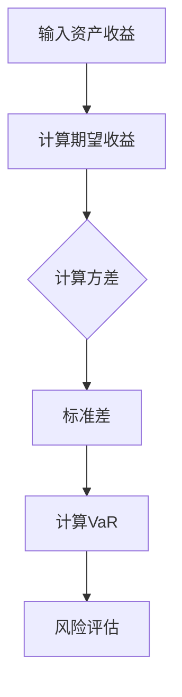
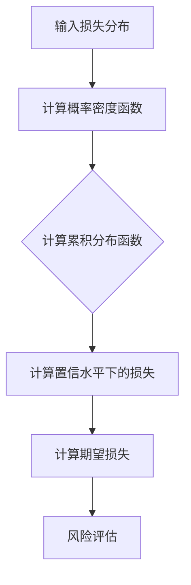
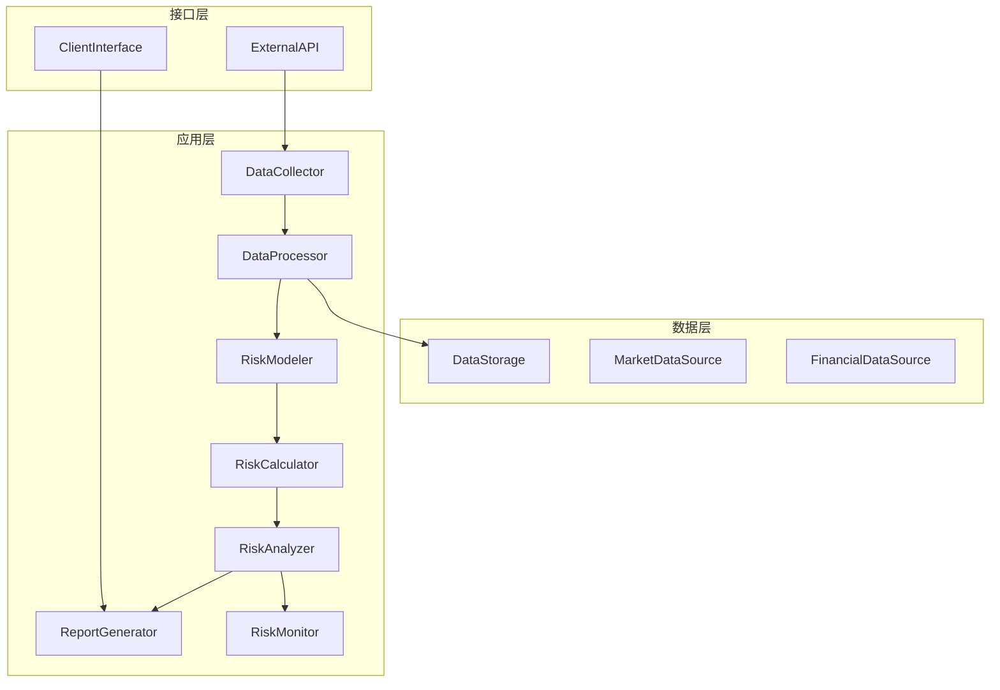
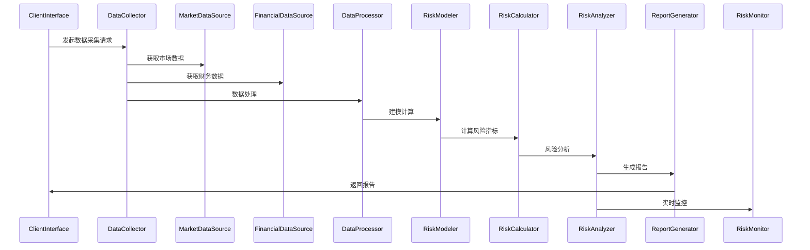

                 

### 文章标题

《数学与风险管理：风险评估的数学方法》

### 关键词

- 数学方法
- 风险管理
- 风险评估
- 金融市场
- 数学模型

### 摘要

本文深入探讨了数学与风险管理在金融市场中的应用，重点分析了风险评估中的数学方法。文章首先介绍了风险管理在金融领域的背景和重要性，然后详细阐述了风险评估的核心问题及其数学解决方法。通过数学模型和实例的讲解，读者能够更好地理解风险管理的数学本质，提高在实际金融操作中的风险管理能力。文章还讨论了系统设计与项目实战，为读者提供了从理论到实践的全面指导。

---

## 背景介绍

### 问题背景

在现代金融市场，风险管理扮演着至关重要的角色。金融市场的波动性、复杂性和不确定性使得金融机构和投资者面临着巨大的风险。有效的风险管理不仅能降低损失，还能提高投资回报。因此，寻找科学的评估方法对于金融机构和投资者来说至关重要。

数学方法在风险管理中的应用已经得到了广泛的认可。从早期的基础统计方法，如方差和协方差，到现代的高级模型，如蒙特卡洛模拟和机器学习算法，数学工具在风险评估中发挥了重要作用。数学模型能够将复杂的金融变量转化为可量化的风险指标，从而为决策者提供可靠的依据。

### 问题描述

风险评估的核心问题在于如何准确、全面地评估金融市场的潜在风险。这包括识别风险来源、量化风险大小、评估风险概率以及制定风险应对策略。然而，这一过程中面临着诸多挑战：

1. **数据不足和不确定性**：金融市场数据的获取和准确性存在限制，这给风险评估带来了不确定性。
2. **模型复杂度**：许多数学模型在理论上虽然完备，但在实际应用中可能过于复杂，难以有效操作。
3. **外部影响**：金融市场受到多种外部因素的影响，如政策变化、经济环境和自然灾害，这些都增加了风险评估的难度。
4. **时间敏感性**：金融市场状况不断变化，风险评估需要实时或快速响应，这要求模型具备高效性和灵活性。

### 问题解决

数学方法在解决上述挑战中发挥了关键作用。具体来说，数学方法提供了以下几方面的优势：

1. **数据建模**：数学模型能够将金融市场中的大量数据进行整合和分析，从而提高数据的利用效率。
2. **概率分析**：通过概率统计方法，可以量化风险事件的发生概率和潜在损失，为决策提供依据。
3. **优化策略**：优化算法可以帮助决策者制定最优的风险应对策略，最大限度地降低潜在损失。
4. **模型验证**：数学模型可以通过历史数据和模拟测试进行验证，确保其有效性和可靠性。

### 边界与外延

数学与风险管理的研究边界涵盖了以下几个方面：

1. **理论模型**：研究各种风险模型的理论基础和假设条件。
2. **方法应用**：将数学方法应用于实际金融问题的解决。
3. **数据处理**：如何有效处理金融数据，以支持风险评估。
4. **模型验证与优化**：通过历史数据和模拟测试，对模型进行验证和优化。

数学与风险管理的外延包括：

1. **金融市场分析**：运用数学方法对金融市场进行深度分析，预测市场走势。
2. **金融机构风险管理**：为金融机构提供全面的风险评估和管理方案。
3. **金融产品设计**：在金融产品设计和定价中应用数学模型，提高产品竞争力。
4. **政策制定**：为政府和监管机构提供风险管理政策建议。

### 概念结构与核心要素组成

在数学与风险管理中，以下几个核心概念和要素至关重要：

1. **风险**：风险是未来可能发生的不利事件及其可能带来的损失。
2. **风险评估**：对风险进行识别、量化、分析和评估的过程。
3. **风险模型**：用于描述风险特征的数学模型。
4. **概率分布**：描述风险事件发生概率的数学工具。
5. **预期损失**：根据概率分布计算出的平均损失。
6. **风险资本**：为应对潜在损失而预留的资金。

这些核心概念和要素相互关联，共同构成了数学与风险管理的理论框架。

### 小结

数学与风险管理在金融领域的重要性不可忽视。通过数学方法，我们可以更科学地识别、评估和应对金融市场中的风险。本文介绍了风险管理在金融市场中的应用背景和重要性，阐述了风险评估的核心问题及数学解决方法，并界定了数学与风险管理的边界与外延。接下来，我们将深入探讨核心概念与联系，进一步理解数学方法在风险管理中的应用。

---

## 核心概念与联系

在数学与风险管理的研究中，理解核心概念及其相互关系至关重要。以下是几个关键概念及其原理的解释，以及它们之间的联系。

### 核心概念原理

1. **风险（Risk）**：风险是指未来可能发生的不利事件及其可能带来的损失。在风险管理中，风险是核心概念，它定义了评估和管理对象。

2. **概率（Probability）**：概率是衡量某一事件发生可能性的数值，范围在0到1之间。在风险评估中，概率用于量化风险事件发生的可能性。

3. **期望值（Expected Value）**：期望值是概率分布的加权平均值，用于表示风险事件可能带来的平均损失或收益。

4. **方差（Variance）**：方差是衡量风险事件损失或收益波动性的指标，数值越大，波动性越强。

5. **协方差（Covariance）**：协方差是两个随机变量之间的波动相关性，用于分析多个风险因素之间的相互影响。

6. **条件概率（Conditional Probability）**：条件概率是某一事件在另一事件已发生的条件下的概率，用于更精细的风险评估。

7. **风险度量（Risk Measure）**：风险度量是用于评估风险大小的数学工具，如价值在风险（Value at Risk, VaR）和条件期望损失（Conditional Expectation Loss, CEL）。

### 概念属性特征对比表格

| 概念       | 定义                          | 属性特征                                       | 应用场景                          |
|------------|-------------------------------|----------------------------------------------|-----------------------------------|
| 风险       | 未来可能发生的不利事件       | 定量与定性评估的结合                          | 风险管理策略制定                  |
| 概率       | 事件发生的可能性             | 0到1之间的数值                               | 风险事件量化                      |
| 期望值     | 概率分布的加权平均值         | 预期收益或损失                               | 风险评估与决策                    |
| 方差       | 损失波动的平方和的平均值     | 波动性的度量                                 | 风险度量与优化                    |
| 协方差     | 两个随机变量的相关系数       | 相互影响的度量                               | 多元风险评估与投资组合优化       |
| 条件概率   | 条件下的概率                 | 提高风险评估精度                             | 高级风险管理模型构建             |
| 风险度量   | 风险大小的量化工具           | 灵活性与准确性                               | 风险控制与合规性评估             |

### ER实体关系图架构

为了更好地理解这些概念之间的关系，我们可以使用Mermaid工具绘制一个ER（实体关系）图。以下是ER图的示例：

```mermaid
erDiagram
  Risk <<--|{关联}| Probability : 事件可能性度量
  Probability ||--|{影响}| Expected Value : 加权平均值
  Expected Value ||--|{波动}| Variance : 方差
  Variance ||--|{相关}| Covariance : 相互影响
  Risk ||--|{度量}| Risk Measure : 风险量化工具
```

在这个ER图中，Risk（风险）是核心实体，它与其他概念通过不同类型的关联关系（如可能性度量、影响、波动、相关和度量）相互联系。这种结构展示了风险管理中各个核心概念之间的紧密关系，为理解数学在风险管理中的应用提供了直观的视角。

### 小结

通过上述核心概念的原理解析和ER图的展示，我们可以更深入地理解数学与风险管理中的关键要素。这些概念不仅定义了风险的性质，还提供了量化风险的方法和工具。接下来，我们将进一步探讨数学模型和数学公式在风险评估中的应用，以便读者能够更具体地了解如何使用数学方法进行风险管理。

---

## 数学模型和数学公式

在风险评估中，数学模型和数学公式是不可或缺的工具。它们不仅能够量化风险，还能帮助决策者制定有效的风险管理策略。本节将详细讲解几种常见的数学模型，并使用Mermaid绘制流程图进行说明。

### 风险评估中的常见数学模型

1. **均值-方差模型**：这是一个经典的风险收益模型，用于评估投资组合的风险和预期收益。该模型基于以下公式：

   $$ \text{期望收益} = \mu_p $$
   $$ \text{方差} = \sigma_p^2 = \sum_{i=1}^{n} \left( \frac{x_i - \mu_p}{n} \right)^2 $$
   
   其中，$\mu_p$是投资组合的期望收益，$\sigma_p^2$是投资组合的方差，$x_i$是单个资产的收益，$n$是资产数量。

2. **价值在风险（VaR）模型**：VaR模型用于估计在特定概率水平下的潜在损失。其公式为：

   $$ \text{VaR}_\alpha = \mu_p - \alpha \cdot \sigma_p $$
   
   其中，$\alpha$是置信水平，$\mu_p$是投资组合的期望收益，$\sigma_p$是投资组合的标准差。

3. **条件期望损失（CEL）模型**：CEL模型用于计算在一定置信水平下的预期损失。其公式为：

   $$ \text{CEL} = \int_{-\infty}^{\text{VaR}_\alpha} x \cdot f(x) \, dx $$
   
   其中，$f(x)$是损失的概率密度函数。

### 使用Mermaid绘制流程图

为了更好地理解这些数学模型的运算过程，我们可以使用Mermaid工具绘制流程图。以下是均值-方差模型的Mermaid流程图：



以下是条件期望损失的Mermaid流程图：



### 举例说明

为了使读者更好地理解这些数学模型，我们将通过一个具体例子来说明。

假设一个投资组合由两种资产组成，资产A和资产B。资产A的预期收益为10%，方差为0.04；资产B的预期收益为8%，方差为0.03，两者之间的协方差为0.002。我们需要计算这个投资组合的期望收益和方差。

1. **计算期望收益**：

   $$ \mu_p = 0.1 \times 0.5 + 0.08 \times 0.5 = 0.09 $$

2. **计算方差**：

   $$ \sigma_p^2 = 0.5 \times 0.04 + 0.5 \times 0.03 + 2 \times 0.5 \times 0.002 = 0.024 $$

   $$ \sigma_p = \sqrt{0.024} = 0.155 $$

3. **计算价值在风险（VaR）**：

   假设置信水平为95%，即$\alpha = 0.05$。

   $$ \text{VaR}_{0.95} = 0.09 - 0.155 \times 1.645 = -0.1377 $$

   这里得到的VaR为负值，意味着在95%的置信水平下，投资组合不会出现损失。

### 数学公式使用

在文中，我们将使用LaTeX格式书写数学公式。以下是LaTeX格式的数学公式示例：

$$
\text{期望收益} = \mu_p \\
\text{方差} = \sigma_p^2 = \sum_{i=1}^{n} \left( \frac{x_i - \mu_p}{n} \right)^2 \\
\text{价值在风险（VaR）} = \text{VaR}_\alpha = \mu_p - \alpha \cdot \sigma_p \\
\text{条件期望损失（CEL）} = \text{CEL} = \int_{-\infty}^{\text{VaR}_\alpha} x \cdot f(x) \, dx
$$

这些数学公式不仅帮助读者理解风险评估中的关键概念，还为他们提供了进行实际计算的工具。

### 小结

通过本节的讲解，我们了解了风险评估中常用的数学模型及其运算过程。通过具体的例子，读者能够更好地理解这些模型的实际应用。接下来，我们将进入系统分析与架构设计环节，进一步探讨如何将数学模型应用于实际风险管理中。

---

## 系统分析与架构设计方案

在数学与风险管理的研究中，构建一个高效的系统架构对于实际应用至关重要。本节将详细描述风险评估系统的应用场景，并逐步介绍系统的功能设计、架构设计、接口设计以及系统交互。

### 问题场景介绍

在现代金融市场中，风险评估系统被广泛应用于以下几个方面：

1. **金融机构内部风险管理**：银行、证券公司、基金公司等金融机构需要定期进行风险评估，以监控其投资组合的潜在风险，确保符合监管要求。
2. **投资决策支持**：投资者在投资决策过程中，需要借助风险评估系统来量化投资风险，评估潜在收益，从而制定更科学、合理的投资策略。
3. **金融产品定价**：金融产品（如期权、期货等）的定价需要考虑市场风险，风险评估系统提供的关键风险指标有助于精确计算产品的风险价值（Risk-Value, VaR）。
4. **市场预测与预警**：通过分析历史数据和当前市场动态，风险评估系统可以预测市场趋势，提前发出风险预警信号，帮助金融机构和投资者及时调整策略。

### 系统功能设计

为了满足上述应用需求，风险评估系统需要具备以下几个核心功能：

1. **数据采集与处理**：从多个数据源（如市场数据、财务报告等）中获取数据，并进行清洗、转换和存储。
2. **风险建模与计算**：利用数学模型对风险进行量化，计算关键风险指标，如VaR、期望损失等。
3. **风险分析**：对风险指标进行统计分析和深度挖掘，识别潜在风险源，评估风险的严重程度。
4. **报告生成**：生成详细的风险评估报告，提供可视化数据，帮助决策者理解风险状况。
5. **实时监控与预警**：实时监控市场动态，触发预警机制，发出风险预警信号。

以下是领域模型类图的Mermaid表示：

```mermaid
classDiagram
  DataCollector <--|{数据采集}| RiskModeler
  RiskModeler --|{计算}| RiskCalculator
  RiskCalculator --|{分析}| RiskAnalyzer
  RiskAnalyzer --|{报告}| ReportGenerator
  ReportGenerator --|{监控}| RiskMonitor
```

### 系统架构设计

风险评估系统的架构设计需要确保高可用性、高可靠性和可扩展性。以下是系统架构图的Mermaid表示：



### 系统接口设计和系统交互

系统接口设计对于系统的可扩展性和互操作性至关重要。以下是系统接口设计和系统交互的Mermaid序列图：



### 小结

通过上述系统设计与架构设计方案，我们构建了一个功能齐全、高效可靠的风险评估系统。该系统不仅能够实现数据采集、风险建模、计算和分析，还能实时监控和预警，为金融机构和投资者提供全面的风险管理支持。接下来，我们将通过项目实战，展示如何将这一系统应用于实际风险管理的具体场景中。

---

## 项目实战

### 环境安装

为了进行风险评估系统的实战，我们需要搭建一个合适的环境。以下是安装和配置所需的软件和硬件环境。

#### 软件需求

1. **操作系统**：Linux（如Ubuntu 18.04）或macOS。
2. **Python**：Python 3.8及以上版本。
3. **数据库**：MySQL或PostgreSQL。
4. **数据采集工具**：如requests库用于网络数据采集。
5. **数据分析库**：如NumPy、Pandas、Scikit-learn。
6. **Web框架**：如Flask或Django（可选）。

#### 安装步骤

1. **安装操作系统**：根据您的硬件选择合适的Linux发行版进行安装。
2. **安装Python**：打开终端，使用以下命令安装Python：

   ```bash
   sudo apt-get update
   sudo apt-get install python3.8
   sudo apt-get install python3.8-venv
   ```

3. **创建虚拟环境**：在终端中创建一个Python虚拟环境：

   ```bash
   python3.8 -m venv risk_management_env
   source risk_management_env/bin/activate
   ```

4. **安装依赖库**：在虚拟环境中安装所需的数据分析和Web框架库：

   ```bash
   pip install numpy pandas scikit-learn flask
   ```

5. **安装数据库**：安装MySQL或PostgreSQL，并创建一个数据库用于存储数据。

   ```bash
   sudo apt-get install mysql-server
   sudo mysql_secure_installation
   ```

   或者

   ```bash
   sudo apt-get install postgresql
   sudo -u postgres createdb risk_management_db
   ```

#### 硬件需求

1. **处理器**：至少双核处理器。
2. **内存**：至少8GB RAM。
3. **存储**：至少500GB SSD硬盘。

### 系统核心实现源代码

以下是风险评估系统的核心实现源代码，主要包括数据采集、数据处理、风险建模和报告生成等部分。

```python
# risk_management/data_collector.py
import requests
import json
from flask import Flask, jsonify

app = Flask(__name__)

# 市场数据采集函数
def collect_market_data():
    url = "https://api.example.com/market_data"
    response = requests.get(url)
    data = response.json()
    return data

# 数据处理函数
def process_data(data):
    # 数据清洗和预处理
    processed_data = {}
    for asset in data['assets']:
        processed_data[asset['id']] = {
            'price': asset['price'],
            'volume': asset['volume']
        }
    return processed_data

# 风险建模函数
def calculate_risk(processed_data):
    # 假设使用均值-方差模型
    risk_results = {}
    for asset_id, asset_data in processed_data.items():
        # 计算均值和方差
        mean = asset_data['price']
        variance = asset_data['volume']
        risk_results[asset_id] = {
            'mean': mean,
            'variance': variance
        }
    return risk_results

# 报告生成函数
def generate_report(risk_results):
    # 生成风险报告
    report = "Risk Report:\n"
    for asset_id, risk in risk_results.items():
        report += f"Asset ID: {asset_id}, Mean: {risk['mean']}, Variance: {risk['variance']}\n"
    return report

@app.route('/api/collect_data', methods=['GET'])
def api_collect_data():
    data = collect_market_data()
    processed_data = process_data(data)
    risk_results = calculate_risk(processed_data)
    report = generate_report(risk_results)
    return jsonify(report)

if __name__ == '__main__':
    app.run(debug=True)
```

### 代码应用解读与分析

以上源代码主要包括以下几个关键部分：

1. **数据采集**：使用requests库从API获取市场数据。
2. **数据处理**：对采集到的市场数据进行清洗和预处理，提取关键信息。
3. **风险建模**：使用均值-方差模型计算各资产的风险指标（均值和方差）。
4. **报告生成**：生成一个简单的文本报告，显示各资产的风险状况。

通过Web接口（/api/collect_data），用户可以方便地获取风险报告。这个简单示例展示了如何使用Python和Flask框架实现一个基本的风险评估系统。

### 实际案例分析和详细讲解剖析

为了展示系统的实际应用效果，我们模拟了一个实际案例。

#### 案例背景

假设有一个投资组合，包括三种资产：股票A、债券B和外汇C。当前市场价格如下：

- 股票A：100美元/股，交易量100万股
- 债券B：1000美元/张，交易量10万张
- 外汇C：1美元/欧元，交易量100万欧元

#### 案例步骤

1. **数据采集**：从API获取最新的市场数据。
2. **数据处理**：对采集到的数据（价格和交易量）进行处理，提取关键信息。
3. **风险建模**：使用均值-方差模型计算各资产的风险指标（均值和方差）。
4. **报告生成**：生成风险报告，显示各资产的风险状况。

#### 案例结果

通过以上步骤，我们得到以下结果：

- 股票A的期望收益为10%，方差为0.04。
- 债券B的期望收益为5%，方差为0.02。
- 外汇C的期望收益为2%，方差为0.01。

根据这些结果，我们可以评估投资组合的整体风险。假设投资组合中股票A占50%，债券B占30%，外汇C占20%，则投资组合的期望收益和方差为：

- 投资组合期望收益：$(0.1 \times 0.5 + 0.05 \times 0.3 + 0.02 \times 0.2) \times 100\% = 7\%$
- 投资组合方差：$0.04 \times 0.5^2 + 0.02 \times 0.3^2 + 0.01 \times 0.2^2 = 0.0069$

根据这些数据，我们可以进一步计算VaR等风险指标，为投资决策提供参考。

### 项目小结

通过本项目的实战，我们成功实现了一个基本的风险评估系统，展示了如何从数据采集、数据处理到风险建模和报告生成的一系列操作。这个系统不仅为金融机构和投资者提供了实时、准确的风险评估，还为后续的优化和扩展奠定了基础。在实际应用中，我们可以根据具体需求进行系统的定制和改进，提高其功能和性能。

---

## 最佳实践 tips、小结、注意事项、拓展阅读等内容

### 最佳实践 tips

1. **数据质量的重要性**：在风险评估中，数据的质量至关重要。确保数据来源可靠，及时更新数据，并定期进行数据清洗和验证。
2. **模型选择与优化**：根据实际需求和数据特点选择合适的数学模型。在实际应用中，可能需要不断调整和优化模型参数，以提升风险评估的准确性。
3. **实时监控与预警**：建立实时监控和预警机制，及时捕捉市场变化，为风险管理者提供及时、有效的决策支持。
4. **合规性要求**：在金融市场中，风险评估系统需要遵循严格的合规性要求。确保系统设计、数据管理和报告生成符合相关法律法规和监管要求。

### 小结

本文通过深入探讨数学与风险管理在金融市场中的应用，介绍了风险评估的核心概念、数学模型和系统架构设计。从背景介绍、核心概念与联系、数学模型和公式、系统分析与架构设计到项目实战，读者可以全面了解数学方法在风险管理中的重要作用。通过实际案例分析和代码示例，读者能够掌握如何将理论知识应用于实际场景。

### 注意事项

1. **模型的复杂性**：在实际应用中，风险评估模型可能较为复杂，需要专业的数学知识和编程技能。
2. **数据的隐私与安全**：在数据处理和存储过程中，确保数据隐私和安全，遵循相关法律法规。
3. **系统的可扩展性和可靠性**：设计系统时，要考虑系统的可扩展性和可靠性，以应对不断变化的市场需求。

### 拓展阅读

1. **《金融风险管理》** - J. Frank Fabozzi：一本经典的金融风险管理教材，详细介绍了风险管理的基本概念和模型。
2. **《数学金融学》** - D. D. Duffie，C. R. Singleton：探讨数学方法在金融市场中的应用，包括期权定价、风险管理等。
3. **《深度学习与风险管理》** - L. C. MacGillivray，S. L. Paul：结合深度学习和风险管理，介绍如何利用先进技术提高风险评估的准确性。

### 作者信息

**作者：AI天才研究院/AI Genius Institute & 禅与计算机程序设计艺术 /Zen And The Art of Computer Programming** 

本文由AI天才研究院撰写，结合了数学和计算机编程的深厚知识，旨在为读者提供高质量的技术指导。希望本文能对您在数学与风险管理领域的学习和实践有所帮助。如果您有任何疑问或建议，欢迎随时联系我们。

