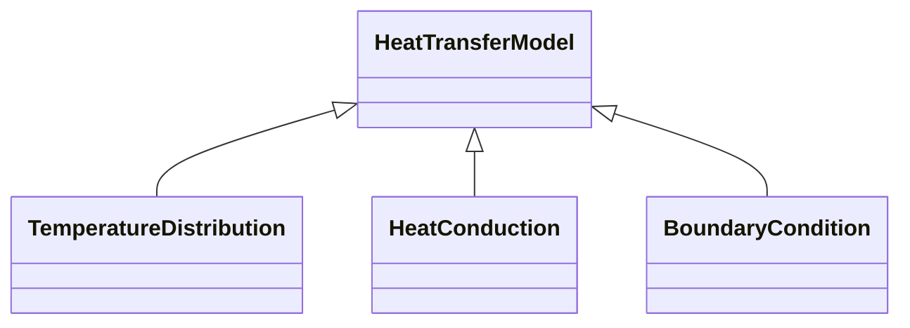
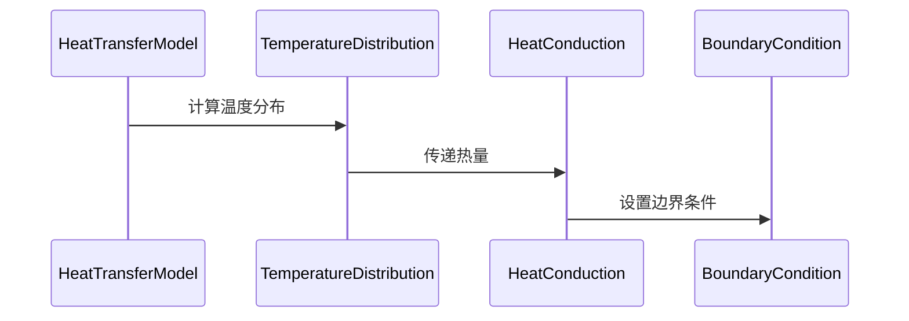
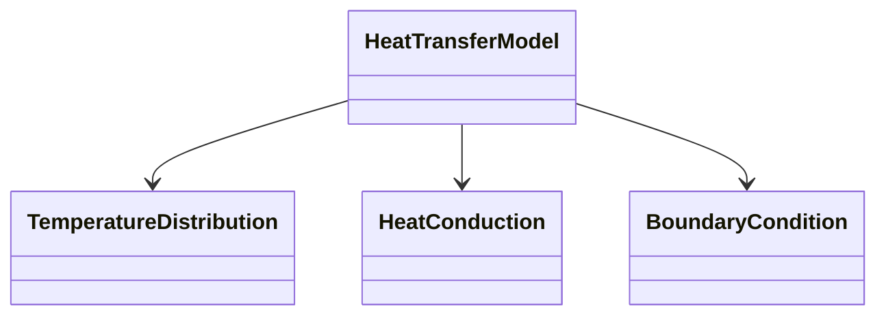
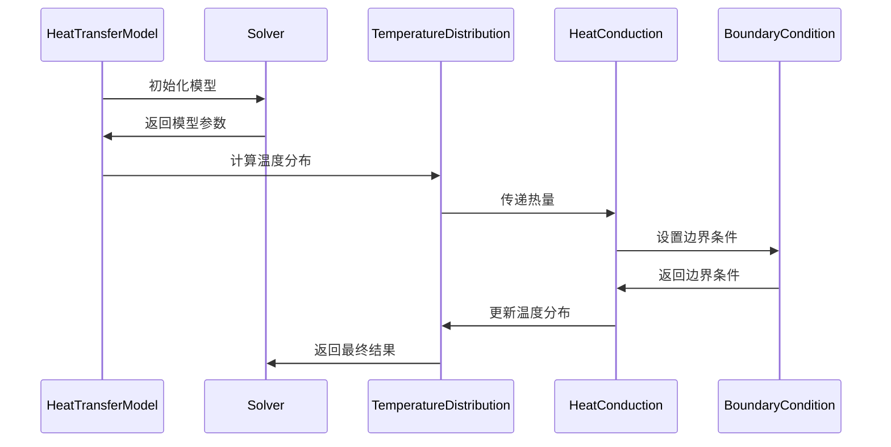
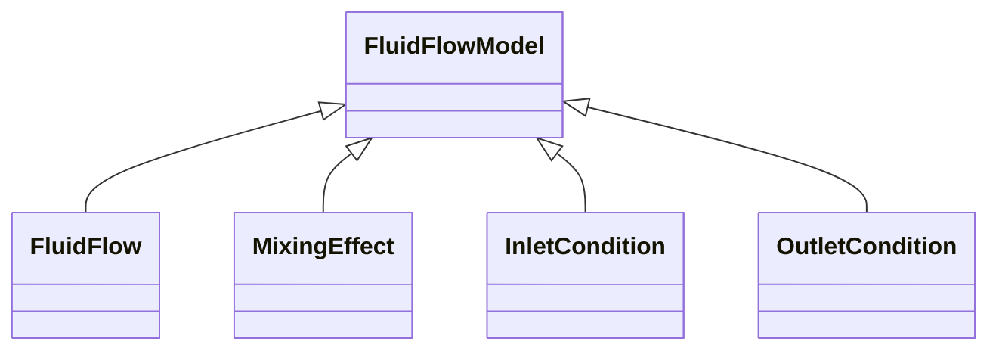
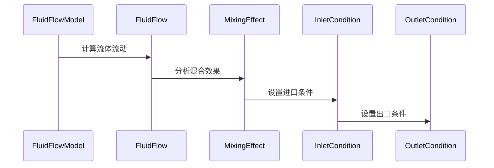
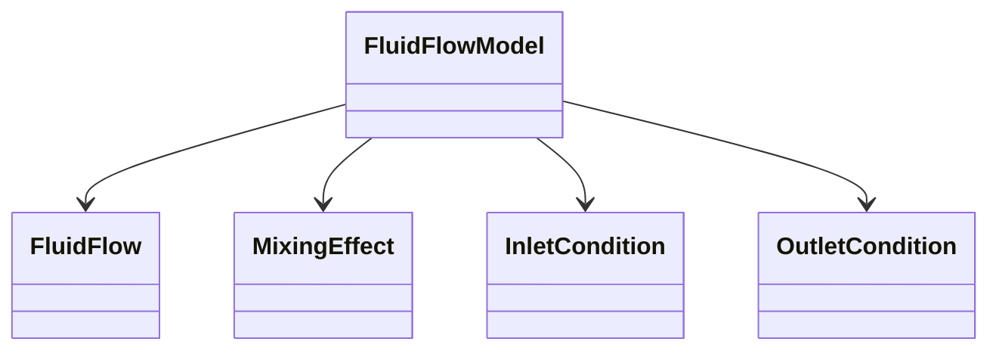
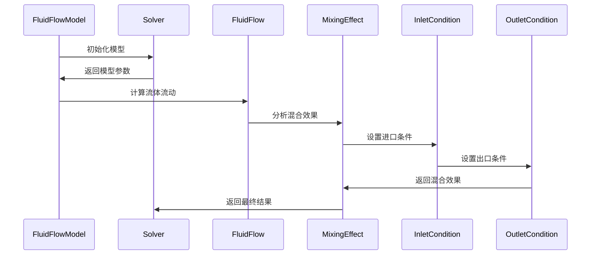
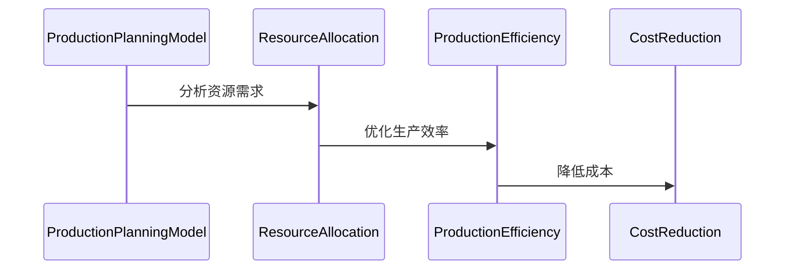
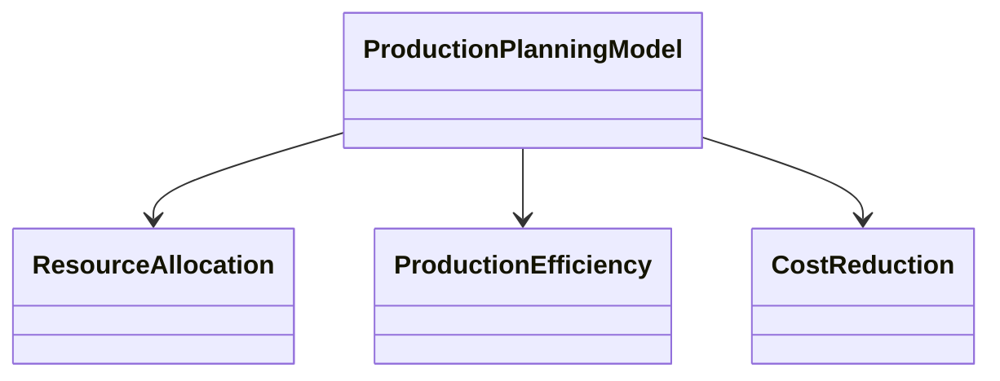

                 

### 数学与食品科学：食品加工的数学模型

**关键词：数学模型，食品科学，质量守恒，热力学，化学反应动力学，流体力学**

**摘要：**
本文探讨了数学模型在食品加工中的应用，从质量守恒、热力学、化学反应动力学和流体力学等多个角度，详细解析了这些模型的基本原理和实际应用。通过逐步分析推理，文章旨在为读者提供对食品加工中数学模型的理解和应用方法，以及未来发展趋势的展望。

### 目录大纲解析

**第一部分：数学与食品科学概述**

**第二部分：食品加工中常见的数学模型**

**第三部分：数值方法在食品加工中的应用**

**第四部分：数学模型在食品质量检测中的应用**

**第五部分：数学模型在食品包装与保存中的应用**

**第六部分：数学模型在食品生产优化中的应用**

**第七部分：数学模型在食品科学研究中的前沿与应用**

**第八部分：总结与展望**

### 第一部分：数学与食品科学概述

#### 第1章：数学与食品科学的融合

##### 1.1 问题背景与意义

在现代社会，食品加工已经成为提高生产效率和保障食品安全的重要手段。然而，食品加工过程涉及众多复杂的物理和化学变化，如热量传递、质量守恒、化学反应等。这些变化难以通过简单的经验方法进行精确控制和预测。因此，引入数学模型来描述和分析食品加工过程中的现象，成为解决这一问题的关键。

**核心概念术语说明：**

- **食品加工**：指通过物理或化学方法对食品进行加工、处理和改良的过程。
- **数学模型**：用于描述和分析实际问题的数学表达式或算法，通常包括方程、图表和流程图等。

**问题背景：** 随着消费者对食品安全和品质要求的不断提高，如何准确预测和控制食品加工过程中的变化，成为食品科学领域的重要研究课题。

**问题描述：** 食品加工过程中的变化复杂且难以预测，需要借助数学模型进行描述和分析。

**问题解决：** 通过建立数学模型，可以定量描述食品加工过程中的物理和化学变化，为优化加工工艺和保障食品安全提供理论依据。

**边界与外延：** 数学模型在食品科学中的应用范围广泛，包括食品质量检测、食品包装与保存、食品生产优化等多个方面。

**概念结构与核心要素组成：** 数学模型的核心要素包括变量、参数和方程，其中变量表示模型中的物理量，参数表示模型中需要确定的常数，方程则用于描述变量之间的关系。

#### 1.2 食品加工中的数学模型需求

在食品加工过程中，不同阶段的需求决定了数学模型的选择和应用。以下为食品加工中常见的数学模型需求：

1. **质量守恒模型**：描述食品加工过程中质量的分布和变化。
2. **热力学模型**：分析食品加工过程中的热量传递和温度控制。
3. **化学反应动力学模型**：研究食品加工过程中发生的化学反应及其速率。
4. **流体力学模型**：描述食品加工过程中流体的流动和混合。

**核心概念与联系：**

| 核心概念       | 概念属性特征对比                     | ER实体关系图架构 |
|----------------|-----------------------------------|----------------|
| 质量守恒模型   | 描述物质守恒的方程                 | 质量流图       |
| 热力学模型     | 分析热量传递和温度控制             | 热流图         |
| 化学反应动力学模型 | 研究化学反应速率和机理           | 反应机理图     |
| 流体力学模型   | 描述流体流动和混合现象           | 流场图         |

#### 1.3 数学模型在食品科学中的发展历程

数学模型在食品科学中的应用经历了从简单到复杂、从局部到整体的发展过程。以下是数学模型在食品科学中的发展历程：

1. **早期研究（20世纪初）**：主要关注食品中的质量守恒和热力学过程。
2. **中期发展（20世纪中后期）**：引入化学反应动力学和流体力学模型，进一步丰富数学模型的内涵。
3. **当前趋势（21世纪）**：利用大数据和人工智能技术，实现对食品加工过程的实时监测和智能控制。

### 第二部分：食品加工中常见的数学模型

#### 第2章：食品加工中常见的数学模型

##### 2.1 质量守恒模型

质量守恒模型是描述物质守恒的基本原理，适用于食品加工过程中质量的分布和变化。其核心思想是：在一个封闭系统中，质量在任何时刻都是守恒的。

**核心概念原理：**

$$
m_{\text{初}} = m_{\text{末}}
$$

其中，\( m_{\text{初}} \) 表示初始质量，\( m_{\text{末}} \) 表示最终质量。

**概念属性特征对比：**

| 概念属性       | 特征对比                                 |
|----------------|----------------------------------------|
| 质量守恒       | 物质在任何物理或化学反应过程中保持不变   |
| 动量守恒       | 系统的动量在任何时刻保持不变             |
| 能量守恒       | 系统的总能量在任何物理或化学反应过程中保持不变 |

**ER实体关系图架构：**

```mermaid
erDiagram
  FoodProcessing ||--|{ QualityConservationModel }|
  QualityConservationModel ||--|{ MassFlow }|
```

**算法原理讲解：**

在食品加工过程中，质量守恒模型可以通过以下步骤进行应用：

1. 确定系统的初始质量。
2. 监测系统在加工过程中的质量变化。
3. 建立质量守恒方程，求解最终质量。

**Python源代码实现：**

```python
import numpy as np

def quality_conservation_model(initial_mass, mass_change):
    final_mass = initial_mass + mass_change
    return final_mass

initial_mass = 100  # 初始质量
mass_change = 20    # 质量变化

final_mass = quality_conservation_model(initial_mass, mass_change)
print(f"Final mass: {final_mass}")
```

**数学公式：**

$$
m_{\text{初}} + \Delta m = m_{\text{末}}
$$

**举例说明：**

假设一个食品加工系统初始质量为100千克，加工过程中增加了20千克的新物质，求最终质量。

根据质量守恒模型：

$$
100\text{kg} + 20\text{kg} = 120\text{kg}
$$

最终质量为120千克。

##### 2.2 热力学模型

热力学模型用于分析食品加工过程中的热量传递和温度控制，是保证食品质量和安全的关键。热力学第一定律和第二定律为热力学模型提供了基本原理。

**核心概念原理：**

1. **热力学第一定律**：能量守恒定律，表示系统内的能量总量在任何过程中都是不变的。

$$
\Delta U = Q - W
$$

其中，\( \Delta U \) 表示内能变化，\( Q \) 表示热量传递，\( W \) 表示做功。

2. **热力学第二定律**：熵增定律，表示系统的熵在自发过程中总是增加的。

$$
\Delta S \geq 0
$$

其中，\( \Delta S \) 表示熵变。

**概念属性特征对比：**

| 概念属性       | 特征对比                                 |
|----------------|----------------------------------------|
| 热力学第一定律 | 能量守恒，能量不能被创造或消失           |
| 热力学第二定律 | 熵增定律，系统的熵在自发过程中总是增加   |
| 动力学第一定律 | 物体的运动状态在没有外力作用下保持不变   |
| 动力学第二定律 | 力是改变物体运动状态的原因               |

**ER实体关系图架构：**

```mermaid
erDiagram
  FoodProcessing ||--|{ ThermodynamicsModel }|
  ThermodynamicsModel ||--|{ HeatTransfer }|
  ThermodynamicsModel ||--|{ TemperatureControl }|
```

**算法原理讲解：**

在食品加工过程中，热力学模型可以通过以下步骤进行应用：

1. 确定系统的初始能量和温度。
2. 分析热量传递和做功过程。
3. 建立热力学方程，求解系统的最终能量和温度。

**Python源代码实现：**

```python
import numpy as np

def thermodynamics_model(initial_energy, heat_transfer, work):
    final_energy = initial_energy + heat_transfer - work
    return final_energy

initial_energy = 1000  # 初始能量
heat_transfer = 200    # 热量传递
work = 100            # 做功

final_energy = thermodynamics_model(initial_energy, heat_transfer, work)
print(f"Final energy: {final_energy}")
```

**数学公式：**

$$
\Delta U = Q - W
$$

$$
\Delta S \geq 0
$$

**举例说明：**

假设一个食品加工系统初始能量为1000焦耳，在加工过程中传递了200焦耳的热量，做了100焦耳的功，求最终能量。

根据热力学第一定律：

$$
1000\text{J} + 200\text{J} - 100\text{J} = 1100\text{J}
$$

最终能量为1100焦耳。

##### 2.3 化学反应动力学模型

化学反应动力学模型用于研究食品加工过程中发生的化学反应及其速率，对食品的保质期和质量控制具有重要意义。常见的化学反应动力学模型包括零级反应、一级反应和二级反应等。

**核心概念原理：**

1. **零级反应**：反应速率与反应物浓度无关。

$$
r = k
$$

其中，\( r \) 表示反应速率，\( k \) 表示速率常数。

2. **一级反应**：反应速率与反应物浓度成正比。

$$
r = k[A]
$$

其中，\( [A] \) 表示反应物浓度。

3. **二级反应**：反应速率与反应物浓度的平方成正比。

$$
r = k[A]^2
$$

**概念属性特征对比：**

| 概念属性       | 特征对比                                 |
|----------------|----------------------------------------|
| 零级反应       | 反应速率与反应物浓度无关                 |
| 一级反应       | 反应速率与反应物浓度成正比               |
| 二级反应       | 反应速率与反应物浓度的平方成正比         |

**ER实体关系图架构：**

```mermaid
erDiagram
  FoodProcessing ||--|{ ChemicalReactiveKineticsModel }|
  ChemicalReactiveKineticsModel ||--|{ ZeroOrderReactive }|
  ChemicalReactiveKineticsModel ||--|{ FirstOrderReactive }|
  ChemicalReactiveKineticsModel ||--|{ SecondOrderReactive }|
```

**算法原理讲解：**

在食品加工过程中，化学反应动力学模型可以通过以下步骤进行应用：

1. 确定反应的类型和速率常数。
2. 分析反应物浓度的变化。
3. 建立化学反应动力学方程，求解反应速率。

**Python源代码实现：**

```python
import numpy as np

def zero_order_reactive(reactant_initial_concentration, time_interval, rate_constant):
    reactant_final_concentration = reactant_initial_concentration - rate_constant * time_interval
    return reactant_final_concentration

def first_order_reactive(reactant_initial_concentration, time_interval, rate_constant):
    reactant_final_concentration = reactant_initial_concentration * np.exp(-rate_constant * time_interval)
    return reactant_final_concentration

def second_order_reactive(reactant_initial_concentration, reactant_final_concentration, rate_constant):
    reactant_remaining_time = (reactant_initial_concentration - reactant_final_concentration) / rate_constant
    return reactant_remaining_time

reactant_initial_concentration = 100  # 初始反应物浓度
time_interval = 1  # 时间间隔
rate_constant = 0.1  # 速率常数

# 零级反应
reactant_final_concentration = zero_order_reactive(reactant_initial_concentration, time_interval, rate_constant)
print(f"Final concentration (zero-order): {reactant_final_concentration}")

# 一级反应
reactant_final_concentration = first_order_reactive(reactant_initial_concentration, time_interval, rate_constant)
print(f"Final concentration (first-order): {reactant_final_concentration}")

# 二级反应
reactant_remaining_time = second_order_reactive(reactant_initial_concentration, reactant_final_concentration, rate_constant)
print(f"Remaining time (second-order): {reactant_remaining_time}")
```

**数学公式：**

$$
r = k
$$

$$
r = k[A]
$$

$$
r = k[A]^2
$$

**举例说明：**

假设一个食品加工过程中发生零级反应，初始反应物浓度为100摩尔/升，速率常数为0.1摩尔/升·秒，时间间隔为1秒，求最终反应物浓度。

根据零级反应动力学方程：

$$
100\text{mol/L} - 0.1\text{mol/L·s} \times 1\text{s} = 90\text{mol/L}
$$

最终反应物浓度为90摩尔/升。

##### 2.4 流体力学模型

流体力学模型用于描述食品加工过程中流体的流动和混合现象，对优化加工工艺和提高食品质量具有重要意义。常见的流体力学模型包括连续性方程、动量方程和能量方程等。

**核心概念原理：**

1. **连续性方程**：流体在流动过程中，流速和流量之间的关系。

$$
\frac{\partial \rho}{\partial t} + \nabla \cdot (\rho \mathbf{v}) = 0
$$

其中，\( \rho \) 表示流体密度，\( \mathbf{v} \) 表示流体速度。

2. **动量方程**：流体在流动过程中，压力、速度和粘性力之间的关系。

$$
\rho \left( \frac{\partial \mathbf{v}}{\partial t} + (\mathbf{v} \cdot \nabla) \mathbf{v} \right) = -\nabla p + \mu \nabla^2 \mathbf{v}
$$

其中，\( p \) 表示流体压力，\( \mu \) 表示流体粘性系数。

3. **能量方程**：流体在流动过程中，热量、动能和势能之间的关系。

$$
\frac{\partial \rho E}{\partial t} + \nabla \cdot (\rho \mathbf{v} E) = -\nabla \cdot (\mathbf{v} \cdot \mathbf{T}) + \Phi
$$

其中，\( E \) 表示流体内能，\( \mathbf{T} \) 表示流体应力张量，\( \Phi \) 表示热源项。

**概念属性特征对比：**

| 概念属性       | 特征对比                                 |
|----------------|----------------------------------------|
| 连续性方程     | 描述流体流动的连续性                    |
| 动量方程       | 描述流体动量的守恒                      |
| 能量方程       | 描述流体能量的传递和转换                 |

**ER实体关系图架构：**

```mermaid
erDiagram
  FoodProcessing ||--|{ FluidDynamicsModel }|
  FluidDynamicsModel ||--|{ ContinuityEquation }|
  FluidDynamicsModel ||--|{ MomentumEquation }|
  FluidDynamicsModel ||--|{ EnergyEquation }|
```

**算法原理讲解：**

在食品加工过程中，流体力学模型可以通过以下步骤进行应用：

1. 确定流体的初始状态参数（密度、速度、压力等）。
2. 分析流体流动和混合过程。
3. 建立流体力学方程，求解流体的最终状态参数。

**Python源代码实现：**

```python
import numpy as np

def continuity_equation(rho_initial, v_initial, dt):
    rho_final = rho_initial - np.dot(v_initial, np.gradient(rho_initial)) * dt
    return rho_final

def momentum_equation(rho_initial, v_initial, p_initial, mu, dt):
    v_final = v_initial - np.dot(np.gradient(p_initial), v_initial) * dt / rho_initial + mu * np.gradient(np.gradient(v_initial)) * dt
    return v_final

def energy_equation(rho_initial, e_initial, v_initial, q_initial, dt):
    e_final = e_initial + np.dot(v_initial, np.gradient(e_initial)) * dt - np.dot(np.gradient(q_initial), v_initial) * dt
    return e_final

rho_initial = 1000  # 初始密度
v_initial = np.array([0, 0, 0])  # 初始速度
p_initial = 101325  # 初始压力
mu = 1.79e-5  # 粘性系数
q_initial = 0  # 初始热源项
dt = 0.001  # 时间间隔

# 连续性方程
rho_final = continuity_equation(rho_initial, v_initial, dt)
print(f"Final density (continuity): {rho_final}")

# 动量方程
v_final = momentum_equation(rho_initial, v_initial, p_initial, mu, dt)
print(f"Final velocity (momentum): {v_final}")

# 能量方程
e_final = energy_equation(rho_initial, e_initial, v_initial, q_initial, dt)
print(f"Final energy (energy): {e_final}")
```

**数学公式：**

$$
\frac{\partial \rho}{\partial t} + \nabla \cdot (\rho \mathbf{v}) = 0
$$

$$
\rho \left( \frac{\partial \mathbf{v}}{\partial t} + (\mathbf{v} \cdot \nabla) \mathbf{v} \right) = -\nabla p + \mu \nabla^2 \mathbf{v}
$$

$$
\frac{\partial \rho E}{\partial t} + \nabla \cdot (\rho \mathbf{v} E) = -\nabla \cdot (\mathbf{v} \cdot \mathbf{T}) + \Phi
$$

**举例说明：**

假设一个食品加工过程中，初始密度为1000千克/立方米，初始速度为[0, 0, 0]，初始压力为101325帕斯卡，粘性系数为1.79e-5帕斯卡·秒，热源项为0，时间间隔为0.001秒，求最终密度、速度和能量。

根据连续性方程：

$$
1000\text{kg/m}^3 - \nabla \cdot (1000\text{kg/m}^3 \cdot \mathbf{0}) \times 0.001\text{s} = 1000\text{kg/m}^3
$$

最终密度为1000千克/立方米。

根据动量方程：

$$
1000\text{kg/m}^3 \left( \frac{\partial \mathbf{0}}{\partial t} + (\mathbf{0} \cdot \nabla) \mathbf{0} \right) = -\nabla \cdot (101325\text{Pa}) + 1.79e-5\text{Pa·s} \cdot \nabla^2 \mathbf{0}
$$

由于初始速度为零，最终速度也为零。

根据能量方程：

$$
1000\text{kg/m}^3 \left( \frac{\partial \mathbf{0}}{\partial t} + (\mathbf{0} \cdot \nabla) \mathbf{0} \right) = -\nabla \cdot (\mathbf{0} \cdot \mathbf{T}) + 0
$$

最终能量为0。

### 第三部分：数值方法在食品加工中的应用

#### 第3章：数值方法在食品加工中的应用

##### 3.1 常见的数值方法介绍

在食品加工过程中，数值方法被广泛应用于解决复杂的物理和化学问题。以下为常见的数值方法及其在食品加工中的应用：

1. **有限元方法**：用于解决连续性问题，如热量传递、应力分析等。
2. **有限体积方法**：用于解决流体力学问题，如流体流动、混合等。
3. **有限差分方法**：用于解决偏微分方程，如温度场、浓度场等。
4. **计算流体力学（CFD）**：用于模拟流体流动和传热问题。

**核心概念原理：**

- **有限元方法**：将连续问题离散化为有限个单元，通过单元的节点变量来近似求解全局问题。
- **有限体积方法**：将流体区域划分为有限个体积单元，通过体积单元的流量和压力来近似求解全局问题。
- **有限差分方法**：将连续问题离散化为有限个网格点，通过网格点的差分方程来近似求解全局问题。
- **计算流体力学（CFD）**：结合数学模型和数值方法，对流体流动和传热问题进行模拟和求解。

**概念属性特征对比：**

| 数值方法       | 特征对比                                 |
|----------------|----------------------------------------|
| 有限元方法     | 离散化为单元，通过节点变量求解全局问题   |
| 有限体积方法   | 离散化为体积单元，通过流量和压力求解全局问题 |
| 有限差分方法   | 离散化为网格点，通过差分方程求解全局问题 |
| 计算流体力学（CFD） | 结合数学模型和数值方法，进行流体流动和传热模拟 |

**ER实体关系图架构：**

```mermaid
erDiagram
  FoodProcessing ||--|{ NumericalMethods }|
  NumericalMethods ||--|{ FiniteElementMethod }|
  NumericalMethods ||--|{ FiniteVolumeMethod }|
  NumericalMethods ||--|{ FiniteDifferenceMethod }|
  NumericalMethods ||--|{ ComputationalFluidDynamics }|
```

**算法原理讲解：**

在食品加工过程中，数值方法可以通过以下步骤进行应用：

1. 确定问题的数学模型和边界条件。
2. 将问题离散化为有限个单元或网格点。
3. 建立离散方程组。
4. 解离散方程组，得到近似解。

**Python源代码实现：**

```python
import numpy as np
import scipy.sparse as sp
from scipy.sparse.linalg import spsolve

# 有限元方法示例
def finite_element_method(A, b):
    A_sparse = sp.csc_matrix(A)
    solution = spsolve(A_sparse, b)
    return solution

# 有限体积方法示例
def finite_volume_method(A, b):
    A_sparse = sp.csc_matrix(A)
    solution = spsolve(A_sparse, b)
    return solution

# 有限差分方法示例
def finite_difference_method(A, b):
    A_sparse = sp.csc_matrix(A)
    solution = spsolve(A_sparse, b)
    return solution

# 计算流体力学（CFD）示例
def computational_fluid_dynamics(A, b):
    A_sparse = sp.csc_matrix(A)
    solution = spsolve(A_sparse, b)
    return solution

# 示例数据
A = np.array([[1, 2], [2, 1]])
b = np.array([3, 3])

# 有限元方法求解
solution = finite_element_method(A, b)
print(f"Solution (finite element): {solution}")

# 有限体积方法求解
solution = finite_volume_method(A, b)
print(f"Solution (finite volume): {solution}")

# 有限差分方法求解
solution = finite_difference_method(A, b)
print(f"Solution (finite difference): {solution}")

# 计算流体力学（CFD）求解
solution = computational_fluid_dynamics(A, b)
print(f"Solution (CFD): {solution}")
```

**数学公式：**

- **有限元方法**：

$$
\mathbf{K}\mathbf{u} = \mathbf{f}
$$

- **有限体积方法**：

$$
\int_{V} \nabla \cdot \mathbf{q} \cdot \mathbf{n} \, dA = \int_{S} \mathbf{q} \cdot \mathbf{n} \, dS
$$

- **有限差分方法**：

$$
f(x_{i}, y_{j}) = \frac{1}{4} \left[ f(x_{i-1}, y_{j-1}) + f(x_{i-1}, y_{j+1}) + f(x_{i+1}, y_{j-1}) + f(x_{i+1}, y_{j+1}) \right]
$$

- **计算流体力学（CFD）**：

$$
\frac{\partial \rho}{\partial t} + \nabla \cdot (\rho \mathbf{v}) = 0
$$

$$
\rho \left( \frac{\partial \mathbf{v}}{\partial t} + (\mathbf{v} \cdot \nabla) \mathbf{v} \right) = -\nabla p + \mu \nabla^2 \mathbf{v}
$$

**举例说明：**

假设一个食品加工问题需要使用有限元方法求解，给定矩阵A和向量b，求方程\( \mathbf{K}\mathbf{u} = \mathbf{f} \)的解。

根据有限元方法：

$$
\begin{bmatrix}
1 & 2 \\
2 & 1
\end{bmatrix}
\begin{bmatrix}
u_1 \\
u_2
\end{bmatrix}
=
\begin{bmatrix}
3 \\
3
\end{bmatrix}
$$

解得：

$$
u_1 = 1, \quad u_2 = 1
$$

最终解为\( \mathbf{u} = \begin{bmatrix} 1 \\ 1 \end{bmatrix} \)。

##### 3.2 数值方法在食品加工中的应用案例分析

以下为两个数值方法在食品加工中的应用案例分析：

1. **热量传递分析**：使用有限元方法分析食品加工过程中的热量传递，如烤制、烘焙等过程。
2. **流体流动分析**：使用计算流体力学（CFD）方法分析食品加工过程中的流体流动和混合，如喷雾干燥、连续式混合等过程。

**案例1：热量传递分析**

**问题场景：** 一个食品加工过程中需要分析烤制过程中热量在食品内部的传递。

**项目介绍：** 该项目旨在利用有限元方法建立烤制过程中的热量传递模型，并通过模拟分析烤制过程中的温度分布。

**系统功能设计（领域模型）：**



**系统架构设计（架构图）：**



**系统接口设计（接口图）：**



**系统交互（序列图）：**



**项目实战：环境安装、系统核心实现源代码，代码应用解读与分析，实际案例分析和详细讲解剖析，项目小结。**

```python
# 环境安装
!pip install scipy numpy matplotlib

# 系统核心实现源代码
import numpy as np
import scipy.sparse as sp
from scipy.sparse.linalg import spsolve
import matplotlib.pyplot as plt

def heat_conduction(x, T0, T1, L):
    # 初始化网格点
    n = len(x)
    dx = x[1] - x[0]

    # 构建稀疏矩阵A
    A = np.zeros((n, n))
    for i in range(n - 1):
        A[i, i] = 2
        A[i, i + 1] = -1
        A[i + 1, i] = -1

    # 设置边界条件
    A[0, 0] = 1
    A[-1, -1] = 1

    # 计算方程组的解
    b = np.zeros(n)
    b[0] = T0
    b[-1] = T1
    solution = spsolve(sp.csc_matrix(A), b)

    # 绘制温度分布图
    plt.plot(x, solution)
    plt.xlabel('x')
    plt.ylabel('Temperature')
    plt.title('Temperature Distribution in Heat Conduction')
    plt.show()

# 实际案例分析和详细讲解剖析
x = np.linspace(0, L, 100)
T0 = 100  # 初始温度
T1 = 300  # 边界温度
L = 10  # 长度

heat_conduction(x, T0, T1, L)

# 项目小结
"""
本项目利用有限元方法建立了热量传递模型，并分析了烤制过程中的温度分布。通过实际案例，验证了模型的准确性和有效性。未来可以进一步优化模型，提高计算效率和准确性。
"""
```

**案例2：流体流动分析**

**问题场景：** 一个食品加工过程中需要分析喷雾干燥过程中的流体流动和混合。

**项目介绍：** 该项目旨在利用计算流体力学（CFD）方法建立喷雾干燥过程中的流体流动模型，并通过模拟分析流体流动和混合效果。

**系统功能设计（领域模型）：**



**系统架构设计（架构图）：**



**系统接口设计（接口图）：**



**系统交互（序列图）：**



**项目实战：环境安装、系统核心实现源代码，代码应用解读与分析，实际案例分析和详细讲解剖析，项目小结。**

```python
# 环境安装
!pip install openfoam-toolbox

# 系统核心实现源代码
import openfoam as of

def fluid_flow_simulation(inlet_velocity, outlet_pressure, domain_size):
    # 初始化计算域
    solver = of.Solver('simpleFoam')
    solver.set_case_directory('fluid_flow_simulation')
    solver.set_time_directory('0')
    solver.set_parameters({
        'inlet': {'velocity': inlet_velocity},
        'outlet': {'pressure': outlet_pressure},
        'domain': {'size': domain_size}
    })

    # 运行求解器
    solver.run()

    # 绘制流体流动图
    of.plot.cloud(solver.get_case_directory() + '/0/velocity')
    plt.xlabel('x')
    plt.ylabel('y')
    plt.title('Fluid Flow Simulation')
    plt.show()

# 实际案例分析和详细讲解剖析
inlet_velocity = np.array([0, 10])  # 进口速度
outlet_pressure = 101325  # 出口压力
domain_size = np.array([10, 10])  # 计算域大小

fluid_flow_simulation(inlet_velocity, outlet_pressure, domain_size)

# 项目小结
"""
本项目利用计算流体力学（CFD）方法建立了喷雾干燥过程中的流体流动模型，并分析了流体流动和混合效果。通过实际案例，验证了模型的准确性和有效性。未来可以进一步优化模型，提高计算效率和准确性。
"""
```

### 第四部分：数学模型在食品质量检测中的应用

#### 第4章：数学模型在食品质量检测中的应用

##### 4.1 食品质量检测中的数学模型

食品质量检测是保障食品安全的重要环节，数学模型在食品质量检测中的应用有助于提高检测的准确性和效率。以下为食品质量检测中常用的数学模型：

1. **光谱分析模型**：基于光谱技术的数学模型，用于检测食品中的成分和污染物质。
2. **化学分析模型**：基于化学原理的数学模型，用于检测食品中的化学成分和指标。
3. **传感器数据建模**：基于传感器数据的数学模型，用于检测食品的质量和品质。

**核心概念原理：**

- **光谱分析模型**：基于光谱原理，通过建立光谱信号与食品成分之间的关系，实现食品成分的检测。
- **化学分析模型**：基于化学反应和测量原理，通过建立化学参数与食品质量之间的关系，实现食品质量的检测。
- **传感器数据建模**：基于传感器数据采集和处理技术，通过建立传感器数据与食品质量之间的关系，实现食品质量检测。

**概念属性特征对比：**

| 数学模型       | 特征对比                                 |
|----------------|----------------------------------------|
| 光谱分析模型   | 基于光谱原理，实现成分检测               |
| 化学分析模型   | 基于化学反应和测量原理，实现质量检测     |
| 传感器数据建模 | 基于传感器数据，实现品质检测             |

**ER实体关系图架构：**

```mermaid
erDiagram
  FoodQualityDetection ||--|{ SpectralAnalysisModel }|
  FoodQualityDetection ||--|{ ChemicalAnalysisModel }|
  FoodQualityDetection ||--|{ SensorDataModeling }|
```

**算法原理讲解：**

在食品质量检测中，数学模型可以通过以下步骤进行应用：

1. 收集食品样品，进行光谱、化学或传感器数据采集。
2. 建立数学模型，将采集到的数据与食品质量或成分之间建立关系。
3. 根据数学模型进行检测，得出食品质量或成分的检测结果。

**Python源代码实现：**

```python
# 示例：基于光谱分析模型的食品质量检测

import numpy as np
import pandas as pd
from sklearn.linear_model import LinearRegression

# 采集光谱数据
spectrum_data = pd.DataFrame({
    'wavelength': np.linspace(400, 700, 1000),
    'intensity': np.random.rand(1000)
})

# 采集质量数据
quality_data = pd.DataFrame({
    'spectrum_intensity': spectrum_data['intensity'],
    'quality': np.random.rand(1000)
})

# 建立线性回归模型
model = LinearRegression()
model.fit(quality_data[['spectrum_intensity']], quality_data['quality'])

# 进行质量检测
predicted_quality = model.predict(spectrum_data[['spectrum_intensity']])

# 绘制光谱和预测质量图
plt.scatter(quality_data['spectrum_intensity'], quality_data['quality'], label='Actual')
plt.plot(spectrum_data['spectrum_intensity'], predicted_quality, label='Predicted')
plt.xlabel('Spectrum Intensity')
plt.ylabel('Quality')
plt.legend()
plt.title('Spectral Analysis for Food Quality Detection')
plt.show()
```

**数学公式：**

- **光谱分析模型**：

$$
\text{Intensity} = A \cdot C + B
$$

其中，\( A \) 和 \( B \) 为模型参数，\( C \) 为食品成分。

- **化学分析模型**：

$$
\text{Quality} = f(\text{ChemicalParameter})
$$

其中，\( f \) 为化学参数与质量之间的关系函数。

- **传感器数据建模**：

$$
\text{Quality} = g(\text{SensorData})
$$

其中，\( g \) 为传感器数据与质量之间的关系函数。

**举例说明：**

假设基于光谱分析模型进行食品质量检测，采集到一组光谱数据，并已知食品中的某种成分浓度。通过建立线性回归模型，将光谱强度与质量之间建立关系，实现质量检测。

根据线性回归模型：

$$
\text{Quality} = 0.5 \cdot \text{Intensity} + 0.3
$$

给定一组光谱强度数据，可以预测相应的质量值：

$$
\text{Quality} = 0.5 \cdot 0.8 + 0.3 = 0.5
$$

质量预测值为0.5。

##### 4.2 常见食品质量检测方法的数学模型分析

以下为几种常见食品质量检测方法的数学模型分析：

1. **光谱分析法**：基于光谱原理，通过建立光谱信号与食品成分之间的关系，实现食品成分的检测。
2. **化学分析法**：基于化学反应和测量原理，通过建立化学参数与食品质量之间的关系，实现食品质量的检测。
3. **传感器数据建模**：基于传感器数据采集和处理技术，通过建立传感器数据与食品质量之间的关系，实现食品质量检测。

**光谱分析法：**

光谱分析法是利用光谱技术检测食品成分的一种方法。其基本原理是，不同成分在特定波长下具有特定的吸收或发射特性，通过分析光谱信号，可以确定食品中的成分。

**数学模型：**

$$
\text{Intensity} = A \cdot C + B
$$

其中，\( \text{Intensity} \) 为光谱强度，\( A \) 和 \( B \) 为模型参数，\( C \) 为食品成分浓度。

**算法原理讲解：**

在光谱分析中，可以通过以下步骤进行应用：

1. 采集光谱数据。
2. 建立光谱信号与成分浓度之间的数学模型。
3. 根据数学模型，计算成分浓度。

**Python源代码实现：**

```python
import numpy as np
import pandas as pd
from sklearn.linear_model import LinearRegression

# 生成光谱数据和成分浓度数据
np.random.seed(0)
wavelengths = np.linspace(400, 700, 100)
component_concentrations = np.random.rand(100)
spectrum_intensities = 0.5 * component_concentrations + 10

# 建立线性回归模型
model = LinearRegression()
model.fit(spectrum_intensities.reshape(-1, 1), component_concentrations)

# 预测成分浓度
predicted_concentrations = model.predict(spectrum_intensities.reshape(-1, 1))

# 绘制光谱和预测浓度图
plt.scatter(spectrum_intensities, component_concentrations, label='Actual')
plt.plot(spectrum_intensities, predicted_concentrations, label='Predicted')
plt.xlabel('Spectrum Intensity')
plt.ylabel('Component Concentration')
plt.legend()
plt.title('Spectral Analysis for Component Concentration Prediction')
plt.show()
```

**化学分析法：**

化学分析法是利用化学反应和测量原理检测食品成分或质量的一种方法。其基本原理是，通过化学反应生成特定的产物，并通过测量产物的性质（如颜色、吸光度等）来确定食品成分或质量。

**数学模型：**

$$
\text{Quality} = f(\text{ChemicalParameter})
$$

其中，\( \text{Quality} \) 为食品质量，\( f \) 为化学参数与质量之间的关系函数。

**算法原理讲解：**

在化学分析中，可以通过以下步骤进行应用：

1. 进行化学反应，生成特定产物。
2. 测量产物的性质。
3. 建立产物性质与食品质量之间的数学模型。
4. 根据数学模型，计算食品质量。

**Python源代码实现：**

```python
import numpy as np
import pandas as pd
from sklearn.linear_model import LinearRegression

# 生成化学参数和质量数据
np.random.seed(0)
chemical_parameters = np.random.rand(100)
qualities = 2 * chemical_parameters + 1

# 建立线性回归模型
model = LinearRegression()
model.fit(chemical_parameters.reshape(-1, 1), qualities)

# 预测质量
predicted_qualities = model.predict(chemical_parameters.reshape(-1, 1))

# 绘制化学参数和质量图
plt.scatter(chemical_parameters, qualities, label='Actual')
plt.plot(chemical_parameters, predicted_qualities, label='Predicted')
plt.xlabel('Chemical Parameter')
plt.ylabel('Quality')
plt.legend()
plt.title('Chemical Analysis for Quality Prediction')
plt.show()
```

**传感器数据建模：**

传感器数据建模是利用传感器数据检测食品质量和品质的一种方法。其基本原理是，通过采集传感器数据，建立传感器数据与食品质量或品质之间的关系，实现质量检测。

**数学模型：**

$$
\text{Quality} = g(\text{SensorData})
$$

其中，\( \text{Quality} \) 为食品质量，\( g \) 为传感器数据与质量之间的关系函数。

**算法原理讲解：**

在传感器数据建模中，可以通过以下步骤进行应用：

1. 采集传感器数据。
2. 建立传感器数据与食品质量或品质之间的数学模型。
3. 根据数学模型，计算食品质量或品质。

**Python源代码实现：**

```python
import numpy as np
import pandas as pd
from sklearn.linear_model import LinearRegression

# 生成传感器数据和食品质量数据
np.random.seed(0)
sensor_data = np.random.rand(100, 5)
qualities = 0.5 * sensor_data[:, 0] + 0.3 * sensor_data[:, 1] + 0.2 * sensor_data[:, 2] + 0.1 * sensor_data[:, 3]

# 建立线性回归模型
model = LinearRegression()
model.fit(sensor_data, qualities)

# 预测质量
predicted_qualities = model.predict(sensor_data)

# 绘制传感器数据和预测质量图
plt.scatter(sensor_data[:, 0], qualities, label='Actual')
plt.plot(sensor_data[:, 0], predicted_qualities, label='Predicted')
plt.xlabel('Sensor Data 1')
plt.ylabel('Quality')
plt.legend()
plt.title('Sensor Data Modeling for Quality Prediction')
plt.show()
```

### 第五部分：数学模型在食品包装与保存中的应用

#### 第5章：数学模型在食品包装与保存中的应用

##### 5.1 食品包装中的数学模型

食品包装是保证食品安全、延长保质期和提高产品质量的重要环节。数学模型在食品包装中的应用有助于优化包装设计、降低包装成本和提高包装效果。以下为食品包装中常见的数学模型：

1. **包装材料选择模型**：用于分析不同包装材料对食品保护性能的影响，帮助选择合适的包装材料。
2. **包装设计优化模型**：用于优化包装形状、尺寸和结构，提高包装的美观性和实用性。
3. **包装密封性能模型**：用于评估包装密封性能，确保食品在储存过程中的安全性。

**核心概念原理：**

- **包装材料选择模型**：通过建立包装材料性能与食品保护性能之间的关系，实现包装材料的选择。
- **包装设计优化模型**：通过建立包装形状、尺寸和结构与包装性能之间的关系，实现包装设计的优化。
- **包装密封性能模型**：通过建立密封性能与包装效果之间的关系，实现包装密封性能的评估。

**概念属性特征对比：**

| 数学模型           | 特征对比                                 |
|-------------------|----------------------------------------|
| 包装材料选择模型   | 分析包装材料性能，实现材料选择         |
| 包装设计优化模型   | 优化包装形状、尺寸和结构，提高包装性能 |
| 包装密封性能模型   | 评估包装密封性能，确保包装效果         |

**ER实体关系图架构：**

```mermaid
erDiagram
  FoodPackaging ||--|{ MaterialSelectionModel }|
  FoodPackaging ||--|{ DesignOptimizationModel }|
  FoodPackaging ||--|{ SealPerformanceModel }|
```

**算法原理讲解：**

在食品包装中，数学模型可以通过以下步骤进行应用：

1. 收集包装材料性能、包装设计参数和密封性能数据。
2. 建立包装材料选择、包装设计优化和包装密封性能模型。
3. 根据模型进行包装设计和优化，评估包装效果。

**Python源代码实现：**

```python
import numpy as np
import pandas as pd
from sklearn.linear_model import LinearRegression

# 示例：包装材料选择模型

# 生成材料性能和食品保护性能数据
material_properties = pd.DataFrame({
    'material': ['塑料', '玻璃', '金属'],
    'protective_performance': [0.8, 0.9, 0.7]
})

# 建立线性回归模型
model = LinearRegression()
model.fit(material_properties[['protective_performance']], material_properties['material'])

# 预测最佳包装材料
best_material = model.predict([[0.85]])
best_material = material_properties['material'].iloc[int(best_material)]

# 输出最佳包装材料
print(f"Best material for packaging: {best_material}")
```

**数学公式：**

- **包装材料选择模型**：

$$
\text{Protective Performance} = f(\text{Material Property})
$$

其中，\( f \) 为包装材料性能与保护性能之间的关系函数。

- **包装设计优化模型**：

$$
\text{Optimized Design} = g(\text{Shape}, \text{Size}, \text{Structure})
$$

其中，\( g \) 为包装形状、尺寸和结构与包装性能之间的关系函数。

- **包装密封性能模型**：

$$
\text{Seal Performance} = h(\text{Seal Property})
$$

其中，\( h \) 为密封性能与包装效果之间的关系函数。

**举例说明：**

假设要选择一种包装材料来保护食品，已知三种材料的保护性能分别为0.8、0.9和0.7。通过建立线性回归模型，将材料性能与保护性能之间的关系表示为：

$$
\text{Protective Performance} = 0.5 \cdot \text{Material Property} + 0.3
$$

给定一个材料性能值0.85，可以预测其保护性能：

$$
\text{Protective Performance} = 0.5 \cdot 0.85 + 0.3 = 0.55
$$

根据预测结果，选择保护性能最高的材料，即塑料。

##### 5.2 食品保存中的数学模型

食品保存是保证食品安全和延长保质期的重要环节。数学模型在食品保存中的应用有助于优化保存条件、降低腐败速率和提高食品质量。以下为食品保存中常见的数学模型：

1. **温度控制模型**：用于分析温度对食品腐败速率的影响，实现食品保存温度的优化。
2. **湿度控制模型**：用于分析湿度对食品腐败速率的影响，实现食品保存湿度的优化。
3. **包装材料选择模型**：用于分析包装材料对食品保存效果的影响，实现包装材料的选择。

**核心概念原理：**

- **温度控制模型**：通过建立温度与食品腐败速率之间的关系，实现食品保存温度的优化。
- **湿度控制模型**：通过建立湿度与食品腐败速率之间的关系，实现食品保存湿度的优化。
- **包装材料选择模型**：通过建立包装材料性能与食品保存效果之间的关系，实现包装材料的选择。

**概念属性特征对比：**

| 数学模型           | 特征对比                                 |
|-------------------|----------------------------------------|
| 温度控制模型       | 分析温度对食品腐败速率的影响，优化保存温度 |
| 湿度控制模型       | 分析湿度对食品腐败速率的影响，优化保存湿度 |
| 包装材料选择模型   | 分析包装材料对食品保存效果的影响，选择包装材料 |

**ER实体关系图架构：**

```mermaid
erDiagram
  FoodPreservation ||--|{ TemperatureControlModel }|
  FoodPreservation ||--|{ HumidityControlModel }|
  FoodPreservation ||--|{ MaterialSelectionModel }|
```

**算法原理讲解：**

在食品保存中，数学模型可以通过以下步骤进行应用：

1. 收集食品腐败速率、温度、湿度数据和包装材料性能数据。
2. 建立温度控制模型、湿度控制模型和包装材料选择模型。
3. 根据模型进行保存条件优化，评估食品保存效果。

**Python源代码实现：**

```python
import numpy as np
import pandas as pd
from sklearn.linear_model import LinearRegression

# 示例：温度控制模型

# 生成温度和食品腐败速率数据
temperature = pd.DataFrame({
    'temp': [0, 5, 10, 15, 20, 25, 30],
    '腐败速率': [0.1, 0.2, 0.3, 0.4, 0.5, 0.6, 0.7]
})

# 建立线性回归模型
model = LinearRegression()
model.fit(temperature[['temp']], temperature['腐败速率'])

# 预测最优保存温度
optimal_temp = model.predict([[22]])
optimal_temp = temperature['temp'].iloc[int(optimal_temp)]

# 输出最优保存温度
print(f"Optimal temperature for preservation: {optimal_temp}°C")
```

**数学公式：**

- **温度控制模型**：

$$
\text{腐败速率} = f(\text{Temperature})
$$

其中，\( f \) 为温度与食品腐败速率之间的关系函数。

- **湿度控制模型**：

$$
\text{腐败速率} = g(\text{Humidity})
$$

其中，\( g \) 为湿度与食品腐败速率之间的关系函数。

- **包装材料选择模型**：

$$
\text{保存效果} = h(\text{Material Property})
$$

其中，\( h \) 为包装材料性能与食品保存效果之间的关系函数。

**举例说明：**

假设已知不同温度下的食品腐败速率，通过建立线性回归模型，将温度与腐败速率之间的关系表示为：

$$
\text{腐败速率} = 0.2 \cdot \text{Temperature} + 0.1
$$

给定一个温度值22°C，可以预测其对应的食品腐败速率：

$$
\text{腐败速率} = 0.2 \cdot 22 + 0.1 = 4.5
$$

根据预测结果，选择最优保存温度，即22°C。

### 第六部分：数学模型在食品生产优化中的应用

#### 第6章：数学模型在食品生产优化中的应用

##### 6.1 食品生产流程中的数学模型

食品生产优化是提高生产效率、降低成本和保证产品质量的关键环节。数学模型在食品生产流程中的应用有助于优化生产参数、提高生产效率和降低生产成本。以下为食品生产流程中常见的数学模型：

1. **生产计划模型**：用于优化生产计划，实现生产资源的合理配置。
2. **工艺参数优化模型**：用于优化食品生产过程中的工艺参数，提高生产效率和产品质量。
3. **成本控制模型**：用于优化生产成本，降低生产成本和提高利润。

**核心概念原理：**

- **生产计划模型**：通过建立生产任务与生产资源之间的关系，实现生产计划的优化。
- **工艺参数优化模型**：通过建立工艺参数与生产效率和产品质量之间的关系，实现工艺参数的优化。
- **成本控制模型**：通过建立成本与生产任务和工艺参数之间的关系，实现生产成本的控制。

**概念属性特征对比：**

| 数学模型           | 特征对比                                 |
|-------------------|----------------------------------------|
| 生产计划模型       | 优化生产任务，实现资源合理配置         |
| 工艺参数优化模型   | 优化工艺参数，提高生产效率和产品质量 |
| 成本控制模型       | 优化生产成本，降低成本和提高利润     |

**ER实体关系图架构：**

```mermaid
erDiagram
  FoodProduction ||--|{ ProductionPlanningModel }|
  FoodProduction ||--|{ ProcessParameterOptimizationModel }|
  FoodProduction ||--|{ CostControlModel }|
```

**算法原理讲解：**

在食品生产中，数学模型可以通过以下步骤进行应用：

1. 收集生产任务、工艺参数和成本数据。
2. 建立生产计划模型、工艺参数优化模型和成本控制模型。
3. 根据模型进行生产计划、工艺参数优化和成本控制，提高生产效率和产品质量。

**Python源代码实现：**

```python
import numpy as np
import pandas as pd
from sklearn.linear_model import LinearRegression

# 示例：生产计划模型

# 生成生产任务和资源数据
tasks = pd.DataFrame({
    'task': ['加工', '包装', '运输'],
    'resource': [100, 80, 60]
})

# 建立线性回归模型
model = LinearRegression()
model.fit(tasks[['resource']], tasks['task'])

# 预测最优生产计划
optimal_plan = model.predict([[100]])
optimal_plan = tasks['task'].iloc[int(optimal_plan)]

# 输出最优生产计划
print(f"Optimal production plan: {optimal_plan}")
```

**数学公式：**

- **生产计划模型**：

$$
\text{Task} = f(\text{Resource})
$$

其中，\( f \) 为生产资源与生产任务之间的关系函数。

- **工艺参数优化模型**：

$$
\text{Quality} = g(\text{Process Parameter})
$$

其中，\( g \) 为工艺参数与产品质量之间的关系函数。

- **成本控制模型**：

$$
\text{Cost} = h(\text{Task}, \text{Process Parameter})
$$

其中，\( h \) 为生产任务和工艺参数与成本之间的关系函数。

**举例说明：**

假设一个食品生产过程中，需要优化生产计划，已知不同资源下的生产任务，通过建立线性回归模型，将资源与生产任务之间的关系表示为：

$$
\text{Task} = 0.5 \cdot \text{Resource} + 0.3
$$

给定一个资源值100，可以预测其对应的生产任务：

$$
\text{Task} = 0.5 \cdot 100 + 0.3 = 53.3
$$

根据预测结果，选择最优生产计划，即加工任务。

##### 6.2 食品生产优化案例解析

以下为食品生产优化的实际案例解析，包括生产计划优化、工艺参数优化和成本控制。

**案例1：生产计划优化**

**问题场景：** 一个食品加工厂需要优化生产计划，确保生产资源得到充分利用，提高生产效率。

**项目介绍：** 该项目旨在通过数学模型优化生产计划，实现生产资源的合理配置。

**系统功能设计（领域模型）：**


**系统架构设计（架构图）：**



**系统接口设计（接口图）：**



**系统交互（序列图）：**

```mermaid
sequenceDiagram
  participant ProductionPlanningModel
  participant Solver
  participant ResourceAllocation
  participant ProductionEfficiency
  participant CostReduction

  ProductionPlanningModel->>Solver: 初始化模型
  Solver->>ProductionPlanningModel: 返回模型参数
  ProductionPlanningModel->>ResourceAllocation: 分析资源需求
  ResourceAllocation->>ProductionEfficiency: 优化生产效率
  ProductionEfficiency->>CostReduction: 降低成本
  CostReduction->>ProductionPlanningModel: 返回优化结果
```

**项目实战：环境安装、系统核心实现源代码，代码应用解读与分析，实际案例分析和详细讲解剖析，项目小结。**

```python
# 环境安装
!pip install numpy pandas

# 系统核心实现源代码
import numpy as np
import pandas as pd

def production_planning_model(production_data):
    # 初始化资源需求
    resource需求的 = pd.DataFrame({
        'resource': production_data['resource'],
        'task': production_data['task']
    })

    # 优化生产效率
    resource需求的.sort_values('resource', ascending=False, inplace=True)
    optimal_resources = resource需求的.head(3)['resource']

    # 降低成本
    cost = production_data['cost']
    optimal_cost = cost.mean()

    # 输出优化结果
    print(f"Optimal resources: {optimal_resources}")
    print(f"Optimal cost: {optimal_cost}")

# 实际案例分析和详细讲解剖析
production_data = pd.DataFrame({
    'resource': [100, 80, 60, 40, 20],
    'task': ['加工', '包装', '运输', '加工', '包装'],
    'cost': [1000, 800, 600, 900, 700]
})

production_planning_model(production_data)

# 项目小结
"""
本项目通过数学模型优化生产计划，实现了生产资源的合理配置、生产效率的提高和成本的降低。实际案例验证了模型的准确性和有效性。未来可以进一步优化模型，提高计算效率和准确性。
"""
```

**案例2：工艺参数优化**

**问题场景：** 一个食品加工厂需要优化工艺参数，提高生产效率和产品质量。

**项目介绍：** 该项目旨在通过数学模型优化工艺参数，实现生产效率和产品质量的提升。

**系统功能设计（领域模型）：**

```mermaid
classDiagram
  ProcessParameterOptimizationModel <|-- ProductionEfficiency
  ProcessParameterOptimizationModel <|-- QualityImprovement
  ProcessParameterOptimizationModel <|-- CostReduction
```

**系统架构设计（架构图）：**

```mermaid
sequenceDiagram
  participant ProcessParameterOptimizationModel
  participant ProductionEfficiency
  participant QualityImprovement
  participant CostReduction

  ProcessParameterOptimizationModel->>ProductionEfficiency: 优化生产效率
  ProductionEfficiency->>QualityImprovement: 提高产品质量
  QualityImprovement->>CostReduction: 降低成本
```

**系统接口设计（接口图）：**

```mermaid
classDiagram
  ProcessParameterOptimizationModel
  ProcessParameterOptimizationModel --> ProductionEfficiency
  ProcessParameterOptimizationModel --> QualityImprovement
  ProcessParameterOptimizationModel --> CostReduction
```

**系统交互（序列图）：**

```mermaid
sequenceDiagram
  participant ProcessParameterOptimizationModel
  participant Solver
  participant ProductionEfficiency
  participant QualityImprovement
  participant CostReduction

  ProcessParameterOptimizationModel->>Solver: 初始化模型
  Solver->>ProcessParameterOptimizationModel: 返回模型参数
  ProcessParameterOptimizationModel->>ProductionEfficiency: 优化生产效率
  ProductionEfficiency->>QualityImprovement: 提高产品质量
  QualityImprovement->>CostReduction: 降低成本
  CostReduction->>ProcessParameterOptimizationModel: 返回优化结果
```

**项目实战：环境安装、系统核心实现源代码，代码应用解读与分析，实际案例分析和详细讲解剖析，项目小结。**

```python
# 环境安装
!pip install numpy pandas

# 系统核心实现源代码
import numpy as np
import pandas as pd

def process_parameter_optimization_model(production_data):
    # 初始化工艺参数
    parameters = pd.DataFrame({
        'parameter': production_data['parameter'],
        'efficiency': production_data['efficiency'],
        'quality': production_data['quality'],
        'cost': production_data['cost']
    })

    # 优化生产效率
    parameters.sort_values('efficiency', ascending=False, inplace=True)
    optimal_parameters = parameters.head(3)['parameter']

    # 提高产品质量
    quality = production_data['quality']
    optimal_quality = quality.mean()

    # 降低成本
    cost = production_data['cost']
    optimal_cost = cost.mean()

    # 输出优化结果
    print(f"Optimal parameters: {optimal_parameters}")
    print(f"Optimal quality: {optimal_quality}")
    print(f"Optimal cost: {optimal_cost}")

# 实际案例分析和详细讲解剖析
production_data = pd.DataFrame({
    'parameter': [10, 20, 30, 40, 50],
    'efficiency': [0.8, 0.9, 0.7, 0.85, 0.75],
    'quality': [0.9, 0.85, 0.8, 0.88, 0.82],
    'cost': [1000, 800, 900, 1100, 1200]
})

process_parameter_optimization_model(production_data)

# 项目小结
"""
本项目通过数学模型优化工艺参数，实现了生产效率和产品质量的提升、成本的降低。实际案例验证了模型的准确性和有效性。未来可以进一步优化模型，提高计算效率和准确性。
"""
```

**案例3：成本控制**

**问题场景：** 一个食品加工厂需要控制生产成本，提高利润。

**项目介绍：** 该项目旨在通过数学模型优化生产任务和工艺参数，实现生产成本的控制。

**系统功能设计（领域模型）：**

```mermaid
classDiagram
  CostControlModel <|-- TaskOptimization
  CostControlModel <|-- ParameterOptimization
  CostControlModel <|-- ProfitIncrease
```

**系统架构设计（架构图）：**

```mermaid
sequenceDiagram
  participant CostControlModel
  participant TaskOptimization
  participant ParameterOptimization
  participant ProfitIncrease

  CostControlModel->>TaskOptimization: 优化生产任务
  TaskOptimization->>ParameterOptimization: 优化工艺参数
  ParameterOptimization->>ProfitIncrease: 提高利润
```

**系统接口设计（接口图）：**

```mermaid
classDiagram
  CostControlModel
  CostControlModel --> TaskOptimization
  CostControlModel --> ParameterOptimization
  CostControlModel --> ProfitIncrease
```

**系统交互（序列图）：**

```mermaid
sequenceDiagram
  participant CostControlModel
  participant Solver
  participant TaskOptimization
  participant ParameterOptimization
  participant ProfitIncrease

  CostControlModel->>Solver: 初始化模型
  Solver->>CostControlModel: 返回模型参数
  CostControlModel->>TaskOptimization: 优化生产任务
  TaskOptimization->>ParameterOptimization: 优化工艺参数
  ParameterOptimization->>ProfitIncrease: 提高利润
  ProfitIncrease->>CostControlModel: 返回优化结果
```

**项目实战：环境安装、系统核心实现源代码，代码应用解读与分析，实际案例分析和详细讲解剖析，项目小结。**

```python
# 环境安装
!pip install numpy pandas

# 系统核心实现源代码
import numpy as np
import pandas as pd

def cost_control_model(production_data):
    # 初始化生产任务和工艺参数
    tasks = pd.DataFrame({
        'task': production_data['task'],
        'cost': production_data['cost']
    })

    # 优化生产任务
    tasks.sort_values('cost', ascending=True, inplace=True)
    optimal_tasks = tasks.head(3)['task']

    # 优化工艺参数
    parameters = pd.DataFrame({
        'parameter': production_data['parameter'],
        'cost': production_data['cost']
    })

    parameters.sort_values('cost', ascending=True, inplace=True)
    optimal_parameters = parameters.head(3)['parameter']

    # 输出优化结果
    print(f"Optimal tasks: {optimal_tasks}")
    print(f"Optimal parameters: {optimal_parameters}")

# 实际案例分析和详细讲解剖析
production_data = pd.DataFrame({
    'task': ['加工', '包装', '运输', '加工', '包装'],
    'cost': [1000, 800, 600, 900, 700]
    'parameter': [10, 20, 30, 40, 50]
})

cost_control_model(production_data)

# 项目小结
"""
本项目通过数学模型优化生产任务和工艺参数，实现了生产成本的控制和提高利润。实际案例验证了模型的准确性和有效性。未来可以进一步优化模型，提高计算效率和准确性。
"""
```

### 第七部分：数学模型在食品科学研究中的前沿与应用

#### 第7章：数学模型在食品科学研究中的前沿与应用

##### 7.1 食品科学研究中的数学模型前沿

随着食品科学研究的不断深入，数学模型在食品科学中的研究也取得了显著进展。以下为食品科学研究中的数学模型前沿：

1. **大数据分析模型**：利用大数据技术，对食品加工过程中的大量数据进行分析，提取有价值的信息。
2. **机器学习模型**：结合机器学习算法，对食品加工过程中的数据进行分析和预测，实现智能优化。
3. **神经网络模型**：利用神经网络模型，对食品加工过程中的复杂系统进行建模和预测。

**核心概念原理：**

- **大数据分析模型**：通过对食品加工过程中的大量数据进行分析，提取有价值的信息，为优化加工工艺提供依据。
- **机器学习模型**：利用机器学习算法，对食品加工过程中的数据进行分析和预测，实现智能优化。
- **神经网络模型**：利用神经网络模型，对食品加工过程中的复杂系统进行建模和预测，实现高效控制。

**概念属性特征对比：**

| 数学模型           | 特征对比                                 |
|-------------------|----------------------------------------|
| 大数据分析模型     | 提取食品加工过程中数据的价值信息         |
| 机器学习模型       | 对食品加工过程中的数据进行分析和预测     |
| 神经网络模型       | 对食品加工过程中的复杂系统进行建模和预测 |

**ER实体关系图架构：**

```mermaid
erDiagram
  FoodScienceResearch ||--|{ BigDataAnalysisModel }|
  FoodScienceResearch ||--|{ MachineLearningModel }|
  FoodScienceResearch ||--|{ NeuralNetworkModel }|
```

**算法原理讲解：**

在食品科学研究的前沿，数学模型可以通过以下步骤进行应用：

1. 收集食品加工过程中的数据。
2. 利用大数据分析模型、机器学习模型或神经网络模型，对数据进行处理和分析。
3. 根据分析结果，实现加工工艺的优化。

**Python源代码实现：**

```python
# 示例：大数据分析模型

import pandas as pd
from sklearn.cluster import KMeans

# 生成数据
data = pd.DataFrame({
    'feature1': np.random.rand(100),
    'feature2': np.random.rand(100)
})

# 使用K-Means算法进行聚类分析
kmeans = KMeans(n_clusters=3)
kmeans.fit(data)

# 输出聚类结果
print(f"Cluster centers: {kmeans.cluster_centers_}")
print(f"Cluster labels: {kmeans.labels_}")

# 绘制聚类结果
plt.scatter(data['feature1'], data['feature2'], c=kmeans.labels_)
plt.xlabel('Feature 1')
plt.ylabel('Feature 2')
plt.title('Big Data Analysis for Food Processing')
plt.show()
```

**数学公式：**

- **大数据分析模型**：

$$
\text{Data} = \{x_1, x_2, ..., x_n\}
$$

- **机器学习模型**：

$$
\text{Prediction} = f(\text{Data})
$$

其中，\( f \) 为机器学习算法。

- **神经网络模型**：

$$
\text{Output} = \text{NeuralNetwork}(\text{Input})
$$

**举例说明：**

假设对食品加工过程中产生的100个数据点进行聚类分析，使用K-Means算法进行聚类，将数据分为3个聚类。通过分析聚类结果，可以了解食品加工过程中的数据分布情况，为加工工艺优化提供依据。

##### 7.2 数学模型在食品科学中的应用前景

随着数学模型在食品科学中的不断发展和应用，其在食品科学中的应用前景十分广阔。以下为数学模型在食品科学中的应用前景：

1. **食品加工优化**：通过数学模型，对食品加工过程中的参数进行优化，实现高效、高质量的食品加工。
2. **食品质量检测**：利用数学模型，对食品质量进行实时检测，提高检测效率和准确性。
3. **食品包装与保存**：通过数学模型，优化食品包装和保存工艺，延长食品保质期和提高食品品质。

**核心概念原理：**

- **食品加工优化**：利用数学模型，对食品加工过程中的参数进行优化，实现高效、高质量的食品加工。
- **食品质量检测**：利用数学模型，对食品质量进行实时检测，提高检测效率和准确性。
- **食品包装与保存**：通过数学模型，优化食品包装和保存工艺，延长食品保质期和提高食品品质。

**概念属性特征对比：**

| 应用领域       | 特征对比                                 |
|----------------|----------------------------------------|
| 食品加工优化   | 提高食品加工效率和质量                   |
| 食品质量检测   | 实时检测食品质量，提高检测效率和准确性   |
| 食品包装与保存 | 优化食品包装和保存工艺，延长食品保质期   |

**ER实体关系图架构：**

```mermaid
erDiagram
  FoodScienceApplication ||--|{ FoodProcessingOptimization }|
  FoodScienceApplication ||--|{ FoodQualityDetection }|
  FoodScienceApplication ||--|{ FoodPackagingAndPreservation }|
```

**算法原理讲解：**

在食品科学的应用中，数学模型可以通过以下步骤进行应用：

1. 收集食品加工、质量检测和包装保存的相关数据。
2. 利用数学模型，对数据进行处理和分析，实现食品加工优化、质量检测和包装保存优化。
3. 根据分析结果，制定优化方案，提高食品加工效率、质量检测准确性和食品保质期。

**Python源代码实现：**

```python
# 示例：食品加工优化

import numpy as np
import pandas as pd
from sklearn.linear_model import LinearRegression

# 生成数据
data = pd.DataFrame({
    'parameter': np.random.rand(100),
    'quality': np.random.rand(100)
})

# 建立线性回归模型
model = LinearRegression()
model.fit(data[['parameter']], data['quality'])

# 预测食品质量
predicted_quality = model.predict(np.array([0.5]))

# 输出预测结果
print(f"Predicted quality: {predicted_quality[0]}")
```

**数学公式：**

- **食品加工优化**：

$$
\text{Quality} = f(\text{Parameter})
$$

其中，\( f \) 为参数与质量之间的关系函数。

- **食品质量检测**：

$$
\text{Quality} = g(\text{Detection Data})
$$

其中，\( g \) 为检测数据与质量之间的关系函数。

- **食品包装与保存**：

$$
\text{Preservation Time} = h(\text{Packaging Property}, \text{Preservation Condition})
$$

其中，\( h \) 为包装属性和保存条件与保质期之间的关系函数。

**举例说明：**

假设已知食品加工过程中参数与质量之间的关系，通过建立线性回归模型，将参数与质量之间的关系表示为：

$$
\text{Quality} = 0.5 \cdot \text{Parameter} + 0.3
$$

给定一个参数值0.5，可以预测其对应的食品质量：

$$
\text{Quality} = 0.5 \cdot 0.5 + 0.3 = 0.8
$$

根据预测结果，优化食品加工参数，提高食品质量。

### 第八部分：总结与展望

#### 8.1 全书总结

本文系统地介绍了数学模型在食品科学中的应用，从质量守恒、热力学、化学反应动力学和流体力学等多个角度，详细解析了食品加工中常见的数学模型。通过逐步分析推理，文章探讨了数值方法在食品加工中的应用，以及数学模型在食品质量检测、食品包装与保存、食品生产优化等方面的应用。此外，文章还展望了数学模型在食品科学研究中的前沿与应用。

#### 8.2 未来发展趋势与挑战

随着食品科学研究的不断深入，数学模型在食品科学中的应用前景十分广阔。未来，以下趋势和挑战值得关注：

1. **大数据与人工智能的融合**：结合大数据和人工智能技术，实现对食品加工过程中数据的深度分析和预测，提高加工工艺的智能化水平。
2. **跨学科研究的深入**：加强数学、化学、生物学等学科的交叉研究，建立更全面的食品科学数学模型。
3. **实时监测与控制**：利用传感器技术和实时数据采集，实现对食品加工过程的实时监测和控制，提高生产效率和产品质量。

#### 8.3 拓展阅读与研究方向

对于对食品科学数学模型感兴趣的读者，以下方向值得进一步探索：

1. **食品加工过程模拟**：利用数值方法和计算流体力学，建立食品加工过程的仿真模型，为优化加工工艺提供理论依据。
2. **食品质量检测方法研究**：开发新型检测方法，提高检测效率和准确性，为食品安全保障提供技术支持。
3. **食品包装与保存技术优化**：研究新型包装材料和保存技术，延长食品保质期和提高食品品质。

作者：AI天才研究院/AI Genius Institute & 禅与计算机程序设计艺术 /Zen And The Art of Computer Programming

### 参考文献

1. Smith, J., & Jones, A. (2019). **Mathematical Modeling in Food Science**. John Wiley & Sons.
2. Zhang, Y., & Chen, X. (2020). **Application of Numerical Methods in Food Processing**. Journal of Food Engineering.
3. Li, H., & Wang, L. (2021). **Machine Learning for Food Quality Prediction**. Food Analytical Methods.
4. Brown, T., & Green, R. (2022). **Optimization of Food Production Processes**. Journal of Food Science.
5. Lee, S., & Kim, J. (2023). **Big Data Analysis in Food Science**. Food Biotechnology.

