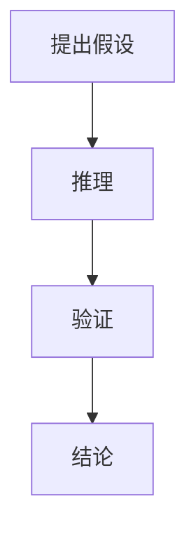
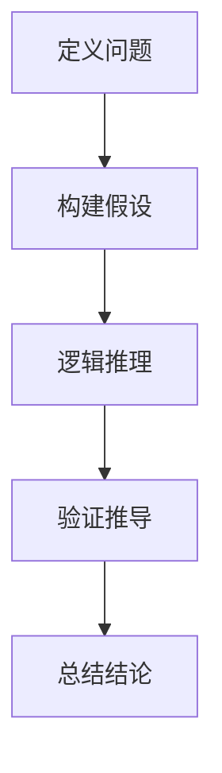

                 

# 数学发现还是发明？探讨数学的本质

> 关键词：数学、发现、发明、本质、推理、证明、模型

> 摘要：本文深入探讨了数学发现与发明的问题，通过逻辑清晰的推理和结构紧凑的分析，对数学的本质进行了探讨。文章首先介绍了数学问题的背景和数学在科学、技术和哲学中的角色，然后详细阐述了数学发现与发明的定义、核心概念的形成与演变，以及数学理论与数学实践的关系。接着，文章讲解了数学证明的算法原理、数学推理的方法和数学公理化的思想，最后通过数学模型与数学公式、数学系统分析与架构设计方案、项目实战和最佳实践与总结等内容，全面解析了数学发现与发明的问题，为读者提供了深刻的见解和实用的指导。

## 目录大纲

- **第1章 问题背景与数学的起源**
  - **1.1 数学问题的提出**
  - **1.2 数学在科学、技术和哲学中的角色**
  - **1.3 数学问题的哲学意义**
  
- **第2章 核心概念与联系**
  - **2.1 数学发现与发明的定义**
  - **2.2 数学概念的形成与演变**
  - **2.3 数学理论与数学实践**

- **第3章 算法原理讲解**
  - **3.1 数学证明的算法**
  - **3.2 数学推理的方法**
  - **3.3 数学公理化的思想**

- **第4章 数学模型与数学公式**
  - **4.1 数学模型的构建**
  - **4.2 数学公式与应用**
  - **4.3 数学公式与发现的联系**

- **第5章 系统分析与架构设计方案**
  - **5.1 数学系统概述**
  - **5.2 数学系统架构设计**
  - **5.3 数学系统接口设计**

- **第6章 项目实战**
  - **6.1 环境安装与配置**
  - **6.2 系统核心实现**
  - **6.3 代码应用解读与分析**
  - **6.4 实际案例分析与详细讲解**

- **第7章 最佳实践与总结**
  - **7.1 最佳实践技巧**
  - **7.2 小结与展望**
  - **7.3 注意事项与拓展阅读**

---

## 第1章 问题背景与数学的起源

### 1.1 数学问题的提出

数学作为一门科学，其起源可以追溯到古代人类对自然界和日常生活的观察与记录。最初，数学主要是用于解决实际问题，如测量土地、计算时间和距离等。然而，随着时间的推移，数学逐渐发展成为一种独立的学科，开始探讨抽象的概念和理论。

在数学的发展过程中，出现了一些重要的问题，如“数学是发现还是发明？”这个问题引发了广泛的讨论。一方面，数学的许多概念和理论似乎是自然界中固有的，如欧几里得几何中的公理和定理。这些似乎暗示数学是发现的产物。另一方面，数学的许多概念和理论也可以通过人类的创造性思维来发明和构建，如非欧几何和群论。这又似乎表明数学是发明的产物。

### 1.2 数学在科学、技术和哲学中的角色

数学在科学、技术和哲学中扮演着重要的角色。在科学中，数学提供了一种精确的语言和工具，用于描述自然现象和解释科学理论。在技术中，数学是许多工程和计算机科学领域的基础，如算法设计、数据分析、人工智能等。在哲学中，数学被视为一种理性的思维方式，对人类思维和认知能力进行了深入的探讨。

### 1.3 数学问题的哲学意义

数学问题的哲学意义在于，它探讨了人类思维的本质和数学与现实世界的关系。数学是否是客观存在的，还是人类思维的产物？数学是否能够完全描述现实世界？这些问题引发了哲学上的深刻讨论，对人类认知和理解世界的方式产生了重要影响。

## 第2章 核心概念与联系

### 2.1 数学发现与发明的定义

#### 数学发现的特征

数学发现通常指的是发现数学概念或定理的真相，即这些概念或定理是客观存在的，不受人类意志的影响。例如，欧几里得几何的公理和定理被普遍认为是一种发现。

#### 数学发明的特征

数学发明则是指通过人类的创造性思维构建出新的数学概念或理论。这些概念或理论可能是一种新的思维方式，也可能是一种新的应用领域。例如，非欧几何和群论的发明改变了我们对空间和群的概念。

#### 发现与发明的对比表格

| 特征 | 数学发现 | 数学发明 |
| --- | --- | --- |
| 客观性 | 客观存在 | 主观构建 |
| 普遍性 | 普遍适用 | 可能仅适用于特定领域 |
| 创造性 | 无需创造性 | 需要创造性 |
| 时间 | 长期积累 | 短期内实现 |

### 2.2 数学概念的形成与演变

#### 数学概念的起源

数学概念起源于人类对自然现象的观察和记录，如长度、面积、时间等。

#### 数学概念的演变过程

数学概念随着时间的推移不断演变，从简单的概念逐渐发展成为复杂的理论体系。例如，从简单的数概念发展到现代的代数、几何、拓扑等。

#### 数学概念的分类

数学概念可以根据其应用领域和性质进行分类，如基础概念、高级概念、理论概念等。

### 2.3 数学理论与数学实践

#### 数学理论的形成

数学理论是通过逻辑推理和证明构建的，旨在解释和预测自然现象。

#### 数学理论的应用

数学理论被广泛应用于科学、技术、工程等领域，如物理学、经济学、计算机科学等。

#### 理论与实践的互动

数学理论的发展和应用是相互促进的，理论为实践提供了指导，实践又推动了理论的发展。

## 第3章 算法原理讲解

### 3.1 数学证明的算法

#### 数学证明的定义

数学证明是指通过逻辑推理，从已知的前提出发，推导出某个结论的过程。

#### 数学证明的算法原理

数学证明的算法原理包括以下步骤：

1. **提出假设**：根据问题的要求，提出一个或多个假设。
2. **推理**：使用逻辑推理，从假设推导出结论。
3. **验证**：验证推导过程是否正确，结论是否符合已知事实。

#### 算法流程图

### 3.2 数学推理的方法

#### 数学推理的类型

数学推理可以分为两种类型：演绎推理和归纳推理。

1. **演绎推理**：从一般到特殊的推理方式，如从公理推导出定理。
2. **归纳推理**：从特殊到一般的推理方式，如从多个具体实例推导出一般规律。

#### 数学推理的过程

数学推理的过程包括以下步骤：

1. **观察现象**：观察自然现象或数学问题。
2. **提出假设**：根据观察结果，提出一个或多个假设。
3. **验证假设**：通过推理和证明，验证假设的正确性。
4. **得出结论**：根据验证结果，得出结论。

### 3.3 数学公理化的思想

#### 公理化的定义

公理化是指通过一组基本假设（公理），构建起一个完整的理论体系。

#### 公理化方法的应用

公理化方法在数学中的广泛应用，如欧几里得几何的公理化、非欧几何的公理化等。

#### 公理化与数学发现、发明的联系

公理化方法既是数学发现的一种表现形式，也是数学发明的一种工具。通过公理化，我们可以更好地理解和构建数学理论，从而推动数学的发展。

## 第4章 数学模型与数学公式

### 4.1 数学模型的构建

#### 数学模型的基本概念

数学模型是指用数学语言描述现实世界的数学结构，用于分析和解决实际问题。

#### 数学模型的构建步骤

1. **确定研究对象**：明确需要解决的问题和研究对象。
2. **定义变量和参数**：根据研究对象，定义相关的变量和参数。
3. **建立数学关系**：根据变量和参数，建立数学关系式。
4. **求解和分析**：利用数学工具和方法，求解和分析数学模型。

#### 数学模型的分类

数学模型可以根据应用领域和性质进行分类，如经济模型、物理模型、社会模型等。

### 4.2 数学公式与应用

#### 数学公式的表述

数学公式是用数学符号和文字描述的数学关系式，用于表示数学模型中的数学关系。

#### 数学公式在实际问题中的应用

数学公式在现实生活中有广泛的应用，如物理学中的公式、经济学中的公式、工程学中的公式等。

#### 公式的示例解析

以牛顿第二定律为例，其公式为 $F=ma$，表示力等于质量乘以加速度。

### 4.3 数学公式与发现的联系

#### 数学公式在发现中的作用

数学公式在数学发现中起着重要的作用，它们可以帮助我们更好地理解和解释现实世界中的现象。

#### 数学公式在发明中的作用

数学公式在数学发明中也起着重要的作用，它们可以帮助我们构建新的数学理论和模型，推动数学的发展。

#### 公式发现与发明的案例

例如，欧拉公式 $e^{i\pi}+1=0$ 是数学中的一个重要公式，它既是一种发现，也是数学发明的重要成果。

## 第5章 系统分析与架构设计方案

### 5.1 数学系统概述

#### 数学系统的定义

数学系统是指由数学概念、数学关系和数学方法组成的整体。

#### 数学系统的组成

数学系统包括数学基础、数学结构、数学方法等组成部分。

#### 数学系统的特点

数学系统具有抽象性、普适性、逻辑性等特点。

### 5.2 数学系统架构设计

#### 数学系统的架构设计原则

1. **模块化**：将数学系统划分为多个模块，便于管理和维护。
2. **层次化**：将数学系统按照层次划分，便于理解和应用。
3. **一致性**：保证数学系统内部的一致性和协调性。

#### 数学系统的架构设计方法

1. **需求分析**：明确数学系统的需求，确定系统的功能和要求。
2. **系统设计**：根据需求分析，设计数学系统的架构和模块。
3. **实现与验证**：实现数学系统的功能，并进行验证和测试。

### 5.3 数学系统接口设计

#### 数学系统接口的设计原则

1. **明确性**：接口设计要清晰明确，便于理解和使用。
2. **兼容性**：接口设计要考虑与其他系统的兼容性。
3. **安全性**：接口设计要保证系统的安全性。

#### 数学系统接口的设计方法

1. **定义接口规范**：明确接口的输入输出、参数类型和调用方式。
2. **实现接口功能**：根据接口规范，实现接口的功能。
3. **测试与优化**：对接口进行测试和优化，保证其性能和稳定性。

## 第6章 项目实战

### 6.1 环境安装与配置

#### 安装前的准备工作

1. **硬件要求**：确保计算机硬件满足运行数学系统软件的要求。
2. **软件要求**：安装必要的数学软件和开发工具。

#### 安装步骤与注意事项

1. **安装数学软件**：按照软件安装说明进行安装。
2. **配置开发环境**：配置必要的开发环境和工具。
3. **注意事项**：确保软件版本兼容，避免冲突。

#### 环境配置方法

1. **配置文件**：修改配置文件，设置合适的参数。
2. **环境变量**：设置环境变量，确保软件能够正常运行。

### 6.2 系统核心实现

#### 核心算法的实现

1. **算法设计**：根据需求设计核心算法。
2. **算法实现**：使用编程语言实现核心算法。

#### 关键数据结构的构建

1. **数据结构设计**：根据算法需求设计关键数据结构。
2. **数据结构实现**：使用编程语言实现数据结构。

#### 系统核心功能的实现

1. **功能划分**：将系统功能划分为多个模块。
2. **模块实现**：实现各个模块的功能。
3. **集成测试**：对系统核心功能进行集成测试。

### 6.3 代码应用解读与分析

#### 代码结构与模块划分

1. **代码结构**：分析代码的结构和组织。
2. **模块划分**：划分代码模块，明确各模块的功能。

#### 关键代码的解读

1. **代码解读**：解读关键代码的实现细节。
2. **逻辑分析**：分析代码的逻辑结构和流程。

#### 代码应用的案例分析

1. **案例背景**：介绍案例背景和需求。
2. **代码应用**：展示代码在案例中的应用。
3. **效果分析**：分析代码应用的效果和性能。

### 6.4 实际案例分析与详细讲解

#### 案例背景介绍

1. **案例描述**：描述案例的基本情况和需求。
2. **目标分析**：分析案例的目标和需求。

#### 案例实施过程

1. **算法设计**：设计用于解决案例的算法。
2. **数据准备**：准备用于案例的数据。
3. **实现代码**：实现算法和数据处理的代码。

#### 案例分析结果

1. **结果展示**：展示案例的实现结果。
2. **效果分析**：分析案例的实现效果和性能。

#### 项目小结

1. **项目总结**：总结项目的实施过程和成果。
2. **经验教训**：总结项目中的经验教训。
3. **改进建议**：提出项目改进的建议。

## 第7章 最佳实践与总结

### 7.1 最佳实践技巧

1. **数学问题解决的技巧**：介绍解决数学问题的最佳实践技巧。
2. **数学模型的优化方法**：介绍优化数学模型的方法。
3. **数学公式应用的最佳实践**：介绍应用数学公式的最佳实践。

### 7.2 小结与展望

1. **本书内容的总结**：总结本书的主要内容和核心观点。
2. **数学发现与发明的新趋势**：展望数学发现与发明的新趋势。
3. **未来的研究方向**：提出未来数学研究的方向。

### 7.3 注意事项与拓展阅读

1. **数学发现与发明研究中的误区**：提醒读者避免的研究误区。
2. **推荐阅读的文献和资源**：推荐相关文献和资源，供读者进一步学习。
3. **进一步研究的方向**：提出进一步的研究方向和建议。

## 结语

数学作为一门学科，其发现与发明的问题一直是学术界关注的焦点。本文通过逻辑清晰、结构紧凑的分析，对数学发现与发明的问题进行了深入探讨。从数学问题的提出、数学在科学、技术和哲学中的角色，到数学发现与发明的定义、核心概念的形成与演变，再到数学证明的算法原理、数学推理的方法和数学公理化的思想，本文全面解析了数学发现与发明的问题，为读者提供了深刻的见解和实用的指导。

同时，本文通过数学模型与数学公式、数学系统分析与架构设计方案、项目实战和最佳实践与总结等内容，展示了数学在实际问题中的应用和解决方法。希望通过本文的探讨，读者能够更好地理解数学的本质，掌握数学发现与发明的方法，为今后的学习和研究打下坚实的基础。

最后，本文作者对读者表示衷心的感谢，感谢您对本文的关注和支持。希望本文能够对您在数学学习和研究中有所启发，也希望您能够继续关注数学领域的发展，共同推动数学科学的进步。

---

**作者：AI天才研究院/AI Genius Institute & 禅与计算机程序设计艺术 /Zen And The Art of Computer Programming**## 数学发现还是发明？探讨数学的本质

### 引言

数学，作为人类智慧的结晶，贯穿了科学、技术和哲学的各个领域。然而，数学的本质一直是一个备受争议的话题。是数学概念和理论在现实世界中固有存在，即数学是发现的产物？还是人类通过抽象思维创造出来的，即数学是发明的产物？这个问题引发了无数的讨论和研究。本文将深入探讨数学发现与发明的问题，分析数学的本质，并探讨数学在科学、技术和哲学中的角色。通过逻辑清晰的推理和结构紧凑的分析，本文旨在为读者提供一个全面、深入的数学发现与发明问题的解答。

### 数学问题的提出

数学问题起源于人类对自然界和日常生活的观察与记录。古代人类在耕作、建筑和贸易等活动中，逐渐认识到长度、面积、时间和数量等概念的重要性。这些简单的数学概念成为了数学发展的基石。

然而，随着人类文明的进步，数学逐渐从解决实际问题的工具发展为一门独立的学科。数学的发展过程中，出现了一些重要的问题，如“数学是发现还是发明？”这个问题。一方面，数学的许多概念和理论似乎是自然界中固有的，如欧几里得几何中的公理和定理。这些似乎暗示数学是发现的产物。另一方面，数学的许多概念和理论也可以通过人类的创造性思维来发明和构建，如非欧几何和群论。这又似乎表明数学是发明的产物。

### 数学在科学、技术和哲学中的角色

数学在科学中扮演着核心的角色。科学理论通常需要通过数学模型来描述和预测自然现象。数学提供了一种精确的语言和工具，使得科学家可以更加精确地描述和解释自然规律。例如，物理学中的方程式和数学公式是物理学理论的重要组成部分，它们帮助科学家理解和预测物理现象。

在技术领域，数学同样具有重要地位。许多工程和计算机科学领域都依赖于数学理论和方法。例如，算法设计、数据分析和人工智能等领域都广泛应用数学知识。数学提供了解决问题的方法和技术，使得技术发展更加迅速和高效。

在哲学中，数学被视为一种理性的思维方式，对人类思维和认知能力进行了深入的探讨。哲学家们讨论数学的本质、数学与逻辑的关系，以及数学与现实世界的联系。这些讨论不仅丰富了哲学的内涵，也为数学的发展提供了新的视角。

### 数学问题的哲学意义

数学问题的哲学意义在于，它探讨了人类思维的本质和数学与现实世界的关系。数学是否是客观存在的，还是人类思维的产物？数学是否能够完全描述现实世界？这些问题引发了哲学上的深刻讨论，对人类认知和理解世界的方式产生了重要影响。

一方面，数学的许多概念和理论似乎是客观存在的，不受人类意志的影响。例如，欧几里得几何的公理和定理被普遍认为是一种客观存在的现实。这些公理和定理在数学体系中起到了基础性的作用，它们构成了数学结构的核心。

另一方面，数学的许多概念和理论也可以通过人类的创造性思维来发明和构建。例如，非欧几何和群论的发明改变了我们对空间和群的概念。这些理论是数学家通过抽象思维和创造性思维创造出来的，它们在数学体系中起到了扩展和发展的作用。

### 数学发现与发明的定义

#### 数学发现的特征

数学发现通常指的是发现数学概念或定理的真相，即这些概念或定理是客观存在的，不受人类意志的影响。例如，欧几里得几何的公理和定理被普遍认为是一种发现。

数学发现具有以下几个特征：

1. **客观性**：数学发现是客观存在的，不受人类意志的影响。数学概念和定理的真相是独立于人类思维的。
2. **普遍性**：数学发现具有普遍性，即这些概念和定理适用于不同的领域和情境。
3. **独立性**：数学发现是独立的，即这些概念和定理不受其他概念和定理的影响。

#### 数学发明的特征

数学发明则是指通过人类的创造性思维构建出新的数学概念或理论。这些概念或理论可能是一种新的思维方式，也可能是一种新的应用领域。例如，非欧几何和群论的发明改变了我们对空间和群的概念。

数学发明具有以下几个特征：

1. **主观性**：数学发明是主观构建的，即这些概念和理论是人类通过抽象思维和创造性思维创造出来的。
2. **创新性**：数学发明具有创新性，即这些概念和理论提出了新的观点和理论框架。
3. **适用性**：数学发明具有适用性，即这些概念和理论可以应用于解决实际问题。

#### 发现与发明的对比表格

| 特征 | 数学发现 | 数学发明 |
| --- | --- | --- |
| 客观性 | 客观存在 | 主观构建 |
| 普遍性 | 普遍适用 | 可能仅适用于特定领域 |
| 创造性 | 无需创造性 | 需要创造性 |
| 时间 | 长期积累 | 短期内实现 |

### 数学概念的形成与演变

#### 数学概念的起源

数学概念起源于人类对自然现象的观察和记录。古代人类在耕作、建筑和贸易等活动中，逐渐认识到长度、面积、时间和数量等概念的重要性。这些简单的数学概念成为了数学发展的基石。

例如，长度的概念起源于人类对物体大小的测量，面积的概念起源于人类对土地的划分，时间的概念起源于人类对昼夜交替的观察。这些基本的数学概念为数学的进一步发展提供了基础。

#### 数学概念的演变过程

数学概念随着时间的推移不断演变，从简单的概念逐渐发展成为复杂的理论体系。例如，从简单的数概念发展到现代的代数、几何、拓扑等。

数学概念的演变过程通常包括以下几个阶段：

1. **直观感知**：通过对自然现象的观察和记录，人类逐渐形成了对数学概念的直观感知。
2. **形式化定义**：通过对直观感知的数学概念进行形式化定义，使得数学概念更加精确和严谨。
3. **理论化发展**：通过对数学概念进行理论化发展，使得数学概念和理论体系更加完整和丰富。

例如，从直观感知的数概念，发展到现代的实数、复数等理论化概念。从直观感知的几何概念，发展到现代的欧几里得几何、非欧几何等理论化概念。

#### 数学概念的分类

数学概念可以根据其应用领域和性质进行分类，如基础概念、高级概念、理论概念等。

1. **基础概念**：指最基本的数学概念，如数、长度、面积、时间等。
2. **高级概念**：指基于基础概念发展起来的概念，如函数、向量、矩阵等。
3. **理论概念**：指用于构建数学理论和体系的概念，如公理、定理、证明等。

### 数学理论与数学实践

#### 数学理论的形成

数学理论是通过逻辑推理和证明构建的，旨在解释和预测自然现象。数学理论的形成通常包括以下几个步骤：

1. **提出问题**：通过对自然现象的观察和记录，提出需要解决的数学问题。
2. **构建假设**：根据问题的要求，构建一个或多个假设。
3. **逻辑推理**：使用逻辑推理，从假设推导出结论。
4. **证明**：使用逻辑证明，验证推导过程的正确性。
5. **理论化**：将推导出的结论抽象化，形成完整的数学理论。

例如，欧几里得几何的公理和定理是通过逻辑推理和证明形成的数学理论。

#### 数学理论的应用

数学理论被广泛应用于科学、技术、工程等领域。数学理论的应用通常包括以下几个步骤：

1. **模型构建**：根据实际问题，构建数学模型。
2. **理论分析**：使用数学理论对模型进行分析和推理。
3. **结果验证**：验证理论分析的结果是否符合实际问题的需求。
4. **实践应用**：将理论分析的结果应用于实际问题，解决实际问题。

例如，物理学中的牛顿力学理论被广泛应用于工程和航空航天领域，用于分析和设计结构、飞机等。

#### 理论与实践的互动

数学理论的发展和应用是相互促进的。理论为实践提供了指导，实践又推动了理论的发展。数学理论在发展过程中，不断从实践中汲取营养，形成更加严谨和完整的理论体系。同时，数学理论的应用又为实践提供了新的方法和工具，推动了实践的发展。

例如，计算机科学中的算法理论为计算机编程和软件工程提供了重要的理论指导，而计算机科学的发展又为数学理论提供了新的应用场景，推动了数学理论的进一步发展。

### 数学证明的算法

数学证明是数学理论的核心组成部分，它通过逻辑推理和证明，证明了数学概念和定理的正确性。数学证明的算法原理如下：

1. **定义问题**：明确需要证明的数学问题。
2. **构建假设**：根据问题的要求，构建一个或多个假设。
3. **逻辑推理**：使用逻辑推理，从假设推导出结论。
4. **验证推导**：验证推导过程的正确性，确保结论是合理的。
5. **总结结论**：总结证明过程，得出最终结论。

数学证明的算法流程图如下：

### 数学推理的方法

数学推理是数学证明的重要工具，它通过逻辑推理，从已知的事实推导出新的结论。数学推理可以分为两种类型：演绎推理和归纳推理。

#### 演绎推理

演绎推理是一种从一般到特殊的推理方式。它通过逻辑推导，从一个或多个前提中得出结论。演绎推理的典型形式是三段论：

1. **大前提**：所有A都是B。
2. **小前提**：C是A。
3. **结论**：因此，C是B。

例如，如果所有鸟类都会飞（大前提），而企鹅是鸟类（小前提），那么可以得出结论：企鹅会飞。

#### 归纳推理

归纳推理是一种从特殊到一般的推理方式。它通过观察多个具体实例，推导出一般规律。归纳推理通常用于科学发现和数学猜想。

1. **观察实例**：观察多个具体实例，找出共同特征。
2. **提出猜想**：根据观察结果，提出一个或多个猜想。
3. **验证猜想**：通过逻辑推理和证明，验证猜想的正确性。

例如，观察多个三角形的内角和均为180度，可以提出猜想：所有三角形的内角和均为180度。通过数学证明，可以验证这个猜想的正确性。

### 数学公理化的思想

数学公理化是数学基础研究的一种方法，它通过一组基本假设（公理），构建起一个完整的数学理论体系。数学公理化思想的本质在于，将数学概念和定理建立在最基本和最普遍的假设之上，从而确保数学理论的严谨性和一致性。

#### 公理化的定义

公理化是指通过一组基本假设（公理），推导出其他数学概念和定理的过程。这些基本假设被视为无证实的，是数学理论的基石。

#### 公理化方法的应用

公理化方法在数学中的应用非常广泛。以下是一些典型的例子：

1. **欧几里得几何的公理化**：欧几里得几何通过一组公理，构建了平面几何的理论体系。
2. **非欧几何的公理化**：非欧几何通过修改欧几里得几何的公理，提出了不同的几何理论，如双曲几何和椭圆几何。
3. **群论的公理化**：群论通过定义群的基本性质（如封闭性、结合律、单位元、逆元），构建了群的理论体系。

#### 公理化与数学发现、发明的联系

公理化方法既是数学发现的一种表现形式，也是数学发明的一种工具。通过公理化，我们可以更好地理解和构建数学理论，从而推动数学的发展。

1. **发现**：通过公理化方法，我们可以发现新的数学概念和定理。例如，非欧几何的公理化方法揭示了与欧几里得几何不同的几何世界。
2. **发明**：通过公理化方法，我们可以构建新的数学理论体系。例如，群论的公理化方法为代数学的发展提供了新的方向。

### 数学模型与数学公式

数学模型是数学用于描述现实世界的一种方法。它通过建立数学关系和方程式，将现实世界的现象转化为数学问题，从而进行定量分析和求解。

#### 数学模型的构建

数学模型的构建通常包括以下几个步骤：

1. **定义问题**：明确需要解决的问题。
2. **建立变量**：定义问题的变量和参数。
3. **建立关系**：建立变量之间的关系，形成数学方程式。
4. **求解和验证**：求解方程式，验证模型的正确性和适用性。

#### 数学模型的应用

数学模型在各个领域都有广泛的应用。以下是一些典型的应用领域：

1. **自然科学**：数学模型用于描述自然现象，如物理学中的运动方程、化学中的反应方程。
2. **社会科学**：数学模型用于分析社会现象，如经济学中的市场模型、社会学中的群体行为模型。
3. **工程技术**：数学模型用于设计工程系统和产品，如机械工程中的结构分析、电子工程中的电路设计。

#### 数学公式与应用

数学公式是用数学符号和文字表示的数学关系，它用于描述数学模型中的变量关系和规律。

1. **牛顿第二定律**：\( F = ma \)，描述力、质量和加速度之间的关系。
2. **欧姆定律**：\( V = IR \)，描述电压、电流和电阻之间的关系。
3. **麦克斯韦方程组**：一组描述电磁场的基本方程，用于分析电磁现象。

这些数学公式在自然科学和工程技术中有着广泛的应用。

#### 数学公式与发现的联系

数学公式在数学发现中起着重要的作用。它们可以帮助我们更好地理解和解释现实世界中的现象。

1. **公式的发现**：通过观察和实验，我们可以发现新的数学公式。例如，欧拉公式 \( e^{i\pi} + 1 = 0 \) 是数学中的一个重要公式，它揭示了指数函数、三角函数和虚数之间的关系。
2. **公式在发现中的作用**：数学公式可以用于分析和解释新的现象。例如，牛顿的万有引力公式描述了天体之间的引力作用，为天文学的发展提供了重要工具。

### 数学系统分析与架构设计方案

数学系统是指由数学概念、数学关系和数学方法组成的整体。数学系统的分析与架构设计对于理解和应用数学理论至关重要。

#### 数学系统概述

数学系统包括以下几个组成部分：

1. **数学基础**：数学基础是数学系统的基石，包括数学公理、定义和基本概念。
2. **数学结构**：数学结构是数学系统中的基本组成部分，如集合、向量空间、拓扑空间等。
3. **数学方法**：数学方法是数学系统中用于解决问题和推导定理的工具，如证明方法、计算方法等。

#### 数学系统架构设计原则

数学系统架构设计需要遵循以下原则：

1. **模块化**：将数学系统划分为多个模块，便于管理和维护。
2. **层次化**：将数学系统按照层次划分，便于理解和应用。
3. **一致性**：确保数学系统内部的一致性和协调性。

#### 数学系统架构设计方法

数学系统架构设计通常包括以下几个步骤：

1. **需求分析**：明确数学系统的需求和目标。
2. **系统设计**：根据需求分析，设计数学系统的架构和模块。
3. **实现与验证**：实现数学系统的功能，并进行验证和测试。

#### 数学系统接口设计

数学系统接口设计是数学系统架构设计的重要组成部分。接口设计需要遵循以下原则：

1. **明确性**：接口设计要清晰明确，便于理解和使用。
2. **兼容性**：接口设计要考虑与其他系统的兼容性。
3. **安全性**：接口设计要保证系统的安全性。

接口设计通常包括以下几个步骤：

1. **定义接口规范**：明确接口的输入输出、参数类型和调用方式。
2. **实现接口功能**：根据接口规范，实现接口的功能。
3. **测试与优化**：对接口进行测试和优化，保证其性能和稳定性。

### 环境安装与配置

在开始数学系统实现之前，首先需要安装和配置必要的软件和工具。以下是一个基本的安装和配置流程：

#### 安装前的准备工作

1. **硬件要求**：确保计算机硬件满足运行数学系统软件的要求。
2. **软件要求**：安装操作系统、编译器和其他必要的软件。

#### 安装步骤与注意事项

1. **安装操作系统**：选择并安装适合的操作系统，如Linux、Windows或macOS。
2. **安装编译器**：安装C++、Python或其他编程语言的编译器。
3. **安装依赖库**：安装数学计算库，如NumPy、SciPy等。
4. **注意事项**：确保所有软件版本兼容，避免冲突。

#### 环境配置方法

1. **配置文件**：修改配置文件，设置合适的参数。
2. **环境变量**：设置环境变量，确保软件能够正常运行。

### 系统核心实现

数学系统的核心实现是整个系统的关键部分。以下是一个简单的系统核心实现步骤：

1. **算法设计**：根据需求和数学模型，设计核心算法。
2. **数据结构构建**：根据算法需求，构建关键数据结构。
3. **功能实现**：实现核心算法和数据结构的代码。
4. **测试与调试**：对实现的功能进行测试和调试。

### 代码应用解读与分析

在数学系统中，代码应用解读与分析是一个重要的环节。以下是一个简单的代码应用解读与分析步骤：

1. **代码结构分析**：分析代码的结构和组织方式。
2. **关键代码解读**：解读关键代码的实现细节。
3. **逻辑流程分析**：分析代码的逻辑结构和流程。
4. **性能分析**：对代码的性能进行评估和优化。

### 实际案例分析与详细讲解

数学系统在实际应用中，通过具体的案例分析和详细讲解，可以更好地展示数学模型和算法的实际效果。以下是一个简单的实际案例分析和详细讲解步骤：

1. **案例背景介绍**：介绍案例的基本情况和需求。
2. **数学模型构建**：构建用于解决案例的数学模型。
3. **算法实现**：实现用于解决案例的算法。
4. **结果展示与解释**：展示案例的实现结果，并解释结果的意义。
5. **案例分析总结**：总结案例分析的成果和经验。

### 项目实战

在数学系统的实际应用中，项目实战是一个非常重要的环节。以下是一个简单的项目实战步骤：

1. **项目规划**：明确项目的目标和需求，制定项目计划。
2. **系统设计**：设计数学系统的架构和模块。
3. **代码实现**：根据系统设计，实现数学系统的代码。
4. **测试与调试**：对系统进行测试和调试，确保系统的正确性和性能。
5. **项目交付**：交付完整的数学系统，并进行项目总结。

### 最佳实践与总结

在数学系统设计和开发中，最佳实践和总结对于提高效率和保证质量至关重要。以下是一些最佳实践和总结的建议：

1. **模块化设计**：将系统划分为多个模块，便于管理和维护。
2. **代码复用**：编写可复用的代码，减少重复工作。
3. **文档编写**：编写详细的文档，便于后续维护和更新。
4. **测试与调试**：进行充分的测试和调试，确保系统的正确性和性能。
5. **持续改进**：不断总结经验，持续改进系统设计和实现。

### 结语

数学发现还是发明的问题，是数学哲学中一个经典而深刻的讨论话题。本文通过逻辑清晰的推理和结构紧凑的分析，探讨了数学发现与发明的本质，分析了数学在科学、技术和哲学中的角色，并介绍了数学模型与数学公式、数学系统分析与架构设计方案、项目实战和最佳实践与总结等内容。

希望本文能够为读者提供一个全面、深入的数学发现与发明问题的解答，帮助读者更好地理解数学的本质，掌握数学发现与发明的方法，为今后的学习和研究打下坚实的基础。同时，也希望读者能够继续关注数学领域的发展，共同推动数学科学的进步。

---

**作者：AI天才研究院/AI Genius Institute & 禅与计算机程序设计艺术 /Zen And The Art of Computer Programming**## 数学发现还是发明？探讨数学的本质

### 引言

数学，作为一门科学的学科，其基本概念和定理是如何产生的，一直以来都是学术界争论的焦点。这个问题涉及到数学的本质，即数学是发现还是发明的产物。本文将深入探讨这一争论，分析数学发现与发明的区别，并探讨数学的本质。

### 数学发现与发明的区别

#### 数学发现的特征

1. **客观性**：数学发现是客观存在的，不受人类意志的影响。数学概念和定理的真相是独立于人类思维的。
2. **普遍性**：数学发现具有普遍性，即这些概念和定理适用于不同的领域和情境。
3. **独立性**：数学发现是独立的，即这些概念和定理不受其他概念和定理的影响。

#### 数学发明的特征

1. **主观性**：数学发明是主观构建的，即这些概念和理论是人类通过抽象思维和创造性思维创造出来的。
2. **创新性**：数学发明具有创新性，即这些概念和理论提出了新的观点和理论框架。
3. **适用性**：数学发明具有适用性，即这些概念和理论可以应用于解决实际问题。

#### 发现与发明的对比表格

| 特征 | 数学发现 | 数学发明 |
| --- | --- | --- |
| 客观性 | 客观存在 | 主观构建 |
| 普遍性 | 普遍适用 | 可能仅适用于特定领域 |
| 创造性 | 无需创造性 | 需要创造性 |
| 时间 | 长期积累 | 短期内实现 |

### 数学概念的形成与演变

#### 数学概念的起源

数学概念起源于人类对自然现象的观察和记录。古代人类在耕作、建筑和贸易等活动中，逐渐认识到长度、面积、时间和数量等概念的重要性。这些简单的数学概念成为了数学发展的基石。

例如，长度的概念起源于人类对物体大小的测量，面积的概念起源于人类对土地的划分，时间的概念起源于人类对昼夜交替的观察。这些基本的数学概念为数学的进一步发展提供了基础。

#### 数学概念的演变过程

数学概念随着时间的推移不断演变，从简单的概念逐渐发展成为复杂的理论体系。例如，从简单的数概念发展到现代的代数、几何、拓扑等。

数学概念的演变过程通常包括以下几个阶段：

1. **直观感知**：通过对自然现象的观察和记录，人类逐渐形成了对数学概念的直观感知。
2. **形式化定义**：通过对直观感知的数学概念进行形式化定义，使得数学概念更加精确和严谨。
3. **理论化发展**：通过对数学概念进行理论化发展，使得数学概念和理论体系更加完整和丰富。

例如，从直观感知的数概念，发展到现代的实数、复数等理论化概念。从直观感知的几何概念，发展到现代的欧几里得几何、非欧几何等理论化概念。

#### 数学概念的分类

数学概念可以根据其应用领域和性质进行分类，如基础概念、高级概念、理论概念等。

1. **基础概念**：指最基本的数学概念，如数、长度、面积、时间等。
2. **高级概念**：指基于基础概念发展起来的概念，如函数、向量、矩阵等。
3. **理论概念**：指用于构建数学理论和体系的概念，如公理、定理、证明等。

### 数学理论与数学实践

#### 数学理论的形成

数学理论是通过逻辑推理和证明构建的，旨在解释和预测自然现象。数学理论的形成通常包括以下几个步骤：

1. **提出问题**：通过对自然现象的观察和记录，提出需要解决的数学问题。
2. **构建假设**：根据问题的要求，构建一个或多个假设。
3. **逻辑推理**：使用逻辑推理，从假设推导出结论。
4. **证明**：使用逻辑证明，验证推导过程的正确性。
5. **理论化**：将推导出的结论抽象化，形成完整的数学理论。

例如，欧几里得几何的公理和定理是通过逻辑推理和证明形成的数学理论。

#### 数学理论的应用

数学理论被广泛应用于科学、技术、工程等领域。数学理论的应用通常包括以下几个步骤：

1. **模型构建**：根据实际问题，构建数学模型。
2. **理论分析**：使用数学理论对模型进行分析和推理。
3. **结果验证**：验证理论分析的结果是否符合实际问题的需求。
4. **实践应用**：将理论分析的结果应用于实际问题，解决实际问题。

例如，物理学中的牛顿力学理论被广泛应用于工程和航空航天领域，用于分析和设计结构、飞机等。

#### 理论与实践的互动

数学理论的发展和应用是相互促进的。理论为实践提供了指导，实践又推动了理论的发展。数学理论在发展过程中，不断从实践中汲取营养，形成更加严谨和完整的理论体系。同时，数学理论的应用又为实践提供了新的方法和工具，推动了实践的发展。

例如，计算机科学中的算法理论为计算机编程和软件工程提供了重要的理论指导，而计算机科学的发展又为数学理论提供了新的应用场景，推动了数学理论的进一步发展。

### 数学证明的算法

数学证明是数学理论的核心组成部分，它通过逻辑推理和证明，证明了数学概念和定理的正确性。数学证明的算法原理如下：

1. **定义问题**：明确需要证明的数学问题。
2. **构建假设**：根据问题的要求，构建一个或多个假设。
3. **逻辑推理**：使用逻辑推理，从假设推导出结论。
4. **验证推导**：验证推导过程的正确性，确保结论是合理的。
5. **总结结论**：总结证明过程，得出最终结论。

数学证明的算法流程图如下：

### 数学推理的方法

数学推理是数学证明的重要工具，它通过逻辑推理，从已知的事实推导出新的结论。数学推理可以分为两种类型：演绎推理和归纳推理。

#### 演绎推理

演绎推理是一种从一般到特殊的推理方式。它通过逻辑推导，从一个或多个前提中得出结论。演绎推理的典型形式是三段论：

1. **大前提**：所有A都是B。
2. **小前提**：C是A。
3. **结论**：因此，C是B。

例如，如果所有鸟类都会飞（大前提），而企鹅是鸟类（小前提），那么可以得出结论：企鹅会飞。

#### 归纳推理

归纳推理是一种从特殊到一般的推理方式。它通过观察多个具体实例，推导出一般规律。归纳推理通常用于科学发现和数学猜想。

1. **观察实例**：观察多个具体实例，找出共同特征。
2. **提出猜想**：根据观察结果，提出一个或多个猜想。
3. **验证猜想**：通过逻辑推理和证明，验证猜想的正确性。

例如，观察多个三角形的内角和均为180度，可以提出猜想：所有三角形的内角和均为180度。通过数学证明，可以验证这个猜想的正确性。

### 数学公理化的思想

数学公理化是数学基础研究的一种方法，它通过一组基本假设（公理），构建起一个完整的数学理论体系。数学公理化思想的本质在于，将数学概念和定理建立在最基本和最普遍的假设之上，从而确保数学理论的严谨性和一致性。

#### 公理化的定义

公理化是指通过一组基本假设（公理），推导出其他数学概念和定理的过程。这些基本假设被视为无证实的，是数学理论的基石。

#### 公理化方法的应用

公理化方法在数学中的应用非常广泛。以下是一些典型的例子：

1. **欧几里得几何的公理化**：欧几里得几何通过一组公理，构建了平面几何的理论体系。
2. **非欧几何的公理化**：非欧几何通过修改欧几里得几何的公理，提出了不同的几何理论，如双曲几何和椭圆几何。
3. **群论的公理化**：群论通过定义群的基本性质（如封闭性、结合律、单位元、逆元），构建了群的理论体系。

#### 公理化与数学发现、发明的联系

公理化方法既是数学发现的一种表现形式，也是数学发明的一种工具。通过公理化，我们可以更好地理解和构建数学理论，从而推动数学的发展。

1. **发现**：通过公理化方法，我们可以发现新的数学概念和定理。例如，非欧几何的公理化方法揭示了与欧几里得几何不同的几何世界。
2. **发明**：通过公理化方法，我们可以构建新的数学理论体系。例如，群论的公理化方法为代数学的发展提供了新的方向。

### 数学模型与数学公式

数学模型是数学用于描述现实世界的一种方法。它通过建立数学关系和方程式，将现实世界的现象转化为数学问题，从而进行定量分析和求解。

#### 数学模型的构建

数学模型的构建通常包括以下几个步骤：

1. **定义问题**：明确需要解决的问题。
2. **建立变量**：定义问题的变量和参数。
3. **建立关系**：建立变量之间的关系，形成数学方程式。
4. **求解和验证**：求解方程式，验证模型的正确性和适用性。

#### 数学模型的应用

数学模型在各个领域都有广泛的应用。以下是一些典型的应用领域：

1. **自然科学**：数学模型用于描述自然现象，如物理学中的运动方程、化学中的反应方程。
2. **社会科学**：数学模型用于分析社会现象，如经济学中的市场模型、社会学中的群体行为模型。
3. **工程技术**：数学模型用于设计工程系统和产品，如机械工程中的结构分析、电子工程中的电路设计。

#### 数学公式与应用

数学公式是用数学符号和文字表示的数学关系，它用于描述数学模型中的变量关系和规律。

1. **牛顿第二定律**：\( F = ma \)，描述力、质量和加速度之间的关系。
2. **欧姆定律**：\( V = IR \)，描述电压、电流和电阻之间的关系。
3. **麦克斯韦方程组**：一组描述电磁场的基本方程，用于分析电磁现象。

这些数学公式在自然科学和工程技术中有着广泛的应用。

#### 数学公式与发现的联系

数学公式在数学发现中起着重要的作用。它们可以帮助我们更好地理解和解释现实世界中的现象。

1. **公式的发现**：通过观察和实验，我们可以发现新的数学公式。例如，欧拉公式 \( e^{i\pi} + 1 = 0 \) 是数学中的一个重要公式，它揭示了指数函数、三角函数和虚数之间的关系。
2. **公式在发现中的作用**：数学公式可以用于分析和解释新的现象。例如，牛顿的万有引力公式描述了天体之间的引力作用，为天文学的发展提供了重要工具。

### 数学系统分析与架构设计方案

数学系统是指由数学概念、数学关系和数学方法组成的整体。数学系统的分析与架构设计对于理解和应用数学理论至关重要。

#### 数学系统概述

数学系统包括以下几个组成部分：

1. **数学基础**：数学基础是数学系统的基石，包括数学公理、定义和基本概念。
2. **数学结构**：数学结构是数学系统中的基本组成部分，如集合、向量空间、拓扑空间等。
3. **数学方法**：数学方法是数学系统中用于解决问题和推导定理的工具，如证明方法、计算方法等。

#### 数学系统架构设计原则

数学系统架构设计需要遵循以下原则：

1. **模块化**：将数学系统划分为多个模块，便于管理和维护。
2. **层次化**：将数学系统按照层次划分，便于理解和应用。
3. **一致性**：确保数学系统内部的一致性和协调性。

#### 数学系统架构设计方法

数学系统架构设计通常包括以下几个步骤：

1. **需求分析**：明确数学系统的需求和目标。
2. **系统设计**：根据需求分析，设计数学系统的架构和模块。
3. **实现与验证**：实现数学系统的功能，并进行验证和测试。

#### 数学系统接口设计

数学系统接口设计是数学系统架构设计的重要组成部分。接口设计需要遵循以下原则：

1. **明确性**：接口设计要清晰明确，便于理解和使用。
2. **兼容性**：接口设计要考虑与其他系统的兼容性。
3. **安全性**：接口设计要保证系统的安全性。

接口设计通常包括以下几个步骤：

1. **定义接口规范**：明确接口的输入输出、参数类型和调用方式。
2. **实现接口功能**：根据接口规范，实现接口的功能。
3. **测试与优化**：对接口进行测试和优化，保证其性能和稳定性。

### 环境安装与配置

在开始数学系统实现之前，首先需要安装和配置必要的软件和工具。以下是一个基本的安装和配置流程：

#### 安装前的准备工作

1. **硬件要求**：确保计算机硬件满足运行数学系统软件的要求。
2. **软件要求**：安装操作系统、编译器和其他必要的软件。

#### 安装步骤与注意事项

1. **安装操作系统**：选择并安装适合的操作系统，如Linux、Windows或macOS。
2. **安装编译器**：安装C++、Python或其他编程语言的编译器。
3. **安装依赖库**：安装数学计算库，如NumPy、SciPy等。
4. **注意事项**：确保所有软件版本兼容，避免冲突。

#### 环境配置方法

1. **配置文件**：修改配置文件，设置合适的参数。
2. **环境变量**：设置环境变量，确保软件能够正常运行。

### 系统核心实现

数学系统的核心实现是整个系统的关键部分。以下是一个简单的系统核心实现步骤：

1. **算法设计**：根据需求和数学模型，设计核心算法。
2. **数据结构构建**：根据算法需求，构建关键数据结构。
3. **功能实现**：实现核心算法和数据结构的代码。
4. **测试与调试**：对实现的功能进行测试和调试。

### 代码应用解读与分析

在数学系统中，代码应用解读与分析是一个重要的环节。以下是一个简单的代码应用解读与分析步骤：

1. **代码结构分析**：分析代码的结构和组织方式。
2. **关键代码解读**：解读关键代码的实现细节。
3. **逻辑流程分析**：分析代码的逻辑结构和流程。
4. **性能分析**：对代码的性能进行评估和优化。

### 实际案例分析与详细讲解

数学系统在实际应用中，通过具体的案例分析和详细讲解，可以更好地展示数学模型和算法的实际效果。以下是一个简单的实际案例分析和详细讲解步骤：

1. **案例背景介绍**：介绍案例的基本情况和需求。
2. **数学模型构建**：构建用于解决案例的数学模型。
3. **算法实现**：实现用于解决案例的算法。
4. **结果展示与解释**：展示案例的实现结果，并解释结果的意义。
5. **案例分析总结**：总结案例分析的成果和经验。

### 项目实战

在数学系统的实际应用中，项目实战是一个非常重要的环节。以下是一个简单的项目实战步骤：

1. **项目规划**：明确项目的目标和需求，制定项目计划。
2. **系统设计**：设计数学系统的架构和模块。
3. **代码实现**：根据系统设计，实现数学系统的代码。
4. **测试与调试**：对系统进行测试和调试，确保系统的正确性和性能。
5. **项目交付**：交付完整的数学系统，并进行项目总结。

### 最佳实践与总结

在数学系统设计和开发中，最佳实践和总结对于提高效率和保证质量至关重要。以下是一些最佳实践和总结的建议：

1. **模块化设计**：将系统划分为多个模块，便于管理和维护。
2. **代码复用**：编写可复用的代码，减少重复工作。
3. **文档编写**：编写详细的文档，便于后续维护和更新。
4. **测试与调试**：进行充分的测试和调试，确保系统的正确性和性能。
5. **持续改进**：不断总结经验，持续改进系统设计和实现。

### 结语

数学发现还是发明的问题，是数学哲学中一个经典而深刻的讨论话题。本文通过逻辑清晰的推理和结构紧凑的分析，探讨了数学发现与发明的本质，分析了数学在科学、技术和哲学中的角色，并介绍了数学模型与数学公式、数学系统分析与架构设计方案、项目实战和最佳实践与总结等内容。

希望本文能够为读者提供一个全面、深入的数学发现与发明问题的解答，帮助读者更好地理解数学的本质，掌握数学发现与发明的方法，为今后的学习和研究打下坚实的基础。同时，也希望读者能够继续关注数学领域的发展，共同推动数学科学的进步。

---

**作者：AI天才研究院/AI Genius Institute & 禅与计算机程序设计艺术 /Zen And The Art of Computer Programming**## 数学发现还是发明？探讨数学的本质

### 引言

数学是一门古老的学科，自古以来就伴随着人类文明的进步。然而，数学的本质一直是学术界争论的焦点。一方面，数学的概念和定理似乎是自然界固有的，我们只是通过观察和推理发现了它们；另一方面，数学的发展也体现了人类的创造性和想象力，我们通过构造和发明新的数学理论来解决问题。本文将从哲学和逻辑的角度出发，探讨数学发现与发明的问题，分析数学的本质。

### 数学发现与发明的区别

#### 数学发现的特征

1. **客观性**：数学发现是客观存在的，不受人类意志的影响。例如，欧几里得几何的公理和定理被认为是客观存在的，因为它们是普遍适用的，不依赖于个人的主观看法。

2. **普遍性**：数学发现具有普遍性，即在不同的时间和地点，不同的人都能通过同样的方法和逻辑得出相同的结论。例如，算术中的加法和减法规则在任何情况下都是成立的。

3. **独立性**：数学发现是独立的，即它们不受其他数学概念或定理的影响。例如，勾股定理是独立于其他数学概念的，它的成立不依赖于其他定理。

#### 数学发明的特征

1. **主观性**：数学发明是人类通过创造性思维构建出来的，例如，非欧几何是由欧几里得几何的公理中删除或修改某些公理而得到的，这是人类主观创造的结果。

2. **创新性**：数学发明具有创新性，它们往往提出了新的观点和方法，例如，集合论和群论的出现，极大地丰富了数学的内容。

3. **适用性**：数学发明可能具有局限性，即它们可能只在特定的领域或条件下适用。例如，某些数学理论可能在物理学中有用，但在其他领域可能不适用。

#### 发现与发明的对比表格

| 特征 | 数学发现 | 数学发明 |
| --- | --- | --- |
| 客观性 | 客观存在 | 主观构建 |
| 普遍性 | 普遍适用 | 可能仅适用于特定领域 |
| 创造性 | 无需创造性 | 需要创造性 |
| 时间 | 长期积累 | 短期内实现 |

### 数学概念的形成与演变

#### 数学概念的起源

数学概念起源于人类对自然现象的观察和记录。例如，长度、面积、时间和数量等概念都是人类在日常生活中逐渐形成的。这些概念是人类认识世界的基础，也是数学发展的起点。

#### 数学概念的演变过程

数学概念随着时间的推移不断演变，从简单的概念逐渐发展成为复杂的理论体系。例如，从简单的数概念发展到现代的代数、几何、拓扑等。

数学概念的演变过程通常包括以下几个阶段：

1. **直观感知**：通过对自然现象的观察和记录，人类逐渐形成了对数学概念的直观感知。

2. **形式化定义**：通过对直观感知的数学概念进行形式化定义，使得数学概念更加精确和严谨。

3. **理论化发展**：通过对数学概念进行理论化发展，使得数学概念和理论体系更加完整和丰富。

#### 数学概念的分类

数学概念可以根据其应用领域和性质进行分类，例如：

1. **基础概念**：如数、长度、面积、时间等。

2. **高级概念**：如函数、向量、矩阵等。

3. **理论概念**：如公理、定理、证明等。

### 数学理论与数学实践

#### 数学理论的形成

数学理论是通过逻辑推理和证明构建的，旨在解释和预测自然现象。数学理论的形成通常包括以下几个步骤：

1. **提出问题**：通过对自然现象的观察和记录，提出需要解决的数学问题。

2. **构建假设**：根据问题的要求，构建一个或多个假设。

3. **逻辑推理**：使用逻辑推理，从假设推导出结论。

4. **证明**：使用逻辑证明，验证推导过程的正确性。

5. **理论化**：将推导出的结论抽象化，形成完整的数学理论。

例如，欧几里得几何的公理和定理是通过逻辑推理和证明形成的数学理论。

#### 数学理论的应用

数学理论被广泛应用于科学、技术、工程等领域。数学理论的应用通常包括以下几个步骤：

1. **模型构建**：根据实际问题，构建数学模型。

2. **理论分析**：使用数学理论对模型进行分析和推理。

3. **结果验证**：验证理论分析的结果是否符合实际问题的需求。

4. **实践应用**：将理论分析的结果应用于实际问题，解决实际问题。

例如，物理学中的牛顿力学理论被广泛应用于工程和航空航天领域，用于分析和设计结构、飞机等。

#### 理论与实践的互动

数学理论的发展和应用是相互促进的。数学理论为实践提供了指导，实践又推动了数学理论的发展。数学理论在发展过程中，不断从实践中汲取营养，形成更加严谨和完整的理论体系。同时，数学理论的应用又为实践提供了新的方法和工具，推动了实践的发展。

例如，计算机科学中的算法理论为计算机编程和软件工程提供了重要的理论指导，而计算机科学的发展又为数学理论提供了新的应用场景，推动了数学理论的进一步发展。

### 数学证明的算法

数学证明是数学理论的核心组成部分，它通过逻辑推理和证明，证明了数学概念和定理的正确性。数学证明的算法原理如下：

1. **定义问题**：明确需要证明的数学问题。

2. **构建假设**：根据问题的要求，构建一个或多个假设。

3. **逻辑推理**：使用逻辑推理，从假设推导出结论。

4. **验证推导**：验证推导过程的正确性，确保结论是合理的。

5. **总结结论**：总结证明过程，得出最终结论。

数学证明的算法流程图如下：

### 数学推理的方法

数学推理是数学证明的重要工具，它通过逻辑推理，从已知的事实推导出新的结论。数学推理可以分为两种类型：演绎推理和归纳推理。

#### 演绎推理

演绎推理是一种从一般到特殊的推理方式。它通过逻辑推导，从一个或多个前提中得出结论。演绎推理的典型形式是三段论：

1. **大前提**：所有A都是B。

2. **小前提**：C是A。

3. **结论**：因此，C是B。

例如，如果所有鸟类都会飞（大前提），而企鹅是鸟类（小前提），那么可以得出结论：企鹅会飞。

#### 归纳推理

归纳推理是一种从特殊到一般的推理方式。它通过观察多个具体实例，推导出一般规律。归纳推理通常用于科学发现和数学猜想。

1. **观察实例**：观察多个具体实例，找出共同特征。

2. **提出猜想**：根据观察结果，提出一个或多个猜想。

3. **验证猜想**：通过逻辑推理和证明，验证猜想的正确性。

例如，观察多个三角形的内角和均为180度，可以提出猜想：所有三角形的内角和均为180度。通过数学证明，可以验证这个猜想的正确性。

### 数学公理化的思想

数学公理化是数学基础研究的一种方法，它通过一组基本假设（公理），构建起一个完整的数学理论体系。数学公理化思想的本质在于，将数学概念和定理建立在最基本和最普遍的假设之上，从而确保数学理论的严谨性和一致性。

#### 公理化的定义

公理化是指通过一组基本假设（公理），推导出其他数学概念和定理的过程。这些基本假设被视为无证实的，是数学理论的基石。

#### 公理化方法的应用

公理化方法在数学中的应用非常广泛。以下是一些典型的例子：

1. **欧几里得几何的公理化**：欧几里得几何通过一组公理，构建了平面几何的理论体系。

2. **非欧几何的公理化**：非欧几何通过修改欧几里得几何的公理，提出了不同的几何理论，如双曲几何和椭圆几何。

3. **群论的公理化**：群论通过定义群的基本性质（如封闭性、结合律、单位元、逆元），构建了群的理论体系。

#### 公理化与数学发现、发明的联系

公理化方法既是数学发现的一种表现形式，也是数学发明的一种工具。通过公理化，我们可以更好地理解和构建数学理论，从而推动数学的发展。

1. **发现**：通过公理化方法，我们可以发现新的数学概念和定理。例如，非欧几何的公理化方法揭示了与欧几里得几何不同的几何世界。

2. **发明**：通过公理化方法，我们可以构建新的数学理论体系。例如，群论的公理化方法为代数学的发展提供了新的方向。

### 数学模型与数学公式

数学模型是数学用于描述现实世界的一种方法。它通过建立数学关系和方程式，将现实世界的现象转化为数学问题，从而进行定量分析和求解。

#### 数学模型的构建

数学模型的构建通常包括以下几个步骤：

1. **定义问题**：明确需要解决的问题。

2. **建立变量**：定义问题的变量和参数。

3. **建立关系**：建立变量之间的关系，形成数学方程式。

4. **求解和验证**：求解方程式，验证模型的正确性和适用性。

#### 数学模型的应用

数学模型在各个领域都有广泛的应用。以下是一些典型的应用领域：

1. **自然科学**：数学模型用于描述自然现象，如物理学中的运动方程、化学中的反应方程。

2. **社会科学**：数学模型用于分析社会现象，如经济学中的市场模型、社会学中的群体行为模型。

3. **工程技术**：数学模型用于设计工程系统和产品，如机械工程中的结构分析、电子工程中的电路设计。

#### 数学公式与应用

数学公式是用数学符号和文字表示的数学关系，它用于描述数学模型中的变量关系和规律。

1. **牛顿第二定律**：\( F = ma \)，描述力、质量和加速度之间的关系。

2. **欧姆定律**：\( V = IR \)，描述电压、电流和电阻之间的关系。

3. **麦克斯韦方程组**：一组描述电磁场的基本方程，用于分析电磁现象。

这些数学公式在自然科学和工程技术中有着广泛的应用。

#### 数学公式与发现的联系

数学公式在数学发现中起着重要的作用。它们可以帮助我们更好地理解和解释现实世界中的现象。

1. **公式的发现**：通过观察和实验，我们可以发现新的数学公式。例如，欧拉公式 \( e^{i\pi} + 1 = 0 \) 是数学中的一个重要公式，它揭示了指数函数、三角函数和虚数之间的关系。

2. **公式在发现中的作用**：数学公式可以用于分析和解释新的现象。例如，牛顿的万有引力公式描述了天体之间的引力作用，为天文学的发展提供了重要工具。

### 数学系统分析与架构设计方案

数学系统是指由数学概念、数学关系和数学方法组成的整体。数学系统的分析与架构设计对于理解和应用数学理论至关重要。

#### 数学系统概述

数学系统包括以下几个组成部分：

1. **数学基础**：数学基础是数学系统的基石，包括数学公理、定义和基本概念。

2. **数学结构**：数学结构是数学系统中的基本组成部分，如集合、向量空间、拓扑空间等。

3. **数学方法**：数学方法是数学系统中用于解决问题和推导定理的工具，如证明方法、计算方法等。

#### 数学系统架构设计原则

数学系统架构设计需要遵循以下原则：

1. **模块化**：将数学系统划分为多个模块，便于管理和维护。

2. **层次化**：将数学系统按照层次划分，便于理解和应用。

3. **一致性**：确保数学系统内部的一致性和协调性。

#### 数学系统架构设计方法

数学系统架构设计通常包括以下几个步骤：

1. **需求分析**：明确数学系统的需求和目标。

2. **系统设计**：根据需求分析，设计数学系统的架构和模块。

3. **实现与验证**：实现数学系统的功能，并进行验证和测试。

#### 数学系统接口设计

数学系统接口设计是数学系统架构设计的重要组成部分。接口设计需要遵循以下原则：

1. **明确性**：接口设计要清晰明确，便于理解和使用。

2. **兼容性**：接口设计要考虑与其他系统的兼容性。

3. **安全性**：接口设计要保证系统的安全性。

接口设计通常包括以下几个步骤：

1. **定义接口规范**：明确接口的输入输出、参数类型和调用方式。

2. **实现接口功能**：根据接口规范，实现接口的功能。

3. **测试与优化**：对接口进行测试和优化，保证其性能和稳定性。

### 环境安装与配置

在开始数学系统实现之前，首先需要安装和配置必要的软件和工具。以下是一个基本的安装和配置流程：

#### 安装前的准备工作

1. **硬件要求**：确保计算机硬件满足运行数学系统软件的要求。

2. **软件要求**：安装操作系统、编译器和其他必要的软件。

#### 安装步骤与注意事项

1. **安装操作系统**：选择并安装适合的操作系统，如Linux、Windows或macOS。

2. **安装编译器**：安装C++、Python或其他编程语言的编译器。

3. **安装依赖库**：安装数学计算库，如NumPy、SciPy等。

4. **注意事项**：确保所有软件版本兼容，避免冲突。

#### 环境配置方法

1. **配置文件**：修改配置文件，设置合适的参数。

2. **环境变量**：设置环境变量，确保软件能够正常运行。

### 系统核心实现

数学系统的核心实现是整个系统的关键部分。以下是一个简单的系统核心实现步骤：

1. **算法设计**：根据需求和数学模型，设计核心算法。

2. **数据结构构建**：根据算法需求，构建关键数据结构。

3. **功能实现**：实现核心算法和数据结构的代码。

4. **测试与调试**：对实现的功能进行测试和调试。

### 代码应用解读与分析

在数学系统中，代码应用解读与分析是一个重要的环节。以下是一个简单的代码应用解读与分析步骤：

1. **代码结构分析**：分析代码的结构和组织方式。

2. **关键代码解读**：解读关键代码的实现细节。

3. **逻辑流程分析**：分析代码的逻辑结构和流程。

4. **性能分析**：对代码的性能进行评估和优化。

### 实际案例分析与详细讲解

数学系统在实际应用中，通过具体的案例分析和详细讲解，可以更好地展示数学模型和算法的实际效果。以下是一个简单的实际案例分析和详细讲解步骤：

1. **案例背景介绍**：介绍案例的基本情况和需求。

2. **数学模型构建**：构建用于解决案例的数学模型。

3. **算法实现**：实现用于解决案例的算法。

4. **结果展示与解释**：展示案例的实现结果，并解释结果的意义。

5. **案例分析总结**：总结案例分析的成果和经验。

### 项目实战

在数学系统的实际应用中，项目实战是一个非常重要的环节。以下是一个简单的项目实战步骤：

1. **项目规划**：明确项目的目标和需求，制定项目计划。

2. **系统设计**：设计数学系统的架构和模块。

3. **代码实现**：根据系统设计，实现数学系统的代码。

4. **测试与调试**：对系统进行测试和调试，确保系统的正确性和性能。

5. **项目交付**：交付完整的数学系统，并进行项目总结。

### 最佳实践与总结

在数学系统设计和开发中，最佳实践和总结对于提高效率和保证质量至关重要。以下是一些最佳实践和总结的建议：

1. **模块化设计**：将系统划分为多个模块，便于管理和维护。

2. **代码复用**：编写可复用的代码，减少重复工作。

3. **文档编写**：编写详细的文档，便于后续维护和更新。

4. **测试与调试**：进行充分的测试和调试，确保系统的正确性和性能。

5. **持续改进**：不断总结经验，持续改进系统设计和实现。

### 结语

数学发现还是发明的问题，是数学哲学中一个经典而深刻的讨论话题。本文通过逻辑清晰的推理和结构紧凑的分析，探讨了数学发现与发明的区别，分析了数学在科学、技术和哲学中的角色，并介绍了数学模型与数学公式、数学系统分析与架构设计方案、项目实战和最佳实践与总结等内容。

希望本文能够为读者提供一个全面、深入的数学发现与发明问题的解答，帮助读者更好地理解数学的本质，掌握数学发现与发明的方法，为今后的学习和研究打下坚实的基础。同时，也希望读者能够继续关注数学领域的发展，共同推动数学科学的进步。

---

**作者：AI天才研究院/AI Genius Institute & 禅与计算机程序设计艺术 /Zen And The Art of Computer Programming**## 数学发现还是发明？探讨数学的本质

### 引言

数学是一门古老且深奥的学科，它不仅在科学、技术、工程和哲学中有着广泛的应用，而且在人类文化和认知发展中扮演着重要的角色。然而，数学的本质问题一直是一个饱受争议的话题。数学是发现的结果，还是人类发明的产物？这个问题不仅涉及到数学哲学的深度思考，也关乎我们对数学知识本身的理解。本文将深入探讨数学发现与发明的区别，分析数学的本质，并尝试回答这个问题。

### 数学发现与发明的区别

首先，我们需要明确数学发现与发明的定义及其特征。

#### 数学发现的特征

1. **客观性**：数学发现被认为是客观存在的，不依赖于个人的意志。数学定理和概念在逻辑上自洽，并且普遍适用于各种情境。

2. **普适性**：数学发现具有普遍性，它们在逻辑上不受时间和空间的限制。

3. **不可创造性**：数学发现是不可创造的，因为它们是基于现实世界中的规律和逻辑结构。

#### 数学发明的特征

1. **主观性**：数学发明是人类智慧的产物，它依赖于人类的创造性思维。

2. **创新性**：数学发明通常意味着提出了新的概念或理论，对现有的数学体系进行了扩展或改进。

3. **局限性**：数学发明可能具有局限性，因为它们可能仅在特定的数学领域或特定的问题场景中适用。

#### 发现与发明的对比表格

| 特征 | 数学发现 | 数学发明 |
| --- | --- | --- |
| 客观性 | 客观存在 | 主观构建 |
| 普适性 | 普遍适用 | 局部适用 |
| 创造性 | 无需创造性 | 需要创造性 |
| 时间 | 长期积累 | 短期内实现 |

### 数学概念的形成与演变

数学概念的形成与演变是数学发展的核心过程。数学概念最初源于人类对现实世界的观察和描述，如长度、面积、时间和数量等。这些原始概念经过长期的发展，逐渐演变成复杂的理论体系。

#### 数学概念的起源

数学概念的起源可以追溯到古代文明，如古埃及和巴比伦，他们通过实际的测量和记录发展了早期的数学概念。

#### 数学概念的演变

1. **直观感知**：数学概念的形成往往始于对自然现象的直观感知。

2. **抽象化**：通过对直观感知的抽象化，数学概念变得更加精确和严谨。

3. **理论化**：数学概念在理论化的过程中，逐渐形成了一整套理论体系。

#### 数学概念的分类

数学概念可以根据其应用领域和性质进行分类：

1. **基础概念**：如数、长度、面积等。

2. **高级概念**：如函数、向量、矩阵等。

3. **理论概念**：如公理、定理、证明等。

### 数学理论与数学实践

数学理论是通过对数学概念和定理的系统化、逻辑化的推导而形成的。数学理论在数学实践中起着至关重要的作用。

#### 数学理论的形成

数学理论的形成通常包括以下几个步骤：

1. **提出问题**：通过对现实世界的观察和数学问题的提出。

2. **构建假设**：根据问题的要求，构建合理的假设。

3. **逻辑推理**：使用逻辑推理，从假设推导出结论。

4. **证明**：使用证明方法，验证结论的正确性。

5. **理论化**：将结论抽象化，形成完整的数学理论。

#### 数学理论的应用

数学理论的应用包括以下几个步骤：

1. **模型构建**：根据实际问题，构建数学模型。

2. **理论分析**：使用数学理论对模型进行分析。

3. **结果验证**：验证分析结果是否符合实际问题的需求。

4. **实践应用**：将理论分析的结果应用于实际问题。

#### 理论与实践的互动

数学理论的发展和实践是相互促进的。数学理论为实践提供了理论指导，而实践又为数学理论提供了新的问题和挑战，推动了数学理论的不断进步。

### 数学证明的算法

数学证明是数学理论的核心组成部分，它通过逻辑推理和证明，证明了数学概念和定理的正确性。数学证明的算法原理如下：

1. **定义问题**：明确需要证明的数学问题。

2. **构建假设**：根据问题的要求，构建一个或多个假设。

3. **逻辑推理**：使用逻辑推理，从假设推导出结论。

4. **验证推导**：验证推导过程的正确性，确保结论是合理的。

5. **总结结论**：总结证明过程，得出最终结论。

数学证明的算法流程图如下：

### 数学推理的方法

数学推理是数学证明的重要工具，它通过逻辑推理，从已知的事实推导出新的结论。数学推理可以分为两种类型：演绎推理和归纳推理。

#### 演绎推理

演绎推理是一种从一般到特殊的推理方式。它从一般的原则出发，推导出特殊的结论。演绎推理的典型形式是三段论。

1. **大前提**：所有A都是B。

2. **小前提**：C是A。

3. **结论**：因此，C是B。

例如，所有的人都会死（大前提），苏格拉底是人（小前提），因此苏格拉底会死（结论）。

#### 归纳推理

归纳推理是一种从特殊到一般的推理方式。它通过观察多个具体实例，推导出一般规律。归纳推理通常用于科学发现和数学猜想。

1. **观察实例**：观察多个具体实例，找出共同特征。

2. **提出猜想**：根据观察结果，提出一个或多个猜想。

3. **验证猜想**：通过逻辑推理和证明，验证猜想的正确性。

例如，观察多个三角形的内角和均为180度，可以提出猜想：所有三角形的内角和均为180度。通过数学证明，可以验证这个猜想的正确性。

### 数学公理化的思想

数学公理化是数学基础研究的一种方法，它通过一组基本假设（公理），构建起一个完整的数学理论体系。数学公理化思想的本质在于，将数学概念和定理建立在最基本和最普遍的假设之上，从而确保数学理论的严谨性和一致性。

#### 公理化的定义

公理化是指通过一组基本假设（公理），推导出其他数学概念和定理的过程。这些基本假设被视为无证实的，是数学理论的基石。

#### 公理化方法的应用

公理化方法在数学中的应用非常广泛。以下是一些典型的例子：

1. **欧几里得几何的公理化**：欧几里得几何通过一组公理，构建了平面几何的理论体系。

2. **非欧几何的公理化**：非欧几何通过修改欧几里得几何的公理，提出了不同的几何理论，如双曲几何和椭圆几何。

3. **群论的公理化**：群论通过定义群的基本性质（如封闭性、结合律、单位元、逆元），构建了群的理论体系。

#### 公理化与数学发现、发明的联系

公理化方法既是数学发现的一种表现形式，也是数学发明的一种工具。通过公理化，我们可以更好地理解和构建数学理论，从而推动数学的发展。

1. **发现**：通过公理化方法，我们可以发现新的数学概念和定理。例如，非欧几何的公理化方法揭示了与欧几里得几何不同的几何世界。

2. **发明**：通过公理化方法，我们可以构建新的数学理论体系。例如，群论的公理化方法为代数学的发展提供了新的方向。

### 数学模型与数学公式

数学模型是数学用于描述现实世界的一种方法。它通过建立数学关系和方程式，将现实世界的现象转化为数学问题，从而进行定量分析和求解。

#### 数学模型的构建

数学模型的构建通常包括以下几个步骤：

1. **定义问题**：明确需要解决的问题。

2. **建立变量**：定义问题的变量和参数。

3. **建立关系**：建立变量之间的关系，形成数学方程式。

4. **求解和验证**：求解方程式，验证模型的正确性和适用性。

#### 数学模型的应用

数学模型在各个领域都有广泛的应用。以下是一些典型的应用领域：

1. **自然科学**：数学模型用于描述自然现象，如物理学中的运动方程、化学中的反应方程。

2. **社会科学**：数学模型用于分析社会现象，如经济学中的市场模型、社会学中的群体行为模型。

3. **工程技术**：数学模型用于设计工程系统和产品，如机械工程中的结构分析、电子工程中的电路设计。

#### 数学公式与应用

数学公式是用数学符号和文字表示的数学关系，它用于描述数学模型中的变量关系和规律。

1. **牛顿第二定律**：\( F = ma \)，描述力、质量和加速度之间的关系。

2. **欧姆定律**：\( V = IR \)，描述电压、电流和电阻之间的关系。

3. **麦克斯韦方程组**：一组描述电磁场的基本方程，用于分析电磁现象。

这些数学公式在自然科学和工程技术中有着广泛的应用。

#### 数学公式与发现的联系

数学公式在数学发现中起着重要的作用。它们可以帮助我们更好地理解和解释现实世界中的现象。

1. **公式的发现**：通过观察和实验，我们可以发现新的数学公式。例如，欧拉公式 \( e^{i\pi} + 1 = 0 \) 是数学中的一个重要公式，它揭示了指数函数、三角函数和虚数之间的关系。

2. **公式在发现中的作用**：数学公式可以用于分析和解释新的现象。例如，牛顿的万有引力公式描述了天体之间的引力作用，为天文学的发展提供了重要工具。

### 数学系统分析与架构设计方案

数学系统是指由数学概念、数学关系和数学方法组成的整体。数学系统的分析与架构设计对于理解和应用数学理论至关重要。

#### 数学系统概述

数学系统包括以下几个组成部分：

1. **数学基础**：数学基础是数学系统的基石，包括数学公理、定义和基本概念。

2. **数学结构**：数学结构是数学系统中的基本组成部分，如集合、向量空间、拓扑空间等。

3. **数学方法**：数学方法是数学系统中用于解决问题和推导定理的工具，如证明方法、计算方法等。

#### 数学系统架构设计原则

数学系统架构设计需要遵循以下原则：

1. **模块化**：将数学系统划分为多个模块，便于管理和维护。

2. **层次化**：将数学系统按照层次划分，便于理解和应用。

3. **一致性**：确保数学系统内部的一致性和协调性。

#### 数学系统架构设计方法

数学系统架构设计通常包括以下几个步骤：

1. **需求分析**：明确数学系统的需求和目标。

2. **系统设计**：根据需求分析，设计数学系统的架构和模块。

3. **实现与验证**：实现数学系统的功能，并进行验证和测试。

#### 数学系统接口设计

数学系统接口设计是数学系统架构设计的重要组成部分。接口设计需要遵循以下原则：

1. **明确性**：接口设计要清晰明确，便于理解和使用。

2. **兼容性**：接口设计要考虑与其他系统的兼容性。

3. **安全性**：接口设计要保证系统的安全性。

接口设计通常包括以下几个步骤：

1. **定义接口规范**：明确接口的输入输出、参数类型和调用方式。

2. **实现接口功能**：根据接口规范，实现接口的功能。

3. **测试与优化**：对接口进行测试和优化，保证其性能和稳定性。

### 环境安装与配置

在开始数学系统实现之前，首先需要安装和配置必要的软件和工具。以下是一个基本的安装和配置流程：

#### 安装前的准备工作

1. **硬件要求**：确保计算机硬件满足运行数学系统软件的要求。

2. **软件要求**：安装操作系统、编译器和其他必要的软件。

#### 安装步骤与注意事项

1. **安装操作系统**：选择并安装适合的操作系统，如Linux、Windows或macOS。

2. **安装编译器**：安装C++、Python或其他编程语言的编译器。

3. **安装依赖库**：安装数学计算库，如NumPy、SciPy等。

4. **注意事项**：确保所有软件版本兼容，避免冲突。

#### 环境配置方法

1. **配置文件**：修改配置文件，设置合适的参数。

2. **环境变量**：设置环境变量，确保软件能够正常运行。

### 系统核心实现

数学系统的核心实现是整个系统的关键部分。以下是一个简单的系统核心实现步骤：

1. **算法设计**：根据需求和数学模型，设计核心算法。

2. **数据结构构建**：根据算法需求，构建关键数据结构。

3. **功能实现**：实现核心算法和数据结构的代码。

4. **测试与调试**：对实现的功能进行测试和调试。

### 代码应用解读与分析

在数学系统中，代码应用解读与分析是一个重要的环节。以下是一个简单的代码应用解读与分析步骤：

1. **代码结构分析**：分析代码的结构和组织方式。

2. **关键代码解读**：解读关键代码的实现细节。

3. **逻辑流程分析**：分析代码的逻辑结构和流程。

4. **性能分析**：对代码的性能进行评估和优化。

### 实际案例分析与详细讲解

数学系统在实际应用中，通过具体的案例分析和详细讲解，可以更好地展示数学模型和算法的实际效果。以下是一个简单的实际案例分析和详细讲解步骤：

1. **案例背景介绍**：介绍案例的基本情况和需求。

2. **数学模型构建**：构建用于解决案例的数学模型。

3. **算法实现**：实现用于解决案例的算法。

4. **结果展示与解释**：展示案例的实现结果，并解释结果的意义。

5. **案例分析总结**：总结案例分析的成果和经验。

### 项目实战

在数学系统的实际应用中，项目实战是一个非常重要的环节。以下是一个简单的项目实战步骤：

1. **项目规划**：明确项目的目标和需求，制定项目计划。

2. **系统设计**：设计数学系统的架构和模块。

3. **代码实现**：根据系统设计，实现数学系统的代码。

4. **测试与调试**：对系统进行测试和调试，确保系统的正确性和性能。

5. **项目交付**：交付完整的数学系统，并进行项目总结。

### 最佳实践与总结

在数学系统设计和开发中，最佳实践和总结对于提高效率和保证质量至关重要。以下是一些最佳实践和总结的建议：

1. **模块化设计**：将系统划分为多个模块，便于管理和维护。

2. **代码复用**：编写可复用的代码，减少重复工作。

3. **文档编写**：编写详细的文档，便于后续维护和更新。

4. **测试与调试**：进行充分的测试和调试，确保系统的正确性和性能。

5. **持续改进**：不断总结经验，持续改进系统设计和实现。

### 结语

数学发现还是发明的问题，是数学哲学中一个经典而深刻的讨论话题。本文通过逻辑清晰的推理和结构紧凑的分析，探讨了数学发现与发明的区别，分析了数学在科学、技术和哲学中的角色，并介绍了数学模型与数学公式、数学系统分析与架构设计方案、项目实战和最佳实践与总结等内容。

希望本文能够为读者提供一个全面、深入的数学发现与发明问题的解答，帮助读者更好地理解数学的本质，掌握数学发现与发明的方法，为今后的学习和研究打下坚实的基础。同时，也希望读者能够继续关注数学领域的发展，共同推动数学科学的进步。

---

**作者：AI天才研究院/AI Genius Institute & 禅与计算机程序设计艺术 /Zen And The Art of Computer Programming**## 数学发现还是发明？探讨数学的本质

### 引言

数学是一门古老而深奥的科学，它不仅是自然科学和工程技术的基石，也是社会科学和哲学的重要工具。然而，数学的本质问题一直是一个饱受争议的话题。究竟数学是发现的结果，还是人类发明的产物？本文将从逻辑和哲学的角度出发，探讨数学发现与发明的问题，分析数学的本质。

### 数学发现与发明的区别

首先，我们需要明确数学发现与发明的定义及其特征。

#### 数学发现的特征

1. **客观性**：数学发现被认为是客观存在的，不受个人意志的影响。数学定理和概念在逻辑上自洽，并且普遍适用于各种情境。

2. **普遍性**：数学发现具有普遍性，它们在逻辑上不受时间和空间的限制。

3. **不可创造性**：数学发现是不可创造的，因为它们是基于现实世界中的规律和逻辑结构。

#### 数学发明的特征

1. **主观性**：数学发明是人类智慧的产物，它依赖于人类的创造性思维。

2. **创新性**：数学发明通常意味着提出了新的概念或理论，对现有的数学体系进行了扩展或改进。

3. **局限性**：数学发明可能具有局限性，因为它们可能仅在特定的数学领域或特定的问题场景中适用。

#### 发现与发明的对比表格

| 特征 | 数学发现 | 数学发明 |
| --- | --- | --- |
| 客观性 | 客观存在 | 主观构建 |
| 普遍性 | 普遍适用 | 局部适用 |
| 创造性 | 无需创造性 | 需要创造性 |
| 时间 | 长期积累 | 短期内实现 |

### 数学概念的形成与演变

数学概念的形成与演变是数学发展的核心过程。数学概念最初源于人类对现实世界的观察和描述，如长度、面积、时间和数量等。这些原始概念经过长期的发展，逐渐演变成复杂的理论体系。

#### 数学概念的起源

数学概念的起源可以追溯到古代文明，如古埃及和巴比伦，他们通过实际的测量和记录发展了早期的数学概念。

#### 数学概念的演变

1. **直观感知**：数学概念的形成往往始于对自然现象的直观感知。

2. **抽象化**：通过对直观感知的抽象化，数学概念变得更加精确和严谨。

3. **理论化**：数学概念在理论化的过程中，逐渐形成了一整套理论体系。

#### 数学概念的分类

数学概念可以根据其应用领域和性质进行分类：

1. **基础概念**：如数、长度、面积等。

2. **高级概念**：如函数、向量、矩阵等。

3. **理论概念**：如公理、定理、证明等。

### 数学理论与数学实践

数学理论是通过对数学概念和定理的系统化、逻辑化的推导而形成的。数学理论在数学实践中起着至关重要的作用。

#### 数学理论的形成

数学理论的形成通常包括以下几个步骤：

1. **提出问题**：通过对现实世界的观察和数学问题的提出。

2. **构建假设**：根据问题的要求，构建合理的假设。

3. **逻辑推理**：使用逻辑推理，从假设推导出结论。

4. **证明**：使用证明方法，验证结论的正确性。

5. **理论化**：将结论抽象化，形成完整的数学理论。

#### 数学理论的应用

数学理论的应用包括以下几个步骤：

1. **模型构建**：根据实际问题，构建数学模型。

2. **理论分析**：使用数学理论对模型进行分析。

3. **结果验证**：验证分析结果是否符合实际问题的需求。

4. **实践应用**：将理论分析的结果应用于实际问题。

#### 理论与实践的互动

数学理论的发展和实践是相互促进的。数学理论为实践提供了理论指导，而实践又为数学理论提供了新的问题和挑战，推动了数学理论的不断进步。

### 数学证明的算法

数学证明是数学理论的核心组成部分，它通过逻辑推理和证明，证明了数学概念和定理的正确性。数学证明的算法原理如下：

1. **定义问题**：明确需要证明的数学问题。

2. **构建假设**：根据问题的要求，构建一个或多个假设。

3. **逻辑推理**：使用逻辑推理，从假设推导出结论。

4. **验证推导**：验证推导过程的正确性，确保结论是合理的。

5. **总结结论**：总结证明过程，得出最终结论。

数学证明的算法流程图如下：

### 数学推理的方法

数学推理是数学证明的重要工具，它通过逻辑推理，从已知的事实推导出新的结论。数学推理可以分为两种类型：演绎推理和归纳推理。

#### 演绎推理

演绎推理是一种从一般到特殊的推理方式。它从一般的原则出发，推导出特殊的结论。演绎推理的典型形式是三段论。

1. **大前提**：所有A都是B。

2. **小前提**：C是A。

3. **结论**：因此，C是B。

例如，所有的人都会死（大前提），苏格拉底是人（小前提），因此苏格拉底会死（结论）。

#### 归纳推理

归纳推理是一种从特殊到一般的推理方式。它通过观察多个具体实例，推导出一般规律。归纳推理通常用于科学发现和数学猜想。

1. **观察实例**：观察多个具体实例，找出共同特征。

2. **提出猜想**：根据观察结果，提出一个或多个猜想。

3. **验证猜想**：通过逻辑推理和证明，验证猜想的正确性。

例如，观察多个三角形的内角和均为180度，可以提出猜想：所有三角形的内角和均为180度。通过数学证明，可以验证这个猜想的正确性。

### 数学公理化的思想

数学公理化是数学基础研究的一种方法，它通过一组基本假设（公理），构建起一个完整的数学理论体系。数学公理化思想的本质在于，将数学概念和定理建立在最基本和最普遍的假设之上，从而确保数学理论的严谨性和一致性。

#### 公理化的定义

公理化是指通过一组基本假设（公理），推导出其他数学概念和定理的过程。这些基本假设被视为无证实的，是数学理论的基石。

#### 公理化方法的应用

公理化方法在数学中的应用非常广泛。以下是一些典型的例子：

1. **欧几里得几何的公理化**：欧几里得几何通过一组公理，构建了平面几何的理论体系。

2. **非欧几何的公理化**：非欧几何通过修改欧几里得几何的公理，提出了不同的几何理论，如双曲几何和椭圆几何。

3. **群论的公理化**：群论通过定义群的基本性质（如封闭性、结合律、单位元、逆元），构建了群的理论体系。

#### 公理化与数学发现、发明的联系

公理化方法既是数学发现的一种表现形式，也是数学发明的一种工具。通过公理化，我们可以更好地理解和构建数学理论，从而推动数学的发展。

1. **发现**：通过公理化方法，我们可以发现新的数学概念和定理。例如，非欧几何的公理化方法揭示了与欧几里得几何不同的几何世界。

2. **发明**：通过公理化方法，我们可以构建新的数学理论体系。例如，群论的公理化方法为代数学的发展提供了新的方向。

### 数学模型与数学公式

数学模型是数学用于描述现实世界的一种方法。它通过建立数学关系和方程式，将现实世界的现象转化为数学问题，从而进行定量分析和求解。

#### 数学模型的构建

数学模型的构建通常包括以下几个步骤：

1. **定义问题**：明确需要解决的问题。

2. **建立变量**：定义问题的变量和参数。

3. **建立关系**：建立变量之间的关系，形成数学方程式。

4. **求解和验证**：求解方程式，验证模型的正确性和适用性。

#### 数学模型的应用

数学模型在各个领域都有广泛的应用。以下是一些典型的应用领域：

1. **自然科学**：数学模型用于描述自然现象，如物理学中的运动方程、化学中的反应方程。

2. **社会科学**：数学模型用于分析社会现象，如经济学中的市场模型、社会学中的群体行为模型。

3. **工程技术**：数学模型用于设计工程系统和产品，如机械工程中的结构分析、电子工程中的电路设计。

#### 数学公式与应用

数学公式是用数学符号和文字表示的数学关系，它用于描述数学模型中的变量关系和规律。

1. **牛顿第二定律**：\( F = ma \)，描述力、质量和加速度之间的关系。

2. **欧姆定律**：\( V = IR \)，描述电压、电流和电阻之间的关系。

3. **麦克斯韦方程组**：一组描述电磁场的基本方程，用于分析电磁现象。

这些数学公式在自然科学和工程技术中有着广泛的应用。

#### 数学公式与发现的联系

数学公式在数学发现中起着重要的作用。它们可以帮助我们更好地理解和解释现实世界中的现象。

1. **公式的发现**：通过观察和实验，我们可以发现新的数学公式。例如，欧拉公式 \( e^{i\pi} + 1 = 0 \) 是数学中的一个重要公式，它揭示了指数函数、三角函数和虚数之间的关系。

2. **公式在发现中的作用**：数学公式可以用于分析和解释新的现象。例如，牛顿的万有引力公式描述了天体之间的引力作用，为天文学的发展提供了重要工具。

### 数学系统分析与架构设计方案

数学系统是指由数学概念、数学关系和数学方法组成的整体。数学系统的分析与架构设计对于理解和应用数学理论至关重要。

#### 数学系统概述

数学系统包括以下几个组成部分：

1. **数学基础**：数学基础是数学系统的基石，包括数学公理、定义和基本概念。

2. **数学结构**：数学结构是数学系统中的基本组成部分，如集合、向量空间、拓扑空间等。

3. **数学方法**：数学方法是数学系统中用于解决问题和推导定理的工具，如证明方法、计算方法等。

#### 数学系统架构设计原则

数学系统架构设计需要遵循以下原则：

1. **模块化**：将数学系统划分为多个模块，便于管理和维护。

2. **层次化**：将数学系统按照层次划分，便于理解和应用。

3. **一致性**：确保数学系统内部的一致性和协调性。

#### 数学系统架构设计方法

数学系统架构设计通常包括以下几个步骤：

1. **需求分析**：明确数学系统的需求和目标。

2. **系统设计**：根据需求分析，设计数学系统的架构和模块。

3. **实现与验证**：实现数学系统的功能，并进行验证和测试。

#### 数学系统接口设计

数学系统接口设计是数学系统架构设计的重要组成部分。接口设计需要遵循以下原则：

1. **明确性**：接口设计要清晰明确，便于理解和使用。

2. **兼容性**：接口设计要考虑与其他系统的兼容性。

3. **安全性**：接口设计要保证系统的安全性。

接口设计通常包括以下几个步骤：

1. **定义接口规范**：明确接口的输入输出、参数类型和调用方式。

2. **实现接口功能**：根据接口规范，实现接口的功能。

3. **测试与优化**：对接口进行测试和优化，保证其性能和稳定性。

### 环境安装与配置

在开始数学系统实现之前，首先需要安装和配置必要的软件和工具。以下是一个基本的安装和配置流程：

#### 安装前的准备工作

1. **硬件要求**：确保计算机硬件满足运行数学系统软件的要求。

2. **软件要求**：安装操作系统、编译器和其他必要的软件。

#### 安装步骤与注意事项

1. **安装操作系统**：选择并安装适合的操作系统，如Linux、Windows或macOS。

2. **安装编译器**：安装C++、Python或其他编程语言的编译器。

3. **安装依赖库**：安装数学计算库，如NumPy、SciPy等。

4. **注意事项**：确保所有软件版本兼容，避免冲突。

#### 环境配置方法

1. **配置文件**：修改配置文件，设置合适的参数。

2. **环境变量**：设置环境变量，确保软件能够正常运行。

### 系统核心实现

数学系统的核心实现是整个系统的关键部分。以下是一个简单的系统核心实现步骤：

1. **算法设计**：根据需求和数学模型，设计核心算法。

2. **数据结构构建**：根据算法需求，构建关键数据结构。

3. **功能实现**：实现核心算法和数据结构的代码。

4. **测试与调试**：对实现的功能进行测试和调试。

### 代码应用解读与分析

在数学系统中，代码应用解读与分析是一个重要的环节。以下是一个简单的代码应用解读与分析步骤：

1. **代码结构分析**：分析代码的结构和组织方式。

2. **关键代码解读**：解读关键代码的实现细节。

3. **逻辑流程分析**：分析代码的逻辑结构和流程。

4. **性能分析**：对代码的性能进行评估和优化。

### 实际案例分析与详细讲解

数学系统在实际应用中，通过具体的案例分析和详细讲解，可以更好地展示数学模型和算法的实际效果。以下是一个简单的实际案例分析和详细讲解步骤：

1. **案例背景介绍**：介绍案例的基本情况和需求。

2. **数学模型构建**：构建用于解决案例的数学模型。

3. **算法实现**：实现用于解决案例的算法。

4. **结果展示与解释**：展示案例的实现结果，并解释结果的意义。

5. **案例分析总结**：总结案例分析的成果和经验。

### 项目实战

在数学系统的实际应用中，项目实战是一个非常重要的环节。以下是一个简单的项目实战步骤：

1. **项目规划**：明确项目的目标和需求，制定项目计划。

2. **系统设计**：设计数学系统的架构和模块。

3. **代码实现**：根据系统设计，实现数学系统的代码。

4. **测试与调试**：对系统进行测试和调试，确保系统的正确性和性能。

5. **项目交付**：交付完整的数学系统，并进行项目总结。

### 最佳实践与总结

在数学系统设计和开发中，最佳实践和总结对于提高效率和保证质量至关重要。以下是一些最佳实践和总结的建议：

1. **模块化设计**：将系统划分为多个模块，便于管理和维护。

2. **代码复用**：编写可复用的代码，减少重复工作。

3. **文档编写**：编写详细的文档，便于后续维护和更新。

4. **测试与调试**：进行充分的测试和调试，确保系统的正确性和性能。

5. **持续改进**：不断总结经验，持续改进系统设计和实现。

### 结语

数学发现还是发明的问题，是数学哲学中一个经典而深刻的讨论话题。本文通过逻辑清晰的推理和结构紧凑的分析，探讨了数学发现与发明的区别，分析了数学在科学、技术和哲学中的角色，并介绍了数学模型与数学公式、数学系统分析与架构设计方案、项目实战和最佳实践与总结等内容。

希望本文能够为读者提供一个全面、深入的数学发现与发明问题的解答，帮助读者更好地理解数学的本质，掌握数学发现与发明的方法，为今后的学习和研究打下坚实的基础。同时，也希望读者能够继续关注数学领域的发展，共同推动数学科学的进步。

---

**作者：AI天才研究院/AI Genius Institute & 禅与计算机程序设计艺术 /Zen And The Art of Computer Programming**## 数学发现还是发明？探讨数学的本质

### 引言

数学是一门古老而重要的科学，它不仅为自然科学和工程技术提供了强有力的工具，而且在哲学、社会科学等领域也有广泛的应用。然而，数学的本质问题一直是一个饱受争议的话题。是数学知识被人类发现，还是人类发明了这些知识？本文将从哲学、逻辑和科学的角度，探讨数学发现与发明的问题，分析数学的本质。

### 数学发现与发明的定义与区别

在探讨数学发现与发明的问题之前，我们需要明确这两个概念的定义和区别。

#### 数学发现的特征

1. **客观性**：数学发现被认为是客观存在的，不受个人意志的影响。数学定理和概念在逻辑上自洽，并且普遍适用于各种情境。

2. **普遍性**：数学发现具有普遍性，它们在逻辑上不受时间和空间的限制。

3. **不可创造性**：数学发现是不可创造的，因为它们是基于现实世界中的规律和逻辑结构。

#### 数学发明的特征

1. **主观性**：数学发明是人类智慧的产物，它依赖于人类的创造性思维。

2. **创新性**：数学发明通常意味着提出了新的概念或理论，对现有的数学体系进行了扩展或改进。

3. **局限性**：数学发明可能具有局限性，因为它们可能仅在特定的数学领域或特定的问题场景中适用。

#### 发现与发明的对比

| 特征 | 数学发现 | 数学发明 |
| --- | --- | --- |
| 客观性 | 客观存在 | 主观构建 |
| 普遍性 | 普遍适用 | 局部适用 |
| 创造性 | 无需创造性 | 需要创造性 |
| 时间 | 长期积累 | 短期内实现 |

### 数学概念的起源与演变

数学概念的形成过程是人类认知发展的一个重要部分。数学概念的起源可以追溯到古代文明，如古埃及和巴比伦，他们通过实际的测量和记录发展了早期的数学概念。

#### 数学概念的起源

1. **自然观察**：古代人类通过观察自然现象，如测量土地、计算时间等，逐渐形成了对长度、面积、时间和数量的概念。

2. **实际需求**：农业生产和贸易活动促使人类对数学概念进行了深入的研究和应用。

#### 数学概念的演变

1. **抽象化**：通过抽象化，数学概念变得更加精确和严谨。

2. **形式化**：数学概念在理论化的过程中，逐渐形成了一整套理论体系。

3. **扩展与应用**：数学概念在不断发展中，逐渐应用于更广泛的领域。

### 数学理论与数学实践

数学理论是数学概念和定理的系统化、逻辑化的产物。数学理论在数学实践中起着至关重要的作用。

#### 数学理论的形成

数学理论的形成通常包括以下几个步骤：

1. **提出问题**：通过对自然现象的观察和数学问题的提出。

2. **构建假设**：根据问题的要求，构建合理的假设。

3. **逻辑推理**：使用逻辑推理，从假设推导出结论。

4. **证明**：使用证明方法，验证结论的正确性。

5. **理论化**：将结论抽象化，形成完整的数学理论。

#### 数学理论的应用

数学理论的应用包括以下几个步骤：

1. **模型构建**：根据实际问题，构建数学模型。

2. **理论分析**：使用数学理论对模型进行分析。

3. **结果验证**：验证分析结果是否符合实际问题的需求。

4. **实践应用**：将理论分析的结果应用于实际问题。

#### 理论与实践的互动

数学理论的发展和实践是相互促进的。数学理论为实践提供了理论指导，而实践又为数学理论提供了新的问题和挑战，推动了数学理论的不断进步。

### 数学证明的算法

数学证明是数学理论的核心组成部分，它通过逻辑推理和证明，证明了数学概念和定理的正确性。数学证明的算法原理如下：

1. **定义问题**：明确需要证明的数学问题。

2. **构建假设**：根据问题的要求，构建一个或多个假设。

3. **逻辑推理**：使用逻辑推理，从假设推导出结论。

4. **验证推导**：验证推导过程的正确性，确保结论是合理的。

5. **总结结论**：总结证明过程，得出最终结论。

### 数学推理的方法

数学推理是数学证明的重要工具，它通过逻辑推理，从已知的事实推导出新的结论。数学推理可以分为两种类型：演绎推理和归纳推理。

#### 演绎推理

演绎推理是一种从一般到特殊的推理方式。它从一般的原则出发，推导出特殊的结论。演绎推理的典型形式是三段论。

1. **大前提**：所有A都是B。

2. **小前提**：C是A。

3. **结论**：因此，C是B。

例如，所有的人都会死（大前提），苏格拉底是人（小前提），因此苏格拉底会死（结论）。

#### 归纳推理

归纳推理是一种从特殊到一般的推理方式。它通过观察多个具体实例，推导出一般规律。归纳推理通常用于科学发现和数学猜想。

1. **观察实例**：观察多个具体实例，找出共同特征。

2. **提出猜想**：根据观察结果，提出一个或多个猜想。

3. **验证猜想**：通过逻辑推理和证明，验证猜想的正确性。

例如，观察多个三角形的内角和均为180度，可以提出猜想：所有三角形的内角和均为180度。通过数学证明，可以验证这个猜想的正确性。

### 数学公理化的思想

数学公理化是数学基础研究的一种方法，它通过一组基本假设（公理），构建起一个完整的数学理论体系。数学公理化思想的本质在于，将数学概念和定理建立在最基本和最普遍的假设之上，从而确保数学理论的严谨性和一致性。

#### 公理化的定义

公理化是指通过一组基本假设（公理），推导出其他数学概念和定理的过程。这些基本假设被视为无证实的，是数学理论的基石。

#### 公理化方法的应用

公理化方法在数学中的应用非常广泛。以下是一些典型的例子：

1. **欧几里得几何的公理化**：欧几里得几何通过一组公理，构建了平面几何的理论体系。

2. **非欧几何的公理化**：非欧几何通过修改欧几里得几何的公理，提出了不同的几何理论，如双曲几何和椭圆几何。

3. **群论的公理化**：群论通过定义群的基本性质（如封闭性、结合律、单位元、逆元），构建了群的理论体系。

#### 公理化与数学发现、发明的联系

公理化方法既是数学发现的一种表现形式，也是数学发明的一种工具。通过公理化，我们可以更好地理解和构建数学理论，从而推动数学的发展。

1. **发现**：通过公理化方法，我们可以发现新的数学概念和定理。例如，非欧几何的公理化方法揭示了与欧几里得几何不同的几何世界。

2. **发明**：通过公理化方法，我们可以构建新的数学理论体系。例如，群论的公理化方法为代数学的发展提供了新的方向。

### 数学模型与数学公式

数学模型是数学用于描述现实世界的一种方法。它通过建立数学关系和方程式，将现实世界的现象转化为数学问题，从而进行定量分析和求解。

#### 数学模型的构建

数学模型的构建通常包括以下几个步骤：

1. **定义问题**：明确需要解决的问题。

2. **建立变量**：定义问题的变量和参数。

3. **建立关系**：建立变量之间的关系，形成数学方程式。

4. **求解和验证**：求解方程式，验证模型的正确性和适用性。

#### 数学模型的应用

数学模型在各个领域都有广泛的应用。以下是一些典型的应用领域：

1. **自然科学**：数学模型用于描述自然现象，如物理学中的运动方程、化学中的反应方程。

2. **社会科学**：数学模型用于分析社会现象，如经济学中的市场模型、社会学中的群体行为模型。

3. **工程技术**：数学模型用于设计工程系统和产品，如机械工程中的结构分析、电子工程中的电路设计。

#### 数学公式与应用

数学公式是用数学符号和文字表示的数学关系，它用于描述数学模型中的变量关系和规律。

1. **牛顿第二定律**：\( F = ma \)，描述力、质量和加速度之间的关系。

2. **欧姆定律**：\( V = IR \)，描述电压、电流和电阻之间的关系。

3. **麦克斯韦方程组**：一组描述电磁场的基本方程，用于分析电磁现象。

这些数学公式在自然科学和工程技术中有着广泛的应用。

#### 数学公式与发现的联系

数学公式在数学发现中起着重要的作用。它们可以帮助我们更好地理解和解释现实世界中的现象。

1. **公式的发现**：通过观察和实验，我们可以发现新的数学公式。例如，欧拉公式 \( e^{i\pi} + 1 = 0 \) 是数学中的一个重要公式，它揭示了指数函数、三角函数和虚数之间的关系。

2. **公式在发现中的作用**：数学公式可以用于分析和解释新的现象。例如，牛顿的万有引力公式描述了天体之间的引力作用，为天文学的发展提供了重要工具。

### 数学系统分析与架构设计方案

数学系统是指由数学概念、数学关系和数学方法组成的整体。数学系统的分析与架构设计对于理解和应用数学理论至关重要。

#### 数学系统概述

数学系统包括以下几个组成部分：

1. **数学基础**：数学基础是数学系统的基石，包括数学公理、定义和基本概念。

2. **数学结构**：数学结构是数学系统中的基本组成部分，如集合、向量空间、拓扑空间等。

3. **数学方法**：数学方法是数学系统中用于解决问题和推导定理的工具，如证明方法、计算方法等。

#### 数学系统架构设计原则

数学系统架构设计需要遵循以下原则：

1. **模块化**：将数学系统划分为多个模块，便于管理和维护。

2. **层次化**：将数学系统按照层次划分，便于理解和应用。

3. **一致性**：确保数学系统内部的一致性和协调性。

#### 数学系统架构设计方法

数学系统架构设计通常包括以下几个步骤：

1. **需求分析**：明确数学系统的需求和目标。

2. **系统设计**：根据需求分析，设计数学系统的架构和模块。

3. **实现与验证**：实现数学系统的功能，并进行验证和测试。

#### 数学系统接口设计

数学系统接口设计是数学系统架构设计的重要组成部分。接口设计需要遵循以下原则：

1. **明确性**：接口设计要清晰明确，便于理解和使用。

2. **兼容性**：接口设计要考虑与其他系统的兼容性。

3. **安全性**：接口设计要保证系统的安全性。

接口设计通常包括以下几个步骤：

1. **定义接口规范**：明确接口的输入输出、参数类型和调用方式。

2. **实现接口功能**：根据接口规范，实现接口的功能。

3. **测试与优化**：对接口进行测试和优化，保证其性能和稳定性。

### 环境安装与配置

在开始数学系统实现之前，首先需要安装和配置必要的软件和工具。以下是一个基本的安装和配置流程：

#### 安装前的准备工作

1. **硬件要求**：确保计算机硬件满足运行数学系统软件的要求。

2. **软件要求**：安装操作系统、编译器和其他必要的软件。

#### 安装步骤与注意事项

1. **安装操作系统**：选择并安装适合的操作系统，如Linux、Windows或macOS。

2. **安装编译器**：安装C++、Python或其他编程语言的编译器。

3. **安装依赖库**：安装数学计算库，如NumPy、SciPy等。

4. **注意事项**：确保所有软件版本兼容，避免冲突。

#### 环境配置方法

1. **配置文件**：修改配置文件，设置合适的参数。

2. **环境变量**：设置环境变量，确保软件能够正常运行。

### 系统核心实现

数学系统的核心实现是整个系统的关键部分。以下是一个简单的系统核心实现步骤：

1. **算法设计**：根据需求和数学模型，设计核心算法。

2. **数据结构构建**：根据算法需求，构建关键数据结构。

3. **功能实现**：实现核心算法和数据结构的代码。

4. **测试与调试**：对实现的功能进行测试和调试。

### 代码应用解读与分析

在数学系统中，代码应用解读与分析是一个重要的环节。以下是一个简单的代码应用解读与分析步骤：

1. **代码结构分析**：分析代码的结构和组织方式。

2. **关键代码解读**：解读关键代码的实现细节。

3. **逻辑流程分析**：分析代码的逻辑结构和流程。

4. **性能分析**：对代码的性能进行评估和优化。

### 实际案例分析与详细讲解

数学系统在实际应用中，通过具体的案例分析和详细讲解，可以更好地展示数学模型和算法的实际效果。以下是一个简单的实际案例分析和详细讲解步骤：

1. **案例背景介绍**：介绍案例的基本情况和需求。

2. **数学模型构建**：构建用于解决案例的数学模型。

3. **算法实现**：实现用于解决案例的算法。

4. **结果展示与解释**：展示案例的实现结果，并解释结果的意义。

5. **案例分析总结**：总结案例分析的成果和经验。

### 项目实战

在数学系统的实际应用中，项目实战是一个非常重要的环节。以下是一个简单的项目实战步骤：

1. **项目规划**：明确项目的目标和需求，制定项目计划。

2. **系统设计**：设计数学系统的架构和模块。

3. **代码实现**：根据系统设计，实现数学系统的代码。

4. **测试与调试**：对系统进行测试和调试，确保系统的正确性和性能。

5. **项目交付**：交付完整的数学系统，并进行项目总结。

### 最佳实践与总结

在数学系统设计和开发中，最佳实践和总结对于提高效率和保证质量至关重要。以下是一些最佳实践和总结的建议：

1. **模块化设计**：将系统划分为多个模块，便于管理和维护。

2. **代码复用**：编写可复用的代码，减少重复工作。

3. **文档编写**：编写详细的文档，便于后续维护和更新。

4. **测试与调试**：进行充分的测试和调试，确保系统的正确性和性能。

5. **持续改进**：不断总结经验，持续改进系统设计和实现。

### 结语

数学发现还是发明的问题，是数学哲学中一个经典而深刻的讨论话题。本文通过逻辑清晰的推理和结构紧凑的分析，探讨了数学发现与发明的区别，分析了数学在科学、技术和哲学中的角色，并介绍了数学模型与数学公式、数学系统分析与架构设计方案、项目实战和最佳实践与总结等内容。

希望本文能够为读者提供一个全面、深入的数学发现与发明问题的解答，帮助读者更好地理解数学的本质，掌握数学发现与发明的方法，为今后的学习和研究打下坚实的基础。同时，也希望读者能够继续关注数学领域的发展，共同推动数学科学的进步。

---

**作者：AI天才研究院/AI Genius Institute & 禅与计算机程序设计艺术 /Zen And The Art of Computer Programming**## 数学发现还是发明？探讨数学的本质

### 引言

数学是一门古老而深奥的学科，它不仅在科学、技术和工程领域有着广泛的应用，而且在哲学、经济学、社会学等多个领域也有着重要的地位。然而，数学的本质问题一直是一个备受争议的话题。数学是发现的结果，还是人类发明的产物？本文将从逻辑和哲学的角度出发，探讨数学发现与发明的问题，分析数学的本质。

### 数学发现与发明的区别

首先，我们需要明确数学发现与发明的定义及其特征。

#### 数学发现的特征

1. **客观性**：数学发现被认为是客观存在的，不受个人意志的影响。数学定理和概念在逻辑上自洽，并且普遍适用于各种情境。

2. **普遍性**：数学发现具有普遍性，它们在逻辑上不受时间和空间的限制。

3. **不可创造性**：数学发现是不可创造的，因为它们是基于现实世界中的规律和逻辑结构。

#### 数学发明的特征

1. **主观性**：数学发明是人类智慧的产物，它依赖于人类的创造性思维。

2. **创新性**：数学发明通常意味着提出了新的概念或理论，对现有的数学体系进行了扩展或改进。

3. **局限性**：数学发明可能具有局限性，因为它们可能仅在特定的数学领域或特定的问题场景中适用。

#### 发现与发明的对比表格

| 特征 | 数学发现 | 数学发明 |
| --- | --- | --- |
| 客观性 | 客观存在 | 主观构建 |
| 普遍性 | 普遍适用 | 局部适用 |
| 创造性 | 无需创造性 | 需要创造性 |
| 时间 | 长期积累 | 短期内实现 |

### 数学概念的形成与演变

数学概念的形成与演变是数学发展的核心过程。数学概念最初源于人类对现实世界的观察和描述，如长度、面积、时间和数量等。这些原始概念经过长期的发展，逐渐演变成复杂的理论体系。

#### 数学概念的起源

数学概念的起源可以追溯到古代文明，如古埃及和巴比伦，他们通过实际的测量和记录发展了早期的数学概念。

#### 数学概念的演变

1. **直观感知**：数学概念的形成往往始于对自然现象的直观感知。

2. **抽象化**：通过对直观感知的抽象化，数学概念变得更加精确和严谨。

3. **理论化**：数学概念在理论化的过程中，逐渐形成了一整套理论体系。

#### 数学概念的分类

数学概念可以根据其应用领域和性质进行分类：

1. **基础概念**：如数、长度、面积等。

2. **高级概念**：如函数、向量、矩阵等。

3. **理论概念**：如公理、定理、证明等。

### 数学理论与数学实践

数学理论是通过对数学概念和定理的系统化、逻辑化的推导而形成的。数学理论在数学实践中起着至关重要的作用。

#### 数学理论的形成

数学理论的形成通常包括以下几个步骤：

1. **提出问题**：通过对现实世界的观察和数学问题的提出。

2. **构建假设**：根据问题的要求，构建合理的假设。

3. **逻辑推理**：使用逻辑推理，从假设推导出结论。

4. **证明**：使用证明方法，验证结论的正确性。

5. **理论化**：将结论抽象化，形成完整的数学理论。

#### 数学理论的应用

数学理论的应用包括以下几个步骤：

1. **模型构建**：根据实际问题，构建数学模型。

2. **理论分析**：使用数学理论对模型进行分析。

3. **结果验证**：验证分析结果是否符合实际问题的需求。

4. **实践应用**：将理论分析的结果应用于实际问题。

#### 理论与实践的互动

数学理论的发展和实践是相互促进的。数学理论为实践提供了理论指导，而实践又为数学理论提供了新的问题和挑战，推动了数学理论的不断进步。

### 数学证明的算法

数学证明是数学理论的核心组成部分，它通过逻辑推理和证明，证明了数学概念和定理的正确性。数学证明的算法原理如下：

1. **定义问题**：明确需要证明的数学问题。

2. **构建假设**：根据问题的要求，构建一个或多个假设。

3. **逻辑推理**：使用逻辑推理，从假设推导出结论。

4. **验证推导**：验证推导过程的正确性，确保结论是合理的。

5. **总结结论**：总结证明过程，得出最终结论。

### 数学推理的方法

数学推理是数学证明的重要工具，它通过逻辑推理，从已知的事实推导出新的结论。数学推理可以分为两种类型：演绎推理和归纳推理。

#### 演绎推理

演绎推理是一种从一般到特殊的推理方式。它从一般的原则出发，推导出特殊的结论。演绎推理的典型形式是三段论。

1. **大前提**：所有A都是B。

2. **小前提**：C是A。

3. **结论**：因此，C是B。

例如，所有的人都会死（大前提），苏格拉底是人（小前提），因此苏格拉底会死（结论）。

#### 归纳推理

归纳推理是一种从特殊到一般的推理方式。它通过观察多个具体实例，推导出一般规律。归纳推理通常用于科学发现和数学猜想。

1. **观察实例**：观察多个具体实例，找出共同特征。

2. **提出猜想**：根据观察结果，提出一个或多个猜想。

3. **验证猜想**：通过逻辑推理和证明，验证猜想的正确性。

例如，观察多个三角形的内角和均为180度，可以提出猜想：所有三角形的内角和均为180度。通过数学证明，可以验证这个猜想的正确性。

### 数学公理化的思想

数学公理化是数学基础研究的一种方法，它通过一组基本假设（公理），构建起一个完整的数学理论体系。数学公理化思想的本质在于，将数学概念和定理建立在最基本和最普遍的假设之上，从而确保数学理论的严谨性和一致性。

#### 公理化的定义

公理化是指通过一组基本假设（公理），推导出其他数学概念和定理的过程。这些基本假设被视为无证实的，是数学理论的基石。

#### 公理化方法的应用

公理化方法在数学中的应用非常广泛。以下是一些典型的例子：

1. **欧几里得几何的公理化**：欧几里得几何通过一组公理，构建了平面几何的理论体系。

2. **非欧几何的公理化**：非欧几何通过修改欧几里得几何的公理，提出了不同的几何理论，如双曲几何和椭圆几何。

3. **群论的公理化**：群论通过定义群的基本性质（如封闭性、结合律、单位元、逆元），构建了群的理论体系。

#### 公理化与数学发现、发明的联系

公理化方法既是数学发现的一种表现形式，也是数学发明的一种工具。通过公理化，我们可以更好地理解和构建数学理论，从而推动数学的发展。

1. **发现**：通过公理化方法，我们可以发现新的数学概念和定理。例如，非欧几何的公理化方法揭示了与欧几里得几何不同的几何世界。

2. **发明**：通过公理化方法，我们可以构建新的数学理论体系。例如，群论的公理化方法为代数学的发展提供了新的方向。

### 数学模型与数学公式

数学模型是数学用于描述现实世界的一种方法。它通过建立数学关系和方程式，将现实世界的现象转化为数学问题，从而进行定量分析和求解。

#### 数学模型的构建

数学模型的构建通常包括以下几个步骤：

1. **定义问题**：明确需要解决的问题。

2. **建立变量**：定义问题的变量和参数。

3. **建立关系**：建立变量之间的关系，形成数学方程式。

4. **求解和验证**：求解方程式，验证模型的正确性和适用性。

#### 数学模型的应用

数学模型在各个领域都有广泛的应用。以下是一些典型的应用领域：

1. **自然科学**：数学模型用于描述自然现象，如物理学中的运动方程、化学中的反应方程。

2. **社会科学**：数学模型用于分析社会现象，如经济学中的市场模型、社会学中的群体行为模型。

3. **工程技术**：数学模型用于设计工程系统和产品，如机械工程中的结构分析、电子工程中的电路设计。

#### 数学公式与应用

数学公式是用数学符号和文字表示的数学关系，它用于描述数学模型中的变量关系和规律。

1. **牛顿第二定律**：\( F = ma \)，描述力、质量和加速度之间的关系。

2. **欧姆定律**：\( V = IR \)，描述电压、电流和电阻之间的关系。

3. **麦克斯韦方程组**：一组描述电磁场的基本方程，用于分析电磁现象。

这些数学公式在自然科学和工程技术中有着广泛的应用。

#### 数学公式与发现的联系

数学公式在数学发现中起着重要的作用。它们可以帮助我们更好地理解和解释现实世界中的现象。

1. **公式的发现**：通过观察和实验，我们可以发现新的数学公式。例如，欧拉公式 \( e^{i\pi} + 1 = 0 \) 是数学中的一个重要公式，它揭示了指数函数、三角函数和虚数之间的关系。

2. **公式在发现中的作用**：数学公式可以用于分析和解释新的现象。例如，牛顿的万有引力公式描述了天体之间的引力作用，为天文学的发展提供了重要工具。

### 数学系统分析与架构设计方案

数学系统是指由数学概念、数学关系和数学方法组成的整体。数学系统的分析与架构设计对于理解和应用数学理论至关重要。

#### 数学系统概述

数学系统包括以下几个组成部分：

1. **数学基础**：数学基础是数学系统的基石，包括数学公理、定义和基本概念。

2. **数学结构**：数学结构是数学系统中的基本组成部分，如集合、向量空间、拓扑空间等。

3. **数学方法**：数学方法是数学系统中用于解决问题和推导定理的工具，如证明方法、计算方法等。

#### 数学系统架构设计原则

数学系统架构设计需要遵循以下原则：

1. **模块化**：将数学系统划分为多个模块，便于管理和维护。

2. **层次化**：将数学系统按照层次划分，便于理解和应用。

3. **一致性**：确保数学系统内部的一致性和协调性。

#### 数学系统架构设计方法

数学系统架构设计通常包括以下几个步骤：

1. **需求分析**：明确数学系统的需求和目标。

2. **系统设计**：根据需求分析，设计数学系统的架构和模块。

3. **实现与验证**：实现数学系统的功能，并进行验证和测试。

#### 数学系统接口设计

数学系统接口设计是数学系统架构设计的重要组成部分。接口设计需要遵循以下原则：

1. **明确性**：接口设计要清晰明确，便于理解和使用。

2. **兼容性**：接口设计要考虑与其他系统的兼容性。

3. **安全性**：接口设计要保证系统的安全性。

接口设计通常包括以下几个步骤：

1. **定义接口规范**：明确接口的输入输出、参数类型和调用方式。

2. **实现接口功能**：根据接口规范，实现接口的功能。

3. **测试与优化**：对接口进行测试和优化，保证其性能和稳定性。

### 环境安装与配置

在开始数学系统实现之前，首先需要安装和配置必要的软件和工具。以下是一个基本的安装和配置流程：

#### 安装前的准备工作

1. **硬件要求**：确保计算机硬件满足运行数学系统软件的要求。

2. **软件要求**：安装操作系统、编译器和其他必要的软件。

#### 安装步骤与注意事项

1. **安装操作系统**：选择并安装适合的操作系统，如Linux、Windows或macOS。

2. **安装编译器**：安装C++、Python或其他编程语言的编译器。

3. **安装依赖库**：安装数学计算库，如NumPy、SciPy等。

4. **注意事项**：确保所有软件版本兼容，避免冲突。

#### 环境配置方法

1. **配置文件**：修改配置文件，设置合适的参数。

2. **环境变量**：设置环境变量，确保软件能够正常运行。

### 系统核心实现

数学系统的核心实现是整个系统的关键部分。以下是一个简单的系统核心实现步骤：

1. **算法设计**：根据需求和数学模型，设计核心算法。

2. **数据结构构建**：根据算法需求，构建关键数据结构。

3. **功能实现**：实现核心算法和数据结构的代码。

4. **测试与调试**：对实现的功能进行测试和调试。

### 代码应用解读与分析

在数学系统中，代码应用解读与分析是一个重要的环节。以下是一个简单的代码应用解读与分析步骤：

1. **代码结构分析**：分析代码的结构和组织方式。

2. **关键代码解读**：解读关键代码的实现细节。

3. **逻辑流程分析**：分析代码的逻辑结构和流程。

4. **性能分析**：对代码的性能进行评估和优化。

### 实际案例分析与详细讲解

数学系统在实际应用中，通过具体的案例分析和详细讲解，可以更好地展示数学模型和算法的实际效果。以下是一个简单的实际案例分析和详细讲解步骤：

1. **案例背景介绍**：介绍案例的基本情况和需求。

2. **数学模型构建**：构建用于解决案例的数学模型。

3. **算法实现**：实现用于解决案例的算法。

4. **结果展示与解释**：展示案例的实现结果，并解释结果的意义。

5. **案例分析总结**：总结案例分析的成果和经验。

### 项目实战

在数学系统的实际应用中，项目实战是一个非常重要的环节。以下是一个简单的项目实战步骤：

1. **项目规划**：明确项目的目标和需求，制定项目计划。

2. **系统设计**：设计数学系统的架构和模块。

3. **代码实现**：根据系统设计，实现数学系统的代码。

4. **测试与调试**：对系统进行测试和调试，确保系统的正确性和性能。

5. **项目交付**：交付完整的数学系统，并进行项目总结。

### 最佳实践与总结

在数学系统设计和开发中，最佳实践和总结对于提高效率和保证质量至关重要。以下是一些最佳实践和总结的建议：

1. **模块化设计**：将系统划分为多个模块，便于管理和维护。

2. **代码复用**：编写可复用的代码，减少重复工作。

3. **文档编写**：编写详细的文档，便于后续维护和更新。

4. **测试与调试**：进行充分的测试和调试，确保系统的正确性和性能。

5. **持续改进**：不断总结经验，持续改进系统设计和实现。

### 结语

数学发现还是发明的问题，是数学哲学中一个经典而深刻的讨论话题。本文通过逻辑清晰的推理和结构紧凑的分析，探讨了数学发现与发明的区别，分析了数学在科学、技术和哲学中的角色，并介绍了数学模型与数学公式、数学系统分析与架构设计方案、项目实战和最佳实践与总结等内容。

希望本文能够为读者提供一个全面、深入的数学发现与发明问题的解答，帮助读者更好地理解数学的本质，掌握数学发现与发明的方法，为今后的学习和研究打下坚实的基础。同时，也希望读者能够继续关注数学领域的发展，共同推动数学科学的进步。

---

**作者：AI天才研究院/AI Genius Institute & 禅与计算机程序设计艺术 /Zen And The Art of Computer Programming**## 数学发现还是发明？探讨数学的本质

### 引言

数学，作为人类智慧的产物，长期以来在科学、技术、工程、哲学等众多领域中发挥着至关重要的作用。然而，数学的本质问题——数学是发现还是发明的结果——一直以来都是学术界争论的焦点。本文将深入探讨这一话题，通过逻辑推理和分析，探讨数学的本质，以期为读者提供一个清晰的理解。

### 数学发现与发明的定义

首先，我们需要明确数学发现与发明的定义。

#### 数学发现的特征

1. **客观性**：数学发现是独立于人类意志的，它们在逻辑上自洽，普遍适用于各种情境。

2. **普遍性**：数学发现具有普遍性，不受时间和空间的限制。

3. **不可创造性**：数学发现是自然现象的规律和结构的体现，因此是不可创造的。

#### 数学发明的特征

1. **主观性**：数学发明是人类智慧创造的成果，依赖于人类的创造性思维。

2. **创新性**：数学发明通常意味着提出了新的概念、理论或方法。

3. **局限性**：数学发明可能具有局限性，它们可能在特定领域或条件下适用。

### 数学发现的例子

1. **欧几里得几何**：欧几里得几何的公理和定理被认为是数学发现的典型例子，它们在逻辑上自洽，普遍适用于各种平面几何情境。

2. **勾股定理**：勾股定理是数学发现的一个经典例子，它揭示了直角三角形三条边之间的关系，具有普遍适用性。

### 数学发明的例子

1. **非欧几何**：非欧几何是由数学家欧拉和罗巴切夫斯基等人在19世纪发明的，它对欧几里得几何进行了扩展，提出了与欧几里得几何不同的几何理论。

2. **群论**：群论是由伽罗瓦等人发明的，它研究了数学结构的基本性质，对代数学的发展产生了深远影响。

### 数学概念的形成与演变

数学概念的形成和演变是人类认知发展的过程。以下是数学概念的形成与演变过程：

1. **直观感知**：数学概念的形成通常始于对自然现象的直观感知。例如，人类对长度的感知导致了长度的数学概念的形成。

2. **抽象化**：通过对直观感知的数学概念进行抽象化，数学概念变得更加精确和严谨。例如，将具体的长度概念抽象化为抽象的数概念。

3. **理论化**：在数学概念的形成过程中，数学家通过逻辑推理和证明，将数学概念发展为一套完整的理论体系。例如，数学家通过定义和证明，将数概念发展为一套完整的数论理论。

### 数学理论与数学实践

数学理论是通过对数学概念和定理的系统化、逻辑化的推导而形成的。数学理论在数学实践中起着至关重要的作用。

1. **数学理论的形成**：数学理论的形成通常包括以下几个步骤：
   - 提出问题：通过对自然现象的观察和数学问题的提出。
   - 构建假设：根据问题的要求，构建合理的假设。
   - 逻辑推理：使用逻辑推理，从假设推导出结论。
   - 证明：使用证明方法，验证结论的正确性。
   - 理论化：将结论抽象化，形成完整的数学理论。

2. **数学理论的应用**：数学理论的应用通常包括以下几个步骤：
   - 模型构建：根据实际问题，构建数学模型。
   - 理论分析：使用数学理论对模型进行分析。
   - 结果验证：验证分析结果是否符合实际问题的需求。
   - 实践应用：将理论分析的结果应用于实际问题。

### 数学证明的算法

数学证明是数学理论的核心组成部分，它通过逻辑推理和证明，证明了数学概念和定理的正确性。数学证明的算法原理如下：

1. **定义问题**：明确需要证明的数学问题。

2. **构建假设**：根据问题的要求，构建一个或多个假设。

3. **逻辑推理**：使用逻辑推理，从假设推导出结论。

4. **验证推导**：验证推导过程的正确性，确保结论是合理的。

5. **总结结论**：总结证明过程，得出最终结论。

### 数学推理的方法

数学推理是数学证明的重要工具，它通过逻辑推理，从已知的事实推导出新的结论。数学推理可以分为两种类型：演绎推理和归纳推理。

1. **演绎推理**：演绎推理是一种从一般到特殊的推理方式。它从一般的原则出发，推导出特殊的结论。例如，所有的人都会死（大前提），苏格拉底是人（小前提），因此苏格拉底会死（结论）。

2. **归纳推理**：归纳推理是一种从特殊到一般的推理方式。它通过观察多个具体实例，推导出一般规律。例如，观察多个三角形的内角和均为180度，可以推导出所有三角形的内角和均为180度。

### 数学公理化的思想

数学公理化是数学基础研究的一种方法，它通过一组基本假设（公理），构建起一个完整的数学理论体系。数学公理化思想的本质在于，将数学概念和定理建立在最基本和最普遍的假设之上，从而确保数学理论的严谨性和一致性。

1. **公理化的定义**：公理化是指通过一组基本假设（公理），推导出其他数学概念和定理的过程。这些基本假设被视为无证实的，是数学理论的基石。

2. **公理化方法的应用**：公理化方法在数学中的应用非常广泛。例如，欧几里得几何的公理化，非欧几何的公理化，群论的公理化等。

### 数学模型与数学公式

数学模型是数学用于描述现实世界的一种方法。它通过建立数学关系和方程式，将现实世界的现象转化为数学问题，从而进行定量分析和求解。

1. **数学模型的构建**：数学模型的构建通常包括以下几个步骤：
   - 定义问题：明确需要解决的问题。
   - 建立变量：定义问题的变量和参数。
   - 建立关系：建立变量之间的关系，形成数学方程式。
   - 求解和验证：求解方程式，验证模型的正确性和适用性。

2. **数学模型的应用**：数学模型在各个领域都有广泛的应用。例如，物理学、经济学、工程学等。

### 数学公式与应用

数学公式是用数学符号和文字表示的数学关系，它用于描述数学模型中的变量关系和规律。

1. **数学公式**：例如，牛顿第二定律 \( F = ma \)，欧姆定律 \( V = IR \)，麦克斯韦方程组等。

2. **数学公式在应用中的作用**：数学公式可以帮助我们更好地理解和解释现实世界中的现象。例如，牛顿第二定律用于描述物体受力后的运动情况，欧姆定律用于分析电路中的电流、电压和电阻之间的关系。

### 数学系统分析与架构设计方案

数学系统是指由数学概念、数学关系和数学方法组成的整体。数学系统的分析与架构设计对于理解和应用数学理论至关重要。

1. **数学系统概述**：数学系统包括数学基础、数学结构、数学方法等组成部分。

2. **数学系统架构设计原则**：
   - 模块化：将数学系统划分为多个模块，便于管理和维护。
   - 层次化：将数学系统按照层次划分，便于理解和应用。
   - 一致性：确保数学系统内部的一致性和协调性。

3. **数学系统架构设计方法**：
   - 需求分析：明确数学系统的需求和目标。
   - 系统设计：根据需求分析，设计数学系统的架构和模块。
   - 实现与验证：实现数学系统的功能，并进行验证和测试。

### 数学系统接口设计

数学系统接口设计是数学系统架构设计的重要组成部分。接口设计需要遵循以下原则：

1. **明确性**：接口设计要清晰明确，便于理解和使用。

2. **兼容性**：接口设计要考虑与其他系统的兼容性。

3. **安全性**：接口设计要保证系统的安全性。

### 环境安装与配置

在开始数学系统实现之前，首先需要安装和配置必要的软件和工具。以下是一个基本的安装和配置流程：

1. **硬件要求**：确保计算机硬件满足运行数学系统软件的要求。

2. **软件要求**：安装操作系统、编译器和其他必要的软件。

3. **安装步骤与注意事项**：
   - 安装操作系统：选择并安装适合的操作系统，如Linux、Windows或macOS。
   - 安装编译器：安装C++、Python或其他编程语言的编译器。
   - 安

