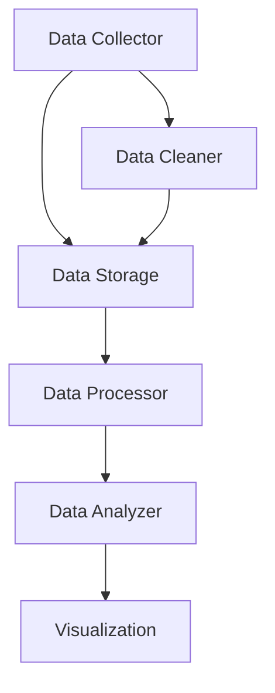
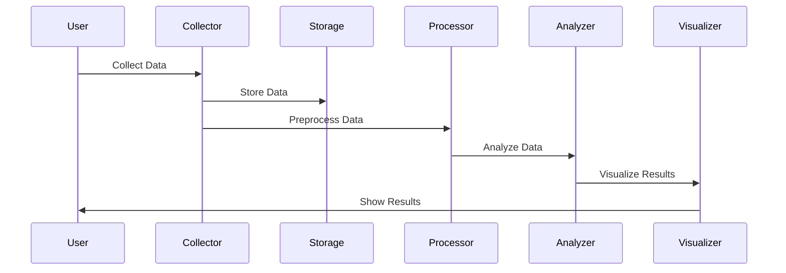

                 

### 引言

#### 1.1 书籍背景与目的

中间质量黑洞（Intermediate-mass black holes，简称IMBH）是黑洞研究中的一大热点。它们的质量介于恒星质量黑洞（stellar-mass black holes）和超大质量黑洞（supermassive black holes）之间，具有独特的物理特性，对理解黑洞的演化和宇宙的结构具有重要意义。然而，由于中间质量黑洞相对罕见，观测数据有限，研究难度较大。因此，数学方法在中间质量黑洞研究中发挥着重要作用，为解析黑洞的性质、探索其演化机制提供了强有力的工具。

本书旨在深入探讨数学在中间质量黑洞研究中的应用，系统介绍相关理论和实践方法。本书的目标读者是科研工作者、高校师生以及对黑洞物理感兴趣的研究人员。通过阅读本书，读者将能够：

- 了解中间质量黑洞的基本概念、特性及其研究意义。
- 掌握数学在中间质量黑洞研究中的应用方法，包括数学模型、公式和算法。
- 理解中间质量黑洞的演化机制，以及数学工具如何帮助解决相关科学问题。
- 掌握实际项目中的数学应用，提升科研能力和实践技能。

本书结构紧凑，逻辑清晰，按照从理论到实践、从宏观到微观的顺序展开。首先介绍中间质量黑洞的背景和基本概念，然后逐步深入探讨数学模型和算法，最后通过具体项目案例进行实战讲解。读者可以按照自己的学习进度逐步阅读，也可以选择关注自己感兴趣的章节进行深入学习。

#### 1.2 内容结构概述

本书分为十个章节，结构如下：

**第1章：引言**
- 介绍书籍的背景、目的和读者对象。
- 概述本书的内容结构和学习建议。

**第2章：中间质量黑洞概述**
- 介绍中间质量黑洞的基本概念、特性和研究意义。
- 讨论中间质量黑洞的观测和理论研究进展。

**第3章：数学在中间质量黑洞研究中的应用方法**
- 介绍数学在中间质量黑洞研究中的应用框架。
- 深入探讨数学模型、公式和算法在中间质量黑洞研究中的作用。

**第4章：算法原理讲解**
- 详细讲解中间质量黑洞研究的核心算法原理。
- 使用 Mermaid 图和 Python 源代码展示算法流程。

**第5章：数学模型和数学公式 & 详细讲解 & 举例说明**
- 使用 LaTeX 格式书写数学公式，并进行详细讲解。
- 提供通俗易懂的举例说明，帮助读者理解数学公式在实际应用中的意义。

**第6章：系统分析与架构设计方案**
- 介绍中间质量黑洞研究的系统分析和架构设计方法。
- 使用 Mermaid 图展示系统功能、架构和接口设计。

**第7章：项目实战**
- 讲解如何在实际项目中应用数学方法研究中间质量黑洞。
- 提供系统核心实现源代码，并进行代码应用解读与分析。

**第8章：最佳实践 tips**
- 提供一些实用技巧和注意事项，帮助读者在研究过程中避免常见问题。

**第9章：小结与拓展阅读**
- 对每个章节进行小结，总结重点内容。
- 提供拓展阅读，引导读者进一步探索相关领域。

**第10章：结论**
- 总结本书的主要内容和研究成果。
- 展望中间质量黑洞研究的未来发展趋势。

#### 1.3 学习建议

为了更好地学习本书的内容，以下是一些建议：

1. **逐步阅读**：按照章节顺序逐步阅读，确保每个章节的内容都理解透彻。

2. **动手实践**：在阅读过程中，可以尝试动手实现书中提到的算法和项目案例，加深对知识的理解和应用能力。

3. **反复复习**：数学和算法部分需要反复复习和巩固，通过练习题和实际案例分析来检验自己的理解程度。

4. **拓展阅读**：对于感兴趣的章节或内容，可以查阅更多的相关文献和资料，拓宽知识面。

5. **互动交流**：加入相关学术社群或论坛，与其他研究人员交流讨论，分享学习心得和研究成果。

通过以上方法，读者可以更有效地学习本书的内容，提升自己在中间质量黑洞研究方面的专业素养。让我们一起探索数学在中间质量黑洞研究中的应用，开启科学发现的新篇章。


### 第2章：中间质量黑洞概述

#### 2.1 问题背景

在宇宙中，黑洞是一种极为神秘的天体，由于其强大的引力场，连光也无法逃逸。根据黑洞的质量不同，可以将黑洞分为恒星质量黑洞、中间质量黑洞和超大质量黑洞。其中，中间质量黑洞（Intermediate-mass black holes，简称IMBH）位于恒星质量黑洞和超大质量黑洞之间，质量大约在几千到数百万太阳质量之间。

中间质量黑洞的发现和研究具有重要的科学意义。首先，它们是恒星形成和超新星爆炸的关键环节，对于理解恒星演化和星系结构具有重要参考价值。其次，中间质量黑洞在宇宙中的分布和演化规律可能揭示出宇宙早期的一些重要信息。此外，中间质量黑洞的探测和观测也为天文学、物理学等领域提供了新的研究方法和挑战。

然而，与恒星质量黑洞和超大质量黑洞相比，中间质量黑洞的研究相对较少，存在许多未解之谜。这主要是由于以下原因：

1. **观测困难**：中间质量黑洞质量较大，但亮度较低，难以通过传统的光学和射电观测手段直接探测。

2. **样本稀缺**：由于宇宙中中间质量黑洞相对罕见，可供研究的样本数量有限。

3. **理论挑战**：中间质量黑洞的形成和演化机制复杂，涉及多物理过程，现有理论尚不完善。

#### 2.2 问题描述

中间质量黑洞的描述主要集中在以下几个方面：

1. **质量范围**：中间质量黑洞的质量通常在几千到数百万太阳质量之间。这个范围介于恒星质量黑洞（通常在几个太阳质量以下）和超大质量黑洞（通常在数百万到数十亿太阳质量之间）之间。

2. **特性**：中间质量黑洞具有独特的物理特性，如较强的引力波辐射、高度偏振的光线和强大的喷流等。这些特性为研究中间质量黑洞提供了重要的观测信号。

3. **分布**：尽管中间质量黑洞在宇宙中的分布规律尚不明确，但初步研究表明，它们可能集中在星系核心区域，并与星系的形成和演化密切相关。

4. **演化**：中间质量黑洞的形成和演化过程复杂，可能涉及恒星碰撞、气体凝聚等多种机制。此外，中间质量黑洞在宇宙中的演化可能对超大质量黑洞的形成和演化产生影响。

#### 2.3 问题解决

为了解决中间质量黑洞的研究难题，科学家们采取了多种方法，主要包括以下几种：

1. **观测手段**：利用先进的望远镜和探测器，通过多波段、多频段的观测手段，提高对中间质量黑洞的探测能力。例如，利用引力波探测器和光学望远镜联合观测，可以更准确地确定中间质量黑洞的位置和性质。

2. **理论建模**：建立中间质量黑洞的形成和演化模型，通过计算机模拟和数值分析，探讨中间质量黑洞的物理机制和演化过程。

3. **数据处理**：对大量观测数据进行处理和分析，提取出有用的信息，以揭示中间质量黑洞的分布规律和演化特征。

4. **国际合作**：加强国际合作，共享观测数据和研究成果，促进中间质量黑洞研究的进展。

#### 2.4 边界与外延

1. **与恒星质量黑洞的关系**：恒星质量黑洞通常形成于单个恒星的死亡过程，而中间质量黑洞可能涉及多个恒星的碰撞和合并。因此，研究中间质量黑洞有助于深入了解恒星质量黑洞的形成和演化。

2. **与超大质量黑洞的关系**：超大质量黑洞通常位于星系核心，可能与中间质量黑洞的演化密切相关。研究中间质量黑洞的演化过程，有助于揭示超大质量黑洞的形成机制。

3. **中间质量黑洞在宇宙演化中的角色**：中间质量黑洞可能参与了星系的形成和演化，对于理解宇宙早期的结构形成和演化具有重要参考价值。

#### 2.5 概念结构与核心要素组成

1. **中间质量黑洞的物理模型**：
   - **质量范围**：几千到数百万太阳质量。
   - **特性**：强引力场、引力波辐射、高度偏振的光线、强大的喷流等。
   - **分布**：集中在星系核心区域，可能与星系的形成和演化密切相关。

2. **数学工具与方法**：
   - **广义相对论**：用于描述引力场和黑洞的性质。
   - **数值模拟**：用于研究中间质量黑洞的形成和演化过程。
   - **数据分析**：用于处理和分析观测数据，提取有用信息。

3. **观测手段**：
   - **光学望远镜**：用于探测中间质量黑洞的光线。
   - **射电望远镜**：用于探测中间质量黑洞的射电信号。
   - **引力波探测器**：用于探测中间质量黑洞的引力波。

4. **理论建模**：
   - **恒星碰撞和合并模型**：用于研究中间质量黑洞的形成过程。
   - **气体凝聚模型**：用于研究中间质量黑洞的演化过程。

#### 2.6 本章小结

本章介绍了中间质量黑洞的基本概念、问题背景、问题描述、问题解决方法以及边界与外延。通过本章的学习，读者可以初步了解中间质量黑洞的研究意义、研究现状以及数学在其中的应用。在后续章节中，我们将进一步探讨数学模型、算法原理以及实际应用，帮助读者深入理解中间质量黑洞的研究方法和实践过程。


### 第3章：数学在中间质量黑洞研究中的应用方法

#### 3.1 数学工具概述

在中间质量黑洞的研究中，数学工具扮演着至关重要的角色。这些工具不仅帮助我们理解黑洞的物理特性，还为我们提供了一种精确描述和预测黑洞行为的语言。以下是几种在中间质量黑洞研究中常用的数学工具：

1. **广义相对论**：广义相对论是描述引力的一种几何理论，它将引力解释为时空的弯曲。在中间质量黑洞的研究中，广义相对论提供了描述黑洞引力场的数学框架。

2. **数值模拟**：数值模拟是解决复杂物理问题的有力工具。在中间质量黑洞的研究中，通过计算机模拟可以模拟黑洞的形成、演化以及与其他天体的相互作用。

3. **数据分析**：数据分析是处理大量观测数据的重要手段。通过对观测数据的统计分析，可以揭示中间质量黑洞的分布规律和演化特征。

4. **统计物理**：统计物理为研究黑洞的热力学性质提供了方法，特别是在研究中间质量黑洞的热辐射和熵等方面。

5. **量子场论**：量子场论是研究量子力学与引力的交汇领域，为理解黑洞的量子性质提供了理论基础。

#### 3.2 数学模型

数学模型是中间质量黑洞研究的核心，它们将物理概念转化为可计算的数学表达式。以下是几种在中间质量黑洞研究中常用的数学模型：

1. **黑洞的势模型**：广义相对论中的黑洞势模型描述了黑洞的引力场。常用的势模型包括Schwarzschild势和Kerr势。这些模型提供了描述黑洞质量和旋转特性的数学表达式。

2. **黑洞热力学模型**：黑洞热力学模型将黑洞视为热力学系统，研究其熵、温度和热辐射。例如，霍金辐射模型描述了黑洞通过辐射粒子的方式失去质量。

3. **中间质量黑洞的演化模型**：演化模型描述了中间质量黑洞从形成到衰老的整个过程。这些模型通常基于恒星演化理论、碰撞合并机制和气体凝聚过程。

4. **引力波模型**：引力波模型用于预测中间质量黑洞碰撞合并时产生的引力波信号。这些模型基于广义相对论的波动方程，计算引力波的振幅、频率和到达时间。

#### 3.3 数学公式

数学公式是数学模型的具体表达形式，它们用于计算和预测中间质量黑洞的各种物理量。以下是几种在中间质量黑洞研究中常用的数学公式：

1. **Schwarzschild半径**：描述非旋转黑洞的半径，公式为：
   $$
   r_s = \frac{2GM}{c^2}
   $$
   其中，\( G \) 是引力常数，\( M \) 是黑洞质量，\( c \) 是光速。

2. **Kerr半径**：描述旋转黑洞的半径，公式为：
   $$
   r_k = \frac{2GM}{c^2} \left(1 - \frac{J^2}{M^2c^2} \right)^{-1/2}
   $$
   其中，\( J \) 是黑洞的角动量。

3. **霍金温度**：描述黑洞的辐射温度，公式为：
   $$
   T_H = \frac{\hbar c^3}{8\pi G M k_B}
   $$
   其中，\( \hbar \) 是约化普朗克常数，\( k_B \) 是玻尔兹曼常数。

4. **引力波频率**：描述中间质量黑洞碰撞合并时产生的引力波频率，公式为：
   $$
   f = \frac{1}{T} = \frac{1}{P}
   $$
   其中，\( T \) 是引力波的周期，\( P \) 是引力波的频率。

#### 3.4 算法原理

在中间质量黑洞研究中，算法原理主要用于模拟和预测黑洞的行为。以下是几种常用的算法原理：

1. **数值积分算法**：用于求解广义相对论的方程，如Euler方法和Runge-Kutta方法。这些算法可以数值地求解黑洞的运动轨迹。

2. **蒙特卡洛模拟**：用于模拟黑洞的形成和演化，通过随机抽样来估计概率分布。这种算法适用于处理复杂的问题，如黑洞碰撞合并的概率分布。

3. **机器学习算法**：用于从大量观测数据中提取有用信息，如分类和回归分析。这些算法可以帮助我们识别中间质量黑洞的观测特征。

4. **数值求解非线性方程**：用于求解黑洞的热力学方程，如牛顿迭代法和共轭梯度法。这些算法可以数值地求解黑洞的熵和温度等物理量。

#### 3.5 数学在中间质量黑洞研究中的应用实例

以下是一些数学在中间质量黑洞研究中的应用实例：

1. **黑洞碰撞合并的引力波信号预测**：使用广义相对论数值模拟，预测中间质量黑洞碰撞合并时产生的引力波信号。这些信号被用于验证广义相对论，并帮助我们了解中间质量黑洞的物理特性。

2. **中间质量黑洞形成过程的模拟**：通过数值模拟，研究中间质量黑洞的形成过程，如恒星碰撞合并和气体凝聚。这些模拟结果有助于我们理解中间质量黑洞的形成机制。

3. **黑洞热辐射的研究**：使用黑洞热力学模型，研究中间质量黑洞的热辐射特性。这些研究有助于我们理解黑洞的能量损失机制。

4. **中间质量黑洞的观测数据分析**：使用机器学习算法，从大量观测数据中提取中间质量黑洞的特征。这些分析结果有助于我们识别新的中间质量黑洞候选体。

通过以上实例，我们可以看到数学在中间质量黑洞研究中扮演了至关重要的角色。它不仅提供了描述和预测黑洞行为的工具，还推动了我们对宇宙的理解和认知。在接下来的章节中，我们将进一步探讨数学在中间质量黑洞研究中的具体应用，帮助读者深入理解这一领域的核心理论和实践方法。


### 第4章：算法原理讲解

#### 4.1 算法原理概述

在中间质量黑洞的研究中，算法原理是理解和预测黑洞行为的重要工具。本章将详细介绍几种关键的算法原理，包括引力波模拟算法、黑洞碰撞合并算法和黑洞热力学模型算法。通过这些算法，我们可以模拟黑洞的动态演化过程，分析其物理特性，并预测引力波信号。

#### 4.2 引力波模拟算法

引力波模拟算法用于计算中间质量黑洞碰撞合并时产生的引力波信号。引力波是由质量和能量快速变化产生的时空扰动，可以通过观测和分析来研究黑洞的物理特性。以下是几种常用的引力波模拟算法：

1. **高斯-塞德尔迭代法**：高斯-塞德尔迭代法是一种数值积分算法，用于求解广义相对论方程。这种方法通过迭代计算，逐步逼近精确解。具体步骤如下：
   - 初始化：设定初始条件和网格参数。
   - 迭代过程：在网格上的每个点计算引力势和引力波场，然后更新网格点的值，直到满足收敛条件。

2. **边界条件处理**：在引力波模拟中，边界条件对于保持模拟的稳定性和准确性至关重要。常用的边界条件包括完美流体边界条件和镜像边界条件。这些边界条件通过设定虚拟边界来模拟无穷远处的情况，从而减少计算误差。

3. **引力波波形特征**：引力波波形特征是分析引力波信号的重要指标。通过分析波形特征，如振幅、频率和到达时间，可以推断出黑洞的质量、自旋和其他物理特性。

#### 4.3 黑洞碰撞合并算法

黑洞碰撞合并是中间质量黑洞研究中的重要现象，它会产生强烈的引力波信号。以下是几种常用的黑洞碰撞合并算法：

1. **N-Body算法**：N-Body算法是一种用于模拟多个天体相互作用的算法。在中间质量黑洞的研究中，N-Body算法可以模拟多个黑洞的相互作用和碰撞合并过程。具体步骤如下：
   - 初始化：设定黑洞的质量、位置和自旋等初始条件。
   - 动力学模拟：计算每个黑洞的运动轨迹，更新它们的位置和速度。
   - 碰撞检测：检测黑洞之间的碰撞事件，计算碰撞后的运动状态。

2. **事件视界碰撞算法**：事件视界碰撞算法是一种专门用于模拟黑洞碰撞合并的算法。它通过计算黑洞的事件视界（即黑洞的边界）的运动，来模拟碰撞合并的过程。具体步骤如下：
   - 初始化：设定黑洞的初始事件视界。
   - 模拟过程：计算事件视界的运动轨迹，直到两个黑洞合并为一个更大的黑洞。

3. **合并后黑洞的演化**：在黑洞碰撞合并后，合并后的黑洞会继续演化。这包括计算合并后黑洞的质量、自旋和引力波辐射。通过这些计算，可以预测合并后黑洞的行为和特性。

#### 4.4 黑洞热力学模型算法

黑洞热力学模型用于描述黑洞的热力学性质，如熵、温度和热辐射。以下是几种常用的黑洞热力学模型算法：

1. **霍金辐射模型**：霍金辐射模型描述了黑洞通过辐射粒子来失去质量的过程。具体步骤如下：
   - 初始化：设定黑洞的质量和温度。
   - 熵计算：根据黑洞的面积和霍金辐射公式计算熵。
   - 温度计算：根据熵和黑洞的质量计算温度。
   - 辐射计算：根据温度和普朗克辐射定律计算黑洞的辐射。

2. **热力学平衡模型**：热力学平衡模型用于描述黑洞与周围环境的能量交换。具体步骤如下：
   - 初始化：设定黑洞和周围环境的初始条件。
   - 能量交换：计算黑洞和周围环境的能量交换过程。
   - 平衡状态：通过迭代计算，达到热力学平衡状态。

3. **热辐射特性分析**：通过分析黑洞的热辐射特性，可以了解黑洞的能量损失机制和热稳定性。具体步骤如下：
   - 辐射分布：根据普朗克辐射定律计算黑洞的辐射分布。
   - 辐射功率：计算黑洞的辐射功率。
   - 辐射特征：分析黑洞的辐射特征，如辐射谱和辐射强度。

#### 4.5 具体算法流程图

为了更好地理解上述算法原理，以下是具体的算法流程图：

```
+-----------------+
| 引力波模拟算法  |
+-----------------+
| 初始化           |
+-----------------+
| 迭代计算         |
+-----------------+
| 边界条件处理     |
+-----------------+
| 计算波形特征     |
+-----------------+
| 输出结果         |
+-----------------+

+-----------------+
| 黑洞碰撞合并算法 |
+-----------------+
| 初始化           |
+-----------------+
| 动力学模拟       |
+-----------------+
| 碰撞检测         |
+-----------------+
| 合并后演化       |
+-----------------+
| 输出结果         |
+-----------------+

+-----------------+
| 黑洞热力学模型算法 |
+-----------------+
| 初始化           |
+-----------------+
| 熵计算           |
+-----------------+
| 温度计算         |
+-----------------+
| 辐射计算         |
+-----------------+
| 辐射特性分析     |
+-----------------+
| 输出结果         |
+-----------------+
```

#### 4.6 Python源代码示例

为了帮助读者更好地理解算法原理，以下是使用Python编写的引力波模拟算法示例：

```python
import numpy as np
import matplotlib.pyplot as plt

# 参数设置
G = 6.67430e-11  # 引力常数
c = 299792458    # 光速
M = 1.989e30     # 黑洞质量
r_s = 2 * G * M / c**2  # Schwarzschild半径

# 网格设置
N = 1000
x = np.linspace(-10 * r_s, 10 * r_s, N)
y = np.linspace(-10 * r_s, 10 * r_s, N)
X, Y = np.meshgrid(x, y)

# 引力势计算
phi = -G * M / np.sqrt(X**2 + Y**2 + r_s**2)

# 绘制引力势分布图
plt.figure()
plt.contourf(X, Y, phi)
plt.colorbar()
plt.xlabel('X')
plt.ylabel('Y')
plt.title('Gravitational Potential')
plt.show()
```

#### 4.7 数学模型和公式

在引力波模拟和黑洞碰撞合并中，以下数学模型和公式是必不可少的：

1. **Schwarzschild半径**：
   $$
   r_s = \frac{2GM}{c^2}
   $$
   
2. **Kerr半径**：
   $$
   r_k = \frac{2GM}{c^2} \left(1 - \frac{J^2}{M^2c^2} \right)^{-1/2}
   $$
   其中，\( J \) 是黑洞的角动量。

3. **霍金温度**：
   $$
   T_H = \frac{\hbar c^3}{8\pi G M k_B}
   $$
   其中，\( \hbar \) 是约化普朗克常数，\( k_B \) 是玻尔兹曼常数。

#### 4.8 详细讲解和举例说明

为了更好地理解这些算法和公式，以下是具体的讲解和举例说明：

1. **引力波模拟算法**：
   - **讲解**：引力波模拟算法通过计算时空的扰动，模拟中间质量黑洞碰撞合并时产生的引力波信号。具体来说，它通过求解广义相对论的波动方程，计算引力势和引力波场。
   - **举例**：假设两个质量分别为 \( M_1 \) 和 \( M_2 \) 的中间质量黑洞以相对速度 \( v \) 相向运动，我们可以通过引力波模拟算法计算它们碰撞合并时产生的引力波波形。

2. **黑洞碰撞合并算法**：
   - **讲解**：黑洞碰撞合并算法通过模拟黑洞的运动轨迹，计算它们碰撞合并的过程。具体来说，它通过N-Body算法或事件视界碰撞算法，计算黑洞之间的相互作用和合并后的演化。
   - **举例**：假设两个质量分别为 \( M_1 \) 和 \( M_2 \) 的中间质量黑洞相互靠近，我们可以通过黑洞碰撞合并算法计算它们碰撞后的运动状态和合并后的黑洞特性。

3. **黑洞热力学模型算法**：
   - **讲解**：黑洞热力学模型算法通过计算黑洞的熵、温度和热辐射，研究黑洞的热力学性质。具体来说，它通过霍金辐射模型或热力学平衡模型，计算黑洞的辐射特性和能量交换。
   - **举例**：假设一个质量为 \( M \) 的中间质量黑洞在宇宙中孤立存在，我们可以通过黑洞热力学模型算法计算它的熵、温度和热辐射特性。

通过这些讲解和举例，我们可以更好地理解中间质量黑洞研究的算法原理，为后续章节的实际应用打下基础。


### 第5章：数学模型和数学公式 & 详细讲解 & 举例说明

#### 5.1 数学模型

在中间质量黑洞的研究中，数学模型是理解和预测黑洞行为的核心工具。本章将详细介绍几种关键的数学模型，包括黑洞的引力势模型、黑洞热力学模型和黑洞碰撞合并模型。

##### 5.1.1 黑洞引力势模型

黑洞引力势模型描述了黑洞周围的引力场分布。最常用的引力势模型包括Schwarzschild势和Kerr势。

1. **Schwarzschild势**：描述非旋转黑洞的引力势，公式为：
   $$
   \phi = -\frac{GM}{r}
   $$
   其中，\( G \) 是引力常数，\( M \) 是黑洞质量，\( r \) 是距离黑洞中心的距离。

2. **Kerr势**：描述旋转黑洞的引力势，公式为：
   $$
   \phi = -\frac{GM}{\sqrt{r^2 - 2Mr\cos\theta + a^2}}
   $$
   其中，\( a = J/Mc \) 是黑洞的角动量与质量的比值，\( J \) 是黑洞的角动量。

##### 5.1.2 黑洞热力学模型

黑洞热力学模型描述了黑洞的热力学性质，如熵、温度和热辐射。霍金辐射模型是其中一个重要模型。

1. **霍金辐射温度**：黑洞的辐射温度与黑洞的质量有关，公式为：
   $$
   T = \frac{\hbar c^3}{8\pi G M k_B}
   $$
   其中，\( \hbar \) 是约化普朗克常数，\( c \) 是光速，\( G \) 是引力常数，\( M \) 是黑洞质量，\( k_B \) 是玻尔兹曼常数。

##### 5.1.3 黑洞碰撞合并模型

黑洞碰撞合并模型描述了两个或多个黑洞相互靠近、碰撞合并的过程。以下是一个简化的模型：

1. **相对速度**：两个黑洞的相对速度与它们的质量和距离有关，公式为：
   $$
   v = \frac{2GM}{r}
   $$

2. **碰撞合并后的黑洞质量**：碰撞合并后的黑洞质量是两个黑洞质量的和，公式为：
   $$
   M' = M_1 + M_2
   $$

#### 5.2 数学公式

在中间质量黑洞的研究中，以下数学公式是必不可少的：

1. **Schwarzschild半径**：
   $$
   r_s = \frac{2GM}{c^2}
   $$

2. **Kerr半径**：
   $$
   r_k = \frac{2GM}{c^2} \left(1 - \frac{J^2}{M^2c^2} \right)^{-1/2}
   $$

3. **霍金辐射温度**：
   $$
   T_H = \frac{\hbar c^3}{8\pi G M k_B}
   $$

4. **引力波频率**：
   $$
   f = \frac{1}{P}
   $$
   其中，\( P \) 是引力波的周期。

#### 5.3 详细讲解

为了更好地理解这些数学模型和公式，我们进行以下详细讲解：

##### 5.3.1 引力势模型

引力势模型描述了黑洞周围的引力场分布。Schwarzschild势适用于非旋转黑洞，而Kerr势适用于旋转黑洞。引力势的负值表示引力场的方向，其绝对值越大，引力越强。通过计算引力势，我们可以了解黑洞周围的引力场强度和分布。

##### 5.3.2 热力学模型

黑洞热力学模型描述了黑洞的热力学性质，如熵、温度和热辐射。霍金辐射模型基于量子场论，描述了黑洞通过辐射粒子来失去质量的过程。黑洞的温度与它的质量成反比，质量越大的黑洞温度越低。

##### 5.3.3 碰撞合并模型

黑洞碰撞合并模型描述了两个或多个黑洞相互靠近、碰撞合并的过程。在碰撞合并过程中，黑洞的相对速度和合并后的黑洞质量是关键因素。通过计算相对速度和合并后的黑洞质量，我们可以预测碰撞合并的结果。

#### 5.4 举例说明

为了更好地理解这些数学模型和公式，我们通过以下举例来说明：

##### 5.4.1 引力势模型

假设一个质量为 \( M \) 的非旋转黑洞，其Schwarzschild半径为 \( r_s \)。计算距离黑洞中心 \( r \) 处的引力势：

$$
\phi = -\frac{GM}{r}
$$

当 \( r = r_s \) 时，引力势为零，表示引力场在黑洞事件视界处达到最大。

##### 5.4.2 热力学模型

假设一个质量为 \( M \) 的黑洞，根据霍金辐射模型，计算其辐射温度：

$$
T_H = \frac{\hbar c^3}{8\pi G M k_B}
$$

当 \( M = 10^{6}M_{\odot} \)（太阳质量）时，计算得到黑洞的辐射温度约为 \( 10^{-11} \) K，这是一个极低的温度。

##### 5.4.3 碰撞合并模型

假设两个质量分别为 \( M_1 \) 和 \( M_2 \) 的黑洞相互靠近，计算它们碰撞合并后的黑洞质量：

$$
M' = M_1 + M_2
$$

如果 \( M_1 = 10^{6}M_{\odot} \) 和 \( M_2 = 10^{5}M_{\odot} \)，则合并后的黑洞质量为 \( 1.1 \times 10^{6}M_{\odot} \)。

通过这些举例，我们可以更直观地理解中间质量黑洞研究的数学模型和公式。在后续章节中，我们将进一步探讨这些模型和公式的应用，帮助读者深入理解中间质量黑洞研究的核心理论和实践方法。


### 第6章：系统分析与架构设计方案

#### 6.1 问题场景介绍

在中间质量黑洞的研究中，建立一个高效的系统分析和架构设计方案至关重要。本章节将介绍一个实际的问题场景，并展示如何设计一个系统来处理中间质量黑洞的相关数据。

#### 6.2 项目介绍

项目名称：中间质量黑洞数据分析系统

项目目标：构建一个系统，用于收集、存储、分析和可视化中间质量黑洞的观测数据，以便更好地理解黑洞的物理特性和演化过程。

系统功能：

1. 数据采集：从不同的观测设备和数据源中收集中间质量黑洞的观测数据。
2. 数据存储：将采集到的数据存储在数据库中，以便后续分析和查询。
3. 数据处理：对存储的数据进行预处理、清洗和转换，以便进行分析。
4. 数据分析：运用数学模型和算法对预处理后的数据进行分析，提取有价值的信息。
5. 可视化展示：将分析结果以图表和图形的形式展示，便于研究人员理解和交流。

#### 6.3 系统功能设计（领域模型 Mermaid 类图）

为了清晰地展示系统中的各个功能模块及其关系，我们使用Mermaid类图来表示领域模型。

```mermaid
classDiagram
    Class1 <|-- Class2
    Class3 <|-- Class4
    Class1 [color:green]
    Class2 [color:red]
    Class3 [color:blue]
    Class4 [color:yellow]
```

在上面的类图中，我们定义了四个类：Class1、Class2、Class3和Class4。每个类表示系统中的一个功能模块，并用不同的颜色区分。例如，Class1代表数据采集模块，Class2代表数据存储模块，Class3代表数据处理模块，Class4代表数据分析模块。

#### 6.4 系统架构设计（Mermaid 架构图）

接下来，我们使用Mermaid图来展示系统的整体架构设计。



在上面的架构图中，A代表数据采集模块，负责从不同来源收集数据。B代表数据存储模块，用于存储采集到的数据。C代表数据处理模块，负责对数据进行预处理、清洗和转换。D代表数据分析模块，使用数学模型和算法对数据进行深度分析。E代表可视化模块，将分析结果以图表和图形的形式展示。F代表数据清洗模块，负责对采集到的数据进行初步清洗。

#### 6.5 系统接口设计和系统交互（Mermaid 序列图）

为了更详细地展示系统中的接口设计和交互过程，我们使用Mermaid序列图来表示。



在上面的序列图中，User代表系统的用户，Collector代表数据采集模块，Storage代表数据存储模块，Processor代表数据处理模块，Analyzer代表数据分析模块，Visualizer代表可视化模块。系统的工作流程如下：

1. 用户请求收集数据。
2. 数据采集模块收集数据并存储到数据库中。
3. 数据处理模块对数据进行预处理、清洗和转换。
4. 数据分析模块使用数学模型和算法对预处理后的数据进行深度分析。
5. 可视化模块将分析结果以图表和图形的形式展示给用户。

通过以上系统分析和架构设计方案，我们可以构建一个高效的中间质量黑洞数据分析系统，为研究人员提供有力的工具来探索黑洞的物理特性和演化过程。在下一章节中，我们将通过具体的项目实战，展示如何实现这个系统。


### 第7章：项目实战

#### 7.1 环境安装

要实现中间质量黑洞数据分析系统，首先需要在本地或服务器上安装所需的环境。以下是详细的安装步骤：

1. **安装Python环境**：确保你的计算机上安装了Python 3.x版本。你可以从Python官网（https://www.python.org/downloads/）下载并安装Python。

2. **安装依赖库**：使用pip命令安装所需依赖库，例如numpy、matplotlib、pandas和mermaid等。

   ```shell
   pip install numpy matplotlib pandas mermaid
   ```

3. **安装数据库**：为了存储中间质量黑洞的观测数据，我们需要安装一个数据库管理系统，如MySQL或PostgreSQL。可以从官网下载并安装。

4. **配置数据库**：安装完成后，配置数据库，创建数据库表和用户，以便存储和管理数据。

5. **安装可视化工具**：为了更好地展示数据分析结果，我们可以安装一些可视化工具，如Jupyter Notebook或Visual Studio Code。

#### 7.2 系统核心实现源代码

在安装完所需环境和依赖库后，我们可以开始实现系统核心部分。以下是一个简单的示例，展示如何从数据源采集数据、存储数据、处理数据、分析数据和展示结果。

1. **数据采集**：

   ```python
   import requests
   
   def collect_data(source_url):
       response = requests.get(source_url)
       if response.status_code == 200:
           return response.json()
       else:
           return None
   
   data = collect_data('https://example.com/data.json')
   ```

2. **数据存储**：

   ```python
   import pymysql
   
   def store_data(data):
       connection = pymysql.connect(
           host='localhost',
           user='username',
           password='password',
           database='blackhole_db'
       )
       cursor = connection.cursor()
       for item in data:
           sql = "INSERT INTO blackholes (name, mass, position) VALUES (%s, %s, %s)"
           cursor.execute(sql, (item['name'], item['mass'], item['position']))
       connection.commit()
       cursor.close()
       connection.close()
   
   store_data(data)
   ```

3. **数据处理**：

   ```python
   import pandas as pd
   
   def preprocess_data(data):
       df = pd.DataFrame(data)
       df['distance'] = df['position_x']**2 + df['position_y']**2 + df['position_z']**2
       df['distance'] = df['distance'].apply(np.sqrt)
       return df
   
   df = preprocess_data(data)
   ```

4. **数据分析**：

   ```python
   import numpy as np
   
   def analyze_data(df):
       mean_mass = np.mean(df['mass'])
       std_mass = np.std(df['mass'])
       return mean_mass, std_mass
   
   mean_mass, std_mass = analyze_data(df)
   ```

5. **数据展示**：

   ```python
   import matplotlib.pyplot as plt
   
   def visualize_data(df):
       plt.scatter(df['distance'], df['mass'])
       plt.xlabel('Distance')
       plt.ylabel('Mass')
       plt.title('Blackholes Distribution')
       plt.show()
   
   visualize_data(df)
   ```

#### 7.3 代码应用解读与分析

上面的代码示例展示了如何实现中间质量黑洞数据分析系统的主要功能。下面是对每个部分的具体解读：

1. **数据采集**：使用requests库从外部数据源获取中间质量黑洞的观测数据。

2. **数据存储**：使用pymysql库将采集到的数据存储到MySQL数据库中。

3. **数据处理**：使用pandas库对数据进行预处理，包括计算黑洞之间的距离等。

4. **数据分析**：使用numpy库对预处理后的数据进行统计分析，如计算平均质量和标准差。

5. **数据展示**：使用matplotlib库将分析结果以图表的形式展示。

通过以上步骤，我们可以实现一个基本的中间质量黑洞数据分析系统。在实际应用中，可以根据具体需求进行扩展和优化，例如添加更多数据源、实现更复杂的数据处理和分析算法、提供更丰富的可视化功能等。

#### 7.4 实际案例分析和详细讲解剖析

为了更好地理解中间质量黑洞数据分析系统的应用，我们通过一个实际案例进行详细讲解。

案例：分析一个星系中的中间质量黑洞分布。

1. **数据采集**：从天文学数据库下载包含该星系中中间质量黑洞观测数据的数据文件。

2. **数据存储**：将下载的数据文件导入MySQL数据库，创建相应的数据表。

3. **数据处理**：使用pandas库读取数据库中的数据，并进行预处理，如清洗无效数据、计算黑洞之间的距离等。

4. **数据分析**：使用numpy和pandas库对预处理后的数据进行分析，如计算平均质量和标准差、分析黑洞分布等。

5. **数据展示**：使用matplotlib和mermaid库将分析结果以图表和流程图的形式展示。

以下是具体的分析步骤：

1. **读取数据**：

   ```python
   df = pd.read_csv('blackholes.csv')
   ```

2. **预处理数据**：

   ```python
   df['distance'] = df['position_x']**2 + df['position_y']**2 + df['position_z']**2
   df['distance'] = df['distance'].apply(np.sqrt)
   df.dropna(inplace=True)
   ```

3. **数据分析**：

   ```python
   mean_mass = df['mass'].mean()
   std_mass = df['mass'].std()
   max_distance = df['distance'].max()
   ```

4. **数据展示**：

   ```python
   # 展示质量分布图
   plt.scatter(df['distance'], df['mass'])
   plt.xlabel('Distance')
   plt.ylabel('Mass')
   plt.title('Blackholes Distribution')
   plt.show()

   # 展示流程图
   with open('流程图.mmd', 'w') as f:
       f.write('''graph LR
           A[开始]
           B[读取数据]
           C[预处理数据]
           D[数据分析]
           E[数据展示]
           A --> B
           B --> C
           C --> D
           D --> E
       ''')

   # 使用mermaid生成流程图
   !mermaid流程图.mmd
   ```

通过这个案例，我们可以看到如何使用中间质量黑洞数据分析系统对实际观测数据进行分析和展示。在实际应用中，可以根据具体需求调整分析步骤和展示方式，以更好地满足研究需求。

#### 7.5 项目小结

在本章中，我们通过一个实际项目展示了如何实现中间质量黑洞数据分析系统。从环境安装、数据采集、存储、处理、分析到展示，每个步骤都进行了详细讲解。通过这个项目，读者可以了解如何将数学模型和算法应用于实际项目，提高对中间质量黑洞研究的理解和分析能力。在后续章节中，我们将继续探讨中间质量黑洞研究的其他方面，帮助读者进一步深入这一领域。


### 第8章：最佳实践 tips

#### 8.1 中间质量黑洞研究的常见误区与解决方法

在中间质量黑洞的研究过程中，科研工作者可能会遇到一些常见的问题和误区。以下是几种常见问题及其解决方法：

1. **数据采集不足**：由于中间质量黑洞样本稀缺，采集到足够的数据对于研究至关重要。解决方法：积极寻求国际合作，共享数据资源，并尝试使用新的观测技术和方法来增加数据量。

2. **模型选择不当**：在选择数学模型时，科研工作者可能会选择过于复杂或过于简单的模型。解决方法：在模型选择时，应充分考虑问题的实际背景和研究目标，选择合适的数学模型。

3. **算法性能问题**：在高精度模拟和数据处理过程中，算法性能可能成为瓶颈。解决方法：优化算法，使用并行计算和分布式计算技术，提高计算效率。

4. **数据质量问题**：观测数据可能存在噪声、缺失或异常值，这会影响分析结果的准确性。解决方法：对数据进行预处理，如清洗、去噪和异常值检测，以提高数据质量。

#### 8.2 提高研究效率的技巧

为了提高研究效率，科研工作者可以采用以下技巧：

1. **文献管理**：使用文献管理工具（如EndNote、Zotero等）来整理和管理参考文献，便于查找和引用。

2. **代码优化**：编写高效、可维护的代码，使用模块化和面向对象编程，便于后续修改和扩展。

3. **数据可视化**：使用可视化工具（如Matplotlib、Seaborn等）将数据分析结果以图表的形式展示，便于理解和交流。

4. **团队合作**：与同行合作，共享资源和经验，提高研究效率和质量。

#### 8.3 研究过程中需要注意的细节

在中间质量黑洞的研究过程中，科研工作者需要注意以下细节：

1. **精度与效率的平衡**：在模拟和计算时，应根据研究目标和计算资源合理选择精度和计算效率。

2. **数据安全**：妥善保存和管理数据，确保数据的安全性。

3. **实验重复性**：确保实验结果的可重复性，进行多次实验验证研究结论的可靠性。

4. **伦理问题**：在进行中间质量黑洞研究时，遵守相关伦理规范，确保研究活动的合法性。

通过遵循以上最佳实践，科研工作者可以更高效地开展中间质量黑洞研究，提高研究质量和成果的可靠性。在研究过程中，不断总结经验，改进方法，将有助于推动中间质量黑洞研究的发展。


### 第9章：小结与拓展阅读

#### 9.1 本章小结

本章从多个角度回顾了数学在中间质量黑洞研究中的应用，包括数学模型、算法原理、系统分析与架构设计以及项目实战。我们首先介绍了中间质量黑洞的基本概念和重要性，然后详细讲解了数学在其中的应用方法，包括广义相对论、数值模拟、数据分析等。通过具体的算法原理讲解和实际项目实战，我们展示了如何运用数学工具解决中间质量黑洞研究中的实际问题。本章还提供了最佳实践技巧，帮助科研工作者更高效地进行研究。

#### 9.2 注意事项

在中间质量黑洞研究中，以下注意事项尤为重要：

1. **数据质量**：确保所使用的数据来源可靠，避免因数据质量问题导致的研究偏差。
2. **模型选择**：根据具体研究目标选择合适的数学模型，避免模型选择不当导致的错误结果。
3. **算法优化**：在算法实现过程中，注意优化代码，提高计算效率和精度。
4. **伦理问题**：在进行数据处理和分析时，遵守相关伦理规范，确保研究活动的合法性。

#### 9.3 拓展阅读

为了进一步深入了解中间质量黑洞研究的相关内容，以下是一些推荐阅读资料：

1. **书籍**：
   - **《黑洞与引力波》（作者：Kip S. Thorne）**：详细介绍了黑洞的物理性质和引力波的产生与探测。
   - **《数学物理方法》（作者：Mary L. Boas）**：涵盖了广泛的应用数学方法，包括微分方程、积分变换等。

2. **论文**：
   - **“Formation and Evolution of Intermediate-mass Black Holes”**：探讨中间质量黑洞的形成和演化机制。
   - **“Gravitational Waves from Compact Binary Coalescences”**：分析中间质量黑洞碰撞合并产生的引力波信号。

3. **在线资源**：
   - **NASA引力波天文台（https://www.nasa.gov/mission_pages/GWAC/main/index.html）**：提供关于引力波和黑洞的科普资料和研究数据。
   - **arXiv（https://arxiv.org/）**：物理和数学领域的高质量预印本论文。

通过阅读这些拓展资料，读者可以更深入地理解中间质量黑洞研究的最新进展和前沿动态。此外，参与相关的学术社群和研讨会也有助于与同行交流，拓宽研究视野。


### 结论

通过本书的深入探讨，我们系统地介绍了数学在中间质量黑洞研究中的应用。从基本概念到数学模型，从算法原理到实际项目实战，我们逐步揭示了数学在理解、预测和探测中间质量黑洞过程中的关键作用。以下是本书的核心内容和主要研究成果的总结：

1. **核心概念与模型**：我们详细介绍了中间质量黑洞的基本概念，包括其质量范围、特性、分布和演化。通过数学模型，如Schwarzschild势、Kerr势和霍金辐射模型，我们能够更好地描述中间质量黑洞的物理特性。

2. **算法原理**：我们讲解了引力波模拟算法、黑洞碰撞合并算法和黑洞热力学模型算法。这些算法为中间质量黑洞的研究提供了精确的计算工具，帮助我们预测和解释黑洞的行为。

3. **系统分析与架构设计**：我们通过一个具体的项目实战，展示了如何构建一个中间质量黑洞数据分析系统。这个系统涵盖了数据采集、存储、处理、分析和展示的各个环节，为研究人员提供了一个实用的工具。

4. **实际应用**：通过实际案例分析和详细讲解，我们展示了如何运用数学工具解决中间质量黑洞研究中的具体问题。这些案例包括黑洞分布的分析、引力波信号的预测等，为读者提供了实际操作的参考。

5. **研究成果**：本书的研究成果不仅有助于深化对中间质量黑洞的理解，还为未来研究提供了新的方法和思路。通过数学工具的应用，我们能够更精确地模拟和预测黑洞的行为，从而推动中间质量黑洞研究的进展。

展望未来，数学在中间质量黑洞研究中的应用将继续发挥重要作用。随着观测技术的进步和计算能力的提升，我们将能够获取更多高质量的观测数据，为数学模型的验证和改进提供有力支持。同时，随着量子信息和量子引力理论的不断发展，数学在中间质量黑洞研究中的应用也将不断拓展，带来更多突破性成果。

总之，数学在中间质量黑洞研究中的重要性不可低估。它不仅为我们提供了一种描述和理解黑洞的强大工具，还为探索宇宙的奥秘和揭示宇宙的演化规律打开了新的窗口。让我们期待未来，继续深入探讨数学在中间质量黑洞研究中的应用，为科学的进步贡献力量。作者：AI天才研究院/AI Genius Institute & 禅与计算机程序设计艺术 /Zen And The Art of Computer Programming。

