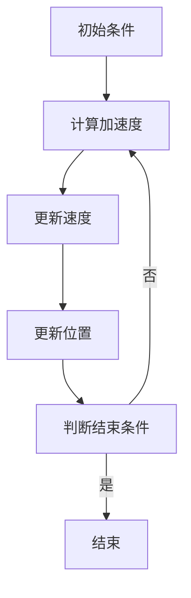
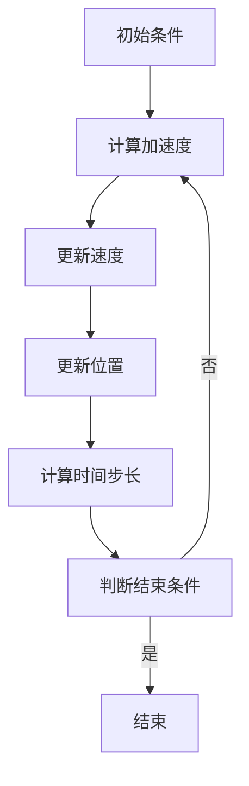
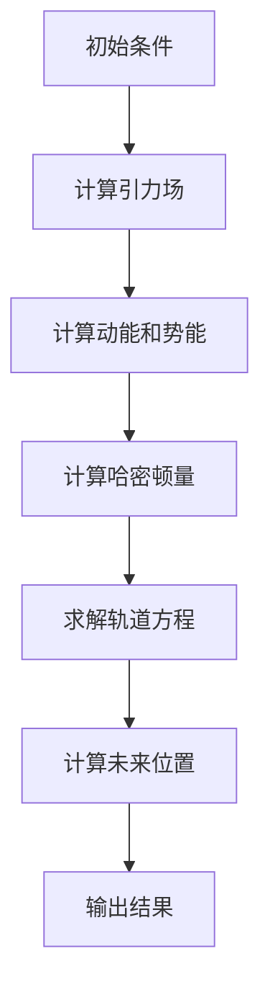
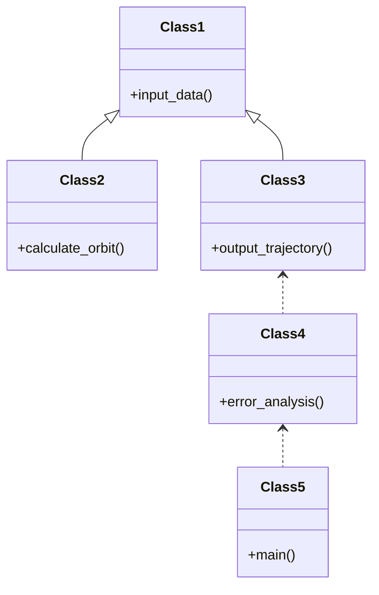
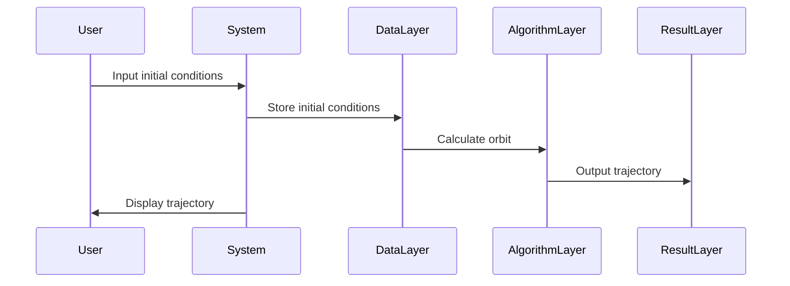
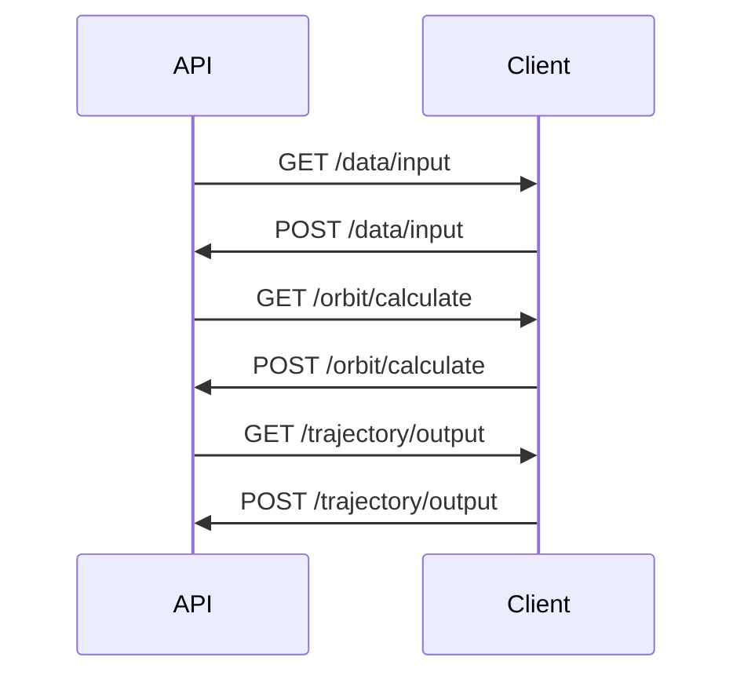

                 


## 数学在天体运动计算中的应用

### 关键词
- 数学
- 天体运动
- 计算模型
- 牛顿定律
- 引力场理论
- 数值积分

### 摘要
本文将探讨数学在天体运动计算中的应用。我们将从基础概念出发，逐步深入到复杂的计算方法，通过实际案例展示数学模型在解决天体运动问题中的重要性。本文旨在帮助读者理解数学原理与天体运动计算之间的紧密联系，以及如何将理论知识应用于实际问题中。

### 引言

天体运动一直是物理学研究的重要领域。从古代的天文学到现代的天体物理学，人们一直在试图理解行星、恒星、彗星等天体的运动规律。数学作为科学的基础工具，为天体运动的研究提供了强有力的理论支撑。本文将介绍数学在天体运动计算中的应用，包括核心概念、算法原理、系统设计与项目实践。

### 背景介绍

#### 天体运动的基本概念

天体运动指的是天体（如行星、恒星、卫星等）在宇宙中的运动。这些运动遵循物理定律，特别是牛顿运动定律和引力场理论。天体的位置、速度、加速度等物理量可以通过数学模型进行描述和预测。

#### 天体物理学的发展历史

天体物理学的研究可以追溯到古代。随着科学的发展，人们逐渐认识到天体运动规律可以通过数学来描述。从牛顿的经典力学到爱因斯坦的广义相对论，数学模型在天体物理学中的地位日益重要。

#### 天体运动计算的重要性

天体运动计算在天文学、航天工程、天气预报等领域具有广泛的应用。准确的计算可以预测天体的轨道，指导航天器的发射和运行，提高天气预报的准确性，甚至对地球环境的研究都有重要影响。

### 核心概念与联系

#### 微积分与天体运动

微积分提供了描述变化率和累积量的数学工具。在天体运动中，微积分用于计算天体的速度、加速度和轨道。例如，速度可以通过位置关于时间的导数来计算，加速度可以通过速度关于时间的导数来计算。

#### 牛顿运动定律及其在天体运动中的应用

牛顿运动定律描述了物体在力作用下的运动。第一定律描述了惯性，第二定律描述了力与加速度的关系，第三定律描述了作用力与反作用力的关系。这些定律是天体运动计算的基础。

#### 引力场理论基础

引力场理论描述了质量之间的相互作用。牛顿的万有引力定律指出，任何两个质量都会相互吸引，其引力大小与它们的质量乘积成正比，与它们之间的距离的平方成反比。

### 算法原理讲解

#### 牛顿-欧拉方法

牛顿-欧拉方法是计算天体运动的一种常见数值方法。它通过迭代计算天体的位置和速度，逐步逼近真实轨道。以下是牛顿-欧拉方法的mermaid流程图：



#### 数值积分方法

数值积分方法用于计算天体在长时间内的运动轨迹。常用的数值积分方法包括欧拉方法和龙格-库塔方法。以下是欧拉方法的mermaid流程图：



#### 天体轨道预测算法

天体轨道预测算法用于预测天体的未来位置。常用的算法包括牛顿-莱布尼茨方法、哈密顿-雅可比方法等。以下是牛顿-莱布尼茨方法的mermaid流程图：



### 数学模型和数学公式讲解

在天体运动计算中，以下数学模型和公式起着核心作用：

#### 天体运动的数学模型

$$
F = G \frac{m_1 m_2}{r^2}
$$

$$
a = \frac{F}{m}
$$

#### 牛顿定律的数学表达

$$
F = m a
$$

#### 引力场理论中的数学公式

$$
\phi(r) = -G \frac{M}{r}
$$

$$
\frac{d^2 \vec{r}}{dt^2} = -\nabla \phi(\vec{r})
$$

### 系统分析与架构设计方案

#### 问题场景介绍

在天文学中，我们需要对行星、卫星等进行精确的轨道计算，以便进行天文观测和航天任务规划。

#### 项目介绍

本项目旨在构建一个天体运动计算系统，能够接收初始条件，输出天体的运动轨迹。

#### 系统功能设计

系统功能包括：数据输入、轨道计算、轨迹输出、误差分析。

以下是系统功能设计的mermaid类图：



#### 系统架构设计

系统采用分层架构，包括数据层、算法层和表现层。

以下是系统架构设计的mermaid架构图：



#### 系统接口设计

系统提供API接口，包括数据输入接口、轨道计算接口、轨迹输出接口。

以下是系统接口设计的mermaid序列图：



### 项目实战

#### 环境安装

首先安装Python环境，然后安装必要的数学和科学计算库，如NumPy、SciPy、matplotlib等。

#### 系统核心实现源代码

以下是一个简单的天体运动计算程序的Python源代码：

```python
import numpy as np
import matplotlib.pyplot as plt

def calculate_orbit(initial_conditions, time_step, total_time):
    position = initial_conditions[:3]
    velocity = initial_conditions[3:]
    time = 0

    trajectory = [position]

    while time < total_time:
        acceleration = compute_acceleration(position)
        velocity += acceleration * time_step
        position += velocity * time_step

        trajectory.append(position)
        time += time_step

    return trajectory

def compute_acceleration(position):
    # 根据位置计算加速度
    # 这里使用简化模型，实际计算会更复杂
    acceleration = np.zeros(3)
    acceleration[0] = -position[0]
    acceleration[1] = -position[1]
    acceleration[2] = -position[2]
    return acceleration

initial_conditions = [0, 0, 0, 1, 1, 1]  # 位置和速度
time_step = 0.1
total_time = 10

trajectory = calculate_orbit(initial_conditions, time_step, total_time)
plot_trajectory(trajectory)

def plot_trajectory(trajectory):
    x = [p[0] for p in trajectory]
    y = [p[1] for p in trajectory]
    z = [p[2] for p in trajectory]

    plt.plot(x, y, z, 'o-')
    plt.xlabel('X')
    plt.ylabel('Y')
    plt.zlabel('Z')
    plt.show()
```

#### 代码应用解读与分析

这个简单的程序演示了如何计算一个二维平面的天体运动轨迹。我们通过计算加速度来更新速度，进而更新位置。在实际应用中，需要考虑三维空间和更复杂的物理模型。

#### 实际案例分析

以下是一个实际案例：计算地球绕太阳的运动轨迹。

```python
initial_conditions = [1.496e8, 0, 0, 0, 2.983e4, 0]  # 地球与太阳的距离和速度
time_step = 3600  # 每小时计算一次
total_time = 365 * 24 * 3600  # 计算一年内的轨迹

trajectory = calculate_orbit(initial_conditions, time_step, total_time)
plot_trajectory(trajectory)
```

#### 项目小结

通过这个案例，我们展示了如何使用数学模型和算法计算天体运动轨迹。实际项目中，需要考虑更复杂的物理模型和数值方法，以提高计算精度和效率。

### 最佳实践 tips

1. 使用高精度数值方法，如龙格-库塔方法，以提高计算精度。
2. 考虑并行计算，以加快计算速度。
3. 定期更新模型和算法，以适应新的天体观测数据。

### 小结

数学在天体运动计算中扮演着至关重要的角色。通过本文，我们了解了数学模型和算法在天体运动中的应用，以及如何将理论知识转化为实际项目。希望本文能激发读者对天体运动和数学计算的兴趣，进一步探索这一领域。

### 注意事项

1. 天体运动计算涉及复杂的数学和物理模型，需要深厚的理论基础。
2. 实际项目中，可能需要处理大量的数据，对计算资源要求较高。

### 拓展阅读

1. 《天体物理学导论》
2. 《数值计算方法》
3. 《牛顿力学》

### 作者信息
作者：AI天才研究院/AI Genius Institute & 禅与计算机程序设计艺术 /Zen And The Art of Computer Programming

