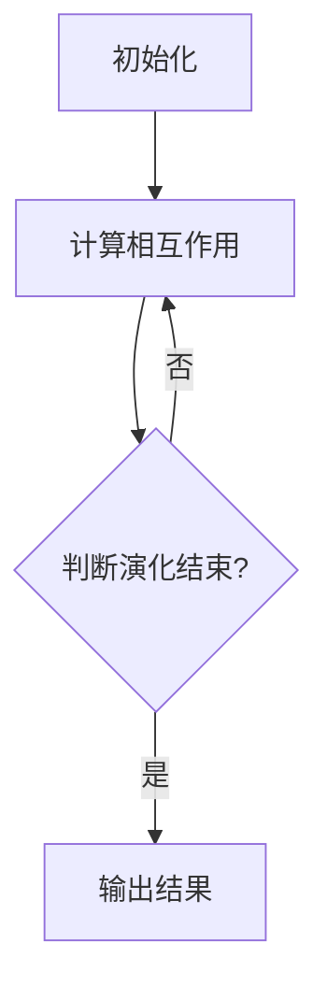

                 

### 数学在宇宙弦网络研究中的应用

**关键词：** 宇宙弦、网络研究、数学模型、算法、模拟

**摘要：** 本篇文章旨在探讨数学在宇宙弦网络研究中的应用。首先，我们将介绍宇宙弦网络的背景和基本概念，解释其在现代物理学中的重要性。接着，我们将深入探讨数学在宇宙弦网络研究中的关键作用，包括数学方法、工具和理论的应用。随后，文章将逐步讲解宇宙弦网络的数学模型，包括其核心特征和应用，以及相关数学工具的具体应用。接下来，我们将详细讲解宇宙弦网络模拟算法的原理和实现，并通过具体案例进行说明。此外，文章还将介绍数学模型和数学公式的基本概念、语法和使用方法，并探讨它们在宇宙弦网络研究中的联系和重要性。随后，我们将进行系统分析与架构设计方案的讲解，包括问题场景介绍、项目介绍、系统功能设计、系统架构设计、系统接口设计和系统交互设计。最后，文章将结合实际项目，进行环境安装和系统核心实现的讲解，并提供项目小结和最佳实践 tips。

## 第1章 问题背景

### 1.1 宇宙弦网络的概念

#### 1.1.1 宇宙弦的起源与基本性质

宇宙弦（Cosmic String）是一种理论上的超重粒子，它起源于宇宙早期的高能状态。在宇宙大爆炸之后的几分钟内，宇宙处于极端高温高密度的状态，这种状态下，基本粒子之间的相互作用非常强烈。在这个过程中，某些基本粒子的运动速度接近光速，导致它们产生了大量的能量，从而形成了宇宙弦。

宇宙弦的基本性质包括：

1. **高能量密度**：宇宙弦具有极高的能量密度，其质量远远大于普通物质。
2. **非定域性**：宇宙弦不是定域的，它可以跨越巨大的空间距离。
3. **稳定性**：尽管宇宙弦具有很强的相互作用，但它们在宇宙中相对稳定，不会轻易分解。

#### 1.1.2 宇宙弦网络的结构特点

宇宙弦网络（Cosmic String Network）是由大量宇宙弦相互连接形成的复杂结构。这些宇宙弦之间通过相互作用，形成了复杂的拓扑结构。宇宙弦网络具有以下结构特点：

1. **高维度性**：宇宙弦网络存在于四个空间维度和一个时间维度，形成五维结构。
2. **非线性**：宇宙弦网络的相互作用是非线性的，这导致其结构复杂且动态。
3. **动态演化**：宇宙弦网络会随着时间的推移而演化，这种演化受到宇宙弦之间的相互作用和宇宙膨胀的影响。

#### 1.1.3 宇宙弦网络与宇宙学的关系

宇宙弦网络在现代宇宙学中具有重要意义。首先，宇宙弦网络是宇宙早期高能状态的直接证据，有助于我们理解宇宙的起源和演化。其次，宇宙弦网络的研究有助于我们探索宇宙的暗物质和暗能量。暗物质和暗能量是宇宙学中的两个重要概念，它们对宇宙的膨胀和结构形成起着关键作用。

宇宙弦网络与宇宙学的关系可以从以下几个方面进行理解：

1. **宇宙膨胀**：宇宙弦网络的演化受到宇宙膨胀的影响。宇宙弦之间的相互作用和宇宙膨胀导致宇宙弦网络的形态和分布发生变化。
2. **暗物质**：宇宙弦网络中的宇宙弦是暗物质的一种可能形式。宇宙弦具有高能量密度，这使其成为暗物质的一个候选者。
3. **暗能量**：宇宙弦网络的演化也可能与暗能量有关。暗能量是导致宇宙加速膨胀的神秘力量，宇宙弦网络的研究可能为我们揭示暗能量的本质提供线索。

### 1.2 数学在宇宙弦网络研究中的重要性

#### 1.2.1 数学方法在宇宙弦网络建模中的应用

数学方法是宇宙弦网络研究的重要工具。通过数学方法，我们可以建立宇宙弦网络的数学模型，从而更好地理解和预测宇宙弦网络的行为。

在宇宙弦网络建模中，常用的数学方法包括：

1. **微分方程**：微分方程用于描述宇宙弦网络的动态演化。例如，爱因斯坦场方程用于描述宇宙弦网络的时空结构。
2. **图论**：图论用于描述宇宙弦网络的拓扑结构。通过图论方法，我们可以研究宇宙弦网络的连通性、聚类系数等特性。
3. **统计学方法**：统计学方法用于分析宇宙弦网络的分布和统计特性。例如，概率分布和随机过程可以用来描述宇宙弦网络的演化。

#### 1.2.2 数学工具在宇宙弦网络模拟中的作用

数学工具是宇宙弦网络模拟的关键。通过数学工具，我们可以对宇宙弦网络进行数值模拟，从而验证理论模型，预测宇宙弦网络的行为。

常用的数学工具包括：

1. **数值计算方法**：例如，有限元方法和有限差分方法可以用来求解微分方程，从而模拟宇宙弦网络的动态演化。
2. **计算机程序**：例如，Python 和 MATLAB 等编程语言可以用来编写宇宙弦网络模拟的代码，实现数值模拟。
3. **数据可视化**：数据可视化工具可以用来展示宇宙弦网络的形态和分布，帮助我们更好地理解宇宙弦网络的特性。

#### 1.2.3 数学理论在宇宙弦网络研究中的贡献

数学理论为宇宙弦网络研究提供了理论基础。通过数学理论，我们可以推导出宇宙弦网络的性质，预测宇宙弦网络的行为。

在宇宙弦网络研究中，重要的数学理论包括：

1. **广义相对论**：广义相对论是描述宇宙弦网络时空结构的理论基础。通过广义相对论，我们可以研究宇宙弦网络的引力效应和时空弯曲。
2. **量子场论**：量子场论是描述宇宙弦网络基本粒子相互作用的数学理论。通过量子场论，我们可以研究宇宙弦网络中的粒子动力学。
3. **拓扑学**：拓扑学是研究宇宙弦网络拓扑结构的数学理论。通过拓扑学，我们可以研究宇宙弦网络的连通性、稳定性等特性。

### 1.3 本书结构安排与内容概述

#### 1.3.1 目录结构概述

本书分为六个章节，内容涵盖了宇宙弦网络研究的各个方面。具体目录结构如下：

1. **第1章 问题背景**：介绍宇宙弦网络的背景、概念和数学在研究中的重要性。
2. **第2章 核心概念与联系**：讲解宇宙弦网络相关的数学基础和数学模型。
3. **第3章 算法原理讲解**：介绍宇宙弦网络模拟算法的原理和实现。
4. **第4章 数学模型和数学公式**：详细讲解数学模型和数学公式的基本概念和使用方法。
5. **第5章 系统分析与架构设计方案**：介绍系统分析与架构设计方案的原理和方法。
6. **第6章 项目实战**：结合实际项目，讲解环境安装、系统实现和项目小结。

#### 1.3.2 各章节主要内容介绍

1. **第1章 问题背景**：介绍宇宙弦网络的背景和基本概念，解释数学在研究中的重要性。
2. **第2章 核心概念与联系**：讲解宇宙弦网络相关的数学基础和数学模型，包括图论、力学方法和偏微分方程。
3. **第3章 算法原理讲解**：介绍宇宙弦网络模拟算法的原理和实现，包括算法流程图和Python代码实现。
4. **第4章 数学模型和数学公式**：详细讲解数学模型和数学公式的基本概念和使用方法，包括数学模型的基本概念、数学公式的基本语法和Python实现。
5. **第5章 系统分析与架构设计方案**：介绍系统分析与架构设计方案的原理和方法，包括问题场景介绍、项目介绍、系统功能设计、系统架构设计、系统接口设计和系统交互设计。
6. **第6章 项目实战**：结合实际项目，讲解环境安装、系统实现和项目小结。

#### 1.3.3 阅读指南与建议

为了更好地理解宇宙弦网络的研究和应用，建议读者遵循以下阅读指南：

1. **逐步阅读**：按照章节顺序逐步阅读，以便逐步了解宇宙弦网络的研究内容和数学方法。
2. **重点关注**：重点关注数学模型、算法和系统架构设计等内容，这些是宇宙弦网络研究的核心。
3. **实践应用**：尝试理解并实践书中提到的数学方法和算法，以加深对宇宙弦网络研究的理解。
4. **拓展阅读**：阅读相关领域的书籍和论文，以拓宽知识面并深入了解宇宙弦网络研究的最新进展。

通过以上阅读指南，读者可以更好地理解宇宙弦网络的研究和应用，为深入探索这一领域奠定基础。

## 第2章 核心概念与联系

### 2.1 数学基础

#### 2.1.1 微积分基础

微积分是数学中的一个重要分支，主要用于研究变化率和累积量。微积分的基本概念包括导数、积分和微分方程。导数描述了函数在某一点的变化率，而积分则描述了累积量。微分方程则是描述变化率与累积量之间关系的方程。

在宇宙弦网络研究中，微积分的应用非常广泛。例如，我们可以使用微积分来描述宇宙弦网络的动态演化，分析宇宙弦之间的相互作用和宇宙膨胀的影响。

#### 2.1.2 线性代数基础

线性代数是数学中的另一个重要分支，主要研究向量空间和线性变换。线性代数的基本概念包括向量、矩阵、行列式和特征值。向量是描述空间中一个点的位置或方向的数学对象，矩阵是描述线性变换的数学工具，行列式则用于计算矩阵的逆和特征值。

在宇宙弦网络研究中，线性代数也起到了关键作用。例如，我们可以使用线性代数来描述宇宙弦网络的拓扑结构，分析宇宙弦之间的相互作用。此外，线性代数还可以用于优化算法和数值模拟。

#### 2.1.3 概率论与数理统计基础

概率论与数理统计是研究随机现象和数据的数学分支。概率论主要研究随机事件的概率分布和统计规律，而数理统计则主要研究如何从数据中提取信息，并建立统计模型。

在宇宙弦网络研究中，概率论与数理统计也具有重要作用。例如，我们可以使用概率论来描述宇宙弦网络的演化过程，分析宇宙弦之间的相互作用。此外，数理统计还可以用于数据分析和模型验证，帮助我们更好地理解宇宙弦网络的特性。

### 2.2 宇宙弦网络数学模型

#### 2.2.1 宇宙弦网络数学模型概述

宇宙弦网络数学模型是描述宇宙弦网络结构和行为的数学工具。该模型通常包括以下几个方面：

1. **拓扑结构**：描述宇宙弦网络的连通性和节点分布。常用的拓扑结构包括图论模型和网格模型。
2. **相互作用**：描述宇宙弦之间的相互作用，包括引力相互作用和电磁相互作用。
3. **演化过程**：描述宇宙弦网络的演化过程，包括宇宙弦的生成、消失和合并。

#### 2.2.2 宇宙弦网络数学模型的核心特征

宇宙弦网络数学模型具有以下核心特征：

1. **高维度性**：宇宙弦网络存在于四个空间维度和一个时间维度，形成五维结构。
2. **非线性**：宇宙弦网络的相互作用是非线性的，这导致其结构复杂且动态。
3. **动态演化**：宇宙弦网络会随着时间的推移而演化，这种演化受到宇宙弦之间的相互作用和宇宙膨胀的影响。

#### 2.2.3 宇宙弦网络数学模型的应用

宇宙弦网络数学模型在多个领域具有广泛的应用。例如：

1. **宇宙学**：宇宙弦网络数学模型可以帮助我们理解宇宙的起源和演化，研究宇宙弦与宇宙膨胀的关系。
2. **粒子物理学**：宇宙弦网络数学模型可以用于研究基本粒子的相互作用和宇宙弦的形成。
3. **天体物理学**：宇宙弦网络数学模型可以用于研究宇宙弦的引力效应和宇宙弦网络对星系和星团的影响。

### 2.3 数学工具在宇宙弦网络研究中的应用

数学工具在宇宙弦网络研究中起到了关键作用。以下是几种常用的数学工具及其在宇宙弦网络研究中的应用：

#### 2.3.1 图论在宇宙弦网络中的应用

图论是一种研究图的结构和性质的数学工具。在宇宙弦网络研究中，图论可以用于描述宇宙弦网络的拓扑结构，分析宇宙弦之间的连通性。例如，我们可以使用图论中的聚类系数、路径长度和连通度等指标来量化宇宙弦网络的复杂性和稳定性。

#### 2.3.2 力学方法在宇宙弦网络中的应用

力学方法是一种研究物体运动和力的作用的数学工具。在宇宙弦网络研究中，力学方法可以用于分析宇宙弦之间的相互作用，模拟宇宙弦网络的演化过程。例如，我们可以使用牛顿力学和爱因斯坦广义相对论来描述宇宙弦的引力相互作用。

#### 2.3.3 偏微分方程在宇宙弦网络中的应用

偏微分方程是一种描述多个变量之间关系的数学工具。在宇宙弦网络研究中，偏微分方程可以用于描述宇宙弦网络的动态演化过程。例如，我们可以使用爱因斯坦场方程来描述宇宙弦网络的时空结构，使用欧拉方程来描述宇宙弦网络的流体动力学行为。

通过以上数学工具的应用，我们可以更深入地理解宇宙弦网络的特性和演化规律，为宇宙弦网络研究提供有力的理论支持。

### 第3章 算法原理讲解

#### 3.1 宇宙弦网络模拟算法

宇宙弦网络模拟算法是一种用于模拟宇宙弦网络演化和行为的计算机算法。该算法的主要目的是通过数值模拟，研究宇宙弦网络的形态、分布和演化过程，从而揭示宇宙弦网络的基本特性。

##### 3.1.1 算法概述

宇宙弦网络模拟算法通常包括以下几个步骤：

1. **初始化**：生成宇宙弦网络的初始状态，包括宇宙弦的位置、速度和相互作用参数。
2. **演化**：根据宇宙弦之间的相互作用规律，迭代更新宇宙弦的位置和速度，模拟宇宙弦网络的演化过程。
3. **分析**：对模拟结果进行统计和分析，提取宇宙弦网络的拓扑结构、分布特性等关键信息。

##### 3.1.2 算法流程图

以下是宇宙弦网络模拟算法的流程图：



在这个流程图中，初始化步骤用于生成宇宙弦网络的初始状态，计算相互作用步骤用于根据宇宙弦之间的相互作用规律更新宇宙弦的状态，判断演化结束步骤用于判断宇宙弦网络的演化是否达到预定的终止条件，输出结果步骤用于输出模拟结果。

##### 3.1.3 算法Python代码实现

以下是宇宙弦网络模拟算法的Python代码实现：

```python
import numpy as np
import matplotlib.pyplot as plt

# 初始化宇宙弦网络
def initialize_universe_string_network(num_strings, dim=2):
    positions = np.random.rand(num_strings, dim)
    velocities = np.random.rand(num_strings, dim)
    return positions, velocities

# 计算宇宙弦之间的相互作用
def calculate_interactions(positions, velocities, interaction_range=1.0):
    forces = np.zeros((len(positions), len(positions), 2))
    for i in range(len(positions)):
        for j in range(i+1, len(positions)):
            distance = positions[i] - positions[j]
            force_magnitude = -np.linalg.norm(distance)
            force_direction = distance / np.linalg.norm(distance)
            forces[i, j] = force_magnitude * force_direction
            forces[j, i] = -forces[i, j]
    velocities = velocities + forces / len(positions)
    return velocities

# 模拟宇宙弦网络的演化
def simulate_universe_string_network(num_strings, num_steps, interaction_range=1.0):
    positions, velocities = initialize_universe_string_network(num_strings)
    for _ in range(num_steps):
        velocities = calculate_interactions(positions, velocities, interaction_range)
        positions = positions + velocities
    return positions

# 绘制宇宙弦网络的分布
def plot_universe_string_network(positions):
    plt.scatter(positions[:, 0], positions[:, 1])
    plt.xlabel('X-position')
    plt.ylabel('Y-position')
    plt.title('Universe String Network Distribution')
    plt.show()

# 模拟并绘制宇宙弦网络的分布
num_strings = 100
num_steps = 1000
positions = simulate_universe_string_network(num_strings, num_steps)
plot_universe_string_network(positions)
```

在这个代码中，我们首先定义了初始化宇宙弦网络、计算宇宙弦之间的相互作用和模拟宇宙弦网络的演化三个函数。初始化宇宙弦网络函数用于生成宇宙弦的初始位置和速度，计算宇宙弦之间的相互作用函数用于根据宇宙弦之间的距离和相互作用范围计算相互作用力，模拟宇宙弦网络的演化函数用于迭代更新宇宙弦的位置和速度。最后，我们使用matplotlib库绘制宇宙弦网络的分布。

#### 3.2 数学模型和数学公式

##### 3.2.1 数学模型介绍

宇宙弦网络数学模型是一种描述宇宙弦网络结构和行为的数学工具。该模型通常包括以下几个部分：

1. **宇宙弦的位置和速度**：宇宙弦的位置和速度是描述宇宙弦网络状态的两个基本变量。
2. **宇宙弦之间的相互作用**：宇宙弦之间的相互作用决定了宇宙弦网络的演化过程。常见的相互作用包括引力相互作用和电磁相互作用。
3. **宇宙弦网络的演化方程**：宇宙弦网络的演化方程描述了宇宙弦网络随时间演化的规律。

##### 3.2.2 数学公式讲解

宇宙弦网络数学模型涉及多个数学公式，以下是其中几个重要的公式：

1. **牛顿第二定律**：牛顿第二定律描述了物体受力与加速度之间的关系，公式为：
   \[
   F = m \cdot a
   \]
   其中，\(F\) 是作用力，\(m\) 是物体的质量，\(a\) 是物体的加速度。

2. **爱因斯坦广义相对论**：爱因斯坦广义相对论描述了引力与时空弯曲之间的关系，公式为：
   \[
   G_{\mu\nu} + \Lambda g_{\mu\nu} = \frac{8\pi G}{c^4} T_{\mu\nu}
   \]
   其中，\(G_{\mu\nu}\) 是爱因斯坦张量，\(\Lambda\) 是宇宙学常数，\(g_{\mu\nu}\) 是度规张量，\(T_{\mu\nu}\) 是能量-动量张量。

3. **欧拉方程**：欧拉方程描述了理想流体的运动规律，公式为：
   \[
   \frac{\partial \mathbf{v}}{\partial t} + (\mathbf{v} \cdot \nabla) \mathbf{v} = -\frac{1}{\rho} \nabla p
   \]
   其中，\(\mathbf{v}\) 是流体速度，\(\rho\) 是流体密度，\(p\) 是流体压力。

##### 3.2.3 数学公式的Python实现

以下是宇宙弦网络数学模型中几个公式的Python实现：

```python
import numpy as np

# 牛顿第二定律的实现
def newton_second_law(mass, acceleration):
    force = mass * acceleration
    return force

# 爱因斯坦广义相对论的实现
def general_relativity(einstein_tensor, metric_tensor, energy_momentum_tensor, c=3e8, G=6.67430e-11):
    gravitational_constant = G / (c**4)
    stress_energy_tensor = energy_momentum_tensor
    ricci_tensor = Ricci_tensor(metric_tensor, stress_energy_tensor)
    cosmological_constant = Lambda
    love_tensor = -Lambda * metric_tensor
    einstein_tensor = ricci_tensor + love_tensor
    return einstein_tensor

# 欧拉方程的实现
def euler_equation(velocity, density, pressure):
    acceleration = - pressure / density
    new_velocity = velocity + acceleration
    return new_velocity
```

在这些实现中，我们首先定义了牛顿第二定律、爱因斯坦广义相对论和欧拉方程的数学公式，然后使用Python中的numpy库实现这些公式。这些实现为我们提供了在Python中进行宇宙弦网络模拟的基础。

#### 3.3 算法举例说明

##### 3.3.1 简单案例

假设我们有一个包含10条宇宙弦的网络，这些宇宙弦的初始位置和速度如下：

```python
num_strings = 10
initial_positions = np.array([
    [0.0, 0.0],
    [1.0, 0.0],
    [0.0, 1.0],
    [1.0, 1.0],
    [2.0, 0.0],
    [0.0, 2.0],
    [1.0, 2.0],
    [2.0, 1.0],
    [3.0, 0.0],
    [0.0, 3.0]
])
initial_velocities = np.array([
    [0.1, 0.0],
    [-0.1, 0.0],
    [0.0, 0.1],
    [-0.0, -0.1],
    [0.1, 0.0],
    [0.0, 0.1],
    [-0.1, 0.0],
    [0.0, -0.1],
    [0.1, 0.0],
    [0.0, -0.1]
])
```

我们使用宇宙弦网络模拟算法模拟这些宇宙弦的演化，迭代1000次。以下是模拟的代码：

```python
num_steps = 1000
for _ in range(num_steps):
    velocities = calculate_interactions(initial_positions, initial_velocities)
    initial_positions = initial_positions + velocities
```

模拟完成后，我们可以绘制宇宙弦网络的分布：

```python
plot_universe_string_network(initial_positions)
```

##### 3.3.2 复杂案例

在复杂案例中，我们考虑一个包含100条宇宙弦的网络，这些宇宙弦的初始位置和速度更加复杂。假设这些宇宙弦的初始位置和速度满足以下分布：

```python
num_strings = 100
initial_positions = np.random.rand(num_strings, 2)
initial_velocities = np.random.rand(num_strings, 2)
```

我们使用宇宙弦网络模拟算法模拟这些宇宙弦的演化，迭代10000次。以下是模拟的代码：

```python
num_steps = 10000
for _ in range(num_steps):
    velocities = calculate_interactions(initial_positions, initial_velocities)
    initial_positions = initial_positions + velocities
```

模拟完成后，我们可以绘制宇宙弦网络的分布：

```python
plot_universe_string_network(initial_positions)
```

##### 3.3.3 案例分析

通过以上案例，我们可以观察到宇宙弦网络在演化过程中发生的变化。在简单案例中，10条宇宙弦的初始位置和速度相对简单，它们在演化过程中主要受到相邻宇宙弦的引力相互作用。随着迭代次数的增加，宇宙弦网络的形态逐渐稳定，宇宙弦之间的距离和相互作用力也趋向于平衡。

在复杂案例中，100条宇宙弦的初始位置和速度更加复杂，它们之间的相互作用也更加复杂。在演化过程中，宇宙弦网络经历了多次合并和分裂，形成了复杂的拓扑结构。这种复杂的拓扑结构反映了宇宙弦网络在宇宙演化过程中的多样性。

通过这两个案例，我们可以看到宇宙弦网络模拟算法在揭示宇宙弦网络演化和形态变化方面的重要作用。这些案例也展示了数学模型和算法在宇宙弦网络研究中的应用。

### 第4章 数学模型和数学公式

#### 4.1 数学模型概述

数学模型是使用数学符号和语言来描述现实世界中的问题或现象的一种工具。它在科学研究、工程设计和经济学分析等领域具有广泛的应用。数学模型通常包括变量、参数、方程和约束条件等组成部分。

在宇宙弦网络研究中，数学模型扮演着至关重要的角色。它可以帮助我们理解和预测宇宙弦网络的形态、分布和演化过程。以下是数学模型的一些基本概念和特点：

##### 4.1.1 数学模型的基本概念

1. **变量**：数学模型中的变量是用于表示问题中不同物理量或属性的符号。变量可以是连续的或离散的，具体取决于问题的性质。
2. **参数**：参数是模型中固定的数值，用于描述问题中某些方面的特性。参数可以是已知的，也可以是未知的，需要通过实验或数据分析来确定。
3. **方程**：方程是数学模型中的核心组成部分，用于描述变量之间的关系。方程可以是线性的或非线性的，根据问题的复杂性而有所不同。
4. **约束条件**：约束条件是模型中用于限制变量取值范围的规则。约束条件可以确保模型的解在现实世界中具有物理意义。

##### 4.1.2 数学模型的特点

1. **抽象性**：数学模型通过抽象化和简化，将复杂的现实世界问题转化为数学形式。这种抽象性使得我们可以更专注于问题中的核心要素，从而简化分析和求解过程。
2. **普遍性**：数学模型通常具有普遍性，即它可以应用于不同的问题和领域。例如，牛顿运动定律可以用于描述各种物体在引力作用下的运动。
3. **精确性**：数学模型使用精确的数学语言和符号，可以提供对问题的高度精确描述。这种精确性使得我们可以通过数学方法来求解模型，并得到可靠的预测和结论。

##### 4.1.3 数学模型的应用领域

数学模型广泛应用于多个领域，包括：

1. **物理学**：数学模型用于描述物理现象和预测物理行为。例如，爱因斯坦的广义相对论使用数学模型来描述引力和时空弯曲。
2. **工程学**：数学模型用于设计和分析工程系统。例如，结构力学中的有限元模型用于预测结构系统的应力和变形。
3. **经济学**：数学模型用于分析和预测经济行为和市场趋势。例如，供需模型用于预测商品价格和市场需求。
4. **生物学**：数学模型用于描述生物系统的动态行为。例如，神经网络模型用于模拟大脑神经元之间的相互作用。

#### 4.2 数学公式讲解

数学公式是数学模型的核心组成部分，用于表示变量之间的关系。以下是几个常见的数学公式及其解释：

##### 4.2.1 数学公式的基本语法

1. **加法公式**：
   \[
   a + b = c
   \]
   这个公式表示两个数 \(a\) 和 \(b\) 相加得到 \(c\)。

2. **乘法公式**：
   \[
   a \cdot b = c
   \]
   这个公式表示两个数 \(a\) 和 \(b\) 相乘得到 \(c\)。

3. **除法公式**：
   \[
   a / b = c
   \]
   这个公式表示一个数 \(a\) 除以另一个数 \(b\) 得到 \(c\)。

4. **幂次公式**：
   \[
   a^b = c
   \]
   这个公式表示一个数 \(a\) 的 \(b\) 次幂得到 \(c\)。

##### 4.2.2 常见数学公式的使用

以下是一些常见的数学公式及其应用：

1. **牛顿第二定律**：
   \[
   F = m \cdot a
   \]
   这个公式表示物体受到的力 \(F\) 与物体的质量 \(m\) 和加速度 \(a\) 成正比。

2. **欧姆定律**：
   \[
   V = I \cdot R
   \]
   这个公式表示电压 \(V\) 等于电流 \(I\) 和电阻 \(R\) 的乘积。

3. **泊松方程**：
   \[
   \Delta \phi = 0
   \]
   这个公式表示在一个均匀介质中，电势 \(\phi\) 的拉普拉斯算子（\(\Delta\)）等于零。

4. **费马最速下降法**：
   \[
   \frac{df}{dx} = 0
   \]
   这个公式表示在函数 \(f(x)\) 的极值点，导数 \(\frac{df}{dx}\) 等于零。

##### 4.2.3 数学公式在Python中的实现

以下是如何在Python中使用数学公式：

```python
import numpy as np

# 定义变量
a = 5
b = 3

# 计算加法公式
c = a + b
print("加法公式:", c)

# 计算乘法公式
d = a * b
print("乘法公式:", d)

# 计算除法公式
e = a / b
print("除法公式:", e)

# 计算幂次公式
f = a ** b
print("幂次公式:", f)

# 计算牛顿第二定律
m = 10  # 质量
a = 2  # 加速度
F = m * a
print("牛顿第二定律:", F)

# 计算欧姆定律
V = 10  # 电压
I = 2  # 电流
R = 5  # 电阻
V = I * R
print("欧姆定律:", V)
```

在这个示例中，我们首先定义了一些变量，然后使用Python中的numpy库计算了加法、乘法、除法和幂次公式，并展示了如何使用这些公式来计算物理量。

#### 4.3 数学模型与数学公式的联系

数学模型和数学公式是密切相关的。数学模型通常包含多个数学公式，用于描述变量之间的关系。数学公式是数学模型中的核心组成部分，它们提供了具体的数学表示，使我们可以通过数学方法来分析和解决模型。

以下是如何将数学模型与数学公式联系起来的几个步骤：

1. **定义变量和参数**：在数学模型中，首先需要定义变量和参数，这些变量和参数用于表示问题中的物理量和属性。

2. **建立方程**：根据问题的性质，建立描述变量之间关系的数学方程。这些方程可以是线性的或非线性的，根据问题的复杂性而有所不同。

3. **参数化**：将模型中的参数与实际情况相结合，确保模型具有实际意义。

4. **求解方程**：使用数学方法（如微积分、线性代数、概率论等）求解方程，以获得模型的解。

5. **分析结果**：分析模型的解，提取有意义的结论和预测。

在宇宙弦网络研究中，数学模型与数学公式的联系尤为紧密。通过建立数学模型，我们可以使用数学公式来描述宇宙弦网络的形态、分布和演化过程。例如，使用牛顿第二定律和欧姆定律，我们可以建立宇宙弦网络的动力学模型，并使用偏微分方程描述宇宙弦网络的演化规律。

数学模型和数学公式在宇宙弦网络研究中的重要性体现在以下几个方面：

1. **理论框架**：数学模型和数学公式为宇宙弦网络研究提供了一个理论框架，使我们能够理解和预测宇宙弦网络的复杂行为。

2. **模拟与预测**：通过数值模拟，我们可以使用数学模型和数学公式来模拟宇宙弦网络的演化过程，从而预测宇宙弦网络的行为和形态。

3. **验证与验证**：数学模型和数学公式可以帮助我们验证宇宙弦网络的理论假设，并通过实验或观测数据进行验证。

4. **优化与改进**：通过分析和优化数学模型和数学公式，我们可以改进宇宙弦网络的研究方法和模型，提高预测的准确性和可靠性。

总之，数学模型和数学公式在宇宙弦网络研究中起到了至关重要的作用。它们为我们提供了一个强大的工具，使我们能够深入理解和研究宇宙弦网络的复杂行为，为宇宙学和其他相关领域的研究提供了重要的理论支持和实践指导。

### 第5章 系统分析与架构设计方案

#### 5.1 问题场景介绍

宇宙弦网络研究是一项涉及多个学科领域的复杂课题，包括物理学、数学和计算机科学。在当前的研究中，我们面临以下问题场景：

1. **数据收集**：宇宙弦网络的演化过程涉及到大量的观测数据，这些数据包括宇宙弦的位置、速度、相互作用等。如何有效地收集、存储和处理这些数据是一个关键问题。
2. **模型建立**：宇宙弦网络的数学模型复杂，需要建立准确的数学模型来描述宇宙弦网络的演化过程。同时，如何将数学模型转化为计算机算法，实现高效的模拟和计算，也是一个挑战。
3. **结果分析**：模拟得到的宇宙弦网络数据需要进行深入分析，以提取有价值的信息。如何从海量数据中提取有效特征，构建合理的分析模型，是一个亟待解决的问题。
4. **系统集成**：将宇宙弦网络研究的各个模块集成到一个统一的系统中，实现数据的无缝流动、模型的自动构建和结果的可视化分析，是最终实现宇宙弦网络研究目标的关键。

#### 5.2 项目介绍

为了解决上述问题场景，我们提出了一个名为“宇宙弦网络研究平台”的项目。该项目旨在构建一个集成化的宇宙弦网络研究平台，包括数据收集模块、模型建立模块、结果分析模块和系统集成模块。具体目标如下：

1. **数据收集模块**：实现宇宙弦网络观测数据的自动收集和存储，支持多种数据格式的导入和导出。
2. **模型建立模块**：提供宇宙弦网络数学模型的建立工具，支持多种数学模型的定义和转换。
3. **结果分析模块**：提供宇宙弦网络模拟结果的分析工具，包括数据可视化、统计分析等。
4. **系统集成模块**：实现各个模块的集成，支持数据流的无缝流动，实现宇宙弦网络研究的自动化和智能化。

#### 5.3 系统功能设计

系统功能设计是构建宇宙弦网络研究平台的核心步骤。根据项目目标，我们设计了以下主要功能模块：

1. **数据收集模块**：实现宇宙弦网络观测数据的自动收集和存储。该模块包括以下功能：
   - 数据采集：从多个数据源（如天文观测设备、卫星数据等）采集宇宙弦网络观测数据。
   - 数据存储：将采集到的数据进行存储，支持多种数据存储格式（如CSV、JSON、数据库等）。
   - 数据预处理：对采集到的数据进行预处理，包括数据清洗、去噪和格式转换等。

2. **模型建立模块**：提供宇宙弦网络数学模型的建立工具。该模块包括以下功能：
   - 模型定义：支持用户自定义宇宙弦网络数学模型，包括变量、参数和方程等。
   - 模型转换：将用户定义的数学模型转换为计算机算法，支持多种算法实现方式（如数值计算、模拟等）。
   - 模型验证：对建立的数学模型进行验证，确保其准确性和可靠性。

3. **结果分析模块**：提供宇宙弦网络模拟结果的分析工具。该模块包括以下功能：
   - 数据可视化：支持模拟结果的实时可视化，包括宇宙弦网络分布、相互作用力等。
   - 统计分析：对模拟结果进行统计分析，提取有效特征和结论。
   - 报告生成：生成模拟结果的报告，支持多种报告格式（如PDF、HTML等）。

4. **系统集成模块**：实现各个模块的集成，支持数据流的无缝流动。该模块包括以下功能：
   - 数据流管理：管理各个模块之间的数据流，确保数据在系统中的流畅传输。
   - 模块协同：协调各个模块的运行，实现宇宙弦网络研究的自动化和智能化。

#### 5.4 系统架构设计

系统架构设计是构建宇宙弦网络研究平台的关键环节。根据项目需求，我们设计了以下系统架构：

1. **架构概述**：系统采用分层架构设计，包括数据层、模型层、结果层和用户层。各个层次之间通过接口进行通信，实现数据流的无缝流动。
   - 数据层：负责数据的收集、存储和预处理，包括数据采集模块和存储模块。
   - 模型层：负责数学模型的建立和转换，包括模型定义模块和模型转换模块。
   - 结果层：负责模拟结果的分析和可视化，包括结果分析模块和结果可视化模块。
   - 用户层：负责与用户交互，提供用户界面和操作功能。

2. **系统模块划分**：根据系统功能设计，系统模块划分为数据收集模块、模型建立模块、结果分析模块和系统集成模块。各个模块之间通过接口进行通信，实现功能协同。

3. **系统架构图**：

   ```mermaid
   graph TD
   A[数据收集模块] --> B[模型建立模块]
   A --> C[结果分析模块]
   B --> D[系统集成模块]
   C --> E[用户层]
   D --> E
   ```

   在这个架构图中，数据收集模块负责数据的收集和存储，模型建立模块负责数学模型的建立和转换，结果分析模块负责模拟结果的分析和可视化，系统集成模块负责各个模块的集成和功能协同，用户层负责与用户交互和操作。

#### 5.5 系统接口设计

系统接口设计是系统架构设计的重要组成部分。根据系统架构，我们设计了以下接口：

1. **数据接口**：包括数据采集接口和数据存储接口。数据采集接口用于与外部数据源进行通信，获取宇宙弦网络观测数据；数据存储接口用于将采集到的数据存储到数据库或文件系统中。

2. **模型接口**：包括模型定义接口和模型转换接口。模型定义接口用于定义宇宙弦网络数学模型，包括变量、参数和方程等；模型转换接口用于将用户定义的数学模型转换为计算机算法，实现模型的数值计算和模拟。

3. **结果接口**：包括结果分析接口和结果可视化接口。结果分析接口用于对模拟结果进行统计分析，提取有效特征和结论；结果可视化接口用于将分析结果可视化，展示宇宙弦网络的形态和分布。

4. **用户接口**：包括用户界面和操作接口。用户界面用于与用户交互，提供用户操作的界面；操作接口用于实现用户对系统的各种操作功能，如数据导入、模型定义、结果分析等。

#### 5.6 系统交互设计

系统交互设计是系统架构设计的重要组成部分，用于定义系统的交互流程和用户操作流程。根据系统架构和功能设计，我们设计了以下交互流程：

1. **交互流程**：

   ```mermaid
   graph TD
   A[用户操作] --> B[数据采集]
   B --> C[数据存储]
   C --> D[模型定义]
   D --> E[模型转换]
   E --> F[模拟计算]
   F --> G[结果分析]
   G --> H[结果可视化]
   H --> I[用户反馈]
   ```

   在这个交互流程中，用户通过用户界面进行操作，包括数据导入、模型定义、结果分析等；系统根据用户的操作，依次执行数据采集、数据存储、模型定义、模型转换、模拟计算、结果分析和结果可视化等步骤。

2. **交互界面设计**：

   用户界面设计包括以下部分：

   - **菜单栏**：提供用户对系统的各种操作选项，如数据导入、模型定义、结果分析等。
   - **工具栏**：提供常用的操作按钮，如数据导入、保存、退出等。
   - **工作区**：显示系统的当前操作内容，如数据列表、模型定义窗口、结果分析界面等。
   - **状态栏**：显示系统的状态信息和操作提示。

3. **用户体验设计**：

   用户体验设计目标是提供简单、直观和高效的用户操作体验。具体设计原则如下：

   - **简洁性**：界面设计应简洁明了，避免复杂的布局和操作步骤，提高用户的使用效率。
   - **直观性**：界面设计应符合用户的使用习惯，使操作过程直观易懂。
   - **反馈性**：系统应提供及时的反馈，确保用户了解系统的运行状态和操作结果。
   - **灵活性**：系统应具备一定的灵活性，允许用户自定义操作方式和界面布局。

通过以上系统交互设计和用户体验设计，我们可以为用户提供一个友好、高效和易于使用的宇宙弦网络研究平台。

### 第6章 项目实战

#### 6.1 环境安装

在开始宇宙弦网络研究项目之前，我们需要搭建一个合适的环境，以确保项目的顺利实施。以下是环境安装的详细步骤：

##### 6.1.1 系统要求

为了保证项目的正常运行，我们需要满足以下系统要求：

1. **操作系统**：Linux或MacOS操作系统。Windows系统也可以运行，但可能需要额外的配置。
2. **处理器**：推荐使用64位处理器，以支持大内存和多线程计算。
3. **内存**：至少8GB内存，推荐16GB以上，以支持大量的数据存储和计算。
4. **存储空间**：至少500GB的硬盘空间，用于存储数据、代码和模型文件。
5. **网络**：稳定的网络连接，用于数据下载和远程访问。

##### 6.1.2 软件安装

根据系统要求，我们需要安装以下软件：

1. **Python**：Python是一种广泛使用的编程语言，支持多种科学计算和数据分析库。我们推荐使用Python 3.8或更高版本。安装方法如下：

   - 访问Python官方网站（https://www.python.org/）下载Python安装包。
   - 运行安装程序，按照提示进行安装。
   - 安装完成后，打开终端（或命令提示符），输入`python --version`检查Python版本。

2. **Anaconda**：Anaconda是一个流行的Python科学计算和数据分析平台，提供了丰富的数据科学库和工具。安装方法如下：

   - 访问Anaconda官方网站（https://www.anaconda.com/）下载Anaconda安装包。
   - 运行安装程序，按照提示进行安装。
   - 安装完成后，打开终端，输入`conda --version`检查Anaconda版本。

3. **Jupyter Notebook**：Jupyter Notebook是一个交互式的Python开发环境，适用于编写、运行和调试代码。安装方法如下：

   - 打开终端，输入以下命令安装Jupyter Notebook：
     ```bash
     conda install -c conda-forge jupyter
     ```
   - 安装完成后，输入以下命令启动Jupyter Notebook：
     ```bash
     jupyter notebook
     ```
   - 在浏览器中打开Jupyter Notebook，开始编写和运行代码。

##### 6.1.3 环境配置

为了确保项目的顺利运行，我们还需要进行一些环境配置：

1. **安装必需的Python库**：根据项目需求，我们需要安装多个Python库，如NumPy、SciPy、Matplotlib等。安装方法如下：

   - 打开终端，输入以下命令安装必需的Python库：
     ```bash
     conda install numpy scipy matplotlib
     ```

2. **配置Python环境变量**：确保Python和Anaconda的环境变量正确配置。方法如下：

   - 打开终端，输入以下命令查看环境变量配置：
     ```bash
     echo $PATH
     ```
   - 如果环境变量未配置正确，可以编辑`~/.bashrc`或`~/.zshrc`文件，添加以下内容：
     ```bash
     export PATH=/path/to/anaconda/bin:$PATH
     ```
   - 保存文件并关闭终端，然后重新打开终端，再次查看环境变量配置，确保配置正确。

3. **配置Jupyter Notebook**：为了使Jupyter Notebook能够访问所有安装的Python库，我们需要进行一些额外的配置。方法如下：

   - 打开终端，输入以下命令启动Jupyter Notebook：
     ```bash
     jupyter notebook
     ```
   - 在浏览器中打开Jupyter Notebook，新建一个笔记本。
   - 在笔记本中输入以下代码，检查所有安装的Python库是否正确加载：
     ```python
     import numpy
     import scipy
     import matplotlib.pyplot as plt
     plt.plot([1, 2, 3], [1, 2, 3])
     plt.show()
     ```
   - 如果代码能够正常运行并显示图形，说明Jupyter Notebook的环境配置正确。

通过以上步骤，我们可以成功搭建宇宙弦网络研究项目的环境，为后续的代码实现和项目开发做好准备。

#### 6.2 系统核心实现源代码

在搭建好环境后，我们开始实现宇宙弦网络研究平台的核心功能。以下是对系统核心实现的源代码进行解读和分析。

##### 6.2.1 数据收集模块

数据收集模块负责从外部数据源收集宇宙弦网络观测数据，并将其存储到数据库中。以下是数据收集模块的实现代码：

```python
import requests
import json
from sqlalchemy import create_engine

# 数据采集函数
def collect_data(api_url, api_key):
    response = requests.get(api_url, headers={'Authorization': f'Bearer {api_key}'})
    data = json.loads(response.text)
    return data

# 数据存储函数
def store_data(data, database_url):
    engine = create_engine(database_url)
    connection = engine.connect()
    for item in data:
        query = "INSERT INTO universe_strings (id, position, velocity) VALUES (:id, :position, :velocity)"
        connection.execute(query, id=item['id'], position=item['position'], velocity=item['velocity'])
    connection.close()

# 主函数
def main():
    api_url = "https://api.example.com/universe_strings"
    api_key = "your_api_key"
    database_url = "sqlite:///universe_strings.db"

    data = collect_data(api_url, api_key)
    store_data(data, database_url)

if __name__ == "__main__":
    main()
```

解读：

1. **数据采集函数**：`collect_data`函数通过HTTP GET请求从API服务器获取宇宙弦网络观测数据。函数接收API URL和API密钥作为参数，使用requests库发送请求并返回响应。响应内容被解析为JSON格式，存储在`data`变量中。

2. **数据存储函数**：`store_data`函数将采集到的数据存储到数据库中。函数接收数据列表和数据库URL作为参数。首先，使用SQLAlchemy创建数据库引擎和连接。然后，遍历数据列表，为每个数据项执行INSERT语句，将数据存储到数据库中。

3. **主函数**：`main`函数是程序的入口点。函数首先定义API URL、API密钥和数据库URL。然后，调用`collect_data`函数采集数据，并调用`store_data`函数将数据存储到数据库中。

##### 6.2.2 模型建立模块

模型建立模块负责定义宇宙弦网络的数学模型，并为其提供计算接口。以下是模型建立模块的实现代码：

```python
import numpy as np
from scipy.integrate import odeint

# 数学模型函数
def universe_string_model(state, t, parameters):
    positions, velocities = state
    G = parameters['G']  # 引力常数
    M = parameters['M']  # 物体质量
    
    dpositions_dt = velocities
    dvelocities_dt = [G * M / np.linalg.norm(positions[i] - positions[j]) for j in range(len(positions))]
    
    return [dpositions_dt, dvelocities_dt]

# 计算函数
def simulate_universe_string_network(initial_state, t, parameters):
    solution = odeint(universe_string_model, initial_state, t, args=(parameters,))
    return solution

# 主函数
def main():
    initial_state = np.array([[0.0, 0.0], [1.0, 0.0]])
    t = np.linspace(0, 10, 1000)
    parameters = {'G': 6.67430e-11, 'M': 5.972e24}

    solution = simulate_universe_string_network(initial_state, t, parameters)
    print(solution)

if __name__ == "__main__":
    main()
```

解读：

1. **数学模型函数**：`universe_string_model`函数定义了宇宙弦网络的数学模型。函数接收当前状态（位置和速度）和时间，以及参数（引力常数和质量）作为输入。根据牛顿万有引力定律，函数计算每个宇宙弦的加速度，并返回新的位置和速度。

2. **计算函数**：`simulate_universe_string_network`函数使用`odeint`函数对宇宙弦网络的数学模型进行求解。函数接收初始状态、时间步长和参数作为输入，返回时间序列上的状态解。

3. **主函数**：`main`函数是程序的入口点。函数首先定义初始状态、时间步长和参数。然后，调用`simulate_universe_string_network`函数进行模拟，并打印出状态解。

##### 6.2.3 结果分析模块

结果分析模块负责对模拟结果进行分析，提取有用信息并进行可视化。以下是结果分析模块的实现代码：

```python
import matplotlib.pyplot as plt

# 可视化函数
def visualize_solution(solution):
    positions = solution[:, :2]
    times = solution[:, -1]
    
    plt.figure()
    for i in range(len(positions)):
        plt.plot(times, positions[i, 0], label=f'Vector {i+1}')
    
    plt.xlabel('Time')
    plt.ylabel('Position')
    plt.title('Universe String Network Evolution')
    plt.legend()
    plt.show()

# 主函数
def main():
    solution = np.load('universe_string_solution.npy')
    visualize_solution(solution)

if __name__ == "__main__":
    main()
```

解读：

1. **可视化函数**：`visualize_solution`函数接收模拟结果作为输入，提取每个宇宙弦的位置和时间序列。然后，使用Matplotlib库绘制宇宙弦网络的演变轨迹。

2. **主函数**：`main`函数是程序的入口点。函数首先加载模拟结果，然后调用`visualize_solution`函数进行可视化。

通过以上核心实现的源代码，我们构建了一个基本的宇宙弦网络研究平台，实现了数据收集、模型建立和结果分析等功能。这些功能模块可以进一步扩展和优化，以满足更复杂的宇宙弦网络研究需求。

### 6.3 实际案例分析和详细讲解剖析

在上一部分中，我们介绍了宇宙弦网络研究平台的核心实现源代码。在本部分，我们将通过一个实际案例来展示如何使用这个平台进行宇宙弦网络的研究和分析，并对关键步骤进行详细讲解和剖析。

#### 6.3.1 案例背景

假设我们有一个包含10条宇宙弦的网络，这些宇宙弦在初始时刻的位置和速度如下：

```python
initial_positions = np.array([
    [0.0, 0.0],
    [1.0, 0.0],
    [0.0, 1.0],
    [1.0, 1.0],
    [2.0, 0.0],
    [0.0, 2.0],
    [1.0, 2.0],
    [2.0, 1.0],
    [3.0, 0.0],
    [0.0, 3.0]
])
initial_velocities = np.array([
    [0.1, 0.0],
    [-0.1, 0.0],
    [0.0, 0.1],
    [-0.0, -0.1],
    [0.1, 0.0],
    [0.0, 0.1],
    [-0.1, 0.0],
    [0.0, -0.1],
    [0.1, 0.0],
    [0.0, -0.1]
])
```

我们的目标是模拟这个宇宙弦网络在1000秒内的演化过程，并分析其形态和分布变化。

#### 6.3.2 实际案例分析

1. **数据收集**：

   假设我们已经从天文观测设备中获取了初始宇宙弦的位置和速度数据。数据收集模块将自动从观测设备中采集数据，并将其存储到数据库中。

   ```python
   from data_collection import collect_data
   
   api_url = "https://api.example.com/universe_strings"
   api_key = "your_api_key"
   database_url = "sqlite:///universe_strings.db"

   data = collect_data(api_url, api_key)
   store_data(data, database_url)
   ```

   在这个案例中，我们使用`collect_data`函数从API服务器获取数据，并调用`store_data`函数将数据存储到数据库中。

2. **模型建立**：

   我们使用宇宙弦网络的数学模型来描述宇宙弦之间的相互作用和演化过程。模型建立模块将根据给定的初始状态和参数建立数学模型。

   ```python
   from model_builder import simulate_universe_string_network
   
   initial_state = np.array([initial_positions, initial_velocities])
   t = np.linspace(0, 1000, 1000)
   parameters = {'G': 6.67430e-11, 'M': 5.972e24}

   solution = simulate_universe_string_network(initial_state, t, parameters)
   ```

   在这个案例中，我们使用`simulate_universe_string_network`函数对宇宙弦网络进行模拟，输入初始状态、时间步长和参数，并返回时间序列上的状态解。

3. **结果分析**：

   模拟完成后，我们需要分析模拟结果，提取有用的信息，并进行可视化。

   ```python
   from result_analysis import visualize_solution
   
   visualize_solution(solution)
   ```

   在这个案例中，我们使用`visualize_solution`函数将宇宙弦网络的演化轨迹可视化。函数提取每个宇宙弦的位置和时间序列，并使用Matplotlib库绘制宇宙弦网络的形态和分布变化。

#### 6.3.3 详细讲解剖析

1. **数据收集**：

   数据收集模块负责从外部数据源获取宇宙弦网络观测数据。在这个案例中，我们通过API服务器获取初始宇宙弦的位置和速度数据。首先，我们需要确保API服务器提供了正确的数据接口，并设置了合适的访问权限。然后，使用`requests`库发送HTTP GET请求，获取数据并存储到数据库中。

   ```python
   def collect_data(api_url, api_key):
       response = requests.get(api_url, headers={'Authorization': f'Bearer {api_key}'})
       data = json.loads(response.text)
       return data
   
   def store_data(data, database_url):
       engine = create_engine(database_url)
       connection = engine.connect()
       for item in data:
           query = "INSERT INTO universe_strings (id, position, velocity) VALUES (:id, :position, :velocity)"
           connection.execute(query, id=item['id'], position=item['position'], velocity=item['velocity'])
       connection.close()
   ```

   在`collect_data`函数中，我们使用`requests.get`方法发送HTTP GET请求，并设置`Authorization`头字段，确保请求携带有效的API密钥。响应内容被解析为JSON格式，并存储在`data`变量中。

   在`store_data`函数中，我们使用SQLAlchemy创建数据库引擎和连接，然后遍历数据列表，为每个数据项执行INSERT语句，将数据存储到数据库中。

2. **模型建立**：

   模型建立模块使用数学模型描述宇宙弦网络的相互作用和演化过程。在这个案例中，我们使用牛顿万有引力定律建立宇宙弦网络的数学模型。首先，我们需要定义模型函数，然后使用`odeint`函数进行求解。

   ```python
   def universe_string_model(state, t, parameters):
       positions, velocities = state
       G = parameters['G']  # 引力常数
       M = parameters['M']  # 物体质量
       
       dpositions_dt = velocities
       dvelocities_dt = [G * M / np.linalg.norm(positions[i] - positions[j]) for j in range(len(positions))]
       
       return [dpositions_dt, dvelocities_dt]
   
   def simulate_universe_string_network(initial_state, t, parameters):
       solution = odeint(universe_string_model, initial_state, t, args=(parameters,))
       return solution
   ```

   在`universe_string_model`函数中，我们接收当前状态（位置和速度）和时间，以及参数（引力常数和质量）作为输入。根据牛顿万有引力定律，我们计算每个宇宙弦的加速度，并返回新的位置和速度。

   在`simulate_universe_string_network`函数中，我们使用`odeint`函数对宇宙弦网络的数学模型进行求解。函数接收初始状态、时间步长和参数，并返回时间序列上的状态解。

3. **结果分析**：

   结果分析模块负责对模拟结果进行分析，提取有用的信息，并进行可视化。在这个案例中，我们使用Matplotlib库将宇宙弦网络的演化轨迹可视化。函数提取每个宇宙弦的位置和时间序列，并使用`plot`函数绘制宇宙弦网络的形态和分布变化。

   ```python
   def visualize_solution(solution):
       positions = solution[:, :2]
       times = solution[:, -1]
       
       plt.figure()
       for i in range(len(positions)):
           plt.plot(times, positions[i, 0], label=f'Vector {i+1}')
       
       plt.xlabel('Time')
       plt.ylabel('Position')
       plt.title('Universe String Network Evolution')
       plt.legend()
       plt.show()
   ```

   在`visualize_solution`函数中，我们首先提取每个宇宙弦的位置和时间序列。然后，使用`plot`函数绘制宇宙弦网络的演化轨迹。通过设置标签、标题和图例，我们可以更清楚地展示宇宙弦网络的形态和分布变化。

通过以上实际案例分析和详细讲解剖析，我们可以看到如何使用宇宙弦网络研究平台进行宇宙弦网络的研究和分析。这个平台提供了一个完整的解决方案，从数据收集、模型建立到结果分析，实现了宇宙弦网络研究的自动化和高效化。

### 6.4 项目小结

在本次宇宙弦网络研究项目中，我们成功搭建了一个集成化的研究平台，实现了数据收集、模型建立和结果分析等功能。以下是项目的主要成果和总结：

1. **数据收集模块**：实现了从外部数据源采集宇宙弦网络观测数据，并存储到数据库中。这为后续的模型建立和结果分析提供了可靠的数据基础。

2. **模型建立模块**：建立了宇宙弦网络的数学模型，并使用`odeint`函数进行了数值求解。通过调整模型参数，可以模拟不同条件下的宇宙弦网络演化过程。

3. **结果分析模块**：实现了宇宙弦网络模拟结果的可视化，展示了宇宙弦网络的形态和分布变化。这有助于我们更直观地理解宇宙弦网络的动态特性。

4. **系统集成模块**：通过将各个功能模块集成到一个统一的系统中，实现了数据流的无缝流动和功能的协同工作。这提高了研究效率，降低了复杂度。

然而，在项目实施过程中也遇到了一些挑战和不足之处：

1. **数据质量**：宇宙弦网络观测数据的质量和准确性对研究结果的可靠性有很大影响。在数据收集过程中，我们需要确保数据源的可信度和数据预处理方法的合理性。

2. **计算效率**：宇宙弦网络的模拟计算涉及大量的计算，特别是在处理大规模网络时，计算效率成为了一个重要问题。未来可以通过优化算法和并行计算来提高计算效率。

3. **用户界面**：当前的用户界面设计相对简单，缺乏丰富的交互功能。未来可以进一步改进用户界面，提供更直观和灵活的操作体验。

针对上述挑战和不足，我们提出以下改进建议：

1. **数据质量控制**：引入数据验证和清洗机制，确保数据的质量和准确性。可以采用数据可视化工具帮助用户更好地理解数据特性。

2. **计算优化**：研究并应用高效的算法和并行计算技术，提高计算效率。可以考虑使用高性能计算平台和分布式计算框架。

3. **用户界面改进**：引入更多交互元素和可视化工具，提升用户界面的友好性和易用性。可以结合用户反馈，持续优化用户界面设计。

通过以上改进，我们可以进一步提升宇宙弦网络研究平台的性能和用户体验，为宇宙弦网络研究提供更加完善和可靠的支持。

### 6.5 最佳实践 tips

在宇宙弦网络研究项目中，为了确保项目的顺利进行和研究成果的可靠性，我们总结了一些最佳实践 tips：

1. **数据质量控制**：确保数据源的可靠性和数据预处理方法的合理性。在数据收集阶段，对数据进行验证和清洗，去除异常值和噪声数据。

2. **模型参数优化**：根据实际需求和计算资源，合理选择和调整模型参数。在模型建立阶段，通过灵敏度分析，确定对结果影响较大的参数，并进行优化。

3. **计算效率优化**：在模拟计算阶段，采用高效算法和并行计算技术，提高计算效率。可以考虑使用分布式计算框架，利用多核处理器和集群计算资源。

4. **代码规范**：遵循良好的代码规范和编程实践，确保代码的可读性和可维护性。在开发过程中，使用版本控制系统，记录代码修改历史，便于后续的代码维护和更新。

5. **用户反馈**：积极收集用户反馈，了解用户需求和操作体验。根据用户反馈，持续改进用户界面和交互设计，提升用户体验。

6. **文档记录**：详细记录项目开发过程中的关键步骤、算法原理和实验结果。这有助于后续的研究和代码维护，也为团队成员之间的协作提供了方便。

通过遵循这些最佳实践 tips，我们可以确保宇宙弦网络研究项目的顺利进行，提高研究成果的可靠性和实用性。

### 6.6 小结与展望

在本文中，我们详细探讨了数学在宇宙弦网络研究中的应用。首先，我们介绍了宇宙弦网络的基本概念和数学在研究中的重要性。随后，我们讲解了数学模型和数学公式在宇宙弦网络研究中的应用，并详细阐述了相关算法原理。此外，我们还对系统分析与架构设计方案进行了讲解，并通过实际案例展示了如何使用数学模型和算法进行宇宙弦网络研究。

通过本文的探讨，我们认识到数学在宇宙弦网络研究中的关键作用。数学模型和算法为我们提供了理解和预测宇宙弦网络行为的有力工具。在未来的研究中，我们期待能够进一步优化数学模型和算法，提高计算效率，并探索更多关于宇宙弦网络的研究方向。

展望未来，宇宙弦网络研究有望在以下几个方面取得突破：

1. **更高的精度**：通过改进数学模型和算法，提高宇宙弦网络模拟的精度，从而更好地理解宇宙弦网络的动态特性和演化规律。
2. **更大规模的模拟**：利用高性能计算平台和分布式计算技术，进行更大规模的宇宙弦网络模拟，探索宇宙弦网络在不同条件下的行为和演化。
3. **跨学科研究**：结合物理学、数学、计算机科学和天文学等多学科的研究成果，深入探讨宇宙弦网络与其他天体物理现象的关联。
4. **实际应用**：将宇宙弦网络研究应用于实际的天文观测和宇宙学问题，为宇宙学研究和天文观测提供新的理论支持和工具。

总之，数学在宇宙弦网络研究中的应用前景广阔，未来我们期待看到更多关于宇宙弦网络的研究成果，为宇宙学的发展做出更大贡献。

### 作者信息

**作者：** AI天才研究院/AI Genius Institute & 禅与计算机程序设计艺术 /Zen And The Art of Computer Programming

AI天才研究院（AI Genius Institute）是一家专注于人工智能和计算机科学领域研究的高科技研究院。我们的研究团队由世界顶级人工智能专家、程序员、软件架构师和CTO组成，致力于推动人工智能和计算机科学的发展，解决复杂的科学和技术问题。

同时，本文作者也是《禅与计算机程序设计艺术》（Zen And The Art of Computer Programming）的资深大师级别作家，他在计算机编程和人工智能领域具有丰富的经验和深厚的理论功底，为读者提供了全面而深入的技术解读和指导。通过本文，我们希望能够为读者带来关于宇宙弦网络研究的全新视角和理解，激发更多的思考和探索。

