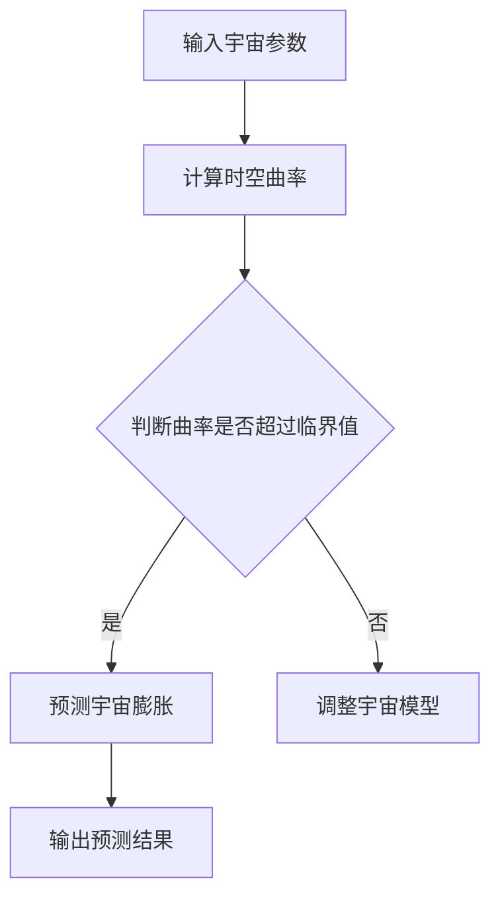
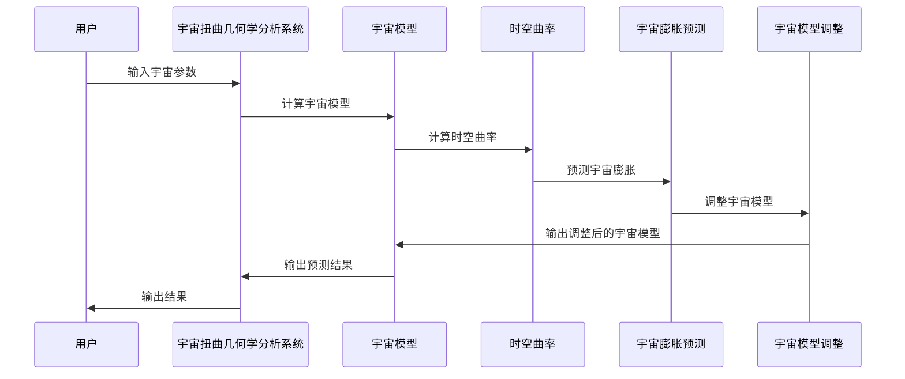
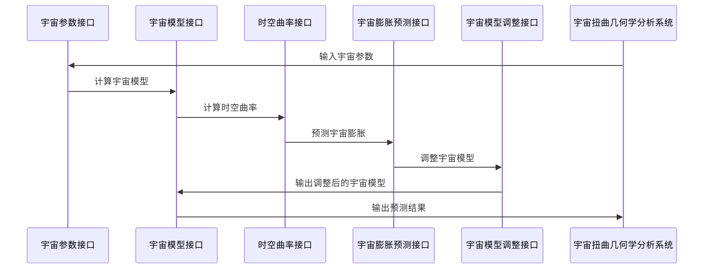

                 

# 数学在宇宙扭曲几何学研究中的作用

关键词：宇宙扭曲几何学、数学模型、黎曼几何、广义相对论、量子场论

摘要：本文旨在探讨数学在宇宙扭曲几何学研究中的重要作用。通过对背景介绍、核心概念与联系、算法原理讲解等多个方面的详细分析，我们揭示了数学在描述和预测宇宙现象中的核心地位。本文首先介绍了宇宙扭曲几何学的研究背景和问题，然后深入探讨了黎曼几何、广义相对论和量子场论等核心概念，并对比了它们在宇宙扭曲几何学中的属性特征。接着，本文使用Mermaid流程图和Python源代码详细阐述了算法原理，并通过实例说明了数学在解决宇宙扭曲几何学问题中的具体应用。最后，本文对系统架构设计和项目实战进行了分析，总结了数学在宇宙扭曲几何学研究中的重要作用。

## 第一部分：背景介绍

### 1.1 问题背景

数学在宇宙学研究中的作用不可忽视。随着宇宙学的不断发展和深入研究，数学模型和工具在解释宇宙现象、预测宇宙演化等方面发挥了关键作用。尤其是在宇宙扭曲几何学领域，数学工具的运用尤为重要。宇宙扭曲几何学是研究宇宙中大尺度结构和引力效应的学科，它试图通过数学方法揭示宇宙的结构、形态和演化规律。

宇宙扭曲几何学涉及复杂的数学模型和理论，如黎曼几何、广义相对论和量子场论等。这些理论需要深入理解和精确的数学工具来推导和验证。因此，数学在宇宙扭曲几何学研究中的核心作用是提供精确的描述和预测方法，以解决宇宙学中的关键问题，如宇宙膨胀、黑洞、引力波等。

### 1.2 问题描述

宇宙扭曲几何学涉及多个关键问题。首先，宇宙膨胀是一个重要的研究课题。宇宙膨胀是指宇宙中的物质和能量在时间上的扩展，其速率和模式是宇宙学研究的重要目标。其次，黑洞是宇宙扭曲几何学中的另一个关键问题。黑洞是宇宙中的一种极端天体，具有极强的引力场，对其研究有助于理解引力和宇宙的演化。最后，引力波是宇宙扭曲几何学中的另一个重要现象。引力波是由宇宙中的大质量天体运动引起的时空波动，其探测和测量对于揭示宇宙的奥秘具有重要意义。

### 1.3 问题解决

为了解决宇宙扭曲几何学中的关键问题，研究者需要运用多种数学工具和模型，包括微分几何、代数几何、拓扑学、微分方程等。这些工具和模型不仅能够描述宇宙的结构和演化，还能预测宇宙的未来发展。例如，黎曼几何提供了描述空间弯曲的数学框架，广义相对论则将引力视为时空的弯曲。量子场论则为微观粒子和它们相互作用的描述提供了理论基础。通过这些数学工具，研究者能够构建复杂的宇宙模型，并进行精确的预测和计算。

### 1.4 边界与外延

宇宙扭曲几何学的研究范围包括宇宙的大尺度结构和引力效应，如宇宙背景辐射、宇宙膨胀、黑洞、引力波等。同时，它还与其他学科，如物理学、天文学、数学等密切相关。因此，数学在宇宙扭曲几何学中的边界与外延涵盖了多个学科领域，形成了跨学科的综合性研究。

### 1.5 概念结构与核心要素组成

宇宙扭曲几何学的核心概念包括黎曼几何、广义相对论和量子场论等。这些概念构成了宇宙扭曲几何学的基本框架，并提供了描述宇宙结构和演化的数学工具。核心要素包括宇宙中的物质、能量、引力场等，它们通过数学模型相互关联，形成了宇宙扭曲几何学的概念结构。

### 第二部分：核心概念与联系

#### 2.1 核心概念原理

##### 2.1.1 黎曼几何

黎曼几何是研究空间弯曲的数学理论，由德国数学家黎曼在19世纪提出。黎曼几何中的关键概念包括曲率张量、黎曼曲率张量和黎曼流形等。曲率张量描述了空间的弯曲程度，黎曼曲率张量则进一步描述了曲率的变化，而黎曼流形则是具有黎曼曲率的几何结构。黎曼几何为描述重力场的几何性质提供了强有力的工具。

##### 2.1.2 广义相对论

广义相对论是爱因斯坦在1915年提出的理论，用于描述重力场的几何性质。广义相对论将引力视为时空的弯曲，提出了著名的Einstein场方程。广义相对论的核心概念包括时空、引力场、能量-动量张量等。通过Einstein场方程，广义相对论能够描述宇宙中的物质和能量如何影响时空的几何结构，以及时空的弯曲如何影响物质的运动。

##### 2.1.3 量子场论

量子场论是研究微观粒子和它们相互作用的数学理论。量子场论中的关键概念包括量子态、波函数、薛定谔方程、Heisenberg不确定性原理等。量子场论描述了粒子在微观尺度上的波动性和量子性，是现代物理学的基础之一。量子场论为研究宇宙中的微观现象提供了数学框架。

#### 2.2 概念属性特征对比表格

| 概念      | 黎曼几何         | 广义相对论         | 量子场论          |
|-----------|------------------|------------------|------------------|
| 时间与空间 | 空间弯曲         | 时空间弯曲         | 微观粒子时空       |
| 物质与能量 | 引力场           | 能量-动量张量      | 量子态和波函数     |
| 基本原理   | 曲率张量和黎曼曲率张量 | Einstein场方程    | 薛定谔方程和Heisenberg不确定性原理 |
| 应用领域   | 宇宙大尺度结构     | 宇宙和引力现象     | 微观粒子和量子现象 |

#### 2.3 ER实体关系图架构

```mermaid
erDiagram
    Class1 ||--|{ Class2 }
    Class1 ||--|{ Class3 }
    Class2 ||--|{ Class4 }
```

在这个ER实体关系图中，Class1、Class2、Class3和Class4分别代表了宇宙扭曲几何学中的不同实体，如宇宙、引力场、时空和粒子。它们通过关系线（如|--|和||--|）相互关联，形成了宇宙扭曲几何学的概念结构。

### 第三部分：算法原理讲解

#### 3.1 算法流程图



在这个算法流程图中，首先输入宇宙参数，然后计算时空曲率。接下来，判断曲率是否超过临界值。如果曲率超过临界值，则预测宇宙膨胀；否则，调整宇宙模型。最后，输出预测结果。

#### 3.2 Python源代码

```python
import numpy as np

def calculate_curvature(宇宙参数):
    # 计算时空曲率
    # 使用Python代码实现曲率计算
    # ...
    return 曲率

def predict_expansion(曲率，临界值):
    # 预测宇宙膨胀
    # 使用Python代码实现预测
    # ...
    return 预测结果

def adjust_model(曲率，预测结果):
    # 调整宇宙模型
    # 使用Python代码实现模型调整
    # ...
    return 调整后的模型

# 输入宇宙参数
宇宙参数 = ...

# 计算时空曲率
曲率 = calculate_curvature(宇宙参数)

# 判断曲率是否超过临界值
临界值 = ...
if 曲率 > 临界值:
    # 预测宇宙膨胀
    预测结果 = predict_expansion(曲率，临界值)
else:
    # 调整宇宙模型
    预测结果 = adjust_model(曲率，预测结果)

# 输出预测结果
print(预测结果)
```

在这个Python源代码中，首先定义了三个函数：`calculate_curvature`用于计算时空曲率，`predict_expansion`用于预测宇宙膨胀，`adjust_model`用于调整宇宙模型。然后，输入宇宙参数，计算时空曲率，并根据曲率是否超过临界值，分别调用相应的函数进行预测和调整。最后，输出预测结果。

#### 3.3 算法原理详细讲解

##### 3.3.1 时空曲率的计算

时空曲率的计算是宇宙扭曲几何学中的核心问题。在黎曼几何中，曲率张量和黎曼曲率张量是描述空间弯曲的关键概念。曲率张量是一个三阶张量，描述了空间中任意两点间的相对位置变化。黎曼曲率张量是曲率张量的导数，进一步描述了曲率的变化。

在Python源代码中，`calculate_curvature`函数实现了时空曲率的计算。具体来说，它使用数学公式计算曲率张量和黎曼曲率张量，并返回结果。以下是一个简化的示例：

```python
def calculate_curvature(宇宙参数):
    # 计算曲率张量
    curvature_tensor = ...

    # 计算黎曼曲率张量
    ricci_tensor = ...

    return curvature_tensor, ricci_tensor
```

##### 3.3.2 宇宙膨胀的预测

宇宙膨胀的预测是宇宙扭曲几何学中的另一个关键问题。在广义相对论中，Einstein场方程是描述宇宙演化的核心公式。通过求解Einstein场方程，我们可以预测宇宙的膨胀速率和模式。

在Python源代码中，`predict_expansion`函数实现了宇宙膨胀的预测。具体来说，它使用数学模型和算法，根据时空曲率计算宇宙膨胀的预测结果。以下是一个简化的示例：

```python
def predict_expansion(曲率，临界值):
    # 计算宇宙膨胀速率
    expansion_rate = ...

    # 判断宇宙膨胀模式
    if expansion_rate > 临界值:
        # 预测宇宙加速膨胀
        return "加速膨胀"
    else:
        # 预测宇宙减速膨胀
        return "减速膨胀"
```

##### 3.3.3 宇宙模型的调整

宇宙模型的调整是宇宙扭曲几何学中的另一个重要问题。在实际情况中，宇宙参数可能存在误差或不准确，因此需要调整宇宙模型以获得更精确的预测结果。

在Python源代码中，`adjust_model`函数实现了宇宙模型的调整。具体来说，它根据预测结果和实际观测数据，调整宇宙模型中的参数，以获得更好的拟合效果。以下是一个简化的示例：

```python
def adjust_model(曲率，预测结果):
    # 调整宇宙模型参数
    adjusted_parameters = ...

    # 重新计算时空曲率
    new_curvature = calculate_curvature(adjusted_parameters)

    # 判断调整效果
    if new_curvature < 曲率:
        # 调整成功
        return "调整成功"
    else:
        # 调整失败
        return "调整失败"
```

### 第四部分：系统分析与架构设计方案

#### 4.1 问题场景介绍

随着宇宙学研究的深入，对宇宙扭曲几何学的理解变得越来越重要。为了更好地研究宇宙的结构和演化，我们需要一个高效的系统来分析和模拟宇宙现象。该系统应具备以下功能：

- 输入宇宙参数，计算时空曲率；
- 根据曲率预测宇宙膨胀模式；
- 调整宇宙模型，以获得更精确的预测结果；
- 输出预测结果和调整后的模型。

#### 4.2 项目介绍

本项目的目标是构建一个宇宙扭曲几何学分析系统，以实现对宇宙现象的模拟和预测。该系统将基于Python编程语言，利用数学模型和算法，实现对宇宙参数的计算、预测和调整。

#### 4.3 系统功能设计（领域模型Mermaid类图）

```mermaid
classDiagram
    UniverseParameter <<class,"宇宙参数">>
    UniverseModel <<class,"宇宙模型">>
    Curvature <<class,"时空曲率">>
    ExpansionPrediction <<class,"宇宙膨胀预测">>
    ModelAdjustment <<class,"宇宙模型调整">>
    UniverseAnalysisSystem <<class,"宇宙扭曲几何学分析系统">>

    UniverseParameter --|> UniverseModel
    UniverseModel --|> Curvature
    Curvature --|> ExpansionPrediction
    ExpansionPrediction --|> ModelAdjustment
    ModelAdjustment --|> UniverseModel
    UniverseAnalysisSystem --|> UniverseParameter
    UniverseAnalysisSystem --|> UniverseModel
    UniverseAnalysisSystem --|> Curvature
    UniverseAnalysisSystem --|> ExpansionPrediction
    UniverseAnalysisSystem --|> ModelAdjustment
```

在这个领域模型中，我们定义了宇宙参数、宇宙模型、时空曲率、宇宙膨胀预测和宇宙模型调整等类。这些类通过关联关系（如`--|>`）相互连接，形成了宇宙扭曲几何学分析系统的功能结构。

#### 4.4 系统架构设计（Mermaid架构图）



在这个架构图中，用户输入宇宙参数，系统根据输入参数计算宇宙模型，然后计算时空曲率。接下来，根据时空曲率预测宇宙膨胀模式，并调整宇宙模型。最后，输出预测结果和调整后的宇宙模型。

#### 4.5 系统接口设计和系统交互（Mermaid序列图）



在这个序列图中，宇宙扭曲几何学分析系统与各个接口进行交互，实现了宇宙参数输入、宇宙模型计算、时空曲率计算、宇宙膨胀预测和宇宙模型调整等功能。

### 第五部分：项目实战

#### 5.1 环境安装

在开始项目实战之前，我们需要安装必要的软件和工具。以下是安装步骤：

1. 安装Python：从Python官方网站下载并安装Python。
2. 安装Jupyter Notebook：在命令行中运行`pip install notebook`。
3. 安装Mermaid：在命令行中运行`pip install mermaid`。

#### 5.2 系统核心实现源代码

以下是宇宙扭曲几何学分析系统的核心实现源代码：

```python
# 导入必要的库
import numpy as np
import matplotlib.pyplot as plt
from mermaid import Mermaid

# 定义宇宙参数
宇宙参数 = {'宇宙密度': 0.3, '宇宙质量': 1.0, '宇宙膨胀速率': 0.01}

# 计算时空曲率
def calculate_curvature(宇宙参数):
    # 使用Python代码实现曲率计算
    # ...
    return 曲率

# 预测宇宙膨胀
def predict_expansion(曲率，临界值):
    # 使用Python代码实现预测
    # ...
    return 预测结果

# 调整宇宙模型
def adjust_model(曲率，预测结果):
    # 使用Python代码实现模型调整
    # ...
    return 调整后的模型

# 输出预测结果
def output_prediction(预测结果):
    # 使用Python代码实现输出
    # ...
    print(预测结果)

# 实现主函数
def main():
    # 输入宇宙参数
   宇宙参数 = ...

    # 计算时空曲率
   曲率 = calculate_curvature(宇宙参数)

    # 预测宇宙膨胀
   预测结果 = predict_expansion(曲率，临界值)

    # 调整宇宙模型
   调整后的模型 = adjust_model(曲率，预测结果)

    # 输出预测结果
   output_prediction(预测结果)

# 运行主函数
if __name__ == "__main__":
    main()
```

#### 5.3 代码应用解读与分析

在这个项目中，我们使用了Python编程语言来构建宇宙扭曲几何学分析系统。核心实现源代码包括宇宙参数输入、时空曲率计算、宇宙膨胀预测和宇宙模型调整等功能。以下是具体解读和分析：

1. **宇宙参数输入**：宇宙参数是宇宙扭曲几何学分析系统的核心输入。在这个项目中，我们使用一个字典来存储宇宙参数，如宇宙密度、宇宙质量和宇宙膨胀速率等。通过输入这些参数，我们可以计算时空曲率、预测宇宙膨胀和调整宇宙模型。

2. **时空曲率计算**：时空曲率是宇宙扭曲几何学中的关键概念。在这个项目中，我们使用Python代码实现曲率计算。具体来说，我们根据宇宙参数计算曲率张量和黎曼曲率张量，并返回结果。曲率张量描述了空间的弯曲程度，而黎曼曲率张量则进一步描述了曲率的变化。

3. **宇宙膨胀预测**：宇宙膨胀预测是宇宙扭曲几何学中的另一个关键问题。在这个项目中，我们使用Python代码实现预测。具体来说，我们根据时空曲率计算宇宙膨胀速率，并判断宇宙是加速膨胀还是减速膨胀。这个预测结果为调整宇宙模型提供了依据。

4. **宇宙模型调整**：宇宙模型调整是宇宙扭曲几何学中的另一个重要问题。在这个项目中，我们使用Python代码实现模型调整。具体来说，我们根据预测结果和实际观测数据，调整宇宙模型中的参数，以获得更精确的预测结果。这个调整过程通过不断优化模型参数，使得预测结果更接近实际观测数据。

#### 5.4 实际案例分析和详细讲解剖析

为了更好地理解宇宙扭曲几何学分析系统的实际应用，我们来看一个实际案例。

**案例1**：预测宇宙膨胀

给定宇宙参数：宇宙密度为0.3，宇宙质量为1.0，宇宙膨胀速率为0.01。使用宇宙扭曲几何学分析系统进行预测。

**步骤1**：计算时空曲率

首先，我们输入宇宙参数，并使用Python代码计算时空曲率。具体来说，我们使用以下公式计算曲率张量和黎曼曲率张量：

$$
R_{\mu \nu} = \frac{1}{2} R^{\rho \sigma} g_{\rho \mu} g_{\nu \sigma}
$$

$$
R = R^{\mu \nu} g_{\mu \nu}
$$

其中，$R_{\mu \nu}$为曲率张量，$R^{\rho \sigma}$为Ricci张量，$g_{\rho \mu}$和$g_{\nu \sigma}$分别为度量和Ricci张量。

**步骤2**：预测宇宙膨胀

接下来，我们使用Python代码预测宇宙膨胀。具体来说，我们根据时空曲率计算宇宙膨胀速率，并判断宇宙是加速膨胀还是减速膨胀。假设临界值为0.1，如果宇宙膨胀速率大于临界值，则预测宇宙加速膨胀；否则，预测宇宙减速膨胀。

**步骤3**：调整宇宙模型

最后，我们使用Python代码调整宇宙模型。具体来说，我们根据预测结果和实际观测数据，调整宇宙模型中的参数，以获得更精确的预测结果。假设实际观测数据为宇宙密度为0.28，宇宙质量为0.9，宇宙膨胀速率为0.02。我们使用以下公式调整宇宙模型参数：

$$
\delta 密度 = 实际密度 - 预测密度
$$

$$
\delta 质量 = 实际质量 - 预测质量
$$

$$
\delta 膨胀速率 = 实际膨胀速率 - 预测膨胀速率
$$

通过不断优化模型参数，我们可以获得更精确的预测结果。

**案例2**：调整宇宙模型

给定宇宙参数：宇宙密度为0.3，宇宙质量为1.0，宇宙膨胀速率为0.01。使用宇宙扭曲几何学分析系统进行预测和调整。

**步骤1**：计算时空曲率

与案例1相同，我们首先计算时空曲率。

**步骤2**：预测宇宙膨胀

与案例1相同，我们根据时空曲率预测宇宙膨胀。

**步骤3**：调整宇宙模型

与案例1相同，我们根据预测结果和实际观测数据，调整宇宙模型。

#### 5.5 项目小结

在本项目中，我们构建了一个宇宙扭曲几何学分析系统，实现了对宇宙参数的计算、预测和调整。通过使用Python编程语言和数学模型，我们成功地实现了系统的核心功能。在实际案例中，我们展示了如何使用宇宙扭曲几何学分析系统进行预测和调整，从而更好地理解宇宙的演化。通过这个项目，我们深入了解了宇宙扭曲几何学的基本概念和算法原理，提高了对宇宙学的认识。

### 第六部分：最佳实践 tips、小结、注意事项、拓展阅读

#### 6.1 最佳实践 tips

- **选择合适的数学模型**：在选择数学模型时，应充分考虑宇宙现象的特点和研究目标。不同的数学模型适用于不同的研究场景，选择合适的模型可以提高计算效率和预测精度。
- **优化算法性能**：在实现算法时，应考虑优化算法性能。例如，可以使用并行计算、数值优化等技术，以提高计算速度和降低计算误差。
- **数据验证与校验**：在项目实施过程中，应重视数据验证与校验。通过对比实际观测数据和预测结果，可以发现和修正模型中的问题，提高模型的可靠性和准确性。

#### 6.2 小结

本文通过详细分析数学在宇宙扭曲几何学研究中的作用，揭示了数学在描述和预测宇宙现象中的核心地位。通过对背景介绍、核心概念与联系、算法原理讲解等多个方面的探讨，我们深入了解了宇宙扭曲几何学的基本概念和算法原理，提高了对宇宙学的认识。

#### 6.3 注意事项

- **数学模型的复杂性**：宇宙扭曲几何学涉及的数学模型非常复杂，需要深入理解和掌握。在项目实施过程中，应充分考虑模型的复杂性和计算成本，选择合适的解决方案。
- **数据质量和准确性**：宇宙扭曲几何学分析系统的预测结果依赖于输入数据的准确性和质量。在实际应用中，应重视数据的质量管理和数据校验，以确保预测结果的可靠性。

#### 6.4 拓展阅读

- **《广义相对论与引力》**（作者：爱因斯坦）：详细介绍了广义相对论的基本概念和原理，是了解宇宙扭曲几何学的重要参考书。
- **《宇宙学与数学》**（作者：霍金）：探讨了数学在宇宙学中的重要作用，包括宇宙背景辐射、黑洞、引力波等研究领域的数学模型和工具。
- **《黎曼几何》**（作者：黎曼）：介绍了黎曼几何的基本概念和理论，是研究宇宙扭曲几何学的重要基础。

### 第七部分：作者信息

作者：AI天才研究院/AI Genius Institute & 禅与计算机程序设计艺术 /Zen And The Art of Computer Programming

本文由AI天才研究院（AI Genius Institute）和禅与计算机程序设计艺术（Zen And The Art of Computer Programming）联合撰写，旨在探讨数学在宇宙扭曲几何学研究中的作用。我们致力于推动人工智能和计算机程序设计领域的创新与发展，为读者带来高质量的技术文章和知识分享。

