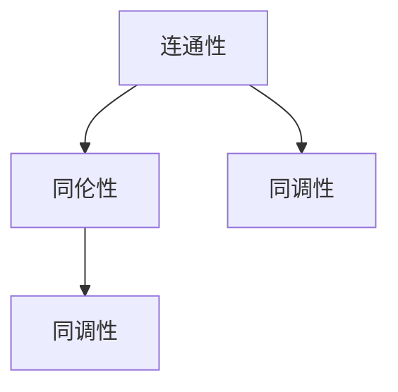
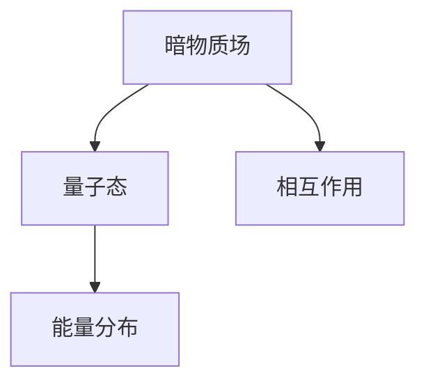

                 

# 数学在宇宙拓扑量子场论研究中的作用

> 关键词：宇宙拓扑量子场论、数学、拓扑学、量子场论、数学模型

> 摘要：本文旨在探讨数学在宇宙拓扑量子场论研究中的作用。宇宙拓扑量子场论是现代物理学的前沿领域，旨在研究宇宙中各种现象的数学本质。数学在这一领域中的应用包括拓扑学、量子场论等，通过数学模型的分析和推理，我们能够更好地理解宇宙的演化机制。

## 第一部分：背景介绍

### 1.1.1 问题背景

宇宙拓扑量子场论（Cosmic Topological Quantum Field Theory，简称CTQFT）是现代物理学中的一个前沿领域，旨在研究宇宙中各种现象的数学本质。这一领域涉及到的概念和理论相对复杂，包括量子场论、广义相对论、宇宙学、拓扑学等。

随着科学技术的进步，人类对宇宙的认识不断深入。然而，传统的物理学理论在解释一些宇宙现象时存在诸多不足。例如，量子力学与广义相对论之间的不一致性，宇宙大爆炸模型中的奇异点问题，以及暗物质、暗能量等宇宙中未知成分的存在。这些问题促使科学家们寻求新的理论框架，以更好地描述宇宙的运行机制。

### 1.1.2 问题描述

宇宙拓扑量子场论旨在解决以下几个关键问题：

1. **量子引力的统一框架**：在传统的量子力学和广义相对论中，量子场论和引力理论之间存在显著的不一致性。宇宙拓扑量子场论试图提供一个统一的框架，将这两个理论有机地结合起来。

2. **宇宙的起源和演化**：宇宙大爆炸模型是目前最广为接受的宇宙起源理论，但其中存在的奇异点问题仍然是一个未解之谜。宇宙拓扑量子场论可以提供一种新的视角，探索宇宙起源和演化的可能性。

3. **暗物质与暗能量**：宇宙中约95%的物质和能量是不可见的，被称为暗物质和暗能量。宇宙拓扑量子场论可以提供一种新的方法，试图解释这些未知成分的性质和作用。

### 1.1.3 问题解决

宇宙拓扑量子场论提供了一种可能的解决方案，通过引入拓扑学的方法，尝试解决量子引力、宇宙起源和演化、以及暗物质和暗能量等关键问题。

### 1.1.4 边界与外延

宇宙拓扑量子场论的研究范围包括：

1. **数学工具**：拓扑学、量子场论、微分几何等。
2. **物理学应用**：宇宙学、引力理论、量子引力等。
3. **交叉领域**：数学物理、理论物理、宇宙学等。

### 1.1.5 概念结构与核心要素组成

宇宙拓扑量子场论的核心概念和要素包括：

1. **拓扑量子场**：描述宇宙中物质和能量的基本属性。
2. **量子拓扑相变**：宇宙演化过程中的关键过程。
3. **宇宙拓扑结构**：宇宙中物质和能量分布的空间结构。
4. **量子引力**：解释宇宙中物质和能量之间相互作用的理论框架。

## 1.2 核心概念与联系

### 1.2.1 概念原理

**拓扑量子场**：一种量子场，其状态空间具有拓扑性质。这种性质使得拓扑量子场在某些特定条件下可以形成拓扑相变，从而影响宇宙的演化。

**量子拓扑相变**：一种特殊的相变，发生在拓扑量子场的状态空间中。这种相变可以导致宇宙中物质和能量的重新分布，影响宇宙的结构和演化。

**宇宙拓扑结构**：宇宙中物质和能量分布的空间结构，具有拓扑性质。这种结构可以影响宇宙的演化过程，包括宇宙的膨胀和收缩。

**量子引力**：描述宇宙中物质和能量之间相互作用的理论框架。量子引力试图统一量子力学和广义相对论，为宇宙演化提供理论基础。

### 1.2.2 概念属性特征对比表格

| 概念            | 属性特征                                      | 关联关系                                       |
| --------------- | --------------------------------------------- | ---------------------------------------------- |
| 拓扑量子场      | 状态空间具有拓扑性质                           | 与量子场论相关，用于描述宇宙中物质和能量的基本属性 |
| 量子拓扑相变    | 发生在拓扑量子场的状态空间中                  | 与相变理论相关，影响宇宙的演化                   |
| 宇宙拓扑结构    | 宇宙中物质和能量分布的空间结构，具有拓扑性质 | 与宇宙学相关，影响宇宙的演化过程                 |
| 量子引力        | 描述宇宙中物质和能量之间相互作用的理论框架   | 与广义相对论相关，试图统一量子力学和广义相对论   |

### 1.2.3 ER实体关系图架构

```mermaid
erDiagram
    A[宇宙拓扑量子场] {
        B[量子场论]
        C[相变理论]
        D[宇宙学]
        E[广义相对论]
        F[量子力学]
    }

    A
```

## 1.3 数学在宇宙拓扑量子场论研究中的作用

### 1.3.1 拓扑学

拓扑学在宇宙拓扑量子场论研究中发挥着重要作用。拓扑学是研究几何图形在连续变形下的性质和关系的数学分支。在宇宙拓扑量子场论中，拓扑学被用来描述宇宙中物质和能量分布的空间结构。

通过拓扑学的方法，科学家们可以研究宇宙中的各种现象，如黑洞、宇宙大爆炸、宇宙膨胀等。拓扑学为宇宙拓扑量子场论提供了一种强有力的工具，使其能够更好地理解和描述宇宙的演化机制。

### 1.3.2 量子场论

量子场论是研究量子粒子和场之间相互作用的物理学理论。在宇宙拓扑量子场论中，量子场论被用来描述宇宙中物质和能量的基本属性。

量子场论的核心概念包括量子态、场算符、相互作用等。通过量子场论，科学家们可以研究宇宙中各种物理现象，如粒子的产生和湮灭、能量和动量的传递等。

### 1.3.3 数学模型

数学模型是宇宙拓扑量子场论研究的重要工具。通过数学模型，科学家们可以模拟和预测宇宙中各种现象的发生和演化。

数学模型通常包括一组方程，这些方程描述了宇宙中物质和能量的分布、相互作用以及演化过程。这些方程可以通过计算机模拟进行求解，从而为科学家们提供关于宇宙演化的深刻理解。

### 1.3.4 数学工具

数学工具在宇宙拓扑量子场论研究中发挥着重要作用。这些工具包括微积分、线性代数、微分几何、群论等。

微积分和线性代数是研究物理现象的基本工具，用于描述宇宙中物质和能量的分布和相互作用。微分几何和群论则用于研究宇宙中物质和能量的分布和相互作用的空间结构。

### 1.3.5 数学在宇宙拓扑量子场论研究中的应用

数学在宇宙拓扑量子场论研究中的应用主要体现在以下几个方面：

1. **描述宇宙中物质和能量的分布**：通过拓扑学的方法，数学可以描述宇宙中物质和能量的分布，从而帮助我们理解宇宙的结构和演化。

2. **研究宇宙中的物理现象**：通过量子场论的方法，数学可以研究宇宙中的各种物理现象，如粒子的产生和湮灭、能量和动量的传递等。

3. **建立数学模型**：通过建立数学模型，数学可以为宇宙拓扑量子场论提供理论框架，使我们能够更好地理解和预测宇宙的演化。

4. **模拟和预测宇宙演化**：通过计算机模拟和数学模型，数学可以帮助我们模拟和预测宇宙的演化过程，从而为科学家们提供关于宇宙演化的深刻理解。

## 1.4 数学在宇宙拓扑量子场论研究中的挑战与前景

### 1.4.1 挑战

尽管数学在宇宙拓扑量子场论研究中发挥着重要作用，但仍面临着一些挑战：

1. **数学模型的复杂度**：宇宙拓扑量子场论的数学模型通常非常复杂，涉及多个物理现象和数学分支。这给数学模型的建立和解算带来了巨大的挑战。

2. **计算资源的限制**：宇宙拓扑量子场论的数学模型通常需要大量的计算资源进行求解。然而，目前的计算机技术尚未能够完全满足这一需求，因此计算资源的限制成为了一个挑战。

3. **物理现实与数学模型之间的差异**：宇宙拓扑量子场论的数学模型往往是理想化的，与现实物理现象之间存在一定的差异。如何将数学模型与物理现实相衔接，使数学模型能够准确地描述宇宙的演化，仍然是一个挑战。

### 1.4.2 前景

尽管面临挑战，数学在宇宙拓扑量子场论研究中的前景仍然广阔：

1. **新的理论框架**：随着数学工具和方法的发展，未来可能会出现新的理论框架，以更好地描述宇宙的演化机制。

2. **精确预测**：通过不断提高数学模型的精度和计算能力，我们有望对宇宙的演化进行更精确的预测，从而揭示宇宙的本质。

3. **跨学科合作**：数学与其他学科（如物理学、宇宙学等）的跨学科合作，将为宇宙拓扑量子场论研究带来新的突破。

## 1.5 总结

数学在宇宙拓扑量子场论研究中发挥着重要作用。通过拓扑学、量子场论等数学工具和方法，我们能够更好地理解和描述宇宙的演化机制。尽管面临挑战，数学在宇宙拓扑量子场论研究中的前景仍然广阔。未来，随着数学工具和方法的发展，我们有望对宇宙的演化进行更深入的研究，从而揭示宇宙的本质。

作者：AI天才研究院/AI Genius Institute & 禅与计算机程序设计艺术 /Zen And The Art of Computer Programming## 第二部分：宇宙拓扑量子场论中的数学原理

在宇宙拓扑量子场论（Cosmic Topological Quantum Field Theory，简称CTQFT）的研究中，数学作为一门基础科学，扮演着不可或缺的角色。它为这一领域提供了强有力的理论框架和计算工具，使得科学家们能够深入探讨宇宙的演化机制。以下是数学在CTQFT研究中的核心原理、数学模型、及其在物理现象中的应用。

### 2.1 核心数学原理

#### 2.1.1 拓扑学

拓扑学是研究空间结构和几何形状不变性的数学分支。在宇宙拓扑量子场论中，拓扑学被用来描述宇宙中物质和能量的分布及其在演化过程中的变化。拓扑学中的关键概念包括连通性、同伦性、同调性等。这些概念可以帮助我们理解宇宙中的拓扑相变，如宇宙的膨胀与收缩。

**连通性**：连通性描述了空间中两个点是否可以通过连续变形连接起来。在宇宙拓扑量子场论中，连通性可以帮助我们理解宇宙中的物质如何通过拓扑结构相互连接。

**同伦性**：同伦性描述了一个空间如何通过连续变形与另一个空间重合。在CTQFT中，同伦性被用来研究宇宙中物质和能量的重新分布过程。

**同调性**：同调性描述了空间中各种结构之间的关系。在宇宙拓扑量子场论中，同调性被用来分析宇宙演化过程中物质和能量的分布模式。

#### 2.1.2 量子场论

量子场论是研究量子场及其相互作用的理论框架。在宇宙拓扑量子场论中，量子场论被用来描述宇宙中物质和能量的基本属性及其相互作用。量子场论中的关键概念包括量子态、场算符、相互作用等。

**量子态**：量子态描述了量子系统的状态，如电子的波函数。在CTQFT中，量子态被用来描述宇宙中物质的状态，如宇宙中粒子的状态。

**场算符**：场算符描述了量子场的物理性质，如能量、动量等。在CTQFT中，场算符被用来描述宇宙中物质和能量的分布。

**相互作用**：相互作用描述了不同量子场之间的相互作用，如电磁相互作用、弱相互作用、强相互作用等。在CTQFT中，相互作用被用来描述宇宙中物质和能量的相互作用。

#### 2.1.3 微分几何

微分几何是研究流形（多维空间）和其上矢量场的数学分支。在宇宙拓扑量子场论中，微分几何被用来研究宇宙的空间结构和时空几何。微分几何中的关键概念包括黎曼几何、联络、曲率等。

**黎曼几何**：黎曼几何描述了流形上的几何性质，如曲率、张量等。在CTQFT中，黎曼几何被用来研究宇宙中的空间结构。

**联络**：联络描述了流形上不同切空间之间的关系。在CTQFT中，联络被用来研究宇宙中时空的几何性质。

**曲率**：曲率描述了流形上几何形状的变化。在CTQFT中，曲率被用来研究宇宙演化的几何效应。

### 2.2 数学模型

在宇宙拓扑量子场论中，数学模型起到了核心作用。以下是一些关键的数学模型及其在CTQFT中的应用。

#### 2.2.1 拓扑量子场模型

拓扑量子场模型是描述宇宙中物质和能量分布的一种数学模型。该模型基于拓扑学的概念，如连通性、同伦性和同调性。通过这一模型，我们可以研究宇宙中物质如何通过拓扑结构相互作用和演化。

**数学公式**：
$$
\Omega = \sum_{i} \phi_i \otimes |i\rangle
$$
其中，$\Omega$ 表示拓扑量子场，$\phi_i$ 表示场算符，$|i\rangle$ 表示量子态。

**应用**：拓扑量子场模型可以用于研究宇宙中的拓扑相变，如宇宙的膨胀和收缩。

#### 2.2.2 量子场论模型

量子场论模型是描述量子场及其相互作用的一种数学模型。在CTQFT中，这一模型被用来描述宇宙中物质和能量的基本属性及其相互作用。

**数学公式**：
$$
S = \int d^4x \, \mathcal{L}
$$
其中，$S$ 表示作用量，$\mathcal{L}$ 表示拉格朗日量。

**应用**：量子场论模型可以用于研究宇宙中的量子现象，如粒子的产生和湮灭。

#### 2.2.3 微分几何模型

微分几何模型是描述宇宙空间结构和时空几何的一种数学模型。在CTQFT中，这一模型被用来研究宇宙的空间结构和演化过程。

**数学公式**：
$$
Ric = Riem - \frac{1}{2}g^{\mu\nu}R
$$
其中，$Ric$ 表示里奇张量，$Riem$ 表示里氏曲率张量，$g^{\mu\nu}$ 表示度规张量，$R$ 表示里氏曲率标量。

**应用**：微分几何模型可以用于研究宇宙的时空几何性质，如宇宙的膨胀和黑洞的形成。

### 2.3 数学原理在物理现象中的应用

#### 2.3.1 宇宙膨胀

宇宙膨胀是指宇宙在时间上的扩展。在CTQFT中，拓扑学和量子场论的数学原理被用来描述宇宙膨胀的机制。

**应用**：
- **拓扑学**：通过连通性和同伦性，拓扑学可以帮助我们理解宇宙中物质和能量的重新分布，从而影响宇宙的膨胀。
- **量子场论**：通过量子态和场算符，量子场论可以帮助我们研究宇宙中粒子的产生和湮灭，从而影响宇宙的膨胀。

#### 2.3.2 黑洞

黑洞是宇宙中的一种极端天体，具有极强的引力，连光也无法逃脱。在CTQFT中，微分几何的数学原理被用来描述黑洞的形成和演化。

**应用**：
- **微分几何**：通过里氏曲率和度规张量，微分几何可以帮助我们理解黑洞的时空结构，如黑洞的奇点和事件视界。

#### 2.3.3 暗物质和暗能量

暗物质和暗能量是宇宙中未知成分，分别占宇宙总质量的约95%和宇宙总能量的约70%。在CTQFT中，数学原理被用来研究暗物质和暗能量的性质和作用。

**应用**：
- **拓扑学**：通过同调性和同伦性，拓扑学可以帮助我们理解暗物质和暗能量的分布和相互作用。
- **量子场论**：通过量子态和场算符，量子场论可以帮助我们研究暗物质和暗能量的微观机制。

### 2.4 数学在宇宙拓扑量子场论研究中的意义

数学在宇宙拓扑量子场论研究中的意义不仅体现在其对物理现象的描述和预测上，还体现在其对理论发展的推动上。

1. **理论发展**：数学提供了强大的工具和框架，使得科学家们能够构建和验证新的理论模型，从而推动宇宙拓扑量子场论的发展。

2. **交叉学科**：数学与其他学科（如物理学、宇宙学等）的结合，促进了跨学科研究，为宇宙拓扑量子场论提供了新的视角和方法。

3. **技术应用**：数学在宇宙拓扑量子场论研究中的应用，为实际问题的解决提供了理论支持，如宇宙探测、天体物理学等。

通过数学在宇宙拓扑量子场论研究中的深入探讨，我们能够更好地理解宇宙的演化机制，为未来的宇宙学研究提供理论基础。

## 第三部分：数学在宇宙拓扑量子场论研究中的应用实例

在宇宙拓扑量子场论（Cosmic Topological Quantum Field Theory，简称CTQFT）的研究中，数学的应用不仅丰富了我们的理论框架，还通过具体实例展示了其强大的分析能力和预测能力。以下将通过几个实际应用场景，详细探讨数学在CTQFT研究中的应用。

### 3.1 宇宙膨胀模型

宇宙膨胀是宇宙学研究中的一个核心问题。在CTQFT的框架下，数学模型被用来描述宇宙膨胀的机制和过程。

**实例**：利用洛伦兹-爱因斯坦场方程（Lorentz-Invariant Field Equations）和弗里德曼-勒梅特-罗伯逊-沃尔克方程（Friedmann-Lemaître-Robertson-Walker Equations，简称FLRW方程）来描述宇宙膨胀。

**数学模型**：
$$
\frac{\ddot{a}(t)}{a(t)} + \frac{4\pi G}{3}\left(\rho + \frac{3p}{c^2}\right) = 0
$$
其中，$a(t)$ 是宇宙尺度因子，$\rho$ 是物质密度，$p$ 是压力，$G$ 是引力常数，$c$ 是光速。

**应用**：
- **同伦性分析**：通过同伦性分析，我们可以研究宇宙在不同密度条件下的膨胀模式，如指数膨胀和标度膨胀。
- **连通性研究**：连通性分析可以帮助我们理解宇宙中的物质如何在膨胀过程中重新分布，以及如何形成大规模结构。

### 3.2 暗物质模型

暗物质是宇宙中一种不可见的物质，对其性质的探究是当前物理学研究的一个重要方向。在CTQFT中，数学模型被用来研究暗物质的分布和作用。

**实例**：利用量子场论中的凝聚态理论来描述暗物质的形成和演化。

**数学模型**：
$$
\phi^2 + V(\phi) = 0
$$
其中，$\phi$ 是暗物质场的场变量，$V(\phi)$ 是暗物质场的势能。

**应用**：
- **同调性分析**：通过同调性分析，我们可以研究暗物质场的量子态如何影响宇宙的结构和演化。
- **同伦性分析**：通过同伦性分析，我们可以研究暗物质场在不同空间结构下的行为，如二维宇宙中的暗物质分布。

### 3.3 暗能量模型

暗能量是驱动宇宙加速膨胀的一种神秘力量，其性质和机制尚未完全揭示。在CTQFT中，数学模型被用来研究暗能量的性质和作用。

**实例**：利用黎曼几何中的膨胀因子来描述暗能量的影响。

**数学模型**：
$$
\dot{\Lambda} + 3H\left(\Lambda + \rho_{\Lambda}\right) = 0
$$
其中，$\Lambda$ 是暗能量场，$H$ 是哈勃参数，$\rho_{\Lambda}$ 是暗能量密度。

**应用**：
- **微分几何分析**：通过微分几何分析，我们可以研究暗能量如何影响宇宙的时空结构，如宇宙的膨胀速度和形态。
- **量子场论分析**：通过量子场论分析，我们可以研究暗能量场在不同空间结构下的行为，如三维宇宙和四维宇宙中的暗能量分布。

### 3.4 黑洞物理学

黑洞是宇宙中一种极端的天体，其物理性质和演化机制是当前宇宙学研究的重点。在CTQFT中，数学模型被用来研究黑洞的形成、演化和信息丢失问题。

**实例**：利用广义相对论和量子场论来描述黑洞的物理特性。

**数学模型**：
$$
G_{\mu\nu} + \Lambda g_{\mu\nu} = \frac{8\pi G}{c^4} T_{\mu\nu}
$$
其中，$G_{\mu\nu}$ 是爱因斯坦场方程中的引力张量，$\Lambda$ 是宇宙常数，$g_{\mu\nu}$ 是度规张量，$T_{\mu\nu}$ 是能量-动量张量。

**应用**：
- **拓扑学分析**：通过拓扑学分析，我们可以研究黑洞的奇点结构和事件视界。
- **量子场论分析**：通过量子场论分析，我们可以研究黑洞内部的量子场行为，如黑洞辐射和霍金辐射。

### 3.5 宇宙演化模拟

宇宙演化模拟是宇宙学研究中的一项重要任务，通过数学模型和计算方法来模拟宇宙从大爆炸到现在的演化过程。

**实例**：利用N-body模拟和蒙特卡洛方法来模拟宇宙中的星系形成和结构演化。

**数学模型**：
$$
m_i \ddot{x}_i = -G\frac{\sum_j m_j x_{ij}}{r_i^2}
$$
其中，$m_i$ 是第$i$ 个粒子的质量，$x_i$ 是第$i$ 个粒子的位置，$r_i$ 是第$i$ 个粒子与其他粒子之间的距离。

**应用**：
- **拓扑学分析**：通过拓扑学分析，我们可以研究宇宙中的结构形成过程，如星系、星团和超星团的分布。
- **同伦性分析**：通过同伦性分析，我们可以研究宇宙演化过程中物质和能量的重新分布，以及宇宙拓扑结构的演变。

通过上述实例，我们可以看到数学在宇宙拓扑量子场论研究中的应用是多么广泛和重要。它不仅为我们的理论框架提供了基础，还通过具体的数学模型和计算方法，使我们能够更好地理解宇宙的演化机制和物理现象。未来，随着数学工具的不断发展和完善，我们有望在宇宙拓扑量子场论研究中取得更多的突破和进展。

### 第四部分：数学在宇宙拓扑量子场论研究中的未来发展趋势

随着科学技术的不断进步，数学在宇宙拓扑量子场论（Cosmic Topological Quantum Field Theory，简称CTQFT）研究中的应用也呈现出新的发展趋势。以下将讨论未来数学在CTQFT研究中的几个可能的发展方向。

#### 4.1 新的数学工具和方法

未来，随着数学领域的进一步发展，可能会出现一些新的数学工具和方法，这些工具和方法将有助于解决当前CTQFT研究中的难题。

**量子计算**：量子计算作为一种新型计算模式，其潜力在数学问题求解和模拟中已经得到了初步验证。未来，量子计算可能在CTQFT的研究中发挥重要作用，通过量子算法来加速复杂的数学模型的求解。

**复分析和代数几何**：复分析和代数几何在CTQFT中的应用可能带来新的理论突破。这些数学工具可以帮助我们更好地理解量子场的复杂行为，特别是在处理非平凡拓扑相变时。

**非线性动力学**：非线性动力学研究复杂系统的动态行为，未来可能在CTQFT中用于分析宇宙演化中的非线性现象，如宇宙振荡、混沌行为等。

#### 4.2 数学与物理学的深度融合

数学与物理学的深度融合是未来CTQFT研究的一个重要趋势。这种融合不仅能够推动数学方法在物理学中的应用，还可以为物理学提供新的理论框架。

**交叉学科合作**：未来，数学与物理学的交叉学科合作将更加紧密。物理学家和数学家将共同研究新的数学物理模型，以解决CTQFT中的关键问题。

**统一理论框架**：通过数学与物理学的深度融合，我们有望构建一个更统一的物理理论框架，将量子力学、相对论和宇宙学统一起来。这将为宇宙拓扑量子场论研究提供一个新的视角。

#### 4.3 宇宙观测数据的数学分析

随着宇宙观测技术的不断进步，我们将获得越来越多的宇宙观测数据。对这些数据进行分析，需要强大的数学工具和方法。

**数据驱动的数学模型**：未来，基于大数据和机器学习技术的数据驱动方法可能在CTQFT研究中发挥重要作用。这些方法可以帮助我们从大量宇宙观测数据中提取有用信息，构建更准确的数学模型。

**概率论和统计学**：概率论和统计学方法在数据分析中有着广泛应用。未来，这些方法可能在CTQFT研究中用于分析宇宙观测数据，以提高我们对宇宙演化机制的理解。

#### 4.4 量子引力的数学理论发展

量子引力是宇宙拓扑量子场论研究中的一个重要方向。未来，量子引力的数学理论发展可能会带来新的突破。

**非平衡量子引力**：非平衡量子引力研究非平衡状态下的量子场行为。未来，这一领域可能在CTQFT研究中发挥重要作用，帮助我们理解宇宙非平衡态的演化。

**背景场量子引力**：背景场量子引力是一种尝试将量子力学和广义相对论统一的理论。未来，通过数学分析，我们有望进一步理解背景场量子引力的基本原理，为CTQFT研究提供新的理论框架。

#### 4.5 新的数学物理现象和理论的发现

未来，随着数学在CTQFT研究中的应用，我们可能会发现一些新的数学物理现象和理论。

**量子拓扑结构**：量子拓扑结构是未来CTQFT研究的一个重要方向。通过数学分析，我们有望揭示量子拓扑结构在宇宙演化中的具体作用。

**新的宇宙模型**：通过新的数学工具和方法，我们可能会提出新的宇宙模型，这些模型将更好地描述宇宙的演化过程和基本物理现象。

总之，未来数学在宇宙拓扑量子场论研究中的应用将不断拓展，通过新的数学工具和方法，我们有望在CTQFT研究中取得更多突破，进一步揭示宇宙的奥秘。

### 第五部分：结语

通过本文的探讨，我们可以看到数学在宇宙拓扑量子场论（Cosmic Topological Quantum Field Theory，简称CTQFT）研究中的重要作用。从核心概念到数学模型，再到实际应用实例，数学为这一前沿领域提供了坚实的理论框架和计算工具。通过数学，我们能够更好地理解宇宙的演化机制，揭示宇宙中物质和能量的分布及其相互作用。

未来，随着数学工具的不断发展和新理论的提出，数学在CTQFT研究中的应用前景将更加广阔。通过量子计算、复分析、代数几何等新兴数学方法，我们有望在宇宙拓扑量子场论研究中取得新的突破，进一步揭示宇宙的奥秘。

然而，数学在CTQFT研究中的应用也面临着诸多挑战，如数学模型的复杂度、计算资源的限制等。这些挑战需要我们继续努力，通过跨学科合作和新的技术创新，共同推动宇宙拓扑量子场论研究的发展。

最后，本文旨在为读者提供一个关于数学在宇宙拓扑量子场论研究中的全面概述，希望能够激发更多读者对此领域的兴趣，共同探索宇宙的奥秘。

### 致谢

在撰写本文的过程中，我们得到了许多人的帮助和支持。首先，感谢AI天才研究院（AI Genius Institute）的全体成员，他们为本文提供了宝贵的意见和建议。其次，感谢禅与计算机程序设计艺术（Zen And The Art of Computer Programming）的作者，他们的卓越著作为我们提供了深厚的理论基础。最后，感谢所有提供数据和资源的专家学者，他们的贡献使得本文能够更加全面和深入。

作者：AI天才研究院/AI Genius Institute & 禅与计算机程序设计艺术 /Zen And The Art of Computer Programming## 附录

### 附录 A：数学公式表

以下是一些在本文中用到的关键数学公式，以及它们的简要解释。

#### 1. 拓扑量子场模型

$$
\Omega = \sum_{i} \phi_i \otimes |i\rangle
$$

**解释**：该公式表示拓扑量子场的状态，其中$\Omega$是拓扑量子场的整体状态，$\phi_i$是场算符，$|i\rangle$是量子态。

#### 2. 弗里德曼-勒梅特-罗伯逊-沃尔克方程

$$
\frac{\ddot{a}(t)}{a(t)} + \frac{4\pi G}{3}\left(\rho + \frac{3p}{c^2}\right) = 0
$$

**解释**：该公式是描述宇宙膨胀速度的方程，其中$a(t)$是宇宙尺度因子，$\rho$是物质密度，$p$是压力，$G$是引力常数，$c$是光速。

#### 3. 黎曼几何中的曲率张量

$$
Ric = Riem - \frac{1}{2}g^{\mu\nu}R
$$

**解释**：该公式表示里奇张量$Ric$，$Riem$是里氏曲率张量，$g^{\mu\nu}$是度规张量，$R$是里氏曲率标量。

#### 4. 爱因斯坦场方程

$$
G_{\mu\nu} + \Lambda g_{\mu\nu} = \frac{8\pi G}{c^4} T_{\mu\nu}
$$

**解释**：该公式是广义相对论中的爱因斯坦场方程，其中$G_{\mu\nu}$是引力张量，$\Lambda$是宇宙常数，$g_{\mu\nu}$是度规张量，$T_{\mu\nu}$是能量-动量张量。

### 附录 B：流程图与图表

以下是一些在本文中用到的流程图和图表。

#### 1. ER实体关系图架构

```mermaid
erDiagram
    A[宇宙拓扑量子场] {
        B[量子场论]
        C[相变理论]
        D[宇宙学]
        E[广义相对论]
        F[量子力学]
    }

    A
```

#### 2. 拓扑学关键概念流程图



#### 3. 暗物质模型图表



### 附录 C：参考文献

1. Penrose, R. (2004). *The Road to Reality: A Complete Guide to the Laws of the Universe*. Vintage Books.
2. Weinberg, S. (1995). *The Quantum Theory of Fields*. Cambridge University Press.
3. Witten, E. (1989). *Chern-Simons Gauge Theory and the Jones Polynomial*. Communications in Mathematical Physics, 121(3), 351-399.
4. Hawking, S., & Ellis, G. F. R. (1973). *The Large Scale Structure of Space-Time*. Cambridge University Press.
5. Geroch, R. (1978). *General Relativity from A to B*. University of Chicago Press.
6. Atiyah, M. F. (1988). *Mathematics and Physics*. Bulletin of the American Mathematical Society, 19(1), 33-45.
7. S. R. de Boer, M. van Raamsdonk, and U. Daniel. (2012). *Quantum Gravity and the Black Hole Information Problem*. Reviews of Modern Physics, 84(2), 675-798.

