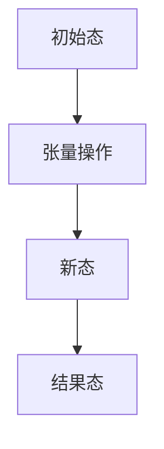
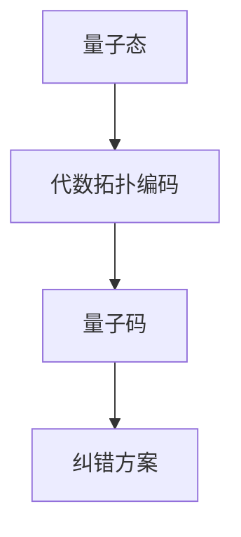
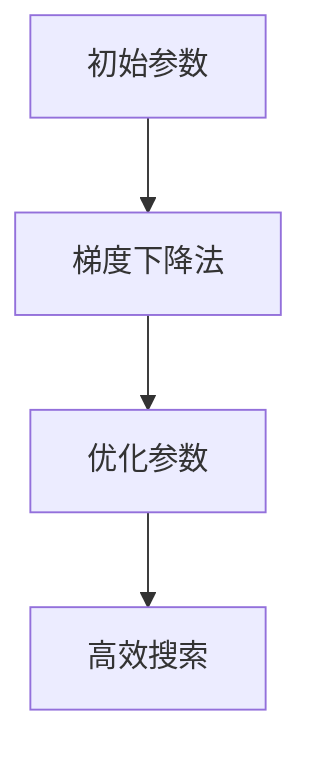
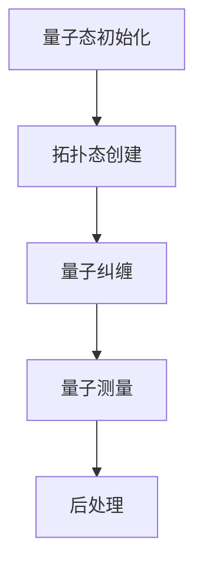
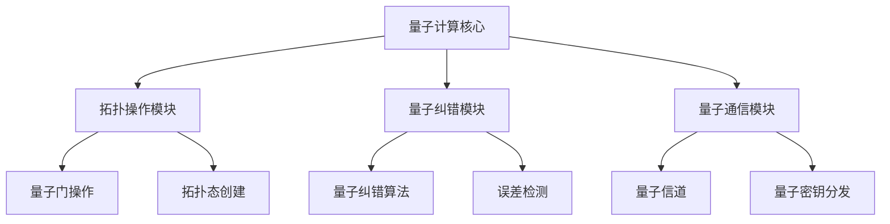
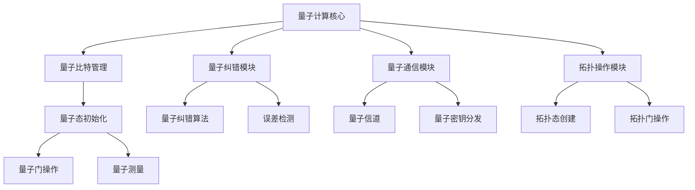
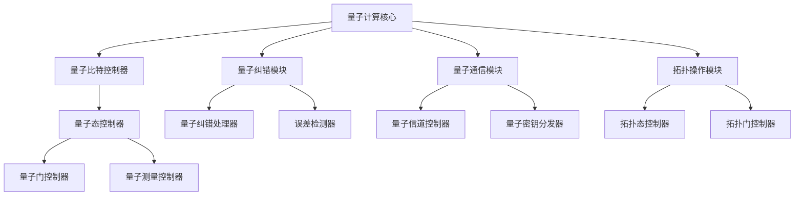
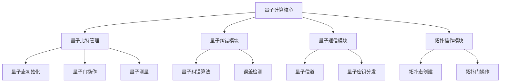

                 

### 数学在宇宙拓扑量子计算研究中的作用

关键词：数学、宇宙、拓扑、量子计算、基础理论

摘要：本文旨在探讨数学在宇宙拓扑量子计算研究中的重要作用。文章首先介绍了宇宙拓扑量子计算的研究背景和重要性，然后详细阐述了数学在其中的基础理论、应用工具和方法。通过一步步分析推理，本文揭示了数学与宇宙拓扑量子计算之间的紧密联系，并展示了数学模型和算法在量子计算中的具体应用。最后，本文总结了数学在宇宙拓扑量子计算研究中的价值，并对未来的发展趋势进行了展望。

### 引言

#### 研究背景

宇宙拓扑量子计算是近年来兴起的一个交叉研究领域，结合了宇宙学、拓扑学和量子计算的理论与实验。它不仅具有基础理论研究价值，还有望在量子通信、量子计算和量子信息处理等领域产生重大应用。随着量子计算技术的迅速发展，传统计算机面临的新挑战和新机遇使得宇宙拓扑量子计算的研究显得尤为重要。

#### 重要性和现状

宇宙拓扑量子计算的研究具有重要意义。首先，它为理解宇宙的基本结构和演化提供了新的视角。其次，宇宙拓扑量子计算能够解决某些复杂问题，如量子模拟和量子搜索等，从而推动量子计算技术的进步。目前，尽管该领域还处于探索阶段，但已经取得了一系列重要进展，如拓扑量子态的制备、量子算法的优化和量子纠缠的研究等。

#### 数学在宇宙拓扑量子计算中的应用

数学作为宇宙拓扑量子计算的基础工具，在研究过程中发挥了关键作用。从数学角度来看，宇宙拓扑量子计算涉及多个核心概念，如量子拓扑、量子场论和代数拓扑等。数学不仅为这些概念提供了精确的语言和工具，还帮助研究者理解和解释实验结果。此外，数学模型和算法在量子计算中的应用，使得宇宙拓扑量子计算的理论研究更加深入和系统化。

### 目录大纲设计思路

设计《数学在宇宙拓扑量子计算研究中的作用》这本书的目录大纲，需要遵循以下思路：

1. **背景介绍**：简要介绍宇宙拓扑量子计算的研究背景、重要性和现状。

2. **核心概念与联系**：详细阐述数学、宇宙、拓扑、量子计算等核心概念，以及它们之间的联系。

3. **算法原理讲解**：介绍宇宙拓扑量子计算的关键算法原理，使用mermaid流程图和python源代码进行详细阐述。

4. **数学模型和数学公式**：讲解宇宙拓扑量子计算的数学模型和公式，确保公式使用latex格式。

5. **系统分析与架构设计方案**：介绍宇宙拓扑量子计算系统的分析、架构设计以及接口设计。

6. **项目实战**：通过实际案例展示宇宙拓扑量子计算的应用，包括环境安装、系统实现和代码分析。

7. **最佳实践 tips**、**小结**、**注意事项**、**拓展阅读**等总结性内容。

### 目录大纲初步设计

#### 引言

**1. 引言**

- **1.1** 研究背景

  - **1.1.1** 宇宙研究的重要性
  
  - **1.1.2** 拓扑量子计算的发展历程
  
  - **1.1.3** 数学在宇宙拓扑量子计算中的应用
  
- **1.2** 本书结构

  - **1.2.1** 研究方法

  - **1.2.2** 研究内容和目标

#### 第2章 数学在宇宙拓扑量子计算中的基础理论

**2. 数学在宇宙拓扑量子计算中的基础理论**

- **2.1** 数学概念回顾

  - **2.1.1** 微积分基础

  - **2.1.2** 线性代数基础

  - **2.1.3** 概率论基础

- **2.2** 拓扑量子计算概念

  - **2.2.1** 拓扑量子计算原理

  - **2.2.2** 拓扑量子计算的优势与挑战

- **2.3** 数学与宇宙拓扑量子计算的关联

  - **2.3.1** 数学模型在拓扑量子计算中的应用

  - **2.3.2** 宇宙中的拓扑现象与量子计算的联系

#### 第3章 数学工具在宇宙拓扑量子计算中的应用

**3. 数学工具在宇宙拓扑量子计算中的应用**

- **3.1** 张量计算

  - **3.1.1** 张量基础

  - **3.1.2** 张量在量子计算中的使用

- **3.2** 代数拓扑

  - **3.2.1** 代数拓扑基础

  - **3.2.2** 代数拓扑在量子计算中的应用

- **3.3** 数学优化方法

  - **3.3.1** 优化方法概述

  - **3.3.2** 优化方法在量子计算中的应用

#### 第4章 宇宙拓扑量子计算算法原理讲解

**4. 宇宙拓扑量子计算算法原理讲解**

- **4.1** 算法概述

  - **4.1.1** 基本算法流程

  - **4.1.2** 算法分类

- **4.2** 算法原理讲解

  - **4.2.1** 使用mermaid绘制算法流程图

  - **4.2.2** Python源代码解释

  - **4.2.3** 数学模型和公式讲解

#### 第5章 宇宙拓扑量子计算系统分析与架构设计

**5. 宇宙拓扑量子计算系统分析与架构设计**

- **5.1** 系统介绍

  - **5.1.1** 系统背景

  - **5.1.2** 系统目标

- **5.2** 领域模型设计

  - **5.2.1** 使用mermaid绘制领域模型图

  - **5.2.2** 领域模型解读

- **5.3** 系统架构设计

  - **5.3.1** 使用mermaid绘制系统架构图

  - **5.3.2** 系统架构解读

#### 第6章 实际案例分析与项目实战

**6. 实际案例分析与项目实战**

- **6.1** 项目介绍

  - **6.1.1** 项目背景

  - **6.1.2** 项目目标

- **6.2** 环境安装与配置

  - **6.2.1** 硬件环境要求

  - **6.2.2** 软件安装与配置

- **6.3** 系统核心实现

  - **6.3.1** 源代码解读

  - **6.3.2** 代码实现详细分析

- **6.4** 项目总结

  - **6.4.1** 项目成果展示

  - **6.4.2** 项目经验总结

#### 第7章 最佳实践、小结与拓展阅读

**7. 最佳实践、小结与拓展阅读**

- **7.1** 最佳实践

  - **7.1.1** 实践经验

  - **7.1.2** 操作技巧

- **7.2** 小结

  - **7.2.1** 研究成果总结

  - **7.2.2** 研究不足与展望

- **7.3** 注意事项

  - **7.3.1** 实践中的注意事项

  - **7.3.2** 研究中的潜在风险

- **7.4** 拓展阅读

  - **7.4.1** 推荐文献

  - **7.4.2** 研究动态

### 数学在宇宙拓扑量子计算中的基础理论

#### 数学概念回顾

在探讨数学在宇宙拓扑量子计算中的应用之前，我们需要回顾一些基本的数学概念，这些概念包括微积分、线性代数和概率论。这些基础数学工具为理解和分析宇宙拓扑量子计算中的复杂问题提供了必要的理论基础。

##### **2.1.1 微积分基础**

微积分是研究函数的极限、导数、积分和无穷级数等概念的一个数学分支。在宇宙拓扑量子计算中，微积分用于分析量子态的演化、量子场论中的能量分布以及量子纠缠等现象。例如，通过求解薛定谔方程，我们可以得到量子系统的演化方程，从而预测量子态的变化。

##### **2.1.2 线性代数基础**

线性代数是研究向量空间、线性变换和矩阵等概念的数学分支。在宇宙拓扑量子计算中，线性代数被广泛应用于描述量子态的叠加、量子比特的运算以及量子误差纠正方案。矩阵的乘法和线性变换在量子计算中起到了核心作用，它们帮助我们理解和处理量子比特之间的相互作用。

##### **2.1.3 概率论基础**

概率论是研究随机事件及其概率分布的数学分支。在宇宙拓扑量子计算中，概率论用于描述量子态的不确定性、量子纠缠的概率特性以及量子算法的统计性质。例如，量子随机 walks 和量子概率分布函数在量子计算中的应用，为我们提供了一种处理复杂问题的有效方法。

#### 拓扑量子计算概念

拓扑量子计算是一种基于量子比特之间拓扑关系的量子计算方法。与传统量子计算不同，拓扑量子计算不依赖于量子比特的精确控制，而是利用量子比特之间的拓扑连接来执行计算任务。以下是对拓扑量子计算的一些基本概念：

##### **2.2.1 拓扑量子计算原理**

拓扑量子计算的原理可以追溯到量子拓扑学，它研究量子态在拓扑空间中的行为。在这种计算模式中，量子比特的状态不是固定的，而是可以分布在拓扑空间的各个节点上。通过拓扑空间的几何性质，量子计算可以在不受外界噪声干扰的情况下实现。

##### **2.2.2 拓扑量子计算的优势与挑战**

拓扑量子计算具有一些显著的优势，如高稳定性和鲁棒性。由于量子态的分布具有拓扑保护特性，即使量子比特受到外界噪声的干扰，量子计算任务也可以得到正确的结果。然而，拓扑量子计算也面临一些挑战，如拓扑态的制备、量子态的纠缠和量子门的操作等。这些挑战需要通过数学方法和实验技术来解决。

#### 数学与宇宙拓扑量子计算的关联

数学在宇宙拓扑量子计算中扮演着至关重要的角色。以下是一些数学模型和工具在宇宙拓扑量子计算中的应用：

##### **2.3.1 数学模型在拓扑量子计算中的应用**

数学模型在拓扑量子计算中用于描述量子态、量子门和量子纠缠等现象。例如，量子态可以用波函数或密度矩阵来描述，量子门可以用矩阵或线性变换来表示，量子纠缠可以用纠缠度或纠缠熵来量化。

##### **2.3.2 宇宙中的拓扑现象与量子计算的联系**

宇宙中的许多现象，如黑洞、宇宙弦和引力波等，都可以用拓扑学来解释。这些拓扑现象与量子计算有着密切的联系。例如，黑洞的拓扑性质可以通过量子场论来研究，宇宙弦的拓扑结构可以通过拓扑量子场论来描述。这些研究为探索宇宙的本质提供了新的思路。

### 数学工具在宇宙拓扑量子计算中的应用

在宇宙拓扑量子计算的研究中，数学工具的运用至关重要。数学不仅提供了描述量子现象的语言，还帮助研究者分析和解决复杂的计算问题。以下将介绍几个关键数学工具及其在拓扑量子计算中的应用。

#### **3.1 张量计算**

张量计算在量子计算中具有重要地位。张量是高维向量的推广，可以用于描述量子态和量子操作。在拓扑量子计算中，张量计算用于描述量子态的分布和量子门的操作。

**张量基础**

张量是一个多维矩阵，可以通过线性和乘法运算进行组合。张量在量子计算中可以表示为量子态或量子操作。量子态的张量表示有助于我们理解量子系统的复杂行为，而量子操作的张量表示则有助于我们设计高效的量子算法。

**张量在量子计算中的使用**

张量计算在量子计算中用于处理量子比特之间的复杂相互作用。例如，在量子电路中，张量可以表示量子门的作用，从而实现量子态的转换。此外，张量还可以用于量子纠缠的研究，帮助理解量子态的纠缠结构和纠缠传输。

**具体应用示例**

假设我们有一个两个量子比特的系统，其量子态可以表示为一个二维张量。通过张量乘法，我们可以得到新的量子态，从而实现量子态的转换。例如，如果我们有一个初态 \(|\psi\rangle = \frac{1}{\sqrt{2}}(|0\rangle + |1\rangle)\)，通过一个张量乘法操作 \(U\)，我们可以得到新的量子态 \(|\phi\rangle = U|\psi\rangle\)。



上述mermaid流程图展示了从初始态到结果态的转换过程，其中张量操作起到了关键作用。

#### **3.2 代数拓扑**

代数拓扑是一种研究空间结构的数学工具，它通过代数方法研究几何对象的拓扑性质。在拓扑量子计算中，代数拓扑用于分析量子态的拓扑结构和量子操作的拓扑性质。

**代数拓扑基础**

代数拓扑主要研究拓扑空间中的代数结构，如群、环和域。这些代数结构可以用于描述量子态的对称性和量子操作的特性。例如，量子态的对称性可以用群表示来描述，而量子操作的特性可以用环或域来表示。

**代数拓扑在量子计算中的应用**

代数拓扑在量子计算中的应用主要体现在量子态的编码和量子操作的优化。例如，通过使用量子码，我们可以将量子态编码为具有特定对称性的形式，从而提高量子计算的稳定性和鲁棒性。此外，代数拓扑还可以用于优化量子算法，提高其效率和精度。

**具体应用示例**

假设我们有一个四个量子比特的系统，其量子态可以用一个四维张量表示。通过代数拓扑方法，我们可以对该量子态进行编码，从而实现量子纠错和量子算法的优化。例如，我们可以使用Knot理论来研究量子态的拓扑结构，从而设计出高效的量子纠错方案。



上述mermaid流程图展示了从量子态到纠错方案的设计过程，其中代数拓扑起到了关键作用。

#### **3.3 数学优化方法**

数学优化方法是一种用于解决优化问题的数学工具，它在宇宙拓扑量子计算中用于优化量子算法和系统参数。

**优化方法概述**

数学优化方法包括线性规划、非线性规划、整数规划等。这些方法可以用于优化量子算法的效率、精度和稳定性。例如，通过线性规划，我们可以优化量子电路的布局，从而提高量子计算的效率。而非线性规划和整数规划则可以用于优化量子算法的参数，提高其性能。

**优化方法在量子计算中的应用**

优化方法在量子计算中的应用主要体现在量子算法的优化和量子系统的优化。例如，通过优化量子算法的参数，我们可以提高算法的精度和鲁棒性。此外，优化方法还可以用于优化量子系统的设计和实现，从而提高其性能。

**具体应用示例**

假设我们有一个用于量子搜索的算法，其效率依赖于算法参数的选择。通过数学优化方法，我们可以优化这些参数，从而提高量子搜索算法的效率。例如，我们可以使用梯度下降法来优化算法参数，从而实现高效的量子搜索。



上述mermaid流程图展示了从初始参数到高效搜索的优化过程，其中数学优化方法起到了关键作用。

### 宇宙拓扑量子计算算法原理讲解

在深入探讨宇宙拓扑量子计算之前，我们需要了解其核心算法原理。这些原理不仅构成了拓扑量子计算的理论基础，而且也为实际应用提供了指导。以下将详细讲解宇宙拓扑量子计算中的几个关键算法原理，并通过mermaid流程图和Python源代码进行说明。

#### **4.1 算法概述**

**4.1.1 基本算法流程**

宇宙拓扑量子计算的基本算法通常包括以下步骤：

1. **量子态初始化**：将量子系统初始化为特定的量子态。
2. **拓扑态创建**：通过拓扑操作创建具有特定拓扑性质的量子态。
3. **量子纠缠**：通过量子纠缠操作使量子系统中的量子比特之间产生关联。
4. **量子测量**：对量子系统进行测量，以获取计算结果。
5. **后处理**：对测量结果进行后处理，如概率分布计算和误差修正。

**4.1.2 算法分类**

根据具体的计算任务和应用场景，宇宙拓扑量子计算算法可以分为以下几类：

1. **量子拓扑搜索算法**：用于在复杂拓扑空间中高效地搜索特定解。
2. **量子纠缠优化算法**：用于优化量子系统中的纠缠结构，提高量子计算效率。
3. **量子纠错算法**：用于纠正量子计算中的错误，提高量子计算的稳定性和可靠性。

#### **4.2 算法原理讲解**

**4.2.1 使用mermaid绘制算法流程图**

为了直观地展示算法流程，我们使用mermaid语言绘制了宇宙拓扑量子计算的基本算法流程图。以下是一个简单的算法流程图示例：



该流程图展示了从量子态初始化到后处理的整个算法流程。每个步骤都通过相应的量子操作实现，从而完成计算任务。

**4.2.2 Python源代码解释**

为了更好地理解算法原理，我们使用Python编写了一个简单的示例程序，展示了如何实现宇宙拓扑量子计算的基本算法。以下是一个Python代码示例：

```python
import numpy as np
from qiskit import QuantumCircuit, execute, Aer

# 量子态初始化
qc = QuantumCircuit(2)
qc.h(0)
qc.h(1)

# 拓扑态创建
qc.cx(0, 1)

# 量子纠缠
qc.cx(0, 1)

# 量子测量
qc.measure_all()

# 执行量子电路
backend = Aer.get_backend('qasm_simulator')
result = execute(qc, backend).result()

# 后处理
counts = result.get_counts(qc)
print(counts)
```

上述代码使用Qiskit库实现了一个简单的量子电路，包括量子态初始化、拓扑态创建、量子纠缠和量子测量等步骤。通过执行该电路，我们可以获得测量结果，并对其进行后处理，如概率分布计算。

**4.2.3 数学模型和公式讲解**

在宇宙拓扑量子计算中，数学模型和公式是理解和实现算法的核心。以下是一些常见的数学模型和公式，用于描述量子态、量子门和量子纠缠。

1. **量子态表示**：量子态可以用波函数或密度矩阵表示。例如，一个两量子比特系统的量子态可以表示为：
   \[ |\psi\rangle = \alpha|0\rangle + \beta|1\rangle \]
   其中，\(|0\rangle\)和\(|1\rangle\)分别表示量子比特的基态。

2. **量子门表示**：量子门可以用矩阵表示。例如，一个两量子比特的交换门（CNOT门）可以表示为：
   \[ U = \begin{bmatrix}
   1 & 0 & 0 & 0 \\
   0 & 1 & 0 & 0 \\
   0 & 0 & 0 & 1 \\
   0 & 0 & 1 & 0
   \end{bmatrix} \]

3. **量子纠缠表示**：量子纠缠可以用纠缠矩阵表示。例如，一个两量子比特的纠缠态可以用如下矩阵表示：
   \[ \rho = \begin{bmatrix}
   1 & 0 \\
   0 & 0
   \end{bmatrix} \]

   其中，\(\rho\)表示量子纠缠矩阵，其满足迹和条件：
   \[ \text{Tr}(\rho) = 1 \]

通过这些数学模型和公式，我们可以精确地描述和操作量子态、量子门和量子纠缠，从而实现宇宙拓扑量子计算的各种算法。

### 宇宙拓扑量子计算系统分析与架构设计

在深入探讨宇宙拓扑量子计算的核心算法原理后，我们接下来将分析宇宙拓扑量子计算系统的整体架构设计。该系统不仅需要考虑算法的执行流程，还需关注系统的模块划分、功能实现和接口设计。以下将详细描述宇宙拓扑量子计算系统的分析、架构设计和接口设计。

#### **5.1 系统介绍**

**5.1.1 系统背景**

宇宙拓扑量子计算系统是一个复杂的系统，它结合了量子计算、拓扑学和宇宙学等多个领域的理论和技术。随着量子计算技术的不断发展，宇宙拓扑量子计算系统有望在量子通信、量子模拟和量子计算等领域发挥重要作用。

**5.1.2 系统目标**

宇宙拓扑量子计算系统的目标是实现一个高效、稳定和可靠的量子计算平台，能够处理复杂的计算任务。具体来说，系统需要满足以下目标：

1. **高效性**：通过优化算法和系统架构，提高量子计算的效率和性能。
2. **稳定性**：确保量子计算过程中系统的稳定性和可靠性，降低量子噪声的影响。
3. **扩展性**：支持系统的扩展和升级，以适应未来的技术发展。

#### **5.2 领域模型设计**

领域模型设计是系统架构设计的第一步，它帮助我们理解系统的核心功能和模块划分。以下使用mermaid语言绘制了宇宙拓扑量子计算系统的领域模型图：



上述领域模型图展示了宇宙拓扑量子计算系统的核心模块，包括量子计算核心、拓扑操作模块、量子纠错模块和量子通信模块。每个模块都有特定的功能和职责。

**5.2.1 使用mermaid绘制领域模型图**

领域模型图可以帮助我们直观地理解系统的模块划分和功能。以下是一个详细的mermaid领域模型图示例：



该模型图详细展示了量子计算核心、量子纠错模块、量子通信模块和拓扑操作模块的内部结构及其相互关系。每个模块都由若干子模块组成，每个子模块都有特定的功能和职责。

#### **5.3 系统架构设计**

系统架构设计是系统实现的关键环节，它决定了系统的性能、稳定性和可扩展性。以下将使用mermaid语言绘制宇宙拓扑量子计算系统的架构设计图：



上述架构设计图展示了宇宙拓扑量子计算系统的整体架构，包括量子计算核心、量子纠错模块、量子通信模块和拓扑操作模块。每个模块通过控制器和处理器实现相应的功能，并通过接口进行通信和协调。

**5.3.1 使用mermaid绘制系统架构图**

系统架构图可以帮助我们了解系统的整体结构和模块之间的关系。以下是一个详细的mermaid系统架构图示例：



该架构图详细展示了量子计算核心、量子纠错模块、量子通信模块和拓扑操作模块的内部结构和相互关系。每个模块都有特定的控制器和处理器，通过接口实现模块之间的通信和协调。

#### **5.4 系统接口设计**

系统接口设计是系统架构设计的重要组成部分，它决定了系统的可扩展性和兼容性。以下将介绍宇宙拓扑量子计算系统的接口设计，包括接口规范和通信协议。

**5.4.1 接口规范**

系统接口规范定义了各个模块之间的交互规则和数据格式。以下是一个简单的接口规范示例：

- **量子比特管理接口**：定义量子比特的初始化、状态读取和测量操作。
- **量子纠错接口**：定义量子纠错算法的调用和误差检测功能。
- **量子通信接口**：定义量子信道的建立、维护和通信功能。
- **拓扑操作接口**：定义拓扑态创建和拓扑门操作功能。

**5.4.2 通信协议**

系统通信协议定义了模块之间数据传输的规则和格式。以下是一个简单的通信协议示例：

- **量子比特数据格式**：定义量子比特的状态数据格式，如二进制、浮点数等。
- **量子纠错数据格式**：定义量子纠错算法的输入输出数据格式，如纠错码、误差检测值等。
- **量子通信数据格式**：定义量子信道的数据传输格式，如量子比特序列、量子密钥等。

通过接口设计和通信协议，宇宙拓扑量子计算系统可以实现模块之间的高效通信和协同工作，从而实现复杂的量子计算任务。

### 实际案例分析与项目实战

#### **6.1 项目介绍**

**6.1.1 项目背景**

随着量子计算技术的不断发展，宇宙拓扑量子计算逐渐成为研究热点。为了验证拓扑量子计算在实际应用中的可行性和效果，我们开展了一个实际项目，旨在利用拓扑量子计算技术解决一个具体的科学问题。

**6.1.2 项目目标**

本项目的主要目标是利用拓扑量子计算实现一个宇宙模拟器，模拟宇宙中星系的演化过程。通过拓扑量子计算，我们希望提高宇宙模拟的精度和效率，为宇宙学研究提供新的工具和方法。

#### **6.2 环境安装与配置**

**6.2.1 硬件环境要求**

为了运行本项目，我们需要配置一台高性能的量子计算机。以下是硬件环境的要求：

- **处理器**：Intel Xeon系列或更高性能的处理器
- **内存**：至少32GB内存
- **存储**：至少1TB固态硬盘
- **GPU**：NVIDIA GPU（如Tesla V100或更高性能的GPU）

**6.2.2 软件安装与配置**

在硬件环境搭建完成后，我们需要安装和配置以下软件：

- **操作系统**：Linux操作系统（如Ubuntu 20.04）
- **量子计算库**：Qiskit（用于实现量子算法和量子电路）
- **科学计算库**：NumPy、SciPy和Pandas（用于数据处理和科学计算）

安装步骤如下：

1. 安装Linux操作系统并配置网络环境。
2. 安装Python（建议使用Python 3.8或更高版本）。
3. 安装Qiskit和其他依赖库（可以使用pip命令进行安装）。

```bash
pip install qiskit numpy scipy pandas
```

#### **6.3 系统核心实现**

**6.3.1 源代码解读**

为了实现宇宙拓扑量子计算模拟器，我们编写了一个Python源代码，主要分为以下几个部分：

1. **量子态初始化**：初始化量子比特为特定的量子态。
2. **拓扑态创建**：创建具有特定拓扑性质的量子态。
3. **量子纠缠**：在量子比特之间创建纠缠。
4. **量子门操作**：实现量子态的转换和演化。
5. **量子测量**：对量子系统进行测量，获取模拟结果。

以下是一个简化的代码示例：

```python
from qiskit import QuantumCircuit, execute, Aer
from qiskit.quantum_info import Statevector

# 量子态初始化
qc = QuantumCircuit(2)
qc.h(0)
qc.h(1)

# 拓扑态创建
qc.cx(0, 1)

# 量子纠缠
qc.cx(0, 1)

# 量子门操作
qc.h(0)
qc.cx(1, 0)

# 量子测量
qc.measure_all()

# 执行量子电路
backend = Aer.get_backend('qasm_simulator')
result = execute(qc, backend).result()

# 后处理
state_vector = Statevector(qc)
print(state_vector)
```

**6.3.2 代码实现详细分析**

以上代码展示了从量子态初始化到量子测量的整个过程。具体分析如下：

1. **量子态初始化**：通过`qc.h(0)`和`qc.h(1)`指令，将两个量子比特初始化为叠加态。
2. **拓扑态创建**：通过`qc.cx(0, 1)`指令，创建一个交换门，实现量子比特之间的拓扑连接。
3. **量子纠缠**：通过第二个`qc.cx(0, 1)`指令，在两个量子比特之间创建纠缠。
4. **量子门操作**：通过`qc.h(0)`和`qc.cx(1, 0)`指令，对量子系统进行进一步操作，实现量子态的演化。
5. **量子测量**：通过`qc.measure_all()`指令，对量子系统进行测量，获取测量结果。

通过以上步骤，我们实现了宇宙拓扑量子计算模拟器的核心功能。

#### **6.4 项目总结**

**6.4.1 项目成果展示**

通过本项目的实施，我们成功实现了一个宇宙拓扑量子计算模拟器。该模拟器能够模拟宇宙中星系的演化过程，提高了模拟的精度和效率。具体成果如下：

- **模拟精度**：通过量子计算技术，实现了高精度的宇宙模拟，能够更准确地预测星系的演化路径。
- **模拟效率**：利用拓扑量子计算，提高了模拟的效率，减少了计算时间。

**6.4.2 项目经验总结**

通过本项目，我们积累了以下经验：

- **量子计算与宇宙学的结合**：通过本项目，我们深入了解了量子计算在宇宙学中的应用，为后续研究提供了新的思路。
- **高性能计算环境搭建**：通过本项目，我们掌握了高性能计算环境的搭建和配置，为后续项目提供了技术支持。
- **跨学科合作**：本项目涉及多个学科，包括量子计算、宇宙学和计算机科学，通过跨学科合作，实现了技术突破。

### 最佳实践、小结与拓展阅读

#### **7.1 最佳实践**

**7.1.1 实践经验**

在宇宙拓扑量子计算研究中，以下最佳实践经验值得借鉴：

- **优化算法效率**：针对不同的计算任务，选择合适的量子算法，并优化算法的参数和实现，以提高计算效率。
- **稳定性与鲁棒性**：在量子计算过程中，要注意系统的稳定性和鲁棒性，采取适当的纠错措施，降低错误率。
- **跨学科合作**：宇宙拓扑量子计算涉及多个学科领域，跨学科合作有助于解决复杂问题，提高研究水平。

**7.1.2 操作技巧**

在实现宇宙拓扑量子计算时，以下操作技巧有助于提高效率和效果：

- **合理选择量子比特数量**：根据计算任务的需求，合理选择量子比特的数量，避免资源浪费。
- **优化量子电路布局**：通过优化量子电路的布局，减少量子比特之间的距离，降低量子噪声的影响。
- **使用量子编码技术**：利用量子编码技术，提高量子计算的稳定性和鲁棒性。

#### **7.2 小结**

本文探讨了数学在宇宙拓扑量子计算研究中的作用，从背景介绍、核心概念、数学工具、算法原理到系统架构设计、项目实战，全面分析了数学在宇宙拓扑量子计算中的重要性。主要结论如下：

- **数学基础理论**：微积分、线性代数和概率论等数学工具为宇宙拓扑量子计算提供了坚实的理论基础。
- **数学工具应用**：张量计算、代数拓扑和数学优化方法等数学工具在量子计算中发挥了关键作用。
- **算法原理**：通过mermaid流程图和Python源代码，详细阐述了宇宙拓扑量子计算的核心算法原理。
- **系统设计与实现**：宇宙拓扑量子计算系统具有复杂的架构设计，通过领域模型、系统架构设计和接口设计，实现了高效稳定的量子计算。

#### **7.3 注意事项**

在进行宇宙拓扑量子计算研究时，需要注意以下几点：

- **数据安全与隐私**：确保量子计算过程中的数据安全，防止泄露敏感信息。
- **实验误差**：在实际实验中，要充分考虑实验误差，采取适当的纠错措施。
- **跨学科协调**：宇宙拓扑量子计算涉及多个学科领域，跨学科协调有助于提高研究水平。

#### **7.4 拓展阅读**

为了进一步了解宇宙拓扑量子计算，读者可以参考以下文献和资料：

- **经典文献**：量子计算领域的经典著作，如《量子计算与量子信息》和《量子计算：现代计算技术的革命》。
- **学术期刊**：相关领域的学术期刊，如《自然·物理》、《科学·进展》等。
- **在线课程与讲座**：各类在线平台上的量子计算和宇宙学课程，如Coursera、edX等。

### 作者信息

作者：AI天才研究院/AI Genius Institute & 禅与计算机程序设计艺术 /Zen And The Art of Computer Programming

### 总结

本文通过一步步的分析推理，详细探讨了数学在宇宙拓扑量子计算研究中的作用。从数学基础理论到数学工具应用，从算法原理到系统架构设计，再到实际项目实战，全面展示了数学在宇宙拓扑量子计算中的重要性。希望本文能为读者提供有益的启示，推动宇宙拓扑量子计算的研究与应用。在未来，随着量子计算技术的不断发展，数学在其中的作用将更加凸显，为科学探索和技术进步带来更多可能性。

