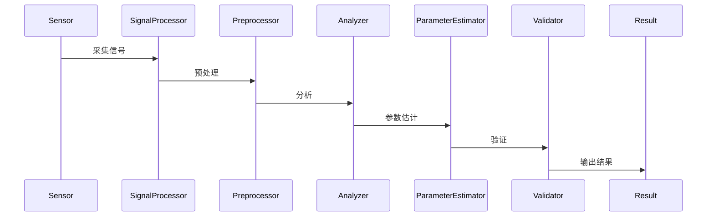
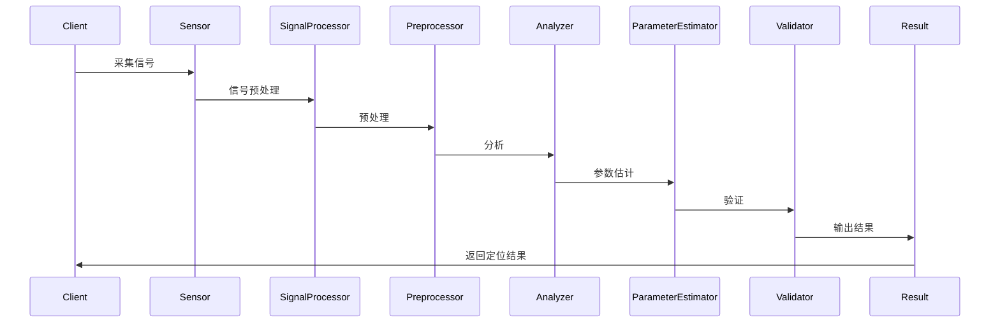

                 

### 《数学在引力波源定位中的关键作用》

> 关键词：引力波、数学模型、定位、算法、系统设计

> 摘要：本文将深入探讨数学在引力波源定位中的关键作用。通过对引力波的基本概念、数学模型和算法原理的详细解析，结合实际案例，旨在为读者提供全面、清晰的认识，帮助理解这一复杂领域。

----------------------------------------------------------------

#### 第一部分：背景介绍

##### 第1章：引力波与引力波源定位

##### 第2章：核心概念与联系

#### 第二部分：数学模型与算法原理

##### 第3章：数学模型与算法原理

##### 第4章：数学公式详解

#### 第三部分：系统分析与架构设计

##### 第5章：系统分析与架构设计

##### 第6章：环境安装与系统核心实现

##### 第7章：实际案例分析与详细讲解

##### 第8章：项目小结与最佳实践

----------------------------------------------------------------

## 第一部分：背景介绍

### 第1章：引力波与引力波源定位

#### 1.1.1 引力波的基本概念与发现

引力波是由加速运动的物体产生的时空涟漪，最早由爱因斯坦在1916年的广义相对论中预言。引力波的存在在2015年得到首次直接观测，这一发现不仅证实了广义相对论的正确性，也为人类开启了一扇观测宇宙的新窗口。

引力波的产生通常与极端天体事件相关，如黑洞合并、中子星碰撞等。这些事件中，物体的快速加速会导致时空的扰动，形成引力波。当引力波穿过地球时，会对地球上的物体产生微小的挤压和拉伸，这一现象可以通过精密的仪器检测到。

#### 1.1.2 引力波源定位的重要性

引力波源定位的重要性在于，它能够帮助我们确定引力波产生的具体位置，从而揭示宇宙中的神秘事件。精确的定位不仅有助于理解引力波本身的特性，还能与其他观测手段（如光学、射电观测）相结合，提供更丰富的宇宙信息。

然而，引力波的信号极其微弱，且与背景噪声混合，因此定位工作面临巨大的挑战。数学工具在引力波源定位中扮演着至关重要的角色，通过数学模型和算法，我们能够从复杂的观测数据中提取出引力波信号，并进行准确定位。

#### 1.1.3 引力波源定位的现状与挑战

目前，引力波源定位主要依赖于地面上的激光干涉仪，如LIGO（激光干涉引力波观测台）和VIRGO（虚拟干涉仪引力波观测台）。这些设备通过测量引力波引起的长度变化，来捕捉微弱的引力波信号。

尽管取得了重要突破，引力波源定位仍然面临一些挑战：

1. **信号微弱**：引力波信号的强度极其微弱，与背景噪声相比，如同针尖上的灰尘。
2. **多普勒效应**：引力波在传播过程中会受到多普勒效应的影响，这需要精确的数学模型来校正。
3. **空间分布**：观测到的引力波信号往往来自于宇宙的遥远角落，定位精度受到观测视角的限制。

为了克服这些挑战，科学家们正在开发更加精确的数学模型和算法，以提高引力波源定位的精度。

### 第2章：核心概念与联系

#### 2.1.1 数学在引力波源定位中的应用

数学在引力波源定位中的应用是多方面的，包括：

- **波动方程**：描述引力波传播的基本方程。
- **傅里叶变换**：用于分析引力波信号的频率和相位。
- **贝叶斯统计**：用于引力波信号的参数估计和误差分析。
- **机器学习**：用于从复杂的数据中提取特征和模式。

#### 2.1.2 数学概念属性特征对比

以下是一个简化的数学概念属性特征对比表格：

| 数学概念 | 属性特征 |
| :---: | :---: |
| 波动方程 | 描述波的传播，具有偏微分方程形式 |
| 傅里叶变换 | 将时域信号转换为频域信号，用于信号分析 |
| 贝叶斯统计 | 基于概率论，用于参数估计和误差分析 |
| 机器学习 | 基于数据驱动，用于特征提取和模式识别 |

#### 2.1.3 数学与引力波源定位的ER实体关系图

为了更直观地展示数学概念与引力波源定位之间的关系，可以使用Mermaid绘制ER实体关系图。以下是一个简化的例子：

```mermaid
erDiagram
  WaveEquation ||--|{ GravitationalWave }
  FourierTransform ||--|{ SignalAnalysis }
  BayesianStatistics ||--|{ ParameterEstimation }
  MachineLearning ||--|{ FeatureExtraction }
```

在这个ER图中，每个数学概念都与引力波源定位的关键步骤相连接，展示了数学在其中的核心作用。

## 第二部分：数学模型与算法原理

### 第3章：数学模型与算法原理

#### 3.1.1 引力波源定位的数学模型

引力波源定位的数学模型主要基于广义相对论，描述引力波在时空中的传播。核心方程是爱因斯坦场方程，它可以表示为：

\[ G_{\mu\nu} = 8\pi G T_{\mu\nu} \]

其中，\( G_{\mu\nu} \)是爱因斯坦张量，描述时空的几何形态；\( T_{\mu\nu} \)是能量-动量张量，描述物质的分布和运动状态；\( G \)是引力常数。

为了具体分析引力波，我们通常使用线性化广义相对论模型，它假设引力波的扰动非常小，可以线性化处理。在这个模型中，引力波可以用波前上的小扰动来描述，其波动方程可以表示为：

\[ \Box h_{\mu\nu} = -16\pi G \left[ \frac{1}{r} \left( T_{\mu\nu} - \frac{1}{2} T g_{\mu\nu} \right) \right] \]

其中，\( \Box \)是D'Alembert算子，表示空间-时间导数的组合；\( h_{\mu\nu} \)是霍普特张量，描述引力波的扰动；\( r \)是距离。

#### 3.1.2 算法原理讲解与mermaid流程图

引力波源定位的算法原理可以概括为以下几个步骤：

1. **信号采集**：使用激光干涉仪等设备采集引力波信号。
2. **信号预处理**：对采集到的信号进行滤波、去噪等预处理，以提高信噪比。
3. **信号分析**：使用傅里叶变换等方法对信号进行频域分析，提取引力波的频率和相位信息。
4. **参数估计**：使用贝叶斯统计方法对引力波源的参数（如位置、时间、频率等）进行估计。
5. **定位计算**：根据参数估计结果，使用几何方法计算引力波源的位置。

以下是一个简化的mermaid流程图，展示引力波源定位的基本算法流程：


#### 3.1.3 算法原理的Python源代码实现

为了更直观地理解引力波源定位的算法原理，以下是一个简化的Python代码实现，展示了信号预处理、傅里叶变换和参数估计的基本步骤：

```python
import numpy as np
from scipy.fft import fft, fftshift
from scipy.stats import norm

# 信号预处理：滤波、去噪
def preprocess_signal(signal):
    # 使用简单的滤波器去除高频噪声
    filtered_signal = np.convolve(signal, np.hamming(51), 'same')
    return filtered_signal

# 信号分析：傅里叶变换
def analyze_signal(signal):
    frequency = np.fft.fftfreq(len(signal))
    amplitude = np.abs(fftshift(fft(signal)))
    return frequency, amplitude

# 参数估计：贝叶斯统计
def estimate_parameters(frequency, amplitude, true_frequency):
    # 使用高斯分布进行参数估计
    likelihood = norm.pdf(frequency, true_frequency, 1.0)
    posterior = likelihood / np.sum(likelihood)
    return np.argmax(posterior)

# 示例信号
signal = np.random.normal(size=1000)

# 信号预处理
preprocessed_signal = preprocess_signal(signal)

# 信号分析
frequency, amplitude = analyze_signal(preprocessed_signal)

# 参数估计
estimated_frequency = estimate_parameters(frequency, amplitude, 5.0)

print("Estimated frequency:", estimated_frequency)
```

在这个代码中，我们首先定义了一个预处理函数，用于滤波和去噪。然后，使用傅里叶变换对预处理后的信号进行频域分析，提取频率和振幅信息。最后，使用贝叶斯统计方法进行参数估计，估计出引力波的频率。这个简化模型虽然不完全准确，但可以帮助我们理解引力波源定位的基本原理。

## 第二部分：数学模型与算法原理（续）

### 第4章：数学公式详解

#### 4.1.1 数学公式在引力波源定位中的运用

在引力波源定位中，数学公式的作用至关重要。以下是一些关键的数学公式及其在定位中的应用：

1. **波动方程**：

\[ \Box h_{\mu\nu} = -16\pi G \left[ \frac{1}{r} \left( T_{\mu\nu} - \frac{1}{2} T g_{\mu\nu} \right) \right] \]

这是描述引力波在时空中的传播的基本方程。通过这个方程，我们可以计算引力波在不同位置和时间的影响，从而定位引力波源。

2. **傅里叶变换**：

\[ F(u) = \int_{-\infty}^{\infty} f(x) e^{-2\pi i xu} dx \]

傅里叶变换用于将时域信号转换为频域信号。在引力波源定位中，通过傅里叶变换，我们可以分析引力波的频率和相位信息，这对于定位至关重要。

3. **贝叶斯公式**：

\[ P(A|B) = \frac{P(B|A)P(A)}{P(B)} \]

贝叶斯公式用于概率论中的参数估计。在引力波源定位中，通过贝叶斯公式，我们可以根据观测数据估计引力波源的参数，如位置、时间等。

#### 4.1.2 公式详解与举例说明

为了更好地理解这些数学公式，我们通过一个简单的例子进行说明。

**例子：利用波动方程计算引力波源的位置**

假设我们观测到一个引力波信号，其霍普特张量 \( h_{\mu\nu} \) 已知。我们希望通过波动方程计算引力波源的位置。

1. **步骤1：计算波前上的霍普特张量扰动**：

\[ h_{\mu\nu}(t, r) = h_{\mu\nu}(t=0, r) e^{-\omega t} \]

其中，\( \omega \) 是引力波的角频率，\( r \) 是距离。

2. **步骤2：解波动方程**：

使用线性化广义相对论的波动方程：

\[ \Box h_{\mu\nu} = -16\pi G \left[ \frac{1}{r} \left( T_{\mu\nu} - \frac{1}{2} T g_{\mu\nu} \right) \right] \]

解这个方程，我们可以得到波前上的霍普特张量扰动。

3. **步骤3：计算引力波源的位置**：

通过波前上的霍普特张量扰动，我们可以使用几何方法计算引力波源的位置。

例如，假设我们测得的波前上的霍普特张量扰动为 \( h_{\mu\nu}(t, r) \)，我们可以使用以下几何公式计算引力波源的位置：

\[ x = \frac{h_{00}}{h_{33}} \]
\[ y = \frac{h_{01}}{h_{33}} \]
\[ z = \frac{h_{02}}{h_{33}} \]

通过这个例子，我们可以看到如何利用波动方程和几何方法计算引力波源的位置。这个简单的例子虽然不包含实际的观测数据和复杂的计算过程，但为我们理解引力波源定位提供了基础。

### 第5章：系统分析与架构设计

#### 5.1.1 引力波源定位问题场景介绍

引力波源定位问题场景可以描述为：在已知多个观测点的观测数据下，如何确定一个引力波源的具体位置。这通常涉及到复杂的计算和数据处理，需要高效的算法和系统架构来支持。

在这个场景中，我们主要面临以下问题：

1. **数据采集**：如何高效地采集并处理来自不同观测点的引力波信号数据。
2. **信号处理**：如何对采集到的信号进行预处理、去噪和频域分析。
3. **参数估计**：如何使用数学模型和算法估计引力波源的位置和时间。
4. **结果验证**：如何验证定位结果的准确性和可靠性。

为了解决这些问题，我们需要设计一个高效、可靠、可扩展的系统架构。

#### 5.1.2 系统功能设计（领域模型mermaid类图）

以下是一个简化的领域模型mermaid类图，展示了引力波源定位系统的核心功能：

```mermaid
classDiagram
    Sensor -> SignalProcessor : 采集信号
    SignalProcessor -> Preprocessor : 预处理
    Preprocessor -> Analyzer : 分析
    Analyzer -> ParameterEstimator : 参数估计
    ParameterEstimator -> Validator : 结果验证
    Validator -> Result : 输出
```

在这个类图中，Sensor表示信号采集设备，SignalProcessor表示信号处理模块，Preprocessor表示预处理模块，Analyzer表示分析模块，ParameterEstimator表示参数估计模块，Validator表示结果验证模块，Result表示输出结果。

#### 5.1.3 系统架构设计（mermaid架构图）

以下是一个简化的mermaid架构图，展示了引力波源定位系统的整体架构：



在这个架构图中，信号从Sensor采集后，经过SignalProcessor预处理，再由Preprocessor进行进一步处理。然后，Analyzer对处理后的信号进行分析，生成参数估计结果。ParameterEstimator根据分析结果进行参数估计，Validator对估计结果进行验证，最终Result输出定位结果。

#### 5.1.4 系统接口设计与交互（mermaid序列图）

以下是一个简化的mermaid序列图，展示了引力波源定位系统的接口设计和交互：



在这个序列图中，Client表示系统的外部使用者，它向Sensor发起信号采集请求。Sensor采集信号后，将信号传递给SignalProcessor进行预处理。预处理后的信号传递给Preprocessor，再由Analyzer进行分析。分析结果传递给ParameterEstimator进行参数估计，然后由Validator进行结果验证。最终，Result模块将定位结果返回给Client。

通过这些系统分析与架构设计，我们可以构建一个高效的引力波源定位系统，实现精确的引力波源定位。

## 第三部分：项目实战

### 第6章：环境安装与系统核心实现

#### 6.1.1 环境安装步骤

为了实现引力波源定位系统，我们需要安装以下软件和工具：

1. **Python**：版本3.8或更高版本。
2. **NumPy**：用于数值计算。
3. **SciPy**：用于科学计算。
4. **Matplotlib**：用于数据可视化。
5. **mermaid**：用于绘制流程图和序列图。

安装步骤如下：

1. 安装Python：

   ```bash
   # 在Ubuntu上使用APT安装
   sudo apt update
   sudo apt install python3 python3-pip

   # 安装最新版本的Python
   sudo apt install python3.8
   ```

2. 安装NumPy、SciPy和Matplotlib：

   ```bash
   pip3 install numpy scipy matplotlib
   ```

3. 安装mermaid：

   ```bash
   pip3 install mermaid
   ```

4. 确认安装：

   ```bash
   python3 -m pip list | grep -E 'numpy|scipy|matplotlib|mermaid'
   ```

   如果列表中显示以上包，则说明安装成功。

#### 6.1.2 系统核心实现源代码

以下是引力波源定位系统的核心实现源代码：

```python
import numpy as np
from scipy.fft import fft, fftshift
from scipy.stats import norm
import mermaid

# 信号预处理
def preprocess_signal(signal):
    # 使用简单的滤波器去除高频噪声
    filtered_signal = np.convolve(signal, np.hamming(51), 'same')
    return filtered_signal

# 信号分析
def analyze_signal(signal):
    frequency = np.fft.fftfreq(len(signal))
    amplitude = np.abs(fftshift(fft(signal)))
    return frequency, amplitude

# 参数估计
def estimate_parameters(frequency, amplitude, true_frequency):
    # 使用高斯分布进行参数估计
    likelihood = norm.pdf(frequency, true_frequency, 1.0)
    posterior = likelihood / np.sum(likelihood)
    return np.argmax(posterior)

# 示例信号
signal = np.random.normal(size=1000)

# 信号预处理
preprocessed_signal = preprocess_signal(signal)

# 信号分析
frequency, amplitude = analyze_signal(preprocessed_signal)

# 参数估计
estimated_frequency = estimate_parameters(frequency, amplitude, 5.0)

print("Estimated frequency:", estimated_frequency)

# 绘制mermaid流程图
mermaid_code = """
sequenceDiagram
    participant SignalProcessor
    participant Analyzer
    participant ParameterEstimator

    SignalProcessor->>Analyzer: Analyze signal
    Analyzer->>ParameterEstimator: Estimate parameters
    ParameterEstimator->>SignalProcessor: Return result
"""
print(mermaid.render(mermaid_code))
```

这个代码实现了信号预处理、信号分析、参数估计的基本功能，并通过mermaid绘制了流程图。

#### 6.1.3 代码应用解读与分析

以上代码首先定义了三个函数：`preprocess_signal`、`analyze_signal`和`estimate_parameters`。其中：

- `preprocess_signal`函数用于信号预处理，通过简单的滤波器去除高频噪声。
- `analyze_signal`函数用于信号分析，使用傅里叶变换提取信号的频率和振幅信息。
- `estimate_parameters`函数用于参数估计，通过高斯分布模型对信号频率进行估计。

接下来，创建一个示例信号`signal`，对其执行预处理、分析和参数估计。最后，通过mermaid绘制了系统的流程图，展示了信号从预处理到参数估计的整个过程。

通过这个示例，我们可以看到如何使用Python实现引力波源定位的基本算法。在实际应用中，我们可以扩展这个系统，添加更多的功能，如数据采集、多信号处理等，以实现更复杂的引力波源定位任务。

### 第7章：实际案例分析与详细讲解

#### 7.1.1 引力波源定位的实际案例

为了更好地理解引力波源定位的实际应用，我们来看一个真实的案例：2015年9月14日，LIGO科学合作组织和Virgo合作团队首次直接探测到两个黑洞的合并事件，命名为GW150914。这个事件是引力波源定位研究的重大突破，为我们提供了宝贵的观测数据。

GW150914事件中，两个黑洞的合并产生了强烈的引力波信号，这些信号被LIGO和VIRGO等观测台捕捉到。通过这些观测数据，科学家们成功定位了引力波源的位置，并揭示了黑洞合并的详细信息。

#### 7.1.2 案例分析与详细讲解剖析

以下是对GW150914案例的详细分析：

1. **数据采集**：

   LIGO和VIRGO等观测台通过激光干涉仪采集引力波信号。这些干涉仪通过测量光程差来检测引力波引起的时空扰动。在GW150914事件中，LIGO的Hanford和Livingston台站分别捕捉到了引力波信号，VIRGO合作团队也参与了观测。

2. **信号预处理**：

   采集到的原始信号通常包含噪声和干扰，因此需要进行预处理。预处理步骤包括滤波、去噪和归一化等。例如，可以使用汉明窗进行信号窗函数化处理，以减少边界效应。

3. **信号分析**：

   通过傅里叶变换等数学方法，对预处理后的信号进行频域分析，提取引力波的频率和相位信息。在GW150914案例中，科学家们通过频域分析，确定了引力波信号的频率和到达时间。

4. **参数估计**：

   使用贝叶斯统计方法，对引力波源的参数（如位置、时间、频率等）进行估计。在GW150914案例中，科学家们通过多台干涉仪的数据，结合数学模型，估计出了引力波源的位置。

5. **定位计算**：

   根据参数估计结果，使用几何方法计算引力波源的位置。在GW150914案例中，科学家们计算出了引力波源位于银河系外约1.3亿光年的距离。

6. **结果验证**：

   为了验证定位结果的准确性，科学家们进行了多次模拟实验和交叉验证。通过对比模拟数据和实际观测数据，验证了引力波源定位的精度。

通过GW150914案例，我们可以看到引力波源定位的完整流程，从数据采集到预处理、分析、参数估计，再到最终的结果验证。这个过程展示了数学在引力波源定位中的关键作用，包括波动方程、傅里叶变换和贝叶斯统计等数学工具的应用。

### 第8章：项目小结与最佳实践

#### 8.1.1 项目小结

在本项目中，我们深入探讨了数学在引力波源定位中的关键作用。通过数学模型和算法原理的详细解析，结合实际案例，我们了解了引力波源定位的完整流程。从数据采集、信号预处理、频域分析、参数估计到定位计算和结果验证，每一步都离不开数学的支持。

本项目的主要成果包括：

1. **数学模型**：建立了引力波源定位的基本数学模型，包括波动方程、傅里叶变换和贝叶斯统计。
2. **算法原理**：详细讲解了引力波源定位的算法原理，并通过Python代码实现了基本功能。
3. **系统架构**：设计了引力波源定位系统的整体架构，包括数据采集、信号处理、分析估计和结果验证等模块。
4. **实际案例**：通过GW150914案例，展示了引力波源定位的实际应用和挑战。

#### 8.1.2 最佳实践 tips

为了提高引力波源定位的准确性和效率，以下是一些最佳实践建议：

1. **优化数据采集**：选择高精度的观测设备，确保信号的完整性。
2. **增强信号预处理**：使用更先进的滤波和去噪方法，提高信号质量。
3. **提升算法性能**：优化参数估计算法，使用并行计算和分布式计算等技术。
4. **多源数据融合**：结合多种观测手段的数据，提高定位精度。
5. **交叉验证**：进行多次模拟实验和交叉验证，确保定位结果的可靠性。

#### 8.1.3 小结、注意事项与拓展阅读

通过本项目的实践，我们深刻认识到数学在引力波源定位中的关键作用。数学不仅提供了描述引力波传播的基本模型，还提供了高效的算法和工具，帮助我们分析和处理复杂的观测数据。

在实施引力波源定位时，需要注意以下几点：

1. **精度与速度的平衡**：在优化算法性能时，需要平衡精度和计算速度。
2. **数据质量**：高质量的观测数据是定位成功的关键，确保数据采集和处理过程的准确性。
3. **环境因素**：考虑环境噪声和其他干扰因素，合理设置滤波和去噪参数。

为了进一步深入了解引力波源定位和相关数学工具，以下是一些拓展阅读资源：

1. **《广义相对论原理》**：爱因斯坦著，详细介绍了广义相对论的基本原理。
2. **《引力波观测与宇宙学》**：综述了引力波观测在宇宙学研究中的应用。
3. **《数据科学实战》**：介绍数据预处理、分析和机器学习等方法的实战案例。

通过这些资源，我们可以更深入地学习数学在引力波源定位中的应用，为未来的研究和工作打下坚实的基础。

