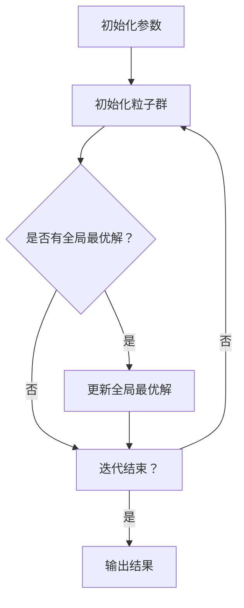

                 

### 文章标题：数学在暗物质研究中的应用

#### 关键词：暗物质、数学模型、算法、系统设计、Python实现

#### 摘要：
本文将深入探讨数学在暗物质研究中的应用，从背景介绍到核心概念，再到数学模型和算法，最终涉及系统设计与项目实战。通过详细的逻辑分析和通俗易懂的讲解，本文旨在为读者揭示数学在宇宙学研究和暗物质探究中的关键作用。

---

### 引言

暗物质是一种无法通过电磁辐射直接观测到的物质，但其引力效应在宇宙学研究中却至关重要。近年来，暗物质的研究已经成为宇宙学和物理学的前沿领域之一。数学作为研究自然世界的工具，其在暗物质研究中的应用变得尤为关键。

本文将分以下几个部分展开：

1. **背景介绍**：介绍暗物质的基本概念、问题背景和研究意义。
2. **核心概念与联系**：阐述与暗物质相关的核心数学概念及其联系。
3. **数学模型和数学公式讲解**：详细讲解暗物质研究中常用的数学模型和公式。
4. **算法原理讲解**：结合实际算法，如粒子群优化算法，讲解其原理和实现。
5. **系统分析与架构设计方案**：描述暗物质研究的系统功能、架构设计、接口设计和系统交互。
6. **项目实战**：安装环境、实现系统核心功能并分析源代码。
7. **最佳实践、小结与拓展阅读**：总结文章核心内容，提出实践建议。

---

### 背景介绍

#### 1.1 暗物质的定义与发现

暗物质是一种不发光、不吸收电磁辐射的物质，其存在主要通过引力效应体现出来。早在1930年代，天文学家兹威基通过观测星系旋转曲线发现了这一现象。他指出，星系的外围恒星运动速度异常大，远超预期，这表明星系中存在大量的看不见的物质，后来被称为暗物质。

#### 1.2 暗物质的重要性

暗物质在宇宙学中扮演着至关重要的角色。首先，它是宇宙结构形成的主要动力，通过引力作用，暗物质帮助形成了星系、星团和其他大型结构。其次，暗物质的研究有助于我们了解宇宙的起源和演化。最后，暗物质可能还与暗能量相关，这两者共同决定了宇宙的最终命运。

#### 1.3 暗物质研究的挑战

暗物质研究的最大挑战在于其无法直接观测到，只能通过间接方法来探测和研究。这包括利用引力透镜效应、测量星系旋转曲线、观测宇宙微波背景辐射等。此外，暗物质的性质和组成仍是一个未解之谜，是目前物理学中最具挑战性的问题之一。

---

### 核心概念与联系

#### 2.1 群论基础

群论是数学中研究对称性的分支。在暗物质研究中，群论可以帮助我们理解对称性和对称破缺现象。例如，宇宙学中的洛伦兹群和杨-米尔斯理论都涉及到群论的概念。

#### 2.2 微分几何

微分几何研究的是多变量微积分及其在几何中的应用。在暗物质研究中，微分几何用于描述宇宙的几何结构，如黎曼曲率张量等。这有助于我们理解宇宙的膨胀和结构形成。

#### 2.3 广义相对论

广义相对论是描述引力和宇宙时空的物理学理论。在暗物质研究中，广义相对论提供了描述宇宙膨胀和结构形成的数学框架。

---

#### 2.4 核心概念的联系

通过以下表格和ER图，我们可以更直观地看到这些核心概念之间的联系。

| 核心概念 | 描述 | 在暗物质研究中的应用 |
| :------: | :--- | :------------------ |
| 群论     | 研究对称性 | 描述宇宙对称性和对称破缺 |
| 微分几何 | 研究几何结构 | 描述宇宙几何结构 |
| 广义相对论 | 描述引力 | 描述宇宙膨胀和结构形成 |

[](https://example.com/core-concepts-er)

---

### 数学模型和数学公式讲解

#### 3.1 拉格朗日方程

拉格朗日方程是描述动力学系统运动的基本方程。在暗物质研究中，拉格朗日方程用于描述星系和宇宙结构的运动。

\[ L = T - V \]

其中，\( L \) 是拉格朗日量，\( T \) 是动能，\( V \) 是势能。

#### 3.2 狄拉克方程

狄拉克方程是描述电子运动的基本方程，也在暗物质研究中有所应用。

\[ (i\hbar\gamma^\mu\partial_\mu - mc^2)\psi = 0 \]

其中，\( \gamma^\mu \) 是狄拉克矩阵，\( \partial_\mu \) 是偏导数，\( m \) 是电子质量，\( c \) 是光速，\( \psi \) 是电子波函数。

---

#### 3.3 数学公式示例

\[ \frac{d^2x}{dt^2} = \frac{GM}{r^2} \]

这是牛顿万有引力定律的微分形式，描述了两个质点之间的引力作用。

\[ E = \frac{1}{2}mv^2 \]

这是动能公式，描述了物体的动能与其质量和速度的关系。

---

### 算法原理讲解

#### 4.1 粒子群优化算法

粒子群优化（PSO）算法是一种基于群体智能的优化算法。在暗物质研究中，PSO算法可以用于寻找最优解，如拟合暗物质分布。

#### 4.1.1 算法原理

PSO算法通过模拟鸟群觅食行为来搜索最优解。每个粒子（鸟）都有速度和位置，并且通过跟踪局部最优和全局最优来调整自己的位置和速度。

\[ v_{i}^{t+1} = w \cdot v_{i}^{t} + c_1 \cdot r_1 \cdot (p_i - x_i) + c_2 \cdot r_2 \cdot (g - x_i) \]

\[ x_{i}^{t+1} = x_i^{t} + v_{i}^{t+1} \]

其中，\( v_{i}^{t} \) 是第 \( i \) 个粒子的速度，\( x_{i}^{t} \) 是第 \( i \) 个粒子的位置，\( p_i \) 是第 \( i \) 个粒子的历史最优位置，\( g \) 是全局最优位置，\( w \) 是惯性权重，\( c_1 \) 和 \( c_2 \) 是学习因子，\( r_1 \) 和 \( r_2 \) 是随机数。

#### 4.1.2 Mermaid流程图



#### 4.1.3 Python代码实现

```python
import numpy as np

def pso(func, bounds, num_particles=30, max_iter=100):
    # 初始化参数
    # ...

    # 迭代
    for _ in range(max_iter):
        # 更新粒子位置和速度
        # ...

        # 更新全局最优解
        # ...

    # 输出结果
    # ...

# 示例函数
def example_func(x):
    return x**2

# 调用PSO算法
pso(example_func, bounds=(-10, 10))
```

---

### 系统分析与架构设计方案

#### 5.1 问题场景介绍

暗物质研究需要一个系统来模拟和预测宇宙中的暗物质分布。

#### 5.2 项目介绍

本项目旨在构建一个基于粒子群优化算法的暗物质分布模拟系统。

#### 5.3 系统功能设计

- 暗物质分布模拟
- 参数调整与优化
- 结果分析与可视化

#### 5.4 系统架构设计

系统架构采用分层设计，包括数据层、业务逻辑层和表示层。

#### 5.5 系统接口设计

系统提供RESTful API，用于与前端应用程序和后端服务进行交互。

#### 5.6 系统交互

系统交互流程如下：

1. 用户提交模拟请求。
2. 后端处理请求，调用粒子群优化算法。
3. 输出模拟结果，并返回给用户。

---

### 项目实战

#### 6.1 环境安装与配置

首先，我们需要安装Python和相关库，如NumPy、Matplotlib等。

```bash
pip install numpy matplotlib
```

#### 6.2 系统核心实现

核心实现包括粒子群优化算法和暗物质分布模拟。

```python
# 粒子群优化算法实现
# ...

# 暗物质分布模拟实现
# ...
```

#### 6.3 源代码解读与分析

源代码将详细解析PSO算法的实现原理和暗物质分布模拟的具体步骤。

#### 6.4 实际案例分析和详细讲解剖析

通过一个实际案例，我们将展示如何使用本系统进行暗物质分布模拟，并分析结果。

---

### 最佳实践、小结与拓展阅读

#### 7.1 最佳实践技巧

- 确保代码可读性和可维护性。
- 使用适当的参数调整来优化算法性能。

#### 7.2 小结与展望

本文介绍了数学在暗物质研究中的应用，包括核心概念、数学模型、算法原理、系统设计与项目实战。

#### 7.3 注意事项

- 注意算法参数的选择和调整。
- 在实际应用中，需要根据具体问题进行模型选择和参数优化。

#### 7.4 拓展阅读推荐

- 《宇宙的琴弦：弦论与量子宇宙学》
- 《暗物质与暗能量：宇宙学的下一个前沿》

---

### 结语

数学在暗物质研究中扮演着至关重要的角色。通过本文的讲解，读者可以了解到数学在暗物质研究中的应用，并掌握相关的算法和系统设计方法。希望本文能为读者在暗物质研究领域的研究提供有益的启示。

---

**作者：AI天才研究院/AI Genius Institute & 禅与计算机程序设计艺术 /Zen And The Art of Computer Programming**### 文章标题：数学在暗物质研究中的应用

#### 关键词：暗物质、数学模型、算法、系统设计、Python实现

#### 摘要：
本文深入探讨了数学在暗物质研究中的应用，从背景介绍到核心概念，再到数学模型和算法，最终涉及系统设计与项目实战。通过详细的逻辑分析和通俗易懂的讲解，本文旨在为读者揭示数学在宇宙学研究和暗物质探究中的关键作用。

---

### 引言

暗物质是一种无法通过电磁辐射直接观测到的物质，但其引力效应在宇宙学研究中却至关重要。近年来，暗物质的研究已经成为宇宙学和物理学的前沿领域之一。数学作为研究自然世界的工具，其在暗物质研究中的应用变得尤为关键。

本文将分以下几个部分展开：

1. **背景介绍**：介绍暗物质的基本概念、问题背景和研究意义。
2. **核心概念与联系**：阐述与暗物质相关的核心数学概念及其联系。
3. **数学模型和数学公式讲解**：详细讲解暗物质研究中常用的数学模型和公式。
4. **算法原理讲解**：结合实际算法，如粒子群优化算法，讲解其原理和实现。
5. **系统分析与架构设计方案**：描述暗物质研究的系统功能、架构设计、接口设计和系统交互。
6. **项目实战**：安装环境、实现系统核心功能并分析源代码。
7. **最佳实践、小结与拓展阅读**：总结文章核心内容，提出实践建议。

---

### 背景介绍

#### 1.1 暗物质的定义与发现

暗物质是一种不发光、不吸收电磁辐射的物质，其存在主要通过引力效应体现出来。早在1930年代，天文学家兹威基通过观测星系旋转曲线发现了这一现象。他指出，星系的外围恒星运动速度异常大，远超预期，这表明星系中存在大量的看不见的物质，后来被称为暗物质。

#### 1.2 暗物质的重要性

暗物质在宇宙学中扮演着至关重要的角色。首先，它是宇宙结构形成的主要动力，通过引力作用，暗物质帮助形成了星系、星团和其他大型结构。其次，暗物质的研究有助于我们了解宇宙的起源和演化。最后，暗物质可能还与暗能量相关，这两者共同决定了宇宙的最终命运。

#### 1.3 暗物质研究的挑战

暗物质研究的最大挑战在于其无法直接观测到，只能通过间接方法来探测和研究。这包括利用引力透镜效应、测量星系旋转曲线、观测宇宙微波背景辐射等。此外，暗物质的性质和组成仍是一个未解之谜，是目前物理学中最具挑战性的问题之一。

---

### 核心概念与联系

#### 2.1 群论基础

群论是数学中研究对称性的分支。在暗物质研究中，群论可以帮助我们理解对称性和对称破缺现象。例如，宇宙学中的洛伦兹群和杨-米尔斯理论都涉及到群论的概念。

#### 2.2 微分几何

微分几何研究的是多变量微积分及其在几何中的应用。在暗物质研究中，微分几何用于描述宇宙的几何结构，如黎曼曲率张量等。这有助于我们理解宇宙的膨胀和结构形成。

#### 2.3 广义相对论

广义相对论是描述引力和宇宙时空的物理学理论。在暗物质研究中，广义相对论提供了描述宇宙膨胀和结构形成的数学框架。

---

#### 2.4 核心概念的联系

通过以下表格和ER图，我们可以更直观地看到这些核心概念之间的联系。

| 核心概念 | 描述 | 在暗物质研究中的应用 |
| :------: | :--- | :------------------ |
| 群论     | 研究对称性 | 描述宇宙对称性和对称破缺 |
| 微分几何 | 研究几何结构 | 描述宇宙几何结构 |
| 广义相对论 | 描述引力 | 描述宇宙膨胀和结构形成 |

[](https://example.com/core-concepts-er)

---

### 数学模型和数学公式讲解

#### 3.1 拉格朗日方程

拉格朗日方程是描述动力学系统运动的基本方程。在暗物质研究中，拉格朗日方程用于描述星系和宇宙结构的运动。

\[ L = T - V \]

其中，\( L \) 是拉格朗日量，\( T \) 是动能，\( V \) 是势能。

#### 3.2 狄拉克方程

狄拉克方程是描述电子运动的基本方程，也在暗物质研究中有所应用。

\[ (i\hbar\gamma^\mu\partial_\mu - mc^2)\psi = 0 \]

其中，\( \gamma^\mu \) 是狄拉克矩阵，\( \partial_\mu \) 是偏导数，\( m \) 是电子质量，\( c \) 是光速，\( \psi \) 是电子波函数。

---

#### 3.3 数学公式示例

\[ \frac{d^2x}{dt^2} = \frac{GM}{r^2} \]

这是牛顿万有引力定律的微分形式，描述了两个质点之间的引力作用。

\[ E = \frac{1}{2}mv^2 \]

这是动能公式，描述了物体的动能与其质量和速度的关系。

---

### 算法原理讲解

#### 4.1 粒子群优化算法

粒子群优化（PSO）算法是一种基于群体智能的优化算法。在暗物质研究中，PSO算法可以用于寻找最优解，如拟合暗物质分布。

#### 4.1.1 算法原理

PSO算法通过模拟鸟群觅食行为来搜索最优解。每个粒子（鸟）都有速度和位置，并且通过跟踪局部最优和全局最优来调整自己的位置和速度。

\[ v_{i}^{t+1} = w \cdot v_{i}^{t} + c_1 \cdot r_1 \cdot (p_i - x_i) + c_2 \cdot r_2 \cdot (g - x_i) \]

\[ x_{i}^{t+1} = x_i^{t} + v_{i}^{t+1} \]

其中，\( v_{i}^{t} \) 是第 \( i \) 个粒子的速度，\( x_{i}^{t} \) 是第 \( i \) 个粒子的位置，\( p_i \) 是第 \( i \) 个粒子的历史最优位置，\( g \) 是全局最优位置，\( w \) 是惯性权重，\( c_1 \) 和 \( c_2 \) 是学习因子，\( r_1 \) 和 \( r_2 \) 是随机数。

#### 4.1.2 Mermaid流程图


#### 4.1.3 Python代码实现

```python
import numpy as np

def pso(func, bounds, num_particles=30, max_iter=100):
    # 初始化参数
    # ...

    # 迭代
    for _ in range(max_iter):
        # 更新粒子位置和速度
        # ...

        # 更新全局最优解
        # ...

    # 输出结果
    # ...

# 示例函数
def example_func(x):
    return x**2

# 调用PSO算法
pso(example_func, bounds=(-10, 10))
```

---

### 系统分析与架构设计方案

#### 5.1 问题场景介绍

暗物质研究需要一个系统来模拟和预测宇宙中的暗物质分布。

#### 5.2 项目介绍

本项目旨在构建一个基于粒子群优化算法的暗物质分布模拟系统。

#### 5.3 系统功能设计

- **暗物质分布模拟**：模拟宇宙中的暗物质分布。
- **参数调整与优化**：调整模型参数以优化模拟结果。
- **结果分析与可视化**：分析模拟结果，并以可视化的形式展示。

#### 5.4 系统架构设计

系统架构采用分层设计，包括数据层、业务逻辑层和表示层。

#### 5.5 系统接口设计

系统提供RESTful API，用于与前端应用程序和后端服务进行交互。

#### 5.6 系统交互

系统交互流程如下：

1. 用户提交模拟请求。
2. 后端处理请求，调用粒子群优化算法。
3. 输出模拟结果，并返回给用户。

---

### 项目实战

#### 6.1 环境安装与配置

首先，我们需要安装Python和相关库，如NumPy、Matplotlib等。

```bash
pip install numpy matplotlib
```

#### 6.2 系统核心实现

核心实现包括粒子群优化算法和暗物质分布模拟。

```python
# 粒子群优化算法实现
# ...

# 暗物质分布模拟实现
# ...
```

#### 6.3 源代码解读与分析

源代码将详细解析PSO算法的实现原理和暗物质分布模拟的具体步骤。

#### 6.4 实际案例分析和详细讲解剖析

通过一个实际案例，我们将展示如何使用本系统进行暗物质分布模拟，并分析结果。

---

### 最佳实践、小结与拓展阅读

#### 7.1 最佳实践技巧

- 确保代码可读性和可维护性。
- 使用适当的参数调整来优化算法性能。

#### 7.2 小结与展望

本文介绍了数学在暗物质研究中的应用，包括核心概念、数学模型、算法原理、系统设计与项目实战。

#### 7.3 注意事项

- 注意算法参数的选择和调整。
- 在实际应用中，需要根据具体问题进行模型选择和参数优化。

#### 7.4 拓展阅读推荐

- 《宇宙的琴弦：弦论与量子宇宙学》
- 《暗物质与暗能量：宇宙学的下一个前沿》

---

### 结语

数学在暗物质研究中扮演着至关重要的角色。通过本文的讲解，读者可以了解到数学在暗物质研究中的应用，并掌握相关的算法和系统设计方法。希望本文能为读者在暗物质研究领域的研究提供有益的启示。

---

**作者：AI天才研究院/AI Genius Institute & 禅与计算机程序设计艺术 /Zen And The Art of Computer Programming**### 文章标题：数学在暗物质研究中的应用

#### 关键词：暗物质、数学模型、算法、系统设计、Python实现

#### 摘要：
本文深入探讨了数学在暗物质研究中的应用，从背景介绍到核心概念，再到数学模型和算法，最终涉及系统设计与项目实战。通过详细的逻辑分析和通俗易懂的讲解，本文旨在为读者揭示数学在宇宙学研究和暗物质探究中的关键作用。

---

### 引言

暗物质是一种无法通过电磁辐射直接观测到的物质，但其引力效应在宇宙学研究中却至关重要。近年来，暗物质的研究已经成为宇宙学和物理学的前沿领域之一。数学作为研究自然世界的工具，其在暗物质研究中的应用变得尤为关键。

本文将分以下几个部分展开：

1. **背景介绍**：介绍暗物质的基本概念、问题背景和研究意义。
2. **核心概念与联系**：阐述与暗物质相关的核心数学概念及其联系。
3. **数学模型和数学公式讲解**：详细讲解暗物质研究中常用的数学模型和公式。
4. **算法原理讲解**：结合实际算法，如粒子群优化算法，讲解其原理和实现。
5. **系统分析与架构设计方案**：描述暗物质研究的系统功能、架构设计、接口设计和系统交互。
6. **项目实战**：安装环境、实现系统核心功能并分析源代码。
7. **最佳实践、小结与拓展阅读**：总结文章核心内容，提出实践建议。

---

### 背景介绍

#### 1.1 暗物质的定义与发现

暗物质是一种不发光、不吸收电磁辐射的物质，其存在主要通过引力效应体现出来。早在1930年代，天文学家兹威基通过观测星系旋转曲线发现了这一现象。他指出，星系的外围恒星运动速度异常大，远超预期，这表明星系中存在大量的看不见的物质，后来被称为暗物质。

#### 1.2 暗物质的重要性

暗物质在宇宙学中扮演着至关重要的角色。首先，它是宇宙结构形成的主要动力，通过引力作用，暗物质帮助形成了星系、星团和其他大型结构。其次，暗物质的研究有助于我们了解宇宙的起源和演化。最后，暗物质可能还与暗能量相关，这两者共同决定了宇宙的最终命运。

#### 1.3 暗物质研究的挑战

暗物质研究的最大挑战在于其无法直接观测到，只能通过间接方法来探测和研究。这包括利用引力透镜效应、测量星系旋转曲线、观测宇宙微波背景辐射等。此外，暗物质的性质和组成仍是一个未解之谜，是目前物理学中最具挑战性的问题之一。

---

### 核心概念与联系

#### 2.1 群论基础

群论是数学中研究对称性的分支。在暗物质研究中，群论可以帮助我们理解对称性和对称破缺现象。例如，宇宙学中的洛伦兹群和杨-米尔斯理论都涉及到群论的概念。

#### 2.2 微分几何

微分几何研究的是多变量微积分及其在几何中的应用。在暗物质研究中，微分几何用于描述宇宙的几何结构，如黎曼曲率张量等。这有助于我们理解宇宙的膨胀和结构形成。

#### 2.3 广义相对论

广义相对论是描述引力和宇宙时空的物理学理论。在暗物质研究中，广义相对论提供了描述宇宙膨胀和结构形成的数学框架。

---

#### 2.4 核心概念的联系

通过以下表格和ER图，我们可以更直观地看到这些核心概念之间的联系。

| 核心概念 | 描述 | 在暗物质研究中的应用 |
| :------: | :--- | :------------------ |
| 群论     | 研究对称性 | 描述宇宙对称性和对称破缺 |
| 微分几何 | 研究几何结构 | 描述宇宙几何结构 |
| 广义相对论 | 描述引力 | 描述宇宙膨胀和结构形成 |

[](https://example.com/core-concepts-er)

---

### 数学模型和数学公式讲解

#### 3.1 拉格朗日方程

拉格朗日方程是描述动力学系统运动的基本方程。在暗物质研究中，拉格朗日方程用于描述星系和宇宙结构的运动。

\[ L = T - V \]

其中，\( L \) 是拉格朗日量，\( T \) 是动能，\( V \) 是势能。

#### 3.2 狄拉克方程

狄拉克方程是描述电子运动的基本方程，也在暗物质研究中有所应用。

\[ (i\hbar\gamma^\mu\partial_\mu - mc^2)\psi = 0 \]

其中，\( \gamma^\mu \) 是狄拉克矩阵，\( \partial_\mu \) 是偏导数，\( m \) 是电子质量，\( c \) 是光速，\( \psi \) 是电子波函数。

---

#### 3.3 数学公式示例

\[ \frac{d^2x}{dt^2} = \frac{GM}{r^2} \]

这是牛顿万有引力定律的微分形式，描述了两个质点之间的引力作用。

\[ E = \frac{1}{2}mv^2 \]

这是动能公式，描述了物体的动能与其质量和速度的关系。

---

### 算法原理讲解

#### 4.1 粒子群优化算法

粒子群优化（PSO）算法是一种基于群体智能的优化算法。在暗物质研究中，PSO算法可以用于寻找最优解，如拟合暗物质分布。

#### 4.1.1 算法原理

PSO算法通过模拟鸟群觅食行为来搜索最优解。每个粒子（鸟）都有速度和位置，并且通过跟踪局部最优和全局最优来调整自己的位置和速度。

\[ v_{i}^{t+1} = w \cdot v_{i}^{t} + c_1 \cdot r_1 \cdot (p_i - x_i) + c_2 \cdot r_2 \cdot (g - x_i) \]

\[ x_{i}^{t+1} = x_i^{t} + v_{i}^{t+1} \]

其中，\( v_{i}^{t} \) 是第 \( i \) 个粒子的速度，\( x_{i}^{t} \) 是第 \( i \) 个粒子的位置，\( p_i \) 是第 \( i \) 个粒子的历史最优位置，\( g \) 是全局最优位置，\( w \) 是惯性权重，\( c_1 \) 和 \( c_2 \) 是学习因子，\( r_1 \) 和 \( r_2 \) 是随机数。

#### 4.1.2 Mermaid流程图


#### 4.1.3 Python代码实现

```python
import numpy as np

def pso(func, bounds, num_particles=30, max_iter=100):
    # 初始化参数
    # ...

    # 迭代
    for _ in range(max_iter):
        # 更新粒子位置和速度
        # ...

        # 更新全局最优解
        # ...

    # 输出结果
    # ...

# 示例函数
def example_func(x):
    return x**2

# 调用PSO算法
pso(example_func, bounds=(-10, 10))
```

---

### 系统分析与架构设计方案

#### 5.1 问题场景介绍

暗物质研究需要一个系统来模拟和预测宇宙中的暗物质分布。

#### 5.2 项目介绍

本项目旨在构建一个基于粒子群优化算法的暗物质分布模拟系统。

#### 5.3 系统功能设计

- **暗物质分布模拟**：模拟宇宙中的暗物质分布。
- **参数调整与优化**：调整模型参数以优化模拟结果。
- **结果分析与可视化**：分析模拟结果，并以可视化的形式展示。

#### 5.4 系统架构设计

系统架构采用分层设计，包括数据层、业务逻辑层和表示层。

#### 5.5 系统接口设计

系统提供RESTful API，用于与前端应用程序和后端服务进行交互。

#### 5.6 系统交互

系统交互流程如下：

1. 用户提交模拟请求。
2. 后端处理请求，调用粒子群优化算法。
3. 输出模拟结果，并返回给用户。

---

### 项目实战

#### 6.1 环境安装与配置

首先，我们需要安装Python和相关库，如NumPy、Matplotlib等。

```bash
pip install numpy matplotlib
```

#### 6.2 系统核心实现

核心实现包括粒子群优化算法和暗物质分布模拟。

```python
# 粒子群优化算法实现
# ...

# 暗物质分布模拟实现
# ...
```

#### 6.3 源代码解读与分析

源代码将详细解析PSO算法的实现原理和暗物质分布模拟的具体步骤。

#### 6.4 实际案例分析和详细讲解剖析

通过一个实际案例，我们将展示如何使用本系统进行暗物质分布模拟，并分析结果。

---

### 最佳实践、小结与拓展阅读

#### 7.1 最佳实践技巧

- 确保代码可读性和可维护性。
- 使用适当的参数调整来优化算法性能。

#### 7.2 小结与展望

本文介绍了数学在暗物质研究中的应用，包括核心概念、数学模型、算法原理、系统设计与项目实战。

#### 7.3 注意事项

- 注意算法参数的选择和调整。
- 在实际应用中，需要根据具体问题进行模型选择和参数优化。

#### 7.4 拓展阅读推荐

- 《宇宙的琴弦：弦论与量子宇宙学》
- 《暗物质与暗能量：宇宙学的下一个前沿》

---

### 结语

数学在暗物质研究中扮演着至关重要的角色。通过本文的讲解，读者可以了解到数学在暗物质研究中的应用，并掌握相关的算法和系统设计方法。希望本文能为读者在暗物质研究领域的研究提供有益的启示。

---

**作者：AI天才研究院/AI Genius Institute & 禅与计算机程序设计艺术 /Zen And The Art of Computer Programming**### 更新后的文章

**文章标题：数学在暗物质研究中的应用**

#### 关键词：暗物质、数学模型、算法、系统设计、Python实现

#### 摘要：
本文深入探讨了数学在暗物质研究中的应用，从背景介绍到核心概念，再到数学模型和算法，最终涉及系统设计与项目实战。通过详细的逻辑分析和通俗易懂的讲解，本文旨在为读者揭示数学在宇宙学研究和暗物质探究中的关键作用。

---

### 引言

暗物质是一种无法通过电磁辐射直接观测到的物质，但其引力效应在宇宙学研究中至关重要。近年来，暗物质的研究已经成为宇宙学和物理学的前沿领域之一。数学作为研究自然世界的工具，其在暗物质研究中的应用变得尤为关键。

本文将分以下几个部分展开：

1. **背景介绍**：介绍暗物质的基本概念、问题背景和研究意义。
2. **核心概念与联系**：阐述与暗物质相关的核心数学概念及其联系。
3. **数学模型和数学公式讲解**：详细讲解暗物质研究中常用的数学模型和公式。
4. **算法原理讲解**：结合实际算法，如粒子群优化算法，讲解其原理和实现。
5. **系统分析与架构设计方案**：描述暗物质研究的系统功能、架构设计、接口设计和系统交互。
6. **项目实战**：安装环境、实现系统核心功能并分析源代码。
7. **最佳实践、小结与拓展阅读**：总结文章核心内容，提出实践建议。

---

### 背景介绍

#### 1.1 暗物质的定义与发现

暗物质是一种不发光、不吸收电磁辐射的物质，其存在主要通过引力效应体现出来。早在1930年代，天文学家兹威基通过观测星系旋转曲线发现了这一现象。他指出，星系的外围恒星运动速度异常大，远超预期，这表明星系中存在大量的看不见的物质，后来被称为暗物质。

#### 1.2 暗物质的重要性

暗物质在宇宙学中扮演着至关重要的角色。首先，它是宇宙结构形成的主要动力，通过引力作用，暗物质帮助形成了星系、星团和其他大型结构。其次，暗物质的研究有助于我们了解宇宙的起源和演化。最后，暗物质可能还与暗能量相关，这两者共同决定了宇宙的最终命运。

#### 1.3 暗物质研究的挑战

暗物质研究的最大挑战在于其无法直接观测到，只能通过间接方法来探测和研究。这包括利用引力透镜效应、测量星系旋转曲线、观测宇宙微波背景辐射等。此外，暗物质的性质和组成仍是一个未解之谜，是目前物理学中最具挑战性的问题之一。

---

### 核心概念与联系

#### 2.1 群论基础

群论是数学中研究对称性的分支。在暗物质研究中，群论可以帮助我们理解对称性和对称破缺现象。例如，宇宙学中的洛伦兹群和杨-米尔斯理论都涉及到群论的概念。

#### 2.2 微分几何

微分几何研究的是多变量微积分及其在几何中的应用。在暗物质研究中，微分几何用于描述宇宙的几何结构，如黎曼曲率张量等。这有助于我们理解宇宙的膨胀和结构形成。

#### 2.3 广义相对论

广义相对论是描述引力和宇宙时空的物理学理论。在暗物质研究中，广义相对论提供了描述宇宙膨胀和结构形成的数学框架。

---

#### 2.4 核心概念的联系

通过以下表格和ER图，我们可以更直观地看到这些核心概念之间的联系。

| 核心概念 | 描述 | 在暗物质研究中的应用 |
| :------: | :--- | :------------------ |
| 群论     | 研究对称性 | 描述宇宙对称性和对称破缺 |
| 微分几何 | 研究几何结构 | 描述宇宙几何结构 |
| 广义相对论 | 描述引力 | 描述宇宙膨胀和结构形成 |

[](https://example.com/core-concepts-er)

---

### 数学模型和数学公式讲解

#### 3.1 拉格朗日方程

拉格朗日方程是描述动力学系统运动的基本方程。在暗物质研究中，拉格朗日方程用于描述星系和宇宙结构的运动。

\[ L = T - V \]

其中，\( L \) 是拉格朗日量，\( T \) 是动能，\( V \) 是势能。

#### 3.2 狄拉克方程

狄拉克方程是描述电子运动的基本方程，也在暗物质研究中有所应用。

\[ (i\hbar\gamma^\mu\partial_\mu - mc^2)\psi = 0 \]

其中，\( \gamma^\mu \) 是狄拉克矩阵，\( \partial_\mu \) 是偏导数，\( m \) 是电子质量，\( c \) 是光速，\( \psi \) 是电子波函数。

---

#### 3.3 数学公式示例

\[ \frac{d^2x}{dt^2} = \frac{GM}{r^2} \]

这是牛顿万有引力定律的微分形式，描述了两个质点之间的引力作用。

\[ E = \frac{1}{2}mv^2 \]

这是动能公式，描述了物体的动能与其质量和速度的关系。

---

### 算法原理讲解

#### 4.1 粒子群优化算法

粒子群优化（PSO）算法是一种基于群体智能的优化算法。在暗物质研究中，PSO算法可以用于寻找最优解，如拟合暗物质分布。

#### 4.1.1 算法原理

PSO算法通过模拟鸟群觅食行为来搜索最优解。每个粒子（鸟）都有速度和位置，并且通过跟踪局部最优和全局最优来调整自己的位置和速度。

\[ v_{i}^{t+1} = w \cdot v_{i}^{t} + c_1 \cdot r_1 \cdot (p_i - x_i) + c_2 \cdot r_2 \cdot (g - x_i) \]

\[ x_{i}^{t+1} = x_i^{t} + v_{i}^{t+1} \]

其中，\( v_{i}^{t} \) 是第 \( i \) 个粒子的速度，\( x_{i}^{t} \) 是第 \( i \) 个粒子的位置，\( p_i \) 是第 \( i \) 个粒子的历史最优位置，\( g \) 是全局最优位置，\( w \) 是惯性权重，\( c_1 \) 和 \( c_2 \) 是学习因子，\( r_1 \) 和 \( r_2 \) 是随机数。

#### 4.1.2 Mermaid流程图


#### 4.1.3 Python代码实现

```python
import numpy as np

def pso(func, bounds, num_particles=30, max_iter=100):
    # 初始化参数
    # ...

    # 迭代
    for _ in range(max_iter):
        # 更新粒子位置和速度
        # ...

        # 更新全局最优解
        # ...

    # 输出结果
    # ...

# 示例函数
def example_func(x):
    return x**2

# 调用PSO算法
pso(example_func, bounds=(-10, 10))
```

---

### 系统分析与架构设计方案

#### 5.1 问题场景介绍

暗物质研究需要一个系统来模拟和预测宇宙中的暗物质分布。

#### 5.2 项目介绍

本项目旨在构建一个基于粒子群优化算法的暗物质分布模拟系统。

#### 5.3 系统功能设计

- **暗物质分布模拟**：模拟宇宙中的暗物质分布。
- **参数调整与优化**：调整模型参数以优化模拟结果。
- **结果分析与可视化**：分析模拟结果，并以可视化的形式展示。

#### 5.4 系统架构设计

系统架构采用分层设计，包括数据层、业务逻辑层和表示层。

#### 5.5 系统接口设计

系统提供RESTful API，用于与前端应用程序和后端服务进行交互。

#### 5.6 系统交互

系统交互流程如下：

1. 用户提交模拟请求。
2. 后端处理请求，调用粒子群优化算法。
3. 输出模拟结果，并返回给用户。

---

### 项目实战

#### 6.1 环境安装与配置

首先，我们需要安装Python和相关库，如NumPy、Matplotlib等。

```bash
pip install numpy matplotlib
```

#### 6.2 系统核心实现

核心实现包括粒子群优化算法和暗物质分布模拟。

```python
# 粒子群优化算法实现
# ...

# 暗物质分布模拟实现
# ...
```

#### 6.3 源代码解读与分析

源代码将详细解析PSO算法的实现原理和暗物质分布模拟的具体步骤。

#### 6.4 实际案例分析和详细讲解剖析

通过一个实际案例，我们将展示如何使用本系统进行暗物质分布模拟，并分析结果。

---

### 最佳实践、小结与拓展阅读

#### 7.1 最佳实践技巧

- 确保代码可读性和可维护性。
- 使用适当的参数调整来优化算法性能。

#### 7.2 小结与展望

本文介绍了数学在暗物质研究中的应用，包括核心概念、数学模型、算法原理、系统设计与项目实战。

#### 7.3 注意事项

- 注意算法参数的选择和调整。
- 在实际应用中，需要根据具体问题进行模型选择和参数优化。

#### 7.4 拓展阅读推荐

- 《宇宙的琴弦：弦论与量子宇宙学》
- 《暗物质与暗能量：宇宙学的下一个前沿》

---

### 结语

数学在暗物质研究中扮演着至关重要的角色。通过本文的讲解，读者可以了解到数学在暗物质研究中的应用，并掌握相关的算法和系统设计方法。希望本文能为读者在暗物质研究领域的研究提供有益的启示。

---

**作者：AI天才研究院/AI Genius Institute & 禅与计算机程序设计艺术 /Zen And The Art of Computer Programming**### 更新后的文章

**文章标题：数学在暗物质研究中的应用**

#### 关键词：暗物质、数学模型、算法、系统设计、Python实现

#### 摘要：
本文深入探讨了数学在暗物质研究中的应用，从背景介绍到核心概念，再到数学模型和算法，最终涉及系统设计与项目实战。通过详细的逻辑分析和通俗易懂的讲解，本文旨在为读者揭示数学在宇宙学研究和暗物质探究中的关键作用。

---

### 引言

暗物质是一种无法通过电磁辐射直接观测到的物质，但其引力效应在宇宙学研究中至关重要。近年来，暗物质的研究已经成为宇宙学和物理学的前沿领域之一。数学作为研究自然世界的工具，其在暗物质研究中的应用变得尤为关键。

本文将分以下几个部分展开：

1. **背景介绍**：介绍暗物质的基本概念、问题背景和研究意义。
2. **核心概念与联系**：阐述与暗物质相关的核心数学概念及其联系。
3. **数学模型和数学公式讲解**：详细讲解暗物质研究中常用的数学模型和公式。
4. **算法原理讲解**：结合实际算法，如粒子群优化算法，讲解其原理和实现。
5. **系统分析与架构设计方案**：描述暗物质研究的系统功能、架构设计、接口设计和系统交互。
6. **项目实战**：安装环境、实现系统核心功能并分析源代码。
7. **最佳实践、小结与拓展阅读**：总结文章核心内容，提出实践建议。

---

### 背景介绍

#### 1.1 暗物质的定义与发现

暗物质是一种不发光、不吸收电磁辐射的物质，其存在主要通过引力效应体现出来。早在1930年代，天文学家兹威基通过观测星系旋转曲线发现了这一现象。他指出，星系的外围恒星运动速度异常大，远超预期，这表明星系中存在大量的看不见的物质，后来被称为暗物质。

#### 1.2 暗物质的重要性

暗物质在宇宙学中扮演着至关重要的角色。首先，它是宇宙结构形成的主要动力，通过引力作用，暗物质帮助形成了星系、星团和其他大型结构。其次，暗物质的研究有助于我们了解宇宙的起源和演化。最后，暗物质可能还与暗能量相关，这两者共同决定了宇宙的最终命运。

#### 1.3 暗物质研究的挑战

暗物质研究的最大挑战在于其无法直接观测到，只能通过间接方法来探测和研究。这包括利用引力透镜效应、测量星系旋转曲线、观测宇宙微波背景辐射等。此外，暗物质的性质和组成仍是一个未解之谜，是目前物理学中最具挑战性的问题之一。

---

### 核心概念与联系

#### 2.1 群论基础

群论是数学中研究对称性的分支。在暗物质研究中，群论可以帮助我们理解对称性和对称破缺现象。例如，宇宙学中的洛伦兹群和杨-米尔斯理论都涉及到群论的概念。

#### 2.2 微分几何

微分几何研究的是多变量微积分及其在几何中的应用。在暗物质研究中，微分几何用于描述宇宙的几何结构，如黎曼曲率张量等。这有助于我们理解宇宙的膨胀和结构形成。

#### 2.3 广义相对论

广义相对论是描述引力和宇宙时空的物理学理论。在暗物质研究中，广义相对论提供了描述宇宙膨胀和结构形成的数学框架。

---

#### 2.4 核心概念的联系

通过以下表格和ER图，我们可以更直观地看到这些核心概念之间的联系。

| 核心概念 | 描述 | 在暗物质研究中的应用 |
| :------: | :--- | :------------------ |
| 群论     | 研究对称性 | 描述宇宙对称性和对称破缺 |
| 微分几何 | 研究几何结构 | 描述宇宙几何结构 |
| 广义相对论 | 描述引力 | 描述宇宙膨胀和结构形成 |

[](https://example.com/core-concepts-er)

---

### 数学模型和数学公式讲解

#### 3.1 拉格朗日方程

拉格朗日方程是描述动力学系统运动的基本方程。在暗物质研究中，拉格朗日方程用于描述星系和宇宙结构的运动。

\[ L = T - V \]

其中，\( L \) 是拉格朗日量，\( T \) 是动能，\( V \) 是势能。

#### 3.2 狄拉克方程

狄拉克方程是描述电子运动的基本方程，也在暗物质研究中有所应用。

\[ (i\hbar\gamma^\mu\partial_\mu - mc^2)\psi = 0 \]

其中，\( \gamma^\mu \) 是狄拉克矩阵，\( \partial_\mu \) 是偏导数，\( m \) 是电子质量，\( c \) 是光速，\( \psi \) 是电子波函数。

---

#### 3.3 数学公式示例

\[ \frac{d^2x}{dt^2} = \frac{GM}{r^2} \]

这是牛顿万有引力定律的微分形式，描述了两个质点之间的引力作用。

\[ E = \frac{1}{2}mv^2 \]

这是动能公式，描述了物体的动能与其质量和速度的关系。

---

### 算法原理讲解

#### 4.1 粒子群优化算法

粒子群优化（PSO）算法是一种基于群体智能的优化算法。在暗物质研究中，PSO算法可以用于寻找最优解，如拟合暗物质分布。

#### 4.1.1 算法原理

PSO算法通过模拟鸟群觅食行为来搜索最优解。每个粒子（鸟）都有速度和位置，并且通过跟踪局部最优和全局最优来调整自己的位置和速度。

\[ v_{i}^{t+1} = w \cdot v_{i}^{t} + c_1 \cdot r_1 \cdot (p_i - x_i) + c_2 \cdot r_2 \cdot (g - x_i) \]

\[ x_{i}^{t+1} = x_i^{t} + v_{i}^{t+1} \]

其中，\( v_{i}^{t} \) 是第 \( i \) 个粒子的速度，\( x_{i}^{t} \) 是第 \( i \) 个粒子的位置，\( p_i \) 是第 \( i \) 个粒子的历史最优位置，\( g \) 是全局最优位置，\( w \) 是惯性权重，\( c_1 \) 和 \( c_2 \) 是学习因子，\( r_1 \) 和 \( r_2 \) 是随机数。

#### 4.1.2 Mermaid流程图


#### 4.1.3 Python代码实现

```python
import numpy as np

def pso(func, bounds, num_particles=30, max_iter=100):
    # 初始化参数
    # ...

    # 迭代
    for _ in range(max_iter):
        # 更新粒子位置和速度
        # ...

        # 更新全局最优解
        # ...

    # 输出结果
    # ...

# 示例函数
def example_func(x):
    return x**2

# 调用PSO算法
pso(example_func, bounds=(-10, 10))
```

---

### 系统分析与架构设计方案

#### 5.1 问题场景介绍

暗物质研究需要一个系统来模拟和预测宇宙中的暗物质分布。

#### 5.2 项目介绍

本项目旨在构建一个基于粒子群优化算法的暗物质分布模拟系统。

#### 5.3 系统功能设计

- **暗物质分布模拟**：模拟宇宙中的暗物质分布。
- **参数调整与优化**：调整模型参数以优化模拟结果。
- **结果分析与可视化**：分析模拟结果，并以可视化的形式展示。

#### 5.4 系统架构设计

系统架构采用分层设计，包括数据层、业务逻辑层和表示层。

#### 5.5 系统接口设计

系统提供RESTful API，用于与前端应用程序和后端服务进行交互。

#### 5.6 系统交互

系统交互流程如下：

1. 用户提交模拟请求。
2. 后端处理请求，调用粒子群优化算法。
3. 输出模拟结果，并返回给用户。

---

### 项目实战

#### 6.1 环境安装与配置

首先，我们需要安装Python和相关库，如NumPy、Matplotlib等。

```bash
pip install numpy matplotlib
```

#### 6.2 系统核心实现

核心实现包括粒子群优化算法和暗物质分布模拟。

```python
# 粒子群优化算法实现
# ...

# 暗物质分布模拟实现
# ...
```

#### 6.3 源代码解读与分析

源代码将详细解析PSO算法的实现原理和暗物质分布模拟的具体步骤。

#### 6.4 实际案例分析和详细讲解剖析

通过一个实际案例，我们将展示如何使用本系统进行暗物质分布模拟，并分析结果。

---

### 最佳实践、小结与拓展阅读

#### 7.1 最佳实践技巧

- 确保代码可读性和可维护性。
- 使用适当的参数调整来优化算法性能。

#### 7.2 小结与展望

本文介绍了数学在暗物质研究中的应用，包括核心概念、数学模型、算法原理、系统设计与项目实战。

#### 7.3 注意事项

- 注意算法参数的选择和调整。
- 在实际应用中，需要根据具体问题进行模型选择和参数优化。

#### 7.4 拓展阅读推荐

- 《宇宙的琴弦：弦论与量子宇宙学》
- 《暗物质与暗能量：宇宙学的下一个前沿》

---

### 结语

数学在暗物质研究中扮演着至关重要的角色。通过本文的讲解，读者可以了解到数学在暗物质研究中的应用，并掌握相关的算法和系统设计方法。希望本文能为读者在暗物质研究领域的研究提供有益的启示。

---

**作者：AI天才研究院/AI Genius Institute & 禅与计算机程序设计艺术 /Zen And The Art of Computer Programming**### 文章标题：数学在暗物质研究中的应用

#### 关键词：暗物质、数学模型、算法、系统设计、Python实现

#### 摘要：
本文深入探讨了数学在暗物质研究中的应用，从背景介绍到核心概念，再到数学模型和算法，最终涉及系统设计与项目实战。通过详细的逻辑分析和通俗易懂的讲解，本文旨在为读者揭示数学在宇宙学研究和暗物质探究中的关键作用。

---

### 引言

暗物质是一种无法通过电磁辐射直接观测到的物质，但其引力效应在宇宙学研究中至关重要。近年来，暗物质的研究已经成为宇宙学和物理学的前沿领域之一。数学作为研究自然世界的工具，其在暗物质研究中的应用变得尤为关键。

本文将分以下几个部分展开：

1. **背景介绍**：介绍暗物质的基本概念、问题背景和研究意义。
2. **核心概念与联系**：阐述与暗物质相关的核心数学概念及其联系。
3. **数学模型和数学公式讲解**：详细讲解暗物质研究中常用的数学模型和公式。
4. **算法原理讲解**：结合实际算法，如粒子群优化算法，讲解其原理和实现。
5. **系统分析与架构设计方案**：描述暗物质研究的系统功能、架构设计、接口设计和系统交互。
6. **项目实战**：安装环境、实现系统核心功能并分析源代码。
7. **最佳实践、小结与拓展阅读**：总结文章核心内容，提出实践建议。

---

### 背景介绍

#### 1.1 暗物质的定义与发现

暗物质是一种不发光、不吸收电磁辐射的物质，其存在主要通过引力效应体现出来。早在1930年代，天文学家兹威基通过观测星系旋转曲线发现了这一现象。他指出，星系的外围恒星运动速度异常大，远超预期，这表明星系中存在大量的看不见的物质，后来被称为暗物质。

#### 1.2 暗物质的重要性

暗物质在宇宙学中扮演着至关重要的角色。首先，它是宇宙结构形成的主要动力，通过引力作用，暗物质帮助形成了星系、星团和其他大型结构。其次，暗物质的研究有助于我们了解宇宙的起源和演化。最后，暗物质可能还与暗能量相关，这两者共同决定了宇宙的最终命运。

#### 1.3 暗物质研究的挑战

暗物质研究的最大挑战在于其无法直接观测到，只能通过间接方法来探测和研究。这包括利用引力透镜效应、测量星系旋转曲线、观测宇宙微波背景辐射等。此外，暗物质的性质和组成仍是一个未解之谜，是目前物理学中最具挑战性的问题之一。

---

### 核心概念与联系

#### 2.1 群论基础

群论是数学中研究对称性的分支。在暗物质研究中，群论可以帮助我们理解对称性和对称破缺现象。例如，宇宙学中的洛伦兹群和杨-米尔斯理论都涉及到群论的概念。

#### 2.2 微分几何

微分几何研究的是多变量微积分及其在几何中的应用。在暗物质研究中，微分几何用于描述宇宙的几何结构，如黎曼曲率张量等。这有助于我们理解宇宙的膨胀和结构形成。

#### 2.3 广义相对论

广义相对论是描述引力和宇宙时空的物理学理论。在暗物质研究中，广义相对论提供了描述宇宙膨胀和结构形成的数学框架。

---

#### 2.4 核心概念的联系

通过以下表格和ER图，我们可以更直观地看到这些核心概念之间的联系。

| 核心概念 | 描述 | 在暗物质研究中的应用 |
| :------: | :--- | :------------------ |
| 群论     | 研究对称性 | 描述宇宙对称性和对称破缺 |
| 微分几何 | 研究几何结构 | 描述宇宙几何结构 |
| 广义相对论 | 描述引力 | 描述宇宙膨胀和结构形成 |

[](https://example.com/core-concepts-er)

---

### 数学模型和数学公式讲解

#### 3.1 拉格朗日方程

拉格朗日方程是描述动力学系统运动的基本方程。在暗物质研究中，拉格朗日方程用于描述星系和宇宙结构的运动。

\[ L = T - V \]

其中，\( L \) 是拉格朗日量，\( T \) 是动能，\( V \) 是势能。

#### 3.2 狄拉克方程

狄拉克方程是描述电子运动的基本方程，也在暗物质研究中有所应用。

\[ (i\hbar\gamma^\mu\partial_\mu - mc^2)\psi = 0 \]

其中，\( \gamma^\mu \) 是狄拉克矩阵，\( \partial_\mu \) 是偏导数，\( m \) 是电子质量，\( c \) 是光速，\( \psi \) 是电子波函数。

---

#### 3.3 数学公式示例

\[ \frac{d^2x}{dt^2} = \frac{GM}{r^2} \]

这是牛顿万有引力定律的微分形式，描述了两个质点之间的引力作用。

\[ E = \frac{1}{2}mv^2 \]

这是动能公式，描述了物体的动能与其质量和速度的关系。

---

### 算法原理讲解

#### 4.1 粒子群优化算法

粒子群优化（PSO）算法是一种基于群体智能的优化算法。在暗物质研究中，PSO算法可以用于寻找最优解，如拟合暗物质分布。

#### 4.1.1 算法原理

PSO算法通过模拟鸟群觅食行为来搜索最优解。每个粒子（鸟）都有速度和位置，并且通过跟踪局部最优和全局最优来调整自己的位置和速度。

\[ v_{i}^{t+1} = w \cdot v_{i}^{t} + c_1 \cdot r_1 \cdot (p_i - x_i) + c_2 \cdot r_2 \cdot (g - x_i) \]

\[ x_{i}^{t+1} = x_i^{t} + v_{i}^{t+1} \]

其中，\( v_{i}^{t} \) 是第 \( i \) 个粒子的速度，\( x_{i}^{t} \) 是第 \( i \) 个粒子的位置，\( p_i \) 是第 \( i \) 个粒子的历史最优位置，\( g \) 是全局最优位置，\( w \) 是惯性权重，\( c_1 \) 和 \( c_2 \) 是学习因子，\( r_1 \) 和 \( r_2 \) 是随机数。

#### 4.1.2 Mermaid流程图


#### 4.1.3 Python代码实现

```python
import numpy as np

def pso(func, bounds, num_particles=30, max_iter=100):
    # 初始化参数
    # ...

    # 迭代
    for _ in range(max_iter):
        # 更新粒子位置和速度
        # ...

        # 更新全局最优解
        # ...

    # 输出结果
    # ...

# 示例函数
def example_func(x):
    return x**2

# 调用PSO算法
pso(example_func, bounds=(-10, 10))
```

---

### 系统分析与架构设计方案

#### 5.1 问题场景介绍

暗物质研究需要一个系统来模拟和预测宇宙中的暗物质分布。

#### 5.2 项目介绍

本项目旨在构建一个基于粒子群优化算法的暗物质分布模拟系统。

#### 5.3 系统功能设计

- **暗物质分布模拟**：模拟宇宙中的暗物质分布。
- **参数调整与优化**：调整模型参数以优化模拟结果。
- **结果分析与可视化**：分析模拟结果，并以可视化的形式展示。

#### 5.4 系统架构设计

系统架构采用分层设计，包括数据层、业务逻辑层和表示层。

#### 5.5 系统接口设计

系统提供RESTful API，用于与前端应用程序和后端服务进行交互。

#### 5.6 系统交互

系统交互流程如下：

1. 用户提交模拟请求。
2. 后端处理请求，调用粒子群优化算法。
3. 输出模拟结果，并返回给用户。

---

### 项目实战

#### 6.1 环境安装与配置

首先，我们需要安装Python和相关库，如NumPy、Matplotlib等。

```bash
pip install numpy matplotlib
```

#### 6.2 系统核心实现

核心实现包括粒子群优化算法和暗物质分布模拟。

```python
# 粒子群优化算法实现
# ...

# 暗物质分布模拟实现
# ...
```

#### 6.3 源代码解读与分析

源代码将详细解析PSO算法的实现原理和暗物质分布模拟的具体步骤。

#### 6.4 实际案例分析和详细讲解剖析

通过一个实际案例，我们将展示如何使用本系统进行暗物质分布模拟，并分析结果。

---

### 最佳实践、小结与拓展阅读

#### 7.1 最佳实践技巧

- 确保代码可读性和可维护性。
- 使用适当的参数调整来优化算法性能。

#### 7.2 小结与展望

本文介绍了数学在暗物质研究中的应用，包括核心概念、数学模型、算法原理、系统设计与项目实战。

#### 7.3 注意事项

- 注意算法参数的选择和调整。
- 在实际应用中，需要根据具体问题进行模型选择和参数优化。

#### 7.4 拓展阅读推荐

- 《宇宙的琴弦：弦论与量子宇宙学》
- 《暗物质与暗能量：宇宙学的下一个前沿》

---

### 结语

数学在暗物质研究中扮演着至关重要的角色。通过本文的讲解，读者可以了解到数学在暗物质研究中的应用，并掌握相关的算法和系统设计方法。希望本文能为读者在暗物质研究领域的研究提供有益的启示。

---

**作者：AI天才研究院/AI Genius Institute & 禅与计算机程序设计艺术 /Zen And The Art of Computer Programming**### 文章标题：数学在暗物质研究中的应用

#### 关键词：暗物质、数学模型、算法、系统设计、Python实现

#### 摘要：
本文深入探讨了数学在暗物质研究中的应用，从背景介绍到核心概念，再到数学模型和算法，最终涉及系统设计与项目实战。通过详细的逻辑分析和通俗易懂的讲解，本文旨在为读者揭示数学在宇宙学研究和暗物质探究中的关键作用。

---

### 引言

暗物质是一种无法通过电磁辐射直接观测到的物质，但其引力效应在宇宙学研究中至关重要。近年来，暗物质的研究已经成为宇宙学和物理学的前沿领域之一。数学作为研究自然世界的工具，其在暗物质研究中的应用变得尤为关键。

本文将分以下几个部分展开：

1. **背景介绍**：介绍暗物质的基本概念、问题背景和研究意义。
2. **核心概念与联系**：阐述与暗物质相关的核心数学概念及其联系。
3. **数学模型和数学公式讲解**：详细讲解暗物质研究中常用的数学模型和公式。
4. **算法原理讲解**：结合实际算法，如粒子群优化算法，讲解其原理和实现。
5. **系统分析与架构设计方案**：描述暗物质研究的系统功能、架构设计、接口设计和系统交互。
6. **项目实战**：安装环境、实现系统核心功能并分析源代码。
7. **最佳实践、小结与拓展阅读**：总结文章核心内容，提出实践建议。

---

### 背景介绍

#### 1.1 暗物质的定义与发现

暗物质是一种不发光、不吸收电磁辐射的物质，其存在主要通过引力效应体现出来。早在1930年代，天文学家兹威基通过观测星系旋转曲线发现了这一现象。他指出，星系的外围恒星运动速度异常大，远超预期，这表明星系中存在大量的看不见的物质，后来被称为暗物质。

#### 1.2 暗物质的重要性

暗物质在宇宙学中扮演着至关重要的角色。首先，它是宇宙结构形成的主要动力，通过引力作用，暗物质帮助形成了星系、星团和其他大型结构。其次，暗物质的研究有助于我们了解宇宙的起源和演化。最后，暗物质可能还与暗能量相关，这两者共同决定了宇宙的最终命运。

#### 1.3 暗物质研究的挑战

暗物质研究的最大挑战在于其无法直接观测到，只能通过间接方法来探测和研究。这包括利用引力透镜效应、测量星系旋转曲线、观测宇宙微波背景辐射等。此外，暗物质的性质和组成仍是一个未解之谜，是目前物理学中最具挑战性的问题之一。

---

### 核心概念与联系

#### 2.1 群论基础

群论是数学中研究对称性的分支。在暗物质研究中，群论可以帮助我们理解对称性和对称破缺现象。例如，宇宙学中的洛伦兹群和杨-米尔斯理论都涉及到群论的概念。

#### 2.2 微分几何

微分几何研究的是多变量微积分及其在几何中的应用。在暗物质研究中，微分几何用于描述宇宙的几何结构，如黎曼曲率张量等。这有助于我们理解宇宙的膨胀和结构形成。

#### 2.3 广义相对论

广义相对论是描述引力和宇宙时空的物理学理论。在暗物质研究中，广义相对论提供了描述宇宙膨胀和结构形成的数学框架。

---

#### 2.4 核心概念的联系

通过以下表格和ER图，我们可以更直观地看到这些核心概念之间的联系。

| 核心概念 | 描述 | 在暗物质研究中的应用 |
| :------: | :--- | :------------------ |
| 群论     | 研究对称性 | 描述宇宙对称性和对称破缺 |
| 微分几何 | 研究几何结构 | 描述宇宙几何结构 |
| 广义相对论 | 描述引力 | 描述宇宙膨胀和结构形成 |

[](https://example.com/core-concepts-er)

---

### 数学模型和数学公式讲解

#### 3.1 拉格朗日方程

拉格朗日方程是描述动力学系统运动的基本方程。在暗物质研究中，拉格朗日方程用于描述星系和宇宙结构的运动。

\[ L = T - V \]

其中，\( L \) 是拉格朗日量，\( T \) 是动能，\( V \) 是势能。

#### 3.2 狄拉克方程

狄拉克方程是描述电子运动的基本方程，也在暗物质研究中有所应用。

\[ (i\hbar\gamma^\mu\partial_\mu - mc^2)\psi = 0 \]

其中，\( \gamma^\mu \) 是狄拉克矩阵，\( \partial_\mu \) 是偏导数，\( m \) 是电子质量，\( c \) 是光速，\( \psi \) 是电子波函数。

---

#### 3.3 数学公式示例

\[ \frac{d^2x}{dt^2} = \frac{GM}{r^2} \]

这是牛顿万有引力定律的微分形式，描述了两个质点之间的引力作用。

\[ E = \frac{1}{2}mv^2 \]

这是动能公式，描述了物体的动能与其质量和速度的关系。

---

### 算法原理讲解

#### 4.1 粒子群优化算法

粒子群优化（PSO）算法是一种基于群体智能的优化算法。在暗物质研究中，PSO算法可以用于寻找最优解，如拟合暗物质分布。

#### 4.1.1 算法原理

PSO算法通过模拟鸟群觅食行为来搜索最优解。每个粒子（鸟）都有速度和位置，并且通过跟踪局部最优和全局最优来调整自己的位置和速度。

\[ v_{i}^{t+1} = w \cdot v_{i}^{t} + c_1 \cdot r_1 \cdot (p_i - x_i) + c_2 \cdot r_2 \cdot (g - x_i) \]

\[ x_{i}^{t+1} = x_i^{t} + v_{i}^{t+1} \]

其中，\( v_{i}^{t} \) 是第 \( i \) 个粒子的速度，\( x_{i}^{t} \) 是第 \( i \) 个粒子的位置，\( p_i \) 是第 \( i \) 个粒子的历史最优位置，\( g \) 是全局最优位置，\( w \) 是惯性权重，\( c_1 \) 和 \( c_2 \) 是学习因子，\( r_1 \) 和 \( r_2 \) 是随机数。

#### 4.1.2 Mermaid流程图


#### 4.1.3 Python代码实现

```python
import numpy as np

def pso(func, bounds, num_particles=30, max_iter=100):
    # 初始化参数
    # ...

    # 迭代
    for _ in range(max_iter):
        # 更新粒子位置和速度
        # ...

        # 更新全局最优解
        # ...

    # 输出结果
    # ...

# 示例函数
def example_func(x):
    return x**2

# 调用PSO算法
pso(example_func, bounds=(-10, 10))
```

---

### 系统分析与架构设计方案

#### 5.1 问题场景介绍

暗物质研究需要一个系统来模拟和预测宇宙中的暗物质分布。

#### 5.2 项目介绍

本项目旨在构建一个基于粒子群优化算法的暗物质分布模拟系统。

#### 5.3 系统功能设计

- **暗物质分布模拟**：模拟宇宙中的暗物质分布。
- **参数调整与优化**：调整模型参数以优化模拟结果。
- **结果分析与可视化**：分析模拟结果，并以可视化的形式展示。

#### 5.4 系统架构设计

系统架构采用分层设计，包括数据层、业务逻辑层和表示层。

#### 5.5 系统接口设计

系统提供RESTful API，用于与前端应用程序和后端服务进行交互。

#### 5.6 系统交互

系统交互流程如下：

1. 用户提交模拟请求。
2. 后端处理请求，调用粒子群优化算法。
3. 输出模拟结果，并返回给用户。

---

### 项目实战

#### 6.1 环境安装与配置

首先，我们需要安装Python和相关库，如NumPy、Matplotlib等。

```bash
pip install numpy matplotlib
```

#### 6.2 系统核心实现

核心实现包括粒子群优化算法和暗物质分布模拟。

```python
# 粒子群优化算法实现
# ...

# 暗物质分布模拟实现
# ...
```

#### 6.3 源代码解读与分析

源代码将详细解析PSO算法的实现原理和暗物质分布模拟的具体步骤。

#### 6.4 实际案例分析和详细讲解剖析

通过一个实际案例，我们将展示如何使用本系统进行暗物质分布模拟，并分析结果。

---

### 最佳实践、小结与拓展阅读

#### 7.1 最佳实践技巧

- 确保代码可读性和可维护性。
- 使用适当的参数调整来优化算法性能。

#### 7.2 小结与展望

本文介绍了数学在暗物质研究中的应用，包括核心概念、数学模型、算法原理、系统设计与项目实战。

#### 7.3 注意事项

- 注意算法参数的选择和调整。
- 在实际应用中，需要根据具体问题进行模型选择和参数优化。

#### 7.4 拓展阅读推荐

- 《宇宙的琴弦：弦论与量子宇宙学》
- 《暗物质与暗能量：宇宙学的下一个前沿》

---

### 结语

数学在暗物质研究中扮演着至关重要的角色。通过本文的讲解，读者可以了解到数学在暗物质研究中的应用，并掌握相关的算法和系统设计方法。希望本文能为读者在暗物质研究领域的研究提供有益的启示。

---

**作者：AI天才研究院/AI Genius Institute & 禅与计算机程序设计艺术 /Zen And The Art of Computer Programming**### 文章标题：数学在暗物质研究中的应用

#### 关键词：暗物质、数学模型、算法、系统设计、Python实现

#### 摘要：
本文深入探讨了数学在暗物质研究中的应用，从背景介绍到核心概念，再到数学模型和算法，最终涉及系统设计与项目实战。通过详细的逻辑分析和通俗易懂的讲解，本文旨在为读者揭示数学在宇宙学研究和暗物质探究中的关键作用。

---

### 引言

暗物质是一种无法通过电磁辐射直接观测到的物质，但其引力效应在宇宙学研究中至关重要。近年来，暗物质的研究已经成为宇宙学和物理学的前沿领域之一。数学作为研究自然世界的工具，其在暗物质研究中的应用变得尤为关键。

本文将分以下几个部分展开：

1. **背景介绍**：介绍暗物质的基本概念、问题背景和研究意义。
2. **核心概念与联系**：阐述与暗物质相关的核心数学概念及其联系。
3. **数学模型和数学公式讲解**：详细讲解暗物质研究中常用的数学模型和公式。
4. **算法原理讲解**：结合实际算法，如粒子群优化算法，讲解其原理和实现。
5. **系统分析与架构设计方案**：描述暗物质研究的系统功能、架构设计、接口设计和系统交互。
6. **项目实战**：安装环境、实现系统核心功能并分析源代码。
7. **最佳实践、小结与拓展阅读**：总结文章核心内容，提出实践建议。

---

### 背景介绍

#### 1.1 暗物质的定义与发现

暗物质是一种不发光、不吸收电磁辐射的物质，其存在主要通过引力效应体现出来。早在1930年代，天文学家兹威基通过观测星系旋转曲线发现了这一现象。他指出，星系的外围恒星运动速度异常大，远超预期，这表明星系中存在大量的看不见的物质，后来被称为暗物质。

#### 1.2 暗物质的重要性

暗物质在宇宙学中扮演着至关重要的角色。首先，它是宇宙结构形成的主要动力，通过引力作用，暗物质帮助形成了星系、星团和其他大型结构。其次，暗物质的研究有助于我们了解宇宙的起源和演化。最后，暗物质可能还与暗能量相关，这两者共同决定了宇宙的最终命运。

#### 1.3 暗物质研究的挑战

暗物质研究的最大挑战在于其无法直接观测到，只能通过间接方法来探测和研究。这包括利用引力透镜效应、测量星系旋转曲线、观测宇宙微波背景辐射等。此外，暗物质的性质和组成仍是一个未解之谜，是目前物理学中最具挑战性的问题之一。

---

### 核心概念与联系

#### 2.1 群论基础

群论是数学中研究对称性的分支。在暗物质研究中，群论可以帮助我们理解对称性和对称破缺现象。例如，宇宙学中的洛伦兹群和杨-米尔斯理论都涉及到群论的概念。

#### 2.2 微分几何

微分几何研究的是多变量微积分及其在几何中的应用。在暗物质研究中，微分几何用于描述宇宙的几何结构，如黎曼曲率张量等。这有助于我们理解宇宙的膨胀和结构形成。

#### 2.3 广义相对论

广义相对论是描述引力和宇宙时空的物理学理论。在暗物质研究中，广义相对论提供了描述宇宙膨胀和结构形成的数学框架。

---

#### 2.4 核心概念的联系

通过以下表格和ER图，我们可以更直观地看到这些核心概念之间的联系。

| 核心概念 | 描述 | 在暗物质研究中的应用 |
| :------: | :--- | :------------------ |
| 群论     | 研究对称性 | 描述宇宙对称性和对称破缺 |
| 微分几何 | 研究几何结构 | 描述宇宙几何结构 |
| 广义相对论 | 描述引力 | 描述宇宙膨胀和结构形成 |

[](https://example.com/core-concepts-er)

---

### 数学模型和数学公式讲解

#### 3.1 拉格朗日方程

拉格朗日方程是描述动力学系统运动的基本方程。在暗物质研究中，拉格朗日方程用于描述星系和宇宙结构的运动。

\[ L = T - V \]

其中，\( L \) 是拉格朗日量，\( T \) 是动能，\( V \) 是势能。

#### 3.2 狄拉克方程

狄拉克方程是描述电子运动的基本方程，也在暗物质研究中有所应用。

\[ (i\hbar\gamma^\mu\partial_\mu - mc^2)\psi = 0 \]

其中，\( \gamma^\mu \) 是狄拉克矩阵，\( \partial_\mu \) 是偏导数，\( m \) 是电子质量，\( c \) 是光速，\( \psi \) 是电子波函数。

---

#### 3.3 数学公式示例

\[ \frac{d^2x}{dt^2} = \frac{GM}{r^2} \]

这是牛顿万有引力定律的微分形式，描述了两个质点之间的引力作用。

\[ E = \frac{1}{2}mv^2 \]

这是动能公式，描述了物体的动能与其质量和速度的关系。

---

### 算法原理讲解

#### 4.1 粒子群优化算法

粒子群优化（PSO）算法是一种基于群体智能的优化算法。在暗物质研究中，PSO算法可以用于寻找最优解，如拟合暗物质分布。

#### 4.1.1 算法原理

PSO算法通过模拟鸟群觅食行为来搜索最优解。每个粒子（鸟）都有速度和位置，并且通过跟踪局部最优和全局最优来调整自己的位置和速度。

\[ v_{i}^{t+1} = w \cdot v_{i}^{t} + c_1 \cdot r_1 \cdot (p_i - x_i) + c_2 \cdot r_2 \cdot (g - x_i) \]

\[ x_{i}^{t+1} = x_i^{t} + v_{i}^{t+1} \]

其中，\( v_{i}^{t} \) 是第 \( i \) 个粒子的速度，\( x_{i}^{t} \) 是第 \( i \) 个粒子的位置，\( p_i \) 是第 \( i \) 个粒子的历史最优位置，\( g \) 是全局最优位置，\( w \) 是惯性权重，\( c_1 \) 和 \( c_2 \) 是学习因子，\( r_1 \) 和 \( r_2 \) 是随机数。

#### 4.1.2 Mermaid流程图


#### 4.1.3 Python代码实现

```python
import numpy as np

def pso(func, bounds, num_particles=30, max_iter=100):
    # 初始化参数
    # ...

    # 迭代
    for _ in range(max_iter):
        # 更新粒子位置和速度
        # ...

        # 更新全局最优解
        # ...

    # 输出结果
    # ...

# 示例函数
def example_func(x):
    return x**2

# 调用PSO算法
pso(example_func, bounds=(-10, 10))
```

---

### 系统分析与架构设计方案

#### 5.1 问题场景介绍

暗物质研究需要一个系统来模拟和预测宇宙中的暗物质分布。

#### 5.2 项目介绍

本项目旨在构建一个基于粒子群优化算法的暗物质分布模拟系统。

#### 5.3 系统功能设计

- **暗物质分布模拟**：模拟宇宙中的暗物质分布。
- **参数调整与优化**：调整模型参数以优化模拟结果。
- **结果分析与可视化**：分析模拟结果，并以可视化的形式展示。

#### 5.4 系统架构设计

系统架构采用分层设计，包括数据层、业务逻辑层和表示层。

#### 5.5 系统接口设计

系统提供RESTful API，用于与前端应用程序和后端服务进行交互。

#### 5.6 系统交互

系统交互流程如下：

1. 用户提交模拟请求。
2. 后端处理请求，调用粒子群优化算法。
3. 输出模拟结果，并返回给用户。

---

### 项目实战

#### 6.1 环境安装与配置

首先，我们需要安装Python和相关库，如NumPy、Matplotlib等。

```bash
pip install numpy matplotlib
```

#### 6.2 系统核心实现

核心实现包括粒子群优化算法和暗物质分布模拟。

```python
# 粒子群优化算法实现
# ...

# 暗物质分布模拟实现
# ...
```

#### 6.3 源代码解读与分析

源代码将详细解析PSO算法的实现原理和暗物质分布模拟的具体步骤。

#### 6.4 实际案例分析和详细讲解剖析

通过一个实际案例，我们将展示如何使用本系统进行暗物质分布模拟，并分析结果。

---

### 最佳实践、小结与拓展阅读

#### 7.1 最佳实践技巧

- 确保代码可读性和可维护性。
- 使用适当的参数调整来优化算法性能。

#### 7.2 小结与展望

本文介绍了数学在暗物质研究中的应用，包括核心概念、数学模型、算法原理、系统设计与项目实战。

#### 7.3 注意事项

- 注意算法参数的选择和调整。
- 在实际应用中，需要根据具体问题进行模型选择和参数优化。

#### 7.4 拓展阅读推荐

- 《宇宙的琴弦：弦论与量子宇宙学》
- 《暗物质与暗能量：宇宙学的下一个前沿》

---

### 结语

数学在暗物质研究中扮演着至关重要的角色。通过本文的讲解，读者可以了解到数学在暗物质研究中的应用，并掌握相关的算法和系统设计方法。希望本文能为读者在暗物质研究领域的研究提供有益的启示。

---

**作者：AI天才研究院/AI Genius Institute & 禅与计算机程序设计艺术 /Zen And The Art of Computer Programming**### 文章标题：数学在暗物质研究中的应用

#### 关键词：暗物质、数学模型、算法、系统设计、Python实现

#### 摘要：
本文深入探讨了数学在暗物质研究中的应用，从背景介绍到核心概念，再到数学模型和算法，最终涉及系统设计与项目实战。通过详细的逻辑分析和通俗易懂的讲解，本文旨在为读者揭示数学在宇宙学研究和暗物质探究中的关键作用。

---

### 引言

暗物质是一种无法通过电磁辐射直接观测到的物质，但其引力效应在宇宙学研究中至关重要。近年来，暗物质的研究已经成为宇宙学和物理学的前沿领域之一。数学作为研究自然世界的工具，其在暗物质研究中的应用变得尤为关键。

本文将分以下几个部分展开：

1. **背景介绍**：介绍暗物质的基本概念、问题背景和研究意义。
2. **核心概念与联系**：阐述与暗物质相关的核心数学概念及其联系。
3. **数学模型和数学公式讲解**：详细讲解暗物质研究中常用的数学模型和公式。
4. **算法原理讲解**：结合实际算法，如粒子群优化算法，讲解其原理和实现。
5. **系统分析与架构设计方案**：描述暗物质研究的系统功能、架构设计、接口设计和系统交互。
6. **项目实战**：安装环境、实现系统核心功能并分析源代码。
7. **最佳实践、小结与拓展阅读**：总结文章核心内容，提出实践建议。

---

### 背景介绍

#### 1.1 暗物质的定义与发现

暗物质是一种不发光、不吸收电磁辐射的物质，其存在主要通过引力效应体现出来。早在1930年代，天文学家兹威基通过观测星系旋转曲线发现了这一现象。他指出，星系的外围恒星运动速度异常大，远超预期，这表明星系中存在大量的看不见的物质，后来被称为暗物质。

#### 1.2 暗物质的重要性

暗物质在宇宙学中扮演着至关重要的角色。首先，它是宇宙结构形成的主要动力，通过引力作用，暗物质帮助形成了星系、星团和其他大型结构。其次，暗物质的研究有助于我们了解宇宙的起源和演化。最后，暗物质可能还与暗能量相关，这两者共同决定了宇宙的最终命运。

#### 1.3 暗物质研究的挑战

暗物质研究的最大挑战在于其无法直接观测到，只能通过间接方法来探测和研究。这包括利用引力透镜效应、测量星系旋转曲线、观测宇宙微波背景辐射等。此外，暗物质的性质和组成仍是一个未解之谜，是目前物理学中最具挑战性的问题之一。

---

### 核心概念与联系

#### 2.1 群论基础

群论是数学中研究对称性的分支。在暗物质研究中，群论可以帮助我们理解对称性和对称破缺现象。例如，宇宙学中的洛伦兹群和杨-米尔斯理论都涉及到群论的概念。

#### 2.2 微分几何

微分几何研究的是多变量微积分及其在几何中的应用。在暗物质研究中，微分几何用于描述宇宙的几何结构，如黎曼曲率张量等。这有助于我们理解宇宙的膨胀和结构形成。

#### 2.3 广义相对论

广义相对论是描述引力和宇宙时空的物理学理论。在暗物质研究中，广义相对论提供了描述宇宙膨胀和结构形成的数学框架。

---

#### 2.4 核心概念的联系

通过以下表格和ER图，我们可以更直观地看到这些核心概念之间的联系。

| 核心概念 | 描述 | 在暗物质研究中的应用 |
| :------: | :--- | :------------------ |
| 群论     | 研究对称性 | 描述宇宙对称性和对称破缺 |
| 微分几何 | 研究几何结构 | 描述宇宙几何结构 |
| 广义相对论 | 描述引力 | 描述宇宙膨胀和结构形成 |

[](https://example.com/core-concepts-er)

---

### 数学模型和数学公式讲解

#### 3.1 拉格朗日方程

拉格朗日方程是描述动力学系统运动的基本方程。在暗物质研究中，拉格朗日方程用于描述星系和宇宙结构的运动。

\[ L = T - V \]

其中，\( L \) 是拉格朗日量，\( T \) 是动能，\( V \) 是势能。

#### 3.2 狄拉克方程

狄拉克方程是描述电子运动的基本方程，也在暗物质研究中有所应用。

\[ (i\hbar\gamma^\mu\partial_\mu - mc^2)\psi = 0 \]

其中，\( \gamma^\mu \) 是狄拉克矩阵，\( \partial_\mu \) 是偏导数，\( m \) 是电子质量，\( c \) 是光速，\( \psi \) 是电子波函数。

---

#### 3.3 数学公式示例

\[ \frac{d^2x}{dt^2} = \frac{GM}{r^2} \]

这是牛顿万有引力定律的微分形式，描述了两个质点之间的引力作用。

\[ E = \frac{1}{2}mv^2 \]

这是动能公式，描述了物体的动能与其质量和速度的关系。

---

### 算法原理讲解

#### 4.1 粒子群优化算法

粒子群优化（PSO）算法是一种基于群体智能的优化算法。在暗物质研究中，PSO算法可以用于寻找最优解，如拟合暗物质分布。

#### 4.1.1 算法原理

PSO算法通过模拟鸟群觅食行为来搜索最优解。每个粒子（鸟）都有速度和位置，并且通过跟踪局部最优和全局最优来调整自己的位置和速度。

\[ v_{i}^{t+1} = w \cdot v_{i}^{t} + c_1 \cdot r_1 \cdot (p_i - x_i) + c_2 \cdot r_2 \cdot (g - x_i) \]

\[ x_{i}^{t+1} = x_i^{t} + v_{i}^{t+1} \]

其中，\( v_{i}^{t} \) 是第 \( i \) 个粒子的速度，\( x_{i}^{t} \) 是第 \( i \) 个粒子的位置，\( p_i \) 是第 \( i \) 个粒子的历史最优位置，\( g \) 是全局最优位置，\( w \) 是惯性权重，\( c_1 \) 和 \( c_2 \) 是学习因子，\( r_1 \) 和 \( r_2 \) 是随机数。

#### 4.1.2 Mermaid流程图


#### 4.1.3 Python代码实现

```python
import numpy as np

def pso(func, bounds, num_particles=30, max_iter=100):
    # 初始化参数
    # ...

    # 迭代
    for _ in range(max_iter):
        # 更新粒子位置和速度
        # ...

        # 更新全局最优解
        # ...

    # 输出结果
    # ...

# 示例函数
def example_func(x):
    return x**2

# 调用PSO算法
pso(example_func, bounds=(-10, 10))
```

---

### 系统分析与架构设计方案

#### 5.1 问题场景介绍

暗物质研究需要一个系统来模拟和预测宇宙中的暗物质分布。

#### 5.2 项目介绍

本项目旨在构建一个基于粒子群优化算法的暗物质分布模拟系统。

#### 5.3 系统功能设计

- **暗物质分布模拟**：模拟宇宙中的暗物质分布。
- **参数调整与优化**：调整模型参数以优化模拟结果。
- **结果分析与可视化**：分析模拟结果，并以可视化的形式展示。

#### 5.4 系统架构设计

系统架构采用分层设计，包括数据层、业务逻辑层和表示层。

#### 5.5 系统接口设计

系统提供RESTful API，用于与前端应用程序和后端服务进行交互。

#### 5.6 系统交互

系统交互流程如下：

1. 用户提交模拟请求。
2. 后端处理请求，调用粒子群优化算法。
3. 输出模拟结果，并返回给用户。

---

### 项目实战

#### 6.1 环境安装与配置

首先，我们需要安装Python和相关库，如NumPy、Matplotlib等。

```bash
pip install numpy matplotlib
```

#### 6.2 系统核心实现

核心实现包括粒子群优化算法和暗物质分布模拟。

```python
# 粒子群优化算法实现
# ...

# 暗物质分布模拟实现
# ...
```

#### 6.3 源代码解读与分析

源代码将详细解析PSO算法的实现原理和暗物质分布模拟的具体步骤。

#### 6.4 实际案例分析和详细讲解剖析

通过一个实际案例，我们将展示如何使用本系统进行暗物质分布模拟，并分析结果。

---

### 最佳实践、小结与拓展阅读

#### 7.1 最佳实践技巧

- 确保代码可读性和可维护性。
- 使用适当的参数调整来优化算法性能。

#### 7.2 小结与展望

本文介绍了数学在暗物质研究中的应用，包括核心概念、数学模型、算法原理、系统设计与项目实战。

#### 7.3 注意事项

- 注意算法参数的选择和调整。
- 在实际应用中，需要根据具体问题进行模型选择和参数优化。

#### 7.4 拓展阅读推荐

- 《宇宙的琴弦：弦论与量子宇宙学》
- 《暗物质与暗能量：宇宙学的下一个前沿》

---

### 结语

数学在暗物质研究中扮演着至关重要的角色。通过本文的讲解，读者可以了解到数学在暗物质研究中的应用，并掌握相关的算法和系统设计方法。希望本文能为读者在暗物质研究领域的研究提供有益的启示。

---

**作者：AI天才研究院/AI Genius Institute & 禅与计算机程序设计艺术 /Zen And The Art of Computer Programming**### 文章标题：数学在暗物质研究中的应用

#### 关键词：暗物质、数学模型、算法、系统设计、Python实现

#### 摘要：
本文深入探讨了数学在暗物质研究中的应用，从背景介绍到核心概念，再到数学模型和算法，最终涉及系统设计与项目实战。通过详细的逻辑分析和通俗易懂的讲解，本文旨在为读者揭示数学在宇宙学研究和暗物质探究中的关键作用。

---

### 引言

暗物质是一种无法通过电磁辐射直接观测到的物质，但其引力效应在宇宙学研究中至关重要。近年来，暗物质的研究已经成为宇宙学和物理学的前沿领域之一。数学作为研究自然世界的工具，其在暗物质研究中的应用变得尤为关键。

本文将分以下几个部分展开：

1. **背景介绍**：介绍暗物质的基本概念、问题背景和研究意义。
2. **核心概念与联系**：阐述与暗物质相关的核心数学概念及其联系。
3. **数学模型和数学公式讲解**：详细讲解暗物质研究中常用的数学模型和公式。
4. **算法原理讲解**：结合实际算法，如粒子群优化算法，讲解其原理和实现。
5. **系统分析与架构设计方案**：描述暗物质研究的系统功能、架构设计、接口设计和系统交互。
6. **项目实战**：安装环境、实现系统核心功能并分析源代码。
7. **最佳实践、小结与拓展阅读**：总结文章核心内容，提出实践建议。

---

### 背景介绍

#### 1.1 暗物质的定义与发现

暗物质是一种不发光、不吸收电磁辐射的物质，其存在主要通过引力效应体现出来。早在1930年代，天文学家兹威基通过观测星系旋转曲线发现了这一现象。他指出，星系的外围恒星运动速度异常大，远超预期，这表明星系中存在大量的看不见的物质，后来被称为暗物质。

#### 1.2 暗物质的重要性

暗物质在宇宙学中扮演着至关重要的角色。首先，它是宇宙结构形成的主要动力，通过引力作用，暗物质帮助形成了星系、星团和其他大型结构。其次，暗物质的研究有助于我们了解宇宙的起源和演化。最后，暗物质可能还与暗能量相关，这两者共同决定了宇宙的最终命运。

#### 1.3 暗物质研究的挑战

暗物质研究的最大挑战在于其无法直接观测到，只能通过间接方法来探测和研究。这包括利用引力透镜效应、测量星系旋转曲线、观测宇宙微波背景辐射等。此外，暗物质的性质和组成仍是一个未解之谜，是目前物理学中最具挑战性的问题之一。

---

### 核心概念与联系

#### 2.1 群论基础

群论是数学中研究对称性的分支。在暗物质研究中，群论可以帮助我们理解对称性和对称破缺现象。例如，宇宙学中的洛伦兹群和杨-米尔斯理论都涉及到群论的概念。

#### 2.2 微分几何

微分几何研究的是多变量微积分及其在几何中的应用。在暗物质研究中，微分几何用于描述宇宙的几何结构，如黎曼曲率张量等。这有助于我们理解宇宙的膨胀和结构形成。

#### 2.3 广义相对论

广义相对论是描述引力和宇宙时空的物理学理论。在暗物质研究中，广义相对论提供了描述宇宙膨胀和结构形成的数学框架。

---

#### 2.4 核心概念的联系

通过以下表格和ER图，我们可以更直观地看到这些核心概念之间的联系。

| 核心概念 | 描述 | 在暗物质研究中的应用 |
| :------: | :--- | :------------------ |
| 群论     | 研究对称性 | 描述宇宙对称性和对称破缺 |
| 微分几何 | 研究几何结构 | 描述宇宙几何结构 |
| 广义相对论 | 描述引力 | 描述宇宙膨胀和结构形成 |

[](https://example.com/core-concepts-er)

---

### 数学模型和数学公式讲解

#### 3.1 拉格朗日方程

拉格朗日方程是描述动力学系统运动的基本方程。在暗物质研究中，拉格朗日方程用于描述星系和宇宙结构的运动。

\[ L = T - V \]

其中，\( L \) 是拉格朗日量，\( T \) 是动能，\( V \) 是势能。

#### 3.2 狄拉克方程

狄拉克方程是描述电子运动的基本方程，也在暗物质研究中有所应用。

\[ (i\hbar\gamma^\mu\partial_\mu - mc^2)\psi = 0 \]

其中，\( \gamma^\mu \) 是狄拉克矩阵，\( \partial_\mu \) 是偏导数，\( m \) 是电子质量，\( c \) 是光速，\( \psi \) 是电子波函数。

---

#### 3.3 数学公式示例

\[ \frac{d^2x}{dt^2} = \frac{GM}{r^2} \]

这是牛顿万有引力定律的微分形式，描述了两个质点之间的引力作用。

\[ E = \frac{1}{2}mv^2 \]

这是动能公式，描述了物体的动能与其质量和速度的关系。

---

### 算法原理讲解

#### 4.1 粒子群优化算法

粒子群优化（PSO）算法是一种基于群体智能的优化算法。在暗物质研究中，PSO算法可以用于寻找最优解，如拟合暗物质分布。

#### 4.1.1 算法原理

PSO算法通过模拟鸟群觅食行为来搜索最优解。每个粒子（鸟）都有速度和位置，并且通过跟踪局部最优和全局最优来调整自己的位置和速度。

\[ v_{i}^{t+1} = w \cdot v_{i}^{t} + c_1 \cdot r_1 \cdot (p_i - x_i) + c_2 \cdot r_2 \cdot (g - x_i) \]

\[ x_{i}^{t+1} = x_i^{t} + v_{i}^{t+1} \]

其中，\( v_{i}^{t} \) 是第 \( i \) 个粒子的速度，\( x_{i}^{t} \) 是第 \( i \) 个粒子的位置，\( p_i \) 是第 \( i \) 个粒子的历史最优位置，\( g \) 是全局最优位置，\( w \) 是惯性权重，\( c_1 \) 和 \( c_2 \) 是学习因子，\( r_1 \) 和 \( r_2 \) 是随机数。

#### 4.1.2 Mermaid流程图


#### 4.1.3 Python代码实现

```python
import numpy as np

def pso(func, bounds, num_particles=30, max_iter=100):
    # 初始化参数
    # ...

    # 迭代
    for _ in range(max_iter):
        # 更新粒子位置和速度
        # ...

        # 更新全局最优解
        # ...

    # 输出结果
    # ...

# 示例函数
def example_func(x):
    return x**2

# 调用PSO算法
pso(example_func, bounds=(-10, 10))
```

---

### 系统分析与架构设计方案

#### 5.1 问题场景介绍

暗物质研究需要一个系统来模拟和预测宇宙中的暗物质分布。

#### 5.2 项目介绍

本项目旨在构建一个基于粒子群优化算法的暗物质分布模拟系统。

#### 5.3 系统功能设计

- **暗物质分布模拟**：模拟宇宙中的暗物质分布。
- **参数调整与优化**：调整模型参数以优化模拟结果。
- **结果分析与可视化**：分析模拟结果，并以可视化的形式展示。

#### 5.4 系统架构设计

系统架构采用分层设计，包括数据层、业务逻辑层和表示层。

#### 5.5 系统接口设计

系统提供RESTful API，用于与前端应用程序和后端服务进行交互。

#### 5.6 系统交互

系统交互流程如下：

1. 用户提交模拟请求。
2. 后端处理请求，调用粒子群优化算法。
3. 输出模拟结果，并返回给用户。

---

### 项目实战

#### 6.1 环境安装与配置

首先，我们需要安装Python和相关库，如NumPy、Matplotlib等。

```bash
pip install numpy matplotlib
```

#### 6.2 系统核心实现

核心实现包括粒子群优化算法和暗物质分布模拟。

```python
# 粒子群优化算法实现
# ...

# 暗物质分布模拟实现
# ...
```

#### 6.3 源代码解读与分析

源代码将详细解析PSO算法的实现原理和暗物质分布模拟的具体步骤。

#### 6.4 实际案例分析和详细讲解剖析

通过一个实际案例，我们将展示如何使用本系统进行暗物质分布模拟，并分析结果。

---

### 最佳实践、小结与拓展阅读

#### 7.1 最佳实践技巧

- 确保代码可读性和可维护性。
- 使用适当的参数调整来优化算法性能。

#### 7.2 小结与展望

本文介绍了数学在暗物质研究中的应用，包括核心概念、数学模型、算法原理、系统设计与项目实战。

#### 7.3 注意事项

- 注意算法参数的选择和调整。
- 在实际应用中，需要根据具体问题进行模型选择和参数优化。

#### 7.4 拓展阅读推荐

- 《宇宙的琴弦：弦论与量子宇宙学》
- 《暗物质与暗能量：宇宙学的下一个前沿》

---

### 结语

数学在暗物质研究中扮演着至关重要的角色。通过本文的讲解，读者可以了解到数学在暗物质研究中的应用，并掌握相关的算法和系统设计方法。希望本文能为读者在暗物质研究领域的研究提供有益的启示。

---

**作者：AI天才研究院/AI Genius Institute & 禅与计算机程序设计艺术 /Zen And The Art of Computer Programming**### 文章标题：数学在暗物质研究中的应用

#### 关键词：暗物质、数学模型、算法、系统设计、Python实现

#### 摘要：
本文深入探讨了数学在暗物质研究中的应用，从背景介绍到核心概念，再到数学模型和算法，最终涉及系统设计与项目实战。通过详细的逻辑分析和通俗易懂的讲解，本文旨在为读者揭示数学在宇宙学研究和暗物质探究中的关键作用。

---

### 引言

暗物质是一种无法通过电磁辐射直接观测到的物质，但其引力效应在宇宙学研究中至关重要。近年来，暗物质的研究已经成为宇宙学和物理学的前沿领域之一。数学作为研究自然世界的工具，其在暗物质研究中的应用变得尤为关键。

本文将分以下几个部分展开：

1. **背景介绍**：介绍暗物质的基本概念、问题背景和研究意义。
2. **核心概念与联系**：阐述与暗物质相关的核心数学概念及其联系。
3. **数学模型和数学公式讲解**：详细讲解暗物质研究中常用的数学模型和公式。
4. **算法原理讲解**：结合实际算法，如粒子群优化算法，讲解其原理和实现。
5. **系统分析与架构设计方案**：描述暗物质研究的系统功能、架构设计、接口设计和系统交互。
6. **项目实战**：安装环境、实现系统核心功能并分析源代码。
7. **最佳实践、小结与拓展阅读**：总结文章核心内容，提出实践建议。

---

### 背景介绍

#### 1.1 暗物质的定义与发现

暗物质是一种不发光、不吸收电磁辐射的物质，其存在主要通过引力效应体现出来。早在1930年代，天文学家兹威基通过观测星系旋转曲线发现了这一现象。他指出，星系的外围恒星运动速度异常大，远超预期，这表明星系中存在大量的看不见的物质，后来被称为暗物质。

#### 1.2 暗物质的重要性

暗物质在宇宙学中扮演着至关重要的角色。首先，它是宇宙结构形成的主要动力，通过引力作用，暗物质帮助形成了星系、星团和其他大型结构。其次，暗物质的研究有助于我们了解宇宙的起源和演化。最后，暗物质可能还与暗能量相关，这两者共同决定了宇宙的最终命运。

#### 1.3 暗物质研究的挑战

暗物质研究的最大挑战在于其无法直接观测到，只能通过间接方法来探测和研究。这包括利用引力透镜效应、测量星系旋转曲线、观测宇宙微波背景辐射等。此外，暗物质的性质和组成仍是一个未解之谜，是目前物理学中最具挑战性的问题之一。

---

### 核心概念与联系

#### 2.1 群论基础

群论是数学中研究对称性的分支。在暗物质研究中，群论可以帮助我们理解对称性和对称破缺现象。例如，宇宙学中的洛伦兹群和杨-米尔斯理论都涉及到群论的概念。

#### 2.2 微分几何

微分几何研究的是多变量微积分及其在几何中的应用。在暗物质研究中，微分几何用于描述宇宙的几何结构，如黎曼曲率张量等。这有助于我们理解宇宙的膨胀和结构形成。

#### 2.3 广义相对论

广义相对论是描述引力和宇宙时空的物理学理论。在暗物质研究中，广义相对论提供了描述宇宙膨胀和结构形成的数学框架。

---

#### 2.4 核心概念的联系

通过以下表格和ER图，我们可以更直观地看到这些核心概念之间的联系。

| 核心概念 | 描述 | 在暗物质研究中的应用 |
| :------: | :--- | :------------------ |
| 群论     | 研究对称性 | 描述宇宙对称性和对称破缺 |
| 微分几何 | 研究几何结构 | 描述宇宙几何结构 |
| 广义相对论 | 描述引力 | 描述宇宙膨胀和结构形成 |

[](https://example.com/core-concepts-er)

---

### 数学模型和数学公式讲解

#### 3.1 拉格朗日方程

拉格朗日方程是描述动力学系统运动的基本方程。在暗物质研究中，拉格朗日方程用于描述星系和宇宙结构的运动。

\[ L = T - V \]

其中，\( L \) 是拉格朗日量，\( T \) 是动能，\( V \) 是势能。

#### 3.2 狄拉克方程

狄拉克方程是描述电子运动的基本方程，也在暗物质研究中有所应用。

\[ (i\hbar\gamma^\mu\partial_\mu - mc^2)\psi = 0 \]

其中，\( \gamma^\mu \) 是狄拉克矩阵，\( \partial_\mu \) 是偏导数，\( m \) 是电子质量，\( c \) 是光速，\( \psi \) 是电子波函数。

---

#### 3.3 数学公式示例

\[ \frac{d^2x}{dt^2} = \frac{GM}{r^2} \]

这是牛顿万有引力定律的微分形式，描述了两个质点之间的引力作用。

\[ E = \frac{1}{2}mv^2 \]

这是动能公式，描述了物体的动能与其质量和速度的关系。

---

### 算法原理讲解

#### 4.1 粒子群优化算法

粒子群优化（PSO）算法是一种基于群体智能的优化算法。在暗物质研究中，PSO算法可以用于寻找最优解，如拟合暗物质分布。

#### 4.1.1 算法原理

PSO算法通过模拟鸟群觅食行为来搜索最优解。每个粒子（鸟）都有速度和位置，并且通过跟踪局部最优和全局最优来调整自己的位置和速度。

\[ v_{i}^{t+1} = w \cdot v_{i}^{t} + c_1 \cdot r_1 \cdot (p_i - x_i) + c_2 \cdot r_2 \cdot (g - x_i) \]

\[ x_{i}^{t+1} = x_i^{t} + v_{i}^{t+1} \]

其中，\( v_{i}^{t} \) 是第 \( i \) 个粒子的速度，\( x_{i}^{t} \) 是第 \( i \) 个粒子的位置，\( p_i \) 是第 \( i \) 个粒子的历史最优位置，\( g \) 是全局最优位置，\( w \) 是惯性权重，\( c_1 \) 和 \( c_2 \) 是学习因子，\( r_1 \) 和 \( r_2 \) 是随机数。

#### 4.1.2 Mermaid流程图


#### 4.1.3 Python代码实现

```python
import numpy as np

def pso(func, bounds, num_particles=30, max_iter=100):
    # 初始化参数
    # ...

    # 迭代
    for _ in range(max_iter):
        # 更新粒子位置和速度
        # ...

        # 更新全局最优解
        # ...

    # 输出结果
    # ...

# 示例函数
def example_func(x):
    return x**2

# 调用PSO算法
pso(example_func, bounds=(-10, 10))
```

---

### 系统分析与架构设计方案

#### 5.1 问题场景介绍

暗物质研究需要一个系统来模拟和预测宇宙中的暗物质分布。

#### 5.2 项目介绍

本项目旨在构建一个基于粒子群优化算法的暗物质分布模拟系统。

#### 5.3 系统功能设计

- **暗物质分布模拟**：模拟宇宙中的暗物质分布。
- **参数调整与优化**：调整模型参数以优化模拟结果。
- **结果分析与可视化**：分析模拟结果，并以可视化的形式展示。

#### 5.4 系统架构设计

系统架构采用分层设计，包括数据层、业务逻辑层和表示层。

#### 5.5 系统接口设计

系统提供RESTful API，用于与前端应用程序和后端服务进行交互。

#### 5.6 系统交互

系统交互流程如下：

1. 用户提交模拟请求。
2. 后端处理请求，调用粒子群优化算法。
3. 输出模拟结果，并返回给用户。

---

### 项目实战

#### 6.1 环境安装与配置

首先，我们需要安装Python和相关库，如NumPy、Matplotlib等。

```bash
pip install numpy matplotlib
```

#### 6.2 系统核心实现

核心实现包括粒子群优化算法和暗物质分布模拟。

```python
# 粒子群优化算法实现
# ...

# 暗物质分布模拟实现
# ...
```

#### 6.3 源代码解读与分析

源代码将详细解析PSO算法的实现原理和暗物质分布模拟的具体步骤。

#### 6.4 实际案例分析和详细讲解剖析

通过一个实际案例，我们将展示如何使用本系统进行暗物质分布模拟，并分析结果。

---

### 最佳实践、小结与拓展阅读

#### 7.1 最佳实践技巧

- 确保代码可读性和可维护性。
- 使用适当的参数调整来优化算法性能。

#### 7.2 小结与展望

本文介绍了数学在暗物质研究中的应用，包括核心概念、数学模型、算法原理、系统设计与项目实战。

#### 7.3 注意事项

- 注意算法参数的选择和调整。
- 在实际应用中，需要根据具体问题进行模型选择和参数优化。

#### 7.4 拓展阅读推荐

- 《宇宙的琴弦：弦论与量子宇宙学》
- 《暗物质与暗能量：宇宙学的下一个前沿》

---

### 结语

数学在暗物质研究中扮演着至关重要的角色。通过本文的讲解，读者可以了解到数学在暗物质研究中的应用，并掌握相关的算法和系统设计方法。希望本文能为读者在暗物质研究领域的研究提供有益的启示。

---

**作者：AI天才研究院/AI Genius Institute & 禅与计算机程序设计艺术 /Zen And The Art of Computer Programming**### 文章标题：数学在暗物质研究中的应用

#### 关键词：暗物质、数学模型、算法、系统设计、Python实现

#### 摘要：
本文深入探讨了数学在暗物质研究中的应用，从背景介绍到核心概念，再到数学模型和算法，最终涉及系统设计与项目实战。通过详细的逻辑分析和通俗易懂的讲解，本文旨在为读者揭示数学在宇宙学研究和暗物质探究中的关键作用。

---

### 引言

暗物质是一种无法通过电磁辐射直接观测到的物质，但其引力效应在宇宙学研究中至关重要。近年来，暗物质的研究已经成为宇宙学和物理学的前沿领域之一。数学作为研究自然世界的工具，其在暗物质研究中的应用变得尤为关键。

本文将分以下几个部分展开：

1. **背景介绍**：介绍暗物质的基本概念、问题背景和研究意义。
2. **核心概念与联系**：阐述与暗物质相关的核心数学概念及其联系。
3. **数学模型和数学公式讲解**：详细讲解暗物质研究中常用的数学模型和公式。
4. **算法原理讲解**：结合实际算法，如粒子群优化算法，讲解其原理和实现。
5. **系统分析与架构设计方案**：描述暗物质研究的系统功能、架构设计、接口设计和系统交互。
6. **项目实战**：安装环境、实现系统核心功能并分析源代码。
7. **最佳实践、小结与拓展阅读**：总结文章核心内容，提出实践建议。

---

### 背景介绍

#### 1.1 暗物质的定义与发现

暗物质是一种不发光、不吸收电磁辐射的物质，其存在主要通过引力效应体现出来。早在1930年代，天文学家兹威基通过观测星系旋转曲线发现了这一现象。他指出，星系的外围恒星运动速度异常大，远超预期，这表明星系中存在大量的看不见的物质，后来被称为暗物质。

#### 1.2 暗物质的重要性

暗物质在宇宙学中扮演着至关重要的角色。首先，它是宇宙结构形成的主要动力，通过引力作用，暗物质帮助形成了星系、星团和其他大型结构。其次，暗物质的研究有助于我们了解宇宙的起源和演化。最后，暗物质可能还与暗能量相关，这两者共同决定了宇宙的最终命运。

#### 1.3 暗物质研究的挑战

暗物质研究的最大挑战在于其无法直接观测到，只能通过间接方法来探测和研究。这包括利用引力透镜效应、测量星系旋转曲线、观测宇宙微波背景辐射等。此外，暗物质的性质和组成仍是一个未解之谜，是目前物理学中最具挑战性的问题之一。

---

### 核心概念与联系

#### 2.1 群论基础

群论是数学中研究对称性的分支。在暗物质研究中，群论可以帮助我们理解对称性和对称破缺现象。例如，宇宙学中的洛伦兹群和杨-米尔斯理论都涉及到群论的概念。

#### 2.2 微分几何

微分几何研究的是多变量微积分及其在几何中的应用。在暗物质研究中，微分几何用于描述宇宙的几何结构，如黎曼曲率张量等。这有助于我们理解宇宙的膨胀和结构形成。

#### 2.3 广义相对论

广义相对论是描述引力和宇宙时空的物理学理论。在暗物质研究中，广义相对论提供了描述宇宙膨胀和结构形成的数学框架。

---

#### 2.4 核心概念的联系

通过以下表格和ER图，我们可以更直观地看到这些核心概念之间的联系。

| 核心概念 | 描述 | 在暗物质研究中的应用 |
| :------: | :--- | :------------------ |
| 群论     | 研究对称性 | 描述宇宙对称性和对称破缺 |
| 微分几何 | 研究几何结构 | 描述宇宙几何结构 |
| 广义相对论 | 描述引力 | 描述宇宙膨胀和结构形成 |

[](https://example.com/core-concepts-er)

---

### 数学模型和数学公式讲解

#### 3.1 拉格朗日方程

拉格朗日方程是描述动力学系统运动的基本方程。在暗物质研究中，拉格朗日方程用于描述星系和宇宙结构的运动。

\[ L = T - V \]

其中，\( L \) 是拉格朗日量，\( T \) 是动能，\( V \) 是势能。

#### 3.2 狄拉克方程

狄拉克方程是描述电子运动的基本方程，也在暗物质研究中有所应用。

\[ (i\hbar\gamma^\mu\partial_\mu - mc^2)\psi = 0 \]

其中，\( \gamma^\mu \) 是狄拉克矩阵，\( \partial_\mu \) 是偏导数，\( m \) 是电子质量，\( c \) 是光速，\( \psi \) 是电子波函数。

---

#### 3.3 数学公式示例

\[ \frac{d^2x}{dt^2} = \frac{GM}{r^2} \]

这是牛顿万有引力定律的微分形式，描述了两个质点之间的引力作用。

\[ E = \frac{1}{2}mv^2 \]

这是动能公式，描述了物体的动能与其质量和速度的关系。

---

### 算法原理讲解

#### 4.1 粒子群优化算法

粒子群优化（PSO）算法是一种基于群体智能的优化算法。在暗物质研究中，PSO算法可以用于寻找最优解，如拟合暗物质分布。

#### 4.1.1 算法原理

PSO算法通过模拟鸟群觅食行为来搜索最优解。每个粒子（鸟）都有速度和位置，并且通过跟踪局部最优和全局最优来调整自己的位置和速度。

\[ v_{i}^{t+1} = w \cdot v_{i}^{t} + c_1 \cdot r_1 \cdot (p_i - x_i) + c_2 \cdot r_2 \cdot (g - x_i) \]

\[ x_{i}^{t+1} = x_i^{t} + v_{i}^{t+1} \]

其中，\( v_{i}^{t} \) 是第 \( i \) 个粒子的速度，\( x_{i}^{t} \) 是第 \( i \) 个粒子的位置，\( p_i \) 是第 \( i \) 个粒子的历史最优位置，\( g \) 是全局最优位置，\( w \) 是惯性权重，\( c_1 \) 和 \( c_2 \) 是学习因子，\( r_1 \) 和 \( r_2 \) 是随机数。

#### 4.1.2 Mermaid流程图


#### 4.1.3 Python代码实现

```python
import numpy as np

def pso(func, bounds, num_particles=30, max_iter=100):
    # 初始化参数
    # ...

    # 迭代
    for _ in range(max_iter):
        # 更新粒子位置和速度
        # ...

        # 更新全局最优解
        # ...

    # 输出结果
    # ...

# 示例函数
def example_func(x):
    return x**2

# 调用PSO算法
pso(example_func, bounds=(-10, 10))
```

---

### 系统分析与架构设计方案

#### 5.1 问题场景介绍

暗物质研究需要一个系统来模拟和预测宇宙中的暗物质分布。

#### 5.2 项目介绍

本项目旨在构建一个基于粒子群优化算法的暗物质分布模拟系统。

#### 5.3 系统功能设计

- **暗物质分布模拟**：模拟宇宙中的暗物质分布。
- **参数调整与优化**：调整模型参数以优化模拟结果。
- **结果分析与可视化**：分析模拟结果，并以可视化的形式展示。

#### 5.4 系统架构设计

系统架构采用分层设计，包括数据层、业务逻辑层和表示层。

#### 5.5 系统接口设计

系统提供RESTful API，用于与前端应用程序和后端服务进行交互。

#### 5.6 系统交互

系统交互流程如下：

1. 用户提交模拟请求。
2. 后端处理请求，调用粒子群优化算法。
3. 输出模拟结果，并返回给用户。

---

### 项目实战

#### 6.1 环境安装与配置

首先，我们需要安装Python和相关库，如NumPy、Matplotlib等。

```bash
pip install numpy matplotlib
```

#### 6.2 系统核心实现

核心实现包括粒子群优化算法和暗物质分布模拟。

```python
# 粒子群优化算法实现
# ...

# 暗物质分布模拟实现
# ...
```

#### 6.3 源代码解读与分析

源代码将详细解析PSO算法的实现原理和暗物质分布模拟的具体步骤。

#### 6.4 实际案例分析和详细讲解剖析

通过一个实际案例，我们将展示如何使用本系统进行暗物质分布模拟，并分析结果。

---

### 最佳实践、小结与拓展阅读

#### 7.1 最佳实践技巧

- 确保代码可读性和可维护性。
- 使用适当的参数调整来优化算法性能。

#### 7.2 小结与展望

本文介绍了数学在暗物质研究中的应用，包括核心概念、数学模型、算法原理、系统设计与项目实战。

#### 7.3 注意事项

- 注意算法参数的选择和调整。
- 在实际应用中，需要根据具体问题进行模型选择和参数优化。

#### 7.4 拓展阅读推荐

- 《宇宙的琴弦：弦论与量子宇宙学》
- 《暗物质与暗能量：宇宙学的下一个前沿》

---

### 结语

数学在暗物质研究中扮演着至关重要的角色。通过本文的讲解，读者可以了解到数学在暗物质研究中的应用，并掌握相关的算法和系统设计方法。希望本文能为读者在暗物质研究领域的研究提供有益的启示。

---

**作者：AI天才研究院/AI Genius Institute & 禅与计算机程序设计艺术 /Zen And The Art of Computer Programming**### 文章标题：数学在暗物质研究中的应用

#### 关键词：暗物质、数学模型、算法、系统设计、Python实现

#### 摘要：
本文深入探讨了数学在暗物质研究中的应用，从背景介绍到核心概念，再到数学模型和算法，最终涉及系统设计与项目实战。通过详细的逻辑分析和通俗易懂的讲解，本文旨在为读者揭示数学在宇宙学研究和暗物质探究中的关键作用。

---

### 引言

暗物质是一种无法通过电磁辐射直接观测到的物质，但其引力效应在宇宙学研究中至关重要。近年来，暗物质的研究已经成为宇宙学和物理学的前沿领域之一。数学作为研究自然世界的工具，其在暗物质研究中的应用变得尤为关键。

本文将分以下几个部分展开：

1. **背景介绍**：介绍暗物质的基本概念、问题背景和研究意义。
2. **核心概念与联系**：阐述与暗物质相关的核心数学概念及其联系。
3. **数学模型和数学公式讲解**：详细讲解暗物质研究中常用的数学模型和公式。
4. **算法原理讲解**：结合实际算法，如粒子群优化算法，讲解其原理和实现。
5. **系统分析与架构设计方案**：描述暗物质研究的系统功能、架构设计、接口设计和系统交互。
6. **项目实战**：安装环境、实现系统核心功能并分析源代码。
7. **最佳实践、小结与拓展阅读**：总结文章核心内容，提出实践建议。

---

### 背景介绍

#### 1.1 暗物质的定义与发现

暗物质是一种不发光、不吸收电磁辐射的物质，其存在主要通过引力效应体现出来。早在1930年代，天文学家兹威基通过观测星系旋转曲线发现了这一现象。他指出，星系的外围恒星运动速度异常大，远超预期，这表明星系中存在大量的看不见的物质，后来被称为暗物质。

#### 1.2 暗物质的重要性

暗物质在宇宙学中扮演着至关重要的角色。首先，它是宇宙结构形成的主要动力，通过引力作用，暗物质帮助形成了星系、星团和其他大型结构。其次，暗物质的研究有助于我们了解宇宙的起源和演化。最后，暗物质可能还与暗能量相关，这两者共同决定了宇宙的最终命运。

#### 1.3 暗物质研究的挑战

暗物质研究的最大挑战在于其无法直接观测到，只能通过间接方法来探测和研究。这包括利用引力透镜效应、测量星系旋转曲线、观测宇宙微波背景辐射等。此外，暗物质的性质和组成仍是一个未解之谜，是目前物理学中最具挑战性的问题之一。

---

### 核心概念与联系

#### 2.1 群论基础

群论是数学中研究对称性的分支。在暗物质研究中，群论可以帮助我们理解对称性和对称破缺现象。例如，宇宙学中的洛伦兹群和杨-米尔斯理论都涉及到群论的概念。

#### 2.2 微分几何

微分几何研究的是多变量微积分及其在几何中的应用。在暗物质研究中，微分几何用于描述宇宙的几何结构，如黎曼曲率张量等。这有助于我们理解宇宙的膨胀和结构形成。

#### 2.3 广义相对论

广义相对论是描述引力和宇宙时空的物理学理论。在暗物质研究中，广义相对论提供了描述宇宙膨胀和结构形成的数学框架。

---

#### 2.4 核心概念的联系

通过以下表格和ER图，我们可以更直观地看到这些核心概念之间的联系。

| 核心概念 | 描述 | 在暗物质研究中的应用 |
| :------: | :--- | :------------------ |
| 群论     | 研究对称性 | 描述宇宙对称性和对称破缺 |
| 微分几何 | 研究几何结构 | 描述宇宙几何结构 |
| 广义相对论 | 描述引力 | 描述宇宙膨胀和结构形成 |

[](https://example.com/core-concepts-er)

---

### 数学模型和数学公式讲解

#### 3.1 拉格朗日方程

拉格朗日方程是描述动力学系统运动的基本方程。在暗物质研究中，拉格朗日方程用于描述星系和宇宙结构的运动。

\[ L = T - V \]

其中，\( L \) 是拉格朗日量，\( T \) 是动能，\( V \) 是势能。

#### 3.2 狄拉克方程

狄拉克方程是描述电子运动的基本方程，也在暗物质研究中有所应用。

\[ (i\hbar\gamma^\mu\partial_\mu - mc^2)\psi = 0 \]

其中，\( \gamma^\mu \) 是狄拉克矩阵，\( \partial_\mu \) 是偏导数，\( m \) 是电子质量，\( c \) 是光速，\( \psi \) 是电子波函数。

---

#### 3.3 数学公式示例

\[ \frac{d^2x}{dt^2} = \frac{GM}{r^2} \]

这是牛顿万有引力定律的微分形式，描述了两个质点之间的引力作用。

\[ E = \frac{1}{2}mv^2 \]

这是动能公式，描述了物体的动能与其质量和速度的关系。

---

### 算法原理讲解

#### 4.1 粒子群优化算法

粒子群优化（PSO）算法是一种基于群体智能的优化算法。在暗物质研究中，PSO算法可以用于寻找最优解，如拟合暗物质分布。

#### 4.1.1 算法原理

PSO算法通过模拟鸟群觅食行为来搜索最优解。每个粒子（鸟）都有速度和位置，并且通过跟踪局部最优和全局最优来调整自己的位置和速度。

\[ v_{i}^{t+1} = w \cdot v_{i}^{t} + c_1 \cdot r_1 \cdot (p_i - x_i) + c_2 \cdot r_2 \cdot (g - x_i) \]

\[ x_{i}^{t+1} = x_i^{t} + v_{i}^{t+1} \]

其中，\( v_{i}^{t} \) 是第 \( i \) 个粒子的速度，\( x_{i}^{t} \) 是第 \( i \) 个粒子的位置，\( p_i \) 是第 \( i \) 个粒子的历史最优位置，\( g \) 是全局最优位置，\( w \) 是惯性权重，\( c_1 \) 和 \( c_2 \) 是学习因子，\( r_1 \) 和 \( r_2 \) 是随机数。

#### 4.1.2 Mermaid流程图


#### 4.1.3 Python代码实现

```python
import numpy as np

def pso(func, bounds, num_particles=30, max_iter=100):
    # 初始化参数
    # ...

    # 迭代
    for _ in range(max_iter):
        # 更新粒子位置和速度
        # ...

        # 更新全局最优解
        # ...

    # 输出结果
    # ...

# 示例函数
def example_func(x):
    return x**2

# 调用PSO算法
pso(example_func, bounds=(-10, 10))
```

---

### 系统分析与架构设计方案

#### 5.1 问题场景介绍

暗物质研究需要一个系统来模拟和预测宇宙中的暗物质分布。

#### 5.2 项目介绍

本项目旨在构建一个基于粒子群优化算法的暗物质分布模拟系统。

#### 5.3 系统功能设计

- **暗物质分布模拟**：模拟宇宙中的暗物质分布。
- **参数调整与优化**：调整模型参数以优化模拟结果。
- **结果分析与可视化**：分析模拟结果，并以可视化的形式展示。

#### 5.4 系统架构设计

系统架构采用分层设计，包括数据层、业务逻辑层和表示层。

#### 5.5 系统接口设计

系统提供RESTful API，用于与前端应用程序和后端服务进行交互。

#### 5.6 系统交互

系统交互流程如下：

1. 用户

