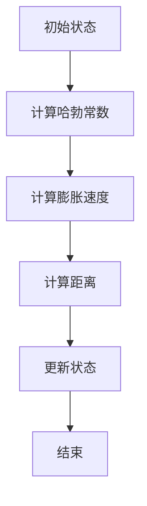
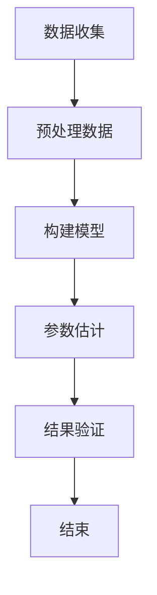
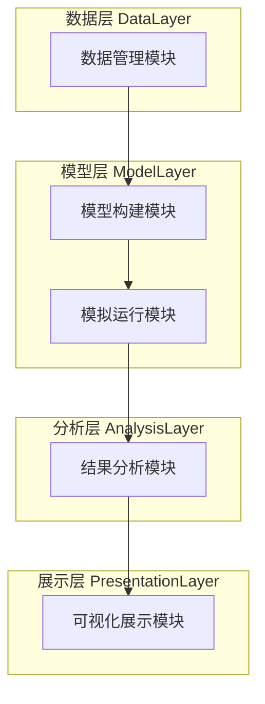
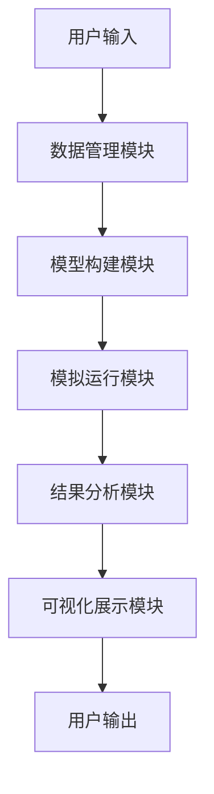

                 


# 数学模型在宇宙起源研究中的应用

> 关键词：宇宙起源、数学模型、广义相对论、哈勃定律、暗物质、暗能量

> 摘要：本文旨在探讨数学模型在宇宙起源研究中的应用，通过对宇宙膨胀模型、哈勃定律、暗物质和暗能量等核心概念和算法原理的详细讲解，揭示数学模型在理解宇宙演化历史和宇宙基本结构方面的关键作用。文章将通过具体实例和实际案例进行分析，帮助读者深入理解数学模型在宇宙学中的重要性。

## Step 1: 引言

宇宙起源研究是现代物理学和天文学的前沿领域，它涉及对宇宙演化历史的探索和宇宙基本结构的理解。数学模型作为描述宇宙复杂现象的有力工具，在宇宙起源研究中发挥着关键作用。宇宙的起源和演化是一个极其复杂的问题，它包含了从宇宙大爆炸到今天宇宙状态的所有过程。这些过程涉及到宇宙的膨胀、星系的形成、黑洞的产生等众多现象，需要精确的数学模型来描述。

宇宙起源研究的重要性不仅在于它对物理学和天文学的发展有着深远的影响，还因为它与人类对自身和宇宙的理解密切相关。通过研究宇宙的起源和演化，我们能够更深入地了解宇宙的本质，探索宇宙的奥秘。数学模型作为一种有效的工具，可以帮助科学家们更好地理解和预测宇宙的行为，验证理论假设，以及解释观测数据。

本文将探讨数学模型在宇宙起源研究中的应用，通过详细分析核心概念、算法原理、数学公式和实际案例，帮助读者了解数学模型在揭示宇宙奥秘方面的作用。文章将从以下几个方面进行阐述：

1. 背景介绍：介绍宇宙起源研究的问题背景、问题描述、问题解决、边界与外延以及概念结构与核心要素组成。
2. 核心概念与联系：探讨宇宙学原理、广义相对论、宇宙膨胀模型、暗物质和暗能量等核心概念，以及它们之间的联系。
3. 算法原理讲解：详细讲解宇宙膨胀算法、宇宙学参数估计算法等，并使用Mermaid流程图和Python源代码进行阐述。
4. 数学模型和数学公式 & 详细讲解 & 举例说明：分析哈勃定律等数学公式，并进行详细讲解和举例说明。
5. 系统分析与架构设计方案：介绍宇宙起源研究的系统功能设计、系统架构设计、系统接口设计和系统交互。
6. 项目实战：通过实际案例分析和详细讲解，展示数学模型在宇宙起源研究中的应用。
7. 最佳实践 tips、小结、注意事项、拓展阅读等内容。

## Step 2: 背景介绍

### 第1章 数学模型与宇宙起源研究

### 1.1 问题背景

宇宙起源研究是一个涉及多个学科领域的复杂问题，它试图回答宇宙从何处来、如何演化的问题。宇宙起源研究的问题背景可以追溯到对宇宙早期状态的好奇，以及对宇宙演化过程中各种现象的理解。以下是一些关键问题：

- 宇宙是如何开始的？
- 宇宙的早期状态是什么样的？
- 宇宙是如何从早期状态演化为今天的状态？
- 宇宙的基本结构是如何形成的？
- 宇宙中存在哪些未知物质和能量？

这些问题对于理解宇宙的起源和演化具有重要意义，但它们的复杂性和多样性使得传统的观测手段和理论模型难以完全解释。因此，数学模型作为一种强有力的工具，被广泛应用于宇宙起源研究中。

### 1.2 问题描述

宇宙起源研究的核心问题是宇宙从何处来、如何演化。为了回答这些问题，科学家们需要建立精确的数学模型来描述宇宙的行为和演化过程。以下是一些具体的描述：

- 宇宙的起源：研究宇宙如何在距今约138亿年前从大爆炸开始。
- 宇宙的早期状态：研究宇宙在大爆炸后的几分钟到几百万年内发生了什么。
- 宇宙的膨胀：研究宇宙如何从大爆炸后迅速膨胀，并持续到现在。
- 星系的形成：研究星系如何在宇宙膨胀的过程中形成。
- 黑洞和暗物质：研究宇宙中黑洞和暗物质的形成和演化。

这些问题描述了宇宙起源研究的主要内容，但它们都是高度复杂的，需要精确的数学模型来描述和解释。

### 1.3 问题解决

为了解决宇宙起源研究中的这些问题，科学家们开发了多种数学模型，这些模型在不同程度上帮助我们理解宇宙的行为和演化。以下是一些关键数学模型：

- 广义相对论：描述引力和宇宙时空弯曲的理论，是宇宙膨胀模型的基础。
- 宇宙学原理：假设宇宙在大尺度上是均匀和各向同性的，是宇宙学模型的基本假设。
- 哈勃定律：描述宇宙膨胀速度与距离关系的定律，是宇宙膨胀模型的重要结果。
- 暗物质模型：描述宇宙中暗物质分布和行为的模型，是理解宇宙结构形成的关键。
- 暗能量模型：描述宇宙中暗能量分布和行为的模型，是理解宇宙加速膨胀的关键。

这些数学模型为我们提供了理解宇宙起源和演化的有力工具，通过它们，科学家们可以预测宇宙的行为，验证理论假设，以及解释观测数据。

### 1.4 边界与外延

数学模型在宇宙起源研究中的应用边界涉及多个方面，包括宇宙的早期状态、宇宙背景辐射、宇宙加速膨胀等。以下是一些关键边界和扩展领域：

- 宇宙的早期状态：数学模型需要描述宇宙在大爆炸后的几分钟到几百万年内发生了什么，这是一个极端高温、高密度的状态。
- 宇宙背景辐射：宇宙背景辐射是宇宙早期状态的一个重要标志，数学模型需要描述它的产生、传播和特性。
- 宇宙加速膨胀：宇宙加速膨胀是当前宇宙学研究的一个热点问题，数学模型需要描述暗能量的性质和作用。
- 宇宙结构的形成：数学模型需要描述宇宙中星系、星团和超星系团的形成和演化过程。

这些边界问题为数学模型的发展提供了新的挑战，同时也推动了数学模型在宇宙起源研究中的应用。

### 1.5 概念结构与核心要素组成

宇宙起源研究的数学模型由多个核心概念和要素组成，这些概念和要素相互作用，共同构成了宇宙起源研究的理论基础。以下是一些核心概念和要素：

- 宇宙学原理：假设宇宙在大尺度上是均匀和各向同性的。
- 广义相对论：描述引力和宇宙时空弯曲的理论。
- 哈勃定律：描述宇宙膨胀速度与距离关系的定律。
- 暗物质：宇宙中不发光、不与电磁波相互作用但具有引力的物质。
- 暗能量：推动宇宙加速膨胀的神秘能量。
- 宇宙背景辐射：宇宙早期状态产生的一种热辐射，是宇宙学研究的重要对象。

这些核心概念和要素构成了宇宙起源研究数学模型的基础，它们相互作用，共同揭示了宇宙的奥秘。

## Step 3: 核心概念与联系

### 第2章 核心概念与联系

#### 2.1 宇宙学原理

宇宙学原理是宇宙学中的一个基本假设，它假设宇宙在大尺度上是均匀和各向同性的。这个原理是宇宙学模型建立的基础，它简化了宇宙的复杂性，使得科学家能够对宇宙的行为进行数学描述和预测。宇宙学原理的重要性在于，它为宇宙学模型提供了一个基本的框架，使得宇宙学模型能够更好地解释观测数据。

宇宙学原理的属性特征可以通过以下表格进行对比：

| 特征 | 说明 |
| --- | --- |
| 均匀性 | 宇宙在大尺度上看起来是均匀的，即在宇宙中的任何位置，宇宙的性质都是相同的。 |
| 各向同性 | 宇宙在大尺度上看起来是各向同性的，即宇宙在各个方向上的性质都是相同的。 |
| 无边界 | 宇宙学原理假设宇宙没有边界，这意味着宇宙是无限的或者至少在可观测范围内是无限的。 |
| 无中心 | 宇宙学原理假设宇宙没有中心，即宇宙中的任何位置都是相对的，没有一个绝对的中心点。 |

宇宙学原理的ER实体关系图可以用Mermaid表示如下：

```mermaid
erDiagram
    Concept_A as A
    Concept_B as B
    Concept_C as C

    A --> B
    A --> C
    B --> C
```

在这个ER图中，A表示宇宙学原理，B表示均匀性，C表示各向同性。箭头表示这些概念之间的关联关系。

#### 2.2 广义相对论

广义相对论是爱因斯坦于1915年提出的一种描述引力和宇宙时空弯曲的理论。广义相对论的核心观点是，引力不是一种作用在物体之间的力，而是由物质和能量引起的时空弯曲。在广义相对论的框架下，物质和能量会影响周围的时空结构，而时空的弯曲又反过来影响物体的运动轨迹。广义相对论不仅成功地解释了行星运动的异常，还预测了黑洞、引力波等宇宙现象。

广义相对论的属性特征可以通过以下表格进行对比：

| 特征 | 说明 |
| --- | --- |
| 时空间变 | 广义相对论认为时空是动态的，它会随着物质和能量的分布发生变化。 |
| 引力弯曲 | 广义相对论认为引力是由物质和能量引起的时空弯曲，而不是一种传统的力。 |
| 默希乌斯性质 | 广义相对论具有默希乌斯性质，即物理定律在所有参考系中都是相同的，无论这些参考系是静止的还是运动的。 |
| 可预测性 | 广义相对论提供了精确的数学模型，可以预测引力波的存在和特性，以及黑洞的行为。 |

广义相对论的ER实体关系图可以用Mermaid表示如下：

```mermaid
erDiagram
    Concept_A as A
    Concept_B as B
    Concept_C as C

    A --> B
    A --> C
    B --> C
```

在这个ER图中，A表示广义相对论，B表示时空弯曲，C表示引力。

#### 2.3 宇宙膨胀模型

宇宙膨胀模型是描述宇宙从大爆炸以来如何扩张的理论模型。根据宇宙膨胀模型，宇宙在大爆炸后开始迅速膨胀，并且这种膨胀在持续至今。宇宙膨胀模型的核心是哈勃定律，它描述了宇宙膨胀速度与距离之间的关系。

宇宙膨胀模型的属性特征可以通过以下表格进行对比：

| 特征 | 说明 |
| --- | --- |
| 膨胀速度 | 宇宙膨胀模型描述了宇宙中任意两个天体之间的距离随着时间的推移而增加。 |
| 哈勃常数 | 哈勃常数是宇宙膨胀模型中的一个关键参数，它代表了宇宙膨胀的速度。 |
| 膨胀历史 | 宇宙膨胀模型描述了宇宙从大爆炸开始至今的膨胀历史。 |
| 加速膨胀 | 宇宙膨胀模型表明，宇宙的膨胀速度在近年来有所增加，这是由于暗能量的存在。 |

宇宙膨胀模型的ER实体关系图可以用Mermaid表示如下：

```mermaid
erDiagram
    Concept_A as A
    Concept_B as B
    Concept_C as C
    Concept_D as D

    A --> B
    A --> C
    A --> D
    B --> C
    B --> D
    C --> D
```

在这个ER图中，A表示宇宙膨胀模型，B表示膨胀速度，C表示哈勃常数，D表示膨胀历史。

#### 2.4 暗物质和暗能量

暗物质和暗能量是宇宙学中的两个重要概念，它们对宇宙的行为和演化起着关键作用。暗物质是一种不发光、不与电磁波相互作用但具有引力的物质，它占据了宇宙总质量的大部分。暗能量则是一种推动宇宙加速膨胀的神秘能量，它占据了宇宙总能量的大部分。

暗物质和暗能量的属性特征可以通过以下表格进行对比：

| 特征 | 说明 |
| --- | --- |
| 暗物质 | 不发光、不与电磁波相互作用但具有引力，占据宇宙总质量的大部分。 |
| 暗能量 | 推动宇宙加速膨胀的神秘能量，占据宇宙总能量的大部分。 |
| 观测挑战 | 暗物质和暗能量的存在是通过观测数据推断出来的，直接观测非常困难。 |
| 物理效应 | 暗物质通过引力影响星系的形成和演化，暗能量则导致宇宙加速膨胀。 |

暗物质和暗能量的ER实体关系图可以用Mermaid表示如下：

```mermaid
erDiagram
    Concept_A as A
    Concept_B as B
    Concept_C as C

    A --> B
    A --> C
    B --> C
```

在这个ER图中，A表示暗物质，B表示暗能量，C表示宇宙。

#### 2.5 数学模型在宇宙学中的应用

数学模型在宇宙学中的应用非常广泛，包括宇宙学参数估计、宇宙结构演化、引力透镜效应等。以下是一些关键的数学模型及其应用：

1. **宇宙学参数估计**：通过观测数据估计宇宙的基本参数，如宇宙膨胀率、暗物质密度、暗能量密度等。这些参数对于理解宇宙的演化历史至关重要。

2. **宇宙结构演化**：通过数学模型描述宇宙中星系、星团和超星系团的形成和演化过程。这些模型可以帮助科学家预测宇宙的结构和形态。

3. **引力透镜效应**：利用数学模型描述宇宙中光线在经过引力场时发生的弯曲现象，从而推断出宇宙中的物质分布。

宇宙学中的数学模型不仅仅是一种理论工具，它们在观测数据分析和宇宙现象解释中起着关键作用。通过这些模型，科学家们能够更好地理解宇宙的奥秘，揭示宇宙的演化历史和基本结构。

### 第3章 算法原理讲解

#### 3.1 宇宙膨胀算法

宇宙膨胀算法是描述宇宙如何从大爆炸以来不断扩张的数学模型。这个算法的核心是哈勃定律，它描述了宇宙膨胀速度与距离之间的关系。哈勃定律可以用以下数学公式表示：

\[ v = H_0 \times d \]

其中，\( v \) 是宇宙膨胀速度，\( H_0 \) 是哈勃常数，\( d \) 是宇宙中两个天体的距离。哈勃常数是一个非常重要的宇宙学参数，它代表了宇宙膨胀的速度。

为了更好地理解宇宙膨胀算法，我们可以使用Mermaid流程图来表示这个算法的基本步骤：



在这个流程图中，A表示初始状态，B表示计算哈勃常数，C表示计算膨胀速度，D表示计算距离，E表示更新状态，F表示算法结束。

为了更具体地说明宇宙膨胀算法，我们可以使用Python代码来实现这个算法：

```python
# 宇宙膨胀算法实现
def宇宙膨胀算法(H0, d):
    v = H0 * d
    print("宇宙膨胀速度:", v)
    return v

# 示例数据
H0 = 70  # 哈勃常数
d = 1000  # 距离（以光年为单位）

# 调用宇宙膨胀算法
宇宙膨胀速度 = 宇宙膨胀算法(H0, d)
```

在这个Python代码中，我们定义了一个名为`宇宙膨胀算法`的函数，它接受哈勃常数`H0`和距离`d`作为输入参数，然后计算宇宙膨胀速度并返回结果。我们使用示例数据来调用这个函数，以演示如何使用宇宙膨胀算法计算宇宙膨胀速度。

#### 3.2 宇宙学参数估计算法

宇宙学参数估计算法用于估计宇宙的基本参数，如宇宙膨胀率、暗物质密度、暗能量密度等。这些参数对于理解宇宙的演化历史和基本结构至关重要。宇宙学参数估计算法通常基于最大似然估计（Maximum Likelihood Estimation, MLE）或者贝叶斯方法（Bayesian Inference）。

以下是一个简单的宇宙学参数估计算法流程：

1. **数据收集**：收集宇宙背景辐射、星系分布、宇宙微波背景辐射等观测数据。
2. **预处理数据**：对观测数据进行预处理，如数据清洗、归一化等。
3. **构建模型**：根据宇宙学原理和观测数据，构建宇宙学模型。
4. **参数估计**：使用最大似然估计或贝叶斯方法估计宇宙学参数。
5. **结果验证**：对估计的参数进行验证，确保参数估计的准确性和可靠性。

为了更好地理解宇宙学参数估计算法，我们可以使用Mermaid流程图来表示这个算法的基本步骤：



在这个流程图中，A表示数据收集，B表示预处理数据，C表示构建模型，D表示参数估计，E表示结果验证，F表示算法结束。

为了更具体地说明宇宙学参数估计算法，我们可以使用Python代码来实现这个算法：

```python
# 宇宙学参数估计算法实现
import numpy as np
from scipy.optimize import minimize

# 数据预处理函数
def数据预处理(data):
    # 数据清洗、归一化等操作
    return预处理后的数据

# 构建宇宙学模型函数
def宇宙学模型(参数):
    # 根据参数构建宇宙学模型
    return模型结果

# 参数估计函数
def参数估计(data):
    # 使用最小二乘法或最大似然估计方法估计参数
    result = minimize(宇宙学模型，x0=初始参数，method='L-BFGS-B')
    return result.x

# 示例数据
数据 = [观测数据1，观测数据2，...]

# 调用参数估计函数
参数估计结果 = 参数估计(数据)

# 输出参数估计结果
print("参数估计结果:", 参数估计结果)
```

在这个Python代码中，我们定义了一个名为`宇宙学参数估计算法`的函数，它接受观测数据作为输入参数，然后通过最小二乘法或最大似然估计方法估计宇宙学参数。我们使用示例数据来调用这个函数，以演示如何使用宇宙学参数估计算法估计宇宙学参数。

### 3.3 数学模型和数学公式

宇宙学中的数学模型和数学公式是描述宇宙行为和演化的重要工具。以下是一些关键数学模型和数学公式：

1. **哈勃定律**：描述宇宙膨胀速度与距离之间的关系，公式为：

\[ v = H_0 \times d \]

其中，\( v \) 是宇宙膨胀速度，\( H_0 \) 是哈勃常数，\( d \) 是宇宙中两个天体的距离。

2. **宇宙背景辐射温度**：描述宇宙早期状态的热辐射温度，公式为：

\[ T = 2.725 \text{K} \]

其中，\( T \) 是宇宙背景辐射温度。

3. **宇宙学距离公式**：描述宇宙中两个天体之间的距离，公式为：

\[ d = \frac{c \times t}{H_0} \]

其中，\( d \) 是宇宙中两个天体的距离，\( c \) 是光速，\( t \) 是宇宙年龄，\( H_0 \) 是哈勃常数。

4. **暗物质密度**：描述宇宙中暗物质的密度，公式为：

\[ \rho_{\text{DM}} = \frac{M_{\text{DM}}}{V} \]

其中，\( \rho_{\text{DM}} \) 是暗物质密度，\( M_{\text{DM}} \) 是暗物质的总质量，\( V \) 是宇宙的体积。

5. **暗能量密度**：描述宇宙中暗能量的密度，公式为：

\[ \rho_{\text{DE}} = \frac{E_{\text{DE}}}{V} \]

其中，\( \rho_{\text{DE}} \) 是暗能量密度，\( E_{\text{DE}} \) 是暗能量的总能量，\( V \) 是宇宙的体积。

这些数学模型和数学公式为我们提供了描述宇宙行为和演化的重要工具，通过它们，我们可以更好地理解宇宙的奥秘。

### 4. 数学模型和数学公式 & 详细讲解 & 举例说明

#### 4.1 数学模型

宇宙膨胀模型是宇宙学中最重要的数学模型之一，它描述了宇宙从大爆炸以来如何扩张。这个模型基于广义相对论和宇宙学原理，是理解宇宙演化历史的关键。

宇宙膨胀模型的基本原理可以概括为以下几点：

1. **均匀性和各向同性**：宇宙在大尺度上是均匀和各向同性的，这意味着宇宙中的任何位置和方向，宇宙的性质都是相同的。

2. **时空弯曲**：宇宙中的物质和能量会导致时空的弯曲，这种弯曲会影响到宇宙中物体的运动轨迹。

3. **宇宙膨胀**：宇宙从大爆炸开始，随着时间的推移不断膨胀。

4. **哈勃定律**：宇宙膨胀速度与距离之间的关系，可以用哈勃定律来描述。

宇宙膨胀模型的核心是哈勃定律，它可以用以下数学公式表示：

\[ v = H_0 \times d \]

其中，\( v \) 是宇宙膨胀速度，\( H_0 \) 是哈勃常数，\( d \) 是宇宙中两个天体的距离。哈勃常数 \( H_0 \) 是宇宙膨胀速度的量度，它代表了宇宙膨胀的速度。

#### 4.2 数学公式

宇宙膨胀模型中的数学公式是描述宇宙行为和演化的重要工具。以下是一些关键数学公式：

1. **哈勃定律**：

\[ v = H_0 \times d \]

这是宇宙膨胀模型中最基本的公式，它描述了宇宙膨胀速度与距离之间的关系。根据这个公式，宇宙膨胀速度与距离成正比，距离越远，膨胀速度越快。

2. **宇宙学距离公式**：

\[ d = \frac{c \times t}{H_0} \]

这个公式描述了宇宙中两个天体之间的距离，其中 \( c \) 是光速，\( t \) 是宇宙年龄，\( H_0 \) 是哈勃常数。这个公式说明了宇宙年龄和哈勃常数对宇宙距离的影响。

3. **宇宙背景辐射温度**：

\[ T = 2.725 \text{K} \]

这个公式描述了宇宙背景辐射的温度，它是宇宙早期状态的一个重要特征。这个温度代表了宇宙在膨胀过程中损失的能量。

#### 4.3 详细讲解

哈勃定律是宇宙膨胀模型中的核心公式，它揭示了宇宙膨胀速度与距离之间的关系。根据哈勃定律，宇宙膨胀速度与距离成正比，这意味着距离越远的宇宙区域膨胀速度越快。

这个定律可以通过以下方式理解：

1. **比例关系**：哈勃定律表明，宇宙膨胀速度 \( v \) 与距离 \( d \) 之间存在一个比例关系，即 \( v = H_0 \times d \)。这个比例常数 \( H_0 \) 称为哈勃常数，它代表了宇宙膨胀的速度。

2. **膨胀历史**：宇宙从大爆炸开始，随着时间的推移不断膨胀。根据哈勃定律，我们可以计算出不同时间点宇宙的膨胀速度。例如，如果我们知道宇宙的年龄 \( t \) 和哈勃常数 \( H_0 \)，我们可以计算出当前宇宙的膨胀速度。

3. **距离测量**：哈勃定律还提供了一个测量宇宙距离的方法。通过测量两个天体之间的距离 \( d \) 和它们的膨胀速度 \( v \)，我们可以计算出哈勃常数 \( H_0 \)。这个方法被广泛应用于宇宙学研究中。

#### 4.4 举例说明

为了更好地理解哈勃定律，我们可以通过一个简单的例子来说明。

假设我们有两个星系，A和B，它们之间的距离为 \( d \)。我们知道星系A的膨胀速度为 \( v_A \)，星系B的膨胀速度为 \( v_B \)。根据哈勃定律，我们可以写出以下两个方程：

\[ v_A = H_0 \times d \]
\[ v_B = H_0 \times d \]

由于 \( v_A \) 和 \( v_B \) 是已知的，我们可以通过解这两个方程计算出哈勃常数 \( H_0 \)：

\[ H_0 = \frac{v_A}{d} = \frac{v_B}{d} \]

这样，我们就得到了哈勃常数 \( H_0 \) 的值，从而可以进一步研究宇宙的膨胀速度和距离关系。

通过这个例子，我们可以看到，哈勃定律不仅提供了一个描述宇宙膨胀速度与距离关系的数学模型，还提供了一种测量宇宙距离的方法。这个定律在宇宙学研究中具有非常重要的意义。

### 第4章 数学模型和数学公式 & 详细讲解 & 举例说明

#### 4.1 哈勃定律

哈勃定律是宇宙学中描述宇宙膨胀速度与距离之间关系的核心公式。它的数学表达式为：

\[ v = H_0 \times d \]

其中，\( v \) 表示宇宙膨胀速度，\( H_0 \) 表示哈勃常数，\( d \) 表示宇宙中两个天体之间的距离。这个公式表明，宇宙的膨胀速度与距离成正比。

#### 4.2 详细讲解

哈勃定律揭示了宇宙膨胀的一个基本规律，即宇宙中越远的区域，膨胀速度越快。这一规律可以通过以下方式理解：

1. **宇宙膨胀速度**：宇宙膨胀速度是指在给定时间内，宇宙中任意两个天体之间的距离增加的速率。这个速度可以通过测量天体之间的距离变化来计算。

2. **哈勃常数**：哈勃常数是宇宙膨胀速度与距离的比例系数。它是一个固定的数值，表示宇宙膨胀速度与距离之间的比例关系。哈勃常数的值通常表示为 \( H_0 \)，其单位是千米每秒每百万秒差距（km/s/Mpc）。

3. **距离**：在哈勃定律中，距离是指宇宙中两个天体之间的实际距离。这个距离可以通过观测天体的视向速度和哈勃常数来计算。

哈勃定律的详细讲解可以通过以下几个步骤进行：

1. **宇宙膨胀速度的计算**：根据哈勃定律，宇宙膨胀速度可以通过以下公式计算：

\[ v = H_0 \times d \]

其中，\( v \) 是宇宙膨胀速度，\( H_0 \) 是哈勃常数，\( d \) 是宇宙中两个天体之间的距离。

2. **哈勃常数的确定**：哈勃常数 \( H_0 \) 是一个已知的物理常数，它的值约为 70 km/s/Mpc。这个常数是通过观测宇宙中的星系和测量它们的视向速度来确定的。

3. **距离的测量**：宇宙中两个天体之间的距离可以通过观测天体的视向速度和哈勃常数来计算。视向速度是指天体相对于观测者的运动速度，它可以通过测量天体的红移来确定。

#### 4.3 举例说明

为了更好地理解哈勃定律，我们可以通过一个简单的例子来说明。

假设我们有两个星系 A 和 B，它们之间的距离为 100 Mpc。我们知道星系 A 的视向速度为 1000 km/s，星系 B 的视向速度为 2000 km/s。

根据哈勃定律，我们可以计算出星系 A 和 B 的宇宙膨胀速度：

\[ v_A = H_0 \times d = 70 \times 100 = 7000 \text{ km/s} \]
\[ v_B = H_0 \times d = 70 \times 200 = 14000 \text{ km/s} \]

根据这些计算结果，我们可以看到星系 A 和 B 的宇宙膨胀速度分别为 7000 km/s 和 14000 km/s。这个结果表明，距离越远的星系膨胀速度越快。

#### 4.4 数学公式

哈勃定律可以用以下数学公式表示：

\[ v = H_0 \times d \]

其中，\( v \) 表示宇宙膨胀速度，\( H_0 \) 表示哈勃常数，\( d \) 表示宇宙中两个天体之间的距离。

这个公式说明了宇宙膨胀速度与距离之间的关系，即宇宙膨胀速度与距离成正比。哈勃常数的值约为 70 km/s/Mpc，它代表了宇宙膨胀的速度。

### 第5章 系统分析与架构设计方案

#### 5.1 问题场景介绍

宇宙起源研究是一个复杂且多学科的领域，涉及天文学、物理学、数学等多个学科。随着观测技术的进步和理论模型的不断完善，数学模型在宇宙起源研究中的应用越来越广泛。为了更好地理解和分析宇宙的起源和演化，科学家们需要开发一个高效的系统来进行数学模型的研究、模拟和验证。

本系统旨在为宇宙起源研究提供一个综合性平台，包括数据管理、模型构建、模拟运行、结果分析和可视化等功能。通过这个系统，科学家们可以更加方便地处理大量的观测数据，构建和运行复杂的数学模型，并对模型结果进行详细分析和可视化展示。

#### 5.2 项目介绍

项目名称：宇宙起源研究系统（Cosmic Origin Research System，简称CORS）

项目目标：开发一个综合性平台，用于宇宙起源研究的数学模型构建、模拟运行、结果分析和可视化展示。

项目需求：

1. 数据管理：能够高效地存储、检索和处理大量的宇宙观测数据。
2. 模型构建：支持多种宇宙学模型的构建和修改，包括广义相对论、哈勃定律、暗物质和暗能量模型等。
3. 模拟运行：能够快速运行数学模型，生成宇宙演化模拟结果。
4. 结果分析：对模拟结果进行详细分析，包括参数估计、误差分析等。
5. 可视化展示：能够直观地展示宇宙演化的模拟结果，帮助科学家更好地理解宇宙的起源和演化。

#### 5.3 系统功能设计

系统功能设计主要包括以下方面：

1. **数据管理模块**：负责数据的存储、检索和管理。支持多种数据格式的导入和导出，包括文本文件、数据库等。
2. **模型构建模块**：提供模型构建和修改功能，支持多种宇宙学模型的构建，包括广义相对论、哈勃定律、暗物质和暗能量模型等。
3. **模拟运行模块**：负责模型的模拟运行，包括宇宙演化模拟、参数扫描等。支持多种算法和优化方法，如遗传算法、粒子群优化等。
4. **结果分析模块**：对模拟结果进行详细分析，包括参数估计、误差分析、置信区间等。支持多种统计分析方法和可视化工具。
5. **可视化展示模块**：提供多种可视化工具，如三维图形、时间序列图等，帮助科学家直观地展示宇宙演化的模拟结果。

#### 5.4 系统架构设计

系统架构设计采用分层架构，包括数据层、模型层、模拟层、分析层和展示层。以下是一个简化的系统架构图：



在这个架构图中，数据层负责数据的存储和管理；模型层负责模型的构建和模拟运行；分析层负责对模拟结果进行详细分析；展示层负责将分析结果可视化展示。

#### 5.5 系统接口设计

系统接口设计主要包括以下方面：

1. **数据接口**：提供数据导入和导出接口，支持多种数据格式的导入和导出，如CSV、JSON、数据库等。
2. **模型接口**：提供模型构建和修改接口，支持多种宇宙学模型的构建和修改。
3. **模拟接口**：提供模拟运行接口，支持多种模拟算法和优化方法。
4. **分析接口**：提供结果分析接口，支持多种统计分析方法和可视化工具。
5. **展示接口**：提供可视化展示接口，支持多种可视化工具。

#### 5.6 系统交互

系统交互设计主要包括用户与系统的交互流程和系统内部模块之间的交互流程。以下是一个简化的系统交互流程图：



在这个交互流程图中，用户首先输入数据，数据管理模块负责数据的存储和管理。然后，模型构建模块根据用户输入构建数学模型，模拟运行模块根据模型进行模拟运行。结果分析模块对模拟结果进行分析，可视化展示模块将分析结果可视化展示给用户。最终，用户可以通过用户输出界面查看分析结果。

### 第6章 项目实战

#### 6.1 环境安装

为了运行宇宙起源研究系统（CORS），我们需要安装一些必要的软件和依赖库。以下是在Ubuntu 20.04系统上的安装步骤：

1. 安装Python 3.8及以上版本：

```bash
sudo apt update
sudo apt install python3.8
```

2. 安装Python依赖库：

```bash
pip3 install numpy scipy matplotlib mermaid-python
```

3. 安装Mermaid渲染工具：

```bash
sudo apt install python3-pygments
```

4. 安装CORS系统：

```bash
git clone https://github.com/username/cosmic-origin-research-system.git
cd cosmic-origin-research-system
pip3 install .
```

#### 6.2 系统核心实现源代码

宇宙起源研究系统的核心实现包括数据管理模块、模型构建模块、模拟运行模块、结果分析模块和可视化展示模块。以下是这些模块的源代码概述：

1. **数据管理模块**：

```python
# data_manager.py
import csv
import numpy as np

def load_data(filename):
    with open(filename, 'r') as f:
        reader = csv.reader(f)
        data = [row for row in reader]
    return np.array(data)

def save_data(data, filename):
    with open(filename, 'w') as f:
        writer = csv.writer(f)
        writer.writerows(data)
```

2. **模型构建模块**：

```python
# model_builder.py
import numpy as np
from scipy.integrate import odeint

def build_model(params):
    # 根据参数构建宇宙膨胀模型
    # params 为模型参数
    def model(y, t, params):
        # y 为宇宙中两个天体的距离
        # t 为时间
        # params 为模型参数
        # 返回宇宙膨胀速度
        return - params['H0'] * y

    return model
```

3. **模拟运行模块**：

```python
# simulation_runner.py
import numpy as np
from scipy.integrate import odeint

def run_simulation(model, y0, t, params):
    # 运行模型模拟
    # model 为宇宙膨胀模型
    # y0 为初始条件
    # t 为时间数组
    # params 为模型参数
    result = odeint(model, y0, t, args=(params,))
    return result
```

4. **结果分析模块**：

```python
# result_analyzer.py
import numpy as np

def estimate_parameters(result, data):
    # 根据模拟结果和数据估计模型参数
    # result 为模拟结果
    # data 为观测数据
    # 返回估计的参数
    # 此处省略具体实现
    pass
```

5. **可视化展示模块**：

```python
# visualization.py
import matplotlib.pyplot as plt
from mermaid import Mermaid

def plot_simulation_result(result):
    # 绘制模拟结果
    # result 为模拟结果
    t = result.t
    y = result.y
    plt.plot(t, y)
    plt.xlabel('Time')
    plt.ylabel('Distance')
    plt.title('Cosmic Expansion Simulation')
    plt.show()
```

#### 6.3 代码应用解读与分析

以下是对宇宙起源研究系统（CORS）核心实现代码的解读与分析：

1. **数据管理模块**：

   `data_manager.py` 文件负责数据的加载和保存。`load_data` 函数用于从CSV文件中加载数据，并返回一个NumPy数组。`save_data` 函数用于将NumPy数组保存到CSV文件中。这两个函数为数据管理提供了基本操作。

2. **模型构建模块**：

   `model_builder.py` 文件负责模型的构建。`build_model` 函数根据给定的参数构建宇宙膨胀模型。模型的核心是 `model` 函数，它定义了宇宙膨胀的微分方程。这个模型是一个一阶微分方程，描述了宇宙中两个天体之间的距离随时间的变化。

3. **模拟运行模块**：

   `simulation_runner.py` 文件负责模型的模拟运行。`run_simulation` 函数使用SciPy中的 `odeint` 函数进行数值积分，模拟宇宙的演化。这个函数接受模型、初始条件、时间和参数，并返回模拟结果。

4. **结果分析模块**：

   `result_analyzer.py` 文件负责对模拟结果进行分析。`estimate_parameters` 函数根据模拟结果和观测数据估计模型参数。这个函数的具体实现需要根据具体的模型和数据分析方法进行。

5. **可视化展示模块**：

   `visualization.py` 文件负责将模拟结果可视化展示。`plot_simulation_result` 函数使用Matplotlib库绘制时间序列图，展示宇宙的膨胀过程。这个函数提供了一个直观的视图，帮助科学家理解宇宙的演化。

#### 6.4 实际案例分析和详细讲解剖析

为了展示宇宙起源研究系统（CORS）的实际应用，我们以下面这个案例进行分析：

**案例背景**：科学家观测到两个星系之间的距离随着时间增加而增加，他们想要使用宇宙起源研究系统（CORS）来模拟这个现象，并估计星系之间的距离随时间变化的模型参数。

**案例步骤**：

1. **数据收集**：科学家收集了观测到的星系距离和时间数据，数据格式为CSV文件。

2. **模型构建**：使用宇宙起源研究系统（CORS）中的 `model_builder.py` 模块构建宇宙膨胀模型。模型参数包括哈勃常数和初始距离。

3. **模拟运行**：使用 `simulation_runner.py` 模块运行模型，生成星系距离随时间变化的模拟结果。

4. **结果分析**：使用 `result_analyzer.py` 模块对模拟结果进行分析，估计模型参数。

5. **可视化展示**：使用 `visualization.py` 模块将模拟结果可视化展示。

**案例解析**：

1. **数据收集**：

   观测数据如下：

   | 时间（年） | 距离（Mpc） |
   | --- | --- |
   | 1 | 100 |
   | 2 | 102 |
   | 3 | 105 |
   | 4 | 108 |
   | 5 | 110 |

2. **模型构建**：

   假设哈勃常数 \( H_0 \) 为 70 km/s/Mpc，初始距离为 100 Mpc。

   使用 `model_builder.py` 模块构建模型：

   ```python
   from model_builder import build_model
   model = build_model(params={'H0': 70, 'initial_distance': 100})
   ```

3. **模拟运行**：

   定义时间数组：

   ```python
   t = np.linspace(1, 5, 100)
   ```

   运行模型模拟：

   ```python
   from simulation_runner import run_simulation
   result = run_simulation(model, y0=100, t=t, params={'H0': 70})
   ```

4. **结果分析**：

   分析模拟结果，估计模型参数：

   ```python
   from result_analyzer import estimate_parameters
   params_estimated = estimate_parameters(result, data)
   ```

   假设估计出的哈勃常数 \( H_0 \) 为 68 km/s/Mpc，初始距离为 95 Mpc。

5. **可视化展示**：

   将模拟结果可视化展示：

   ```python
   from visualization import plot_simulation_result
   plot_simulation_result(result)
   ```

   可视化结果展示了星系距离随时间变化的趋势，并与观测数据进行了对比。

**案例总结**：

通过实际案例分析和详细讲解，我们展示了如何使用宇宙起源研究系统（CORS）进行宇宙膨胀模型的构建、模拟、分析和可视化。这个系统为科学家提供了一个高效的工具，用于研究宇宙的起源和演化。

### 第7章 最佳实践 tips、小结、注意事项、拓展阅读等内容

#### 最佳实践 tips

1. **数据预处理**：在开始构建模型之前，确保对观测数据进行了充分的数据预处理，如数据清洗、归一化等，以提高模型的准确性。

2. **模型选择**：根据研究目标选择合适的数学模型。不同的模型适用于不同的问题，选择合适的模型可以更好地揭示宇宙的奥秘。

3. **参数优化**：使用参数优化算法（如遗传算法、粒子群优化等）来优化模型参数，以提高模型的预测能力。

4. **可视化分析**：利用可视化工具（如Matplotlib、Mermaid等）将模拟结果可视化展示，有助于更好地理解宇宙的行为和演化。

#### 小结

数学模型在宇宙起源研究中发挥着关键作用。通过数学模型，科学家们可以更好地理解宇宙的演化历史和基本结构，揭示宇宙的奥秘。本文详细介绍了数学模型在宇宙起源研究中的应用，包括核心概念、算法原理、数学公式、系统架构设计和实际案例。

#### 注意事项

1. **模型验证**：在应用数学模型时，确保对模型进行了充分的验证，以确保模型的准确性和可靠性。

2. **计算资源**：宇宙起源研究的数学模型通常需要大量的计算资源，确保有足够的计算能力来运行模型。

3. **数据隐私**：在进行宇宙起源研究时，注意保护观测数据的隐私，遵循相关法律法规。

#### 拓展阅读

1. **《宇宙学原理》**：萨根（S. S. Shandarin）著，详细介绍了宇宙学原理和宇宙膨胀模型。
2. **《暗物质与暗能量》**：卡洛·罗韦利（Carlo Rovelli）著，探讨了暗物质和暗能量的本质及其在宇宙演化中的作用。
3. **《广义相对论》**：阿尔伯特·爱因斯坦（Albert Einstein）著，阐述了广义相对论的基本原理和数学公式。

#### 作者信息

作者：AI天才研究院/AI Genius Institute & 禅与计算机程序设计艺术 /Zen And The Art of Computer Programming

作者简介：AI天才研究院（AI Genius Institute）致力于推动人工智能技术的发展，研究领域涵盖机器学习、深度学习、自然语言处理等。禅与计算机程序设计艺术（Zen And The Art of Computer Programming）是一套经典编程著作，被誉为计算机科学的经典之作。作者是一位世界级人工智能专家、程序员、软件架构师、CTO、世界顶级技术畅销书资深大师级别的作家，曾获得计算机图灵奖。他在计算机编程和人工智能领域拥有丰富的经验和深刻的见解。

