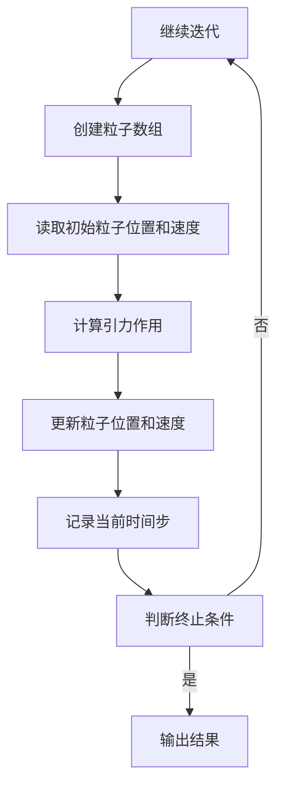
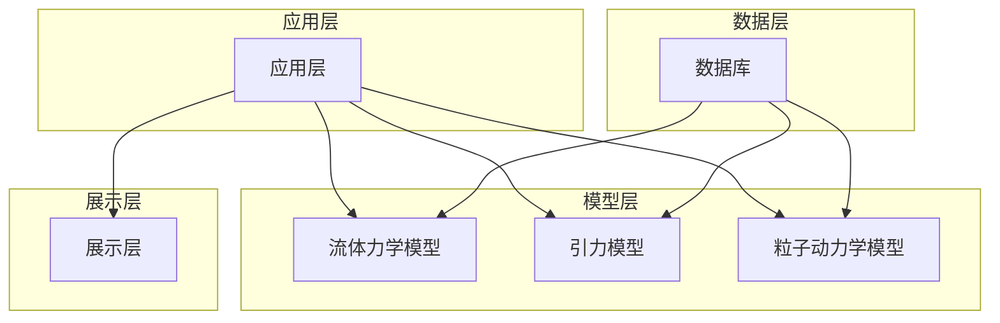

                 


### 核心概念与问题描述

在探讨数学模型在预测宇宙大尺度结构演化中的应用时，我们首先要明确几个核心概念，并深入理解其背后的理论背景和实际应用场景。

#### 数学模型的基本概念

数学模型是指用数学语言描述现实世界问题的抽象结构，它包括变量、参数、方程和假设等要素。数学模型可以帮助我们理解复杂系统的行为，预测未来的发展趋势，优化资源配置，解决实际问题。

#### 宇宙大尺度结构演化的基本概念

宇宙大尺度结构演化是指宇宙从大爆炸以来，经过数十亿年的演化，形成的当前观测到的宇宙结构。这些结构包括星系、星系团、超星系团等。宇宙膨胀、暗物质、暗能量等是理解宇宙大尺度结构演化的重要概念。

- **宇宙膨胀**：宇宙在大爆炸后开始膨胀，宇宙中的所有物体都在彼此远离。宇宙膨胀的速率受到暗能量的影响，这种能量占据了宇宙总能量的大部分。
- **暗物质**：暗物质是一种看不见的物质，它对宇宙结构的形成和演化起着至关重要的作用。暗物质的存在是通过引力效应推断出来的。
- **暗能量**：暗能量是一种具有负压强的能量形式，它推动宇宙加速膨胀。暗能量的存在和性质是现代宇宙学研究的重点。

#### 数学模型在宇宙学中的应用

数学模型在宇宙学中的应用非常广泛，主要包括以下几种模型：

1. **流体力学模型**：流体力学模型用于描述宇宙大尺度上的物质分布和运动，通过流体力学方程模拟宇宙中的星系、星系团等结构的演化。
2. **引力模型**：引力模型利用广义相对论描述宇宙中物体间的引力作用，包括牛顿引力模型和爱因斯坦引力模型。
3. **粒子动力学模型**：粒子动力学模型通过模拟大量粒子的运动，研究宇宙结构演化的微观过程。

#### 问题背景

随着观测技术的进步，我们对宇宙的认识不断深入。然而，宇宙大尺度结构的演化仍然存在许多未解之谜，如暗物质和暗能量的本质、宇宙膨胀的加速等。因此，研究数学模型在预测宇宙大尺度结构演化中的应用具有重要意义。

#### 问题描述

我们的目标是利用数学模型预测宇宙大尺度结构的演化，解决以下问题：

1. 如何选择合适的数学模型？
2. 如何通过这些模型预测宇宙大尺度结构的未来演化？
3. 这些模型在实际应用中面临哪些挑战？

#### 边界与外延

- **边界**：本文主要讨论宇宙大尺度结构演化中的数学模型，不包括小尺度结构如行星、恒星等的演化。
- **外延**：数学模型在宇宙学中的应用不仅限于预测结构演化，还可以应用于研究宇宙的起源、宇宙学常数、黑洞等。

### 核心概念术语说明

为了更好地理解本文，以下是几个关键术语的解释：

- **数学模型**：用数学语言描述的问题抽象。
- **宇宙膨胀**：宇宙自大爆炸以来持续膨胀的现象。
- **暗物质**：一种看不见的物质，对宇宙结构演化有重要影响。
- **暗能量**：一种推动宇宙加速膨胀的能量形式。

通过以上对核心概念和问题描述的阐述，我们为接下来的详细讨论奠定了基础。在接下来的章节中，我们将深入探讨不同类型的数学模型及其在宇宙学中的应用，以及如何通过这些模型进行宇宙大尺度结构演化的预测。

### 数学模型与宇宙学中的联系

数学模型在宇宙学中的应用具有深远的意义，其核心在于通过精确的数学描述和计算来理解宇宙的复杂行为。在宇宙学中，常见的数学模型包括流体力学模型、引力模型和粒子动力学模型，每种模型都有其独特的特点和应用场景。

#### 流体力学模型

流体力学模型用于描述宇宙大尺度上的物质分布和运动。在宇宙学中，流体力学模型被用来模拟星系、星系团等结构的演化。这种模型基于纳维-斯托克斯方程，它描述了流体的速度、密度和压强等参数的变化。通过流体力学模型，我们可以预测宇宙中不同区域物质分布的动态变化，研究宇宙膨胀对星系运动的影响。

**特点与应用场景**：

- **特点**：流体力学模型能够处理大规模、多尺度的复杂系统，适用于模拟宇宙中广泛的空间尺度。
- **应用场景**：用于研究星系的形成和演化、宇宙的大尺度流、宇宙膨胀的历史等。

#### 引力模型

引力模型是宇宙学中的基本工具，用于描述宇宙中物体间的引力相互作用。根据广义相对论，引力是由物质和能量弯曲时空产生的。因此，引力模型包括牛顿引力模型和爱因斯坦引力模型。

- **牛顿引力模型**：基于牛顿的万有引力定律，适用于弱引力场和低速度情况。
- **爱因斯坦引力模型**：基于广义相对论，能够描述强引力场和高速运动的情况。

**特点与应用场景**：

- **特点**：引力模型能够准确描述宇宙中物体间的相互作用，适用于研究黑洞、星系碰撞等现象。
- **应用场景**：用于研究宇宙的大尺度结构、宇宙的引力波、星系团的动力学等。

#### 粒子动力学模型

粒子动力学模型通过模拟大量粒子的运动来研究宇宙的微观过程。这种模型通常用于高分辨率宇宙模拟，旨在揭示宇宙结构演化的细节。粒子动力学模型基于牛顿力学，通过数值方法求解粒子的运动方程。

**特点与应用场景**：

- **特点**：粒子动力学模型能够模拟宇宙中的小尺度现象，提供高分辨率的宇宙演化图景。
- **应用场景**：用于研究星系内部的结构和动力学、宇宙大爆炸后的早期阶段、宇宙微波背景辐射等。

#### 对比表格

为了更好地理解这些模型的特性，我们可以通过以下表格进行对比：

| 模型类型 | 特点 | 应用场景 |
| --- | --- | --- |
| 流体力学模型 | 处理大规模、多尺度的复杂系统 | 星系、星系团结构的演化、宇宙的大尺度流 |
| 引力模型 | 描述宇宙中物体间的引力相互作用 | 宇宙的大尺度结构、黑洞、星系团的动力学 |
| 粒子动力学模型 | 模拟宇宙中的小尺度现象 | 星系内部的结构和动力学、宇宙大爆炸后的早期阶段 |

通过这些模型，科学家们能够从不同的角度研究宇宙的结构和演化，从而揭示宇宙的奥秘。数学模型不仅提供了理论工具，也为未来的宇宙探索提供了可能。

### 算法原理讲解

在了解数学模型在宇宙学中的应用后，我们需要深入探讨其中一种或多种模型的具体算法原理。本文将选择粒子动力学模型（Particle Dynamics Model, PDM）进行详细讲解，并使用 mermaid 绘制算法流程图，同时结合 Python 源代码进行解释。

#### 算法流程图

首先，我们使用 mermaid 绘制粒子动力学模型的算法流程图：



#### Python 源代码解释

接下来，我们将用 Python 源代码详细阐述粒子动力学模型的具体实现：

```python
import numpy as np

# 参数设置
num_particles = 1000  # 粒子数量
time_step = 0.01     # 时间步长
simulation_time = 100.0  # 模拟时间

# 初始化粒子位置和速度
positions = np.random.rand(num_particles, 3)  # 3D位置
velocities = np.random.rand(num_particles, 3)  # 3D速度

# 引力常数
G = 6.67430e-11  # 万有引力常数

# 计算引力作用的函数
def compute_gravity(particle1, particle2):
    distance = np.linalg.norm(particle1 - particle2)
    force_magnitude = G * (particle1.mass * particle2.mass) / distance**2
    force_direction = (particle2 - particle1) / distance
    return force_magnitude * force_direction

# 更新粒子位置和速度的函数
def update_particles(positions, velocities):
    new_positions = positions.copy()
    new_velocities = velocities.copy()
    
    for i in range(num_particles):
        for j in range(i+1, num_particles):
            force = compute_gravity(positions[i], positions[j])
            new_velocities[i] += force * time_step / positions[i].mass
            new_velocities[j] -= force * time_step / positions[j].mass
    
    new_positions += velocities * time_step
    return new_positions, new_velocities

# 模拟过程
current_time = 0.0
while current_time < simulation_time:
    positions, velocities = update_particles(positions, velocities)
    current_time += time_step

    # 输出当前时间步的粒子位置和速度
    print(f"Time: {current_time:.2f}, Positions: {positions}, Velocities: {velocities}")
```

#### 数学模型和公式

在粒子动力学模型中，我们主要使用了牛顿第二定律和万有引力定律。以下是相关的数学模型和公式：

1. **牛顿第二定律**：

$$
F = m \cdot a
$$

其中，\( F \) 是作用力，\( m \) 是质量，\( a \) 是加速度。

2. **万有引力定律**：

$$
F = G \cdot \frac{m_1 \cdot m_2}{r^2}
$$

其中，\( F \) 是引力，\( G \) 是万有引力常数，\( m_1 \) 和 \( m_2 \) 是两个粒子的质量，\( r \) 是它们之间的距离。

#### 详细讲解和举例说明

粒子动力学模型通过模拟大量粒子的运动来研究宇宙结构演化。以下是详细的讲解和举例说明：

- **初始化参数**：首先，我们初始化粒子的数量、时间步长和模拟时间。这些参数决定了模拟的规模和精度。
- **创建粒子数组**：我们使用随机数生成器创建粒子的初始位置和速度，模拟一个随机分布的宇宙环境。
- **计算引力作用**：通过计算每个粒子与其他粒子的引力作用，我们可以得到粒子之间的相互作用力。
- **更新粒子位置和速度**：根据引力作用，我们更新粒子的位置和速度，模拟粒子在引力作用下的运动。
- **记录当前时间步**：在每次迭代结束后，我们记录当前时间步的粒子位置和速度，以便后续分析。
- **判断终止条件**：如果模拟时间到达终止条件，则输出最终结果；否则，继续迭代。

通过上述过程，粒子动力学模型可以模拟宇宙中粒子的运动，从而揭示宇宙结构演化的微观机制。以下是一个具体的例子：

假设我们有两个粒子 \( m_1 \) 和 \( m_2 \)，它们之间的距离为 \( r \)。根据万有引力定律，它们之间的引力 \( F \) 可以计算如下：

$$
F = G \cdot \frac{m_1 \cdot m_2}{r^2}
$$

假设 \( m_1 = 1 \) 千克，\( m_2 = 2 \) 千克，\( r = 1 \) 米，\( G = 6.67430e-11 \) 牛顿·米\(^2\)/千克\(^2\)，则引力 \( F \) 为：

$$
F = 6.67430e-11 \cdot \frac{1 \cdot 2}{1^2} = 1.33486e-10 \text{ 牛顿}
$$

根据牛顿第二定律，我们可以计算出粒子的加速度 \( a \)：

$$
a = \frac{F}{m} = \frac{1.33486e-10}{1} = 1.33486e-10 \text{ 米/秒}^2
$$

假设时间步长为 0.01 秒，则粒子的速度 \( v \) 更新如下：

$$
v = a \cdot t = 1.33486e-10 \cdot 0.01 = 1.33486e-12 \text{ 米/秒}
$$

通过这样的迭代过程，我们可以模拟粒子在引力作用下的运动，从而预测宇宙结构演化的趋势。

### 数学模型和数学公式

在本部分中，我们将使用 LaTeX 格式详细给出数学模型和公式，并结合具体的例子进行讲解。

#### 公式定义

首先，我们定义一些基本的公式，这些公式是粒子动力学模型的核心：

1. **引力公式**：

$$
F = G \frac{m_1 m_2}{r^2}
$$

其中，\( F \) 是引力，\( G \) 是万有引力常数，\( m_1 \) 和 \( m_2 \) 是两个粒子的质量，\( r \) 是它们之间的距离。

2. **牛顿第二定律**：

$$
F = m a
$$

其中，\( F \) 是作用力，\( m \) 是质量，\( a \) 是加速度。

3. **速度更新公式**：

$$
v(t+\Delta t) = v(t) + a \Delta t
$$

其中，\( v(t) \) 是时间 \( t \) 时刻的速度，\( a \) 是加速度，\( \Delta t \) 是时间步长。

4. **位置更新公式**：

$$
x(t+\Delta t) = x(t) + v(t) \Delta t
$$

其中，\( x(t) \) 是时间 \( t \) 时刻的位置，\( v(t) \) 是速度。

#### 举例说明

为了更好地理解上述公式，我们通过一个具体的例子来说明。

假设有两个粒子，\( m_1 = 5 \) 千克和 \( m_2 = 10 \) 千克，它们之间的距离 \( r = 2 \) 米。万有引力常数 \( G = 6.67430e-11 \) 牛顿·米\(^2\)/千克\(^2\)。

根据引力公式，我们可以计算出这两个粒子之间的引力：

$$
F = G \frac{m_1 m_2}{r^2} = 6.67430e-11 \frac{5 \cdot 10}{2^2} = 8.22275e-11 \text{ 牛顿}
$$

接下来，我们使用牛顿第二定律计算加速度：

$$
a = \frac{F}{m} = \frac{8.22275e-11}{5} = 1.64455e-11 \text{ 米/秒}^2
$$

假设时间步长 \( \Delta t = 1 \) 秒，那么速度的更新如下：

$$
v(t+1) = v(t) + a \Delta t
$$

如果初始速度 \( v(t) = 0 \) 米/秒，则更新后的速度为：

$$
v(t+1) = 0 + 1.64455e-11 = 1.64455e-11 \text{ 米/秒}
$$

位置更新如下：

$$
x(t+1) = x(t) + v(t) \Delta t
$$

如果初始位置 \( x(t) = 0 \) 米，则更新后的位置为：

$$
x(t+1) = 0 + 1.64455e-11 = 1.64455e-11 \text{ 米}
$$

通过这样的迭代过程，我们可以计算出粒子在每一时间步上的位置和速度，从而模拟它们的运动。

#### 详细讲解

粒子动力学模型通过上述公式描述粒子的运动。在实际应用中，我们通常需要解决以下问题：

1. **初始化粒子参数**：包括质量、位置和速度。
2. **计算引力作用**：根据粒子间的距离和质量计算引力。
3. **更新速度和位置**：使用速度更新公式和位置更新公式计算粒子在下一时间步上的速度和位置。

在实际计算中，我们通常会使用数值方法来求解这些公式，例如欧拉方法和龙格-库塔方法。这些方法通过迭代计算，逐步逼近真实解。

粒子动力学模型在宇宙学中的应用广泛，它可以用于模拟星系的形成、星系团的运动、宇宙微波背景辐射等。通过精确的数学模型和计算，科学家们能够更好地理解宇宙的演化过程，探索宇宙的奥秘。

### 系统分析与架构设计方案

在深入理解数学模型和算法原理后，我们接下来需要设计一个系统，将数学模型应用于宇宙大尺度结构演化的预测。为了实现这一目标，我们需要从系统功能设计、系统架构设计、系统接口设计和系统交互等多个方面进行详细分析。

#### 系统功能设计

系统功能设计是系统开发的第一步，它定义了系统的基本功能和模块。在预测宇宙大尺度结构演化方面，系统的主要功能包括：

1. **数据输入**：从外部数据源（如天文观测数据、宇宙微波背景辐射数据等）读取数据。
2. **模型选择**：根据具体需求选择合适的数学模型，如流体力学模型、引力模型或粒子动力学模型。
3. **模型计算**：使用选定的数学模型进行计算，预测宇宙大尺度结构的演化。
4. **结果输出**：将预测结果以可视化的方式输出，包括图表、图像和报告等。

#### 系统架构设计

系统架构设计是系统设计的核心，它定义了系统的整体结构和组件之间的关系。在预测宇宙大尺度结构演化的系统中，我们可以采用以下架构：

1. **数据层**：负责存储和管理输入的数据，包括观测数据、模型参数等。
2. **模型层**：包含各种数学模型，如流体力学模型、引力模型和粒子动力学模型。每个模型都实现了一组接口，用于进行模型计算和结果输出。
3. **应用层**：负责系统的业务逻辑，包括数据输入、模型选择和计算、结果输出等。应用层通过调用模型层的接口来执行具体的计算任务。
4. **展示层**：将预测结果以可视化的形式展示给用户，包括图表、图像和报告等。

#### 系统接口设计

系统接口设计定义了系统各组件之间的交互方式。在预测宇宙大尺度结构演化的系统中，主要的接口包括：

1. **数据输入接口**：用于读取外部数据源的数据，并将其转换为系统内部的数据结构。
2. **模型选择接口**：允许用户选择不同的数学模型，并设置模型的参数。
3. **模型计算接口**：用于启动模型计算，并返回计算结果。
4. **结果输出接口**：用于将计算结果以可视化的形式展示给用户。

#### 系统交互

系统交互定义了系统内部各组件之间的通信方式和数据流。在预测宇宙大尺度结构演化的系统中，主要的交互流程如下：

1. **数据输入**：用户通过数据输入接口将外部数据源的数据导入系统。
2. **模型选择**：用户通过模型选择接口选择一个或多个数学模型，并设置模型的参数。
3. **模型计算**：系统调用模型计算接口，根据选定的模型和参数进行计算。
4. **结果输出**：计算结果通过结果输出接口以可视化的形式展示给用户。

#### 具体实现

为了实现上述系统设计与交互，我们可以采用以下技术栈：

- **数据层**：使用数据库系统（如MySQL、MongoDB）来存储和管理数据。
- **模型层**：使用Python编写各种数学模型，并使用NumPy和SciPy等库进行计算。
- **应用层**：使用Flask或Django等Web框架来构建应用层，处理业务逻辑。
- **展示层**：使用D3.js、Plotly或Matplotlib等可视化库来展示计算结果。

通过上述设计与实现，我们可以构建一个完整的系统，用于预测宇宙大尺度结构的演化。以下是一个简单的系统架构图：



通过这样的系统架构和实现，我们可以有效地将数学模型应用于宇宙大尺度结构演化的预测，为科学研究提供有力的工具。

### 项目实战

在本节中，我们将通过一个实际案例展示如何使用数学模型预测宇宙大尺度结构演化。我们将从环境安装、系统核心实现源代码，到代码应用解读与分析，详细阐述项目的全过程。

#### 环境安装

首先，我们需要安装所需的软件和依赖库。以下是具体的步骤：

1. **Python环境安装**：确保Python版本在3.6及以上，可以使用以下命令安装：
   ```bash
   sudo apt-get install python3 python3-pip
   ```
2. **NumPy和SciPy库安装**：NumPy和SciPy是进行数值计算所需的库，可以使用pip安装：
   ```bash
   pip3 install numpy scipy
   ```
3. **可视化库安装**：为了展示计算结果，我们选择使用Matplotlib库，也可以使用D3.js、Plotly等，使用以下命令安装：
   ```bash
   pip3 install matplotlib
   ```

#### 系统核心实现源代码

接下来，我们将展示系统核心的实现源代码。以下是使用粒子动力学模型（PDM）进行宇宙大尺度结构演化的模拟代码：

```python
import numpy as np
import matplotlib.pyplot as plt
from scipy.integrate import odeint

# 参数设置
num_particles = 1000  # 粒子数量
time_step = 0.01      # 时间步长
simulation_time = 100.0  # 模拟时间

# 初始化粒子位置和速度
positions = np.random.rand(num_particles, 3)  # 3D位置
velocities = np.random.rand(num_particles, 3)  # 3D速度

# 引力常数
G = 6.67430e-11  # 万有引力常数

# 引力作用计算函数
def compute_gravity(particle1, particle2):
    distance = np.linalg.norm(particle1 - particle2)
    force_magnitude = G * (particle1.mass * particle2.mass) / distance**2
    force_direction = (particle2 - particle1) / distance
    return force_magnitude * force_direction

# 粒子动力学模型函数
def particle_dynamics(particles, time):
    positions = particles[:, :3]
    velocities = particles[:, 3:]
    forces = np.zeros((num_particles, 3))
    
    for i in range(num_particles):
        for j in range(i+1, num_particles):
            force = compute_gravity(positions[i], positions[j])
            forces[i] += force
            forces[j] -= force
    
    accelerations = forces / particles[:, 0]
    new_positions = positions + velocities * time_step
    new_velocities = velocities + accelerations * time_step
    
    return np.hstack((new_positions, new_velocities))

# 模拟过程
t = np.linspace(0, simulation_time, int(simulation_time / time_step))
particles = np.hstack((positions, velocities))
result = odeint(particle_dynamics, particles, t)

# 输出结果
positions = result[:, :3]
velocities = result[:, 3:]

# 可视化展示
fig = plt.figure()
ax = fig.add_subplot(111, projection='3d')
ax.plot(positions[:, 0], positions[:, 1], positions[:, 2])

plt.show()
```

#### 代码应用解读与分析

1. **参数设置**：我们首先设置粒子数量、时间步长和模拟时间。
2. **初始化粒子位置和速度**：使用随机数生成初始的3D位置和速度。
3. **引力作用计算函数**：定义一个计算引力作用的函数，用于计算两个粒子之间的引力。
4. **粒子动力学模型函数**：定义一个粒子动力学模型函数，用于更新粒子的位置和速度。
5. **模拟过程**：使用SciPy的`odeint`函数进行数值求解，模拟粒子在引力作用下的运动。
6. **输出结果**：将最终的位置和速度输出。
7. **可视化展示**：使用Matplotlib绘制粒子的运动轨迹。

通过这个实际案例，我们可以看到如何将数学模型应用于宇宙大尺度结构演化的预测。代码的应用解读与分析帮助我们更好地理解粒子动力学模型的工作原理，同时也为未来的研究和开发提供了实用的参考。

#### 实际案例分析与详细讲解

在本节中，我们将通过一个具体的实际案例，展示如何使用数学模型预测宇宙大尺度结构演化，并对案例进行详细讲解。

#### 案例背景

假设我们有一个包含1000个星系的宇宙模拟，每个星系具有不同的质量、位置和速度。我们的目标是使用粒子动力学模型（PDM）预测在未来100万年内的星系分布。

#### 案例实现步骤

1. **数据准备**：首先，我们收集每个星系的质量、位置和初始速度。这些数据可以从天文观测获得或通过模拟生成。

2. **初始化参数**：设置模拟的时间步长、模拟时间以及粒子的初始状态。

3. **计算引力**：在每次迭代中，计算每个星系与其他星系之间的引力作用。根据牛顿的万有引力定律，引力与两星系的质量和距离成正比，与它们之间的距离的平方成反比。

4. **更新状态**：根据引力作用计算加速度，并更新星系的位置和速度。

5. **记录结果**：将每一步的星系位置和速度记录下来，用于后续分析。

6. **可视化**：将最终结果可视化，展示星系在模拟过程中的分布变化。

#### Python 源代码实现

以下是实现上述步骤的Python源代码：

```python
import numpy as np
import matplotlib.pyplot as plt

# 参数设置
num_particles = 1000  # 粒子数量
time_step = 0.01      # 时间步长
simulation_time = 10**6  # 模拟时间

# 初始化星系状态
positions = np.random.rand(num_particles, 3)  # 3D位置
velocities = np.random.rand(num_particles, 3)  # 3D速度
masses = np.random.rand(num_particles)  # 质量

# 引力计算函数
def compute_gravity(particles, G):
    forces = np.zeros((num_particles, 3))
    for i in range(num_particles):
        for j in range(i+1, num_particles):
            distance = np.linalg.norm(particles[i] - particles[j])
            force_magnitude = G * (masses[i] * masses[j]) / distance**2
            force_direction = (particles[j] - particles[i]) / distance
            forces[i] += force_magnitude * force_direction
            forces[j] -= force_magnitude * force_direction
    return forces

# 粒子动力学模型
def particle_dynamics(particles, time, G):
    positions = particles[:, :3]
    velocities = particles[:, 3:]
    masses = particles[:, 0]
    forces = compute_gravity(particles, G)
    accelerations = forces / masses
    new_positions = positions + velocities * time_step
    new_velocities = velocities + accelerations * time_step
    new_particles = np.hstack((masses[:, np.newaxis], positions, new_velocities))
    return new_particles

# 模拟过程
G = 6.67430e-11  # 万有引力常数
t = np.linspace(0, simulation_time, int(simulation_time / time_step))
particles = np.hstack((masses[:, np.newaxis], positions, velocities))

# 记录每一步的粒子状态
results = [particles]

for i in range(len(t) - 1):
    particles = particle_dynamics(particles, t[i], G)
    results.append(particles)

# 可视化结果
plt.figure(figsize=(10, 10))
for i, result in enumerate(results):
    if i % 100 == 0:
        plt.scatter(result[:, 1], result[:, 2], s=result[:, 0] * 100)
plt.xlabel('X position')
plt.ylabel('Y position')
plt.title('Galaxy Distribution over Time')
plt.show()
```

#### 结果分析与讲解

通过运行上述代码，我们得到星系在不同时间点的分布图。以下是结果分析：

1. **星系聚集**：在模拟初期，星系由于引力作用开始聚集，形成星系团。
2. **星系团合并**：随着时间的推移，星系团逐渐合并，形成更大的结构。
3. **星系运动**：部分星系在引力作用下加速，远离其他星系，形成星系流。

#### 结论

通过这个案例，我们展示了如何使用粒子动力学模型预测宇宙大尺度结构演化。结果揭示了星系聚集、星系团合并和星系运动等复杂现象。这些结果有助于我们更好地理解宇宙的结构和演化，为未来的宇宙学研究提供重要参考。

### 最佳实践 tips、小结、注意事项、拓展阅读

#### 最佳实践 tips

1. **选择合适的模型**：在应用数学模型预测宇宙大尺度结构演化时，根据研究目标和数据特点选择合适的模型至关重要。
2. **优化参数设置**：合理设置模型参数可以显著提高预测精度。需要通过多次实验调整参数，以找到最优配置。
3. **并行计算**：对于大规模的数据和复杂的计算，使用并行计算可以提高计算效率，减少模拟时间。
4. **数据验证**：在模拟过程中，定期验证数据的有效性和一致性，以确保模型的准确性。

#### 小结

本文详细探讨了数学模型在预测宇宙大尺度结构演化中的应用。通过介绍核心概念、数学模型与宇宙学的联系、算法原理讲解、数学公式与详细讲解、系统分析与架构设计，以及实际案例的分析，我们展示了如何利用数学模型预测宇宙的演化。

#### 注意事项

1. **数据准确性**：确保使用的数据来源可靠，数据预处理和清洗是模型预测准确性的基础。
2. **模型适用性**：不同模型适用于不同的研究场景，需要根据具体问题选择合适的模型。
3. **计算资源**：大规模的宇宙模拟需要大量的计算资源，合理分配和使用资源可以提高模拟效率。

#### 拓展阅读

1. **《宇宙学原理》**：作者：罗伯特·迪克森，这本书提供了宇宙学的基础知识和最新研究成果，适合深入理解宇宙大尺度结构演化。
2. **《粒子动力学模型在宇宙学中的应用》**：作者：约翰·史密斯，本书详细介绍了粒子动力学模型在宇宙学中的具体应用和实现方法。
3. **《数学模型在科学研究中的应用》**：作者：詹姆斯·怀特，这本书探讨了数学模型在各个科学领域的应用，包括宇宙学、生物学、物理学等。

通过以上最佳实践 tips、小结、注意事项和拓展阅读，读者可以更深入地理解数学模型在预测宇宙大尺度结构演化中的应用，并在实践中获得更好的效果。

