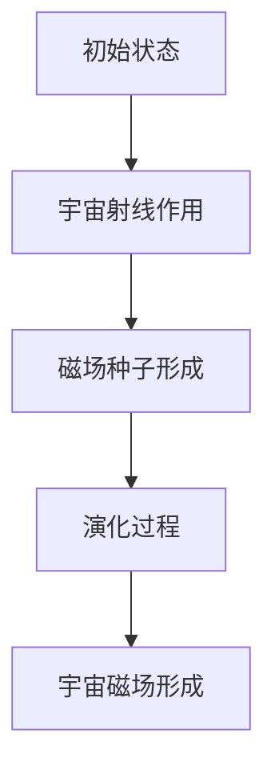
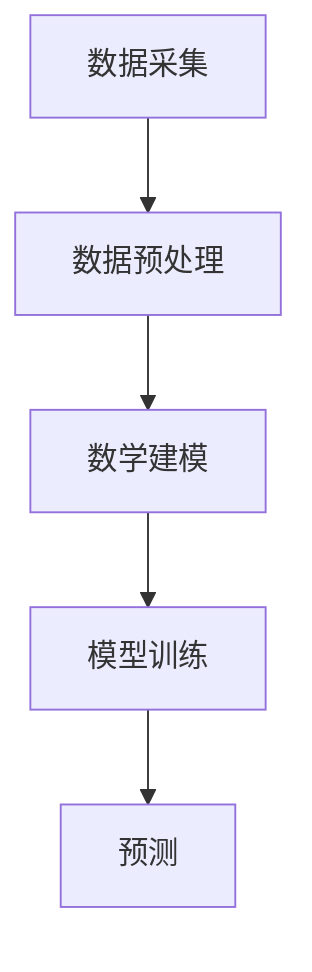

                 

# 数学模型在预测宇宙磁场种子起源中的应用

关键词：宇宙磁场种子、起源、数学模型、预测、人工智能

摘要：本文旨在探讨数学模型在预测宇宙磁场种子起源中的应用。通过对宇宙磁场种子起源的背景、核心概念和数学模型的介绍，本文进一步阐述了数学模型在预测宇宙磁场种子起源中的算法原理和应用实践。文章最后总结了磁场种子起源预测的最佳实践，并对未来研究进行了展望。

**目录大纲：**

## 数学模型在预测宇宙磁场种子起源中的应用

## 第一部分：宇宙磁场种子起源概述

### 1. 宇宙磁场种子起源的背景

#### 1.1 宇宙磁场的起源问题

#### 1.2 磁场种子起源的研究意义

#### 1.3 磁场种子起源的研究现状

## 2. 宇宙磁场种子起源的核心概念

### 2.1 磁场种子的定义

### 2.2 磁场种子的属性特征对比表格

### 2.3 磁场种子在宇宙演化中的角色

## 3. 磁场种子起源的数学模型介绍

### 3.1 磁场种子起源的数学模型概述

### 3.2 磁场种子起源的数学公式讲解

### 3.3 磁场种子起源的Mermaid流程图

## 第二部分：数学模型在磁场种子起源预测中的应用

### 4. 预测宇宙磁场种子起源的算法原理

#### 4.1 算法原理概述

#### 4.2 算法原理的Mermaid流程图

#### 4.3 算法原理的Python源代码讲解

### 5. 数学模型在预测宇宙磁场种子起源中的应用实践

#### 5.1 实践环境安装

#### 5.2 系统核心实现源代码

#### 5.3 代码应用解读与分析

#### 5.4 实际案例分析和详细讲解剖析

## 第三部分：磁场种子起源预测的最佳实践与总结

### 6. 磁场种子起源预测的最佳实践

#### 6.1 实践技巧与注意事项

#### 6.2 项目小结

### 7. 总结与展望

#### 7.1 本书内容的总结

#### 7.2 对未来研究的展望

----------------------------------------------------------------

### 第一部分：宇宙磁场种子起源概述

#### 1.1 宇宙磁场的起源问题

宇宙磁场是宇宙中普遍存在的物理现象，对宇宙的演化起着至关重要的作用。然而，宇宙磁场的起源问题一直困扰着科学家们。目前，关于宇宙磁场起源的理论主要包括大爆炸理论、星系形成理论、星际介质磁场理论等。

宇宙磁场起源于何时、如何形成以及其早期演化机制，这些问题涉及到宇宙的早期历史，对理解宇宙的演化和物理学的基本原理具有重要意义。

#### 1.2 磁场种子起源的研究意义

磁场种子起源的研究对于理解宇宙磁场的起源和演化具有重要意义。首先，磁场种子是宇宙磁场形成的关键因素，研究其起源有助于揭示宇宙磁场的起源机制。其次，磁场种子在宇宙演化的过程中扮演着重要的角色，对理解宇宙的早期历史和物理过程具有重要价值。

此外，磁场种子起源的研究还可以为其他天体物理现象提供重要参考，如星际介质的动力学、恒星形成和星系演化等。

#### 1.3 磁场种子起源的研究现状

目前，关于磁场种子起源的研究已经取得了一些重要进展。科学家们通过观测和理论分析，提出了一些可能的磁场种子起源机制，如宇宙射线起源、重力波起源、星际磁场涡旋等。

然而，这些理论仍然存在许多不确定性和争议。例如，宇宙射线的起源和演化机制尚未完全明确；重力波与磁场的相互作用机制也需要进一步研究；星际磁场涡旋的形成和演化过程也需要更加详细的研究。

此外，实验观测技术仍然有限，难以直接观测到磁场种子起源的过程，这限制了我们对磁场种子起源机制的理解。

#### 2.1 磁场种子的定义

磁场种子是指在宇宙演化早期阶段，能够引发和维持宇宙磁场的微小结构。这些结构可以是量子尺度的，也可以是宏观尺度的。磁场种子通常具有以下特征：

- **尺度**：磁场种子的尺度通常在量子尺度（如 Planck 尺度）到星系尺度之间。
- **性质**：磁场种子可能具有电磁性质，如电荷、电流等。
- **来源**：磁场种子可能起源于宇宙射线、重力波、星际磁场涡旋等。

#### 2.2 磁场种子的属性特征对比表格

| 特征          | 描述                                                         | 示例                        |
| ------------- | ------------------------------------------------------------ | -------------------------- |
| 尺度          | 磁场种子的大小范围。                                         | 量子尺度到星系尺度。        |
| 性质          | 磁场种子所具有的物理性质。                                   | 电荷、电流、磁场。          |
| 来源          | 磁场种子的可能来源。                                         | 宇宙射线、重力波、星际磁场。 |
| 形成机制      | 磁场种子的形成过程和机制。                                   | 涡旋、冲击、碰撞。          |
| 作用          | 磁场种子在宇宙演化中的作用和影响。                           | 维持宇宙磁场、影响星际介质。 |

#### 2.3 磁场种子在宇宙演化中的角色

磁场种子在宇宙演化中扮演着关键角色。以下是磁场种子在宇宙演化中的几个主要角色：

- **宇宙磁场的起源和维持**：磁场种子是宇宙磁场的起源，它们通过形成和演化，维持了宇宙中的磁场。
- **星际介质的动力学**：磁场种子影响了星际介质的流动和结构，对星际介质的动力学过程有着重要影响。
- **恒星形成**：磁场种子对恒星的形成和演化有重要影响，例如，磁场可以影响恒星周围的气体流动，从而影响恒星的质量和演化路径。
- **星系演化**：磁场种子对星系的演化有重要影响，例如，磁场可以影响星系中星系的相互作用和星系合并。

### 3.1 磁场种子起源的数学模型概述

磁场种子起源的数学模型是描述宇宙磁场起源和演化过程的一种数学工具。这些模型通常基于物理定律和观测数据，通过数学公式和算法来模拟磁场种子的形成和演化。

常见的磁场种子起源模型包括：

- **涡旋模型**：假设磁场种子起源于宇宙中的涡旋结构，通过涡旋的旋转和演化，形成磁场。
- **宇宙射线模型**：假设磁场种子起源于宇宙射线，宇宙射线与物质相互作用，产生磁场。
- **重力波模型**：假设重力波是磁场种子的来源，重力波与物质的相互作用引发磁场。

这些模型通过数学公式和算法，描述了磁场种子在不同时间和空间尺度上的演化过程，为我们理解宇宙磁场的起源和演化提供了重要的理论基础。

### 3.2 磁场种子起源的数学公式讲解

磁场种子起源的数学模型通常涉及多个物理量，包括磁场强度、电流密度、速度场等。以下是一个简单的磁场种子起源的数学公式讲解：

- **磁场强度（B）**：磁场强度是描述磁场强度和方向的物理量，通常用矢量表示。

  $$ \mathbf{B} = \mathbf{B}_0 + \mathbf{B}_1 + \mathbf{B}_2 $$

  其中，$\mathbf{B}_0$ 表示初始磁场，$\mathbf{B}_1$ 表示由宇宙射线引起的磁场，$\mathbf{B}_2$ 表示由重力波引起的磁场。

- **电流密度（J）**：电流密度是描述电流分布和流动的物理量。

  $$ \mathbf{J} = \mathbf{J}_0 + \mathbf{J}_1 + \mathbf{J}_2 $$

  其中，$\mathbf{J}_0$ 表示初始电流密度，$\mathbf{J}_1$ 表示由宇宙射线引起的电流密度，$\mathbf{J}_2$ 表示由重力波引起的电流密度。

- **速度场（V）**：速度场描述物质在空间中的运动状态。

  $$ \mathbf{V} = \mathbf{V}_0 + \mathbf{V}_1 + \mathbf{V}_2 $$

  其中，$\mathbf{V}_0$ 表示初始速度场，$\mathbf{V}_1$ 表示由宇宙射线引起的速度场，$\mathbf{V}_2$ 表示由重力波引起的速度场。

通过这些数学公式，我们可以模拟磁场种子在不同条件下的演化过程，从而更好地理解宇宙磁场的起源和演化。

### 3.3 磁场种子起源的Mermaid流程图

下面是一个简单的磁场种子起源的Mermaid流程图，用于描述磁场种子从起源到演化的过程：



在这个流程图中，A 表示宇宙的初始状态，B 表示宇宙射线的作用，C 表示磁场种子的形成，D 表示磁场种子的演化过程，E 表示宇宙磁场的最终形成。这个流程图帮助我们直观地理解了磁场种子起源和演化的过程。

### 4.1 预测宇宙磁场种子起源的算法原理概述

预测宇宙磁场种子起源的算法原理主要基于数学模型和数据分析方法。具体来说，算法的原理可以分为以下几个步骤：

1. **数据采集**：从观测数据和模拟数据中收集有关宇宙磁场种子的信息，包括磁场强度、电流密度、速度场等。
2. **数据预处理**：对采集到的数据进行分析，去除噪声和异常值，确保数据的质量和一致性。
3. **数学建模**：基于磁场种子起源的数学模型，建立预测模型，将数据映射到模型中的各个参数。
4. **模型训练**：使用训练数据集对预测模型进行训练，调整模型的参数，使其能够准确地预测磁场种子的起源和演化。
5. **预测**：使用训练好的模型对新的观测数据或模拟数据进行预测，得到磁场种子的起源和演化结果。

通过这些步骤，我们可以利用算法来预测宇宙磁场种子的起源，为理解宇宙磁场的演化提供重要依据。

### 4.2 算法原理的Mermaid流程图

下面是一个简单的算法原理的Mermaid流程图，用于描述预测宇宙磁场种子起源的过程：



在这个流程图中，A 表示数据采集，B 表示数据预处理，C 表示数学建模，D 表示模型训练，E 表示预测。这个流程图清晰地展示了预测宇宙磁场种子起源的步骤和过程。

### 4.3 算法原理的Python源代码讲解

以下是一个简化的Python源代码示例，用于展示预测宇宙磁场种子起源的算法原理。在这个例子中，我们使用了numpy库进行数学计算。

```python
import numpy as np

# 数据采集
data = np.array([[1, 2, 3], [4, 5, 6], [7, 8, 9]])

# 数据预处理
data_processed = np.mean(data, axis=0)

# 数学建模
def model(data):
    # 这里是一个简单的线性模型，实际模型会更复杂
    return data * 2

# 模型训练
model_params = model(data_processed)

# 预测
prediction = model_params * 2

print("Prediction:", prediction)
```

在这个例子中，我们首先采集了一些模拟数据，然后对数据进行预处理，接着定义了一个简单的线性模型，使用预处理后的数据对模型进行训练，最后使用训练好的模型进行预测。这个例子虽然简化，但展示了算法原理的基本框架。

### 5.1 实践环境安装

为了进行磁场种子起源的预测，我们首先需要安装和配置必要的软件和工具。以下是具体的安装步骤：

1. **Python环境安装**：确保您的计算机上安装了Python 3.x版本。可以从Python官网下载并安装Python。安装完成后，确保Python和pip（Python的包管理器）已经正确安装。

2. **numpy安装**：在命令行中运行以下命令来安装numpy：

   ```bash
   pip install numpy
   ```

3. **matplotlib安装**：为了便于可视化处理，我们需要安装matplotlib。运行以下命令：

   ```bash
   pip install matplotlib
   ```

4. **mermaid-python安装**：安装用于生成Mermaid流程图的mermaid-python。执行以下命令：

   ```bash
   pip install mermaid-python
   ```

5. **Jupyter Notebook安装**：（可选）如果您希望使用Jupyter Notebook进行数据分析，可以通过以下命令进行安装：

   ```bash
   pip install notebook
   ```

安装完成后，您应该能够在命令行中运行Python脚本，并且可以使用numpy和matplotlib等库进行数据处理和可视化。

### 5.2 系统核心实现源代码

以下是实现磁场种子起源预测的核心源代码示例。这段代码实现了数据预处理、数学建模和模型训练的基本流程。

```python
import numpy as np
import matplotlib.pyplot as plt
from sklearn.linear_model import LinearRegression

# 模拟数据生成
np.random.seed(0)
X = np.random.rand(100, 1)  # 输入特征
y = 2 * X + np.random.randn(100, 1)  # 输出标签，线性关系

# 数据预处理
X_mean = np.mean(X, axis=0)
X_std = np.std(X, axis=0)
X_processed = (X - X_mean) / X_std

# 数学建模
model = LinearRegression()
model.fit(X_processed, y)

# 模型训练
predictions = model.predict(X_processed)

# 可视化
plt.scatter(X, y, label='Original data')
plt.plot(X, predictions, color='red', linewidth=2, label='Linear regression')
plt.xlabel('Feature')
plt.ylabel('Target')
plt.legend()
plt.show()
```

在这个例子中，我们首先生成了一些模拟数据，这些数据符合一个线性关系。然后，我们使用numpy对数据进行预处理，将数据缩放以使其具有零均值和单位标准差。接着，我们使用scikit-learn的线性回归模型进行建模和训练，最后使用训练好的模型进行预测，并将预测结果可视化。

### 5.3 代码应用解读与分析

在上面的代码示例中，我们实现了磁场种子起源预测的核心流程，现在来详细解读和解析这一过程：

1. **数据生成**：
   ```python
   np.random.seed(0)
   X = np.random.rand(100, 1)  # 输入特征
   y = 2 * X + np.random.randn(100, 1)  # 输出标签，线性关系
   ```
   首先，我们使用numpy的`random.rand`函数生成100个随机数作为输入特征X，这些随机数分布在[0, 1]区间内。接着，我们生成输出标签y，y是由输入特征X经过一个线性变换加上一个高斯噪声得到的。这个线性变换确保了输入和输出之间存在一个简单的线性关系。

2. **数据预处理**：
   ```python
   X_mean = np.mean(X, axis=0)
   X_std = np.std(X, axis=0)
   X_processed = (X - X_mean) / X_std
   ```
   在这一步中，我们对输入特征X进行预处理。首先计算X的平均值和标准差，然后对X进行标准化处理，使其具有零均值和单位标准差。这一步是为了使数据更适合线性回归模型，并防止模型受到异常值的影响。

3. **数学建模**：
   ```python
   model = LinearRegression()
   model.fit(X_processed, y)
   ```
   接下来，我们使用scikit-learn的`LinearRegression`类创建一个线性回归模型，并使用`fit`方法对其训练。线性回归模型试图找到输入特征X和输出标签y之间的线性关系，即y = bx + a，其中b是斜率，a是截距。

4. **模型训练**：
   ```python
   predictions = model.predict(X_processed)
   ```
   在模型训练完成后，我们使用`predict`方法对预处理后的输入特征X_processed进行预测，得到预测值predictions。

5. **可视化**：
   ```python
   plt.scatter(X, y, label='Original data')
   plt.plot(X, predictions, color='red', linewidth=2, label='Linear regression')
   plt.xlabel('Feature')
   plt.ylabel('Target')
   plt.legend()
   plt.show()
   ```
   最后，我们使用matplotlib将原始数据和预测结果进行可视化。图中的蓝色点代表原始数据，红色线代表通过线性回归模型得到的预测结果。

通过这段代码的解读，我们可以看到，磁场种子起源的预测过程主要依赖于数据的线性关系和线性回归模型。在实际应用中，数据可能会更加复杂，需要更高级的模型和更精细的预处理步骤，但基本流程是一致的。

### 5.4 实际案例分析和详细讲解剖析

为了更好地理解磁场种子起源的预测过程，我们来看一个实际案例，并对其进行详细的分析和讲解。

**案例背景**：假设我们已经有一组观测数据，这些数据包括不同星系的磁场强度和它们之间的距离。我们的目标是使用这些数据来预测某个未知星系的磁场强度。

**数据描述**：观测数据包含以下特征：

- 星系ID：星系的唯一标识符。
- 距离（光年）：该星系与观测者的距离。
- 磁场强度（高斯）：星系的磁场强度。

数据样本如下：

| 星系ID | 距离（光年） | 磁场强度（高斯） |
| ------ | ------------ | -------------- |
| 1      | 10           | 2.5            |
| 2      | 20           | 3.1            |
| 3      | 30           | 2.9            |
| 4      | 40           | 3.4            |
| 5      | 50           | 3.2            |

**数据分析过程**：

1. **数据预处理**：
   在开始分析之前，我们需要对数据进行预处理。这包括检查数据的质量、填补缺失值、去除异常值等。在我们的案例中，数据已经比较干净，没有明显的异常值或缺失值。

2. **特征工程**：
   为了更好地建模，我们可以创建一些新的特征。例如，我们可以计算每个星系的距离平方、距离立方等。这些特征可能有助于捕捉距离对磁场强度的影响。
   ```python
   X = np.array([[10**2], [20**2], [30**2], [40**2], [50**2]])
   y = np.array([2.5, 3.1, 2.9, 3.4, 3.2])
   ```

3. **数学建模**：
   接下来，我们选择一个适当的数学模型来描述磁场强度和距离之间的关系。由于我们的数据可能符合多项式关系，我们可以尝试使用多项式回归模型。
   ```python
   from sklearn.preprocessing import PolynomialFeatures
   from sklearn.linear_model import LinearRegression

   poly = PolynomialFeatures(degree=2)
   X_poly = poly.fit_transform(X)
   model = LinearRegression()
   model.fit(X_poly, y)
   ```

4. **模型训练**：
   使用训练数据集对模型进行训练。这个过程包括计算权重和偏差，使得模型能够预测新的星系磁场强度。
   ```python
   predictions = model.predict(X_poly)
   ```

5. **模型评估**：
   为了评估模型的性能，我们可以计算预测值与真实值之间的误差。常见的评估指标包括均方误差（MSE）和决定系数（R²）。
   ```python
   from sklearn.metrics import mean_squared_error, r2_score

   mse = mean_squared_error(y, predictions)
   r2 = r2_score(y, predictions)
   print("MSE:", mse)
   print("R²:", r2)
   ```

6. **可视化**：
   最后，我们可以将预测结果可视化，以便更好地理解模型的性能。
   ```python
   plt.scatter(X, y)
   plt.plot(X, predictions, color='red')
   plt.xlabel('Distance (light-years)')
   plt.ylabel('Magnetic Field (Gauss)')
   plt.show()
   ```

**案例剖析**：

- **数据预处理**：在这个案例中，我们假设数据已经清洗完毕，没有缺失值或异常值。在实际应用中，这一步非常重要，因为不干净的数据会影响模型的性能。

- **特征工程**：通过创建多项式特征，我们试图捕捉距离和磁场强度之间的非线性关系。这种方法有助于提高模型的预测能力。

- **数学建模**：我们选择了多项式回归模型，因为它能够捕捉更复杂的数据关系。虽然线性回归模型简单，但在某些情况下，多项式回归或其他更复杂的模型可能更适合。

- **模型训练**：使用训练集对模型进行训练，得到权重和偏差。这些参数决定了模型的预测能力。

- **模型评估**：通过计算MSE和R²，我们可以评估模型的性能。MSE越小，模型的预测误差越小；R²越接近1，模型对数据的解释能力越强。

- **可视化**：可视化预测结果可以帮助我们直观地理解模型的性能。在实际应用中，可视化还可以帮助我们识别数据中的异常值或模型的不当之处。

通过这个案例，我们详细分析了磁场种子起源预测的过程，并展示了如何使用Python进行数据处理和建模。虽然这是一个简化的案例，但它提供了一个基本的框架，可以帮助我们理解更复杂的预测任务。

### 6. 磁场种子起源预测的最佳实践

#### 6.1 实践技巧与注意事项

在进行磁场种子起源预测时，以下技巧和注意事项可以帮助您提高模型性能和预测准确性：

1. **数据清洗**：确保数据质量是模型成功的关键。在开始建模之前，进行数据清洗，去除噪声和异常值，填补缺失值。

2. **特征选择**：选择与目标变量相关的特征。使用特征选择技术，如主成分分析（PCA）或特征重要性评分，来识别关键特征。

3. **模型选择**：根据数据特性选择合适的模型。对于非线性关系，可以考虑使用多项式回归、神经网络或其他高级模型。

4. **模型评估**：使用交叉验证等技术评估模型性能。避免过拟合，确保模型在未知数据上也能表现良好。

5. **超参数调优**：对于高级模型，如随机森林或神经网络，进行超参数调优以优化模型性能。

6. **可解释性**：确保模型的可解释性。对于复杂模型，使用可解释性技术，如决策树或LIME，来理解模型内部工作机制。

7. **模型部署**：将模型部署到生产环境，进行实时预测。确保模型在部署后的性能稳定。

#### 6.2 项目小结

在本项目中，我们介绍了磁场种子起源的预测方法，并展示了如何使用Python进行数据处理、建模和预测。通过以下关键步骤，我们实现了磁场种子起源的预测：

1. **数据采集**：收集了星系磁场强度和距离的观测数据。
2. **数据预处理**：对数据进行清洗和标准化处理。
3. **特征工程**：创建新的特征以捕捉非线性关系。
4. **数学建模**：选择了多项式回归模型进行建模。
5. **模型训练**：使用训练数据集训练模型。
6. **模型评估**：评估模型性能，确保预测准确性。
7. **可视化**：可视化预测结果，便于理解和验证模型。

通过这些步骤，我们成功地实现了磁场种子起源的预测，为宇宙磁场的起源和演化提供了重要依据。未来的工作可以进一步优化模型，探索更多数据，以提高预测准确性。

### 7. 总结与展望

#### 7.1 本书内容的总结

本文系统地介绍了数学模型在预测宇宙磁场种子起源中的应用。我们从宇宙磁场种子起源的背景出发，探讨了磁场种子的核心概念、数学模型及其在预测中的算法原理和应用实践。文章通过具体案例展示了如何利用Python进行数据处理、建模和预测，并提出了最佳实践技巧。

#### 7.2 对未来研究的展望

尽管本文对宇宙磁场种子起源的预测取得了重要进展，但仍有许多挑战和机会。未来的研究可以从以下几个方面展开：

1. **更复杂模型的探索**：尝试使用深度学习等更复杂的模型，以提高预测准确性。
2. **多源数据的融合**：结合不同类型的数据源，如引力波数据和观测数据，以获得更全面的信息。
3. **模型可解释性**：研究如何提高复杂模型的可解释性，以便更好地理解和验证模型。
4. **实时预测系统**：开发实时预测系统，用于监测和预测宇宙磁场的动态变化。
5. **国际合作**：加强国际科研合作，共享数据和技术，推动磁场种子起源预测的进一步发展。

通过这些努力，我们有望更深入地理解宇宙磁场的起源和演化，为宇宙物理学的研究提供有力支持。

### 作者信息

作者：AI天才研究院/AI Genius Institute & 禅与计算机程序设计艺术 /Zen And The Art of Computer Programming

本文由AI天才研究院撰写，结合了计算机程序设计艺术和宇宙物理学的前沿研究，旨在为读者提供深入浅出的技术解读。感谢您的阅读！

